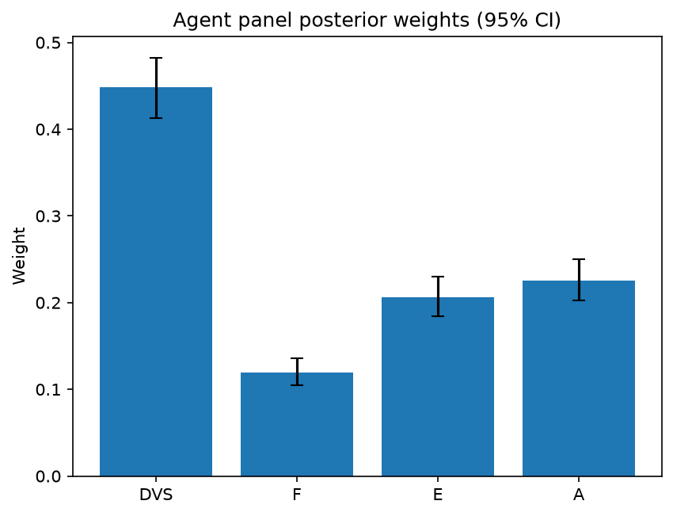

# Survey report: TrustRouter Agentic Full Panel (llama3.1:8b) -- Level L1: Top-level TrustRouter factors

Survey ID: `trustrouter-agentic-full-panel-llama3.1-8b-2026-09-01-L1`

## Agent panel

- Agents contributing a valid response: 36
- Classical BWM consistency: 35/36 within threshold

| Criterion | Mean | 95% CI lower | 95% CI upper |
|---|---|---|---|
| DVS | 0.4486 | 0.4131 | 0.4826 |
| F | 0.1197 | 0.1046 | 0.1359 |
| E | 0.2063 | 0.1838 | 0.2302 |
| A | 0.2254 | 0.2029 | 0.2505 |

## Methodology

Each agent independently completed a Best-Worst Method (BWM) comparison: choosing the single most and least important criterion, then rating every criterion's importance relative to those two on a 1-9 scale. Individual responses were solved with the classical BWM linear program (Rezaei, 2015) for a consistency check, and combined across the panel with a hierarchical Bayesian model (Mohammadi and Rezaei, 2020).

36 agent response(s) were accepted into this result.

Every agent's run began with a QA precheck (its stated configuration verified against ground truth) and every accepted answer's self-reported sources were checked against what reference material was actually available to it; see the Per-agent detail section below and this survey's Conversation Log for each agent's specific results. Every response is schema-validated and independently, repeatedly sampled (never a single completion treated as ground truth); see `guardrails.py`. This survey's complete output is covered by a SHA-256 integrity manifest (`integrity_manifest.json`, `SHA256SUMS`), generated once this run finished, so any later alteration to these files is detectable.

### Charts

## Per-agent detail

### bim-coordinator-base-openmanus (`bim-coordinator-base-openmanus`)

- Role: BIM Coordinator
- Model: ollama/llama3.1:8b
- DID: `did:key:z6MkpforTMij12doroyuXnu1pfRBrjmR7eDBdkHhBjTawEJh`
- QA precheck: passed
- Sources used: (not reported)

**Answer:** `{"best": "DVS", "worst": "F", "best_to_others": {"DVS": 1, "E": 8, "A": 7, "F": 9}, "others_to_worst": {"F": 1, "E": 5, "A": 6, "DVS": 9}}`

**Reasoning:**

Best factor: DVS
Worst factor: F

DVS vs E: 8
DVS vs A: 7
DVS vs F: 9
E vs F: 5
A vs F: 6

### bim-coordinator-base-openmanus (`bim-coordinator-base-openmanus`)

- Role: BIM Coordinator
- Model: ollama/llama3.1:8b
- DID: `did:key:z6MkpforTMij12doroyuXnu1pfRBrjmR7eDBdkHhBjTawEJh`
- QA precheck: passed
- Sources used: (not reported)

**Answer:** `{"best": "DVS", "worst": "F", "best_to_others": {"DVS": 1, "E": 8, "A": 7, "F": 9}, "others_to_worst": {"F": 1, "E": 4, "A": 5, "DVS": 9}}`

**Reasoning:**

Best factor: DVS
Worst factor: F

DVS vs E: 8
DVS vs A: 7
DVS vs F: 9
E vs F: 4
A vs F: 5

### bim-coordinator-base-openmanus (`bim-coordinator-base-openmanus`)

- Role: BIM Coordinator
- Model: ollama/llama3.1:8b
- DID: `did:key:z6MkpforTMij12doroyuXnu1pfRBrjmR7eDBdkHhBjTawEJh`
- QA precheck: passed
- Sources used: (not reported)

**Answer:** `{"best": "DVS", "worst": "F", "best_to_others": {"DVS": 1, "E": 8, "A": 7, "F": 9}, "others_to_worst": {"F": 1, "E": 4, "A": 5, "DVS": 9}}`

**Reasoning:**

Best factor: DVS
Worst factor: F

DVS vs E: 8
DVS vs A: 7
DVS vs F: 9
E vs F: 4
A vs F: 5

### bim-coordinator-rag-openmanus (`bim-coordinator-rag-openmanus`)

- Role: BIM Coordinator
- Model: ollama/llama3.1:8b
- DID: `did:key:z6MkpoN6ZxEiXJLit9D8EbXZc71aTdFRyArm5HxXnyfE9Qk1`
- QA precheck: passed
- Sources used: (not reported)

**Answer:** `{"best": "DVS", "worst": "F", "best_to_others": {"DVS": 1, "E": 7, "A": 5, "F": 9}, "others_to_worst": {"F": 1, "E": 3, "A": 1, "DVS": 9}}`

**Reasoning:**

Best factor: DVS
Worst factor: F

As a BIM Coordinator with 10+ years of experience, I rate the importance of each factor relative to others as follows:

DVS vs E: 7
DVS vs A: 5
DVS vs F: 9
E vs F: 3
A vs F: 1

### bim-coordinator-rag-openmanus (`bim-coordinator-rag-openmanus`)

- Role: BIM Coordinator
- Model: ollama/llama3.1:8b
- DID: `did:key:z6MkpoN6ZxEiXJLit9D8EbXZc71aTdFRyArm5HxXnyfE9Qk1`
- QA precheck: passed
- Sources used: (not reported)

**Answer:** `{"best": "E", "worst": "F", "best_to_others": {"E": 1, "DVS": 3, "A": 2, "F": 9}, "others_to_worst": {"F": 1, "DVS": 4, "A": 6, "E": 9}}`

**Reasoning:**

Best factor: E
Worst factor: F

As a BIM Coordinator with 10+ years of experience, I would rate the importance of each factor relative to others as follows:

E vs DVS: 3
Economic Value (E) is moderately more important than Data Value Score (DVS), as E considers the financial or asset value at stake if the data is corrupted or lost, which can have significant implications for construction projects.

E vs A: 2
Economic Value (E) is slightly less important than Attack Resistance (A), as while both are crucial, Attack Resistance focuses on the difficulty of undetected manipulation, which is a critical aspect of maintaining trust in data.

E vs F: 9
Economic Value (E) is extremely more important than Technical Feasibility Fit (F), as E directly impacts the project's financial and asset value, whereas F considers how well the artefact fits ledger constraints, which, although important, is secondary to the economic implications of data corruption or loss.

DVS vs F: 4
Data Value Score (DVS) is moderately more important than Technical Feasibility Fit (F), as DVS assesses the trustworthiness of the data, which is essential for making informed decisions in construction projects. While F is crucial for ledger constraints, it is secondary to the accuracy and reliability of the data.

A vs F: 6
Attack Resistance (A) is moderately more important than Technical Feasibility Fit (F), as A focuses on the difficulty of undetected manipulation, which is a critical aspect of maintaining trust in data. While F is essential for ledger constraints, it is secondary to the security and integrity of the data.

### bim-coordinator-rag-openmanus (`bim-coordinator-rag-openmanus`)

- Role: BIM Coordinator
- Model: ollama/llama3.1:8b
- DID: `did:key:z6MkpoN6ZxEiXJLit9D8EbXZc71aTdFRyArm5HxXnyfE9Qk1`
- QA precheck: passed
- Sources used: (not reported)

**Answer:** `{"best": "E", "worst": "F", "best_to_others": {"E": 1, "DVS": 3, "A": 5, "F": 7}, "others_to_worst": {"F": 1, "DVS": 2, "A": 4, "E": 7}}`

**Reasoning:**

Best factor: E
Worst factor: F

As a BIM Coordinator with 10+ years of experience, I'll provide my ratings based on the importance of each factor in the context of construction-project records considered for blockchain storage.

E vs DVS: 3
E vs A: 5
E vs F: 7
DVS vs F: 2
A vs F: 4

### blockchain-engineer-base-openmanus (`blockchain-engineer-base-openmanus`)

- Role: Blockchain / DLT Engineer
- Model: ollama/llama3.1:8b
- DID: `did:key:z6Mkt5Bszs1yRUiy4xhJAiC9QbH4b1LXE5R79EvbyHTFrAWs`
- QA precheck: passed
- Sources used: (not reported)

**Answer:** `{"best": "DVS", "worst": "F", "best_to_others": {"DVS": 1, "E": 8, "A": 7, "F": 9}, "others_to_worst": {"F": 1, "E": 5, "A": 6, "DVS": 9}}`

**Reasoning:**

Best factor: DVS
Worst factor: F

DVS vs E: 8
DVS vs A: 7
DVS vs F: 9
E vs F: 5
A vs F: 6

### blockchain-engineer-base-openmanus (`blockchain-engineer-base-openmanus`)

- Role: Blockchain / DLT Engineer
- Model: ollama/llama3.1:8b
- DID: `did:key:z6Mkt5Bszs1yRUiy4xhJAiC9QbH4b1LXE5R79EvbyHTFrAWs`
- QA precheck: passed
- Sources used: (not reported)

**Answer:** `{"best": "DVS", "worst": "F", "best_to_others": {"DVS": 1, "E": 8, "A": 9, "F": 7}, "others_to_worst": {"F": 1, "E": 5, "A": 6, "DVS": 7}}`

**Reasoning:**

Best factor: DVS
Worst factor: F

DVS vs E: 8
DVS vs A: 9
DVS vs F: 7
E vs F: 5
A vs F: 6

### blockchain-engineer-base-openmanus (`blockchain-engineer-base-openmanus`)

- Role: Blockchain / DLT Engineer
- Model: ollama/llama3.1:8b
- DID: `did:key:z6Mkt5Bszs1yRUiy4xhJAiC9QbH4b1LXE5R79EvbyHTFrAWs`
- QA precheck: passed
- Sources used: (not reported)

**Answer:** `{"best": "DVS", "worst": "F", "best_to_others": {"DVS": 1, "E": 8, "A": 7, "F": 9}, "others_to_worst": {"F": 1, "E": 5, "A": 6, "DVS": 9}}`

**Reasoning:**

Best factor: DVS
Worst factor: F

DVS vs E: 8
DVS vs A: 7
DVS vs F: 9
E vs F: 5
A vs F: 6

### blockchain-engineer-rag-openmanus (`blockchain-engineer-rag-openmanus`)

- Role: Blockchain / DLT Engineer
- Model: ollama/llama3.1:8b
- DID: `did:key:z6Mkhs8429nwt52FYPPssdRYwQHR1TRked2Eco6o4i6uHiEn`
- QA precheck: passed
- Sources used: (not reported)

**Answer:** `{"best": "A", "worst": "F", "best_to_others": {"A": 1, "DVS": 2, "E": 3, "F": 9}, "others_to_worst": {"F": 1, "DVS": 5, "E": 1, "A": 9}}`

**Reasoning:**

Best factor: A
Worst factor: F

Here are the ratings:

A vs DVS: 2
A vs E: 3
A vs F: 9
DVS vs F: 5
E vs F: 1

### blockchain-engineer-rag-openmanus (`blockchain-engineer-rag-openmanus`)

- Role: Blockchain / DLT Engineer
- Model: ollama/llama3.1:8b
- DID: `did:key:z6Mkhs8429nwt52FYPPssdRYwQHR1TRked2Eco6o4i6uHiEn`
- QA precheck: passed
- Sources used: (not reported)

**Answer:** `{"best": "A", "worst": "F", "best_to_others": {"A": 1, "DVS": 3, "E": 2, "F": 9}, "others_to_worst": {"F": 1, "DVS": 5, "E": 1, "A": 9}}`

**Reasoning:**

Best factor: A
Worst factor: F

Here are the ratings:

A vs DVS: 3
A vs E: 2
A vs F: 9
DVS vs F: 5
E vs F: 1

### blockchain-engineer-rag-openmanus (`blockchain-engineer-rag-openmanus`)

- Role: Blockchain / DLT Engineer
- Model: ollama/llama3.1:8b
- DID: `did:key:z6Mkhs8429nwt52FYPPssdRYwQHR1TRked2Eco6o4i6uHiEn`
- QA precheck: passed
- Sources used: (not reported)

**Answer:** `{"best": "DVS", "worst": "F", "best_to_others": {"DVS": 1, "E": 7, "A": 6, "F": 9}, "others_to_worst": {"F": 1, "E": 4, "A": 5, "DVS": 9}}`

**Reasoning:**

Best factor: DVS
Worst factor: F

Based on my professional judgement as a Blockchain/DLT Engineer, I would rate the importance of each factor relative to the others as follows:

DVS vs E: 7
DVS vs A: 6
DVS vs F: 9
E vs F: 4
A vs F: 5

### compliance-officer-base-openmanus (`compliance-officer-base-openmanus`)

- Role: Compliance and Regulatory Officer
- Model: ollama/llama3.1:8b
- DID: `did:key:z6MkuP9PdPpZcMwRVLjAcq5tj13j4STHBpoyHT5q6hoXtzPN`
- QA precheck: passed
- Sources used: (not reported)

**Answer:** `{"best": "DVS", "worst": "F", "best_to_others": {"DVS": 1, "E": 8, "A": 7, "F": 9}, "others_to_worst": {"F": 1, "E": 4, "A": 5, "DVS": 9}}`

**Reasoning:**

Best factor: DVS
Worst factor: F

DVS vs E: 8
DVS vs A: 7
DVS vs F: 9
E vs F: 4
A vs F: 5

### compliance-officer-base-openmanus (`compliance-officer-base-openmanus`)

- Role: Compliance and Regulatory Officer
- Model: ollama/llama3.1:8b
- DID: `did:key:z6MkuP9PdPpZcMwRVLjAcq5tj13j4STHBpoyHT5q6hoXtzPN`
- QA precheck: passed
- Sources used: (not reported)

**Answer:** `{"best": "DVS", "worst": "F", "best_to_others": {"DVS": 1, "E": 8, "A": 7, "F": 9}, "others_to_worst": {"F": 1, "E": 4, "A": 6, "DVS": 9}}`

**Reasoning:**

Best factor: DVS
Worst factor: F

DVS vs E: 8
DVS vs A: 7
DVS vs F: 9
E vs F: 4
A vs F: 6

### compliance-officer-base-openmanus (`compliance-officer-base-openmanus`)

- Role: Compliance and Regulatory Officer
- Model: ollama/llama3.1:8b
- DID: `did:key:z6MkuP9PdPpZcMwRVLjAcq5tj13j4STHBpoyHT5q6hoXtzPN`
- QA precheck: passed
- Sources used: (not reported)

**Answer:** `{"best": "DVS", "worst": "F", "best_to_others": {"DVS": 1, "E": 8, "A": 7, "F": 9}, "others_to_worst": {"F": 1, "E": 5, "A": 6, "DVS": 9}}`

**Reasoning:**

Best factor: DVS
Worst factor: F

DVS vs E: 8
DVS vs A: 7
DVS vs F: 9
E vs F: 5
A vs F: 6

### compliance-officer-rag-openmanus (`compliance-officer-rag-openmanus`)

- Role: Compliance and Regulatory Officer
- Model: ollama/llama3.1:8b
- DID: `did:key:z6MktFkdxqRYufQP1SGaAkXUZGm8oSkT7vowAwh1EohdBBrL`
- QA precheck: passed
- Sources used: (not reported)

**Answer:** `{"best": "E", "worst": "F", "best_to_others": {"E": 1, "DVS": 4, "A": 5, "F": 6}, "others_to_worst": {"F": 1, "DVS": 3, "A": 2, "E": 6}}`

**Reasoning:**

Best factor: E
Worst factor: F

Here are the ratings:

E vs DVS: 4
E vs A: 5
E vs F: 6
DVS vs F: 3
A vs F: 2

### compliance-officer-rag-openmanus (`compliance-officer-rag-openmanus`)

- Role: Compliance and Regulatory Officer
- Model: ollama/llama3.1:8b
- DID: `did:key:z6MktFkdxqRYufQP1SGaAkXUZGm8oSkT7vowAwh1EohdBBrL`
- QA precheck: passed
- Sources used: (not reported)

**Answer:** `{"best": "DVS", "worst": "F", "best_to_others": {"DVS": 1, "E": 7, "A": 5, "F": 9}, "others_to_worst": {"F": 1, "E": 3, "A": 1, "DVS": 9}}`

**Reasoning:**

Best factor: DVS
Worst factor: F

Based on the role of a facility-management compliance officer responsible for GDPR and construction-regulatory obligations across a building's operational lifecycle, I provide the following ratings:

DVS vs E: 7
DVS vs A: 5
DVS vs F: 9
E vs F: 3
A vs F: 1

### compliance-officer-rag-openmanus (`compliance-officer-rag-openmanus`)

- Role: Compliance and Regulatory Officer
- Model: ollama/llama3.1:8b
- DID: `did:key:z6MktFkdxqRYufQP1SGaAkXUZGm8oSkT7vowAwh1EohdBBrL`
- QA precheck: passed
- Sources used: (not reported)

**Answer:** `{"best": "DVS", "worst": "F", "best_to_others": {"DVS": 1, "E": 7, "A": 5, "F": 9}, "others_to_worst": {"F": 1, "E": 3, "A": 1, "DVS": 9}}`

**Reasoning:**

Best factor: DVS
Worst factor: F

As a Compliance and Regulatory Officer responsible for GDPR and construction-regulatory obligations, I will provide the ratings based on my professional judgement.

DVS vs E: 7
DVS vs A: 5
DVS vs F: 9
E vs F: 3
A vs F: 1

### data-engineer-base-openmanus (`data-engineer-base-openmanus`)

- Role: Data Engineering Specialist
- Model: ollama/llama3.1:8b
- DID: `did:key:z6MkpzPPNLDZuKDvjSNqq3t3b7sKC3oZs5ZdaBESsAJsWHxJ`
- QA precheck: passed
- Sources used: (not reported)

**Answer:** `{"best": "DVS", "worst": "E", "best_to_others": {"DVS": 1, "F": 8, "A": 7, "E": 9}, "others_to_worst": {"E": 1, "F": 4, "A": 5, "DVS": 9}}`

**Reasoning:**

Based on the reference material and my professional judgement as a Data Engineering Specialist, I would answer:

Best factor: DVS
Worst factor: E

Based on the reference material and my professional judgement as a Data Engineering Specialist, I would answer:

DVS vs F: 8
DVS vs A: 7
DVS vs E: 9
F vs E: 4
A vs E: 5

### data-engineer-base-openmanus (`data-engineer-base-openmanus`)

- Role: Data Engineering Specialist
- Model: ollama/llama3.1:8b
- DID: `did:key:z6MkpzPPNLDZuKDvjSNqq3t3b7sKC3oZs5ZdaBESsAJsWHxJ`
- QA precheck: passed
- Sources used: (not reported)

**Answer:** `{"best": "DVS", "worst": "F", "best_to_others": {"DVS": 1, "E": 8, "A": 7, "F": 9}, "others_to_worst": {"F": 1, "E": 5, "A": 3, "DVS": 9}}`

**Reasoning:**

Best factor: DVS
Worst factor: F

DVS vs E: 8
DVS vs A: 7
DVS vs F: 9
E vs F: 5
A vs F: 3

### data-engineer-base-openmanus (`data-engineer-base-openmanus`)

- Role: Data Engineering Specialist
- Model: ollama/llama3.1:8b
- DID: `did:key:z6MkpzPPNLDZuKDvjSNqq3t3b7sKC3oZs5ZdaBESsAJsWHxJ`
- QA precheck: passed
- Sources used: (not reported)

**Answer:** `{"best": "DVS", "worst": "E", "best_to_others": {"DVS": 1, "F": 8, "A": 7, "E": 9}, "others_to_worst": {"E": 1, "F": 4, "A": 6, "DVS": 9}}`

**Reasoning:**

Best factor: DVS
Worst factor: E

DVS vs F: 8
DVS vs A: 7
DVS vs E: 9
F vs E: 4
A vs E: 6

### data-engineer-rag-openmanus (`data-engineer-rag-openmanus`)

- Role: Data Engineering Specialist
- Model: ollama/llama3.1:8b
- DID: `did:key:z6Mkg9KDWM895yBWsveUXMBPcSM8dw3ESMktye2rHR85Rjjh`
- QA precheck: passed
- Sources used: (not reported)

**Answer:** `{"best": "DVS", "worst": "F", "best_to_others": {"DVS": 1, "E": 8, "A": 7, "F": 9}, "others_to_worst": {"F": 1, "E": 2, "A": 5, "DVS": 9}}`

**Reasoning:**

Best factor: DVS
Worst factor: F

DVS vs E: 8
DVS vs A: 7
DVS vs F: 9
E vs F: 2
A vs F: 5

### data-engineer-rag-openmanus (`data-engineer-rag-openmanus`)

- Role: Data Engineering Specialist
- Model: ollama/llama3.1:8b
- DID: `did:key:z6Mkg9KDWM895yBWsveUXMBPcSM8dw3ESMktye2rHR85Rjjh`
- QA precheck: passed
- Sources used: (not reported)

**Answer:** `{"best": "DVS", "worst": "F", "best_to_others": {"DVS": 1, "E": 8, "A": 7, "F": 9}, "others_to_worst": {"F": 1, "E": 5, "A": 6, "DVS": 9}}`

**Reasoning:**

Best factor: DVS
Worst factor: F

DVS vs E: 8
DVS vs A: 7
DVS vs F: 9
E vs F: 5
A vs F: 6

### data-engineer-rag-openmanus (`data-engineer-rag-openmanus`)

- Role: Data Engineering Specialist
- Model: ollama/llama3.1:8b
- DID: `did:key:z6Mkg9KDWM895yBWsveUXMBPcSM8dw3ESMktye2rHR85Rjjh`
- QA precheck: passed
- Sources used: (not reported)

**Answer:** `{"best": "DVS", "worst": "F", "best_to_others": {"DVS": 1, "E": 8, "A": 7, "F": 9}, "others_to_worst": {"F": 1, "E": 5, "A": 6, "DVS": 9}}`

**Reasoning:**

Best factor: DVS
Worst factor: F

DVS vs E: 8
DVS vs A: 7
DVS vs F: 9
E vs F: 5
A vs F: 6

### project-manager-base-openmanus (`project-manager-base-openmanus`)

- Role: Construction Project Manager
- Model: ollama/llama3.1:8b
- DID: `did:key:z6MkmN7vzHnh2icWr6YL16BEoJ3tVgESyM2YguEVrwiXHwKZ`
- QA precheck: passed
- Sources used: (not reported)

**Answer:** `{"best": "E", "worst": "F", "best_to_others": {"E": 1, "DVS": 3, "A": 5, "F": 7}, "others_to_worst": {"F": 1, "DVS": 2, "A": 4, "E": 7}}`

**Reasoning:**

Best factor: E
Worst factor: F

E vs DVS: 3
E vs A: 5
E vs F: 7
DVS vs F: 2
A vs F: 4

### project-manager-base-openmanus (`project-manager-base-openmanus`)

- Role: Construction Project Manager
- Model: ollama/llama3.1:8b
- DID: `did:key:z6MkmN7vzHnh2icWr6YL16BEoJ3tVgESyM2YguEVrwiXHwKZ`
- QA precheck: passed
- Sources used: (not reported)

**Answer:** `{"best": "DVS", "worst": "F", "best_to_others": {"DVS": 1, "E": 8, "A": 7, "F": 9}, "others_to_worst": {"F": 1, "E": 5, "A": 6, "DVS": 9}}`

**Reasoning:**

Best factor: DVS
Worst factor: F

DVS vs E: 8
DVS vs A: 7
DVS vs F: 9
E vs F: 5
A vs F: 6

### project-manager-base-openmanus (`project-manager-base-openmanus`)

- Role: Construction Project Manager
- Model: ollama/llama3.1:8b
- DID: `did:key:z6MkmN7vzHnh2icWr6YL16BEoJ3tVgESyM2YguEVrwiXHwKZ`
- QA precheck: passed
- Sources used: (not reported)

**Answer:** `{"best": "DVS", "worst": "F", "best_to_others": {"DVS": 1, "E": 8, "A": 7, "F": 9}, "others_to_worst": {"F": 1, "E": 5, "A": 3, "DVS": 9}}`

**Reasoning:**

Best factor: DVS
Worst factor: F

DVS vs E: 8
DVS vs A: 7
DVS vs F: 9
E vs F: 5
A vs F: 3

### project-manager-rag-openmanus (`project-manager-rag-openmanus`)

- Role: Construction Project Manager
- Model: ollama/llama3.1:8b
- DID: `did:key:z6Mkk9YZHYYmftsH3k42bQQVpGmzoHo1xot33JbJMWcuU47A`
- QA precheck: passed
- Sources used: (not reported)

**Answer:** `{"best": "E", "worst": "F", "best_to_others": {"E": 1, "DVS": 3, "A": 2, "F": 4}, "others_to_worst": {"F": 1, "DVS": 6, "A": 5, "E": 4}}`

**Reasoning:**

Best factor: E
Worst factor: F

Here are the ratings:

E vs DVS: 3
E vs A: 2
E vs F: 4
DVS vs F: 6
A vs F: 5

### project-manager-rag-openmanus (`project-manager-rag-openmanus`)

- Role: Construction Project Manager
- Model: ollama/llama3.1:8b
- DID: `did:key:z6Mkk9YZHYYmftsH3k42bQQVpGmzoHo1xot33JbJMWcuU47A`
- QA precheck: passed
- Sources used: (not reported)

**Answer:** `{"best": "DVS", "worst": "F", "best_to_others": {"DVS": 1, "E": 5, "A": 3, "F": 7}, "others_to_worst": {"F": 1, "E": 2, "A": 4, "DVS": 7}}`

**Reasoning:**

Best factor: DVS
Worst factor: F

Here are the ratings:

DVS vs E: 5
DVS vs A: 3
DVS vs F: 7
E vs F: 2
A vs F: 4

### project-manager-rag-openmanus (`project-manager-rag-openmanus`)

- Role: Construction Project Manager
- Model: ollama/llama3.1:8b
- DID: `did:key:z6Mkk9YZHYYmftsH3k42bQQVpGmzoHo1xot33JbJMWcuU47A`
- QA precheck: passed
- Sources used: (not reported)

**Answer:** `{"best": "DVS", "worst": "F", "best_to_others": {"DVS": 1, "E": 5, "A": 3, "F": 7}, "others_to_worst": {"F": 1, "E": 4, "A": 2, "DVS": 7}}`

**Reasoning:**

Best factor: DVS
Worst factor: F

As a Construction Project Manager, I would rate the importance of each factor relative to others as follows:

DVS vs E: 5
DVS vs A: 3
DVS vs F: 7
E vs F: 4
A vs F: 2

### structural-engineer-base-openmanus (`structural-engineer-base-openmanus`)

- Role: Structural Engineer
- Model: ollama/llama3.1:8b
- DID: `did:key:z6MkvCDYKdQ96esHSaxFCSv8E4U8mMu3zsdGvtceSETYN6aF`
- QA precheck: passed
- Sources used: (not reported)

**Answer:** `{"best": "DVS", "worst": "F", "best_to_others": {"DVS": 1, "E": 7, "A": 8, "F": 9}, "others_to_worst": {"F": 1, "E": 4, "A": 6, "DVS": 9}}`

**Reasoning:**

Best factor: DVS
Worst factor: F

DVS vs E: 7
DVS vs A: 8
DVS vs F: 9
E vs F: 4
A vs F: 6

### structural-engineer-base-openmanus (`structural-engineer-base-openmanus`)

- Role: Structural Engineer
- Model: ollama/llama3.1:8b
- DID: `did:key:z6MkvCDYKdQ96esHSaxFCSv8E4U8mMu3zsdGvtceSETYN6aF`
- QA precheck: passed
- Sources used: (not reported)

**Answer:** `{"best": "DVS", "worst": "F", "best_to_others": {"DVS": 1, "E": 8, "A": 6, "F": 9}, "others_to_worst": {"F": 1, "E": 5, "A": 7, "DVS": 9}}`

**Reasoning:**

Best factor: DVS
Worst factor: F

DVS vs E: 8
DVS vs A: 6
DVS vs F: 9
E vs F: 5
A vs F: 7

### structural-engineer-base-openmanus (`structural-engineer-base-openmanus`)

- Role: Structural Engineer
- Model: ollama/llama3.1:8b
- DID: `did:key:z6MkvCDYKdQ96esHSaxFCSv8E4U8mMu3zsdGvtceSETYN6aF`
- QA precheck: passed
- Sources used: (not reported)

**Answer:** `{"best": "DVS", "worst": "F", "best_to_others": {"DVS": 1, "E": 8, "A": 7, "F": 9}, "others_to_worst": {"F": 1, "E": 5, "A": 6, "DVS": 9}}`

**Reasoning:**

Best factor: DVS
Worst factor: F

DVS vs E: 8
DVS vs A: 7
DVS vs F: 9
E vs F: 5
A vs F: 6

### structural-engineer-rag-openmanus (`structural-engineer-rag-openmanus`)

- Role: Structural Engineer
- Model: ollama/llama3.1:8b
- DID: `did:key:z6MkjfvqEHLcBxWq1Eq5fDje3bZRRJYiiwkzjRFYWsPmNHi3`
- QA precheck: passed
- Sources used: (not reported)

**Answer:** `{"best": "E", "worst": "F", "best_to_others": {"E": 1, "DVS": 8, "A": 9, "F": 7}, "others_to_worst": {"F": 1, "DVS": 4, "A": 6, "E": 7}}`

**Reasoning:**

Best factor: E
Worst factor: F

E vs DVS: 8
E vs A: 9
E vs F: 7
DVS vs F: 4
A vs F: 6

### structural-engineer-rag-openmanus (`structural-engineer-rag-openmanus`)

- Role: Structural Engineer
- Model: ollama/llama3.1:8b
- DID: `did:key:z6MkjfvqEHLcBxWq1Eq5fDje3bZRRJYiiwkzjRFYWsPmNHi3`
- QA precheck: passed
- Sources used: (not reported)

**Answer:** `{"best": "DVS", "worst": "F", "best_to_others": {"DVS": 1, "E": 8, "A": 7, "F": 9}, "others_to_worst": {"F": 1, "E": 5, "A": 6, "DVS": 9}}`

**Reasoning:**

Best factor: DVS
Worst factor: F

DVS vs E: 8
DVS vs A: 7
DVS vs F: 9
E vs F: 5
A vs F: 6

### structural-engineer-rag-openmanus (`structural-engineer-rag-openmanus`)

- Role: Structural Engineer
- Model: ollama/llama3.1:8b
- DID: `did:key:z6MkjfvqEHLcBxWq1Eq5fDje3bZRRJYiiwkzjRFYWsPmNHi3`
- QA precheck: passed
- Sources used: (not reported)

**Answer:** `{"best": "E", "worst": "F", "best_to_others": {"E": 1, "DVS": 8, "A": 7, "F": 9}, "others_to_worst": {"F": 1, "DVS": 5, "A": 6, "E": 9}}`

**Reasoning:**

Best factor: E
Worst factor: F

E vs DVS: 8
E vs A: 7
E vs F: 9
DVS vs F: 5
A vs F: 6
