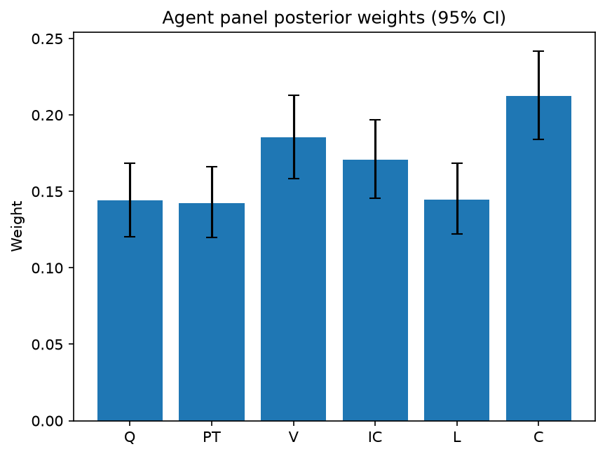

# Survey report: TrustRouter Agentic Full Panel (llama3.1:8b) -- Level L2: Six trust dimensions inside DVS

Survey ID: `trustrouter-agentic-full-panel-llama3.1-8b-2026-09-01-L2`

## Agent panel

- Agents contributing a valid response: 36
- Classical BWM consistency: 36/36 within threshold

| Criterion | Mean | 95% CI lower | 95% CI upper |
|---|---|---|---|
| Q | 0.1442 | 0.1203 | 0.1682 |
| PT | 0.1426 | 0.1199 | 0.1660 |
| V | 0.1855 | 0.1583 | 0.2128 |
| IC | 0.1706 | 0.1457 | 0.1970 |
| L | 0.1448 | 0.1219 | 0.1684 |
| C | 0.2125 | 0.1841 | 0.2420 |

## Methodology

Each agent independently completed a Best-Worst Method (BWM) comparison: choosing the single most and least important criterion, then rating every criterion's importance relative to those two on a 1-9 scale. Individual responses were solved with the classical BWM linear program (Rezaei, 2015) for a consistency check, and combined across the panel with a hierarchical Bayesian model (Mohammadi and Rezaei, 2020).

36 agent response(s) were accepted into this result.

Every agent's run began with a QA precheck (its stated configuration verified against ground truth) and every accepted answer's self-reported sources were checked against what reference material was actually available to it; see the Per-agent detail section below and this survey's Conversation Log for each agent's specific results. Every response is schema-validated and independently, repeatedly sampled (never a single completion treated as ground truth); see `guardrails.py`. This survey's complete output is covered by a SHA-256 integrity manifest (`integrity_manifest.json`, `SHA256SUMS`), generated once this run finished, so any later alteration to these files is detectable.

### Charts

## Per-agent detail

### bim-coordinator-base-openmanus (`bim-coordinator-base-openmanus`)

- Role: BIM Coordinator
- Model: ollama/llama3.1:8b
- DID: `did:key:z6MkpforTMij12doroyuXnu1pfRBrjmR7eDBdkHhBjTawEJh`
- QA precheck: passed
- Sources used: (not reported)

**Answer:** `{"best": "C", "worst": "PT", "best_to_others": {"C": 1, "Q": 9, "V": 8, "IC": 7, "L": 6, "PT": 5}, "others_to_worst": {"PT": 1, "Q": 1, "V": 2, "IC": 3, "L": 4, "C": 5}}`

**Reasoning:**

Best factor: C
Worst factor: PT

C vs Q: 9
C vs V: 8
C vs IC: 7
C vs L: 6
C vs PT: 5
Q vs PT: 1
V vs PT: 2
IC vs PT: 3
L vs PT: 4

### bim-coordinator-base-openmanus (`bim-coordinator-base-openmanus`)

- Role: BIM Coordinator
- Model: ollama/llama3.1:8b
- DID: `did:key:z6MkpforTMij12doroyuXnu1pfRBrjmR7eDBdkHhBjTawEJh`
- QA precheck: passed
- Sources used: (not reported)

**Answer:** `{"best": "C", "worst": "PT", "best_to_others": {"C": 1, "Q": 8, "V": 7, "IC": 6, "L": 5, "PT": 9}, "others_to_worst": {"PT": 1, "Q": 3, "V": 4, "IC": 2, "L": 1, "C": 9}}`

**Reasoning:**

Best factor: C
Worst factor: PT

C vs Q: 8
C vs V: 7
C vs IC: 6
C vs L: 5
C vs PT: 9
Q vs PT: 3
V vs PT: 4
IC vs PT: 2
L vs PT: 1

### bim-coordinator-base-openmanus (`bim-coordinator-base-openmanus`)

- Role: BIM Coordinator
- Model: ollama/llama3.1:8b
- DID: `did:key:z6MkpforTMij12doroyuXnu1pfRBrjmR7eDBdkHhBjTawEJh`
- QA precheck: passed
- Sources used: (not reported)

**Answer:** `{"best": "C", "worst": "PT", "best_to_others": {"C": 1, "Q": 8, "V": 7, "IC": 6, "L": 5, "PT": 9}, "others_to_worst": {"PT": 1, "Q": 4, "V": 3, "IC": 2, "L": 1, "C": 9}}`

**Reasoning:**

Best factor: C
Worst factor: PT

C vs Q: 8
C vs V: 7
C vs IC: 6
C vs L: 5
C vs PT: 9
Q vs PT: 4
V vs PT: 3
IC vs PT: 2
L vs PT: 1

### bim-coordinator-rag-openmanus (`bim-coordinator-rag-openmanus`)

- Role: BIM Coordinator
- Model: ollama/llama3.1:8b
- DID: `did:key:z6MkpoN6ZxEiXJLit9D8EbXZc71aTdFRyArm5HxXnyfE9Qk1`
- QA precheck: passed
- Sources used: (not reported)

**Answer:** `{"best": "PT", "worst": "C", "best_to_others": {"PT": 1, "Q": 3, "V": 2, "IC": 1, "L": 4, "C": 9}, "others_to_worst": {"C": 1, "Q": 5, "V": 6, "IC": 7, "L": 8, "PT": 9}}`

**Reasoning:**

Best factor: PT
Worst factor: C

Here are the ratings:

PT vs Q: 3
PT vs V: 2
PT vs IC: 1
PT vs L: 4
PT vs C: 9
Q vs C: 5
V vs C: 6
IC vs C: 7
L vs C: 8

### bim-coordinator-rag-openmanus (`bim-coordinator-rag-openmanus`)

- Role: BIM Coordinator
- Model: ollama/llama3.1:8b
- DID: `did:key:z6MkpoN6ZxEiXJLit9D8EbXZc71aTdFRyArm5HxXnyfE9Qk1`
- QA precheck: passed
- Sources used: (not reported)

**Answer:** `{"best": "PT", "worst": "C", "best_to_others": {"PT": 1, "Q": 3, "V": 2, "IC": 1, "L": 4, "C": 9}, "others_to_worst": {"C": 1, "Q": 8, "V": 7, "IC": 6, "L": 5, "PT": 9}}`

**Reasoning:**

Best factor: PT
Worst factor: C

Here are the ratings:

PT vs Q: 3
PT vs V: 2
PT vs IC: 1
PT vs L: 4
PT vs C: 9
Q vs C: 8
V vs C: 7
IC vs C: 6
L vs C: 5

### bim-coordinator-rag-openmanus (`bim-coordinator-rag-openmanus`)

- Role: BIM Coordinator
- Model: ollama/llama3.1:8b
- DID: `did:key:z6MkpoN6ZxEiXJLit9D8EbXZc71aTdFRyArm5HxXnyfE9Qk1`
- QA precheck: passed
- Sources used: (not reported)

**Answer:** `{"best": "PT", "worst": "C", "best_to_others": {"PT": 1, "Q": 3, "V": 2, "IC": 1, "L": 4, "C": 9}, "others_to_worst": {"C": 1, "Q": 5, "V": 7, "IC": 6, "L": 8, "PT": 9}}`

**Reasoning:**

Best factor: PT
Worst factor: C

Here are the ratings:

PT vs Q: 3
PT vs V: 2
PT vs IC: 1
PT vs L: 4
PT vs C: 9
Q vs C: 5
V vs C: 7
IC vs C: 6
L vs C: 8

### blockchain-engineer-base-openmanus (`blockchain-engineer-base-openmanus`)

- Role: Blockchain / DLT Engineer
- Model: ollama/llama3.1:8b
- DID: `did:key:z6Mkt5Bszs1yRUiy4xhJAiC9QbH4b1LXE5R79EvbyHTFrAWs`
- QA precheck: passed
- Sources used: (not reported)

**Answer:** `{"best": "V", "worst": "L", "best_to_others": {"V": 1, "Q": 8, "PT": 9, "IC": 7, "C": 6, "L": 9}, "others_to_worst": {"L": 1, "Q": 4, "PT": 5, "IC": 3, "C": 2, "V": 9}}`

**Reasoning:**

Best factor: V
Worst factor: L

V vs Q: 8
V vs PT: 9
V vs IC: 7
V vs C: 6
V vs L: 9
Q vs L: 4
PT vs L: 5
IC vs L: 3
C vs L: 2

### blockchain-engineer-base-openmanus (`blockchain-engineer-base-openmanus`)

- Role: Blockchain / DLT Engineer
- Model: ollama/llama3.1:8b
- DID: `did:key:z6Mkt5Bszs1yRUiy4xhJAiC9QbH4b1LXE5R79EvbyHTFrAWs`
- QA precheck: passed
- Sources used: (not reported)

**Answer:** `{"best": "V", "worst": "L", "best_to_others": {"V": 1, "Q": 8, "PT": 9, "IC": 7, "C": 6, "L": 9}, "others_to_worst": {"L": 1, "Q": 4, "PT": 5, "IC": 3, "C": 2, "V": 9}}`

**Reasoning:**

Best factor: V
Worst factor: L

V vs Q: 8
V vs PT: 9
V vs IC: 7
V vs C: 6
V vs L: 9
Q vs L: 4
PT vs L: 5
IC vs L: 3
C vs L: 2

### blockchain-engineer-base-openmanus (`blockchain-engineer-base-openmanus`)

- Role: Blockchain / DLT Engineer
- Model: ollama/llama3.1:8b
- DID: `did:key:z6Mkt5Bszs1yRUiy4xhJAiC9QbH4b1LXE5R79EvbyHTFrAWs`
- QA precheck: passed
- Sources used: (not reported)

**Answer:** `{"best": "V", "worst": "L", "best_to_others": {"V": 1, "Q": 8, "PT": 9, "IC": 7, "C": 6, "L": 5}, "others_to_worst": {"L": 1, "Q": 2, "PT": 3, "IC": 4, "C": 1, "V": 5}}`

**Reasoning:**

Best factor: V
Worst factor: L

V vs Q: 8
V vs PT: 9
V vs IC: 7
V vs C: 6
V vs L: 5
Q vs L: 2
PT vs L: 3
IC vs L: 4
C vs L: 1

### blockchain-engineer-rag-openmanus (`blockchain-engineer-rag-openmanus`)

- Role: Blockchain / DLT Engineer
- Model: ollama/llama3.1:8b
- DID: `did:key:z6Mkhs8429nwt52FYPPssdRYwQHR1TRked2Eco6o4i6uHiEn`
- QA precheck: passed
- Sources used: (not reported)

**Answer:** `{"best": "V", "worst": "L", "best_to_others": {"V": 1, "Q": 8, "PT": 7, "IC": 6, "C": 5, "L": 9}, "others_to_worst": {"L": 1, "Q": 3, "PT": 4, "IC": 2, "C": 1, "V": 9}}`

**Reasoning:**

Best factor: V
Worst factor: L

Here are the ratings:

V vs Q: 8
V vs PT: 7
V vs IC: 6
V vs C: 5
V vs L: 9
Q vs L: 3
PT vs L: 4
IC vs L: 2
C vs L: 1

### blockchain-engineer-rag-openmanus (`blockchain-engineer-rag-openmanus`)

- Role: Blockchain / DLT Engineer
- Model: ollama/llama3.1:8b
- DID: `did:key:z6Mkhs8429nwt52FYPPssdRYwQHR1TRked2Eco6o4i6uHiEn`
- QA precheck: passed
- Sources used: (not reported)

**Answer:** `{"best": "V", "worst": "L", "best_to_others": {"V": 1, "Q": 7, "PT": 5, "IC": 3, "C": 2, "L": 9}, "others_to_worst": {"L": 1, "Q": 4, "PT": 6, "IC": 8, "C": 1, "V": 9}}`

**Reasoning:**

Best factor: V
Worst factor: L

Here are the ratings:

V vs Q: 7
V vs PT: 5
V vs IC: 3
V vs C: 2
V vs L: 9
Q vs L: 4
PT vs L: 6
IC vs L: 8
C vs L: 1

### blockchain-engineer-rag-openmanus (`blockchain-engineer-rag-openmanus`)

- Role: Blockchain / DLT Engineer
- Model: ollama/llama3.1:8b
- DID: `did:key:z6Mkhs8429nwt52FYPPssdRYwQHR1TRked2Eco6o4i6uHiEn`
- QA precheck: passed
- Sources used: (not reported)

**Answer:** `{"best": "V", "worst": "L", "best_to_others": {"V": 1, "Q": 3, "PT": 2, "IC": 1, "C": 4, "L": 6}, "others_to_worst": {"L": 1, "Q": 5, "PT": 7, "IC": 8, "C": 9, "V": 6}}`

**Reasoning:**

Best factor: V
Worst factor: L

Here are the ratings:

V vs Q: 3
V vs PT: 2
V vs IC: 1
V vs C: 4
V vs L: 6
Q vs L: 5
PT vs L: 7
IC vs L: 8
C vs L: 9

### compliance-officer-base-openmanus (`compliance-officer-base-openmanus`)

- Role: Compliance and Regulatory Officer
- Model: ollama/llama3.1:8b
- DID: `did:key:z6MkuP9PdPpZcMwRVLjAcq5tj13j4STHBpoyHT5q6hoXtzPN`
- QA precheck: passed
- Sources used: (not reported)

**Answer:** `{"best": "C", "worst": "PT", "best_to_others": {"C": 1, "Q": 8, "V": 7, "IC": 6, "L": 5, "PT": 9}, "others_to_worst": {"PT": 1, "Q": 2, "V": 3, "IC": 4, "L": 1, "C": 9}}`

**Reasoning:**

Best factor: C
Worst factor: PT

C vs Q: 8
C vs V: 7
C vs IC: 6
C vs L: 5
C vs PT: 9
Q vs PT: 2
V vs PT: 3
IC vs PT: 4
L vs PT: 1

### compliance-officer-base-openmanus (`compliance-officer-base-openmanus`)

- Role: Compliance and Regulatory Officer
- Model: ollama/llama3.1:8b
- DID: `did:key:z6MkuP9PdPpZcMwRVLjAcq5tj13j4STHBpoyHT5q6hoXtzPN`
- QA precheck: passed
- Sources used: (not reported)

**Answer:** `{"best": "C", "worst": "PT", "best_to_others": {"C": 1, "Q": 8, "V": 7, "IC": 6, "L": 9, "PT": 5}, "others_to_worst": {"PT": 1, "Q": 3, "V": 4, "IC": 2, "L": 1, "C": 5}}`

**Reasoning:**

Best factor: C
Worst factor: PT

C vs Q: 8
C vs V: 7
C vs IC: 6
C vs L: 9
C vs PT: 5
Q vs PT: 3
V vs PT: 4
IC vs PT: 2
L vs PT: 1

### compliance-officer-base-openmanus (`compliance-officer-base-openmanus`)

- Role: Compliance and Regulatory Officer
- Model: ollama/llama3.1:8b
- DID: `did:key:z6MkuP9PdPpZcMwRVLjAcq5tj13j4STHBpoyHT5q6hoXtzPN`
- QA precheck: passed
- Sources used: (not reported)

**Answer:** `{"best": "C", "worst": "PT", "best_to_others": {"C": 1, "Q": 8, "V": 7, "IC": 6, "L": 5, "PT": 9}, "others_to_worst": {"PT": 1, "Q": 3, "V": 2, "IC": 4, "L": 1, "C": 9}}`

**Reasoning:**

Best factor: C
Worst factor: PT

C vs Q: 8
C vs V: 7
C vs IC: 6
C vs L: 5
C vs PT: 9
Q vs PT: 3
V vs PT: 2
IC vs PT: 4
L vs PT: 1

### compliance-officer-rag-openmanus (`compliance-officer-rag-openmanus`)

- Role: Compliance and Regulatory Officer
- Model: ollama/llama3.1:8b
- DID: `did:key:z6MktFkdxqRYufQP1SGaAkXUZGm8oSkT7vowAwh1EohdBBrL`
- QA precheck: passed
- Sources used: (not reported)

**Answer:** `{"best": "L", "worst": "PT", "best_to_others": {"L": 1, "Q": 8, "V": 9, "IC": 7, "C": 6, "PT": 9}, "others_to_worst": {"PT": 1, "Q": 4, "V": 5, "IC": 3, "C": 2, "L": 9}}`

**Reasoning:**

Best factor: L
Worst factor: PT

L vs Q: 8
L vs V: 9
L vs IC: 7
L vs C: 6
L vs PT: 9
Q vs PT: 4
V vs PT: 5
IC vs PT: 3
C vs PT: 2

### compliance-officer-rag-openmanus (`compliance-officer-rag-openmanus`)

- Role: Compliance and Regulatory Officer
- Model: ollama/llama3.1:8b
- DID: `did:key:z6MktFkdxqRYufQP1SGaAkXUZGm8oSkT7vowAwh1EohdBBrL`
- QA precheck: passed
- Sources used: (not reported)

**Answer:** `{"best": "L", "worst": "V", "best_to_others": {"L": 1, "Q": 8, "PT": 7, "IC": 6, "C": 9, "V": 5}, "others_to_worst": {"V": 1, "Q": 4, "PT": 3, "IC": 2, "C": 1, "L": 5}}`

**Reasoning:**

Best factor: L
Worst factor: V

L vs Q: 8
L vs PT: 7
L vs IC: 6
L vs C: 9
L vs V: 5
Q vs V: 4
PT vs V: 3
IC vs V: 2
C vs V: 1

### compliance-officer-rag-openmanus (`compliance-officer-rag-openmanus`)

- Role: Compliance and Regulatory Officer
- Model: ollama/llama3.1:8b
- DID: `did:key:z6MktFkdxqRYufQP1SGaAkXUZGm8oSkT7vowAwh1EohdBBrL`
- QA precheck: passed
- Sources used: (not reported)

**Answer:** `{"best": "L", "worst": "V", "best_to_others": {"L": 1, "Q": 8, "PT": 9, "IC": 7, "C": 6, "V": 9}, "others_to_worst": {"V": 1, "Q": 4, "PT": 5, "IC": 3, "C": 2, "L": 9}}`

**Reasoning:**

Best factor: L
Worst factor: V

L vs Q: 8
L vs PT: 9
L vs IC: 7
L vs C: 6
L vs V: 9
Q vs V: 4
PT vs V: 5
IC vs V: 3
C vs V: 2

### data-engineer-base-openmanus (`data-engineer-base-openmanus`)

- Role: Data Engineering Specialist
- Model: ollama/llama3.1:8b
- DID: `did:key:z6MkpzPPNLDZuKDvjSNqq3t3b7sKC3oZs5ZdaBESsAJsWHxJ`
- QA precheck: passed
- Sources used: (not reported)

**Answer:** `{"best": "C", "worst": "PT", "best_to_others": {"C": 1, "Q": 8, "V": 7, "IC": 6, "L": 9, "PT": 5}, "others_to_worst": {"PT": 1, "Q": 4, "V": 3, "IC": 2, "L": 1, "C": 5}}`

**Reasoning:**

Best factor: C
Worst factor: PT

C vs Q: 8
C vs V: 7
C vs IC: 6
C vs L: 9
C vs PT: 5
Q vs PT: 4
V vs PT: 3
IC vs PT: 2
L vs PT: 1

### data-engineer-base-openmanus (`data-engineer-base-openmanus`)

- Role: Data Engineering Specialist
- Model: ollama/llama3.1:8b
- DID: `did:key:z6MkpzPPNLDZuKDvjSNqq3t3b7sKC3oZs5ZdaBESsAJsWHxJ`
- QA precheck: passed
- Sources used: (not reported)

**Answer:** `{"best": "C", "worst": "PT", "best_to_others": {"C": 1, "Q": 8, "V": 7, "IC": 6, "L": 5, "PT": 9}, "others_to_worst": {"PT": 1, "Q": 2, "V": 3, "IC": 4, "L": 1, "C": 9}}`

**Reasoning:**

Best factor: C
Worst factor: PT

C vs Q: 8
C vs V: 7
C vs IC: 6
C vs L: 5
C vs PT: 9
Q vs PT: 2
V vs PT: 3
IC vs PT: 4
L vs PT: 1

### data-engineer-base-openmanus (`data-engineer-base-openmanus`)

- Role: Data Engineering Specialist
- Model: ollama/llama3.1:8b
- DID: `did:key:z6MkpzPPNLDZuKDvjSNqq3t3b7sKC3oZs5ZdaBESsAJsWHxJ`
- QA precheck: passed
- Sources used: (not reported)

**Answer:** `{"best": "C", "worst": "PT", "best_to_others": {"C": 1, "Q": 8, "V": 7, "IC": 6, "L": 5, "PT": 9}, "others_to_worst": {"PT": 1, "Q": 4, "V": 3, "IC": 2, "L": 1, "C": 9}}`

**Reasoning:**

Best factor: C
Worst factor: PT

C vs Q: 8
C vs V: 7
C vs IC: 6
C vs L: 5
C vs PT: 9
Q vs PT: 4
V vs PT: 3
IC vs PT: 2
L vs PT: 1

### data-engineer-rag-openmanus (`data-engineer-rag-openmanus`)

- Role: Data Engineering Specialist
- Model: ollama/llama3.1:8b
- DID: `did:key:z6Mkg9KDWM895yBWsveUXMBPcSM8dw3ESMktye2rHR85Rjjh`
- QA precheck: passed
- Sources used: (not reported)

**Answer:** `{"best": "PT", "worst": "C", "best_to_others": {"PT": 1, "Q": 6, "V": 8, "IC": 5, "L": 4, "C": 9}, "others_to_worst": {"C": 1, "Q": 3, "V": 7, "IC": 2, "L": 1, "PT": 9}}`

**Reasoning:**

Best factor: PT
Worst factor: C

Here are the ratings:

PT vs Q: 6
PT vs V: 8
PT vs IC: 5
PT vs L: 4
PT vs C: 9
Q vs C: 3
V vs C: 7
IC vs C: 2
L vs C: 1

### data-engineer-rag-openmanus (`data-engineer-rag-openmanus`)

- Role: Data Engineering Specialist
- Model: ollama/llama3.1:8b
- DID: `did:key:z6Mkg9KDWM895yBWsveUXMBPcSM8dw3ESMktye2rHR85Rjjh`
- QA precheck: passed
- Sources used: (not reported)

**Answer:** `{"best": "Q", "worst": "L", "best_to_others": {"Q": 1, "PT": 2, "V": 3, "IC": 1, "C": 4, "L": 6}, "others_to_worst": {"L": 1, "PT": 5, "V": 7, "IC": 8, "C": 9, "Q": 6}}`

**Reasoning:**

Best factor: Q
Worst factor: L

Here are the ratings:

Q vs PT: 2
Q vs V: 3
Q vs IC: 1
Q vs C: 4
Q vs L: 6
PT vs L: 5
V vs L: 7
IC vs L: 8
C vs L: 9

### data-engineer-rag-openmanus (`data-engineer-rag-openmanus`)

- Role: Data Engineering Specialist
- Model: ollama/llama3.1:8b
- DID: `did:key:z6Mkg9KDWM895yBWsveUXMBPcSM8dw3ESMktye2rHR85Rjjh`
- QA precheck: passed
- Sources used: (not reported)

**Answer:** `{"best": "PT", "worst": "C", "best_to_others": {"PT": 1, "Q": 6, "V": 5, "IC": 4, "L": 3, "C": 9}, "others_to_worst": {"C": 1, "Q": 2, "V": 1, "IC": 7, "L": 8, "PT": 9}}`

**Reasoning:**

Best factor: PT
Worst factor: C

Here are the ratings:

PT vs Q: 6
PT vs V: 5
PT vs IC: 4
PT vs L: 3
PT vs C: 9
Q vs C: 2
V vs C: 1
IC vs C: 7
L vs C: 8

### project-manager-base-openmanus (`project-manager-base-openmanus`)

- Role: Construction Project Manager
- Model: ollama/llama3.1:8b
- DID: `did:key:z6MkmN7vzHnh2icWr6YL16BEoJ3tVgESyM2YguEVrwiXHwKZ`
- QA precheck: passed
- Sources used: (not reported)

**Answer:** `{"best": "C", "worst": "PT", "best_to_others": {"C": 1, "Q": 8, "V": 7, "IC": 6, "L": 5, "PT": 9}, "others_to_worst": {"PT": 1, "Q": 2, "V": 3, "IC": 4, "L": 1, "C": 9}}`

**Reasoning:**

Best factor: C
Worst factor: PT

Here are the ratings:

C vs Q: 8
C vs V: 7
C vs IC: 6
C vs L: 5
C vs PT: 9
Q vs PT: 2
V vs PT: 3
IC vs PT: 4
L vs PT: 1

### project-manager-base-openmanus (`project-manager-base-openmanus`)

- Role: Construction Project Manager
- Model: ollama/llama3.1:8b
- DID: `did:key:z6MkmN7vzHnh2icWr6YL16BEoJ3tVgESyM2YguEVrwiXHwKZ`
- QA precheck: passed
- Sources used: (not reported)

**Answer:** `{"best": "C", "worst": "PT", "best_to_others": {"C": 1, "Q": 8, "V": 7, "IC": 6, "L": 5, "PT": 9}, "others_to_worst": {"PT": 1, "Q": 2, "V": 3, "IC": 4, "L": 1, "C": 9}}`

**Reasoning:**

Best factor: C
Worst factor: PT

Here are the ratings:

C vs Q: 8
C vs V: 7
C vs IC: 6
C vs L: 5
C vs PT: 9
Q vs PT: 2
V vs PT: 3
IC vs PT: 4
L vs PT: 1

### project-manager-base-openmanus (`project-manager-base-openmanus`)

- Role: Construction Project Manager
- Model: ollama/llama3.1:8b
- DID: `did:key:z6MkmN7vzHnh2icWr6YL16BEoJ3tVgESyM2YguEVrwiXHwKZ`
- QA precheck: passed
- Sources used: (not reported)

**Answer:** `{"best": "V", "worst": "L", "best_to_others": {"V": 1, "Q": 8, "PT": 9, "IC": 7, "C": 6, "L": 9}, "others_to_worst": {"L": 1, "Q": 2, "PT": 1, "IC": 3, "C": 4, "V": 9}}`

**Reasoning:**

Best factor: V
Worst factor: L

V vs Q: 8
V vs PT: 9
V vs IC: 7
V vs C: 6
V vs L: 9
Q vs L: 2
PT vs L: 1
IC vs L: 3
C vs L: 4

### project-manager-rag-openmanus (`project-manager-rag-openmanus`)

- Role: Construction Project Manager
- Model: ollama/llama3.1:8b
- DID: `did:key:z6Mkk9YZHYYmftsH3k42bQQVpGmzoHo1xot33JbJMWcuU47A`
- QA precheck: passed
- Sources used: (not reported)

**Answer:** `{"best": "C", "worst": "PT", "best_to_others": {"C": 1, "Q": 2, "V": 3, "IC": 4, "L": 5, "PT": 9}, "others_to_worst": {"PT": 1, "Q": 6, "V": 7, "IC": 8, "L": 1, "C": 9}}`

**Reasoning:**

Best factor: C
Worst factor: PT

Here are the ratings:

C vs Q: 2
C vs V: 3
C vs IC: 4
C vs L: 5
C vs PT: 9
Q vs PT: 6
V vs PT: 7
IC vs PT: 8
L vs PT: 1

### project-manager-rag-openmanus (`project-manager-rag-openmanus`)

- Role: Construction Project Manager
- Model: ollama/llama3.1:8b
- DID: `did:key:z6Mkk9YZHYYmftsH3k42bQQVpGmzoHo1xot33JbJMWcuU47A`
- QA precheck: passed
- Sources used: (not reported)

**Answer:** `{"best": "C", "worst": "PT", "best_to_others": {"C": 1, "Q": 5, "V": 4, "IC": 6, "L": 7, "PT": 9}, "others_to_worst": {"PT": 1, "Q": 3, "V": 2, "IC": 1, "L": 8, "C": 9}}`

**Reasoning:**

Best factor: C
Worst factor: PT

Here are the ratings:

C vs Q: 5
C vs V: 4
C vs IC: 6
C vs L: 7
C vs PT: 9
Q vs PT: 3
V vs PT: 2
IC vs PT: 1
L vs PT: 8

### project-manager-rag-openmanus (`project-manager-rag-openmanus`)

- Role: Construction Project Manager
- Model: ollama/llama3.1:8b
- DID: `did:key:z6Mkk9YZHYYmftsH3k42bQQVpGmzoHo1xot33JbJMWcuU47A`
- QA precheck: passed
- Sources used: (not reported)

**Answer:** `{"best": "C", "worst": "PT", "best_to_others": {"C": 1, "Q": 3, "V": 2, "IC": 1, "L": 4, "PT": 9}, "others_to_worst": {"PT": 1, "Q": 6, "V": 5, "IC": 7, "L": 8, "C": 9}}`

**Reasoning:**

Best factor: C
Worst factor: PT

Here are the ratings:

C vs Q: 3
C vs V: 2
C vs IC: 1
C vs L: 4
C vs PT: 9
Q vs PT: 6
V vs PT: 5
IC vs PT: 7
L vs PT: 8

### structural-engineer-base-openmanus (`structural-engineer-base-openmanus`)

- Role: Structural Engineer
- Model: ollama/llama3.1:8b
- DID: `did:key:z6MkvCDYKdQ96esHSaxFCSv8E4U8mMu3zsdGvtceSETYN6aF`
- QA precheck: passed
- Sources used: (not reported)

**Answer:** `{"best": "PT", "worst": "C", "best_to_others": {"PT": 1, "Q": 8, "V": 9, "IC": 7, "L": 6, "C": 5}, "others_to_worst": {"C": 1, "Q": 4, "V": 3, "IC": 2, "L": 1, "PT": 5}}`

**Reasoning:**

Best factor: PT
Worst factor: C

PT vs Q: 8
PT vs V: 9
PT vs IC: 7
PT vs L: 6
PT vs C: 5
Q vs C: 4
V vs C: 3
IC vs C: 2
L vs C: 1

### structural-engineer-base-openmanus (`structural-engineer-base-openmanus`)

- Role: Structural Engineer
- Model: ollama/llama3.1:8b
- DID: `did:key:z6MkvCDYKdQ96esHSaxFCSv8E4U8mMu3zsdGvtceSETYN6aF`
- QA precheck: passed
- Sources used: (not reported)

**Answer:** `{"best": "V", "worst": "L", "best_to_others": {"V": 1, "Q": 8, "PT": 9, "IC": 7, "C": 6, "L": 5}, "others_to_worst": {"L": 1, "Q": 3, "PT": 4, "IC": 2, "C": 1, "V": 5}}`

**Reasoning:**

Best factor: V
Worst factor: L

V vs Q: 8
V vs PT: 9
V vs IC: 7
V vs C: 6
V vs L: 5
Q vs L: 3
PT vs L: 4
IC vs L: 2
C vs L: 1

### structural-engineer-base-openmanus (`structural-engineer-base-openmanus`)

- Role: Structural Engineer
- Model: ollama/llama3.1:8b
- DID: `did:key:z6MkvCDYKdQ96esHSaxFCSv8E4U8mMu3zsdGvtceSETYN6aF`
- QA precheck: passed
- Sources used: (not reported)

**Answer:** `{"best": "PT", "worst": "C", "best_to_others": {"PT": 1, "Q": 8, "V": 9, "IC": 7, "L": 6, "C": 5}, "others_to_worst": {"C": 1, "Q": 3, "V": 4, "IC": 2, "L": 1, "PT": 5}}`

**Reasoning:**

Best factor: PT
Worst factor: C

PT vs Q: 8
PT vs V: 9
PT vs IC: 7
PT vs L: 6
PT vs C: 5
Q vs C: 3
V vs C: 4
IC vs C: 2
L vs C: 1

### structural-engineer-rag-openmanus (`structural-engineer-rag-openmanus`)

- Role: Structural Engineer
- Model: ollama/llama3.1:8b
- DID: `did:key:z6MkjfvqEHLcBxWq1Eq5fDje3bZRRJYiiwkzjRFYWsPmNHi3`
- QA precheck: passed
- Sources used: (not reported)

**Answer:** `{"best": "C", "worst": "L", "best_to_others": {"C": 1, "Q": 8, "PT": 7, "V": 6, "IC": 5, "L": 9}, "others_to_worst": {"L": 1, "Q": 4, "PT": 3, "V": 2, "IC": 1, "C": 9}}`

**Reasoning:**

Best factor: C
Worst factor: L

C vs Q: 8
C vs PT: 7
C vs V: 6
C vs IC: 5
C vs L: 9
Q vs L: 4
PT vs L: 3
V vs L: 2
IC vs L: 1

### structural-engineer-rag-openmanus (`structural-engineer-rag-openmanus`)

- Role: Structural Engineer
- Model: ollama/llama3.1:8b
- DID: `did:key:z6MkjfvqEHLcBxWq1Eq5fDje3bZRRJYiiwkzjRFYWsPmNHi3`
- QA precheck: passed
- Sources used: (not reported)

**Answer:** `{"best": "C", "worst": "PT", "best_to_others": {"C": 1, "Q": 8, "V": 7, "IC": 6, "L": 5, "PT": 9}, "others_to_worst": {"PT": 1, "Q": 4, "V": 3, "IC": 2, "L": 1, "C": 9}}`

**Reasoning:**

Best factor: C
Worst factor: PT

C vs Q: 8
C vs V: 7
C vs IC: 6
C vs L: 5
C vs PT: 9
Q vs PT: 4
V vs PT: 3
IC vs PT: 2
L vs PT: 1

### structural-engineer-rag-openmanus (`structural-engineer-rag-openmanus`)

- Role: Structural Engineer
- Model: ollama/llama3.1:8b
- DID: `did:key:z6MkjfvqEHLcBxWq1Eq5fDje3bZRRJYiiwkzjRFYWsPmNHi3`
- QA precheck: passed
- Sources used: (not reported)

**Answer:** `{"best": "C", "worst": "PT", "best_to_others": {"C": 1, "Q": 8, "V": 7, "IC": 6, "L": 5, "PT": 9}, "others_to_worst": {"PT": 1, "Q": 2, "V": 3, "IC": 4, "L": 1, "C": 9}}`

**Reasoning:**

Best factor: C
Worst factor: PT

C vs Q: 8
C vs V: 7
C vs IC: 6
C vs L: 5
C vs PT: 9
Q vs PT: 2
V vs PT: 3
IC vs PT: 4
L vs PT: 1
