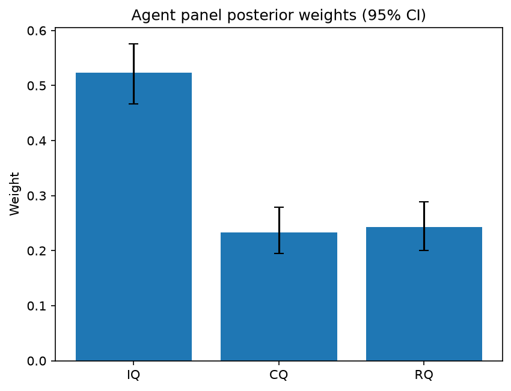

# Survey report: TrustRouter Agentic Full Panel (llama3.1:8b) -- Level L3a: Quality clusters (ISO 25012)

Survey ID: `trustrouter-agentic-full-panel-llama3.1-8b-2026-09-01-L3a`

## Agent panel

- Agents contributing a valid response: 36
- Classical BWM consistency: 35/36 within threshold

| Criterion | Mean | 95% CI lower | 95% CI upper |
|---|---|---|---|
| IQ | 0.5238 | 0.4669 | 0.5762 |
| CQ | 0.2333 | 0.1945 | 0.2786 |
| RQ | 0.2429 | 0.2008 | 0.2891 |

## Methodology

Each agent independently completed a Best-Worst Method (BWM) comparison: choosing the single most and least important criterion, then rating every criterion's importance relative to those two on a 1-9 scale. Individual responses were solved with the classical BWM linear program (Rezaei, 2015) for a consistency check, and combined across the panel with a hierarchical Bayesian model (Mohammadi and Rezaei, 2020).

36 agent response(s) were accepted into this result.

Every agent's run began with a QA precheck (its stated configuration verified against ground truth) and every accepted answer's self-reported sources were checked against what reference material was actually available to it; see the Per-agent detail section below and this survey's Conversation Log for each agent's specific results. Every response is schema-validated and independently, repeatedly sampled (never a single completion treated as ground truth); see `guardrails.py`. This survey's complete output is covered by a SHA-256 integrity manifest (`integrity_manifest.json`, `SHA256SUMS`), generated once this run finished, so any later alteration to these files is detectable.

### Charts

## Per-agent detail

### bim-coordinator-base-openmanus (`bim-coordinator-base-openmanus`)

- Role: BIM Coordinator
- Model: ollama/llama3.1:8b
- DID: `did:key:z6MkpforTMij12doroyuXnu1pfRBrjmR7eDBdkHhBjTawEJh`
- QA precheck: passed
- Sources used: (not reported)

**Answer:** `{"best": "CQ", "worst": "RQ", "best_to_others": {"CQ": 1, "IQ": 7, "RQ": 9}, "others_to_worst": {"RQ": 1, "IQ": 3, "CQ": 9}}`

**Reasoning:**

Best factor: CQ
Worst factor: RQ

CQ vs IQ: 7
CQ vs RQ: 9
IQ vs RQ: 3

### bim-coordinator-base-openmanus (`bim-coordinator-base-openmanus`)

- Role: BIM Coordinator
- Model: ollama/llama3.1:8b
- DID: `did:key:z6MkpforTMij12doroyuXnu1pfRBrjmR7eDBdkHhBjTawEJh`
- QA precheck: passed
- Sources used: (not reported)

**Answer:** `{"best": "IQ", "worst": "RQ", "best_to_others": {"IQ": 1, "CQ": 3, "RQ": 7}, "others_to_worst": {"RQ": 1, "CQ": 5, "IQ": 7}}`

**Reasoning:**

Best factor: IQ
Worst factor: RQ

IQ vs CQ: 3
IQ vs RQ: 7
CQ vs RQ: 5

### bim-coordinator-base-openmanus (`bim-coordinator-base-openmanus`)

- Role: BIM Coordinator
- Model: ollama/llama3.1:8b
- DID: `did:key:z6MkpforTMij12doroyuXnu1pfRBrjmR7eDBdkHhBjTawEJh`
- QA precheck: passed
- Sources used: (not reported)

**Answer:** `{"best": "RQ", "worst": "CQ", "best_to_others": {"RQ": 1, "IQ": 7, "CQ": 9}, "others_to_worst": {"CQ": 1, "IQ": 5, "RQ": 9}}`

**Reasoning:**

Best factor: RQ
Worst factor: CQ

RQ vs IQ: 7
RQ vs CQ: 9
IQ vs CQ: 5

### bim-coordinator-rag-openmanus (`bim-coordinator-rag-openmanus`)

- Role: BIM Coordinator
- Model: ollama/llama3.1:8b
- DID: `did:key:z6MkpoN6ZxEiXJLit9D8EbXZc71aTdFRyArm5HxXnyfE9Qk1`
- QA precheck: passed
- Sources used: (not reported)

**Answer:** `{"best": "IQ", "worst": "RQ", "best_to_others": {"IQ": 1, "CQ": 7, "RQ": 9}, "others_to_worst": {"RQ": 1, "CQ": 5, "IQ": 9}}`

**Reasoning:**

Best factor: IQ
Worst factor: RQ

IQ vs CQ: 7
IQ vs RQ: 9
CQ vs RQ: 5

### bim-coordinator-rag-openmanus (`bim-coordinator-rag-openmanus`)

- Role: BIM Coordinator
- Model: ollama/llama3.1:8b
- DID: `did:key:z6MkpoN6ZxEiXJLit9D8EbXZc71aTdFRyArm5HxXnyfE9Qk1`
- QA precheck: passed
- Sources used: (not reported)

**Answer:** `{"best": "IQ", "worst": "RQ", "best_to_others": {"IQ": 1, "CQ": 7, "RQ": 9}, "others_to_worst": {"RQ": 1, "CQ": 5, "IQ": 9}}`

**Reasoning:**

Best factor: IQ
Worst factor: RQ

IQ vs CQ: 7
IQ vs RQ: 9
CQ vs RQ: 5

### bim-coordinator-rag-openmanus (`bim-coordinator-rag-openmanus`)

- Role: BIM Coordinator
- Model: ollama/llama3.1:8b
- DID: `did:key:z6MkpoN6ZxEiXJLit9D8EbXZc71aTdFRyArm5HxXnyfE9Qk1`
- QA precheck: passed
- Sources used: (not reported)

**Answer:** `{"best": "IQ", "worst": "RQ", "best_to_others": {"IQ": 1, "CQ": 7, "RQ": 9}, "others_to_worst": {"RQ": 1, "CQ": 5, "IQ": 9}}`

**Reasoning:**

Best factor: IQ
Worst factor: RQ

IQ vs CQ: 7
IQ vs RQ: 9
CQ vs RQ: 5

### blockchain-engineer-base-openmanus (`blockchain-engineer-base-openmanus`)

- Role: Blockchain / DLT Engineer
- Model: ollama/llama3.1:8b
- DID: `did:key:z6Mkt5Bszs1yRUiy4xhJAiC9QbH4b1LXE5R79EvbyHTFrAWs`
- QA precheck: passed
- Sources used: (not reported)

**Answer:** `{"best": "RQ", "worst": "CQ", "best_to_others": {"RQ": 1, "IQ": 7, "CQ": 5}, "others_to_worst": {"CQ": 1, "IQ": 3, "RQ": 5}}`

**Reasoning:**

Best factor: RQ
Worst factor: CQ

RQ vs IQ: 7
RQ vs CQ: 5
IQ vs CQ: 3

### blockchain-engineer-base-openmanus (`blockchain-engineer-base-openmanus`)

- Role: Blockchain / DLT Engineer
- Model: ollama/llama3.1:8b
- DID: `did:key:z6Mkt5Bszs1yRUiy4xhJAiC9QbH4b1LXE5R79EvbyHTFrAWs`
- QA precheck: passed
- Sources used: (not reported)

**Answer:** `{"best": "IQ", "worst": "RQ", "best_to_others": {"IQ": 1, "CQ": 7, "RQ": 9}, "others_to_worst": {"RQ": 1, "CQ": 5, "IQ": 9}}`

**Reasoning:**

Best factor: IQ
Worst factor: RQ

IQ vs CQ: 7
IQ vs RQ: 9
CQ vs RQ: 5

### blockchain-engineer-base-openmanus (`blockchain-engineer-base-openmanus`)

- Role: Blockchain / DLT Engineer
- Model: ollama/llama3.1:8b
- DID: `did:key:z6Mkt5Bszs1yRUiy4xhJAiC9QbH4b1LXE5R79EvbyHTFrAWs`
- QA precheck: passed
- Sources used: (not reported)

**Answer:** `{"best": "RQ", "worst": "CQ", "best_to_others": {"RQ": 1, "IQ": 7, "CQ": 5}, "others_to_worst": {"CQ": 1, "IQ": 4, "RQ": 5}}`

**Reasoning:**

Best factor: RQ
Worst factor: CQ

RQ vs IQ: 7
RQ vs CQ: 5
IQ vs CQ: 4

### blockchain-engineer-rag-openmanus (`blockchain-engineer-rag-openmanus`)

- Role: Blockchain / DLT Engineer
- Model: ollama/llama3.1:8b
- DID: `did:key:z6Mkhs8429nwt52FYPPssdRYwQHR1TRked2Eco6o4i6uHiEn`
- QA precheck: passed
- Sources used: (not reported)

**Answer:** `{"best": "IQ", "worst": "CQ", "best_to_others": {"IQ": 1, "RQ": 7, "CQ": 5}, "others_to_worst": {"CQ": 1, "RQ": 3, "IQ": 5}}`

**Reasoning:**

Best factor: IQ
Worst factor: CQ

As a Blockchain/DLT Engineer with production experience on permissioned-ledger deployments, I evaluate the importance of these quality clusters in the context of construction-project records stored on blockchain.

IQ vs RQ: 7
IQ's focus on accuracy, validity, and uniqueness is crucial for ensuring the integrity and trustworthiness of data. While representational quality (RQ) is also important, IQ takes precedence due to its direct impact on data reliability.

IQ vs CQ: 5
Intrinsic quality (IQ) is essential, but contextual quality (CQ), which encompasses completeness and timeliness, is equally vital in the context of construction-project records. A record's accuracy is less relevant if it's incomplete or outdated.

RQ vs CQ: 3
Representational quality (RQ) and contextual quality (CQ) are both important but not as critical as intrinsic quality (IQ). While consistency across sources and completeness/timeliness are essential, they can be addressed through data processing and validation mechanisms.

### blockchain-engineer-rag-openmanus (`blockchain-engineer-rag-openmanus`)

- Role: Blockchain / DLT Engineer
- Model: ollama/llama3.1:8b
- DID: `did:key:z6Mkhs8429nwt52FYPPssdRYwQHR1TRked2Eco6o4i6uHiEn`
- QA precheck: passed
- Sources used: (not reported)

**Answer:** `{"best": "IQ", "worst": "CQ", "best_to_others": {"IQ": 1, "RQ": 7, "CQ": 9}, "others_to_worst": {"CQ": 1, "RQ": 5, "IQ": 9}}`

**Reasoning:**

Best factor: IQ
Worst factor: CQ

As a Blockchain/DLT Engineer, I'll provide my ratings based on the importance of each quality factor for construction-project records considered for blockchain storage.

IQ vs RQ: 7
IQ has a high impact on the trustworthiness of data stored in a blockchain, as it ensures accuracy, validity, and uniqueness. While Representational Quality (RQ) is crucial for consistency across sources, IQ's intrinsic properties have a more significant bearing on overall trust.

IQ vs CQ: 9
Intrinsic Quality (IQ) is essential for establishing the foundation of trustworthiness in data stored in a blockchain. Contextual Quality (CQ), although important for completeness and timeliness, plays a secondary role compared to IQ's intrinsic properties.

RQ vs CQ: 5
Representational Quality (RQ) and Contextual Quality (CQ) are both critical factors, but RQ has a slightly higher importance due to its impact on consistency across sources. However, the difference in importance between these two factors is not as significant as the difference between IQ and CQ.

### blockchain-engineer-rag-openmanus (`blockchain-engineer-rag-openmanus`)

- Role: Blockchain / DLT Engineer
- Model: ollama/llama3.1:8b
- DID: `did:key:z6Mkhs8429nwt52FYPPssdRYwQHR1TRked2Eco6o4i6uHiEn`
- QA precheck: passed
- Sources used: (not reported)

**Answer:** `{"best": "IQ", "worst": "CQ", "best_to_others": {"IQ": 1, "RQ": 5, "CQ": 7}, "others_to_worst": {"CQ": 1, "RQ": 3, "IQ": 7}}`

**Reasoning:**

Best factor: IQ
Worst factor: CQ

As a Blockchain/DLT Engineer, I'll provide the ratings based on my professional judgment.

IQ vs RQ: 5
IQ vs CQ: 7
RQ vs CQ: 3

### compliance-officer-base-openmanus (`compliance-officer-base-openmanus`)

- Role: Compliance and Regulatory Officer
- Model: ollama/llama3.1:8b
- DID: `did:key:z6MkuP9PdPpZcMwRVLjAcq5tj13j4STHBpoyHT5q6hoXtzPN`
- QA precheck: passed
- Sources used: (not reported)

**Answer:** `{"best": "IQ", "worst": "RQ", "best_to_others": {"IQ": 1, "CQ": 5, "RQ": 8}, "others_to_worst": {"RQ": 1, "CQ": 4, "IQ": 8}}`

**Reasoning:**

Best factor: IQ
Worst factor: RQ

IQ vs CQ: 5
IQ vs RQ: 8
CQ vs RQ: 4

### compliance-officer-base-openmanus (`compliance-officer-base-openmanus`)

- Role: Compliance and Regulatory Officer
- Model: ollama/llama3.1:8b
- DID: `did:key:z6MkuP9PdPpZcMwRVLjAcq5tj13j4STHBpoyHT5q6hoXtzPN`
- QA precheck: passed
- Sources used: (not reported)

**Answer:** `{"best": "RQ", "worst": "CQ", "best_to_others": {"RQ": 1, "IQ": 8, "CQ": 9}, "others_to_worst": {"CQ": 1, "IQ": 6, "RQ": 9}}`

**Reasoning:**

Best factor: RQ
Worst factor: CQ

RQ vs IQ: 8
RQ vs CQ: 9
IQ vs CQ: 6

### compliance-officer-base-openmanus (`compliance-officer-base-openmanus`)

- Role: Compliance and Regulatory Officer
- Model: ollama/llama3.1:8b
- DID: `did:key:z6MkuP9PdPpZcMwRVLjAcq5tj13j4STHBpoyHT5q6hoXtzPN`
- QA precheck: passed
- Sources used: (not reported)

**Answer:** `{"best": "CQ", "worst": "RQ", "best_to_others": {"CQ": 1, "IQ": 8, "RQ": 9}, "others_to_worst": {"RQ": 1, "IQ": 6, "CQ": 9}}`

**Reasoning:**

Best factor: CQ
Worst factor: RQ

CQ vs IQ: 8
CQ vs RQ: 9
IQ vs RQ: 6

### compliance-officer-rag-openmanus (`compliance-officer-rag-openmanus`)

- Role: Compliance and Regulatory Officer
- Model: ollama/llama3.1:8b
- DID: `did:key:z6MktFkdxqRYufQP1SGaAkXUZGm8oSkT7vowAwh1EohdBBrL`
- QA precheck: passed
- Sources used: (not reported)

**Answer:** `{"best": "IQ", "worst": "CQ", "best_to_others": {"IQ": 1, "RQ": 7, "CQ": 9}, "others_to_worst": {"CQ": 1, "RQ": 5, "IQ": 9}}`

**Reasoning:**

Best factor: IQ
Worst factor: CQ

IQ vs RQ: 7
IQ vs CQ: 9
RQ vs CQ: 5

### compliance-officer-rag-openmanus (`compliance-officer-rag-openmanus`)

- Role: Compliance and Regulatory Officer
- Model: ollama/llama3.1:8b
- DID: `did:key:z6MktFkdxqRYufQP1SGaAkXUZGm8oSkT7vowAwh1EohdBBrL`
- QA precheck: passed
- Sources used: (not reported)

**Answer:** `{"best": "IQ", "worst": "CQ", "best_to_others": {"IQ": 1, "RQ": 8, "CQ": 9}, "others_to_worst": {"CQ": 1, "RQ": 7, "IQ": 9}}`

**Reasoning:**

Best factor: IQ
Worst factor: CQ

IQ vs RQ: 8
IQ vs CQ: 9
RQ vs CQ: 7

### compliance-officer-rag-openmanus (`compliance-officer-rag-openmanus`)

- Role: Compliance and Regulatory Officer
- Model: ollama/llama3.1:8b
- DID: `did:key:z6MktFkdxqRYufQP1SGaAkXUZGm8oSkT7vowAwh1EohdBBrL`
- QA precheck: passed
- Sources used: (not reported)

**Answer:** `{"best": "IQ", "worst": "CQ", "best_to_others": {"IQ": 1, "RQ": 5, "CQ": 8}, "others_to_worst": {"CQ": 1, "RQ": 3, "IQ": 8}}`

**Reasoning:**

Best factor: IQ
Worst factor: CQ

IQ vs RQ: 5
IQ vs CQ: 8
RQ vs CQ: 3

### data-engineer-base-openmanus (`data-engineer-base-openmanus`)

- Role: Data Engineering Specialist
- Model: ollama/llama3.1:8b
- DID: `did:key:z6MkpzPPNLDZuKDvjSNqq3t3b7sKC3oZs5ZdaBESsAJsWHxJ`
- QA precheck: passed
- Sources used: (not reported)

**Answer:** `{"best": "IQ", "worst": "CQ", "best_to_others": {"IQ": 1, "RQ": 7, "CQ": 9}, "others_to_worst": {"CQ": 1, "RQ": 5, "IQ": 9}}`

**Reasoning:**

Best factor: IQ
Worst factor: CQ

IQ vs RQ: 7
IQ vs CQ: 9
RQ vs CQ: 5

### data-engineer-base-openmanus (`data-engineer-base-openmanus`)

- Role: Data Engineering Specialist
- Model: ollama/llama3.1:8b
- DID: `did:key:z6MkpzPPNLDZuKDvjSNqq3t3b7sKC3oZs5ZdaBESsAJsWHxJ`
- QA precheck: passed
- Sources used: (not reported)

**Answer:** `{"best": "IQ", "worst": "RQ", "best_to_others": {"IQ": 1, "CQ": 7, "RQ": 9}, "others_to_worst": {"RQ": 1, "CQ": 5, "IQ": 9}}`

**Reasoning:**

Best factor: IQ
Worst factor: RQ

IQ vs CQ: 7
IQ vs RQ: 9
CQ vs RQ: 5

### data-engineer-base-openmanus (`data-engineer-base-openmanus`)

- Role: Data Engineering Specialist
- Model: ollama/llama3.1:8b
- DID: `did:key:z6MkpzPPNLDZuKDvjSNqq3t3b7sKC3oZs5ZdaBESsAJsWHxJ`
- QA precheck: passed
- Sources used: (not reported)

**Answer:** `{"best": "IQ", "worst": "CQ", "best_to_others": {"IQ": 1, "RQ": 7, "CQ": 9}, "others_to_worst": {"CQ": 1, "RQ": 3, "IQ": 9}}`

**Reasoning:**

Best factor: IQ
Worst factor: CQ

IQ vs RQ: 7
IQ vs CQ: 9
RQ vs CQ: 3

### data-engineer-rag-openmanus (`data-engineer-rag-openmanus`)

- Role: Data Engineering Specialist
- Model: ollama/llama3.1:8b
- DID: `did:key:z6Mkg9KDWM895yBWsveUXMBPcSM8dw3ESMktye2rHR85Rjjh`
- QA precheck: passed
- Sources used: (not reported)

**Answer:** `{"best": "IQ", "worst": "CQ", "best_to_others": {"IQ": 1, "RQ": 7, "CQ": 9}, "others_to_worst": {"CQ": 1, "RQ": 5, "IQ": 9}}`

**Reasoning:**

Best factor: IQ
Worst factor: CQ

IQ vs RQ: 7
IQ vs CQ: 9
RQ vs CQ: 5

### data-engineer-rag-openmanus (`data-engineer-rag-openmanus`)

- Role: Data Engineering Specialist
- Model: ollama/llama3.1:8b
- DID: `did:key:z6Mkg9KDWM895yBWsveUXMBPcSM8dw3ESMktye2rHR85Rjjh`
- QA precheck: passed
- Sources used: (not reported)

**Answer:** `{"best": "IQ", "worst": "CQ", "best_to_others": {"IQ": 1, "RQ": 7, "CQ": 9}, "others_to_worst": {"CQ": 1, "RQ": 5, "IQ": 9}}`

**Reasoning:**

Best factor: IQ
Worst factor: CQ

IQ vs RQ: 7
IQ vs CQ: 9
RQ vs CQ: 5

### data-engineer-rag-openmanus (`data-engineer-rag-openmanus`)

- Role: Data Engineering Specialist
- Model: ollama/llama3.1:8b
- DID: `did:key:z6Mkg9KDWM895yBWsveUXMBPcSM8dw3ESMktye2rHR85Rjjh`
- QA precheck: passed
- Sources used: (not reported)

**Answer:** `{"best": "RQ", "worst": "CQ", "best_to_others": {"RQ": 1, "IQ": 7, "CQ": 9}, "others_to_worst": {"CQ": 1, "IQ": 5, "RQ": 9}}`

**Reasoning:**

Best factor: RQ
Worst factor: CQ

RQ vs IQ: 7
RQ vs CQ: 9
IQ vs CQ: 5

### project-manager-base-openmanus (`project-manager-base-openmanus`)

- Role: Construction Project Manager
- Model: ollama/llama3.1:8b
- DID: `did:key:z6MkmN7vzHnh2icWr6YL16BEoJ3tVgESyM2YguEVrwiXHwKZ`
- QA precheck: passed
- Sources used: (not reported)

**Answer:** `{"best": "RQ", "worst": "CQ", "best_to_others": {"RQ": 1, "IQ": 7, "CQ": 9}, "others_to_worst": {"CQ": 1, "IQ": 5, "RQ": 9}}`

**Reasoning:**

Best factor: RQ
Worst factor: CQ

RQ vs IQ: 7
RQ vs CQ: 9
IQ vs CQ: 5

### project-manager-base-openmanus (`project-manager-base-openmanus`)

- Role: Construction Project Manager
- Model: ollama/llama3.1:8b
- DID: `did:key:z6MkmN7vzHnh2icWr6YL16BEoJ3tVgESyM2YguEVrwiXHwKZ`
- QA precheck: passed
- Sources used: (not reported)

**Answer:** `{"best": "IQ", "worst": "RQ", "best_to_others": {"IQ": 1, "CQ": 7, "RQ": 9}, "others_to_worst": {"RQ": 1, "CQ": 5, "IQ": 9}}`

**Reasoning:**

Best factor: IQ
Worst factor: RQ

IQ vs CQ: 7
IQ vs RQ: 9
CQ vs RQ: 5

### project-manager-base-openmanus (`project-manager-base-openmanus`)

- Role: Construction Project Manager
- Model: ollama/llama3.1:8b
- DID: `did:key:z6MkmN7vzHnh2icWr6YL16BEoJ3tVgESyM2YguEVrwiXHwKZ`
- QA precheck: passed
- Sources used: (not reported)

**Answer:** `{"best": "IQ", "worst": "RQ", "best_to_others": {"IQ": 1, "CQ": 5, "RQ": 8}, "others_to_worst": {"RQ": 1, "CQ": 6, "IQ": 8}}`

**Reasoning:**

Best factor: IQ
Worst factor: RQ

IQ vs CQ: 5
IQ vs RQ: 8
CQ vs RQ: 6

### project-manager-rag-openmanus (`project-manager-rag-openmanus`)

- Role: Construction Project Manager
- Model: ollama/llama3.1:8b
- DID: `did:key:z6Mkk9YZHYYmftsH3k42bQQVpGmzoHo1xot33JbJMWcuU47A`
- QA precheck: passed
- Sources used: (not reported)

**Answer:** `{"best": "RQ", "worst": "CQ", "best_to_others": {"RQ": 1, "IQ": 7, "CQ": 9}, "others_to_worst": {"CQ": 1, "IQ": 3, "RQ": 9}}`

**Reasoning:**

Best factor: RQ
Worst factor: CQ

RQ vs IQ: 7
RQ vs CQ: 9
IQ vs CQ: 3

### project-manager-rag-openmanus (`project-manager-rag-openmanus`)

- Role: Construction Project Manager
- Model: ollama/llama3.1:8b
- DID: `did:key:z6Mkk9YZHYYmftsH3k42bQQVpGmzoHo1xot33JbJMWcuU47A`
- QA precheck: passed
- Sources used: (not reported)

**Answer:** `{"best": "IQ", "worst": "RQ", "best_to_others": {"IQ": 1, "CQ": 5, "RQ": 8}, "others_to_worst": {"RQ": 1, "CQ": 7, "IQ": 8}}`

**Reasoning:**

Best factor: IQ
Worst factor: RQ

IQ vs CQ: 5
IQ vs RQ: 8
CQ vs RQ: 7

### project-manager-rag-openmanus (`project-manager-rag-openmanus`)

- Role: Construction Project Manager
- Model: ollama/llama3.1:8b
- DID: `did:key:z6Mkk9YZHYYmftsH3k42bQQVpGmzoHo1xot33JbJMWcuU47A`
- QA precheck: passed
- Sources used: (not reported)

**Answer:** `{"best": "IQ", "worst": "RQ", "best_to_others": {"IQ": 1, "CQ": 5, "RQ": 7}, "others_to_worst": {"RQ": 1, "CQ": 3, "IQ": 7}}`

**Reasoning:**

Best factor: IQ
Worst factor: RQ

IQ vs CQ: 5
IQ vs RQ: 7
CQ vs RQ: 3

### structural-engineer-base-openmanus (`structural-engineer-base-openmanus`)

- Role: Structural Engineer
- Model: ollama/llama3.1:8b
- DID: `did:key:z6MkvCDYKdQ96esHSaxFCSv8E4U8mMu3zsdGvtceSETYN6aF`
- QA precheck: passed
- Sources used: (not reported)

**Answer:** `{"best": "IQ", "worst": "RQ", "best_to_others": {"IQ": 1, "CQ": 7, "RQ": 5}, "others_to_worst": {"RQ": 1, "CQ": 3, "IQ": 5}}`

**Reasoning:**

Best factor: IQ
Worst factor: RQ

IQ vs CQ: 7
IQ vs RQ: 5
CQ vs RQ: 3

### structural-engineer-base-openmanus (`structural-engineer-base-openmanus`)

- Role: Structural Engineer
- Model: ollama/llama3.1:8b
- DID: `did:key:z6MkvCDYKdQ96esHSaxFCSv8E4U8mMu3zsdGvtceSETYN6aF`
- QA precheck: passed
- Sources used: (not reported)

**Answer:** `{"best": "IQ", "worst": "RQ", "best_to_others": {"IQ": 1, "CQ": 5, "RQ": 7}, "others_to_worst": {"RQ": 1, "CQ": 3, "IQ": 7}}`

**Reasoning:**

Best factor: IQ
Worst factor: RQ

IQ vs CQ: 5
IQ vs RQ: 7
CQ vs RQ: 3

### structural-engineer-base-openmanus (`structural-engineer-base-openmanus`)

- Role: Structural Engineer
- Model: ollama/llama3.1:8b
- DID: `did:key:z6MkvCDYKdQ96esHSaxFCSv8E4U8mMu3zsdGvtceSETYN6aF`
- QA precheck: passed
- Sources used: (not reported)

**Answer:** `{"best": "IQ", "worst": "RQ", "best_to_others": {"IQ": 1, "CQ": 7, "RQ": 5}, "others_to_worst": {"RQ": 1, "CQ": 3, "IQ": 5}}`

**Reasoning:**

Best factor: IQ
Worst factor: RQ

IQ vs CQ: 7
IQ vs RQ: 5
CQ vs RQ: 3

### structural-engineer-rag-openmanus (`structural-engineer-rag-openmanus`)

- Role: Structural Engineer
- Model: ollama/llama3.1:8b
- DID: `did:key:z6MkjfvqEHLcBxWq1Eq5fDje3bZRRJYiiwkzjRFYWsPmNHi3`
- QA precheck: passed
- Sources used: (not reported)

**Answer:** `{"best": "IQ", "worst": "RQ", "best_to_others": {"IQ": 1, "CQ": 7, "RQ": 5}, "others_to_worst": {"RQ": 1, "CQ": 3, "IQ": 5}}`

**Reasoning:**

Best factor: IQ
Worst factor: RQ

IQ vs CQ: 7
IQ vs RQ: 5
CQ vs RQ: 3

### structural-engineer-rag-openmanus (`structural-engineer-rag-openmanus`)

- Role: Structural Engineer
- Model: ollama/llama3.1:8b
- DID: `did:key:z6MkjfvqEHLcBxWq1Eq5fDje3bZRRJYiiwkzjRFYWsPmNHi3`
- QA precheck: passed
- Sources used: (not reported)

**Answer:** `{"best": "IQ", "worst": "RQ", "best_to_others": {"IQ": 1, "CQ": 7, "RQ": 9}, "others_to_worst": {"RQ": 1, "CQ": 5, "IQ": 9}}`

**Reasoning:**

Best factor: IQ
Worst factor: RQ

IQ vs CQ: 7
IQ vs RQ: 9
CQ vs RQ: 5

### structural-engineer-rag-openmanus (`structural-engineer-rag-openmanus`)

- Role: Structural Engineer
- Model: ollama/llama3.1:8b
- DID: `did:key:z6MkjfvqEHLcBxWq1Eq5fDje3bZRRJYiiwkzjRFYWsPmNHi3`
- QA precheck: passed
- Sources used: (not reported)

**Answer:** `{"best": "IQ", "worst": "RQ", "best_to_others": {"IQ": 1, "CQ": 7, "RQ": 9}, "others_to_worst": {"RQ": 1, "CQ": 5, "IQ": 9}}`

**Reasoning:**

Best factor: IQ
Worst factor: RQ

IQ vs CQ: 7
IQ vs RQ: 9
CQ vs RQ: 5
