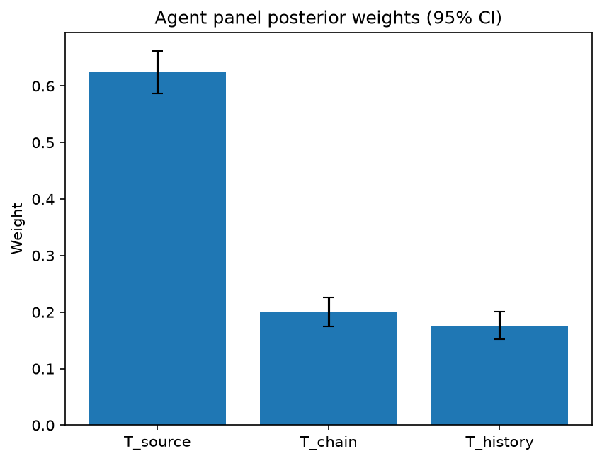

# Survey report: TrustRouter Agentic Full Panel (llama3.1:8b) -- Level L3b: Provenance Trust sub-parts

Survey ID: `trustrouter-agentic-full-panel-llama3.1-8b-2026-09-01-L3b`

## Agent panel

- Agents contributing a valid response: 36
- Classical BWM consistency: 36/36 within threshold

| Criterion | Mean | 95% CI lower | 95% CI upper |
|---|---|---|---|
| T_source | 0.6242 | 0.5868 | 0.6613 |
| T_chain | 0.1997 | 0.1745 | 0.2260 |
| T_history | 0.1761 | 0.1523 | 0.2003 |

## Methodology

Each agent independently completed a Best-Worst Method (BWM) comparison: choosing the single most and least important criterion, then rating every criterion's importance relative to those two on a 1-9 scale. Individual responses were solved with the classical BWM linear program (Rezaei, 2015) for a consistency check, and combined across the panel with a hierarchical Bayesian model (Mohammadi and Rezaei, 2020).

36 agent response(s) were accepted into this result.

Every agent's run began with a QA precheck (its stated configuration verified against ground truth) and every accepted answer's self-reported sources were checked against what reference material was actually available to it; see the Per-agent detail section below and this survey's Conversation Log for each agent's specific results. Every response is schema-validated and independently, repeatedly sampled (never a single completion treated as ground truth); see `guardrails.py`. This survey's complete output is covered by a SHA-256 integrity manifest (`integrity_manifest.json`, `SHA256SUMS`), generated once this run finished, so any later alteration to these files is detectable.

### Charts

## Per-agent detail

### bim-coordinator-base-openmanus (`bim-coordinator-base-openmanus`)

- Role: BIM Coordinator
- Model: ollama/llama3.1:8b
- DID: `did:key:z6MkpforTMij12doroyuXnu1pfRBrjmR7eDBdkHhBjTawEJh`
- QA precheck: passed
- Sources used: (not reported)

**Answer:** `{"best": "T_source", "worst": "T_history", "best_to_others": {"T_source": 1, "T_chain": 8, "T_history": 9}, "others_to_worst": {"T_history": 1, "T_chain": 5, "T_source": 9}}`

**Reasoning:**

Best factor: T_source
Worst factor: T_history

T_source vs T_chain: 8
T_source vs T_history: 9
T_chain vs T_history: 5

### bim-coordinator-base-openmanus (`bim-coordinator-base-openmanus`)

- Role: BIM Coordinator
- Model: ollama/llama3.1:8b
- DID: `did:key:z6MkpforTMij12doroyuXnu1pfRBrjmR7eDBdkHhBjTawEJh`
- QA precheck: passed
- Sources used: (not reported)

**Answer:** `{"best": "T_source", "worst": "T_chain", "best_to_others": {"T_source": 1, "T_history": 8, "T_chain": 9}, "others_to_worst": {"T_chain": 1, "T_history": 6, "T_source": 9}}`

**Reasoning:**

Best factor: T_source
Worst factor: T_chain

T_source vs T_history: 8
T_source vs T_chain: 9
T_history vs T_chain: 6

### bim-coordinator-base-openmanus (`bim-coordinator-base-openmanus`)

- Role: BIM Coordinator
- Model: ollama/llama3.1:8b
- DID: `did:key:z6MkpforTMij12doroyuXnu1pfRBrjmR7eDBdkHhBjTawEJh`
- QA precheck: passed
- Sources used: (not reported)

**Answer:** `{"best": "T_source", "worst": "T_chain", "best_to_others": {"T_source": 1, "T_history": 8, "T_chain": 7}, "others_to_worst": {"T_chain": 1, "T_history": 5, "T_source": 7}}`

**Reasoning:**

Best factor: T_source
Worst factor: T_chain

T_source vs T_history: 8
T_source vs T_chain: 7
T_history vs T_chain: 5

### bim-coordinator-rag-openmanus (`bim-coordinator-rag-openmanus`)

- Role: BIM Coordinator
- Model: ollama/llama3.1:8b
- DID: `did:key:z6MkpoN6ZxEiXJLit9D8EbXZc71aTdFRyArm5HxXnyfE9Qk1`
- QA precheck: passed
- Sources used: (not reported)

**Answer:** `{"best": "T_source", "worst": "T_history", "best_to_others": {"T_source": 1, "T_chain": 7, "T_history": 9}, "others_to_worst": {"T_history": 1, "T_chain": 5, "T_source": 9}}`

**Reasoning:**

Best factor: T_source
Worst factor: T_history

As a BIM Coordinator with 10+ years of experience managing multi-stakeholder Building Information Models, I would rate the importance of each factor as follows:

T_source vs T_chain: 7
I believe that knowing who produced the data (T_source) is more important than understanding what happened on the way here (T_chain), but not by a wide margin. In construction projects, it's crucial to know the source of information, but having a clear custody chain can also provide valuable context.

T_source vs T_history: 9
I consider knowing who produced the data (T_source) to be extremely more important than understanding the historical track record of the source (T_history). While a good reputation is essential, it's not as critical as knowing the origin of the information itself. In construction projects, we often rely on external sources for design and documentation, so having confidence in the source is paramount.

T_chain vs T_history: 5
I think that understanding what happened on the way here (T_chain) is slightly more important than understanding the historical track record of the source (T_history). Knowing how data was handled and processed can provide valuable insights into its accuracy and reliability, which is essential in construction projects where small errors can have significant consequences.

### bim-coordinator-rag-openmanus (`bim-coordinator-rag-openmanus`)

- Role: BIM Coordinator
- Model: ollama/llama3.1:8b
- DID: `did:key:z6MkpoN6ZxEiXJLit9D8EbXZc71aTdFRyArm5HxXnyfE9Qk1`
- QA precheck: passed
- Sources used: (not reported)

**Answer:** `{"best": "T_source", "worst": "T_history", "best_to_others": {"T_source": 1, "T_chain": 7, "T_history": 5}, "others_to_worst": {"T_history": 1, "T_chain": 3, "T_source": 5}}`

**Reasoning:**

Best factor: T_source
Worst factor: T_history

As a BIM Coordinator with 10+ years of experience managing multi-stakeholder Building Information Models, I would rate the importance of each factor as follows:

T_source vs T_chain: 7
T_source vs T_history: 5
T_chain vs T_history: 3

In my opinion, source credentials (T_source) are more important than custody chain (T_chain), but not extremely so. Source credentials are crucial in establishing trust in the data, as they provide information about who produced the data and their reliability. However, custody chain (T_chain) is still an important factor, as it provides insight into how the data was handled and transmitted.

Source credentials (T_source) are more important than historical track record (T_history), but not by a large margin. Historical track record is essential in understanding the source's past behavior and reliability, but it may not be as relevant if the source has provided credible credentials.

Custody chain (T_chain) and historical track record (T_history) are relatively close in terms of importance, with custody chain being slightly more important. Custody chain provides information about how the data was handled and transmitted, which can be critical in ensuring the integrity of the data. Historical track record is also essential, but it may not be as directly relevant to the current project or dataset.

### bim-coordinator-rag-openmanus (`bim-coordinator-rag-openmanus`)

- Role: BIM Coordinator
- Model: ollama/llama3.1:8b
- DID: `did:key:z6MkpoN6ZxEiXJLit9D8EbXZc71aTdFRyArm5HxXnyfE9Qk1`
- QA precheck: passed
- Sources used: (not reported)

**Answer:** `{"best": "T_source", "worst": "T_history", "best_to_others": {"T_source": 1, "T_chain": 7, "T_history": 5}, "others_to_worst": {"T_history": 1, "T_chain": 3, "T_source": 5}}`

**Reasoning:**

Best factor: T_source
Worst factor: T_history

As a BIM Coordinator with 10+ years of experience managing multi-stakeholder Building Information Models, I would rate the importance of each factor as follows:

T_source vs T_chain: 7
T_source vs T_history: 5
T_chain vs T_history: 3

### blockchain-engineer-base-openmanus (`blockchain-engineer-base-openmanus`)

- Role: Blockchain / DLT Engineer
- Model: ollama/llama3.1:8b
- DID: `did:key:z6Mkt5Bszs1yRUiy4xhJAiC9QbH4b1LXE5R79EvbyHTFrAWs`
- QA precheck: passed
- Sources used: (not reported)

**Answer:** `{"best": "T_source", "worst": "T_chain", "best_to_others": {"T_source": 1, "T_history": 7, "T_chain": 9}, "others_to_worst": {"T_chain": 1, "T_history": 5, "T_source": 9}}`

**Reasoning:**

Best factor: T_source
Worst factor: T_chain

T_source vs T_history: 7
T_source vs T_chain: 9
T_history vs T_chain: 5

### blockchain-engineer-base-openmanus (`blockchain-engineer-base-openmanus`)

- Role: Blockchain / DLT Engineer
- Model: ollama/llama3.1:8b
- DID: `did:key:z6Mkt5Bszs1yRUiy4xhJAiC9QbH4b1LXE5R79EvbyHTFrAWs`
- QA precheck: passed
- Sources used: (not reported)

**Answer:** `{"best": "T_source", "worst": "T_chain", "best_to_others": {"T_source": 1, "T_history": 7, "T_chain": 9}, "others_to_worst": {"T_chain": 1, "T_history": 5, "T_source": 9}}`

**Reasoning:**

Best factor: T_source
Worst factor: T_chain

T_source vs T_history: 7
T_source vs T_chain: 9
T_history vs T_chain: 5

### blockchain-engineer-base-openmanus (`blockchain-engineer-base-openmanus`)

- Role: Blockchain / DLT Engineer
- Model: ollama/llama3.1:8b
- DID: `did:key:z6Mkt5Bszs1yRUiy4xhJAiC9QbH4b1LXE5R79EvbyHTFrAWs`
- QA precheck: passed
- Sources used: (not reported)

**Answer:** `{"best": "T_source", "worst": "T_chain", "best_to_others": {"T_source": 1, "T_history": 7, "T_chain": 9}, "others_to_worst": {"T_chain": 1, "T_history": 5, "T_source": 9}}`

**Reasoning:**

Best factor: T_source
Worst factor: T_chain

T_source vs T_history: 7
T_source vs T_chain: 9
T_history vs T_chain: 5

### blockchain-engineer-rag-openmanus (`blockchain-engineer-rag-openmanus`)

- Role: Blockchain / DLT Engineer
- Model: ollama/llama3.1:8b
- DID: `did:key:z6Mkhs8429nwt52FYPPssdRYwQHR1TRked2Eco6o4i6uHiEn`
- QA precheck: passed
- Sources used: (not reported)

**Answer:** `{"best": "T_source", "worst": "T_chain", "best_to_others": {"T_source": 1, "T_history": 8, "T_chain": 9}, "others_to_worst": {"T_chain": 1, "T_history": 6, "T_source": 9}}`

**Reasoning:**

Best factor: T_source
Worst factor: T_chain

T_source vs T_history: 8
T_source vs T_chain: 9
T_history vs T_chain: 6

### blockchain-engineer-rag-openmanus (`blockchain-engineer-rag-openmanus`)

- Role: Blockchain / DLT Engineer
- Model: ollama/llama3.1:8b
- DID: `did:key:z6Mkhs8429nwt52FYPPssdRYwQHR1TRked2Eco6o4i6uHiEn`
- QA precheck: passed
- Sources used: (not reported)

**Answer:** `{"best": "T_source", "worst": "T_chain", "best_to_others": {"T_source": 1, "T_history": 7, "T_chain": 9}, "others_to_worst": {"T_chain": 1, "T_history": 5, "T_source": 9}}`

**Reasoning:**

Best factor: T_source
Worst factor: T_chain

T_source vs T_history: 7
T_source vs T_chain: 9
T_history vs T_chain: 5

### blockchain-engineer-rag-openmanus (`blockchain-engineer-rag-openmanus`)

- Role: Blockchain / DLT Engineer
- Model: ollama/llama3.1:8b
- DID: `did:key:z6Mkhs8429nwt52FYPPssdRYwQHR1TRked2Eco6o4i6uHiEn`
- QA precheck: passed
- Sources used: (not reported)

**Answer:** `{"best": "T_source", "worst": "T_chain", "best_to_others": {"T_source": 1, "T_history": 8, "T_chain": 9}, "others_to_worst": {"T_chain": 1, "T_history": 6, "T_source": 9}}`

**Reasoning:**

Best factor: T_source
Worst factor: T_chain

T_source vs T_history: 8
T_source vs T_chain: 9
T_history vs T_chain: 6

### compliance-officer-base-openmanus (`compliance-officer-base-openmanus`)

- Role: Compliance and Regulatory Officer
- Model: ollama/llama3.1:8b
- DID: `did:key:z6MkuP9PdPpZcMwRVLjAcq5tj13j4STHBpoyHT5q6hoXtzPN`
- QA precheck: passed
- Sources used: (not reported)

**Answer:** `{"best": "T_source", "worst": "T_history", "best_to_others": {"T_source": 1, "T_chain": 8, "T_history": 9}, "others_to_worst": {"T_history": 1, "T_chain": 6, "T_source": 9}}`

**Reasoning:**

Best factor: T_source
Worst factor: T_history

T_source vs T_chain: 8
T_source vs T_history: 9
T_chain vs T_history: 6

### compliance-officer-base-openmanus (`compliance-officer-base-openmanus`)

- Role: Compliance and Regulatory Officer
- Model: ollama/llama3.1:8b
- DID: `did:key:z6MkuP9PdPpZcMwRVLjAcq5tj13j4STHBpoyHT5q6hoXtzPN`
- QA precheck: passed
- Sources used: (not reported)

**Answer:** `{"best": "T_source", "worst": "T_history", "best_to_others": {"T_source": 1, "T_chain": 8, "T_history": 9}, "others_to_worst": {"T_history": 1, "T_chain": 7, "T_source": 9}}`

**Reasoning:**

Best factor: T_source
Worst factor: T_history

T_source vs T_chain: 8
T_source vs T_history: 9
T_chain vs T_history: 7

### compliance-officer-base-openmanus (`compliance-officer-base-openmanus`)

- Role: Compliance and Regulatory Officer
- Model: ollama/llama3.1:8b
- DID: `did:key:z6MkuP9PdPpZcMwRVLjAcq5tj13j4STHBpoyHT5q6hoXtzPN`
- QA precheck: passed
- Sources used: (not reported)

**Answer:** `{"best": "T_source", "worst": "T_history", "best_to_others": {"T_source": 1, "T_chain": 8, "T_history": 9}, "others_to_worst": {"T_history": 1, "T_chain": 6, "T_source": 9}}`

**Reasoning:**

Best factor: T_source
Worst factor: T_history

T_source vs T_chain: 8
T_source vs T_history: 9
T_chain vs T_history: 6

### compliance-officer-rag-openmanus (`compliance-officer-rag-openmanus`)

- Role: Compliance and Regulatory Officer
- Model: ollama/llama3.1:8b
- DID: `did:key:z6MktFkdxqRYufQP1SGaAkXUZGm8oSkT7vowAwh1EohdBBrL`
- QA precheck: passed
- Sources used: (not reported)

**Answer:** `{"best": "T_source", "worst": "T_history", "best_to_others": {"T_source": 1, "T_chain": 8, "T_history": 7}, "others_to_worst": {"T_history": 1, "T_chain": 2, "T_source": 7}}`

**Reasoning:**

Best factor: T_source
Worst factor: T_history

Based on the role of a facility-management compliance officer responsible for GDPR and construction-regulatory obligations across a building's operational lifecycle, I would rate the importance of each factor as follows:

T_source vs T_chain: 8
T_source vs T_history: 7
T_chain vs T_history: 2

### compliance-officer-rag-openmanus (`compliance-officer-rag-openmanus`)

- Role: Compliance and Regulatory Officer
- Model: ollama/llama3.1:8b
- DID: `did:key:z6MktFkdxqRYufQP1SGaAkXUZGm8oSkT7vowAwh1EohdBBrL`
- QA precheck: passed
- Sources used: (not reported)

**Answer:** `{"best": "T_source", "worst": "T_history", "best_to_others": {"T_source": 1, "T_chain": 8, "T_history": 9}, "others_to_worst": {"T_history": 1, "T_chain": 7, "T_source": 9}}`

**Reasoning:**

Best factor: T_source
Worst factor: T_history

Here are the ratings:

T_source vs T_chain: 8
T_source vs T_history: 9
T_chain vs T_history: 7

### compliance-officer-rag-openmanus (`compliance-officer-rag-openmanus`)

- Role: Compliance and Regulatory Officer
- Model: ollama/llama3.1:8b
- DID: `did:key:z6MktFkdxqRYufQP1SGaAkXUZGm8oSkT7vowAwh1EohdBBrL`
- QA precheck: passed
- Sources used: (not reported)

**Answer:** `{"best": "T_source", "worst": "T_history", "best_to_others": {"T_source": 1, "T_chain": 7, "T_history": 5}, "others_to_worst": {"T_history": 1, "T_chain": 3, "T_source": 5}}`

**Reasoning:**

Best factor: T_source
Worst factor: T_history

As a Compliance and Regulatory Officer responsible for GDPR and construction-regulatory obligations across a building's operational lifecycle, I would rate the importance of each factor as follows:

T_source vs T_chain: 7
T_source vs T_history: 5
T_chain vs T_history: 3

### data-engineer-base-openmanus (`data-engineer-base-openmanus`)

- Role: Data Engineering Specialist
- Model: ollama/llama3.1:8b
- DID: `did:key:z6MkpzPPNLDZuKDvjSNqq3t3b7sKC3oZs5ZdaBESsAJsWHxJ`
- QA precheck: passed
- Sources used: (not reported)

**Answer:** `{"best": "T_source", "worst": "T_history", "best_to_others": {"T_source": 1, "T_chain": 7, "T_history": 9}, "others_to_worst": {"T_history": 1, "T_chain": 5, "T_source": 9}}`

**Reasoning:**

Best factor: T_source
Worst factor: T_history

T_source vs T_chain: 7
T_source vs T_history: 9
T_chain vs T_history: 5

### data-engineer-base-openmanus (`data-engineer-base-openmanus`)

- Role: Data Engineering Specialist
- Model: ollama/llama3.1:8b
- DID: `did:key:z6MkpzPPNLDZuKDvjSNqq3t3b7sKC3oZs5ZdaBESsAJsWHxJ`
- QA precheck: passed
- Sources used: (not reported)

**Answer:** `{"best": "T_source", "worst": "T_history", "best_to_others": {"T_source": 1, "T_chain": 7, "T_history": 9}, "others_to_worst": {"T_history": 1, "T_chain": 5, "T_source": 9}}`

**Reasoning:**

Best factor: T_source
Worst factor: T_history

T_source vs T_chain: 7
T_source vs T_history: 9
T_chain vs T_history: 5

### data-engineer-base-openmanus (`data-engineer-base-openmanus`)

- Role: Data Engineering Specialist
- Model: ollama/llama3.1:8b
- DID: `did:key:z6MkpzPPNLDZuKDvjSNqq3t3b7sKC3oZs5ZdaBESsAJsWHxJ`
- QA precheck: passed
- Sources used: (not reported)

**Answer:** `{"best": "T_source", "worst": "T_history", "best_to_others": {"T_source": 1, "T_chain": 8, "T_history": 9}, "others_to_worst": {"T_history": 1, "T_chain": 7, "T_source": 9}}`

**Reasoning:**

Best factor: T_source
Worst factor: T_history

T_source vs T_chain: 8
T_source vs T_history: 9
T_chain vs T_history: 7

### data-engineer-rag-openmanus (`data-engineer-rag-openmanus`)

- Role: Data Engineering Specialist
- Model: ollama/llama3.1:8b
- DID: `did:key:z6Mkg9KDWM895yBWsveUXMBPcSM8dw3ESMktye2rHR85Rjjh`
- QA precheck: passed
- Sources used: (not reported)

**Answer:** `{"best": "T_source", "worst": "T_history", "best_to_others": {"T_source": 1, "T_chain": 8, "T_history": 9}, "others_to_worst": {"T_history": 1, "T_chain": 6, "T_source": 9}}`

**Reasoning:**

Best factor: T_source
Worst factor: T_history

T_source vs T_chain: 8
T_source vs T_history: 9
T_chain vs T_history: 6

### data-engineer-rag-openmanus (`data-engineer-rag-openmanus`)

- Role: Data Engineering Specialist
- Model: ollama/llama3.1:8b
- DID: `did:key:z6Mkg9KDWM895yBWsveUXMBPcSM8dw3ESMktye2rHR85Rjjh`
- QA precheck: passed
- Sources used: (not reported)

**Answer:** `{"best": "T_source", "worst": "T_history", "best_to_others": {"T_source": 1, "T_chain": 8, "T_history": 9}, "others_to_worst": {"T_history": 1, "T_chain": 6, "T_source": 9}}`

**Reasoning:**

Best factor: T_source
Worst factor: T_history

T_source vs T_chain: 8
T_source vs T_history: 9
T_chain vs T_history: 6

### data-engineer-rag-openmanus (`data-engineer-rag-openmanus`)

- Role: Data Engineering Specialist
- Model: ollama/llama3.1:8b
- DID: `did:key:z6Mkg9KDWM895yBWsveUXMBPcSM8dw3ESMktye2rHR85Rjjh`
- QA precheck: passed
- Sources used: (not reported)

**Answer:** `{"best": "T_source", "worst": "T_history", "best_to_others": {"T_source": 1, "T_chain": 8, "T_history": 9}, "others_to_worst": {"T_history": 1, "T_chain": 5, "T_source": 9}}`

**Reasoning:**

Best factor: T_source
Worst factor: T_history

T_source vs T_chain: 8
T_source vs T_history: 9
T_chain vs T_history: 5

### project-manager-base-openmanus (`project-manager-base-openmanus`)

- Role: Construction Project Manager
- Model: ollama/llama3.1:8b
- DID: `did:key:z6MkmN7vzHnh2icWr6YL16BEoJ3tVgESyM2YguEVrwiXHwKZ`
- QA precheck: passed
- Sources used: (not reported)

**Answer:** `{"best": "T_source", "worst": "T_chain", "best_to_others": {"T_source": 1, "T_history": 7, "T_chain": 8}, "others_to_worst": {"T_chain": 1, "T_history": 5, "T_source": 8}}`

**Reasoning:**

Best factor: T_source
Worst factor: T_chain

T_source vs T_history: 7
T_source vs T_chain: 8
T_history vs T_chain: 5

### project-manager-base-openmanus (`project-manager-base-openmanus`)

- Role: Construction Project Manager
- Model: ollama/llama3.1:8b
- DID: `did:key:z6MkmN7vzHnh2icWr6YL16BEoJ3tVgESyM2YguEVrwiXHwKZ`
- QA precheck: passed
- Sources used: (not reported)

**Answer:** `{"best": "T_source", "worst": "T_history", "best_to_others": {"T_source": 1, "T_chain": 8, "T_history": 9}, "others_to_worst": {"T_history": 1, "T_chain": 6, "T_source": 9}}`

**Reasoning:**

Best factor: T_source
Worst factor: T_history

T_source vs T_chain: 8
T_source vs T_history: 9
T_chain vs T_history: 6

### project-manager-base-openmanus (`project-manager-base-openmanus`)

- Role: Construction Project Manager
- Model: ollama/llama3.1:8b
- DID: `did:key:z6MkmN7vzHnh2icWr6YL16BEoJ3tVgESyM2YguEVrwiXHwKZ`
- QA precheck: passed
- Sources used: (not reported)

**Answer:** `{"best": "T_history", "worst": "T_source", "best_to_others": {"T_history": 1, "T_chain": 7, "T_source": 9}, "others_to_worst": {"T_source": 1, "T_chain": 5, "T_history": 9}}`

**Reasoning:**

Best factor: T_history
Worst factor: T_source

T_history vs T_chain: 7
T_history vs T_source: 9
T_chain vs T_source: 5

### project-manager-rag-openmanus (`project-manager-rag-openmanus`)

- Role: Construction Project Manager
- Model: ollama/llama3.1:8b
- DID: `did:key:z6Mkk9YZHYYmftsH3k42bQQVpGmzoHo1xot33JbJMWcuU47A`
- QA precheck: passed
- Sources used: (not reported)

**Answer:** `{"best": "T_source", "worst": "T_history", "best_to_others": {"T_source": 1, "T_chain": 8, "T_history": 9}, "others_to_worst": {"T_history": 1, "T_chain": 6, "T_source": 9}}`

**Reasoning:**

Best factor: T_source
Worst factor: T_history

T_source vs T_chain: 8
T_source vs T_history: 9
T_chain vs T_history: 6

### project-manager-rag-openmanus (`project-manager-rag-openmanus`)

- Role: Construction Project Manager
- Model: ollama/llama3.1:8b
- DID: `did:key:z6Mkk9YZHYYmftsH3k42bQQVpGmzoHo1xot33JbJMWcuU47A`
- QA precheck: passed
- Sources used: (not reported)

**Answer:** `{"best": "T_source", "worst": "T_history", "best_to_others": {"T_source": 1, "T_chain": 8, "T_history": 9}, "others_to_worst": {"T_history": 1, "T_chain": 6, "T_source": 9}}`

**Reasoning:**

Best factor: T_source
Worst factor: T_history

T_source vs T_chain: 8
T_source vs T_history: 9
T_chain vs T_history: 6

### project-manager-rag-openmanus (`project-manager-rag-openmanus`)

- Role: Construction Project Manager
- Model: ollama/llama3.1:8b
- DID: `did:key:z6Mkk9YZHYYmftsH3k42bQQVpGmzoHo1xot33JbJMWcuU47A`
- QA precheck: passed
- Sources used: (not reported)

**Answer:** `{"best": "T_source", "worst": "T_history", "best_to_others": {"T_source": 1, "T_chain": 8, "T_history": 9}, "others_to_worst": {"T_history": 1, "T_chain": 6, "T_source": 9}}`

**Reasoning:**

Best factor: T_source
Worst factor: T_history

T_source vs T_chain: 8
T_source vs T_history: 9
T_chain vs T_history: 6

### structural-engineer-base-openmanus (`structural-engineer-base-openmanus`)

- Role: Structural Engineer
- Model: ollama/llama3.1:8b
- DID: `did:key:z6MkvCDYKdQ96esHSaxFCSv8E4U8mMu3zsdGvtceSETYN6aF`
- QA precheck: passed
- Sources used: (not reported)

**Answer:** `{"best": "T_source", "worst": "T_history", "best_to_others": {"T_source": 1, "T_chain": 8, "T_history": 9}, "others_to_worst": {"T_history": 1, "T_chain": 6, "T_source": 9}}`

**Reasoning:**

Best factor: T_source
Worst factor: T_history

T_source vs T_chain: 8
T_source vs T_history: 9
T_chain vs T_history: 6

### structural-engineer-base-openmanus (`structural-engineer-base-openmanus`)

- Role: Structural Engineer
- Model: ollama/llama3.1:8b
- DID: `did:key:z6MkvCDYKdQ96esHSaxFCSv8E4U8mMu3zsdGvtceSETYN6aF`
- QA precheck: passed
- Sources used: (not reported)

**Answer:** `{"best": "T_source", "worst": "T_chain", "best_to_others": {"T_source": 1, "T_history": 8, "T_chain": 9}, "others_to_worst": {"T_chain": 1, "T_history": 6, "T_source": 9}}`

**Reasoning:**

Best factor: T_source
Worst factor: T_chain

T_source vs T_history: 8
T_source vs T_chain: 9
T_history vs T_chain: 6

### structural-engineer-base-openmanus (`structural-engineer-base-openmanus`)

- Role: Structural Engineer
- Model: ollama/llama3.1:8b
- DID: `did:key:z6MkvCDYKdQ96esHSaxFCSv8E4U8mMu3zsdGvtceSETYN6aF`
- QA precheck: passed
- Sources used: (not reported)

**Answer:** `{"best": "T_source", "worst": "T_history", "best_to_others": {"T_source": 1, "T_chain": 7, "T_history": 9}, "others_to_worst": {"T_history": 1, "T_chain": 5, "T_source": 9}}`

**Reasoning:**

Best factor: T_source
Worst factor: T_history

T_source vs T_chain: 7
T_source vs T_history: 9
T_chain vs T_history: 5

### structural-engineer-rag-openmanus (`structural-engineer-rag-openmanus`)

- Role: Structural Engineer
- Model: ollama/llama3.1:8b
- DID: `did:key:z6MkjfvqEHLcBxWq1Eq5fDje3bZRRJYiiwkzjRFYWsPmNHi3`
- QA precheck: passed
- Sources used: (not reported)

**Answer:** `{"best": "T_source", "worst": "T_chain", "best_to_others": {"T_source": 1, "T_history": 7, "T_chain": 9}, "others_to_worst": {"T_chain": 1, "T_history": 5, "T_source": 9}}`

**Reasoning:**

Best factor: T_source
Worst factor: T_chain

T_source vs T_history: 7
T_source vs T_chain: 9
T_history vs T_chain: 5

### structural-engineer-rag-openmanus (`structural-engineer-rag-openmanus`)

- Role: Structural Engineer
- Model: ollama/llama3.1:8b
- DID: `did:key:z6MkjfvqEHLcBxWq1Eq5fDje3bZRRJYiiwkzjRFYWsPmNHi3`
- QA precheck: passed
- Sources used: (not reported)

**Answer:** `{"best": "T_source", "worst": "T_history", "best_to_others": {"T_source": 1, "T_chain": 7, "T_history": 9}, "others_to_worst": {"T_history": 1, "T_chain": 5, "T_source": 9}}`

**Reasoning:**

Best factor: T_source
Worst factor: T_history

T_source vs T_chain: 7
T_source vs T_history: 9
T_chain vs T_history: 5

### structural-engineer-rag-openmanus (`structural-engineer-rag-openmanus`)

- Role: Structural Engineer
- Model: ollama/llama3.1:8b
- DID: `did:key:z6MkjfvqEHLcBxWq1Eq5fDje3bZRRJYiiwkzjRFYWsPmNHi3`
- QA precheck: passed
- Sources used: (not reported)

**Answer:** `{"best": "T_source", "worst": "T_history", "best_to_others": {"T_source": 1, "T_chain": 7, "T_history": 9}, "others_to_worst": {"T_history": 1, "T_chain": 5, "T_source": 9}}`

**Reasoning:**

Best factor: T_source
Worst factor: T_history

T_source vs T_chain: 7
T_source vs T_history: 9
T_chain vs T_history: 5
