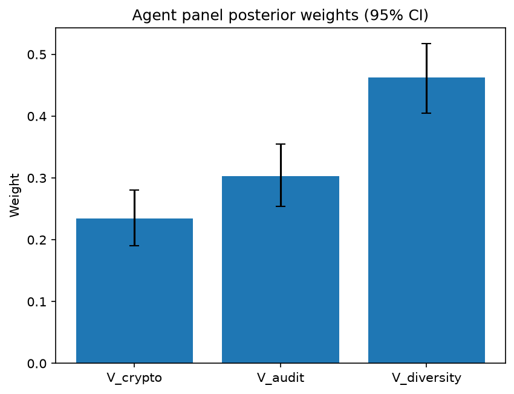

# Survey report: TrustRouter Agentic Full Panel (llama3.1:8b) -- Level L3c: Verification Strength sub-parts

Survey ID: `trustrouter-agentic-full-panel-llama3.1-8b-2026-09-01-L3c`

## Agent panel

- Agents contributing a valid response: 36
- Classical BWM consistency: 35/36 within threshold

| Criterion | Mean | 95% CI lower | 95% CI upper |
|---|---|---|---|
| V_crypto | 0.2342 | 0.1900 | 0.2808 |
| V_audit | 0.3028 | 0.2536 | 0.3552 |
| V_diversity | 0.4630 | 0.4053 | 0.5171 |

## Methodology

Each agent independently completed a Best-Worst Method (BWM) comparison: choosing the single most and least important criterion, then rating every criterion's importance relative to those two on a 1-9 scale. Individual responses were solved with the classical BWM linear program (Rezaei, 2015) for a consistency check, and combined across the panel with a hierarchical Bayesian model (Mohammadi and Rezaei, 2020).

36 agent response(s) were accepted into this result.

Every agent's run began with a QA precheck (its stated configuration verified against ground truth) and every accepted answer's self-reported sources were checked against what reference material was actually available to it; see the Per-agent detail section below and this survey's Conversation Log for each agent's specific results. Every response is schema-validated and independently, repeatedly sampled (never a single completion treated as ground truth); see `guardrails.py`. This survey's complete output is covered by a SHA-256 integrity manifest (`integrity_manifest.json`, `SHA256SUMS`), generated once this run finished, so any later alteration to these files is detectable.

### Charts

## Per-agent detail

### bim-coordinator-base-openmanus (`bim-coordinator-base-openmanus`)

- Role: BIM Coordinator
- Model: ollama/llama3.1:8b
- DID: `did:key:z6MkpforTMij12doroyuXnu1pfRBrjmR7eDBdkHhBjTawEJh`
- QA precheck: passed
- Sources used: (not reported)

**Answer:** `{"best": "V_diversity", "worst": "V_crypto", "best_to_others": {"V_diversity": 1, "V_audit": 8, "V_crypto": 9}, "others_to_worst": {"V_crypto": 1, "V_audit": 6, "V_diversity": 9}}`

**Reasoning:**

Best factor: V_diversity
Worst factor: V_crypto

V_diversity vs V_audit: 8
V_diversity vs V_crypto: 9
V_audit vs V_crypto: 6

### bim-coordinator-base-openmanus (`bim-coordinator-base-openmanus`)

- Role: BIM Coordinator
- Model: ollama/llama3.1:8b
- DID: `did:key:z6MkpforTMij12doroyuXnu1pfRBrjmR7eDBdkHhBjTawEJh`
- QA precheck: passed
- Sources used: (not reported)

**Answer:** `{"best": "V_diversity", "worst": "V_crypto", "best_to_others": {"V_diversity": 1, "V_audit": 8, "V_crypto": 9}, "others_to_worst": {"V_crypto": 1, "V_audit": 6, "V_diversity": 9}}`

**Reasoning:**

Best factor: V_diversity
Worst factor: V_crypto

V_diversity vs V_audit: 8
V_diversity vs V_crypto: 9
V_audit vs V_crypto: 6

### bim-coordinator-base-openmanus (`bim-coordinator-base-openmanus`)

- Role: BIM Coordinator
- Model: ollama/llama3.1:8b
- DID: `did:key:z6MkpforTMij12doroyuXnu1pfRBrjmR7eDBdkHhBjTawEJh`
- QA precheck: passed
- Sources used: (not reported)

**Answer:** `{"best": "V_diversity", "worst": "V_crypto", "best_to_others": {"V_diversity": 1, "V_audit": 8, "V_crypto": 9}, "others_to_worst": {"V_crypto": 1, "V_audit": 6, "V_diversity": 9}}`

**Reasoning:**

Best factor: V_diversity
Worst factor: V_crypto

V_diversity vs V_audit: 8
V_diversity vs V_crypto: 9
V_audit vs V_crypto: 6

### bim-coordinator-rag-openmanus (`bim-coordinator-rag-openmanus`)

- Role: BIM Coordinator
- Model: ollama/llama3.1:8b
- DID: `did:key:z6MkpoN6ZxEiXJLit9D8EbXZc71aTdFRyArm5HxXnyfE9Qk1`
- QA precheck: passed
- Sources used: (not reported)

**Answer:** `{"best": "V_diversity", "worst": "V_crypto", "best_to_others": {"V_diversity": 1, "V_audit": 3, "V_crypto": 6}, "others_to_worst": {"V_crypto": 1, "V_audit": 2, "V_diversity": 6}}`

**Reasoning:**

Best factor: V_diversity
Worst factor: V_crypto

Based on my experience as a BIM Coordinator, I would rate the importance of each factor relative to the others as follows:

V_diversity vs V_audit: 3
V_diversity vs V_crypto: 6
V_audit vs V_crypto: 2

In these ratings, I have considered how crucial it is for construction-project records to have multiple independent parties verifying their accuracy and completeness (V_diversity) compared to having a clear audit trail (V_audit) or relying solely on cryptographic evidence (V_crypto).

### bim-coordinator-rag-openmanus (`bim-coordinator-rag-openmanus`)

- Role: BIM Coordinator
- Model: ollama/llama3.1:8b
- DID: `did:key:z6MkpoN6ZxEiXJLit9D8EbXZc71aTdFRyArm5HxXnyfE9Qk1`
- QA precheck: passed
- Sources used: (not reported)

**Answer:** `{"best": "V_diversity", "worst": "V_crypto", "best_to_others": {"V_diversity": 1, "V_audit": 5, "V_crypto": 7}, "others_to_worst": {"V_crypto": 1, "V_audit": 3, "V_diversity": 7}}`

**Reasoning:**

Best factor: V_diversity
Worst factor: V_crypto

Here are the ratings:

V_diversity vs V_audit: 5
V_diversity vs V_crypto: 7
V_audit vs V_crypto: 3

### bim-coordinator-rag-openmanus (`bim-coordinator-rag-openmanus`)

- Role: BIM Coordinator
- Model: ollama/llama3.1:8b
- DID: `did:key:z6MkpoN6ZxEiXJLit9D8EbXZc71aTdFRyArm5HxXnyfE9Qk1`
- QA precheck: passed
- Sources used: (not reported)

**Answer:** `{"best": "V_diversity", "worst": "V_crypto", "best_to_others": {"V_diversity": 1, "V_audit": 7, "V_crypto": 9}, "others_to_worst": {"V_crypto": 1, "V_audit": 5, "V_diversity": 9}}`

**Reasoning:**

Best factor: V_diversity
Worst factor: V_crypto

As a BIM Coordinator with 10+ years of experience managing multi-stakeholder Building Information Models, I'll provide my ratings based on the importance of each factor in ensuring trustworthiness of construction-project records for blockchain storage.

V_diversity vs V_audit: 7
V_diversity vs V_crypto: 9
V_audit vs V_crypto: 5

### blockchain-engineer-base-openmanus (`blockchain-engineer-base-openmanus`)

- Role: Blockchain / DLT Engineer
- Model: ollama/llama3.1:8b
- DID: `did:key:z6Mkt5Bszs1yRUiy4xhJAiC9QbH4b1LXE5R79EvbyHTFrAWs`
- QA precheck: passed
- Sources used: (not reported)

**Answer:** `{"best": "V_diversity", "worst": "V_crypto", "best_to_others": {"V_diversity": 1, "V_audit": 7, "V_crypto": 5}, "others_to_worst": {"V_crypto": 1, "V_audit": 8, "V_diversity": 5}}`

**Reasoning:**

Best factor: V_diversity
Worst factor: V_crypto

V_diversity vs V_audit: 7
V_diversity vs V_crypto: 5
V_audit vs V_crypto: 8

### blockchain-engineer-base-openmanus (`blockchain-engineer-base-openmanus`)

- Role: Blockchain / DLT Engineer
- Model: ollama/llama3.1:8b
- DID: `did:key:z6Mkt5Bszs1yRUiy4xhJAiC9QbH4b1LXE5R79EvbyHTFrAWs`
- QA precheck: passed
- Sources used: (not reported)

**Answer:** `{"best": "V_diversity", "worst": "V_crypto", "best_to_others": {"V_diversity": 1, "V_audit": 7, "V_crypto": 5}, "others_to_worst": {"V_crypto": 1, "V_audit": 3, "V_diversity": 5}}`

**Reasoning:**

Best factor: V_diversity
Worst factor: V_crypto

V_diversity vs V_audit: 7
V_diversity vs V_crypto: 5
V_audit vs V_crypto: 3

### blockchain-engineer-base-openmanus (`blockchain-engineer-base-openmanus`)

- Role: Blockchain / DLT Engineer
- Model: ollama/llama3.1:8b
- DID: `did:key:z6Mkt5Bszs1yRUiy4xhJAiC9QbH4b1LXE5R79EvbyHTFrAWs`
- QA precheck: passed
- Sources used: (not reported)

**Answer:** `{"best": "V_diversity", "worst": "V_crypto", "best_to_others": {"V_diversity": 1, "V_audit": 8, "V_crypto": 7}, "others_to_worst": {"V_crypto": 1, "V_audit": 5, "V_diversity": 7}}`

**Reasoning:**

Best factor: V_diversity
Worst factor: V_crypto

V_diversity vs V_audit: 8
V_diversity vs V_crypto: 7
V_audit vs V_crypto: 5

### blockchain-engineer-rag-openmanus (`blockchain-engineer-rag-openmanus`)

- Role: Blockchain / DLT Engineer
- Model: ollama/llama3.1:8b
- DID: `did:key:z6Mkhs8429nwt52FYPPssdRYwQHR1TRked2Eco6o4i6uHiEn`
- QA precheck: passed
- Sources used: (not reported)

**Answer:** `{"best": "V_crypto", "worst": "V_audit", "best_to_others": {"V_crypto": 1, "V_diversity": 7, "V_audit": 9}, "others_to_worst": {"V_audit": 1, "V_diversity": 5, "V_crypto": 9}}`

**Reasoning:**

Best factor: V_crypto
Worst factor: V_audit

Based on my professional judgement as a Blockchain/DLT Engineer, I would rate the importance of each factor relative to the others as follows:

V_crypto vs V_diversity: 7
I consider cryptographic evidence (V_crypto) to be more important than diversity of verification sources (V_diversity), but not extremely so. Cryptographic evidence provides strong tamper-evidence guarantees, which is crucial for ensuring the integrity and trustworthiness of construction-project records on a blockchain.

V_crypto vs V_audit: 9
I consider cryptographic evidence (V_crypto) to be extremely more important than audit trail completeness (V_audit). While an audit trail is essential for understanding what happened in the system, it can be manipulated or tampered with. Cryptographic evidence provides a much stronger guarantee of integrity and trustworthiness.

V_diversity vs V_audit: 5
I consider diversity of verification sources (V_diversity) to be somewhat more important than audit trail completeness (V_audit). Having multiple independent parties verify the accuracy and integrity of construction-project records can provide additional assurance that the data is trustworthy. However, this factor is not as critical as cryptographic evidence in ensuring the overall trustworthiness of the system.

### blockchain-engineer-rag-openmanus (`blockchain-engineer-rag-openmanus`)

- Role: Blockchain / DLT Engineer
- Model: ollama/llama3.1:8b
- DID: `did:key:z6Mkhs8429nwt52FYPPssdRYwQHR1TRked2Eco6o4i6uHiEn`
- QA precheck: passed
- Sources used: (not reported)

**Answer:** `{"best": "V_crypto", "worst": "V_audit", "best_to_others": {"V_crypto": 1, "V_diversity": 3, "V_audit": 8}, "others_to_worst": {"V_audit": 1, "V_diversity": 5, "V_crypto": 8}}`

**Reasoning:**

Best factor: V_crypto
Worst factor: V_audit

Here are the ratings:

V_crypto vs V_diversity: 3
V_crypto vs V_audit: 8
V_diversity vs V_audit: 5

### blockchain-engineer-rag-openmanus (`blockchain-engineer-rag-openmanus`)

- Role: Blockchain / DLT Engineer
- Model: ollama/llama3.1:8b
- DID: `did:key:z6Mkhs8429nwt52FYPPssdRYwQHR1TRked2Eco6o4i6uHiEn`
- QA precheck: passed
- Sources used: (not reported)

**Answer:** `{"best": "V_crypto", "worst": "V_audit", "best_to_others": {"V_crypto": 1, "V_diversity": 7, "V_audit": 5}, "others_to_worst": {"V_audit": 1, "V_diversity": 3, "V_crypto": 5}}`

**Reasoning:**

Best factor: V_crypto
Worst factor: V_audit

Based on my professional judgement as a Blockchain/DLT Engineer, I would rate the importance of each factor relative to others as follows:

V_crypto vs V_diversity: 7
V_crypto vs V_audit: 5
V_diversity vs V_audit: 3 

Note that these ratings are not absolute but rather reflect my assessment of how important each factor is in relation to the others. For example, I consider cryptographic evidence (V_crypto) to be more important than diversity of verification sources (V_diversity), but less so than audit trail completeness (V_audit).

### compliance-officer-base-openmanus (`compliance-officer-base-openmanus`)

- Role: Compliance and Regulatory Officer
- Model: ollama/llama3.1:8b
- DID: `did:key:z6MkuP9PdPpZcMwRVLjAcq5tj13j4STHBpoyHT5q6hoXtzPN`
- QA precheck: passed
- Sources used: (not reported)

**Answer:** `{"best": "V_diversity", "worst": "V_crypto", "best_to_others": {"V_diversity": 1, "V_audit": 7, "V_crypto": 9}, "others_to_worst": {"V_crypto": 1, "V_audit": 5, "V_diversity": 9}}`

**Reasoning:**

Best factor: V_diversity
Worst factor: V_crypto

V_diversity vs V_audit: 7
V_diversity vs V_crypto: 9
V_audit vs V_crypto: 5

### compliance-officer-base-openmanus (`compliance-officer-base-openmanus`)

- Role: Compliance and Regulatory Officer
- Model: ollama/llama3.1:8b
- DID: `did:key:z6MkuP9PdPpZcMwRVLjAcq5tj13j4STHBpoyHT5q6hoXtzPN`
- QA precheck: passed
- Sources used: (not reported)

**Answer:** `{"best": "V_diversity", "worst": "V_crypto", "best_to_others": {"V_diversity": 1, "V_audit": 8, "V_crypto": 9}, "others_to_worst": {"V_crypto": 1, "V_audit": 6, "V_diversity": 9}}`

**Reasoning:**

Best factor: V_diversity
Worst factor: V_crypto

V_diversity vs V_audit: 8
V_diversity vs V_crypto: 9
V_audit vs V_crypto: 6

### compliance-officer-base-openmanus (`compliance-officer-base-openmanus`)

- Role: Compliance and Regulatory Officer
- Model: ollama/llama3.1:8b
- DID: `did:key:z6MkuP9PdPpZcMwRVLjAcq5tj13j4STHBpoyHT5q6hoXtzPN`
- QA precheck: passed
- Sources used: (not reported)

**Answer:** `{"best": "V_diversity", "worst": "V_crypto", "best_to_others": {"V_diversity": 1, "V_audit": 8, "V_crypto": 9}, "others_to_worst": {"V_crypto": 1, "V_audit": 6, "V_diversity": 9}}`

**Reasoning:**

Best factor: V_diversity
Worst factor: V_crypto

V_diversity vs V_audit: 8
V_diversity vs V_crypto: 9
V_audit vs V_crypto: 6

### compliance-officer-rag-openmanus (`compliance-officer-rag-openmanus`)

- Role: Compliance and Regulatory Officer
- Model: ollama/llama3.1:8b
- DID: `did:key:z6MktFkdxqRYufQP1SGaAkXUZGm8oSkT7vowAwh1EohdBBrL`
- QA precheck: passed
- Sources used: (not reported)

**Answer:** `{"best": "V_audit", "worst": "V_crypto", "best_to_others": {"V_audit": 1, "V_diversity": 3, "V_crypto": 7}, "others_to_worst": {"V_crypto": 1, "V_diversity": 5, "V_audit": 7}}`

**Reasoning:**

Best factor: V_audit
Worst factor: V_crypto

Here are the ratings:

V_audit vs V_diversity: 3
V_audit vs V_crypto: 7
V_diversity vs V_crypto: 5

### compliance-officer-rag-openmanus (`compliance-officer-rag-openmanus`)

- Role: Compliance and Regulatory Officer
- Model: ollama/llama3.1:8b
- DID: `did:key:z6MktFkdxqRYufQP1SGaAkXUZGm8oSkT7vowAwh1EohdBBrL`
- QA precheck: passed
- Sources used: (not reported)

**Answer:** `{"best": "V_audit", "worst": "V_crypto", "best_to_others": {"V_audit": 1, "V_diversity": 5, "V_crypto": 8}, "others_to_worst": {"V_crypto": 1, "V_diversity": 3, "V_audit": 8}}`

**Reasoning:**

Best factor: V_audit
Worst factor: V_crypto

Based on my role as a Compliance and Regulatory Officer responsible for GDPR and construction-regulatory obligations, I would rate the factors as follows:

V_audit vs V_diversity: 5
The audit trail completeness (V_audit) is slightly more important than diversity of verification sources (V_diversity), as a comprehensive record of who did what and when is crucial in ensuring compliance with regulations. However, both factors are essential for maintaining trust in the construction project data.

V_audit vs V_crypto: 8
Audit trail completeness (V_audit) is significantly more important than cryptographic evidence (V_crypto). While cryptographic evidence provides assurance that data has not been tampered with, a complete and accurate audit trail is critical for demonstrating compliance with regulations and identifying potential issues.

V_diversity vs V_crypto: 3
Diversity of verification sources (V_diversity) and cryptographic evidence (V_crypto) are relatively close in importance. Both factors contribute to the overall trustworthiness of the construction project data, but diversity of verification sources is slightly more important as it provides assurance that multiple independent parties have verified the data.

### compliance-officer-rag-openmanus (`compliance-officer-rag-openmanus`)

- Role: Compliance and Regulatory Officer
- Model: ollama/llama3.1:8b
- DID: `did:key:z6MktFkdxqRYufQP1SGaAkXUZGm8oSkT7vowAwh1EohdBBrL`
- QA precheck: passed
- Sources used: (not reported)

**Answer:** `{"best": "V_audit", "worst": "V_crypto", "best_to_others": {"V_audit": 1, "V_diversity": 7, "V_crypto": 9}, "others_to_worst": {"V_crypto": 1, "V_diversity": 5, "V_audit": 9}}`

**Reasoning:**

Best factor: V_audit
Worst factor: V_crypto

As a Compliance and Regulatory Officer responsible for GDPR and construction-regulatory obligations across a building's operational lifecycle, I would rate the factors as follows:

V_audit vs V_diversity: 7
V_audit vs V_crypto: 9
V_diversity vs V_crypto: 5

In this rating, I consider Audit trail completeness (V_audit) to be more important than both Diversity of verification sources (V_diversity) and Cryptographic evidence (V_crypto). This is because a clear audit trail is essential for demonstrating compliance with regulatory requirements, such as the GDPR's accountability principle. While cryptographic evidence can provide assurance about data integrity, it may not be sufficient on its own to establish trust in a construction project record. Diversity of verification sources is also important, but I consider it less critical than V_audit because multiple independent parties can still verify data without a clear audit trail.

### data-engineer-base-openmanus (`data-engineer-base-openmanus`)

- Role: Data Engineering Specialist
- Model: ollama/llama3.1:8b
- DID: `did:key:z6MkpzPPNLDZuKDvjSNqq3t3b7sKC3oZs5ZdaBESsAJsWHxJ`
- QA precheck: passed
- Sources used: (not reported)

**Answer:** `{"best": "V_diversity", "worst": "V_crypto", "best_to_others": {"V_diversity": 1, "V_audit": 7, "V_crypto": 9}, "others_to_worst": {"V_crypto": 1, "V_audit": 5, "V_diversity": 9}}`

**Reasoning:**

Best factor: V_diversity
Worst factor: V_crypto

V_diversity vs V_audit: 7
V_diversity vs V_crypto: 9
V_audit vs V_crypto: 5

### data-engineer-base-openmanus (`data-engineer-base-openmanus`)

- Role: Data Engineering Specialist
- Model: ollama/llama3.1:8b
- DID: `did:key:z6MkpzPPNLDZuKDvjSNqq3t3b7sKC3oZs5ZdaBESsAJsWHxJ`
- QA precheck: passed
- Sources used: (not reported)

**Answer:** `{"best": "V_diversity", "worst": "V_crypto", "best_to_others": {"V_diversity": 1, "V_audit": 8, "V_crypto": 7}, "others_to_worst": {"V_crypto": 1, "V_audit": 5, "V_diversity": 7}}`

**Reasoning:**

Best factor: V_diversity
Worst factor: V_crypto

V_diversity vs V_audit: 8
V_diversity vs V_crypto: 7
V_audit vs V_crypto: 5

### data-engineer-base-openmanus (`data-engineer-base-openmanus`)

- Role: Data Engineering Specialist
- Model: ollama/llama3.1:8b
- DID: `did:key:z6MkpzPPNLDZuKDvjSNqq3t3b7sKC3oZs5ZdaBESsAJsWHxJ`
- QA precheck: passed
- Sources used: (not reported)

**Answer:** `{"best": "V_diversity", "worst": "V_crypto", "best_to_others": {"V_diversity": 1, "V_audit": 8, "V_crypto": 9}, "others_to_worst": {"V_crypto": 1, "V_audit": 5, "V_diversity": 9}}`

**Reasoning:**

Best factor: V_diversity
Worst factor: V_crypto

V_diversity vs V_audit: 8
V_diversity vs V_crypto: 9
V_audit vs V_crypto: 5

### data-engineer-rag-openmanus (`data-engineer-rag-openmanus`)

- Role: Data Engineering Specialist
- Model: ollama/llama3.1:8b
- DID: `did:key:z6Mkg9KDWM895yBWsveUXMBPcSM8dw3ESMktye2rHR85Rjjh`
- QA precheck: passed
- Sources used: (not reported)

**Answer:** `{"best": "V_audit", "worst": "V_crypto", "best_to_others": {"V_audit": 1, "V_diversity": 7, "V_crypto": 5}, "others_to_worst": {"V_crypto": 1, "V_diversity": 3, "V_audit": 5}}`

**Reasoning:**

Best factor: V_audit
Worst factor: V_crypto

V_audit vs V_diversity: 7
V_audit vs V_crypto: 5
V_diversity vs V_crypto: 3

### data-engineer-rag-openmanus (`data-engineer-rag-openmanus`)

- Role: Data Engineering Specialist
- Model: ollama/llama3.1:8b
- DID: `did:key:z6Mkg9KDWM895yBWsveUXMBPcSM8dw3ESMktye2rHR85Rjjh`
- QA precheck: passed
- Sources used: (not reported)

**Answer:** `{"best": "V_audit", "worst": "V_crypto", "best_to_others": {"V_audit": 1, "V_diversity": 8, "V_crypto": 6}, "others_to_worst": {"V_crypto": 1, "V_diversity": 5, "V_audit": 6}}`

**Reasoning:**

Best factor: V_audit
Worst factor: V_crypto

V_audit vs V_diversity: 8
V_audit vs V_crypto: 6
V_diversity vs V_crypto: 5

### data-engineer-rag-openmanus (`data-engineer-rag-openmanus`)

- Role: Data Engineering Specialist
- Model: ollama/llama3.1:8b
- DID: `did:key:z6Mkg9KDWM895yBWsveUXMBPcSM8dw3ESMktye2rHR85Rjjh`
- QA precheck: passed
- Sources used: (not reported)

**Answer:** `{"best": "V_audit", "worst": "V_crypto", "best_to_others": {"V_audit": 1, "V_diversity": 7, "V_crypto": 5}, "others_to_worst": {"V_crypto": 1, "V_diversity": 3, "V_audit": 5}}`

**Reasoning:**

Best factor: V_audit
Worst factor: V_crypto

V_audit vs V_diversity: 7
V_audit vs V_crypto: 5
V_diversity vs V_crypto: 3

### project-manager-base-openmanus (`project-manager-base-openmanus`)

- Role: Construction Project Manager
- Model: ollama/llama3.1:8b
- DID: `did:key:z6MkmN7vzHnh2icWr6YL16BEoJ3tVgESyM2YguEVrwiXHwKZ`
- QA precheck: passed
- Sources used: (not reported)

**Answer:** `{"best": "V_diversity", "worst": "V_crypto", "best_to_others": {"V_diversity": 1, "V_audit": 7, "V_crypto": 9}, "others_to_worst": {"V_crypto": 1, "V_audit": 5, "V_diversity": 9}}`

**Reasoning:**

Best factor: V_diversity
Worst factor: V_crypto

V_diversity vs V_audit: 7
V_diversity vs V_crypto: 9
V_audit vs V_crypto: 5

### project-manager-base-openmanus (`project-manager-base-openmanus`)

- Role: Construction Project Manager
- Model: ollama/llama3.1:8b
- DID: `did:key:z6MkmN7vzHnh2icWr6YL16BEoJ3tVgESyM2YguEVrwiXHwKZ`
- QA precheck: passed
- Sources used: (not reported)

**Answer:** `{"best": "V_diversity", "worst": "V_crypto", "best_to_others": {"V_diversity": 1, "V_audit": 7, "V_crypto": 9}, "others_to_worst": {"V_crypto": 1, "V_audit": 5, "V_diversity": 9}}`

**Reasoning:**

Best factor: V_diversity
Worst factor: V_crypto

V_diversity vs V_audit: 7
V_diversity vs V_crypto: 9
V_audit vs V_crypto: 5

### project-manager-base-openmanus (`project-manager-base-openmanus`)

- Role: Construction Project Manager
- Model: ollama/llama3.1:8b
- DID: `did:key:z6MkmN7vzHnh2icWr6YL16BEoJ3tVgESyM2YguEVrwiXHwKZ`
- QA precheck: passed
- Sources used: (not reported)

**Answer:** `{"best": "V_diversity", "worst": "V_crypto", "best_to_others": {"V_diversity": 1, "V_audit": 8, "V_crypto": 9}, "others_to_worst": {"V_crypto": 1, "V_audit": 6, "V_diversity": 9}}`

**Reasoning:**

Best factor: V_diversity
Worst factor: V_crypto

V_diversity vs V_audit: 8
V_diversity vs V_crypto: 9
V_audit vs V_crypto: 6

### project-manager-rag-openmanus (`project-manager-rag-openmanus`)

- Role: Construction Project Manager
- Model: ollama/llama3.1:8b
- DID: `did:key:z6Mkk9YZHYYmftsH3k42bQQVpGmzoHo1xot33JbJMWcuU47A`
- QA precheck: passed
- Sources used: (not reported)

**Answer:** `{"best": "V_crypto", "worst": "V_diversity", "best_to_others": {"V_crypto": 1, "V_audit": 7, "V_diversity": 5}, "others_to_worst": {"V_diversity": 1, "V_audit": 3, "V_crypto": 5}}`

**Reasoning:**

Best factor: V_crypto
Worst factor: V_diversity

Here are the ratings:

V_crypto vs V_audit: 7
V_crypto vs V_diversity: 5
V_audit vs V_diversity: 3

### project-manager-rag-openmanus (`project-manager-rag-openmanus`)

- Role: Construction Project Manager
- Model: ollama/llama3.1:8b
- DID: `did:key:z6Mkk9YZHYYmftsH3k42bQQVpGmzoHo1xot33JbJMWcuU47A`
- QA precheck: passed
- Sources used: (not reported)

**Answer:** `{"best": "V_audit", "worst": "V_crypto", "best_to_others": {"V_audit": 1, "V_diversity": 3, "V_crypto": 6}, "others_to_worst": {"V_crypto": 1, "V_diversity": 4, "V_audit": 6}}`

**Reasoning:**

Best factor: V_audit
Worst factor: V_crypto

Here are the ratings:

V_audit vs V_diversity: 3
V_audit vs V_crypto: 6
V_diversity vs V_crypto: 4

### project-manager-rag-openmanus (`project-manager-rag-openmanus`)

- Role: Construction Project Manager
- Model: ollama/llama3.1:8b
- DID: `did:key:z6Mkk9YZHYYmftsH3k42bQQVpGmzoHo1xot33JbJMWcuU47A`
- QA precheck: passed
- Sources used: (not reported)

**Answer:** `{"best": "V_audit", "worst": "V_crypto", "best_to_others": {"V_audit": 1, "V_diversity": 5, "V_crypto": 7}, "others_to_worst": {"V_crypto": 1, "V_diversity": 3, "V_audit": 7}}`

**Reasoning:**

Best factor: V_audit
Worst factor: V_crypto

As a Construction Project Manager, I would rate the importance of each factor as follows:

V_audit vs V_diversity: 5
V_audit vs V_crypto: 7
V_diversity vs V_crypto: 3

My reasoning is that while all three factors are important for ensuring trust in construction project records on a blockchain, audit trail completeness (V_audit) is crucial for tracking changes and identifying potential issues. It is slightly more important than diversity of verification sources (V_diversity), which ensures that multiple independent parties verify the data.

Cryptographic evidence (V_crypto) is still an essential factor, but I consider it to be less important in this context because it can be compromised if the underlying infrastructure or keys are not secure. However, it is more important than V_diversity since cryptographic evidence provides a higher level of assurance about the integrity and authenticity of the data.

Note: These ratings reflect my professional judgment as a Construction Project Manager, and I have considered the specific context of construction project records on a blockchain.

### structural-engineer-base-openmanus (`structural-engineer-base-openmanus`)

- Role: Structural Engineer
- Model: ollama/llama3.1:8b
- DID: `did:key:z6MkvCDYKdQ96esHSaxFCSv8E4U8mMu3zsdGvtceSETYN6aF`
- QA precheck: passed
- Sources used: (not reported)

**Answer:** `{"best": "V_diversity", "worst": "V_crypto", "best_to_others": {"V_diversity": 1, "V_audit": 7, "V_crypto": 5}, "others_to_worst": {"V_crypto": 1, "V_audit": 3, "V_diversity": 5}}`

**Reasoning:**

Best factor: V_diversity
Worst factor: V_crypto

V_diversity vs V_audit: 7
V_diversity vs V_crypto: 5
V_audit vs V_crypto: 3

### structural-engineer-base-openmanus (`structural-engineer-base-openmanus`)

- Role: Structural Engineer
- Model: ollama/llama3.1:8b
- DID: `did:key:z6MkvCDYKdQ96esHSaxFCSv8E4U8mMu3zsdGvtceSETYN6aF`
- QA precheck: passed
- Sources used: (not reported)

**Answer:** `{"best": "V_diversity", "worst": "V_crypto", "best_to_others": {"V_diversity": 1, "V_audit": 8, "V_crypto": 6}, "others_to_worst": {"V_crypto": 1, "V_audit": 4, "V_diversity": 6}}`

**Reasoning:**

Best factor: V_diversity
Worst factor: V_crypto

V_diversity vs V_audit: 8
V_diversity vs V_crypto: 6
V_audit vs V_crypto: 4

### structural-engineer-base-openmanus (`structural-engineer-base-openmanus`)

- Role: Structural Engineer
- Model: ollama/llama3.1:8b
- DID: `did:key:z6MkvCDYKdQ96esHSaxFCSv8E4U8mMu3zsdGvtceSETYN6aF`
- QA precheck: passed
- Sources used: (not reported)

**Answer:** `{"best": "V_diversity", "worst": "V_crypto", "best_to_others": {"V_diversity": 1, "V_audit": 8, "V_crypto": 7}, "others_to_worst": {"V_crypto": 1, "V_audit": 5, "V_diversity": 7}}`

**Reasoning:**

Best factor: V_diversity
Worst factor: V_crypto

V_diversity vs V_audit: 8
V_diversity vs V_crypto: 7
V_audit vs V_crypto: 5

### structural-engineer-rag-openmanus (`structural-engineer-rag-openmanus`)

- Role: Structural Engineer
- Model: ollama/llama3.1:8b
- DID: `did:key:z6MkjfvqEHLcBxWq1Eq5fDje3bZRRJYiiwkzjRFYWsPmNHi3`
- QA precheck: passed
- Sources used: (not reported)

**Answer:** `{"best": "V_crypto", "worst": "V_audit", "best_to_others": {"V_crypto": 1, "V_diversity": 7, "V_audit": 9}, "others_to_worst": {"V_audit": 1, "V_diversity": 5, "V_crypto": 9}}`

**Reasoning:**

Best factor: V_crypto
Worst factor: V_audit

V_crypto vs V_diversity: 7
V_crypto vs V_audit: 9
V_diversity vs V_audit: 5

### structural-engineer-rag-openmanus (`structural-engineer-rag-openmanus`)

- Role: Structural Engineer
- Model: ollama/llama3.1:8b
- DID: `did:key:z6MkjfvqEHLcBxWq1Eq5fDje3bZRRJYiiwkzjRFYWsPmNHi3`
- QA precheck: passed
- Sources used: (not reported)

**Answer:** `{"best": "V_crypto", "worst": "V_audit", "best_to_others": {"V_crypto": 1, "V_diversity": 8, "V_audit": 9}, "others_to_worst": {"V_audit": 1, "V_diversity": 6, "V_crypto": 9}}`

**Reasoning:**

Best factor: V_crypto
Worst factor: V_audit

V_crypto vs V_diversity: 8
V_crypto vs V_audit: 9
V_diversity vs V_audit: 6

### structural-engineer-rag-openmanus (`structural-engineer-rag-openmanus`)

- Role: Structural Engineer
- Model: ollama/llama3.1:8b
- DID: `did:key:z6MkjfvqEHLcBxWq1Eq5fDje3bZRRJYiiwkzjRFYWsPmNHi3`
- QA precheck: passed
- Sources used: (not reported)

**Answer:** `{"best": "V_crypto", "worst": "V_audit", "best_to_others": {"V_crypto": 1, "V_diversity": 7, "V_audit": 8}, "others_to_worst": {"V_audit": 1, "V_diversity": 5, "V_crypto": 8}}`

**Reasoning:**

Best factor: V_crypto
Worst factor: V_audit

V_crypto vs V_diversity: 7
V_crypto vs V_audit: 8
V_diversity vs V_audit: 5
