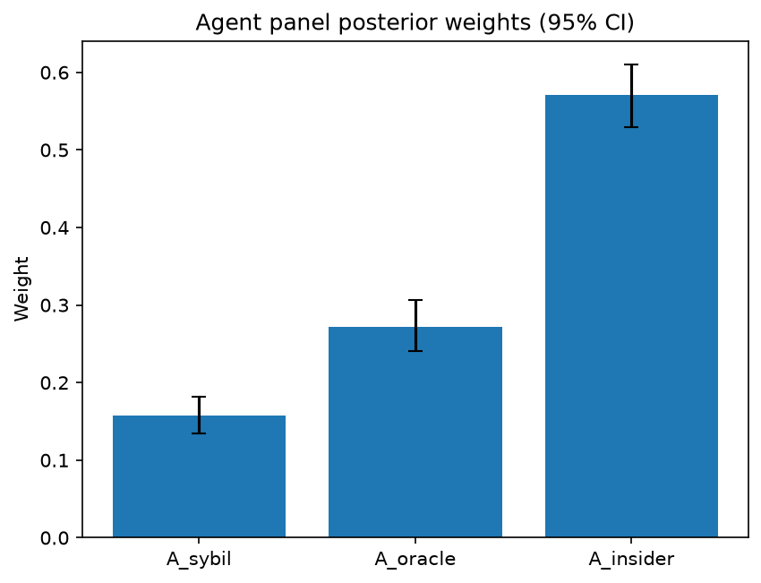

# Survey report: TrustRouter Agentic Full Panel (llama3.1:8b) -- Level L3d: Attack Resistance sub-parts

Survey ID: `trustrouter-agentic-full-panel-llama3.1-8b-2026-09-01-L3d`

## Agent panel

- Agents contributing a valid response: 36
- Classical BWM consistency: 36/36 within threshold

| Criterion | Mean | 95% CI lower | 95% CI upper |
|---|---|---|---|
| A_sybil | 0.1575 | 0.1348 | 0.1815 |
| A_oracle | 0.2721 | 0.2407 | 0.3063 |
| A_insider | 0.5704 | 0.5296 | 0.6097 |

## Methodology

Each agent independently completed a Best-Worst Method (BWM) comparison: choosing the single most and least important criterion, then rating every criterion's importance relative to those two on a 1-9 scale. Individual responses were solved with the classical BWM linear program (Rezaei, 2015) for a consistency check, and combined across the panel with a hierarchical Bayesian model (Mohammadi and Rezaei, 2020).

36 agent response(s) were accepted into this result.

Every agent's run began with a QA precheck (its stated configuration verified against ground truth) and every accepted answer's self-reported sources were checked against what reference material was actually available to it; see the Per-agent detail section below and this survey's Conversation Log for each agent's specific results. Every response is schema-validated and independently, repeatedly sampled (never a single completion treated as ground truth); see `guardrails.py`. This survey's complete output is covered by a SHA-256 integrity manifest (`integrity_manifest.json`, `SHA256SUMS`), generated once this run finished, so any later alteration to these files is detectable.

### Charts

## Per-agent detail

### bim-coordinator-base-openmanus (`bim-coordinator-base-openmanus`)

- Role: BIM Coordinator
- Model: ollama/llama3.1:8b
- DID: `did:key:z6MkpforTMij12doroyuXnu1pfRBrjmR7eDBdkHhBjTawEJh`
- QA precheck: passed
- Sources used: (not reported)

**Answer:** `{"best": "A_insider", "worst": "A_sybil", "best_to_others": {"A_insider": 1, "A_oracle": 8, "A_sybil": 9}, "others_to_worst": {"A_sybil": 1, "A_oracle": 6, "A_insider": 9}}`

**Reasoning:**

Best factor: A_insider
Worst factor: A_sybil

A_insider vs A_oracle: 8
A_insider vs A_sybil: 9
A_oracle vs A_sybil: 6

### bim-coordinator-base-openmanus (`bim-coordinator-base-openmanus`)

- Role: BIM Coordinator
- Model: ollama/llama3.1:8b
- DID: `did:key:z6MkpforTMij12doroyuXnu1pfRBrjmR7eDBdkHhBjTawEJh`
- QA precheck: passed
- Sources used: (not reported)

**Answer:** `{"best": "A_insider", "worst": "A_sybil", "best_to_others": {"A_insider": 1, "A_oracle": 8, "A_sybil": 9}, "others_to_worst": {"A_sybil": 1, "A_oracle": 5, "A_insider": 9}}`

**Reasoning:**

Best factor: A_insider
Worst factor: A_sybil

A_insider vs A_oracle: 8
A_insider vs A_sybil: 9
A_oracle vs A_sybil: 5

### bim-coordinator-base-openmanus (`bim-coordinator-base-openmanus`)

- Role: BIM Coordinator
- Model: ollama/llama3.1:8b
- DID: `did:key:z6MkpforTMij12doroyuXnu1pfRBrjmR7eDBdkHhBjTawEJh`
- QA precheck: passed
- Sources used: (not reported)

**Answer:** `{"best": "A_insider", "worst": "A_sybil", "best_to_others": {"A_insider": 1, "A_oracle": 8, "A_sybil": 9}, "others_to_worst": {"A_sybil": 1, "A_oracle": 7, "A_insider": 9}}`

**Reasoning:**

Best factor: A_insider
Worst factor: A_sybil

A_insider vs A_oracle: 8
A_insider vs A_sybil: 9
A_oracle vs A_sybil: 7

### bim-coordinator-rag-openmanus (`bim-coordinator-rag-openmanus`)

- Role: BIM Coordinator
- Model: ollama/llama3.1:8b
- DID: `did:key:z6MkpoN6ZxEiXJLit9D8EbXZc71aTdFRyArm5HxXnyfE9Qk1`
- QA precheck: passed
- Sources used: (not reported)

**Answer:** `{"best": "A_insider", "worst": "A_sybil", "best_to_others": {"A_insider": 1, "A_oracle": 8, "A_sybil": 9}, "others_to_worst": {"A_sybil": 1, "A_oracle": 6, "A_insider": 9}}`

**Reasoning:**

Best factor: A_insider
Worst factor: A_sybil

A_insider vs A_oracle: 8
A_insider vs A_sybil: 9
A_oracle vs A_sybil: 6

### bim-coordinator-rag-openmanus (`bim-coordinator-rag-openmanus`)

- Role: BIM Coordinator
- Model: ollama/llama3.1:8b
- DID: `did:key:z6MkpoN6ZxEiXJLit9D8EbXZc71aTdFRyArm5HxXnyfE9Qk1`
- QA precheck: passed
- Sources used: (not reported)

**Answer:** `{"best": "A_insider", "worst": "A_sybil", "best_to_others": {"A_insider": 1, "A_oracle": 8, "A_sybil": 9}, "others_to_worst": {"A_sybil": 1, "A_oracle": 6, "A_insider": 9}}`

**Reasoning:**

Best factor: A_insider
Worst factor: A_sybil

A_insider vs A_oracle: 8
A_insider vs A_sybil: 9
A_oracle vs A_sybil: 6

### bim-coordinator-rag-openmanus (`bim-coordinator-rag-openmanus`)

- Role: BIM Coordinator
- Model: ollama/llama3.1:8b
- DID: `did:key:z6MkpoN6ZxEiXJLit9D8EbXZc71aTdFRyArm5HxXnyfE9Qk1`
- QA precheck: passed
- Sources used: (not reported)

**Answer:** `{"best": "A_insider", "worst": "A_sybil", "best_to_others": {"A_insider": 1, "A_oracle": 8, "A_sybil": 9}, "others_to_worst": {"A_sybil": 1, "A_oracle": 5, "A_insider": 9}}`

**Reasoning:**

Best factor: A_insider
Worst factor: A_sybil

A_insider vs A_oracle: 8
A_insider vs A_sybil: 9
A_oracle vs A_sybil: 5

### blockchain-engineer-base-openmanus (`blockchain-engineer-base-openmanus`)

- Role: Blockchain / DLT Engineer
- Model: ollama/llama3.1:8b
- DID: `did:key:z6Mkt5Bszs1yRUiy4xhJAiC9QbH4b1LXE5R79EvbyHTFrAWs`
- QA precheck: passed
- Sources used: (not reported)

**Answer:** `{"best": "A_insider", "worst": "A_sybil", "best_to_others": {"A_insider": 1, "A_oracle": 8, "A_sybil": 9}, "others_to_worst": {"A_sybil": 1, "A_oracle": 5, "A_insider": 9}}`

**Reasoning:**

Best factor: A_insider
Worst factor: A_sybil

A_insider vs A_oracle: 8
A_insider vs A_sybil: 9
A_oracle vs A_sybil: 5

### blockchain-engineer-base-openmanus (`blockchain-engineer-base-openmanus`)

- Role: Blockchain / DLT Engineer
- Model: ollama/llama3.1:8b
- DID: `did:key:z6Mkt5Bszs1yRUiy4xhJAiC9QbH4b1LXE5R79EvbyHTFrAWs`
- QA precheck: passed
- Sources used: (not reported)

**Answer:** `{"best": "A_insider", "worst": "A_sybil", "best_to_others": {"A_insider": 1, "A_oracle": 8, "A_sybil": 9}, "others_to_worst": {"A_sybil": 1, "A_oracle": 7, "A_insider": 9}}`

**Reasoning:**

Best factor: A_insider
Worst factor: A_sybil

A_insider vs A_oracle: 8
A_insider vs A_sybil: 9
A_oracle vs A_sybil: 7

### blockchain-engineer-base-openmanus (`blockchain-engineer-base-openmanus`)

- Role: Blockchain / DLT Engineer
- Model: ollama/llama3.1:8b
- DID: `did:key:z6Mkt5Bszs1yRUiy4xhJAiC9QbH4b1LXE5R79EvbyHTFrAWs`
- QA precheck: passed
- Sources used: (not reported)

**Answer:** `{"best": "A_sybil", "worst": "A_oracle", "best_to_others": {"A_sybil": 1, "A_insider": 7, "A_oracle": 9}, "others_to_worst": {"A_oracle": 1, "A_insider": 5, "A_sybil": 9}}`

**Reasoning:**

Best factor: A_sybil
Worst factor: A_oracle

A_sybil vs A_insider: 7
A_sybil vs A_oracle: 9
A_insider vs A_oracle: 5

### blockchain-engineer-rag-openmanus (`blockchain-engineer-rag-openmanus`)

- Role: Blockchain / DLT Engineer
- Model: ollama/llama3.1:8b
- DID: `did:key:z6Mkhs8429nwt52FYPPssdRYwQHR1TRked2Eco6o4i6uHiEn`
- QA precheck: passed
- Sources used: (not reported)

**Answer:** `{"best": "A_insider", "worst": "A_sybil", "best_to_others": {"A_insider": 1, "A_oracle": 8, "A_sybil": 9}, "others_to_worst": {"A_sybil": 1, "A_oracle": 7, "A_insider": 9}}`

**Reasoning:**

Best factor: A_insider
Worst factor: A_sybil

A_insider vs A_oracle: 8
A_insider vs A_sybil: 9
A_oracle vs A_sybil: 7

### blockchain-engineer-rag-openmanus (`blockchain-engineer-rag-openmanus`)

- Role: Blockchain / DLT Engineer
- Model: ollama/llama3.1:8b
- DID: `did:key:z6Mkhs8429nwt52FYPPssdRYwQHR1TRked2Eco6o4i6uHiEn`
- QA precheck: passed
- Sources used: (not reported)

**Answer:** `{"best": "A_oracle", "worst": "A_sybil", "best_to_others": {"A_oracle": 1, "A_insider": 8, "A_sybil": 9}, "others_to_worst": {"A_sybil": 1, "A_insider": 6, "A_oracle": 9}}`

**Reasoning:**

Best factor: A_oracle
Worst factor: A_sybil

A_oracle vs A_insider: 8
A_oracle vs A_sybil: 9
A_insider vs A_sybil: 6

### blockchain-engineer-rag-openmanus (`blockchain-engineer-rag-openmanus`)

- Role: Blockchain / DLT Engineer
- Model: ollama/llama3.1:8b
- DID: `did:key:z6Mkhs8429nwt52FYPPssdRYwQHR1TRked2Eco6o4i6uHiEn`
- QA precheck: passed
- Sources used: (not reported)

**Answer:** `{"best": "A_oracle", "worst": "A_sybil", "best_to_others": {"A_oracle": 1, "A_insider": 8, "A_sybil": 9}, "others_to_worst": {"A_sybil": 1, "A_insider": 6, "A_oracle": 9}}`

**Reasoning:**

Best factor: A_oracle
Worst factor: A_sybil

A_oracle vs A_insider: 8
A_oracle vs A_sybil: 9
A_insider vs A_sybil: 6

### compliance-officer-base-openmanus (`compliance-officer-base-openmanus`)

- Role: Compliance and Regulatory Officer
- Model: ollama/llama3.1:8b
- DID: `did:key:z6MkuP9PdPpZcMwRVLjAcq5tj13j4STHBpoyHT5q6hoXtzPN`
- QA precheck: passed
- Sources used: (not reported)

**Answer:** `{"best": "A_insider", "worst": "A_sybil", "best_to_others": {"A_insider": 1, "A_oracle": 7, "A_sybil": 9}, "others_to_worst": {"A_sybil": 1, "A_oracle": 5, "A_insider": 9}}`

**Reasoning:**

Best factor: A_insider
Worst factor: A_sybil

A_insider vs A_oracle: 7
A_insider vs A_sybil: 9
A_oracle vs A_sybil: 5

### compliance-officer-base-openmanus (`compliance-officer-base-openmanus`)

- Role: Compliance and Regulatory Officer
- Model: ollama/llama3.1:8b
- DID: `did:key:z6MkuP9PdPpZcMwRVLjAcq5tj13j4STHBpoyHT5q6hoXtzPN`
- QA precheck: passed
- Sources used: (not reported)

**Answer:** `{"best": "A_insider", "worst": "A_sybil", "best_to_others": {"A_insider": 1, "A_oracle": 8, "A_sybil": 9}, "others_to_worst": {"A_sybil": 1, "A_oracle": 6, "A_insider": 9}}`

**Reasoning:**

Best factor: A_insider
Worst factor: A_sybil

A_insider vs A_oracle: 8
A_insider vs A_sybil: 9
A_oracle vs A_sybil: 6

### compliance-officer-base-openmanus (`compliance-officer-base-openmanus`)

- Role: Compliance and Regulatory Officer
- Model: ollama/llama3.1:8b
- DID: `did:key:z6MkuP9PdPpZcMwRVLjAcq5tj13j4STHBpoyHT5q6hoXtzPN`
- QA precheck: passed
- Sources used: (not reported)

**Answer:** `{"best": "A_insider", "worst": "A_sybil", "best_to_others": {"A_insider": 1, "A_oracle": 8, "A_sybil": 9}, "others_to_worst": {"A_sybil": 1, "A_oracle": 5, "A_insider": 9}}`

**Reasoning:**

Best factor: A_insider
Worst factor: A_sybil

A_insider vs A_oracle: 8
A_insider vs A_sybil: 9
A_oracle vs A_sybil: 5

### compliance-officer-rag-openmanus (`compliance-officer-rag-openmanus`)

- Role: Compliance and Regulatory Officer
- Model: ollama/llama3.1:8b
- DID: `did:key:z6MktFkdxqRYufQP1SGaAkXUZGm8oSkT7vowAwh1EohdBBrL`
- QA precheck: passed
- Sources used: (not reported)

**Answer:** `{"best": "A_insider", "worst": "A_sybil", "best_to_others": {"A_insider": 1, "A_oracle": 7, "A_sybil": 9}, "others_to_worst": {"A_sybil": 1, "A_oracle": 5, "A_insider": 9}}`

**Reasoning:**

Best factor: A_insider
Worst factor: A_sybil

Here are the ratings:

A_insider vs A_oracle: 7
A_insider vs A_sybil: 9
A_oracle vs A_sybil: 5

### compliance-officer-rag-openmanus (`compliance-officer-rag-openmanus`)

- Role: Compliance and Regulatory Officer
- Model: ollama/llama3.1:8b
- DID: `did:key:z6MktFkdxqRYufQP1SGaAkXUZGm8oSkT7vowAwh1EohdBBrL`
- QA precheck: passed
- Sources used: (not reported)

**Answer:** `{"best": "A_insider", "worst": "A_sybil", "best_to_others": {"A_insider": 1, "A_oracle": 7, "A_sybil": 9}, "others_to_worst": {"A_sybil": 1, "A_oracle": 5, "A_insider": 9}}`

**Reasoning:**

Best factor: A_insider
Worst factor: A_sybil

Based on my role as a Compliance and Regulatory Officer responsible for GDPR and construction-regulatory obligations, I would rate the importance of each factor relative to the others as follows:

A_insider vs A_oracle: 7
A_insider vs A_sybil: 9
A_oracle vs A_sybil: 5

In my professional judgement, insider resistance (A_insider) is the most critical factor in construction-project data-trust, followed closely by oracle resistance (A_oracle). Sybil resistance (A_sybil), while still important, is considered less critical than the other two factors.

### compliance-officer-rag-openmanus (`compliance-officer-rag-openmanus`)

- Role: Compliance and Regulatory Officer
- Model: ollama/llama3.1:8b
- DID: `did:key:z6MktFkdxqRYufQP1SGaAkXUZGm8oSkT7vowAwh1EohdBBrL`
- QA precheck: passed
- Sources used: (not reported)

**Answer:** `{"best": "A_insider", "worst": "A_sybil", "best_to_others": {"A_insider": 1, "A_oracle": 7, "A_sybil": 9}, "others_to_worst": {"A_sybil": 1, "A_oracle": 3, "A_insider": 9}}`

**Reasoning:**

Best factor: A_insider
Worst factor: A_sybil

A_insider vs A_oracle: 7
A_insider vs A_sybil: 9
A_oracle vs A_sybil: 3

### data-engineer-base-openmanus (`data-engineer-base-openmanus`)

- Role: Data Engineering Specialist
- Model: ollama/llama3.1:8b
- DID: `did:key:z6MkpzPPNLDZuKDvjSNqq3t3b7sKC3oZs5ZdaBESsAJsWHxJ`
- QA precheck: passed
- Sources used: (not reported)

**Answer:** `{"best": "A_insider", "worst": "A_sybil", "best_to_others": {"A_insider": 1, "A_oracle": 8, "A_sybil": 9}, "others_to_worst": {"A_sybil": 1, "A_oracle": 5, "A_insider": 9}}`

**Reasoning:**

Best factor: A_insider
Worst factor: A_sybil

A_insider vs A_oracle: 8
A_insider vs A_sybil: 9
A_oracle vs A_sybil: 5

### data-engineer-base-openmanus (`data-engineer-base-openmanus`)

- Role: Data Engineering Specialist
- Model: ollama/llama3.1:8b
- DID: `did:key:z6MkpzPPNLDZuKDvjSNqq3t3b7sKC3oZs5ZdaBESsAJsWHxJ`
- QA precheck: passed
- Sources used: (not reported)

**Answer:** `{"best": "A_insider", "worst": "A_sybil", "best_to_others": {"A_insider": 1, "A_oracle": 8, "A_sybil": 9}, "others_to_worst": {"A_sybil": 1, "A_oracle": 7, "A_insider": 9}}`

**Reasoning:**

Best factor: A_insider
Worst factor: A_sybil

A_insider vs A_oracle: 8
A_insider vs A_sybil: 9
A_oracle vs A_sybil: 7

### data-engineer-base-openmanus (`data-engineer-base-openmanus`)

- Role: Data Engineering Specialist
- Model: ollama/llama3.1:8b
- DID: `did:key:z6MkpzPPNLDZuKDvjSNqq3t3b7sKC3oZs5ZdaBESsAJsWHxJ`
- QA precheck: passed
- Sources used: (not reported)

**Answer:** `{"best": "A_insider", "worst": "A_sybil", "best_to_others": {"A_insider": 1, "A_oracle": 8, "A_sybil": 9}, "others_to_worst": {"A_sybil": 1, "A_oracle": 6, "A_insider": 9}}`

**Reasoning:**

Best factor: A_insider
Worst factor: A_sybil

A_insider vs A_oracle: 8
A_insider vs A_sybil: 9
A_oracle vs A_sybil: 6

### data-engineer-rag-openmanus (`data-engineer-rag-openmanus`)

- Role: Data Engineering Specialist
- Model: ollama/llama3.1:8b
- DID: `did:key:z6Mkg9KDWM895yBWsveUXMBPcSM8dw3ESMktye2rHR85Rjjh`
- QA precheck: passed
- Sources used: (not reported)

**Answer:** `{"best": "A_insider", "worst": "A_sybil", "best_to_others": {"A_insider": 1, "A_oracle": 8, "A_sybil": 9}, "others_to_worst": {"A_sybil": 1, "A_oracle": 5, "A_insider": 9}}`

**Reasoning:**

Best factor: A_insider
Worst factor: A_sybil

A_insider vs A_oracle: 8
A_insider vs A_sybil: 9
A_oracle vs A_sybil: 5

### data-engineer-rag-openmanus (`data-engineer-rag-openmanus`)

- Role: Data Engineering Specialist
- Model: ollama/llama3.1:8b
- DID: `did:key:z6Mkg9KDWM895yBWsveUXMBPcSM8dw3ESMktye2rHR85Rjjh`
- QA precheck: passed
- Sources used: (not reported)

**Answer:** `{"best": "A_insider", "worst": "A_sybil", "best_to_others": {"A_insider": 1, "A_oracle": 8, "A_sybil": 9}, "others_to_worst": {"A_sybil": 1, "A_oracle": 5, "A_insider": 9}}`

**Reasoning:**

Best factor: A_insider
Worst factor: A_sybil

A_insider vs A_oracle: 8
A_insider vs A_sybil: 9
A_oracle vs A_sybil: 5

### data-engineer-rag-openmanus (`data-engineer-rag-openmanus`)

- Role: Data Engineering Specialist
- Model: ollama/llama3.1:8b
- DID: `did:key:z6Mkg9KDWM895yBWsveUXMBPcSM8dw3ESMktye2rHR85Rjjh`
- QA precheck: passed
- Sources used: (not reported)

**Answer:** `{"best": "A_insider", "worst": "A_sybil", "best_to_others": {"A_insider": 1, "A_oracle": 8, "A_sybil": 9}, "others_to_worst": {"A_sybil": 1, "A_oracle": 6, "A_insider": 9}}`

**Reasoning:**

Best factor: A_insider
Worst factor: A_sybil

A_insider vs A_oracle: 8
A_insider vs A_sybil: 9
A_oracle vs A_sybil: 6

### project-manager-base-openmanus (`project-manager-base-openmanus`)

- Role: Construction Project Manager
- Model: ollama/llama3.1:8b
- DID: `did:key:z6MkmN7vzHnh2icWr6YL16BEoJ3tVgESyM2YguEVrwiXHwKZ`
- QA precheck: passed
- Sources used: (not reported)

**Answer:** `{"best": "A_insider", "worst": "A_sybil", "best_to_others": {"A_insider": 1, "A_oracle": 8, "A_sybil": 9}, "others_to_worst": {"A_sybil": 1, "A_oracle": 5, "A_insider": 9}}`

**Reasoning:**

Best factor: A_insider
Worst factor: A_sybil

A_insider vs A_oracle: 8
A_insider vs A_sybil: 9
A_oracle vs A_sybil: 5

### project-manager-base-openmanus (`project-manager-base-openmanus`)

- Role: Construction Project Manager
- Model: ollama/llama3.1:8b
- DID: `did:key:z6MkmN7vzHnh2icWr6YL16BEoJ3tVgESyM2YguEVrwiXHwKZ`
- QA precheck: passed
- Sources used: (not reported)

**Answer:** `{"best": "A_insider", "worst": "A_sybil", "best_to_others": {"A_insider": 1, "A_oracle": 7, "A_sybil": 9}, "others_to_worst": {"A_sybil": 1, "A_oracle": 5, "A_insider": 9}}`

**Reasoning:**

Best factor: A_insider
Worst factor: A_sybil

A_insider vs A_oracle: 7
A_insider vs A_sybil: 9
A_oracle vs A_sybil: 5

### project-manager-base-openmanus (`project-manager-base-openmanus`)

- Role: Construction Project Manager
- Model: ollama/llama3.1:8b
- DID: `did:key:z6MkmN7vzHnh2icWr6YL16BEoJ3tVgESyM2YguEVrwiXHwKZ`
- QA precheck: passed
- Sources used: (not reported)

**Answer:** `{"best": "A_insider", "worst": "A_sybil", "best_to_others": {"A_insider": 1, "A_oracle": 8, "A_sybil": 9}, "others_to_worst": {"A_sybil": 1, "A_oracle": 5, "A_insider": 9}}`

**Reasoning:**

Best factor: A_insider
Worst factor: A_sybil

A_insider vs A_oracle: 8
A_insider vs A_sybil: 9
A_oracle vs A_sybil: 5

### project-manager-rag-openmanus (`project-manager-rag-openmanus`)

- Role: Construction Project Manager
- Model: ollama/llama3.1:8b
- DID: `did:key:z6Mkk9YZHYYmftsH3k42bQQVpGmzoHo1xot33JbJMWcuU47A`
- QA precheck: passed
- Sources used: (not reported)

**Answer:** `{"best": "A_insider", "worst": "A_sybil", "best_to_others": {"A_insider": 1, "A_oracle": 5, "A_sybil": 7}, "others_to_worst": {"A_sybil": 1, "A_oracle": 3, "A_insider": 7}}`

**Reasoning:**

Best factor: A_insider
Worst factor: A_sybil

Here are the ratings:

A_insider vs A_oracle: 5
A_insider vs A_sybil: 7
A_oracle vs A_sybil: 3

### project-manager-rag-openmanus (`project-manager-rag-openmanus`)

- Role: Construction Project Manager
- Model: ollama/llama3.1:8b
- DID: `did:key:z6Mkk9YZHYYmftsH3k42bQQVpGmzoHo1xot33JbJMWcuU47A`
- QA precheck: passed
- Sources used: (not reported)

**Answer:** `{"best": "A_oracle", "worst": "A_sybil", "best_to_others": {"A_oracle": 1, "A_insider": 7, "A_sybil": 5}, "others_to_worst": {"A_sybil": 1, "A_insider": 3, "A_oracle": 5}}`

**Reasoning:**

Best factor: A_oracle
Worst factor: A_sybil

Here are the ratings:

A_oracle vs A_insider: 7
A_oracle vs A_sybil: 5
A_insider vs A_sybil: 3

### project-manager-rag-openmanus (`project-manager-rag-openmanus`)

- Role: Construction Project Manager
- Model: ollama/llama3.1:8b
- DID: `did:key:z6Mkk9YZHYYmftsH3k42bQQVpGmzoHo1xot33JbJMWcuU47A`
- QA precheck: passed
- Sources used: (not reported)

**Answer:** `{"best": "A_insider", "worst": "A_sybil", "best_to_others": {"A_insider": 1, "A_oracle": 7, "A_sybil": 9}, "others_to_worst": {"A_sybil": 1, "A_oracle": 5, "A_insider": 9}}`

**Reasoning:**

Best factor: A_insider
Worst factor: A_sybil

Here are the ratings:

A_insider vs A_oracle: 7
A_insider vs A_sybil: 9
A_oracle vs A_sybil: 5

### structural-engineer-base-openmanus (`structural-engineer-base-openmanus`)

- Role: Structural Engineer
- Model: ollama/llama3.1:8b
- DID: `did:key:z6MkvCDYKdQ96esHSaxFCSv8E4U8mMu3zsdGvtceSETYN6aF`
- QA precheck: passed
- Sources used: (not reported)

**Answer:** `{"best": "A_insider", "worst": "A_sybil", "best_to_others": {"A_insider": 1, "A_oracle": 7, "A_sybil": 9}, "others_to_worst": {"A_sybil": 1, "A_oracle": 5, "A_insider": 9}}`

**Reasoning:**

Best factor: A_insider
Worst factor: A_sybil

A_insider vs A_oracle: 7
A_insider vs A_sybil: 9
A_oracle vs A_sybil: 5

### structural-engineer-base-openmanus (`structural-engineer-base-openmanus`)

- Role: Structural Engineer
- Model: ollama/llama3.1:8b
- DID: `did:key:z6MkvCDYKdQ96esHSaxFCSv8E4U8mMu3zsdGvtceSETYN6aF`
- QA precheck: passed
- Sources used: (not reported)

**Answer:** `{"best": "A_insider", "worst": "A_sybil", "best_to_others": {"A_insider": 1, "A_oracle": 7, "A_sybil": 9}, "others_to_worst": {"A_sybil": 1, "A_oracle": 5, "A_insider": 9}}`

**Reasoning:**

Best factor: A_insider
Worst factor: A_sybil

A_insider vs A_oracle: 7
A_insider vs A_sybil: 9
A_oracle vs A_sybil: 5

### structural-engineer-base-openmanus (`structural-engineer-base-openmanus`)

- Role: Structural Engineer
- Model: ollama/llama3.1:8b
- DID: `did:key:z6MkvCDYKdQ96esHSaxFCSv8E4U8mMu3zsdGvtceSETYN6aF`
- QA precheck: passed
- Sources used: (not reported)

**Answer:** `{"best": "A_insider", "worst": "A_sybil", "best_to_others": {"A_insider": 1, "A_oracle": 7, "A_sybil": 5}, "others_to_worst": {"A_sybil": 1, "A_oracle": 3, "A_insider": 5}}`

**Reasoning:**

Best factor: A_insider
Worst factor: A_sybil

A_insider vs A_oracle: 7
A_insider vs A_sybil: 5
A_oracle vs A_sybil: 3

### structural-engineer-rag-openmanus (`structural-engineer-rag-openmanus`)

- Role: Structural Engineer
- Model: ollama/llama3.1:8b
- DID: `did:key:z6MkjfvqEHLcBxWq1Eq5fDje3bZRRJYiiwkzjRFYWsPmNHi3`
- QA precheck: passed
- Sources used: (not reported)

**Answer:** `{"best": "A_insider", "worst": "A_sybil", "best_to_others": {"A_insider": 1, "A_oracle": 7, "A_sybil": 9}, "others_to_worst": {"A_sybil": 1, "A_oracle": 5, "A_insider": 9}}`

**Reasoning:**

Best factor: A_insider
Worst factor: A_sybil

A_insider vs A_oracle: 7
A_insider vs A_sybil: 9
A_oracle vs A_sybil: 5

### structural-engineer-rag-openmanus (`structural-engineer-rag-openmanus`)

- Role: Structural Engineer
- Model: ollama/llama3.1:8b
- DID: `did:key:z6MkjfvqEHLcBxWq1Eq5fDje3bZRRJYiiwkzjRFYWsPmNHi3`
- QA precheck: passed
- Sources used: (not reported)

**Answer:** `{"best": "A_oracle", "worst": "A_sybil", "best_to_others": {"A_oracle": 1, "A_insider": 7, "A_sybil": 5}, "others_to_worst": {"A_sybil": 1, "A_insider": 3, "A_oracle": 5}}`

**Reasoning:**

Best factor: A_oracle
Worst factor: A_sybil

A_oracle vs A_insider: 7
A_oracle vs A_sybil: 5
A_insider vs A_sybil: 3

### structural-engineer-rag-openmanus (`structural-engineer-rag-openmanus`)

- Role: Structural Engineer
- Model: ollama/llama3.1:8b
- DID: `did:key:z6MkjfvqEHLcBxWq1Eq5fDje3bZRRJYiiwkzjRFYWsPmNHi3`
- QA precheck: passed
- Sources used: (not reported)

**Answer:** `{"best": "A_oracle", "worst": "A_sybil", "best_to_others": {"A_oracle": 1, "A_insider": 7, "A_sybil": 5}, "others_to_worst": {"A_sybil": 1, "A_insider": 3, "A_oracle": 5}}`

**Reasoning:**

Best factor: A_oracle
Worst factor: A_sybil

A_oracle vs A_insider: 7
A_oracle vs A_sybil: 5
A_insider vs A_sybil: 3
