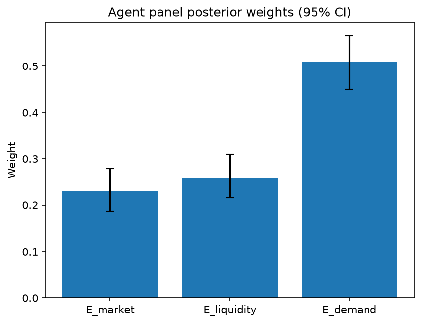

# Survey report: TrustRouter Agentic Full Panel (llama3.1:8b) -- Level L3e: Economic Value sub-parts

Survey ID: `trustrouter-agentic-full-panel-llama3.1-8b-2026-09-01-L3e`

## Agent panel

- Agents contributing a valid response: 36
- Classical BWM consistency: 35/36 within threshold

| Criterion | Mean | 95% CI lower | 95% CI upper |
|---|---|---|---|
| E_market | 0.2311 | 0.1870 | 0.2783 |
| E_liquidity | 0.2597 | 0.2158 | 0.3094 |
| E_demand | 0.5092 | 0.4501 | 0.5650 |

## Methodology

Each agent independently completed a Best-Worst Method (BWM) comparison: choosing the single most and least important criterion, then rating every criterion's importance relative to those two on a 1-9 scale. Individual responses were solved with the classical BWM linear program (Rezaei, 2015) for a consistency check, and combined across the panel with a hierarchical Bayesian model (Mohammadi and Rezaei, 2020).

36 agent response(s) were accepted into this result.

Every agent's run began with a QA precheck (its stated configuration verified against ground truth) and every accepted answer's self-reported sources were checked against what reference material was actually available to it; see the Per-agent detail section below and this survey's Conversation Log for each agent's specific results. Every response is schema-validated and independently, repeatedly sampled (never a single completion treated as ground truth); see `guardrails.py`. This survey's complete output is covered by a SHA-256 integrity manifest (`integrity_manifest.json`, `SHA256SUMS`), generated once this run finished, so any later alteration to these files is detectable.

### Charts

## Per-agent detail

### bim-coordinator-base-openmanus (`bim-coordinator-base-openmanus`)

- Role: BIM Coordinator
- Model: ollama/llama3.1:8b
- DID: `did:key:z6MkpforTMij12doroyuXnu1pfRBrjmR7eDBdkHhBjTawEJh`
- QA precheck: passed
- Sources used: (not reported)

**Answer:** `{"best": "E_market", "worst": "E_demand", "best_to_others": {"E_market": 1, "E_liquidity": 7, "E_demand": 9}, "others_to_worst": {"E_demand": 1, "E_liquidity": 5, "E_market": 9}}`

**Reasoning:**

Best factor: E_market
Worst factor: E_demand

E_market vs E_liquidity: 7
E_market vs E_demand: 9
E_liquidity vs E_demand: 5

### bim-coordinator-base-openmanus (`bim-coordinator-base-openmanus`)

- Role: BIM Coordinator
- Model: ollama/llama3.1:8b
- DID: `did:key:z6MkpforTMij12doroyuXnu1pfRBrjmR7eDBdkHhBjTawEJh`
- QA precheck: passed
- Sources used: (not reported)

**Answer:** `{"best": "E_demand", "worst": "E_market", "best_to_others": {"E_demand": 1, "E_liquidity": 7, "E_market": 9}, "others_to_worst": {"E_market": 1, "E_liquidity": 5, "E_demand": 9}}`

**Reasoning:**

Best factor: E_demand
Worst factor: E_market

E_demand vs E_liquidity: 7
E_demand vs E_market: 9
E_liquidity vs E_market: 5

### bim-coordinator-base-openmanus (`bim-coordinator-base-openmanus`)

- Role: BIM Coordinator
- Model: ollama/llama3.1:8b
- DID: `did:key:z6MkpforTMij12doroyuXnu1pfRBrjmR7eDBdkHhBjTawEJh`
- QA precheck: passed
- Sources used: (not reported)

**Answer:** `{"best": "E_demand", "worst": "E_market", "best_to_others": {"E_demand": 1, "E_liquidity": 8, "E_market": 9}, "others_to_worst": {"E_market": 1, "E_liquidity": 5, "E_demand": 9}}`

**Reasoning:**

Best factor: E_demand
Worst factor: E_market

E_demand vs E_liquidity: 8
E_demand vs E_market: 9
E_liquidity vs E_market: 5

### bim-coordinator-rag-openmanus (`bim-coordinator-rag-openmanus`)

- Role: BIM Coordinator
- Model: ollama/llama3.1:8b
- DID: `did:key:z6MkpoN6ZxEiXJLit9D8EbXZc71aTdFRyArm5HxXnyfE9Qk1`
- QA precheck: passed
- Sources used: (not reported)

**Answer:** `{"best": "E_demand", "worst": "E_market", "best_to_others": {"E_demand": 1, "E_liquidity": 7, "E_market": 9}, "others_to_worst": {"E_market": 1, "E_liquidity": 5, "E_demand": 9}}`

**Reasoning:**

Best factor: E_demand
Worst factor: E_market

Based on my experience as a BIM Coordinator, I would rate the importance of each factor in relation to the others as follows:

E_demand vs E_liquidity: 7
E_demand vs E_market: 9
E_liquidity vs E_market: 5

My reasoning is that future demand (E_demand) is critical for long-term viability and growth, making it the most important factor. Current marketplace demand (E_market) is a short-term consideration and can be volatile, so I rate it as less important than future demand but more important than liquidity.

Liquidity (E_liquidity) is essential for facilitating tradeable tokenisation, but in the context of construction-project records on blockchain storage, I consider it to be somewhat secondary to future demand. However, it's still a crucial factor and more important than current marketplace demand.

### bim-coordinator-rag-openmanus (`bim-coordinator-rag-openmanus`)

- Role: BIM Coordinator
- Model: ollama/llama3.1:8b
- DID: `did:key:z6MkpoN6ZxEiXJLit9D8EbXZc71aTdFRyArm5HxXnyfE9Qk1`
- QA precheck: passed
- Sources used: (not reported)

**Answer:** `{"best": "E_demand", "worst": "E_market", "best_to_others": {"E_demand": 1, "E_liquidity": 8, "E_market": 6}, "others_to_worst": {"E_market": 1, "E_liquidity": 7, "E_demand": 6}}`

**Reasoning:**

Best factor: E_demand
Worst factor: E_market

As a BIM Coordinator with 10+ years of experience managing multi-stakeholder Building Information Models, I'll provide my ratings based on the importance of each factor in the context of construction-project records considered for blockchain storage.

E_demand vs E_liquidity: 8
E_demand vs E_market: 6
E_liquidity vs E_market: 7

### bim-coordinator-rag-openmanus (`bim-coordinator-rag-openmanus`)

- Role: BIM Coordinator
- Model: ollama/llama3.1:8b
- DID: `did:key:z6MkpoN6ZxEiXJLit9D8EbXZc71aTdFRyArm5HxXnyfE9Qk1`
- QA precheck: passed
- Sources used: (not reported)

**Answer:** `{"best": "E_demand", "worst": "E_market", "best_to_others": {"E_demand": 1, "E_liquidity": 7, "E_market": 9}, "others_to_worst": {"E_market": 1, "E_liquidity": 5, "E_demand": 9}}`

**Reasoning:**

Best factor: E_demand
Worst factor: E_market

Based on my experience as a BIM Coordinator, I would rate the importance of each factor relative to others as follows:

E_demand vs E_liquidity: 7
E_demand vs E_market: 9
E_liquidity vs E_market: 5

My reasoning is that future demand (E_demand) is crucial for long-term viability and growth in the construction industry, making it a top priority. While tokenization ease (E_liquidity) is important for facilitating trade and adoption, I rate it lower than E_demand because it's more of an enabler rather than a driver.

Between E_market and E_liquidity, I rate E_market as slightly more important because current marketplace demand directly impacts the project's feasibility and viability. However, both factors are still relatively close in importance, which is why I rated them with a 5.

### blockchain-engineer-base-openmanus (`blockchain-engineer-base-openmanus`)

- Role: Blockchain / DLT Engineer
- Model: ollama/llama3.1:8b
- DID: `did:key:z6Mkt5Bszs1yRUiy4xhJAiC9QbH4b1LXE5R79EvbyHTFrAWs`
- QA precheck: passed
- Sources used: (not reported)

**Answer:** `{"best": "E_demand", "worst": "E_market", "best_to_others": {"E_demand": 1, "E_liquidity": 7, "E_market": 9}, "others_to_worst": {"E_market": 1, "E_liquidity": 5, "E_demand": 9}}`

**Reasoning:**

Best factor: E_demand
Worst factor: E_market

E_demand vs E_liquidity: 7
E_demand vs E_market: 9
E_liquidity vs E_market: 5

### blockchain-engineer-base-openmanus (`blockchain-engineer-base-openmanus`)

- Role: Blockchain / DLT Engineer
- Model: ollama/llama3.1:8b
- DID: `did:key:z6Mkt5Bszs1yRUiy4xhJAiC9QbH4b1LXE5R79EvbyHTFrAWs`
- QA precheck: passed
- Sources used: (not reported)

**Answer:** `{"best": "E_market", "worst": "E_demand", "best_to_others": {"E_market": 1, "E_liquidity": 7, "E_demand": 5}, "others_to_worst": {"E_demand": 1, "E_liquidity": 3, "E_market": 5}}`

**Reasoning:**

Best factor: E_market
Worst factor: E_demand

E_market vs E_liquidity: 7
E_market vs E_demand: 5
E_liquidity vs E_demand: 3

### blockchain-engineer-base-openmanus (`blockchain-engineer-base-openmanus`)

- Role: Blockchain / DLT Engineer
- Model: ollama/llama3.1:8b
- DID: `did:key:z6Mkt5Bszs1yRUiy4xhJAiC9QbH4b1LXE5R79EvbyHTFrAWs`
- QA precheck: passed
- Sources used: (not reported)

**Answer:** `{"best": "E_demand", "worst": "E_market", "best_to_others": {"E_demand": 1, "E_liquidity": 7, "E_market": 9}, "others_to_worst": {"E_market": 1, "E_liquidity": 5, "E_demand": 9}}`

**Reasoning:**

Best factor: E_demand
Worst factor: E_market

E_demand vs E_liquidity: 7
E_demand vs E_market: 9
E_liquidity vs E_market: 5

### blockchain-engineer-rag-openmanus (`blockchain-engineer-rag-openmanus`)

- Role: Blockchain / DLT Engineer
- Model: ollama/llama3.1:8b
- DID: `did:key:z6Mkhs8429nwt52FYPPssdRYwQHR1TRked2Eco6o4i6uHiEn`
- QA precheck: passed
- Sources used: (not reported)

**Answer:** `{"best": "E_demand", "worst": "E_market", "best_to_others": {"E_demand": 1, "E_liquidity": 7, "E_market": 9}, "others_to_worst": {"E_market": 1, "E_liquidity": 5, "E_demand": 9}}`

**Reasoning:**

Best factor: E_demand
Worst factor: E_market

Based on my professional judgement as a Blockchain/DLT Engineer with production experience on permissioned-ledger deployments, I would rate the importance of each factor relative to the others as follows:

E_demand vs E_liquidity: 7
E_demand vs E_market: 9
E_liquidity vs E_market: 5

### blockchain-engineer-rag-openmanus (`blockchain-engineer-rag-openmanus`)

- Role: Blockchain / DLT Engineer
- Model: ollama/llama3.1:8b
- DID: `did:key:z6Mkhs8429nwt52FYPPssdRYwQHR1TRked2Eco6o4i6uHiEn`
- QA precheck: passed
- Sources used: (not reported)

**Answer:** `{"best": "E_demand", "worst": "E_market", "best_to_others": {"E_demand": 1, "E_liquidity": 7, "E_market": 9}, "others_to_worst": {"E_market": 1, "E_liquidity": 5, "E_demand": 9}}`

**Reasoning:**

Best factor: E_demand
Worst factor: E_market

Based on my professional judgement as a Blockchain/DLT Engineer, I would rate the importance of each factor relative to the others as follows:

E_demand vs E_liquidity: 7
E_demand vs E_market: 9
E_liquidity vs E_market: 5

### blockchain-engineer-rag-openmanus (`blockchain-engineer-rag-openmanus`)

- Role: Blockchain / DLT Engineer
- Model: ollama/llama3.1:8b
- DID: `did:key:z6Mkhs8429nwt52FYPPssdRYwQHR1TRked2Eco6o4i6uHiEn`
- QA precheck: passed
- Sources used: (not reported)

**Answer:** `{"best": "E_demand", "worst": "E_market", "best_to_others": {"E_demand": 1, "E_liquidity": 7, "E_market": 9}, "others_to_worst": {"E_market": 1, "E_liquidity": 5, "E_demand": 9}}`

**Reasoning:**

Best factor: E_demand
Worst factor: E_market

Based on my professional judgement as a Blockchain/DLT Engineer with production experience on permissioned-ledger deployments, I would rate the importance of each factor relative to the others as follows:

E_demand vs E_liquidity: 7
E_demand vs E_market: 9
E_liquidity vs E_market: 5

These ratings reflect my assessment that future demand (E_demand) is a critical consideration for determining the economic value of blockchain storage, and it has a significant advantage over current marketplace demand (E_market). I also believe that tokenisation ease (E_liquidity) is more important than current marketplace demand (E_market), but less so compared to future demand.

### compliance-officer-base-openmanus (`compliance-officer-base-openmanus`)

- Role: Compliance and Regulatory Officer
- Model: ollama/llama3.1:8b
- DID: `did:key:z6MkuP9PdPpZcMwRVLjAcq5tj13j4STHBpoyHT5q6hoXtzPN`
- QA precheck: passed
- Sources used: (not reported)

**Answer:** `{"best": "E_demand", "worst": "E_market", "best_to_others": {"E_demand": 1, "E_liquidity": 8, "E_market": 9}, "others_to_worst": {"E_market": 1, "E_liquidity": 7, "E_demand": 9}}`

**Reasoning:**

Best factor: E_demand
Worst factor: E_market

E_demand vs E_liquidity: 8
E_demand vs E_market: 9
E_liquidity vs E_market: 7

### compliance-officer-base-openmanus (`compliance-officer-base-openmanus`)

- Role: Compliance and Regulatory Officer
- Model: ollama/llama3.1:8b
- DID: `did:key:z6MkuP9PdPpZcMwRVLjAcq5tj13j4STHBpoyHT5q6hoXtzPN`
- QA precheck: passed
- Sources used: (not reported)

**Answer:** `{"best": "E_demand", "worst": "E_market", "best_to_others": {"E_demand": 1, "E_liquidity": 8, "E_market": 9}, "others_to_worst": {"E_market": 1, "E_liquidity": 6, "E_demand": 9}}`

**Reasoning:**

Best factor: E_demand
Worst factor: E_market

E_demand vs E_liquidity: 8
E_demand vs E_market: 9
E_liquidity vs E_market: 6

### compliance-officer-base-openmanus (`compliance-officer-base-openmanus`)

- Role: Compliance and Regulatory Officer
- Model: ollama/llama3.1:8b
- DID: `did:key:z6MkuP9PdPpZcMwRVLjAcq5tj13j4STHBpoyHT5q6hoXtzPN`
- QA precheck: passed
- Sources used: (not reported)

**Answer:** `{"best": "E_demand", "worst": "E_market", "best_to_others": {"E_demand": 1, "E_liquidity": 7, "E_market": 9}, "others_to_worst": {"E_market": 1, "E_liquidity": 5, "E_demand": 9}}`

**Reasoning:**

Best factor: E_demand
Worst factor: E_market

E_demand vs E_liquidity: 7
E_demand vs E_market: 9
E_liquidity vs E_market: 5

### compliance-officer-rag-openmanus (`compliance-officer-rag-openmanus`)

- Role: Compliance and Regulatory Officer
- Model: ollama/llama3.1:8b
- DID: `did:key:z6MktFkdxqRYufQP1SGaAkXUZGm8oSkT7vowAwh1EohdBBrL`
- QA precheck: passed
- Sources used: (not reported)

**Answer:** `{"best": "E_market", "worst": "E_demand", "best_to_others": {"E_market": 1, "E_liquidity": 7, "E_demand": 5}, "others_to_worst": {"E_demand": 1, "E_liquidity": 3, "E_market": 5}}`

**Reasoning:**

Best factor: E_market
Worst factor: E_demand

Based on the role of a facility-management compliance officer responsible for GDPR and construction-regulatory obligations across a building's operational lifecycle, I would rate:

E_market vs E_liquidity: 7
E_market vs E_demand: 5
E_liquidity vs E_demand: 3

My reasoning is as follows:

* E_market (Current marketplace demand) is more important than E_liquidity (Tokenisation ease) because a strong market demand can drive the adoption of blockchain technology, making it easier to implement tokenization. However, I wouldn't rate it extremely more important (9), as liquidity is still crucial for the success of any project.
* E_market vs E_demand: I rated this 5 because while current marketplace demand is essential, future demand (E_demand) is also critical in determining the long-term viability and value of a construction-project record on blockchain. However, I wouldn't rate it extremely more important (9), as current demand provides immediate context.
* E_liquidity vs E_demand: I rated this 3 because while both factors are important, they serve different purposes. Liquidity is essential for the smooth functioning of tokenization, but future demand is critical in determining the overall value and adoption of blockchain technology in construction projects.

### compliance-officer-rag-openmanus (`compliance-officer-rag-openmanus`)

- Role: Compliance and Regulatory Officer
- Model: ollama/llama3.1:8b
- DID: `did:key:z6MktFkdxqRYufQP1SGaAkXUZGm8oSkT7vowAwh1EohdBBrL`
- QA precheck: passed
- Sources used: (not reported)

**Answer:** `{"best": "E_market", "worst": "E_liquidity", "best_to_others": {"E_market": 1, "E_demand": 2, "E_liquidity": 8}, "others_to_worst": {"E_liquidity": 1, "E_demand": 6, "E_market": 8}}`

**Reasoning:**

Best factor: E_market
Worst factor: E_liquidity

Here are the ratings:

E_market vs E_demand: 2
E_market vs E_liquidity: 8
E_demand vs E_liquidity: 6

### compliance-officer-rag-openmanus (`compliance-officer-rag-openmanus`)

- Role: Compliance and Regulatory Officer
- Model: ollama/llama3.1:8b
- DID: `did:key:z6MktFkdxqRYufQP1SGaAkXUZGm8oSkT7vowAwh1EohdBBrL`
- QA precheck: passed
- Sources used: (not reported)

**Answer:** `{"best": "E_demand", "worst": "E_market", "best_to_others": {"E_demand": 1, "E_liquidity": 7, "E_market": 9}, "others_to_worst": {"E_market": 1, "E_liquidity": 5, "E_demand": 9}}`

**Reasoning:**

Best factor: E_demand
Worst factor: E_market

As a Compliance and Regulatory Officer responsible for GDPR and construction-regulatory obligations across a building's operational lifecycle, I would rate the following:

E_demand vs E_liquidity: 7
E_demand vs E_market: 9
E_liquidity vs E_market: 5

My reasoning is as follows:

* E_demand is more important than E_liquidity because future demand considerations are crucial in determining the long-term viability and value of a construction project. While tokenization ease (E_liquidity) is essential for facilitating trade, it is secondary to the potential for growth and expansion that future demand represents.
* E_demand is significantly more important than E_market because current marketplace demand (E_market) can fluctuate and may not accurately reflect the long-term value of a project. Future demand considerations provide a more stable foundation for evaluating economic value.
* E_liquidity is slightly more important than E_market because ease of tokenization (E_liquidity) can impact the project's ability to attract investors and facilitate trade, whereas current marketplace demand (E_market) may be influenced by short-term market conditions.

### data-engineer-base-openmanus (`data-engineer-base-openmanus`)

- Role: Data Engineering Specialist
- Model: ollama/llama3.1:8b
- DID: `did:key:z6MkpzPPNLDZuKDvjSNqq3t3b7sKC3oZs5ZdaBESsAJsWHxJ`
- QA precheck: passed
- Sources used: (not reported)

**Answer:** `{"best": "E_market", "worst": "E_demand", "best_to_others": {"E_market": 1, "E_liquidity": 7, "E_demand": 9}, "others_to_worst": {"E_demand": 1, "E_liquidity": 5, "E_market": 9}}`

**Reasoning:**

Best factor: E_market
Worst factor: E_demand

E_market vs E_liquidity: 7
E_market vs E_demand: 9
E_liquidity vs E_demand: 5

### data-engineer-base-openmanus (`data-engineer-base-openmanus`)

- Role: Data Engineering Specialist
- Model: ollama/llama3.1:8b
- DID: `did:key:z6MkpzPPNLDZuKDvjSNqq3t3b7sKC3oZs5ZdaBESsAJsWHxJ`
- QA precheck: passed
- Sources used: (not reported)

**Answer:** `{"best": "E_demand", "worst": "E_market", "best_to_others": {"E_demand": 1, "E_liquidity": 7, "E_market": 9}, "others_to_worst": {"E_market": 1, "E_liquidity": 5, "E_demand": 9}}`

**Reasoning:**

Best factor: E_demand
Worst factor: E_market

E_demand vs E_liquidity: 7
E_demand vs E_market: 9
E_liquidity vs E_market: 5

### data-engineer-base-openmanus (`data-engineer-base-openmanus`)

- Role: Data Engineering Specialist
- Model: ollama/llama3.1:8b
- DID: `did:key:z6MkpzPPNLDZuKDvjSNqq3t3b7sKC3oZs5ZdaBESsAJsWHxJ`
- QA precheck: passed
- Sources used: (not reported)

**Answer:** `{"best": "E_demand", "worst": "E_market", "best_to_others": {"E_demand": 1, "E_liquidity": 7, "E_market": 9}, "others_to_worst": {"E_market": 1, "E_liquidity": 5, "E_demand": 9}}`

**Reasoning:**

Best factor: E_demand
Worst factor: E_market

E_demand vs E_liquidity: 7
E_demand vs E_market: 9
E_liquidity vs E_market: 5

### data-engineer-rag-openmanus (`data-engineer-rag-openmanus`)

- Role: Data Engineering Specialist
- Model: ollama/llama3.1:8b
- DID: `did:key:z6Mkg9KDWM895yBWsveUXMBPcSM8dw3ESMktye2rHR85Rjjh`
- QA precheck: passed
- Sources used: (not reported)

**Answer:** `{"best": "E_demand", "worst": "E_market", "best_to_others": {"E_demand": 1, "E_liquidity": 7, "E_market": 9}, "others_to_worst": {"E_market": 1, "E_liquidity": 5, "E_demand": 9}}`

**Reasoning:**

Best factor: E_demand
Worst factor: E_market

Based on my professional judgement as a Data Engineering Specialist responsible for data quality pipelines, provenance tracking, and polyglot-persistence routing decisions on construction-project datasets:

E_demand vs E_liquidity: 7
E_demand vs E_market: 9
E_liquidity vs E_market: 5

### data-engineer-rag-openmanus (`data-engineer-rag-openmanus`)

- Role: Data Engineering Specialist
- Model: ollama/llama3.1:8b
- DID: `did:key:z6Mkg9KDWM895yBWsveUXMBPcSM8dw3ESMktye2rHR85Rjjh`
- QA precheck: passed
- Sources used: (not reported)

**Answer:** `{"best": "E_demand", "worst": "E_market", "best_to_others": {"E_demand": 1, "E_liquidity": 7, "E_market": 9}, "others_to_worst": {"E_market": 1, "E_liquidity": 5, "E_demand": 9}}`

**Reasoning:**

Best factor: E_demand
Worst factor: E_market

Based on my professional judgment as a Data Engineering Specialist responsible for data quality pipelines, provenance tracking, and polyglot-persistence routing decisions on construction-project datasets:

E_demand vs E_liquidity: 7
E_demand vs E_market: 9
E_liquidity vs E_market: 5

### data-engineer-rag-openmanus (`data-engineer-rag-openmanus`)

- Role: Data Engineering Specialist
- Model: ollama/llama3.1:8b
- DID: `did:key:z6Mkg9KDWM895yBWsveUXMBPcSM8dw3ESMktye2rHR85Rjjh`
- QA precheck: passed
- Sources used: (not reported)

**Answer:** `{"best": "E_demand", "worst": "E_market", "best_to_others": {"E_demand": 1, "E_liquidity": 7, "E_market": 9}, "others_to_worst": {"E_market": 1, "E_liquidity": 5, "E_demand": 9}}`

**Reasoning:**

Best factor: E_demand
Worst factor: E_market

Here are the ratings:

E_demand vs E_liquidity: 7
E_demand vs E_market: 9
E_liquidity vs E_market: 5

### project-manager-base-openmanus (`project-manager-base-openmanus`)

- Role: Construction Project Manager
- Model: ollama/llama3.1:8b
- DID: `did:key:z6MkmN7vzHnh2icWr6YL16BEoJ3tVgESyM2YguEVrwiXHwKZ`
- QA precheck: passed
- Sources used: (not reported)

**Answer:** `{"best": "E_demand", "worst": "E_market", "best_to_others": {"E_demand": 1, "E_liquidity": 7, "E_market": 9}, "others_to_worst": {"E_market": 1, "E_liquidity": 5, "E_demand": 9}}`

**Reasoning:**

Best factor: E_demand
Worst factor: E_market

E_demand vs E_liquidity: 7
E_demand vs E_market: 9
E_liquidity vs E_market: 5

### project-manager-base-openmanus (`project-manager-base-openmanus`)

- Role: Construction Project Manager
- Model: ollama/llama3.1:8b
- DID: `did:key:z6MkmN7vzHnh2icWr6YL16BEoJ3tVgESyM2YguEVrwiXHwKZ`
- QA precheck: passed
- Sources used: (not reported)

**Answer:** `{"best": "E_market", "worst": "E_liquidity", "best_to_others": {"E_market": 1, "E_demand": 5, "E_liquidity": 8}, "others_to_worst": {"E_liquidity": 1, "E_demand": 3, "E_market": 8}}`

**Reasoning:**

Best factor: E_market
Worst factor: E_liquidity

E_market vs E_demand: 5
E_market vs E_liquidity: 8
E_demand vs E_liquidity: 3

### project-manager-base-openmanus (`project-manager-base-openmanus`)

- Role: Construction Project Manager
- Model: ollama/llama3.1:8b
- DID: `did:key:z6MkmN7vzHnh2icWr6YL16BEoJ3tVgESyM2YguEVrwiXHwKZ`
- QA precheck: passed
- Sources used: (not reported)

**Answer:** `{"best": "E_market", "worst": "E_liquidity", "best_to_others": {"E_market": 1, "E_demand": 7, "E_liquidity": 8}, "others_to_worst": {"E_liquidity": 1, "E_demand": 5, "E_market": 8}}`

**Reasoning:**

Best factor: E_market
Worst factor: E_liquidity

E_market vs E_demand: 7
E_market vs E_liquidity: 8
E_demand vs E_liquidity: 5

### project-manager-rag-openmanus (`project-manager-rag-openmanus`)

- Role: Construction Project Manager
- Model: ollama/llama3.1:8b
- DID: `did:key:z6Mkk9YZHYYmftsH3k42bQQVpGmzoHo1xot33JbJMWcuU47A`
- QA precheck: passed
- Sources used: (not reported)

**Answer:** `{"best": "E_market", "worst": "E_demand", "best_to_others": {"E_market": 1, "E_liquidity": 6, "E_demand": 8}, "others_to_worst": {"E_demand": 1, "E_liquidity": 4, "E_market": 8}}`

**Reasoning:**

Best factor: E_market
Worst factor: E_demand

Based on my role as a Construction Project Manager, I would rate the importance of each factor relative to the others as follows:

E_market vs E_liquidity: 6
E_market vs E_demand: 8
E_liquidity vs E_demand: 4

These ratings reflect my professional judgement that current marketplace demand (E_market) is more important than tokenisation ease (E_liquidity), which in turn is less important than future demand (E_demand).

### project-manager-rag-openmanus (`project-manager-rag-openmanus`)

- Role: Construction Project Manager
- Model: ollama/llama3.1:8b
- DID: `did:key:z6Mkk9YZHYYmftsH3k42bQQVpGmzoHo1xot33JbJMWcuU47A`
- QA precheck: passed
- Sources used: (not reported)

**Answer:** `{"best": "E_market", "worst": "E_demand", "best_to_others": {"E_market": 1, "E_liquidity": 6, "E_demand": 8}, "others_to_worst": {"E_demand": 1, "E_liquidity": 5, "E_market": 8}}`

**Reasoning:**

Best factor: E_market
Worst factor: E_demand

Based on my professional judgement as a Construction Project Manager, I would rate the importance of each factor relative to the others as follows:

E_market vs E_liquidity: 6
E_market vs E_demand: 8
E_liquidity vs E_demand: 5

### project-manager-rag-openmanus (`project-manager-rag-openmanus`)

- Role: Construction Project Manager
- Model: ollama/llama3.1:8b
- DID: `did:key:z6Mkk9YZHYYmftsH3k42bQQVpGmzoHo1xot33JbJMWcuU47A`
- QA precheck: passed
- Sources used: (not reported)

**Answer:** `{"best": "E_demand", "worst": "E_market", "best_to_others": {"E_demand": 1, "E_liquidity": 7, "E_market": 9}, "others_to_worst": {"E_market": 1, "E_liquidity": 5, "E_demand": 9}}`

**Reasoning:**

Best factor: E_demand
Worst factor: E_market

Here are the ratings:

E_demand vs E_liquidity: 7
E_demand vs E_market: 9
E_liquidity vs E_market: 5

### structural-engineer-base-openmanus (`structural-engineer-base-openmanus`)

- Role: Structural Engineer
- Model: ollama/llama3.1:8b
- DID: `did:key:z6MkvCDYKdQ96esHSaxFCSv8E4U8mMu3zsdGvtceSETYN6aF`
- QA precheck: passed
- Sources used: (not reported)

**Answer:** `{"best": "E_demand", "worst": "E_market", "best_to_others": {"E_demand": 1, "E_liquidity": 7, "E_market": 9}, "others_to_worst": {"E_market": 1, "E_liquidity": 5, "E_demand": 9}}`

**Reasoning:**

Best factor: E_demand
Worst factor: E_market

E_demand vs E_liquidity: 7
E_demand vs E_market: 9
E_liquidity vs E_market: 5

### structural-engineer-base-openmanus (`structural-engineer-base-openmanus`)

- Role: Structural Engineer
- Model: ollama/llama3.1:8b
- DID: `did:key:z6MkvCDYKdQ96esHSaxFCSv8E4U8mMu3zsdGvtceSETYN6aF`
- QA precheck: passed
- Sources used: (not reported)

**Answer:** `{"best": "E_demand", "worst": "E_market", "best_to_others": {"E_demand": 1, "E_liquidity": 7, "E_market": 9}, "others_to_worst": {"E_market": 1, "E_liquidity": 5, "E_demand": 9}}`

**Reasoning:**

Best factor: E_demand
Worst factor: E_market

E_demand vs E_liquidity: 7
E_demand vs E_market: 9
E_liquidity vs E_market: 5

### structural-engineer-base-openmanus (`structural-engineer-base-openmanus`)

- Role: Structural Engineer
- Model: ollama/llama3.1:8b
- DID: `did:key:z6MkvCDYKdQ96esHSaxFCSv8E4U8mMu3zsdGvtceSETYN6aF`
- QA precheck: passed
- Sources used: (not reported)

**Answer:** `{"best": "E_demand", "worst": "E_market", "best_to_others": {"E_demand": 1, "E_liquidity": 7, "E_market": 9}, "others_to_worst": {"E_market": 1, "E_liquidity": 5, "E_demand": 9}}`

**Reasoning:**

Best factor: E_demand
Worst factor: E_market

E_demand vs E_liquidity: 7
E_demand vs E_market: 9
E_liquidity vs E_market: 5

### structural-engineer-rag-openmanus (`structural-engineer-rag-openmanus`)

- Role: Structural Engineer
- Model: ollama/llama3.1:8b
- DID: `did:key:z6MkjfvqEHLcBxWq1Eq5fDje3bZRRJYiiwkzjRFYWsPmNHi3`
- QA precheck: passed
- Sources used: (not reported)

**Answer:** `{"best": "E_demand", "worst": "E_market", "best_to_others": {"E_demand": 1, "E_liquidity": 7, "E_market": 9}, "others_to_worst": {"E_market": 1, "E_liquidity": 5, "E_demand": 9}}`

**Reasoning:**

Best factor: E_demand
Worst factor: E_market

E_demand vs E_liquidity: 7
E_demand vs E_market: 9
E_liquidity vs E_market: 5

### structural-engineer-rag-openmanus (`structural-engineer-rag-openmanus`)

- Role: Structural Engineer
- Model: ollama/llama3.1:8b
- DID: `did:key:z6MkjfvqEHLcBxWq1Eq5fDje3bZRRJYiiwkzjRFYWsPmNHi3`
- QA precheck: passed
- Sources used: (not reported)

**Answer:** `{"best": "E_demand", "worst": "E_liquidity", "best_to_others": {"E_demand": 1, "E_market": 8, "E_liquidity": 9}, "others_to_worst": {"E_liquidity": 1, "E_market": 6, "E_demand": 9}}`

**Reasoning:**

Best factor: E_demand
Worst factor: E_liquidity

E_demand vs E_market: 8
E_demand vs E_liquidity: 9
E_market vs E_liquidity: 6

### structural-engineer-rag-openmanus (`structural-engineer-rag-openmanus`)

- Role: Structural Engineer
- Model: ollama/llama3.1:8b
- DID: `did:key:z6MkjfvqEHLcBxWq1Eq5fDje3bZRRJYiiwkzjRFYWsPmNHi3`
- QA precheck: passed
- Sources used: (not reported)

**Answer:** `{"best": "E_demand", "worst": "E_market", "best_to_others": {"E_demand": 1, "E_liquidity": 7, "E_market": 9}, "others_to_worst": {"E_market": 1, "E_liquidity": 3, "E_demand": 9}}`

**Reasoning:**

Best factor: E_demand
Worst factor: E_market

E_demand vs E_liquidity: 7
E_demand vs E_market: 9
E_liquidity vs E_market: 3
