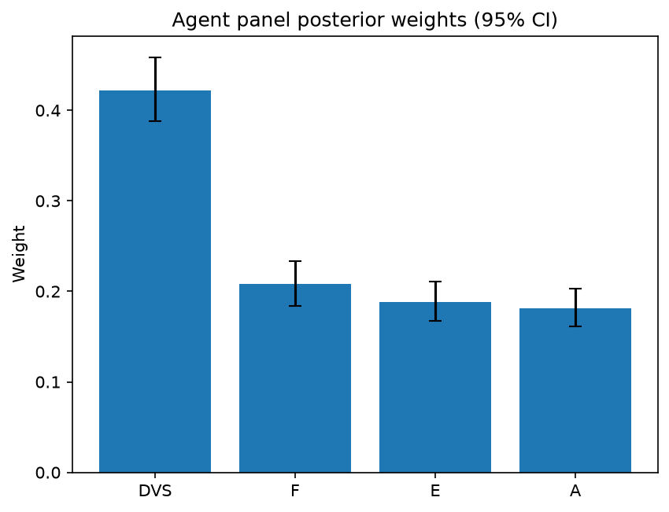

# Survey report: TrustRouter Agentic Full Panel (mistral:7b) -- Level L1: Top-level TrustRouter factors

Survey ID: `trustrouter-agentic-full-panel-mistral-2026-09-01-L1`

## Agent panel

- Agents contributing a valid response: 36
- Classical BWM consistency: 33/36 within threshold

| Criterion | Mean | 95% CI lower | 95% CI upper |
|---|---|---|---|
| DVS | 0.4222 | 0.3878 | 0.4588 |
| F | 0.2082 | 0.1839 | 0.2330 |
| E | 0.1880 | 0.1669 | 0.2111 |
| A | 0.1816 | 0.1611 | 0.2030 |

## Methodology

Each agent independently completed a Best-Worst Method (BWM) comparison: choosing the single most and least important criterion, then rating every criterion's importance relative to those two on a 1-9 scale. Individual responses were solved with the classical BWM linear program (Rezaei, 2015) for a consistency check, and combined across the panel with a hierarchical Bayesian model (Mohammadi and Rezaei, 2020).

36 agent response(s) were accepted into this result.

Every agent's run began with a QA precheck (its stated configuration verified against ground truth) and every accepted answer's self-reported sources were checked against what reference material was actually available to it; see the Per-agent detail section below and this survey's Conversation Log for each agent's specific results. Every response is schema-validated and independently, repeatedly sampled (never a single completion treated as ground truth); see `guardrails.py`. This survey's complete output is covered by a SHA-256 integrity manifest (`integrity_manifest.json`, `SHA256SUMS`), generated once this run finished, so any later alteration to these files is detectable.

### Charts

## Per-agent detail

### bim-coordinator-base-openmanus (`bim-coordinator-base-openmanus`)

- Role: BIM Coordinator
- Model: ollama/mistral:7b
- DID: `did:key:z6MkfgXoko5fk2HGb2Dg55FYiiR6QE6wDmBBMDZ2ZVrDpTXM`
- QA precheck: passed
- Sources used: (not reported)

**Answer:** `{"best": "DVS", "worst": "F", "best_to_others": {"DVS": 1, "E": 8, "A": 9, "F": 1}, "others_to_worst": {"F": 1, "E": 7, "A": 8, "DVS": 1}}`

**Reasoning:**

 Best factor: DVS
Worst factor: F

 DVS vs E: 8
DVS vs A: 9
DVS vs F: 1
E vs F: 7
A vs F: 8

### bim-coordinator-base-openmanus (`bim-coordinator-base-openmanus`)

- Role: BIM Coordinator
- Model: ollama/mistral:7b
- DID: `did:key:z6MkfgXoko5fk2HGb2Dg55FYiiR6QE6wDmBBMDZ2ZVrDpTXM`
- QA precheck: passed
- Sources used: (not reported)

**Answer:** `{"best": "DVS", "worst": "A", "best_to_others": {"DVS": 1, "F": 9, "E": 8, "A": 9}, "others_to_worst": {"A": 1, "F": 7, "E": 6, "DVS": 9}}`

**Reasoning:**

 Best factor: DVS
Worst factor: A

 DVS vs F: 9
DVS vs E: 8
DVS vs A: 9
F vs A: 7
E vs A: 6

### bim-coordinator-base-openmanus (`bim-coordinator-base-openmanus`)

- Role: BIM Coordinator
- Model: ollama/mistral:7b
- DID: `did:key:z6MkfgXoko5fk2HGb2Dg55FYiiR6QE6wDmBBMDZ2ZVrDpTXM`
- QA precheck: passed
- Sources used: (not reported)

**Answer:** `{"best": "DVS", "worst": "F", "best_to_others": {"DVS": 1, "E": 8, "A": 9, "F": 1}, "others_to_worst": {"F": 1, "E": 7, "A": 8, "DVS": 1}}`

**Reasoning:**

 Best factor: DVS
Worst factor: F

 DVS vs E: 8
DVS vs A: 9
DVS vs F: 1
E vs F: 7
A vs F: 8

### bim-coordinator-rag-openmanus (`bim-coordinator-rag-openmanus`)

- Role: BIM Coordinator
- Model: ollama/mistral:7b
- DID: `did:key:z6MktumSUSZKAYBkVBipYZSQPNfpzsRpDK78beTjh9uW4mqo`
- QA precheck: passed
- Sources used: (not reported)

**Answer:** `{"best": "DVS", "worst": "A", "best_to_others": {"DVS": 1, "F": 9, "E": 8, "A": 7}, "others_to_worst": {"A": 1, "F": 5, "E": 6, "DVS": 7}}`

**Reasoning:**

 Best factor: DVS
Worst factor: A

 DVS vs F: 9
DVS vs E: 8
DVS vs A: 7
F vs A: 5
E vs A: 6

### bim-coordinator-rag-openmanus (`bim-coordinator-rag-openmanus`)

- Role: BIM Coordinator
- Model: ollama/mistral:7b
- DID: `did:key:z6MktumSUSZKAYBkVBipYZSQPNfpzsRpDK78beTjh9uW4mqo`
- QA precheck: passed
- Sources used: (not reported)

**Answer:** `{"best": "DVS", "worst": "A", "best_to_others": {"DVS": 1, "F": 7, "E": 8, "A": 9}, "others_to_worst": {"A": 1, "F": 5, "E": 6, "DVS": 9}}`

**Reasoning:**

 Best factor: DVS
Worst factor: A

 DVS vs F: 7
DVS vs E: 8
DVS vs A: 9
F vs A: 5
E vs A: 6

### bim-coordinator-rag-openmanus (`bim-coordinator-rag-openmanus`)

- Role: BIM Coordinator
- Model: ollama/mistral:7b
- DID: `did:key:z6MktumSUSZKAYBkVBipYZSQPNfpzsRpDK78beTjh9uW4mqo`
- QA precheck: passed
- Sources used: (not reported)

**Answer:** `{"best": "DVS", "worst": "F", "best_to_others": {"DVS": 1, "E": 9, "A": 8, "F": 1}, "others_to_worst": {"F": 1, "E": 7, "A": 8, "DVS": 1}}`

**Reasoning:**

 Best factor: DVS
Worst factor: F

 DVS vs E: 9
DVS vs A: 8
DVS vs F: 1
E vs F: 7
A vs F: 8

### blockchain-engineer-base-openmanus (`blockchain-engineer-base-openmanus`)

- Role: Blockchain / DLT Engineer
- Model: ollama/mistral:7b
- DID: `did:key:z6MkvHuD6rK5V96sxUAp7Xr6vcwjpUwrx7XzHHteGJRC5JuJ`
- QA precheck: passed
- Sources used: (not reported)

**Answer:** `{"best": "DVS", "worst": "A", "best_to_others": {"DVS": 1, "F": 5, "E": 7, "A": 9}, "others_to_worst": {"A": 1, "F": 3, "E": 6, "DVS": 9}}`

**Reasoning:**

 Best factor: DVS
Worst factor: A

 DVS vs F: 5
DVS vs E: 7
DVS vs A: 9
F vs A: 3
E vs A: 6

### blockchain-engineer-base-openmanus (`blockchain-engineer-base-openmanus`)

- Role: Blockchain / DLT Engineer
- Model: ollama/mistral:7b
- DID: `did:key:z6MkvHuD6rK5V96sxUAp7Xr6vcwjpUwrx7XzHHteGJRC5JuJ`
- QA precheck: passed
- Sources used: (not reported)

**Answer:** `{"best": "DVS", "worst": "A", "best_to_others": {"DVS": 1, "F": 7, "E": 8, "A": 9}, "others_to_worst": {"A": 1, "F": 6, "E": 5, "DVS": 9}}`

**Reasoning:**

 Best factor: DVS
Worst factor: A

 DVS vs F: 7
DVS vs E: 8
DVS vs A: 9
F vs A: 6
E vs A: 5

### blockchain-engineer-base-openmanus (`blockchain-engineer-base-openmanus`)

- Role: Blockchain / DLT Engineer
- Model: ollama/mistral:7b
- DID: `did:key:z6MkvHuD6rK5V96sxUAp7Xr6vcwjpUwrx7XzHHteGJRC5JuJ`
- QA precheck: passed
- Sources used: (not reported)

**Answer:** `{"best": "DVS", "worst": "E", "best_to_others": {"DVS": 1, "F": 9, "A": 8, "E": 7}, "others_to_worst": {"E": 1, "F": 6, "A": 9, "DVS": 7}}`

**Reasoning:**

 Best factor: DVS
Worst factor: E

 DVS vs F: 9
DVS vs A: 8
DVS vs E: 7
F vs E: 6
A vs E: 9

### blockchain-engineer-rag-openmanus (`blockchain-engineer-rag-openmanus`)

- Role: Blockchain / DLT Engineer
- Model: ollama/mistral:7b
- DID: `did:key:z6MkmucumNftjXuU1cP1wD4kXfg8GN5qLwkyp7b89yPpKxwP`
- QA precheck: passed
- Sources used: (not reported)

**Answer:** `{"best": "DVS", "worst": "A", "best_to_others": {"DVS": 1, "F": 1, "E": 9, "A": 7}, "others_to_worst": {"A": 1, "F": 4, "E": 5, "DVS": 7}}`

**Reasoning:**

 Best factor: DVS
Worst factor: A

 DVS vs F: 1
DVS vs E: 9
DVS vs A: 7
F vs A: 4
E vs A: 5

### blockchain-engineer-rag-openmanus (`blockchain-engineer-rag-openmanus`)

- Role: Blockchain / DLT Engineer
- Model: ollama/mistral:7b
- DID: `did:key:z6MkmucumNftjXuU1cP1wD4kXfg8GN5qLwkyp7b89yPpKxwP`
- QA precheck: passed
- Sources used: (not reported)

**Answer:** `{"best": "DVS", "worst": "A", "best_to_others": {"DVS": 1, "F": 1, "E": 9, "A": 8}, "others_to_worst": {"A": 1, "F": 2, "E": 3, "DVS": 8}}`

**Reasoning:**

 Best factor: DVS
Worst factor: A

 DVS vs F: 1
DVS vs E: 9
DVS vs A: 8
F vs A: 2
E vs A: 3

### blockchain-engineer-rag-openmanus (`blockchain-engineer-rag-openmanus`)

- Role: Blockchain / DLT Engineer
- Model: ollama/mistral:7b
- DID: `did:key:z6MkmucumNftjXuU1cP1wD4kXfg8GN5qLwkyp7b89yPpKxwP`
- QA precheck: passed
- Sources used: (not reported)

**Answer:** `{"best": "DVS", "worst": "A", "best_to_others": {"DVS": 1, "F": 9, "E": 8, "A": 1}, "others_to_worst": {"A": 1, "F": 2, "E": 3, "DVS": 1}}`

**Reasoning:**

 Best factor: DVS
Worst factor: A

 DVS vs F: 9
DVS vs E: 8
DVS vs A: 1
F vs A: 2
E vs A: 3

Reasoning:
- DVS is the best factor because it measures the trustworthiness of the data, which is crucial for a blockchain/DLT deployment. The data's value and quality directly impact the reliability and integrity of the ledger. On the other hand, F (Technical Feasibility Fit) is important but secondary since it only considers how well an artefact fits ledger constraints, not its inherent trustworthiness.
- DVS is more important than E (Economic Value) because while economic value can be a factor in determining the importance of data, it does not necessarily make the data more trustworthy or reliable. On the other hand, high-value data that is not trustworthy could lead to significant issues in a blockchain/DLT deployment.
- DVS is more important than A (Attack Resistance) because while attack resistance is crucial for maintaining the security of the ledger, it does not directly impact the trustworthiness or quality of the data itself. High-quality, trustworthy data that is easily manipulated can still be useful in a blockchain/DLT deployment if proper security measures are in place to prevent attacks. However, low-quality, untrustworthy data cannot be salvaged no matter how secure the ledger is.
- F and A are less important than DVS because while they are both crucial factors for a successful blockchain/DLT deployment, they do not directly impact the trustworthiness or quality of the data itself. F (Technical Feasibility Fit) only considers how well an artefact fits ledger constraints, not its inherent trustworthiness. A (Attack Resistance) is important for maintaining the security of the ledger but does not necessarily make the data more trustworthy or reliable.
- E and A are less important than DVS because while they are both crucial factors for a successful blockchain/DLT deployment, they do not directly impact the trustworthiness or quality of the data itself. Economic value can be a factor in determining the importance of data, but it does not necessarily make the data more trustworthy or reliable. Attack resistance is important for maintaining the security of the ledger but does not necessarily make the data more trustworthy or reliable.

### compliance-officer-base-openmanus (`compliance-officer-base-openmanus`)

- Role: Compliance and Regulatory Officer
- Model: ollama/mistral:7b
- DID: `did:key:z6MkfbCRS5qnxtVpnPvezz8VBQGuTFfkEPexhbtSd5ZwJVgY`
- QA precheck: passed
- Sources used: (not reported)

**Answer:** `{"best": "DVS", "worst": "A", "best_to_others": {"DVS": 1, "F": 9, "E": 8, "A": 1}, "others_to_worst": {"A": 1, "F": 7, "E": 6, "DVS": 1}}`

**Reasoning:**

 Best factor: DVS
Worst factor: A

 DVS vs F: 9
DVS vs E: 8
DVS vs A: 1
F vs A: 7
E vs A: 6

### compliance-officer-base-openmanus (`compliance-officer-base-openmanus`)

- Role: Compliance and Regulatory Officer
- Model: ollama/mistral:7b
- DID: `did:key:z6MkfbCRS5qnxtVpnPvezz8VBQGuTFfkEPexhbtSd5ZwJVgY`
- QA precheck: passed
- Sources used: (not reported)

**Answer:** `{"best": "DVS", "worst": "A", "best_to_others": {"DVS": 1, "F": 8, "E": 7, "A": 9}, "others_to_worst": {"A": 1, "F": 5, "E": 6, "DVS": 9}}`

**Reasoning:**

 Best factor: DVS
Worst factor: A

 DVS vs F: 8
DVS vs E: 7
DVS vs A: 9
F vs A: 5
E vs A: 6

### compliance-officer-base-openmanus (`compliance-officer-base-openmanus`)

- Role: Compliance and Regulatory Officer
- Model: ollama/mistral:7b
- DID: `did:key:z6MkfbCRS5qnxtVpnPvezz8VBQGuTFfkEPexhbtSd5ZwJVgY`
- QA precheck: passed
- Sources used: (not reported)

**Answer:** `{"best": "DVS", "worst": "A", "best_to_others": {"DVS": 1, "F": 9, "E": 8, "A": 1}, "others_to_worst": {"A": 1, "F": 7, "E": 6, "DVS": 1}}`

**Reasoning:**

 Best factor: DVS
Worst factor: A

 DVS vs F: 9
DVS vs E: 8
DVS vs A: 1
F vs A: 7
E vs A: 6

### compliance-officer-rag-openmanus (`compliance-officer-rag-openmanus`)

- Role: Compliance and Regulatory Officer
- Model: ollama/mistral:7b
- DID: `did:key:z6MkfA5TGsnWh3DK59EkbsAtJhFdtWUr86GzaTTLgCcq7FDt`
- QA precheck: passed
- Sources used: (not reported)

**Answer:** `{"best": "DVS", "worst": "A", "best_to_others": {"DVS": 1, "F": 9, "E": 8, "A": 7}, "others_to_worst": {"A": 1, "F": 6, "E": 5, "DVS": 7}}`

**Reasoning:**

 Best factor: DVS
Worst factor: A

 DVS vs F: 9
DVS vs E: 8
DVS vs A: 7
F vs A: 6
E vs A: 5

### compliance-officer-rag-openmanus (`compliance-officer-rag-openmanus`)

- Role: Compliance and Regulatory Officer
- Model: ollama/mistral:7b
- DID: `did:key:z6MkfA5TGsnWh3DK59EkbsAtJhFdtWUr86GzaTTLgCcq7FDt`
- QA precheck: passed
- Sources used: (not reported)

**Answer:** `{"best": "DVS", "worst": "A", "best_to_others": {"DVS": 1, "F": 1, "E": 9, "A": 3}, "others_to_worst": {"A": 1, "F": 7, "E": 2, "DVS": 3}}`

**Reasoning:**

 Best factor: DVS
Worst factor: A

 DVS vs F: 1
DVS vs E: 9
DVS vs A: 3
F vs A: 7
E vs A: 2

### compliance-officer-rag-openmanus (`compliance-officer-rag-openmanus`)

- Role: Compliance and Regulatory Officer
- Model: ollama/mistral:7b
- DID: `did:key:z6MkfA5TGsnWh3DK59EkbsAtJhFdtWUr86GzaTTLgCcq7FDt`
- QA precheck: passed
- Sources used: (not reported)

**Answer:** `{"best": "DVS", "worst": "A", "best_to_others": {"DVS": 1, "F": 1, "E": 9, "A": 7}, "others_to_worst": {"A": 1, "F": 8, "E": 6, "DVS": 7}}`

**Reasoning:**

 Best factor: DVS (Data Value Score)
Worst factor: A (Attack Resistance)

 DVS vs F: 1
DVS vs E: 9
DVS vs A: 7
F vs A: 8
E vs A: 6

### data-engineer-base-openmanus (`data-engineer-base-openmanus`)

- Role: Data Engineering Specialist
- Model: ollama/mistral:7b
- DID: `did:key:z6MktFhQynyK3hjjScxU7X5N1KeprxH9DRnj8UgC2dqicMmW`
- QA precheck: passed
- Sources used: (not reported)

**Answer:** `{"best": "DVS", "worst": "A", "best_to_others": {"DVS": 1, "F": 9, "E": 8, "A": 7}, "others_to_worst": {"A": 1, "F": 1, "E": 2, "DVS": 7}}`

**Reasoning:**

 Best factor: DVS (Data Value Score)
Worst factor: A (Attack Resistance)

 DVS vs F: 9
DVS vs E: 8
DVS vs A: 7
F vs A: 1
E vs A: 2

### data-engineer-base-openmanus (`data-engineer-base-openmanus`)

- Role: Data Engineering Specialist
- Model: ollama/mistral:7b
- DID: `did:key:z6MktFhQynyK3hjjScxU7X5N1KeprxH9DRnj8UgC2dqicMmW`
- QA precheck: passed
- Sources used: (not reported)

**Answer:** `{"best": "DVS", "worst": "A", "best_to_others": {"DVS": 1, "F": 9, "E": 8, "A": 1}, "others_to_worst": {"A": 1, "F": 2, "E": 3, "DVS": 1}}`

**Reasoning:**

 Best factor: DVS
Worst factor: A

 DVS vs F: 9
DVS vs E: 8
DVS vs A: 1
F vs A: 2
E vs A: 3

### data-engineer-base-openmanus (`data-engineer-base-openmanus`)

- Role: Data Engineering Specialist
- Model: ollama/mistral:7b
- DID: `did:key:z6MktFhQynyK3hjjScxU7X5N1KeprxH9DRnj8UgC2dqicMmW`
- QA precheck: passed
- Sources used: (not reported)

**Answer:** `{"best": "DVS", "worst": "A", "best_to_others": {"DVS": 1, "F": 7, "E": 8, "A": 1}, "others_to_worst": {"A": 1, "F": 9, "E": 2, "DVS": 1}}`

**Reasoning:**

 Best factor: DVS (Data Value Score)
Worst factor: A (Attack Resistance)

 DVS vs F: 7
DVS vs E: 8
DVS vs A: 1
F vs A: 9
E vs A: 2

### data-engineer-rag-openmanus (`data-engineer-rag-openmanus`)

- Role: Data Engineering Specialist
- Model: ollama/mistral:7b
- DID: `did:key:z6MkiWQoSrmLM3rsTnbbnu2vhEtsqyMtVskAeNJy3ryeBDJG`
- QA precheck: passed
- Sources used: (not reported)

**Answer:** `{"best": "DVS", "worst": "A", "best_to_others": {"DVS": 1, "F": 9, "E": 8, "A": 1}, "others_to_worst": {"A": 1, "F": 7, "E": 6, "DVS": 1}}`

**Reasoning:**

 Assuming that "higher / more" is better for all criteria as stated in the corpus, the best criterion would be DVS (Data Value Score) and the worst criterion would be A (Attack Resistance).

Best factor: DVS
Worst factor: A

 DVS vs F: 9
DVS vs E: 8
DVS vs A: 1
F vs A: 7
E vs A: 6

### data-engineer-rag-openmanus (`data-engineer-rag-openmanus`)

- Role: Data Engineering Specialist
- Model: ollama/mistral:7b
- DID: `did:key:z6MkiWQoSrmLM3rsTnbbnu2vhEtsqyMtVskAeNJy3ryeBDJG`
- QA precheck: passed
- Sources used: (not reported)

**Answer:** `{"best": "DVS", "worst": "A", "best_to_others": {"DVS": 1, "F": 9, "E": 8, "A": 1}, "others_to_worst": {"A": 1, "F": 2, "E": 3, "DVS": 1}}`

**Reasoning:**

 Assuming that higher values are better for all criteria, the best criterion is DVS (Data Value Score) and the worst criterion is A (Attack Resistance).

Best factor: DVS
Worst factor: A

 DVS vs F: 9
DVS vs E: 8
DVS vs A: 1
F vs A: 2
E vs A: 3

### data-engineer-rag-openmanus (`data-engineer-rag-openmanus`)

- Role: Data Engineering Specialist
- Model: ollama/mistral:7b
- DID: `did:key:z6MkiWQoSrmLM3rsTnbbnu2vhEtsqyMtVskAeNJy3ryeBDJG`
- QA precheck: passed
- Sources used: (not reported)

**Answer:** `{"best": "DVS", "worst": "A", "best_to_others": {"DVS": 1, "F": 9, "E": 9, "A": 1}, "others_to_worst": {"A": 1, "F": 3, "E": 5, "DVS": 1}}`

**Reasoning:**

 The question asks for the best and worst factors among DVS (Data Value Score), F (Technical Feasibility Fit), E (Economic Value), and A (Attack Resistance) when comparing them in a multiplicative context for the TrustRouter composite formula.

Best factor: DVS
Worst factor: A

 DVS vs F: 9
DVS vs E: 9
DVS vs A: 1
F vs A: 3
E vs A: 5

### project-manager-base-openmanus (`project-manager-base-openmanus`)

- Role: Construction Project Manager
- Model: ollama/mistral:7b
- DID: `did:key:z6MkmfTBzM8STi6eZQjBtyYUdmW4ALLgFT4436ojkBi1QXnf`
- QA precheck: passed
- Sources used: (not reported)

**Answer:** `{"best": "DVS", "worst": "A", "best_to_others": {"DVS": 1, "F": 9, "E": 7, "A": 8}, "others_to_worst": {"A": 1, "F": 6, "E": 5, "DVS": 8}}`

**Reasoning:**

 Best factor: DVS
Worst factor: A

 DVS vs F: 9
DVS vs E: 7
DVS vs A: 8
F vs A: 6
E vs A: 5

### project-manager-base-openmanus (`project-manager-base-openmanus`)

- Role: Construction Project Manager
- Model: ollama/mistral:7b
- DID: `did:key:z6MkmfTBzM8STi6eZQjBtyYUdmW4ALLgFT4436ojkBi1QXnf`
- QA precheck: passed
- Sources used: (not reported)

**Answer:** `{"best": "DVS", "worst": "A", "best_to_others": {"DVS": 1, "F": 9, "E": 8, "A": 7}, "others_to_worst": {"A": 1, "F": 2, "E": 3, "DVS": 7}}`

**Reasoning:**

 Best factor: DVS (Data Value Score)
Worst factor: A (Attack Resistance)

Reasoning:
- DVS is the most important factor as it directly affects the trustworthiness and reliability of the data, which is crucial for any construction project. The higher the DVS, the more valuable and reliable the data is.
- Attack Resistance (A) is least important because even if a system has high attack resistance, if the data itself is not trustworthy or valuable, it does not significantly improve the overall trustworthiness of the data stored on the blockchain. In a construction project context, attack resistance is important but secondary to the quality and reliability of the data itself.

 DVS vs F: 9
DVS vs E: 8
DVS vs A: 7
F vs A: 2
E vs A: 3

### project-manager-base-openmanus (`project-manager-base-openmanus`)

- Role: Construction Project Manager
- Model: ollama/mistral:7b
- DID: `did:key:z6MkmfTBzM8STi6eZQjBtyYUdmW4ALLgFT4436ojkBi1QXnf`
- QA precheck: passed
- Sources used: (not reported)

**Answer:** `{"best": "DVS", "worst": "A", "best_to_others": {"DVS": 1, "F": 8, "E": 7, "A": 9}, "others_to_worst": {"A": 1, "F": 3, "E": 5, "DVS": 9}}`

**Reasoning:**

 Best factor: DVS
Worst factor: A

 DVS vs F: 8
DVS vs E: 7
DVS vs A: 9
F vs A: 3
E vs A: 5

### project-manager-rag-openmanus (`project-manager-rag-openmanus`)

- Role: Construction Project Manager
- Model: ollama/mistral:7b
- DID: `did:key:z6MkoTifVHP1pHqn6fbzUhAKR4qjAt634zz49Rtj41amKoDx`
- QA precheck: passed
- Sources used: (not reported)

**Answer:** `{"best": "DVS", "worst": "A", "best_to_others": {"DVS": 1, "F": 9, "E": 8, "A": 7}, "others_to_worst": {"A": 1, "F": 5, "E": 6, "DVS": 7}}`

**Reasoning:**

 Best factor: DVS
Worst factor: A

 DVS vs F: 9
DVS vs E: 8
DVS vs A: 7
F vs A: 5
E vs A: 6

### project-manager-rag-openmanus (`project-manager-rag-openmanus`)

- Role: Construction Project Manager
- Model: ollama/mistral:7b
- DID: `did:key:z6MkoTifVHP1pHqn6fbzUhAKR4qjAt634zz49Rtj41amKoDx`
- QA precheck: passed
- Sources used: (not reported)

**Answer:** `{"best": "DVS", "worst": "A", "best_to_others": {"DVS": 1, "F": 7, "E": 8, "A": 1}, "others_to_worst": {"A": 1, "F": 3, "E": 5, "DVS": 1}}`

**Reasoning:**

 Best factor: DVS
Worst factor: A

 DVS vs F: 7
DVS vs E: 8
DVS vs A: 1
F vs A: 3
E vs A: 5

### project-manager-rag-openmanus (`project-manager-rag-openmanus`)

- Role: Construction Project Manager
- Model: ollama/mistral:7b
- DID: `did:key:z6MkoTifVHP1pHqn6fbzUhAKR4qjAt634zz49Rtj41amKoDx`
- QA precheck: passed
- Sources used: (not reported)

**Answer:** `{"best": "DVS", "worst": "A", "best_to_others": {"DVS": 1, "F": 1, "E": 9, "A": 3}, "others_to_worst": {"A": 1, "F": 7, "E": 5, "DVS": 3}}`

**Reasoning:**

 Best factor: DVS
Worst factor: A

 DVS vs F: 1
DVS vs E: 9
DVS vs A: 3
F vs A: 7
E vs A: 5

### structural-engineer-base-openmanus (`structural-engineer-base-openmanus`)

- Role: Structural Engineer
- Model: ollama/mistral:7b
- DID: `did:key:z6MkneKsSUhTxF3pB1EzYLvMTxPBCQPtxRb2F4THAHgsHiqS`
- QA precheck: passed
- Sources used: (not reported)

**Answer:** `{"best": "DVS", "worst": "A", "best_to_others": {"DVS": 1, "F": 9, "E": 8, "A": 7}, "others_to_worst": {"A": 1, "F": 2, "E": 3, "DVS": 7}}`

**Reasoning:**

 Best factor: DVS
Worst factor: A

 DVS vs F: 9
DVS vs E: 8
DVS vs A: 7
F vs A: 2
E vs A: 3

### structural-engineer-base-openmanus (`structural-engineer-base-openmanus`)

- Role: Structural Engineer
- Model: ollama/mistral:7b
- DID: `did:key:z6MkneKsSUhTxF3pB1EzYLvMTxPBCQPtxRb2F4THAHgsHiqS`
- QA precheck: passed
- Sources used: (not reported)

**Answer:** `{"best": "DVS", "worst": "A", "best_to_others": {"DVS": 1, "F": 9, "E": 8, "A": 7}, "others_to_worst": {"A": 1, "F": 2, "E": 3, "DVS": 7}}`

**Reasoning:**

 Best factor: DVS
Worst factor: A

 DVS vs F: 9
DVS vs E: 8
DVS vs A: 7
F vs A: 2
E vs A: 3

### structural-engineer-base-openmanus (`structural-engineer-base-openmanus`)

- Role: Structural Engineer
- Model: ollama/mistral:7b
- DID: `did:key:z6MkneKsSUhTxF3pB1EzYLvMTxPBCQPtxRb2F4THAHgsHiqS`
- QA precheck: passed
- Sources used: (not reported)

**Answer:** `{"best": "DVS", "worst": "A", "best_to_others": {"DVS": 1, "F": 9, "E": 8, "A": 7}, "others_to_worst": {"A": 1, "F": 2, "E": 3, "DVS": 7}}`

**Reasoning:**

 Best factor: DVS
Worst factor: A

 DVS vs F: 9
DVS vs E: 8
DVS vs A: 7
F vs A: 2
E vs A: 3

### structural-engineer-rag-openmanus (`structural-engineer-rag-openmanus`)

- Role: Structural Engineer
- Model: ollama/mistral:7b
- DID: `did:key:z6Mkq9sxQdnLDNKYHKSbcFf6ApWb78WMj6E8VgRRcmWNpJib`
- QA precheck: passed
- Sources used: (not reported)

**Answer:** `{"best": "DVS", "worst": "A", "best_to_others": {"DVS": 1, "F": 7, "E": 9, "A": 1}, "others_to_worst": {"A": 1, "F": 5, "E": 6, "DVS": 1}}`

**Reasoning:**

 Best factor: DVS
Worst factor: A

 DVS vs F: 7
DVS vs E: 9
DVS vs A: 1
F vs A: 5
E vs A: 6

### structural-engineer-rag-openmanus (`structural-engineer-rag-openmanus`)

- Role: Structural Engineer
- Model: ollama/mistral:7b
- DID: `did:key:z6Mkq9sxQdnLDNKYHKSbcFf6ApWb78WMj6E8VgRRcmWNpJib`
- QA precheck: passed
- Sources used: (not reported)

**Answer:** `{"best": "DVS", "worst": "A", "best_to_others": {"DVS": 1, "F": 9, "E": 7, "A": 8}, "others_to_worst": {"A": 1, "F": 2, "E": 3, "DVS": 8}}`

**Reasoning:**

 Best factor: DVS
Worst factor: A

 DVS vs F: 9
DVS vs E: 7
DVS vs A: 8
F vs A: 2
E vs A: 3

### structural-engineer-rag-openmanus (`structural-engineer-rag-openmanus`)

- Role: Structural Engineer
- Model: ollama/mistral:7b
- DID: `did:key:z6Mkq9sxQdnLDNKYHKSbcFf6ApWb78WMj6E8VgRRcmWNpJib`
- QA precheck: passed
- Sources used: (not reported)

**Answer:** `{"best": "DVS", "worst": "A", "best_to_others": {"DVS": 1, "F": 1, "E": 9, "A": 2}, "others_to_worst": {"A": 1, "F": 3, "E": 8, "DVS": 2}}`

**Reasoning:**

 Best factor: DVS
Worst factor: A

 DVS vs F: 1
DVS vs E: 9
DVS vs A: 2
F vs A: 3
E vs A: 8
