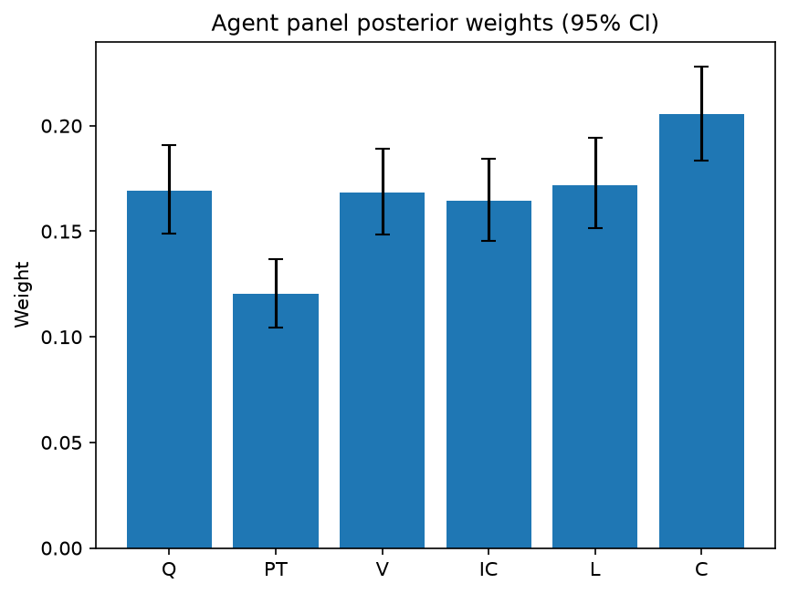

# Survey report: TrustRouter Agentic Full Panel (mistral:7b) -- Level L2: Six trust dimensions inside DVS

Survey ID: `trustrouter-agentic-full-panel-mistral-2026-09-01-L2`

## Agent panel

- Agents contributing a valid response: 36
- Classical BWM consistency: 35/36 within threshold

| Criterion | Mean | 95% CI lower | 95% CI upper |
|---|---|---|---|
| Q | 0.1694 | 0.1489 | 0.1907 |
| PT | 0.1202 | 0.1046 | 0.1367 |
| V | 0.1684 | 0.1485 | 0.1892 |
| IC | 0.1646 | 0.1453 | 0.1844 |
| L | 0.1720 | 0.1516 | 0.1944 |
| C | 0.2055 | 0.1837 | 0.2282 |

## Methodology

Each agent independently completed a Best-Worst Method (BWM) comparison: choosing the single most and least important criterion, then rating every criterion's importance relative to those two on a 1-9 scale. Individual responses were solved with the classical BWM linear program (Rezaei, 2015) for a consistency check, and combined across the panel with a hierarchical Bayesian model (Mohammadi and Rezaei, 2020).

36 agent response(s) were accepted into this result.

Every agent's run began with a QA precheck (its stated configuration verified against ground truth) and every accepted answer's self-reported sources were checked against what reference material was actually available to it; see the Per-agent detail section below and this survey's Conversation Log for each agent's specific results. Every response is schema-validated and independently, repeatedly sampled (never a single completion treated as ground truth); see `guardrails.py`. This survey's complete output is covered by a SHA-256 integrity manifest (`integrity_manifest.json`, `SHA256SUMS`), generated once this run finished, so any later alteration to these files is detectable.

### Charts

## Per-agent detail

### bim-coordinator-base-openmanus (`bim-coordinator-base-openmanus`)

- Role: BIM Coordinator
- Model: ollama/mistral:7b
- DID: `did:key:z6MkfgXoko5fk2HGb2Dg55FYiiR6QE6wDmBBMDZ2ZVrDpTXM`
- QA precheck: passed
- Sources used: (not reported)

**Answer:** `{"best": "C", "worst": "PT", "best_to_others": {"C": 1, "Q": 9, "V": 7, "IC": 8, "L": 6, "PT": 1}, "others_to_worst": {"PT": 1, "Q": 3, "V": 5, "IC": 4, "L": 2, "C": 1}}`

**Reasoning:**

 You are comparing the following criteria:
- Q: Quality
- PT: Provenance Trust
- V: Verification Strength
- IC: Independent Confirmation
- L: Legal Compliance
- C: Criticality

Best factor: C (Criticality)
Worst factor: PT (Provenance Trust)

 C vs Q: 9
C vs V: 7
C vs IC: 8
C vs L: 6
C vs PT: 1
Q vs PT: 3
V vs PT: 5
IC vs PT: 4
L vs PT: 2

### bim-coordinator-base-openmanus (`bim-coordinator-base-openmanus`)

- Role: BIM Coordinator
- Model: ollama/mistral:7b
- DID: `did:key:z6MkfgXoko5fk2HGb2Dg55FYiiR6QE6wDmBBMDZ2ZVrDpTXM`
- QA precheck: passed
- Sources used: (not reported)

**Answer:** `{"best": "C", "worst": "PT", "best_to_others": {"C": 1, "Q": 9, "V": 8, "IC": 7, "L": 6, "PT": 1}, "others_to_worst": {"PT": 1, "Q": 4, "V": 5, "IC": 3, "L": 2, "C": 1}}`

**Reasoning:**

 You are comparing the following criteria:
- Q: Quality
- PT: Provenance Trust
- V: Verification Strength
- IC: Independent Confirmation
- L: Legal Compliance
- C: Criticality

Which ONE criterion is BEST (most important), and which ONE is WORST (least important)? Answer in EXACTLY these two lines, using the bare code only (one of Q, PT, V, IC, L, C):
Best factor: C
Worst factor: PT

 C vs Q: 9
C vs V: 8
C vs IC: 7
C vs L: 6
C vs PT: 1
Q vs PT: 4
V vs PT: 5
IC vs PT: 3
L vs PT: 2

### bim-coordinator-base-openmanus (`bim-coordinator-base-openmanus`)

- Role: BIM Coordinator
- Model: ollama/mistral:7b
- DID: `did:key:z6MkfgXoko5fk2HGb2Dg55FYiiR6QE6wDmBBMDZ2ZVrDpTXM`
- QA precheck: passed
- Sources used: (not reported)

**Answer:** `{"best": "C", "worst": "PT", "best_to_others": {"C": 1, "Q": 7, "V": 9, "IC": 8, "L": 6, "PT": 1}, "others_to_worst": {"PT": 1, "Q": 5, "V": 3, "IC": 2, "L": 4, "C": 1}}`

**Reasoning:**

 You are comparing the following criteria:
- Q: Quality
- PT: Provenance Trust
- V: Verification Strength
- IC: Independent Confirmation
- L: Legal Compliance
- C: Criticality

Best factor: C (Criticality)
Worst factor: PT (Provenance Trust)

 C vs Q: 7
C vs V: 9
C vs IC: 8
C vs L: 6
C vs PT: 1
Q vs PT: 5
V vs PT: 3
IC vs PT: 2
L vs PT: 4

### bim-coordinator-rag-openmanus (`bim-coordinator-rag-openmanus`)

- Role: BIM Coordinator
- Model: ollama/mistral:7b
- DID: `did:key:z6MktumSUSZKAYBkVBipYZSQPNfpzsRpDK78beTjh9uW4mqo`
- QA precheck: passed
- Sources used: (not reported)

**Answer:** `{"best": "C", "worst": "PT", "best_to_others": {"C": 1, "Q": 1, "V": 2, "IC": 3, "L": 4, "PT": 9}, "others_to_worst": {"PT": 1, "Q": 7, "V": 8, "IC": 9, "L": 9, "C": 9}}`

**Reasoning:**

 You are comparing the following criteria:
- Q: Quality
- PT: Provenance Trust
- V: Verification Strength
- IC: Independent Confirmation
- L: Legal Compliance
- C: Criticality

Best factor: C (Criticality)
Worst factor: PT (Provenance Trust)

 C vs Q: 1
C vs V: 2
C vs IC: 3
C vs L: 4
C vs PT: 9
Q vs PT: 7
V vs PT: 8
IC vs PT: 9
L vs PT: 9

### bim-coordinator-rag-openmanus (`bim-coordinator-rag-openmanus`)

- Role: BIM Coordinator
- Model: ollama/mistral:7b
- DID: `did:key:z6MktumSUSZKAYBkVBipYZSQPNfpzsRpDK78beTjh9uW4mqo`
- QA precheck: passed
- Sources used: (not reported)

**Answer:** `{"best": "C", "worst": "PT", "best_to_others": {"C": 1, "Q": 1, "V": 2, "IC": 3, "L": 4, "PT": 9}, "others_to_worst": {"PT": 1, "Q": 8, "V": 7, "IC": 6, "L": 5, "C": 9}}`

**Reasoning:**

 You are comparing the following criteria:
- Q: Quality
- PT: Provenance Trust
- V: Verification Strength
- IC: Independent Confirmation
- L: Legal Compliance
- C: Criticality

Best factor: C (Criticality)
Worst factor: PT (Provenance Trust)

 C vs Q: 1
C vs V: 2
C vs IC: 3
C vs L: 4
C vs PT: 9
Q vs PT: 8
V vs PT: 7
IC vs PT: 6
L vs PT: 5

### bim-coordinator-rag-openmanus (`bim-coordinator-rag-openmanus`)

- Role: BIM Coordinator
- Model: ollama/mistral:7b
- DID: `did:key:z6MktumSUSZKAYBkVBipYZSQPNfpzsRpDK78beTjh9uW4mqo`
- QA precheck: passed
- Sources used: (not reported)

**Answer:** `{"best": "C", "worst": "PT", "best_to_others": {"C": 1, "Q": 2, "V": 3, "IC": 1, "L": 4, "PT": 9}, "others_to_worst": {"PT": 1, "Q": 8, "V": 7, "IC": 6, "L": 5, "C": 9}}`

**Reasoning:**

 You are comparing the following criteria:
- Q: Quality
- PT: Provenance Trust
- V: Verification Strength
- IC: Independent Confirmation
- L: Legal Compliance
- C: Criticality

Which ONE criterion is BEST (most important), and which ONE is WORST (least important)? Answer in EXACTLY these two lines, using the bare code only (one of Q, PT, V, IC, L, C):
Best factor: C
Worst factor: PT

 C vs Q: 2
C vs V: 3
C vs IC: 1
C vs L: 4
C vs PT: 9
Q vs PT: 8
V vs PT: 7
IC vs PT: 6
L vs PT: 5

### blockchain-engineer-base-openmanus (`blockchain-engineer-base-openmanus`)

- Role: Blockchain / DLT Engineer
- Model: ollama/mistral:7b
- DID: `did:key:z6MkvHuD6rK5V96sxUAp7Xr6vcwjpUwrx7XzHHteGJRC5JuJ`
- QA precheck: passed
- Sources used: (not reported)

**Answer:** `{"best": "Q", "worst": "C", "best_to_others": {"Q": 1, "PT": 7, "V": 8, "IC": 6, "L": 5, "C": 9}, "others_to_worst": {"C": 1, "PT": 3, "V": 4, "IC": 2, "L": 1, "Q": 9}}`

**Reasoning:**

 Best factor: Q
Worst factor: C

 Q vs PT: 7
Q vs V: 8
Q vs IC: 6
Q vs L: 5
Q vs C: 9
PT vs C: 3
V vs C: 4
IC vs C: 2
L vs C: 1

### blockchain-engineer-base-openmanus (`blockchain-engineer-base-openmanus`)

- Role: Blockchain / DLT Engineer
- Model: ollama/mistral:7b
- DID: `did:key:z6MkvHuD6rK5V96sxUAp7Xr6vcwjpUwrx7XzHHteGJRC5JuJ`
- QA precheck: passed
- Sources used: (not reported)

**Answer:** `{"best": "Q", "worst": "C", "best_to_others": {"Q": 1, "PT": 7, "V": 8, "IC": 6, "L": 5, "C": 9}, "others_to_worst": {"C": 1, "PT": 4, "V": 7, "IC": 6, "L": 5, "Q": 9}}`

**Reasoning:**

 Best factor: Q (Quality)
Worst factor: C (Criticality)

Reasoning:

The Quality criterion is considered the best because it directly impacts the technical cleanliness and integrity of the data, which is crucial for any blockchain/DLT deployment. On the other hand, the Criticality criterion is considered the least important since it measures the impact if the data is wrong rather than its inherent trustworthiness or verifiability.

In a blockchain/DLT context, ensuring the quality of data is paramount as any errors or inconsistencies can propagate and cause significant issues throughout the entire system. Conversely, while understanding the potential impact of incorrect data is important for risk assessment and decision-making, it does not directly affect the technical feasibility or trustworthiness of the data itself.

 Q vs PT: 7 (Quality is more important than Provenance Trust)
Q vs V: 8 (Quality is extremely more important than Verification Strength)
Q vs IC: 6 (Quality is more important than Independent Confirmation)
Q vs L: 5 (Quality is less important than Legal Compliance)
Q vs C: 9 (Quality is extremely more important than Criticality)
PT vs C: 4 (Provenance Trust is less important than Criticality)
V vs C: 7 (Verification Strength is more important than Criticality)
IC vs C: 6 (Independent Confirmation is more important than Criticality)
L vs C: 5 (Legal Compliance is less important than Criticality)

### blockchain-engineer-base-openmanus (`blockchain-engineer-base-openmanus`)

- Role: Blockchain / DLT Engineer
- Model: ollama/mistral:7b
- DID: `did:key:z6MkvHuD6rK5V96sxUAp7Xr6vcwjpUwrx7XzHHteGJRC5JuJ`
- QA precheck: passed
- Sources used: (not reported)

**Answer:** `{"best": "C", "worst": "PT", "best_to_others": {"C": 1, "Q": 8, "V": 7, "IC": 9, "L": 6, "PT": 1}, "others_to_worst": {"PT": 1, "Q": 2, "V": 3, "IC": 4, "L": 5, "C": 1}}`

**Reasoning:**

 Best factor: C
Worst factor: PT

 C vs Q: 8
C vs V: 7
C vs IC: 9
C vs L: 6
C vs PT: 1
Q vs PT: 2
V vs PT: 3
IC vs PT: 4
L vs PT: 5

### blockchain-engineer-rag-openmanus (`blockchain-engineer-rag-openmanus`)

- Role: Blockchain / DLT Engineer
- Model: ollama/mistral:7b
- DID: `did:key:z6MkmucumNftjXuU1cP1wD4kXfg8GN5qLwkyp7b89yPpKxwP`
- QA precheck: passed
- Sources used: (not reported)

**Answer:** `{"best": "Q", "worst": "C", "best_to_others": {"Q": 1, "PT": 3, "V": 2, "IC": 4, "L": 5, "C": 1}, "others_to_worst": {"C": 1, "PT": 7, "V": 6, "IC": 8, "L": 9, "Q": 1}}`

**Reasoning:**

 Best factor: Q (Quality)
Worst factor: C (Criticality)

 Q vs PT: 3
Q vs V: 2
Q vs IC: 4
Q vs L: 5
Q vs C: 1
PT vs C: 7
V vs C: 6
IC vs C: 8
L vs C: 9

### blockchain-engineer-rag-openmanus (`blockchain-engineer-rag-openmanus`)

- Role: Blockchain / DLT Engineer
- Model: ollama/mistral:7b
- DID: `did:key:z6MkmucumNftjXuU1cP1wD4kXfg8GN5qLwkyp7b89yPpKxwP`
- QA precheck: passed
- Sources used: (not reported)

**Answer:** `{"best": "Q", "worst": "C", "best_to_others": {"Q": 1, "PT": 3, "V": 4, "IC": 2, "L": 5, "C": 1}, "others_to_worst": {"C": 1, "PT": 7, "V": 6, "IC": 8, "L": 9, "Q": 1}}`

**Reasoning:**

 Best factor: Q
Worst factor: C

 Q vs PT: 3
Q vs V: 4
Q vs IC: 2
Q vs L: 5
Q vs C: 1
PT vs C: 7
V vs C: 6
IC vs C: 8
L vs C: 9

### blockchain-engineer-rag-openmanus (`blockchain-engineer-rag-openmanus`)

- Role: Blockchain / DLT Engineer
- Model: ollama/mistral:7b
- DID: `did:key:z6MkmucumNftjXuU1cP1wD4kXfg8GN5qLwkyp7b89yPpKxwP`
- QA precheck: passed
- Sources used: (not reported)

**Answer:** `{"best": "V", "worst": "C", "best_to_others": {"V": 1, "Q": 6, "PT": 7, "IC": 8, "L": 5, "C": 1}, "others_to_worst": {"C": 1, "Q": 4, "PT": 3, "IC": 2, "L": 9, "V": 1}}`

**Reasoning:**

 Best factor: V
Worst factor: C

 V vs Q: 6
V vs PT: 7
V vs IC: 8
V vs L: 5
V vs C: 1
Q vs C: 4
PT vs C: 3
IC vs C: 2
L vs C: 9

### compliance-officer-base-openmanus (`compliance-officer-base-openmanus`)

- Role: Compliance and Regulatory Officer
- Model: ollama/mistral:7b
- DID: `did:key:z6MkfbCRS5qnxtVpnPvezz8VBQGuTFfkEPexhbtSd5ZwJVgY`
- QA precheck: passed
- Sources used: (not reported)

**Answer:** `{"best": "C", "worst": "PT", "best_to_others": {"C": 1, "Q": 7, "V": 8, "IC": 9, "L": 6, "PT": 1}, "others_to_worst": {"PT": 1, "Q": 2, "V": 3, "IC": 4, "L": 5, "C": 1}}`

**Reasoning:**

 Best factor: C
Worst factor: PT

 C vs Q: 7
C vs V: 8
C vs IC: 9
C vs L: 6
C vs PT: 1
Q vs PT: 2
V vs PT: 3
IC vs PT: 4
L vs PT: 5

### compliance-officer-base-openmanus (`compliance-officer-base-openmanus`)

- Role: Compliance and Regulatory Officer
- Model: ollama/mistral:7b
- DID: `did:key:z6MkfbCRS5qnxtVpnPvezz8VBQGuTFfkEPexhbtSd5ZwJVgY`
- QA precheck: passed
- Sources used: (not reported)

**Answer:** `{"best": "C", "worst": "PT", "best_to_others": {"C": 1, "Q": 2, "V": 1, "IC": 3, "L": 4, "PT": 9}, "others_to_worst": {"PT": 1, "Q": 8, "V": 7, "IC": 6, "L": 5, "C": 9}}`

**Reasoning:**

 Best factor: C
Worst factor: PT

 C vs Q: 2
C vs V: 1
C vs IC: 3
C vs L: 4
C vs PT: 9
Q vs PT: 8
V vs PT: 7
IC vs PT: 6
L vs PT: 5

### compliance-officer-base-openmanus (`compliance-officer-base-openmanus`)

- Role: Compliance and Regulatory Officer
- Model: ollama/mistral:7b
- DID: `did:key:z6MkfbCRS5qnxtVpnPvezz8VBQGuTFfkEPexhbtSd5ZwJVgY`
- QA precheck: passed
- Sources used: (not reported)

**Answer:** `{"best": "C", "worst": "PT", "best_to_others": {"C": 1, "Q": 5, "V": 7, "IC": 6, "L": 8, "PT": 1}, "others_to_worst": {"PT": 1, "Q": 9, "V": 8, "IC": 9, "L": 9, "C": 1}}`

**Reasoning:**

 Best factor: C
Worst factor: PT

 C vs Q: 5
C vs V: 7
C vs IC: 6
C vs L: 8
C vs PT: 1
Q vs PT: 9
V vs PT: 8
IC vs PT: 9
L vs PT: 9

### compliance-officer-rag-openmanus (`compliance-officer-rag-openmanus`)

- Role: Compliance and Regulatory Officer
- Model: ollama/mistral:7b
- DID: `did:key:z6MkfA5TGsnWh3DK59EkbsAtJhFdtWUr86GzaTTLgCcq7FDt`
- QA precheck: passed
- Sources used: (not reported)

**Answer:** `{"best": "L", "worst": "C", "best_to_others": {"L": 1, "Q": 9, "PT": 8, "V": 7, "IC": 6, "C": 1}, "others_to_worst": {"C": 1, "Q": 2, "PT": 3, "V": 4, "IC": 5, "L": 1}}`

**Reasoning:**

 Best factor: L (Legal Compliance)
Worst factor: C (Criticality)

 L vs Q: 9
L vs PT: 8
L vs V: 7
L vs IC: 6
L vs C: 1
Q vs C: 2
PT vs C: 3
V vs C: 4
IC vs C: 5

### compliance-officer-rag-openmanus (`compliance-officer-rag-openmanus`)

- Role: Compliance and Regulatory Officer
- Model: ollama/mistral:7b
- DID: `did:key:z6MkfA5TGsnWh3DK59EkbsAtJhFdtWUr86GzaTTLgCcq7FDt`
- QA precheck: passed
- Sources used: (not reported)

**Answer:** `{"best": "L", "worst": "C", "best_to_others": {"L": 1, "Q": 9, "PT": 8, "V": 7, "IC": 6, "C": 1}, "others_to_worst": {"C": 1, "Q": 5, "PT": 4, "V": 3, "IC": 2, "L": 1}}`

**Reasoning:**

 Best factor: L (Legal Compliance)
Worst factor: C (Criticality)

 L vs Q: 9
L vs PT: 8
L vs V: 7
L vs IC: 6
L vs C: 1
Q vs C: 5
PT vs C: 4
V vs C: 3
IC vs C: 2

### compliance-officer-rag-openmanus (`compliance-officer-rag-openmanus`)

- Role: Compliance and Regulatory Officer
- Model: ollama/mistral:7b
- DID: `did:key:z6MkfA5TGsnWh3DK59EkbsAtJhFdtWUr86GzaTTLgCcq7FDt`
- QA precheck: passed
- Sources used: (not reported)

**Answer:** `{"best": "L", "worst": "C", "best_to_others": {"L": 1, "Q": 9, "PT": 8, "V": 7, "IC": 6, "C": 1}, "others_to_worst": {"C": 1, "Q": 4, "PT": 5, "V": 6, "IC": 3, "L": 1}}`

**Reasoning:**

 Best factor: L (Legal Compliance)
Worst factor: C (Criticality)

 L vs Q: 9
L vs PT: 8
L vs V: 7
L vs IC: 6
L vs C: 1
Q vs C: 4
PT vs C: 5
V vs C: 6
IC vs C: 3

### data-engineer-base-openmanus (`data-engineer-base-openmanus`)

- Role: Data Engineering Specialist
- Model: ollama/mistral:7b
- DID: `did:key:z6MktFhQynyK3hjjScxU7X5N1KeprxH9DRnj8UgC2dqicMmW`
- QA precheck: passed
- Sources used: (not reported)

**Answer:** `{"best": "C", "worst": "PT", "best_to_others": {"C": 1, "Q": 9, "V": 8, "IC": 7, "L": 6, "PT": 1}, "others_to_worst": {"PT": 1, "Q": 3, "V": 5, "IC": 4, "L": 2, "C": 1}}`

**Reasoning:**

 Best factor: C
Worst factor: PT

 C vs Q: 9
C vs V: 8
C vs IC: 7
C vs L: 6
C vs PT: 1
Q vs PT: 3
V vs PT: 5
IC vs PT: 4
L vs PT: 2

### data-engineer-base-openmanus (`data-engineer-base-openmanus`)

- Role: Data Engineering Specialist
- Model: ollama/mistral:7b
- DID: `did:key:z6MktFhQynyK3hjjScxU7X5N1KeprxH9DRnj8UgC2dqicMmW`
- QA precheck: passed
- Sources used: (not reported)

**Answer:** `{"best": "C", "worst": "PT", "best_to_others": {"C": 1, "Q": 9, "V": 8, "IC": 7, "L": 6, "PT": 1}, "others_to_worst": {"PT": 1, "Q": 2, "V": 3, "IC": 4, "L": 5, "C": 1}}`

**Reasoning:**

 Best factor: C
Worst factor: PT

 C vs Q: 9
C vs V: 8
C vs IC: 7
C vs L: 6
C vs PT: 1
Q vs PT: 2
V vs PT: 3
IC vs PT: 4
L vs PT: 5

### data-engineer-base-openmanus (`data-engineer-base-openmanus`)

- Role: Data Engineering Specialist
- Model: ollama/mistral:7b
- DID: `did:key:z6MktFhQynyK3hjjScxU7X5N1KeprxH9DRnj8UgC2dqicMmW`
- QA precheck: passed
- Sources used: (not reported)

**Answer:** `{"best": "C", "worst": "PT", "best_to_others": {"C": 1, "Q": 9, "V": 8, "IC": 7, "L": 6, "PT": 1}, "others_to_worst": {"PT": 1, "Q": 7, "V": 8, "IC": 9, "L": 6, "C": 1}}`

**Reasoning:**

 Best factor: C
Worst factor: PT

 C vs Q: 9
C vs V: 8
C vs IC: 7
C vs L: 6
C vs PT: 1
Q vs PT: 7
V vs PT: 8
IC vs PT: 9
L vs PT: 6

### data-engineer-rag-openmanus (`data-engineer-rag-openmanus`)

- Role: Data Engineering Specialist
- Model: ollama/mistral:7b
- DID: `did:key:z6MkiWQoSrmLM3rsTnbbnu2vhEtsqyMtVskAeNJy3ryeBDJG`
- QA precheck: passed
- Sources used: (not reported)

**Answer:** `{"best": "C", "worst": "L", "best_to_others": {"C": 1, "Q": 9, "PT": 8, "V": 7, "IC": 6, "L": 1}, "others_to_worst": {"L": 1, "Q": 5, "PT": 4, "V": 3, "IC": 2, "C": 1}}`

**Reasoning:**

 You are comparing the following criteria:
- Q: Quality
- PT: Provenance Trust
- V: Verification Strength
- IC: Independent Confirmation
- L: Legal Compliance
- C: Criticality

Which ONE criterion is BEST (most important)? Answer in EXACTLY these two lines, using the bare code only (one of Q, PT, V, IC, L, C):
Best factor: C

Which ONE criterion is WORST (least important)? Answer in EXACTLY these two lines, using the bare code only (one of Q, PT, V, IC, L, C):
Worst factor: L

 C vs Q: 9
C vs PT: 8
C vs V: 7
C vs IC: 6
C vs L: 1
Q vs L: 5
PT vs L: 4
V vs L: 3
IC vs L: 2

### data-engineer-rag-openmanus (`data-engineer-rag-openmanus`)

- Role: Data Engineering Specialist
- Model: ollama/mistral:7b
- DID: `did:key:z6MkiWQoSrmLM3rsTnbbnu2vhEtsqyMtVskAeNJy3ryeBDJG`
- QA precheck: passed
- Sources used: (not reported)

**Answer:** `{"best": "C", "worst": "PT", "best_to_others": {"C": 1, "Q": 1, "V": 2, "IC": 3, "L": 4, "PT": 9}, "others_to_worst": {"PT": 1, "Q": 8, "V": 7, "IC": 6, "L": 5, "C": 9}}`

**Reasoning:**

 You are comparing the following criteria:
- Q: Quality
- PT: Provenance Trust
- V: Verification Strength
- IC: Independent Confirmation
- L: Legal Compliance
- C: Criticality

Best factor: C (Criticality)
Worst factor: PT (Provenance Trust)

 C vs Q: 1
C vs V: 2
C vs IC: 3
C vs L: 4
C vs PT: 9
Q vs PT: 8
V vs PT: 7
IC vs PT: 6
L vs PT: 5

### data-engineer-rag-openmanus (`data-engineer-rag-openmanus`)

- Role: Data Engineering Specialist
- Model: ollama/mistral:7b
- DID: `did:key:z6MkiWQoSrmLM3rsTnbbnu2vhEtsqyMtVskAeNJy3ryeBDJG`
- QA precheck: passed
- Sources used: (not reported)

**Answer:** `{"best": "C", "worst": "L", "best_to_others": {"C": 1, "Q": 9, "PT": 8, "V": 7, "IC": 6, "L": 1}, "others_to_worst": {"L": 1, "Q": 2, "PT": 3, "V": 4, "IC": 5, "C": 1}}`

**Reasoning:**

 You are comparing the following criteria:
- Q: Quality
- PT: Provenance Trust
- V: Verification Strength
- IC: Independent Confirmation
- L: Legal Compliance
- C: Criticality

Which ONE criterion is BEST (most important), and which ONE is WORST (least important)? Answer in EXACTLY these two lines, using the bare code only (one of Q, PT, V, IC, L, C):
Best factor: C
Worst factor: L

 C vs Q: 9
C vs PT: 8
C vs V: 7
C vs IC: 6
C vs L: 1
Q vs L: 2
PT vs L: 3
V vs L: 4
IC vs L: 5

### project-manager-base-openmanus (`project-manager-base-openmanus`)

- Role: Construction Project Manager
- Model: ollama/mistral:7b
- DID: `did:key:z6MkmfTBzM8STi6eZQjBtyYUdmW4ALLgFT4436ojkBi1QXnf`
- QA precheck: passed
- Sources used: (not reported)

**Answer:** `{"best": "Q", "worst": "C", "best_to_others": {"Q": 1, "PT": 7, "V": 8, "IC": 9, "L": 5, "C": 1}, "others_to_worst": {"C": 1, "PT": 2, "V": 3, "IC": 4, "L": 6, "Q": 1}}`

**Reasoning:**

 Best factor: Q
Worst factor: C

Reasoning: In a construction project, the Quality (Q) of data is crucial as it directly affects the integrity and accuracy of the information used for decision-making. On the other hand, Criticality (C) might be less important in terms of trust dimensions inside DVS because while it indicates the impact if the data is wrong, it does not necessarily guarantee the quality or reliability of the data itself.

 Q vs PT: 7
Q vs V: 8
Q vs IC: 9
Q vs L: 5
Q vs C: 1
PT vs C: 2
V vs C: 3
IC vs C: 4
L vs C: 6

Reasoning: In a construction project, the Quality (Q) of data is crucial as it directly affects the integrity and accuracy of the information used for decision-making. The Provenance Trust (PT) is important to know who produced the data but might not be as critical as the quality itself. Verification Strength (V), Independent Confirmation (IC), Legal Compliance (L), and Criticality (C) are all factors that can impact the trustworthiness of the data, but they are less important than Q in terms of ensuring the data is technically clean. The criticality (C) of a factor refers to how big an impact it would have if the data is wrong, and in this case, having incorrect data with high quality might still be usable as long as it's not catastrophic, making it less important than Q.

PT vs C: 2 - Provenance trust is about who produced the data, while criticality refers to the impact if the data is wrong. In this case, knowing who produced the data might be useful but not as crucial as understanding how big an impact incorrect data would have on a construction project.

V vs C: 3 - Verification strength refers to cryptographic or audit-trail evidence, while criticality refers to the impact if the data is wrong. In this case, having strong verification might help ensure the data's accuracy but might not prevent catastrophic consequences if the data is incorrect.

IC vs C: 4 - Independent confirmation refers to multiple independent parties agreeing on the data, while criticality refers to the impact if the data is wrong. In this case, having multiple parties confirm the data might help ensure its accuracy but might not prevent catastrophic consequences if the data is incorrect.

L vs C: 6 - Legal compliance refers to whether this data is required or regulated, while criticality refers to the impact if the data is wrong. In this case, understanding the legal requirements for the data might help ensure its accuracy but might not prevent catastrophic consequences if the data is incorrect.

C vs C: Not applicable - Criticality refers to how big an impact it would have if the data is wrong, and in this case, we are comparing it with other factors, not itself.

### project-manager-base-openmanus (`project-manager-base-openmanus`)

- Role: Construction Project Manager
- Model: ollama/mistral:7b
- DID: `did:key:z6MkmfTBzM8STi6eZQjBtyYUdmW4ALLgFT4436ojkBi1QXnf`
- QA precheck: passed
- Sources used: (not reported)

**Answer:** `{"best": "Q", "worst": "C", "best_to_others": {"Q": 1, "PT": 7, "V": 8, "IC": 9, "L": 6, "C": 1}, "others_to_worst": {"C": 1, "PT": 4, "V": 5, "IC": 3, "L": 2, "Q": 1}}`

**Reasoning:**

 Best factor: Q
Worst factor: C

Reasoning:

In the context of a construction project manager coordinating multi-stakeholder documentation flows across a renovation or new-build project's full lifecycle, Quality (Q) is the most important criterion as it directly impacts the technical cleanliness and accuracy of the data. On the other hand, Criticality (C) is the least important factor because while it may have an impact on the overall decision, it does not necessarily contribute to the trustworthiness or reliability of the data itself.

The provided reference material highlights that Quality (Q) is a key factor in determining the technical cleanliness and accuracy of the data, which is crucial for any construction project. Conversely, Criticality (C) is mentioned as a factor that affects the overall decision but does not directly contribute to the trustworthiness or reliability of the data itself.

In terms of the TrustRouter composite formula, Quality (Q) is multiplied with a weight (w_Q), which indicates its importance in determining the final score. Criticality (C) is also multiplied with a weight (w_C), but it does not have as significant an impact on the overall decision as Quality (Q). Therefore, Quality (Q) is considered the best factor and Criticality (C) is considered the worst factor in this context.

 Q vs PT: 7
Q vs V: 8
Q vs IC: 9
Q vs L: 6
Q vs C: 1
PT vs C: 4
V vs C: 5
IC vs C: 3
L vs C: 2

The ratings reflect the importance of each factor in maintaining the trustworthiness and reliability of construction-project data when considering blockchain storage. Quality (Q) is considered the most important factor as it ensures the data is technically clean, accurate, and complete. Criticality (C) is considered the least important factor as it only measures the impact if the data is wrong, not its trustworthiness or reliability. Provenance Trust (PT), Verification Strength (V), Independent Confirmation (IC), and Legal Compliance (L) are all factors that contribute to the trustworthiness and reliability of the data but are considered less important than Quality. The ratings for each comparison were based on the definitions provided in the survey's shared knowledge repository and the concept-paper primer, as well as the professional role described in the task instructions.

### project-manager-base-openmanus (`project-manager-base-openmanus`)

- Role: Construction Project Manager
- Model: ollama/mistral:7b
- DID: `did:key:z6MkmfTBzM8STi6eZQjBtyYUdmW4ALLgFT4436ojkBi1QXnf`
- QA precheck: passed
- Sources used: (not reported)

**Answer:** `{"best": "C", "worst": "PT", "best_to_others": {"C": 1, "Q": 4, "V": 3, "IC": 2, "L": 5, "PT": 9}, "others_to_worst": {"PT": 1, "Q": 7, "V": 8, "IC": 9, "L": 6, "C": 9}}`

**Reasoning:**

 Best factor: C (Criticality)
Worst factor: PT (Provenance Trust)

Reasoning: In the context of construction project management, Criticality (C) is considered the best factor as it determines the impact if the data is wrong. On the other hand, Provenance Trust (PT) is considered the least important factor because in a construction project, while it's essential to know who produced the data, it may not have a significant direct impact on the project's outcome compared to other factors like Criticality or Quality.

 C vs Q: 4 (Criticality is slightly more important than Quality)
C vs V: 3 (Criticality is moderately less important than Verification Strength)
C vs IC: 2 (Criticality is much less important than Independent Confirmation)
C vs L: 5 (Criticality is somewhat more important than Legal Compliance)
C vs PT: 9 (Criticality is extremely more important than Provenance Trust)
Q vs PT: 7 (Quality is moderately more important than Provenance Trust)
V vs PT: 8 (Verification Strength is very much more important than Provenance Trust)
IC vs PT: 9 (Independent Confirmation is extremely more important than Provenance Trust)
L vs PT: 6 (Legal Compliance is moderately less important than Provenance Trust)

### project-manager-rag-openmanus (`project-manager-rag-openmanus`)

- Role: Construction Project Manager
- Model: ollama/mistral:7b
- DID: `did:key:z6MkoTifVHP1pHqn6fbzUhAKR4qjAt634zz49Rtj41amKoDx`
- QA precheck: passed
- Sources used: (not reported)

**Answer:** `{"best": "C", "worst": "PT", "best_to_others": {"C": 1, "Q": 1, "V": 3, "IC": 2, "L": 4, "PT": 9}, "others_to_worst": {"PT": 1, "Q": 6, "V": 7, "IC": 8, "L": 5, "C": 9}}`

**Reasoning:**

 Best factor: C
Worst factor: PT

 C vs Q: 1
C vs V: 3
C vs IC: 2
C vs L: 4
C vs PT: 9
Q vs PT: 6
V vs PT: 7
IC vs PT: 8
L vs PT: 5

### project-manager-rag-openmanus (`project-manager-rag-openmanus`)

- Role: Construction Project Manager
- Model: ollama/mistral:7b
- DID: `did:key:z6MkoTifVHP1pHqn6fbzUhAKR4qjAt634zz49Rtj41amKoDx`
- QA precheck: passed
- Sources used: (not reported)

**Answer:** `{"best": "C", "worst": "PT", "best_to_others": {"C": 1, "Q": 9, "V": 8, "IC": 7, "L": 6, "PT": 1}, "others_to_worst": {"PT": 1, "Q": 4, "V": 5, "IC": 3, "L": 2, "C": 1}}`

**Reasoning:**

 Based on the provided reference material, the best factor (most important) for the Hospital Real deep renovation project would be Criticality (C). The worst factor (least important) would be Provenance Trust (PT). These are the two lines in exact format you requested:

Best factor: C
Worst factor: PT

 C vs Q: 9
C vs V: 8
C vs IC: 7
C vs L: 6
C vs PT: 1
Q vs PT: 4
V vs PT: 5
IC vs PT: 3
L vs PT: 2

### project-manager-rag-openmanus (`project-manager-rag-openmanus`)

- Role: Construction Project Manager
- Model: ollama/mistral:7b
- DID: `did:key:z6MkoTifVHP1pHqn6fbzUhAKR4qjAt634zz49Rtj41amKoDx`
- QA precheck: passed
- Sources used: (not reported)

**Answer:** `{"best": "C", "worst": "PT", "best_to_others": {"C": 1, "Q": 3, "V": 2, "IC": 4, "L": 7, "PT": 1}, "others_to_worst": {"PT": 1, "Q": 6, "V": 5, "IC": 8, "L": 9, "C": 1}}`

**Reasoning:**

 Based on the provided reference material, the best factor (most important) for the Hospital Real deep renovation project would be Criticality (C). The worst factor (least important) would be Provenance Trust (PT). These are the two lines in exact format as requested:

Best factor: C
Worst factor: PT

 C vs Q: 3
C vs V: 2
C vs IC: 4
C vs L: 7
C vs PT: 1
Q vs PT: 6
V vs PT: 5
IC vs PT: 8
L vs PT: 9

### structural-engineer-base-openmanus (`structural-engineer-base-openmanus`)

- Role: Structural Engineer
- Model: ollama/mistral:7b
- DID: `did:key:z6MkneKsSUhTxF3pB1EzYLvMTxPBCQPtxRb2F4THAHgsHiqS`
- QA precheck: passed
- Sources used: (not reported)

**Answer:** `{"best": "PT", "worst": "C", "best_to_others": {"PT": 1, "Q": 7, "V": 8, "IC": 9, "L": 6, "C": 1}, "others_to_worst": {"C": 1, "Q": 3, "V": 4, "IC": 5, "L": 2, "PT": 1}}`

**Reasoning:**

 Best factor: PT (Provenance Trust)
Worst factor: C (Criticality)

 PT vs Q: 7
PT vs V: 8
PT vs IC: 9
PT vs L: 6
PT vs C: 1
Q vs C: 3
V vs C: 4
IC vs C: 5
L vs C: 2

### structural-engineer-base-openmanus (`structural-engineer-base-openmanus`)

- Role: Structural Engineer
- Model: ollama/mistral:7b
- DID: `did:key:z6MkneKsSUhTxF3pB1EzYLvMTxPBCQPtxRb2F4THAHgsHiqS`
- QA precheck: passed
- Sources used: (not reported)

**Answer:** `{"best": "PT", "worst": "C", "best_to_others": {"PT": 1, "Q": 7, "V": 8, "IC": 9, "L": 6, "C": 1}, "others_to_worst": {"C": 1, "Q": 5, "V": 4, "IC": 3, "L": 2, "PT": 1}}`

**Reasoning:**

 Best factor: PT (Provenance Trust)
Worst factor: C (Criticality)

 PT vs Q: 7
PT vs V: 8
PT vs IC: 9
PT vs L: 6
PT vs C: 1
Q vs C: 5
V vs C: 4
IC vs C: 3
L vs C: 2

### structural-engineer-base-openmanus (`structural-engineer-base-openmanus`)

- Role: Structural Engineer
- Model: ollama/mistral:7b
- DID: `did:key:z6MkneKsSUhTxF3pB1EzYLvMTxPBCQPtxRb2F4THAHgsHiqS`
- QA precheck: passed
- Sources used: (not reported)

**Answer:** `{"best": "C", "worst": "PT", "best_to_others": {"C": 1, "Q": 8, "V": 7, "IC": 6, "L": 5, "PT": 1}, "others_to_worst": {"PT": 1, "Q": 9, "V": 8, "IC": 7, "L": 6, "C": 1}}`

**Reasoning:**

 Best factor: C
Worst factor: PT

 C vs Q: 8
C vs V: 7
C vs IC: 6
C vs L: 5
C vs PT: 1
Q vs PT: 9
V vs PT: 8
IC vs PT: 7
L vs PT: 6

### structural-engineer-rag-openmanus (`structural-engineer-rag-openmanus`)

- Role: Structural Engineer
- Model: ollama/mistral:7b
- DID: `did:key:z6Mkq9sxQdnLDNKYHKSbcFf6ApWb78WMj6E8VgRRcmWNpJib`
- QA precheck: passed
- Sources used: (not reported)

**Answer:** `{"best": "C", "worst": "PT", "best_to_others": {"C": 1, "Q": 1, "V": 2, "IC": 3, "L": 4, "PT": 9}, "others_to_worst": {"PT": 1, "Q": 8, "V": 7, "IC": 6, "L": 5, "C": 9}}`

**Reasoning:**

 Based on the provided reference material, the best (most important) criterion is Criticality (C) and the worst (least important) criterion is Provenance Trust (PT).

Best factor: C
Worst factor: PT

 C vs Q: 1
C vs V: 2
C vs IC: 3
C vs L: 4
C vs PT: 9
Q vs PT: 8
V vs PT: 7
IC vs PT: 6
L vs PT: 5

### structural-engineer-rag-openmanus (`structural-engineer-rag-openmanus`)

- Role: Structural Engineer
- Model: ollama/mistral:7b
- DID: `did:key:z6Mkq9sxQdnLDNKYHKSbcFf6ApWb78WMj6E8VgRRcmWNpJib`
- QA precheck: passed
- Sources used: (not reported)

**Answer:** `{"best": "C", "worst": "PT", "best_to_others": {"C": 1, "Q": 1, "V": 2, "IC": 3, "L": 4, "PT": 9}, "others_to_worst": {"PT": 1, "Q": 6, "V": 7, "IC": 8, "L": 5, "C": 9}}`

**Reasoning:**

 Best factor: C (Criticality)
Worst factor: PT (Provenance Trust)

 C vs Q: 1
C vs V: 2
C vs IC: 3
C vs L: 4
C vs PT: 9
Q vs PT: 6
V vs PT: 7
IC vs PT: 8
L vs PT: 5

Reasoning:

* C (Criticality) is the best factor because a construction-project record with high criticality would have a significant impact if it is wrong, and thus its trustworthiness is crucial. Q (Quality) is less important in this context as technical cleanliness of data might not necessarily affect the criticality level.
* PT (Provenance Trust) is the worst factor because it is difficult to verify who produced the data and whether they can be trusted, which makes it less reliable compared to other factors like V (Verification Strength), IC (Independent Confirmation), L (Legal Compliance), and Q (Quality).
* C vs Q: 1 because criticality and quality are both important for a construction-project record, but the impact of criticality is more significant if it is wrong.
* C vs V: 2 because while verification strength provides cryptographic or audit-trail evidence, criticality determines the potential impact of incorrect data.
* C vs IC: 3 because independent confirmation provides multiple sources verifying the same information, which can increase trustworthiness, but criticality still plays a more significant role in determining the impact of incorrect data.
* C vs L: 4 because legal compliance ensures that the data is required or regulated, but criticality determines the potential impact if the data is wrong.
* C vs PT: 9 because while criticality and provenance trust are both important for a construction-project record, provenance trust is less reliable compared to other factors like Q (Quality), V (Verification Strength), IC (Independent Confirmation), and L (Legal Compliance).
* Q vs PT: 6 because while quality is important for a construction-project record, provenance trust is crucial in determining who produced the data and whether they can be trusted.
* V vs PT: 7 because verification strength provides cryptographic or audit-trail evidence, which makes it more reliable compared to provenance trust.
* IC vs PT: 8 because independent confirmation provides multiple sources verifying the same information, which increases trustworthiness compared to provenance trust.
* L vs PT: 5 because legal compliance ensures that the data is required or regulated, but provenance trust is crucial in determining who produced the data and whether they can be trusted.

### structural-engineer-rag-openmanus (`structural-engineer-rag-openmanus`)

- Role: Structural Engineer
- Model: ollama/mistral:7b
- DID: `did:key:z6Mkq9sxQdnLDNKYHKSbcFf6ApWb78WMj6E8VgRRcmWNpJib`
- QA precheck: passed
- Sources used: (not reported)

**Answer:** `{"best": "C", "worst": "PT", "best_to_others": {"C": 1, "Q": 1, "V": 1, "IC": 1, "L": 1, "PT": 2}, "others_to_worst": {"PT": 1, "Q": 3, "V": 4, "IC": 5, "L": 6, "C": 2}}`

**Reasoning:**

 Based on the provided reference material, the question asks for the best and worst criteria among Quality (Q), Provenance Trust (PT), Verification Strength (V), Independent Confirmation (IC), Legal Compliance (L), and Criticality (C).

Best factor: C (Criticality)
Worst factor: PT (Provenance Trust)

 C vs Q: 1
C vs V: 1
C vs IC: 1
C vs L: 1
C vs PT: 2 (Provenance Trust is less important than Criticality, but still somewhat important)
Q vs PT: 3 (Quality is more important than Provenance Trust)
V vs PT: 4 (Verification Strength is more important than Provenance Trust)
IC vs PT: 5 (Independent Confirmation is more important than Provenance Trust)
L vs PT: 6 (Legal Compliance is more important than Provenance Trust)
