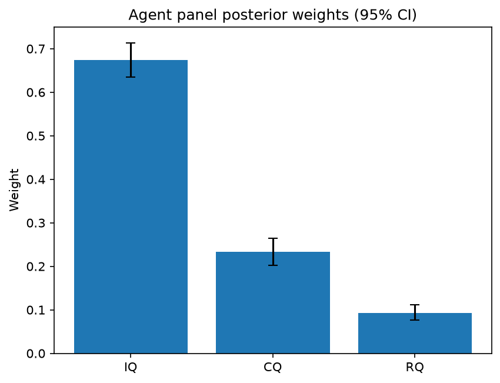

# Survey report: TrustRouter Agentic Full Panel (mistral:7b) -- Level L3a: Quality clusters (ISO 25012)

Survey ID: `trustrouter-agentic-full-panel-mistral-2026-09-01-L3a`

## Agent panel

- Agents contributing a valid response: 35
- Classical BWM consistency: 35/35 within threshold

| Criterion | Mean | 95% CI lower | 95% CI upper |
|---|---|---|---|
| IQ | 0.6746 | 0.6347 | 0.7138 |
| CQ | 0.2327 | 0.2016 | 0.2645 |
| RQ | 0.0927 | 0.0761 | 0.1111 |

## Methodology

Each agent independently completed a Best-Worst Method (BWM) comparison: choosing the single most and least important criterion, then rating every criterion's importance relative to those two on a 1-9 scale. Individual responses were solved with the classical BWM linear program (Rezaei, 2015) for a consistency check, and combined across the panel with a hierarchical Bayesian model (Mohammadi and Rezaei, 2020).

35 agent response(s) were accepted into this result.

Every agent's run began with a QA precheck (its stated configuration verified against ground truth) and every accepted answer's self-reported sources were checked against what reference material was actually available to it; see the Per-agent detail section below and this survey's Conversation Log for each agent's specific results. Every response is schema-validated and independently, repeatedly sampled (never a single completion treated as ground truth); see `guardrails.py`. This survey's complete output is covered by a SHA-256 integrity manifest (`integrity_manifest.json`, `SHA256SUMS`), generated once this run finished, so any later alteration to these files is detectable.

### Charts

## Per-agent detail

### bim-coordinator-base-openmanus (`bim-coordinator-base-openmanus`)

- Role: BIM Coordinator
- Model: ollama/mistral:7b
- DID: `did:key:z6MkfgXoko5fk2HGb2Dg55FYiiR6QE6wDmBBMDZ2ZVrDpTXM`
- QA precheck: passed
- Sources used: (not reported)

**Answer:** `{"best": "IQ", "worst": "RQ", "best_to_others": {"IQ": 1, "CQ": 7, "RQ": 9}, "others_to_worst": {"RQ": 1, "CQ": 2, "IQ": 9}}`

**Reasoning:**

 Best factor: IQ
Worst factor: RQ

 IQ vs CQ: 7
IQ vs RQ: 9
CQ vs RQ: 2

### bim-coordinator-base-openmanus (`bim-coordinator-base-openmanus`)

- Role: BIM Coordinator
- Model: ollama/mistral:7b
- DID: `did:key:z6MkfgXoko5fk2HGb2Dg55FYiiR6QE6wDmBBMDZ2ZVrDpTXM`
- QA precheck: passed
- Sources used: (not reported)

**Answer:** `{"best": "IQ", "worst": "RQ", "best_to_others": {"IQ": 1, "CQ": 7, "RQ": 9}, "others_to_worst": {"RQ": 1, "CQ": 2, "IQ": 9}}`

**Reasoning:**

 Best factor: IQ
Worst factor: RQ

 IQ vs CQ: 7
IQ vs RQ: 9
CQ vs RQ: 2

### bim-coordinator-base-openmanus (`bim-coordinator-base-openmanus`)

- Role: BIM Coordinator
- Model: ollama/mistral:7b
- DID: `did:key:z6MkfgXoko5fk2HGb2Dg55FYiiR6QE6wDmBBMDZ2ZVrDpTXM`
- QA precheck: passed
- Sources used: (not reported)

**Answer:** `{"best": "IQ", "worst": "RQ", "best_to_others": {"IQ": 1, "CQ": 7, "RQ": 9}, "others_to_worst": {"RQ": 1, "CQ": 1, "IQ": 9}}`

**Reasoning:**

 Best factor: IQ
Worst factor: RQ

 IQ vs CQ: 7
IQ vs RQ: 9
CQ vs RQ: 1

### bim-coordinator-rag-openmanus (`bim-coordinator-rag-openmanus`)

- Role: BIM Coordinator
- Model: ollama/mistral:7b
- DID: `did:key:z6MktumSUSZKAYBkVBipYZSQPNfpzsRpDK78beTjh9uW4mqo`
- QA precheck: passed
- Sources used: (not reported)

**Answer:** `{"best": "IQ", "worst": "RQ", "best_to_others": {"IQ": 1, "CQ": 1, "RQ": 9}, "others_to_worst": {"RQ": 1, "CQ": 5, "IQ": 9}}`

**Reasoning:**

 Best factor: IQ
Worst factor: RQ

 IQ vs CQ: 1
IQ vs RQ: 9
CQ vs RQ: 5

### bim-coordinator-rag-openmanus (`bim-coordinator-rag-openmanus`)

- Role: BIM Coordinator
- Model: ollama/mistral:7b
- DID: `did:key:z6MktumSUSZKAYBkVBipYZSQPNfpzsRpDK78beTjh9uW4mqo`
- QA precheck: passed
- Sources used: (not reported)

**Answer:** `{"best": "IQ", "worst": "RQ", "best_to_others": {"IQ": 1, "CQ": 1, "RQ": 9}, "others_to_worst": {"RQ": 1, "CQ": 2, "IQ": 9}}`

**Reasoning:**

 Best factor: IQ
Worst factor: RQ

 IQ vs CQ: 1
IQ vs RQ: 9
CQ vs RQ: 2

### bim-coordinator-rag-openmanus (`bim-coordinator-rag-openmanus`)

- Role: BIM Coordinator
- Model: ollama/mistral:7b
- DID: `did:key:z6MktumSUSZKAYBkVBipYZSQPNfpzsRpDK78beTjh9uW4mqo`
- QA precheck: passed
- Sources used: (not reported)

**Answer:** `{"best": "IQ", "worst": "RQ", "best_to_others": {"IQ": 1, "CQ": 1, "RQ": 9}, "others_to_worst": {"RQ": 1, "CQ": 5, "IQ": 9}}`

**Reasoning:**

 Best factor: IQ
Worst factor: RQ

 IQ vs CQ: 1
IQ vs RQ: 9
CQ vs RQ: 5

Reasoning:
- IQ (Intrinsic Quality) is the best factor because it encompasses accuracy, validity, and uniqueness which are crucial for ensuring the integrity and reliability of construction project records. These factors ensure that the data stored on the blockchain is accurate, trustworthy, and unique, reducing the risk of errors or misinformation.
- RQ (Representational Quality) is the worst factor because it only focuses on consistency across sources, which may not necessarily guarantee the accuracy, validity, or uniqueness of the data. In a construction project context, having consistent but inaccurate or invalid data can lead to significant issues down the line.
- CQ (Contextual Quality), while important, is less crucial than IQ as it only focuses on completeness and timeliness, which may not always be directly related to the accuracy, validity, or uniqueness of the data. While having complete and timely data can be beneficial, it does not necessarily ensure the integrity of the data if it is inaccurate or invalid.

### blockchain-engineer-base-openmanus (`blockchain-engineer-base-openmanus`)

- Role: Blockchain / DLT Engineer
- Model: ollama/mistral:7b
- DID: `did:key:z6MkvHuD6rK5V96sxUAp7Xr6vcwjpUwrx7XzHHteGJRC5JuJ`
- QA precheck: passed
- Sources used: (not reported)

**Answer:** `{"best": "IQ", "worst": "RQ", "best_to_others": {"IQ": 1, "CQ": 8, "RQ": 9}, "others_to_worst": {"RQ": 1, "CQ": 1, "IQ": 9}}`

**Reasoning:**

 Best factor: IQ
Worst factor: RQ

 IQ vs CQ: 8
IQ vs RQ: 9
CQ vs RQ: 1

### blockchain-engineer-base-openmanus (`blockchain-engineer-base-openmanus`)

- Role: Blockchain / DLT Engineer
- Model: ollama/mistral:7b
- DID: `did:key:z6MkvHuD6rK5V96sxUAp7Xr6vcwjpUwrx7XzHHteGJRC5JuJ`
- QA precheck: passed
- Sources used: (not reported)

**Answer:** `{"best": "IQ", "worst": "RQ", "best_to_others": {"IQ": 1, "CQ": 7, "RQ": 9}, "others_to_worst": {"RQ": 1, "CQ": 6, "IQ": 9}}`

**Reasoning:**

 Best factor: IQ
Worst factor: RQ

 IQ vs CQ: 7
IQ vs RQ: 9
CQ vs RQ: 6

### blockchain-engineer-base-openmanus (`blockchain-engineer-base-openmanus`)

- Role: Blockchain / DLT Engineer
- Model: ollama/mistral:7b
- DID: `did:key:z6MkvHuD6rK5V96sxUAp7Xr6vcwjpUwrx7XzHHteGJRC5JuJ`
- QA precheck: passed
- Sources used: (not reported)

**Answer:** `{"best": "IQ", "worst": "RQ", "best_to_others": {"IQ": 1, "CQ": 7, "RQ": 9}, "others_to_worst": {"RQ": 1, "CQ": 6, "IQ": 9}}`

**Reasoning:**

 Best factor: IQ
Worst factor: RQ

 IQ vs CQ: 7
IQ vs RQ: 9
CQ vs RQ: 6

### blockchain-engineer-rag-openmanus (`blockchain-engineer-rag-openmanus`)

- Role: Blockchain / DLT Engineer
- Model: ollama/mistral:7b
- DID: `did:key:z6MkmucumNftjXuU1cP1wD4kXfg8GN5qLwkyp7b89yPpKxwP`
- QA precheck: passed
- Sources used: (not reported)

**Answer:** `{"best": "IQ", "worst": "RQ", "best_to_others": {"IQ": 1, "CQ": 1, "RQ": 9}, "others_to_worst": {"RQ": 1, "CQ": 3, "IQ": 9}}`

**Reasoning:**

 Best factor: IQ
Worst factor: RQ

 IQ vs CQ: 1
IQ vs RQ: 9
CQ vs RQ: 3

### blockchain-engineer-rag-openmanus (`blockchain-engineer-rag-openmanus`)

- Role: Blockchain / DLT Engineer
- Model: ollama/mistral:7b
- DID: `did:key:z6MkmucumNftjXuU1cP1wD4kXfg8GN5qLwkyp7b89yPpKxwP`
- QA precheck: passed
- Sources used: (not reported)

**Answer:** `{"best": "IQ", "worst": "RQ", "best_to_others": {"IQ": 1, "CQ": 1, "RQ": 9}, "others_to_worst": {"RQ": 1, "CQ": 3, "IQ": 9}}`

**Reasoning:**

 Best factor: IQ
Worst factor: RQ

 IQ vs CQ: 1
IQ vs RQ: 9
CQ vs RQ: 3

### blockchain-engineer-rag-openmanus (`blockchain-engineer-rag-openmanus`)

- Role: Blockchain / DLT Engineer
- Model: ollama/mistral:7b
- DID: `did:key:z6MkmucumNftjXuU1cP1wD4kXfg8GN5qLwkyp7b89yPpKxwP`
- QA precheck: passed
- Sources used: (not reported)

**Answer:** `{"best": "IQ", "worst": "RQ", "best_to_others": {"IQ": 1, "CQ": 1, "RQ": 9}, "others_to_worst": {"RQ": 1, "CQ": 7, "IQ": 9}}`

**Reasoning:**

 Best factor: IQ
Worst factor: RQ

 IQ vs CQ: 1
IQ vs RQ: 9
CQ vs RQ: 7

### compliance-officer-base-openmanus (`compliance-officer-base-openmanus`)

- Role: Compliance and Regulatory Officer
- Model: ollama/mistral:7b
- DID: `did:key:z6MkfbCRS5qnxtVpnPvezz8VBQGuTFfkEPexhbtSd5ZwJVgY`
- QA precheck: passed
- Sources used: (not reported)

**Answer:** `{"best": "IQ", "worst": "RQ", "best_to_others": {"IQ": 1, "CQ": 7, "RQ": 9}, "others_to_worst": {"RQ": 1, "CQ": 8, "IQ": 9}}`

**Reasoning:**

 Best factor: IQ
Worst factor: RQ

Reasoning: The Intrinsic Quality (IQ) criterion is considered the best as it pertains to the accuracy, validity, and uniqueness of the data, which are essential for maintaining trust in the construction-project record. On the other hand, Representational Quality (RQ), which focuses on consistency across sources, is less critical because inconsistencies may still be acceptable if the underlying data is accurate, valid, and unique. However, it's important to note that all three criteria are crucial for ensuring high-quality blockchain storage of construction-project records.

 IQ vs CQ: 7
IQ vs RQ: 9
CQ vs RQ: 8

### compliance-officer-base-openmanus (`compliance-officer-base-openmanus`)

- Role: Compliance and Regulatory Officer
- Model: ollama/mistral:7b
- DID: `did:key:z6MkfbCRS5qnxtVpnPvezz8VBQGuTFfkEPexhbtSd5ZwJVgY`
- QA precheck: passed
- Sources used: (not reported)

**Answer:** `{"best": "IQ", "worst": "RQ", "best_to_others": {"IQ": 1, "CQ": 7, "RQ": 9}, "others_to_worst": {"RQ": 1, "CQ": 6, "IQ": 9}}`

**Reasoning:**

 Best factor: IQ
Worst factor: RQ

Reasoning:

In the context of a facility management compliance officer responsible for GDPR and construction-regulatory obligations across a building's operational lifecycle, Intrinsic Quality (IQ) is considered the best factor as it encompasses accuracy, validity, and uniqueness which are crucial for ensuring the data is technically clean and reliable. On the other hand, Representational Quality (RQ), which focuses on consistency across sources, might be less important in this role since the officer's primary concern is ensuring compliance with regulations rather than comparing multiple versions of the same data.

 IQ vs CQ: 7
IQ vs RQ: 9
CQ vs RQ: 6

### compliance-officer-base-openmanus (`compliance-officer-base-openmanus`)

- Role: Compliance and Regulatory Officer
- Model: ollama/mistral:7b
- DID: `did:key:z6MkfbCRS5qnxtVpnPvezz8VBQGuTFfkEPexhbtSd5ZwJVgY`
- QA precheck: passed
- Sources used: (not reported)

**Answer:** `{"best": "IQ", "worst": "RQ", "best_to_others": {"IQ": 1, "CQ": 7, "RQ": 9}, "others_to_worst": {"RQ": 1, "CQ": 8, "IQ": 9}}`

**Reasoning:**

 Best factor: IQ
Worst factor: RQ

Reasoning: Intrinsic Quality (IQ) is the most important criterion as it pertains to the accuracy, validity, and uniqueness of the data. This is crucial for ensuring that the construction project record is technically clean and reliable. Representational Quality (RQ), on the other hand, is less important because it only concerns consistency across sources, which may not be as critical as having accurate, valid, and unique data in the first place.

 IQ vs CQ: 7
IQ vs RQ: 9
CQ vs RQ: 8

Reasoning: Intrinsic Quality (IQ) is more important than Contextual Quality (CQ) and Representational Quality (RQ) because it pertains to the accuracy, validity, and uniqueness of the data, which are crucial for ensuring that the construction project record is technically clean and reliable. While completeness and timeliness (CQ) are also important, they may not be as critical as having accurate, valid, and unique data in the first place. Representational Quality (RQ), on the other hand, is least important because it only concerns consistency across sources, which may not be as critical as having accurate, valid, and unique data.

In terms of relative importance between IQ, CQ, and RQ:
- IQ vs CQ: Intrinsic Quality is more important than Contextual Quality because it deals with the technical accuracy and validity of the data, while Contextual Quality focuses on the scope and timeliness of the data.
- IQ vs RQ: Intrinsic Quality is more important than Representational Quality because it pertains to the accuracy, validity, and uniqueness of the data, which are crucial for ensuring that the construction project record is technically clean and reliable. Representational Quality only concerns consistency across sources.
- CQ vs RQ: Contextual Quality is more important than Representational Quality because it deals with the timeliness and completeness of the data, while Representational Quality focuses on consistency across sources. However, both are less important compared to Intrinsic Quality.

### compliance-officer-rag-openmanus (`compliance-officer-rag-openmanus`)

- Role: Compliance and Regulatory Officer
- Model: ollama/mistral:7b
- DID: `did:key:z6MkfA5TGsnWh3DK59EkbsAtJhFdtWUr86GzaTTLgCcq7FDt`
- QA precheck: passed
- Sources used: (not reported)

**Answer:** `{"best": "IQ", "worst": "RQ", "best_to_others": {"IQ": 1, "CQ": 1, "RQ": 9}, "others_to_worst": {"RQ": 1, "CQ": 5, "IQ": 9}}`

**Reasoning:**

 Based on the provided reference material, the question asks for the best and worst factors among Intrinsic Quality (IQ), Contextual Quality (CQ), and Representational Quality (RQ) in a building information modeling (BIM) coordinator/manager's perspective.

Best factor: IQ
Worst factor: RQ

 IQ vs CQ: 1
IQ vs RQ: 9
CQ vs RQ: 5

### compliance-officer-rag-openmanus (`compliance-officer-rag-openmanus`)

- Role: Compliance and Regulatory Officer
- Model: ollama/mistral:7b
- DID: `did:key:z6MkfA5TGsnWh3DK59EkbsAtJhFdtWUr86GzaTTLgCcq7FDt`
- QA precheck: passed
- Sources used: (not reported)

**Answer:** `{"best": "IQ", "worst": "RQ", "best_to_others": {"IQ": 1, "CQ": 1, "RQ": 9}, "others_to_worst": {"RQ": 1, "CQ": 5, "IQ": 9}}`

**Reasoning:**

 Based on the provided reference material, the best (most important) criterion is Intrinsic Quality (IQ) and the worst (least important) criterion is Representational Quality (RQ).

Best factor: IQ
Worst factor: RQ

 IQ vs CQ: 1
IQ vs RQ: 9
CQ vs RQ: 5

### data-engineer-base-openmanus (`data-engineer-base-openmanus`)

- Role: Data Engineering Specialist
- Model: ollama/mistral:7b
- DID: `did:key:z6MktFhQynyK3hjjScxU7X5N1KeprxH9DRnj8UgC2dqicMmW`
- QA precheck: passed
- Sources used: (not reported)

**Answer:** `{"best": "IQ", "worst": "RQ", "best_to_others": {"IQ": 1, "CQ": 3, "RQ": 9}, "others_to_worst": {"RQ": 1, "CQ": 1, "IQ": 9}}`

**Reasoning:**

 Best factor: IQ
Worst factor: RQ

 IQ vs CQ: 3
IQ vs RQ: 9
CQ vs RQ: 1

### data-engineer-base-openmanus (`data-engineer-base-openmanus`)

- Role: Data Engineering Specialist
- Model: ollama/mistral:7b
- DID: `did:key:z6MktFhQynyK3hjjScxU7X5N1KeprxH9DRnj8UgC2dqicMmW`
- QA precheck: passed
- Sources used: (not reported)

**Answer:** `{"best": "IQ", "worst": "RQ", "best_to_others": {"IQ": 1, "CQ": 7, "RQ": 9}, "others_to_worst": {"RQ": 1, "CQ": 4, "IQ": 9}}`

**Reasoning:**

 Best factor: IQ
Worst factor: RQ

 IQ vs CQ: 7
IQ vs RQ: 9
CQ vs RQ: 4

### data-engineer-base-openmanus (`data-engineer-base-openmanus`)

- Role: Data Engineering Specialist
- Model: ollama/mistral:7b
- DID: `did:key:z6MktFhQynyK3hjjScxU7X5N1KeprxH9DRnj8UgC2dqicMmW`
- QA precheck: passed
- Sources used: (not reported)

**Answer:** `{"best": "IQ", "worst": "RQ", "best_to_others": {"IQ": 1, "CQ": 7, "RQ": 9}, "others_to_worst": {"RQ": 1, "CQ": 1, "IQ": 9}}`

**Reasoning:**

 Best factor: IQ
Worst factor: RQ

 IQ vs CQ: 7
IQ vs RQ: 9
CQ vs RQ: 1

### data-engineer-rag-openmanus (`data-engineer-rag-openmanus`)

- Role: Data Engineering Specialist
- Model: ollama/mistral:7b
- DID: `did:key:z6MkiWQoSrmLM3rsTnbbnu2vhEtsqyMtVskAeNJy3ryeBDJG`
- QA precheck: passed
- Sources used: (not reported)

**Answer:** `{"best": "IQ", "worst": "RQ", "best_to_others": {"IQ": 1, "CQ": 1, "RQ": 9}, "others_to_worst": {"RQ": 1, "CQ": 8, "IQ": 9}}`

**Reasoning:**

 Best factor: IQ
Worst factor: RQ

 IQ vs CQ: 1
IQ vs RQ: 9
CQ vs RQ: 8

Reasoning:

* Intrinsic Quality (IQ) is the best factor because it encompasses accuracy, validity, and uniqueness, which are crucial for ensuring that the data stored on a blockchain is reliable, accurate, and unique. This is particularly important in construction projects where data integrity is essential for making informed decisions and tracking progress accurately.
* Representational Quality (RQ) is the worst factor because it only focuses on consistency across sources, which may not be as critical as intrinsic quality or contextual quality (CQ) in ensuring that the data stored on a blockchain is accurate and reliable. In construction projects, there may be multiple sources of data for a single piece of information, and while consistency is important, it may not always be possible to achieve perfect consistency across all sources. Additionally, consistency alone does not guarantee accuracy or reliability of the data.
* Contextual Quality (CQ) is more important than representational quality because it encompasses completeness and timeliness, which are essential for making informed decisions in construction projects. Completeness ensures that all relevant information is captured and stored on the blockchain, while timeliness ensures that the data is up-to-date and reflects the current state of the project. In contrast, consistency across sources alone may not guarantee completeness or timeliness of the data.
* The ratings are based on the professional judgement of a data engineering specialist responsible for data quality pipelines, provenance tracking, and polyglot-persistence routing decisions on construction-project datasets.

### data-engineer-rag-openmanus (`data-engineer-rag-openmanus`)

- Role: Data Engineering Specialist
- Model: ollama/mistral:7b
- DID: `did:key:z6MkiWQoSrmLM3rsTnbbnu2vhEtsqyMtVskAeNJy3ryeBDJG`
- QA precheck: passed
- Sources used: (not reported)

**Answer:** `{"best": "IQ", "worst": "RQ", "best_to_others": {"IQ": 1, "CQ": 1, "RQ": 9}, "others_to_worst": {"RQ": 1, "CQ": 5, "IQ": 9}}`

**Reasoning:**

 Best factor: IQ
Worst factor: RQ

 IQ vs CQ: 1
IQ vs RQ: 9
CQ vs RQ: 5

### data-engineer-rag-openmanus (`data-engineer-rag-openmanus`)

- Role: Data Engineering Specialist
- Model: ollama/mistral:7b
- DID: `did:key:z6MkiWQoSrmLM3rsTnbbnu2vhEtsqyMtVskAeNJy3ryeBDJG`
- QA precheck: passed
- Sources used: (not reported)

**Answer:** `{"best": "IQ", "worst": "RQ", "best_to_others": {"IQ": 1, "CQ": 7, "RQ": 9}, "others_to_worst": {"RQ": 1, "CQ": 1, "IQ": 9}}`

**Reasoning:**

 Best factor: IQ
Worst factor: RQ

 IQ vs CQ: 7
IQ vs RQ: 9
CQ vs RQ: 1

### project-manager-base-openmanus (`project-manager-base-openmanus`)

- Role: Construction Project Manager
- Model: ollama/mistral:7b
- DID: `did:key:z6MkmfTBzM8STi6eZQjBtyYUdmW4ALLgFT4436ojkBi1QXnf`
- QA precheck: passed
- Sources used: (not reported)

**Answer:** `{"best": "IQ", "worst": "RQ", "best_to_others": {"IQ": 1, "CQ": 8, "RQ": 9}, "others_to_worst": {"RQ": 1, "CQ": 1, "IQ": 9}}`

**Reasoning:**

 Best factor: IQ
Worst factor: RQ

 IQ vs CQ: 8
IQ vs RQ: 9
CQ vs RQ: 1

### project-manager-base-openmanus (`project-manager-base-openmanus`)

- Role: Construction Project Manager
- Model: ollama/mistral:7b
- DID: `did:key:z6MkmfTBzM8STi6eZQjBtyYUdmW4ALLgFT4436ojkBi1QXnf`
- QA precheck: passed
- Sources used: (not reported)

**Answer:** `{"best": "IQ", "worst": "RQ", "best_to_others": {"IQ": 1, "CQ": 7, "RQ": 9}, "others_to_worst": {"RQ": 1, "CQ": 1, "IQ": 9}}`

**Reasoning:**

 Best factor: IQ
Worst factor: RQ

 IQ vs CQ: 7
IQ vs RQ: 9
CQ vs RQ: 1

### project-manager-base-openmanus (`project-manager-base-openmanus`)

- Role: Construction Project Manager
- Model: ollama/mistral:7b
- DID: `did:key:z6MkmfTBzM8STi6eZQjBtyYUdmW4ALLgFT4436ojkBi1QXnf`
- QA precheck: passed
- Sources used: (not reported)

**Answer:** `{"best": "IQ", "worst": "RQ", "best_to_others": {"IQ": 1, "CQ": 7, "RQ": 9}, "others_to_worst": {"RQ": 1, "CQ": 1, "IQ": 9}}`

**Reasoning:**

 Best factor: IQ
Worst factor: RQ

 IQ vs CQ: 7
IQ vs RQ: 9
CQ vs RQ: 1

### project-manager-rag-openmanus (`project-manager-rag-openmanus`)

- Role: Construction Project Manager
- Model: ollama/mistral:7b
- DID: `did:key:z6MkoTifVHP1pHqn6fbzUhAKR4qjAt634zz49Rtj41amKoDx`
- QA precheck: passed
- Sources used: (not reported)

**Answer:** `{"best": "IQ", "worst": "RQ", "best_to_others": {"IQ": 1, "CQ": 1, "RQ": 9}, "others_to_worst": {"RQ": 1, "CQ": 3, "IQ": 9}}`

**Reasoning:**

 You are comparing the following criteria:
- IQ: Intrinsic Quality
- CQ: Contextual Quality
- RQ: Representational Quality

Which ONE criterion is BEST (most important), and which ONE is WORST (least important)? Answer in EXACTLY these two lines, using the bare code only (one of IQ, CQ, RQ):
Best factor: IQ
Worst factor: RQ

 IQ vs CQ: 1
IQ vs RQ: 9
CQ vs RQ: 3

### project-manager-rag-openmanus (`project-manager-rag-openmanus`)

- Role: Construction Project Manager
- Model: ollama/mistral:7b
- DID: `did:key:z6MkoTifVHP1pHqn6fbzUhAKR4qjAt634zz49Rtj41amKoDx`
- QA precheck: passed
- Sources used: (not reported)

**Answer:** `{"best": "IQ", "worst": "RQ", "best_to_others": {"IQ": 1, "CQ": 1, "RQ": 9}, "others_to_worst": {"RQ": 1, "CQ": 5, "IQ": 9}}`

**Reasoning:**

 You are comparing the following criteria:
- IQ: Intrinsic Quality
- CQ: Contextual Quality
- RQ: Representational Quality

Best factor: IQ
Worst factor: RQ

 IQ vs CQ: 1
IQ vs RQ: 9
CQ vs RQ: 5

### project-manager-rag-openmanus (`project-manager-rag-openmanus`)

- Role: Construction Project Manager
- Model: ollama/mistral:7b
- DID: `did:key:z6MkoTifVHP1pHqn6fbzUhAKR4qjAt634zz49Rtj41amKoDx`
- QA precheck: passed
- Sources used: (not reported)

**Answer:** `{"best": "IQ", "worst": "RQ", "best_to_others": {"IQ": 1, "CQ": 1, "RQ": 9}, "others_to_worst": {"RQ": 1, "CQ": 3, "IQ": 9}}`

**Reasoning:**

 You are comparing the following criteria:
- IQ: Intrinsic Quality
- CQ: Contextual Quality
- RQ: Representational Quality

Best factor: IQ
Worst factor: RQ

 IQ vs CQ: 1
IQ vs RQ: 9
CQ vs RQ: 3

### structural-engineer-base-openmanus (`structural-engineer-base-openmanus`)

- Role: Structural Engineer
- Model: ollama/mistral:7b
- DID: `did:key:z6MkneKsSUhTxF3pB1EzYLvMTxPBCQPtxRb2F4THAHgsHiqS`
- QA precheck: passed
- Sources used: (not reported)

**Answer:** `{"best": "IQ", "worst": "RQ", "best_to_others": {"IQ": 1, "CQ": 7, "RQ": 9}, "others_to_worst": {"RQ": 1, "CQ": 5, "IQ": 9}}`

**Reasoning:**

 Best factor: IQ
Worst factor: RQ

 IQ vs CQ: 7
IQ vs RQ: 9
CQ vs RQ: 5

### structural-engineer-base-openmanus (`structural-engineer-base-openmanus`)

- Role: Structural Engineer
- Model: ollama/mistral:7b
- DID: `did:key:z6MkneKsSUhTxF3pB1EzYLvMTxPBCQPtxRb2F4THAHgsHiqS`
- QA precheck: passed
- Sources used: (not reported)

**Answer:** `{"best": "IQ", "worst": "RQ", "best_to_others": {"IQ": 1, "CQ": 7, "RQ": 9}, "others_to_worst": {"RQ": 1, "CQ": 2, "IQ": 9}}`

**Reasoning:**

 Best factor: IQ
Worst factor: RQ

 IQ vs CQ: 7
IQ vs RQ: 9
CQ vs RQ: 2

### structural-engineer-base-openmanus (`structural-engineer-base-openmanus`)

- Role: Structural Engineer
- Model: ollama/mistral:7b
- DID: `did:key:z6MkneKsSUhTxF3pB1EzYLvMTxPBCQPtxRb2F4THAHgsHiqS`
- QA precheck: passed
- Sources used: (not reported)

**Answer:** `{"best": "IQ", "worst": "RQ", "best_to_others": {"IQ": 1, "CQ": 8, "RQ": 9}, "others_to_worst": {"RQ": 1, "CQ": 1, "IQ": 9}}`

**Reasoning:**

 Best factor: IQ
Worst factor: RQ

 IQ vs CQ: 8
IQ vs RQ: 9
CQ vs RQ: 1

### structural-engineer-rag-openmanus (`structural-engineer-rag-openmanus`)

- Role: Structural Engineer
- Model: ollama/mistral:7b
- DID: `did:key:z6Mkq9sxQdnLDNKYHKSbcFf6ApWb78WMj6E8VgRRcmWNpJib`
- QA precheck: passed
- Sources used: (not reported)

**Answer:** `{"best": "IQ", "worst": "RQ", "best_to_others": {"IQ": 1, "CQ": 1, "RQ": 9}, "others_to_worst": {"RQ": 1, "CQ": 2, "IQ": 9}}`

**Reasoning:**

 Best factor: IQ
Worst factor: RQ

 IQ vs CQ: 1
IQ vs RQ: 9
CQ vs RQ: 2

### structural-engineer-rag-openmanus (`structural-engineer-rag-openmanus`)

- Role: Structural Engineer
- Model: ollama/mistral:7b
- DID: `did:key:z6Mkq9sxQdnLDNKYHKSbcFf6ApWb78WMj6E8VgRRcmWNpJib`
- QA precheck: passed
- Sources used: (not reported)

**Answer:** `{"best": "IQ", "worst": "RQ", "best_to_others": {"IQ": 1, "CQ": 1, "RQ": 9}, "others_to_worst": {"RQ": 1, "CQ": 8, "IQ": 9}}`

**Reasoning:**

 Best factor: IQ
Worst factor: RQ

 IQ vs CQ: 1
IQ vs RQ: 9
CQ vs RQ: 8

### structural-engineer-rag-openmanus (`structural-engineer-rag-openmanus`)

- Role: Structural Engineer
- Model: ollama/mistral:7b
- DID: `did:key:z6Mkq9sxQdnLDNKYHKSbcFf6ApWb78WMj6E8VgRRcmWNpJib`
- QA precheck: passed
- Sources used: (not reported)

**Answer:** `{"best": "IQ", "worst": "RQ", "best_to_others": {"IQ": 1, "CQ": 1, "RQ": 9}, "others_to_worst": {"RQ": 1, "CQ": 2, "IQ": 9}}`

**Reasoning:**

 Best factor: IQ
Worst factor: RQ

 IQ vs CQ: 1
IQ vs RQ: 9
CQ vs RQ: 2
