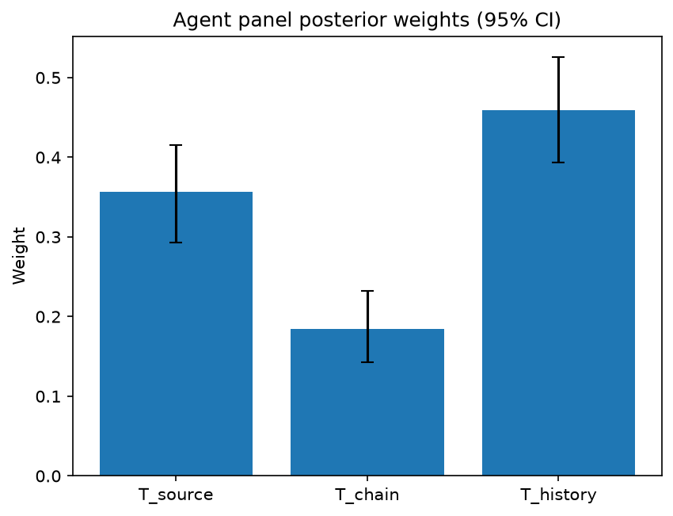

# Survey report: TrustRouter Agentic Full Panel (mistral:7b) -- Level L3b: Provenance Trust sub-parts

Survey ID: `trustrouter-agentic-full-panel-mistral-2026-09-01-L3b`

## Agent panel

- Agents contributing a valid response: 36
- Classical BWM consistency: 36/36 within threshold

| Criterion | Mean | 95% CI lower | 95% CI upper |
|---|---|---|---|
| T_source | 0.3563 | 0.2930 | 0.4151 |
| T_chain | 0.1844 | 0.1426 | 0.2324 |
| T_history | 0.4594 | 0.3938 | 0.5253 |

## Methodology

Each agent independently completed a Best-Worst Method (BWM) comparison: choosing the single most and least important criterion, then rating every criterion's importance relative to those two on a 1-9 scale. Individual responses were solved with the classical BWM linear program (Rezaei, 2015) for a consistency check, and combined across the panel with a hierarchical Bayesian model (Mohammadi and Rezaei, 2020).

36 agent response(s) were accepted into this result.

Every agent's run began with a QA precheck (its stated configuration verified against ground truth) and every accepted answer's self-reported sources were checked against what reference material was actually available to it; see the Per-agent detail section below and this survey's Conversation Log for each agent's specific results. Every response is schema-validated and independently, repeatedly sampled (never a single completion treated as ground truth); see `guardrails.py`. This survey's complete output is covered by a SHA-256 integrity manifest (`integrity_manifest.json`, `SHA256SUMS`), generated once this run finished, so any later alteration to these files is detectable.

### Charts

## Per-agent detail

### bim-coordinator-base-openmanus (`bim-coordinator-base-openmanus`)

- Role: BIM Coordinator
- Model: ollama/mistral:7b
- DID: `did:key:z6MkfgXoko5fk2HGb2Dg55FYiiR6QE6wDmBBMDZ2ZVrDpTXM`
- QA precheck: passed
- Sources used: (not reported)

**Answer:** `{"best": "T_history", "worst": "T_chain", "best_to_others": {"T_history": 1, "T_source": 8, "T_chain": 9}, "others_to_worst": {"T_chain": 1, "T_source": 7, "T_history": 9}}`

**Reasoning:**

 Best factor: T_history
Worst factor: T_chain

 T_history vs T_source: 8
T_history vs T_chain: 9
T_source vs T_chain: 7

### bim-coordinator-base-openmanus (`bim-coordinator-base-openmanus`)

- Role: BIM Coordinator
- Model: ollama/mistral:7b
- DID: `did:key:z6MkfgXoko5fk2HGb2Dg55FYiiR6QE6wDmBBMDZ2ZVrDpTXM`
- QA precheck: passed
- Sources used: (not reported)

**Answer:** `{"best": "T_history", "worst": "T_chain", "best_to_others": {"T_history": 1, "T_source": 5, "T_chain": 9}, "others_to_worst": {"T_chain": 1, "T_source": 7, "T_history": 9}}`

**Reasoning:**

 Best factor: T_history
Worst factor: T_chain

 T_history vs T_source: 5
T_history vs T_chain: 9
T_source vs T_chain: 7

### bim-coordinator-base-openmanus (`bim-coordinator-base-openmanus`)

- Role: BIM Coordinator
- Model: ollama/mistral:7b
- DID: `did:key:z6MkfgXoko5fk2HGb2Dg55FYiiR6QE6wDmBBMDZ2ZVrDpTXM`
- QA precheck: passed
- Sources used: (not reported)

**Answer:** `{"best": "T_history", "worst": "T_chain", "best_to_others": {"T_history": 1, "T_source": 5, "T_chain": 9}, "others_to_worst": {"T_chain": 1, "T_source": 7, "T_history": 9}}`

**Reasoning:**

 Best factor: T_history
Worst factor: T_chain

 T_history vs T_source: 5
T_history vs T_chain: 9
T_source vs T_chain: 7

### bim-coordinator-rag-openmanus (`bim-coordinator-rag-openmanus`)

- Role: BIM Coordinator
- Model: ollama/mistral:7b
- DID: `did:key:z6MktumSUSZKAYBkVBipYZSQPNfpzsRpDK78beTjh9uW4mqo`
- QA precheck: passed
- Sources used: (not reported)

**Answer:** `{"best": "T_history", "worst": "T_chain", "best_to_others": {"T_history": 1, "T_source": 1, "T_chain": 9}, "others_to_worst": {"T_chain": 1, "T_source": 5, "T_history": 9}}`

**Reasoning:**

 Best factor: T_history
Worst factor: T_chain

 T_history vs T_source: 1
T_history vs T_chain: 9
T_source vs T_chain: 5

Reasoning:
- T_history vs T_source: A reliable historical track record is a strong indicator of the quality and trustworthiness of data, regardless of its source. The source itself may have varying levels of credibility, but if it has a proven history of providing accurate and useful data, that is more important for a construction project.
- T_history vs T_chain: A reliable historical track record demonstrates the consistency and reliability of the data over time, while the custody chain provides information about the handling and transfer of the data during its journey from source to destination. A strong historical track record is generally more valuable for ensuring the quality and trustworthiness of the data than the specific details of the custody chain.
- T_source vs T_chain: The source of the data is a fundamental factor in determining its credibility, while the custody chain provides information about how the data was handled during its journey from source to destination. However, if the source has a proven history of providing accurate and useful data, it may be more important than the specific details of the custody chain, especially since a well-managed custody chain can help maintain the integrity of the data but does not necessarily improve its quality or trustworthiness.

### bim-coordinator-rag-openmanus (`bim-coordinator-rag-openmanus`)

- Role: BIM Coordinator
- Model: ollama/mistral:7b
- DID: `did:key:z6MktumSUSZKAYBkVBipYZSQPNfpzsRpDK78beTjh9uW4mqo`
- QA precheck: passed
- Sources used: (not reported)

**Answer:** `{"best": "T_history", "worst": "T_chain", "best_to_others": {"T_history": 1, "T_source": 1, "T_chain": 9}, "others_to_worst": {"T_chain": 1, "T_source": 8, "T_history": 9}}`

**Reasoning:**

 Best factor: T_history
Worst factor: T_chain

 T_history vs T_source: 1
T_history vs T_chain: 9
T_source vs T_chain: 8

Reasoning:

* T_history is the best factor because it provides an objective measure of a data source's reliability and trustworthiness based on its past performance. A strong historical track record can instill confidence in the data's accuracy, completeness, and consistency. In contrast, T_source (Source credentials) only provides information about the identity and qualifications of the data producer, which may not necessarily reflect the quality of the data itself.
* T_chain is the worst factor because it is more susceptible to errors, manipulation, and loss during the process of transferring and storing data. The custody chain (T_chain) can be affected by various factors such as technical issues, human error, and malicious attacks, which can compromise the integrity and security of the data. In contrast, T_history provides a more stable and reliable measure of trustworthiness based on the data's past performance.
* T_source vs T_chain: T_source is less important than T_chain because while T_source provides information about the identity and qualifications of the data producer, it does not necessarily guarantee the quality or reliability of the data itself. On the other hand, T_chain is crucial for ensuring the integrity and security of the data during transfer and storage. However, both factors are important in their own right and should be considered together when evaluating the trustworthiness of construction-project data.

### bim-coordinator-rag-openmanus (`bim-coordinator-rag-openmanus`)

- Role: BIM Coordinator
- Model: ollama/mistral:7b
- DID: `did:key:z6MktumSUSZKAYBkVBipYZSQPNfpzsRpDK78beTjh9uW4mqo`
- QA precheck: passed
- Sources used: (not reported)

**Answer:** `{"best": "T_history", "worst": "T_source", "best_to_others": {"T_history": 1, "T_chain": 1, "T_source": 9}, "others_to_worst": {"T_source": 1, "T_chain": 8, "T_history": 9}}`

**Reasoning:**

 Best factor: T_history
Worst factor: T_source

 T_history vs T_chain: 1
T_history vs T_source: 9
T_chain vs T_source: 8

### blockchain-engineer-base-openmanus (`blockchain-engineer-base-openmanus`)

- Role: Blockchain / DLT Engineer
- Model: ollama/mistral:7b
- DID: `did:key:z6MkvHuD6rK5V96sxUAp7Xr6vcwjpUwrx7XzHHteGJRC5JuJ`
- QA precheck: passed
- Sources used: (not reported)

**Answer:** `{"best": "T_history", "worst": "T_chain", "best_to_others": {"T_history": 1, "T_source": 3, "T_chain": 9}, "others_to_worst": {"T_chain": 1, "T_source": 7, "T_history": 9}}`

**Reasoning:**

 Best factor: T_history
Worst factor: T_chain

 T_history vs T_source: 3
T_history vs T_chain: 9
T_source vs T_chain: 7

### blockchain-engineer-base-openmanus (`blockchain-engineer-base-openmanus`)

- Role: Blockchain / DLT Engineer
- Model: ollama/mistral:7b
- DID: `did:key:z6MkvHuD6rK5V96sxUAp7Xr6vcwjpUwrx7XzHHteGJRC5JuJ`
- QA precheck: passed
- Sources used: (not reported)

**Answer:** `{"best": "T_history", "worst": "T_chain", "best_to_others": {"T_history": 1, "T_source": 5, "T_chain": 9}, "others_to_worst": {"T_chain": 1, "T_source": 7, "T_history": 9}}`

**Reasoning:**

 Best factor: T_history
Worst factor: T_chain

 T_history vs T_source: 5
T_history vs T_chain: 9
T_source vs T_chain: 7

### blockchain-engineer-base-openmanus (`blockchain-engineer-base-openmanus`)

- Role: Blockchain / DLT Engineer
- Model: ollama/mistral:7b
- DID: `did:key:z6MkvHuD6rK5V96sxUAp7Xr6vcwjpUwrx7XzHHteGJRC5JuJ`
- QA precheck: passed
- Sources used: (not reported)

**Answer:** `{"best": "T_history", "worst": "T_chain", "best_to_others": {"T_history": 1, "T_source": 3, "T_chain": 9}, "others_to_worst": {"T_chain": 1, "T_source": 7, "T_history": 9}}`

**Reasoning:**

 Best factor: T_history
Worst factor: T_chain

 T_history vs T_source: 3
T_history vs T_chain: 9
T_source vs T_chain: 7

### blockchain-engineer-rag-openmanus (`blockchain-engineer-rag-openmanus`)

- Role: Blockchain / DLT Engineer
- Model: ollama/mistral:7b
- DID: `did:key:z6MkmucumNftjXuU1cP1wD4kXfg8GN5qLwkyp7b89yPpKxwP`
- QA precheck: passed
- Sources used: (not reported)

**Answer:** `{"best": "T_history", "worst": "T_chain", "best_to_others": {"T_history": 1, "T_source": 1, "T_chain": 9}, "others_to_worst": {"T_chain": 1, "T_source": 5, "T_history": 9}}`

**Reasoning:**

 Best factor: T_history
Worst factor: T_chain

 T_history vs T_source: 1
T_history vs T_chain: 9
T_source vs T_chain: 5

### blockchain-engineer-rag-openmanus (`blockchain-engineer-rag-openmanus`)

- Role: Blockchain / DLT Engineer
- Model: ollama/mistral:7b
- DID: `did:key:z6MkmucumNftjXuU1cP1wD4kXfg8GN5qLwkyp7b89yPpKxwP`
- QA precheck: passed
- Sources used: (not reported)

**Answer:** `{"best": "T_source", "worst": "T_chain", "best_to_others": {"T_source": 1, "T_history": 1, "T_chain": 9}, "others_to_worst": {"T_chain": 1, "T_history": 8, "T_source": 9}}`

**Reasoning:**

 Best factor: T_source
Worst factor: T_chain

 T_source vs T_history: 1
T_source vs T_chain: 9
T_history vs T_chain: 8

Reasoning:

* T_source vs T_history: Both factors are important for establishing trust in the data, but the source of the data is more fundamental as it determines who produced the data and their credibility. The historical track record provides evidence of past performance but does not necessarily guarantee future reliability.
* T_source vs T_chain: The source of the data is more important than the custody chain because the source determines who produced the data and their credibility, while the custody chain describes what happened to the data on its way to the current location. A trustworthy source can help ensure the integrity of the data even if it passes through multiple intermediaries.
* T_history vs T_chain: The historical track record is more important than the custody chain because it provides evidence of the source's past performance and reliability, which can help inform decisions about whether to trust future data from that source. The custody chain describes what happened to the data on its way to the current location but does not necessarily provide information about the source's trustworthiness or reliability.

### blockchain-engineer-rag-openmanus (`blockchain-engineer-rag-openmanus`)

- Role: Blockchain / DLT Engineer
- Model: ollama/mistral:7b
- DID: `did:key:z6MkmucumNftjXuU1cP1wD4kXfg8GN5qLwkyp7b89yPpKxwP`
- QA precheck: passed
- Sources used: (not reported)

**Answer:** `{"best": "T_history", "worst": "T_chain", "best_to_others": {"T_history": 1, "T_source": 1, "T_chain": 9}, "others_to_worst": {"T_chain": 1, "T_source": 7, "T_history": 9}}`

**Reasoning:**

 Best factor: T_history
Worst factor: T_chain

 T_history vs T_source: 1
T_history vs T_chain: 9
T_source vs T_chain: 7

### compliance-officer-base-openmanus (`compliance-officer-base-openmanus`)

- Role: Compliance and Regulatory Officer
- Model: ollama/mistral:7b
- DID: `did:key:z6MkfbCRS5qnxtVpnPvezz8VBQGuTFfkEPexhbtSd5ZwJVgY`
- QA precheck: passed
- Sources used: (not reported)

**Answer:** `{"best": "T_history", "worst": "T_chain", "best_to_others": {"T_history": 1, "T_source": 1, "T_chain": 9}, "others_to_worst": {"T_chain": 1, "T_source": 7, "T_history": 9}}`

**Reasoning:**

 Best factor: T_history
Worst factor: T_chain

 T_history vs T_source: 1
T_history vs T_chain: 9
T_source vs T_chain: 7

### compliance-officer-base-openmanus (`compliance-officer-base-openmanus`)

- Role: Compliance and Regulatory Officer
- Model: ollama/mistral:7b
- DID: `did:key:z6MkfbCRS5qnxtVpnPvezz8VBQGuTFfkEPexhbtSd5ZwJVgY`
- QA precheck: passed
- Sources used: (not reported)

**Answer:** `{"best": "T_history", "worst": "T_chain", "best_to_others": {"T_history": 1, "T_source": 1, "T_chain": 9}, "others_to_worst": {"T_chain": 1, "T_source": 5, "T_history": 9}}`

**Reasoning:**

 Best factor: T_history
Worst factor: T_chain

 T_history vs T_source: 1
T_history vs T_chain: 9
T_source vs T_chain: 5

### compliance-officer-base-openmanus (`compliance-officer-base-openmanus`)

- Role: Compliance and Regulatory Officer
- Model: ollama/mistral:7b
- DID: `did:key:z6MkfbCRS5qnxtVpnPvezz8VBQGuTFfkEPexhbtSd5ZwJVgY`
- QA precheck: passed
- Sources used: (not reported)

**Answer:** `{"best": "T_history", "worst": "T_chain", "best_to_others": {"T_history": 1, "T_source": 1, "T_chain": 9}, "others_to_worst": {"T_chain": 1, "T_source": 7, "T_history": 9}}`

**Reasoning:**

 Best factor: T_history
Worst factor: T_chain

 T_history vs T_source: 1
T_history vs T_chain: 9
T_source vs T_chain: 7

### compliance-officer-rag-openmanus (`compliance-officer-rag-openmanus`)

- Role: Compliance and Regulatory Officer
- Model: ollama/mistral:7b
- DID: `did:key:z6MkfA5TGsnWh3DK59EkbsAtJhFdtWUr86GzaTTLgCcq7FDt`
- QA precheck: passed
- Sources used: (not reported)

**Answer:** `{"best": "T_history", "worst": "T_source", "best_to_others": {"T_history": 1, "T_chain": 1, "T_source": 9}, "others_to_worst": {"T_source": 1, "T_chain": 8, "T_history": 9}}`

**Reasoning:**

 Best factor: T_history
Worst factor: T_source

 T_history vs T_chain: 1
T_history vs T_source: 9
T_chain vs T_source: 8

Reasoning:

* T_history (Historical track record) is the best factor because it provides an indication of the reliability and trustworthiness of the data source based on its past performance. A good historical track record demonstrates that the data source has consistently produced accurate, complete, and timely data in the past, which increases confidence in the data's quality and utility for decision-making purposes.
* T_source (Source credentials) is the worst factor because it provides only limited information about the data source's reliability and trustworthiness. While source credentials may indicate the data source's qualifications and expertise, they do not necessarily guarantee that the data produced will be accurate, complete, or timely. In some cases, a data source with strong source credentials may still produce poor-quality data due to factors such as human error, bias, or lack of resources.
* T_chain (Custody chain) is less important than T_history because it provides information about the handling and storage of the data during transmission, but does not necessarily indicate the quality of the data itself. While a secure custody chain can help ensure that the data has not been tampered with or corrupted during transmission, it does not guarantee the accuracy, completeness, or timeliness of the data. In contrast, T_history provides a more direct measure of the data's quality based on its past performance.
* T_chain is less important than T_source because source credentials provide information about the qualifications and expertise of the data source, which can influence the quality of the data produced. While a secure custody chain can help ensure that the data has not been tampered with or corrupted during transmission, it does not necessarily guarantee that the data will be accurate, complete, or timely if the data source lacks the necessary qualifications and expertise to produce high-quality data. In contrast, T_source provides a more direct measure of the data source's ability to produce high-quality data.

### compliance-officer-rag-openmanus (`compliance-officer-rag-openmanus`)

- Role: Compliance and Regulatory Officer
- Model: ollama/mistral:7b
- DID: `did:key:z6MkfA5TGsnWh3DK59EkbsAtJhFdtWUr86GzaTTLgCcq7FDt`
- QA precheck: passed
- Sources used: (not reported)

**Answer:** `{"best": "T_history", "worst": "T_source", "best_to_others": {"T_history": 1, "T_chain": 1, "T_source": 9}, "others_to_worst": {"T_source": 1, "T_chain": 8, "T_history": 9}}`

**Reasoning:**

 Best factor: T_history
Worst factor: T_source

 T_history vs T_chain: 1
T_history vs T_source: 9
T_chain vs T_source: 8

Reasoning:

* T_history is the best factor because it provides insight into the reliability and trustworthiness of the data source based on its past performance. A good historical track record can instill confidence in the accuracy, completeness, and integrity of the data.
* T_source is the worst factor because it only tells us who produced the data, without providing any information about the quality or reliability of the data itself. The identity of the source may be important for other reasons (e.g., legal or contractual obligations), but it does not necessarily indicate the trustworthiness of the data.
* T_chain is less important than T_history because while custody chain factors such as data provenance, integrity checks, and access controls can help ensure the data has not been tampered with, they do not necessarily speak to the accuracy or completeness of the data. A good historical track record provides more direct evidence of these qualities.
* T_chain is more important than T_source because while the identity of the source may be relevant for certain purposes, it does not provide any information about the quality or reliability of the data. In contrast, custody chain factors can help ensure that the data has been handled and stored in a way that maintains its integrity and accuracy.

### compliance-officer-rag-openmanus (`compliance-officer-rag-openmanus`)

- Role: Compliance and Regulatory Officer
- Model: ollama/mistral:7b
- DID: `did:key:z6MkfA5TGsnWh3DK59EkbsAtJhFdtWUr86GzaTTLgCcq7FDt`
- QA precheck: passed
- Sources used: (not reported)

**Answer:** `{"best": "T_history", "worst": "T_chain", "best_to_others": {"T_history": 1, "T_source": 1, "T_chain": 9}, "others_to_worst": {"T_chain": 1, "T_source": 5, "T_history": 9}}`

**Reasoning:**

 Best factor: T_history
Worst factor: T_chain

 T_history vs T_source: 1
T_history vs T_chain: 9
T_source vs T_chain: 5

Reasoning:

* T_history (Historical track record) is the best factor because it provides an indication of a data source's reliability and trustworthiness based on its past performance. In the context of construction-project records, a reliable historical track record can provide confidence that the data being stored is accurate and relevant.
* T_chain (Custody chain) is the worst factor because it is more susceptible to manipulation and errors during the process of storing and transferring data. In the context of construction-project records, a weak custody chain could lead to inaccurate or corrupted data being stored on the blockchain, which would undermine the trustworthiness of the data.
* T_source (Source credentials) is less important than T_history because while it can provide some indication of the credibility of the data source, it does not necessarily guarantee the accuracy or relevance of the data itself. In contrast, a strong historical track record provides evidence that the data source has consistently produced reliable and accurate data in the past.
* The ratings are based on the professional judgement of a facility-management compliance officer responsible for GDPR and construction-regulatory obligations across a building's operational lifecycle.

### data-engineer-base-openmanus (`data-engineer-base-openmanus`)

- Role: Data Engineering Specialist
- Model: ollama/mistral:7b
- DID: `did:key:z6MktFhQynyK3hjjScxU7X5N1KeprxH9DRnj8UgC2dqicMmW`
- QA precheck: passed
- Sources used: (not reported)

**Answer:** `{"best": "T_history", "worst": "T_chain", "best_to_others": {"T_history": 1, "T_source": 7, "T_chain": 9}, "others_to_worst": {"T_chain": 1, "T_source": 6, "T_history": 9}}`

**Reasoning:**

 Best factor: T_history
Worst factor: T_chain

 T_history vs T_source: 7
T_history vs T_chain: 9
T_source vs T_chain: 6

### data-engineer-base-openmanus (`data-engineer-base-openmanus`)

- Role: Data Engineering Specialist
- Model: ollama/mistral:7b
- DID: `did:key:z6MktFhQynyK3hjjScxU7X5N1KeprxH9DRnj8UgC2dqicMmW`
- QA precheck: passed
- Sources used: (not reported)

**Answer:** `{"best": "T_history", "worst": "T_chain", "best_to_others": {"T_history": 1, "T_source": 3, "T_chain": 9}, "others_to_worst": {"T_chain": 1, "T_source": 7, "T_history": 9}}`

**Reasoning:**

 Best factor: T_history
Worst factor: T_chain

 T_history vs T_source: 3
T_history vs T_chain: 9
T_source vs T_chain: 7

### data-engineer-base-openmanus (`data-engineer-base-openmanus`)

- Role: Data Engineering Specialist
- Model: ollama/mistral:7b
- DID: `did:key:z6MktFhQynyK3hjjScxU7X5N1KeprxH9DRnj8UgC2dqicMmW`
- QA precheck: passed
- Sources used: (not reported)

**Answer:** `{"best": "T_history", "worst": "T_chain", "best_to_others": {"T_history": 1, "T_source": 7, "T_chain": 9}, "others_to_worst": {"T_chain": 1, "T_source": 5, "T_history": 9}}`

**Reasoning:**

 Best factor: T_history
Worst factor: T_chain

 T_history vs T_source: 7
T_history vs T_chain: 9
T_source vs T_chain: 5

### data-engineer-rag-openmanus (`data-engineer-rag-openmanus`)

- Role: Data Engineering Specialist
- Model: ollama/mistral:7b
- DID: `did:key:z6MkiWQoSrmLM3rsTnbbnu2vhEtsqyMtVskAeNJy3ryeBDJG`
- QA precheck: passed
- Sources used: (not reported)

**Answer:** `{"best": "T_history", "worst": "T_source", "best_to_others": {"T_history": 1, "T_chain": 1, "T_source": 9}, "others_to_worst": {"T_source": 1, "T_chain": 8, "T_history": 9}}`

**Reasoning:**

 Best factor: T_history
Worst factor: T_source

 T_history vs T_chain: 1
T_history vs T_source: 9
T_chain vs T_source: 8

Reasoning:

* T_history (Historical track record) is the best factor because it provides a measure of reliability and trustworthiness of the data source based on its past performance. A good historical track record indicates that the data source has been consistent and accurate in the past, which increases confidence in the data's quality.
* T_source (Source credentials) is the worst factor because it only provides information about the identity and qualifications of the data source, but does not necessarily guarantee the quality or reliability of the data. A strong source credential may indicate that the data source has a good reputation, but it does not necessarily mean that the data is accurate or trustworthy.
* T_chain (Custody chain) is less important than T_history because while it provides information about what happened to the data on its way to the current storage location, it does not necessarily indicate the quality or reliability of the data itself. A strong custody chain may indicate that the data has been handled and stored securely, but it does not guarantee the accuracy or trustworthiness of the data.
* T_chain is less important than T_source because while source credentials provide information about the identity and qualifications of the data source, a weak custody chain may indicate that the data has been mishandled or corrupted during transmission or storage, which could compromise its quality and trustworthiness. However, a strong custody chain does not necessarily guarantee the accuracy or reliability of the data if the source is not trustworthy.

### data-engineer-rag-openmanus (`data-engineer-rag-openmanus`)

- Role: Data Engineering Specialist
- Model: ollama/mistral:7b
- DID: `did:key:z6MkiWQoSrmLM3rsTnbbnu2vhEtsqyMtVskAeNJy3ryeBDJG`
- QA precheck: passed
- Sources used: (not reported)

**Answer:** `{"best": "T_history", "worst": "T_source", "best_to_others": {"T_history": 1, "T_chain": 1, "T_source": 9}, "others_to_worst": {"T_source": 1, "T_chain": 8, "T_history": 9}}`

**Reasoning:**

 Best factor: T_history
Worst factor: T_source

 T_history vs T_chain: 1
T_history vs T_source: 9
T_chain vs T_source: 8

Reasoning:

* T_history vs T_chain: The historical track record of a data source is less important than the custody chain because while the former provides information about the reliability of the data in the past, it does not necessarily guarantee its reliability in the future. On the other hand, the custody chain provides information about how the data has been handled and stored, which can give more confidence in its current state.
* T_history vs T_source: The historical track record is more important than the source credentials because while the latter only tells us who produced the data, the former gives us an indication of whether that data can be trusted based on past performance.
* T_chain vs T_source: The custody chain is more important than the source credentials because it provides information about how the data has been handled and stored, which can give more confidence in its current state. While the source credentials tell us who produced the data, they do not necessarily provide any information about how it was handled or stored.

### data-engineer-rag-openmanus (`data-engineer-rag-openmanus`)

- Role: Data Engineering Specialist
- Model: ollama/mistral:7b
- DID: `did:key:z6MkiWQoSrmLM3rsTnbbnu2vhEtsqyMtVskAeNJy3ryeBDJG`
- QA precheck: passed
- Sources used: (not reported)

**Answer:** `{"best": "T_history", "worst": "T_source", "best_to_others": {"T_history": 1, "T_chain": 1, "T_source": 9}, "others_to_worst": {"T_source": 1, "T_chain": 8, "T_history": 9}}`

**Reasoning:**

 Best factor: T_history
Worst factor: T_source

 T_history vs T_chain: 1
T_history vs T_source: 9
T_chain vs T_source: 8

Reasoning:

* T_history is the best factor because it provides an indication of the reliability and trustworthiness of the data source based on its past performance. A good historical track record can instill confidence in the quality and integrity of the data, making it a crucial factor for data engineering specialists responsible for data quality pipelines.
* T_source is the worst factor because it only provides information about who produced the data, but does not necessarily indicate the quality or reliability of the data. In some cases, a reputable source may produce low-quality data, while an unknown source may produce high-quality data. Therefore, relying solely on the source credentials as a factor for determining data trustworthiness can be misleading.
* T_chain is less important than T_history but more important than T_source because it provides information about what happened to the data on its way from the source to the current location. This can include any transformations, manipulations, or errors that occurred during the data's journey, which may impact its quality and trustworthiness. However, T_chain is still less important than T_history because a good historical track record can compensate for some issues in the custody chain, while a poor historical track record cannot be overcome by a clean custody chain.
* The comparison between T_history and T_chain is equal (1) because both factors are important for determining data trustworthiness, but they address different aspects of the data's provenance. T_history provides information about the source's past performance, while T_chain provides information about what happened to the data during its journey.
* The comparison between T_history and T_source is extremely unequal (9) because T_history is a much more important factor for determining data trustworthiness than T_source. A good historical track record can provide valuable insights into the quality and reliability of the data, while source credentials alone do not necessarily indicate this.
* The comparison between T_chain and T_source is unequal (8) because T_chain provides more information about the data's provenance than T_source. While both factors are important for determining data trustworthiness, T_chain provides insights into what happened to the data during its journey, while T_source only provides information about who produced the data.

### project-manager-base-openmanus (`project-manager-base-openmanus`)

- Role: Construction Project Manager
- Model: ollama/mistral:7b
- DID: `did:key:z6MkmfTBzM8STi6eZQjBtyYUdmW4ALLgFT4436ojkBi1QXnf`
- QA precheck: passed
- Sources used: (not reported)

**Answer:** `{"best": "T_source", "worst": "T_chain", "best_to_others": {"T_source": 1, "T_history": 7, "T_chain": 9}, "others_to_worst": {"T_chain": 1, "T_history": 8, "T_source": 9}}`

**Reasoning:**

 Best factor: T_source
Worst factor: T_chain

Reasoning: In a construction project, the source of the data is crucial for its credibility and reliability. The historical track record of the source can also provide an indication of their trustworthiness. On the other hand, the custody chain, which refers to what happened on the way from creation to submission of the data, may not always be under the control of the project manager or have a significant impact on the quality of the data itself. Therefore, I consider T_source as the best factor and T_chain as the least important one.

 T_source vs T_history: 7
T_source vs T_chain: 9
T_history vs T_chain: 8

Reasoning: In a construction project, the source of the data is crucial for its credibility and reliability. The historical track record of the source can also provide an indication of their trustworthiness. On the other hand, the custody chain, which refers to what happened on the way from creation to submission of the data, may not always be under the control of the project manager or have a significant impact on the quality of the data itself. Therefore, I consider T_source as more important than both T_history and T_chain, but T_history is also important as it provides an indication of the source's reliability. The custody chain is the least important factor among these three in terms of its impact on the quality of the construction project data.

### project-manager-base-openmanus (`project-manager-base-openmanus`)

- Role: Construction Project Manager
- Model: ollama/mistral:7b
- DID: `did:key:z6MkmfTBzM8STi6eZQjBtyYUdmW4ALLgFT4436ojkBi1QXnf`
- QA precheck: passed
- Sources used: (not reported)

**Answer:** `{"best": "T_source", "worst": "T_chain", "best_to_others": {"T_source": 1, "T_history": 1, "T_chain": 9}, "others_to_worst": {"T_chain": 1, "T_history": 8, "T_source": 9}}`

**Reasoning:**

 Best factor: T_source
Worst factor: T_chain

Reasoning: In a construction project, the source of the data is crucial as it determines the credibility and reliability of the information. The historical track record of the source also plays a significant role in assessing the quality of the data. On the other hand, the custody chain, which refers to what happened on the way from creation to submission, is less important because it can be influenced by various factors that may not necessarily affect the quality of the data itself. However, it should still be considered for ensuring the integrity and completeness of the data.

 T_source vs T_history: 1
T_source vs T_chain: 9
T_history vs T_chain: 8

Reasoning: In a construction project, the source of the data is crucial as it determines the credibility and reliability of the information. The historical track record of the source also plays a significant role in assessing the quality of the data. On the other hand, the custody chain, which refers to what happened on the way from creation to submission, is less important because it can be influenced by various factors that may not necessarily affect the quality of the data itself. However, it should still be considered for ensuring the integrity and completeness of the data.

### project-manager-base-openmanus (`project-manager-base-openmanus`)

- Role: Construction Project Manager
- Model: ollama/mistral:7b
- DID: `did:key:z6MkmfTBzM8STi6eZQjBtyYUdmW4ALLgFT4436ojkBi1QXnf`
- QA precheck: passed
- Sources used: (not reported)

**Answer:** `{"best": "T_source", "worst": "T_chain", "best_to_others": {"T_source": 1, "T_history": 1, "T_chain": 9}, "others_to_worst": {"T_chain": 1, "T_history": 8, "T_source": 9}}`

**Reasoning:**

 Best factor: T_source
Worst factor: T_chain

Reasoning: In a construction project, the source of the data is crucial as it determines the credibility and reliability of the information. The source's track record can also provide insights into their trustworthiness. On the other hand, the custody chain, while important for maintaining the integrity of the data, may not be as critical as the source itself, especially if there are multiple trusted intermediaries involved in the process. However, this comparison is close and depends on specific contexts and circumstances.

 T_source vs T_history: 1
T_source vs T_chain: 9
T_history vs T_chain: 8

Reasoning: In a construction project, the source of the data is crucial as it determines the credibility and reliability of the information. The source's track record can also provide insights into their trustworthiness. On the other hand, the custody chain, while important for maintaining the integrity of the data, may not be as critical as the source itself, especially if there are multiple trusted intermediaries involved in the process. However, this comparison is close and depends on specific contexts and circumstances. The historical track record of a source is also important but less so than the source itself because it only provides insights into past performance, while the source's current credentials provide information about their current trustworthiness.

The custody chain is considered the least important factor because it does not directly impact the credibility or reliability of the data. Instead, it focuses on maintaining the integrity of the data during transmission, which can be ensured through various means such as encryption and digital signatures. However, if there are concerns about the source's credentials or historical track record, the custody chain becomes more important as it provides an additional layer of security to ensure that the data has not been tampered with during transmission.

In terms of comparisons between T_source and T_history, and T_history and T_chain, the source is considered more important than both the historical track record and the custody chain because it directly impacts the credibility and reliability of the data. The historical track record provides insights into the source's past performance, which can be useful in assessing their current trustworthiness, but it is not as critical as the source itself. Similarly, the custody chain is less important than both T_source and T_history because it focuses on maintaining the integrity of the data during transmission rather than its credibility or reliability.

### project-manager-rag-openmanus (`project-manager-rag-openmanus`)

- Role: Construction Project Manager
- Model: ollama/mistral:7b
- DID: `did:key:z6MkoTifVHP1pHqn6fbzUhAKR4qjAt634zz49Rtj41amKoDx`
- QA precheck: passed
- Sources used: (not reported)

**Answer:** `{"best": "T_source", "worst": "T_history", "best_to_others": {"T_source": 1, "T_chain": 1, "T_history": 9}, "others_to_worst": {"T_history": 1, "T_chain": 3, "T_source": 9}}`

**Reasoning:**

 Best factor: T_source
Worst factor: T_history

 T_source vs T_chain: 1
T_source vs T_history: 9
T_chain vs T_history: 3

### project-manager-rag-openmanus (`project-manager-rag-openmanus`)

- Role: Construction Project Manager
- Model: ollama/mistral:7b
- DID: `did:key:z6MkoTifVHP1pHqn6fbzUhAKR4qjAt634zz49Rtj41amKoDx`
- QA precheck: passed
- Sources used: (not reported)

**Answer:** `{"best": "T_source", "worst": "T_history", "best_to_others": {"T_source": 1, "T_chain": 1, "T_history": 9}, "others_to_worst": {"T_history": 1, "T_chain": 7, "T_source": 9}}`

**Reasoning:**

 Best factor: T_source
Worst factor: T_history

 T_source vs T_chain: 1
T_source vs T_history: 9
T_chain vs T_history: 7

### project-manager-rag-openmanus (`project-manager-rag-openmanus`)

- Role: Construction Project Manager
- Model: ollama/mistral:7b
- DID: `did:key:z6MkoTifVHP1pHqn6fbzUhAKR4qjAt634zz49Rtj41amKoDx`
- QA precheck: passed
- Sources used: (not reported)

**Answer:** `{"best": "T_source", "worst": "T_history", "best_to_others": {"T_source": 1, "T_chain": 1, "T_history": 9}, "others_to_worst": {"T_history": 1, "T_chain": 5, "T_source": 9}}`

**Reasoning:**

 Best factor: T_source
Worst factor: T_history

 T_source vs T_chain: 1
T_source vs T_history: 9
T_chain vs T_history: 5

### structural-engineer-base-openmanus (`structural-engineer-base-openmanus`)

- Role: Structural Engineer
- Model: ollama/mistral:7b
- DID: `did:key:z6MkneKsSUhTxF3pB1EzYLvMTxPBCQPtxRb2F4THAHgsHiqS`
- QA precheck: passed
- Sources used: (not reported)

**Answer:** `{"best": "T_source", "worst": "T_chain", "best_to_others": {"T_source": 1, "T_history": 1, "T_chain": 9}, "others_to_worst": {"T_chain": 1, "T_history": 8, "T_source": 9}}`

**Reasoning:**

 Best factor: T_source
Worst factor: T_chain

 T_source vs T_history: 1
T_source vs T_chain: 9
T_history vs T_chain: 8

### structural-engineer-base-openmanus (`structural-engineer-base-openmanus`)

- Role: Structural Engineer
- Model: ollama/mistral:7b
- DID: `did:key:z6MkneKsSUhTxF3pB1EzYLvMTxPBCQPtxRb2F4THAHgsHiqS`
- QA precheck: passed
- Sources used: (not reported)

**Answer:** `{"best": "T_history", "worst": "T_chain", "best_to_others": {"T_history": 1, "T_source": 5, "T_chain": 9}, "others_to_worst": {"T_chain": 1, "T_source": 8, "T_history": 9}}`

**Reasoning:**

 Best factor: T_history
Worst factor: T_chain

 T_history vs T_source: 5
T_history vs T_chain: 9
T_source vs T_chain: 8

### structural-engineer-base-openmanus (`structural-engineer-base-openmanus`)

- Role: Structural Engineer
- Model: ollama/mistral:7b
- DID: `did:key:z6MkneKsSUhTxF3pB1EzYLvMTxPBCQPtxRb2F4THAHgsHiqS`
- QA precheck: passed
- Sources used: (not reported)

**Answer:** `{"best": "T_source", "worst": "T_chain", "best_to_others": {"T_source": 1, "T_history": 1, "T_chain": 9}, "others_to_worst": {"T_chain": 1, "T_history": 7, "T_source": 9}}`

**Reasoning:**

 Best factor: T_source
Worst factor: T_chain

 T_source vs T_history: 1
T_source vs T_chain: 9
T_history vs T_chain: 7

### structural-engineer-rag-openmanus (`structural-engineer-rag-openmanus`)

- Role: Structural Engineer
- Model: ollama/mistral:7b
- DID: `did:key:z6Mkq9sxQdnLDNKYHKSbcFf6ApWb78WMj6E8VgRRcmWNpJib`
- QA precheck: passed
- Sources used: (not reported)

**Answer:** `{"best": "T_source", "worst": "T_chain", "best_to_others": {"T_source": 1, "T_history": 1, "T_chain": 9}, "others_to_worst": {"T_chain": 1, "T_history": 8, "T_source": 9}}`

**Reasoning:**

 Best factor: T_source
Worst factor: T_chain

 T_source vs T_history: 1
T_source vs T_chain: 9
T_history vs T_chain: 8

Reasoning:

* T_source vs T_history: The source of the data is the originator, and its historical track record provides context for the reliability of that originator. Both factors are important in assessing the trustworthiness of the data, but the source is more fundamental because it sets the initial baseline for trust.
* T_source vs T_chain: The source of the data is the originator, and the custody chain represents the series of intermediaries through which the data has passed on its way to the current location. The source is more important than the custody chain because the source is the original creator of the data, while the custody chain merely represents the path the data took to reach its current location.
* T_history vs T_chain: The historical track record of the source provides context for the reliability of that source, while the custody chain represents the series of intermediaries through which the data has passed on its way to the current location. Both factors are important in assessing the trustworthiness of the data, but the historical track record is more important because it provides a longer-term perspective on the reliability of the source.

### structural-engineer-rag-openmanus (`structural-engineer-rag-openmanus`)

- Role: Structural Engineer
- Model: ollama/mistral:7b
- DID: `did:key:z6Mkq9sxQdnLDNKYHKSbcFf6ApWb78WMj6E8VgRRcmWNpJib`
- QA precheck: passed
- Sources used: (not reported)

**Answer:** `{"best": "T_source", "worst": "T_chain", "best_to_others": {"T_source": 1, "T_history": 1, "T_chain": 9}, "others_to_worst": {"T_chain": 1, "T_history": 8, "T_source": 9}}`

**Reasoning:**

 Best factor: T_source
Worst factor: T_chain

 T_source vs T_history: 1
T_source vs T_chain: 9
T_history vs T_chain: 8

Reasoning:

* T_source vs T_history: The source of the data is a fixed factor, while the historical track record can change over time. However, both factors are important in assessing the trustworthiness of the data. In this case, I would rate them equally important (1) as they both provide valuable information about the reliability of the data.
* T_source vs T_chain: The source of the data is more important than the custody chain because it determines who produced the data and their reputation, which can have a significant impact on the trustworthiness of the data. On the other hand, the custody chain describes what happened to the data during its journey, but it does not necessarily affect the credibility of the source. Therefore, I would rate T_source as significantly more important than T_chain (9).
* T_history vs T_chain: The historical track record is more important than the custody chain because it provides information about the reliability of the data over time. A good historical track record indicates that the source has consistently produced trustworthy data in the past, while a poor custody chain may only affect the current data. Therefore, I would rate T_history as significantly more important than T_chain (8).

### structural-engineer-rag-openmanus (`structural-engineer-rag-openmanus`)

- Role: Structural Engineer
- Model: ollama/mistral:7b
- DID: `did:key:z6Mkq9sxQdnLDNKYHKSbcFf6ApWb78WMj6E8VgRRcmWNpJib`
- QA precheck: passed
- Sources used: (not reported)

**Answer:** `{"best": "T_source", "worst": "T_history", "best_to_others": {"T_source": 1, "T_chain": 1, "T_history": 9}, "others_to_worst": {"T_history": 1, "T_chain": 3, "T_source": 9}}`

**Reasoning:**

 Best factor: T_source
Worst factor: T_history

 T_source vs T_chain: 1
T_source vs T_history: 9
T_chain vs T_history: 3

Reasoning:

* T_source vs T_chain: The source credentials provide information about the origin and reliability of the data, while the custody chain describes the journey the data took to reach its current location. However, the source credentials are more fundamental in establishing trust as they provide information about the entity responsible for producing the data.
* T_source vs T_history: The historical track record is a measure of the reliability and trustworthiness of the source over time, while the source credentials provide information about the origin and identity of the source. Given that a reliable and trustworthy source is crucial in construction-project records, the historical track record is more important in establishing trust.
* T_chain vs T_history: The custody chain describes the journey the data took to reach its current location, while the historical track record provides information about the reliability and trustworthiness of the source over time. While both factors are important in establishing trust, the historical track record is more important as it provides a measure of the source's reliability over time, which can impact the quality and accuracy of the data.
