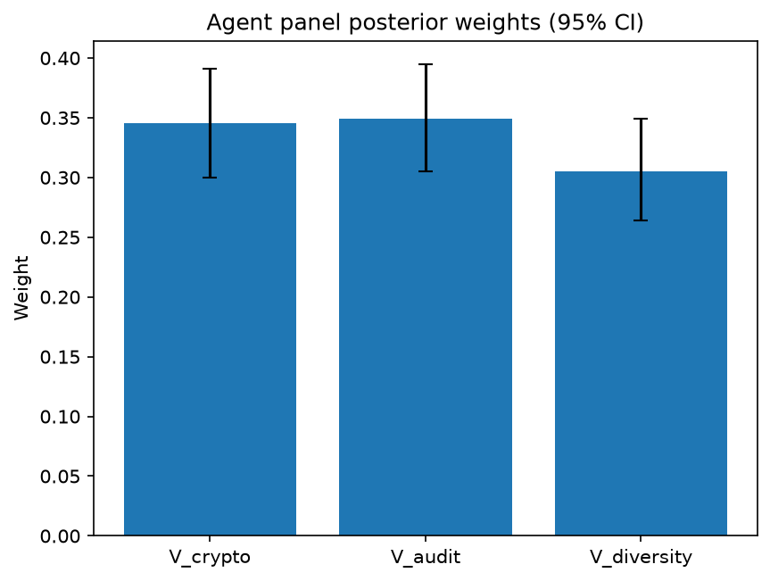

# Survey report: TrustRouter Agentic Full Panel (mistral:7b) -- Level L3c: Verification Strength sub-parts

Survey ID: `trustrouter-agentic-full-panel-mistral-2026-09-01-L3c`

## Agent panel

- Agents contributing a valid response: 36
- Classical BWM consistency: 36/36 within threshold

| Criterion | Mean | 95% CI lower | 95% CI upper |
|---|---|---|---|
| V_crypto | 0.3453 | 0.3000 | 0.3910 |
| V_audit | 0.3494 | 0.3051 | 0.3944 |
| V_diversity | 0.3053 | 0.2639 | 0.3491 |

## Methodology

Each agent independently completed a Best-Worst Method (BWM) comparison: choosing the single most and least important criterion, then rating every criterion's importance relative to those two on a 1-9 scale. Individual responses were solved with the classical BWM linear program (Rezaei, 2015) for a consistency check, and combined across the panel with a hierarchical Bayesian model (Mohammadi and Rezaei, 2020).

36 agent response(s) were accepted into this result.

Every agent's run began with a QA precheck (its stated configuration verified against ground truth) and every accepted answer's self-reported sources were checked against what reference material was actually available to it; see the Per-agent detail section below and this survey's Conversation Log for each agent's specific results. Every response is schema-validated and independently, repeatedly sampled (never a single completion treated as ground truth); see `guardrails.py`. This survey's complete output is covered by a SHA-256 integrity manifest (`integrity_manifest.json`, `SHA256SUMS`), generated once this run finished, so any later alteration to these files is detectable.

### Charts

## Per-agent detail

### bim-coordinator-base-openmanus (`bim-coordinator-base-openmanus`)

- Role: BIM Coordinator
- Model: ollama/mistral:7b
- DID: `did:key:z6MkfgXoko5fk2HGb2Dg55FYiiR6QE6wDmBBMDZ2ZVrDpTXM`
- QA precheck: passed
- Sources used: (not reported)

**Answer:** `{"best": "V_crypto", "worst": "V_diversity", "best_to_others": {"V_crypto": 1, "V_audit": 5, "V_diversity": 1}, "others_to_worst": {"V_diversity": 1, "V_audit": 7, "V_crypto": 1}}`

**Reasoning:**

 Best factor: V_crypto
Worst factor: V_diversity

 V_crypto vs V_audit: 5
V_crypto vs V_diversity: 1
V_audit vs V_diversity: 7

### bim-coordinator-base-openmanus (`bim-coordinator-base-openmanus`)

- Role: BIM Coordinator
- Model: ollama/mistral:7b
- DID: `did:key:z6MkfgXoko5fk2HGb2Dg55FYiiR6QE6wDmBBMDZ2ZVrDpTXM`
- QA precheck: passed
- Sources used: (not reported)

**Answer:** `{"best": "V_diversity", "worst": "V_crypto", "best_to_others": {"V_diversity": 1, "V_audit": 3, "V_crypto": 9}, "others_to_worst": {"V_crypto": 1, "V_audit": 6, "V_diversity": 9}}`

**Reasoning:**

 Best factor: V_diversity
Worst factor: V_crypto

 V_diversity vs V_audit: 3
V_diversity vs V_crypto: 9
V_audit vs V_crypto: 6

### bim-coordinator-base-openmanus (`bim-coordinator-base-openmanus`)

- Role: BIM Coordinator
- Model: ollama/mistral:7b
- DID: `did:key:z6MkfgXoko5fk2HGb2Dg55FYiiR6QE6wDmBBMDZ2ZVrDpTXM`
- QA precheck: passed
- Sources used: (not reported)

**Answer:** `{"best": "V_crypto", "worst": "V_diversity", "best_to_others": {"V_crypto": 1, "V_audit": 7, "V_diversity": 1}, "others_to_worst": {"V_diversity": 1, "V_audit": 2, "V_crypto": 1}}`

**Reasoning:**

 Best factor: V_crypto
Worst factor: V_diversity

 V_crypto vs V_audit: 7
V_crypto vs V_diversity: 1
V_audit vs V_diversity: 2

### bim-coordinator-rag-openmanus (`bim-coordinator-rag-openmanus`)

- Role: BIM Coordinator
- Model: ollama/mistral:7b
- DID: `did:key:z6MktumSUSZKAYBkVBipYZSQPNfpzsRpDK78beTjh9uW4mqo`
- QA precheck: passed
- Sources used: (not reported)

**Answer:** `{"best": "V_diversity", "worst": "V_crypto", "best_to_others": {"V_diversity": 1, "V_audit": 3, "V_crypto": 1}, "others_to_worst": {"V_crypto": 1, "V_audit": 2, "V_diversity": 1}}`

**Reasoning:**

 Best factor: V_diversity
Worst factor: V_crypto

 V_diversity vs V_audit: 3
V_diversity vs V_crypto: 1
V_audit vs V_crypto: 2

Reasoning:
- The best factor, V_diversity, is important because it ensures that multiple independent parties verify the construction project data, reducing the risk of a single point of failure or manipulation. In contrast, V_audit (Audit trail completeness) while important, does not necessarily guarantee the diversity of verification sources as it only focuses on who did what and when.
- The worst factor, V_crypto, is less important because while cryptographic evidence such as signatures and hashes can provide a level of security, they do not ensure the diversity of verification sources. In contrast, V_diversity ensures that multiple parties are involved in verifying the data, reducing the risk of a single point of failure or manipulation.
- V_audit is slightly more important than V_crypto because while both are important for ensuring the integrity and trustworthiness of construction project data, audit trail completeness provides more tangible evidence of who did what and when compared to cryptographic evidence alone. However, it does not guarantee the diversity of verification sources as effectively as V_diversity.

### bim-coordinator-rag-openmanus (`bim-coordinator-rag-openmanus`)

- Role: BIM Coordinator
- Model: ollama/mistral:7b
- DID: `did:key:z6MktumSUSZKAYBkVBipYZSQPNfpzsRpDK78beTjh9uW4mqo`
- QA precheck: passed
- Sources used: (not reported)

**Answer:** `{"best": "V_diversity", "worst": "V_crypto", "best_to_others": {"V_diversity": 1, "V_audit": 5, "V_crypto": 1}, "others_to_worst": {"V_crypto": 1, "V_audit": 9, "V_diversity": 1}}`

**Reasoning:**

 Best factor: V_diversity
Worst factor: V_crypto

 V_diversity vs V_audit: 5
V_diversity vs V_crypto: 1
V_audit vs V_crypto: 9

Reasoning:

* V_diversity vs V_audit: Both factors are important for ensuring the integrity and reliability of construction project records. However, diversity of verification sources (V_diversity) provides a more robust system by reducing the risk of a single point of failure or bias. On the other hand, audit trail completeness (V_audit) is crucial for tracking changes and understanding who did what, when. In a balanced scenario, both factors are important but V_diversity offers a broader perspective.
* V_diversity vs V_crypto: Cryptographic evidence (V_crypto) relies on mathematical algorithms to ensure the integrity of data. However, it is limited in its ability to provide a diverse range of verification sources. Diversity of verification sources (V_diversity), on the other hand, can include multiple independent parties, reducing the risk of a single point of failure or bias. In this comparison, V_diversity is significantly more important than V_crypto.
* V_audit vs V_crypto: Audit trail completeness (V_audit) focuses on tracking changes and understanding who did what, when. Cryptographic evidence (V_crypto), while it does not directly provide audit trail information, can help ensure the integrity of data by verifying its authenticity and non-tampering. In this comparison, V_crypto is more important than V_audit because it provides a foundation for trust in the data, upon which audit trails can be built. However, both factors are crucial for ensuring the reliability of construction project records.

### bim-coordinator-rag-openmanus (`bim-coordinator-rag-openmanus`)

- Role: BIM Coordinator
- Model: ollama/mistral:7b
- DID: `did:key:z6MktumSUSZKAYBkVBipYZSQPNfpzsRpDK78beTjh9uW4mqo`
- QA precheck: passed
- Sources used: (not reported)

**Answer:** `{"best": "V_diversity", "worst": "V_crypto", "best_to_others": {"V_diversity": 1, "V_audit": 5, "V_crypto": 1}, "others_to_worst": {"V_crypto": 1, "V_audit": 9, "V_diversity": 1}}`

**Reasoning:**

 Best factor: V_diversity
Worst factor: V_crypto

 V_diversity vs V_audit: 5
V_diversity vs V_crypto: 1
V_audit vs V_crypto: 9

Reasoning:
- V_diversity is the best factor because having multiple independent parties verifying a construction project record increases trust in its accuracy and reliability. This diversity helps to mitigate potential errors, biases, or malicious actions from any single party.
- V_crypto is the worst factor because while cryptographic evidence provides some level of security, it does not necessarily ensure the accuracy or completeness of the data being stored. Cryptography can be vulnerable to attacks and may not provide sufficient protection against all threats.
- Comparing V_diversity and V_audit, both factors are important for ensuring the trustworthiness of a construction project record. However, diversity of verification sources (V_diversity) is more important because it provides a broader range of perspectives and reduces the risk of errors or biases from any single party.
- Comparing V_diversity and V_crypto, cryptographic evidence (V_crypto) is less important because while it can provide some level of security, it does not necessarily ensure the accuracy or completeness of the data being stored. Diversity of verification sources (V_diversity) is more important for ensuring trustworthiness.
- Comparing V_audit and V_crypto, audit trail completeness (V_audit) is more important because it provides a record of who did what, when, which helps to ensure accountability and transparency in the construction project. Cryptographic evidence (V_crypto) alone does not necessarily provide this level of detail or oversight.

### blockchain-engineer-base-openmanus (`blockchain-engineer-base-openmanus`)

- Role: Blockchain / DLT Engineer
- Model: ollama/mistral:7b
- DID: `did:key:z6MkvHuD6rK5V96sxUAp7Xr6vcwjpUwrx7XzHHteGJRC5JuJ`
- QA precheck: passed
- Sources used: (not reported)

**Answer:** `{"best": "V_crypto", "worst": "V_diversity", "best_to_others": {"V_crypto": 1, "V_audit": 5, "V_diversity": 1}, "others_to_worst": {"V_diversity": 1, "V_audit": 7, "V_crypto": 1}}`

**Reasoning:**

 Best factor: V_crypto
Worst factor: V_diversity

 V_crypto vs V_audit: 5
V_crypto vs V_diversity: 1
V_audit vs V_diversity: 7

### blockchain-engineer-base-openmanus (`blockchain-engineer-base-openmanus`)

- Role: Blockchain / DLT Engineer
- Model: ollama/mistral:7b
- DID: `did:key:z6MkvHuD6rK5V96sxUAp7Xr6vcwjpUwrx7XzHHteGJRC5JuJ`
- QA precheck: passed
- Sources used: (not reported)

**Answer:** `{"best": "V_crypto", "worst": "V_diversity", "best_to_others": {"V_crypto": 1, "V_audit": 5, "V_diversity": 1}, "others_to_worst": {"V_diversity": 1, "V_audit": 7, "V_crypto": 1}}`

**Reasoning:**

 Best factor: V_crypto
Worst factor: V_diversity

 V_crypto vs V_audit: 5
V_crypto vs V_diversity: 1
V_audit vs V_diversity: 7

### blockchain-engineer-base-openmanus (`blockchain-engineer-base-openmanus`)

- Role: Blockchain / DLT Engineer
- Model: ollama/mistral:7b
- DID: `did:key:z6MkvHuD6rK5V96sxUAp7Xr6vcwjpUwrx7XzHHteGJRC5JuJ`
- QA precheck: passed
- Sources used: (not reported)

**Answer:** `{"best": "V_crypto", "worst": "V_diversity", "best_to_others": {"V_crypto": 1, "V_audit": 8, "V_diversity": 1}, "others_to_worst": {"V_diversity": 1, "V_audit": 7, "V_crypto": 1}}`

**Reasoning:**

 Best factor: V_crypto
Worst factor: V_diversity

 V_crypto vs V_audit: 8
V_crypto vs V_diversity: 1
V_audit vs V_diversity: 7

### blockchain-engineer-rag-openmanus (`blockchain-engineer-rag-openmanus`)

- Role: Blockchain / DLT Engineer
- Model: ollama/mistral:7b
- DID: `did:key:z6MkmucumNftjXuU1cP1wD4kXfg8GN5qLwkyp7b89yPpKxwP`
- QA precheck: passed
- Sources used: (not reported)

**Answer:** `{"best": "V_crypto", "worst": "V_diversity", "best_to_others": {"V_crypto": 1, "V_audit": 5, "V_diversity": 1}, "others_to_worst": {"V_diversity": 1, "V_audit": 3, "V_crypto": 1}}`

**Reasoning:**

 Best factor: V_crypto
Worst factor: V_diversity

 V_crypto vs V_audit: 5
V_crypto vs V_diversity: 1
V_audit vs V_diversity: 3

Reasoning:

* Cryptographic evidence (V_crypto) is crucial for ensuring the integrity and authenticity of data stored on a blockchain. It provides a mathematical guarantee that the data has not been tampered with, and it ensures that only authorized parties can add new data to the ledger. This factor is essential for maintaining trust in the system.
* Audit trail completeness (V_audit) is also important for ensuring the integrity of data on a blockchain. It provides a record of who did what, when, and under what circumstances. This information can be useful for investigating disputes or errors, and it can help to ensure that the system is being used in accordance with established policies and procedures.
* Diversity of verification sources (V_diversity) is important for ensuring the resilience and robustness of a blockchain-based data trust system. Having multiple independent parties verifying the same data helps to reduce the risk of errors or malicious activity, as any single party can be compromised. However, it is less critical than cryptographic evidence (V_crypto) in terms of ensuring the integrity and authenticity of the data.

### blockchain-engineer-rag-openmanus (`blockchain-engineer-rag-openmanus`)

- Role: Blockchain / DLT Engineer
- Model: ollama/mistral:7b
- DID: `did:key:z6MkmucumNftjXuU1cP1wD4kXfg8GN5qLwkyp7b89yPpKxwP`
- QA precheck: passed
- Sources used: (not reported)

**Answer:** `{"best": "V_crypto", "worst": "V_diversity", "best_to_others": {"V_crypto": 1, "V_audit": 3, "V_diversity": 1}, "others_to_worst": {"V_diversity": 1, "V_audit": 5, "V_crypto": 1}}`

**Reasoning:**

 Best factor: V_crypto
Worst factor: V_diversity

 V_crypto vs V_audit: 3
V_crypto vs V_diversity: 1
V_audit vs V_diversity: 5

### blockchain-engineer-rag-openmanus (`blockchain-engineer-rag-openmanus`)

- Role: Blockchain / DLT Engineer
- Model: ollama/mistral:7b
- DID: `did:key:z6MkmucumNftjXuU1cP1wD4kXfg8GN5qLwkyp7b89yPpKxwP`
- QA precheck: passed
- Sources used: (not reported)

**Answer:** `{"best": "V_crypto", "worst": "V_diversity", "best_to_others": {"V_crypto": 1, "V_audit": 3, "V_diversity": 1}, "others_to_worst": {"V_diversity": 1, "V_audit": 5, "V_crypto": 1}}`

**Reasoning:**

 Best factor: V_crypto
Worst factor: V_diversity

 V_crypto vs V_audit: 3
V_crypto vs V_diversity: 1
V_audit vs V_diversity: 5

### compliance-officer-base-openmanus (`compliance-officer-base-openmanus`)

- Role: Compliance and Regulatory Officer
- Model: ollama/mistral:7b
- DID: `did:key:z6MkfbCRS5qnxtVpnPvezz8VBQGuTFfkEPexhbtSd5ZwJVgY`
- QA precheck: passed
- Sources used: (not reported)

**Answer:** `{"best": "V_crypto", "worst": "V_diversity", "best_to_others": {"V_crypto": 1, "V_audit": 5, "V_diversity": 9}, "others_to_worst": {"V_diversity": 1, "V_audit": 1, "V_crypto": 9}}`

**Reasoning:**

 Best factor: V_crypto
Worst factor: V_diversity

 V_crypto vs V_audit: 5
V_crypto vs V_diversity: 9
V_audit vs V_diversity: 1

### compliance-officer-base-openmanus (`compliance-officer-base-openmanus`)

- Role: Compliance and Regulatory Officer
- Model: ollama/mistral:7b
- DID: `did:key:z6MkfbCRS5qnxtVpnPvezz8VBQGuTFfkEPexhbtSd5ZwJVgY`
- QA precheck: passed
- Sources used: (not reported)

**Answer:** `{"best": "V_crypto", "worst": "V_diversity", "best_to_others": {"V_crypto": 1, "V_audit": 7, "V_diversity": 1}, "others_to_worst": {"V_diversity": 1, "V_audit": 5, "V_crypto": 1}}`

**Reasoning:**

 Best factor: V_crypto
Worst factor: V_diversity

 V_crypto vs V_audit: 7
V_crypto vs V_diversity: 1
V_audit vs V_diversity: 5

### compliance-officer-base-openmanus (`compliance-officer-base-openmanus`)

- Role: Compliance and Regulatory Officer
- Model: ollama/mistral:7b
- DID: `did:key:z6MkfbCRS5qnxtVpnPvezz8VBQGuTFfkEPexhbtSd5ZwJVgY`
- QA precheck: passed
- Sources used: (not reported)

**Answer:** `{"best": "V_crypto", "worst": "V_diversity", "best_to_others": {"V_crypto": 1, "V_audit": 9, "V_diversity": 1}, "others_to_worst": {"V_diversity": 1, "V_audit": 7, "V_crypto": 1}}`

**Reasoning:**

 Best factor: V_crypto
Worst factor: V_diversity

 V_crypto vs V_audit: 9
V_crypto vs V_diversity: 1
V_audit vs V_diversity: 7

### compliance-officer-rag-openmanus (`compliance-officer-rag-openmanus`)

- Role: Compliance and Regulatory Officer
- Model: ollama/mistral:7b
- DID: `did:key:z6MkfA5TGsnWh3DK59EkbsAtJhFdtWUr86GzaTTLgCcq7FDt`
- QA precheck: passed
- Sources used: (not reported)

**Answer:** `{"best": "V_diversity", "worst": "V_crypto", "best_to_others": {"V_diversity": 1, "V_audit": 5, "V_crypto": 1}, "others_to_worst": {"V_crypto": 1, "V_audit": 9, "V_diversity": 1}}`

**Reasoning:**

 Best factor: V_diversity
Worst factor: V_crypto

 V_diversity vs V_audit: 5
V_diversity vs V_crypto: 1
V_audit vs V_crypto: 9

Reasoning:

* V_diversity is the best factor because having multiple independent parties verifying a construction project record increases trust in the accuracy and integrity of the data. This is because if one party makes an error or acts maliciously, other parties can catch it and correct the record. In contrast, a single party could potentially manipulate the data without detection.
* V_crypto is the worst factor because while cryptographic evidence such as signatures and hashes can provide some level of security, they are not foolproof. For example, if an attacker gains access to a private key, they can forge signatures or alter hashes undetected. In contrast, having multiple independent parties verifying the data provides a more robust check against manipulation.
* V_audit is more important than V_crypto because while cryptographic evidence can provide some level of security, it does not necessarily ensure that the data being verified is accurate or relevant to the construction project. An audit trail that documents who did what and when provides more context and transparency around the data, making it easier to verify its accuracy and relevance.

### compliance-officer-rag-openmanus (`compliance-officer-rag-openmanus`)

- Role: Compliance and Regulatory Officer
- Model: ollama/mistral:7b
- DID: `did:key:z6MkfA5TGsnWh3DK59EkbsAtJhFdtWUr86GzaTTLgCcq7FDt`
- QA precheck: passed
- Sources used: (not reported)

**Answer:** `{"best": "V_crypto", "worst": "V_diversity", "best_to_others": {"V_crypto": 1, "V_audit": 5, "V_diversity": 1}, "others_to_worst": {"V_diversity": 1, "V_audit": 3, "V_crypto": 1}}`

**Reasoning:**

 Best factor: V_crypto
Worst factor: V_diversity

 V_crypto vs V_audit: 5
V_crypto vs V_diversity: 1
V_audit vs V_diversity: 3

Reasoning:
- Cryptographic evidence (V_crypto) is considered the best factor because it provides a secure and reliable method for verifying the integrity of construction project records. It uses techniques such as signatures, hashes, and PKI to ensure that the data stored on the blockchain has not been tampered with or altered in any way.
- Diversity of verification sources (V_diversity) is considered the worst factor because it can be more difficult to ensure the reliability and accuracy of multiple independent parties verifying construction project records. There may be inconsistencies or errors introduced by different parties, making it harder to trust the data stored on the blockchain.
- Audit trail completeness (V_audit) is considered better than V_diversity because it provides a record of who did what and when, which can help to identify any discrepancies or inconsistencies in the data. However, it is still less important than cryptographic evidence (V_crypto) because it does not provide the same level of security and reliability.

### compliance-officer-rag-openmanus (`compliance-officer-rag-openmanus`)

- Role: Compliance and Regulatory Officer
- Model: ollama/mistral:7b
- DID: `did:key:z6MkfA5TGsnWh3DK59EkbsAtJhFdtWUr86GzaTTLgCcq7FDt`
- QA precheck: passed
- Sources used: (not reported)

**Answer:** `{"best": "V_crypto", "worst": "V_diversity", "best_to_others": {"V_crypto": 1, "V_audit": 5, "V_diversity": 1}, "others_to_worst": {"V_diversity": 1, "V_audit": 7, "V_crypto": 1}}`

**Reasoning:**

 Best factor: V_crypto
Worst factor: V_diversity

 V_crypto vs V_audit: 5
V_crypto vs V_diversity: 1
V_audit vs V_diversity: 7

Reasoning:

* Cryptographic evidence (V_crypto) is crucial for ensuring the integrity and authenticity of construction-project records, as it provides a means to verify that data has not been tampered with or altered. This is essential for maintaining trust in the system.
* Audit trail completeness (V_audit) is also important for ensuring trust in the system by providing a record of who did what and when. However, it does not provide the same level of protection against data alteration as cryptographic evidence.
* Diversity of verification sources (V_diversity) is less important than the other factors because it does not directly address the issue of data integrity or authenticity. While having multiple independent parties verifying data can help increase trust, it does not provide a robust means to protect against tampering or alteration.

### data-engineer-base-openmanus (`data-engineer-base-openmanus`)

- Role: Data Engineering Specialist
- Model: ollama/mistral:7b
- DID: `did:key:z6MktFhQynyK3hjjScxU7X5N1KeprxH9DRnj8UgC2dqicMmW`
- QA precheck: passed
- Sources used: (not reported)

**Answer:** `{"best": "V_crypto", "worst": "V_diversity", "best_to_others": {"V_crypto": 1, "V_audit": 7, "V_diversity": 1}, "others_to_worst": {"V_diversity": 1, "V_audit": 8, "V_crypto": 1}}`

**Reasoning:**

 Best factor: V_crypto
Worst factor: V_diversity

 V_crypto vs V_audit: 7
V_crypto vs V_diversity: 1
V_audit vs V_diversity: 8

### data-engineer-base-openmanus (`data-engineer-base-openmanus`)

- Role: Data Engineering Specialist
- Model: ollama/mistral:7b
- DID: `did:key:z6MktFhQynyK3hjjScxU7X5N1KeprxH9DRnj8UgC2dqicMmW`
- QA precheck: passed
- Sources used: (not reported)

**Answer:** `{"best": "V_crypto", "worst": "V_diversity", "best_to_others": {"V_crypto": 1, "V_audit": 7, "V_diversity": 1}, "others_to_worst": {"V_diversity": 1, "V_audit": 9, "V_crypto": 1}}`

**Reasoning:**

 Best factor: V_crypto
Worst factor: V_diversity

 V_crypto vs V_audit: 7
V_crypto vs V_diversity: 1
V_audit vs V_diversity: 9

### data-engineer-base-openmanus (`data-engineer-base-openmanus`)

- Role: Data Engineering Specialist
- Model: ollama/mistral:7b
- DID: `did:key:z6MktFhQynyK3hjjScxU7X5N1KeprxH9DRnj8UgC2dqicMmW`
- QA precheck: passed
- Sources used: (not reported)

**Answer:** `{"best": "V_crypto", "worst": "V_diversity", "best_to_others": {"V_crypto": 1, "V_audit": 7, "V_diversity": 1}, "others_to_worst": {"V_diversity": 1, "V_audit": 9, "V_crypto": 1}}`

**Reasoning:**

 Best factor: V_crypto
Worst factor: V_diversity

 V_crypto vs V_audit: 7
V_crypto vs V_diversity: 1
V_audit vs V_diversity: 9

### data-engineer-rag-openmanus (`data-engineer-rag-openmanus`)

- Role: Data Engineering Specialist
- Model: ollama/mistral:7b
- DID: `did:key:z6MkiWQoSrmLM3rsTnbbnu2vhEtsqyMtVskAeNJy3ryeBDJG`
- QA precheck: passed
- Sources used: (not reported)

**Answer:** `{"best": "V_crypto", "worst": "V_diversity", "best_to_others": {"V_crypto": 1, "V_audit": 5, "V_diversity": 1}, "others_to_worst": {"V_diversity": 1, "V_audit": 3, "V_crypto": 1}}`

**Reasoning:**

 Best factor: V_crypto
Worst factor: V_diversity

 V_crypto vs V_audit: 5
V_crypto vs V_diversity: 1
V_audit vs V_diversity: 3

Reasoning:

* Cryptographic evidence (V_crypto) is essential for ensuring the integrity and authenticity of construction-project records. This includes the use of signatures, hashes, and public key infrastructure (PKI). The cryptographic evidence provides a mathematical proof that the data stored on the blockchain has not been tampered with or altered since it was first recorded.
* Audit trail completeness (V_audit) is also important for ensuring the trustworthiness of construction-project records, as it provides information about who did what and when. However, it does not offer the same level of protection against data tampering as cryptographic evidence does.
* Diversity of verification sources (V_diversity) refers to the use of multiple independent parties to verify the accuracy and integrity of construction-project records. While this can be beneficial in terms of reducing the risk of a single point of failure, it does not offer the same level of protection against data tampering as cryptographic evidence does.
* In terms of importance, cryptographic evidence is more important than audit trail completeness because it provides a mathematical proof that the data has not been tampered with or altered since it was first recorded. Audit trail completeness is also important but less so than cryptographic evidence because it does not offer the same level of protection against data tampering. Diversity of verification sources is least important because it does not offer the same level of protection against data tampering as cryptographic evidence does.

### data-engineer-rag-openmanus (`data-engineer-rag-openmanus`)

- Role: Data Engineering Specialist
- Model: ollama/mistral:7b
- DID: `did:key:z6MkiWQoSrmLM3rsTnbbnu2vhEtsqyMtVskAeNJy3ryeBDJG`
- QA precheck: passed
- Sources used: (not reported)

**Answer:** `{"best": "V_crypto", "worst": "V_diversity", "best_to_others": {"V_crypto": 1, "V_audit": 7, "V_diversity": 1}, "others_to_worst": {"V_diversity": 1, "V_audit": 3, "V_crypto": 1}}`

**Reasoning:**

 Best factor: V_crypto
Worst factor: V_diversity

 V_crypto vs V_audit: 7
V_crypto vs V_diversity: 1
V_audit vs V_diversity: 3

Reasoning:

* Cryptographic evidence (V_crypto) is essential for ensuring the integrity and authenticity of construction-project data, as it provides a secure means to verify that the data has not been tampered with or altered. This includes the use of signatures, hashes, and Public Key Infrastructure (PKI).
* Audit trail completeness (V_audit) is important for tracking who did what, when, in the construction project, providing a record of all changes made to the data over time. This can help identify any errors or inconsistencies that may have occurred during the data's lifecycle.
* Diversity of verification sources (V_diversity) is less important than the other factors because it does not directly contribute to the security and integrity of the data itself. Instead, it focuses on having multiple independent parties verify the data, which can help increase trust in the data but does not provide a secure means to verify its authenticity or prevent tampering. In contrast, cryptographic evidence provides a more robust and reliable method for ensuring the data's security and integrity.

### data-engineer-rag-openmanus (`data-engineer-rag-openmanus`)

- Role: Data Engineering Specialist
- Model: ollama/mistral:7b
- DID: `did:key:z6MkiWQoSrmLM3rsTnbbnu2vhEtsqyMtVskAeNJy3ryeBDJG`
- QA precheck: passed
- Sources used: (not reported)

**Answer:** `{"best": "V_crypto", "worst": "V_diversity", "best_to_others": {"V_crypto": 1, "V_audit": 5, "V_diversity": 1}, "others_to_worst": {"V_diversity": 1, "V_audit": 3, "V_crypto": 1}}`

**Reasoning:**

 Best factor: V_crypto
Worst factor: V_diversity

 V_crypto vs V_audit: 5
V_crypto vs V_diversity: 1
V_audit vs V_diversity: 3

Reasoning:

* Cryptographic evidence (V_crypto) is crucial for ensuring the integrity and authenticity of construction-project data. It provides a means to verify that the data has not been tampered with or altered, which is essential for maintaining trust in the data. In contrast, audit trail completeness (V_audit) while important, does not offer the same level of protection against malicious attacks as cryptographic evidence.
* Diversity of verification sources (V_diversity) is less important than cryptographic evidence because it does not provide a direct means to verify the integrity and authenticity of data. Instead, it relies on multiple independent parties to vouch for the accuracy of the data, which can be subject to errors or biases. In contrast, cryptographic evidence offers a more objective and verifiable method for ensuring the trustworthiness of construction-project data.
* Audit trail completeness (V_audit) is less important than diversity of verification sources (V_diversity) because while audit trails provide valuable information about who did what and when, they do not necessarily ensure the accuracy or reliability of the underlying data. In contrast, having multiple independent parties verifying the same data can help to increase its overall trustworthiness by reducing the risk of errors or biases. However, it is important to note that both V_audit and V_diversity are still important factors in maintaining trust in construction-project data.

### project-manager-base-openmanus (`project-manager-base-openmanus`)

- Role: Construction Project Manager
- Model: ollama/mistral:7b
- DID: `did:key:z6MkmfTBzM8STi6eZQjBtyYUdmW4ALLgFT4436ojkBi1QXnf`
- QA precheck: passed
- Sources used: (not reported)

**Answer:** `{"best": "V_diversity", "worst": "V_crypto", "best_to_others": {"V_diversity": 1, "V_audit": 5, "V_crypto": 1}, "others_to_worst": {"V_crypto": 1, "V_audit": 9, "V_diversity": 1}}`

**Reasoning:**

 Best factor: V_diversity
Worst factor: V_crypto

 V_diversity vs V_audit: 5
V_diversity vs V_crypto: 1
V_audit vs V_crypto: 9

### project-manager-base-openmanus (`project-manager-base-openmanus`)

- Role: Construction Project Manager
- Model: ollama/mistral:7b
- DID: `did:key:z6MkmfTBzM8STi6eZQjBtyYUdmW4ALLgFT4436ojkBi1QXnf`
- QA precheck: passed
- Sources used: (not reported)

**Answer:** `{"best": "V_diversity", "worst": "V_crypto", "best_to_others": {"V_diversity": 1, "V_audit": 7, "V_crypto": 1}, "others_to_worst": {"V_crypto": 1, "V_audit": 9, "V_diversity": 1}}`

**Reasoning:**

 Best factor: V_diversity
Worst factor: V_crypto

 V_diversity vs V_audit: 7
V_diversity vs V_crypto: 1
V_audit vs V_crypto: 9

### project-manager-base-openmanus (`project-manager-base-openmanus`)

- Role: Construction Project Manager
- Model: ollama/mistral:7b
- DID: `did:key:z6MkmfTBzM8STi6eZQjBtyYUdmW4ALLgFT4436ojkBi1QXnf`
- QA precheck: passed
- Sources used: (not reported)

**Answer:** `{"best": "V_diversity", "worst": "V_crypto", "best_to_others": {"V_diversity": 1, "V_audit": 5, "V_crypto": 1}, "others_to_worst": {"V_crypto": 1, "V_audit": 9, "V_diversity": 1}}`

**Reasoning:**

 Best factor: V_diversity
Worst factor: V_crypto

 V_diversity vs V_audit: 5
V_diversity vs V_crypto: 1
V_audit vs V_crypto: 9

### project-manager-rag-openmanus (`project-manager-rag-openmanus`)

- Role: Construction Project Manager
- Model: ollama/mistral:7b
- DID: `did:key:z6MkoTifVHP1pHqn6fbzUhAKR4qjAt634zz49Rtj41amKoDx`
- QA precheck: passed
- Sources used: (not reported)

**Answer:** `{"best": "V_audit", "worst": "V_diversity", "best_to_others": {"V_audit": 1, "V_crypto": 1, "V_diversity": 9}, "others_to_worst": {"V_diversity": 1, "V_crypto": 8, "V_audit": 9}}`

**Reasoning:**

 Best factor: V_audit
Worst factor: V_diversity

 V_audit vs V_crypto: 1
V_audit vs V_diversity: 9
V_crypto vs V_diversity: 8

Reasoning:
- V_audit is the best factor because it ensures a complete and accurate record of all actions taken during the construction project, which is crucial for accountability and transparency. In contrast, cryptographic evidence (V_crypto) while important, does not provide as much information about who did what, when, compared to an audit trail.
- V_diversity is the worst factor because it relies on multiple independent parties for verification, which can be difficult to achieve in practice and may introduce inconsistencies or errors due to differences in methodologies or interpretations. In contrast, cryptographic evidence (V_crypto) provides a consistent and reliable means of verifying data integrity, while an audit trail (V_audit) ensures completeness and accountability.

### project-manager-rag-openmanus (`project-manager-rag-openmanus`)

- Role: Construction Project Manager
- Model: ollama/mistral:7b
- DID: `did:key:z6MkoTifVHP1pHqn6fbzUhAKR4qjAt634zz49Rtj41amKoDx`
- QA precheck: passed
- Sources used: (not reported)

**Answer:** `{"best": "V_audit", "worst": "V_diversity", "best_to_others": {"V_audit": 1, "V_crypto": 3, "V_diversity": 1}, "others_to_worst": {"V_diversity": 1, "V_crypto": 5, "V_audit": 1}}`

**Reasoning:**

 Best factor: V_audit
Worst factor: V_diversity

 V_audit vs V_crypto: 3
V_audit vs V_diversity: 1
V_crypto vs V_diversity: 5

Reasoning:

- V_audit (Audit trail completeness) is considered the best factor because it ensures that a comprehensive and accurate record of all actions, decisions, and changes made during a construction project's lifecycle are documented. This level of detail and transparency is crucial for accountability, traceability, and dispute resolution.

- V_crypto (Cryptographic evidence) is considered less important than V_audit because while it provides security features such as signatures and hashes, it does not necessarily ensure the completeness or accuracy of the audit trail. Cryptographic evidence can help verify the integrity of individual records but may not be sufficient to provide a comprehensive view of the entire project's history.

- V_diversity (Diversity of verification sources) is considered the worst factor because it does not directly contribute to the completeness or accuracy of an audit trail. While having multiple independent parties involved can help ensure the integrity of the data, it does not guarantee that all relevant actions and decisions are documented in the first place. In contrast, V_audit focuses on documenting all events, regardless of the number of parties involved.

### project-manager-rag-openmanus (`project-manager-rag-openmanus`)

- Role: Construction Project Manager
- Model: ollama/mistral:7b
- DID: `did:key:z6MkoTifVHP1pHqn6fbzUhAKR4qjAt634zz49Rtj41amKoDx`
- QA precheck: passed
- Sources used: (not reported)

**Answer:** `{"best": "V_audit", "worst": "V_diversity", "best_to_others": {"V_audit": 1, "V_crypto": 1, "V_diversity": 5}, "others_to_worst": {"V_diversity": 1, "V_crypto": 7, "V_audit": 5}}`

**Reasoning:**

 Best factor: V_audit
Worst factor: V_diversity

 V_audit vs V_crypto: 1
V_audit vs V_diversity: 5
V_crypto vs V_diversity: 7

### structural-engineer-base-openmanus (`structural-engineer-base-openmanus`)

- Role: Structural Engineer
- Model: ollama/mistral:7b
- DID: `did:key:z6MkneKsSUhTxF3pB1EzYLvMTxPBCQPtxRb2F4THAHgsHiqS`
- QA precheck: passed
- Sources used: (not reported)

**Answer:** `{"best": "V_crypto", "worst": "V_diversity", "best_to_others": {"V_crypto": 1, "V_audit": 7, "V_diversity": 1}, "others_to_worst": {"V_diversity": 1, "V_audit": 8, "V_crypto": 1}}`

**Reasoning:**

 Best factor: V_crypto
Worst factor: V_diversity

 V_crypto vs V_audit: 7
V_crypto vs V_diversity: 1
V_audit vs V_diversity: 8

### structural-engineer-base-openmanus (`structural-engineer-base-openmanus`)

- Role: Structural Engineer
- Model: ollama/mistral:7b
- DID: `did:key:z6MkneKsSUhTxF3pB1EzYLvMTxPBCQPtxRb2F4THAHgsHiqS`
- QA precheck: passed
- Sources used: (not reported)

**Answer:** `{"best": "V_crypto", "worst": "V_diversity", "best_to_others": {"V_crypto": 1, "V_audit": 7, "V_diversity": 1}, "others_to_worst": {"V_diversity": 1, "V_audit": 2, "V_crypto": 1}}`

**Reasoning:**

 Best factor: V_crypto
Worst factor: V_diversity

 V_crypto vs V_audit: 7
V_crypto vs V_diversity: 1
V_audit vs V_diversity: 2

### structural-engineer-base-openmanus (`structural-engineer-base-openmanus`)

- Role: Structural Engineer
- Model: ollama/mistral:7b
- DID: `did:key:z6MkneKsSUhTxF3pB1EzYLvMTxPBCQPtxRb2F4THAHgsHiqS`
- QA precheck: passed
- Sources used: (not reported)

**Answer:** `{"best": "V_crypto", "worst": "V_diversity", "best_to_others": {"V_crypto": 1, "V_audit": 7, "V_diversity": 1}, "others_to_worst": {"V_diversity": 1, "V_audit": 2, "V_crypto": 1}}`

**Reasoning:**

 Best factor: V_crypto
Worst factor: V_diversity

 V_crypto vs V_audit: 7
V_crypto vs V_diversity: 1
V_audit vs V_diversity: 2

### structural-engineer-rag-openmanus (`structural-engineer-rag-openmanus`)

- Role: Structural Engineer
- Model: ollama/mistral:7b
- DID: `did:key:z6Mkq9sxQdnLDNKYHKSbcFf6ApWb78WMj6E8VgRRcmWNpJib`
- QA precheck: passed
- Sources used: (not reported)

**Answer:** `{"best": "V_crypto", "worst": "V_diversity", "best_to_others": {"V_crypto": 1, "V_audit": 5, "V_diversity": 1}, "others_to_worst": {"V_diversity": 1, "V_audit": 3, "V_crypto": 1}}`

**Reasoning:**

 Best factor: V_crypto
Worst factor: V_diversity

 V_crypto vs V_audit: 5
V_crypto vs V_diversity: 1
V_audit vs V_diversity: 3

Reasoning:

* Cryptographic evidence (V_crypto) is essential for the security and integrity of a construction-project record. It provides a means to verify the authenticity, non-repudiation, and data integrity of the record through the use of signatures, hashes, and PKI. In contrast, audit trail completeness (V_audit) while important, does not offer the same level of security as cryptographic evidence.
* Diversity of verification sources (V_diversity) is less important than cryptographic evidence (V_crypto). While multiple independent parties can help to verify and validate a record, it does not provide the same level of security as cryptographic evidence. In contrast, cryptographic evidence offers a more robust and reliable means of ensuring the integrity of a construction-project record.
* Audit trail completeness (V_audit) is less important than diversity of verification sources (V_diversity). While audit trails provide valuable information about who did what and when, they do not offer the same level of security as cryptographic evidence or the ability to verify and validate a record from multiple independent parties. In contrast, diversity of verification sources can help to ensure that a record is accurate and reliable by providing multiple perspectives on its contents.

### structural-engineer-rag-openmanus (`structural-engineer-rag-openmanus`)

- Role: Structural Engineer
- Model: ollama/mistral:7b
- DID: `did:key:z6Mkq9sxQdnLDNKYHKSbcFf6ApWb78WMj6E8VgRRcmWNpJib`
- QA precheck: passed
- Sources used: (not reported)

**Answer:** `{"best": "V_crypto", "worst": "V_diversity", "best_to_others": {"V_crypto": 1, "V_audit": 5, "V_diversity": 1}, "others_to_worst": {"V_diversity": 1, "V_audit": 7, "V_crypto": 1}}`

**Reasoning:**

 Best factor: V_crypto
Worst factor: V_diversity

 V_crypto vs V_audit: 5
V_crypto vs V_diversity: 1
V_audit vs V_diversity: 7

### structural-engineer-rag-openmanus (`structural-engineer-rag-openmanus`)

- Role: Structural Engineer
- Model: ollama/mistral:7b
- DID: `did:key:z6Mkq9sxQdnLDNKYHKSbcFf6ApWb78WMj6E8VgRRcmWNpJib`
- QA precheck: passed
- Sources used: (not reported)

**Answer:** `{"best": "V_crypto", "worst": "V_diversity", "best_to_others": {"V_crypto": 1, "V_audit": 5, "V_diversity": 1}, "others_to_worst": {"V_diversity": 1, "V_audit": 7, "V_crypto": 1}}`

**Reasoning:**

 Best factor: V_crypto
Worst factor: V_diversity

 V_crypto vs V_audit: 5
V_crypto vs V_diversity: 1
V_audit vs V_diversity: 7

Reasoning:

* Cryptographic evidence (V_crypto) is crucial for ensuring the integrity and authenticity of construction-project records. It provides a secure means to verify that the data has not been tampered with or altered, which is essential for maintaining trust in the system. The use of signatures, hashes, and PKI helps establish a clear chain of custody and ensures that only authorized parties can access and modify the records.
* Audit trail completeness (V_audit) is also important for ensuring trust in the system, as it provides a record of who did what, when. This information is useful for tracking changes to the data, identifying errors or inconsistencies, and holding parties accountable for their actions. However, while V_crypto ensures the integrity of the data itself, V_audit only provides evidence of the actions taken on that data.
* Diversity of verification sources (V_diversity) is less important than either V_crypto or V_audit in terms of ensuring trust in construction-project records. While having multiple independent parties involved in verifying the data can help increase its reliability, it does not provide the same level of security as cryptographic evidence. Additionally, relying on a large number of parties can make the system more complex and difficult to manage, potentially leading to errors or inconsistencies. In contrast, V_crypto provides a clear and secure means to verify the data, without requiring the involvement of multiple parties.
