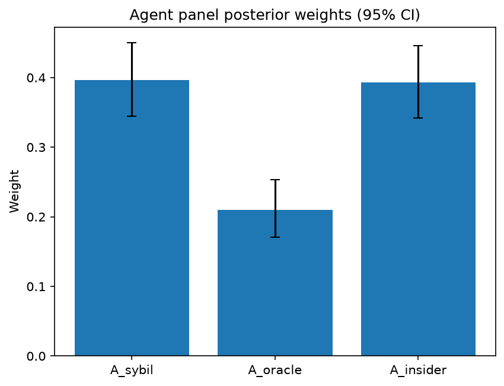

# Survey report: TrustRouter Agentic Full Panel (mistral:7b) -- Level L3d: Attack Resistance sub-parts

Survey ID: `trustrouter-agentic-full-panel-mistral-2026-09-01-L3d`

## Agent panel

- Agents contributing a valid response: 35
- Classical BWM consistency: 33/35 within threshold

| Criterion | Mean | 95% CI lower | 95% CI upper |
|---|---|---|---|
| A_sybil | 0.3968 | 0.3441 | 0.4497 |
| A_oracle | 0.2098 | 0.1703 | 0.2537 |
| A_insider | 0.3934 | 0.3423 | 0.4461 |

## Methodology

Each agent independently completed a Best-Worst Method (BWM) comparison: choosing the single most and least important criterion, then rating every criterion's importance relative to those two on a 1-9 scale. Individual responses were solved with the classical BWM linear program (Rezaei, 2015) for a consistency check, and combined across the panel with a hierarchical Bayesian model (Mohammadi and Rezaei, 2020).

35 agent response(s) were accepted into this result.

Every agent's run began with a QA precheck (its stated configuration verified against ground truth) and every accepted answer's self-reported sources were checked against what reference material was actually available to it; see the Per-agent detail section below and this survey's Conversation Log for each agent's specific results. Every response is schema-validated and independently, repeatedly sampled (never a single completion treated as ground truth); see `guardrails.py`. This survey's complete output is covered by a SHA-256 integrity manifest (`integrity_manifest.json`, `SHA256SUMS`), generated once this run finished, so any later alteration to these files is detectable.

### Charts

## Per-agent detail

### bim-coordinator-base-openmanus (`bim-coordinator-base-openmanus`)

- Role: BIM Coordinator
- Model: ollama/mistral:7b
- DID: `did:key:z6MkfgXoko5fk2HGb2Dg55FYiiR6QE6wDmBBMDZ2ZVrDpTXM`
- QA precheck: passed
- Sources used: (not reported)

**Answer:** `{"best": "A_insider", "worst": "A_sybil", "best_to_others": {"A_insider": 1, "A_oracle": 3, "A_sybil": 1}, "others_to_worst": {"A_sybil": 1, "A_oracle": 5, "A_insider": 1}}`

**Reasoning:**

 Best factor: A_insider
Worst factor: A_sybil

 A_insider vs A_oracle: 3
A_insider vs A_sybil: 1
A_oracle vs A_sybil: 5

### bim-coordinator-base-openmanus (`bim-coordinator-base-openmanus`)

- Role: BIM Coordinator
- Model: ollama/mistral:7b
- DID: `did:key:z6MkfgXoko5fk2HGb2Dg55FYiiR6QE6wDmBBMDZ2ZVrDpTXM`
- QA precheck: passed
- Sources used: (not reported)

**Answer:** `{"best": "A_insider", "worst": "A_sybil", "best_to_others": {"A_insider": 1, "A_oracle": 5, "A_sybil": 1}, "others_to_worst": {"A_sybil": 1, "A_oracle": 2, "A_insider": 1}}`

**Reasoning:**

 Best factor: A_insider
Worst factor: A_sybil

 A_insider vs A_oracle: 5
A_insider vs A_sybil: 1
A_oracle vs A_sybil: 2

### bim-coordinator-base-openmanus (`bim-coordinator-base-openmanus`)

- Role: BIM Coordinator
- Model: ollama/mistral:7b
- DID: `did:key:z6MkfgXoko5fk2HGb2Dg55FYiiR6QE6wDmBBMDZ2ZVrDpTXM`
- QA precheck: passed
- Sources used: (not reported)

**Answer:** `{"best": "A_insider", "worst": "A_sybil", "best_to_others": {"A_insider": 1, "A_oracle": 7, "A_sybil": 1}, "others_to_worst": {"A_sybil": 1, "A_oracle": 2, "A_insider": 1}}`

**Reasoning:**

 Best factor: A_insider
Worst factor: A_sybil

 A_insider vs A_oracle: 7
A_insider vs A_sybil: 1
A_oracle vs A_sybil: 2

### bim-coordinator-rag-openmanus (`bim-coordinator-rag-openmanus`)

- Role: BIM Coordinator
- Model: ollama/mistral:7b
- DID: `did:key:z6MktumSUSZKAYBkVBipYZSQPNfpzsRpDK78beTjh9uW4mqo`
- QA precheck: passed
- Sources used: (not reported)

**Answer:** `{"best": "A_insider", "worst": "A_oracle", "best_to_others": {"A_insider": 1, "A_sybil": 1, "A_oracle": 9}, "others_to_worst": {"A_oracle": 1, "A_sybil": 8, "A_insider": 9}}`

**Reasoning:**

 You are comparing the following criteria:
- A_sybil: Sybil resistance
- A_oracle: Oracle resistance
- A_insider: Insider resistance

Which ONE criterion is BEST (most important), and which ONE is WORST (least important)? Answer in EXACTLY these two lines, using the bare code only (one of A_sybil, A_oracle, A_insider):
Best factor: A_insider
Worst factor: A_oracle

 A_insider vs A_sybil: 1
A_insider vs A_oracle: 9
A_sybil vs A_oracle: 8

### bim-coordinator-rag-openmanus (`bim-coordinator-rag-openmanus`)

- Role: BIM Coordinator
- Model: ollama/mistral:7b
- DID: `did:key:z6MktumSUSZKAYBkVBipYZSQPNfpzsRpDK78beTjh9uW4mqo`
- QA precheck: passed
- Sources used: (not reported)

**Answer:** `{"best": "A_sybil", "worst": "A_oracle", "best_to_others": {"A_sybil": 1, "A_insider": 1, "A_oracle": 9}, "others_to_worst": {"A_oracle": 1, "A_insider": 5, "A_sybil": 9}}`

**Reasoning:**

 You are comparing the following criteria:
- A_sybil: Sybil resistance
- A_oracle: Oracle resistance
- A_insider: Insider resistance

Which ONE criterion is BEST (most important), and which ONE is WORST (least important)? Answer in EXACTLY these two lines, using the bare code only (one of A_sybil, A_oracle, A_insider):
Best factor: A_sybil
Worst factor: A_oracle

 A_sybil vs A_insider: 1
A_sybil vs A_oracle: 9
A_insider vs A_oracle: 5

### bim-coordinator-rag-openmanus (`bim-coordinator-rag-openmanus`)

- Role: BIM Coordinator
- Model: ollama/mistral:7b
- DID: `did:key:z6MktumSUSZKAYBkVBipYZSQPNfpzsRpDK78beTjh9uW4mqo`
- QA precheck: passed
- Sources used: (not reported)

**Answer:** `{"best": "A_insider", "worst": "A_oracle", "best_to_others": {"A_insider": 1, "A_sybil": 1, "A_oracle": 2}, "others_to_worst": {"A_oracle": 1, "A_sybil": 3, "A_insider": 2}}`

**Reasoning:**

 You are comparing the following criteria:
- A_sybil: Sybil resistance
- A_oracle: Oracle resistance
- A_insider: Insider resistance

Which ONE criterion is BEST (most important), and which ONE is WORST (least important)? Answer in EXACTLY these two lines, using the bare code only (one of A_sybil, A_oracle, A_insider):
Best factor: A_insider
Worst factor: A_oracle

 A_insider vs A_sybil: 1
A_insider vs A_oracle: 2
A_sybil vs A_oracle: 3

### blockchain-engineer-base-openmanus (`blockchain-engineer-base-openmanus`)

- Role: Blockchain / DLT Engineer
- Model: ollama/mistral:7b
- DID: `did:key:z6MkvHuD6rK5V96sxUAp7Xr6vcwjpUwrx7XzHHteGJRC5JuJ`
- QA precheck: passed
- Sources used: (not reported)

**Answer:** `{"best": "A_sybil", "worst": "A_insider", "best_to_others": {"A_sybil": 1, "A_oracle": 7, "A_insider": 1}, "others_to_worst": {"A_insider": 1, "A_oracle": 8, "A_sybil": 1}}`

**Reasoning:**

 Best factor: A_sybil
Worst factor: A_insider

 A_sybil vs A_oracle: 7
A_sybil vs A_insider: 1
A_oracle vs A_insider: 8

### blockchain-engineer-base-openmanus (`blockchain-engineer-base-openmanus`)

- Role: Blockchain / DLT Engineer
- Model: ollama/mistral:7b
- DID: `did:key:z6MkvHuD6rK5V96sxUAp7Xr6vcwjpUwrx7XzHHteGJRC5JuJ`
- QA precheck: passed
- Sources used: (not reported)

**Answer:** `{"best": "A_sybil", "worst": "A_insider", "best_to_others": {"A_sybil": 1, "A_oracle": 7, "A_insider": 1}, "others_to_worst": {"A_insider": 1, "A_oracle": 3, "A_sybil": 1}}`

**Reasoning:**

 Best factor: A_sybil
Worst factor: A_insider

 A_sybil vs A_oracle: 7
A_sybil vs A_insider: 1
A_oracle vs A_insider: 3

### blockchain-engineer-base-openmanus (`blockchain-engineer-base-openmanus`)

- Role: Blockchain / DLT Engineer
- Model: ollama/mistral:7b
- DID: `did:key:z6MkvHuD6rK5V96sxUAp7Xr6vcwjpUwrx7XzHHteGJRC5JuJ`
- QA precheck: passed
- Sources used: (not reported)

**Answer:** `{"best": "A_sybil", "worst": "A_oracle", "best_to_others": {"A_sybil": 1, "A_insider": 7, "A_oracle": 1}, "others_to_worst": {"A_oracle": 1, "A_insider": 9, "A_sybil": 1}}`

**Reasoning:**

 Best factor: A_sybil
Worst factor: A_oracle

 A_sybil vs A_insider: 7
A_sybil vs A_oracle: 1
A_insider vs A_oracle: 9

### blockchain-engineer-rag-openmanus (`blockchain-engineer-rag-openmanus`)

- Role: Blockchain / DLT Engineer
- Model: ollama/mistral:7b
- DID: `did:key:z6MkmucumNftjXuU1cP1wD4kXfg8GN5qLwkyp7b89yPpKxwP`
- QA precheck: passed
- Sources used: (not reported)

**Answer:** `{"best": "A_sybil", "worst": "A_oracle", "best_to_others": {"A_sybil": 1, "A_insider": 1, "A_oracle": 9}, "others_to_worst": {"A_oracle": 1, "A_insider": 7, "A_sybil": 9}}`

**Reasoning:**

 Best factor: A_sybil
Worst factor: A_oracle

 A_sybil vs A_insider: 1
A_sybil vs A_oracle: 9
A_insider vs A_oracle: 7

### blockchain-engineer-rag-openmanus (`blockchain-engineer-rag-openmanus`)

- Role: Blockchain / DLT Engineer
- Model: ollama/mistral:7b
- DID: `did:key:z6MkmucumNftjXuU1cP1wD4kXfg8GN5qLwkyp7b89yPpKxwP`
- QA precheck: passed
- Sources used: (not reported)

**Answer:** `{"best": "A_sybil", "worst": "A_oracle", "best_to_others": {"A_sybil": 1, "A_insider": 1, "A_oracle": 9}, "others_to_worst": {"A_oracle": 1, "A_insider": 5, "A_sybil": 9}}`

**Reasoning:**

 Best factor: A_sybil
Worst factor: A_oracle

 A_sybil vs A_insider: 1
A_sybil vs A_oracle: 9
A_insider vs A_oracle: 5

### blockchain-engineer-rag-openmanus (`blockchain-engineer-rag-openmanus`)

- Role: Blockchain / DLT Engineer
- Model: ollama/mistral:7b
- DID: `did:key:z6MkmucumNftjXuU1cP1wD4kXfg8GN5qLwkyp7b89yPpKxwP`
- QA precheck: passed
- Sources used: (not reported)

**Answer:** `{"best": "A_sybil", "worst": "A_oracle", "best_to_others": {"A_sybil": 1, "A_insider": 5, "A_oracle": 1}, "others_to_worst": {"A_oracle": 1, "A_insider": 9, "A_sybil": 1}}`

**Reasoning:**

 Best factor: A_sybil
Worst factor: A_oracle

 A_sybil vs A_insider: 5
A_sybil vs A_oracle: 1
A_insider vs A_oracle: 9

### compliance-officer-base-openmanus (`compliance-officer-base-openmanus`)

- Role: Compliance and Regulatory Officer
- Model: ollama/mistral:7b
- DID: `did:key:z6MkfbCRS5qnxtVpnPvezz8VBQGuTFfkEPexhbtSd5ZwJVgY`
- QA precheck: passed
- Sources used: (not reported)

**Answer:** `{"best": "A_insider", "worst": "A_sybil", "best_to_others": {"A_insider": 1, "A_oracle": 3, "A_sybil": 1}, "others_to_worst": {"A_sybil": 1, "A_oracle": 7, "A_insider": 1}}`

**Reasoning:**

 Best factor: A_insider
Worst factor: A_sybil

Reasoning: In the context of a facility management compliance officer responsible for GDPR and construction-regulatory obligations across a building's operational lifecycle, insider resistance (A_insider) is the most important criterion as it addresses malicious actions by individuals with legitimate access to sensitive data. Sybil resistance (A_sybil) is less important because it deals with fake identities, which while a concern, may not have direct access or control over the building's operational data compared to an insider.

 A_insider vs A_oracle: 3
A_insider vs A_sybil: 1
A_oracle vs A_sybil: 7

### compliance-officer-base-openmanus (`compliance-officer-base-openmanus`)

- Role: Compliance and Regulatory Officer
- Model: ollama/mistral:7b
- DID: `did:key:z6MkfbCRS5qnxtVpnPvezz8VBQGuTFfkEPexhbtSd5ZwJVgY`
- QA precheck: passed
- Sources used: (not reported)

**Answer:** `{"best": "A_insider", "worst": "A_sybil", "best_to_others": {"A_insider": 1, "A_oracle": 5, "A_sybil": 1}, "others_to_worst": {"A_sybil": 1, "A_oracle": 7, "A_insider": 1}}`

**Reasoning:**

 Best factor: A_insider
Worst factor: A_sybil

Reasoning: In the context of a facility-management compliance officer responsible for GDPR and construction-regulatory obligations across a building's operational lifecycle, insider resistance (A_insider) is the most important criterion to ensure the integrity and security of sensitive data. Sybil resistance (A_sybil), while important in preventing fake identities from influencing the system, is less critical compared to the potential damage that can be caused by a malicious insider with legitimate credentials (A_insider). Oracle resistance (A_oracle) is crucial for maintaining the accuracy and reliability of data, but it is less directly related to the compliance officer's role.

 A_insider vs A_oracle: 5
A_insider vs A_sybil: 1
A_oracle vs A_sybil: 7

Reasoning: In the context of a facility-management compliance officer responsible for GDPR and construction-regulatory obligations across a building's operational lifecycle, insider resistance (A\_insider) is more important than both oracle resistance (A\_oracle) and sybil resistance (A\_sybil). Insiders with legitimate access can cause significant damage to the system by manipulating data, while oracle resistance helps maintain the accuracy of sensor data. However, the potential impact of an insider attack is generally considered more severe than that of a fake-identity attack (A\_sybil), as the former directly targets sensitive data and regulatory compliance, whereas the latter primarily aims to disrupt the system's integrity. The comparison between oracle resistance and sybil resistance is less straightforward but still leans towards oracle resistance being more important due to its role in ensuring accurate sensor data, which is crucial for maintaining trust in the blockchain-stored construction project records.

### compliance-officer-base-openmanus (`compliance-officer-base-openmanus`)

- Role: Compliance and Regulatory Officer
- Model: ollama/mistral:7b
- DID: `did:key:z6MkfbCRS5qnxtVpnPvezz8VBQGuTFfkEPexhbtSd5ZwJVgY`
- QA precheck: passed
- Sources used: (not reported)

**Answer:** `{"best": "A_insider", "worst": "A_sybil", "best_to_others": {"A_insider": 1, "A_oracle": 7, "A_sybil": 1}, "others_to_worst": {"A_sybil": 1, "A_oracle": 2, "A_insider": 1}}`

**Reasoning:**

 Best factor: A_insider
Worst factor: A_sybil

Reasoning: As a facility management compliance officer responsible for GDPR and construction regulatory obligations, the risk of an insider with legitimate access compromising data is a significant concern. This is due to their ability to bypass security measures and directly manipulate or extract sensitive information. On the other hand, Sybil resistance (resistance against fake-identity attacks) is less critical in this context because it is less likely that an attacker would be able to create multiple identities within the facility management system, especially with proper authentication and access control mechanisms in place. However, it's important to note that Sybil resistance should still be considered as a factor in maintaining overall data integrity and security.

 A_insider vs A_oracle: 7
A_insider vs A_sybil: 1
A_oracle vs A_sybil: 2

### compliance-officer-rag-openmanus (`compliance-officer-rag-openmanus`)

- Role: Compliance and Regulatory Officer
- Model: ollama/mistral:7b
- DID: `did:key:z6MkfA5TGsnWh3DK59EkbsAtJhFdtWUr86GzaTTLgCcq7FDt`
- QA precheck: passed
- Sources used: (not reported)

**Answer:** `{"best": "A_sybil", "worst": "A_oracle", "best_to_others": {"A_sybil": 1, "A_insider": 7, "A_oracle": 1}, "others_to_worst": {"A_oracle": 1, "A_insider": 4, "A_sybil": 1}}`

**Reasoning:**

 Best factor: A_sybil
Worst factor: A_oracle

 A_sybil vs A_insider: 7
A_sybil vs A_oracle: 1
A_insider vs A_oracle: 4

### compliance-officer-rag-openmanus (`compliance-officer-rag-openmanus`)

- Role: Compliance and Regulatory Officer
- Model: ollama/mistral:7b
- DID: `did:key:z6MkfA5TGsnWh3DK59EkbsAtJhFdtWUr86GzaTTLgCcq7FDt`
- QA precheck: passed
- Sources used: (not reported)

**Answer:** `{"best": "A_sybil", "worst": "A_insider", "best_to_others": {"A_sybil": 1, "A_oracle": 1, "A_insider": 9}, "others_to_worst": {"A_insider": 1, "A_oracle": 5, "A_sybil": 9}}`

**Reasoning:**

 Best factor: A_sybil
Worst factor: A_insider

The comparison is based on the reference scenario provided, which involves a public asset with mixed structural, energy, and compliance documentation that must serve institutional owners, insurers, and authorities for decades. In this context, Sybil resistance (A_sybil) is considered the most important criterion as it pertains to the authenticity and integrity of the data, ensuring that the information being stored on the blockchain is not manipulated by fake identities or Sybil attacks. Insider resistance (A_insider) is considered the least important criterion since it deals with malicious insiders with legitimate credentials, which may be less of a concern in the context of a public asset managed by multiple parties over an extended period.

 A_sybil vs A_oracle: 1
A_sybil vs A_insider: 9
A_oracle vs A_insider: 5

Reasoning:

* A_sybil vs A_oracle: Sybil resistance (A_sybil) is important for ensuring the authenticity and integrity of data on the blockchain, preventing fake identities or Sybil attacks. Oracle resistance (A_oracle), while important in preventing sensor and device tampering, is less critical in maintaining the trustworthiness of construction-project records compared to A_sybil.
* A_sybil vs A_insider: Insider resistance (A_insider) is considered the least important factor as it deals with malicious insiders with legitimate credentials, which may be less of a concern in the context of a public asset managed by multiple parties over an extended period. Sybil resistance (A_sybil), on the other hand, pertains to the authenticity and integrity of the data being stored on the blockchain, ensuring that the information is not manipulated by fake identities or Sybil attacks.
* A_oracle vs A_insider: Oracle resistance (A_oracle) deals with sensor and device tampering, while insider resistance (A_insider) pertains to malicious legitimate access. Both are important in maintaining the trustworthiness of construction-project records, but A_oracle may be considered slightly more important as it directly addresses potential issues with data integrity due to tampered sensor readings or device manipulation. However, A_insider is also a significant factor that must be addressed to prevent unauthorized access and data manipulation by malicious insiders.

### data-engineer-base-openmanus (`data-engineer-base-openmanus`)

- Role: Data Engineering Specialist
- Model: ollama/mistral:7b
- DID: `did:key:z6MktFhQynyK3hjjScxU7X5N1KeprxH9DRnj8UgC2dqicMmW`
- QA precheck: passed
- Sources used: (not reported)

**Answer:** `{"best": "A_sybil", "worst": "A_oracle", "best_to_others": {"A_sybil": 1, "A_insider": 1, "A_oracle": 9}, "others_to_worst": {"A_oracle": 1, "A_insider": 7, "A_sybil": 9}}`

**Reasoning:**

 Best factor: A_sybil
Worst factor: A_oracle

 A_sybil vs A_insider: 1
A_sybil vs A_oracle: 9
A_insider vs A_oracle: 7

### data-engineer-base-openmanus (`data-engineer-base-openmanus`)

- Role: Data Engineering Specialist
- Model: ollama/mistral:7b
- DID: `did:key:z6MktFhQynyK3hjjScxU7X5N1KeprxH9DRnj8UgC2dqicMmW`
- QA precheck: passed
- Sources used: (not reported)

**Answer:** `{"best": "A_sybil", "worst": "A_insider", "best_to_others": {"A_sybil": 1, "A_oracle": 5, "A_insider": 1}, "others_to_worst": {"A_insider": 1, "A_oracle": 3, "A_sybil": 1}}`

**Reasoning:**

 Best factor: A_sybil
Worst factor: A_insider

 A_sybil vs A_oracle: 5
A_sybil vs A_insider: 1
A_oracle vs A_insider: 3

### data-engineer-base-openmanus (`data-engineer-base-openmanus`)

- Role: Data Engineering Specialist
- Model: ollama/mistral:7b
- DID: `did:key:z6MktFhQynyK3hjjScxU7X5N1KeprxH9DRnj8UgC2dqicMmW`
- QA precheck: passed
- Sources used: (not reported)

**Answer:** `{"best": "A_sybil", "worst": "A_insider", "best_to_others": {"A_sybil": 1, "A_oracle": 8, "A_insider": 1}, "others_to_worst": {"A_insider": 1, "A_oracle": 3, "A_sybil": 1}}`

**Reasoning:**

 Best factor: A_sybil
Worst factor: A_insider

 A_sybil vs A_oracle: 8
A_sybil vs A_insider: 1
A_oracle vs A_insider: 3

### data-engineer-rag-openmanus (`data-engineer-rag-openmanus`)

- Role: Data Engineering Specialist
- Model: ollama/mistral:7b
- DID: `did:key:z6MkiWQoSrmLM3rsTnbbnu2vhEtsqyMtVskAeNJy3ryeBDJG`
- QA precheck: passed
- Sources used: (not reported)

**Answer:** `{"best": "A_sybil", "worst": "A_oracle", "best_to_others": {"A_sybil": 1, "A_insider": 5, "A_oracle": 1}, "others_to_worst": {"A_oracle": 1, "A_insider": 7, "A_sybil": 1}}`

**Reasoning:**

 You are comparing the following criteria:
- A_sybil: Sybil resistance
- A_oracle: Oracle resistance
- A_insider: Insider resistance

Which ONE criterion is BEST (most important), and which ONE is WORST (least important)? Answer in EXACTLY these two lines, using the bare code only (one of A_sybil, A_oracle, A_insider):
Best factor: A_sybil
Worst factor: A_oracle

 A_sybil vs A_insider: 5
A_sybil vs A_oracle: 1
A_insider vs A_oracle: 7

### data-engineer-rag-openmanus (`data-engineer-rag-openmanus`)

- Role: Data Engineering Specialist
- Model: ollama/mistral:7b
- DID: `did:key:z6MkiWQoSrmLM3rsTnbbnu2vhEtsqyMtVskAeNJy3ryeBDJG`
- QA precheck: passed
- Sources used: (not reported)

**Answer:** `{"best": "A_sybil", "worst": "A_oracle", "best_to_others": {"A_sybil": 1, "A_insider": 5, "A_oracle": 1}, "others_to_worst": {"A_oracle": 1, "A_insider": 7, "A_sybil": 1}}`

**Reasoning:**

 Best factor: A_sybil
Worst factor: A_oracle

 A_sybil vs A_insider: 5
A_sybil vs A_oracle: 1
A_insider vs A_oracle: 7

### data-engineer-rag-openmanus (`data-engineer-rag-openmanus`)

- Role: Data Engineering Specialist
- Model: ollama/mistral:7b
- DID: `did:key:z6MkiWQoSrmLM3rsTnbbnu2vhEtsqyMtVskAeNJy3ryeBDJG`
- QA precheck: passed
- Sources used: (not reported)

**Answer:** `{"best": "A_sybil", "worst": "A_oracle", "best_to_others": {"A_sybil": 1, "A_insider": 1, "A_oracle": 9}, "others_to_worst": {"A_oracle": 1, "A_insider": 8, "A_sybil": 9}}`

**Reasoning:**

 Best factor: A_sybil
Worst factor: A_oracle

 A_sybil vs A_insider: 1
A_sybil vs A_oracle: 9
A_insider vs A_oracle: 8

### project-manager-base-openmanus (`project-manager-base-openmanus`)

- Role: Construction Project Manager
- Model: ollama/mistral:7b
- DID: `did:key:z6MkmfTBzM8STi6eZQjBtyYUdmW4ALLgFT4436ojkBi1QXnf`
- QA precheck: passed
- Sources used: (not reported)

**Answer:** `{"best": "A_insider", "worst": "A_sybil", "best_to_others": {"A_insider": 1, "A_oracle": 5, "A_sybil": 1}, "others_to_worst": {"A_sybil": 1, "A_oracle": 3, "A_insider": 1}}`

**Reasoning:**

 Best factor: A_insider
Worst factor: A_sybil

 A_insider vs A_oracle: 5
A_insider vs A_sybil: 1
A_oracle vs A_sybil: 3

### project-manager-base-openmanus (`project-manager-base-openmanus`)

- Role: Construction Project Manager
- Model: ollama/mistral:7b
- DID: `did:key:z6MkmfTBzM8STi6eZQjBtyYUdmW4ALLgFT4436ojkBi1QXnf`
- QA precheck: passed
- Sources used: (not reported)

**Answer:** `{"best": "A_sybil", "worst": "A_oracle", "best_to_others": {"A_sybil": 1, "A_insider": 1, "A_oracle": 9}, "others_to_worst": {"A_oracle": 1, "A_insider": 5, "A_sybil": 9}}`

**Reasoning:**

 Best factor: A_sybil
Worst factor: A_oracle

 A_sybil vs A_insider: 1
A_sybil vs A_oracle: 9
A_insider vs A_oracle: 5

### project-manager-base-openmanus (`project-manager-base-openmanus`)

- Role: Construction Project Manager
- Model: ollama/mistral:7b
- DID: `did:key:z6MkmfTBzM8STi6eZQjBtyYUdmW4ALLgFT4436ojkBi1QXnf`
- QA precheck: passed
- Sources used: (not reported)

**Answer:** `{"best": "A_insider", "worst": "A_sybil", "best_to_others": {"A_insider": 1, "A_oracle": 5, "A_sybil": 1}, "others_to_worst": {"A_sybil": 1, "A_oracle": 9, "A_insider": 1}}`

**Reasoning:**

 Best factor: A_insider
Worst factor: A_sybil

 A_insider vs A_oracle: 5
A_insider vs A_sybil: 1
A_oracle vs A_sybil: 9

### project-manager-rag-openmanus (`project-manager-rag-openmanus`)

- Role: Construction Project Manager
- Model: ollama/mistral:7b
- DID: `did:key:z6MkoTifVHP1pHqn6fbzUhAKR4qjAt634zz49Rtj41amKoDx`
- QA precheck: passed
- Sources used: (not reported)

**Answer:** `{"best": "A_sybil", "worst": "A_oracle", "best_to_others": {"A_sybil": 1, "A_insider": 5, "A_oracle": 1}, "others_to_worst": {"A_oracle": 1, "A_insider": 9, "A_sybil": 1}}`

**Reasoning:**

 Best factor: A_sybil
Worst factor: A_oracle

 A_sybil vs A_insider: 5
A_sybil vs A_oracle: 1
A_insider vs A_oracle: 9

### project-manager-rag-openmanus (`project-manager-rag-openmanus`)

- Role: Construction Project Manager
- Model: ollama/mistral:7b
- DID: `did:key:z6MkoTifVHP1pHqn6fbzUhAKR4qjAt634zz49Rtj41amKoDx`
- QA precheck: passed
- Sources used: (not reported)

**Answer:** `{"best": "A_sybil", "worst": "A_oracle", "best_to_others": {"A_sybil": 1, "A_insider": 1, "A_oracle": 5}, "others_to_worst": {"A_oracle": 1, "A_insider": 7, "A_sybil": 5}}`

**Reasoning:**

 You are comparing the following criteria:
- A_sybil: Sybil resistance
- A_oracle: Oracle resistance
- A_insider: Insider resistance

Which ONE criterion is BEST (most important), and which ONE is WORST (least important)? Answer in EXACTLY these two lines, using the bare code only (one of A_sybil, A_oracle, A_insider):
Best factor: A_sybil
Worst factor: A_oracle

 A_sybil vs A_insider: 1
A_sybil vs A_oracle: 5
A_insider vs A_oracle: 7

### project-manager-rag-openmanus (`project-manager-rag-openmanus`)

- Role: Construction Project Manager
- Model: ollama/mistral:7b
- DID: `did:key:z6MkoTifVHP1pHqn6fbzUhAKR4qjAt634zz49Rtj41amKoDx`
- QA precheck: passed
- Sources used: (not reported)

**Answer:** `{"best": "A_sybil", "worst": "A_oracle", "best_to_others": {"A_sybil": 1, "A_insider": 1, "A_oracle": 2}, "others_to_worst": {"A_oracle": 1, "A_insider": 3, "A_sybil": 2}}`

**Reasoning:**

 You are comparing the following criteria:
- A_sybil: Sybil resistance
- A_oracle: Oracle resistance
- A_insider: Insider resistance

Which ONE criterion is BEST (most important), and which ONE is WORST (least important)? Answer in EXACTLY these two lines, using the bare code only (one of A_sybil, A_oracle, A_insider):
Best factor: A_sybil
Worst factor: A_oracle

 A_sybil vs A_insider: 1
A_sybil vs A_oracle: 2
A_insider vs A_oracle: 3

### structural-engineer-base-openmanus (`structural-engineer-base-openmanus`)

- Role: Structural Engineer
- Model: ollama/mistral:7b
- DID: `did:key:z6MkneKsSUhTxF3pB1EzYLvMTxPBCQPtxRb2F4THAHgsHiqS`
- QA precheck: passed
- Sources used: (not reported)

**Answer:** `{"best": "A_insider", "worst": "A_sybil", "best_to_others": {"A_insider": 1, "A_oracle": 5, "A_sybil": 1}, "others_to_worst": {"A_sybil": 1, "A_oracle": 2, "A_insider": 1}}`

**Reasoning:**

 Best factor: A_insider
Worst factor: A_sybil

 A_insider vs A_oracle: 5
A_insider vs A_sybil: 1
A_oracle vs A_sybil: 2

### structural-engineer-base-openmanus (`structural-engineer-base-openmanus`)

- Role: Structural Engineer
- Model: ollama/mistral:7b
- DID: `did:key:z6MkneKsSUhTxF3pB1EzYLvMTxPBCQPtxRb2F4THAHgsHiqS`
- QA precheck: passed
- Sources used: (not reported)

**Answer:** `{"best": "A_insider", "worst": "A_sybil", "best_to_others": {"A_insider": 1, "A_oracle": 5, "A_sybil": 9}, "others_to_worst": {"A_sybil": 1, "A_oracle": 6, "A_insider": 9}}`

**Reasoning:**

 Best factor: A_insider
Worst factor: A_sybil

 A_insider vs A_oracle: 5
A_insider vs A_sybil: 9
A_oracle vs A_sybil: 6

### structural-engineer-base-openmanus (`structural-engineer-base-openmanus`)

- Role: Structural Engineer
- Model: ollama/mistral:7b
- DID: `did:key:z6MkneKsSUhTxF3pB1EzYLvMTxPBCQPtxRb2F4THAHgsHiqS`
- QA precheck: passed
- Sources used: (not reported)

**Answer:** `{"best": "A_insider", "worst": "A_sybil", "best_to_others": {"A_insider": 1, "A_oracle": 5, "A_sybil": 1}, "others_to_worst": {"A_sybil": 1, "A_oracle": 2, "A_insider": 1}}`

**Reasoning:**

 Best factor: A_insider
Worst factor: A_sybil

 A_insider vs A_oracle: 5
A_insider vs A_sybil: 1
A_oracle vs A_sybil: 2

### structural-engineer-rag-openmanus (`structural-engineer-rag-openmanus`)

- Role: Structural Engineer
- Model: ollama/mistral:7b
- DID: `did:key:z6Mkq9sxQdnLDNKYHKSbcFf6ApWb78WMj6E8VgRRcmWNpJib`
- QA precheck: passed
- Sources used: (not reported)

**Answer:** `{"best": "A_sybil", "worst": "A_insider", "best_to_others": {"A_sybil": 1, "A_oracle": 7, "A_insider": 1}, "others_to_worst": {"A_insider": 1, "A_oracle": 4, "A_sybil": 1}}`

**Reasoning:**

 Best factor: A_sybil
Worst factor: A_insider

 A_sybil vs A_oracle: 7
A_sybil vs A_insider: 1
A_oracle vs A_insider: 4

Reasoning:

* A_sybil (Sybil resistance) is the best factor because it protects against fake identities and ensures that each participant in the blockchain network has a unique identity. This is crucial for maintaining trust within the network, as it prevents any one entity from gaining disproportionate influence or control.
* A_insider (Insider resistance) is the worst factor because it deals with malicious legitimate access, which can be more difficult to detect and prevent compared to Sybil attacks or sensor/device tampering (A_oracle). Insider threats can cause significant damage to the network by manipulating data or disrupting its operation.
* A_oracle (Oracle resistance) is less important than A_sybil but still more important than A_insider because it deals with sensor and device tampering, which can also compromise the integrity of the blockchain network. However, it is generally easier to detect and prevent than insider threats.

### structural-engineer-rag-openmanus (`structural-engineer-rag-openmanus`)

- Role: Structural Engineer
- Model: ollama/mistral:7b
- DID: `did:key:z6Mkq9sxQdnLDNKYHKSbcFf6ApWb78WMj6E8VgRRcmWNpJib`
- QA precheck: passed
- Sources used: (not reported)

**Answer:** `{"best": "A_sybil", "worst": "A_oracle", "best_to_others": {"A_sybil": 1, "A_insider": 5, "A_oracle": 1}, "others_to_worst": {"A_oracle": 1, "A_insider": 7, "A_sybil": 1}}`

**Reasoning:**

 Best factor: A_sybil
Worst factor: A_oracle

 A_sybil vs A_insider: 5
A_sybil vs A_oracle: 1
A_insider vs A_oracle: 7

Reasoning:

* Sybil resistance (A_sybil) is important to prevent a single entity from gaining disproportionate influence over the blockchain network by creating multiple fake identities. In the context of construction-project records, this can help ensure that all parties have equal representation and that no single party can manipulate the data.
* Insider resistance (A_insider) is also important to prevent malicious actors with legitimate access from tampering with or manipulating the data. However, it may be less critical than Sybil resistance because a single insider does not have the ability to create multiple fake identities and gain disproportionate influence over the network.
* Oracle resistance (A_oracle) is the least important of the three factors because it deals with sensor and device tampering, which can be addressed through other means such as redundancy and cross-verification of data sources. In the context of construction-project records, this factor may not be as critical as Sybil resistance and insider resistance because the data is typically not generated by sensors or devices in real time.

### structural-engineer-rag-openmanus (`structural-engineer-rag-openmanus`)

- Role: Structural Engineer
- Model: ollama/mistral:7b
- DID: `did:key:z6Mkq9sxQdnLDNKYHKSbcFf6ApWb78WMj6E8VgRRcmWNpJib`
- QA precheck: passed
- Sources used: (not reported)

**Answer:** `{"best": "A_sybil", "worst": "A_oracle", "best_to_others": {"A_sybil": 1, "A_insider": 3, "A_oracle": 1}, "others_to_worst": {"A_oracle": 1, "A_insider": 2, "A_sybil": 1}}`

**Reasoning:**

 Best factor: A_sybil
Worst factor: A_oracle

 A_sybil vs A_insider: 3
A_sybil vs A_oracle: 1
A_insider vs A_oracle: 2
