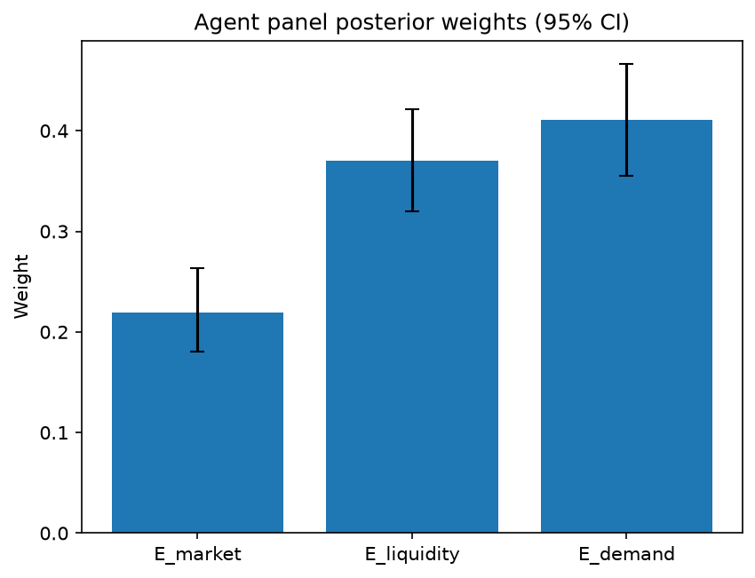

# Survey report: TrustRouter Agentic Full Panel (mistral:7b) -- Level L3e: Economic Value sub-parts

Survey ID: `trustrouter-agentic-full-panel-mistral-2026-09-01-L3e`

## Agent panel

- Agents contributing a valid response: 36
- Classical BWM consistency: 36/36 within threshold

| Criterion | Mean | 95% CI lower | 95% CI upper |
|---|---|---|---|
| E_market | 0.2191 | 0.1802 | 0.2634 |
| E_liquidity | 0.3702 | 0.3195 | 0.4217 |
| E_demand | 0.4108 | 0.3553 | 0.4660 |

## Methodology

Each agent independently completed a Best-Worst Method (BWM) comparison: choosing the single most and least important criterion, then rating every criterion's importance relative to those two on a 1-9 scale. Individual responses were solved with the classical BWM linear program (Rezaei, 2015) for a consistency check, and combined across the panel with a hierarchical Bayesian model (Mohammadi and Rezaei, 2020).

36 agent response(s) were accepted into this result.

Every agent's run began with a QA precheck (its stated configuration verified against ground truth) and every accepted answer's self-reported sources were checked against what reference material was actually available to it; see the Per-agent detail section below and this survey's Conversation Log for each agent's specific results. Every response is schema-validated and independently, repeatedly sampled (never a single completion treated as ground truth); see `guardrails.py`. This survey's complete output is covered by a SHA-256 integrity manifest (`integrity_manifest.json`, `SHA256SUMS`), generated once this run finished, so any later alteration to these files is detectable.

### Charts

## Per-agent detail

### bim-coordinator-base-openmanus (`bim-coordinator-base-openmanus`)

- Role: BIM Coordinator
- Model: ollama/mistral:7b
- DID: `did:key:z6MkfgXoko5fk2HGb2Dg55FYiiR6QE6wDmBBMDZ2ZVrDpTXM`
- QA precheck: passed
- Sources used: (not reported)

**Answer:** `{"best": "E_demand", "worst": "E_market", "best_to_others": {"E_demand": 1, "E_liquidity": 5, "E_market": 1}, "others_to_worst": {"E_market": 1, "E_liquidity": 9, "E_demand": 1}}`

**Reasoning:**

 Best factor: E_demand
Worst factor: E_market

Reasoning: As a BIM coordinator, the most important criterion for economic value (E) is future demand (E_demand). This is because digital twin growth, regulation, and AI will significantly impact the long-term utility and adaptability of Building Information Models. Current marketplace demand (E_market) is less important as it only represents existing buyers right now, while tokenization ease (E_liquidity) is least important in this context as it does not directly affect the value or usability of BIM models for construction projects.

 E_demand vs E_liquidity: 5
E_demand vs E_market: 1
E_liquidity vs E_market: 9

### bim-coordinator-base-openmanus (`bim-coordinator-base-openmanus`)

- Role: BIM Coordinator
- Model: ollama/mistral:7b
- DID: `did:key:z6MkfgXoko5fk2HGb2Dg55FYiiR6QE6wDmBBMDZ2ZVrDpTXM`
- QA precheck: passed
- Sources used: (not reported)

**Answer:** `{"best": "E_demand", "worst": "E_market", "best_to_others": {"E_demand": 1, "E_liquidity": 7, "E_market": 1}, "others_to_worst": {"E_market": 1, "E_liquidity": 9, "E_demand": 1}}`

**Reasoning:**

 Best factor: E_demand
Worst factor: E_market

Reasoning: As a BIM coordinator, the most important factor for economic value (E) is future demand (E_demand), as it will drive the need for continuous updates and improvements in the building information model. This includes growth in regulated, AI, and digital-twin sectors that can leverage the data stored on the blockchain. On the other hand, current marketplace demand (E_market) is less important because it only represents existing buyers right now, while future demand has a longer-term impact on the project's lifecycle. Tokenization ease (E_liquidity) is also crucial but secondary to E_demand, as it enables easier trading and access to the data stored on the blockchain, which can increase its value in the market.

 E_demand vs E_liquidity: 7
E_demand vs E_market: 1
E_liquidity vs E_market: 9

### bim-coordinator-base-openmanus (`bim-coordinator-base-openmanus`)

- Role: BIM Coordinator
- Model: ollama/mistral:7b
- DID: `did:key:z6MkfgXoko5fk2HGb2Dg55FYiiR6QE6wDmBBMDZ2ZVrDpTXM`
- QA precheck: passed
- Sources used: (not reported)

**Answer:** `{"best": "E_demand", "worst": "E_market", "best_to_others": {"E_demand": 1, "E_liquidity": 5, "E_market": 9}, "others_to_worst": {"E_market": 1, "E_liquidity": 1, "E_demand": 9}}`

**Reasoning:**

 Best factor: E_demand
Worst factor: E_market

Reasoning: As a BIM coordinator, the most important criterion for economic value (E) is future demand (E_demand). This is because digital twin growth, regulation, and AI adoption in the construction industry have the potential to significantly increase the value of building information models over time. Current marketplace demand (E_market) is less important because it only represents existing buyers right now, while future demand can potentially attract a much larger number of buyers and users. Tokenization ease (E_liquidity) is least important in this context as it does not directly impact the intrinsic value of the building information model itself but rather facilitates its tradeability.

 E_demand vs E_liquidity: 5
E_demand vs E_market: 9
E_liquidity vs E_market: 1

### bim-coordinator-rag-openmanus (`bim-coordinator-rag-openmanus`)

- Role: BIM Coordinator
- Model: ollama/mistral:7b
- DID: `did:key:z6MktumSUSZKAYBkVBipYZSQPNfpzsRpDK78beTjh9uW4mqo`
- QA precheck: passed
- Sources used: (not reported)

**Answer:** `{"best": "E_demand", "worst": "E_market", "best_to_others": {"E_demand": 1, "E_liquidity": 1, "E_market": 9}, "others_to_worst": {"E_market": 1, "E_liquidity": 8, "E_demand": 9}}`

**Reasoning:**

 Best factor: E_demand
Worst factor: E_market

 E_demand vs E_liquidity: 1
E_demand vs E_market: 9
E_liquidity vs E_market: 8

### bim-coordinator-rag-openmanus (`bim-coordinator-rag-openmanus`)

- Role: BIM Coordinator
- Model: ollama/mistral:7b
- DID: `did:key:z6MktumSUSZKAYBkVBipYZSQPNfpzsRpDK78beTjh9uW4mqo`
- QA precheck: passed
- Sources used: (not reported)

**Answer:** `{"best": "E_demand", "worst": "E_market", "best_to_others": {"E_demand": 1, "E_liquidity": 1, "E_market": 9}, "others_to_worst": {"E_market": 1, "E_liquidity": 8, "E_demand": 9}}`

**Reasoning:**

 Best factor: E_demand
Worst factor: E_market

 E_demand vs E_liquidity: 1
E_demand vs E_market: 9
E_liquidity vs E_market: 8

### bim-coordinator-rag-openmanus (`bim-coordinator-rag-openmanus`)

- Role: BIM Coordinator
- Model: ollama/mistral:7b
- DID: `did:key:z6MktumSUSZKAYBkVBipYZSQPNfpzsRpDK78beTjh9uW4mqo`
- QA precheck: passed
- Sources used: (not reported)

**Answer:** `{"best": "E_demand", "worst": "E_market", "best_to_others": {"E_demand": 1, "E_liquidity": 1, "E_market": 9}, "others_to_worst": {"E_market": 1, "E_liquidity": 8, "E_demand": 9}}`

**Reasoning:**

 Best factor: E_demand
Worst factor: E_market

 E_demand vs E_liquidity: 1
E_demand vs E_market: 9
E_liquidity vs E_market: 8

### blockchain-engineer-base-openmanus (`blockchain-engineer-base-openmanus`)

- Role: Blockchain / DLT Engineer
- Model: ollama/mistral:7b
- DID: `did:key:z6MkvHuD6rK5V96sxUAp7Xr6vcwjpUwrx7XzHHteGJRC5JuJ`
- QA precheck: passed
- Sources used: (not reported)

**Answer:** `{"best": "E_demand", "worst": "E_market", "best_to_others": {"E_demand": 1, "E_liquidity": 7, "E_market": 1}, "others_to_worst": {"E_market": 1, "E_liquidity": 9, "E_demand": 1}}`

**Reasoning:**

 Best factor: E_demand
Worst factor: E_market

 E_demand vs E_liquidity: 7
E_demand vs E_market: 1
E_liquidity vs E_market: 9

### blockchain-engineer-base-openmanus (`blockchain-engineer-base-openmanus`)

- Role: Blockchain / DLT Engineer
- Model: ollama/mistral:7b
- DID: `did:key:z6MkvHuD6rK5V96sxUAp7Xr6vcwjpUwrx7XzHHteGJRC5JuJ`
- QA precheck: passed
- Sources used: (not reported)

**Answer:** `{"best": "E_demand", "worst": "E_market", "best_to_others": {"E_demand": 1, "E_liquidity": 5, "E_market": 9}, "others_to_worst": {"E_market": 1, "E_liquidity": 1, "E_demand": 9}}`

**Reasoning:**

 Best factor: E_demand
Worst factor: E_market

 E_demand vs E_liquidity: 5
E_demand vs E_market: 9
E_liquidity vs E_market: 1

### blockchain-engineer-base-openmanus (`blockchain-engineer-base-openmanus`)

- Role: Blockchain / DLT Engineer
- Model: ollama/mistral:7b
- DID: `did:key:z6MkvHuD6rK5V96sxUAp7Xr6vcwjpUwrx7XzHHteGJRC5JuJ`
- QA precheck: passed
- Sources used: (not reported)

**Answer:** `{"best": "E_market", "worst": "E_liquidity", "best_to_others": {"E_market": 1, "E_demand": 5, "E_liquidity": 9}, "others_to_worst": {"E_liquidity": 1, "E_demand": 1, "E_market": 9}}`

**Reasoning:**

 Best factor: E_market
Worst factor: E_liquidity

Reasoning: In the context of a construction project record considered for blockchain storage, current marketplace demand (E_market) is more important than future demand (E_demand) because it represents existing buyers right now who would have an immediate need for the data. Tokenisation ease (E_liquidity) is less important because it only concerns the ease of trading a tokenized version of the data, which may not be necessary or feasible for all types of construction project records. The current marketplace demand is more tangible and directly impacts the value of the data being stored on the blockchain, while the ease of tokenisation is more speculative and depends on various factors such as regulatory environment, technology maturity, and market acceptance.

 E_market vs E_demand: 5
E_market vs E_liquidity: 9
E_demand vs E_liquidity: 1

Reasoning: In the context of a construction project record considered for blockchain storage, current marketplace demand (E_market) is more important than future demand (E_demand) because it represents existing buyers right now who would have an immediate need for the data. Tokenisation ease (E_liquidity) is less important because it only concerns the ease of trading a tokenized version of the data, which may not be necessary or feasible for all types of construction project records. The current marketplace demand is more tangible and directly impacts the value of the data being stored on the blockchain, while the ease of tokenisation is more speculative and depends on various factors such as regulatory environment, technology maturity, and market dynamics. Future demand (E_demand) is less important because it represents potential buyers in the future, and the construction project record may not be relevant to them at that time. Therefore, E_market is more important than E_demand.

Tokenisation ease (E_liquidity) is the least important factor because it concerns the technical feasibility of trading a tokenized version of the data, which may not be necessary or desirable for all types of construction project records. The value of a construction project record on the blockchain depends more on its relevance and demand from existing buyers (E_market) than on the ease of trading it as a token (E_liquidity). Therefore, E_liquidity is less important than both E_market and E_demand.

In terms of relative importance, current marketplace demand (E_market) is more important than future demand (E_demand), and both are more important than tokenisation ease (E_liquidity). Therefore, the ratings are as follows:

E_market vs E_demand: 5
E_market vs E_liquidity: 9
E_demand vs E_liquidity: 1

### blockchain-engineer-rag-openmanus (`blockchain-engineer-rag-openmanus`)

- Role: Blockchain / DLT Engineer
- Model: ollama/mistral:7b
- DID: `did:key:z6MkmucumNftjXuU1cP1wD4kXfg8GN5qLwkyp7b89yPpKxwP`
- QA precheck: passed
- Sources used: (not reported)

**Answer:** `{"best": "E_demand", "worst": "E_market", "best_to_others": {"E_demand": 1, "E_liquidity": 7, "E_market": 9}, "others_to_worst": {"E_market": 1, "E_liquidity": 1, "E_demand": 9}}`

**Reasoning:**

 Best factor: E_demand
Worst factor: E_market

 E_demand vs E_liquidity: 7
E_demand vs E_market: 9
E_liquidity vs E_market: 1

### blockchain-engineer-rag-openmanus (`blockchain-engineer-rag-openmanus`)

- Role: Blockchain / DLT Engineer
- Model: ollama/mistral:7b
- DID: `did:key:z6MkmucumNftjXuU1cP1wD4kXfg8GN5qLwkyp7b89yPpKxwP`
- QA precheck: passed
- Sources used: (not reported)

**Answer:** `{"best": "E_demand", "worst": "E_market", "best_to_others": {"E_demand": 1, "E_liquidity": 5, "E_market": 1}, "others_to_worst": {"E_market": 1, "E_liquidity": 9, "E_demand": 1}}`

**Reasoning:**

 Best factor: E_demand
Worst factor: E_market

 E_demand vs E_liquidity: 5
E_demand vs E_market: 1
E_liquidity vs E_market: 9

Reasoning:

* E_demand (Future demand) is the best factor because it represents the potential long-term value of blockchain/DLT for construction projects. As technology advances and regulations evolve, there may be increased adoption of AI, digital twins, and other technologies that could drive significant growth in the demand for blockchain solutions in the construction industry. This could lead to increased trust and confidence in the technology, as well as increased investment and development efforts.
* E_market (Current marketplace demand) is the worst factor because it currently represents a relatively small and fragmented market for blockchain/DLT in the construction industry. There are few established players and limited adoption of the technology, which makes it difficult to predict its long-term potential and value. Additionally, the current market may be subject to significant volatility due to factors such as regulatory uncertainty and lack of standardization.
* E_liquidity (Tokenisation ease) is less important than E_demand but more important than E_market because it represents a key enabler for the adoption of blockchain/DLT in the construction industry. If tradeable tokenisation is easy, it could make it simpler and more attractive for construction projects to adopt blockchain solutions, which could help drive increased demand and trust in the technology. However, the long-term potential value of the technology (represented by E_demand) is likely to be a more significant factor in determining its overall success and impact on the industry.

### blockchain-engineer-rag-openmanus (`blockchain-engineer-rag-openmanus`)

- Role: Blockchain / DLT Engineer
- Model: ollama/mistral:7b
- DID: `did:key:z6MkmucumNftjXuU1cP1wD4kXfg8GN5qLwkyp7b89yPpKxwP`
- QA precheck: passed
- Sources used: (not reported)

**Answer:** `{"best": "E_demand", "worst": "E_market", "best_to_others": {"E_demand": 1, "E_liquidity": 1, "E_market": 9}, "others_to_worst": {"E_market": 1, "E_liquidity": 8, "E_demand": 9}}`

**Reasoning:**

 Best factor: E_demand
Worst factor: E_market

 E_demand vs E_liquidity: 1
E_demand vs E_market: 9
E_liquidity vs E_market: 8

### compliance-officer-base-openmanus (`compliance-officer-base-openmanus`)

- Role: Compliance and Regulatory Officer
- Model: ollama/mistral:7b
- DID: `did:key:z6MkfbCRS5qnxtVpnPvezz8VBQGuTFfkEPexhbtSd5ZwJVgY`
- QA precheck: passed
- Sources used: (not reported)

**Answer:** `{"best": "E_demand", "worst": "E_market", "best_to_others": {"E_demand": 1, "E_liquidity": 7, "E_market": 1}, "others_to_worst": {"E_market": 1, "E_liquidity": 9, "E_demand": 1}}`

**Reasoning:**

 Best factor: E_demand
Worst factor: E_market

 E_demand vs E_liquidity: 7
E_demand vs E_market: 1
E_liquidity vs E_market: 9

### compliance-officer-base-openmanus (`compliance-officer-base-openmanus`)

- Role: Compliance and Regulatory Officer
- Model: ollama/mistral:7b
- DID: `did:key:z6MkfbCRS5qnxtVpnPvezz8VBQGuTFfkEPexhbtSd5ZwJVgY`
- QA precheck: passed
- Sources used: (not reported)

**Answer:** `{"best": "E_demand", "worst": "E_market", "best_to_others": {"E_demand": 1, "E_liquidity": 7, "E_market": 1}, "others_to_worst": {"E_market": 1, "E_liquidity": 9, "E_demand": 1}}`

**Reasoning:**

 Best factor: E_demand
Worst factor: E_market

 E_demand vs E_liquidity: 7
E_demand vs E_market: 1
E_liquidity vs E_market: 9

### compliance-officer-base-openmanus (`compliance-officer-base-openmanus`)

- Role: Compliance and Regulatory Officer
- Model: ollama/mistral:7b
- DID: `did:key:z6MkfbCRS5qnxtVpnPvezz8VBQGuTFfkEPexhbtSd5ZwJVgY`
- QA precheck: passed
- Sources used: (not reported)

**Answer:** `{"best": "E_demand", "worst": "E_market", "best_to_others": {"E_demand": 1, "E_liquidity": 7, "E_market": 1}, "others_to_worst": {"E_market": 1, "E_liquidity": 9, "E_demand": 1}}`

**Reasoning:**

 Best factor: E_demand
Worst factor: E_market

 E_demand vs E_liquidity: 7
E_demand vs E_market: 1
E_liquidity vs E_market: 9

### compliance-officer-rag-openmanus (`compliance-officer-rag-openmanus`)

- Role: Compliance and Regulatory Officer
- Model: ollama/mistral:7b
- DID: `did:key:z6MkfA5TGsnWh3DK59EkbsAtJhFdtWUr86GzaTTLgCcq7FDt`
- QA precheck: passed
- Sources used: (not reported)

**Answer:** `{"best": "E_demand", "worst": "E_market", "best_to_others": {"E_demand": 1, "E_liquidity": 5, "E_market": 1}, "others_to_worst": {"E_market": 1, "E_liquidity": 9, "E_demand": 1}}`

**Reasoning:**

 Best factor: E_demand
Worst factor: E_market

 E_demand vs E_liquidity: 5
E_demand vs E_market: 1
E_liquidity vs E_market: 9

Reasoning:

* E_demand (Future demand) is the best factor because it represents the potential growth and long-term value of blockchain storage for construction projects. As more regulatory bodies adopt digital twins, AI, and other technologies, there will be an increased demand for secure and reliable data storage solutions. This growth in demand can drive innovation and improvements in the technology, making it more valuable over time.
* E_market (Current marketplace demand) is the worst factor because it represents the current state of the market, which may not accurately reflect the potential future value of blockchain storage for construction projects. The current market may be underdeveloped or lack awareness of the benefits of using blockchain technology for data storage. Additionally, the current market may be dominated by traditional solutions that are less secure and reliable than blockchain-based solutions.
* E_liquidity (Tokenisation ease) is rated as more important than E_market because it represents the ease with which construction projects can tokenise their data and trade it on a blockchain. If tokenisation is easy, it will be more attractive to construction projects, increasing demand for blockchain storage solutions. On the other hand, if tokenisation is difficult or complex, it may deter adoption of blockchain technology, reducing its value.

### compliance-officer-rag-openmanus (`compliance-officer-rag-openmanus`)

- Role: Compliance and Regulatory Officer
- Model: ollama/mistral:7b
- DID: `did:key:z6MkfA5TGsnWh3DK59EkbsAtJhFdtWUr86GzaTTLgCcq7FDt`
- QA precheck: passed
- Sources used: (not reported)

**Answer:** `{"best": "E_demand", "worst": "E_market", "best_to_others": {"E_demand": 1, "E_liquidity": 7, "E_market": 9}, "others_to_worst": {"E_market": 1, "E_liquidity": 1, "E_demand": 9}}`

**Reasoning:**

 Best factor: E_demand
Worst factor: E_market

 E_demand vs E_liquidity: 7
E_demand vs E_market: 9
E_liquidity vs E_market: 1

### compliance-officer-rag-openmanus (`compliance-officer-rag-openmanus`)

- Role: Compliance and Regulatory Officer
- Model: ollama/mistral:7b
- DID: `did:key:z6MkfA5TGsnWh3DK59EkbsAtJhFdtWUr86GzaTTLgCcq7FDt`
- QA precheck: passed
- Sources used: (not reported)

**Answer:** `{"best": "E_demand", "worst": "E_market", "best_to_others": {"E_demand": 1, "E_liquidity": 5, "E_market": 1}, "others_to_worst": {"E_market": 1, "E_liquidity": 9, "E_demand": 1}}`

**Reasoning:**

 Best factor: E_demand
Worst factor: E_market

 E_demand vs E_liquidity: 5
E_demand vs E_market: 1
E_liquidity vs E_market: 9

Reasoning:

* E_demand (Future demand) is the best factor because it represents the potential for growth and increased value of the construction project data over time. This is due to the expected increase in adoption and use of regulated, AI, and digital-twin technologies in the construction industry.
* E_market (Current marketplace demand) is the worst factor because it only considers the current state of the market and does not take into account the potential for future growth and increased value.
* E_liquidity (Tokenisation ease) is less important than E_demand but more important than E_market because it represents the ability to easily trade and exchange the construction project data as tokenised assets, which can increase liquidity and facilitate transactions. However, its importance pales in comparison to the potential for future growth represented by E_demand.

### data-engineer-base-openmanus (`data-engineer-base-openmanus`)

- Role: Data Engineering Specialist
- Model: ollama/mistral:7b
- DID: `did:key:z6MktFhQynyK3hjjScxU7X5N1KeprxH9DRnj8UgC2dqicMmW`
- QA precheck: passed
- Sources used: (not reported)

**Answer:** `{"best": "E_demand", "worst": "E_market", "best_to_others": {"E_demand": 1, "E_liquidity": 7, "E_market": 1}, "others_to_worst": {"E_market": 1, "E_liquidity": 9, "E_demand": 1}}`

**Reasoning:**

 Best factor: E_demand
Worst factor: E_market

 E_demand vs E_liquidity: 7
E_demand vs E_market: 1
E_liquidity vs E_market: 9

### data-engineer-base-openmanus (`data-engineer-base-openmanus`)

- Role: Data Engineering Specialist
- Model: ollama/mistral:7b
- DID: `did:key:z6MktFhQynyK3hjjScxU7X5N1KeprxH9DRnj8UgC2dqicMmW`
- QA precheck: passed
- Sources used: (not reported)

**Answer:** `{"best": "E_demand", "worst": "E_market", "best_to_others": {"E_demand": 1, "E_liquidity": 7, "E_market": 1}, "others_to_worst": {"E_market": 1, "E_liquidity": 9, "E_demand": 1}}`

**Reasoning:**

 Best factor: E_demand
Worst factor: E_market

 E_demand vs E_liquidity: 7
E_demand vs E_market: 1
E_liquidity vs E_market: 9

### data-engineer-base-openmanus (`data-engineer-base-openmanus`)

- Role: Data Engineering Specialist
- Model: ollama/mistral:7b
- DID: `did:key:z6MktFhQynyK3hjjScxU7X5N1KeprxH9DRnj8UgC2dqicMmW`
- QA precheck: passed
- Sources used: (not reported)

**Answer:** `{"best": "E_demand", "worst": "E_market", "best_to_others": {"E_demand": 1, "E_liquidity": 7, "E_market": 1}, "others_to_worst": {"E_market": 1, "E_liquidity": 9, "E_demand": 1}}`

**Reasoning:**

 Best factor: E_demand
Worst factor: E_market

 E_demand vs E_liquidity: 7
E_demand vs E_market: 1
E_liquidity vs E_market: 9

### data-engineer-rag-openmanus (`data-engineer-rag-openmanus`)

- Role: Data Engineering Specialist
- Model: ollama/mistral:7b
- DID: `did:key:z6MkiWQoSrmLM3rsTnbbnu2vhEtsqyMtVskAeNJy3ryeBDJG`
- QA precheck: passed
- Sources used: (not reported)

**Answer:** `{"best": "E_demand", "worst": "E_market", "best_to_others": {"E_demand": 1, "E_liquidity": 1, "E_market": 9}, "others_to_worst": {"E_market": 1, "E_liquidity": 8, "E_demand": 9}}`

**Reasoning:**

 Best factor: E_demand
Worst factor: E_market

 E_demand vs E_liquidity: 1
E_demand vs E_market: 9
E_liquidity vs E_market: 8

### data-engineer-rag-openmanus (`data-engineer-rag-openmanus`)

- Role: Data Engineering Specialist
- Model: ollama/mistral:7b
- DID: `did:key:z6MkiWQoSrmLM3rsTnbbnu2vhEtsqyMtVskAeNJy3ryeBDJG`
- QA precheck: passed
- Sources used: (not reported)

**Answer:** `{"best": "E_demand", "worst": "E_market", "best_to_others": {"E_demand": 1, "E_liquidity": 5, "E_market": 1}, "others_to_worst": {"E_market": 1, "E_liquidity": 9, "E_demand": 1}}`

**Reasoning:**

 Best factor: E_demand
Worst factor: E_market

 E_demand vs E_liquidity: 5
E_demand vs E_market: 1
E_liquidity vs E_market: 9

Reasoning:

* E_demand is the best factor because it represents the potential growth and demand for construction-project records in the future, which could significantly increase the value of the data trust. The growth could come from various sources such as regulatory compliance, AI, digital twins, etc., which could lead to increased adoption and usage of the data trust.
* E_liquidity is less important than E_demand because it represents the ease of tradeable tokenization, but without a strong demand for the records, the liquidity may not be as valuable. However, if there is a high demand for the records, then the ease of trading them becomes more important to facilitate the transactions.
* E_market is the worst factor because it represents the current marketplace demand, which could be limited and volatile. The current demand may not be enough to sustain the data trust in the long term, especially if there are no regulations or incentives for adoption. Additionally, the current demand may not accurately reflect the potential future demand, which is captured by E_demand.

### data-engineer-rag-openmanus (`data-engineer-rag-openmanus`)

- Role: Data Engineering Specialist
- Model: ollama/mistral:7b
- DID: `did:key:z6MkiWQoSrmLM3rsTnbbnu2vhEtsqyMtVskAeNJy3ryeBDJG`
- QA precheck: passed
- Sources used: (not reported)

**Answer:** `{"best": "E_demand", "worst": "E_market", "best_to_others": {"E_demand": 1, "E_liquidity": 7, "E_market": 9}, "others_to_worst": {"E_market": 1, "E_liquidity": 1, "E_demand": 9}}`

**Reasoning:**

 Best factor: E_demand
Worst factor: E_market

 E_demand vs E_liquidity: 7
E_demand vs E_market: 9
E_liquidity vs E_market: 1

### project-manager-base-openmanus (`project-manager-base-openmanus`)

- Role: Construction Project Manager
- Model: ollama/mistral:7b
- DID: `did:key:z6MkmfTBzM8STi6eZQjBtyYUdmW4ALLgFT4436ojkBi1QXnf`
- QA precheck: passed
- Sources used: (not reported)

**Answer:** `{"best": "E_demand", "worst": "E_market", "best_to_others": {"E_demand": 1, "E_liquidity": 7, "E_market": 1}, "others_to_worst": {"E_market": 1, "E_liquidity": 9, "E_demand": 1}}`

**Reasoning:**

 Best factor: E_demand
Worst factor: E_market

Reasoning: As a construction project manager, the most important criterion for economic value (E) is future demand (E_demand), as it determines the long-term potential of a project. This includes factors such as regulated growth, AI adoption, and digital twin development. On the other hand, current marketplace demand (E_market) is less important because it only represents existing buyers at the moment, while future demand can attract new investors and stakeholders. The ease of tokenization or tradability (E_liquidity) is also less crucial in this context, as it depends on the specific implementation of blockchain technology, which may not be a primary concern for a construction project manager focusing on the overall lifecycle of a project.

 E_demand vs E_liquidity: 7
E_demand vs E_market: 1
E_liquidity vs E_market: 9

Reasoning: As a construction project manager, the most important criterion for economic value (E) is future demand (E_demand), as it determines the long-term potential of a project. This includes factors such as regulated growth, AI adoption, and digital twin development. The ease of tokenization or tradability (E_liquidity) is less important because it depends on the specific implementation of blockchain technology, which may not be a primary concern for a construction project manager focusing on the overall lifecycle of a project. Current marketplace demand (E_market) is least important as it only represents existing buyers at the moment, while future demand can attract new investors and stakeholders. The comparison between E_demand and E_liquidity is rated 7 because while both are important, future demand has a more significant impact on the project's success. The comparison between E_demand and E_market is rated 1 because future demand is much more important than current market demand. The comparison between E_liquidity and E_market is rated 9 because the ease of tokenization or tradability is less relevant compared to current market demand, which only represents existing buyers.

### project-manager-base-openmanus (`project-manager-base-openmanus`)

- Role: Construction Project Manager
- Model: ollama/mistral:7b
- DID: `did:key:z6MkmfTBzM8STi6eZQjBtyYUdmW4ALLgFT4436ojkBi1QXnf`
- QA precheck: passed
- Sources used: (not reported)

**Answer:** `{"best": "E_demand", "worst": "E_market", "best_to_others": {"E_demand": 1, "E_liquidity": 7, "E_market": 1}, "others_to_worst": {"E_market": 1, "E_liquidity": 8, "E_demand": 1}}`

**Reasoning:**

 Best factor: E_demand
Worst factor: E_market

Reasoning: As a construction project manager responsible for coordinating multi-stakeholder documentation flows across a renovation or new-build project's full lifecycle, the most important economic value factor (E) is future demand (E_demand). This factor considers regulated / AI / digital-twin growth which can significantly impact the long-term success and sustainability of a construction project. On the other hand, current marketplace demand (E_market) is less important because it only reflects existing buyers right now, while future demand can bring in new opportunities and potential investors. The least important economic value factor is present marketplace demand (E_market), as it does not take into account the ease of tokenisation or future growth prospects.

 E_demand vs E_liquidity: 7
E_demand vs E_market: 1
E_liquidity vs E_market: 8

Reasoning: As a construction project manager responsible for coordinating multi-stakeholder documentation flows across a renovation or new-build project's full lifecycle, the most important economic value factor (E) is future demand (E_demand). This factor considers regulated / AI / digital-twin growth which can significantly impact the long-term success and sustainability of a construction project. In comparison to E_liquidity, the ease of tokenisation, future demand is more important because it provides insights into the potential market size and growth opportunities for the project data. On the other hand, current marketplace demand (E_market) is least important as it only reflects existing buyers right now, while future demand can bring in new opportunities and potential investors. In comparison to E_market, E_liquidity is more important because tokenisation ease can impact the accessibility and usability of the project data for various stakeholders.

### project-manager-base-openmanus (`project-manager-base-openmanus`)

- Role: Construction Project Manager
- Model: ollama/mistral:7b
- DID: `did:key:z6MkmfTBzM8STi6eZQjBtyYUdmW4ALLgFT4436ojkBi1QXnf`
- QA precheck: passed
- Sources used: (not reported)

**Answer:** `{"best": "E_demand", "worst": "E_market", "best_to_others": {"E_demand": 1, "E_liquidity": 7, "E_market": 1}, "others_to_worst": {"E_market": 1, "E_liquidity": 8, "E_demand": 1}}`

**Reasoning:**

 Best factor: E_demand
Worst factor: E_market

Reasoning: In the context of a construction project, future demand (E_demand) is more important than current marketplace demand (E_market) as it determines the long-term value and relevance of the data. Future demand can be influenced by factors such as regulatory changes, AI and digital twin growth, which can significantly impact the use and utility of construction project data over time. Tokenisation ease (E_liquidity) is also important but less so than future demand, as it affects the ease with which the data can be traded or exchanged, but its value is dependent on the demand for such tokens in the marketplace.

 E_demand vs E_liquidity: 7
E_demand vs E_market: 1
E_liquidity vs E_market: 8

Reasoning: Future demand (E_demand) is considered the most important factor as it determines the long-term value and relevance of construction project data. Current marketplace demand (E_market) is relatively less important as it only reflects existing buyers' interest, while future demand can be influenced by factors such as regulatory changes, AI and digital twin growth, which can significantly impact the use and utility of construction project data over time. Tokenisation ease (E_liquidity) is also an important factor but less so than future demand as it affects the ease with which the data can be traded or exchanged, but its value is dependent on the demand for such tokens in the marketplace. Therefore, E_demand is more important than both E_liquidity and E_market. E_liquidity is slightly more important than E_market as it affects the ease of trading construction project data, but E_demand remains the most important factor due to its impact on long-term value and relevance.

### project-manager-rag-openmanus (`project-manager-rag-openmanus`)

- Role: Construction Project Manager
- Model: ollama/mistral:7b
- DID: `did:key:z6MkoTifVHP1pHqn6fbzUhAKR4qjAt634zz49Rtj41amKoDx`
- QA precheck: passed
- Sources used: (not reported)

**Answer:** `{"best": "E_demand", "worst": "E_market", "best_to_others": {"E_demand": 1, "E_liquidity": 5, "E_market": 1}, "others_to_worst": {"E_market": 1, "E_liquidity": 9, "E_demand": 1}}`

**Reasoning:**

 Best factor: E_demand
Worst factor: E_market

 E_demand vs E_liquidity: 5
E_demand vs E_market: 1
E_liquidity vs E_market: 9

Reasoning:

* E_demand (Future demand) is the best factor because it represents the potential growth and long-term value of a construction project on the blockchain. It includes factors such as regulated, AI, and digital-twin growth, which can significantly increase the demand for construction projects on the blockchain in the future.
* E_market (Current marketplace demand) is the worst factor because it represents the current level of demand for construction projects on the blockchain. This demand may be limited due to various factors such as lack of awareness, regulatory barriers, or technical challenges, making it a less important factor compared to E_demand.
* E_liquidity (Tokenisation ease) is more important than E_market because it represents how easy it is to trade tokenised construction projects on the blockchain. A high level of liquidity can increase the attractiveness of the blockchain for construction projects, making it easier for investors to buy and sell tokens representing these projects. However, it is still less important than E_demand due to its focus on the current marketplace demand rather than future growth potential.

### project-manager-rag-openmanus (`project-manager-rag-openmanus`)

- Role: Construction Project Manager
- Model: ollama/mistral:7b
- DID: `did:key:z6MkoTifVHP1pHqn6fbzUhAKR4qjAt634zz49Rtj41amKoDx`
- QA precheck: passed
- Sources used: (not reported)

**Answer:** `{"best": "E_demand", "worst": "E_market", "best_to_others": {"E_demand": 1, "E_liquidity": 1, "E_market": 9}, "others_to_worst": {"E_market": 1, "E_liquidity": 8, "E_demand": 9}}`

**Reasoning:**

 Best factor: E_demand
Worst factor: E_market

 E_demand vs E_liquidity: 1
E_demand vs E_market: 9
E_liquidity vs E_market: 8

### project-manager-rag-openmanus (`project-manager-rag-openmanus`)

- Role: Construction Project Manager
- Model: ollama/mistral:7b
- DID: `did:key:z6MkoTifVHP1pHqn6fbzUhAKR4qjAt634zz49Rtj41amKoDx`
- QA precheck: passed
- Sources used: (not reported)

**Answer:** `{"best": "E_demand", "worst": "E_market", "best_to_others": {"E_demand": 1, "E_liquidity": 1, "E_market": 9}, "others_to_worst": {"E_market": 1, "E_liquidity": 8, "E_demand": 9}}`

**Reasoning:**

 Best factor: E_demand
Worst factor: E_market

 E_demand vs E_liquidity: 1
E_demand vs E_market: 9
E_liquidity vs E_market: 8

### structural-engineer-base-openmanus (`structural-engineer-base-openmanus`)

- Role: Structural Engineer
- Model: ollama/mistral:7b
- DID: `did:key:z6MkneKsSUhTxF3pB1EzYLvMTxPBCQPtxRb2F4THAHgsHiqS`
- QA precheck: passed
- Sources used: (not reported)

**Answer:** `{"best": "E_demand", "worst": "E_market", "best_to_others": {"E_demand": 1, "E_liquidity": 7, "E_market": 1}, "others_to_worst": {"E_market": 1, "E_liquidity": 9, "E_demand": 1}}`

**Reasoning:**

 Best factor: E_demand
Worst factor: E_market

Reasoning: The best factor for Economic Value (E) is E_demand, as it represents the projected future demand for the data, which includes growth from regulation, AI, and digital-twin technologies. This factor is crucial in determining the long-term value of the structural capacity dossier, especially considering its retention horizon for insurers and authorities.

On the other hand, E_market represents the current marketplace demand. While it may provide some initial value, it is less important compared to E_demand due to its focus on the present rather than the future growth potential of the data. Additionally, the ease of tokenization or tradability (E_liquidity) is not directly related to the intrinsic value of the structural capacity dossier itself but rather to the mechanisms by which it can be traded. Therefore, E_market is considered the worst factor in this comparison.

 E_demand vs E_liquidity: 7
E_demand vs E_market: 1
E_liquidity vs E_market: 9

Reasoning: The BEST factor, E_demand (Future demand), is rated as more important than both E_liquidity and E_market. Future demand from regulated/AI/digital-twin growth is crucial in determining the long-term value of the structural capacity dossier, especially considering its retention horizon for insurers and authorities. In comparison, E_liquidity (tokenisation ease) is less important because it does not directly impact the intrinsic value of the structural capacity dossier but rather the mechanisms by which it can be traded. On the other hand, E_market (Current marketplace demand) is rated as the WORST factor since it represents the present demand and has a lower focus on the long-term value of the data.

In terms of pairwise comparisons:
- E_demand vs E_liquidity: Future demand is more important than tokenisation ease, with a rating of 7 (on a scale of 1 to 9).
- E_demand vs E_market: Future demand is significantly more important than current marketplace demand, with a rating of 1.
- E_liquidity vs E_market: Tokenisation ease is extremely more important than current marketplace demand, with a rating of 9.

### structural-engineer-base-openmanus (`structural-engineer-base-openmanus`)

- Role: Structural Engineer
- Model: ollama/mistral:7b
- DID: `did:key:z6MkneKsSUhTxF3pB1EzYLvMTxPBCQPtxRb2F4THAHgsHiqS`
- QA precheck: passed
- Sources used: (not reported)

**Answer:** `{"best": "E_demand", "worst": "E_market", "best_to_others": {"E_demand": 1, "E_liquidity": 5, "E_market": 1}, "others_to_worst": {"E_market": 1, "E_liquidity": 9, "E_demand": 1}}`

**Reasoning:**

 Best factor: E_demand
Worst factor: E_market

Reasoning: In the context of a structural capacity dossier, future demand (E_demand) is crucial as it determines the long-term value and relevance of the data. The ease of tokenization or current marketplace demand (E_liquidity and E_market respectively) may be important for short-term trading but are less significant in terms of the structural integrity and usefulness of the data over a prolonged period, especially considering the long retention horizon for insurers and authorities.

 E_demand vs E_liquidity: 5
E_demand vs E_market: 1
E_liquidity vs E_market: 9

Reasoning: Future demand (E_demand) is crucial as it determines the long-term value and relevance of the data. The ease of tokenization or current marketplace demand (E_liquidity and E_market respectively) may be important for short-term trading but are less significant in terms of the structural integrity and usefulness of the data over a prolonged period, especially considering the long retention horizon for insurers and authorities. The comparison between E_demand and E_liquidity is closer as both factors have some impact on the data's value, but future demand is more critical due to its long-term implications. The comparison between E_market and E_liquidity shows that current marketplace demand has less importance compared to tokenization ease (E_liquidity) because the former is a short-term factor while the latter can impact the data's tradeability over time.

### structural-engineer-base-openmanus (`structural-engineer-base-openmanus`)

- Role: Structural Engineer
- Model: ollama/mistral:7b
- DID: `did:key:z6MkneKsSUhTxF3pB1EzYLvMTxPBCQPtxRb2F4THAHgsHiqS`
- QA precheck: passed
- Sources used: (not reported)

**Answer:** `{"best": "E_demand", "worst": "E_market", "best_to_others": {"E_demand": 1, "E_liquidity": 7, "E_market": 1}, "others_to_worst": {"E_market": 1, "E_liquidity": 9, "E_demand": 1}}`

**Reasoning:**

 Best factor: E_demand
Worst factor: E_market

Reasoning: As a structural engineer responsible for long-term retention of data, the most important criterion is future demand (E_demand) as it ensures the data remains relevant and useful over the decades. Current marketplace demand (E_market) is less important because the data may not be immediately valuable to buyers, but its long-term value depends on future demand. Tokenisation ease (E_liquidity) is least important in this context as the focus is on the structural capacity dossier's long-term storage and retention rather than its immediate tradeability.

 E_demand vs E_liquidity: 7
E_demand vs E_market: 1
E_liquidity vs E_market: 9

### structural-engineer-rag-openmanus (`structural-engineer-rag-openmanus`)

- Role: Structural Engineer
- Model: ollama/mistral:7b
- DID: `did:key:z6Mkq9sxQdnLDNKYHKSbcFf6ApWb78WMj6E8VgRRcmWNpJib`
- QA precheck: passed
- Sources used: (not reported)

**Answer:** `{"best": "E_demand", "worst": "E_liquidity", "best_to_others": {"E_demand": 1, "E_market": 7, "E_liquidity": 9}, "others_to_worst": {"E_liquidity": 1, "E_market": 2, "E_demand": 9}}`

**Reasoning:**

 Best factor: E_demand
Worst factor: E_liquidity

 E_demand vs E_market: 7
E_demand vs E_liquidity: 9
E_market vs E_liquidity: 2

### structural-engineer-rag-openmanus (`structural-engineer-rag-openmanus`)

- Role: Structural Engineer
- Model: ollama/mistral:7b
- DID: `did:key:z6Mkq9sxQdnLDNKYHKSbcFf6ApWb78WMj6E8VgRRcmWNpJib`
- QA precheck: passed
- Sources used: (not reported)

**Answer:** `{"best": "E_demand", "worst": "E_liquidity", "best_to_others": {"E_demand": 1, "E_market": 8, "E_liquidity": 1}, "others_to_worst": {"E_liquidity": 1, "E_market": 9, "E_demand": 1}}`

**Reasoning:**

 Best factor: E_demand
Worst factor: E_liquidity

 E_demand vs E_market: 8
E_demand vs E_liquidity: 1
E_market vs E_liquidity: 9

### structural-engineer-rag-openmanus (`structural-engineer-rag-openmanus`)

- Role: Structural Engineer
- Model: ollama/mistral:7b
- DID: `did:key:z6Mkq9sxQdnLDNKYHKSbcFf6ApWb78WMj6E8VgRRcmWNpJib`
- QA precheck: passed
- Sources used: (not reported)

**Answer:** `{"best": "E_demand", "worst": "E_liquidity", "best_to_others": {"E_demand": 1, "E_market": 8, "E_liquidity": 1}, "others_to_worst": {"E_liquidity": 1, "E_market": 7, "E_demand": 1}}`

**Reasoning:**

 Best factor: E_demand
Worst factor: E_liquidity

 E_demand vs E_market: 8
E_demand vs E_liquidity: 1
E_market vs E_liquidity: 7
