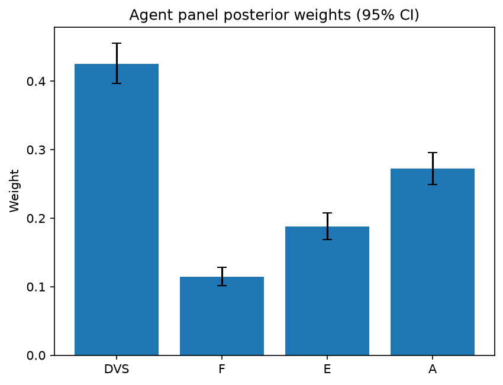

# Survey report: TrustRouter Agentic Full Panel (phi4:14b) -- Level L1: Top-level TrustRouter factors

Survey ID: `trustrouter-agentic-full-panel-phi4-14b-2026-09-01-L1`

## Agent panel

- Agents contributing a valid response: 36
- Classical BWM consistency: 36/36 within threshold

| Criterion | Mean | 95% CI lower | 95% CI upper |
|---|---|---|---|
| DVS | 0.4252 | 0.3963 | 0.4558 |
| F | 0.1145 | 0.1017 | 0.1280 |
| E | 0.1879 | 0.1689 | 0.2081 |
| A | 0.2723 | 0.2487 | 0.2960 |


## Methodology

Each agent independently completed a Best-Worst Method (BWM) comparison: choosing the single most and least important criterion, then rating every criterion's importance relative to those two on a 1-9 scale. Individual responses were solved with the classical BWM linear program (Rezaei, 2015) for a consistency check, and combined across the panel with a hierarchical Bayesian model (Mohammadi and Rezaei, 2020).


36 agent response(s) were accepted into this result.


Every agent's run began with a QA precheck (its stated configuration verified against ground truth) and every accepted answer's self-reported sources were checked against what reference material was actually available to it; see the Per-agent detail section below and this survey's Conversation Log for each agent's specific results. Every response is schema-validated and independently, repeatedly sampled (never a single completion treated as ground truth); see `guardrails.py`. This survey's complete output is covered by a SHA-256 integrity manifest (`integrity_manifest.json`, `SHA256SUMS`), generated once this run finished, so any later alteration to these files is detectable.


### Charts




## Per-agent detail

### bim-coordinator-base-openmanus (`bim-coordinator-base-openmanus`)

- Role: BIM Coordinator
- Model: ollama/phi4:14b
- DID: `did:key:z6MktjVuxsZoffjLx6zYtw8Bf8nm7iULqLcJwyu2VgSuM19E`
- QA precheck: passed
- Sources used: (not reported)

**Answer:** `{"best": "DVS", "worst": "F", "best_to_others": {"DVS": 1, "E": 7, "A": 6, "F": 9}, "others_to_worst": {"F": 1, "E": 5, "A": 8, "DVS": 9}}`

**Reasoning:**

As a BIM Coordinator with extensive experience managing Building Information Models on renovation and new-build projects, my professional judgment is informed by the critical role of data integrity and trustworthiness in these contexts. The Data Value Score (DVS) encompasses quality, provenance, verification strength, independent confirmation, legal compliance, and criticality—all essential for ensuring that BIM data serves its intended purpose across various stakeholders over time.

Technical Feasibility Fit (F), while important, is more about the practical constraints of storing data on a ledger. In my role, ensuring that data can be effectively used and trusted takes precedence over technical storage considerations, as long as those considerations are met to an acceptable degree.

Economic Value (E) is significant but often secondary to the foundational trustworthiness and integrity of the data itself. While economic factors influence decision-making, they do not inherently determine the quality or reliability of the data.

Attack Resistance (A) is crucial for maintaining data integrity against malicious activities. However, its importance is somewhat contingent on the inherent value and trustworthiness of the data it protects.

Given these considerations, I conclude that:

Best factor: DVS  
Worst factor: F

As a BIM Coordinator, my focus is on ensuring the highest data integrity and trustworthiness for Building Information Models. Here's how I rate the importance of each criterion relative to others:

- **DVS vs E**: 7  
  The Data Value Score (DVS) is significantly more important than Economic Value (E) because it directly impacts the reliability and usability of BIM data across stakeholders.

- **DVS vs A**: 6  
  DVS is more critical than Attack Resistance (A), as ensuring data integrity, provenance, and compliance forms the foundation upon which security measures are built.

- **DVS vs F**: 9  
  DVS is extremely more important than Technical Feasibility Fit (F) because the value and trustworthiness of data take precedence over technical constraints in storage.

- **E vs F**: 5  
  Economic Value (E) is moderately more important than Technical Feasibility Fit (F), as economic considerations are secondary to ensuring that data can be effectively used and trusted.

- **A vs F**: 8  
  Attack Resistance (A) is extremely more important than Technical Feasibility Fit (F), as protecting the integrity of valuable BIM data from malicious activities is crucial.

### bim-coordinator-base-openmanus (`bim-coordinator-base-openmanus`)

- Role: BIM Coordinator
- Model: ollama/phi4:14b
- DID: `did:key:z6MktjVuxsZoffjLx6zYtw8Bf8nm7iULqLcJwyu2VgSuM19E`
- QA precheck: passed
- Sources used: (not reported)

**Answer:** `{"best": "DVS", "worst": "F", "best_to_others": {"DVS": 1, "E": 7, "A": 6, "F": 8}, "others_to_worst": {"F": 1, "E": 5, "A": 6, "DVS": 8}}`

**Reasoning:**

As a BIM Coordinator with extensive experience managing multi-stakeholder Building Information Models on renovation and new-build projects, I consider the following:

- **DVS (Data Value Score)** is crucial because it encompasses quality, provenance trust, verification strength, independent confirmation, legal compliance, and criticality. In my role, ensuring high-quality data that can be trusted and verified is paramount for successful project outcomes.

- **F (Technical Feasibility Fit)** relates to how well the data fits within ledger constraints like size, update rate, latency, and cost. While important, technical feasibility often adapts based on available technology and infrastructure improvements over time.

- **E (Economic Value)** involves financial or asset value at stake if the data is corrupted or lost. Although significant, economic considerations can be mitigated through insurance or other financial instruments.

- **A (Attack Resistance)** pertains to the difficulty of undetected manipulation. While critical for security, robust processes and technologies are often in place to mitigate these risks effectively.

Given this context, I prioritize ensuring data integrity and trustworthiness above all else, as it directly impacts project success and stakeholder confidence.

Best factor: DVS  
Worst factor: F

As a BIM Coordinator prioritizing data integrity and trustworthiness, I evaluate the relative importance of each criterion as follows:

- **DVS vs E**: Data Value Score is more critical than Economic Value because ensuring high-quality, trustworthy data directly impacts project success. While economic value is important, it can be influenced by external financial mechanisms.

- **DVS vs A**: Data Value Score is also more crucial than Attack Resistance. Although security is vital, the foundational trustworthiness and quality of data are prerequisites for effective security measures.

- **DVS vs F**: Data Value Score is significantly more important than Technical Feasibility Fit. While technical constraints are relevant, they can often be adapted or improved over time, whereas data integrity is fundamental from the outset.

- **E vs F**: Economic Value holds more importance than Technical Feasibility Fit because financial implications of data loss or corruption can have immediate and substantial impacts on a project's viability.

- **A vs F**: Attack Resistance is more critical than Technical Feasibility Fit. Security measures are essential to protect the integrity and confidentiality of data, which outweighs technical constraints that can be managed with technological advancements.

Here are the ratings:

DVS vs E: 7  
DVS vs A: 6  
DVS vs F: 8  
E vs F: 5  
A vs F: 6

### bim-coordinator-base-openmanus (`bim-coordinator-base-openmanus`)

- Role: BIM Coordinator
- Model: ollama/phi4:14b
- DID: `did:key:z6MktjVuxsZoffjLx6zYtw8Bf8nm7iULqLcJwyu2VgSuM19E`
- QA precheck: passed
- Sources used: (not reported)

**Answer:** `{"best": "DVS", "worst": "F", "best_to_others": {"DVS": 1, "E": 7, "A": 6, "F": 9}, "others_to_worst": {"F": 1, "E": 5, "A": 8, "DVS": 9}}`

**Reasoning:**

As a BIM Coordinator with extensive experience managing multi-stakeholder Building Information Models on renovation and new-build projects, my professional judgment is grounded in the specific context of construction-project data-trust factors.

**Best factor: DVS (Data Value Score)**  
The Data Value Score encompasses quality, provenance trust, verification strength, independent confirmation, regulatory/legal weight, and criticality. In the context of a hospital renovation project with mixed documentation needs serving institutional owners, insurers, and authorities for decades, ensuring high-quality, trustworthy data is paramount. The integrity and reliability of this data are crucial for compliance, safety, and long-term asset management.

**Worst factor: F (Technical Feasibility Fit)**  
While technical feasibility is important, it is often more adaptable than the other factors. In many cases, technological solutions can be developed or adjusted to meet specific requirements over time. The focus on ensuring data quality and security typically takes precedence in long-term projects where compliance and safety are critical.

These judgments reflect a prioritization based on the professional role's emphasis on data integrity and trustworthiness over technical constraints, which can often be addressed through innovation and adaptation.

Best factor: DVS  
Worst factor: F

As a BIM Coordinator with extensive experience in managing Building Information Models, my ratings reflect the relative importance of each criterion based on their impact on data trustworthiness and project success.

- **DVS vs E:** 7  
  Data Value Score is significantly more important than Economic Value because ensuring high-quality, reliable data is crucial for compliance and safety over financial considerations in long-term projects.

- **DVS vs A:** 6  
  While Attack Resistance is critical, the foundational quality and trustworthiness of data (DVS) are slightly more important as they underpin all other aspects of data integrity.

- **DVS vs F:** 9  
  Data Value Score is extremely more important than Technical Feasibility Fit. Ensuring high-quality data takes precedence over technical constraints, which can often be addressed through innovation and adaptation.

- **E vs F:** 5  
  Economic Value is moderately more important than Technical Feasibility Fit because financial considerations are significant but secondary to ensuring the data's quality and security.

- **A vs F:** 8  
  Attack Resistance is extremely more important than Technical Feasibility Fit, as preventing undetected manipulation of critical project data is paramount for safety and compliance.

These ratings reflect a prioritization that emphasizes data integrity and security over technical feasibility in construction-project contexts.

### bim-coordinator-rag-openmanus (`bim-coordinator-rag-openmanus`)

- Role: BIM Coordinator
- Model: ollama/phi4:14b
- DID: `did:key:z6MkfG5MseccUr21HZSLdPeQrKdR9LQwcXkD4pWXKcUh7U1C`
- QA precheck: passed
- Sources used: (not reported)

**Answer:** `{"best": "DVS", "worst": "F", "best_to_others": {"DVS": 1, "E": 8, "A": 7, "F": 9}, "others_to_worst": {"F": 1, "E": 6, "A": 7, "DVS": 9}}`

**Reasoning:**

As a BIM Coordinator with over 10 years of experience managing multi-stakeholder Building Information Models on renovation and new-build projects, my professional judgment leads me to prioritize the criteria based on their impact on project success and data integrity.

**Best factor: DVS (Data Value Score)**

The Data Value Score is paramount because it encompasses multiple dimensions critical for ensuring the quality and reliability of BIM data. These include Quality (Q), Provenance Trust (PT), Verification Strength (V), Independent Confirmation (IC), Legal Compliance (L), and Criticality (C). High-quality, trustworthy data is essential for making informed decisions throughout a project's lifecycle, from design to maintenance.

**Worst factor: F (Technical Feasibility Fit)**

While Technical Feasibility Fit is important, it is considered the least critical in this context. This criterion assesses how well an artefact fits within ledger constraints like size, update rate, latency, and cost. In practice, while these factors are necessary for efficient data management, they do not directly impact the core value or integrity of the BIM data itself. As such, they can often be optimized through technological solutions without compromising the fundamental quality or trustworthiness of the data.

Best factor: DVS  
Worst factor: F

As a BIM Coordinator, my ratings reflect the relative importance of each factor in ensuring data integrity and project success:

- **DVS vs E:** 8  
  The Data Value Score is significantly more important than Economic Value because it directly impacts the quality and reliability of the data, which are foundational for decision-making.

- **DVS vs A:** 7  
  While Attack Resistance is crucial for protecting data integrity, the overall value and trustworthiness of the data (DVS) are slightly more critical as they encompass multiple dimensions including security.

- **DVS vs F:** 9  
  The Data Value Score is extremely more important than Technical Feasibility Fit because high-quality, trustworthy data is essential for project success, whereas technical constraints can often be managed or optimized.

- **E vs F:** 6  
  Economic Value is moderately more important than Technical Feasibility Fit as the financial implications of data corruption are significant, though not as foundational as data quality itself.

- **A vs F:** 7  
  Attack Resistance is significantly more important than Technical Feasibility Fit because preventing undetected manipulation is crucial for maintaining data integrity and trust.

### bim-coordinator-rag-openmanus (`bim-coordinator-rag-openmanus`)

- Role: BIM Coordinator
- Model: ollama/phi4:14b
- DID: `did:key:z6MkfG5MseccUr21HZSLdPeQrKdR9LQwcXkD4pWXKcUh7U1C`
- QA precheck: passed
- Sources used: (not reported)

**Answer:** `{"best": "DVS", "worst": "F", "best_to_others": {"DVS": 1, "E": 7, "A": 6, "F": 9}, "others_to_worst": {"F": 1, "E": 5, "A": 8, "DVS": 9}}`

**Reasoning:**

Best factor: DVS  
Worst factor: F  

**Reasoning:** As a BIM Coordinator with extensive experience in managing Building Information Models for renovation and new-build projects, the Data Value Score (DVS) is paramount. It encompasses quality, provenance trust, verification strength, independent confirmation, legal compliance, and criticality—all essential aspects of ensuring data integrity and reliability in construction projects. These elements directly impact decision-making processes and project outcomes.

On the other hand, Technical Feasibility Fit (F), while important, is considered least crucial in this context. In my role, I prioritize ensuring that the data used is trustworthy and comprehensive over concerns about fitting within specific technical constraints of a blockchain system. While performance penalties related to ledger size, update rate, latency, or cost are relevant considerations, they do not outweigh the importance of having high-quality, reliable data.

DVS vs E: 7  
DVS vs A: 6  
DVS vs F: 9  
E vs F: 5  
A vs F: 8  

**Reasoning:** 

- **DVS vs E (7):** Data Value Score is more important than Economic Value because the integrity and reliability of data are foundational to any economic considerations. Without trustworthy data, economic assessments could be flawed.

- **DVS vs A (6):** While both DVS and Attack Resistance are critical, ensuring high-quality data is slightly more crucial as it underpins all other factors, including resistance to attacks.

- **DVS vs F (9):** Data Value Score is significantly more important than Technical Feasibility Fit. The quality and trustworthiness of the data take precedence over technical constraints in blockchain storage.

- **E vs F (5):** Economic Value and Technical Feasibility Fit are moderately different in importance, with a slight edge to economic considerations as they directly impact project viability and resource allocation.

- **A vs F (8):** Attack Resistance is far more important than Technical Feasibility Fit. Ensuring data cannot be undetectedly manipulated is crucial for maintaining trust and security in construction projects.

### bim-coordinator-rag-openmanus (`bim-coordinator-rag-openmanus`)

- Role: BIM Coordinator
- Model: ollama/phi4:14b
- DID: `did:key:z6MkfG5MseccUr21HZSLdPeQrKdR9LQwcXkD4pWXKcUh7U1C`
- QA precheck: passed
- Sources used: (not reported)

**Answer:** `{"best": "DVS", "worst": "F", "best_to_others": {"DVS": 1, "E": 8, "A": 7, "F": 9}, "others_to_worst": {"F": 1, "E": 6, "A": 8, "DVS": 9}}`

**Reasoning:**

Best factor: DVS  
Worst factor: F  

**Reasoning:** 

As a BIM Coordinator with extensive experience in managing Building Information Models for renovation and new-build projects, the Data Value Score (DVS) is paramount. This criterion encompasses quality, provenance trust, verification strength, independent confirmation, legal compliance, and criticality—all of which are crucial to ensuring that the data used in BIM processes is reliable, accurate, and legally compliant. Given the complexity and long-term nature of construction projects, having high-quality data with strong provenance and verification mechanisms directly impacts project success and stakeholder trust.

On the other hand, Technical Feasibility Fit (F) is considered the least important among these criteria in this context. While technical feasibility is certainly a consideration, especially regarding ledger constraints like size, update rate, latency, and cost, it is often secondary to ensuring that the data itself is of high quality and trustworthy. In many cases, technical challenges can be mitigated or adapted over time, whereas poor data integrity or compliance issues can have far-reaching negative consequences on project outcomes and stakeholder confidence.

This prioritization reflects a professional judgment where the foundational value and trustworthiness of data (DVS) take precedence over the technical constraints (F) in managing BIM for construction projects.

DVS vs E: 8  
DVS vs A: 7  
DVS vs F: 9  
E vs F: 6  
A vs F: 8  

**Reasoning:** 

- **DVS vs E (8):** Data Value Score is prioritized over Economic Value because the integrity and trustworthiness of data are foundational to any economic considerations. Without reliable data, assessing or realizing economic value becomes challenging.

- **DVS vs A (7):** While Attack Resistance is crucial for protecting data from manipulation, ensuring that the data itself is valuable and trustworthy (as measured by DVS) is slightly more important because even secure but poor-quality data can lead to flawed decisions.

- **DVS vs F (9):** Data Value Score is significantly more important than Technical Feasibility Fit. High-quality, reliable data is essential for project success, whereas technical challenges related to ledger constraints are often solvable or adaptable.

- **E vs F (6):** Economic Value is moderately more important than Technical Feasibility Fit because the financial implications of data use and integrity can have substantial impacts on a project's viability and stakeholder interests. However, these considerations still follow the foundational importance of data quality.

- **A vs F (8):** Attack Resistance is much more critical than Technical Feasibility Fit. Ensuring that data cannot be undetectedly manipulated is vital for maintaining trust and integrity in BIM processes, outweighing technical constraints.

### blockchain-engineer-base-openmanus (`blockchain-engineer-base-openmanus`)

- Role: Blockchain / DLT Engineer
- Model: ollama/phi4:14b
- DID: `did:key:z6Mkt3rBXTsyaURYSmKVDjYBpnSZtGCDZ2onmnLPwD2iWGby`
- QA precheck: passed
- Sources used: (not reported)

**Answer:** `{"best": "DVS", "worst": "F", "best_to_others": {"DVS": 1, "E": 7, "A": 6, "F": 8}, "others_to_worst": {"F": 1, "E": 5, "A": 7, "DVS": 8}}`

**Reasoning:**

As a Blockchain/DLT Engineer with production experience on permissioned-ledger deployments, my professional judgement is as follows:

**Best factor:** DVS  
**Worst factor:** F

**Reasoning:**

- **DVS (Data Value Score):** The intrinsic value of the data itself is paramount. High-value data justifies the use of blockchain for its immutability and trustworthiness, making it a critical factor in deciding whether construction data belongs on a ledger.

- **F (Technical Feasibility Fit):** While technical feasibility is important, it is often adaptable through engineering solutions. If the data value is high enough, efforts can be made to overcome technical challenges, thus making it less of a limiting factor compared to others.

This decision aligns with the multiplicative nature of the TrustRouter model, where the intrinsic value and trustworthiness of the data (DVS) are foundational for leveraging blockchain technology effectively.

Based on the professional judgement as a Blockchain/DLT Engineer, here are the ratings:

```
DVS vs E: 7
DVS vs A: 6
DVS vs F: 8
E vs F: 5
A vs F: 7
```

**Reasoning:**

- **DVS vs E (7):** Data Value Score is significantly more important than Economic Value because the intrinsic value and trustworthiness of data are primary drivers for blockchain adoption.

- **DVS vs A (6):** While Attack Resistance is crucial, the fundamental importance of high-value data justifies its prioritization over security concerns, though both are closely related.

- **DVS vs F (8):** Technical Feasibility Fit is considered less important compared to Data Value Score. High-value data often warrants overcoming technical challenges through engineering solutions.

- **E vs F (5):** Economic Value is moderately more important than Technical Feasibility Fit, as financial incentives can drive efforts to address technical limitations.

- **A vs F (7):** Attack Resistance is significantly more important than Technical Feasibility Fit. Ensuring data integrity and security is critical in blockchain applications, outweighing purely technical constraints.

### blockchain-engineer-base-openmanus (`blockchain-engineer-base-openmanus`)

- Role: Blockchain / DLT Engineer
- Model: ollama/phi4:14b
- DID: `did:key:z6Mkt3rBXTsyaURYSmKVDjYBpnSZtGCDZ2onmnLPwD2iWGby`
- QA precheck: passed
- Sources used: (not reported)

**Answer:** `{"best": "A", "worst": "F", "best_to_others": {"A": 1, "DVS": 8, "E": 7, "F": 9}, "others_to_worst": {"F": 1, "DVS": 6, "E": 7, "A": 9}}`

**Reasoning:**

As a Blockchain/DLT Engineer with production experience on permissioned-ledger deployments, I would evaluate these criteria based on their relevance to ensuring the integrity and feasibility of deploying construction data onto a blockchain.

**Best factor:** A (Attack Resistance)  
Reasoning: In the context of blockchain deployment for construction data, ensuring that the data cannot be undetectedly manipulated is paramount. Attack resistance directly impacts the trustworthiness and security of the ledger, which are critical for adoption in sensitive sectors like construction where data integrity can have significant implications.

**Worst factor:** F (Technical Feasibility Fit)  
Reasoning: While technical feasibility is important, it is often a constraint that can be managed or optimized through engineering solutions. In contrast, factors like attack resistance and data value score are more intrinsic to the decision of whether blockchain technology should be applied at all, as they directly affect the core benefits of using distributed ledgers.

These judgments align with the understanding that security (attack resistance) is a fundamental requirement for blockchain applications, while technical feasibility, though important, can often be addressed through technological advancements and optimizations.

As a Blockchain/DLT Engineer evaluating these criteria, here are the ratings based on their relative importance:

- **A vs DVS:** 8  
  Reasoning: Attack resistance is crucial for maintaining data integrity and trust in blockchain systems. While Data Value Score is important, ensuring that data cannot be manipulated undetectedly takes precedence.

- **A vs E:** 7  
  Reasoning: Economic value is significant, but the security of the data (attack resistance) is more critical to ensure that economic benefits are not undermined by potential attacks.

- **A vs F:** 9  
  Reasoning: Attack resistance is far more important than technical feasibility fit. While technical constraints can be managed or optimized, attack resistance directly impacts the core purpose and trustworthiness of a blockchain system.

- **DVS vs F:** 6  
  Reasoning: Data Value Score is more important than Technical Feasibility Fit because high-value data justifies efforts to overcome technical challenges for its secure storage on a ledger.

- **E vs F:** 7  
  Reasoning: Economic value has greater importance compared to technical feasibility, as the potential financial benefits and incentives can drive solutions to technical constraints.

### blockchain-engineer-base-openmanus (`blockchain-engineer-base-openmanus`)

- Role: Blockchain / DLT Engineer
- Model: ollama/phi4:14b
- DID: `did:key:z6Mkt3rBXTsyaURYSmKVDjYBpnSZtGCDZ2onmnLPwD2iWGby`
- QA precheck: passed
- Sources used: (not reported)

**Answer:** `{"best": "DVS", "worst": "E", "best_to_others": {"DVS": 1, "F": 7, "A": 6, "E": 9}, "others_to_worst": {"E": 1, "F": 5, "A": 8, "DVS": 9}}`

**Reasoning:**

Based on my professional judgment as a Blockchain/DLT Engineer with experience in permissioned-ledger deployments, I would evaluate the criteria as follows:

- **DVS (Data Value Score)** is crucial because it assesses the intrinsic trustworthiness and importance of the data. High-value data justifies its inclusion on a blockchain.
  
- **F (Technical Feasibility Fit)** is essential for ensuring that the data can be efficiently stored and managed within the constraints of the ledger, such as size, update rate, and latency.

- **E (Economic Value)** considers the financial implications if the data were compromised or lost. While important, it often depends on external market factors and may not always directly influence technical decisions.

- **A (Attack Resistance)** is critical for maintaining data integrity and security, preventing unauthorized access or manipulation.

Given these considerations, I conclude:

Best factor: DVS  
Worst factor: E

Based on the evaluation of each criterion's importance in deciding whether construction data belongs on a ledger, here are my ratings:

- **DVS vs F:** 7  
  Data Value Score is significantly more important than Technical Feasibility Fit because the intrinsic value and trustworthiness of the data justify its inclusion.

- **DVS vs A:** 6  
  While Attack Resistance is crucial for security, the fundamental importance of the data itself (DVS) takes precedence in determining its suitability for blockchain storage.

- **DVS vs E:** 9  
  Data Value Score is extremely more important than Economic Value because the intrinsic value and trustworthiness of the data are primary considerations over potential financial implications.

- **F vs E:** 5  
  Technical Feasibility Fit is moderately more important than Economic Value, as ensuring that data can be efficiently managed on a ledger is crucial for practical deployment.

- **A vs E:** 8  
  Attack Resistance is extremely more important than Economic Value because maintaining the integrity and security of the data is paramount to prevent unauthorized manipulation.

### blockchain-engineer-rag-openmanus (`blockchain-engineer-rag-openmanus`)

- Role: Blockchain / DLT Engineer
- Model: ollama/phi4:14b
- DID: `did:key:z6Mko8hHqpF7sFFLRW2GQFdJtGuQ5oszhR6pSFVQor3f2sFZ`
- QA precheck: passed
- Sources used: (not reported)

**Answer:** `{"best": "A", "worst": "F", "best_to_others": {"A": 1, "DVS": 7, "E": 6, "F": 9}, "others_to_worst": {"F": 1, "DVS": 5, "E": 4, "A": 9}}`

**Reasoning:**

**Best factor:** A  
**Worst factor:** F  

**Reasoning:**  
Attack Resistance (A) is crucial for ensuring the integrity and security of construction data on a blockchain, as undetected manipulation can lead to significant consequences. Given the context of distributed ledger technology, where immutability and trust are paramount, attack resistance becomes a top priority.

Technical Feasibility Fit (F), while important, is considered the least influential in this scenario because it primarily addresses operational constraints like size, update rate, latency, and cost. While these factors affect implementation, they do not directly impact the fundamental security or value of the data itself. In contrast, ensuring data integrity through strong attack resistance takes precedence over technical feasibility when deciding whether construction data should be stored on a ledger.

**A vs DVS:** 7  
**A vs E:** 6  
**A vs F:** 9  

**DVS vs F:** 5  
**E vs F:** 4  

**Reasoning:**  
- **A vs DVS (7):** Attack Resistance is more important than Data Value Score because ensuring data integrity and security is fundamental to maintaining trust in the construction project's records. While the value of the data is significant, its worth diminishes if it can be easily manipulated.
  
- **A vs E (6):** Attack Resistance is prioritized over Economic Value since preventing undetected manipulation protects the financial stakes involved. However, economic considerations are still crucial as they quantify potential losses.

- **A vs F (9):** Attack Resistance is extremely more important than Technical Feasibility Fit because security and integrity outweigh operational constraints like size or latency in determining whether data should be stored on a blockchain.

- **DVS vs F (5):** Data Value Score is moderately more important than Technical Feasibility Fit, as the intrinsic value of the data justifies addressing technical challenges to store it securely.

- **E vs F (4):** Economic Value is somewhat more important than Technical Feasibility Fit because financial implications can drive decisions on whether to overcome technical hurdles for secure storage.

### blockchain-engineer-rag-openmanus (`blockchain-engineer-rag-openmanus`)

- Role: Blockchain / DLT Engineer
- Model: ollama/phi4:14b
- DID: `did:key:z6Mko8hHqpF7sFFLRW2GQFdJtGuQ5oszhR6pSFVQor3f2sFZ`
- QA precheck: passed
- Sources used: (not reported)

**Answer:** `{"best": "A", "worst": "F", "best_to_others": {"A": 1, "DVS": 7, "E": 6, "F": 9}, "others_to_worst": {"F": 1, "DVS": 5, "E": 7, "A": 9}}`

**Reasoning:**

**Best factor:** A  
**Worst factor:** F  

**Reasoning:**  
Attack Resistance (A) is crucial in ensuring the integrity and security of construction data on a blockchain, making it the most important criterion. The ability to resist attacks like Sybil, Oracle, and Insider threats directly impacts the trustworthiness and reliability of the ledger.

Technical Feasibility Fit (F), while necessary for practical implementation, is considered the least important in this context because even if technical constraints are challenging, they can often be addressed through technological advancements or optimizations. The primary concern remains ensuring that data on the blockchain is secure and reliable.

**Ratings:**

- A vs DVS: 7  
  Attack Resistance is more important than Data Value Score because ensuring data integrity and security is foundational to maintaining trust in the blockchain system.

- A vs E: 6  
  While Economic Value highlights the financial implications of data corruption, Attack Resistance ensures that such risks are minimized by preventing unauthorized alterations.

- A vs F: 9  
  Attack Resistance is extremely more important than Technical Feasibility Fit because without security, even a technically feasible solution would be vulnerable to attacks, undermining its effectiveness.

- DVS vs F: 5  
  Data Value Score is somewhat more important than Technical Feasibility Fit as the quality and trustworthiness of data are critical for decision-making, though feasibility cannot be ignored.

- E vs F: 7  
  Economic Value is significantly more important than Technical Feasibility Fit because understanding the financial stakes involved in data integrity helps prioritize security measures over technical constraints.

### blockchain-engineer-rag-openmanus (`blockchain-engineer-rag-openmanus`)

- Role: Blockchain / DLT Engineer
- Model: ollama/phi4:14b
- DID: `did:key:z6Mko8hHqpF7sFFLRW2GQFdJtGuQ5oszhR6pSFVQor3f2sFZ`
- QA precheck: passed
- Sources used: (not reported)

**Answer:** `{"best": "DVS", "worst": "F", "best_to_others": {"DVS": 1, "E": 7, "A": 6, "F": 9}, "others_to_worst": {"F": 1, "E": 5, "A": 8, "DVS": 9}}`

**Reasoning:**

**Best factor:** DVS  
**Worst factor:** F  

### Reasoning:

1. **Data Value Score (DVS):**
   - **Importance in Decision-Making:** The Data Value Score is crucial because it directly assesses the inherent value and trustworthiness of the data itself. In construction, where data integrity can significantly impact safety, compliance, and project success, ensuring that only valuable data is stored on a ledger is paramount.
   - **Alignment with Trust Objectives:** DVS aligns closely with the primary objectives of using blockchain in construction: enhancing data reliability and trustworthiness. High-value data justifies the use of blockchain's immutable and transparent nature.

2. **Technical Feasibility Fit (F):**
   - **Challenges in Implementation:** While technical feasibility is important, it often acts as a constraint rather than a driver for decision-making. The primary challenge with F is ensuring that the data can be efficiently stored on a ledger without excessive costs or performance penalties.
   - **Less Direct Impact on Core Objectives:** Compared to DVS, F does not directly contribute to the core objectives of enhancing trust and value in construction data. It is more about operational feasibility than strategic importance.

3. **Economic Value (E):**
   - **Market Dynamics:** Economic value considers market demand and potential for tokenization, which are important but secondary to ensuring that the data itself is valuable and trustworthy.
   - **Future Considerations:** While future demand and liquidity are significant, they do not outweigh the immediate need to ensure data integrity and trustworthiness.

4. **Attack Resistance (A):**
   - **Security Importance:** Attack resistance is critical for protecting data from manipulation or unauthorized access. However, its importance is contingent on the data being valuable in the first place.
   - **Dependent on Data Value:** Without high-value data (DVS), the need for attack resistance becomes less relevant, as there would be little incentive to compromise low-value data.

In conclusion, while all factors are important, DVS stands out as the most critical criterion because it directly influences whether the data should be stored on a ledger in the first place. F is deemed least important due to its role as a constraint rather than a driver of decision-making in this context.

```
DVS vs E: 7  
DVS vs A: 6  
DVS vs F: 9  
E vs F: 5  
A vs F: 8  
```  

### Explanation:

- **DVS vs E (7):** Data Value Score is more important than Economic Value because ensuring data integrity and trustworthiness is foundational before considering market demand or tokenization potential.

- **DVS vs A (6):** While Attack Resistance is crucial for security, the primary focus should be on ensuring that only valuable data is stored. Thus, DVS is slightly more critical than A.

- **DVS vs F (9):** Technical Feasibility Fit is a constraint rather than a driver of decision-making. Ensuring high-value data justifies blockchain use, making DVS significantly more important than F.

- **E vs F (5):** Economic Value and Technical Feasibility are both secondary considerations compared to Data Value Score. They are relatively balanced in importance when not directly compared to DVS.

- **A vs F (8):** Attack Resistance is crucial for protecting valuable data, making it much more important than the operational feasibility constraints represented by F.

### compliance-officer-base-openmanus (`compliance-officer-base-openmanus`)

- Role: Compliance and Regulatory Officer
- Model: ollama/phi4:14b
- DID: `did:key:z6MkhbjMCfTLP5x4Chc2q7Rskakua1JQfKHHRZtyr5dc3r8w`
- QA precheck: passed
- Sources used: (not reported)

**Answer:** `{"best": "DVS", "worst": "F", "best_to_others": {"DVS": 1, "E": 7, "A": 6, "F": 9}, "others_to_worst": {"F": 1, "E": 5, "A": 8, "DVS": 9}}`

**Reasoning:**

Best factor: DVS  
Worst factor: F  

**Reasoning:**  
As a facility-management compliance officer responsible for GDPR and construction-regulatory obligations across a building's operational lifecycle, the **Data Value Score (DVS)** is paramount. This criterion encompasses quality, provenance trust, verification strength, independent confirmation, legal compliance, and criticality—each essential for ensuring data integrity and regulatory adherence in construction projects.

**Technical Feasibility Fit (F)**, while important, is considered the least crucial here because it primarily addresses technical constraints like size, update rate, latency, and cost. While these factors impact implementation, they do not directly affect the core compliance and trustworthiness of the data itself. In contrast, DVS directly influences how well the data meets regulatory requirements and supports decision-making processes critical to construction management.

Given the multiplicative nature of TrustRouter's formula, ensuring high-quality, trustworthy data (DVS) is foundational for achieving overall system reliability and compliance, making it the most important factor in this context.

DVS vs E: 7  
DVS vs A: 6  
DVS vs F: 9  
E vs F: 5  
A vs F: 8  

**Reasoning:**  
- **DVS vs E (7):** Data Value Score is more important than Economic Value because ensuring data integrity and compliance directly impacts the project's success and regulatory adherence. However, economic considerations are still significant in decision-making.
  
- **DVS vs A (6):** While Attack Resistance is crucial for protecting data from tampering, DVS encompasses broader aspects like quality and legal compliance that are foundational to data trustworthiness.

- **DVS vs F (9):** Technical Feasibility Fit is the least important compared to DVS because technical constraints do not outweigh the necessity of having high-quality, compliant data in construction projects.

- **E vs F (5):** Economic Value has a moderate advantage over Technical Feasibility Fit as financial implications can drive project priorities, but technical feasibility remains a practical consideration.

- **A vs F (8):** Attack Resistance is significantly more important than Technical Feasibility Fit because protecting data from unauthorized changes is critical for maintaining trust and compliance.

### compliance-officer-base-openmanus (`compliance-officer-base-openmanus`)

- Role: Compliance and Regulatory Officer
- Model: ollama/phi4:14b
- DID: `did:key:z6MkhbjMCfTLP5x4Chc2q7Rskakua1JQfKHHRZtyr5dc3r8w`
- QA precheck: passed
- Sources used: (not reported)

**Answer:** `{"best": "DVS", "worst": "E", "best_to_others": {"DVS": 1, "F": 7, "A": 6, "E": 8}, "others_to_worst": {"E": 1, "F": 5, "A": 6, "DVS": 8}}`

**Reasoning:**

**Reasoning:**

As a facility-management compliance officer responsible for GDPR and construction-regulatory obligations across a building's operational lifecycle, I must evaluate the criteria based on their relevance to ensuring data integrity, regulatory compliance, and operational feasibility.

- **DVS (Data Value Score):** This criterion encompasses quality, provenance trust, verification strength, independent confirmation, legal compliance, and criticality. Given my role, ensuring high-quality, trustworthy data that complies with regulations like GDPR is paramount. The composite nature of DVS makes it crucial for maintaining the integrity and reliability of construction-project records.

- **F (Technical Feasibility Fit):** While important, this criterion primarily addresses how well data fits within technical constraints such as size, update rate, latency, and cost. Although these factors are significant, they are secondary to ensuring that the data itself is trustworthy and compliant with legal standards.

- **E (Economic Value):** Economic value considers the financial or asset risk if data is lost or corrupted. While this is important for assessing potential losses, it does not directly impact the trustworthiness or compliance of the data, which are more critical in my role.

- **A (Attack Resistance):** This criterion measures how difficult it is to manipulate data undetected. While crucial for security, its importance is somewhat contingent on the inherent value and quality of the data itself, as represented by DVS.

Given these considerations, **DVS** emerges as the most critical factor because it directly impacts data integrity and compliance, which are central to my responsibilities. Conversely, while still important, **Economic Value (E)** is less critical in this context compared to ensuring data quality and security.

Best factor: DVS  
Worst factor: E

**Reasoning:**

Given the roles and responsibilities of a facility-management compliance officer, the following ratings reflect the relative importance of each criterion:

- **DVS vs F:** DVS is more important than F because ensuring data quality, trustworthiness, and compliance outweighs technical feasibility. However, technical fit still plays a significant role in practical implementation.
  
  Rating: 7

- **DVS vs A:** DVS is more critical than A since the inherent value and integrity of the data are foundational before considering its resistance to attacks.

  Rating: 6

- **DVS vs E:** DVS is significantly more important than E because ensuring high-quality, compliant data is essential, whereas economic considerations are secondary in this context.

  Rating: 8

- **F vs E:** F is more important than E since technical feasibility directly affects the ability to implement and maintain data systems effectively, which is crucial for compliance and operational integrity.

  Rating: 5

- **A vs E:** A is more critical than E because ensuring that data cannot be tampered with undetected is essential for maintaining trust and compliance, outweighing economic considerations.

  Rating: 6

DVS vs F: 7  
DVS vs A: 6  
DVS vs E: 8  
F vs E: 5  
A vs E: 6

### compliance-officer-base-openmanus (`compliance-officer-base-openmanus`)

- Role: Compliance and Regulatory Officer
- Model: ollama/phi4:14b
- DID: `did:key:z6MkhbjMCfTLP5x4Chc2q7Rskakua1JQfKHHRZtyr5dc3r8w`
- QA precheck: passed
- Sources used: (not reported)

**Answer:** `{"best": "DVS", "worst": "F", "best_to_others": {"DVS": 1, "E": 7, "A": 6, "F": 9}, "others_to_worst": {"F": 1, "E": 5, "A": 8, "DVS": 9}}`

**Reasoning:**

**Reasoning:**

As a facility-management compliance officer responsible for GDPR and construction-regulatory obligations across a building's operational lifecycle, my focus is on ensuring data integrity, security, and regulatory compliance. 

- **DVS (Data Value Score):** This criterion encompasses quality, provenance trust, verification strength, independent confirmation, legal compliance, and criticality. Given the importance of maintaining high-quality data that complies with GDPR and other regulations, DVS is crucial for ensuring that data used throughout a building's lifecycle meets necessary standards.

- **F (Technical Feasibility Fit):** While important, technical feasibility primarily concerns how well data fits within blockchain constraints like size, update rate, latency, and cost. In the context of compliance and regulatory obligations, this factor is less critical than ensuring data quality and security.

- **E (Economic Value):** Economic value pertains to financial or asset risks if data is lost or corrupted. While significant, it is secondary to ensuring that data is trustworthy and secure, especially when considering legal implications under GDPR.

- **A (Attack Resistance):** This criterion measures the difficulty of undetected manipulation. Given the potential for severe consequences from data breaches or unauthorized access, particularly in a regulated environment like construction with sensitive personal data, attack resistance is vital.

Considering these factors, **DVS** stands out as the most important because it directly impacts compliance and data integrity across all stages of a building's lifecycle. Conversely, while still relevant, **F (Technical Feasibility Fit)** is less critical in this context compared to ensuring data quality and security.

Best factor: DVS  
Worst factor: F

**Reasoning:**

Given the prioritization of DVS as the most important factor and F as the least, we need to establish relative importance among all criteria.

- **DVS vs E:** Data Value Score (DVS) is more critical than Economic Value (E) because ensuring data quality and compliance outweighs potential financial implications. However, economic value still holds significance in decision-making processes.
  
  Rating: DVS vs E: 7

- **DVS vs A:** While Attack Resistance (A) is crucial for preventing unauthorized access or manipulation, the foundational importance of having high-quality, compliant data (DVS) makes it slightly more important.

  Rating: DVS vs A: 6

- **DVS vs F:** As established, Data Value Score (DVS) is significantly more critical than Technical Feasibility Fit (F), given its direct impact on compliance and data integrity.

  Rating: DVS vs F: 9

- **E vs F:** Economic Value (E) is more important than Technical Feasibility Fit (F) because financial implications are generally prioritized over technical constraints in decision-making processes.

  Rating: E vs F: 5

- **A vs F:** Attack Resistance (A) is crucial for security, making it significantly more important than Technical Feasibility Fit (F), which deals with technical constraints rather than direct data protection.

  Rating: A vs F: 8

DVS vs E: 7  
DVS vs A: 6  
DVS vs F: 9  
E vs F: 5  
A vs F: 8

### compliance-officer-rag-openmanus (`compliance-officer-rag-openmanus`)

- Role: Compliance and Regulatory Officer
- Model: ollama/phi4:14b
- DID: `did:key:z6MknnPyULv317BzskfxgnYty22cc5A3AddPeVZZsocVNgeY`
- QA precheck: passed
- Sources used: (not reported)

**Answer:** `{"best": "DVS", "worst": "F", "best_to_others": {"DVS": 1, "E": 7, "A": 6, "F": 9}, "others_to_worst": {"F": 1, "E": 5, "A": 8, "DVS": 9}}`

**Reasoning:**

Best factor: DVS  
Worst factor: F  

**Reasoning:**  
As a facility-management compliance officer responsible for GDPR and construction-regulatory obligations, the Data Value Score (DVS) is paramount. It encompasses quality, provenance trust, verification strength, independent confirmation, legal compliance, and criticality—all crucial for ensuring data integrity and regulatory adherence across a building's lifecycle. The composite nature of DVS makes it essential for maintaining high standards of data governance.

In contrast, the Technical Feasibility Fit (F) is considered least important in this context. While technical feasibility is necessary to ensure that data can be stored on a blockchain or similar system without excessive cost or latency, its importance pales compared to ensuring the data's integrity and compliance with legal requirements. The primary focus for compliance officers is often on meeting regulatory standards rather than optimizing technical performance metrics, making F less critical in this scenario.

DVS vs E: 7  
DVS vs A: 6  
DVS vs F: 9  
E vs F: 5  
A vs F: 8  

**Reasoning:**  
- **DVS vs E (Data Value Score vs Economic Value):** DVS is rated as significantly more important than economic value because ensuring data integrity, provenance, and compliance with GDPR and construction regulations takes precedence over the potential financial implications of data corruption or loss. However, both factors are crucial, so a rating of 7 reflects this importance.

- **DVS vs A (Data Value Score vs Attack Resistance):** DVS is more important than attack resistance because it encompasses multiple dimensions of trustworthiness, including legal compliance and verification strength, which are critical for regulatory obligations. Nonetheless, attack resistance is also vital, so a rating of 6 indicates its relative importance.

- **DVS vs F (Data Value Score vs Technical Feasibility Fit):** DVS is extremely more important than technical feasibility fit because ensuring data integrity and compliance with legal standards outweighs the technical challenges of storing data on a ledger. Therefore, a rating of 9 reflects this significant difference in priority.

- **E vs F (Economic Value vs Technical Feasibility Fit):** Economic value is moderately more important than technical feasibility fit as financial implications can be critical but are secondary to ensuring data integrity and compliance. A rating of 5 indicates that both factors have their importance, with economic considerations slightly outweighing technical ones.

- **A vs F (Attack Resistance vs Technical Feasibility Fit):** Attack resistance is much more important than technical feasibility fit because preventing undetected manipulation is crucial for maintaining data trustworthiness and regulatory compliance. A rating of 8 reflects this higher priority.

### compliance-officer-rag-openmanus (`compliance-officer-rag-openmanus`)

- Role: Compliance and Regulatory Officer
- Model: ollama/phi4:14b
- DID: `did:key:z6MknnPyULv317BzskfxgnYty22cc5A3AddPeVZZsocVNgeY`
- QA precheck: passed
- Sources used: (not reported)

**Answer:** `{"best": "DVS", "worst": "F", "best_to_others": {"DVS": 1, "E": 7, "A": 6, "F": 9}, "others_to_worst": {"F": 1, "E": 5, "A": 8, "DVS": 9}}`

**Reasoning:**

Best factor: DVS  
Worst factor: F  

**Reasoning:**  
As a facility-management compliance officer responsible for GDPR and construction-regulatory obligations, the **Data Value Score (DVS)** is paramount. It encompasses quality, provenance trust, verification strength, independent confirmation, legal compliance, and criticality—all crucial for ensuring data integrity and regulatory adherence across a building's lifecycle.

The **Technical Feasibility Fit (F)**, while important, is considered least significant in this context because it primarily addresses the technical constraints of storing data on a blockchain. Given that GDPR and construction regulations prioritize data quality and compliance over technical storage considerations, F is less critical compared to DVS. Additionally, alternative storage solutions can be employed if blockchain feasibility is low, whereas compromising on data value could have severe legal and operational repercussions.

DVS vs E: 7  
DVS vs A: 6  
DVS vs F: 9  
E vs F: 5  
A vs F: 8  

**Reasoning:**  
- **DVS vs E (7):** Data Value Score is more important than Economic Value because ensuring data integrity and compliance has a broader impact on regulatory adherence and operational stability, beyond just financial considerations.
  
- **DVS vs A (6):** While Attack Resistance is crucial for preventing manipulation, the foundational importance of having high-quality, compliant data makes DVS slightly more significant.

- **DVS vs F (9):** Technical Feasibility Fit is less critical compared to DVS because ensuring data quality and compliance takes precedence over technical constraints in blockchain storage decisions.

- **E vs F (5):** Economic Value is somewhat more important than Technical Feasibility Fit, as financial implications of data integrity can drive decision-making, but both are secondary to data value considerations.

- **A vs F (8):** Attack Resistance is significantly more important than Technical Feasibility Fit because preventing undetected manipulation is crucial for maintaining trust and compliance in construction project records.

### compliance-officer-rag-openmanus (`compliance-officer-rag-openmanus`)

- Role: Compliance and Regulatory Officer
- Model: ollama/phi4:14b
- DID: `did:key:z6MknnPyULv317BzskfxgnYty22cc5A3AddPeVZZsocVNgeY`
- QA precheck: passed
- Sources used: (not reported)

**Answer:** `{"best": "DVS", "worst": "F", "best_to_others": {"DVS": 1, "E": 7, "A": 6, "F": 9}, "others_to_worst": {"F": 1, "E": 8, "A": 8, "DVS": 9}}`

**Reasoning:**

Best factor: DVS  
Worst factor: F  

**Reasoning:**  
As a compliance and regulatory officer responsible for GDPR and construction-regulatory obligations across a building's operational lifecycle, the **Data Value Score (DVS)** is paramount. It encompasses quality, provenance trust, verification strength, independent confirmation, legal compliance, and criticality—all crucial for ensuring data integrity and adherence to regulations like GDPR. The composite nature of DVS makes it essential in evaluating the trustworthiness of data throughout its lifecycle.

On the other hand, **Technical Feasibility Fit (F)**, while important, is more about how well data fits within technical constraints such as ledger size, update rate, latency, and cost. In a regulatory context, ensuring compliance and maintaining high-quality, trustworthy data takes precedence over these technical considerations. Thus, F is considered the least critical in this comparison.

DVS vs E: 7  
DVS vs A: 6  
DVS vs F: 9  
E vs F: 8  
A vs F: 8  

**Reasoning:**  
- **DVS vs E (Data Value Score vs Economic Value):** DVS is more critical than economic value because ensuring data integrity and compliance with regulations like GDPR has a broader impact on the entire lifecycle of construction projects. However, economic considerations are still significant, hence a rating of 7.
  
- **DVS vs A (Data Value Score vs Attack Resistance):** While attack resistance is crucial for maintaining data integrity, DVS encompasses multiple aspects including quality and compliance that make it slightly more important overall, leading to a rating of 6.

- **DVS vs F (Data Value Score vs Technical Feasibility Fit):** Given the emphasis on regulatory compliance and data trustworthiness, DVS is significantly more critical than technical feasibility constraints, which are secondary in this context. Thus, a high rating of 9 reflects this importance.

- **E vs F (Economic Value vs Technical Feasibility Fit):** Economic value tends to have a greater impact compared to technical feasibility when considering the broader implications for project success and compliance, resulting in an 8.

- **A vs F (Attack Resistance vs Technical Feasibility Fit):** Attack resistance is crucial for safeguarding data integrity against manipulation, making it more important than fitting within technical constraints. This results in a rating of 8.

### data-engineer-base-openmanus (`data-engineer-base-openmanus`)

- Role: Data Engineering Specialist
- Model: ollama/phi4:14b
- DID: `did:key:z6Mki7K9yLK1ZtQHSWo1JxgRRhYwtrQJcjwzJ7o4PZnNF83i`
- QA precheck: passed
- Sources used: (not reported)

**Answer:** `{"best": "DVS", "worst": "F", "best_to_others": {"DVS": 1, "E": 8, "A": 7, "F": 9}, "others_to_worst": {"F": 1, "E": 6, "A": 7, "DVS": 9}}`

**Reasoning:**

As a Data Engineering Specialist responsible for data quality pipelines and provenance tracking in construction-project datasets, my professional judgement is grounded in the specific roles these criteria play within blockchain storage decisions.

**Best factor: DVS (Data Value Score)**

The Data Value Score (DVS) represents the composite trustworthiness of the data itself. In the context of construction projects, ensuring that high-quality, reliable data is stored on a blockchain is paramount. The integrity and accuracy of this data directly impact decision-making processes, compliance with regulations, and overall project success. Given the critical nature of these datasets in construction, where errors can lead to significant financial losses or safety issues, DVS emerges as the most influential factor.

**Worst factor: F (Technical Feasibility Fit)**

While technical feasibility fit (F) is important for determining whether data can be efficiently stored on a blockchain, it is often less critical than ensuring the data's inherent value and security. In many cases, technical constraints such as size, update rate, latency, or cost can be managed or optimized through technological advancements or alternative solutions. Therefore, while F is necessary to consider, it does not outweigh the importance of DVS in deciding whether construction data belongs on a ledger.

Best factor: DVS  
Worst factor: F

Given the prioritization of DVS as the most important factor and F as the least, here are the ratings on a 1-9 scale:

```
DVS vs E: 8
DVS vs A: 7
DVS vs F: 9
E vs F: 6
A vs F: 7
```

These ratings reflect the relative importance of each criterion in comparison to DVS, with higher numbers indicating greater importance.

### data-engineer-base-openmanus (`data-engineer-base-openmanus`)

- Role: Data Engineering Specialist
- Model: ollama/phi4:14b
- DID: `did:key:z6Mki7K9yLK1ZtQHSWo1JxgRRhYwtrQJcjwzJ7o4PZnNF83i`
- QA precheck: passed
- Sources used: (not reported)

**Answer:** `{"best": "DVS", "worst": "F", "best_to_others": {"DVS": 1, "E": 7, "A": 6, "F": 9}, "others_to_worst": {"F": 1, "E": 5, "A": 8, "DVS": 9}}`

**Reasoning:**

As a Data Engineering Specialist responsible for data quality pipelines, provenance tracking, and polyglot-persistence routing decisions on construction-project datasets, I will evaluate the criteria based on their relevance to my role.

**Best factor: DVS (Data Value Score)**

- **Reasoning**: The Data Value Score is crucial because it encompasses the trustworthiness of the data itself. In construction projects, ensuring high-quality and reliable data is fundamental for decision-making, compliance, and operational efficiency. High-value data directly impacts project outcomes, making it a top priority.

**Worst factor: F (Technical Feasibility Fit)**

- **Reasoning**: While technical feasibility is important, it is often adjustable through system design and optimization. In contrast, the inherent value and security of the data are less flexible. Therefore, while ensuring technical fit is necessary, it is not as critical as the intrinsic quality and trustworthiness of the data.

Best factor: DVS  
Worst factor: F

As a Data Engineering Specialist focusing on data quality and provenance, I will provide the ratings based on my professional judgment of the relative importance of each criterion:

- **DVS vs E**: 7  
  - **Reasoning**: The Data Value Score (DVS) is more critical than Economic Value (E) because ensuring high-quality, trustworthy data directly impacts project success and compliance. While economic value is important for financial considerations, it does not outweigh the fundamental need for reliable data.

- **DVS vs A**: 6  
  - **Reasoning**: DVS is slightly more important than Attack Resistance (A). High-value data must be protected from attacks, but the intrinsic quality and trustworthiness of the data itself are paramount. Without high-quality data, even strong attack resistance cannot compensate for poor data integrity.

- **DVS vs F**: 9  
  - **Reasoning**: DVS is significantly more important than Technical Feasibility Fit (F). While technical constraints must be managed, they can often be adjusted or optimized. The core value and trustworthiness of the data are non-negotiable for effective decision-making.

- **E vs F**: 5  
  - **Reasoning**: Economic Value (E) is moderately more important than Technical Feasibility Fit (F). Financial considerations drive many project decisions, but they must be balanced with technical capabilities. However, economic value can often justify technical adjustments.

- **A vs F**: 8  
  - **Reasoning**: Attack Resistance (A) is much more important than Technical Feasibility Fit (F). Protecting data from manipulation and ensuring its integrity are critical for maintaining trust and compliance in construction projects. Technical feasibility should not compromise security.

DVS vs E: 7  
DVS vs A: 6  
DVS vs F: 9  
E vs F: 5  
A vs F: 8

### data-engineer-base-openmanus (`data-engineer-base-openmanus`)

- Role: Data Engineering Specialist
- Model: ollama/phi4:14b
- DID: `did:key:z6Mki7K9yLK1ZtQHSWo1JxgRRhYwtrQJcjwzJ7o4PZnNF83i`
- QA precheck: passed
- Sources used: (not reported)

**Answer:** `{"best": "DVS", "worst": "F", "best_to_others": {"DVS": 1, "E": 7, "A": 6, "F": 9}, "others_to_worst": {"F": 1, "E": 5, "A": 8, "DVS": 9}}`

**Reasoning:**

As a Data Engineering Specialist responsible for data quality pipelines and provenance tracking in construction-project datasets, my professional judgement is informed by the specific roles these criteria play within the context of blockchain storage decisions.

**Best factor: DVS (Data Value Score)**

The **Data Value Score (DVS)** is paramount because it encapsulates the intrinsic trustworthiness and relevance of the data. In a construction project context, high-value data ensures that only critical information is stored on the blockchain, optimizing resource use and ensuring compliance with ledger constraints. The DVS directly influences whether the data merits blockchain storage by assessing its quality, accuracy, and reliability—key factors for maintaining integrity in construction projects.

**Worst factor: F (Technical Feasibility Fit)**

While **Technical Feasibility Fit (F)** is important, it is considered least influential compared to the other criteria. This is because technical constraints such as size, update rate, latency, and cost are often adjustable or negotiable through technological advancements or infrastructure improvements. In contrast, data quality, economic value, and attack resistance have more immediate and significant impacts on decision-making for blockchain storage in construction projects.

**Reasoning:**

- **DVS** is critical because it determines the foundational trustworthiness of the data, which directly affects its suitability for blockchain storage.
- **F**, while necessary to ensure technical compatibility, can often be addressed through engineering solutions, making it less decisive than the inherent value and security considerations represented by DVS, E, and A.

This judgement aligns with the multiplicative nature of the TrustRouter formula, where a low score in any factor (especially DVS) would disproportionately affect the overall trustworthiness assessment.

Best factor: DVS  
Worst factor: F

As a Data Engineering Specialist focusing on data quality and provenance in construction-project datasets, my ratings reflect the relative importance of these criteria when considering blockchain storage.

**Ratings:**

- **DVS vs E:** 7  
  The **Data Value Score (DVS)** is more important than **Economic Value (E)** because ensuring high-quality, trustworthy data is foundational for any decision about storing it on a blockchain. While economic considerations are significant, they often follow the intrinsic value and reliability of the data.

- **DVS vs A:** 6  
  The **Data Value Score (DVS)** is more important than **Attack Resistance (A)** because if the data itself lacks quality or trustworthiness, its security becomes less relevant. However, attack resistance remains crucial to protect valuable data from manipulation.

- **DVS vs F:** 9  
  The **Data Value Score (DVS)** is extremely more important than **Technical Feasibility Fit (F)**. High-value data justifies overcoming technical challenges, whereas poor-quality data does not warrant blockchain storage regardless of feasibility.

- **E vs F:** 5  
  **Economic Value (E)** is moderately more important than **Technical Feasibility Fit (F)** because the potential financial impact of data corruption or loss can drive decisions to invest in overcoming technical barriers. However, economic considerations are secondary to ensuring data quality and security.

- **A vs F:** 8  
  **Attack Resistance (A)** is extremely more important than **Technical Feasibility Fit (F)**. Protecting high-value data from manipulation is critical, even if it requires addressing significant technical challenges.

These ratings reflect the prioritization of data integrity, value, and security over mere technical feasibility in blockchain storage decisions for construction projects.

DVS vs E: 7  
DVS vs A: 6  
DVS vs F: 9  
E vs F: 5  
A vs F: 8

### data-engineer-rag-openmanus (`data-engineer-rag-openmanus`)

- Role: Data Engineering Specialist
- Model: ollama/phi4:14b
- DID: `did:key:z6MknK7Wf8f8fYivwnqnYqEAWe9mzXYdboRjVXTZ5FKNGt3J`
- QA precheck: passed
- Sources used: (not reported)

**Answer:** `{"best": "DVS", "worst": "F", "best_to_others": {"DVS": 1, "E": 7, "A": 6, "F": 9}, "others_to_worst": {"F": 1, "E": 5, "A": 6, "DVS": 9}}`

**Reasoning:**

**Reasoning:**

As a data engineering specialist focusing on data quality pipelines and polyglot-persistence routing decisions for construction-project datasets, I must evaluate the criteria based on their relevance to ensuring high-quality, secure, and efficient data management.

1. **DVS (Data Value Score):** This criterion assesses the trustworthiness of the data itself, which is foundational in any data engineering task. High-quality data ensures accurate decision-making and reliable analytics, making it a critical factor for construction projects where precision is vital.

2. **F (Technical Feasibility Fit):** While important, this criterion evaluates how well the data fits within technical constraints like size, update rate, and latency. It's crucial but secondary to ensuring that the data itself is of high quality and trustworthy.

3. **E (Economic Value):** This measures the financial implications if the data were compromised or lost. Although significant, it often depends on the intrinsic value and trustworthiness of the data itself.

4. **A (Attack Resistance):** Security is essential, but its importance is contingent upon having high-quality data to protect in the first place. Without trustworthy data, even robust security measures might not prevent misuse effectively.

Given these considerations, **DVS** emerges as the most influential factor because it underpins all other aspects of data management and decision-making processes. Conversely, while still important, **F (Technical Feasibility Fit)** is deemed least influential in this context, as technical constraints can often be adjusted or optimized once high-quality data is ensured.

Best factor: DVS  
Worst factor: F

Based on the reasoning provided, here are the ratings for each comparison:

- **DVS vs E:** 7  
  DVS is more important than E because the intrinsic trustworthiness of data directly impacts its value and utility in decision-making processes.

- **DVS vs A:** 6  
  While attack resistance is crucial, ensuring that the data itself is trustworthy (DVS) takes precedence as it forms the basis for effective security measures.

- **DVS vs F:** 9  
  DVS is extremely more important than F because high-quality data is foundational to any technical feasibility considerations. Without reliable data, optimizing technical constraints becomes less relevant.

- **E vs F:** 5  
  Economic value and technical feasibility are both significant but not as critical as the quality of the data itself. E has a slight edge over F due to its direct impact on financial outcomes.

- **A vs F:** 6  
  Attack resistance is more important than technical feasibility because securing high-quality data ensures it remains reliable and useful, whereas technical constraints can often be adjusted or optimized.

### data-engineer-rag-openmanus (`data-engineer-rag-openmanus`)

- Role: Data Engineering Specialist
- Model: ollama/phi4:14b
- DID: `did:key:z6MknK7Wf8f8fYivwnqnYqEAWe9mzXYdboRjVXTZ5FKNGt3J`
- QA precheck: passed
- Sources used: (not reported)

**Answer:** `{"best": "DVS", "worst": "F", "best_to_others": {"DVS": 1, "E": 8, "A": 7, "F": 9}, "others_to_worst": {"F": 1, "E": 6, "A": 7, "DVS": 9}}`

**Reasoning:**

As a Data Engineering Specialist responsible for data quality pipelines and polyglot-persistence routing decisions in construction-project datasets, I must consider the context of blockchain storage. Each criterion plays a critical role, but their importance can vary based on specific use cases.

**Best factor: DVS (Data Value Score)**
- The intrinsic trustworthiness of the data is paramount when deciding whether to store it on a ledger. High-quality data ensures that decisions made based on this data are reliable and accurate. Given the critical nature of construction projects, where errors can lead to significant financial and safety implications, ensuring data quality is essential.

**Worst factor: F (Technical Feasibility Fit)**
- While technical feasibility is important, it is often a constraint rather than a primary driver for decision-making in this context. If the data's value is high enough, efforts might be made to overcome technical challenges. In many cases, alternative solutions or optimizations can address feasibility issues.

These assessments are based on the understanding that ensuring data integrity and trustworthiness (DVS) is crucial for construction projects, whereas technical constraints (F) can often be managed or mitigated through engineering solutions.

Best factor: DVS  
Worst factor: F

As a Data Engineering Specialist focusing on data quality and trustworthiness, my ratings reflect the relative importance of each factor in the context of construction-project datasets for blockchain storage:

- **DVS vs E:** 8  
  The intrinsic value and trustworthiness of the data (DVS) are crucial because they directly impact decision-making reliability. While economic value (E) is important, it often depends on the quality and integrity of the underlying data.

- **DVS vs A:** 7  
  Data Value Score (DVS) is more critical than Attack Resistance (A) since high-quality data must first be trusted before considering its security against manipulation. However, ensuring that trustworthy data remains secure is also essential.

- **DVS vs F:** 9  
  The importance of DVS over Technical Feasibility Fit (F) is significant because the value and trustworthiness of data are primary considerations for blockchain storage. Technical constraints can often be addressed through engineering solutions if the data's quality justifies it.

- **E vs F:** 6  
  Economic Value (E) tends to be more important than Technical Feasibility Fit (F) since financial implications drive many decisions in construction projects, and technical challenges are usually secondary concerns that can be mitigated.

- **A vs F:** 7  
  Attack Resistance (A) is generally more critical than Technical Feasibility Fit (F), as ensuring data integrity against manipulation is vital for maintaining trust. However, feasibility issues might still need addressing to implement security measures effectively.

These ratings are grounded in the understanding that high-quality, trustworthy data is foundational, while technical and economic considerations, though important, often follow from or support this primary goal.

### data-engineer-rag-openmanus (`data-engineer-rag-openmanus`)

- Role: Data Engineering Specialist
- Model: ollama/phi4:14b
- DID: `did:key:z6MknK7Wf8f8fYivwnqnYqEAWe9mzXYdboRjVXTZ5FKNGt3J`
- QA precheck: passed
- Sources used: (not reported)

**Answer:** `{"best": "DVS", "worst": "F", "best_to_others": {"DVS": 1, "E": 7, "A": 6, "F": 8}, "others_to_worst": {"F": 1, "E": 5, "A": 7, "DVS": 8}}`

**Reasoning:**

**Reasoning**

As a data engineering specialist responsible for data quality pipelines and polyglot-persistence routing decisions in construction-project datasets, I must evaluate the criteria based on their relevance to ensuring data integrity, operational feasibility, economic impact, and security.

1. **Data Value Score (DVS)**: This criterion assesses the trustworthiness of the data itself, which is foundational for any decision regarding its storage or processing. High-quality data ensures accurate insights and decisions, making it a critical factor in determining whether construction data should be stored on a ledger.

2. **Technical Feasibility Fit (F)**: While important, this criterion evaluates how well the data fits within technical constraints like size, update rate, and latency. It is crucial for operational efficiency but secondary to ensuring that the data itself is trustworthy and valuable.

3. **Economic Value (E)**: This factor considers the financial implications of data corruption or loss, which can be significant in construction projects due to potential project delays and cost overruns. However, its importance is contingent on the inherent value and quality of the data.

4. **Attack Resistance (A)**: Security is vital for protecting sensitive construction data from unauthorized access and manipulation. While crucial, it assumes that the data being protected has intrinsic value and is technically feasible to store securely.

Given these considerations, the **Data Value Score (DVS)** emerges as the most influential factor because ensuring data quality and trustworthiness is paramount before considering technical feasibility, economic implications, or security measures. Conversely, while all factors are important, **Technical Feasibility Fit (F)** might be considered least influential in isolation, as it primarily addresses operational constraints rather than fundamental data integrity.

**Answer**

Best factor: DVS  
Worst factor: F

Based on the reasoning provided:

- **DVS vs E**: DVS is more important because data quality and trustworthiness are foundational. Rating: 7

- **DVS vs A**: While both are crucial, ensuring data integrity (DVS) takes precedence over security measures (A). Rating: 6

- **DVS vs F**: Data value is fundamentally more critical than technical feasibility constraints. Rating: 8

- **E vs F**: Economic implications can be significant but depend on the quality and trustworthiness of the data, making it less important than technical feasibility in isolation. Rating: 5

- **A vs F**: Security (A) is vital for protecting valuable data, making it more critical than merely fitting technical constraints (F). Rating: 7

```plaintext
DVS vs E: 7
DVS vs A: 6
DVS vs F: 8
E vs F: 5
A vs F: 7
```

### project-manager-base-openmanus (`project-manager-base-openmanus`)

- Role: Construction Project Manager
- Model: ollama/phi4:14b
- DID: `did:key:z6Mkpbo2bdLzUURLLFBbvXHmY8AEoi5zE6RmFMHBirqEurkd`
- QA precheck: passed
- Sources used: (not reported)

**Answer:** `{"best": "DVS", "worst": "F", "best_to_others": {"DVS": 1, "E": 7, "A": 5, "F": 9}, "others_to_worst": {"F": 1, "E": 6, "A": 8, "DVS": 9}}`

**Reasoning:**

As a construction project manager responsible for coordinating multi-stakeholder documentation flows across a renovation or new-build project's full lifecycle, I consider the following:

- **DVS (Data Value Score)** is crucial because it reflects the composite trustworthiness of data. In construction projects, especially those involving public assets and compliance with regulatory standards, having reliable and trustworthy data is foundational for decision-making and stakeholder confidence.

- **F (Technical Feasibility Fit)** addresses how well data fits ledger constraints like size, update rate, latency, and cost. While important, it often serves as a technical constraint rather than a primary driver of project success.

- **E (Economic Value)** is significant due to the financial implications of data corruption or loss. However, in the context of public assets with long-term institutional ownership, the immediate economic value may not outweigh the foundational importance of data trustworthiness.

- **A (Attack Resistance)** is vital for ensuring data integrity and security against manipulation. In a multi-decade project involving various stakeholders, maintaining attack resistance is critical to prevent undetected manipulations that could have far-reaching consequences.

Considering these factors, the most important criterion in this context is likely **DVS**, as it underpins all other considerations by ensuring the foundational trustworthiness of data. The least important, while still significant, might be **F**, as technical feasibility often adapts to meet project needs rather than driving them.

Best factor: DVS  
Worst factor: F

In the context of a construction project manager evaluating these factors:

- **DVS vs. E**: Data Value Score (DVS) is more important than Economic Value (E) because trustworthy data underpins all economic considerations and ensures compliance and decision-making integrity over time.

- **DVS vs. A**: DVS is slightly less critical compared to Attack Resistance (A), as ensuring data cannot be undetectedly manipulated is crucial for maintaining its trustworthiness, but the foundational value of data itself remains paramount.

- **DVS vs. F**: DVS is significantly more important than Technical Feasibility Fit (F) because while technical constraints are important, they do not outweigh the necessity of having reliable and trustworthy data.

- **E vs. F**: Economic Value (E) is more important than Technical Feasibility Fit (F), as financial implications can drive project priorities, but technical feasibility often adapts to meet these needs.

- **A vs. F**: Attack Resistance (A) is much more critical than Technical Feasibility Fit (F) because ensuring data integrity and security is essential for maintaining trustworthiness over the long term.

Here are the ratings:

DVS vs E: 7  
DVS vs A: 5  
DVS vs F: 9  
E vs F: 6  
A vs F: 8

### project-manager-base-openmanus (`project-manager-base-openmanus`)

- Role: Construction Project Manager
- Model: ollama/phi4:14b
- DID: `did:key:z6Mkpbo2bdLzUURLLFBbvXHmY8AEoi5zE6RmFMHBirqEurkd`
- QA precheck: passed
- Sources used: (not reported)

**Answer:** `{"best": "DVS", "worst": "F", "best_to_others": {"DVS": 1, "E": 7, "A": 6, "F": 9}, "others_to_worst": {"F": 1, "E": 5, "A": 8, "DVS": 9}}`

**Reasoning:**

Best factor: DVS  
Worst factor: F  

**Reasoning**: As a construction project manager responsible for coordinating multi-stakeholder documentation flows across the full lifecycle of a renovation or new-build project, the **Data Value Score (DVS)** is paramount. This criterion encompasses the composite trustworthiness of the data, which directly impacts decision-making and stakeholder confidence throughout the project's duration. Ensuring high-quality, reliable data supports effective communication and coordination among diverse stakeholders such as institutional owners, insurers, and authorities.

On the other hand, **Technical Feasibility Fit (F)** is considered the least important in this context. While technical feasibility is crucial for implementing blockchain solutions, it primarily addresses the constraints of ledger size, update rate, latency, and cost. In a construction project setting, these technical aspects are often secondary to ensuring that the data itself is trustworthy and valuable. The primary focus remains on maintaining high-quality documentation and data integrity, which aligns more closely with DVS than with overcoming technical challenges related to blockchain implementation.

DVS vs E: 7  
DVS vs A: 6  
DVS vs F: 9  
E vs F: 5  
A vs F: 8  

**Reasoning**: 

- **DVS vs E (7)**: Data Value Score is more important than Economic Value because ensuring data integrity and trustworthiness directly impacts all stakeholders' confidence, which is crucial for the project's success. While economic value is significant, it often follows from having reliable data.

- **DVS vs A (6)**: DVS is considered more critical than Attack Resistance as the foundational quality of data underpins its security. High-quality data that is trustworthy reduces vulnerabilities and enhances overall system resilience against attacks.

- **DVS vs F (9)**: Data Value Score is extremely more important than Technical Feasibility Fit because, in construction project management, the integrity and reliability of data are paramount. Technical challenges can often be mitigated or adapted to, but poor-quality data cannot be easily corrected once it impacts decision-making processes.

- **E vs F (5)**: Economic Value is moderately more important than Technical Feasibility Fit as economic considerations drive many decisions in construction projects. However, they do not outweigh the importance of ensuring that technical solutions are feasible and practical within project constraints.

- **A vs F (8)**: Attack Resistance is significantly more important than Technical Feasibility Fit because protecting data from manipulation or corruption is crucial for maintaining trust and security throughout the project's lifecycle. While feasibility is necessary, it cannot compromise the need to safeguard data integrity.

### project-manager-base-openmanus (`project-manager-base-openmanus`)

- Role: Construction Project Manager
- Model: ollama/phi4:14b
- DID: `did:key:z6Mkpbo2bdLzUURLLFBbvXHmY8AEoi5zE6RmFMHBirqEurkd`
- QA precheck: passed
- Sources used: (not reported)

**Answer:** `{"best": "DVS", "worst": "F", "best_to_others": {"DVS": 1, "E": 7, "A": 6, "F": 9}, "others_to_worst": {"F": 1, "E": 6, "A": 7, "DVS": 9}}`

**Reasoning:**

As a construction project manager responsible for coordinating multi-stakeholder documentation flows across a renovation or new-build project's full lifecycle, I must consider the specific context of managing data within blockchain systems. Here is my reasoning:

1. **Data Value Score (DVS)**: This criterion evaluates the composite trustworthiness of the data. In construction projects, ensuring that data is accurate and reliable is crucial for decision-making across various stakeholders like institutional owners, insurers, and authorities. High-quality data supports compliance, safety, and efficiency throughout the project lifecycle.

2. **Technical Feasibility Fit (F)**: This criterion assesses how well the artefact fits ledger constraints such as size, update rate, latency, and cost. While important, technical feasibility is often a constraint that can be managed or optimized through technology solutions and does not inherently determine the strategic value of the data.

3. **Economic Value (E)**: Economic considerations are significant but secondary to ensuring data integrity and reliability. The financial implications of corrupted or lost data are critical, yet they depend on having trustworthy data in the first place.

4. **Attack Resistance (A)**: This criterion measures the difficulty of undetected manipulation. In a construction project context, safeguarding against attacks is vital for maintaining trust and security. However, its importance is contingent upon the inherent value and reliability of the data being protected.

Given these considerations, the most critical factor in this context is ensuring that the data itself is trustworthy and valuable (DVS), as it underpins all other aspects of data management within a blockchain system. Conversely, while technical feasibility is important, it is often more about overcoming constraints than determining strategic priorities.

Best factor: DVS  
Worst factor: F

As a construction project manager focusing on the importance of data integrity and reliability in blockchain systems, I will provide ratings based on the relative importance of each criterion:

1. **DVS vs E**: The Data Value Score (DVS) is more important than Economic Value (E) because ensuring data trustworthiness is foundational for any economic considerations. Without reliable data, economic assessments are less meaningful.

   DVS vs E: 7

2. **DVS vs A**: While Attack Resistance (A) is crucial for protecting data integrity, the inherent value and reliability of the data itself (DVS) take precedence because it determines what needs to be protected in the first place.

   DVS vs A: 6

3. **DVS vs F**: Technical Feasibility Fit (F) is important but secondary to ensuring that the data is valuable and trustworthy. Therefore, DVS is significantly more important than F.

   DVS vs F: 9

4. **E vs F**: Economic Value (E) is more critical than Technical Feasibility Fit (F) because economic implications are directly tied to the value of the data, whereas technical feasibility is about managing constraints.

   E vs F: 6

5. **A vs F**: Attack Resistance (A) is more important than Technical Feasibility Fit (F) as protecting data from manipulation ensures its integrity and trustworthiness, which is a higher priority than overcoming technical limitations.

   A vs F: 7

### project-manager-rag-openmanus (`project-manager-rag-openmanus`)

- Role: Construction Project Manager
- Model: ollama/phi4:14b
- DID: `did:key:z6MkjmPehzSvYSXaD46cBeezotxqypj5QXmmqiC8HGXfCiqN`
- QA precheck: passed
- Sources used: (not reported)

**Answer:** `{"best": "DVS", "worst": "F", "best_to_others": {"DVS": 1, "E": 7, "A": 6, "F": 9}, "others_to_worst": {"F": 1, "E": 5, "A": 6, "DVS": 9}}`

**Reasoning:**

As a construction project manager responsible for coordinating multi-stakeholder documentation flows across a renovation or new-build project's full lifecycle, my professional judgement is as follows:

- **Best factor**: DVS (Data Value Score)
  - Reasoning: In the context of managing complex projects with multiple stakeholders and long-term data utility needs, ensuring high-quality, valuable data is paramount. Data that accurately reflects structural integrity, compliance, and energy efficiency directly impacts decision-making, risk management, and project success.

- **Worst factor**: F (Technical Feasibility Fit)
  - Reasoning: While technical feasibility is important, it is often a constraint rather than a primary driver of value in construction projects. The focus tends to be on ensuring data quality and security, with technical challenges addressed through solutions that support these priorities.

Best factor: DVS  
Worst factor: F

Based on the prioritization of Data Value Score (DVS) as the most critical factor, here are my ratings:

- DVS vs E: 7  
  Reasoning: While economic value is important, data quality and relevance have a more direct impact on project outcomes.

- DVS vs A: 6  
  Reasoning: Attack resistance is crucial for data integrity, but high-value data must first be accurate and reliable.

- DVS vs F: 9  
  Reasoning: Technical feasibility is necessary but secondary to ensuring the data's value and utility in decision-making processes.

- E vs F: 5  
  Reasoning: Economic considerations are significant, yet they often depend on feasible technical implementations.

- A vs F: 6  
  Reasoning: Security is vital for protecting data integrity, but it must be balanced with practical technical constraints.

### project-manager-rag-openmanus (`project-manager-rag-openmanus`)

- Role: Construction Project Manager
- Model: ollama/phi4:14b
- DID: `did:key:z6MkjmPehzSvYSXaD46cBeezotxqypj5QXmmqiC8HGXfCiqN`
- QA precheck: passed
- Sources used: (not reported)

**Answer:** `{"best": "DVS", "worst": "F", "best_to_others": {"DVS": 1, "E": 7, "A": 6, "F": 9}, "others_to_worst": {"F": 1, "E": 5, "A": 8, "DVS": 9}}`

**Reasoning:**

Best factor: DVS  
Worst factor: F  

**Reasoning:** As a construction project manager, the Data Value Score (DVS) is paramount because it reflects the composite trustworthiness of data, which is crucial for decision-making and maintaining integrity across projects. Conversely, Technical Feasibility Fit (F), while important, often presents constraints that are more technical in nature and can be adjusted or optimized over time, making it less critical compared to ensuring high-quality, trustworthy data.

DVS vs E: 7  
DVS vs A: 6  
DVS vs F: 9  
E vs F: 5  
A vs F: 8  

**Reasoning:** 

- **DVS vs E (7):** Data Value Score is more important than Economic Value because the integrity and trustworthiness of data are foundational to any economic considerations. Without reliable data, economic assessments could be flawed.

- **DVS vs A (6):** While Attack Resistance is crucial for protecting data from manipulation, the initial value and reliability of the data itself (DVS) take precedence as it forms the basis upon which security measures are applied.

- **DVS vs F (9):** Data Value Score is significantly more important than Technical Feasibility Fit. Ensuring high-quality, trustworthy data is essential for project success, whereas technical constraints can often be managed or mitigated through engineering solutions.

- **E vs F (5):** Economic Value and Technical Feasibility Fit are somewhat equally weighted in importance. While economic considerations drive many decisions, the feasibility of implementing those decisions technically cannot be ignored.

- **A vs F (8):** Attack Resistance is much more important than Technical Feasibility Fit because protecting data from manipulation ensures its integrity and trustworthiness, which is critical for project success. Technical constraints are secondary to ensuring that data remains secure and reliable.

### project-manager-rag-openmanus (`project-manager-rag-openmanus`)

- Role: Construction Project Manager
- Model: ollama/phi4:14b
- DID: `did:key:z6MkjmPehzSvYSXaD46cBeezotxqypj5QXmmqiC8HGXfCiqN`
- QA precheck: passed
- Sources used: (not reported)

**Answer:** `{"best": "DVS", "worst": "F", "best_to_others": {"DVS": 1, "E": 8, "A": 7, "F": 9}, "others_to_worst": {"F": 1, "E": 6, "A": 7, "DVS": 9}}`

**Reasoning:**

As a construction project manager responsible for coordinating multi-stakeholder documentation flows across a renovation or new-build project's full lifecycle, I must consider the importance of each criterion in ensuring data trustworthiness and effective management.

**Best factor: DVS (Data Value Score)**

The Data Value Score is paramount because it encompasses the intrinsic value of the data itself. In construction projects, having high-quality, reliable data is crucial for decision-making, compliance, and stakeholder communication. The DVS reflects how valuable the data is in terms of its accuracy, completeness, and relevance, which directly impacts project success.

**Worst factor: F (Technical Feasibility Fit)**

While technical feasibility is important, it is often a constraint rather than a driver of value. In many cases, projects must adapt to existing technological limitations or find workarounds. Therefore, while ensuring data fits within technical constraints is necessary, it does not inherently add value in the same way that high-quality data (DVS) does.

Best factor: DVS  
Worst factor: F

As a construction project manager, I will rate the importance of each factor relative to DVS (Data Value Score), considering its critical role in ensuring data trustworthiness and effective management.

- **DVS vs E:** 8  
  Data Value Score is more important than Economic Value because high-quality data directly influences decision-making and compliance, which are foundational for project success. While economic value is significant, it often depends on the reliability of the underlying data.

- **DVS vs A:** 7  
  Data Value Score is more important than Attack Resistance. Reliable data is crucial for all aspects of a construction project, including security measures. However, without valuable data, even robust attack resistance may not prevent issues arising from poor decision-making based on inaccurate information.

- **DVS vs F:** 9  
  Data Value Score is extremely more important than Technical Feasibility Fit. While technical constraints are necessary to consider, they do not inherently add value like high-quality data does. Projects often find ways to adapt or innovate around technical limitations.

- **E vs F:** 6  
  Economic Value is more important than Technical Feasibility Fit. The financial implications of data corruption or loss can be significant, making economic considerations crucial. However, these are still secondary to the foundational need for high-quality data.

- **A vs F:** 7  
  Attack Resistance is more important than Technical Feasibility Fit. Protecting data from manipulation is critical to maintaining its integrity and trustworthiness, which outweighs merely fitting within technical constraints.

### structural-engineer-base-openmanus (`structural-engineer-base-openmanus`)

- Role: Structural Engineer
- Model: ollama/phi4:14b
- DID: `did:key:z6MkizWoj7UcFyDjtZEfhhVDQyaHcaLKVQLeCuoTuX2Bodbu`
- QA precheck: passed
- Sources used: (not reported)

**Answer:** `{"best": "DVS", "worst": "F", "best_to_others": {"DVS": 1, "E": 7, "A": 6, "F": 9}, "others_to_worst": {"F": 1, "E": 5, "A": 8, "DVS": 9}}`

**Reasoning:**

Best factor: DVS  
Worst factor: F  

**Reasoning:**  
As a chartered structural engineer responsible for structural-capacity dossiers, the intrinsic and contextual fidelity of data (DVS) is paramount. This ensures that the information used by insurers, regulators, and building owners over decades is accurate and reliable. Technical feasibility fit (F), while important, is often more flexible and can be adjusted to accommodate necessary data without compromising its integrity or value, making it less critical in comparison.

DVS vs E: 7  
DVS vs A: 6  
DVS vs F: 9  
E vs F: 5  
A vs F: 8  

**Reasoning:**  
- **DVS vs E (7):** The intrinsic quality and trustworthiness of data (DVS) are more critical than the economic value at stake, as accurate data underpins all other considerations.
- **DVS vs A (6):** While attack resistance is crucial for ensuring data integrity, the foundational importance of high-quality data makes DVS slightly more important.
- **DVS vs F (9):** Technical feasibility fit is less critical than data value because even if technical constraints are challenging, they can often be adjusted or optimized to accommodate essential data.
- **E vs F (5):** Economic value is somewhat more significant than technical feasibility since financial implications of data corruption can drive prioritization and resource allocation.
- **A vs F (8):** Attack resistance is much more important than technical feasibility fit because ensuring the security and integrity of data is paramount, even if it requires overcoming technical challenges.

### structural-engineer-base-openmanus (`structural-engineer-base-openmanus`)

- Role: Structural Engineer
- Model: ollama/phi4:14b
- DID: `did:key:z6MkizWoj7UcFyDjtZEfhhVDQyaHcaLKVQLeCuoTuX2Bodbu`
- QA precheck: passed
- Sources used: (not reported)

**Answer:** `{"best": "DVS", "worst": "F", "best_to_others": {"DVS": 1, "E": 7, "A": 6, "F": 9}, "others_to_worst": {"F": 1, "E": 5, "A": 8, "DVS": 9}}`

**Reasoning:**

Best factor: DVS  
Worst factor: F  

**Reasoning:** As a chartered structural engineer responsible for structural-capacity dossiers, the intrinsic and contextual fidelity of data (DVS) is paramount. This ensures that the information used by insurers, regulators, and building owners over decades remains reliable and accurate. Technical feasibility fit (F), while important, is less critical in this context because it primarily addresses ledger constraints rather than the fundamental trustworthiness or value of the data itself. The economic value (E) and attack resistance (A) are also significant but secondary to ensuring high-quality data that can be trusted over long periods.

DVS vs E: 7  
DVS vs A: 6  
DVS vs F: 9  
E vs F: 5  
A vs F: 8  

**Reasoning:** 

- **DVS vs E (7):** Data Value Score is more important than Economic Value because the intrinsic quality and trustworthiness of data are crucial for long-term reliance by insurers, regulators, and building owners. While economic value is significant, it is secondary to ensuring that the data itself is reliable.

- **DVS vs A (6):** DVS is prioritized over Attack Resistance as high-quality data inherently supports better security measures. However, attack resistance remains important to protect this valuable data from manipulation.

- **DVS vs F (9):** Data Value Score is extremely more important than Technical Feasibility Fit because the fundamental trustworthiness and quality of data are critical for long-term use, whereas technical feasibility primarily addresses operational constraints.

- **E vs F (5):** Economic Value is moderately more important than Technical Feasibility Fit. While economic considerations are crucial, they do not outweigh the importance of ensuring that data can be feasibly stored and accessed on a ledger.

- **A vs F (8):** Attack Resistance is much more important than Technical Feasibility Fit because protecting data from undetected manipulation is critical to maintaining its integrity and trustworthiness over time.

### structural-engineer-base-openmanus (`structural-engineer-base-openmanus`)

- Role: Structural Engineer
- Model: ollama/phi4:14b
- DID: `did:key:z6MkizWoj7UcFyDjtZEfhhVDQyaHcaLKVQLeCuoTuX2Bodbu`
- QA precheck: passed
- Sources used: (not reported)

**Answer:** `{"best": "DVS", "worst": "F", "best_to_others": {"DVS": 1, "E": 7, "A": 6, "F": 9}, "others_to_worst": {"F": 1, "E": 5, "A": 8, "DVS": 9}}`

**Reasoning:**

Best factor: DVS  
Worst factor: F  

**Reasoning:** 

As a chartered structural engineer responsible for structural-capacity dossiers, the intrinsic and contextual fidelity of the data (DVS) is paramount. This ensures that the information used by insurers, regulators, and building owners over decades is accurate and reliable, directly impacting safety and compliance.

Technical Feasibility Fit (F), while important, is considered less critical in this context because it primarily addresses logistical constraints like size, update rate, latency, and cost. These are secondary to ensuring that the data itself is trustworthy and valuable. In scenarios where data integrity and trustworthiness are crucial, such as structural assessments for long-term use by multiple stakeholders, DVS takes precedence over technical feasibility considerations.

DVS vs E: 7  
DVS vs A: 6  
DVS vs F: 9  
E vs F: 5  
A vs F: 8  

**Reasoning:** 

- **DVS vs E (7):** Data Value Score is more important than Economic Value because the intrinsic quality and trustworthiness of data are crucial for long-term safety and compliance, even though financial implications are significant.
  
- **DVS vs A (6):** While Attack Resistance is critical to prevent manipulation, ensuring high-quality and trustworthy data (DVS) is slightly more important as it forms the foundation upon which security measures are applied.

- **DVS vs F (9):** Data Value Score is significantly more important than Technical Feasibility Fit because the integrity and reliability of data outweigh logistical constraints in this context.

- **E vs F (5):** Economic Value is somewhat more important than Technical Feasibility Fit, as financial implications can drive decision-making but are secondary to technical considerations.

- **A vs F (8):** Attack Resistance is much more important than Technical Feasibility Fit because preventing undetected manipulation is crucial for maintaining data integrity and trust.

### structural-engineer-rag-openmanus (`structural-engineer-rag-openmanus`)

- Role: Structural Engineer
- Model: ollama/phi4:14b
- DID: `did:key:z6MkuHsH3pcFR9aomrJc1Uwf7eDmorvfqYZ5Nm4F53Tkx6wf`
- QA precheck: passed
- Sources used: (not reported)

**Answer:** `{"best": "DVS", "worst": "F", "best_to_others": {"DVS": 1, "E": 7, "A": 6, "F": 9}, "others_to_worst": {"F": 1, "E": 5, "A": 8, "DVS": 9}}`

**Reasoning:**

Best factor: DVS  
Worst factor: F  

**Reasoning:**  
As a chartered structural engineer responsible for structural-capacity dossiers, the intrinsic trustworthiness and value of data (DVS) are paramount. This encompasses quality, provenance, and verification strength—critical for ensuring that data accurately represents structural integrity over decades. In contrast, while technical feasibility fit (F) is important, it primarily addresses system constraints rather than the fundamental reliability or impact of the data itself. Given the long-term reliance on these dossiers by insurers, regulators, and building owners, ensuring high-quality, trustworthy data takes precedence over technical considerations like ledger constraints.

DVS vs E: 7  
DVS vs A: 6  
DVS vs F: 9  
E vs F: 5  
A vs F: 8  

**Reasoning:**  
- **DVS vs E (7):** While economic value (E) is significant, the foundational trustworthiness of data (DVS) is more critical for ensuring accurate and reliable structural assessments over time.
- **DVS vs A (6):** Attack resistance (A) is crucial to prevent manipulation, but without trustworthy data (DVS), even secure systems may fail in their purpose.
- **DVS vs F (9):** Technical feasibility fit (F) addresses system constraints, which are less critical than ensuring the data's intrinsic value and trustworthiness.
- **E vs F (5):** Economic value (E) is more important than technical feasibility (F), as financial implications of data integrity can be substantial, but both are secondary to DVS.
- **A vs F (8):** Attack resistance (A) is significantly more critical than technical feasibility (F), as preventing undetected manipulation directly impacts the reliability and security of structural data.

### structural-engineer-rag-openmanus (`structural-engineer-rag-openmanus`)

- Role: Structural Engineer
- Model: ollama/phi4:14b
- DID: `did:key:z6MkuHsH3pcFR9aomrJc1Uwf7eDmorvfqYZ5Nm4F53Tkx6wf`
- QA precheck: passed
- Sources used: (not reported)

**Answer:** `{"best": "DVS", "worst": "F", "best_to_others": {"DVS": 1, "E": 7, "A": 6, "F": 9}, "others_to_worst": {"F": 1, "E": 8, "A": 8, "DVS": 9}}`

**Reasoning:**

Best factor: DVS  
Worst factor: F

**Reasoning:**  
As a chartered structural engineer responsible for long-term reliance on structural-capacity dossiers, the intrinsic trustworthiness and value of the data (DVS) are paramount. This encompasses quality, provenance, verification strength, and criticality—factors that directly impact decision-making by insurers, regulators, and building owners over decades. The economic implications of corrupted or lost data (E) also hold significant weight due to potential financial losses.

In contrast, while technical feasibility fit (F) is important for practical implementation on a ledger system, it is considered the least critical in this context because even if there are challenges related to size, update rate, latency, and cost, these can often be mitigated or managed through technological advancements. The fundamental trustworthiness of the data takes precedence over technical constraints when considering long-term reliance and decision-making based on structural reports.

DVS vs E: 7  
DVS vs A: 6  
DVS vs F: 9  
E vs F: 8  
A vs F: 8  

**Reasoning:**  
- **DVS vs E (7):** The Data Value Score is more important than Economic Value because the fundamental trustworthiness and quality of data are crucial for long-term decision-making, even though financial implications are significant.
- **DVS vs A (6):** While attack resistance is vital to ensure data integrity, the intrinsic value and reliability of the data itself take precedence in ensuring its utility over time.
- **DVS vs F (9):** Technical feasibility fit is considered less critical compared to DVS because technological challenges can be addressed or managed, whereas the core trustworthiness of the data cannot be compromised.
- **E vs F (8):** Economic value is more important than technical feasibility since financial implications directly affect stakeholders' interests and decision-making processes.
- **A vs F (8):** Attack resistance is prioritized over technical feasibility because ensuring data integrity against manipulation is crucial for maintaining trust in the data's reliability.

### structural-engineer-rag-openmanus (`structural-engineer-rag-openmanus`)

- Role: Structural Engineer
- Model: ollama/phi4:14b
- DID: `did:key:z6MkuHsH3pcFR9aomrJc1Uwf7eDmorvfqYZ5Nm4F53Tkx6wf`
- QA precheck: passed
- Sources used: (not reported)

**Answer:** `{"best": "DVS", "worst": "F", "best_to_others": {"DVS": 1, "E": 7, "A": 6, "F": 9}, "others_to_worst": {"F": 1, "E": 8, "A": 8, "DVS": 9}}`

**Reasoning:**

Best factor: DVS  
Worst factor: F  

**Reasoning:**  
As a chartered structural engineer responsible for the integrity of structural-capacity dossiers, the intrinsic trustworthiness and quality of data (DVS) are paramount. This encompasses aspects like Quality (Q), Provenance Trust (PT), and Verification Strength (V), which directly impact the reliability of the data used in decision-making processes over decades by insurers, regulators, and building owners. The reference material highlights how critical these elements are for ensuring that digital twins and structural health monitoring systems can be trusted.

On the other hand, Technical Feasibility Fit (F) is considered least important in this context because it primarily addresses the technical constraints of ledger storage, such as size, update rate, latency, and cost. While these factors are relevant to implementation, they do not directly affect the fundamental trustworthiness or economic value of the data itself. In scenarios where data integrity and reliability are crucial, ensuring high DVS takes precedence over overcoming technical challenges related to data storage.

DVS vs E: 7  
DVS vs A: 6  
DVS vs F: 9  
E vs F: 8  
A vs F: 8  

**Reasoning:**  
- **DVS vs E (7):** Data Value Score is more critical than Economic Value because the fundamental trustworthiness of data underpins its economic significance. Without reliable data, any economic value is compromised.
- **DVS vs A (6):** While Attack Resistance is crucial for preventing manipulation, the foundational quality and reliability of data (DVS) are slightly more important as they determine the baseline integrity before considering external threats.
- **DVS vs F (9):** Data Value Score is extremely more important than Technical Feasibility Fit because ensuring high-quality, trustworthy data is essential for long-term decision-making, whereas technical constraints can often be addressed through technological advancements or optimizations.
- **E vs F (8):** Economic Value is significantly more important than Technical Feasibility Fit. The financial implications of data integrity far outweigh the challenges posed by ledger storage limitations.
- **A vs F (8):** Attack Resistance is much more critical than Technical Feasibility Fit, as protecting data from undetected manipulation is vital for maintaining trust and reliability in structural assessments over time.
