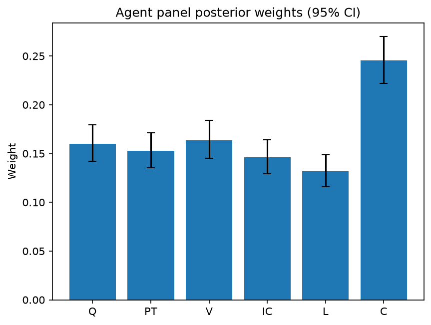

# Survey report: TrustRouter Agentic Full Panel (phi4:14b) -- Level L2: Six trust dimensions inside DVS

Survey ID: `trustrouter-agentic-full-panel-phi4-14b-2026-09-01-L2`

## Agent panel

- Agents contributing a valid response: 36
- Classical BWM consistency: 36/36 within threshold

| Criterion | Mean | 95% CI lower | 95% CI upper |
|---|---|---|---|
| Q | 0.1598 | 0.1420 | 0.1794 |
| PT | 0.1528 | 0.1352 | 0.1712 |
| V | 0.1638 | 0.1451 | 0.1841 |
| IC | 0.1464 | 0.1292 | 0.1639 |
| L | 0.1316 | 0.1161 | 0.1486 |
| C | 0.2456 | 0.2218 | 0.2703 |


## Methodology

Each agent independently completed a Best-Worst Method (BWM) comparison: choosing the single most and least important criterion, then rating every criterion's importance relative to those two on a 1-9 scale. Individual responses were solved with the classical BWM linear program (Rezaei, 2015) for a consistency check, and combined across the panel with a hierarchical Bayesian model (Mohammadi and Rezaei, 2020).


36 agent response(s) were accepted into this result.


Every agent's run began with a QA precheck (its stated configuration verified against ground truth) and every accepted answer's self-reported sources were checked against what reference material was actually available to it; see the Per-agent detail section below and this survey's Conversation Log for each agent's specific results. Every response is schema-validated and independently, repeatedly sampled (never a single completion treated as ground truth); see `guardrails.py`. This survey's complete output is covered by a SHA-256 integrity manifest (`integrity_manifest.json`, `SHA256SUMS`), generated once this run finished, so any later alteration to these files is detectable.


### Charts




## Per-agent detail

### bim-coordinator-base-openmanus (`bim-coordinator-base-openmanus`)

- Role: BIM Coordinator
- Model: ollama/phi4:14b
- DID: `did:key:z6MktjVuxsZoffjLx6zYtw8Bf8nm7iULqLcJwyu2VgSuM19E`
- QA precheck: passed
- Sources used: (not reported)

**Answer:** `{"best": "C", "worst": "L", "best_to_others": {"C": 1, "Q": 8, "PT": 7, "V": 6, "IC": 5, "L": 9}, "others_to_worst": {"L": 1, "Q": 3, "PT": 4, "V": 2, "IC": 1, "C": 9}}`

**Reasoning:**

Best factor: C  
Worst factor: L  

**Reasoning:**  
In the context of construction-project data considered for blockchain storage, **Criticality (C)** is paramount because it directly impacts safety, financial outcomes, and contractual obligations. If critical data is incorrect, it can lead to severe consequences such as structural failures or legal liabilities. Therefore, ensuring the accuracy and reliability of critical data takes precedence over other factors.

On the other hand, **Legal Compliance (L)**, while important, is considered the least critical in this context because compliance requirements are often predefined and static. They do not inherently change based on project-specific conditions as much as the potential impact of incorrect data does. Legal compliance can be managed through established protocols and regulations, whereas the implications of critical errors cannot be mitigated as easily.

This prioritization reflects a professional judgement that emphasizes the immediate and tangible risks associated with data inaccuracies in construction projects over regulatory adherence, which is more procedural in nature.

C vs Q: 8  
C vs PT: 7  
C vs V: 6  
C vs IC: 5  
C vs L: 9  

Q vs L: 3  
PT vs L: 4  
V vs L: 2  
IC vs L: 1  

**Reasoning:**  
- **Criticality (C) vs. Quality (Q):** Criticality is significantly more important than quality because while data must be clean, the impact of errors in critical data far outweighs mere technical cleanliness.
- **Criticality (C) vs. Provenance Trust (PT):** The source of data is crucial, but the potential consequences of incorrect critical data are greater.
- **Criticality (C) vs. Verification Strength (V):** While verification ensures integrity, it cannot mitigate the impact of errors in critical data.
- **Criticality (C) vs. Independent Confirmation (IC):** Independent checks are valuable, yet they do not outweigh the importance of ensuring critical data is accurate.
- **Criticality (C) vs. Legal Compliance (L):** The potential consequences of incorrect critical data are far more severe than failing to meet legal requirements.

For comparisons involving Legal Compliance:
- **Quality (Q) vs. Legal Compliance (L):** Quality is somewhat more important, as technical cleanliness can affect compliance but does not carry the same weight.
- **Provenance Trust (PT) vs. Legal Compliance (L):** Knowing data origin is more critical than mere compliance, though both are necessary.
- **Verification Strength (V) vs. Legal Compliance (L):** Verification ensures data integrity, which is slightly more important than legal adherence.
- **Independent Confirmation (IC) vs. Legal Compliance (L):** Independent checks provide additional assurance beyond compliance requirements, making them somewhat more critical.

### bim-coordinator-base-openmanus (`bim-coordinator-base-openmanus`)

- Role: BIM Coordinator
- Model: ollama/phi4:14b
- DID: `did:key:z6MktjVuxsZoffjLx6zYtw8Bf8nm7iULqLcJwyu2VgSuM19E`
- QA precheck: passed
- Sources used: (not reported)

**Answer:** `{"best": "C", "worst": "L", "best_to_others": {"C": 1, "Q": 8, "PT": 7, "V": 7, "IC": 6, "L": 9}, "others_to_worst": {"L": 1, "Q": 6, "PT": 5, "V": 7, "IC": 6, "C": 9}}`

**Reasoning:**

As a BIM Coordinator with extensive experience managing Building Information Models on renovation and new-build projects, my professional judgment is grounded in the critical importance of data integrity and trustworthiness throughout the lifecycle of construction projects. The criteria provided—Quality (Q), Provenance Trust (PT), Verification Strength (V), Independent Confirmation (IC), Legal Compliance (L), and Criticality (C)—each play a vital role in ensuring that the data used in these models is reliable, accurate, and compliant with necessary standards.

In evaluating these criteria, I consider the following:

1. **Quality (Q)**: Ensures that the data is technically clean, which is foundational for any further analysis or decision-making processes. Poor quality data can lead to significant errors downstream.
   
2. **Provenance Trust (PT)**: Establishes confidence in the source of the data, which is crucial for assessing its reliability and authenticity.

3. **Verification Strength (V)**: Provides cryptographic or audit-trail evidence that supports the integrity and validity of the data.

4. **Independent Confirmation (IC)**: Offers additional assurance through cross-checks by independent parties, enhancing trust in the data's accuracy.

5. **Legal Compliance (L)**: Ensures that the data meets regulatory requirements, which is essential for legal and contractual obligations.

6. **Criticality (C)**: Reflects the potential impact of incorrect data on safety, financial outcomes, or project success, emphasizing the importance of accurate data in high-stakes scenarios.

Given these considerations, I determine that:

- **Best factor**: Criticality (C) is most important because it directly relates to the potential consequences of data errors, which can affect life-safety and financial aspects of construction projects. Ensuring critical data is correct is paramount to avoiding catastrophic failures or significant losses.
  
- **Worst factor**: Legal Compliance (L) is least important in this context because, while compliance is necessary, it does not inherently guarantee the technical accuracy or trustworthiness of the data itself. It serves more as a baseline requirement rather than a determinant of data quality or reliability.

Best factor: C  
Worst factor: L

To provide the ratings based on my professional judgment as a BIM Coordinator, I will compare Criticality (C) against each of the other factors and then compare Quality (Q), Provenance Trust (PT), Verification Strength (V), Independent Confirmation (IC), and Legal Compliance (L) against each other. The scale is from 1 to 9, where 1 indicates equal importance and 9 indicates extremely more important.

- **C vs Q**: Criticality is significantly more important than Quality because while clean data is necessary, the impact of incorrect critical data can be catastrophic. Rating: 8
- **C vs PT**: Criticality outweighs Provenance Trust as knowing where data comes from is less crucial if its inaccuracy could lead to severe consequences. Rating: 7
- **C vs V**: Verification Strength ensures data integrity, but Criticality takes precedence due to the potential impact of errors. Rating: 7
- **C vs IC**: Independent Confirmation adds trust, yet Criticality remains paramount because it addresses the severity of potential impacts. Rating: 6
- **C vs L**: Legal Compliance is important for meeting standards, but Criticality is more crucial due to its direct link to safety and financial outcomes. Rating: 9

For comparisons involving Legal Compliance (L):

- **Q vs L**: Quality is more critical than Legal Compliance because technically clean data is foundational for project success. Rating: 6
- **PT vs L**: Provenance Trust is slightly more important than Legal Compliance as knowing the source of data can affect its reliability. Rating: 5
- **V vs L**: Verification Strength is more crucial than Legal Compliance since it ensures data integrity and trustworthiness. Rating: 7
- **IC vs L**: Independent Confirmation is more significant than Legal Compliance because cross-checks enhance data accuracy. Rating: 6

C vs Q: 8  
C vs PT: 7  
C vs V: 7  
C vs IC: 6  
C vs L: 9  
Q vs L: 6  
PT vs L: 5  
V vs L: 7  
IC vs L: 6

### bim-coordinator-base-openmanus (`bim-coordinator-base-openmanus`)

- Role: BIM Coordinator
- Model: ollama/phi4:14b
- DID: `did:key:z6MktjVuxsZoffjLx6zYtw8Bf8nm7iULqLcJwyu2VgSuM19E`
- QA precheck: passed
- Sources used: (not reported)

**Answer:** `{"best": "C", "worst": "L", "best_to_others": {"C": 1, "Q": 8, "PT": 7, "V": 6, "IC": 7, "L": 9}, "others_to_worst": {"L": 1, "Q": 6, "PT": 7, "V": 6, "IC": 7, "C": 9}}`

**Reasoning:**

As a BIM Coordinator with extensive experience managing Building Information Models on renovation and new-build projects, my professional judgment is grounded in the practical implications of each criterion within the context of construction-project data considered for blockchain storage.

**Best factor: C (Criticality)**

In the realm of construction projects, particularly those involving renovations or new builds, the criticality of data cannot be overstated. The impact of incorrect data on safety, financial outcomes, and contractual obligations is immense. For instance, inaccurate structural information could lead to catastrophic failures, endangering lives and resulting in significant financial losses. Therefore, ensuring that data with high criticality is accurate and reliable is paramount.

**Worst factor: L (Legal Compliance)**

While legal compliance is undoubtedly important, it often serves as a baseline requirement rather than a differentiator of data importance. In many cases, compliance requirements are standardized across projects, meaning they do not vary significantly in their impact on project outcomes compared to other factors like criticality or quality. Thus, while non-compliance can lead to penalties and legal issues, the immediate operational risks posed by high-criticality data errors are generally more pressing.

**Reasoning:**

- **Criticality (C)** is prioritized because it directly affects safety and financial aspects of construction projects. The potential consequences of incorrect critical data are far-reaching and severe.
  
- **Legal Compliance (L)**, while necessary, often represents a minimum standard that must be met rather than a variable factor influencing project success to the same degree as criticality.

This judgment is based on my professional experience and understanding of the construction industry's priorities when managing BIM projects.

As a BIM Coordinator, my ratings reflect the relative importance of each criterion in the context of construction-project data for blockchain storage. Here are the comparisons:

- **C vs Q**: 8  
  Criticality is significantly more important than quality because while technical cleanliness is essential, the impact of critical errors can be catastrophic.

- **C vs PT**: 7  
  The source of data (provenance trust) is crucial, but the potential consequences of incorrect critical data are generally greater.

- **C vs V**: 6  
  Verification strength ensures data integrity, yet the direct impact of criticality on safety and financial outcomes often outweighs it.

- **C vs IC**: 7  
  Independent confirmation adds reliability, but the inherent importance of critical data due to its potential consequences is higher.

- **C vs L**: 9  
  Criticality's impact on project success and safety far exceeds that of legal compliance, which typically sets baseline standards.

- **Q vs L**: 6  
  Quality is more important than legal compliance because technical errors can lead to significant issues beyond mere non-compliance penalties.

- **PT vs L**: 7  
  Knowing the data's origin (provenance) is generally more critical than meeting standardized legal requirements.

- **V vs L**: 6  
  Verification ensures data integrity, which is often more crucial than simply adhering to legal standards.

- **IC vs L**: 7  
  Independent confirmation provides an additional layer of reliability that surpasses the importance of basic legal compliance.

### bim-coordinator-rag-openmanus (`bim-coordinator-rag-openmanus`)

- Role: BIM Coordinator
- Model: ollama/phi4:14b
- DID: `did:key:z6MkfG5MseccUr21HZSLdPeQrKdR9LQwcXkD4pWXKcUh7U1C`
- QA precheck: passed
- Sources used: (not reported)

**Answer:** `{"best": "C", "worst": "V", "best_to_others": {"C": 1, "Q": 8, "PT": 7, "IC": 8, "L": 6, "V": 9}, "others_to_worst": {"V": 1, "Q": 5, "PT": 6, "IC": 7, "L": 8, "C": 9}}`

**Reasoning:**

As a BIM Coordinator with extensive experience managing Building Information Models on renovation and new-build projects, I am tasked with evaluating the importance of various criteria related to data trustworthiness in construction project records. The criteria are Quality (Q), Provenance Trust (PT), Verification Strength (V), Independent Confirmation (IC), Legal Compliance (L), and Criticality (C).

**Best factor: C (Criticality)**

In my professional experience, the criticality of data is paramount. This criterion encompasses the safety, financial, or contractual impacts if the data is incorrect. In construction projects, especially those involving occupied buildings like hospitals, ensuring life-safety structural integrity is crucial. The potential consequences of erroneous data in such contexts can be catastrophic, making criticality the most important factor.

**Worst factor: V (Verification Strength)**

While verification strength is important for ensuring data integrity through cryptographic proofs or audit trails, it is often less immediately impactful than other factors like criticality or legal compliance. In practice, while strong verification mechanisms are necessary, they do not directly address the immediate risks associated with incorrect data in terms of safety and financial implications. Therefore, among the criteria listed, verification strength is considered the least important.

This assessment aligns with my understanding of the practical priorities in managing BIM projects, where ensuring critical data accuracy takes precedence over technical verification processes.

As a BIM Coordinator, I will provide ratings based on the importance of each criterion in comparison to others, particularly focusing on criticality (C) and verification strength (V).

- **C vs Q:** 8  
  Criticality is significantly more important than quality because while technical cleanliness is essential, the potential impact if data is wrong is paramount.

- **C vs PT:** 7  
  Provenance trust is crucial for understanding who produced the data, but criticality takes precedence due to its direct implications on safety and financial outcomes.

- **C vs IC:** 8  
  Independent confirmation adds value by ensuring multiple parties agree, yet criticality remains more important because of the potential consequences if data is incorrect.

- **C vs L:** 6  
  Legal compliance is vital for regulatory adherence, but criticality often outweighs it due to its direct impact on project safety and success.

- **C vs V:** 9  
  Criticality is extremely more important than verification strength because the latter does not directly mitigate the risks associated with incorrect data in high-stakes scenarios.

- **Q vs V:** 5  
  Quality is moderately more important than verification strength, as clean data is foundational for accurate analysis and decision-making.

- **PT vs V:** 6  
  Provenance trust is somewhat more important than verification strength because knowing the source of data can influence its perceived reliability.

- **IC vs V:** 7  
  Independent confirmation is significantly more important than verification strength, as agreement from multiple sources enhances confidence in data accuracy.

- **L vs V:** 8  
  Legal compliance is extremely more important than verification strength, given that regulatory requirements often dictate the necessity and use of certain data.

### bim-coordinator-rag-openmanus (`bim-coordinator-rag-openmanus`)

- Role: BIM Coordinator
- Model: ollama/phi4:14b
- DID: `did:key:z6MkfG5MseccUr21HZSLdPeQrKdR9LQwcXkD4pWXKcUh7U1C`
- QA precheck: passed
- Sources used: (not reported)

**Answer:** `{"best": "C", "worst": "V", "best_to_others": {"C": 1, "Q": 7, "PT": 8, "IC": 7, "L": 6, "V": 9}, "others_to_worst": {"V": 1, "Q": 5, "PT": 6, "IC": 7, "L": 8, "C": 9}}`

**Reasoning:**

**Reasoning:**

As a BIM Coordinator with extensive experience in managing Building Information Models for both renovation and new-build projects, I have to consider the specific context of construction-project data being evaluated for blockchain storage. Each criterion plays a significant role, but their importance can vary based on the project's requirements and the nature of the data.

1. **Quality (Q):** Ensuring that data is technically clean is fundamental in any BIM process. Poor quality data can lead to errors in modeling, which can have cascading effects throughout the project lifecycle.

2. **Provenance Trust (PT):** Knowing who produced the data and ensuring its authenticity is crucial, especially when multiple stakeholders are involved. This trust is foundational for collaborative environments like BIM.

3. **Verification Strength (V):** The ability to verify data through cryptographic means or other methods ensures that the data has not been tampered with, which is vital for maintaining integrity in a blockchain context.

4. **Independent Confirmation (IC):** Having independent checks on data adds an additional layer of reliability and assurance, reducing the risk of errors going unnoticed.

5. **Legal Compliance (L):** Adhering to legal requirements is non-negotiable, as failure to comply can result in significant penalties and project delays.

6. **Criticality (C):** The impact of incorrect data on safety, financial aspects, or contractual obligations cannot be overstated. Critical data errors can have severe consequences.

Given these considerations, **Criticality (C)** stands out as the most important criterion because it directly relates to the potential consequences of data inaccuracies, which can affect life-safety and project viability. On the other hand, while all criteria are essential, **Verification Strength (V)** might be considered less immediately impactful compared to others in this specific context, especially if robust independent confirmation processes are already in place.

**Answer:**

Best factor: C  
Worst factor: V

To determine the relative importance of each criterion compared to Criticality (C) and Verification Strength (V), I will consider how each factor impacts construction-project data in a blockchain context, especially focusing on potential consequences and assurance levels.

1. **Criticality (C) vs Quality (Q):** While quality is essential for accurate modeling, criticality encompasses the broader impact of errors, making it more significant.
   - C vs Q: 7

2. **Criticality (C) vs Provenance Trust (PT):** Knowing who produced data is crucial, but the potential consequences of incorrect data (criticality) are generally more impactful.
   - C vs PT: 8

3. **Criticality (C) vs Independent Confirmation (IC):** Independent confirmation adds reliability, yet criticality directly relates to the severity of errors' impact.
   - C vs IC: 7

4. **Criticality (C) vs Legal Compliance (L):** Legal compliance is mandatory, but criticality addresses the broader implications of data inaccuracies beyond legal aspects.
   - C vs L: 6

5. **Criticality (C) vs Verification Strength (V):** Criticality directly relates to potential project impacts, which can be more significant than verification alone.
   - C vs V: 9

6. **Quality (Q) vs Verification Strength (V):** Quality ensures data accuracy from the start, while verification checks integrity post-creation; quality is slightly more foundational.
   - Q vs V: 5

7. **Provenance Trust (PT) vs Verification Strength (V):** Provenance establishes initial trust in data origin, which can be considered more fundamental than subsequent verification.
   - PT vs V: 6

8. **Independent Confirmation (IC) vs Verification Strength (V):** Independent confirmation provides a broader assurance than verification alone, as it involves multiple checks.
   - IC vs V: 7

9. **Legal Compliance (L) vs Verification Strength (V):** Legal compliance is mandatory and non-negotiable, often taking precedence over verification processes.
   - L vs V: 8

These ratings reflect the relative importance of each criterion in ensuring data integrity and reliability within a blockchain context for construction projects.

### bim-coordinator-rag-openmanus (`bim-coordinator-rag-openmanus`)

- Role: BIM Coordinator
- Model: ollama/phi4:14b
- DID: `did:key:z6MkfG5MseccUr21HZSLdPeQrKdR9LQwcXkD4pWXKcUh7U1C`
- QA precheck: passed
- Sources used: (not reported)

**Answer:** `{"best": "PT", "worst": "V", "best_to_others": {"PT": 1, "Q": 7, "IC": 6, "L": 5, "C": 4, "V": 9}, "others_to_worst": {"V": 1, "Q": 3, "IC": 5, "L": 6, "C": 4, "PT": 9}}`

**Reasoning:**

As a BIM Coordinator with extensive experience managing multi-stakeholder Building Information Models on renovation and new-build projects, my judgment is grounded in the practical implications of each criterion for construction-project data considered for blockchain storage.

**Best Factor: PT (Provenance Trust)**

Provenance Trust is paramount because it directly impacts the reliability and integrity of the data. In BIM contexts, knowing who produced the data and ensuring its authenticity is crucial for decision-making processes. The ability to trust the source of information can significantly influence project outcomes, especially when multiple stakeholders are involved. This criterion aligns with the practical need for accountability and traceability in complex projects.

**Worst Factor: V (Verification Strength)**

While Verification Strength is important, it is considered less critical compared to Provenance Trust in this context. In BIM, while cryptographic verification can enhance data security, the immediate trustworthiness of the data source often takes precedence. The practical focus tends to be on ensuring that the data originates from a credible source and has been independently confirmed, rather than solely relying on cryptographic methods.

**Rationale:**

- **Provenance Trust (PT):** Ensures accountability and traceability, which are essential in multi-stakeholder environments typical of BIM projects. This criterion is supported by ISO 19650's emphasis on independent validation and the practical need for reliable data sources.
  
- **Verification Strength (V):** Although important for security, it is often secondary to ensuring that the data comes from a trusted source. In practice, the focus tends to be more on procedural and audit evidence rather than purely cryptographic verification.

This assessment reflects the real-world priorities of BIM coordination, where trust in data originators and independent confirmation are critical for successful project delivery.

As a BIM Coordinator, my ratings reflect the practical importance of each criterion in construction-project data management:

```
PT vs Q: 7
PT vs IC: 6
PT vs L: 5
PT vs C: 4
PT vs V: 9
Q vs V: 3
IC vs V: 5
L vs V: 6
C vs V: 4
```

**Reasoning:**

- **PT vs Q:** Provenance Trust is more important than technical cleanliness (Quality) because knowing the data's origin ensures its reliability, which is crucial for decision-making.
  
- **PT vs IC:** While Independent Confirmation is vital, Provenance Trust takes precedence as it establishes initial credibility and accountability.

- **PT vs L:** Legal Compliance is essential but often follows from trusted provenance, making PT slightly more critical in practice.

- **PT vs C:** Criticality of data impacts decisions, yet without trust in its source (Provenance Trust), even critical data can be misleading.

- **PT vs V:** Verification Strength is less important compared to Provenance Trust because the immediate need is to ensure the credibility of the data source.

- **Q vs V:** Quality is more directly impactful on project execution than cryptographic verification, which supports but does not replace quality assurance processes.

- **IC vs V:** Independent Confirmation provides practical validation that often outweighs purely technical verification methods in real-world scenarios.

- **L vs V:** Legal Compliance ensures adherence to regulations, making it more significant than Verification Strength for ensuring data integrity within legal frameworks.

- **C vs V:** The impact of Criticality is substantial, but without trusted sources (Provenance Trust), even critical data can be unreliable.

### blockchain-engineer-base-openmanus (`blockchain-engineer-base-openmanus`)

- Role: Blockchain / DLT Engineer
- Model: ollama/phi4:14b
- DID: `did:key:z6Mkt3rBXTsyaURYSmKVDjYBpnSZtGCDZ2onmnLPwD2iWGby`
- QA precheck: passed
- Sources used: (not reported)

**Answer:** `{"best": "V", "worst": "L", "best_to_others": {"V": 1, "Q": 7, "PT": 8, "IC": 6, "C": 9, "L": 9}, "others_to_worst": {"L": 1, "Q": 6, "PT": 7, "IC": 8, "C": 9, "V": 9}}`

**Reasoning:**

As a Blockchain/DLT Engineer with production experience on permissioned-ledger deployments, I evaluate the criteria based on their relevance to ensuring data integrity and trust in blockchain applications.

**Best factor:** V (Verification Strength)

- **Reasoning:** In the context of blockchain technology, cryptographic evidence and audit trails are paramount for ensuring data integrity and immutability. Verification strength directly impacts the reliability of the data stored on the ledger, making it crucial for maintaining trust within a permissioned environment where data provenance and authenticity are critical.

**Worst factor:** L (Legal Compliance)

- **Reasoning:** While legal compliance is important, its impact on the technical aspects of blockchain deployment is less direct compared to other factors. Legal requirements may vary by jurisdiction and can be addressed through governance frameworks rather than being a primary concern in the technical evaluation of data trustworthiness.

**Best factor:** V  
**Worst factor:** L

As a Blockchain/DLT Engineer, I will provide the ratings based on the importance of Verification Strength (V) compared to other factors and also compare each factor against Legal Compliance (L).

**Verification Strength (V) Ratings:**

- **V vs Q:** 7  
  - Reasoning: Verification strength is more critical than quality because even technically clean data needs strong verification mechanisms in blockchain contexts.

- **V vs PT:** 8  
  - Reasoning: While provenance trust is important, the ability to verify data through cryptographic means ensures its integrity regardless of origin.

- **V vs IC:** 6  
  - Reasoning: Independent confirmation is valuable but does not replace the need for robust verification mechanisms inherent in blockchain technology.

- **V vs C:** 9  
  - Reasoning: Verification strength is crucial, especially when criticality is high, as it ensures data reliability and trustworthiness under all circumstances.

- **V vs L:** 9  
  - Reasoning: Legal compliance can be managed through governance; however, verification strength directly impacts the technical integrity of blockchain systems.

**Comparisons Against Legal Compliance (L):**

- **Q vs L:** 6  
  - Reasoning: Quality is important for data usability, but legal compliance does not inherently affect data quality in a technical sense.

- **PT vs L:** 7  
  - Reasoning: Provenance trust ensures data authenticity, which is more directly related to blockchain operations than legal compliance.

- **IC vs L:** 8  
  - Reasoning: Independent confirmation provides an additional layer of assurance that complements verification strength, making it more critical than legal compliance in technical contexts.

- **C vs L:** 9  
  - Reasoning: Criticality determines the impact of data errors, which is a direct concern for blockchain applications, whereas legal compliance is more about adherence to external regulations. 

**Ratings Summary:**

```
V vs Q: 7
V vs PT: 8
V vs IC: 6
V vs C: 9
V vs L: 9
Q vs L: 6
PT vs L: 7
IC vs L: 8
C vs L: 9
```

### blockchain-engineer-base-openmanus (`blockchain-engineer-base-openmanus`)

- Role: Blockchain / DLT Engineer
- Model: ollama/phi4:14b
- DID: `did:key:z6Mkt3rBXTsyaURYSmKVDjYBpnSZtGCDZ2onmnLPwD2iWGby`
- QA precheck: passed
- Sources used: (not reported)

**Answer:** `{"best": "C", "worst": "L", "best_to_others": {"C": 1, "Q": 8, "PT": 7, "V": 6, "IC": 5, "L": 9}, "others_to_worst": {"L": 1, "Q": 4, "PT": 3, "V": 2, "IC": 1, "C": 9}}`

**Reasoning:**

As a blockchain/DLT engineer with production experience in permissioned-ledger deployments, evaluating these criteria involves considering the specific context of construction-project records and their storage implications on a blockchain.

**Best Factor: C (Criticality)**  
The criticality of data is paramount when deciding what to store on a blockchain. If incorrect or compromised data could lead to significant safety, financial, or contractual repercussions—such as in life-safety structural dependencies—the importance of ensuring its accuracy and integrity cannot be overstated. In the context of construction, where errors can have catastrophic consequences, criticality takes precedence.

**Worst Factor: L (Legal Compliance)**  
While legal compliance is important, it may not always directly impact the immediate safety or financial outcomes as much as other factors like quality or criticality do. Legal requirements might mandate certain data storage practices, but they don't inherently determine the technical trustworthiness of the data itself. In scenarios where legal compliance does not coincide with high criticality or verification strength, it may be considered less crucial in determining blockchain storage priority.

**Best factor: C**  
**Worst factor: L**

Given the prioritization of criticality (C) over other factors and legal compliance (L) as the least important, here are the ratings on a 1-9 scale:

```
C vs Q: 8
C vs PT: 7
C vs V: 6
C vs IC: 5
C vs L: 9
Q vs L: 4
PT vs L: 3
V vs L: 2
IC vs L: 1
```

**Reasoning:**

- **Criticality (C) vs Others:** Criticality is rated significantly higher than other factors because of its direct impact on safety, financial, and contractual outcomes. The scale reflects the importance of ensuring data integrity when errors could have severe consequences.

- **Legal Compliance (L) vs Others:** Legal compliance is considered less critical in terms of immediate technical trustworthiness compared to quality, provenance trust, verification strength, and independent confirmation. It's rated lower because while important for regulatory adherence, it doesn't inherently ensure the data's accuracy or integrity as directly as other factors.

- **Comparisons Involving L:** Legal compliance is consistently rated lower against all other factors, reflecting its position as the least critical in this context. The differences are scaled to reflect varying degrees of importance relative to each factor.

### blockchain-engineer-base-openmanus (`blockchain-engineer-base-openmanus`)

- Role: Blockchain / DLT Engineer
- Model: ollama/phi4:14b
- DID: `did:key:z6Mkt3rBXTsyaURYSmKVDjYBpnSZtGCDZ2onmnLPwD2iWGby`
- QA precheck: passed
- Sources used: (not reported)

**Answer:** `{"best": "V", "worst": "L", "best_to_others": {"V": 1, "Q": 7, "PT": 8, "IC": 6, "C": 7, "L": 9}, "others_to_worst": {"L": 1, "Q": 6, "PT": 7, "IC": 8, "C": 7, "V": 9}}`

**Reasoning:**

As a Blockchain / DLT Engineer with experience in permissioned-ledger deployments, I will evaluate the criteria based on their relevance to ensuring data integrity and trustworthiness within such systems.

**Best Factor: V (Verification Strength)**

- **Reasoning**: Verification strength is crucial because it involves cryptographic or audit-trail evidence that ensures data authenticity and integrity. In blockchain systems, especially permissioned ones, strong verification mechanisms are essential for maintaining trust among participants. Cryptographic proofs provide tamper-evidence and non-repudiation, which are foundational to the security and reliability of distributed ledgers.

**Worst Factor: L (Legal Compliance)**

- **Reasoning**: While legal compliance is important, it is often context-dependent and may not directly impact the technical integrity or trustworthiness of data within a blockchain system. Legal requirements can vary significantly across jurisdictions and projects, making them less universally critical compared to verification mechanisms that are integral to the technology itself.

**Conclusion**: Verification strength (V) is prioritized as the best factor due to its direct impact on ensuring data integrity and trust in blockchain systems. Legal compliance (L), while important, is considered the least critical in this technical context.

Best factor: V  
Worst factor: L

As a Blockchain / DLT Engineer, I will provide ratings based on the importance of Verification Strength (V) compared to other criteria in ensuring data integrity and trustworthiness within blockchain systems.

- **V vs Q**: 7  
  - Reasoning: While quality is important for clean data, verification strength provides cryptographic assurance that enhances data reliability beyond mere cleanliness.

- **V vs PT**: 8  
  - Reasoning: Provenance trust ensures the credibility of data sources, but verification strength offers a technical guarantee of data integrity and authenticity.

- **V vs IC**: 6  
  - Reasoning: Independent confirmation adds value through cross-checks, yet verification strength directly secures data against tampering.

- **V vs C**: 7  
  - Reasoning: Criticality highlights the impact of errors, but verification strength actively prevents such errors by ensuring data integrity.

- **V vs L**: 9  
  - Reasoning: Legal compliance is context-specific and less universally critical than the technical assurance provided by verification mechanisms in blockchain systems.

- **Q vs L**: 6  
  - Reasoning: Quality ensures data cleanliness, which is more directly related to system performance than legal compliance requirements.

- **PT vs L**: 7  
  - Reasoning: Provenance trust is crucial for source credibility and is generally more universally applicable than varying legal mandates.

- **IC vs L**: 8  
  - Reasoning: Independent confirmation provides a layer of verification that is technically focused, unlike the variable nature of legal compliance.

- **C vs L**: 7  
  - Reasoning: Criticality addresses potential impacts of data errors, which are more directly relevant to system operations than legal compliance.

These ratings reflect the prioritization of technical mechanisms over context-dependent factors in ensuring blockchain data integrity and trustworthiness.

### blockchain-engineer-rag-openmanus (`blockchain-engineer-rag-openmanus`)

- Role: Blockchain / DLT Engineer
- Model: ollama/phi4:14b
- DID: `did:key:z6Mko8hHqpF7sFFLRW2GQFdJtGuQ5oszhR6pSFVQor3f2sFZ`
- QA precheck: passed
- Sources used: (not reported)

**Answer:** `{"best": "V", "worst": "L", "best_to_others": {"V": 1, "Q": 7, "PT": 8, "IC": 6, "C": 9, "L": 9}, "others_to_worst": {"L": 1, "Q": 6, "PT": 7, "IC": 8, "C": 8, "V": 9}}`

**Reasoning:**

Based on my professional judgment as a Blockchain/DLT Engineer with experience in permissioned-ledger deployments, evaluating the technical feasibility, throughput, and tamper-evidence guarantees of blockchain systems, I would prioritize the criteria as follows:

**Best factor:** **V (Verification Strength)**  
The verification strength is crucial because it ensures that data integrity is maintained through cryptographic or audit-trail completeness. This directly impacts trust in the system's ability to provide accurate and untampered information, which is foundational for any blockchain application.

**Worst factor:** **L (Legal Compliance)**  
While legal compliance is important, it is often context-dependent and can vary significantly across jurisdictions. In a technical evaluation of blockchain systems, the focus tends to be more on ensuring data integrity and trustworthiness rather than legal adherence, which can be addressed through policy and governance layers.

Best factor: V  
Worst factor: L

As a Blockchain/DLT Engineer, I will provide the ratings based on my professional judgment regarding the importance of each factor in the context of blockchain systems:

- **V vs Q:** 7  
  Verification strength (V) is more important than data quality (Q) because while clean data is essential, ensuring its integrity through cryptographic means provides a higher level of trust.

- **V vs PT:** 8  
  Verification strength (V) is significantly more critical than provenance trust (PT). Knowing who produced the data is valuable, but verifying that it hasn't been tampered with is paramount for trust in blockchain systems.

- **V vs IC:** 6  
  Verification strength (V) is moderately more important than independent confirmation (IC). While having multiple parties agree on data enhances trust, cryptographic verification provides a stronger guarantee of integrity.

- **V vs C:** 9  
  Verification strength (V) is extremely more important than criticality (C). The impact of wrong data is significant, but ensuring that the data cannot be tampered with is crucial for maintaining system reliability and trust.

- **V vs L:** 9  
  Verification strength (V) is extremely more important than legal compliance (L). While compliance is necessary, the technical assurance provided by verification mechanisms is fundamental to blockchain's value proposition.

- **Q vs L:** 6  
  Data quality (Q) is moderately more important than legal compliance (L). Clean data is essential for accurate processing and decision-making, whereas legal compliance can often be managed through governance.

- **PT vs L:** 7  
  Provenance trust (PT) is more important than legal compliance (L). Knowing the origin of data enhances its credibility, which is crucial in blockchain contexts where trust is a key factor.

- **IC vs L:** 8  
  Independent confirmation (IC) is significantly more important than legal compliance (L). Consensus among independent parties provides strong assurance of data validity, which is critical for trust.

- **C vs L:** 8  
  Criticality (C) is significantly more important than legal compliance (L). The potential impact of incorrect data necessitates prioritizing its accuracy and reliability over mere compliance.

### blockchain-engineer-rag-openmanus (`blockchain-engineer-rag-openmanus`)

- Role: Blockchain / DLT Engineer
- Model: ollama/phi4:14b
- DID: `did:key:z6Mko8hHqpF7sFFLRW2GQFdJtGuQ5oszhR6pSFVQor3f2sFZ`
- QA precheck: passed
- Sources used: (not reported)

**Answer:** `{"best": "V", "worst": "L", "best_to_others": {"V": 1, "Q": 8, "PT": 7, "IC": 6, "C": 5, "L": 9}, "others_to_worst": {"L": 1, "Q": 4, "PT": 3, "IC": 5, "C": 7, "V": 9}}`

**Reasoning:**

Based on my professional judgement as a Blockchain/DLT Engineer with experience in permissioned-ledger deployments, evaluating technical feasibility, throughput, and tamper-evidence guarantees, I consider the following:

- **Verification Strength (V)** is crucial because it provides cryptographic or audit-trail evidence that ensures data integrity and authenticity. This is fundamental for trust in blockchain systems.

- **Criticality (C)** is also significant as it addresses the potential safety, financial, or contractual impacts if data is incorrect, which can have severe consequences.

Considering these aspects, I determine:

Best factor: V  
Worst factor: L  

This decision reflects the importance of verification mechanisms and the critical nature of data accuracy in blockchain applications. Legal compliance (L), while important, may not directly impact the technical trustworthiness as much as Verification Strength or Criticality in this context.

As a Blockchain/DLT Engineer, I will provide the ratings based on my professional judgement:

- **Verification Strength (V)** is prioritized due to its critical role in ensuring data integrity and authenticity through cryptographic means.

- **Legal Compliance (L)**, while important, may not directly impact technical trustworthiness as much as other factors like Verification Strength or Criticality.

Here are the ratings on a 1-9 scale:

```
V vs Q: 8
V vs PT: 7
V vs IC: 6
V vs C: 5
V vs L: 9
Q vs L: 4
PT vs L: 3
IC vs L: 5
C vs L: 7
```

These ratings reflect the relative importance of Verification Strength compared to other factors, with Legal Compliance being considered less critical in this specific context.

### blockchain-engineer-rag-openmanus (`blockchain-engineer-rag-openmanus`)

- Role: Blockchain / DLT Engineer
- Model: ollama/phi4:14b
- DID: `did:key:z6Mko8hHqpF7sFFLRW2GQFdJtGuQ5oszhR6pSFVQor3f2sFZ`
- QA precheck: passed
- Sources used: (not reported)

**Answer:** `{"best": "V", "worst": "L", "best_to_others": {"V": 1, "Q": 7, "PT": 8, "IC": 6, "C": 7, "L": 9}, "others_to_worst": {"L": 1, "Q": 6, "PT": 7, "IC": 6, "C": 5, "V": 9}}`

**Reasoning:**

Based on my professional experience as a Blockchain/DLT Engineer and considering the reference material provided:

The **Verification Strength (V)** is paramount in ensuring that data stored on blockchain technologies is reliable. This criterion encompasses cryptographic evidence or audit trails, which are foundational to establishing trust within a permissioned ledger environment. The emphasis on Verification Strength aligns with the need for tamper-evidence and integrity of data, critical aspects when considering the storage and validation mechanisms inherent to blockchain technology.

On the other hand, while all criteria hold significance in their own right, **Legal Compliance (L)** might be considered as having a relatively lower immediate impact on the technical decision-making process regarding what data gets stored or how it's validated within a blockchain context. This is not to undermine its importance but rather to acknowledge that from a purely technical standpoint focused on ensuring data integrity and trustworthiness through cryptographic means, Legal Compliance may not directly influence these mechanisms as strongly as Verification Strength does.

Thus, in the context of comparing criteria for their importance in a blockchain/DLT environment:

Best factor: V  
Worst factor: L

Given the context of blockchain/DLT environments and the importance placed on Verification Strength (V) for ensuring data integrity through cryptographic evidence or audit trails, here are my ratings:

- V vs Q: 7  
  Quality is important but verifying data integrity via cryptographic means often takes precedence in a technical environment.

- V vs PT: 8  
  While provenance trust is crucial, the ability to verify data cryptographically ensures that even if the source is questionable, the data itself can be trusted.

- V vs IC: 6  
  Independent confirmation adds value but does not replace the need for cryptographic verification of data integrity.

- V vs C: 7  
  Criticality affects impact assessment, yet without strong verification, critical data could still be compromised.

- V vs L: 9  
  Legal compliance is essential, but in terms of technical trustworthiness and ensuring data has not been tampered with, Verification Strength is significantly more important.

- Q vs L: 6  
  Quality ensures data cleanliness, which can have legal implications, but it does not inherently address compliance requirements directly.

- PT vs L: 7  
  Provenance trust relates to the credibility of data sources, which may influence legal considerations, yet direct compliance is a separate concern.

- IC vs L: 6  
  Independent confirmation supports reliability and can aid in meeting compliance indirectly, but it does not equate to fulfilling legal requirements.

- C vs L: 5  
  Criticality impacts the consequences of non-compliance, but it doesn't directly influence whether data meets legal standards.

### compliance-officer-base-openmanus (`compliance-officer-base-openmanus`)

- Role: Compliance and Regulatory Officer
- Model: ollama/phi4:14b
- DID: `did:key:z6MkhbjMCfTLP5x4Chc2q7Rskakua1JQfKHHRZtyr5dc3r8w`
- QA precheck: passed
- Sources used: (not reported)

**Answer:** `{"best": "C", "worst": "IC", "best_to_others": {"C": 1, "Q": 7, "PT": 6, "V": 5, "L": 8, "IC": 9}, "others_to_worst": {"IC": 1, "Q": 6, "PT": 7, "V": 5, "L": 8, "C": 9}}`

**Reasoning:**

As a facility-management compliance officer responsible for GDPR and construction-regulatory obligations across a building's operational lifecycle, I must evaluate the criteria based on their importance in ensuring data integrity, trustworthiness, and regulatory compliance.

**Best factor:** **C (Criticality)**  
The criticality of data is paramount because it directly impacts safety, financial, and contractual outcomes. In the context of construction projects, incorrect or compromised data can lead to severe consequences such as structural failures, legal liabilities, and significant financial losses. Ensuring that data with high criticality is accurate and trustworthy is essential for maintaining compliance with regulatory standards and safeguarding human lives.

**Worst factor:** **IC (Independent Confirmation)**  
While independent confirmation is valuable for verifying data accuracy through cross-checks or audits, it is considered less critical compared to other factors like quality, provenance trust, verification strength, legal compliance, and criticality. Independent confirmation acts as an additional layer of assurance rather than a primary determinant of data integrity. In scenarios where immediate decisions are required based on data reliability, the presence of independent confirmation may not be as crucial as ensuring the data's inherent quality and compliance with legal standards.

**Reasoning:**  
The decision to prioritize criticality over other factors is grounded in the potential impact of incorrect data on safety and regulatory compliance. Legal compliance also plays a significant role due to its binding nature, but the immediate consequences associated with criticality make it the most important factor. Independent confirmation, while beneficial, is less urgent compared to ensuring the fundamental quality and trustworthiness of the data itself.

Best factor: C  
Worst factor: IC

As a facility-management compliance officer, I will evaluate the relative importance of each criterion compared to criticality (C) and independent confirmation (IC), using the 1-9 scale where 1 indicates equal importance and 9 indicates extremely more importance.

**C vs Q: 7**  
Quality is crucial for ensuring data integrity, but criticality takes precedence because it directly impacts safety and compliance outcomes. While high-quality data is necessary, its impact is less immediate than that of critical data errors.

**C vs PT: 6**  
Provenance trust is important to ensure the credibility of data sources, but criticality is more significant due to the potential consequences of incorrect data on safety and regulatory compliance.

**C vs V: 5**  
Verification strength provides assurance about data authenticity, yet criticality remains more vital because it addresses the direct impact of data errors on safety and legal obligations.

**C vs L: 8**  
Legal compliance is closely related to criticality, as both involve adherence to regulations. However, criticality slightly outweighs legal compliance due to its broader implications for safety and financial consequences.

**C vs IC: 9**  
Independent confirmation is less critical compared to the inherent importance of data with high criticality, which directly affects safety and regulatory outcomes.

**Q vs IC: 6**  
Quality is more important than independent confirmation because it ensures the fundamental integrity of data, whereas independent confirmation serves as an additional verification layer.

**PT vs IC: 7**  
Provenance trust is more crucial than independent confirmation, as knowing the source's reliability directly impacts data credibility and trustworthiness.

**V vs IC: 5**  
Verification strength is somewhat more important than independent confirmation because it provides direct evidence of data authenticity, which is essential for initial trust establishment.

**L vs IC: 8**  
Legal compliance is significantly more critical than independent confirmation due to its binding nature and the necessity of adhering to regulatory requirements.

C vs Q: 7  
C vs PT: 6  
C vs V: 5  
C vs L: 8  
C vs IC: 9  
Q vs IC: 6  
PT vs IC: 7  
V vs IC: 5  
L vs IC: 8

### compliance-officer-base-openmanus (`compliance-officer-base-openmanus`)

- Role: Compliance and Regulatory Officer
- Model: ollama/phi4:14b
- DID: `did:key:z6MkhbjMCfTLP5x4Chc2q7Rskakua1JQfKHHRZtyr5dc3r8w`
- QA precheck: passed
- Sources used: (not reported)

**Answer:** `{"best": "L", "worst": "IC", "best_to_others": {"L": 1, "Q": 8, "PT": 7, "V": 6, "C": 7, "IC": 9}, "others_to_worst": {"IC": 1, "Q": 7, "PT": 6, "V": 5, "C": 8, "L": 9}}`

**Reasoning:**

As a facility-management compliance officer responsible for GDPR and construction-regulatory obligations across a building's operational lifecycle, I must evaluate the criteria based on their impact on data trustworthiness in this context.

**Best Factor: L (Legal Compliance)**

- **Reasoning:** Legal compliance is paramount because it ensures adherence to mandatory regulations such as GDPR and construction codes. Non-compliance can lead to severe legal penalties and jeopardize project integrity, making it the most critical factor for ensuring data reliability and trustworthiness in a regulated environment.

**Worst Factor: IC (Independent Confirmation)**

- **Reasoning:** While independent confirmation is valuable, its importance may be less immediate compared to other factors like legal compliance or quality. In many cases, internal controls and verification mechanisms can suffice unless specific regulatory requirements dictate otherwise. Thus, it ranks as the least critical in this context.

Best factor: L  
Worst factor: IC

As a facility-management compliance officer, I will rate the importance of Legal Compliance (L) relative to other factors and compare Independent Confirmation (IC) against others based on their impact in ensuring data trustworthiness within regulatory frameworks.

**Comparisons involving L (Legal Compliance):**

- **L vs Q:** 8  
  *Reasoning:* Legal compliance is crucial for meeting mandatory regulations, often outweighing technical quality issues unless they directly affect compliance.

- **L vs PT:** 7  
  *Reasoning:* While provenance trust is important, legal compliance ensures adherence to laws and can override concerns about data origin if the data meets regulatory standards.

- **L vs V:** 6  
  *Reasoning:* Verification strength supports compliance but does not replace the necessity of meeting legal requirements directly.

- **L vs C:** 7  
  *Reasoning:* Legal compliance is critical, especially when non-compliance could lead to significant consequences, though criticality also heavily influences decision-making.

- **L vs IC:** 9  
  *Reasoning:* Legal compliance is paramount and often dictates the necessity of data handling practices, making it far more important than independent confirmation.

**Comparisons involving IC (Independent Confirmation):**

- **Q vs IC:** 7  
  *Reasoning:* Quality is essential for ensuring data integrity, but legal compliance takes precedence over independent checks unless required by law.

- **PT vs IC:** 6  
  *Reasoning:* Provenance trust ensures the credibility of data sources, yet it is less critical than quality or legal requirements in many scenarios.

- **V vs IC:** 5  
  *Reasoning:* Verification strength provides assurance but does not carry the same weight as ensuring compliance with legal standards.

- **C vs IC:** 8  
  *Reasoning:* Criticality directly impacts safety and financial outcomes, making it significantly more important than independent confirmation in many contexts.

L vs Q: 8  
L vs PT: 7  
L vs V: 6  
L vs C: 7  
L vs IC: 9  
Q vs IC: 7  
PT vs IC: 6  
V vs IC: 5  
C vs IC: 8

### compliance-officer-base-openmanus (`compliance-officer-base-openmanus`)

- Role: Compliance and Regulatory Officer
- Model: ollama/phi4:14b
- DID: `did:key:z6MkhbjMCfTLP5x4Chc2q7Rskakua1JQfKHHRZtyr5dc3r8w`
- QA precheck: passed
- Sources used: (not reported)

**Answer:** `{"best": "C", "worst": "IC", "best_to_others": {"C": 1, "Q": 8, "PT": 7, "V": 6, "L": 7, "IC": 9}, "others_to_worst": {"IC": 1, "Q": 5, "PT": 6, "V": 5, "L": 7, "C": 9}}`

**Reasoning:**

As a facility-management compliance officer responsible for GDPR and construction-regulatory obligations across a building's operational lifecycle, my professional judgement is guided by the importance of ensuring data integrity, trustworthiness, and regulatory adherence. 

**Best factor:** **C (Criticality)**  
In the context of construction project records considered for blockchain storage, criticality stands out as the most important criterion. This is because the impact of incorrect or compromised data can have significant safety, financial, or contractual consequences. For instance, if structural data related to a hospital roof is wrong, it could endanger lives, leading to severe legal and ethical implications.

**Worst factor:** **IC (Independent Confirmation)**  
While independent confirmation adds value by providing cross-checks, in the context of blockchain storage for construction records, its importance is relatively lower compared to other factors. This is because blockchain inherently provides a level of verification through its distributed ledger technology, reducing the necessity for additional independent confirmations.

These judgements are based on the specific roles and responsibilities associated with GDPR compliance and construction regulatory obligations, where ensuring data accuracy and understanding the implications of data errors are paramount.

Based on the professional judgement of a facility-management compliance officer, here are the ratings for each comparison:

- **C vs Q:** 8  
  Criticality is significantly more important than quality because even technically clean data can have severe consequences if it pertains to critical safety or financial aspects.

- **C vs PT:** 7  
  The importance of knowing who produced the data (provenance trust) is slightly less critical compared to understanding the potential impact of incorrect data on safety and finances.

- **C vs V:** 6  
  While verification strength ensures data integrity, the consequences of incorrect data (criticality) take precedence in terms of importance.

- **C vs L:** 7  
  Legal compliance is crucial, but the direct impact of data errors on critical aspects like safety or financial outcomes can be more pressing.

- **C vs IC:** 9  
  Independent confirmation is less important compared to criticality because blockchain technology inherently provides verification, reducing reliance on additional confirmations.

- **Q vs IC:** 5  
  Quality is moderately more important than independent confirmation as ensuring data cleanliness is essential, but not as crucial as the impact of incorrect data.

- **PT vs IC:** 6  
  Provenance trust is somewhat more important than independent confirmation because knowing the source adds a layer of trustworthiness to the data.

- **V vs IC:** 5  
  Verification strength is moderately more important than independent confirmation, given that blockchain's verification capabilities reduce the need for additional checks.

- **L vs IC:** 7  
  Legal compliance holds more importance than independent confirmation due to regulatory obligations and potential legal consequences of non-compliance.

### compliance-officer-rag-openmanus (`compliance-officer-rag-openmanus`)

- Role: Compliance and Regulatory Officer
- Model: ollama/phi4:14b
- DID: `did:key:z6MknnPyULv317BzskfxgnYty22cc5A3AddPeVZZsocVNgeY`
- QA precheck: passed
- Sources used: (not reported)

**Answer:** `{"best": "L", "worst": "IC", "best_to_others": {"L": 1, "Q": 7, "PT": 6, "V": 7, "C": 6, "IC": 9}, "others_to_worst": {"IC": 1, "Q": 5, "PT": 6, "V": 7, "C": 8, "L": 9}}`

**Reasoning:**

**Reasoning:**

In assessing which criterion is most and least important for a facility-management compliance officer responsible for GDPR and construction-regulatory obligations, the following considerations are made:

1. **Legal Compliance (L):** Given the role's responsibility for GDPR and regulatory obligations, ensuring that data meets legal requirements is paramount. The reference material highlights the tension between blockchain immutability and GDPR compliance, particularly regarding the right to erasure. Ensuring legal compliance prevents significant liabilities and aligns with the core responsibilities of this role.

2. **Criticality (C):** This criterion assesses the impact if data is incorrect, which is crucial in construction where safety and financial implications are high. However, while critical, it is contingent on having legally compliant data to begin with.

3. **Quality (Q), Provenance Trust (PT), Verification Strength (V), Independent Confirmation (IC):** These factors contribute to the trustworthiness of data but do not directly address legal obligations as explicitly as Legal Compliance does. They are important for ensuring data integrity and reliability, which supports compliance indirectly.

Given these considerations, **Legal Compliance (L)** is identified as the most critical factor due to its direct impact on regulatory adherence and potential liabilities. Conversely, while all factors contribute to overall trustworthiness, **Independent Confirmation (IC)** may be considered least critical in this context because it involves additional verification steps that, while valuable, do not directly address legal obligations.

**Answer:**

Best factor: L  
Worst factor: IC

**Ratings Explanation:**

1. **L vs Q (Legal Compliance vs Quality):**
   - Legal compliance is more critical than technical cleanliness, as non-compliance can lead to severe legal consequences.
   - Rating: 7

2. **L vs PT (Legal Compliance vs Provenance Trust):**
   - While provenance trust is important for understanding data origins, legal compliance directly impacts regulatory adherence.
   - Rating: 6

3. **L vs V (Legal Compliance vs Verification Strength):**
   - Legal compliance takes precedence over cryptographic verification in terms of direct impact on obligations and liabilities.
   - Rating: 7

4. **L vs C (Legal Compliance vs Criticality):**
   - Both are important, but legal compliance is foundational to ensuring that critical data meets regulatory standards.
   - Rating: 6

5. **L vs IC (Legal Compliance vs Independent Confirmation):**
   - Legal compliance is significantly more crucial than independent confirmation for meeting obligations and avoiding penalties.
   - Rating: 9

6. **Q vs IC (Quality vs Independent Confirmation):**
   - Quality is more important as it directly affects data usability, whereas independent confirmation is less critical in this context.
   - Rating: 5

7. **PT vs IC (Provenance Trust vs Independent Confirmation):**
   - Provenance trust provides essential information about data origins, making it more important than independent confirmation.
   - Rating: 6

8. **V vs IC (Verification Strength vs Independent Confirmation):**
   - Verification strength is crucial for ensuring data integrity, thus more important than independent confirmation.
   - Rating: 7

9. **C vs IC (Criticality vs Independent Confirmation):**
   - Criticality assesses the impact of incorrect data, making it more significant than independent confirmation.
   - Rating: 8

**Ratings:**

L vs Q: 7  
L vs PT: 6  
L vs V: 7  
L vs C: 6  
L vs IC: 9  
Q vs IC: 5  
PT vs IC: 6  
V vs IC: 7  
C vs IC: 8

### compliance-officer-rag-openmanus (`compliance-officer-rag-openmanus`)

- Role: Compliance and Regulatory Officer
- Model: ollama/phi4:14b
- DID: `did:key:z6MknnPyULv317BzskfxgnYty22cc5A3AddPeVZZsocVNgeY`
- QA precheck: passed
- Sources used: (not reported)

**Answer:** `{"best": "L", "worst": "Q", "best_to_others": {"L": 1, "PT": 8, "V": 7, "IC": 7, "C": 6, "Q": 9}, "others_to_worst": {"Q": 1, "PT": 5, "V": 6, "IC": 6, "C": 7, "L": 9}}`

**Reasoning:**

**Reasoning:**

In evaluating the criteria for a facility-management compliance officer responsible for GDPR and construction-regulatory obligations, Legal Compliance (L) emerges as the most critical. This is because ensuring data aligns with legal requirements, especially under GDPR, is paramount to avoid significant penalties and ensure regulatory adherence. The immutability of blockchain can create compliance challenges, particularly concerning the right to erasure, making it essential that data stored on such platforms must be legally compliant.

On the other hand, while Quality (Q) is important for ensuring technical cleanliness and accuracy of data, it may not carry as much weight in terms of immediate legal implications or regulatory requirements. In a compliance-focused role, failing to meet legal standards can have more severe consequences than issues related solely to data quality.

**Answer:**

Best factor: L  
Worst factor: Q

**Ratings Explanation:**

1. **L vs PT (Provenance Trust):** Legal compliance is more critical than provenance trust because failing to meet legal standards can result in severe penalties, whereas issues with provenance may not have immediate legal consequences.

2. **L vs V (Verification Strength):** Legal compliance takes precedence over verification strength as it directly impacts regulatory adherence and potential legal repercussions.

3. **L vs IC (Independent Confirmation):** While independent confirmation is valuable for trustworthiness, legal compliance is more crucial due to its direct implications on legality and regulation.

4. **L vs C (Criticality):** Legal compliance is prioritized over criticality because non-compliance can lead to significant legal issues, whereas the impact of data being wrong varies based on context.

5. **L vs Q (Quality):** As previously stated, legal compliance is more important than quality due to its direct connection with regulatory requirements and potential penalties.

6. **PT vs Q:** Provenance trust is slightly more critical than quality because knowing who produced the data can affect its reliability and trustworthiness, which is essential for compliance.

7. **V vs Q:** Verification strength is more important than quality since cryptographic or audit-trail evidence provides a higher assurance of data integrity and authenticity.

8. **IC vs Q:** Independent confirmation is prioritized over quality because agreement among multiple parties enhances the credibility and reliability of the data, which is crucial for compliance.

9. **C vs Q:** Criticality is more important than quality because understanding the potential impact if data is wrong can guide prioritization in compliance efforts.

**Ratings:**

L vs PT: 8  
L vs V: 7  
L vs IC: 7  
L vs C: 6  
L vs Q: 9  
PT vs Q: 5  
V vs Q: 6  
IC vs Q: 6  
C vs Q: 7

### compliance-officer-rag-openmanus (`compliance-officer-rag-openmanus`)

- Role: Compliance and Regulatory Officer
- Model: ollama/phi4:14b
- DID: `did:key:z6MknnPyULv317BzskfxgnYty22cc5A3AddPeVZZsocVNgeY`
- QA precheck: passed
- Sources used: (not reported)

**Answer:** `{"best": "L", "worst": "Q", "best_to_others": {"L": 1, "PT": 8, "V": 7, "IC": 8, "C": 7, "Q": 9}, "others_to_worst": {"Q": 1, "PT": 6, "V": 7, "IC": 6, "C": 8, "L": 9}}`

**Reasoning:**

**Reasoning:**

In considering which criterion is most important and which is least important among the six provided for assessing data in a construction project context, I draw on both my role-specific knowledge as a Compliance and Regulatory Officer and the reference material provided.

The **Legal Compliance (L)** criterion stands out as the best factor. This is because legal compliance ensures that all data management practices adhere to relevant laws and regulations, such as GDPR, which are non-negotiable in the operational lifecycle of a building. The importance of this dimension is underscored by its role in preventing significant legal liabilities and ensuring regulatory adherence, making it paramount over other factors.

On the other hand, while **Quality (Q)** is certainly important for ensuring data integrity, it may be considered less critical than Legal Compliance when assessing overall importance. This is because high-quality data that does not comply with legal standards can still lead to severe compliance issues and penalties. Therefore, in a regulatory context where legal compliance is mandatory, Quality becomes the least critical among these factors.

**Best factor:** L  
**Worst factor:** Q

**Ratings:**

- L vs PT: 8  
  Legal Compliance is significantly more important than Provenance Trust because failing to comply with legal standards can result in severe penalties, whereas issues with provenance trust might not have immediate regulatory consequences.

- L vs V: 7  
  Legal Compliance takes precedence over Verification Strength as compliance ensures adherence to laws and regulations, which is foundational. While verification provides assurance of data integrity, it does not replace the necessity for legal compliance.

- L vs IC: 8  
  Independent Confirmation is less critical compared to Legal Compliance because even if multiple parties agree on data accuracy, non-compliance with legal standards can still lead to significant issues.

- L vs C: 7  
  While Criticality of impact is important, ensuring Legal Compliance is more crucial as it prevents potential legal repercussions that could arise from regulatory breaches.

- L vs Q: 9  
  Quality is considered the least critical in comparison to Legal Compliance. High-quality data must still comply with legal standards; otherwise, its quality becomes irrelevant if it leads to non-compliance issues.

- PT vs Q: 6  
  Provenance Trust is more important than Quality because knowing who produced the data can impact trust and accountability, which are crucial for compliance and decision-making processes.

- V vs Q: 7  
  Verification Strength is prioritized over Quality as it provides a mechanism to ensure data integrity through cryptographic or audit-trail evidence, which is essential for maintaining trust in data accuracy.

- IC vs Q: 6  
  Independent Confirmation is more important than Quality because agreement among independent parties can validate the reliability of data beyond its inherent quality.

- C vs Q: 8  
  Criticality is significantly more important than Quality as understanding the potential impact if data is wrong helps prioritize compliance and verification efforts to mitigate risks.

### data-engineer-base-openmanus (`data-engineer-base-openmanus`)

- Role: Data Engineering Specialist
- Model: ollama/phi4:14b
- DID: `did:key:z6Mki7K9yLK1ZtQHSWo1JxgRRhYwtrQJcjwzJ7o4PZnNF83i`
- QA precheck: passed
- Sources used: (not reported)

**Answer:** `{"best": "C", "worst": "L", "best_to_others": {"C": 1, "Q": 9, "PT": 8, "V": 7, "IC": 6, "L": 9}, "others_to_worst": {"L": 1, "Q": 5, "PT": 4, "V": 6, "IC": 5, "C": 9}}`

**Reasoning:**

As a data engineering specialist responsible for data quality pipelines and provenance tracking in construction-project datasets, I will evaluate the criteria based on their impact on ensuring reliable and trustworthy data.

**Best Factor: C (Criticality)**

- **Reasoning**: In construction projects, the criticality of data is paramount due to the potential safety, financial, and contractual implications if incorrect data leads to errors. The impact of wrong data can be catastrophic, affecting life-safety structures such as hospitals or high-rise buildings. Therefore, ensuring that the most critical data is accurate and reliable takes precedence over other factors.

**Worst Factor: L (Legal Compliance)**

- **Reasoning**: While legal compliance is important, it often serves more as a baseline requirement rather than a differentiator in terms of data trustworthiness. In many cases, compliance can be ensured through standard procedures without necessarily impacting the core quality or reliability of the data itself. Thus, compared to other factors like criticality or verification strength, legal compliance may have less direct influence on the immediate trustworthiness of construction-project datasets.

Best factor: C  
Worst factor: L

Based on the reasoning provided, here are the ratings for how much more important Criticality (C) is compared to each of the other factors, and how Quality (Q), Provenance Trust (PT), Verification Strength (V), Independent Confirmation (IC), and Legal Compliance (L) compare to one another:

```
C vs Q: 9
C vs PT: 8
C vs V: 7
C vs IC: 6
C vs L: 9
Q vs L: 5
PT vs L: 4
V vs L: 6
IC vs L: 5
```

**Explanation of Ratings:**

- **C vs Q, PT, V, IC**: Criticality is rated significantly higher than the other factors because it directly impacts safety and financial outcomes in construction projects. The scale reflects its paramount importance over technical quality (Q), trustworthiness of data origin (PT), verification methods (V), and independent checks (IC).

- **C vs L**: Legal compliance is considered less important compared to criticality, as legal requirements are often baseline standards that do not necessarily reflect the immediate impact on project safety or financial stakes.

- **Q vs L, PT vs L, V vs L, IC vs L**: These ratings indicate that while Quality (Q), Provenance Trust (PT), Verification Strength (V), and Independent Confirmation (IC) are more important than Legal Compliance (L), they do not surpass Criticality in importance. The differences reflect their roles as essential components of data trustworthiness but secondary to the critical impact of C.

### data-engineer-base-openmanus (`data-engineer-base-openmanus`)

- Role: Data Engineering Specialist
- Model: ollama/phi4:14b
- DID: `did:key:z6Mki7K9yLK1ZtQHSWo1JxgRRhYwtrQJcjwzJ7o4PZnNF83i`
- QA precheck: passed
- Sources used: (not reported)

**Answer:** `{"best": "C", "worst": "L", "best_to_others": {"C": 1, "Q": 8, "PT": 7, "V": 6, "IC": 5, "L": 9}, "others_to_worst": {"L": 1, "Q": 4, "PT": 3, "V": 2, "IC": 1, "C": 9}}`

**Reasoning:**

As a Data Engineering Specialist responsible for data quality pipelines, provenance tracking, and polyglot-persistence routing decisions on construction-project datasets, my professional judgement is grounded in the specific criteria provided.

**Best factor:** C  
**Worst factor:** L

**Reasoning:**

1. **Criticality (C):** In construction projects, the impact of incorrect data can be severe, affecting safety, financial outcomes, and contractual obligations. For instance, errors in structural data could lead to catastrophic failures, making criticality a paramount concern.

2. **Legal Compliance (L):** While legal compliance is important, it often serves as a baseline requirement rather than a differentiator in decision-making processes. In many cases, compliance ensures that minimum standards are met but does not necessarily enhance the intrinsic value or trustworthiness of the data beyond those requirements.

This assessment aligns with the multiplicative nature of the TrustRouter equation, where criticality can significantly influence the overall decision due to its potential impact on safety and financial outcomes.

Based on the professional judgement of a Data Engineering Specialist, here are the ratings for each comparison:

```
C vs Q: 8
C vs PT: 7
C vs V: 6
C vs IC: 5
C vs L: 9
Q vs L: 4
PT vs L: 3
V vs L: 2
IC vs L: 1
```

**Reasoning:**

- **Criticality (C) vs Others:** Criticality is rated significantly higher than other factors because the consequences of incorrect data in construction projects can be dire, affecting safety and financial outcomes. The scale reflects its paramount importance over Quality (Q), Provenance Trust (PT), Verification Strength (V), and Independent Confirmation (IC).

- **Criticality (C) vs Legal Compliance (L):** Criticality is rated as extremely more important than Legal Compliance because while compliance ensures baseline standards, criticality addresses the potential impact of data errors.

- **Others vs Legal Compliance (L):** Quality, Provenance Trust, Verification Strength, and Independent Confirmation are all considered more important than Legal Compliance, but to varying degrees. This reflects that while compliance is necessary, it does not inherently enhance data trustworthiness beyond ensuring minimum standards.

### data-engineer-base-openmanus (`data-engineer-base-openmanus`)

- Role: Data Engineering Specialist
- Model: ollama/phi4:14b
- DID: `did:key:z6Mki7K9yLK1ZtQHSWo1JxgRRhYwtrQJcjwzJ7o4PZnNF83i`
- QA precheck: passed
- Sources used: (not reported)

**Answer:** `{"best": "Q", "worst": "L", "best_to_others": {"Q": 1, "PT": 7, "V": 8, "IC": 7, "C": 6, "L": 9}, "others_to_worst": {"L": 1, "PT": 5, "V": 6, "IC": 5, "C": 7, "Q": 9}}`

**Reasoning:**

**Reasoning:**

As a data engineering specialist responsible for data quality pipelines, provenance tracking, and polyglot-persistence routing decisions in construction-project datasets, I must evaluate the importance of each trust dimension based on its impact on data integrity and decision-making.

1. **Quality (Q):** Ensures that the data is technically clean and accurate, which is foundational for any subsequent analysis or decision-making process. Without high-quality data, other factors become less relevant because they rely on the accuracy and reliability of the data itself.

2. **Provenance Trust (PT):** Involves trust in the source and history of the data, ensuring that it has been collected and maintained by reliable entities. This is crucial for verifying the authenticity and integrity of the data.

3. **Verification Strength (V):** Provides cryptographic or audit-trail evidence to support the validity of the data, adding a layer of security and trustworthiness.

4. **Independent Confirmation (IC):** Involves cross-checks by independent parties, which can validate the data's accuracy from multiple perspectives.

5. **Legal Compliance (L):** Ensures that the data meets regulatory or statutory obligations, which is important for legal accountability but may not directly impact technical quality.

6. **Criticality (C):** Reflects the potential impact if the data is incorrect, emphasizing the importance of accuracy in high-stakes scenarios.

Given these considerations, **Quality (Q)** stands out as the most critical factor because it underpins all other aspects of trust and reliability. Without clean and accurate data, the effectiveness of provenance tracking, verification, and independent confirmation is compromised. Legal compliance and criticality are important but secondary to ensuring that the foundational data itself is sound.

Conversely, **Legal Compliance (L)**, while necessary for regulatory adherence, is considered the least critical in this context because it does not directly affect the technical quality or trustworthiness of the data itself. It acts more as a compliance requirement rather than a determinant of data integrity.

**Best factor:** Q  
**Worst factor:** L

**Reasoning:**

To determine the relative importance of each criterion compared to Quality (Q), we consider how foundational data quality is for all other trust dimensions. Legal Compliance (L) is considered less critical in terms of direct impact on data integrity and decision-making.

1. **Q vs PT:** Provenance Trust is important, but without high-quality data, the source's reliability becomes secondary. Quality is more crucial.
   - Rating: 7

2. **Q vs V:** Verification Strength adds security, but if the data quality is poor, verification efforts are less meaningful.
   - Rating: 8

3. **Q vs IC:** Independent Confirmation validates data accuracy, yet it relies on the initial quality of the data being confirmed.
   - Rating: 7

4. **Q vs C:** Criticality highlights the impact of incorrect data, but ensuring data is accurate from the start (Quality) is more fundamental.
   - Rating: 6

5. **Q vs L:** Legal Compliance ensures adherence to regulations but does not directly enhance data integrity like Quality does.
   - Rating: 9

For comparisons involving Legal Compliance (L), which is considered the least critical:

6. **PT vs L:** Provenance Trust provides insights into data origin, more relevant than mere compliance.
   - Rating: 5

7. **V vs L:** Verification Strength ensures data validity through cryptographic means, more impactful than legal adherence.
   - Rating: 6

8. **IC vs L:** Independent Confirmation offers additional validation layers, surpassing the importance of Legal Compliance.
   - Rating: 5

9. **C vs L:** Criticality underscores potential impacts of errors, making it more significant than compliance alone.
   - Rating: 7

**Ratings:**

Q vs PT: 7  
Q vs V: 8  
Q vs IC: 7  
Q vs C: 6  
Q vs L: 9  
PT vs L: 5  
V vs L: 6  
IC vs L: 5  
C vs L: 7

### data-engineer-rag-openmanus (`data-engineer-rag-openmanus`)

- Role: Data Engineering Specialist
- Model: ollama/phi4:14b
- DID: `did:key:z6MknK7Wf8f8fYivwnqnYqEAWe9mzXYdboRjVXTZ5FKNGt3J`
- QA precheck: passed
- Sources used: (not reported)

**Answer:** `{"best": "Q", "worst": "L", "best_to_others": {"Q": 1, "PT": 7, "V": 6, "IC": 8, "C": 7, "L": 9}, "others_to_worst": {"L": 1, "PT": 6, "V": 7, "IC": 8, "C": 8, "Q": 9}}`

**Reasoning:**

Best factor: Q  
Worst factor: L  

**Reasoning:**  
As a data engineering specialist focused on data quality pipelines and provenance tracking, the Quality (Q) of data is paramount. Ensuring that data is technically clean directly impacts all downstream processes and decisions, making it the most critical criterion. In contrast, Legal Compliance (L), while important, often acts as an external constraint rather than a direct determinant of data integrity or trustworthiness within the context of construction-project datasets. Thus, it is considered the least important in this specific comparison.

Q vs PT: 7  
Q vs V: 6  
Q vs IC: 8  
Q vs C: 7  
Q vs L: 9  

PT vs L: 6  
V vs L: 7  
IC vs L: 8  
C vs L: 8  

**Reasoning:**  
- **Quality (Q) vs Provenance Trust (PT):** Quality is more important than provenance trust because technically clean data ensures reliability and usability, whereas provenance trust primarily concerns the source's credibility.
- **Quality (Q) vs Verification Strength (V):** While verification strength adds an additional layer of assurance, having high-quality data inherently reduces errors and inconsistencies, making it slightly more critical.
- **Quality (Q) vs Independent Confirmation (IC):** Quality is crucial as it directly affects all operations. Independent confirmation supports trust but does not replace the need for clean data.
- **Quality (Q) vs Criticality (C):** Both are important, but high-quality data ensures that even highly critical decisions are based on accurate information.
- **Quality (Q) vs Legal Compliance (L):** Quality is extremely more important as it directly impacts data integrity and usability, whereas legal compliance is an external requirement.

- **Provenance Trust (PT) vs Legal Compliance (L):** Provenance trust is somewhat more important than legal compliance because the source's credibility can impact data reliability beyond mere regulatory adherence.
- **Verification Strength (V) vs Legal Compliance (L):** Verification strength provides a higher assurance of data integrity compared to merely meeting legal standards, making it slightly more critical.
- **Independent Confirmation (IC) vs Legal Compliance (L):** Independent confirmation is more important as it involves multiple sources validating the data, offering greater trust than just compliance.
- **Criticality (C) vs Legal Compliance (L):** The impact of decisions based on data makes criticality more significant than legal compliance, which is a baseline requirement.

### data-engineer-rag-openmanus (`data-engineer-rag-openmanus`)

- Role: Data Engineering Specialist
- Model: ollama/phi4:14b
- DID: `did:key:z6MknK7Wf8f8fYivwnqnYqEAWe9mzXYdboRjVXTZ5FKNGt3J`
- QA precheck: passed
- Sources used: (not reported)

**Answer:** `{"best": "Q", "worst": "L", "best_to_others": {"Q": 1, "PT": 7, "V": 8, "IC": 7, "C": 6, "L": 9}, "others_to_worst": {"L": 1, "PT": 5, "V": 6, "IC": 5, "C": 4, "Q": 9}}`

**Reasoning:**

**Reasoning:**

In evaluating construction-project datasets for blockchain storage, each criterion plays a crucial role. However, the **Quality (Q)** of data is paramount as it directly impacts all subsequent processes and decisions. High-quality data ensures accuracy, completeness, and consistency, which are foundational to any trust framework.

- **Quality (Q):** Without technically clean data, other factors like Provenance Trust or Verification Strength become less meaningful because they rely on the integrity of the underlying data.
  
- **Provenance Trust (PT), Verification Strength (V), Independent Confirmation (IC):** These are critical for establishing trust but depend on the initial quality of the data.

- **Legal Compliance (L) and Criticality (C):** While important, their impact is contingent upon having accurate and reliable data to begin with.

Given these considerations, Quality emerges as the most crucial factor. Conversely, while all factors are significant, in a hierarchy where foundational integrity is key, Legal Compliance (L) might be considered less immediately critical than others when establishing initial trustworthiness, though it remains essential for regulatory adherence.

**Answer:**

Best factor: Q  
Worst factor: L

**Ratings Explanation:**

1. **Quality (Q) vs Provenance Trust (PT):**
   - Quality is more important because without clean data, the trustworthiness of its origin becomes irrelevant.
   - Rating: 7

2. **Quality (Q) vs Verification Strength (V):**
   - Quality underpins verification; if data isn't accurate, verification processes are compromised.
   - Rating: 8

3. **Quality (Q) vs Independent Confirmation (IC):**
   - High-quality data is essential for meaningful independent confirmation.
   - Rating: 7

4. **Quality (Q) vs Criticality (C):**
   - While criticality assesses impact, it relies on the quality of data to determine what impacts are relevant.
   - Rating: 6

5. **Quality (Q) vs Legal Compliance (L):**
   - Quality is foundational; without it, compliance cannot be effectively assessed or ensured.
   - Rating: 9

6. **Provenance Trust (PT) vs Legal Compliance (L):**
   - Provenance trust is more directly related to data integrity than legal compliance in the context of initial trustworthiness.
   - Rating: 5

7. **Verification Strength (V) vs Legal Compliance (L):**
   - Verification strength ensures data integrity, which is crucial before considering compliance.
   - Rating: 6

8. **Independent Confirmation (IC) vs Legal Compliance (L):**
   - Independent confirmation provides a layer of trust that complements but does not replace the need for legal compliance.
   - Rating: 5

9. **Criticality (C) vs Legal Compliance (L):**
   - Criticality assesses impact, which is important but secondary to ensuring data meets legal standards.
   - Rating: 4

**Ratings:**

Q vs PT: 7  
Q vs V: 8  
Q vs IC: 7  
Q vs C: 6  
Q vs L: 9  
PT vs L: 5  
V vs L: 6  
IC vs L: 5  
C vs L: 4

### data-engineer-rag-openmanus (`data-engineer-rag-openmanus`)

- Role: Data Engineering Specialist
- Model: ollama/phi4:14b
- DID: `did:key:z6MknK7Wf8f8fYivwnqnYqEAWe9mzXYdboRjVXTZ5FKNGt3J`
- QA precheck: passed
- Sources used: (not reported)

**Answer:** `{"best": "Q", "worst": "L", "best_to_others": {"Q": 1, "PT": 9, "V": 8, "IC": 7, "C": 6, "L": 9}, "others_to_worst": {"L": 1, "PT": 5, "V": 7, "IC": 6, "C": 6, "Q": 9}}`

**Reasoning:**

**Reasoning:**  
In evaluating construction-project datasets for blockchain storage, each criterion plays a crucial role. However, the **Quality (Q)** of data is paramount because it directly impacts the accuracy, consistency, and reliability of the dataset. Without high-quality data, other factors like Provenance Trust or Verification Strength become less meaningful since they rely on the foundational integrity of the data itself. Quality ensures that the data meets technical standards necessary for effective decision-making and compliance.

On the other hand, while **Legal Compliance (L)** is important, it may be considered the least critical in this specific context because its relevance can vary significantly depending on jurisdictional requirements and project-specific regulations. In some cases, legal compliance might not directly influence the immediate operational or safety outcomes of a construction project as much as data quality does.

**Best factor:** Q  
**Worst factor:** L

**Ratings Explanation:**  
The ratings reflect the relative importance of each criterion in comparison to others, with Quality (Q) being considered extremely more important than Legal Compliance (L). Here's a breakdown:

- **Q vs PT (Provenance Trust):** Quality is crucial as it ensures data integrity and usability, while Provenance Trust is about trust in the source. Quality without trust can still be problematic, but untrusted quality data is fundamentally flawed.
  
- **Q vs V (Verification Strength):** Verification provides evidence of data accuracy, but if the underlying data isn't high-quality, verification becomes less meaningful.

- **Q vs IC (Independent Confirmation):** Independent confirmation adds reliability, yet it relies on the initial quality of the data being confirmed.

- **Q vs C (Criticality):** Criticality assesses impact, which is significant, but without quality data, assessing criticality accurately is challenging.

- **Q vs L (Legal Compliance):** As previously stated, Quality is extremely more important than Legal Compliance for operational effectiveness and reliability.

- **PT vs L:** Provenance Trust is more crucial than Legal Compliance because knowing the source's trustworthiness can often preempt legal issues.

- **V vs L:** Verification Strength ensures data integrity through evidence, making it more critical than mere compliance with laws.

- **IC vs L:** Independent Confirmation provides a layer of reliability that surpasses just meeting legal requirements.

- **C vs L:** Criticality is about the impact of errors, which can be more immediately significant than adhering to legal standards.

**Ratings:**

Q vs PT: 9  
Q vs V: 8  
Q vs IC: 7  
Q vs C: 6  
Q vs L: 9  
PT vs L: 5  
V vs L: 7  
IC vs L: 6  
C vs L: 6

### project-manager-base-openmanus (`project-manager-base-openmanus`)

- Role: Construction Project Manager
- Model: ollama/phi4:14b
- DID: `did:key:z6Mkpbo2bdLzUURLLFBbvXHmY8AEoi5zE6RmFMHBirqEurkd`
- QA precheck: passed
- Sources used: (not reported)

**Answer:** `{"best": "C", "worst": "IC", "best_to_others": {"C": 1, "Q": 7, "PT": 8, "V": 6, "L": 5, "IC": 9}, "others_to_worst": {"IC": 1, "Q": 3, "PT": 4, "V": 2, "L": 1, "C": 9}}`

**Reasoning:**

As a construction project manager responsible for coordinating multi-stakeholder documentation flows across a renovation or new-build project's full lifecycle, my professional judgement is grounded in the practical realities of managing complex projects. The criteria provided—Quality (Q), Provenance Trust (PT), Verification Strength (V), Independent Confirmation (IC), Legal Compliance (L), and Criticality (C)—are all crucial for ensuring successful project outcomes.

**Best factor: C (Criticality)**

In my role, the criticality of data is paramount. This criterion reflects the potential impact if data were incorrect or missing, which can have significant consequences on project timelines, costs, safety, and compliance. Ensuring that high-criticality data is accurate and reliable is essential for decision-making throughout the project lifecycle.

**Worst factor: IC (Independent Confirmation)**

While independent confirmation is valuable, it is often less immediately critical than other factors in the context of construction projects. The focus tends to be more on ensuring quality, provenance trust, verification strength, legal compliance, and understanding the criticality of data. Independent confirmation may not always be feasible or necessary for every piece of data, especially when other criteria are met satisfactorily.

This judgement is based on my professional experience and the specific needs of managing documentation flows in construction projects, where the impact of errors can be significant, making criticality a top priority.

As a construction project manager, I will provide the ratings based on my professional judgement regarding the importance of each criterion relative to Criticality (C) and Independent Confirmation (IC).

```
C vs Q: 7
C vs PT: 8
C vs V: 6
C vs L: 5
C vs IC: 9

Q vs IC: 3
PT vs IC: 4
V vs IC: 2
L vs IC: 1
```

**Reasoning:**

- **Criticality (C) vs Others:** Criticality is rated higher than Quality (Q), Provenance Trust (PT), Verification Strength (V), and Legal Compliance (L) because the potential impact of incorrect data can significantly affect project outcomes. It's rated highest against Independent Confirmation (IC) as it directly influences decision-making priorities.
  
- **Others vs Independent Confirmation (IC):** Independent Confirmation is considered less critical compared to other factors, especially in scenarios where time or resources are limited. Quality (Q), Provenance Trust (PT), and Verification Strength (V) are more immediately impactful on project success than IC. Legal Compliance (L) is rated as equally important to IC because compliance requirements often necessitate independent verification, but it's not always feasible for every data point.

These ratings reflect the prioritization of factors that directly influence project outcomes and decision-making processes in construction management.

### project-manager-base-openmanus (`project-manager-base-openmanus`)

- Role: Construction Project Manager
- Model: ollama/phi4:14b
- DID: `did:key:z6Mkpbo2bdLzUURLLFBbvXHmY8AEoi5zE6RmFMHBirqEurkd`
- QA precheck: passed
- Sources used: (not reported)

**Answer:** `{"best": "Q", "worst": "L", "best_to_others": {"Q": 1, "PT": 7, "V": 6, "IC": 7, "C": 6, "L": 8}, "others_to_worst": {"L": 1, "PT": 5, "V": 6, "IC": 5, "C": 6, "Q": 8}}`

**Reasoning:**

As a Construction Project Manager responsible for coordinating multi-stakeholder documentation flows across a renovation or new-build project's full lifecycle, I must evaluate the criteria based on their relevance to ensuring data integrity and trustworthiness in construction projects. Here is my reasoning:

1. **Quality (Q)**: Ensuring that data is technically clean is fundamental because inaccurate or incomplete data can lead to significant errors in planning, execution, and compliance verification.

2. **Provenance Trust (PT)**: Knowing who produced the data and their reliability is crucial for assessing its credibility, especially when multiple stakeholders are involved.

3. **Verification Strength (V)**: Cryptographic evidence or audit trails provide a robust mechanism for verifying data authenticity and integrity over time.

4. **Independent Confirmation (IC)**: Agreement among independent parties enhances confidence in the data's accuracy and reduces bias.

5. **Legal Compliance (L)**: Ensuring that data meets legal requirements is essential to avoid penalties and ensure project legitimacy.

6. **Criticality (C)**: Understanding the impact of incorrect data helps prioritize efforts to maintain high-quality information where it matters most.

Given these considerations, I determine:

- **Best factor**: Quality (Q) - Technical cleanliness directly affects all aspects of a construction project's success.
- **Worst factor**: Legal Compliance (L) - While important, legal compliance is often more about adherence to external standards rather than the intrinsic quality or trustworthiness of the data itself.

Thus, my answer is:

Best factor: Q  
Worst factor: L

As a Construction Project Manager, I will rate the importance of each criterion relative to Quality (Q) and Legal Compliance (L), based on their impact on data integrity and trustworthiness in construction projects.

1. **Quality (Q) vs Provenance Trust (PT)**: While knowing who produced the data is important, ensuring its technical cleanliness has a more direct impact on project success.
   - Q vs PT: 7

2. **Quality (Q) vs Verification Strength (V)**: Cryptographic verification enhances trust but does not replace the need for clean and accurate data from the start.
   - Q vs V: 6

3. **Quality (Q) vs Independent Confirmation (IC)**: Independent confirmation is valuable, yet it cannot compensate for fundamentally flawed or dirty data.
   - Q vs IC: 7

4. **Quality (Q) vs Criticality (C)**: The critical nature of the data underscores its importance, but quality remains foundational to addressing critical issues effectively.
   - Q vs C: 6

5. **Quality (Q) vs Legal Compliance (L)**: While legal compliance is essential, it does not inherently ensure that the data itself is accurate or complete.
   - Q vs L: 8

6. **Provenance Trust (PT) vs Legal Compliance (L)**: Knowing who produced the data can be more directly impactful than merely meeting legal standards.
   - PT vs L: 5

7. **Verification Strength (V) vs Legal Compliance (L)**: Verification mechanisms provide a stronger assurance of data integrity compared to legal compliance alone.
   - V vs L: 6

8. **Independent Confirmation (IC) vs Legal Compliance (L)**: Independent confirmation offers more practical validation than just adhering to legal requirements.
   - IC vs L: 5

9. **Criticality (C) vs Legal Compliance (L)**: The impact of data errors is a stronger driver for prioritizing accuracy and trustworthiness over mere compliance.
   - C vs L: 6

Here are the ratings:

Q vs PT: 7  
Q vs V: 6  
Q vs IC: 7  
Q vs C: 6  
Q vs L: 8  
PT vs L: 5  
V vs L: 6  
IC vs L: 5  
C vs L: 6

### project-manager-base-openmanus (`project-manager-base-openmanus`)

- Role: Construction Project Manager
- Model: ollama/phi4:14b
- DID: `did:key:z6Mkpbo2bdLzUURLLFBbvXHmY8AEoi5zE6RmFMHBirqEurkd`
- QA precheck: passed
- Sources used: (not reported)

**Answer:** `{"best": "L", "worst": "V", "best_to_others": {"L": 1, "Q": 8, "PT": 7, "IC": 6, "C": 7, "V": 9}, "others_to_worst": {"V": 1, "Q": 5, "PT": 6, "IC": 4, "C": 6, "L": 9}}`

**Reasoning:**

As a construction project manager responsible for coordinating multi-stakeholder documentation flows across a renovation or new-build project's full lifecycle, my professional judgment is grounded in the practicalities of managing complex projects with diverse stakeholder needs and regulatory requirements.

**Best factor: L (Legal Compliance)**

Legal compliance is paramount because it ensures that all aspects of the construction process adhere to relevant laws and regulations. This is crucial for avoiding legal disputes, penalties, or project shutdowns. In a renovation context like the Hospital Real in Granada, Spain, ensuring compliance with structural, energy, and other regulatory standards is essential for institutional owners, insurers, and authorities who rely on this data for decades.

**Worst factor: V (Verification Strength)**

While verification strength through cryptographic evidence or audit trails is important, it is less critical than the other factors in the context of construction project management. The primary focus tends to be on ensuring that the data meets quality standards, has trustworthy provenance, and aligns with legal requirements. Verification mechanisms are often supplementary, supporting the integrity of the data rather than being a standalone priority.

**Reasoning:**

- **Legal Compliance (L)** is prioritized because non-compliance can lead to significant financial and operational repercussions, making it a critical factor in decision-making.
- **Quality (Q), Provenance Trust (PT), Independent Confirmation (IC),** and **Criticality (C)** are also crucial but are often contingent on meeting legal standards first.
- **Verification Strength (V)**, while valuable for ensuring data integrity, is considered less immediate compared to the direct impact of legal compliance.

This judgment reflects a construction project manager's perspective, focusing on regulatory adherence as a foundational requirement in managing documentation and stakeholder expectations.

As a construction project manager, the ratings reflect the relative importance of each criterion compared to Legal Compliance (L), which is considered the most important factor. Here are the ratings:

```
L vs Q: 8
L vs PT: 7
L vs IC: 6
L vs C: 7
L vs V: 9

Q vs V: 5
PT vs V: 6
IC vs V: 4
C vs V: 6
```

**Reasoning:**

- **L vs Q (8):** Legal compliance is significantly more important than quality because non-compliance can lead to severe consequences, whereas quality issues might be rectifiable.
  
- **L vs PT (7):** Trust in data provenance is crucial but secondary to legal compliance, as legal requirements must be met regardless of the source.

- **L vs IC (6):** Independent confirmation supports credibility but does not override the necessity of adhering to legal standards.

- **L vs C (7):** The criticality of data impacts decision-making, yet it cannot supersede legal obligations.

- **L vs V (9):** Verification strength is least important compared to legal compliance, as ensuring legal adherence takes precedence over technical verification methods.

- **Q vs V (5):** Quality is more important than verification strength because clean and accurate data is foundational for project success.

- **PT vs V (6):** Provenance trust is prioritized over verification strength, as knowing the source of data is crucial for its reliability.

- **IC vs V (4):** Independent confirmation is somewhat more important than verification strength, as consensus among parties can enhance credibility.

- **C vs V (6):** Criticality is significantly more important than verification strength because understanding the impact of incorrect data is vital for prioritizing actions.

### project-manager-rag-openmanus (`project-manager-rag-openmanus`)

- Role: Construction Project Manager
- Model: ollama/phi4:14b
- DID: `did:key:z6MkjmPehzSvYSXaD46cBeezotxqypj5QXmmqiC8HGXfCiqN`
- QA precheck: passed
- Sources used: (not reported)

**Answer:** `{"best": "L", "worst": "IC", "best_to_others": {"L": 1, "Q": 7, "PT": 6, "V": 7, "C": 8, "IC": 9}, "others_to_worst": {"IC": 1, "Q": 6, "PT": 5, "V": 6, "C": 7, "L": 9}}`

**Reasoning:**

**Reasoning**

As a construction project manager responsible for coordinating multi-stakeholder documentation flows across the full lifecycle of renovation or new-build projects, I must consider how each criterion impacts data trustworthiness and decision-making. The reference material provides insights into blockchain's role in construction management, emphasizing dispute resolution, document management, and BIM efficiency.

- **Quality (Q)**: Ensuring technically clean data is fundamental for accurate project execution and compliance.
- **Provenance Trust (PT)**: Knowing the source of data is crucial to verify its authenticity and reliability.
- **Verification Strength (V)**: Strong verification mechanisms enhance confidence in data integrity.
- **Independent Confirmation (IC)**: External validation can provide additional assurance but may not always be feasible or necessary for all data types.
- **Legal Compliance (L)**: Adhering to legal requirements is non-negotiable, as it ensures that the project meets regulatory standards and avoids legal repercussions.
- **Criticality (C)**: The importance of data in decision-making processes can vary, but critical data must be prioritized for accuracy and reliability.

Given these considerations, **Legal Compliance (L)** emerges as the most important criterion. Ensuring compliance with legal requirements is essential to avoid penalties, ensure project legitimacy, and maintain stakeholder trust. On the other hand, while **Independent Confirmation (IC)** adds value by providing external validation, it may not be as critical in every scenario compared to other factors like quality or provenance.

**Answer**

Best factor: L  
Worst factor: IC

**Ratings**

- **L vs Q**: 7  
  Legal Compliance is more important than Quality because while clean data is essential, compliance ensures the project's legality and avoids penalties.

- **L vs PT**: 6  
  Legal Compliance is prioritized over Provenance Trust as legal adherence is mandatory, whereas provenance enhances reliability but may not be legally required.

- **L vs V**: 7  
  Verification Strength is crucial for data integrity, but Legal Compliance ensures that the project meets regulatory standards and avoids legal issues.

- **L vs C**: 8  
  While Criticality indicates the impact of incorrect data, Legal Compliance is more critical as it prevents legal consequences and ensures project legitimacy.

- **L vs IC**: 9  
  Independent Confirmation adds value through external validation but does not carry the same mandatory weight as Legal Compliance in ensuring regulatory adherence.

- **Q vs IC**: 6  
  Quality is more important than Independent Confirmation because technically clean data is fundamental for accurate execution, whereas independent confirmation is beneficial but not always necessary.

- **PT vs IC**: 5  
  Provenance Trust is slightly more important than Independent Confirmation as knowing the source of data enhances reliability, though external validation can also be valuable.

- **V vs IC**: 6  
  Verification Strength is prioritized over Independent Confirmation because strong verification mechanisms directly enhance confidence in data integrity.

- **C vs IC**: 7  
  Criticality is more important than Independent Confirmation since understanding the impact of incorrect data is crucial for decision-making, whereas independent confirmation provides additional assurance.

### project-manager-rag-openmanus (`project-manager-rag-openmanus`)

- Role: Construction Project Manager
- Model: ollama/phi4:14b
- DID: `did:key:z6MkjmPehzSvYSXaD46cBeezotxqypj5QXmmqiC8HGXfCiqN`
- QA precheck: passed
- Sources used: (not reported)

**Answer:** `{"best": "C", "worst": "L", "best_to_others": {"C": 1, "Q": 7, "PT": 8, "V": 6, "IC": 5, "L": 9}, "others_to_worst": {"L": 1, "Q": 4, "PT": 6, "V": 5, "IC": 4, "C": 9}}`

**Reasoning:**

**Reasoning**

As a construction project manager coordinating multi-stakeholder documentation flows across a project's lifecycle, I must consider the importance of each criterion in ensuring data integrity and trustworthiness. The criteria provided are:

- **Q (Quality):** Ensures technical cleanliness of data.
- **PT (Provenance Trust):** Relates to trusting the source of the data.
- **V (Verification Strength):** Concerns the robustness of verification mechanisms.
- **IC (Independent Confirmation):** Involves corroboration by independent sources.
- **L (Legal Compliance):** Ensures adherence to legal standards and regulations.
- **C (Criticality):** Reflects the importance or impact of data on project outcomes.

Given these criteria, I must evaluate which is most critical in maintaining trust and integrity in construction documentation. 

The reference material highlights that Criticality (C) is particularly significant due to its role in determining the potential impact of data errors or omissions on project success. This aligns with my professional experience where ensuring that high-impact data is accurate and reliable is paramount, especially when it affects structural integrity, safety compliance, and stakeholder confidence.

Legal Compliance (L), while crucial, often serves as a baseline requirement rather than a differentiator in trustworthiness. It ensures adherence to regulations but does not inherently enhance the intrinsic quality or verification of the data itself.

Thus, considering the potential consequences of data-related failures and the need for robust decision-making processes, Criticality (C) emerges as the most important criterion. Conversely, Legal Compliance (L), while necessary, is deemed less critical in this specific context of prioritizing trustworthiness over mere regulatory adherence.

**Answer**

Best factor: C  
Worst factor: L

In evaluating the relative importance of Criticality (C) compared to other factors, and Legal Compliance (L) in comparison to others, I consider how each factor contributes to trustworthiness within construction project documentation. Here's a breakdown:

- **Criticality (C)** is prioritized because it directly impacts decision-making processes and project outcomes. Its importance outweighs the technical cleanliness of data (Q), source trustworthiness (PT), verification mechanisms (V), and independent confirmation (IC) due to its potential consequences on safety, cost, and timelines.

- **Legal Compliance (L)**, while essential for meeting regulatory requirements, is considered less critical in terms of enhancing intrinsic data quality or reliability compared to the other factors. It serves as a foundational requirement rather than an enhancer of trustworthiness.

Here are the ratings:

C vs Q: 7  
C vs PT: 8  
C vs V: 6  
C vs IC: 5  
C vs L: 9  

Q vs L: 4  
PT vs L: 6  
V vs L: 5  
IC vs L: 4  

These ratings reflect the prioritization of factors that directly influence project success and risk management over those ensuring baseline compliance.

### project-manager-rag-openmanus (`project-manager-rag-openmanus`)

- Role: Construction Project Manager
- Model: ollama/phi4:14b
- DID: `did:key:z6MkjmPehzSvYSXaD46cBeezotxqypj5QXmmqiC8HGXfCiqN`
- QA precheck: passed
- Sources used: (not reported)

**Answer:** `{"best": "L", "worst": "PT", "best_to_others": {"L": 1, "Q": 7, "V": 6, "IC": 5, "C": 4, "PT": 8}, "others_to_worst": {"PT": 1, "Q": 3, "V": 5, "IC": 4, "C": 7, "L": 8}}`

**Reasoning:**

**Reasoning**

As a construction project manager responsible for coordinating multi-stakeholder documentation flows across the full lifecycle of renovation or new-build projects, my focus is on ensuring that data used in these processes is reliable and compliant with legal standards. This role involves managing various types of documentation that must meet quality standards, be legally compliant, and have critical implications if incorrect.

1. **Legal Compliance (L)**: In construction project management, adherence to legal requirements is paramount. Legal compliance ensures that all documentation meets regulatory standards, which is crucial for avoiding penalties and ensuring the safety and legality of the project. Given the potential consequences of non-compliance, this criterion stands out as the most important.

2. **Criticality (C)**: The critical nature of certain data in construction projects cannot be overstated. Incorrect or missing information can lead to significant delays, increased costs, and safety hazards. Therefore, ensuring that critical data is accurate and available is essential for project success.

3. **Quality (Q), Provenance Trust (PT), Verification Strength (V), Independent Confirmation (IC)**: While these factors are important, they are somewhat secondary to legal compliance and criticality in this context. Quality ensures technical accuracy, provenance trust verifies the source of data, verification strength provides assurance through checks, and independent confirmation offers additional validation. However, without legal compliance, even high-quality data can lead to project failures.

4. **Worst Factor - Provenance Trust (PT)**: While important, provenance trust is less critical than other factors in this specific context. The focus is more on the content and compliance of the data rather than solely its source, especially when other verification mechanisms are in place.

**Conclusion**

Based on the responsibilities and priorities inherent in construction project management, legal compliance emerges as the most crucial criterion due to its overarching impact on project legality and safety. Conversely, provenance trust, while still important, is deemed less critical compared to the immediate implications of legal non-compliance or data inaccuracies.

Best factor: L  
Worst factor: PT

As a construction project manager, my ratings reflect the prioritization of legal compliance over other factors due to its critical role in ensuring regulatory adherence and safety. Here are the comparisons:

L vs Q: 7  
L vs V: 6  
L vs IC: 5  
L vs C: 4  
L vs PT: 8  

Q vs PT: 3  
V vs PT: 5  
IC vs PT: 4  
C vs PT: 7  

**Explanation:**

- **L vs Q (Legal Compliance vs Quality):** Legal compliance is more critical than quality, but both are essential. Hence, a rating of 7.
- **L vs V (Legal Compliance vs Verification Strength):** Legal compliance takes precedence over verification strength, though both contribute to data reliability. Rating: 6.
- **L vs IC (Legal Compliance vs Independent Confirmation):** Legal compliance is more crucial than independent confirmation, but the latter still supports trustworthiness. Rating: 5.
- **L vs C (Legal Compliance vs Criticality):** While legal compliance is vital, criticality directly impacts project outcomes if data is wrong. Rating: 4.
- **L vs PT (Legal Compliance vs Provenance Trust):** Legal compliance significantly outweighs provenance trust in importance due to its direct impact on legality and safety. Rating: 8.

- **Q vs PT (Quality vs Provenance Trust):** Quality is more important than provenance trust, but both are necessary for data reliability. Rating: 3.
- **V vs PT (Verification Strength vs Provenance Trust):** Verification strength provides assurance beyond just the source of data, making it more critical than provenance trust. Rating: 5.
- **IC vs PT (Independent Confirmation vs Provenance Trust):** Independent confirmation adds a layer of validation that is more impactful than merely knowing the source. Rating: 4.
- **C vs PT (Criticality vs Provenance Trust):** Criticality has a direct impact on project success, making it far more important than provenance trust. Rating: 7.

### structural-engineer-base-openmanus (`structural-engineer-base-openmanus`)

- Role: Structural Engineer
- Model: ollama/phi4:14b
- DID: `did:key:z6MkizWoj7UcFyDjtZEfhhVDQyaHcaLKVQLeCuoTuX2Bodbu`
- QA precheck: passed
- Sources used: (not reported)

**Answer:** `{"best": "C", "worst": "V", "best_to_others": {"C": 1, "Q": 8, "PT": 7, "IC": 6, "L": 5, "V": 9}, "others_to_worst": {"V": 1, "Q": 4, "PT": 3, "IC": 2, "L": 3, "C": 9}}`

**Reasoning:**

As a chartered structural engineer responsible for structural-capacity dossiers and their reliance by insurers, regulators, and building owners over decades, my professional judgement is grounded in the importance of ensuring data integrity, trustworthiness, and compliance with legal standards. 

**Best factor: C (Criticality)**  
The criticality of data, especially concerning safety, financial, or contractual impacts if incorrect, is paramount. In structural engineering, errors can lead to catastrophic failures, making this criterion crucial for decision-making.

**Worst factor: V (Verification Strength)**  
While verification strength through cryptographic evidence is important, it is less immediately impactful compared to the direct consequences of data criticality in ensuring safety and compliance.

These choices reflect a prioritization based on potential impacts rather than technical verification alone.

As a chartered structural engineer, my ratings reflect the relative importance of each criterion in ensuring data reliability and safety within the context of structural engineering:

```
C vs Q: 8
C vs PT: 7
C vs IC: 6
C vs L: 5
C vs V: 9

Q vs V: 4
PT vs V: 3
IC vs V: 2
L vs V: 3
```

These ratings prioritize criticality due to its direct impact on safety and compliance, while verification strength is considered less immediately impactful in comparison.

### structural-engineer-base-openmanus (`structural-engineer-base-openmanus`)

- Role: Structural Engineer
- Model: ollama/phi4:14b
- DID: `did:key:z6MkizWoj7UcFyDjtZEfhhVDQyaHcaLKVQLeCuoTuX2Bodbu`
- QA precheck: passed
- Sources used: (not reported)

**Answer:** `{"best": "C", "worst": "L", "best_to_others": {"C": 1, "Q": 9, "PT": 8, "V": 9, "IC": 8, "L": 9}, "others_to_worst": {"L": 1, "Q": 7, "PT": 8, "V": 8, "IC": 7, "C": 9}}`

**Reasoning:**

As a chartered structural engineer responsible for structural-capacity dossiers and their reliance by insurers, regulators, and building owners over decades, my professional judgment is grounded in the critical nature of ensuring data integrity and trustworthiness.

**Best factor: C (Criticality)**  
The impact of incorrect data on safety, financial, or contractual outcomes makes Criticality paramount. In structural engineering, errors can lead to catastrophic failures with severe consequences, such as loss of life or significant financial losses. Therefore, the criticality of ensuring accurate and reliable data is unmatched.

**Worst factor: L (Legal Compliance)**  
While legal compliance is important, it often serves more as a baseline requirement rather than a differentiator in terms of trustworthiness. In many cases, adherence to regulations ensures minimum standards are met but does not necessarily enhance the intrinsic quality or reliability of the data beyond what is legally required.

These judgments reflect the prioritization necessary for ensuring the highest levels of safety and reliability in structural engineering practices.

As a chartered structural engineer, my ratings reflect the importance of Criticality in ensuring safety and reliability over other factors:

C vs Q: 9  
Criticality is significantly more important than Quality because even technically clean data can be catastrophic if it fails to address critical safety concerns.

C vs PT: 8  
The impact of incorrect data on critical outcomes outweighs the trustworthiness of its source, though provenance remains crucial for initial credibility.

C vs V: 9  
Verification Strength is essential, but the potential consequences of errors in critical areas make Criticality more pressing.

C vs IC: 8  
Independent Confirmation adds reliability, yet the severity of impacts from incorrect data in critical scenarios takes precedence.

C vs L: 9  
Legal Compliance ensures baseline standards are met, but it does not address the broader implications of data inaccuracies on safety and financial outcomes.

Q vs L: 7  
Quality is more important than Legal Compliance as technically clean data directly affects performance and reliability beyond mere regulatory adherence.

PT vs L: 8  
Provenance Trust provides assurance about the source's credibility, which is more significant than just meeting legal requirements.

V vs L: 8  
Verification Strength ensures data integrity through cryptographic means, making it more crucial than simply complying with legal standards.

IC vs L: 7  
Independent Confirmation enhances trust in data accuracy, surpassing the importance of merely adhering to legal obligations.

### structural-engineer-base-openmanus (`structural-engineer-base-openmanus`)

- Role: Structural Engineer
- Model: ollama/phi4:14b
- DID: `did:key:z6MkizWoj7UcFyDjtZEfhhVDQyaHcaLKVQLeCuoTuX2Bodbu`
- QA precheck: passed
- Sources used: (not reported)

**Answer:** `{"best": "C", "worst": "L", "best_to_others": {"C": 1, "Q": 8, "PT": 7, "V": 6, "IC": 5, "L": 9}, "others_to_worst": {"L": 1, "Q": 6, "PT": 5, "V": 7, "IC": 4, "C": 9}}`

**Reasoning:**

As a chartered structural engineer responsible for structural-capacity dossiers and their reliance by insurers, regulators, and building owners over decades, I must evaluate the criteria based on professional judgment within the context of construction-project data-trust factors.

**Best Factor: C (Criticality)**  
The impact if critical data is wrong can be catastrophic in terms of safety, financial implications, or contractual obligations. For structural engineering, ensuring life-safety and preventing failures is paramount. Therefore, Criticality takes precedence as it directly relates to the potential consequences on human lives and significant financial liabilities.

**Worst Factor: L (Legal Compliance)**  
While legal compliance is important, its role as a criterion for data storage prioritization may be less critical compared to others like Quality or Verification Strength in this context. Legal requirements are often baseline standards that must be met but do not necessarily reflect the intrinsic quality or trustworthiness of the data itself.

**Best factor: C**  
**Worst factor: L**

This judgment is based on the professional understanding that while compliance ensures adherence to regulations, the critical nature of structural integrity and safety in engineering projects often outweighs mere legal conformity.

As a chartered structural engineer, I will provide ratings based on the relative importance of Criticality (C) compared to other factors and Quality (Q), Provenance Trust (PT), Verification Strength (V), Independent Confirmation (IC), and Legal Compliance (L).

**Comparisons involving C:**

- **C vs Q:** 8  
  Criticality is significantly more important than Quality because while data quality is crucial, the potential impact of incorrect critical data can be far-reaching.

- **C vs PT:** 7  
  While provenance trust is essential for ensuring data reliability, the consequences of critical errors are generally more severe.

- **C vs V:** 6  
  Verification Strength ensures data integrity, but Criticality addresses the broader implications of data accuracy on safety and financial outcomes.

- **C vs IC:** 5  
  Independent Confirmation adds a layer of trustworthiness, yet it does not outweigh the potential impact of critical errors.

- **C vs L:** 9  
  Legal Compliance is important for meeting regulatory standards but is less crucial than addressing the implications of data that could affect safety and financial stability.

**Comparisons involving Q, PT, V, IC, and L:**

- **Q vs L:** 6  
  Quality is more critical than legal compliance because it directly affects the reliability and usability of the data.

- **PT vs L:** 5  
  Provenance Trust ensures trust in data origin but does not surpass the importance of data quality or verification.

- **V vs L:** 7  
  Verification Strength provides assurance about data integrity, which is more critical than merely complying with legal standards.

- **IC vs L:** 4  
  Independent Confirmation adds value to data reliability, yet it is less significant compared to ensuring data quality and verification.

These ratings reflect the prioritization of factors based on their impact on structural engineering projects.

### structural-engineer-rag-openmanus (`structural-engineer-rag-openmanus`)

- Role: Structural Engineer
- Model: ollama/phi4:14b
- DID: `did:key:z6MkuHsH3pcFR9aomrJc1Uwf7eDmorvfqYZ5Nm4F53Tkx6wf`
- QA precheck: passed
- Sources used: (not reported)

**Answer:** `{"best": "Q", "worst": "L", "best_to_others": {"Q": 1, "PT": 8, "V": 7, "IC": 6, "C": 5, "L": 9}, "others_to_worst": {"L": 1, "PT": 6, "V": 7, "IC": 6, "C": 5, "Q": 9}}`

**Reasoning:**

As a chartered structural engineer tasked with evaluating criteria for structural-capacity dossiers and their reliance by insurers, regulators, and building owners over decades, I must consider the specific context of construction-project data-trust factors. The decision on which criterion is most important (Best) and least important (Worst) involves analyzing how each factor impacts the integrity and reliability of structural monitoring data.

**Quality (Q)**: This criterion assesses whether the data is technically clean, free from errors such as sensor drift or missed anomaly windows. High-quality data is foundational for any further analysis or decision-making process. Inaccurate data can lead to incorrect assessments of a structure's health, potentially resulting in catastrophic failures if not addressed.

**Provenance Trust (PT)**: This involves trust in the source of the data and its custody until handover. While important, it assumes that once provenance is established, the focus shifts to verifying and utilizing the data effectively.

**Verification Strength (V)**: Cryptographic evidence or audit trails provide assurance that the data has not been tampered with. This criterion is crucial for maintaining data integrity but relies on having high-quality data in the first place.

**Independent Confirmation (IC)**: Cross-checks by independent parties add a layer of verification, enhancing trust in the data's accuracy and reliability. However, this is contingent upon the initial quality and provenance of the data.

**Legal Compliance (L)**: Ensures that data meets regulatory requirements, which is essential for legal and contractual obligations but does not directly impact the technical assessment of structural health.

**Criticality (C)**: This criterion evaluates the potential consequences if the data is incorrect. While critical in assessing risk, it assumes that the data's accuracy and reliability are already established through other criteria.

Given these considerations, **Quality (Q)** emerges as the most important criterion because it forms the basis for all subsequent evaluations and decisions regarding structural health. Without high-quality data, other factors cannot be effectively assessed or trusted. Conversely, **Legal Compliance (L)** is deemed the least important in this context, as it pertains more to meeting external requirements rather than directly influencing the technical assessment of structural integrity.

Best factor: Q  
Worst factor: L

In evaluating the importance of each criterion relative to others, I will provide ratings on a 1-9 scale where 1 indicates equal importance and 9 indicates extremely more important. Here are my assessments:

Q vs PT: 8  
Q vs V: 7  
Q vs IC: 6  
Q vs C: 5  
Q vs L: 9  

PT vs L: 6  
V vs L: 7  
IC vs L: 6  
C vs L: 5  

These ratings reflect the foundational role of data quality (Q) in ensuring reliable structural assessments, while legal compliance (L) is considered less critical in this technical context.

### structural-engineer-rag-openmanus (`structural-engineer-rag-openmanus`)

- Role: Structural Engineer
- Model: ollama/phi4:14b
- DID: `did:key:z6MkuHsH3pcFR9aomrJc1Uwf7eDmorvfqYZ5Nm4F53Tkx6wf`
- QA precheck: passed
- Sources used: (not reported)

**Answer:** `{"best": "C", "worst": "L", "best_to_others": {"C": 1, "Q": 8, "PT": 9, "V": 8, "IC": 9, "L": 9}, "others_to_worst": {"L": 1, "Q": 7, "PT": 6, "V": 7, "IC": 6, "C": 9}}`

**Reasoning:**

As a chartered structural engineer responsible for structural-capacity dossiers and their reliance by insurers, regulators, and building owners over decades, my professional judgment is grounded in the critical nature of ensuring data integrity and trustworthiness. In this context:

- **Criticality (C)**: This criterion stands out as the most important because it directly relates to the potential consequences of incorrect data on structural safety and financial implications. A failure in structural monitoring could lead to catastrophic outcomes, including loss of life or significant economic damage.

- **Legal Compliance (L)**: While legal compliance is essential for ensuring that data meets regulatory standards, it is often more about meeting minimum requirements rather than addressing the direct impact of data errors on structural integrity and safety.

Thus, based on the professional role and responsibilities:

Best factor: C  
Worst factor: L

As a chartered structural engineer, my ratings are based on the relative importance of each factor in ensuring data integrity and trustworthiness for structural-capacity dossiers:

- **C vs Q**: 8  
  Criticality is significantly more important than Quality because even technically clean data can be catastrophic if it leads to incorrect decisions about structural safety.

- **C vs PT**: 9  
  The impact of incorrect data (Criticality) far outweighs the trustworthiness of its source (Provenance Trust), as errors in critical data can have severe consequences regardless of who produced it.

- **C vs V**: 8  
  While Verification Strength is crucial for ensuring data accuracy, the potential impact of incorrect data (Criticality) remains a higher priority due to safety implications.

- **C vs IC**: 9  
  Independent Confirmation is valuable, but the direct impact of errors in critical structural data (Criticality) takes precedence over consensus among independent parties.

- **C vs L**: 9  
  Legal Compliance ensures adherence to regulations, but the potential consequences of incorrect data on safety and financial outcomes (Criticality) are more pressing concerns.

- **Q vs L**: 7  
  Quality is generally more important than Legal Compliance because technically clean data supports both regulatory compliance and effective decision-making.

- **PT vs L**: 6  
  Provenance Trust is somewhat more critical than Legal Compliance, as knowing the source of data can influence its perceived reliability and subsequent use.

- **V vs L**: 7  
  Verification Strength is typically prioritized over Legal Compliance because it directly affects the accuracy and trustworthiness of the data itself.

- **IC vs L**: 6  
  Independent Confirmation holds more weight than Legal Compliance, as agreement among independent parties can enhance confidence in the data's validity.

### structural-engineer-rag-openmanus (`structural-engineer-rag-openmanus`)

- Role: Structural Engineer
- Model: ollama/phi4:14b
- DID: `did:key:z6MkuHsH3pcFR9aomrJc1Uwf7eDmorvfqYZ5Nm4F53Tkx6wf`
- QA precheck: passed
- Sources used: (not reported)

**Answer:** `{"best": "C", "worst": "L", "best_to_others": {"C": 1, "Q": 8, "PT": 9, "V": 7, "IC": 6, "L": 9}, "others_to_worst": {"L": 1, "Q": 7, "PT": 8, "V": 7, "IC": 7, "C": 9}}`

**Reasoning:**

**Reasoning:**

In assessing the importance of each criterion for structural health monitoring data considered for blockchain storage, I draw on both the provided reference material and my professional expertise as a chartered structural engineer.

1. **Criticality (C):** The potential impact if data is incorrect is paramount in structural engineering due to safety implications. A corrupted reading could lead to catastrophic failures, making this criterion highly significant. This aligns with insights from "Anomaly Detection for Monitoring the Health of Wind Onshore and Offshore Turbine Foundations" and other referenced materials emphasizing the high consequence-of-error.

2. **Quality (Q):** Ensuring data is technically clean is crucial as it directly affects decision-making processes in structural integrity assessments. Poor quality data can lead to misinterpretations, which are particularly dangerous in engineering contexts where safety is a concern.

3. **Verification Strength (V):** The strength of cryptographic and audit evidence ensures that the data's authenticity and accuracy are maintained, which is essential for trustworthiness in digital twins and blockchain applications.

4. **Independent Confirmation (IC):** Validation by multiple independent parties or sensors adds an additional layer of reliability to the data, reducing the risk of errors going unnoticed.

5. **Provenance Trust (PT):** While important, knowing who created the data is slightly less critical than ensuring its quality and verification, though it still plays a role in establishing initial trust.

6. **Legal Compliance (L):** Although compliance with legal standards is necessary, it is often more about meeting regulatory requirements rather than directly impacting the technical reliability of the data itself.

Given these considerations, **Criticality (C)** emerges as the most important factor due to its direct link to safety and potential consequences of errors. Conversely, **Legal Compliance (L)**, while necessary, is deemed the least critical in this context because it primarily addresses regulatory adherence rather than the technical reliability or impact of the data.

**Answer:**

Best factor: C  
Worst factor: L

Based on the reasoning provided, here are the ratings for each comparison:

```
C vs Q: 8
C vs PT: 9
C vs V: 7
C vs IC: 6
C vs L: 9
Q vs L: 7
PT vs L: 8
V vs L: 7
IC vs L: 7
```

**Explanation of Ratings:**

- **C vs Q:** Criticality is more important than Quality due to the potential safety implications, but both are crucial.
- **C vs PT:** Criticality significantly outweighs Provenance Trust because the impact of errors is far more severe.
- **C vs V:** Criticality is more important than Verification Strength as it directly relates to safety consequences.
- **C vs IC:** Criticality is more significant than Independent Confirmation, but both contribute to reliability.
- **C vs L:** Criticality is extremely more important than Legal Compliance due to its direct impact on safety.
- **Q vs L:** Quality is more important than Legal Compliance as it affects data integrity and decision-making.
- **PT vs L:** Provenance Trust is more significant than Legal Compliance in establishing initial trustworthiness.
- **V vs L:** Verification Strength is more critical than Legal Compliance for ensuring data authenticity.
- **IC vs L:** Independent Confirmation is more important than Legal Compliance as it enhances reliability through validation.
