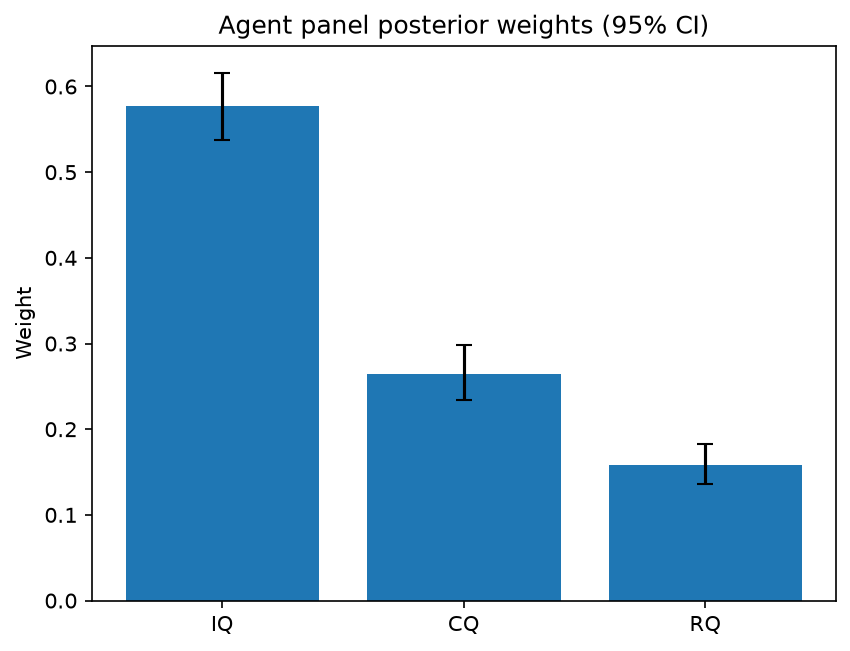

# Survey report: TrustRouter Agentic Full Panel (phi4:14b) -- Level L3a: Quality clusters (ISO 25012)

Survey ID: `trustrouter-agentic-full-panel-phi4-14b-2026-09-01-L3a`

## Agent panel

- Agents contributing a valid response: 36
- Classical BWM consistency: 36/36 within threshold

| Criterion | Mean | 95% CI lower | 95% CI upper |
|---|---|---|---|
| IQ | 0.5773 | 0.5378 | 0.6162 |
| CQ | 0.2650 | 0.2342 | 0.2988 |
| RQ | 0.1577 | 0.1358 | 0.1822 |

## Methodology

Each agent independently completed a Best-Worst Method (BWM) comparison: choosing the single most and least important criterion, then rating every criterion's importance relative to those two on a 1-9 scale. Individual responses were solved with the classical BWM linear program (Rezaei, 2015) for a consistency check, and combined across the panel with a hierarchical Bayesian model (Mohammadi and Rezaei, 2020).

36 agent response(s) were accepted into this result.

Every agent's run began with a QA precheck (its stated configuration verified against ground truth) and every accepted answer's self-reported sources were checked against what reference material was actually available to it; see the Per-agent detail section below and this survey's Conversation Log for each agent's specific results. Every response is schema-validated and independently, repeatedly sampled (never a single completion treated as ground truth); see `guardrails.py`. This survey's complete output is covered by a SHA-256 integrity manifest (`integrity_manifest.json`, `SHA256SUMS`), generated once this run finished, so any later alteration to these files is detectable.

### Charts

## Per-agent detail

### bim-coordinator-base-openmanus (`bim-coordinator-base-openmanus`)

- Role: BIM Coordinator
- Model: ollama/phi4:14b
- DID: `did:key:z6MktjVuxsZoffjLx6zYtw8Bf8nm7iULqLcJwyu2VgSuM19E`
- QA precheck: passed
- Sources used: (not reported)

**Answer:** `{"best": "IQ", "worst": "RQ", "best_to_others": {"IQ": 1, "CQ": 7, "RQ": 8}, "others_to_worst": {"RQ": 1, "CQ": 6, "IQ": 8}}`

**Reasoning:**

As a BIM Coordinator with extensive experience managing multi-stakeholder Building Information Models on renovation and new-build projects, my professional judgment leads me to prioritize the quality of data in terms of its intrinsic attributes. Intrinsic Quality (IQ) encompasses accuracy, validity, and uniqueness—attributes that are foundational for ensuring that the information within a BIM model is reliable and can be trusted for decision-making throughout the lifecycle of a building project.

In contrast, while Contextual Quality (CQ), which includes completeness and timeliness, and Representational Quality (RQ), focusing on consistency across sources, are also important, they are secondary to the intrinsic attributes. Without accurate, valid, and unique data, the other qualities cannot be fully realized or trusted. For instance, a complete dataset that is inaccurate or invalid can lead to poor decision-making, and consistent but incorrect information across sources does not improve the quality of decisions made based on that information.

Therefore, in the context of evaluating criteria for their importance in ensuring high-quality data within BIM models, particularly when considering blockchain storage where trust and reliability are paramount, I conclude that Intrinsic Quality (IQ) is the most critical factor. It serves as the foundation upon which other qualities build. On the other hand, while still important, Representational Quality (RQ), though crucial for ensuring consistency across different versions or copies of data, is deemed less immediately impactful than the intrinsic attributes of the data itself.

Best factor: IQ
Worst factor: RQ

This judgment reflects a prioritization based on the foundational importance of having accurate, valid, and unique information in BIM models to support effective decision-making throughout a building's lifecycle. It acknowledges that while all aspects of quality are important for comprehensive data management and utilization, intrinsic qualities form the bedrock upon which other qualities depend.

Reasoning: The choice is grounded in professional experience with BIM projects, where ensuring the accuracy, validity, and uniqueness of information within models is paramount to their utility and trustworthiness. This prioritization aligns with the principles outlined in ISO 25012 regarding data quality, emphasizing the foundational role of intrinsic qualities.

Given the prioritization of Intrinsic Quality (IQ) as the most critical factor for ensuring high-quality data within BIM models, and Representational Quality (RQ) as the least critical among the three factors discussed, my ratings reflect the relative importance of these criteria in supporting effective decision-making and trustworthiness of data.

- **IQ vs CQ**: Intrinsic Quality is foundational to the reliability and utility of data. Without accurate, valid, and unique information, other qualities such as completeness (part of Contextual Quality) cannot be fully leveraged or trusted. Therefore, IQ is deemed significantly more important than CQ in ensuring the overall quality of data within BIM models. Rating: 7

- **IQ vs RQ**: Similarly, while Representational Quality ensures consistency across different versions or copies of data, it is secondary to the intrinsic attributes of the data itself. Inaccurate, invalid, or non-unique information cannot be made reliable simply through consistent representation. Thus, IQ is considered extremely more important than RQ. Rating: 8

- **CQ vs RQ**: Between Contextual Quality and Representational Quality, CQ is more critical because completeness and timeliness of data directly impact the ability to make informed decisions at any given point in time. While consistency (RQ) is important for ensuring that different versions or copies of data agree with each other, it does not outweigh the importance of having complete and timely information available. Therefore, CQ is rated as more important than RQ. Rating: 6

These ratings are grounded in professional experience and understanding of the foundational role that intrinsic qualities play in the utility and trustworthiness of BIM models.

IQ vs CQ: 7  
IQ vs RQ: 8  
CQ vs RQ: 6

### bim-coordinator-base-openmanus (`bim-coordinator-base-openmanus`)

- Role: BIM Coordinator
- Model: ollama/phi4:14b
- DID: `did:key:z6MktjVuxsZoffjLx6zYtw8Bf8nm7iULqLcJwyu2VgSuM19E`
- QA precheck: passed
- Sources used: (not reported)

**Answer:** `{"best": "IQ", "worst": "RQ", "best_to_others": {"IQ": 1, "CQ": 7, "RQ": 9}, "others_to_worst": {"RQ": 1, "CQ": 5, "IQ": 9}}`

**Reasoning:**

Best factor: IQ  
Worst factor: RQ  

**Reasoning:**  
As a BIM coordinator with extensive experience in managing multi-stakeholder Building Information Models, I prioritize Intrinsic Quality (IQ) because it directly impacts the accuracy, validity, and uniqueness of data, which are critical for ensuring reliable models and decision-making. Contextual Quality (CQ), while important for completeness and timeliness, is secondary to having fundamentally sound data. Representational Quality (RQ), focusing on consistency across sources, is least crucial in this context because discrepancies can often be managed or reconciled during the modeling process, whereas intrinsic errors cannot.

IQ vs CQ: 7  
IQ vs RQ: 9  
CQ vs RQ: 5  

**Reasoning:**  
- **IQ vs CQ (7):** Intrinsic Quality is significantly more important than Contextual Quality because the foundational accuracy and validity of data are paramount. While completeness and timeliness are necessary, they cannot compensate for fundamentally flawed or inaccurate data.
  
- **IQ vs RQ (9):** Intrinsic Quality is extremely more important compared to Representational Quality. Ensuring that the data itself is accurate, valid, and unique takes precedence over consistency across sources, as intrinsic errors can lead to major issues in modeling and decision-making.

- **CQ vs RQ (5):** Contextual Quality is moderately more important than Representational Quality. While having complete and timely information is crucial for effective use of data, the ability to reconcile inconsistencies across different representations is less critical if the underlying data quality is high.

### bim-coordinator-base-openmanus (`bim-coordinator-base-openmanus`)

- Role: BIM Coordinator
- Model: ollama/phi4:14b
- DID: `did:key:z6MktjVuxsZoffjLx6zYtw8Bf8nm7iULqLcJwyu2VgSuM19E`
- QA precheck: passed
- Sources used: (not reported)

**Answer:** `{"best": "IQ", "worst": "RQ", "best_to_others": {"IQ": 1, "CQ": 7, "RQ": 9}, "others_to_worst": {"RQ": 1, "CQ": 6, "IQ": 9}}`

**Reasoning:**

**Best factor:** IQ  
**Worst factor:** RQ  

**Reasoning:** Intrinsic Quality (IQ) is paramount because it ensures the data's accuracy, validity, and uniqueness, which are foundational for any trust in construction-project records. Without high intrinsic quality, other aspects like contextual or representational qualities cannot compensate for fundamental inaccuracies or invalidities. Representational Quality (RQ), while important, is considered least critical here as inconsistencies across sources can often be reconciled through cross-referencing and verification processes, whereas poor intrinsic quality undermines the entire dataset's reliability from the outset.

**IQ vs CQ:** 7  
**IQ vs RQ:** 9  
**CQ vs RQ:** 6  

**Reasoning:** Intrinsic Quality (IQ) is rated significantly higher than Contextual Quality (CQ) because the foundational accuracy, validity, and uniqueness of data are critical for trust. IQ's importance over Representational Quality (RQ) is even more pronounced, as fundamental inaccuracies cannot be mitigated by consistency across sources. Contextual Quality (CQ) is considered more important than RQ due to its role in ensuring that the data is complete and timely, which supports decision-making processes, whereas representational inconsistencies can often be resolved through verification.

### bim-coordinator-rag-openmanus (`bim-coordinator-rag-openmanus`)

- Role: BIM Coordinator
- Model: ollama/phi4:14b
- DID: `did:key:z6MkfG5MseccUr21HZSLdPeQrKdR9LQwcXkD4pWXKcUh7U1C`
- QA precheck: passed
- Sources used: (not reported)

**Answer:** `{"best": "IQ", "worst": "RQ", "best_to_others": {"IQ": 1, "CQ": 7, "RQ": 9}, "others_to_worst": {"RQ": 1, "CQ": 6, "IQ": 9}}`

**Reasoning:**

Best factor: IQ  
Worst factor: RQ  

**Reasoning:** Intrinsic Quality (IQ) is crucial as it ensures the data's accuracy, validity, and uniqueness, which are foundational for any reliable BIM model. Without high intrinsic quality, other factors cannot compensate for fundamental errors or inaccuracies in the data. Representational Quality (RQ), while important, is considered less critical than IQ because inconsistencies across sources can often be resolved through standardization practices and do not inherently undermine the core validity of the data itself.

IQ vs CQ: 7  
IQ vs RQ: 9  
CQ vs RQ: 6  

**Reasoning:** 

- **IQ vs CQ (7):** Intrinsic Quality is considered significantly more important than Contextual Quality because the accuracy, validity, and uniqueness of data are fundamental to ensuring that a BIM model is reliable from the start. While completeness and timeliness (CQ) are also crucial, they cannot compensate for foundational inaccuracies or invalid data.

- **IQ vs RQ (9):** Intrinsic Quality is extremely more important than Representational Quality because without accurate and valid data, inconsistencies across sources (RQ) become less relevant. The core integrity of the data must be established before addressing how it is represented across different systems.

- **CQ vs RQ (6):** Contextual Quality is moderately more important than Representational Quality because having complete and timely information ensures that decision-making processes are based on a comprehensive dataset. While consistency across sources is valuable, it is secondary to ensuring the data itself is complete and current.

### bim-coordinator-rag-openmanus (`bim-coordinator-rag-openmanus`)

- Role: BIM Coordinator
- Model: ollama/phi4:14b
- DID: `did:key:z6MkfG5MseccUr21HZSLdPeQrKdR9LQwcXkD4pWXKcUh7U1C`
- QA precheck: passed
- Sources used: (not reported)

**Answer:** `{"best": "IQ", "worst": "RQ", "best_to_others": {"IQ": 1, "CQ": 7, "RQ": 8}, "others_to_worst": {"RQ": 1, "CQ": 6, "IQ": 8}}`

**Reasoning:**

As a BIM coordinator with extensive experience managing multi-stakeholder Building Information Models on renovation and new-build projects, my professional judgement leads me to prioritize the following:

**Best factor:** IQ (Intrinsic Quality)

Reasoning: Intrinsic Quality is paramount because it directly affects the accuracy, validity, and uniqueness of the data. As a BIM coordinator responsible for model federation and clash detection, ensuring that the foundational data is accurate and valid is crucial for effective decision-making and project execution.

**Worst factor:** RQ (Representational Quality)

Reasoning: While consistency across sources is important, it is often less critical than having fundamentally accurate and timely data. In practice, discrepancies in representational quality can sometimes be managed or reconciled through collaboration and verification processes, whereas issues with intrinsic quality can lead to significant project errors.

Best factor: IQ  
Worst factor: RQ

As a BIM coordinator prioritizing the integrity and reliability of construction-project data for blockchain storage, I would rate the importance of these factors as follows:

- **IQ vs CQ:** 7  
  Intrinsic Quality is more important than Contextual Quality because having accurate, valid, and unique data forms the foundation upon which all other quality aspects depend. While completeness and timeliness are crucial, they cannot compensate for fundamentally flawed or inaccurate data.

- **IQ vs RQ:** 8  
  Intrinsic Quality is significantly more critical than Representational Quality. Ensuring that the core data is accurate and valid is essential for any subsequent consistency checks across sources. Without intrinsic quality, representational issues become moot as they rely on the accuracy of the underlying data.

- **CQ vs RQ:** 6  
  Contextual Quality is more important than Representational Quality because having complete and timely information is vital for making informed decisions during a project's lifecycle. While consistency across sources is beneficial, it is secondary to ensuring that all necessary data is available and up-to-date.

### bim-coordinator-rag-openmanus (`bim-coordinator-rag-openmanus`)

- Role: BIM Coordinator
- Model: ollama/phi4:14b
- DID: `did:key:z6MkfG5MseccUr21HZSLdPeQrKdR9LQwcXkD4pWXKcUh7U1C`
- QA precheck: passed
- Sources used: (not reported)

**Answer:** `{"best": "IQ", "worst": "RQ", "best_to_others": {"IQ": 1, "CQ": 7, "RQ": 9}, "others_to_worst": {"RQ": 1, "CQ": 6, "IQ": 9}}`

**Reasoning:**

Based on my professional experience as a BIM Coordinator managing multi-stakeholder Building Information Models, I would prioritize the criteria as follows:

- **Best factor: IQ (Intrinsic Quality)**  
  Intrinsic Quality is paramount because it directly affects the accuracy, validity, and uniqueness of the data. As a BIM coordinator, ensuring that the model data is technically clean and reliable is crucial for effective decision-making throughout the project lifecycle.

- **Worst factor: RQ (Representational Quality)**  
  While consistency across sources is important, in practice, it often becomes secondary to ensuring that the data itself is accurate and complete. Representational quality issues can sometimes be resolved through model reconciliation processes, whereas intrinsic quality issues can have more immediate and severe impacts on project outcomes.

Best factor: IQ  
Worst factor: RQ

Based on the prioritization of factors for construction-project data-trust considerations:

- **IQ vs CQ:** 7  
  Intrinsic Quality is more important than Contextual Quality because accurate, valid, and unique data forms the foundation upon which other qualities are assessed. However, completeness and timeliness (CQ) are still significant.

- **IQ vs RQ:** 9  
  Intrinsic Quality is extremely more important than Representational Quality. Ensuring that the data itself is correct and reliable takes precedence over consistency across sources.

- **CQ vs RQ:** 6  
  Contextual Quality is more important than Representational Quality, as having complete and timely information is crucial for decision-making, though it does not outweigh intrinsic quality issues.

### blockchain-engineer-base-openmanus (`blockchain-engineer-base-openmanus`)

- Role: Blockchain / DLT Engineer
- Model: ollama/phi4:14b
- DID: `did:key:z6Mkt3rBXTsyaURYSmKVDjYBpnSZtGCDZ2onmnLPwD2iWGby`
- QA precheck: passed
- Sources used: (not reported)

**Answer:** `{"best": "IQ", "worst": "RQ", "best_to_others": {"IQ": 1, "CQ": 7, "RQ": 9}, "others_to_worst": {"RQ": 1, "CQ": 5, "IQ": 9}}`

**Reasoning:**

Best factor: IQ  
Worst factor: RQ  

**Reasoning:** Intrinsic Quality (IQ) is foundational for ensuring data accuracy, validity, and uniqueness, which are critical for the reliability of construction-project records on a blockchain. Contextual Quality (CQ) is also important but secondary to having fundamentally accurate and valid data. Representational Quality (RQ), while necessary for consistency across sources, is considered least crucial in this context because it relies on prior assurance that the intrinsic quality of the data is sound. If the data itself is flawed, consistency checks are less meaningful.

IQ vs CQ: 7  
IQ vs RQ: 9  
CQ vs RQ: 5  

**Reasoning:** IQ is rated significantly higher than both CQ and RQ because it directly impacts the fundamental accuracy, validity, and uniqueness of data. The gap between IQ and CQ (rated as 7) reflects that while contextual aspects like completeness and timeliness are important, they cannot compensate for poor intrinsic quality. The larger gap between IQ and RQ (rated as 9) underscores that consistency across sources is less critical if the underlying data lacks intrinsic integrity. Finally, CQ is rated moderately higher than RQ (5), indicating that while both are secondary to IQ, having complete and timely data is somewhat more important than ensuring consistency across different versions or copies.

### blockchain-engineer-base-openmanus (`blockchain-engineer-base-openmanus`)

- Role: Blockchain / DLT Engineer
- Model: ollama/phi4:14b
- DID: `did:key:z6Mkt3rBXTsyaURYSmKVDjYBpnSZtGCDZ2onmnLPwD2iWGby`
- QA precheck: passed
- Sources used: (not reported)

**Answer:** `{"best": "IQ", "worst": "RQ", "best_to_others": {"IQ": 1, "CQ": 7, "RQ": 9}, "others_to_worst": {"RQ": 1, "CQ": 6, "IQ": 9}}`

**Reasoning:**

Best factor: IQ  
Worst factor: RQ  

**Reasoning:** Intrinsic Quality (IQ) is foundational for ensuring that the data itself is accurate, valid, and unique, which are critical aspects when considering blockchain storage. Without high intrinsic quality, other factors like contextual or representational quality become less relevant because they depend on the integrity of the underlying data. Representational Quality (RQ), while important, is often more about maintaining consistency across different representations rather than ensuring the core data's reliability and correctness, making it comparatively less critical in this context.

IQ vs CQ: 7  
IQ vs RQ: 9  
CQ vs RQ: 6  

**Reasoning:** Intrinsic Quality (IQ) is rated as significantly more important than Contextual Quality (CQ) because the accuracy, validity, and uniqueness of data are fundamental to its reliability. The rating of 7 reflects this substantial importance. IQ is also considered extremely more important compared to Representational Quality (RQ), hence a rating of 9, since ensuring the core data's integrity outweighs consistency across sources. Contextual Quality (CQ) is rated as moderately more important than RQ with a score of 6, acknowledging that having complete and timely data is crucial but still secondary to intrinsic attributes and slightly less critical than representational aspects in this context.

### blockchain-engineer-base-openmanus (`blockchain-engineer-base-openmanus`)

- Role: Blockchain / DLT Engineer
- Model: ollama/phi4:14b
- DID: `did:key:z6Mkt3rBXTsyaURYSmKVDjYBpnSZtGCDZ2onmnLPwD2iWGby`
- QA precheck: passed
- Sources used: (not reported)

**Answer:** `{"best": "IQ", "worst": "RQ", "best_to_others": {"IQ": 1, "CQ": 7, "RQ": 9}, "others_to_worst": {"RQ": 1, "CQ": 5, "IQ": 9}}`

**Reasoning:**

Based on my professional experience as a Blockchain/DLT Engineer with production experience in permissioned-ledger deployments, I would evaluate the criteria as follows:

**Best factor:** IQ (Intrinsic Quality)

**Reasoning:** Intrinsic Quality is paramount because it directly impacts the accuracy, validity, and uniqueness of data stored on a blockchain. As a DLT engineer, ensuring that the data is accurate and valid from the outset is crucial for maintaining trust in the system. Uniqueness also ensures that each piece of data can be distinctly identified, which is essential for avoiding conflicts or duplications within the ledger.

**Worst factor:** RQ (Representational Quality)

**Reasoning:** While consistency across sources is important, it is often less critical than ensuring the intrinsic quality and contextual relevance of the data. In many blockchain applications, especially those focused on immutable records, the emphasis is placed more heavily on the initial accuracy and completeness of the data rather than its consistency with other versions or copies. Representational Quality becomes secondary when the primary concern is maintaining a trustworthy and accurate ledger.

These assessments are made considering the specific context of evaluating technical feasibility, throughput, and tamper-evidence guarantees in blockchain deployments.

Based on the prioritization of Intrinsic Quality over Contextual and Representational Qualities:

- IQ vs CQ: 7  
  **Reasoning:** Intrinsic Quality is more important than Contextual Quality because ensuring data accuracy, validity, and uniqueness is foundational to trust in blockchain systems. However, completeness and timeliness are also significant, so the difference isn't extreme.

- IQ vs RQ: 9  
  **Reasoning:** Intrinsic Quality is extremely more important than Representational Quality. The initial correctness and uniqueness of data take precedence over consistency across versions or copies, especially in permissioned ledgers where data integrity from the start is crucial.

- CQ vs RQ: 5  
  **Reasoning:** Contextual Quality is moderately more important than Representational Quality. Completeness and timeliness are essential for ensuring that data is relevant and up-to-date, which can be more critical than consistency across different sources in many blockchain applications.

### blockchain-engineer-rag-openmanus (`blockchain-engineer-rag-openmanus`)

- Role: Blockchain / DLT Engineer
- Model: ollama/phi4:14b
- DID: `did:key:z6Mko8hHqpF7sFFLRW2GQFdJtGuQ5oszhR6pSFVQor3f2sFZ`
- QA precheck: passed
- Sources used: (not reported)

**Answer:** `{"best": "IQ", "worst": "RQ", "best_to_others": {"IQ": 1, "CQ": 7, "RQ": 9}, "others_to_worst": {"RQ": 1, "CQ": 5, "IQ": 9}}`

**Reasoning:**

**Reasoning:**  
In evaluating the importance of Intrinsic Quality (IQ), Contextual Quality (CQ), and Representational Quality (RQ) for construction-project records considered for blockchain storage, several factors come into play. IQ encompasses accuracy, validity, and uniqueness, which are foundational to ensuring that data is fundamentally correct and reliable. This is critical in a blockchain context where immutability means errors cannot be easily corrected once recorded.

Contextual Quality (CQ), focusing on completeness and timeliness, ensures the data's relevance and applicability at the time of use. While important, its significance can sometimes be secondary to ensuring that the foundational data itself is correct and unique, as incomplete or untimely data may still serve a purpose if it is fundamentally accurate.

Representational Quality (RQ) deals with consistency across copies, which is vital for maintaining trust in distributed systems like blockchain. However, this assumes that the underlying data (IQ) is already of high quality. Without accuracy and validity at its core, consistent replication only propagates errors or inaccuracies.

Given these considerations, Intrinsic Quality (IQ) stands out as the most critical factor because it underpins the reliability and trustworthiness of the data on a blockchain. Representational Quality (RQ), while important for ensuring consistency across distributed copies, is less foundational than IQ since its effectiveness hinges on the intrinsic accuracy and validity of the data being replicated.

**Best factor:** IQ  
**Worst factor:** RQ

In determining the relative importance of Intrinsic Quality (IQ) compared to Contextual Quality (CQ) and Representational Quality (RQ), we consider the foundational role IQ plays in ensuring data accuracy, validity, and uniqueness. This is crucial for blockchain applications where data immutability means errors cannot be easily corrected.

1. **IQ vs CQ:**  
   - While both are important, IQ is more critical because it ensures that the data itself is fundamentally correct before any other quality aspects can be considered. Without accurate and valid data, completeness or timeliness (CQ) becomes less relevant.
   - Rating: 7

2. **IQ vs RQ:**  
   - Representational Quality relies on the assumption that the data being replicated is already of high intrinsic quality. Therefore, IQ is significantly more important than RQ because it ensures the foundational correctness and reliability of the data.
   - Rating: 9

3. **CQ vs RQ:**  
   - Contextual Quality (completeness and timeliness) is generally more immediately impactful on decision-making processes compared to Representational Quality, which focuses on consistency across copies. However, both are secondary to IQ in terms of foundational importance.
   - Rating: 5

Here are the ratings:

- IQ vs CQ: 7
- IQ vs RQ: 9
- CQ vs RQ: 5

### blockchain-engineer-rag-openmanus (`blockchain-engineer-rag-openmanus`)

- Role: Blockchain / DLT Engineer
- Model: ollama/phi4:14b
- DID: `did:key:z6Mko8hHqpF7sFFLRW2GQFdJtGuQ5oszhR6pSFVQor3f2sFZ`
- QA precheck: passed
- Sources used: (not reported)

**Answer:** `{"best": "IQ", "worst": "RQ", "best_to_others": {"IQ": 1, "CQ": 7, "RQ": 9}, "others_to_worst": {"RQ": 1, "CQ": 5, "IQ": 9}}`

**Reasoning:**

**Reasoning:**  
In evaluating construction-project data for blockchain storage, each quality dimension plays a crucial role. However, Intrinsic Quality (IQ) is paramount because it ensures the foundational accuracy, validity, and uniqueness of the data—critical aspects when considering immutable records on a blockchain. Without high intrinsic quality, any further contextual or representational considerations become moot as they rely on the fundamental integrity of the data itself.

Representational Quality (RQ), while important for ensuring consistency across copies, is considered least critical in this context because it pertains to how well different versions align rather than the core truthfulness and reliability of the original data. In blockchain applications where data immutability and trust are key, having accurate and valid initial inputs takes precedence over maintaining consistent representations.

**Answer:**  
Best factor: IQ  
Worst factor: RQ

**Ratings Explanation:**  
- **IQ vs CQ:** Intrinsic Quality is more important than Contextual Quality because the accuracy, validity, and uniqueness of data are foundational for trust in blockchain applications. Without intrinsic quality, contextual factors like completeness and timeliness cannot be meaningfully assessed or utilized.

- **IQ vs RQ:** Intrinsic Quality is extremely more important than Representational Quality. The core truthfulness and reliability of data take precedence over how consistently it might be represented across different sources, especially since blockchain emphasizes immutable records.

- **CQ vs RQ:** Contextual Quality is moderately more important than Representational Quality. While representational consistency is less critical, having complete and timely data ensures that the information remains relevant and useful for decision-making processes.

**Ratings:**
IQ vs CQ: 7  
IQ vs RQ: 9  
CQ vs RQ: 5

### blockchain-engineer-rag-openmanus (`blockchain-engineer-rag-openmanus`)

- Role: Blockchain / DLT Engineer
- Model: ollama/phi4:14b
- DID: `did:key:z6Mko8hHqpF7sFFLRW2GQFdJtGuQ5oszhR6pSFVQor3f2sFZ`
- QA precheck: passed
- Sources used: (not reported)

**Answer:** `{"best": "IQ", "worst": "RQ", "best_to_others": {"IQ": 1, "CQ": 7, "RQ": 9}, "others_to_worst": {"RQ": 1, "CQ": 5, "IQ": 9}}`

**Reasoning:**

Best factor: IQ  
Worst factor: RQ  

**Reasoning:** Intrinsic Quality (IQ) is paramount for ensuring the accuracy, validity, and uniqueness of construction-project records on a blockchain. These attributes are foundational to trust in data integrity and reliability. Representational Quality (RQ), while important, primarily concerns consistency across copies, which can be managed through robust version control systems. Contextual Quality (CQ) also plays a crucial role but is secondary to the fundamental accuracy and validity provided by IQ.

IQ vs CQ: 7  
IQ vs RQ: 9  
CQ vs RQ: 5  

**Reasoning:** 

- **IQ vs CQ (7):** Intrinsic Quality is significantly more important than Contextual Quality because ensuring the accuracy, validity, and uniqueness of data directly impacts trust in its integrity. While Completeness and Timeliness are crucial for usability and relevance, they rely on the foundational correctness provided by IQ.

- **IQ vs RQ (9):** Representational Quality is less critical compared to Intrinsic Quality. Consistency across sources is important but secondary to ensuring that the data itself is accurate and valid in the first place. Once accuracy is established, consistency can be maintained through technical solutions like version control.

- **CQ vs RQ (5):** Contextual Quality is moderately more important than Representational Quality. Completeness and Timeliness ensure that the data is useful and relevant for decision-making processes, whereas Representational Quality focuses on maintaining uniformity across copies, which is less critical if the original data is not accurate or complete.

### compliance-officer-base-openmanus (`compliance-officer-base-openmanus`)

- Role: Compliance and Regulatory Officer
- Model: ollama/phi4:14b
- DID: `did:key:z6MkhbjMCfTLP5x4Chc2q7Rskakua1JQfKHHRZtyr5dc3r8w`
- QA precheck: passed
- Sources used: (not reported)

**Answer:** `{"best": "RQ", "worst": "CQ", "best_to_others": {"RQ": 1, "IQ": 7, "CQ": 9}, "others_to_worst": {"CQ": 1, "IQ": 5, "RQ": 9}}`

**Reasoning:**

As a facility-management compliance officer responsible for GDPR and construction-regulatory obligations across a building's operational lifecycle, my professional judgement is grounded in ensuring data integrity, regulatory adherence, and the ability to verify information consistently over time. 

**Best factor: RQ (Representational Quality)**

Representational Quality is crucial because it ensures consistency across copies of records, which is vital for maintaining trust in the data over its lifecycle. In a blockchain context, where immutability and traceability are key, having consistent representations of data across different sources helps prevent discrepancies that could lead to compliance issues or misinterpretations.

**Worst factor: CQ (Contextual Quality)**

While Contextual Quality is important, it is considered less critical in this comparison because the primary focus for a compliance officer is on the accuracy and consistency of the data itself. Completeness and timeliness are valuable, but they can be managed through processes and updates, whereas inconsistencies in data representation could lead to more severe issues in terms of regulatory compliance and trustworthiness.

**Reasoning:**

- **RQ's importance**: Ensures that all versions of a record agree, which is essential for audit trails and maintaining the integrity of data over time.
- **CQ's relative lower priority**: While completeness and timeliness are important, they can be addressed through regular updates and checks, whereas inconsistencies in representation could undermine trust and compliance.

Best factor: RQ  
Worst factor: CQ

As a facility-management compliance officer responsible for GDPR and construction-regulatory obligations across a building's operational lifecycle, my ratings reflect the importance of ensuring data integrity and consistency over completeness and timeliness.

- **RQ vs IQ**: 7  
  Representational Quality is more important than Intrinsic Quality because consistent representation across sources ensures that all stakeholders have access to the same information, which is crucial for compliance and trust. However, intrinsic accuracy and validity are still highly significant.

- **RQ vs CQ**: 9  
  Representational Quality is extremely more important than Contextual Quality in this context. Consistency across data representations is critical for maintaining reliable audit trails and ensuring that all versions of a record agree, which is vital for regulatory compliance.

- **IQ vs CQ**: 5  
  Intrinsic Quality is moderately more important than Contextual Quality. While accuracy and validity are essential, they can be managed through processes, whereas issues with completeness and timeliness, though significant, are less critical compared to ensuring consistent data representation.

These ratings reflect the priority of maintaining trust and compliance in data management over its lifecycle.

### compliance-officer-base-openmanus (`compliance-officer-base-openmanus`)

- Role: Compliance and Regulatory Officer
- Model: ollama/phi4:14b
- DID: `did:key:z6MkhbjMCfTLP5x4Chc2q7Rskakua1JQfKHHRZtyr5dc3r8w`
- QA precheck: passed
- Sources used: (not reported)

**Answer:** `{"best": "CQ", "worst": "RQ", "best_to_others": {"CQ": 1, "IQ": 8, "RQ": 7}, "others_to_worst": {"RQ": 1, "IQ": 6, "CQ": 7}}`

**Reasoning:**

As a facility-management compliance officer responsible for GDPR and construction-regulatory obligations across a building's operational lifecycle, my professional judgment is guided by the need to ensure data integrity and reliability throughout the entire lifecycle of a building. This includes ensuring that records are accurate, complete, and consistent over time.

**Best factor: CQ (Contextual Quality)**

In the context of managing compliance and regulatory obligations, Contextual Quality is paramount because it encompasses completeness and timeliness. Ensuring that data is comprehensive and up-to-date is critical for meeting legal requirements, such as GDPR, and for making informed decisions regarding facility management. Incomplete or outdated information can lead to non-compliance issues and operational inefficiencies.

**Worst factor: RQ (Representational Quality)**

While Representational Quality, which involves consistency across sources, is important, it is considered less critical in this context compared to Contextual Quality. This is because the primary concern for a compliance officer is ensuring that data is complete and timely, rather than just consistent across different records or versions. Inconsistencies can often be resolved through reconciliation processes, whereas incomplete or outdated information poses more immediate risks.

**Reasoning:**

- **CQ's Importance:** Compliance with regulations like GDPR requires comprehensive data that reflects the current state of affairs. Timeliness ensures that decisions are based on the most recent and relevant information.
  
- **RQ's Relative Lesser Importance:** While consistency is important, it is often a secondary concern to ensuring that all necessary data is captured (completeness) and that it reflects the latest updates (timeliness).

In summary, for a compliance officer focused on GDPR and regulatory obligations, Contextual Quality is the most critical factor due to its direct impact on legal compliance and operational decision-making. Representational Quality, while still important, is less critical in comparison.

Best factor: CQ
Worst factor: RQ

As a facility-management compliance officer responsible for GDPR and construction-regulatory obligations, my ratings reflect the importance of ensuring data is complete and timely over other quality factors.

- **CQ vs IQ:** 8  
  Contextual Quality (completeness and timeliness) is significantly more important than Intrinsic Quality (accuracy, validity, uniqueness) because having comprehensive and up-to-date information is crucial for compliance and operational decisions. While accuracy is essential, incomplete or outdated data can lead to severe compliance issues.

- **CQ vs RQ:** 7  
  Contextual Quality is also considerably more critical than Representational Quality (consistency across sources). Consistency is important but secondary to ensuring that all necessary information is captured and current, as inconsistencies can often be reconciled without immediate risk.

- **IQ vs RQ:** 6  
  Intrinsic Quality is somewhat more important than Representational Quality. Accurate and valid data are foundational for making informed decisions, but consistency across sources is less critical compared to ensuring completeness and timeliness.

These ratings reflect the prioritization of having complete and timely information over other quality aspects in a compliance-focused role.

CQ vs IQ: 8  
CQ vs RQ: 7  
IQ vs RQ: 6

### compliance-officer-base-openmanus (`compliance-officer-base-openmanus`)

- Role: Compliance and Regulatory Officer
- Model: ollama/phi4:14b
- DID: `did:key:z6MkhbjMCfTLP5x4Chc2q7Rskakua1JQfKHHRZtyr5dc3r8w`
- QA precheck: passed
- Sources used: (not reported)

**Answer:** `{"best": "CQ", "worst": "RQ", "best_to_others": {"CQ": 1, "IQ": 7, "RQ": 8}, "others_to_worst": {"RQ": 1, "IQ": 5, "CQ": 8}}`

**Reasoning:**

As a facility-management compliance officer responsible for GDPR and construction-regulatory obligations across a building's operational lifecycle, my professional judgment is grounded in the need to ensure data integrity and regulatory adherence. 

**Best factor:** CQ (Contextual Quality)

**Worst factor:** RQ (Representational Quality)

**Reasoning:**

- **CQ (Contextual Quality)** is prioritized as the best factor because it encompasses completeness and timeliness, which are crucial for ensuring that data meets regulatory requirements and serves its intended purpose effectively. In the context of GDPR and construction regulations, having complete and timely data is essential for compliance and decision-making.

- **RQ (Representational Quality)** is considered the least important in this comparison because, while consistency across sources is valuable, it is secondary to ensuring that the data itself is complete and current. In a regulatory context, the accuracy of data representation can often be addressed through reconciliation processes if initial completeness and timeliness are ensured.

This judgment reflects the specific needs of my role, focusing on compliance and operational effectiveness over mere consistency in data representation.

As a facility-management compliance officer focusing on GDPR and construction-regulatory obligations, my ratings reflect the prioritization of data completeness and timeliness over intrinsic accuracy and consistency across sources. Here are the ratings:

- **CQ vs IQ:** 7  
  Contextual Quality is more important than Intrinsic Quality because having complete and timely data ensures regulatory compliance and operational effectiveness.

- **CQ vs RQ:** 8  
  Contextual Quality is significantly more important than Representational Quality, as ensuring data completeness and timeliness directly impacts compliance and decision-making processes.

- **IQ vs RQ:** 5  
  Intrinsic Quality is moderately more important than Representational Quality, as accurate and valid data are essential, but they are secondary to having complete and timely information.

### compliance-officer-rag-openmanus (`compliance-officer-rag-openmanus`)

- Role: Compliance and Regulatory Officer
- Model: ollama/phi4:14b
- DID: `did:key:z6MknnPyULv317BzskfxgnYty22cc5A3AddPeVZZsocVNgeY`
- QA precheck: passed
- Sources used: (not reported)

**Answer:** `{"best": "IQ", "worst": "RQ", "best_to_others": {"IQ": 1, "CQ": 7, "RQ": 9}, "others_to_worst": {"RQ": 1, "CQ": 6, "IQ": 9}}`

**Reasoning:**

**Reasoning:**

As a facility-management compliance officer responsible for GDPR and construction-regulatory obligations across a building's operational lifecycle, my focus is on ensuring data integrity and regulatory adherence. The criteria provided are:

- **IQ (Intrinsic Quality):** This includes accuracy, validity, and uniqueness of the data. For compliance purposes, having accurate and valid data is crucial to meet legal standards and ensure that decisions based on this data are reliable.

- **CQ (Contextual Quality):** Completeness and timeliness are key here. In a regulatory context, it's essential that all necessary information is available when needed, especially for audits or compliance checks.

- **RQ (Representational Quality):** Consistency across sources ensures that the same data is represented uniformly in different systems, which is vital for maintaining trust and avoiding discrepancies during audits or reviews.

Given these considerations:

- **Best factor: IQ (Intrinsic Quality)** - Ensuring data accuracy, validity, and uniqueness is paramount for compliance with GDPR and other regulations. Accurate data forms the foundation of all regulatory reporting and decision-making processes.

- **Worst factor: RQ (Representational Quality)** - While consistency is important, it is less critical than ensuring the intrinsic quality of the data itself. Inconsistencies can often be managed or reconciled if the underlying data is accurate and complete.

**Answer:**

Best factor: IQ  
Worst factor: RQ

**Ratings:**

- **IQ vs CQ:** 7  
  Intrinsic Quality is more important than Contextual Quality because the accuracy, validity, and uniqueness of data are foundational for compliance. While completeness and timeliness (Contextual Quality) are also crucial, they rely on having accurate and valid data to begin with.

- **IQ vs RQ:** 9  
  Intrinsic Quality is extremely more important than Representational Quality. Ensuring that the data itself is accurate, valid, and unique takes precedence over how consistently it is represented across different systems. Without intrinsic quality, consistency becomes irrelevant as decisions based on incorrect or invalid data can lead to compliance failures.

- **CQ vs RQ:** 6  
  Contextual Quality is more important than Representational Quality because having complete and timely information is critical for meeting regulatory requirements and making informed decisions. While consistency across sources is valuable, it is secondary to ensuring that the necessary data is available when needed.

### compliance-officer-rag-openmanus (`compliance-officer-rag-openmanus`)

- Role: Compliance and Regulatory Officer
- Model: ollama/phi4:14b
- DID: `did:key:z6MknnPyULv317BzskfxgnYty22cc5A3AddPeVZZsocVNgeY`
- QA precheck: passed
- Sources used: (not reported)

**Answer:** `{"best": "IQ", "worst": "RQ", "best_to_others": {"IQ": 1, "CQ": 7, "RQ": 9}, "others_to_worst": {"RQ": 1, "CQ": 5, "IQ": 9}}`

**Reasoning:**

**Reasoning:**

As a facility-management compliance officer responsible for GDPR and construction-regulatory obligations across a building's operational lifecycle, my focus is on ensuring data quality that supports regulatory compliance and effective management. 

1. **Intrinsic Quality (IQ)** involves accuracy, validity, and uniqueness of the data. For compliance purposes, having accurate and valid data is crucial to ensure that all records meet legal standards and can be relied upon for decision-making processes.

2. **Contextual Quality (CQ)** includes completeness and timeliness. While important, especially in ensuring that data covers all necessary aspects and is up-to-date, it may not always directly impact compliance as critically as intrinsic quality does.

3. **Representational Quality (RQ)** pertains to consistency across sources. This ensures that different datasets or records align with each other, which is vital for maintaining trustworthiness but might be less immediately critical than the accuracy and validity of data itself in regulatory contexts.

Given these considerations, **Intrinsic Quality (IQ)** is deemed most important because it directly affects compliance by ensuring data integrity and reliability. On the other hand, while still significant, **Representational Quality (RQ)** may be considered least critical compared to intrinsic aspects when focusing strictly on compliance obligations.

**Answer:**

Best factor: IQ  
Worst factor: RQ

Given the importance of Intrinsic Quality (IQ) for compliance and data integrity, it is rated as significantly more important than both Contextual Quality (CQ) and Representational Quality (RQ). Contextual Quality (CQ), while crucial, does not outweigh IQ in terms of immediate regulatory impact. Similarly, Representational Quality (RQ) is considered less critical compared to IQ for compliance purposes.

Here are the ratings:

IQ vs CQ: 7  
IQ vs RQ: 9  
CQ vs RQ: 5  

These ratings reflect that while all factors are important, IQ holds a higher priority in ensuring data meets regulatory standards.

### compliance-officer-rag-openmanus (`compliance-officer-rag-openmanus`)

- Role: Compliance and Regulatory Officer
- Model: ollama/phi4:14b
- DID: `did:key:z6MknnPyULv317BzskfxgnYty22cc5A3AddPeVZZsocVNgeY`
- QA precheck: passed
- Sources used: (not reported)

**Answer:** `{"best": "IQ", "worst": "RQ", "best_to_others": {"IQ": 1, "CQ": 7, "RQ": 9}, "others_to_worst": {"RQ": 1, "CQ": 6, "IQ": 9}}`

**Reasoning:**

**Best factor:** IQ  
**Worst factor:** RQ  

**Reasoning:** 

As a facility-management compliance officer responsible for GDPR and construction-regulatory obligations, the **Intrinsic Quality (IQ)** is paramount. This cluster includes accuracy, validity, and uniqueness—critical aspects when ensuring that data complies with legal standards and regulatory requirements. Accurate and valid data are essential to meet GDPR mandates, such as the right to erasure and data protection principles.

The **Contextual Quality (CQ)**, which encompasses completeness and timeliness, is also important but secondary to intrinsic quality in this context. While having complete and timely data is beneficial for operational efficiency and regulatory compliance, it does not directly impact the fundamental correctness of the data itself.

**Representational Quality (RQ)**, focusing on consistency across sources, is deemed least critical here. Although consistency is valuable, especially when managing multiple records or versions, it is less immediately impactful than ensuring that each piece of data is accurate and valid in the first place. In scenarios involving GDPR compliance and construction regulations, the primary concern is whether the individual data points are correct and legally compliant, rather than their consistency across different datasets.

This prioritization aligns with the guidance from sources like "Data Management Challenges in Blockchain-Based Applications," which emphasizes using traditional databases for high-throughput OLTP workloads where intrinsic quality is crucial. Additionally, GDPR's right to erasure underscores the importance of data accuracy and validity over mere consistency.

**IQ vs CQ:** 7  
**IQ vs RQ:** 9  
**CQ vs RQ:** 6  

**Reasoning:**

- **IQ vs CQ (7):** Intrinsic Quality is more important than Contextual Quality because ensuring data accuracy, validity, and uniqueness directly impacts compliance with GDPR and construction regulations. While completeness and timeliness are significant for operational purposes, they do not outweigh the necessity of having fundamentally correct data.

- **IQ vs RQ (9):** Intrinsic Quality is extremely more important than Representational Quality. The correctness and legal compliance of individual data points take precedence over consistency across sources. For GDPR and construction regulations, ensuring each piece of data is accurate and valid is crucial, whereas consistency is a secondary concern.

- **CQ vs RQ (6):** Contextual Quality is moderately more important than Representational Quality. Complete and timely data are essential for effective decision-making and regulatory compliance processes, making them more critical than merely having consistent data across sources. However, this difference is not as pronounced as the importance of intrinsic quality over representational quality.

### data-engineer-base-openmanus (`data-engineer-base-openmanus`)

- Role: Data Engineering Specialist
- Model: ollama/phi4:14b
- DID: `did:key:z6Mki7K9yLK1ZtQHSWo1JxgRRhYwtrQJcjwzJ7o4PZnNF83i`
- QA precheck: passed
- Sources used: (not reported)

**Answer:** `{"best": "IQ", "worst": "RQ", "best_to_others": {"IQ": 1, "CQ": 7, "RQ": 9}, "others_to_worst": {"RQ": 1, "CQ": 5, "IQ": 9}}`

**Reasoning:**

**Reasoning:**

As a Data Engineering Specialist responsible for data quality pipelines and provenance tracking in construction-project datasets, I must evaluate the importance of each quality cluster (Intrinsic Quality - IQ, Contextual Quality - CQ, Representational Quality - RQ) based on their impact on data trustworthiness.

1. **Intrinsic Quality (IQ)**: This encompasses accuracy, validity, and uniqueness. In my role, ensuring that data is accurate and valid is paramount because incorrect or invalid data can lead to significant errors in decision-making processes, impacting project timelines and costs. Uniqueness ensures there are no duplicate records, which could skew analysis.

2. **Contextual Quality (CQ)**: This includes completeness and timeliness. Completeness ensures that all necessary information is present for the dataset's intended use, while timeliness ensures data is current and relevant. In construction projects, having complete and timely data is crucial for effective project management and compliance with regulatory requirements.

3. **Representational Quality (RQ)**: This involves consistency across sources. Consistency is important to ensure that different datasets or versions of the same dataset do not conflict, which could lead to confusion or errors in interpretation.

**Comparison:**

- **IQ vs. CQ**: While both are critical, IQ is foundational because if data lacks accuracy and validity, completeness and timeliness become moot points.
  
- **IQ vs. RQ**: Consistency is important, but it assumes that the underlying data is accurate and valid to begin with.

- **CQ vs. RQ**: Completeness and timeliness are crucial for operational effectiveness, but they rely on the foundational accuracy and validity provided by IQ.

**Conclusion:**

Given the critical nature of ensuring data is fundamentally correct and reliable, I determine that Intrinsic Quality (IQ) is the most important factor. Representational Quality (RQ), while necessary, is less critical than ensuring the data's intrinsic properties are sound.

Best factor: **IQ**
Worst factor: **RQ**

**Reasoning:**

To determine the ratings on a 1-9 scale for each pairwise comparison, I need to assess how much more important one factor is compared to another based on their impact on data quality and trustworthiness in construction-project datasets.

1. **IQ vs CQ**: Intrinsic Quality (accuracy, validity, uniqueness) forms the foundation of reliable data. Without accurate and valid data, completeness and timeliness cannot be effectively utilized. Therefore, IQ is significantly more important than CQ.

2. **IQ vs RQ**: Representational Quality (consistency across sources) depends on the accuracy and validity of the underlying data. If the data itself is flawed, consistency becomes irrelevant. Thus, IQ is much more critical than RQ.

3. **CQ vs RQ**: Contextual Quality (completeness and timeliness) directly affects operational effectiveness and decision-making in real-time scenarios. While representational quality ensures consistency, it does not outweigh the necessity of having complete and timely data for immediate use. Therefore, CQ is more important than RQ.

**Ratings:**

- **IQ vs CQ**: Given the foundational importance of IQ over CQ, I rate this as 7.
- **IQ vs RQ**: The critical nature of accurate and valid data makes IQ far more important than RQ, so I rate this as 9.
- **CQ vs RQ**: Completeness and timeliness are crucial for operational effectiveness, making CQ more important than RQ, rated at 5.

IQ vs CQ: 7  
IQ vs RQ: 9  
CQ vs RQ: 5

### data-engineer-base-openmanus (`data-engineer-base-openmanus`)

- Role: Data Engineering Specialist
- Model: ollama/phi4:14b
- DID: `did:key:z6Mki7K9yLK1ZtQHSWo1JxgRRhYwtrQJcjwzJ7o4PZnNF83i`
- QA precheck: passed
- Sources used: (not reported)

**Answer:** `{"best": "IQ", "worst": "RQ", "best_to_others": {"IQ": 1, "CQ": 7, "RQ": 9}, "others_to_worst": {"RQ": 1, "CQ": 5, "IQ": 9}}`

**Reasoning:**

As a Data Engineering Specialist responsible for data quality pipelines, provenance tracking, and polyglot-persistence routing decisions on construction-project datasets, I must evaluate the importance of Intrinsic Quality (IQ), Contextual Quality (CQ), and Representational Quality (RQ) in terms of their impact on blockchain storage.

**Best factor: IQ**

Intrinsic Quality is paramount because it directly affects the accuracy, validity, and uniqueness of data. These attributes are foundational for ensuring that the data itself is reliable and trustworthy before considering its context or representation across sources. In construction-project datasets, where precision is crucial, having accurate and valid data ensures that decisions based on this data are sound.

**Worst factor: RQ**

Representational Quality, while important, is considered less critical in comparison to IQ and CQ for blockchain storage. Consistency across sources is valuable, but if the intrinsic attributes of the data (accuracy, validity) or its contextual relevance (completeness, timeliness) are compromised, consistency becomes secondary. In a blockchain context, ensuring that the core data is inherently trustworthy takes precedence over verifying its uniformity across different representations.

**Reasoning:**

- **IQ's Importance:** The intrinsic attributes of data ensure that it is fundamentally sound and reliable. For construction projects, where errors can lead to significant financial and safety implications, having accurate and valid data is crucial.
  
- **CQ's Role:** Contextual Quality ensures the data is complete and timely, which is essential for making informed decisions in a dynamic project environment.

- **RQ's Relative Lesser Importance:** While consistency across sources (RQ) is important for maintaining uniformity, it assumes that the intrinsic and contextual qualities are already met. In blockchain storage, where immutability and trust are key, ensuring data integrity at its core (IQ) is more critical than verifying its consistency across different versions or copies.

This reasoning aligns with my professional judgment as a Data Engineering Specialist focused on maintaining high-quality data standards in construction-project datasets.
Best factor: IQ
Worst factor: RQ

As a Data Engineering Specialist focusing on data quality pipelines and provenance tracking for construction-project datasets, I must evaluate the relative importance of Intrinsic Quality (IQ), Contextual Quality (CQ), and Representational Quality (RQ) using a 1-9 scale.

**IQ vs CQ: 7**

Intrinsic Quality is more important than Contextual Quality because it ensures that the data itself is accurate, valid, and unique. These foundational attributes are critical for ensuring that any subsequent analysis or decision-making based on this data is reliable. While completeness and timeliness (CQ) are also crucial, they assume that the intrinsic properties of the data are already sound.

**IQ vs RQ: 9**

Intrinsic Quality is extremely more important than Representational Quality. The accuracy, validity, and uniqueness of data form the bedrock upon which all other qualities depend. Consistency across sources (RQ) is valuable but secondary to ensuring that the core data itself is trustworthy and reliable.

**CQ vs RQ: 5**

Contextual Quality is moderately more important than Representational Quality. Completeness and timeliness ensure that the data is relevant and up-to-date for decision-making processes, which is crucial in dynamic environments like construction projects. While consistency across sources (RQ) is beneficial, it does not outweigh the necessity of having complete and timely data.

These ratings reflect my professional judgment as a Data Engineering Specialist tasked with ensuring high-quality data standards in construction-project datasets.
IQ vs CQ: 7
IQ vs RQ: 9
CQ vs RQ: 5

### data-engineer-base-openmanus (`data-engineer-base-openmanus`)

- Role: Data Engineering Specialist
- Model: ollama/phi4:14b
- DID: `did:key:z6Mki7K9yLK1ZtQHSWo1JxgRRhYwtrQJcjwzJ7o4PZnNF83i`
- QA precheck: passed
- Sources used: (not reported)

**Answer:** `{"best": "IQ", "worst": "RQ", "best_to_others": {"IQ": 1, "CQ": 7, "RQ": 9}, "others_to_worst": {"RQ": 1, "CQ": 5, "IQ": 9}}`

**Reasoning:**

As a data engineering specialist responsible for ensuring high-quality construction-project datasets, my evaluation focuses on how each quality cluster impacts the overall integrity and usability of the data. 

**Intrinsic Quality (IQ)** encompasses accuracy, validity, and uniqueness. This is foundational because if the data itself is incorrect or duplicated, it undermines all other aspects of quality. Ensuring that values are accurate and unique is crucial for maintaining trust in the dataset's reliability.

**Contextual Quality (CQ)** involves completeness and timeliness. While important, these factors depend on the intrinsic accuracy of the data. If the data is not fundamentally correct, its completeness or timeliness becomes less relevant.

**Representational Quality (RQ)** pertains to consistency across sources. This is vital for datasets that are aggregated from multiple origins, ensuring that different versions align and do not contradict each other. However, if the intrinsic quality is compromised, consistent representation of incorrect data is still problematic.

Given these considerations, **Intrinsic Quality** is paramount because it forms the basis upon which all other qualities depend. Without accurate and valid data, efforts to ensure completeness or consistency are less meaningful. Conversely, while Representational Quality is critical for datasets with multiple sources, it ranks lower than Intrinsic Quality in terms of foundational importance.

Therefore, my judgment is:

Best factor: IQ  
Worst factor: RQ

Based on my assessment of the importance of each quality cluster:

- **Intrinsic Quality (IQ)** is foundational, as it ensures that data values are accurate and valid. Without this, other qualities like completeness or consistency cannot be effectively evaluated.
  
- **Contextual Quality (CQ)** is important for ensuring that data is complete and timely, but its significance is contingent on the intrinsic accuracy of the data.

- **Representational Quality (RQ)** ensures consistency across sources, which is crucial when dealing with datasets from multiple origins. However, if the underlying data lacks intrinsic quality, consistent representation of incorrect data remains problematic.

Given these considerations:

- IQ vs CQ: 7  
  Intrinsic Quality is significantly more important than Contextual Quality because accurate and valid data is essential for any further analysis or decision-making.

- IQ vs RQ: 9  
  Intrinsic Quality is extremely more important than Representational Quality, as the foundation of data integrity must be established before ensuring consistency across sources.

- CQ vs RQ: 5  
  Contextual Quality is moderately more important than Representational Quality. While both are crucial for comprehensive data quality, completeness and timeliness have a slight edge over consistency when intrinsic accuracy is assured.

### data-engineer-rag-openmanus (`data-engineer-rag-openmanus`)

- Role: Data Engineering Specialist
- Model: ollama/phi4:14b
- DID: `did:key:z6MknK7Wf8f8fYivwnqnYqEAWe9mzXYdboRjVXTZ5FKNGt3J`
- QA precheck: passed
- Sources used: (not reported)

**Answer:** `{"best": "IQ", "worst": "RQ", "best_to_others": {"IQ": 1, "CQ": 7, "RQ": 9}, "others_to_worst": {"RQ": 1, "CQ": 7, "IQ": 9}}`

**Reasoning:**

**Reasoning:**

As a Data Engineering Specialist responsible for data quality pipelines and polyglot-persistence routing decisions on construction-project datasets, I must consider the specific needs of these datasets when evaluating the importance of different quality clusters.

1. **Intrinsic Quality (IQ):** This includes accuracy, validity, and uniqueness. In construction projects, ensuring that data is accurate and valid is crucial because errors can lead to significant financial losses or safety issues. Uniqueness ensures that each dataset entry is distinct, preventing duplication errors in project management systems.

2. **Contextual Quality (CQ):** This involves completeness and timeliness. Completeness ensures all necessary information is captured for decision-making processes, while timeliness ensures data is available when needed. In construction projects, timely and complete data is essential for maintaining schedules and budgets.

3. **Representational Quality (RQ):** This focuses on consistency across copies. While important, representational quality is often a consequence of good intrinsic and contextual quality practices. Ensuring that different versions of the dataset agree is vital but typically follows from ensuring accuracy and completeness.

Given these considerations, Intrinsic Quality (IQ) is likely the most critical factor because it directly impacts the reliability and correctness of data, which are foundational for all subsequent processes in construction projects. Representational Quality (RQ), while important, is often a secondary concern that depends on the other two factors being adequately addressed.

**Answer:**

Best factor: IQ  
Worst factor: RQ

Based on the reasoning provided:

- **Intrinsic Quality (IQ) vs Contextual Quality (CQ):** IQ is more important because it ensures data accuracy, validity, and uniqueness, which are foundational for reliable decision-making. However, CQ is also crucial as completeness and timeliness directly affect project execution. Therefore, I would rate this comparison as moderately more important.

  **IQ vs CQ: 7**

- **Intrinsic Quality (IQ) vs Representational Quality (RQ):** IQ is significantly more critical because it ensures the fundamental correctness of data, which underpins all other quality aspects. RQ, while necessary for consistency, is secondary to having accurate and valid data.

  **IQ vs RQ: 9**

- **Contextual Quality (CQ) vs Representational Quality (RQ):** CQ is more important than RQ because completeness and timeliness are essential for operational effectiveness in construction projects. RQ ensures consistency but relies on the other two factors being adequately addressed first.

  **CQ vs RQ: 7**

These ratings reflect the prioritization of ensuring data accuracy, validity, uniqueness, completeness, and timeliness over mere consistency across copies.

### data-engineer-rag-openmanus (`data-engineer-rag-openmanus`)

- Role: Data Engineering Specialist
- Model: ollama/phi4:14b
- DID: `did:key:z6MknK7Wf8f8fYivwnqnYqEAWe9mzXYdboRjVXTZ5FKNGt3J`
- QA precheck: passed
- Sources used: (not reported)

**Answer:** `{"best": "IQ", "worst": "RQ", "best_to_others": {"IQ": 1, "CQ": 7, "RQ": 8}, "others_to_worst": {"RQ": 1, "CQ": 6, "IQ": 8}}`

**Reasoning:**

Based on my role as a Data Engineering Specialist responsible for data quality pipelines and considering the specific context of construction-project datasets:

- **Intrinsic Quality (IQ)** is foundational because it directly affects the accuracy, validity, and uniqueness of the data. These attributes are critical in ensuring that the data itself is reliable before any further processing or analysis.

- **Contextual Quality (CQ)**, while important for completeness and timeliness, often depends on the intrinsic quality being sound first. Without accurate data, completeness and timeliness may be less relevant.

- **Representational Quality (RQ)** focuses on consistency across sources, which is crucial but typically secondary to ensuring that the data itself is intrinsically correct.

Given these considerations:

Best factor: IQ  
Worst factor: RQ

Based on the analysis of the factors:

- **Intrinsic Quality (IQ) vs Contextual Quality (CQ):** IQ is more important because it ensures that the data is accurate, valid, and unique. Without intrinsic quality, contextual aspects like completeness and timeliness are less meaningful.
  
  Rating: 7

- **Intrinsic Quality (IQ) vs Representational Quality (RQ):** IQ is significantly more critical as it forms the basis of all other qualities. Consistency across sources is important but secondary to having accurate and valid data.

  Rating: 8

- **Contextual Quality (CQ) vs Representational Quality (RQ):** CQ is generally more important than RQ because ensuring that data is complete and timely can have a direct impact on decision-making processes, whereas consistency across sources is crucial but often follows from intrinsic accuracy.

  Rating: 6

Here are the ratings in the specified format:

IQ vs CQ: 7  
IQ vs RQ: 8  
CQ vs RQ: 6

### data-engineer-rag-openmanus (`data-engineer-rag-openmanus`)

- Role: Data Engineering Specialist
- Model: ollama/phi4:14b
- DID: `did:key:z6MknK7Wf8f8fYivwnqnYqEAWe9mzXYdboRjVXTZ5FKNGt3J`
- QA precheck: passed
- Sources used: (not reported)

**Answer:** `{"best": "IQ", "worst": "CQ", "best_to_others": {"IQ": 1, "RQ": 7, "CQ": 9}, "others_to_worst": {"CQ": 1, "RQ": 5, "IQ": 9}}`

**Reasoning:**

**Reasoning:**

In assessing construction-project datasets for blockchain storage, each quality cluster has distinct implications:

- **Intrinsic Quality (IQ)** involves accuracy, validity, and uniqueness. These are foundational attributes that ensure the data itself is correct and reliable. For blockchain applications, where immutability is a key feature, having accurate and valid data is crucial to maintain trust in the system.

- **Contextual Quality (CQ)** includes completeness and timeliness. While these are important for ensuring that datasets are comprehensive and current, they can be more variable depending on the context of use. In blockchain storage, once data is recorded, its immutability means that updates or corrections are not straightforward, making initial accuracy even more critical.

- **Representational Quality (RQ)** focuses on consistency across sources. This ensures that different representations of the same data align, which is vital for interoperability and integration with other systems. However, in blockchain contexts, where data integrity is often verified through cryptographic means, RQ can be seen as less immediately crucial than ensuring the data itself is correct.

Given these considerations, **Intrinsic Quality (IQ)** emerges as the most important factor because it directly impacts the trustworthiness of the data stored on a blockchain. Accurate and valid data ensures that the immutable records are reliable from the outset.

On the other hand, while Contextual Quality (CQ) is significant, its importance can be considered less critical in comparison to IQ for blockchain storage. Once data is entered into a blockchain, its completeness and timeliness become secondary to ensuring it was accurate at the time of entry.

**Answer:**

Best factor: IQ  
Worst factor: CQ

To provide the ratings on a 1-9 scale:

- **IQ vs RQ:** IQ is more important because ensuring data accuracy and validity is crucial for blockchain storage. Representational Quality, while important for consistency, does not outweigh the foundational need for accurate data. Therefore, I would rate this as: **7**

- **IQ vs CQ:** As discussed, Intrinsic Quality is critical for ensuring that the immutable records on a blockchain are reliable from the outset. Contextual Quality, though significant, becomes less crucial once data is recorded immutably. Thus, IQ is much more important than CQ in this context: **9**

- **RQ vs CQ:** Representational Quality ensures consistency across different sources and systems, which is vital for interoperability. However, the immediate importance of ensuring that data entered into a blockchain is accurate (IQ) makes RQ less critical compared to IQ but still more important than CQ in terms of maintaining trustworthiness. Therefore, I would rate this as: **5**

Here are the ratings:

- IQ vs RQ: 7
- IQ vs CQ: 9
- RQ vs CQ: 5

### project-manager-base-openmanus (`project-manager-base-openmanus`)

- Role: Construction Project Manager
- Model: ollama/phi4:14b
- DID: `did:key:z6Mkpbo2bdLzUURLLFBbvXHmY8AEoi5zE6RmFMHBirqEurkd`
- QA precheck: passed
- Sources used: (not reported)

**Answer:** `{"best": "CQ", "worst": "RQ", "best_to_others": {"CQ": 1, "IQ": 7, "RQ": 9}, "others_to_worst": {"RQ": 1, "IQ": 5, "CQ": 9}}`

**Reasoning:**

As a Construction Project Manager responsible for coordinating multi-stakeholder documentation flows across a renovation or new-build project's full lifecycle, I must consider the importance of each quality cluster in ensuring reliable and trustworthy data.

**Best factor: CQ (Contextual Quality)**  
In the context of construction projects, especially those involving long-term assets like hospitals, the timeliness and completeness of information are crucial. Contextual Quality ensures that all necessary data is available when needed and covers the right scope, which is vital for decision-making by institutional owners, insurers, and authorities.

**Worst factor: RQ (Representational Quality)**  
While consistency across sources is important, it is often less critical than ensuring completeness and timeliness. In construction projects, having accurate and complete data at the right time can outweigh the need for perfect consistency across all documents, especially when initial discrepancies can be resolved through project management processes.

These judgments are based on my professional experience in managing documentation flows where timely access to comprehensive information is often a priority over ensuring absolute consistency across all records.

Given the prioritization of Contextual Quality (CQ) over Intrinsic Quality (IQ) and Representational Quality (RQ), here are the ratings:

CQ vs IQ: 7  
CQ vs RQ: 9  
IQ vs RQ: 5  

These ratings reflect that CQ is significantly more important than both IQ and RQ, with a particularly strong emphasis on its importance over RQ. IQ is moderately more important than RQ, aligning with the prioritization of having complete and timely data in construction project management.

### project-manager-base-openmanus (`project-manager-base-openmanus`)

- Role: Construction Project Manager
- Model: ollama/phi4:14b
- DID: `did:key:z6Mkpbo2bdLzUURLLFBbvXHmY8AEoi5zE6RmFMHBirqEurkd`
- QA precheck: passed
- Sources used: (not reported)

**Answer:** `{"best": "CQ", "worst": "RQ", "best_to_others": {"CQ": 1, "IQ": 7, "RQ": 8}, "others_to_worst": {"RQ": 1, "IQ": 5, "CQ": 8}}`

**Reasoning:**

As a construction project manager responsible for coordinating multi-stakeholder documentation flows across a renovation or new-build project's full lifecycle, my professional judgement is grounded in the specific needs of managing diverse and evolving data requirements. 

**Best factor:** CQ (Contextual Quality)

In the context of construction projects, especially those involving multiple stakeholders such as institutional owners, insurers, and authorities, ensuring that documentation is complete and timely is crucial. Contextual Quality addresses these aspects directly by focusing on completeness and timeliness, which are essential for making informed decisions throughout the project lifecycle. Incomplete or outdated information can lead to significant delays, increased costs, and compliance issues.

**Worst factor:** RQ (Representational Quality)

While consistency across sources is important, it is often less critical than ensuring that the data itself is complete and current. Representational Quality deals with how well different versions of data agree, which is a concern more relevant when discrepancies arise rather than as a primary focus. In practice, resolving inconsistencies can be managed through established processes and checks, whereas incomplete or untimely information can have immediate and severe impacts on project outcomes.

This reasoning aligns with the professional role's emphasis on managing documentation flows effectively to support decision-making and compliance across the project lifecycle.

Based on the professional judgement as a construction project manager:

- **CQ vs IQ:** 7  
  Contextual Quality is significantly more important than Intrinsic Quality because ensuring completeness and timeliness of data directly impacts decision-making and compliance, which are critical in managing multi-stakeholder projects.

- **CQ vs RQ:** 8  
  Contextual Quality is extremely more important than Representational Quality. While consistency across sources is valuable, it is secondary to having complete and timely information that stakeholders rely on for project execution and regulatory adherence.

- **IQ vs RQ:** 5  
  Intrinsic Quality is moderately more important than Representational Quality. Accurate, valid, and unique data are essential for the integrity of project documentation, but they do not outweigh the immediate practical needs addressed by Contextual Quality.

### project-manager-base-openmanus (`project-manager-base-openmanus`)

- Role: Construction Project Manager
- Model: ollama/phi4:14b
- DID: `did:key:z6Mkpbo2bdLzUURLLFBbvXHmY8AEoi5zE6RmFMHBirqEurkd`
- QA precheck: passed
- Sources used: (not reported)

**Answer:** `{"best": "IQ", "worst": "RQ", "best_to_others": {"IQ": 1, "CQ": 7, "RQ": 9}, "others_to_worst": {"RQ": 1, "CQ": 5, "IQ": 9}}`

**Reasoning:**

As a Construction Project Manager responsible for coordinating multi-stakeholder documentation flows across a project's full lifecycle, I consider the following:

- **Intrinsic Quality (IQ)** is crucial as it ensures that data is accurate, valid, and unique. This foundational quality is essential for making informed decisions throughout the project.
  
- **Contextual Quality (CQ)**, which includes completeness and timeliness, is vital for ensuring that all necessary information is available when needed. However, without intrinsic accuracy, even complete and timely data can be misleading.

- **Representational Quality (RQ)** ensures consistency across sources, which is important for maintaining trust in the documentation. However, it relies on the foundational integrity provided by IQ.

Given these considerations, I conclude:

Best factor: IQ  
Worst factor: RQ  

Intrinsic Quality is most critical as it underpins all other qualities, while Representational Quality, though important, is less fundamental than ensuring data accuracy and validity.

As a Construction Project Manager evaluating the importance of these quality factors:

- **Intrinsic Quality (IQ)** is foundational, as it ensures data accuracy and validity. Without this, other qualities are less meaningful.
  
- **Contextual Quality (CQ)** is important for ensuring that information is complete and timely, but its value depends on the intrinsic quality of the data.

- **Representational Quality (RQ)**, while necessary for consistency, relies heavily on the foundational accuracy provided by IQ.

Given these considerations, I assign the following ratings:

IQ vs CQ: 7  
IQ vs RQ: 9  
CQ vs RQ: 5  

These ratings reflect that Intrinsic Quality is significantly more important than both Contextual and Representational Qualities, while Contextual Quality is moderately more important than Representational Quality.

### project-manager-rag-openmanus (`project-manager-rag-openmanus`)

- Role: Construction Project Manager
- Model: ollama/phi4:14b
- DID: `did:key:z6MkjmPehzSvYSXaD46cBeezotxqypj5QXmmqiC8HGXfCiqN`
- QA precheck: passed
- Sources used: (not reported)

**Answer:** `{"best": "IQ", "worst": "RQ", "best_to_others": {"IQ": 1, "CQ": 8, "RQ": 9}, "others_to_worst": {"RQ": 1, "CQ": 6, "IQ": 9}}`

**Reasoning:**

**Reasoning:**

As a construction project manager responsible for coordinating documentation flows across a project's lifecycle, I must consider the importance of each quality cluster in ensuring data integrity and trustworthiness. 

- **Intrinsic Quality (IQ)** is crucial because it encompasses accuracy, validity, and uniqueness—fundamental attributes that ensure the data itself is correct and reliable from its inception.
  
- **Contextual Quality (CQ)** involves completeness and timeliness, which are important for ensuring that all necessary information is available when needed. However, even if data is complete and timely, it may not be useful if it lacks intrinsic accuracy or validity.

- **Representational Quality (RQ)** focuses on consistency across sources, which is vital for maintaining trust in the data as it moves through different stages of a project. Nevertheless, without intrinsic quality, consistent but inaccurate data can lead to significant issues.

Given these considerations, Intrinsic Quality (IQ) stands out as the most critical factor because it forms the foundation upon which other qualities depend. Without accurate and valid data, efforts to ensure completeness or consistency are undermined.

Conversely, while Representational Quality (RQ) is important for maintaining trust across different versions of data, its significance pales in comparison to ensuring that the data itself is inherently correct and reliable. Therefore, RQ can be considered the least critical among these three when prioritizing foundational data quality attributes.

**Answer:**

Best factor: IQ  
Worst factor: RQ

To provide the ratings on a scale from 1 to 9, where 1 indicates equal importance and 9 indicates extremely more important, I will consider how each quality cluster compares in terms of their impact on data integrity and trustworthiness within construction project management:

- **IQ vs CQ**: Intrinsic Quality is foundational because it ensures the accuracy, validity, and uniqueness of the data. Contextual Quality, while important for completeness and timeliness, relies on the intrinsic correctness of the data. Therefore, IQ is significantly more critical than CQ.

  Rating: IQ vs CQ: 8

- **IQ vs RQ**: Intrinsic Quality again takes precedence because it ensures that the data itself is correct and reliable. Representational Quality, focusing on consistency across sources, depends on having accurate and valid data to begin with. Thus, IQ is extremely more important than RQ.

  Rating: IQ vs RQ: 9

- **CQ vs RQ**: Contextual Quality (completeness and timeliness) is generally more critical than Representational Quality because having complete and timely information is essential for decision-making in project management. However, consistency across sources is also important but secondary to the completeness of data.

  Rating: CQ vs RQ: 6

These ratings reflect the prioritization of ensuring that data is fundamentally accurate and reliable before addressing its completeness or consistency.

### project-manager-rag-openmanus (`project-manager-rag-openmanus`)

- Role: Construction Project Manager
- Model: ollama/phi4:14b
- DID: `did:key:z6MkjmPehzSvYSXaD46cBeezotxqypj5QXmmqiC8HGXfCiqN`
- QA precheck: passed
- Sources used: (not reported)

**Answer:** `{"best": "IQ", "worst": "RQ", "best_to_others": {"IQ": 1, "CQ": 7, "RQ": 9}, "others_to_worst": {"RQ": 1, "CQ": 5, "IQ": 9}}`

**Reasoning:**

As a construction project manager responsible for coordinating multi-stakeholder documentation flows across a renovation or new-build project's full lifecycle, I must consider the implications of each quality cluster on the trustworthiness and utility of data within blockchain storage. 

**Best factor: IQ (Intrinsic Quality)**

- **Reasoning**: Intrinsic Quality is paramount because it encompasses accuracy, validity, and uniqueness—attributes that are foundational to ensuring that the data itself is reliable and trustworthy from the outset. For a construction project manager, having accurate and valid data is crucial for decision-making processes, compliance with regulations, and maintaining the integrity of the project documentation. The emphasis on intrinsic quality aligns with the need to prevent errors at their source, which can have cascading effects throughout the project lifecycle.

**Worst factor: RQ (Representational Quality)**

- **Reasoning**: While consistency across copies is important, it is considered less critical than ensuring the data's intrinsic attributes are sound. In the context of blockchain storage, where immutability and transparency are inherent features, the focus shifts towards verifying that the initial data input is accurate and valid. Representational quality becomes a secondary concern once the data's intrinsic qualities are assured, as blockchain technology inherently supports consistency through its distributed ledger system.

This prioritization reflects the professional judgment required to manage complex documentation flows in construction projects, ensuring that foundational data integrity is maintained before addressing representational concerns.

As a construction project manager, when evaluating the importance of these quality clusters for blockchain storage:

- **IQ vs CQ**: 7  
  *Reasoning*: Intrinsic Quality (IQ) is more important than Contextual Quality (CQ) because ensuring data accuracy, validity, and uniqueness is foundational. While completeness and timeliness are crucial, they rely on the intrinsic attributes being correct in the first place.

- **IQ vs RQ**: 9  
  *Reasoning*: Intrinsic Quality (IQ) is extremely more important than Representational Quality (RQ). The reliability of data starts with its accuracy and validity. Once these are established, consistency across copies becomes less critical due to blockchain's inherent features.

- **CQ vs RQ**: 5  
  *Reasoning*: Contextual Quality (CQ) is moderately more important than Representational Quality (RQ). Completeness and timeliness directly impact the usability of data in decision-making processes. However, representational consistency is less critical once intrinsic qualities are assured.

These ratings reflect the prioritization necessary for managing construction project documentation effectively within a blockchain framework.

### project-manager-rag-openmanus (`project-manager-rag-openmanus`)

- Role: Construction Project Manager
- Model: ollama/phi4:14b
- DID: `did:key:z6MkjmPehzSvYSXaD46cBeezotxqypj5QXmmqiC8HGXfCiqN`
- QA precheck: passed
- Sources used: (not reported)

**Answer:** `{"best": "IQ", "worst": "RQ", "best_to_others": {"IQ": 1, "CQ": 7, "RQ": 9}, "others_to_worst": {"RQ": 1, "CQ": 5, "IQ": 9}}`

**Reasoning:**

As a Construction Project Manager responsible for coordinating multi-stakeholder documentation flows across a project's full lifecycle, I must evaluate the importance of Intrinsic Quality (IQ), Contextual Quality (CQ), and Representational Quality (RQ) in terms of their impact on trustworthiness and reliability of construction data.

**Best factor: IQ**

Intrinsic Quality is paramount because it directly affects the accuracy, validity, and uniqueness of the data. Accurate and valid data are foundational for making informed decisions throughout a project's lifecycle. Inaccurate or invalid data can lead to significant downstream costs, especially in scenarios like dispute resolution where documentation must be verifiable (as highlighted by Gartoumi 2024). The unique nature of IQ ensures that each piece of data is distinct and correctly identified, which is crucial for maintaining the integrity of project records.

**Worst factor: RQ**

Representational Quality, while important, is considered less critical than IQ in this context. Consistency across copies is essential to ensure that all stakeholders have access to the same information. However, if the data itself lacks intrinsic quality (accuracy and validity), consistency becomes a secondary concern. Intrinsic errors or inaccuracies will propagate through consistent representations, leading to widespread issues. Thus, while RQ supports reliability, it does not address the foundational correctness of the data.

In summary, IQ is prioritized as the most important factor due to its direct impact on decision-making and dispute resolution, whereas RQ is deemed least critical because it relies on the underlying quality of the data itself.

Based on the evaluation of the factors:

- **IQ vs CQ:** 7  
  Intrinsic Quality is more important than Contextual Quality because it ensures the foundational accuracy and validity of data, which are critical for decision-making and dispute resolution.

- **IQ vs RQ:** 9  
  Intrinsic Quality is extremely more important than Representational Quality. Accurate and valid data must be prioritized over consistency across copies, as errors in intrinsic quality will undermine any representational consistency.

- **CQ vs RQ:** 5  
  Contextual Quality is moderately more important than Representational Quality. While both are important for ensuring the timeliness and completeness of data, the context in which data is used (CQ) provides a slight edge over mere consistency across sources (RQ).

### structural-engineer-base-openmanus (`structural-engineer-base-openmanus`)

- Role: Structural Engineer
- Model: ollama/phi4:14b
- DID: `did:key:z6MkizWoj7UcFyDjtZEfhhVDQyaHcaLKVQLeCuoTuX2Bodbu`
- QA precheck: passed
- Sources used: (not reported)

**Answer:** `{"best": "IQ", "worst": "CQ", "best_to_others": {"IQ": 1, "RQ": 7, "CQ": 9}, "others_to_worst": {"CQ": 1, "RQ": 6, "IQ": 9}}`

**Reasoning:**

As a chartered structural engineer responsible for structural-capacity dossiers, my professional judgement emphasizes the importance of data quality in ensuring long-term reliability and trustworthiness. Given the context of blockchain storage for construction-project records:

Best factor: IQ  
Worst factor: CQ  

**Reasoning:** Intrinsic Quality (IQ) is paramount because it ensures that the data is accurate, valid, and unique, which are critical attributes for structural assessments that must remain reliable over decades. Contextual Quality (CQ), while important, is considered less crucial in this scenario compared to IQ, as completeness and timeliness can be more flexible or supplemented through other means once the intrinsic quality is assured. Representational Quality (RQ) remains significant but does not outweigh the foundational importance of IQ for structural data integrity.

Based on the prioritization of Intrinsic Quality (IQ) over Representational Quality (RQ) and Contextual Quality (CQ), here are my ratings:

IQ vs RQ: 7  
IQ vs CQ: 9  
RQ vs CQ: 6  

**Reasoning:**  
- **IQ vs RQ (7):** Intrinsic Quality is significantly more important than Representational Quality because the foundational accuracy, validity, and uniqueness of data are crucial for structural assessments. However, consistency across sources is still valuable.
- **IQ vs CQ (9):** Intrinsic Quality is extremely more important compared to Contextual Quality in this context. While completeness and timeliness are beneficial, they cannot compensate for fundamental inaccuracies or invalidity in the data.
- **RQ vs CQ (6):** Representational Quality is moderately more important than Contextual Quality because ensuring consistency across different sources of structural data helps maintain reliability over time, which is slightly more critical than having complete and timely information.

### structural-engineer-base-openmanus (`structural-engineer-base-openmanus`)

- Role: Structural Engineer
- Model: ollama/phi4:14b
- DID: `did:key:z6MkizWoj7UcFyDjtZEfhhVDQyaHcaLKVQLeCuoTuX2Bodbu`
- QA precheck: passed
- Sources used: (not reported)

**Answer:** `{"best": "IQ", "worst": "CQ", "best_to_others": {"IQ": 1, "RQ": 8, "CQ": 9}, "others_to_worst": {"CQ": 1, "RQ": 6, "IQ": 9}}`

**Reasoning:**

As a chartered structural engineer responsible for structural-capacity dossiers and their reliance by insurers, regulators, and building owners over decades, my professional judgement leads me to prioritize the following:

- **Best factor**: IQ (Intrinsic Quality)
  - Intrinsic Quality is paramount because it encompasses accuracy, validity, and uniqueness of data. For structural capacity dossiers, ensuring that the information is accurate and valid is critical for safety assessments and compliance with regulations. Uniqueness ensures that each dossier provides distinct and necessary insights without redundancy.

- **Worst factor**: CQ (Contextual Quality)
  - While completeness and timeliness are important, they are less critical than intrinsic quality in this context. Structural data must be accurate and valid regardless of its completeness or the exact timing of updates, as long as it meets regulatory requirements and safety standards.

Best factor: IQ  
Worst factor: CQ

As a chartered structural engineer responsible for structural-capacity dossiers, the importance of each quality factor can be rated as follows:

- **IQ vs RQ**: 8  
  Intrinsic Quality (IQ) is significantly more important than Representational Quality (RQ). Accurate and valid data are crucial for safety assessments and compliance, whereas consistency across sources, while important, is secondary to the fundamental accuracy of the data.

- **IQ vs CQ**: 9  
  Intrinsic Quality (IQ) is extremely more important than Contextual Quality (CQ). The correctness and uniqueness of structural data take precedence over completeness and timeliness, as inaccurate or invalid data can lead to severe safety risks regardless of how complete or timely it is.

- **RQ vs CQ**: 6  
  Representational Quality (RQ) is moderately more important than Contextual Quality (CQ). Consistency across sources ensures reliability in the data used for decision-making, which is more critical than having all possible data points at any given time. However, it is less crucial than ensuring intrinsic accuracy and validity.

IQ vs RQ: 8  
IQ vs CQ: 9  
RQ vs CQ: 6

### structural-engineer-base-openmanus (`structural-engineer-base-openmanus`)

- Role: Structural Engineer
- Model: ollama/phi4:14b
- DID: `did:key:z6MkizWoj7UcFyDjtZEfhhVDQyaHcaLKVQLeCuoTuX2Bodbu`
- QA precheck: passed
- Sources used: (not reported)

**Answer:** `{"best": "IQ", "worst": "RQ", "best_to_others": {"IQ": 1, "CQ": 7, "RQ": 8}, "others_to_worst": {"RQ": 1, "CQ": 5, "IQ": 8}}`

**Reasoning:**

Based on my professional judgment as a structural engineer responsible for structural-capacity dossiers and their reliance by insurers, regulators, and building owners over decades, I would prioritize the following:

- **Intrinsic Quality (IQ)** is crucial because it encompasses accuracy, validity, and uniqueness. These attributes ensure that the data itself is reliable and trustworthy, which is fundamental when dealing with structural assessments that have long-term implications for safety and compliance.

- **Contextual Quality (CQ)**, while important, may be slightly less critical in this specific context compared to IQ. Completeness and timeliness are essential, but if the intrinsic quality of data is compromised, even complete and timely data can lead to incorrect conclusions or decisions.

- **Representational Quality (RQ)**, which focuses on consistency across sources, is also important for ensuring that different versions of documents agree with each other. However, in the context of structural assessments, the accuracy and validity of the original data take precedence over its representation across multiple copies.

Therefore, considering the critical nature of accurate and valid structural data:

Best factor: IQ  
Worst factor: RQ

Given the context of structural capacity dossiers and their reliance by insurers, regulators, and building owners over decades, here are my ratings:

- **Intrinsic Quality (IQ) vs Contextual Quality (CQ):** IQ is more important because accuracy, validity, and uniqueness directly impact the reliability of structural assessments.  
  IQ vs CQ: 7

- **Intrinsic Quality (IQ) vs Representational Quality (RQ):** IQ is significantly more critical as it ensures the data's fundamental trustworthiness, which is paramount in structural engineering.  
  IQ vs RQ: 8

- **Contextual Quality (CQ) vs Representational Quality (RQ):** CQ is slightly more important than RQ because completeness and timeliness are essential for making informed decisions based on the data's current relevance.  
  CQ vs RQ: 5

### structural-engineer-rag-openmanus (`structural-engineer-rag-openmanus`)

- Role: Structural Engineer
- Model: ollama/phi4:14b
- DID: `did:key:z6MkuHsH3pcFR9aomrJc1Uwf7eDmorvfqYZ5Nm4F53Tkx6wf`
- QA precheck: passed
- Sources used: (not reported)

**Answer:** `{"best": "IQ", "worst": "RQ", "best_to_others": {"IQ": 1, "CQ": 7, "RQ": 9}, "others_to_worst": {"RQ": 1, "CQ": 5, "IQ": 9}}`

**Reasoning:**

Best factor: IQ  
Worst factor: RQ  

**Reasoning:**  
Intrinsic Quality (IQ) is paramount because it directly affects the accuracy, validity, and uniqueness of structural data, which are critical for ensuring safety and reliability in construction projects. Contextual Quality (CQ), while important, often depends on timely updates that may not be as immediately crucial as the fundamental correctness of the data itself. Representational Quality (RQ) is considered least important here because consistency across sources, though valuable, is secondary to having accurate and valid initial data. This prioritization reflects a structural engineer's focus on ensuring foundational integrity in construction documentation.

**References:**  
- [structural_health_monitoring_and_digital_twins.md] - Relevant to Criticality (C) and Quality (Q) scoring.
- [shared knowledge: trustrouter_concept_paper_primer.md] - Describes the importance of data quality clusters, emphasizing Intrinsic Quality.

IQ vs CQ: 7  
IQ vs RQ: 9  
CQ vs RQ: 5  

**Reasoning:**  
- **IQ vs CQ (7):** Intrinsic Quality is significantly more important than Contextual Quality because the accuracy and validity of data are crucial for structural integrity, which outweighs timeliness.
- **IQ vs RQ (9):** Intrinsic Quality is extremely more important compared to Representational Quality. Ensuring that the foundational data is accurate and valid takes precedence over consistency across sources.
- **CQ vs RQ (5):** Contextual Quality is moderately more important than Representational Quality, as having complete and timely information can be critical for decision-making processes in construction projects, though not as crucial as intrinsic accuracy.

### structural-engineer-rag-openmanus (`structural-engineer-rag-openmanus`)

- Role: Structural Engineer
- Model: ollama/phi4:14b
- DID: `did:key:z6MkuHsH3pcFR9aomrJc1Uwf7eDmorvfqYZ5Nm4F53Tkx6wf`
- QA precheck: passed
- Sources used: (not reported)

**Answer:** `{"best": "IQ", "worst": "RQ", "best_to_others": {"IQ": 1, "CQ": 8, "RQ": 9}, "others_to_worst": {"RQ": 1, "CQ": 7, "IQ": 9}}`

**Reasoning:**

As a chartered structural engineer responsible for structural-capacity dossiers and their downstream reliance by insurers, regulators, and building owners over decades, my professional judgement is grounded in the understanding that data quality directly impacts decision-making processes. 

**Best factor: IQ (Intrinsic Quality)**

- **Reasoning**: Intrinsic Quality encompasses accuracy, validity, and uniqueness of the data. For structural-capacity dossiers, ensuring that the data accurately represents the physical state of structures is paramount. Accurate and valid data are critical for assessing risks, making informed decisions about maintenance or renovations, and complying with regulatory standards. Unique data ensures that there is no duplication or misinterpretation, which could lead to incorrect assessments.

**Worst factor: RQ (Representational Quality)**

- **Reasoning**: While consistency across sources is important, it is less critical than the intrinsic accuracy and validity of the data itself. Representational quality focuses on ensuring that different copies or versions of the data are consistent with each other. However, if the underlying data lacks intrinsic quality, consistency becomes a secondary concern because decisions based on inaccurate or invalid data will be flawed regardless of their consistency.

In summary, for structural-capacity dossiers, the intrinsic quality of the data is most important to ensure accurate and reliable assessments, while representational quality, though necessary, is less critical in comparison. 

Best factor: IQ  
Worst factor: RQ

In evaluating the importance of each quality factor for structural-capacity dossiers:

- **IQ vs CQ**: 8  
  Intrinsic Quality (accuracy, validity, uniqueness) is significantly more important than Contextual Quality (completeness, timeliness). Accurate and valid data are crucial for making reliable assessments, whereas completeness and timeliness, while important, do not outweigh the fundamental need for accurate information.

- **IQ vs RQ**: 9  
  Intrinsic Quality is extremely more important than Representational Quality. The accuracy and validity of data are essential for ensuring that decisions based on these dossiers are sound. Consistency across sources is less critical if the underlying data lacks intrinsic quality.

- **CQ vs RQ**: 7  
  Contextual Quality is more important than Representational Quality. While both completeness and timeliness contribute to the usefulness of the data, they are still secondary to ensuring that the data accurately reflects the structural conditions. However, having complete and timely information does provide a better context for decision-making compared to merely having consistent representations.

These ratings reflect the prioritization necessary for maintaining high-quality structural-capacity dossiers.

### structural-engineer-rag-openmanus (`structural-engineer-rag-openmanus`)

- Role: Structural Engineer
- Model: ollama/phi4:14b
- DID: `did:key:z6MkuHsH3pcFR9aomrJc1Uwf7eDmorvfqYZ5Nm4F53Tkx6wf`
- QA precheck: passed
- Sources used: (not reported)

**Answer:** `{"best": "IQ", "worst": "RQ", "best_to_others": {"IQ": 1, "CQ": 8, "RQ": 9}, "others_to_worst": {"RQ": 1, "CQ": 7, "IQ": 9}}`

**Reasoning:**

**Reasoning:**

As a chartered structural engineer responsible for structural-capacity dossiers, my primary concern is the intrinsic quality (IQ) of data. This encompasses accuracy, validity, and uniqueness—crucial elements when assessing structural integrity over decades. Accurate and valid data ensures that any assessments or decisions made based on this information are reliable, which is paramount in ensuring safety and compliance.

Contextual Quality (CQ), while important for completeness and timeliness, is secondary to the fundamental accuracy of the data itself. Timeliness can be managed through regular updates, but if the foundational data lacks intrinsic quality, it undermines all subsequent analyses or decisions.

Representational Quality (RQ) focuses on consistency across sources, which is essential but becomes relevant only after ensuring that the core data is intrinsically sound. Consistency issues are often a result of poor intrinsic quality; hence, addressing IQ first can mitigate many RQ concerns.

Given these considerations, Intrinsic Quality (IQ) is the most critical factor for long-term reliance by insurers, regulators, and building owners. Conversely, Representational Quality (RQ), while important, is less immediately impactful compared to the foundational accuracy and validity of data.

**Best factor:** IQ  
**Worst factor:** RQ

Based on the reasoning provided:

- **Intrinsic Quality (IQ) vs Contextual Quality (CQ):** IQ is significantly more important because it ensures the foundational accuracy and validity of data, which are critical for long-term reliability. CQ supports this by ensuring completeness and timeliness but does not supersede the need for accurate data.

  **Rating:** IQ vs CQ: 8

- **Intrinsic Quality (IQ) vs Representational Quality (RQ):** IQ is extremely more important than RQ because without accurate and valid core data, consistency across sources becomes irrelevant. Ensuring intrinsic quality addresses many potential representational issues.

  **Rating:** IQ vs RQ: 9

- **Contextual Quality (CQ) vs Representational Quality (RQ):** CQ is more important than RQ as it ensures the data's completeness and timeliness, which are essential for making informed decisions. While consistency is important, it relies on having complete and timely data to be meaningful.

  **Rating:** CQ vs RQ: 7

These ratings reflect the prioritization of ensuring foundational accuracy and validity (IQ) over other quality aspects in structural-capacity dossiers.
