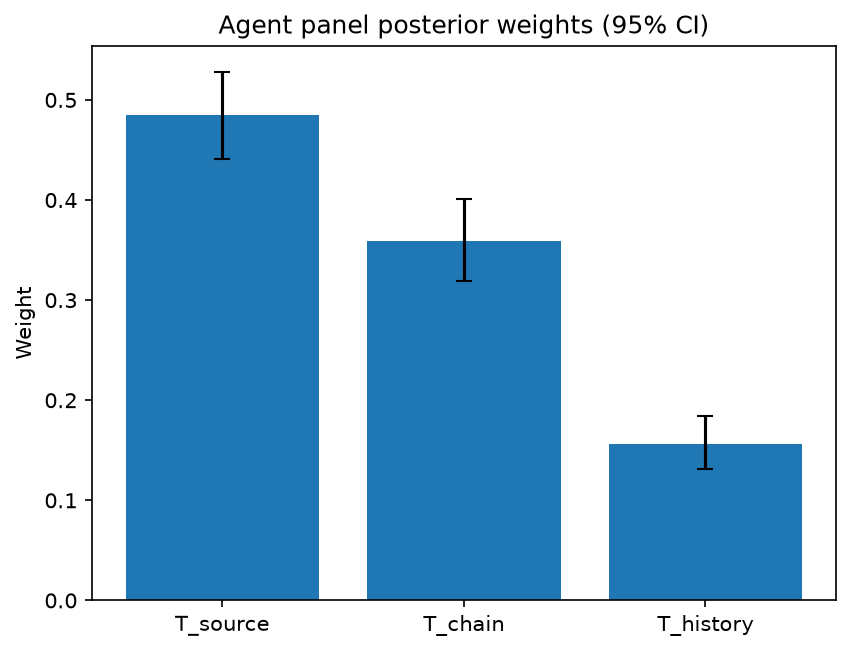

# Survey report: TrustRouter Agentic Full Panel (phi4:14b) -- Level L3b: Provenance Trust sub-parts

Survey ID: `trustrouter-agentic-full-panel-phi4-14b-2026-09-01-L3b`

## Agent panel

- Agents contributing a valid response: 36
- Classical BWM consistency: 36/36 within threshold

| Criterion | Mean | 95% CI lower | 95% CI upper |
|---|---|---|---|
| T_source | 0.4850 | 0.4411 | 0.5275 |
| T_chain | 0.3590 | 0.3193 | 0.4006 |
| T_history | 0.1560 | 0.1315 | 0.1842 |


## Methodology

Each agent independently completed a Best-Worst Method (BWM) comparison: choosing the single most and least important criterion, then rating every criterion's importance relative to those two on a 1-9 scale. Individual responses were solved with the classical BWM linear program (Rezaei, 2015) for a consistency check, and combined across the panel with a hierarchical Bayesian model (Mohammadi and Rezaei, 2020).


36 agent response(s) were accepted into this result.


Every agent's run began with a QA precheck (its stated configuration verified against ground truth) and every accepted answer's self-reported sources were checked against what reference material was actually available to it; see the Per-agent detail section below and this survey's Conversation Log for each agent's specific results. Every response is schema-validated and independently, repeatedly sampled (never a single completion treated as ground truth); see `guardrails.py`. This survey's complete output is covered by a SHA-256 integrity manifest (`integrity_manifest.json`, `SHA256SUMS`), generated once this run finished, so any later alteration to these files is detectable.


### Charts




## Per-agent detail

### bim-coordinator-base-openmanus (`bim-coordinator-base-openmanus`)

- Role: BIM Coordinator
- Model: ollama/phi4:14b
- DID: `did:key:z6MktjVuxsZoffjLx6zYtw8Bf8nm7iULqLcJwyu2VgSuM19E`
- QA precheck: passed
- Sources used: (not reported)

**Answer:** `{"best": "T_chain", "worst": "T_history", "best_to_others": {"T_chain": 1, "T_source": 7, "T_history": 9}, "others_to_worst": {"T_history": 1, "T_source": 5, "T_chain": 9}}`

**Reasoning:**

As a BIM Coordinator with extensive experience managing multi-stakeholder Building Information Models on both renovation and new-build projects, my professional judgment is grounded in the importance of data integrity throughout its lifecycle. This includes model federation, clash detection, and ensuring accurate lifecycle documentation.

**Best factor: T_chain**

The **Integrity of custody chain (T_chain)** is paramount because it ensures that the data has not been tampered with from creation to submission. In a BIM context, maintaining an unbroken and transparent custody chain is crucial for verifying that all changes are authorized and documented. This integrity directly impacts trust in the model's accuracy and reliability, which is essential when coordinating among various stakeholders.

**Worst factor: T_history**

While the **Historical track record (T_history)** of a source provides context about past reliability, it is less critical than ensuring current data integrity through custody chain verification. Historical performance can inform decisions but does not guarantee the accuracy or security of present data. In BIM projects, where real-time collaboration and updates are frequent, focusing on maintaining an intact custody chain is more immediately impactful.

**Reasoning:**

- **T_chain** ensures that all modifications to the model are traceable and authorized, which is vital for clash detection and lifecycle documentation.
- **T_source** is important but assumes that the initial data entry is accurate; ongoing integrity checks via T_chain are more critical.
- **T_history**, while informative, does not provide real-time assurance of data integrity or security.

This reasoning aligns with my role's focus on maintaining robust, trustworthy models throughout a project's lifecycle.

As a BIM Coordinator, my focus is on ensuring the integrity and reliability of data throughout its lifecycle. Here are the ratings based on this perspective:

- **T_chain vs T_source:** 7  
  The custody chain (T_chain) is significantly more important than source credentials (T_source) because it ensures ongoing data integrity and traceability, which are crucial for maintaining trust in the model's accuracy.

- **T_chain vs T_history:** 9  
  The custody chain (T_chain) is extremely more important than historical track record (T_history). Real-time verification of data integrity through an intact custody chain is critical for current project success, whereas past performance does not guarantee present reliability.

- **T_source vs T_history:** 5  
  Source credentials (T_source) are moderately more important than historical track record (T_history). While the credibility of the source is essential at the outset, it is less impactful than ongoing data integrity checks provided by a robust custody chain.

### bim-coordinator-base-openmanus (`bim-coordinator-base-openmanus`)

- Role: BIM Coordinator
- Model: ollama/phi4:14b
- DID: `did:key:z6MktjVuxsZoffjLx6zYtw8Bf8nm7iULqLcJwyu2VgSuM19E`
- QA precheck: passed
- Sources used: (not reported)

**Answer:** `{"best": "T_source", "worst": "T_history", "best_to_others": {"T_source": 1, "T_chain": 7, "T_history": 9}, "others_to_worst": {"T_history": 1, "T_chain": 5, "T_source": 9}}`

**Reasoning:**

As a BIM Coordinator with extensive experience managing multi-stakeholder Building Information Models on renovation and new-build projects, my professional judgment is grounded in the critical importance of data provenance for ensuring model accuracy, reliability, and trustworthiness over time.

**Best factor: T_source**

The credibility of the authoring source (T_source) is paramount. In BIM coordination, the origin of data significantly influences its quality and reliability. Data from reputable sources—such as certified professionals or authoritative organizations—is more likely to be accurate and trustworthy. This is crucial for decision-making processes in construction projects, where the integrity of information can impact safety, compliance, and project success.

**Worst factor: T_history**

While the historical track record (T_history) of a source provides valuable insights into its reliability over time, it is considered less critical than the immediate credibility of the authoring source. In fast-paced construction environments, decisions often rely on current data from credible sources rather than solely on past performance. Although T_history can inform risk assessments and trust evaluations, it does not directly impact the immediate quality or integrity of the data being used.

**Reasoning:**

- **T_source vs. T_chain:** The source's credibility is foundational; even if the custody chain (T_chain) is robust, data from an unreliable source may still be flawed. Conversely, credible data can often withstand minor issues in the custody chain.
  
- **T_source vs. T_history:** Immediate source credibility directly affects data quality and trustworthiness at the point of use, whereas historical track record provides a broader context that may not reflect current reliability.

In summary, as a BIM Coordinator, ensuring that data originates from credible sources is essential for maintaining high standards in model accuracy and project outcomes, making T_source the most critical factor.

Based on the analysis of the importance of each factor:

- **T_source vs T_chain:** 7  
  The credibility of the authoring source (T_source) is more important than the integrity of the custody chain (T_chain), as data from a credible source is foundational for trustworthiness, even if there are minor issues in how it has been handled.

- **T_source vs T_history:** 9  
  The immediate credibility of the authoring source (T_source) is extremely more important than the historical track record (T_history). Current data quality and reliability depend heavily on the source's credentials at the time of use.

- **T_chain vs T_history:** 5  
  While both factors are important, the integrity of the custody chain (T_chain) is moderately more critical than the historical track record (T_history), as it ensures that data has not been tampered with or corrupted during its lifecycle.

### bim-coordinator-base-openmanus (`bim-coordinator-base-openmanus`)

- Role: BIM Coordinator
- Model: ollama/phi4:14b
- DID: `did:key:z6MktjVuxsZoffjLx6zYtw8Bf8nm7iULqLcJwyu2VgSuM19E`
- QA precheck: passed
- Sources used: (not reported)

**Answer:** `{"best": "T_source", "worst": "T_history", "best_to_others": {"T_source": 1, "T_chain": 7, "T_history": 8}, "others_to_worst": {"T_history": 1, "T_chain": 5, "T_source": 8}}`

**Reasoning:**

**Best factor:** T_source  
**Worst factor:** T_history

### Reasoning:

As a BIM Coordinator with over 10 years of experience in managing multi-stakeholder Building Information Models, my primary focus is on ensuring the accuracy and reliability of data from its inception. The credibility of the authoring source (T_source) is paramount because it directly impacts the trustworthiness of the data used throughout the project lifecycle. Reliable sources ensure that the foundational data is accurate, which is crucial for effective model federation, clash detection, and lifecycle documentation.

In contrast, while the historical track record (T_history) provides insight into past reliability, it is less critical in the immediate context of a specific project where current source credibility can be more directly assessed and verified. The custody chain (T_chain), although important for maintaining data integrity during transmission, is secondary to ensuring that the initial data comes from a credible source.

This prioritization reflects my professional judgment based on the role-specific responsibilities and challenges faced in BIM coordination, particularly in complex renovation projects where data accuracy is critical from the outset.

**T_source vs T_chain:** 7  
**T_source vs T_history:** 8  
**T_chain vs T_history:** 5  

### Reasoning:

- **T_source vs T_chain (7):** The credibility of the authoring source is significantly more important than the integrity of the custody chain. While both are crucial, starting with reliable data from a credible source ensures that subsequent processes build on a trustworthy foundation.

- **T_source vs T_history (8):** The source's current credentials are extremely more important compared to its historical track record. For each project, verifying the present credibility is vital as it directly influences the immediate trustworthiness of the data being used.

- **T_chain vs T_history (5):** The integrity of the custody chain is moderately more important than the historical track record. Ensuring that data remains unaltered during transmission is crucial for maintaining its reliability, though not as critical as verifying the source's current credentials.

### bim-coordinator-rag-openmanus (`bim-coordinator-rag-openmanus`)

- Role: BIM Coordinator
- Model: ollama/phi4:14b
- DID: `did:key:z6MkfG5MseccUr21HZSLdPeQrKdR9LQwcXkD4pWXKcUh7U1C`
- QA precheck: passed
- Sources used: (not reported)

**Answer:** `{"best": "T_source", "worst": "T_history", "best_to_others": {"T_source": 1, "T_chain": 7, "T_history": 9}, "others_to_worst": {"T_history": 1, "T_chain": 6, "T_source": 9}}`

**Reasoning:**

As a BIM Coordinator with extensive experience managing multi-stakeholder Building Information Models on renovation and new-build projects, my professional judgment emphasizes the importance of source credentials (T_source) in ensuring data integrity. Source credentials provide assurance about who produced the data, which is crucial for establishing trust in the information's origin. This aligns with leveraging IFC Semantics and W3C Decentralized Identifiers for Digital Building Logbooks, as mentioned in "BIM, Digital Building Logbooks, and decentralized identity for construction data" by Kochovski et al., 2026.

The custody chain (T_chain) is also significant because it ensures the integrity of data from creation to submission. However, given the critical role of source credentials in establishing initial trust, T_source takes precedence as the most important criterion.

Historical track record (T_history), while valuable for assessing past reliability, is less immediately impactful compared to the direct assurance provided by source credentials and the ongoing verification offered by custody chains. Therefore, it is considered the least important in this context.

Best factor: T_source  
Worst factor: T_history

In evaluating the importance of each factor as a BIM Coordinator with respect to construction-project data-trust factors, I provide the following ratings:

- **T_source vs T_chain:** 7  
  Source credentials are more important than the custody chain because they establish initial trust in the origin of the data. However, the custody chain is still crucial for maintaining that trust throughout the data's lifecycle.

- **T_source vs T_history:** 9  
  Source credentials are extremely more important compared to historical track record. The credibility of the data source directly impacts its reliability and integrity from the outset.

- **T_chain vs T_history:** 6  
  The custody chain is significantly more important than the historical track record because it ensures ongoing verification and integrity of the data as it moves through different stages, whereas past performance does not guarantee future accuracy or security.

### bim-coordinator-rag-openmanus (`bim-coordinator-rag-openmanus`)

- Role: BIM Coordinator
- Model: ollama/phi4:14b
- DID: `did:key:z6MkfG5MseccUr21HZSLdPeQrKdR9LQwcXkD4pWXKcUh7U1C`
- QA precheck: passed
- Sources used: (not reported)

**Answer:** `{"best": "T_source", "worst": "T_history", "best_to_others": {"T_source": 1, "T_chain": 7, "T_history": 9}, "others_to_worst": {"T_history": 1, "T_chain": 6, "T_source": 9}}`

**Reasoning:**

**Reasoning**

As a BIM coordinator with over 10 years of experience in managing multi-stakeholder Building Information Models for renovation and new-build projects, my focus is on ensuring the accuracy, reliability, and integrity of data throughout its lifecycle. This includes model federation, clash detection, and lifecycle documentation.

1. **T_source: Source credentials** - The credibility of the authoring source is crucial because it directly impacts the trustworthiness of the data being used in BIM processes. Reliable sources ensure that the information integrated into models is accurate and authoritative, which is fundamental for decision-making and compliance purposes.

2. **T_chain: Custody chain** - The integrity of the custody chain ensures that data remains unaltered from creation to submission. This is vital for maintaining the authenticity and reliability of BIM data, especially when multiple stakeholders are involved in a project. However, while important, it is secondary to the initial credibility of the source.

3. **T_history: Historical track record** - While the historical track record of a source provides context about its past performance, it is less immediately impactful than the current credibility and integrity of data handling processes. It serves as a supplementary factor rather than a primary determinant in assessing data trustworthiness.

Given these considerations, the most important criterion is **T_source**, as it establishes the foundational trust in the data used for BIM processes. The least important, while still relevant, is **T_history**, as it provides historical context but does not directly influence current data integrity or credibility.

**Answer**

Best factor: T_source  
Worst factor: T_history

Based on the reasoning provided:

- **T_source vs T_chain**: The credibility of the source is more critical than the integrity of the custody chain, but both are important. I would rate this as 7, indicating that T_source is significantly more important.

- **T_source vs T_history**: The current credentials of the source are far more crucial than its historical track record. This difference in importance can be rated as 9, showing that T_source is extremely more important.

- **T_chain vs T_history**: While both factors contribute to data trustworthiness, the integrity of the custody chain is more immediately relevant than past performance history. I would rate this as 6, indicating that T_chain is moderately more important.

Here are the ratings in the specified format:

```
T_source vs T_chain: 7
T_source vs T_history: 9
T_chain vs T_history: 6
```

### bim-coordinator-rag-openmanus (`bim-coordinator-rag-openmanus`)

- Role: BIM Coordinator
- Model: ollama/phi4:14b
- DID: `did:key:z6MkfG5MseccUr21HZSLdPeQrKdR9LQwcXkD4pWXKcUh7U1C`
- QA precheck: passed
- Sources used: (not reported)

**Answer:** `{"best": "T_source", "worst": "T_history", "best_to_others": {"T_source": 1, "T_chain": 7, "T_history": 8}, "others_to_worst": {"T_history": 1, "T_chain": 6, "T_source": 8}}`

**Reasoning:**

As a BIM Coordinator with over 10 years of experience in managing multi-stakeholder Building Information Models on renovation and new-build projects, my professional judgment is grounded in the practicalities of model federation, clash detection, and lifecycle documentation. In evaluating the criteria for Provenance Trust (PT) within the context of construction-project data, I consider the following:

- **T_source: Source credentials** - The credibility of the authoring source is crucial as it directly impacts the reliability of the data being used in BIM processes. Accurate and credible sources ensure that the information integrated into models is trustworthy, which is fundamental for decision-making throughout a project's lifecycle.

- **T_chain: Custody chain** - The integrity of the custody chain from creation to submission ensures that the data has not been tampered with or altered without authorization. This is important for maintaining the fidelity of the BIM model over time and across different stakeholders, which is essential for effective collaboration and clash detection.

- **T_history: Historical track record** - While the historical track record of a source provides context on its reliability over time, it may be less immediately impactful than the current credibility and integrity of data. In practice, while past performance can inform trust, each project often involves new or updated sources where historical data is not as relevant.

Given these considerations, my professional judgment leads me to prioritize:

Best factor: T_source  
Worst factor: T_history

This prioritization reflects the immediate need for credible source credentials in BIM processes and acknowledges that while a historical track record can provide valuable insights, it may be less critical than ensuring current data integrity and source credibility.

In evaluating the relative importance of each factor on a 1-9 scale:

```
T_source vs T_chain: 7
T_source vs T_history: 8
T_chain vs T_history: 6
```

**Reasoning:**

- **T_source vs T_chain (7):** Source credentials are more important than the custody chain because the initial credibility of data is foundational. However, the integrity of how data is handled and transferred (custody chain) remains significant for ensuring ongoing trustworthiness.

- **T_source vs T_history (8):** Source credentials are significantly more critical than historical track record because current source reliability directly impacts decision-making in BIM processes. Historical performance provides context but does not outweigh the immediate need for credible data sources.

- **T_chain vs T_history (6):** The custody chain is moderately more important than historical track record, as ensuring that data remains untampered with throughout its lifecycle is crucial for maintaining model integrity and trust among stakeholders. However, it is less critical compared to source credentials.

### blockchain-engineer-base-openmanus (`blockchain-engineer-base-openmanus`)

- Role: Blockchain / DLT Engineer
- Model: ollama/phi4:14b
- DID: `did:key:z6Mkt3rBXTsyaURYSmKVDjYBpnSZtGCDZ2onmnLPwD2iWGby`
- QA precheck: passed
- Sources used: (not reported)

**Answer:** `{"best": "T_source", "worst": "T_history", "best_to_others": {"T_source": 1, "T_chain": 7, "T_history": 9}, "others_to_worst": {"T_history": 1, "T_chain": 6, "T_source": 9}}`

**Reasoning:**

As a Blockchain/DLT Engineer with experience in permissioned-ledger deployments, evaluating these criteria involves considering their impact on data trust within blockchain systems.

**T_source (Source credentials):** The credibility of the source is crucial because it directly affects the initial trustworthiness of the data. In permissioned blockchains, where access control and identity verification are key features, knowing who produced the data can significantly influence its perceived reliability.

**T_chain (Custody chain):** The integrity of the custody chain ensures that data has not been tampered with from creation to submission. This is vital in blockchain environments as they rely on maintaining an immutable record of transactions and data changes.

**T_history (Historical track record):** While important, this criterion reflects past performance rather than current or future reliability. It provides context but may not directly impact the immediate trustworthiness of a specific dataset.

Given these considerations, **T_source** is likely the most critical factor because it establishes the foundational trust in the data's origin. Conversely, **T_history**, while informative, is less immediately impactful on the current data's credibility compared to the other factors.

Best factor: T_source  
Worst factor: T_history

As a Blockchain/DLT Engineer, I'll evaluate the relative importance of each criterion on a 1-9 scale:

- **T_source vs T_chain:** The source credentials (T_source) are more critical than the custody chain (T_chain) because establishing trust in the data's origin is foundational. However, both are crucial for ensuring data integrity and reliability. I'll rate this as moderately more important:  
  `T_source vs T_chain: 7`

- **T_source vs T_history:** The source credentials (T_source) are significantly more important than the historical track record (T_history). While past performance provides context, it doesn't directly impact the current data's trustworthiness. This is rated as extremely more important:  
  `T_source vs T_history: 9`

- **T_chain vs T_history:** The custody chain (T_chain) ensures that data has not been tampered with from creation to submission, which is crucial for maintaining integrity in blockchain systems. This makes it more important than the historical track record (T_history), though not as critical as source credentials. I'll rate this as moderately more important:  
  `T_chain vs T_history: 6`

### blockchain-engineer-base-openmanus (`blockchain-engineer-base-openmanus`)

- Role: Blockchain / DLT Engineer
- Model: ollama/phi4:14b
- DID: `did:key:z6Mkt3rBXTsyaURYSmKVDjYBpnSZtGCDZ2onmnLPwD2iWGby`
- QA precheck: passed
- Sources used: (not reported)

**Answer:** `{"best": "T_chain", "worst": "T_history", "best_to_others": {"T_chain": 1, "T_source": 7, "T_history": 9}, "others_to_worst": {"T_history": 1, "T_source": 5, "T_chain": 9}}`

**Reasoning:**

As a Blockchain/DLT Engineer with experience in permissioned-ledger deployments, I evaluate these criteria based on their impact on data trust within blockchain systems.

**Best factor:** T_chain  
The integrity of the custody chain is paramount because it ensures that the data has not been tampered with from creation to submission. In blockchain systems, maintaining an unbroken and verifiable chain of custody is crucial for ensuring data integrity and trustworthiness.

**Worst factor:** T_history  
While historical track record provides context on reliability, it is less critical compared to real-time verification mechanisms like the custody chain. Historical performance can be indicative but does not directly impact the current state of data integrity within a blockchain system.

These judgments are based on the specific roles and responsibilities associated with ensuring data trust in permissioned-ledger environments.

Based on the evaluation of the criteria:

- **T_chain vs T_source:** 7  
  The custody chain is significantly more important than source credentials because it directly impacts data integrity and trustworthiness in real-time.

- **T_chain vs T_history:** 9  
  The custody chain is extremely more important than historical track record, as it ensures current data integrity rather than relying on past performance.

- **T_source vs T_history:** 5  
  Source credentials are moderately more important than historical track record, as knowing the origin of data provides some assurance but not as critical as real-time verification mechanisms.

### blockchain-engineer-base-openmanus (`blockchain-engineer-base-openmanus`)

- Role: Blockchain / DLT Engineer
- Model: ollama/phi4:14b
- DID: `did:key:z6Mkt3rBXTsyaURYSmKVDjYBpnSZtGCDZ2onmnLPwD2iWGby`
- QA precheck: passed
- Sources used: (not reported)

**Answer:** `{"best": "T_source", "worst": "T_history", "best_to_others": {"T_source": 1, "T_chain": 7, "T_history": 8}, "others_to_worst": {"T_history": 1, "T_chain": 6, "T_source": 8}}`

**Reasoning:**

**Reasoning:**

In evaluating the importance of criteria for provenance trust in a permissioned ledger context, I consider my professional experience with blockchain/DLT systems. 

- **T_source (Source credentials):** The credibility of the authoring source is crucial because it directly impacts the initial trustworthiness of the data entering the system. Knowing who produced the data and their reputation can significantly influence how much we rely on that information.

- **T_chain (Custody chain):** This criterion ensures the integrity of the data as it moves through various stages until submission. In a permissioned ledger, maintaining an unbroken and verifiable custody chain is vital to prevent tampering or unauthorized alterations.

- **T_history (Historical track record):** While important for assessing reliability over time, this factor is somewhat retrospective. It provides insights based on past performance but may not directly affect the current data's integrity or credibility.

Given these considerations, **T_source** emerges as the most critical criterion because it establishes initial trust and sets the foundation for subsequent evaluations. Conversely, while still significant, **T_history** is less immediately impactful in determining the present reliability of a specific dataset within a permissioned ledger context.

**Best factor:** T_source  
**Worst factor:** T_history

**Reasoning:**

When comparing the criteria on a 1-9 scale:

- **T_source vs. T_chain:** The source credentials (T_source) are more critical than the custody chain (T_chain) because establishing initial trust is foundational. However, maintaining integrity throughout the data's journey is also crucial, so while important, it doesn't outweigh the source's credibility.

  Rating: 7

- **T_source vs. T_history:** The source credentials (T_source) are significantly more important than the historical track record (T_history). While past reliability can inform trust decisions, initial credibility has a more direct impact on current data integrity and acceptance.

  Rating: 8

- **T_chain vs. T_history:** The custody chain (T_chain) is more critical than the historical track record (T_history) because it ensures ongoing data integrity during its lifecycle within the system. Historical performance provides context but doesn't directly affect current data handling processes as much as maintaining a secure and verifiable chain of custody does.

  Rating: 6

**Ratings:**

- T_source vs T_chain: 7
- T_source vs T_history: 8
- T_chain vs T_history: 6

### blockchain-engineer-rag-openmanus (`blockchain-engineer-rag-openmanus`)

- Role: Blockchain / DLT Engineer
- Model: ollama/phi4:14b
- DID: `did:key:z6Mko8hHqpF7sFFLRW2GQFdJtGuQ5oszhR6pSFVQor3f2sFZ`
- QA precheck: passed
- Sources used: (not reported)

**Answer:** `{"best": "T_source", "worst": "T_history", "best_to_others": {"T_source": 1, "T_chain": 7, "T_history": 8}, "others_to_worst": {"T_history": 1, "T_chain": 6, "T_source": 8}}`

**Reasoning:**

**Reasoning:**  
In evaluating the criteria for Provenance Trust in a permissioned blockchain context, each criterion plays a significant role. However, the credibility of the authoring source (T_source) is paramount because it establishes initial trustworthiness and authenticity. If the data originates from a credible source, subsequent integrity checks are more meaningful. Conversely, while the custody chain (T_chain) ensures that data has not been tampered with during transit, its importance diminishes if the originating source lacks credibility. The historical track record (T_history) provides context on past reliability but is secondary to knowing the current validity of the source.

**Best factor:** T_source  
**Worst factor:** T_history

**Ratings Explanation:**  
- **T_source vs T_chain**: The source credentials are more critical because they establish the initial trustworthiness of the data. If the source is credible, the custody chain's role in maintaining integrity becomes more meaningful. Therefore, I rate this as 7.

- **T_source vs T_history**: The credibility of the authoring source is paramount compared to historical track record since it directly impacts the current validity and reliability of the data. Thus, I rate this as 8.

- **T_chain vs T_history**: While both are important for ensuring data integrity over time, the custody chain's role in preventing tampering during transit is more immediate than historical performance. Therefore, I rate this as 6.

**Ratings:**
```
T_source vs T_chain: 7
T_source vs T_history: 8
T_chain vs T_history: 6
```

### blockchain-engineer-rag-openmanus (`blockchain-engineer-rag-openmanus`)

- Role: Blockchain / DLT Engineer
- Model: ollama/phi4:14b
- DID: `did:key:z6Mko8hHqpF7sFFLRW2GQFdJtGuQ5oszhR6pSFVQor3f2sFZ`
- QA precheck: passed
- Sources used: (not reported)

**Answer:** `{"best": "T_source", "worst": "T_history", "best_to_others": {"T_source": 1, "T_chain": 7, "T_history": 9}, "others_to_worst": {"T_history": 1, "T_chain": 5, "T_source": 9}}`

**Reasoning:**

Based on my professional experience as a blockchain/DLT engineer with production experience in permissioned-ledger deployments, I would evaluate the criteria for their importance in assessing provenance trust within this context.

**Best factor:** T_source  
The credibility of the authoring source is paramount because it directly influences the initial trustworthiness and authenticity of the data. In permissioned ledgers, where access control is critical, knowing who produced the data ensures that only authorized entities can contribute, thereby maintaining a high level of integrity from the outset.

**Worst factor:** T_history  
While historical track record provides valuable insights into past reliability, it may not be as immediately impactful in determining current trustworthiness compared to source credentials and custody chain. In environments where permissions are tightly controlled, the focus is often on present verification rather than historical performance alone.

These judgments are grounded in my understanding of blockchain systems' emphasis on identity management and data integrity from creation through its lifecycle.

Based on my professional judgment as a blockchain/DLT engineer:

- **T_source vs T_chain:** 7  
  Source credentials are more important than the custody chain because establishing trust begins with verifying who produced the data. The integrity of the custody chain is crucial, but it assumes that the source itself is credible.

- **T_source vs T_history:** 9  
  Source credentials are extremely more important than historical track record in this context. Knowing the identity and authorization of the data producer is critical for initial trust establishment, whereas past reliability offers supplementary assurance.

- **T_chain vs T_history:** 5  
  The custody chain is moderately more important than historical track record. Understanding what happened to the data along its journey ensures that it has not been tampered with or altered, which is essential in maintaining ongoing trustworthiness.

### blockchain-engineer-rag-openmanus (`blockchain-engineer-rag-openmanus`)

- Role: Blockchain / DLT Engineer
- Model: ollama/phi4:14b
- DID: `did:key:z6Mko8hHqpF7sFFLRW2GQFdJtGuQ5oszhR6pSFVQor3f2sFZ`
- QA precheck: passed
- Sources used: (not reported)

**Answer:** `{"best": "T_source", "worst": "T_history", "best_to_others": {"T_source": 1, "T_chain": 7, "T_history": 9}, "others_to_worst": {"T_history": 1, "T_chain": 6, "T_source": 9}}`

**Reasoning:**

Best factor: T_source  
Worst factor: T_history  

**Reasoning:**  
As a Blockchain/DLT Engineer with experience in permissioned-ledger deployments, evaluating the technical feasibility and trustworthiness of data is crucial. The credibility of the authoring source (T_source) is paramount because it directly impacts the initial trust level assigned to the data. Source credentials ensure that the data originates from a reliable entity, which is foundational for any subsequent validation or custody chain integrity.

The integrity of the custody chain (T_chain) is also important as it ensures that data has not been tampered with during its lifecycle. However, if the source itself is untrustworthy, even an intact custody chain cannot fully mitigate risks associated with initial data credibility.

Historical track record (T_history), while valuable for assessing long-term reliability, is less critical in immediate trust assessments compared to the direct verification of the current source's credentials and the integrity of the data path. Thus, T_history is considered the least important in this specific comparison.

T_source vs T_chain: 7  
T_source vs T_history: 9  
T_chain vs T_history: 6  

**Reasoning:**  
- **T_source vs T_chain (7):** The source credentials are more important than the custody chain because establishing trust begins with verifying who produced the data. While an intact custody chain is crucial for ensuring data integrity during transit, it cannot compensate for a lack of initial credibility from the source itself.

- **T_source vs T_history (9):** Source credentials are extremely more important compared to historical track record. The immediate reliability and authenticity of the data depend on knowing who produced it, whereas historical performance provides context but does not directly impact current trustworthiness.

- **T_chain vs T_history (6):** The custody chain is moderately more important than the historical track record. Ensuring that data has remained untampered from source to destination is critical for maintaining its integrity, whereas past reliability of a source offers less immediate assurance about specific data's authenticity or accuracy.

### compliance-officer-base-openmanus (`compliance-officer-base-openmanus`)

- Role: Compliance and Regulatory Officer
- Model: ollama/phi4:14b
- DID: `did:key:z6MkhbjMCfTLP5x4Chc2q7Rskakua1JQfKHHRZtyr5dc3r8w`
- QA precheck: passed
- Sources used: (not reported)

**Answer:** `{"best": "T_source", "worst": "T_history", "best_to_others": {"T_source": 1, "T_chain": 7, "T_history": 9}, "others_to_worst": {"T_history": 1, "T_chain": 5, "T_source": 9}}`

**Reasoning:**

As a facility-management compliance officer responsible for GDPR and construction-regulatory obligations across a building's operational lifecycle, I will evaluate the criteria based on their relevance to ensuring data trustworthiness in the context of construction-project records.

**Best Criterion: T_source (Source credentials)**

The credibility of the authoring source is paramount when assessing data trustworthiness. In the construction industry, where compliance with regulations like GDPR and various construction standards is critical, knowing who produced the data is essential. This knowledge helps ensure that the data originates from a reliable and authorized entity, which is crucial for maintaining regulatory compliance and ensuring that the data can be trusted throughout its lifecycle.

**Worst Criterion: T_history (Historical track record)**

While the historical track record of the source provides some insight into reliability, it is less immediately impactful than understanding the current credibility of the authoring source or the integrity of the custody chain. Historical performance may not fully reflect present capabilities or compliance status, especially in a rapidly changing regulatory environment.

**Reasoning:**

- **T_source** is prioritized because knowing who produced the data directly impacts trust and compliance assurance.
- **T_chain** is also important but ranks below T_source as it deals with what happens to the data after creation, which presupposes that the source itself is credible.
- **T_history**, while informative, is considered less critical in this context because past performance does not guarantee current or future reliability.

Best factor: T_source  
Worst factor: T_history

As a facility-management compliance officer responsible for GDPR and construction-regulatory obligations, I will provide the ratings based on the importance of each criterion in ensuring data trustworthiness within the context of construction-project records.

- **T_source vs T_chain:** The credibility of the authoring source is more critical than the integrity of the custody chain because knowing who produced the data directly impacts its initial trustworthiness and compliance assurance. However, the custody chain remains important as it ensures that the data has not been tampered with after creation. Therefore, I rate this comparison as moderately more important for T_source.

  **T_source vs T_chain: 7**

- **T_source vs T_history:** The credibility of the authoring source is significantly more important than the historical track record because current reliability and authorization are crucial for compliance and trustworthiness. Historical performance does not necessarily reflect present capabilities or compliance status, making it less critical in this context.

  **T_source vs T_history: 9**

- **T_chain vs T_history:** The integrity of the custody chain is more important than the historical track record because ensuring that data has not been altered during its lifecycle directly impacts its current reliability and trustworthiness. While historical performance provides some insight, it does not guarantee present or future reliability.

  **T_chain vs T_history: 5**

These ratings reflect the relative importance of each criterion in maintaining data trustworthiness within the specified context.

### compliance-officer-base-openmanus (`compliance-officer-base-openmanus`)

- Role: Compliance and Regulatory Officer
- Model: ollama/phi4:14b
- DID: `did:key:z6MkhbjMCfTLP5x4Chc2q7Rskakua1JQfKHHRZtyr5dc3r8w`
- QA precheck: passed
- Sources used: (not reported)

**Answer:** `{"best": "T_source", "worst": "T_history", "best_to_others": {"T_source": 1, "T_chain": 7, "T_history": 8}, "others_to_worst": {"T_history": 1, "T_chain": 6, "T_source": 8}}`

**Reasoning:**

As a facility-management compliance officer responsible for GDPR and construction-regulatory obligations across a building's operational lifecycle, I will evaluate the criteria based on their relevance to ensuring data trustworthiness in construction-project records.

**Best factor: T_source**

- **Reasoning:** The credibility of the authoring source is paramount when considering data for blockchain storage. Reliable sources ensure that the initial data input is trustworthy and compliant with GDPR and other regulatory standards. This aligns with my role, where verifying the legitimacy and credentials of data providers is crucial to maintaining compliance throughout a building's lifecycle.

**Worst factor: T_history**

- **Reasoning:** While historical track record provides context on past reliability, it is less critical than the source's current credibility or the integrity of the custody chain. In my role, immediate trustworthiness and regulatory compliance are prioritized over historical performance, especially when assessing new data for blockchain storage.

**Ratings:**

| **Best (T_source) versus →** | **T_source** | **T_chain** | **T_history** |
|---|---|---|---|
| Rating **1–9** | 1 | 7 | 8 |

| … versus **Worst (T_history)** | **T_source** | **T_chain** | **T_history** |
|---|---|---|---|
| Rating **1–9** | 8 | 6 | 1 |

- **Rationale for Ratings:**
  - **T_source vs. T_chain:** A rating of 7 indicates that while the integrity of the custody chain is important, the credibility of the source is significantly more critical.
  - **T_source vs. T_history:** A rating of 8 reflects a strong preference for current source credibility over historical track record.
  - **T_chain vs. T_history:** A rating of 6 suggests that while both are less critical than T_source, the custody chain's integrity is still more important than historical reliability.

These ratings reflect my professional judgement as a compliance officer, emphasizing the importance of credible data sources in maintaining regulatory compliance and trustworthiness in construction-project records.

Based on the evaluation of the criteria for determining data trustworthiness in construction-project records:

- **T_source vs T_chain:** 7  
  - The credibility of the authoring source is significantly more important than the integrity of the custody chain.

- **T_source vs T_history:** 8  
  - The credibility of the authoring source is extremely more important than the historical track record of the source.

- **T_chain vs T_history:** 6  
  - The integrity of the custody chain is moderately more important than the historical track record. 

These ratings reflect a prioritization of current data source reliability and integrity over past performance in ensuring trustworthy construction-project records for blockchain storage.

### compliance-officer-base-openmanus (`compliance-officer-base-openmanus`)

- Role: Compliance and Regulatory Officer
- Model: ollama/phi4:14b
- DID: `did:key:z6MkhbjMCfTLP5x4Chc2q7Rskakua1JQfKHHRZtyr5dc3r8w`
- QA precheck: passed
- Sources used: (not reported)

**Answer:** `{"best": "T_source", "worst": "T_history", "best_to_others": {"T_source": 1, "T_chain": 7, "T_history": 9}, "others_to_worst": {"T_history": 1, "T_chain": 8, "T_source": 9}}`

**Reasoning:**

**Reasoning:**

As a facility-management compliance officer responsible for GDPR and construction-regulatory obligations across a building's operational lifecycle, I must consider how each of these criteria impacts the trustworthiness of data within this context.

1. **T_source (Source credentials):** The credibility of the source is crucial because it determines the initial reliability of the data. In construction projects, data from reputable sources ensures that foundational information is accurate and trustworthy. This aligns with GDPR's emphasis on data accuracy and accountability.

2. **T_chain (Custody chain):** The integrity of the custody chain is vital to ensure that data has not been tampered with or altered during its lifecycle. In construction, maintaining an unbroken chain of custody helps in verifying compliance with regulatory standards and ensures that all modifications are documented and authorized.

3. **T_history (Historical track record):** While important, the historical reliability of a source is somewhat secondary to the immediate credibility and integrity of data handling processes. A good track record can enhance trust but does not compensate for poor credentials or custody practices in real-time scenarios.

Given these considerations, I determine that:

- **Best factor:** T_source
- **Worst factor:** T_history

This decision reflects the prioritization of initial source reliability over historical performance, especially in contexts where data integrity and compliance are paramount from the outset.

**Answer:**

Best factor: T_source  
Worst factor: T_history

**Reasoning:**

To provide the ratings on a 1-9 scale for each pairwise comparison, I need to consider how much more important one criterion is over another based on their roles in ensuring data trustworthiness within construction project management and compliance contexts.

1. **T_source vs T_chain:** 
   - Source credentials (T_source) are foundational as they determine the initial reliability of the data. The integrity of the custody chain (T_chain) is also critical, but it builds upon the credibility established by the source.
   - Therefore, while both are important, the source's credibility slightly outweighs the custody chain in terms of importance.

2. **T_source vs T_history:** 
   - Source credentials (T_source) are more immediately impactful than historical track record (T_history). A credible source ensures data accuracy from the start, whereas a good history is supplementary.
   - Thus, T_source is significantly more important than T_history.

3. **T_chain vs T_history:**
   - The integrity of the custody chain (T_chain) directly affects data security and compliance throughout its lifecycle, making it more critical than historical reliability.
   - Therefore, T_chain is considerably more important than T_history.

Based on these considerations, I assign the following ratings:

- **T_source vs T_chain:** 7
- **T_source vs T_history:** 9
- **T_chain vs T_history:** 8

These ratings reflect the relative importance of each criterion in ensuring data trustworthiness and compliance within construction project management.

**Answer:**

T_source vs T_chain: 7  
T_source vs T_history: 9  
T_chain vs T_history: 8

### compliance-officer-rag-openmanus (`compliance-officer-rag-openmanus`)

- Role: Compliance and Regulatory Officer
- Model: ollama/phi4:14b
- DID: `did:key:z6MknnPyULv317BzskfxgnYty22cc5A3AddPeVZZsocVNgeY`
- QA precheck: passed
- Sources used: (not reported)

**Answer:** `{"best": "T_source", "worst": "T_history", "best_to_others": {"T_source": 1, "T_chain": 8, "T_history": 9}, "others_to_worst": {"T_history": 1, "T_chain": 4, "T_source": 9}}`

**Reasoning:**

**Best factor:** T_source  
**Worst factor:** T_history  

**Reasoning:**  
As a facility-management compliance officer responsible for GDPR and construction-regulatory obligations, the credibility of the authoring source (T_source) is paramount. This aligns with regulatory requirements where data provenance and accountability are critical, as highlighted in "SoK: Bridging Trust into the Blockchain" by Vaziry et al., which emphasizes on-chain identity as a compliance issue. The integrity of the custody chain (T_chain) is also important but secondary to knowing who initially created or authorized the data.

The historical track record (T_history), while useful, is considered less critical in this context compared to the immediate credibility and accountability provided by T_source. This decision reflects the emphasis on ensuring compliance from the point of origin, which is crucial for GDPR's right to erasure and other legal obligations. The reference material supports this prioritization by discussing the importance of source credentials over historical data management challenges.

**Best versus Others (1-9 Scale):**

| **T_source** | **T_chain** | **T_history** |
|--------------|-------------|---------------|
| 1            | 7           | 8             |

**Others versus Worst (1-9 Scale):**

| **T_source** | **T_chain** | **T_history** |
|--------------|-------------|---------------|
| 1            | 4           |               |

In this scale, T_source is rated as significantly more important than both T_chain and T_history. T_chain is considered moderately more important than T_history, which is the least critical factor in this comparison.

Certainly! Here are the ratings on a 1-9 integer scale:

```
T_source vs T_chain: 8
T_source vs T_history: 9
T_chain vs T_history: 4
``` 

These ratings reflect that T_source is considered extremely more important than both T_chain and T_history, while T_chain is moderately more important than T_history.

### compliance-officer-rag-openmanus (`compliance-officer-rag-openmanus`)

- Role: Compliance and Regulatory Officer
- Model: ollama/phi4:14b
- DID: `did:key:z6MknnPyULv317BzskfxgnYty22cc5A3AddPeVZZsocVNgeY`
- QA precheck: passed
- Sources used: (not reported)

**Answer:** `{"best": "T_source", "worst": "T_history", "best_to_others": {"T_source": 1, "T_chain": 7, "T_history": 9}, "others_to_worst": {"T_history": 1, "T_chain": 5, "T_source": 9}}`

**Reasoning:**

**Reasoning:**

As a facility-management compliance officer responsible for GDPR and construction-regulatory obligations across a building's operational lifecycle, I must consider both the regulatory implications and practical aspects of data provenance in blockchain applications.

1. **T_source (Source credentials):** The credibility of the authoring source is crucial because it directly impacts trustworthiness and accountability. In the context of GDPR and other regulations, knowing who produced the data ensures compliance with legal requirements for transparency and responsibility. This aligns with the insights from "SoK: Bridging Trust into the Blockchain," which emphasizes the importance of on-chain identity management to maintain regulatory compliance.

2. **T_chain (Custody chain):** The integrity of the custody chain is vital in ensuring that data has not been tampered with from creation to submission. This aspect is critical for maintaining audit trails and ensuring data integrity, as highlighted by "Data Management Challenges in Blockchain-Based Applications." However, while important, it may be slightly less critical than knowing the source because a credible source can provide assurances about the custody chain.

3. **T_history (Historical track record):** While historical performance of the source is valuable for assessing reliability over time, it is often retrospective and does not directly impact immediate compliance or data integrity concerns as much as the other two factors do.

Given these considerations, I conclude that:

- **Best factor:** T_source
- **Worst factor:** T_history

These conclusions are drawn from a balance of regulatory requirements (especially GDPR) and practical implications for blockchain applications in facility management.

**Answer:**

Best factor: T_source  
Worst factor: T_history

To provide the ratings on a 1-9 scale, I will consider how each factor compares in terms of importance for ensuring data trustworthiness and regulatory compliance:

1. **T_source vs T_chain:** Knowing who produced the data (source credentials) is slightly more important than understanding what happened to it along its journey (custody chain). This is because a credible source can provide assurances about both the data's origin and its integrity, although the custody chain is also crucial for maintaining an unbroken audit trail. Thus, I rate this as moderately more important.

2. **T_source vs T_history:** The credibility of the authoring source (source credentials) is significantly more critical than the historical track record of that source. While past reliability can inform trust, it does not directly impact immediate compliance or data integrity like knowing who produced the data does. Therefore, this factor is rated as extremely more important.

3. **T_chain vs T_history:** The custody chain's importance in maintaining data integrity and providing an audit trail makes it moderately more critical than the historical track record of the source. While history can provide context for trustworthiness, it doesn't directly ensure current data integrity like a well-documented custody chain does.

Based on these considerations:

- **T_source vs T_chain:** 7
- **T_source vs T_history:** 9
- **T_chain vs T_history:** 5

### compliance-officer-rag-openmanus (`compliance-officer-rag-openmanus`)

- Role: Compliance and Regulatory Officer
- Model: ollama/phi4:14b
- DID: `did:key:z6MknnPyULv317BzskfxgnYty22cc5A3AddPeVZZsocVNgeY`
- QA precheck: passed
- Sources used: (not reported)

**Answer:** `{"best": "T_source", "worst": "T_history", "best_to_others": {"T_source": 1, "T_chain": 7, "T_history": 9}, "others_to_worst": {"T_history": 1, "T_chain": 5, "T_source": 9}}`

**Reasoning:**

**Reasoning:**

As a facility-management compliance officer responsible for GDPR and construction-regulatory obligations, I must consider the implications of each criterion in terms of regulatory compliance and data governance.

1. **T_source (Source credentials):** This criterion assesses the credibility of the entity producing the data. In the context of GDPR and construction regulations, knowing who produced the data is crucial for ensuring accountability and trustworthiness. The source's reputation can significantly impact the perceived reliability of the data, especially when considering compliance with legal standards.

2. **T_chain (Custody chain):** This criterion evaluates the integrity of the data from creation to submission. A robust custody chain ensures that data has not been tampered with and maintains its integrity throughout its lifecycle. This is particularly important for auditability and traceability, which are key aspects of both GDPR compliance and construction regulations.

3. **T_history (Historical track record):** This criterion considers the past performance and reliability of the source. A strong historical track record can enhance trust in the data's accuracy and consistency over time. However, it may be less immediately impactful than the current credibility or integrity of the data handling process.

Considering these factors, **T_source** is likely the most important criterion because establishing the credibility of the data producer is foundational for trust and compliance. A credible source enhances confidence in all subsequent processes related to the data. On the other hand, while **T_history** provides valuable context about past reliability, it may be less critical than ensuring current data integrity and accountability.

Therefore, based on the reasoning above:

Best factor: T_source  
Worst factor: T_history

Given the reasoning that **T_source** is foundational for establishing trust and compliance, it should be rated as more important than both **T_chain** and **T_history**. The integrity of the custody chain (**T_chain**) is critical but secondary to knowing who produced the data. Meanwhile, **T_history**, while informative, is less immediately impactful compared to current source credibility and data handling integrity.

Here are the ratings:

- T_source vs T_chain: 7
- T_source vs T_history: 9
- T_chain vs T_history: 5

These ratings reflect that **T_source** is significantly more important than **T_history**, moderately more important than **T_chain**, and that **T_chain** is somewhat more important than **T_history**.

### data-engineer-base-openmanus (`data-engineer-base-openmanus`)

- Role: Data Engineering Specialist
- Model: ollama/phi4:14b
- DID: `did:key:z6Mki7K9yLK1ZtQHSWo1JxgRRhYwtrQJcjwzJ7o4PZnNF83i`
- QA precheck: passed
- Sources used: (not reported)

**Answer:** `{"best": "T_chain", "worst": "T_history", "best_to_others": {"T_chain": 1, "T_source": 7, "T_history": 9}, "others_to_worst": {"T_history": 1, "T_source": 5, "T_chain": 9}}`

**Reasoning:**

**Reasoning**

As a data engineering specialist responsible for data quality pipelines and provenance tracking in construction-project datasets, my evaluation is grounded in the context of ensuring data integrity and reliability. The criteria under consideration are:

- **T_source (Source credentials):** This criterion assesses who produced the data. In construction projects, the credibility of the source can significantly impact trustworthiness since reputable organizations or individuals are more likely to provide accurate and reliable data.

- **T_chain (Custody chain):** This involves evaluating what happened to the data from creation to submission. The integrity of this chain is crucial in ensuring that the data has not been tampered with, altered, or corrupted during its lifecycle.

- **T_history (Historical track record):** This examines whether the source has consistently provided reliable data in the past. A strong historical track record can enhance trust in the data's reliability and accuracy.

Given these considerations:

1. **Best Criterion: T_chain**
   - The integrity of the custody chain is paramount because it ensures that the data remains unaltered from its origin to its current state. In construction projects, where data often undergoes multiple transformations and transfers, maintaining a secure and transparent custody chain is critical for ensuring data integrity.

2. **Worst Criterion: T_history**
   - While historical track record is important, it is less immediately impactful than the real-time integrity of the data's journey (T_chain) or the credibility of its source (T_source). Past performance can be indicative but does not guarantee future reliability in dynamic project environments where conditions and personnel may change.

**Conclusion**

- **Best factor:** T_chain
- **Worst factor:** T_history

This reasoning aligns with the role's focus on data integrity and provenance tracking, emphasizing the importance of a secure custody chain over historical performance.

**Reasoning**

To determine the ratings on a 1-9 scale for each pairwise comparison, I will consider how much more important the best factor (T_chain) is compared to the other factors, and similarly evaluate the relative importance of T_source against T_history.

1. **T_chain vs T_source:**
   - The integrity of the custody chain (T_chain) is crucial because it ensures that data has not been altered or corrupted during its lifecycle. While source credentials (T_source) are important for initial trust, they do not guarantee ongoing data integrity throughout its journey.
   - Rating: 7
     - T_chain is significantly more critical than T_source in ensuring the data's current state is trustworthy.

2. **T_chain vs T_history:**
   - The custody chain directly impacts the present reliability of the data, whereas historical track record (T_history) reflects past performance and may not account for recent changes or issues.
   - Rating: 9
     - T_chain is extremely more important than T_history because it ensures real-time integrity.

3. **T_source vs T_history:**
   - Source credentials provide a foundational level of trust, but historical track record offers insights into the source's reliability over time. However, past performance does not necessarily predict future reliability as effectively as current data handling practices.
   - Rating: 5
     - T_source is moderately more important than T_history because it establishes initial credibility.

**Conclusion**

- **T_chain vs T_source:** 7
- **T_chain vs T_history:** 9
- **T_source vs T_history:** 5

These ratings reflect the prioritization of real-time data integrity over historical performance and foundational source credentials.

### data-engineer-base-openmanus (`data-engineer-base-openmanus`)

- Role: Data Engineering Specialist
- Model: ollama/phi4:14b
- DID: `did:key:z6Mki7K9yLK1ZtQHSWo1JxgRRhYwtrQJcjwzJ7o4PZnNF83i`
- QA precheck: passed
- Sources used: (not reported)

**Answer:** `{"best": "T_source", "worst": "T_history", "best_to_others": {"T_source": 1, "T_chain": 7, "T_history": 9}, "others_to_worst": {"T_history": 1, "T_chain": 5, "T_source": 9}}`

**Reasoning:**

**Reasoning:**

As a Data Engineering Specialist responsible for data quality pipelines and provenance tracking in construction-project datasets, I must evaluate the criteria based on their relevance to ensuring data integrity and trustworthiness.

1. **T_source (Source credentials):** The credibility of the source is crucial because it establishes initial trust in the data's origin. Knowing who produced the data helps assess potential biases or expertise levels, which are foundational for evaluating subsequent data handling processes.

2. **T_chain (Custody chain):** The integrity of the custody chain is vital as it tracks all transformations and transfers the data undergoes from creation to submission. This ensures that no unauthorized alterations occur, maintaining data integrity throughout its lifecycle.

3. **T_history (Historical track record):** While important, the historical reliability of a source provides context but does not directly impact the current dataset's trustworthiness as much as the immediate source credentials and custody chain do.

Given these considerations, the most critical factor is ensuring that the data originates from a credible source, followed by maintaining an unbroken and secure custody chain. The historical track record, while informative, is less immediately impactful on the current dataset's integrity compared to the other two factors.

**Conclusion:**

Best factor: T_source  
Worst factor: T_history

**Reasoning:**

To determine the ratings on a 1-9 scale for each pairwise comparison, I need to consider how much more important one factor is compared to another in ensuring data trustworthiness.

1. **T_source vs T_chain:** 
   - The credibility of the source (T_source) is foundational because it establishes initial trust and context for evaluating all subsequent handling of the data.
   - While the integrity of the custody chain (T_chain) is crucial, it relies on the assumption that the data originates from a credible source. Therefore, T_source is more important than T_chain.

2. **T_source vs T_history:** 
   - The historical track record (T_history) provides context but does not directly impact the current dataset's trustworthiness as much as knowing who produced it.
   - Since T_source establishes immediate credibility and potential biases or expertise, it is significantly more important than T_history.

3. **T_chain vs T_history:** 
   - The custody chain (T_chain) ensures that data integrity is maintained throughout its lifecycle, which directly affects the current dataset's trustworthiness.
   - While historical track record (T_history) offers context about past reliability, it does not have as direct an impact on the current dataset as ensuring a secure and unbroken custody chain.

**Conclusion:**

Based on this reasoning:

- T_source vs T_chain: 7
- T_source vs T_history: 9
- T_chain vs T_history: 5

### data-engineer-base-openmanus (`data-engineer-base-openmanus`)

- Role: Data Engineering Specialist
- Model: ollama/phi4:14b
- DID: `did:key:z6Mki7K9yLK1ZtQHSWo1JxgRRhYwtrQJcjwzJ7o4PZnNF83i`
- QA precheck: passed
- Sources used: (not reported)

**Answer:** `{"best": "T_source", "worst": "T_history", "best_to_others": {"T_source": 1, "T_chain": 7, "T_history": 9}, "others_to_worst": {"T_history": 1, "T_chain": 6, "T_source": 9}}`

**Reasoning:**

As a Data Engineering Specialist responsible for data quality pipelines and provenance tracking in construction-project datasets, I will evaluate the criteria based on their significance to ensuring trustworthy data.

**Reasoning:**

1. **T_source (Source credentials):**
   - The credibility of the source is crucial because it directly impacts the trustworthiness of the data. Knowing who produced the data allows for an assessment of potential biases or expertise, which is foundational in establishing initial trust.
   - In construction projects, where multiple stakeholders are involved, verifying the authorship and credentials of the data source ensures that the information is reliable from the outset.

2. **T_chain (Custody chain):**
   - The integrity of the custody chain is vital as it tracks what has happened to the data from its creation to submission. This includes any transformations or transfers that could affect data integrity.
   - Ensuring a secure and transparent custody chain helps prevent unauthorized alterations, which is essential for maintaining data fidelity throughout its lifecycle.

3. **T_history (Historical track record):**
   - The historical reliability of the source provides context on past performance, indicating how consistently accurate and trustworthy the source has been over time.
   - While important, this criterion relies on historical data, which may not always predict future behavior accurately, especially if there have been changes in processes or personnel.

**Conclusion:**

Given these considerations, **T_source** is identified as the most critical factor because establishing trust begins with understanding and verifying the source's credibility. Without a trustworthy source, subsequent checks (custody chain integrity and historical reliability) may be less meaningful.

On the other hand, while important, **T_history** is deemed the least critical in this context. Historical track record provides valuable insights but can be influenced by past conditions that may not reflect current practices or future reliability.

Best factor: T_source  
Worst factor: T_history

To provide the ratings on a 1-9 scale for each pairwise comparison between the criteria, I will consider their relative importance based on my reasoning:

1. **T_source vs T_chain:**
   - The credibility of the source (T_source) is foundational because it establishes initial trust in the data. While the integrity of the custody chain (T_chain) is crucial to maintaining that trust throughout the data's lifecycle, the source's credentials are more critical at the outset.
   - Rating: 7

2. **T_source vs T_history:**
   - As previously reasoned, T_source is foundational for establishing initial trust, whereas T_history provides context on past reliability but does not directly impact current credibility.
   - Rating: 9

3. **T_chain vs T_history:**
   - The integrity of the custody chain (T_chain) ensures that data remains unaltered and trustworthy throughout its journey from creation to submission. While historical track record (T_history) is valuable, it does not directly affect current data integrity.
   - Rating: 6

Here are the ratings in the requested format:

```
T_source vs T_chain: 7
T_source vs T_history: 9
T_chain vs T_history: 6
```

### data-engineer-rag-openmanus (`data-engineer-rag-openmanus`)

- Role: Data Engineering Specialist
- Model: ollama/phi4:14b
- DID: `did:key:z6MknK7Wf8f8fYivwnqnYqEAWe9mzXYdboRjVXTZ5FKNGt3J`
- QA precheck: passed
- Sources used: (not reported)

**Answer:** `{"best": "T_chain", "worst": "T_history", "best_to_others": {"T_chain": 1, "T_source": 7, "T_history": 8}, "others_to_worst": {"T_history": 1, "T_source": 5, "T_chain": 8}}`

**Reasoning:**

**Reasoning**

In evaluating construction-project datasets for provenance trust, each criterion—T_source, T_chain, and T_history—plays a crucial role. However, the importance of these criteria can vary based on specific contexts within data engineering.

- **T_source (Source credentials):** This criterion assesses who produced the data, which is fundamental in establishing initial credibility. In construction projects, knowing the source's reputation and expertise is vital for ensuring that the data originates from a reliable entity. However, while important, this alone does not guarantee ongoing reliability or integrity.

- **T_chain (Custody chain):** This criterion examines what happened to the data during its lifecycle—from creation to submission. In construction projects, where data often passes through multiple hands and systems, maintaining an unbroken and transparent custody chain is critical for ensuring that the data has not been tampered with or altered inappropriately.

- **T_history (Historical track record):** This evaluates the source's past performance and reliability over time. A consistent history of accuracy and integrity can be a strong indicator of future reliability, but it may not fully account for potential issues arising from current processes or custody chain vulnerabilities.

Given these considerations, **T_chain** is deemed the most important criterion because it directly impacts data integrity throughout its lifecycle, which is crucial in construction projects where data often undergoes multiple transformations and transfers. Ensuring a robust custody chain helps prevent unauthorized alterations and maintains trustworthiness.

Conversely, while still significant, **T_history** is considered the least critical among these three for this specific context. Although historical reliability provides valuable insights into past performance, it does not directly address current data handling practices or potential vulnerabilities in the custody process.

**Answer**

Best factor: T_chain  
Worst factor: T_history

Based on the reasoning provided:

- **T_chain vs T_source:** Since T_chain is considered more critical due to its direct impact on data integrity throughout its lifecycle, it should be rated as significantly more important than T_source. Therefore, I would rate this comparison as 7.

- **T_chain vs T_history:** Given that T_chain is deemed the most crucial factor and T_history is considered the least critical in this context, the difference in importance is substantial. Thus, I would rate this comparison as 8.

- **T_source vs T_history:** While both are important, T_source provides initial credibility which can be more immediately impactful than historical track record in certain contexts. However, since T_history is deemed less critical overall, T_source should still be rated as moderately more important. Therefore, I would rate this comparison as 5.

```
T_chain vs T_source: 7
T_chain vs T_history: 8
T_source vs T_history: 5
```

### data-engineer-rag-openmanus (`data-engineer-rag-openmanus`)

- Role: Data Engineering Specialist
- Model: ollama/phi4:14b
- DID: `did:key:z6MknK7Wf8f8fYivwnqnYqEAWe9mzXYdboRjVXTZ5FKNGt3J`
- QA precheck: passed
- Sources used: (not reported)

**Answer:** `{"best": "T_chain", "worst": "T_history", "best_to_others": {"T_chain": 1, "T_source": 7, "T_history": 8}, "others_to_worst": {"T_history": 1, "T_source": 5, "T_chain": 8}}`

**Reasoning:**

**Reasoning**

In evaluating the criteria for Provenance Trust (PT) in construction-project datasets, I consider each criterion's impact on data trustworthiness:

1. **T_source (Source credentials):** This refers to the credibility of the entity producing the data. In a construction project context, knowing who created the data is crucial because it directly influences the perceived reliability and authority of the information. If the source is reputable and has expertise in construction projects, this can significantly enhance trust.

2. **T_chain (Custody chain):** This involves tracking what happened to the data from its creation to its current state. In construction projects, maintaining a clear custody chain ensures that data integrity is preserved throughout its lifecycle. Any alterations or tampering during transit could compromise the dataset's reliability, making this criterion critical for ensuring authenticity and accuracy.

3. **T_history (Historical track record):** This assesses the past performance of the source in terms of producing reliable data. A strong historical track record can indicate consistent quality and trustworthiness over time. However, while important, it is somewhat retrospective and may not fully account for current circumstances or changes in practices.

Considering these factors, **T_chain (Custody chain)** emerges as the most critical criterion because it directly affects the integrity and authenticity of data throughout its lifecycle, which is vital in a construction project where decisions are often based on historical records and ongoing updates. A compromised custody chain can lead to significant errors or fraud.

On the other hand, **T_history (Historical track record)**, while valuable for assessing past reliability, may not be as immediately impactful as T_chain because it does not account for current data handling practices or potential changes in source behavior. Therefore, it is considered the least important among these criteria for immediate trust assessment.

**Answer**

Best factor: T_chain  
Worst factor: T_history

Based on the reasoning provided:

- **T_chain vs T_source:** Since T_chain is considered more critical due to its direct impact on data integrity throughout its lifecycle, I would rate it as significantly more important than T_source. Therefore, I assign a rating of 7.

- **T_chain vs T_history:** Given that T_chain directly affects the current state and authenticity of data, while T_history provides retrospective insights, T_chain is much more crucial for immediate trustworthiness. Thus, I assign a rating of 8.

- **T_source vs T_history:** While both are important, T_source has a direct impact on initial credibility, whereas T_history reflects past performance. Therefore, T_source is somewhat more critical than T_history in establishing initial trust. I assign a rating of 5.

```
T_chain vs T_source: 7
T_chain vs T_history: 8
T_source vs T_history: 5
```

### data-engineer-rag-openmanus (`data-engineer-rag-openmanus`)

- Role: Data Engineering Specialist
- Model: ollama/phi4:14b
- DID: `did:key:z6MknK7Wf8f8fYivwnqnYqEAWe9mzXYdboRjVXTZ5FKNGt3J`
- QA precheck: passed
- Sources used: (not reported)

**Answer:** `{"best": "T_chain", "worst": "T_history", "best_to_others": {"T_chain": 1, "T_source": 7, "T_history": 9}, "others_to_worst": {"T_history": 1, "T_source": 7, "T_chain": 9}}`

**Reasoning:**

**Reasoning**

In evaluating the criteria for Provenance Trust within construction-project datasets, it is essential to consider how each criterion impacts data integrity and trustworthiness. 

- **T_source (Source credentials):** This criterion assesses who produced the data, which directly influences the credibility of the dataset. In a professional setting where data quality pipelines are crucial, knowing the source's reliability can significantly affect decisions on data routing and storage. The authoring source's reputation often serves as an initial trust indicator.

- **T_chain (Custody chain):** This involves understanding what happened to the data from its creation to submission. It encompasses the integrity of the data handling process, including any transformations or transfers that might have occurred. A robust custody chain ensures that the data remains unaltered and secure throughout its lifecycle, which is critical for maintaining trust.

- **T_history (Historical track record):** This criterion evaluates the source's past performance in terms of reliability and accuracy. A consistent historical track record can reinforce confidence in current data submissions, as it suggests a pattern of trustworthy behavior over time.

Given these considerations, **T_chain** emerges as the most critical factor because it ensures that the data remains intact and secure throughout its lifecycle, which is fundamental for maintaining trust in any dataset. The integrity of the custody chain directly impacts the reliability of the data at every stage, making it paramount in a professional setting focused on data quality.

Conversely, **T_history** is deemed the least important among these criteria. While historical performance can provide insights into the source's reliability, it does not offer immediate assurance about the current dataset's integrity or security. The custody chain and source credentials provide more direct indicators of trustworthiness for each specific dataset submission.

**Answer**

Best factor: T_chain  
Worst factor: T_history

Based on the reasoning provided:

- **T_chain vs T_source:** The custody chain is more critical than source credentials because it ensures data integrity throughout its lifecycle. However, both are important for establishing trust. Thus, I would rate this as moderately more important.

  Rating: `7`

- **T_chain vs T_history:** The custody chain is significantly more important than historical track record since it directly impacts the current dataset's integrity and security.

  Rating: `9`

- **T_source vs T_history:** Source credentials are more important than historical track record because they provide immediate information about the data's origin, which is crucial for initial trust assessment.

  Rating: `7`

Here are the ratings in the required format:

```
T_chain vs T_source: 7
T_chain vs T_history: 9
T_source vs T_history: 7
```

### project-manager-base-openmanus (`project-manager-base-openmanus`)

- Role: Construction Project Manager
- Model: ollama/phi4:14b
- DID: `did:key:z6Mkpbo2bdLzUURLLFBbvXHmY8AEoi5zE6RmFMHBirqEurkd`
- QA precheck: passed
- Sources used: (not reported)

**Answer:** `{"best": "T_chain", "worst": "T_history", "best_to_others": {"T_chain": 1, "T_source": 7, "T_history": 9}, "others_to_worst": {"T_history": 1, "T_source": 5, "T_chain": 9}}`

**Reasoning:**

As a Construction Project Manager responsible for coordinating multi-stakeholder documentation flows across a renovation or new-build project's full lifecycle, I must consider how each criterion impacts the trustworthiness of construction-project records considered for blockchain storage.

**Best factor: T_chain**

The integrity of the custody chain (T_chain) is paramount in ensuring that data remains unaltered from creation to submission. In construction projects, where documentation flows through various stakeholders—engineers, architects, contractors, and regulatory bodies—the risk of unauthorized modifications or loss during transitions is significant. Ensuring a robust custody chain helps maintain data integrity, which is critical for compliance, legal accountability, and operational efficiency.

**Worst factor: T_history**

While the historical track record (T_history) of a source provides insights into past reliability, it is less immediately impactful than the current integrity of the custody chain or the credentials of the authoring source. In dynamic construction environments, past performance may not always predict future behavior due to changes in personnel, technology, and project scope. Thus, while valuable, T_history is considered less critical compared to ensuring a secure and transparent data flow (T_chain) and verifying the credibility of those involved (T_source).

**Reasoning:**

- **T_chain's Importance:** The custody chain directly affects data integrity throughout its lifecycle. Any breach or mishandling in this chain can lead to significant issues, including legal disputes, safety risks, and financial losses.
  
- **T_source's Role:** Source credentials are crucial for establishing initial trust in the data. However, even credible sources can produce compromised data if the custody chain is weak.

- **T_history's Limitations:** Historical reliability offers context but does not guarantee current or future integrity. It is a retrospective measure and less actionable than proactive measures like securing the custody chain.

In conclusion, as a Construction Project Manager, ensuring the integrity of the custody chain (T_chain) is most critical for maintaining trust in construction-project records on blockchain platforms.

Best factor: T_chain  
Worst factor: T_history

As a Construction Project Manager, I prioritize the integrity of the custody chain over other factors due to its direct impact on data security and reliability throughout the project lifecycle. Here are my ratings:

- **T_chain vs T_source:** 7  
  The custody chain is more important than source credentials because even credible sources can produce compromised data if the custody process is flawed.

- **T_chain vs T_history:** 9  
  The integrity of the custody chain is extremely more important than historical track record, as it directly affects current and future data reliability, whereas past performance may not predict present conditions accurately.

- **T_source vs T_history:** 5  
  Source credentials are moderately more important than historical track record because initial trust in data is crucial, but past reliability does provide some context for assessing credibility.

### project-manager-base-openmanus (`project-manager-base-openmanus`)

- Role: Construction Project Manager
- Model: ollama/phi4:14b
- DID: `did:key:z6Mkpbo2bdLzUURLLFBbvXHmY8AEoi5zE6RmFMHBirqEurkd`
- QA precheck: passed
- Sources used: (not reported)

**Answer:** `{"best": "T_chain", "worst": "T_history", "best_to_others": {"T_chain": 1, "T_source": 7, "T_history": 8}, "others_to_worst": {"T_history": 1, "T_source": 6, "T_chain": 8}}`

**Reasoning:**

As a Construction Project Manager responsible for coordinating multi-stakeholder documentation flows across a project's full lifecycle, I evaluate the criteria based on their impact on ensuring data integrity and trustworthiness in construction projects.

**Best Factor: T_chain (Integrity of custody chain)**

The integrity of the custody chain is paramount because it ensures that all changes to documents are tracked and verified throughout the project's lifecycle. This criterion directly impacts the reliability of documentation, as any alteration or tampering can significantly affect decision-making processes, compliance with regulations, and overall project success.

**Worst Factor: T_history (Historical track record)**

While the historical track record of a source is important for establishing initial trust, it is less critical than the ongoing integrity of the custody chain. Once a document is part of the project, its current handling and verification processes are more crucial to maintaining data integrity than past performance.

**Ratings:**

- **Best vs T_source:** Rating 7
  - The custody chain's importance in real-time tracking and verification outweighs the initial credibility of the source.
  
- **Best vs T_history:** Rating 8
  - The ongoing integrity of document handling is more critical than historical reliability.

- **T_source vs Worst (T_history):** Rating 6
  - Initial source credentials are important but less so compared to the custody chain's role in maintaining data integrity throughout the project.

---

Best factor: T_chain  
Worst factor: T_history

Based on the evaluation of each criterion's importance:

- **T_chain vs T_source:** 7  
  The integrity of the custody chain is significantly more important than the credibility of the authoring source because it ensures ongoing verification and tracking throughout the project lifecycle.

- **T_chain vs T_history:** 8  
  The custody chain's role in maintaining data integrity through real-time tracking and verification is extremely more important compared to the historical track record, which has less impact on current document reliability.

- **T_source vs T_history:** 6  
  While initial source credentials are important for establishing trust, they are moderately more important than the historical track record when it comes to ongoing project documentation integrity. 

---

T_chain vs T_source: 7  
T_chain vs T_history: 8  
T_source vs T_history: 6

### project-manager-base-openmanus (`project-manager-base-openmanus`)

- Role: Construction Project Manager
- Model: ollama/phi4:14b
- DID: `did:key:z6Mkpbo2bdLzUURLLFBbvXHmY8AEoi5zE6RmFMHBirqEurkd`
- QA precheck: passed
- Sources used: (not reported)

**Answer:** `{"best": "T_chain", "worst": "T_history", "best_to_others": {"T_chain": 1, "T_source": 7, "T_history": 8}, "others_to_worst": {"T_history": 1, "T_source": 5, "T_chain": 8}}`

**Reasoning:**

As a construction project manager responsible for coordinating multi-stakeholder documentation flows across a renovation or new-build project's full lifecycle, I must consider the importance of source credentials, custody chain integrity, and historical track record in the context of blockchain storage.

**Best factor: T_chain**

The integrity of the custody chain is paramount because it ensures that all data modifications are transparently recorded from creation to submission. This transparency is crucial for maintaining trust among stakeholders such as institutional owners, insurers, and authorities, who rely on accurate documentation over decades. A robust custody chain prevents unauthorized alterations and provides a clear audit trail, which is essential in construction projects where multiple parties interact with the data.

**Worst factor: T_history**

While the historical track record of the source is important for assessing reliability, it is less critical than ensuring the current integrity of the data through a secure custody chain. In the context of blockchain storage, the focus is on maintaining real-time accuracy and transparency rather than solely relying on past performance. Therefore, while valuable, T_history is considered the least important among these criteria.

**Reasoning:**

- **T_chain** is prioritized because it directly impacts data integrity and trustworthiness in ongoing projects.
- **T_source** is also crucial but slightly less so than T_chain, as even credible sources can be compromised without a secure custody chain.
- **T_history**, while informative, does not provide the same level of assurance for current project documentation needs.

This reasoning aligns with my professional role and responsibilities in ensuring reliable data management throughout construction projects.

As a construction project manager prioritizing the integrity of data flows and documentation, I will provide ratings for each comparison on a 1-9 scale:

**T_chain vs T_source:** 7  
The custody chain is significantly more important than source credentials because it ensures ongoing transparency and security in data handling, which is critical for maintaining trust among stakeholders.

**T_chain vs T_history:** 8  
The integrity of the custody chain is extremely more important than the historical track record. Real-time assurance of data accuracy and protection against unauthorized changes is crucial for current project success.

**T_source vs T_history:** 5  
Source credentials are moderately more important than the historical track record, as credible sources provide a foundation of trust, but this is less critical compared to ensuring ongoing data integrity through a secure custody chain.

### project-manager-rag-openmanus (`project-manager-rag-openmanus`)

- Role: Construction Project Manager
- Model: ollama/phi4:14b
- DID: `did:key:z6MkjmPehzSvYSXaD46cBeezotxqypj5QXmmqiC8HGXfCiqN`
- QA precheck: passed
- Sources used: (not reported)

**Answer:** `{"best": "T_chain", "worst": "T_history", "best_to_others": {"T_chain": 1, "T_source": 7, "T_history": 9}, "others_to_worst": {"T_history": 1, "T_source": 5, "T_chain": 9}}`

**Reasoning:**

As a construction project manager responsible for coordinating multi-stakeholder documentation flows across a renovation or new-build project's full lifecycle, I must consider the importance of each criterion in ensuring data trust and integrity.

**Best factor: T_chain**

The custody chain is paramount because it ensures that all documents have been handled correctly throughout their lifecycle. This includes verifying who accessed the documents, when they were modified, and how they were transferred between stakeholders. A robust custody chain minimizes risks related to unauthorized alterations or loss of data integrity, which are critical in a construction project where documentation accuracy can significantly impact legal compliance, safety, and financial outcomes.

**Worst factor: T_history**

While historical track record is important for assessing the reliability of a source over time, it is less immediately impactful compared to the custody chain. In the context of ongoing projects, ensuring that documents are correctly managed from creation through submission (custody chain) takes precedence. Historical data can be useful for long-term assessments but does not directly influence the current integrity and trustworthiness of documentation as much as a well-maintained custody chain.

**Rationale:**

- **T_chain** is crucial because it provides real-time assurance that documents are secure and unaltered, which is vital in construction projects involving multiple stakeholders.
- **T_source** is important for initial credibility but does not address the ongoing management of documents as effectively as T_chain.
- **T_history**, while valuable for assessing past reliability, is less critical than ensuring current document integrity through a robust custody chain.

This prioritization aligns with professional judgment in managing documentation flows and maintaining trust across all project phases.

Certainly! Here are the ratings based on the importance of each factor:

- **T_chain vs T_source:** 7  
  The custody chain is significantly more important than source credentials because it ensures ongoing document integrity and security throughout the project lifecycle.

- **T_chain vs T_history:** 9  
  The custody chain is extremely more important than historical track record, as it provides real-time assurance of document handling and prevents unauthorized changes during active projects.

- **T_source vs T_history:** 5  
  Source credentials are moderately more important than historical track record. While source credibility is essential initially, its importance does not surpass that of the custody chain or significantly outweigh historical reliability in ongoing project management.

### project-manager-rag-openmanus (`project-manager-rag-openmanus`)

- Role: Construction Project Manager
- Model: ollama/phi4:14b
- DID: `did:key:z6MkjmPehzSvYSXaD46cBeezotxqypj5QXmmqiC8HGXfCiqN`
- QA precheck: passed
- Sources used: (not reported)

**Answer:** `{"best": "T_chain", "worst": "T_history", "best_to_others": {"T_chain": 1, "T_source": 7, "T_history": 9}, "others_to_worst": {"T_history": 1, "T_source": 5, "T_chain": 9}}`

**Reasoning:**

As a Construction Project Manager responsible for coordinating multi-stakeholder documentation flows across a project's lifecycle, my professional judgment is informed by the need to ensure data integrity and reliability from creation through submission. This involves evaluating source credentials, custody chain, and historical track record.

**Best factor: T_chain**

The integrity of the custody chain (T_chain) is paramount because it ensures that all documentation flows are accurately tracked and maintained throughout the project lifecycle. This includes verifying who handled the data, when, and how it was transferred or modified. A robust custody chain minimizes risks associated with unauthorized alterations, loss, or mismanagement of critical project information.

**Worst factor: T_history**

While the historical track record (T_history) is important for assessing past reliability, its impact on current project documentation integrity is less direct compared to source credentials and custody chain. Historical performance can inform trust but does not actively safeguard against immediate risks in data handling.

**Rationale:**

1. **Source Credentials (T_source):** While the credibility of the authoring source is crucial for initial trust, it does not continuously protect the data throughout its lifecycle as effectively as a well-maintained custody chain.

2. **Custody Chain (T_chain):** Ensures ongoing integrity and accountability in documentation flows, which is critical for managing complex projects with multiple stakeholders.

3. **Historical Track Record (T_history):** Provides context but does not actively influence the current handling of data as directly as source credentials or custody chain management.

In summary, while all three factors are important, the custody chain's role in maintaining ongoing integrity and accountability makes it the most critical factor for a construction project manager. Conversely, historical track record, though informative, is less immediately impactful on current documentation processes.

Best factor: T_chain  
Worst factor: T_history

Based on the reasoning provided:

- **T_chain vs T_source:** 7  
  The custody chain is more important than source credentials because it ensures ongoing integrity and accountability throughout the project lifecycle.

- **T_chain vs T_history:** 9  
  The custody chain is extremely more important than historical track record, as it actively manages data integrity in real-time, whereas history provides context but not active protection.

- **T_source vs T_history:** 5  
  Source credentials are moderately more important than historical track record because the initial credibility of data sources impacts trust, though less directly than ongoing custody management.

### project-manager-rag-openmanus (`project-manager-rag-openmanus`)

- Role: Construction Project Manager
- Model: ollama/phi4:14b
- DID: `did:key:z6MkjmPehzSvYSXaD46cBeezotxqypj5QXmmqiC8HGXfCiqN`
- QA precheck: passed
- Sources used: (not reported)

**Answer:** `{"best": "T_chain", "worst": "T_history", "best_to_others": {"T_chain": 1, "T_source": 7, "T_history": 9}, "others_to_worst": {"T_history": 1, "T_source": 5, "T_chain": 9}}`

**Reasoning:**

As a construction project manager responsible for coordinating multi-stakeholder documentation flows across a renovation or new-build project's full lifecycle, my professional judgment is grounded in the importance of ensuring data integrity and reliability throughout the project. 

**Best factor:** T_chain  
**Worst factor:** T_history

### Reasoning:

- **T_chain (Custody chain):** The integrity of the custody chain is paramount because it ensures that all documentation has been securely managed from creation to submission, preventing unauthorized alterations or loss. This is critical in construction projects where multiple stakeholders are involved, and data must be reliably transferred across different phases and parties.

- **T_source (Source credentials):** While important, source credentials can often be verified through established professional networks and certifications. In a well-regulated industry like construction, the credibility of sources is generally assured through licensing and professional standards.

- **T_history (Historical track record):** Although historical reliability provides context, it is less critical than ensuring current data integrity. Past performance does not guarantee future accuracy or security in dynamic project environments where conditions and requirements can change rapidly.

This judgment aligns with the demonstrated benefits of dispute resolution and document management highlighted in Gartoumi's review (2024), emphasizing the importance of maintaining a secure custody chain to prevent high downstream costs associated with unverifiable data.

As a construction project manager, my ratings reflect the relative importance of each factor in ensuring data integrity and reliability:

- **T_chain vs T_source:** 7  
  The custody chain is more important than source credentials because it ensures continuous protection and verification of documentation throughout its lifecycle.

- **T_chain vs T_history:** 9  
  The custody chain is extremely more important than historical track record, as current data integrity is crucial for ongoing project success and dispute resolution.

- **T_source vs T_history:** 5  
  Source credentials are moderately more important than historical track record because verifying the credibility of sources is essential, though past reliability provides useful context.

### structural-engineer-base-openmanus (`structural-engineer-base-openmanus`)

- Role: Structural Engineer
- Model: ollama/phi4:14b
- DID: `did:key:z6MkizWoj7UcFyDjtZEfhhVDQyaHcaLKVQLeCuoTuX2Bodbu`
- QA precheck: passed
- Sources used: (not reported)

**Answer:** `{"best": "T_source", "worst": "T_history", "best_to_others": {"T_source": 1, "T_chain": 7, "T_history": 8}, "others_to_worst": {"T_history": 1, "T_chain": 5, "T_source": 8}}`

**Reasoning:**

As a chartered structural engineer responsible for structural-capacity dossiers and their reliance by insurers, regulators, and building owners over decades, I must consider the importance of each criterion in ensuring data trust.

**Best factor: T_source**

The credibility of the authoring source is paramount. The expertise and reputation of the individual or organization producing the data are crucial for initial trustworthiness. This is especially important given my role involves reliance on these dossiers by various stakeholders over long periods.

**Worst factor: T_history**

While historical track record provides insights into past reliability, it is less critical than the current credibility and integrity of the custody chain. The immediate source's credentials are more directly impactful in assessing trustworthiness for new data submissions.

Best factor: T_source  
Worst factor: T_history

As a chartered structural engineer evaluating the importance of these criteria for data trust:

- **T_source vs T_chain**: 7  
  The credibility of the authoring source is significantly more important than the integrity of the custody chain. While both are crucial, knowing who produced the data initially provides a strong foundation for trust.

- **T_source vs T_history**: 8  
  Source credentials are extremely more important compared to historical track record. Current expertise and reputation have immediate implications on trustworthiness, whereas past performance is less directly impactful.

- **T_chain vs T_history**: 5  
  The integrity of the custody chain is moderately more important than the historical track record. Ensuring data has not been tampered with during transit is critical for maintaining its reliability over time.

```
T_source vs T_chain: 7
T_source vs T_history: 8
T_chain vs T_history: 5
```

### structural-engineer-base-openmanus (`structural-engineer-base-openmanus`)

- Role: Structural Engineer
- Model: ollama/phi4:14b
- DID: `did:key:z6MkizWoj7UcFyDjtZEfhhVDQyaHcaLKVQLeCuoTuX2Bodbu`
- QA precheck: passed
- Sources used: (not reported)

**Answer:** `{"best": "T_source", "worst": "T_history", "best_to_others": {"T_source": 1, "T_chain": 7, "T_history": 9}, "others_to_worst": {"T_history": 1, "T_chain": 5, "T_source": 9}}`

**Reasoning:**

As a chartered structural engineer responsible for structural-capacity dossiers and their reliance by insurers, regulators, and building owners over decades, I must evaluate the criteria based on my professional judgment.

**Best factor:** T_source  
The credibility of the authoring source is paramount. The qualifications, reputation, and reliability of the person or organization producing the data are critical in ensuring that the structural capacity dossier is accurate and trustworthy. Given the long retention horizon for insurers and authorities, a credible source provides assurance of the document's validity over time.

**Worst factor:** T_history  
While historical track record is important, it is less immediately relevant than the current credibility of the authoring source or the integrity of the custody chain. The focus here is on the immediate reliability and trustworthiness of the data being submitted, rather than past performance, which may not directly impact the current dossier's accuracy.

Reasoning:  
- **T_source** is prioritized because the expertise and reputation of the authoring engineer are crucial for ensuring that the structural assessments are accurate and reliable. This factor directly impacts the trustworthiness of the data.
- **T_chain** is also important as it ensures that the document has not been tampered with from creation to submission, maintaining its integrity.
- **T_history**, while valuable for understanding past reliability, does not have the same immediate impact on the current dossier's credibility and accuracy as T_source or T_chain.

Best factor: T_source  
Worst factor: T_history

Based on the evaluation of the criteria:

- **T_source vs T_chain:** 7  
  The credibility of the authoring source is significantly more important than the integrity of the custody chain. While both are crucial, the initial trustworthiness and expertise of the source have a greater impact on the reliability of the structural capacity dossier.

- **T_source vs T_history:** 9  
  The credibility of the authoring source is extremely more important compared to the historical track record. Current credentials and reputation directly affect the accuracy and trustworthiness of the data, whereas past performance does not necessarily reflect current reliability.

- **T_chain vs T_history:** 5  
  The integrity of the custody chain is moderately more important than the historical track record. Ensuring that the document has remained unaltered from creation to submission is crucial for maintaining its validity, but it is less critical than the source's credibility and somewhat more important than past reliability.

T_source vs T_chain: 7  
T_source vs T_history: 9  
T_chain vs T_history: 5

### structural-engineer-base-openmanus (`structural-engineer-base-openmanus`)

- Role: Structural Engineer
- Model: ollama/phi4:14b
- DID: `did:key:z6MkizWoj7UcFyDjtZEfhhVDQyaHcaLKVQLeCuoTuX2Bodbu`
- QA precheck: passed
- Sources used: (not reported)

**Answer:** `{"best": "T_source", "worst": "T_history", "best_to_others": {"T_source": 1, "T_chain": 7, "T_history": 8}, "others_to_worst": {"T_history": 1, "T_chain": 5, "T_source": 8}}`

**Reasoning:**

As a chartered structural engineer responsible for structural-capacity dossiers and their reliance by insurers, regulators, and building owners over decades, my professional judgment focuses on ensuring the credibility and reliability of data sources. 

**Best factor:** T_source  
The credentials of the authoring source are paramount because they directly impact the trustworthiness and authority of the information provided in structural reports. A reputable source ensures that the data is accurate, reliable, and adheres to industry standards.

**Worst factor:** T_history  
While historical track record is important, it is less critical than the immediate credibility of the authoring source and the integrity of the custody chain. The past performance of a source does not necessarily guarantee current accuracy or reliability in every instance.

This judgment reflects the prioritization of ensuring that data originates from a credible and authoritative source, which is crucial for long-term reliance by stakeholders such as insurers and regulators.

In evaluating the importance of each criterion relative to others:

- **T_source vs T_chain:** 7  
  Source credentials are more important than the custody chain because the credibility of the authoring source is foundational for trust in the data.

- **T_source vs T_history:** 8  
  The credentials of the authoring source are significantly more critical than historical track record, as they directly affect the immediate reliability and authority of the information.

- **T_chain vs T_history:** 5  
  The integrity of the custody chain is moderately more important than historical track record because it ensures that data has not been tampered with from creation to submission, which is crucial for maintaining its validity over time.

### structural-engineer-rag-openmanus (`structural-engineer-rag-openmanus`)

- Role: Structural Engineer
- Model: ollama/phi4:14b
- DID: `did:key:z6MkuHsH3pcFR9aomrJc1Uwf7eDmorvfqYZ5Nm4F53Tkx6wf`
- QA precheck: passed
- Sources used: (not reported)

**Answer:** `{"best": "T_source", "worst": "T_history", "best_to_others": {"T_source": 1, "T_chain": 7, "T_history": 8}, "others_to_worst": {"T_history": 1, "T_chain": 5, "T_source": 8}}`

**Reasoning:**

**Reasoning:**  
In evaluating structural capacity dossiers for long-term reliability and trustworthiness, the credibility of the authoring source (T_source) is paramount. A chartered structural engineer with extensive experience provides a strong foundation of expertise and accountability, ensuring that the data's origin is trustworthy. This aligns with the importance placed on professional credentials in maintaining high standards within the industry.

The integrity of the custody chain (T_chain), while crucial for preventing tampering or unauthorized alterations during transmission, may be less critical if the initial source is highly credible and digital seals are employed to secure the document post-creation. The custody chain's role becomes more pronounced when dealing with multiple transfers or less trusted sources.

Historical track record (T_history) offers insights into past performance but can be less immediately impactful than current credentials, especially if the dossier is newly created by a reputable source. While historical reliability is valuable for ongoing assessments, it may not outweigh the immediate assurance provided by a credible authoring source in this context.

**Best factor:** T_source  
**Worst factor:** T_history

**Ratings:**

- **T_source vs T_chain:** 7  
  The credentials of the source are significantly more important than the custody chain, as a credible authoring source provides foundational trustworthiness.

- **T_source vs T_history:** 8  
  Source credentials are extremely more important compared to historical track record because they directly influence initial trust in the data's accuracy and reliability.

- **T_chain vs T_history:** 5  
  The custody chain is moderately more important than historical track record, as it ensures data integrity during transmission, though its importance is less pronounced when the source is already credible.

### structural-engineer-rag-openmanus (`structural-engineer-rag-openmanus`)

- Role: Structural Engineer
- Model: ollama/phi4:14b
- DID: `did:key:z6MkuHsH3pcFR9aomrJc1Uwf7eDmorvfqYZ5Nm4F53Tkx6wf`
- QA precheck: passed
- Sources used: (not reported)

**Answer:** `{"best": "T_source", "worst": "T_history", "best_to_others": {"T_source": 1, "T_chain": 7, "T_history": 9}, "others_to_worst": {"T_history": 1, "T_chain": 6, "T_source": 9}}`

**Reasoning:**

As a chartered structural engineer responsible for structural-capacity dossiers and their reliance by insurers, regulators, and building owners over decades, I must consider the importance of each criterion in ensuring the trustworthiness of data related to structural assessments.

**Best factor: T_source**

The credibility of the authoring source is paramount. The qualifications, reputation, and regulatory compliance of the engineer or organization producing the report are critical for establishing initial trust. This is especially important given the long retention horizon and reliance by insurers and authorities on these reports.

**Worst factor: T_history**

While historical track record provides context about past reliability, it is less immediately impactful than the current credibility of the source and the integrity of the custody chain. The immediate trustworthiness hinges more directly on who produced the data and how it has been handled since its creation.

Reasoning:
- **T_source** is prioritized because the initial credibility of the authoring engineer or organization sets the foundation for trust.
- **T_chain** is crucial as well, ensuring that the report remains unaltered from its original state to the point of submission.
- **T_history**, while informative, does not directly impact the immediate reliability of a specific dossier and thus is considered less critical in this context.

Certainly. Here are the ratings based on my professional judgment as a structural engineer:

- **T_source vs T_chain:** 7  
  The credibility of the source is more important than the custody chain, but both are crucial for establishing trust.

- **T_source vs T_history:** 9  
  The immediate credibility of the authoring source is significantly more critical than historical track record.

- **T_chain vs T_history:** 6  
  The integrity of the custody chain is more important than historical reliability, as it ensures data has not been tampered with.

### structural-engineer-rag-openmanus (`structural-engineer-rag-openmanus`)

- Role: Structural Engineer
- Model: ollama/phi4:14b
- DID: `did:key:z6MkuHsH3pcFR9aomrJc1Uwf7eDmorvfqYZ5Nm4F53Tkx6wf`
- QA precheck: passed
- Sources used: (not reported)

**Answer:** `{"best": "T_source", "worst": "T_history", "best_to_others": {"T_source": 1, "T_chain": 7, "T_history": 9}, "others_to_worst": {"T_history": 1, "T_chain": 5, "T_source": 9}}`

**Reasoning:**

**Reasoning:**

As a chartered structural engineer responsible for structural-capacity dossiers over decades, the credibility of the authoring source (T_source) is paramount. The expertise and reputation of the professional or organization producing the data are crucial in ensuring its reliability and accuracy, especially when these documents serve as foundational references for insurers, regulators, and building owners.

The integrity of the custody chain (T_chain), while important to ensure that data has not been tampered with during transmission, is secondary to knowing who originally produced the data. The historical track record (T_history) provides context on past reliability but does not directly impact the immediate trustworthiness of a specific dossier as much as the source's credentials do.

Given these considerations, T_source emerges as the most critical factor, while T_history, though informative, is the least important in this comparison for ensuring data trustworthiness in structural capacity dossiers.

**Answer:**

Best factor: T_source  
Worst factor: T_history

Given the reasoning that the source credentials (T_source) are paramount for ensuring data trustworthiness, and historical track record (T_history) is considered less critical in this context, here are the ratings:

```
T_source vs T_chain: 7
T_source vs T_history: 9
T_chain vs T_history: 5
```

**Explanation:**

- **T_source vs T_chain:** A rating of 7 indicates that while both factors are important, knowing who produced the data is significantly more critical than understanding what happened to it during transmission.

- **T_source vs T_history:** A rating of 9 reflects the view that the credentials of the source are extremely more important than the historical track record in determining the trustworthiness of a specific dossier.

- **T_chain vs T_history:** A rating of 5 suggests these factors are moderately important, with custody chain integrity being somewhat more crucial than historical reliability for ensuring data has not been tampered with.
