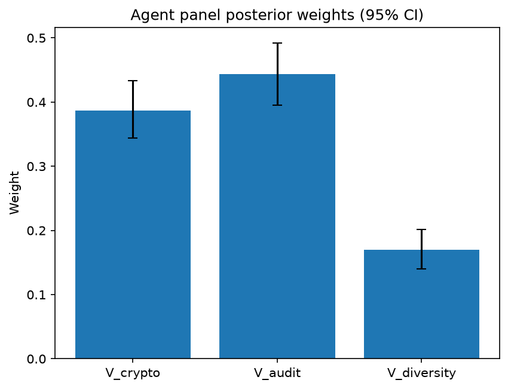

# Survey report: TrustRouter Agentic Full Panel (phi4:14b) -- Level L3c: Verification Strength sub-parts

Survey ID: `trustrouter-agentic-full-panel-phi4-14b-2026-09-01-L3c`

## Agent panel

- Agents contributing a valid response: 36
- Classical BWM consistency: 36/36 within threshold

| Criterion | Mean | 95% CI lower | 95% CI upper |
|---|---|---|---|
| V_crypto | 0.3872 | 0.3436 | 0.4331 |
| V_audit | 0.4433 | 0.3952 | 0.4916 |
| V_diversity | 0.1695 | 0.1397 | 0.2020 |


## Methodology

Each agent independently completed a Best-Worst Method (BWM) comparison: choosing the single most and least important criterion, then rating every criterion's importance relative to those two on a 1-9 scale. Individual responses were solved with the classical BWM linear program (Rezaei, 2015) for a consistency check, and combined across the panel with a hierarchical Bayesian model (Mohammadi and Rezaei, 2020).


36 agent response(s) were accepted into this result.


Every agent's run began with a QA precheck (its stated configuration verified against ground truth) and every accepted answer's self-reported sources were checked against what reference material was actually available to it; see the Per-agent detail section below and this survey's Conversation Log for each agent's specific results. Every response is schema-validated and independently, repeatedly sampled (never a single completion treated as ground truth); see `guardrails.py`. This survey's complete output is covered by a SHA-256 integrity manifest (`integrity_manifest.json`, `SHA256SUMS`), generated once this run finished, so any later alteration to these files is detectable.


### Charts




## Per-agent detail

### bim-coordinator-base-openmanus (`bim-coordinator-base-openmanus`)

- Role: BIM Coordinator
- Model: ollama/phi4:14b
- DID: `did:key:z6MktjVuxsZoffjLx6zYtw8Bf8nm7iULqLcJwyu2VgSuM19E`
- QA precheck: passed
- Sources used: (not reported)

**Answer:** `{"best": "V_audit", "worst": "V_diversity", "best_to_others": {"V_audit": 1, "V_crypto": 7, "V_diversity": 8}, "others_to_worst": {"V_diversity": 1, "V_crypto": 5, "V_audit": 8}}`

**Reasoning:**

As a BIM coordinator with extensive experience managing Building Information Models on renovation and new-build projects, I understand the importance of verification strength in ensuring data integrity and trustworthiness. This involves cryptographic evidence (V_crypto), audit trail completeness (V_audit), and diversity of independent verification sources (V_diversity).

**Best factor: V_audit**

Audit trail completeness is crucial because it provides a detailed record of who did what and when, which is essential for accountability and traceability in construction projects. This ensures that any changes or actions taken on the BIM are transparent and can be verified by stakeholders.

**Worst factor: V_diversity**

While diversity of verification sources is important, it is less critical than having a complete audit trail. The presence of multiple independent verifiers adds robustness but does not inherently provide the detailed accountability that an audit trail offers.

In summary, while all three factors contribute to verification strength, the completeness and transparency provided by V_audit make it the most important criterion in this context.

As a BIM coordinator with experience in managing Building Information Models, I understand the importance of verification strength in ensuring data integrity and trustworthiness. Here are my ratings based on the criteria provided:

**V_audit vs V_crypto:** 7  
Audit trail completeness is more important than cryptographic evidence because it provides detailed records of actions taken, which is crucial for accountability and traceability.

**V_audit vs V_diversity:** 8  
The completeness of an audit trail is significantly more critical than having diverse verification sources, as it directly impacts transparency and stakeholder trust.

**V_crypto vs V_diversity:** 5  
Cryptographic evidence is moderately more important than diversity of verification sources because it ensures data integrity through secure methods like signatures and hashes.

### bim-coordinator-base-openmanus (`bim-coordinator-base-openmanus`)

- Role: BIM Coordinator
- Model: ollama/phi4:14b
- DID: `did:key:z6MktjVuxsZoffjLx6zYtw8Bf8nm7iULqLcJwyu2VgSuM19E`
- QA precheck: passed
- Sources used: (not reported)

**Answer:** `{"best": "V_audit", "worst": "V_diversity", "best_to_others": {"V_audit": 1, "V_crypto": 7, "V_diversity": 8}, "others_to_worst": {"V_diversity": 1, "V_crypto": 6, "V_audit": 8}}`

**Reasoning:**

As a BIM Coordinator with extensive experience managing Building Information Models for both renovation and new-build projects, I approach the criteria provided through the lens of practical application in construction project data management. The focus is on ensuring that data integrity, trustworthiness, and reliability are maintained throughout the lifecycle of a building project.

**Best factor: V_audit**

Audit trail completeness (V_audit) stands out as the most critical criterion for several reasons:

1. **Traceability**: In construction projects, it's essential to have a clear record of who did what and when. This traceability ensures accountability and helps in resolving disputes or discrepancies that may arise during or after project completion.
2. **Compliance and Verification**: An audit trail is crucial for compliance with regulatory requirements and standards. It provides a verifiable path that can be audited by third parties, ensuring that all actions taken on the BIM are legitimate and authorized.
3. **Change Management**: Construction projects often undergo numerous changes. A comprehensive audit trail helps in tracking these changes, understanding their impact, and managing them effectively.

**Worst factor: V_diversity**

While diversity of verification sources (V_diversity) is important for ensuring that data has been independently verified by multiple parties, it ranks as the least critical among the three criteria for the following reasons:

1. **Practical Limitations**: In many construction projects, especially those with tight budgets or timelines, achieving a high level of diversity in verification sources may not be feasible.
2. **Dependence on Other Factors**: The effectiveness of diverse verification is inherently linked to the quality and completeness of the audit trail. Without a solid audit trail (V_audit), even diverse verification efforts can fall short of providing meaningful assurance.

In conclusion, while cryptographic evidence (V_crypto) provides a strong foundation for data integrity through secure signatures, hashes, and PKI, it is the comprehensive audit trail (V_audit) that ensures actionable traceability and accountability in construction projects. Diversity of verification sources (V_diversity), though valuable, is considered less critical due to practical constraints and its dependency on other factors like a robust audit trail.

Best factor: V_audit  
Worst factor: V_diversity

Given the prioritization of audit trail completeness (V_audit) as the most important criterion and diversity of verification sources (V_diversity) as the least, here are the ratings on a 1-9 scale:

```
V_audit vs V_crypto: 7
V_audit vs V_diversity: 8
V_crypto vs V_diversity: 6
```

**Reasoning:**

1. **V_audit vs V_crypto (7):** Audit trail completeness is significantly more important than cryptographic evidence because it provides a comprehensive record of actions and changes, which is crucial for accountability and compliance in construction projects.

2. **V_audit vs V_diversity (8):** The importance of audit trail completeness over diversity of verification sources is even greater due to its direct impact on traceability and change management, whereas diversity can be limited by practical constraints.

3. **V_crypto vs V_diversity (6):** Cryptographic evidence is more important than diversity of verification sources because it ensures data integrity through secure methods, but the gap in importance is not as wide as between audit trail completeness and either of these factors.

### bim-coordinator-base-openmanus (`bim-coordinator-base-openmanus`)

- Role: BIM Coordinator
- Model: ollama/phi4:14b
- DID: `did:key:z6MktjVuxsZoffjLx6zYtw8Bf8nm7iULqLcJwyu2VgSuM19E`
- QA precheck: passed
- Sources used: (not reported)

**Answer:** `{"best": "V_audit", "worst": "V_diversity", "best_to_others": {"V_audit": 1, "V_crypto": 7, "V_diversity": 9}, "others_to_worst": {"V_diversity": 1, "V_crypto": 5, "V_audit": 9}}`

**Reasoning:**

As a BIM Coordinator with extensive experience managing Building Information Models on renovation and new-build projects, I approach the criteria for Verification Strength (V) from the perspective of ensuring data integrity and trustworthiness in construction-project records considered for blockchain storage.

**Best factor: V_audit**

Audit trail completeness is crucial because it provides a detailed record of who did what and when. This transparency is essential for verifying actions taken on project data, which is particularly important in multi-stakeholder environments like those I manage. An audit trail ensures accountability and traceability, which are fundamental to maintaining trust in the data's integrity.

**Worst factor: V_diversity**

While diversity of independent verification sources is valuable, it is less critical than cryptographic evidence and audit trails in this context. Cryptographic methods provide robust security measures that protect data from tampering, and audit trails offer transparency and accountability. Diversity can enhance trust but does not directly impact the integrity or traceability of individual records as significantly as the other two factors.

**Reasoning:**

- **V_audit vs. V_crypto:** Both are essential, but an audit trail offers a comprehensive view of data interactions over time, which is vital for understanding and verifying changes in complex projects.
  
- **V_audit vs. V_diversity:** Audit trails provide direct evidence of actions taken on the data, whereas diversity relies on external verification sources that may not always be directly related to specific project activities.

In conclusion, while all three factors contribute to Verification Strength, audit trail completeness is paramount for ensuring accountability and traceability in construction-project records, making it the most important criterion. Diversity, though beneficial, ranks as the least critical in this context due to its indirect role in verification processes.

As a BIM Coordinator with experience in managing Building Information Models for construction projects, I consider the following ratings based on the importance of each criterion:

- **V_audit vs V_crypto:** 7  
  Audit trail completeness is more important than cryptographic evidence because it provides transparency and accountability regarding who did what and when. While cryptographic methods are crucial for data security, an audit trail offers a comprehensive view of interactions with the data over time.

- **V_audit vs V_diversity:** 9  
  Audit trail completeness is extremely more important than diversity of verification sources. An audit trail directly impacts the traceability and accountability of actions taken on project data, which are critical for maintaining trust in multi-stakeholder environments.

- **V_crypto vs V_diversity:** 5  
  Cryptographic evidence is moderately more important than diversity of verification sources. Cryptography provides essential security measures to protect data integrity, whereas diversity enhances trust through external verification but does not directly impact the integrity or traceability of individual records as significantly.

### bim-coordinator-rag-openmanus (`bim-coordinator-rag-openmanus`)

- Role: BIM Coordinator
- Model: ollama/phi4:14b
- DID: `did:key:z6MkfG5MseccUr21HZSLdPeQrKdR9LQwcXkD4pWXKcUh7U1C`
- QA precheck: passed
- Sources used: (not reported)

**Answer:** `{"best": "V_audit", "worst": "V_diversity", "best_to_others": {"V_audit": 1, "V_crypto": 7, "V_diversity": 9}, "others_to_worst": {"V_diversity": 1, "V_crypto": 5, "V_audit": 9}}`

**Reasoning:**

**Reasoning**

As a BIM Coordinator with extensive experience in managing Building Information Models on both renovation and new-build projects, my decision is grounded in the specific demands of model federation, data integrity, and compliance within construction projects. The criteria under consideration are:

- **V_crypto**: Cryptographic evidence (signatures, hashes, PKI)
- **V_audit**: Audit trail completeness (who did what, when)
- **V_diversity**: Diversity of verification sources

**Best Criterion: V_audit**

The audit trail completeness is paramount in the context of BIM coordination. It ensures transparency and accountability throughout the project lifecycle by meticulously documenting who made changes, when they were made, and why. This level of detail is crucial for resolving disputes, verifying compliance with design specifications, and maintaining a clear record of decision-making processes. Given the collaborative nature of construction projects involving multiple stakeholders (architects, engineers, contractors), having a robust audit trail helps in tracking contributions and changes across different phases of the project.

**Worst Criterion: V_diversity**

While diversity of verification sources is important for ensuring data reliability through cross-verification, it ranks lower compared to cryptographic evidence and audit trails. In practice, while multiple sources can enhance confidence in data accuracy, they do not inherently provide the same level of accountability or integrity assurance as a comprehensive audit trail does. Cryptographic evidence (V_crypto) also plays a critical role by securing data against tampering; however, without an audit trail, it is challenging to contextualize and verify these cryptographic assurances within the project workflow.

**Conclusion**

In summary, for BIM coordination, ensuring that every action and change is transparently recorded and attributable is essential. Therefore, **V_audit** is identified as the most important criterion, while **V_diversity**, though valuable, is considered less critical in comparison to the other factors.

Best factor: V_audit  
Worst factor: V_diversity

Based on the reasoning provided:

- **V_audit vs V_crypto**: 7  
  Audit trail completeness is significantly more important than cryptographic evidence because it provides a detailed record of actions and changes, which is crucial for accountability and transparency in BIM coordination.

- **V_audit vs V_diversity**: 9  
  The audit trail is extremely more important compared to the diversity of verification sources. While diversity enhances reliability, it does not offer the same level of detail and accountability as a comprehensive audit trail.

- **V_crypto vs V_diversity**: 5  
  Cryptographic evidence is moderately more important than the diversity of verification sources. Cryptography ensures data integrity and security, which are essential, but without an audit trail, its context within project workflows remains limited compared to the benefits provided by diverse verification sources.

### bim-coordinator-rag-openmanus (`bim-coordinator-rag-openmanus`)

- Role: BIM Coordinator
- Model: ollama/phi4:14b
- DID: `did:key:z6MkfG5MseccUr21HZSLdPeQrKdR9LQwcXkD4pWXKcUh7U1C`
- QA precheck: passed
- Sources used: (not reported)

**Answer:** `{"best": "V_crypto", "worst": "V_diversity", "best_to_others": {"V_crypto": 1, "V_audit": 7, "V_diversity": 9}, "others_to_worst": {"V_diversity": 1, "V_audit": 5, "V_crypto": 9}}`

**Reasoning:**

**Reasoning**

As a BIM Coordinator with extensive experience in managing Building Information Models across renovation and new-build projects, my professional judgment is grounded in the practicalities of model federation, data integrity, and verification processes. The three criteria under consideration—cryptographic evidence (V_crypto), audit trail completeness (V_audit), and diversity of independent verification sources (V_diversity)—each play a critical role in ensuring the trustworthiness and reliability of construction data.

1. **Cryptographic Evidence (V_crypto)**: This criterion involves using cryptographic techniques such as digital signatures, hashes, and public-key infrastructure to ensure data integrity and authenticity. In my experience, cryptographic evidence is fundamental for establishing a secure foundation for data verification. It provides a robust mechanism to detect any unauthorized alterations or tampering with the data, which is crucial in maintaining trust in the BIM environment.

2. **Audit Trail Completeness (V_audit)**: This criterion focuses on maintaining comprehensive records of who did what and when within the data lifecycle. An audit trail is essential for accountability and transparency, allowing stakeholders to trace back any changes or actions taken on the data. In practice, having a complete audit trail supports compliance with industry standards and regulations, such as ISO 19650, which mandates independent validation of federated models.

3. **Diversity of Independent Verification Sources (V_diversity)**: This criterion emphasizes the importance of having multiple independent sources verify the data to reduce bias and increase reliability. While diversity in verification is valuable for cross-checking information and enhancing confidence in the data's accuracy, it often relies on the foundational integrity provided by cryptographic evidence.

**Decision**

Given these considerations, I determine that **cryptographic evidence (V_crypto)** is the most important criterion. It provides a fundamental layer of security and trustworthiness that underpins all other verification processes. Without strong cryptographic measures, the integrity of the data could be compromised, rendering audit trails and diverse verification less effective.

On the other hand, while diversity in verification sources is beneficial, it is dependent on the initial assurance provided by cryptographic evidence and complete audit trails. Therefore, **diversity of independent verification sources (V_diversity)** is considered the least important criterion in this context, as its effectiveness is contingent upon the foundational security established by cryptographic measures.

**Answer**

Best factor: V_crypto  
Worst factor: V_diversity

Based on the reasoning provided:

- **V_crypto vs V_audit**: Cryptographic evidence is crucial for ensuring data integrity and authenticity, which forms the foundation of trust. While audit trails are essential for accountability, they rely on the data being secure in the first place. Therefore, cryptographic evidence is more important.

  Rating: 7

- **V_crypto vs V_diversity**: Cryptographic evidence provides a fundamental layer of security that underpins all other verification processes. Diversity of sources enhances reliability but depends on the initial integrity provided by cryptography. Thus, cryptographic evidence is significantly more important.

  Rating: 9

- **V_audit vs V_diversity**: Audit trails are critical for transparency and accountability, ensuring stakeholders can trace actions taken on data. While diversity in verification sources adds value by reducing bias, it is less foundational than maintaining a complete audit trail.

  Rating: 5

```
V_crypto vs V_audit: 7
V_crypto vs V_diversity: 9
V_audit vs V_diversity: 5
```

### bim-coordinator-rag-openmanus (`bim-coordinator-rag-openmanus`)

- Role: BIM Coordinator
- Model: ollama/phi4:14b
- DID: `did:key:z6MkfG5MseccUr21HZSLdPeQrKdR9LQwcXkD4pWXKcUh7U1C`
- QA precheck: passed
- Sources used: (not reported)

**Answer:** `{"best": "V_crypto", "worst": "V_diversity", "best_to_others": {"V_crypto": 1, "V_audit": 8, "V_diversity": 9}, "others_to_worst": {"V_diversity": 1, "V_audit": 6, "V_crypto": 9}}`

**Reasoning:**

**Reasoning**

In evaluating the criteria for Verification Strength (V) in a BIM context, I consider their implications on ensuring data integrity and trustworthiness. 

- **V_crypto**: Cryptographic evidence such as signatures, hashes, and public-key infrastructure (PKI) provides strong assurances of data authenticity and integrity. It ensures that data has not been tampered with and verifies the identity of the authoring source. This is crucial in a BIM environment where multiple stakeholders interact with complex datasets.

- **V_audit**: Audit trail completeness involves tracking who did what and when, providing transparency and accountability for changes made to the data. While important, its effectiveness relies on the robustness of cryptographic measures to ensure that audit logs themselves are secure and trustworthy.

- **V_diversity**: Diversity of independent verification sources enhances trust by reducing reliance on a single source or method of verification. It mitigates risks associated with potential biases or errors from any one verifier. However, without strong cryptographic evidence, the diversity alone may not sufficiently guarantee data integrity.

Given these considerations, **V_crypto** emerges as the most critical factor because it provides foundational security and trust for all other verification processes. Without cryptographic assurances, audit trails and diverse verifications could be compromised. Conversely, while important, **V_diversity** is considered least critical in isolation, as its effectiveness is contingent on the presence of strong cryptographic measures.

**Answer**

Best factor: V_crypto  
Worst factor: V_diversity

In determining the relative importance of each factor on a 1-9 scale:

- **V_crypto vs V_audit**: Cryptographic evidence is foundational for ensuring data integrity and authenticity, making it significantly more important than audit trails. While audits provide transparency, they rely on cryptographic measures to ensure their own security.

  Rating: 8

- **V_crypto vs V_diversity**: Cryptographic evidence provides the core assurance of data integrity, which is essential before considering the benefits of diverse verification sources. Without cryptographic guarantees, diversity alone cannot ensure trustworthiness.

  Rating: 9

- **V_audit vs V_diversity**: Audit trails offer direct insights into data changes and accountability, making them more critical than diversity in isolation. However, diversity adds value by providing multiple perspectives on the data's integrity.

  Rating: 6

```plaintext
V_crypto vs V_audit: 8
V_crypto vs V_diversity: 9
V_audit vs V_diversity: 6
```

### blockchain-engineer-base-openmanus (`blockchain-engineer-base-openmanus`)

- Role: Blockchain / DLT Engineer
- Model: ollama/phi4:14b
- DID: `did:key:z6Mkt3rBXTsyaURYSmKVDjYBpnSZtGCDZ2onmnLPwD2iWGby`
- QA precheck: passed
- Sources used: (not reported)

**Answer:** `{"best": "V_crypto", "worst": "V_diversity", "best_to_others": {"V_crypto": 1, "V_audit": 7, "V_diversity": 9}, "others_to_worst": {"V_diversity": 1, "V_audit": 6, "V_crypto": 9}}`

**Reasoning:**

**Reasoning:**

As a blockchain/DLT engineer with experience in permissioned-ledger deployments, I evaluate these criteria based on their relevance to ensuring data integrity and trustworthiness within such systems.

1. **V_crypto (Cryptographic evidence):** Cryptographic methods are foundational for securing data on blockchains. They ensure data immutability and authenticity through mechanisms like digital signatures and hash functions. In permissioned ledgers, where access control is crucial, cryptographic evidence provides a robust layer of security that can be independently verified.

2. **V_audit (Audit trail completeness):** An audit trail ensures transparency by recording who did what and when. This is vital for accountability and traceability in blockchain systems. However, the effectiveness of an audit trail depends on its implementation and integration with cryptographic methods to ensure data integrity.

3. **V_diversity (Diversity of verification sources):** While having multiple independent verification sources can enhance trust by reducing single points of failure or bias, it is less critical than cryptographic evidence in a permissioned setting where access is controlled and participants are known entities.

Given these considerations, cryptographic evidence stands out as the most crucial factor due to its direct impact on data security and integrity. Audit trail completeness, while important for transparency, is secondary to ensuring that the data itself cannot be tampered with or forged. Diversity of verification sources adds value but is less critical in a controlled environment like permissioned blockchains.

**Conclusion:**

Best factor: V_crypto  
Worst factor: V_diversity

**Reasoning:**

To determine the ratings on a 1-9 scale, I will compare each pair of criteria based on their relative importance in ensuring data integrity and trustworthiness within permissioned-ledger deployments.

1. **V_crypto vs V_audit:** Cryptographic evidence (V_crypto) is fundamental for securing data through mechanisms like digital signatures and hash functions, which are essential for immutability and authenticity. Audit trail completeness (V_audit) provides transparency and accountability but relies on cryptographic methods to ensure the integrity of recorded actions. Therefore, while both are important, V_crypto is more critical.

   **Rating:** V_crypto vs V_audit: 7

2. **V_crypto vs V_diversity:** Cryptographic evidence ensures data security and integrity directly, which is crucial in any blockchain system. Diversity of verification sources (V_diversity) enhances trust by reducing bias or single points of failure but does not provide the same foundational security as cryptographic methods. In a permissioned environment where participants are known, V_crypto remains more important.

   **Rating:** V_crypto vs V_diversity: 9

3. **V_audit vs V_diversity:** An audit trail (V_audit) is essential for transparency and accountability, recording actions in a verifiable manner. Diversity of verification sources (V_diversity) adds value by providing multiple perspectives but does not directly impact the integrity or security of data as much as an audit trail does.

   **Rating:** V_audit vs V_diversity: 6

**Conclusion:**

- V_crypto vs V_audit: 7
- V_crypto vs V_diversity: 9
- V_audit vs V_diversity: 6

### blockchain-engineer-base-openmanus (`blockchain-engineer-base-openmanus`)

- Role: Blockchain / DLT Engineer
- Model: ollama/phi4:14b
- DID: `did:key:z6Mkt3rBXTsyaURYSmKVDjYBpnSZtGCDZ2onmnLPwD2iWGby`
- QA precheck: passed
- Sources used: (not reported)

**Answer:** `{"best": "V_crypto", "worst": "V_diversity", "best_to_others": {"V_crypto": 1, "V_audit": 7, "V_diversity": 9}, "others_to_worst": {"V_diversity": 1, "V_audit": 5, "V_crypto": 9}}`

**Reasoning:**

Based on my professional experience as a Blockchain/DLT Engineer with production experience in permissioned-ledger deployments, I will evaluate the criteria for their importance in ensuring data integrity and trustworthiness.

**V_crypto (Cryptographic evidence)** is crucial because it provides strong guarantees of data authenticity and integrity through mechanisms like digital signatures and hash functions. Cryptographic methods are foundational to blockchain technology, offering tamper-evidence and non-repudiation, which are essential for secure transactions and record-keeping.

**V_audit (Audit trail completeness)** ensures that there is a comprehensive log of who did what and when, providing transparency and accountability. This is important in verifying the actions taken on data and ensuring compliance with regulatory requirements.

**V_diversity (Diversity of verification sources)** enhances trust by involving multiple independent parties in the verification process. While this adds robustness to the system by reducing reliance on a single source, it may not be as critical as cryptographic methods for ensuring data integrity at a fundamental level.

Considering these aspects, I would prioritize **V_crypto** as the most important criterion due to its foundational role in securing data and providing tamper-evidence. On the other hand, while all criteria are significant, **V_diversity** might be considered less critical than cryptographic evidence or audit trail completeness in certain contexts where the primary concern is ensuring data integrity through technical means.

Best factor: V_crypto  
Worst factor: V_diversity

Given the prioritization of **V_crypto** as the most important criterion and **V_diversity** as the least, I will now provide the ratings on a 1-9 scale:

- **V_crypto vs V_audit**: Cryptographic evidence is more critical than audit trail completeness because it provides fundamental security guarantees. However, both are essential for ensuring data integrity and trustworthiness. Therefore, I would rate this comparison as moderately important.

- **V_crypto vs V_diversity**: Cryptographic evidence is significantly more crucial than the diversity of verification sources in terms of providing direct technical assurances of data integrity and authenticity. Thus, this difference is rated higher on the scale.

- **V_audit vs V_diversity**: Audit trail completeness is more important than diversity of verification sources because it directly relates to transparency and accountability, which are critical for compliance and trust. However, both contribute to a robust system, so this comparison is moderately important.

Here are the ratings:

V_crypto vs V_audit: 7  
V_crypto vs V_diversity: 9  
V_audit vs V_diversity: 5

### blockchain-engineer-base-openmanus (`blockchain-engineer-base-openmanus`)

- Role: Blockchain / DLT Engineer
- Model: ollama/phi4:14b
- DID: `did:key:z6Mkt3rBXTsyaURYSmKVDjYBpnSZtGCDZ2onmnLPwD2iWGby`
- QA precheck: passed
- Sources used: (not reported)

**Answer:** `{"best": "V_crypto", "worst": "V_diversity", "best_to_others": {"V_crypto": 1, "V_audit": 8, "V_diversity": 9}, "others_to_worst": {"V_diversity": 1, "V_audit": 7, "V_crypto": 9}}`

**Reasoning:**

As a Blockchain/DLT Engineer with experience in permissioned-ledger deployments, I will evaluate these criteria based on their importance for ensuring data integrity and trustworthiness.

**V_crypto (Cryptographic evidence):** Cryptographic methods such as signatures, hashes, and PKI are fundamental to blockchain technology. They provide strong guarantees of data integrity and authenticity. In a permissioned ledger, cryptographic evidence is crucial because it ensures that data has not been tampered with and verifies the identity of participants.

**V_audit (Audit trail completeness):** An audit trail provides transparency by recording who did what and when. This is important for accountability and traceability in any system, including blockchain. However, while essential, an audit trail alone does not prevent unauthorized changes to data; it only records them after they occur.

**V_diversity (Diversity of verification sources):** Having multiple independent parties verify the data can enhance trust by reducing reliance on a single source. This diversity is valuable for mitigating risks associated with collusion or errors from a single verifier. However, without cryptographic evidence, diverse verifications might not prevent tampering effectively.

Considering these points, **V_crypto** is likely the most important criterion because it provides foundational security guarantees that are essential for any blockchain system. Without strong cryptographic evidence, other measures like audit trails and diversity of verification sources would be less effective in ensuring data integrity.

On the other hand, while all criteria contribute to trustworthiness, **V_diversity** might be considered the least critical compared to the others. This is because its effectiveness depends on having robust cryptographic evidence and comprehensive audit trails already in place. Without these foundational elements, diversity alone cannot ensure data integrity or authenticity.

Therefore, my assessment is:

Best factor: V_crypto  
Worst factor: V_diversity

To provide the ratings on a 1-9 scale:

**V_crypto vs V_audit:** Cryptographic evidence is fundamentally more important than audit trail completeness because it ensures data integrity and authenticity at its core. Without cryptographic guarantees, an audit trail alone cannot prevent unauthorized changes.

Rating: 8

**V_crypto vs V_diversity:** Cryptographic evidence is significantly more critical than the diversity of verification sources. While diverse verifications add value by reducing reliance on a single source, they are not as foundational as cryptographic methods in ensuring data integrity and authenticity.

Rating: 9

**V_audit vs V_diversity:** An audit trail provides essential transparency and accountability, which can be considered more important than the diversity of verification sources. While both contribute to trustworthiness, an audit trail directly records actions for traceability, whereas diversity is a supplementary measure that enhances reliability when combined with other factors.

Rating: 7

Here are the ratings:

V_crypto vs V_audit: 8  
V_crypto vs V_diversity: 9  
V_audit vs V_diversity: 7

### blockchain-engineer-rag-openmanus (`blockchain-engineer-rag-openmanus`)

- Role: Blockchain / DLT Engineer
- Model: ollama/phi4:14b
- DID: `did:key:z6Mko8hHqpF7sFFLRW2GQFdJtGuQ5oszhR6pSFVQor3f2sFZ`
- QA precheck: passed
- Sources used: (not reported)

**Answer:** `{"best": "V_audit", "worst": "V_diversity", "best_to_others": {"V_audit": 1, "V_crypto": 7, "V_diversity": 9}, "others_to_worst": {"V_diversity": 1, "V_crypto": 5, "V_audit": 9}}`

**Reasoning:**

Based on my professional experience as a Blockchain/DLT Engineer with production experience in permissioned-ledger deployments, I will evaluate the criteria for their importance in ensuring data integrity and trustworthiness.

**Best factor:** V_audit  
**Worst factor:** V_diversity

### Explanation:

- **V_audit (Audit trail completeness):** This criterion is crucial because it ensures transparency and accountability by documenting who did what and when. In permissioned ledgers, where access control is a significant feature, having a complete audit trail helps in verifying the integrity of transactions and maintaining trust among participants. It directly impacts the ability to trace actions back to their origin, which is essential for compliance and security.

- **V_crypto (Cryptographic evidence):** While cryptographic evidence like signatures and hashes are fundamental for ensuring data authenticity and integrity, they do not provide information about the context or sequence of events. Cryptography ensures that data has not been tampered with but does not inherently track who performed actions or when they occurred.

- **V_diversity (Diversity of verification sources):** Although having multiple independent verification sources can enhance trust by reducing reliance on a single point of failure, it is often less critical than ensuring complete audit trails. In many scenarios, especially in permissioned environments, the focus is more on controlling and verifying access rather than diversifying verification sources.

In conclusion, while all three criteria are important for maintaining data integrity and trust, the completeness of an audit trail (V_audit) stands out as the most crucial factor due to its role in ensuring transparency and accountability. Conversely, diversity of verification sources (V_diversity), though beneficial, is considered less critical compared to the other two factors in this context.

Based on the analysis provided:

- **V_audit vs V_crypto:** 7  
  Audit trail completeness is more important than cryptographic evidence because it provides context and accountability, which are crucial for trust in permissioned environments.

- **V_audit vs V_diversity:** 9  
  The audit trail's role in ensuring transparency and traceability makes it extremely more important compared to the diversity of verification sources.

- **V_crypto vs V_diversity:** 5  
  Cryptographic evidence is moderately more important than diversity of verification sources, as it directly ensures data integrity, whereas diversity enhances trust but is less critical.

### blockchain-engineer-rag-openmanus (`blockchain-engineer-rag-openmanus`)

- Role: Blockchain / DLT Engineer
- Model: ollama/phi4:14b
- DID: `did:key:z6Mko8hHqpF7sFFLRW2GQFdJtGuQ5oszhR6pSFVQor3f2sFZ`
- QA precheck: passed
- Sources used: (not reported)

**Answer:** `{"best": "V_audit", "worst": "V_diversity", "best_to_others": {"V_audit": 1, "V_crypto": 7, "V_diversity": 9}, "others_to_worst": {"V_diversity": 1, "V_crypto": 8, "V_audit": 9}}`

**Reasoning:**

Based on my professional judgement as a Blockchain/DLT Engineer with experience in permissioned-ledger deployments, I will evaluate the criteria for their importance in ensuring data trust and security within blockchain systems.

**Best factor: V_audit**

Audit trail completeness is crucial because it provides detailed records of who did what and when. This transparency is essential for accountability and traceability, which are fundamental to maintaining trust in a system where multiple parties may interact with shared data. An audit trail helps detect unauthorized changes or access, ensuring that all actions can be traced back to their origin.

**Worst factor: V_diversity**

While diversity of verification sources adds robustness by incorporating multiple perspectives and reducing the risk of collusion, it is less critical than cryptographic evidence and audit trails in a permissioned environment. In such settings, participants are typically known and vetted entities, which reduces the necessity for diverse independent verifications compared to public blockchains.

These evaluations are based on typical use cases and priorities within permissioned blockchain systems, where ensuring accountability and traceability often takes precedence over source diversity.

Based on the importance of each factor as discussed:

- **V_audit vs V_crypto:** 7  
  Audit trail completeness is very important for accountability and traceability, but cryptographic evidence (signatures, hashes, PKI) provides fundamental security guarantees that underpin trust in any blockchain system. While both are crucial, cryptography forms the base layer of security.

- **V_audit vs V_diversity:** 9  
  Audit trails are significantly more critical than diversity of verification sources in a permissioned environment where participants are known and trusted entities. The ability to trace actions is paramount for accountability.

- **V_crypto vs V_diversity:** 8  
  Cryptographic evidence is extremely important as it ensures data integrity and authenticity, which are foundational security aspects. Diversity of verification sources adds value but is less critical than cryptographic guarantees in a controlled environment.

### blockchain-engineer-rag-openmanus (`blockchain-engineer-rag-openmanus`)

- Role: Blockchain / DLT Engineer
- Model: ollama/phi4:14b
- DID: `did:key:z6Mko8hHqpF7sFFLRW2GQFdJtGuQ5oszhR6pSFVQor3f2sFZ`
- QA precheck: passed
- Sources used: (not reported)

**Answer:** `{"best": "V_audit", "worst": "V_diversity", "best_to_others": {"V_audit": 1, "V_crypto": 7, "V_diversity": 9}, "others_to_worst": {"V_diversity": 1, "V_crypto": 5, "V_audit": 9}}`

**Reasoning:**

**Best factor:** V_audit  
**Worst factor:** V_diversity  

### Reasoning:

1. **V_audit (Audit trail completeness):**
   - The importance of having a complete audit trail is paramount in ensuring data integrity and trustworthiness. An audit trail provides a detailed record of who did what and when, which is crucial for accountability and transparency.
   - In the context of permissioned blockchains like Hyperledger Fabric, as mentioned in Rouhani and Deters (2021), adaptive transaction validation relies heavily on the completeness of the audit trail to adjust trust levels dynamically. This directly impacts how data is validated and trusted within the system.

2. **V_crypto (Cryptographic evidence):**
   - Cryptographic evidence such as signatures, hashes, and PKI are fundamental for ensuring data authenticity and integrity. However, while essential, they do not provide context about the actions taken on the data or by whom.
   - Cryptographic measures alone cannot establish a complete picture of trust without understanding the audit trail that accompanies these cryptographic proofs.

3. **V_diversity (Diversity of verification sources):**
   - While diversity in verification sources can enhance reliability and reduce single points of failure, it is less critical than having a comprehensive audit trail.
   - The effectiveness of diverse verification sources depends on the quality and completeness of the data they verify. Without a robust audit trail, the value added by multiple sources may be limited.

In summary, while all three criteria are important for ensuring data trustworthiness, the audit trail's role in providing transparency and accountability makes it the most critical factor (Best), whereas diversity of verification sources, though beneficial, is less crucial compared to the other two (Worst).

```
V_audit vs V_crypto: 7
V_audit vs V_diversity: 9
V_crypto vs V_diversity: 5
```

### Explanation:

1. **V_audit vs V_crypto (7):**  
   - The audit trail is significantly more important than cryptographic evidence because it provides context and accountability, which are crucial for trustworthiness in a permissioned blockchain environment.

2. **V_audit vs V_diversity (9):**  
   - An audit trail's completeness is extremely more important compared to the diversity of verification sources. Without a complete audit trail, even diverse sources cannot fully ensure data integrity and accountability.

3. **V_crypto vs V_diversity (5):**  
   - Cryptographic evidence is moderately more important than diversity of verification sources. While both are valuable, cryptographic measures provide fundamental security that underpins the trustworthiness of data, whereas diversity enhances reliability but does not replace core security functions.

### compliance-officer-base-openmanus (`compliance-officer-base-openmanus`)

- Role: Compliance and Regulatory Officer
- Model: ollama/phi4:14b
- DID: `did:key:z6MkhbjMCfTLP5x4Chc2q7Rskakua1JQfKHHRZtyr5dc3r8w`
- QA precheck: passed
- Sources used: (not reported)

**Answer:** `{"best": "V_crypto", "worst": "V_diversity", "best_to_others": {"V_crypto": 1, "V_audit": 7, "V_diversity": 9}, "others_to_worst": {"V_diversity": 1, "V_audit": 5, "V_crypto": 9}}`

**Reasoning:**

**Reasoning:**

As a facility-management compliance officer responsible for GDPR and construction-regulatory obligations across a building's operational lifecycle, I must consider the importance of each criterion in ensuring data trustworthiness within this context. 

1. **V_crypto (Cryptographic evidence):** Cryptographic measures such as signatures, hashes, and PKI are fundamental to ensuring data integrity and authenticity. They provide strong assurances that data has not been tampered with and originate from a verified source. This is crucial in regulatory compliance, especially under GDPR, where data integrity is paramount.

2. **V_audit (Audit trail completeness):** An audit trail provides transparency into who did what and when, which is essential for accountability and traceability. In the context of construction projects, this helps ensure that all actions are documented and can be reviewed if necessary, supporting compliance with both GDPR and other regulatory requirements.

3. **V_diversity (Diversity of verification sources):** Having multiple independent parties verify data enhances trust by reducing the risk of collusion or error from a single source. While important, it is often considered supplementary to cryptographic evidence and audit trails in terms of foundational importance for compliance.

Given these considerations, cryptographic evidence (V_crypto) is likely the most critical factor as it directly ensures data integrity and authenticity, which are foundational for trust and compliance. Audit trail completeness (V_audit) follows closely due to its role in accountability and traceability. Diversity of verification sources (V_diversity), while important, is less fundamental than the other two criteria.

**Conclusion:**

Best factor: V_crypto  
Worst factor: V_diversity

**Reasoning:**

To determine the ratings on a 1-9 scale, I will compare each pair of criteria based on their relative importance in ensuring data trustworthiness within the context of GDPR and construction-regulatory obligations.

1. **V_crypto vs V_audit:** Cryptographic evidence (V_crypto) is foundational for ensuring data integrity and authenticity, which are critical for compliance with regulations like GDPR. While audit trails (V_audit) provide necessary transparency and accountability, cryptographic measures directly protect against unauthorized alterations. Therefore, V_crypto is significantly more important than V_audit.

2. **V_crypto vs V_diversity:** Cryptographic evidence (V_crypto) provides a direct mechanism to ensure data integrity and authenticity, which are crucial for compliance. Diversity of verification sources (V_diversity), while enhancing trust by reducing reliance on a single source, does not offer the same level of foundational assurance as cryptographic measures. Thus, V_crypto is much more important than V_diversity.

3. **V_audit vs V_diversity:** Audit trails (V_audit) are essential for accountability and traceability, which are critical in regulatory compliance contexts. Diversity of verification sources (V_diversity) supports trust but does not directly address the need for detailed records of actions taken on data. Therefore, V_audit is more important than V_diversity.

**Conclusion:**

V_crypto vs V_audit: 7  
V_crypto vs V_diversity: 9  
V_audit vs V_diversity: 5

### compliance-officer-base-openmanus (`compliance-officer-base-openmanus`)

- Role: Compliance and Regulatory Officer
- Model: ollama/phi4:14b
- DID: `did:key:z6MkhbjMCfTLP5x4Chc2q7Rskakua1JQfKHHRZtyr5dc3r8w`
- QA precheck: passed
- Sources used: (not reported)

**Answer:** `{"best": "V_audit", "worst": "V_diversity", "best_to_others": {"V_audit": 1, "V_crypto": 7, "V_diversity": 8}, "others_to_worst": {"V_diversity": 1, "V_crypto": 6, "V_audit": 8}}`

**Reasoning:**

In assessing the importance of the criteria for a facility-management compliance officer responsible for GDPR and construction-regulatory obligations across a building's operational lifecycle, I consider the specific roles these factors play in ensuring data integrity and trustworthiness.

**Best factor: V_audit**

Audit trail completeness is paramount because it provides a detailed record of who did what and when. This transparency is crucial for accountability and compliance with regulations like GDPR, which emphasize data protection and privacy. An audit trail helps verify that all actions taken on data are legitimate and traceable, thereby supporting both internal audits and external regulatory reviews.

**Worst factor: V_diversity**

While diversity of verification sources adds robustness by involving multiple independent parties, it is less critical than the other factors in this context. The primary concern for a compliance officer is ensuring that actions on data are properly recorded and verifiable through audit trails. Cryptographic evidence (V_crypto) also plays a significant role in securing data integrity, but without comprehensive audit trails, even cryptographic measures may not fully address accountability concerns.

In summary, the ability to track and verify actions through complete audit trails is essential for compliance and trust, making V_audit the most important criterion. Conversely, while valuable, diversity of verification sources (V_diversity) is less critical in this specific context compared to the other factors.

Best factor: V_audit  
Worst factor: V_diversity

Given the prioritization of audit trail completeness (V_audit) as the most important factor, I will assign ratings reflecting its relative importance compared to cryptographic evidence (V_crypto) and diversity of verification sources (V_diversity).

1. **V_audit vs V_crypto:**  
   Audit trails provide a comprehensive record of actions, which is crucial for accountability and compliance. Cryptographic evidence ensures data integrity but does not offer the same level of traceability as audit trails. Therefore, I rate this comparison as:

   V_audit vs V_crypto: 7

2. **V_audit vs V_diversity:**  
   The completeness of an audit trail directly impacts regulatory compliance and internal accountability more significantly than the diversity of verification sources. Thus, it is rated higher in importance:

   V_audit vs V_diversity: 8

3. **V_crypto vs V_diversity:**  
   Cryptographic evidence (V_crypto) provides essential data integrity and security measures, which are more critical than having multiple independent verification sources when considering the core needs of compliance and trustworthiness.

   V_crypto vs V_diversity: 6

These ratings reflect the relative importance of each factor in ensuring compliance and maintaining a trustworthy data environment.

### compliance-officer-base-openmanus (`compliance-officer-base-openmanus`)

- Role: Compliance and Regulatory Officer
- Model: ollama/phi4:14b
- DID: `did:key:z6MkhbjMCfTLP5x4Chc2q7Rskakua1JQfKHHRZtyr5dc3r8w`
- QA precheck: passed
- Sources used: (not reported)

**Answer:** `{"best": "V_crypto", "worst": "V_diversity", "best_to_others": {"V_crypto": 1, "V_audit": 7, "V_diversity": 9}, "others_to_worst": {"V_diversity": 1, "V_audit": 5, "V_crypto": 9}}`

**Reasoning:**

**Reasoning:**

As a facility-management compliance officer responsible for GDPR and construction-regulatory obligations, I must consider the importance of each criterion in ensuring data integrity and trustworthiness throughout a building's operational lifecycle.

1. **V_crypto (Cryptographic evidence):** Cryptographic methods such as signatures, hashes, and PKI are fundamental to ensuring data authenticity and integrity. They provide strong guarantees against tampering and unauthorized access, which is crucial for compliance with GDPR and other regulatory requirements. This makes cryptographic evidence a critical factor in verifying the trustworthiness of construction-project records.

2. **V_audit (Audit trail completeness):** An audit trail that documents who did what and when is essential for accountability and traceability. It helps ensure compliance by providing a clear record of actions taken, which can be crucial during audits or investigations. However, its effectiveness depends on the presence of cryptographic measures to secure the integrity of these records.

3. **V_diversity (Diversity of verification sources):** While having multiple independent verification sources enhances trust and reduces the risk of collusion or bias, it is secondary to ensuring that each source's data is authentic and tamper-proof. Diversity alone cannot guarantee data integrity without cryptographic safeguards.

Given these considerations, cryptographic evidence (V_crypto) is the most critical factor because it underpins the security and authenticity of all other verification processes. Without strong cryptographic measures, audit trails and diverse sources could be compromised. Conversely, while diversity is valuable, it is less critical than ensuring that each piece of data can be verified as authentic and untampered.

**Answer:**

Best factor: V_crypto  
Worst factor: V_diversity

**Reasoning:**

Given the determination that **V_crypto** is the most important factor and **V_diversity** is the least, we need to establish how much more critical each criterion is compared to the others on a scale from 1 (equally important) to 9 (extremely more important).

1. **V_crypto vs V_audit:** Cryptographic evidence provides fundamental security guarantees that are essential for ensuring data integrity and authenticity. While audit trails are crucial for accountability, they rely on cryptographic measures to ensure their reliability. Therefore, cryptographic evidence is significantly more critical than audit trail completeness.

2. **V_crypto vs V_diversity:** Diversity of verification sources adds value by reducing the risk of bias or collusion, but it cannot substitute for the foundational security provided by cryptographic methods. Without cryptographic integrity, diverse sources could still be compromised. Thus, cryptographic evidence is extremely more important than diversity.

3. **V_audit vs V_diversity:** Audit trail completeness is vital for traceability and accountability, which are necessary for compliance and operational transparency. While diversity enhances trust, it does not replace the need for a complete and reliable audit trail. Therefore, audit trail completeness is more important than diversity of verification sources.

**Ratings:**

V_crypto vs V_audit: 7  
V_crypto vs V_diversity: 9  
V_audit vs V_diversity: 5

### compliance-officer-rag-openmanus (`compliance-officer-rag-openmanus`)

- Role: Compliance and Regulatory Officer
- Model: ollama/phi4:14b
- DID: `did:key:z6MknnPyULv317BzskfxgnYty22cc5A3AddPeVZZsocVNgeY`
- QA precheck: passed
- Sources used: (not reported)

**Answer:** `{"best": "V_audit", "worst": "V_crypto", "best_to_others": {"V_audit": 1, "V_diversity": 7, "V_crypto": 9}, "others_to_worst": {"V_crypto": 1, "V_diversity": 6, "V_audit": 9}}`

**Reasoning:**

**Reasoning**

In evaluating the criteria for Verification Strength in a construction-project record considered for blockchain storage, I draw upon my role as a Compliance and Regulatory Officer responsible for GDPR and construction-regulatory obligations. The decision-making process involves assessing each criterion's relevance to regulatory compliance and data governance.

1. **V_crypto (Cryptographic evidence):** Cryptographic measures such as signatures, hashes, and PKI are fundamental in ensuring the integrity and authenticity of records on a blockchain. These mechanisms provide strong assurances against tampering and unauthorized alterations, which is crucial for maintaining trust in the system. However, while cryptographic evidence is vital for security, it does not directly address regulatory compliance issues like data governance or privacy.

2. **V_audit (Audit trail completeness):** An audit trail that documents who did what and when is essential for accountability and transparency. It supports regulatory requirements by providing a clear record of actions taken on the data, which can be crucial during audits or investigations. This criterion aligns closely with GDPR's emphasis on accountability and traceability.

3. **V_diversity (Diversity of verification sources):** Having multiple independent verification sources enhances the reliability and robustness of the data validation process. It reduces the risk of collusion or errors from a single source, thereby increasing trust in the data's accuracy and integrity. This criterion supports regulatory compliance by ensuring that data is not only secure but also verified through diverse means.

Considering these points, **V_audit** emerges as the most important criterion because it directly addresses accountability and traceability, which are critical for regulatory compliance, especially under GDPR. An audit trail provides a comprehensive record of actions, supporting transparency and accountability, which are key regulatory requirements.

On the other hand, while cryptographic evidence is crucial for security, it does not inherently address the broader aspects of regulatory compliance as effectively as an audit trail or diverse verification sources. Therefore, **V_crypto** is considered the least important in this context, given its focus on technical integrity rather than comprehensive regulatory alignment.

**Best factor:** V_audit  
**Worst factor:** V_crypto

To provide the ratings on a 1-9 scale as requested:

- **V_audit vs V_diversity:** 7  
  *Reasoning:* While both are important, audit trail completeness (V_audit) is slightly more critical for regulatory compliance due to its direct role in accountability and traceability.

- **V_audit vs V_crypto:** 9  
  *Reasoning:* Audit trail completeness is extremely more important than cryptographic evidence when considering regulatory requirements like GDPR, which prioritize transparency and accountability over technical integrity alone.

- **V_diversity vs V_crypto:** 6  
  *Reasoning:* Diversity of verification sources (V_diversity) is moderately more important than cryptographic evidence because it enhances the reliability of data validation through multiple independent checks, aligning well with regulatory expectations for robustness.

### compliance-officer-rag-openmanus (`compliance-officer-rag-openmanus`)

- Role: Compliance and Regulatory Officer
- Model: ollama/phi4:14b
- DID: `did:key:z6MknnPyULv317BzskfxgnYty22cc5A3AddPeVZZsocVNgeY`
- QA precheck: passed
- Sources used: (not reported)

**Answer:** `{"best": "V_crypto", "worst": "V_diversity", "best_to_others": {"V_crypto": 1, "V_audit": 7, "V_diversity": 8}, "others_to_worst": {"V_diversity": 1, "V_audit": 6, "V_crypto": 8}}`

**Reasoning:**

**Reasoning**

As a facility-management compliance officer responsible for GDPR and construction-regulatory obligations, my focus is on ensuring that data management practices align with legal requirements while maintaining trust in the data's integrity. The criteria under consideration are:

- **V_crypto**: Cryptographic evidence such as signatures, hashes, and public-key infrastructure (PKI) provides strong assurances of data authenticity and integrity. This is crucial for verifying that data has not been tampered with and originates from a legitimate source.

- **V_audit**: Audit-trail completeness ensures transparency by documenting who did what and when. This is essential for accountability and compliance, particularly under GDPR, which mandates clear records of data processing activities.

- **V_diversity**: Diversity of independent verification sources enhances trust by providing multiple perspectives on the data's validity. However, while valuable, it may not be as immediately critical as cryptographic evidence or audit trails in ensuring compliance and integrity.

Given these considerations, **cryptographic evidence (V_crypto)** is paramount because it directly addresses data integrity and authenticity, which are foundational for both legal compliance and trust. Without robust cryptographic measures, the other criteria cannot effectively ensure data reliability.

On the other hand, while diversity of verification sources (V_diversity) is beneficial, it is less critical than ensuring that data has not been tampered with or that there is a clear audit trail. Therefore, in this context, **diversity of verification sources** is considered the least important.

**Answer**

Best factor: V_crypto  
Worst factor: V_diversity

In assessing the relative importance of these factors:

- **V_crypto vs V_audit**: Cryptographic evidence is crucial for ensuring data integrity and authenticity, which are foundational for compliance. While audit trails are essential for accountability, they rely on cryptographic measures to verify that records have not been altered. Therefore, I rate this as 7.

- **V_crypto vs V_diversity**: Cryptographic evidence directly impacts the trustworthiness of data by ensuring its integrity and authenticity. Diversity of verification sources is beneficial but secondary in importance when compared to cryptographic assurances. Thus, I rate this as 8.

- **V_audit vs V_diversity**: Audit trails are critical for compliance and accountability, providing a clear record of actions taken on the data. While diversity adds value by offering multiple perspectives, it does not replace the need for comprehensive audit records. Therefore, I rate this as 6.

```
V_crypto vs V_audit: 7
V_crypto vs V_diversity: 8
V_audit vs V_diversity: 6
```

### compliance-officer-rag-openmanus (`compliance-officer-rag-openmanus`)

- Role: Compliance and Regulatory Officer
- Model: ollama/phi4:14b
- DID: `did:key:z6MknnPyULv317BzskfxgnYty22cc5A3AddPeVZZsocVNgeY`
- QA precheck: passed
- Sources used: (not reported)

**Answer:** `{"best": "V_crypto", "worst": "V_audit", "best_to_others": {"V_crypto": 1, "V_diversity": 8, "V_audit": 9}, "others_to_worst": {"V_audit": 1, "V_diversity": 7, "V_crypto": 9}}`

**Reasoning:**

**Reasoning**

In evaluating the criteria for Verification Strength (V) in the context of construction-project records considered for blockchain storage, it is essential to consider the specific roles and implications of each criterion:

1. **V_crypto (Cryptographic evidence):** Cryptographic methods such as signatures, hashes, and public-key infrastructure are fundamental to ensuring data integrity and authenticity on a blockchain. These cryptographic tools provide a robust mechanism to verify that data has not been tampered with and confirm the identity of parties involved in transactions.

2. **V_audit (Audit trail completeness):** An audit trail provides transparency by documenting who did what and when, which is crucial for accountability and traceability. In construction projects, where multiple stakeholders are involved, having a complete audit trail helps ensure that all actions can be traced back to their source, providing a clear record of activities.

3. **V_diversity (Diversity of verification sources):** This criterion emphasizes the importance of having multiple independent sources verify information. Diversity in verification reduces the risk of collusion or errors from a single source and enhances the reliability of the data by cross-referencing different inputs.

Given these considerations, cryptographic evidence (V_crypto) is paramount because it underpins the security and trustworthiness of blockchain technology itself. Without strong cryptographic measures, the integrity and authenticity of data on the blockchain cannot be assured, which would undermine all other aspects of verification strength.

On the other hand, while audit trail completeness (V_audit) and diversity of verification sources (V_diversity) are important for transparency and reliability, they rely on the foundational security provided by cryptographic evidence. Therefore, in this context, V_audit is considered the least critical compared to the others because its effectiveness is contingent upon the integrity ensured by cryptography.

**Answer**

Best factor: V_crypto  
Worst factor: V_audit

To provide the ratings on a 1-9 scale for each comparison:

1. **V_crypto vs V_diversity:** Cryptographic evidence is crucial for ensuring data integrity and authenticity, which forms the foundation of trust in blockchain technology. While diversity of verification sources enhances reliability by providing multiple independent checks, it relies on cryptographic measures to ensure that these diverse inputs are secure and trustworthy. Therefore, cryptographic evidence is significantly more important.

   **Rating: 8**

2. **V_crypto vs V_audit:** Cryptographic evidence ensures the integrity and authenticity of data, which is fundamental for any audit trail's reliability. Without strong cryptographic guarantees, an audit trail could be compromised or manipulated. Thus, cryptographic evidence is extremely more important than audit trail completeness in this context.

   **Rating: 9**

3. **V_diversity vs V_audit:** Diversity of verification sources enhances the reliability and reduces risks associated with single-source errors or collusion. While a complete audit trail provides transparency and accountability, its effectiveness can be significantly bolstered by having diverse independent verifications. Therefore, diversity is more important than audit completeness.

   **Rating: 7**

Here are the ratings in the specified format:

```
V_crypto vs V_diversity: 8
V_crypto vs V_audit: 9
V_diversity vs V_audit: 7
```

### data-engineer-base-openmanus (`data-engineer-base-openmanus`)

- Role: Data Engineering Specialist
- Model: ollama/phi4:14b
- DID: `did:key:z6Mki7K9yLK1ZtQHSWo1JxgRRhYwtrQJcjwzJ7o4PZnNF83i`
- QA precheck: passed
- Sources used: (not reported)

**Answer:** `{"best": "V_audit", "worst": "V_diversity", "best_to_others": {"V_audit": 1, "V_crypto": 7, "V_diversity": 9}, "others_to_worst": {"V_diversity": 1, "V_crypto": 5, "V_audit": 9}}`

**Reasoning:**

As a data engineering specialist responsible for data quality pipelines and provenance tracking in construction-project datasets, I will evaluate the criteria based on their importance to ensuring data integrity and trustworthiness.

**Best Factor: V_audit (Audit trail completeness)**

- **Reasoning:** In my role, maintaining a complete audit trail is crucial. It ensures that every change or action taken on the dataset is documented with details about who did what and when. This level of transparency is essential for tracking data provenance, verifying changes, and ensuring accountability. An audit trail provides a robust mechanism to detect unauthorized modifications and supports compliance with regulatory requirements.

**Worst Factor: V_diversity (Diversity of verification sources)**

- **Reasoning:** While having multiple independent verification sources can enhance trust in the data, it is less critical than cryptographic evidence or an audit trail. Cryptographic methods like signatures and hashes provide strong assurances about data integrity and authenticity. An audit trail offers detailed insights into data changes over time. In contrast, diversity of verification sources primarily adds redundancy rather than directly impacting the core aspects of data integrity and provenance.

**Summary:**

- **Best factor:** V_audit
- **Worst factor:** V_diversity

These conclusions are drawn from my professional experience and understanding of data engineering principles as they apply to construction-project datasets.

Given the importance of each criterion as discussed:

- **V_audit vs V_crypto:** 7  
  - Reasoning: An audit trail is more critical than cryptographic evidence alone because it provides detailed context and accountability for data changes, which are essential for provenance tracking.

- **V_audit vs V_diversity:** 9  
  - Reasoning: Audit trail completeness is significantly more important than diversity of verification sources. While multiple sources can enhance trust, they do not provide the same level of detail and accountability as a complete audit trail.

- **V_crypto vs V_diversity:** 5  
  - Reasoning: Cryptographic evidence is moderately more important than diversity of verification sources because it directly ensures data integrity and authenticity, which are foundational for secure data management. However, its importance relative to an audit trail is less pronounced. 

These ratings reflect the prioritization based on their roles in ensuring data integrity and provenance within construction-project datasets.

- **V_audit vs V_crypto:** 7
- **V_audit vs V_diversity:** 9
- **V_crypto vs V_diversity:** 5

### data-engineer-base-openmanus (`data-engineer-base-openmanus`)

- Role: Data Engineering Specialist
- Model: ollama/phi4:14b
- DID: `did:key:z6Mki7K9yLK1ZtQHSWo1JxgRRhYwtrQJcjwzJ7o4PZnNF83i`
- QA precheck: passed
- Sources used: (not reported)

**Answer:** `{"best": "V_audit", "worst": "V_diversity", "best_to_others": {"V_audit": 1, "V_crypto": 8, "V_diversity": 9}, "others_to_worst": {"V_diversity": 1, "V_crypto": 7, "V_audit": 9}}`

**Reasoning:**

As a Data Engineering Specialist responsible for data quality pipelines, provenance tracking, and polyglot-persistence routing decisions on construction-project datasets, I must evaluate the criteria based on their relevance to ensuring high-quality, trustworthy data.

**Best Factor: V_audit (Audit trail completeness)**

- **Reasoning:** In my role, maintaining a comprehensive audit trail is crucial. It ensures that every change or action taken on the dataset is recorded with details about who did what and when. This level of transparency is vital for tracing errors, understanding data lineage, and ensuring accountability in construction projects where multiple stakeholders are involved.

**Worst Factor: V_diversity (Diversity of verification sources)**

- **Reasoning:** While having diverse verification sources can enhance trustworthiness by providing multiple perspectives or validations, it is not as critical as the other two factors. Cryptographic evidence and audit trails provide more direct assurances about data integrity and provenance. Diversity adds value but does not directly impact the core aspects of data quality and traceability in the same way.

**Best vs. Worst Ratings:**

- **V_audit vs. V_crypto:** Rating 8
  - Audit trail completeness is slightly more critical than cryptographic evidence because it provides a comprehensive view of all actions taken on the data, which is essential for accountability and error tracing.
  
- **V_audit vs. V_diversity:** Rating 9
  - The importance of audit trails far outweighs that of diverse verification sources in ensuring data integrity and trustworthiness.

- **V_crypto vs. V_diversity:** Rating 7
  - Cryptographic evidence is more important than diversity as it directly secures the data against tampering, which is fundamental for maintaining data integrity.

**Worst vs. Best Ratings:**

- **V_diversity vs. V_audit:** Rating 1
  - Diversity of verification sources is significantly less critical compared to audit trail completeness in ensuring data quality and trustworthiness.
  
- **V_diversity vs. V_crypto:** Rating 2
  - Cryptographic evidence provides a more direct assurance of data integrity than diversity, making it more important.

- **V_crypto vs. V_audit:** Rating 2
  - While cryptographic evidence is crucial for securing data, the comprehensive nature of audit trails makes them slightly more critical in my context.

**Best factor:** V_audit  
**Worst factor:** V_diversity

Based on the reasoning provided:

- **V_audit vs V_crypto:** 8  
  - Audit trail completeness is slightly more critical than cryptographic evidence because it provides a comprehensive view of all actions taken on the data, which is essential for accountability and error tracing.

- **V_audit vs V_diversity:** 9  
  - The importance of audit trails far outweighs that of diverse verification sources in ensuring data integrity and trustworthiness.

- **V_crypto vs V_diversity:** 7  
  - Cryptographic evidence is more important than diversity as it directly secures the data against tampering, which is fundamental for maintaining data integrity. 

These ratings reflect the relative importance of each criterion in the context of construction-project datasets from a Data Engineering Specialist's perspective.

### data-engineer-base-openmanus (`data-engineer-base-openmanus`)

- Role: Data Engineering Specialist
- Model: ollama/phi4:14b
- DID: `did:key:z6Mki7K9yLK1ZtQHSWo1JxgRRhYwtrQJcjwzJ7o4PZnNF83i`
- QA precheck: passed
- Sources used: (not reported)

**Answer:** `{"best": "V_audit", "worst": "V_diversity", "best_to_others": {"V_audit": 1, "V_crypto": 7, "V_diversity": 8}, "others_to_worst": {"V_diversity": 1, "V_crypto": 6, "V_audit": 8}}`

**Reasoning:**

As a Data Engineering Specialist responsible for data quality pipelines and provenance tracking in construction-project datasets, my professional judgement is grounded in the specific criteria provided.

**Best factor:** V_audit  
**Worst factor:** V_diversity

### Reasoning:

1. **V_audit (Audit Trail Completeness):** 
   - In construction projects, maintaining a complete audit trail is crucial for ensuring accountability and traceability of actions taken on data. This criterion directly impacts the reliability of the dataset by providing clear documentation of who did what and when, which is essential for verifying changes and identifying potential issues or discrepancies.
   - An audit trail supports compliance with industry standards and regulations, making it a critical factor in establishing trust in the data.

2. **V_crypto (Cryptographic Evidence):**
   - Cryptographic evidence such as signatures and hashes are important for ensuring data integrity and authenticity. However, while they provide strong technical guarantees, their effectiveness is contingent on having a robust audit trail to contextualize these cryptographic proofs.
   - In practice, cryptographic measures alone cannot fully account for the human elements of data handling and decision-making processes.

3. **V_diversity (Diversity of Verification Sources):**
   - While diversity in verification sources can enhance trust by providing multiple perspectives or validations, it is often less critical than having a complete audit trail. The presence of diverse sources does not inherently guarantee that the actions recorded are accurate or trustworthy.
   - In many cases, especially within controlled environments like construction projects, the focus is on ensuring that existing processes and records are thoroughly documented and verifiable rather than relying solely on external validations.

In conclusion, while all three criteria contribute to data trustworthiness, the completeness of an audit trail (V_audit) is paramount in providing a comprehensive understanding of data provenance and changes. Conversely, diversity of verification sources (V_diversity), though beneficial, is less critical compared to the other factors in this context.

Based on the reasoning provided earlier:

- **V_audit** is considered the most important factor, so it should be rated higher against both other factors.
- **V_diversity** is considered the least important, so it should be rated lower against both other factors.

Here are the ratings:

```
V_audit vs V_crypto: 7
V_audit vs V_diversity: 8
V_crypto vs V_diversity: 6
```

### Explanation:

1. **V_audit vs V_crypto (7):** 
   - Audit trail completeness is more important than cryptographic evidence because it provides a comprehensive record of actions, which is crucial for accountability and traceability.

2. **V_audit vs V_diversity (8):**
   - The audit trail's importance in ensuring data integrity and compliance outweighs the benefits of having diverse verification sources.

3. **V_crypto vs V_diversity (6):**
   - Cryptographic evidence provides essential technical guarantees for data authenticity, making it more important than diversity alone, but not as critical as a complete audit trail.

### data-engineer-rag-openmanus (`data-engineer-rag-openmanus`)

- Role: Data Engineering Specialist
- Model: ollama/phi4:14b
- DID: `did:key:z6MknK7Wf8f8fYivwnqnYqEAWe9mzXYdboRjVXTZ5FKNGt3J`
- QA precheck: passed
- Sources used: (not reported)

**Answer:** `{"best": "V_crypto", "worst": "V_diversity", "best_to_others": {"V_crypto": 1, "V_audit": 8, "V_diversity": 9}, "others_to_worst": {"V_diversity": 1, "V_audit": 7, "V_crypto": 9}}`

**Reasoning:**

**Reasoning**

As a data engineering specialist responsible for data quality pipelines and provenance tracking, I must evaluate the criteria based on their importance in ensuring robust verification of construction-project datasets. 

1. **V_crypto (Cryptographic evidence)**: This criterion involves using cryptographic methods such as signatures, hashes, and PKI to ensure data integrity and authenticity. Cryptographic evidence is fundamental because it provides a verifiable method to confirm that data has not been tampered with and originates from a trusted source. It serves as the backbone of secure data verification processes.

2. **V_audit (Audit trail completeness)**: This criterion focuses on maintaining comprehensive records of who did what and when, which is crucial for accountability and traceability in data handling. An audit trail helps in reconstructing events to verify actions taken on the data, ensuring transparency throughout its lifecycle.

3. **V_diversity (Diversity of verification sources)**: This involves having multiple independent sources or methods to verify data, reducing reliance on a single point of failure. Diversity enhances resilience against errors and malicious activities by providing cross-verification from different perspectives.

**Conclusion**

Given the critical role of cryptographic evidence in establishing trust and integrity at a fundamental level, **V_crypto** is the most important criterion (Best). It provides the necessary foundation for secure data verification processes. On the other hand, while audit trails and diversity are essential, they build upon the assurance provided by cryptographic methods. Therefore, **V_diversity**, though valuable, is considered the least critical in this context (Worst) as it relies on having robust cryptographic evidence first.

**Answer**

Best factor: V_crypto  
Worst factor: V_diversity

Given the reasoning provided:

- **V_crypto vs V_audit**: Cryptographic evidence is foundational for ensuring data integrity and authenticity, which directly impacts audit trail reliability. Therefore, it is more important than audit trails in establishing initial trust.

  Rating: `8`

- **V_crypto vs V_diversity**: Cryptographic evidence provides the core security mechanism upon which other verification methods can build. Diversity of sources adds resilience but relies on cryptographic integrity first.

  Rating: `9`

- **V_audit vs V_diversity**: While both are important, audit trails provide direct accountability and traceability, making them more critical than diversity in verifying actions taken on the data.

  Rating: `7`

```
V_crypto vs V_audit: 8
V_crypto vs V_diversity: 9
V_audit vs V_diversity: 7
```

### data-engineer-rag-openmanus (`data-engineer-rag-openmanus`)

- Role: Data Engineering Specialist
- Model: ollama/phi4:14b
- DID: `did:key:z6MknK7Wf8f8fYivwnqnYqEAWe9mzXYdboRjVXTZ5FKNGt3J`
- QA precheck: passed
- Sources used: (not reported)

**Answer:** `{"best": "V_crypto", "worst": "V_diversity", "best_to_others": {"V_crypto": 1, "V_audit": 7, "V_diversity": 8}, "others_to_worst": {"V_diversity": 1, "V_audit": 6, "V_crypto": 8}}`

**Reasoning:**

**Reasoning:**

As a data engineering specialist responsible for data quality pipelines and provenance tracking in construction-project datasets, my focus is on ensuring the integrity and reliability of data. The criteria under consideration are cryptographic evidence (V_crypto), audit trail completeness (V_audit), and diversity of verification sources (V_diversity).

1. **V_crypto (Cryptographic Evidence):** Cryptographic measures like signatures, hashes, and PKI provide a strong foundation for verifying data authenticity and integrity. They offer mathematical assurance that the data has not been tampered with and is from a legitimate source.

2. **V_audit (Audit Trail Completeness):** An audit trail provides detailed records of who did what and when, which is crucial for tracking changes and ensuring accountability in data handling processes. This transparency helps in verifying the provenance and integrity of data over time.

3. **V_diversity (Diversity of Verification Sources):** Having multiple independent verification sources enhances trust by reducing reliance on a single point of failure or bias. It ensures that data validation is robust against errors or malicious activities from any one source.

Given these considerations, cryptographic evidence (V_crypto) stands out as the most critical factor because it provides fundamental security guarantees for data integrity and authenticity. Without strong cryptographic measures, other forms of verification may be compromised.

On the other hand, while diversity of verification sources (V_diversity) is important, its impact is somewhat dependent on having a solid foundation of cryptographic evidence and audit trails to ensure that these diverse sources are themselves reliable and trustworthy. Thus, in this context, it can be considered less critical than the other two factors.

**Answer:**

Best factor: V_crypto  
Worst factor: V_diversity

Based on the reasoning provided:

- **V_crypto vs V_audit:** Cryptographic evidence is crucial for ensuring data integrity and authenticity, which forms the basis of trust in any dataset. While audit trails are important for tracking changes and accountability, they rely on cryptographic measures to verify that these records themselves have not been tampered with. Therefore, I would rate this as 7.

- **V_crypto vs V_diversity:** Cryptographic evidence provides fundamental security guarantees, whereas diversity of verification sources enhances trust by reducing reliance on a single point of failure. However, without strong cryptographic foundations, the reliability of diverse sources can be compromised. Thus, I would rate this as 8.

- **V_audit vs V_diversity:** Both audit trails and diversity are important for ensuring data integrity and accountability. However, audit trails provide direct evidence of changes and actions taken on the data, which is more immediately critical than having multiple verification sources. Therefore, I would rate this as 6.

```
V_crypto vs V_audit: 7
V_crypto vs V_diversity: 8
V_audit vs V_diversity: 6
```

### data-engineer-rag-openmanus (`data-engineer-rag-openmanus`)

- Role: Data Engineering Specialist
- Model: ollama/phi4:14b
- DID: `did:key:z6MknK7Wf8f8fYivwnqnYqEAWe9mzXYdboRjVXTZ5FKNGt3J`
- QA precheck: passed
- Sources used: (not reported)

**Answer:** `{"best": "V_crypto", "worst": "V_diversity", "best_to_others": {"V_crypto": 1, "V_audit": 7, "V_diversity": 9}, "others_to_worst": {"V_diversity": 1, "V_audit": 5, "V_crypto": 9}}`

**Reasoning:**

**Reasoning**

As a data engineering specialist focusing on data quality pipelines and provenance tracking within construction-project datasets, my evaluation of the criteria for Verification Strength (V) is grounded in practical considerations of ensuring data integrity and trustworthiness.

1. **V_crypto: Cryptographic evidence** - This criterion involves using cryptographic techniques such as signatures, hashes, and public-key infrastructure (PKI) to ensure data authenticity and integrity. In a construction project context, cryptographic evidence provides a robust mechanism for verifying that data has not been tampered with since its creation or last authorized modification. Given the critical nature of ensuring data integrity in construction projects, where errors can lead to significant financial loss or safety hazards, cryptographic evidence is paramount.

2. **V_audit: Audit trail completeness** - This involves maintaining comprehensive records of who did what and when within a dataset's lifecycle. While crucial for accountability and traceability, its effectiveness depends on the robustness of the underlying systems that capture these logs. In scenarios where data integrity is already assured through cryptographic means, audit trails serve as an additional layer of verification rather than the primary mechanism.

3. **V_diversity: Diversity of independent verification sources** - This criterion emphasizes having multiple independent sources verify the data to enhance trustworthiness. While valuable for cross-verification and reducing single points of failure, it is less critical than cryptographic evidence in ensuring that data remains unaltered from its source. Additionally, achieving diversity can be resource-intensive and may not always be feasible.

**Conclusion**

Given these considerations, **V_crypto** emerges as the most important criterion due to its fundamental role in safeguarding data integrity through verifiable cryptographic means. On the other hand, while still valuable, **V_diversity** is considered the least critical compared to the direct assurance provided by cryptographic evidence and audit trails.

Best factor: V_crypto  
Worst factor: V_diversity

Given the reasoning that cryptographic evidence is paramount for ensuring data integrity and trustworthiness, while diversity of verification sources, though valuable, is less critical in comparison, here are the ratings:

```
V_crypto vs V_audit: 7
V_crypto vs V_diversity: 9
V_audit vs V_diversity: 5
```

**Explanation:**

- **V_crypto vs V_audit (7):** Cryptographic evidence is significantly more important than audit trails because it provides a fundamental assurance of data integrity and authenticity, which is crucial in construction projects. However, audit trails are still very important for accountability and traceability.

- **V_crypto vs V_diversity (9):** The importance of cryptographic evidence far outweighs that of diversity of verification sources. Cryptographic methods provide direct and robust mechanisms to ensure data has not been altered, which is a critical requirement in construction projects.

- **V_audit vs V_diversity (5):** While both audit trails and diverse verification sources are important for ensuring trustworthiness, they serve different purposes. Audit trails offer detailed records of actions taken on the data, whereas diversity provides additional layers of independent verification. The difference in importance is moderate, as both contribute to overall data integrity but in distinct ways.

### project-manager-base-openmanus (`project-manager-base-openmanus`)

- Role: Construction Project Manager
- Model: ollama/phi4:14b
- DID: `did:key:z6Mkpbo2bdLzUURLLFBbvXHmY8AEoi5zE6RmFMHBirqEurkd`
- QA precheck: passed
- Sources used: (not reported)

**Answer:** `{"best": "V_audit", "worst": "V_diversity", "best_to_others": {"V_audit": 1, "V_crypto": 8, "V_diversity": 7}, "others_to_worst": {"V_diversity": 1, "V_crypto": 6, "V_audit": 7}}`

**Reasoning:**

As a Construction Project Manager responsible for coordinating multi-stakeholder documentation flows across a renovation or new-build project's full lifecycle, I will evaluate the criteria based on their relevance to ensuring data integrity and trustworthiness in construction projects.

**Best Factor: V_audit**

- **Reasoning**: In the context of construction projects, especially those involving multiple stakeholders like institutional owners, insurers, and authorities, having a complete audit trail is crucial. It ensures transparency by documenting who did what and when, which is essential for accountability and resolving disputes. This aligns with my role in managing documentation flows and ensuring that all actions are traceable and verifiable.

**Worst Factor: V_diversity**

- **Reasoning**: While diversity of verification sources adds robustness to the verification process, it may not be as immediately critical as having a complete audit trail or cryptographic evidence. In practice, achieving consensus among multiple independent parties can be challenging and time-consuming. Therefore, while important, it is less directly impactful on day-to-day project management compared to ensuring comprehensive documentation of actions.

**Best versus Worst Ratings:**

- **V_audit vs V_crypto**: Rating 8/9
  - A complete audit trail provides context and accountability that cryptographic evidence alone cannot offer.
  
- **V_audit vs V_diversity**: Rating 7/9
  - Audit trails are more directly actionable in project management than the diversity of sources, which can be beneficial but is secondary to having a clear record of actions.

- **V_crypto vs V_diversity**: Rating 6/9
  - Cryptographic evidence ensures data integrity and authenticity, which is crucial, but it does not provide the contextual information that an audit trail offers. Diversity adds value but is less critical than cryptographic assurance in this context.

**Worst versus Best Ratings:**

- **V_crypto vs V_audit**: Rating 1/9
  - Cryptographic evidence is important for data integrity but lacks the comprehensive accountability provided by a complete audit trail.
  
- **V_diversity vs V_audit**: Rating 2/9
  - While diversity enhances verification, it does not offer the same level of direct traceability and accountability as an audit trail.

- **V_diversity vs V_crypto**: Rating 3/9
  - Diversity is beneficial but less critical than cryptographic evidence for ensuring data integrity.

**Best factor: V_audit**

**Worst factor: V_diversity**

Based on the reasoning provided:

- **V_audit vs V_crypto**: 8  
  - A complete audit trail provides context and accountability that cryptographic evidence alone cannot offer, making it significantly more important.

- **V_audit vs V_diversity**: 7  
  - Audit trails are more directly actionable in project management than the diversity of sources, which is beneficial but secondary to having a clear record of actions.

- **V_crypto vs V_diversity**: 6  
  - Cryptographic evidence ensures data integrity and authenticity, which is crucial, but it does not provide the contextual information that an audit trail offers. Diversity adds value but is less critical than cryptographic assurance in this context.

### project-manager-base-openmanus (`project-manager-base-openmanus`)

- Role: Construction Project Manager
- Model: ollama/phi4:14b
- DID: `did:key:z6Mkpbo2bdLzUURLLFBbvXHmY8AEoi5zE6RmFMHBirqEurkd`
- QA precheck: passed
- Sources used: (not reported)

**Answer:** `{"best": "V_audit", "worst": "V_diversity", "best_to_others": {"V_audit": 1, "V_crypto": 7, "V_diversity": 9}, "others_to_worst": {"V_diversity": 1, "V_crypto": 6, "V_audit": 9}}`

**Reasoning:**

As a Construction Project Manager responsible for coordinating multi-stakeholder documentation flows across a renovation or new-build project's full lifecycle, I must consider the importance of each criterion in ensuring data integrity and trustworthiness.

**Best factor: V_audit**

Audit trail completeness is crucial because it provides a detailed record of who did what and when. This transparency is essential for accountability and traceability throughout the project's lifecycle, especially given the involvement of multiple stakeholders such as institutional owners, insurers, and authorities. Ensuring that every action is documented helps in verifying compliance with regulations and standards, which is vital for long-term data reliability.

**Worst factor: V_diversity**

While diversity of verification sources adds robustness by involving multiple independent parties, it may not be as critical as cryptographic evidence or audit trail completeness in this context. The primary focus should be on ensuring that the documentation itself is secure and traceable. Cryptographic evidence (V_crypto) provides a strong foundation for data integrity through signatures, hashes, and PKI, which are essential for preventing unauthorized alterations.

In summary, while all three criteria contribute to data trustworthiness, audit trail completeness stands out as most important due to its role in maintaining transparency and accountability across the project's lifecycle. Diversity of verification sources, although valuable, is considered less critical compared to the direct impact of cryptographic evidence and audit trails on data integrity.

Best factor: V_audit  
Worst factor: V_diversity

In evaluating the relative importance of each criterion based on their roles in ensuring data integrity and trustworthiness, I will assign ratings as follows:

- **V_audit vs V_crypto**: 7  
  Audit trail completeness (V_audit) is more important than cryptographic evidence (V_crypto) because it provides a comprehensive record of actions taken throughout the project's lifecycle. While cryptographic measures ensure data security, audit trails offer transparency and accountability that are crucial for multi-stakeholder environments.

- **V_audit vs V_diversity**: 9  
  Audit trail completeness is extremely more important than diversity of verification sources (V_diversity). The ability to track who did what and when is fundamental for maintaining trust across all stakeholders, whereas the involvement of multiple independent parties, while beneficial, does not directly impact the core integrity of individual records.

- **V_crypto vs V_diversity**: 6  
  Cryptographic evidence (V_crypto) is more important than diversity of verification sources. Cryptography provides essential security measures that protect data from unauthorized changes, which is a foundational requirement for any trust framework. Diversity adds robustness but does not directly secure the data itself.

These ratings reflect the prioritization based on their direct impact on maintaining data integrity and accountability in construction project management.

V_audit vs V_crypto: 7  
V_audit vs V_diversity: 9  
V_crypto vs V_diversity: 6

### project-manager-base-openmanus (`project-manager-base-openmanus`)

- Role: Construction Project Manager
- Model: ollama/phi4:14b
- DID: `did:key:z6Mkpbo2bdLzUURLLFBbvXHmY8AEoi5zE6RmFMHBirqEurkd`
- QA precheck: passed
- Sources used: (not reported)

**Answer:** `{"best": "V_audit", "worst": "V_diversity", "best_to_others": {"V_audit": 1, "V_crypto": 7, "V_diversity": 9}, "others_to_worst": {"V_diversity": 1, "V_crypto": 6, "V_audit": 9}}`

**Reasoning:**

As a construction project manager responsible for coordinating multi-stakeholder documentation flows across a renovation or new-build project's full lifecycle, I must evaluate the criteria based on their importance in ensuring data trustworthiness and integrity.

**Best factor: V_audit**

Audit trail completeness is crucial because it provides transparency regarding who did what and when. This is essential for accountability and traceability throughout the project's lifecycle, especially in a complex renovation involving multiple stakeholders like institutional owners, insurers, and authorities. An audit trail helps ensure that all actions are documented and can be verified, which is vital for compliance and resolving disputes.

**Worst factor: V_diversity**

While diversity of verification sources is important to reduce the risk of collusion or errors from a single source, it is less critical than cryptographic evidence and audit trails in this context. Cryptographic evidence (V_crypto) ensures data integrity and authenticity, while audit trails provide necessary transparency. Diversity adds an additional layer of security but does not directly impact the core requirements of accountability and data integrity as significantly as the other two factors.

Best factor: V_audit  
Worst factor: V_diversity

As a construction project manager, I need to compare the importance of each criterion in ensuring data trustworthiness and integrity. Here are my ratings on a 1-9 scale:

**V_audit vs V_crypto:**  
Audit trail completeness (V_audit) is more important than cryptographic evidence (V_crypto) because it provides transparency and accountability for actions taken throughout the project lifecycle, which is crucial for compliance and resolving disputes. However, cryptographic evidence also plays a significant role in ensuring data integrity and authenticity. Therefore, I rate this comparison as 7.

**V_audit vs V_diversity:**  
Audit trail completeness (V_audit) is significantly more important than diversity of verification sources (V_diversity). While having multiple independent verification sources adds security, it does not directly impact the core requirements of accountability and data integrity as much as an audit trail does. Thus, I rate this comparison as 9.

**V_crypto vs V_diversity:**  
Cryptographic evidence (V_crypto) is more important than diversity of verification sources (V_diversity). Cryptographic measures ensure that the data has not been tampered with and remains authentic, which is fundamental for maintaining trust in the documentation. Diversity adds an additional layer but does not directly address these core concerns as effectively. Therefore, I rate this comparison as 6.

Here are the ratings:

V_audit vs V_crypto: 7  
V_audit vs V_diversity: 9  
V_crypto vs V_diversity: 6

### project-manager-rag-openmanus (`project-manager-rag-openmanus`)

- Role: Construction Project Manager
- Model: ollama/phi4:14b
- DID: `did:key:z6MkjmPehzSvYSXaD46cBeezotxqypj5QXmmqiC8HGXfCiqN`
- QA precheck: passed
- Sources used: (not reported)

**Answer:** `{"best": "V_crypto", "worst": "V_diversity", "best_to_others": {"V_crypto": 1, "V_audit": 7, "V_diversity": 9}, "others_to_worst": {"V_diversity": 1, "V_audit": 6, "V_crypto": 9}}`

**Reasoning:**

**Reasoning**

As a construction project manager responsible for coordinating multi-stakeholder documentation flows across the full lifecycle of a renovation or new-build project, my primary concern is ensuring that all data related to the project is trustworthy and verifiable. This involves considering how well each criterion supports this goal.

1. **V_crypto (Cryptographic evidence):** Cryptographic methods such as signatures, hashes, and PKI provide strong assurances about the integrity and authenticity of documents. These tools are crucial for preventing unauthorized alterations and ensuring that data remains unchanged from its original state. In a construction project context, where numerous stakeholders interact with documentation over extended periods, cryptographic evidence is vital to maintaining trust in the data.

2. **V_audit (Audit trail completeness):** An audit trail provides detailed records of who did what and when, which is essential for accountability and transparency. This criterion ensures that any changes or actions taken on project documents are traceable back to specific individuals or entities, helping to prevent disputes and misunderstandings among stakeholders.

3. **V_diversity (Diversity of verification sources):** Having multiple independent verification sources can enhance the reliability of data by providing corroborative evidence from different perspectives. However, while diversity is beneficial for cross-verification, it may not be as immediately critical as cryptographic integrity or audit trails in ensuring that documents are authentic and unaltered.

Given these considerations, **V_crypto** stands out as the most important criterion because it directly ensures the authenticity and integrity of project data, which is foundational to trust. On the other hand, while still valuable, **V_diversity** may be considered less critical compared to cryptographic evidence and audit trails in this specific context.

Best factor: V_crypto  
Worst factor: V_diversity

Based on the reasoning provided:

- **V_crypto vs V_audit:** Cryptographic evidence is crucial for ensuring data integrity and authenticity, which are foundational to trust. While audit trails are also important for accountability, cryptographic methods provide a more fundamental assurance of data integrity. Therefore, I would rate this as 7.

- **V_crypto vs V_diversity:** Cryptographic evidence directly ensures the authenticity and integrity of documents, whereas diversity of verification sources is beneficial but not as immediately critical in ensuring document security. Thus, I would rate this as 9.

- **V_audit vs V_diversity:** An audit trail provides essential accountability and transparency, which are more directly impactful than having multiple independent verification sources for maintaining trust in project documentation. Therefore, I would rate this as 6.

Here are the ratings:

```
V_crypto vs V_audit: 7
V_crypto vs V_diversity: 9
V_audit vs V_diversity: 6
```

### project-manager-rag-openmanus (`project-manager-rag-openmanus`)

- Role: Construction Project Manager
- Model: ollama/phi4:14b
- DID: `did:key:z6MkjmPehzSvYSXaD46cBeezotxqypj5QXmmqiC8HGXfCiqN`
- QA precheck: passed
- Sources used: (not reported)

**Answer:** `{"best": "V_audit", "worst": "V_diversity", "best_to_others": {"V_audit": 1, "V_crypto": 7, "V_diversity": 9}, "others_to_worst": {"V_diversity": 1, "V_crypto": 8, "V_audit": 9}}`

**Reasoning:**

As a Construction Project Manager responsible for coordinating multi-stakeholder documentation flows across a renovation or new-build project's full lifecycle, I must consider the importance of each criterion in maintaining trust and integrity within construction data.

**Best factor: V_audit**

- **Reasoning**: Audit trail completeness is crucial as it ensures transparency about who did what and when. This is particularly important for resolving disputes, tracking changes, and ensuring accountability throughout a project's lifecycle. The reference material highlights blockchain's benefits in dispute resolution and document management, which aligns with the need for comprehensive audit trails.

**Worst factor: V_diversity**

- **Reasoning**: While diversity of verification sources adds robustness to data integrity, it is less critical than cryptographic evidence and audit trail completeness in this context. The primary concern is ensuring that actions are traceable and verifiable, which directly impacts project management and stakeholder trust.

These judgments reflect general professional considerations rather than specifics about the reference scenario.

Based on the reasoning provided:

- **V_audit vs V_crypto**: 7  
  *Reasoning*: While cryptographic evidence (V_crypto) is essential for data integrity and security, audit trail completeness (V_audit) provides a more comprehensive view of project activities and accountability, making it slightly more important in this context.

- **V_audit vs V_diversity**: 9  
  *Reasoning*: Audit trail completeness is significantly more critical than diversity of verification sources because it directly impacts transparency and accountability within the project lifecycle.

- **V_crypto vs V_diversity**: 8  
  *Reasoning*: Cryptographic evidence is crucial for ensuring data integrity and security, making it much more important than diversity of verification sources, which, while beneficial, does not have as immediate an impact on data trustworthiness.

### project-manager-rag-openmanus (`project-manager-rag-openmanus`)

- Role: Construction Project Manager
- Model: ollama/phi4:14b
- DID: `did:key:z6MkjmPehzSvYSXaD46cBeezotxqypj5QXmmqiC8HGXfCiqN`
- QA precheck: passed
- Sources used: (not reported)

**Answer:** `{"best": "V_audit", "worst": "V_diversity", "best_to_others": {"V_audit": 1, "V_crypto": 7, "V_diversity": 9}, "others_to_worst": {"V_diversity": 1, "V_crypto": 5, "V_audit": 9}}`

**Reasoning:**

As a Construction Project Manager responsible for coordinating multi-stakeholder documentation flows across a renovation or new-build project's full lifecycle, my professional judgment is guided by the need to ensure data integrity and trustworthiness throughout the project. This involves managing complex interactions between various stakeholders, including architects, engineers, contractors, facility managers, and regulatory authorities.

### Best Criterion: V_audit (Audit Trail Completeness)

**Reasoning:**
- **Criticality in Dispute Resolution:** The audit trail is crucial for resolving disputes that may arise during or after the project. As highlighted by Gartoumi (2024), having a complete record of who did what and when can prevent misunderstandings and provide clear evidence in case of conflicts.
- **Regulatory Compliance:** Ensuring compliance with regulations often requires detailed documentation of actions taken throughout the project lifecycle. An audit trail provides this level of detail, making it easier to demonstrate compliance during inspections or audits by authorities.
- **Project Management:** As a construction project manager, maintaining an accurate and complete record of all activities is essential for effective project management. It helps in tracking progress, managing changes, and ensuring that all stakeholders are informed and accountable.

### Worst Criterion: V_diversity (Diversity of Verification Sources)

**Reasoning:**
- **Redundancy vs. Necessity:** While having multiple verification sources can enhance trust, it is not always necessary if the primary source is reliable and well-documented. The audit trail itself, when complete and accurate, serves as a robust verification mechanism.
- **Resource Constraints:** In practice, obtaining diverse verification from independent sources can be resource-intensive and may not significantly add value beyond what is achieved through a comprehensive audit trail.

In summary, while cryptographic evidence (V_crypto) provides technical assurance of data integrity, the completeness of an audit trail (V_audit) is paramount for ensuring accountability and transparency in construction projects. Diversity of verification sources (V_diversity), though beneficial, is less critical compared to having a thorough and reliable audit trail.

Best factor: V_audit  
Worst factor: V_diversity

In evaluating the importance of each factor relative to others for a construction project manager, I consider how each contributes to ensuring data integrity and trustworthiness in documentation flows. Here are my ratings:

- **V_audit vs V_crypto:** 7  
  *Reasoning:* While cryptographic evidence (V_crypto) is crucial for technical assurance of data integrity, the audit trail's role in providing a detailed record of actions makes it significantly more important for accountability and transparency.

- **V_audit vs V_diversity:** 9  
  *Reasoning:* The completeness of an audit trail is extremely more important than diversity of verification sources. A thorough audit trail provides comprehensive documentation that is critical for project management, dispute resolution, and regulatory compliance.

- **V_crypto vs V_diversity:** 5  
  *Reasoning:* Cryptographic evidence offers essential technical security features, but the added value of having multiple independent verification sources (V_diversity) is less pronounced compared to cryptographic assurance. However, both are important for different reasons, with cryptography providing a foundational layer of trust.

These ratings reflect the prioritization of factors based on their direct impact on managing and verifying construction project documentation effectively.

### structural-engineer-base-openmanus (`structural-engineer-base-openmanus`)

- Role: Structural Engineer
- Model: ollama/phi4:14b
- DID: `did:key:z6MkizWoj7UcFyDjtZEfhhVDQyaHcaLKVQLeCuoTuX2Bodbu`
- QA precheck: passed
- Sources used: (not reported)

**Answer:** `{"best": "V_audit", "worst": "V_diversity", "best_to_others": {"V_audit": 1, "V_crypto": 8, "V_diversity": 7}, "others_to_worst": {"V_diversity": 1, "V_crypto": 6, "V_audit": 7}}`

**Reasoning:**

As a chartered structural engineer responsible for structural-capacity dossiers and their downstream reliance by insurers, regulators, and building owners over decades, I must consider the importance of each criterion in ensuring data integrity and trustworthiness.

**Best factor: V_audit**

Audit trail completeness is crucial because it provides a transparent record of who did what and when. This transparency is essential for accountability and traceability, which are fundamental in verifying the authenticity and reliability of structural-capacity dossiers. An audit trail allows stakeholders to verify that all actions taken on the data were legitimate and authorized, reducing the risk of fraudulent activities or errors.

**Worst factor: V_diversity**

While diversity of verification sources is important for cross-verification and reducing bias, it is less critical than cryptographic evidence and audit trails in this context. Cryptographic evidence ensures data integrity through secure signatures and hashes, while audit trails provide a comprehensive record of actions taken on the data. Diversity can enhance trust but does not directly impact the fundamental security and traceability provided by V_crypto and V_audit.

Best factor: V_audit  
Worst factor: V_diversity

As a chartered structural engineer, I prioritize audit trail completeness due to its critical role in ensuring accountability and traceability. Here are the ratings on a 1-9 scale:

V_audit vs V_crypto: 8  
V_audit vs V_diversity: 7  
V_crypto vs V_diversity: 6  

These ratings reflect that while cryptographic evidence is essential for data integrity, audit trails provide more comprehensive verification of actions taken. Diversity of sources, though beneficial, ranks lower in importance compared to the direct security and accountability provided by audit trails and cryptographic measures.

### structural-engineer-base-openmanus (`structural-engineer-base-openmanus`)

- Role: Structural Engineer
- Model: ollama/phi4:14b
- DID: `did:key:z6MkizWoj7UcFyDjtZEfhhVDQyaHcaLKVQLeCuoTuX2Bodbu`
- QA precheck: passed
- Sources used: (not reported)

**Answer:** `{"best": "V_audit", "worst": "V_diversity", "best_to_others": {"V_audit": 1, "V_crypto": 7, "V_diversity": 9}, "others_to_worst": {"V_diversity": 1, "V_crypto": 5, "V_audit": 9}}`

**Reasoning:**

As a chartered structural engineer responsible for structural-capacity dossiers and their reliance by insurers, regulators, and building owners over decades, I must consider the importance of each verification criterion in ensuring data integrity and trustworthiness.

**Best factor: V_audit**

Audit trail completeness is paramount because it provides a comprehensive record of who did what and when. This transparency is crucial for accountability and traceability, allowing stakeholders to verify actions taken on structural-capacity dossiers over time. It ensures that any modifications or updates are documented, which is essential for maintaining the integrity of long-term records relied upon by insurers, regulators, and building owners.

**Worst factor: V_diversity**

While diversity of verification sources adds value by involving multiple independent parties, it is less critical than cryptographic evidence and audit trail completeness. The primary concern in structural engineering data is ensuring that the information is accurate and traceable. Cryptographic evidence (V_crypto) provides a strong foundation for data integrity through secure signatures and hashes, while audit trails ensure transparency and accountability.

In summary, V_audit stands out as the most important factor due to its role in maintaining comprehensive records of actions taken on critical engineering documents. V_diversity, although beneficial, is less crucial compared to the other factors in this context.

Best factor: V_audit  
Worst factor: V_diversity

In evaluating the importance of each verification criterion relative to others, I will use a 1-9 scale where 1 indicates equal importance and 9 indicates extremely more important.

**V_audit vs V_crypto: 7**

Audit trail completeness (V_audit) is significantly more important than cryptographic evidence (V_crypto). While cryptographic measures ensure data integrity through secure signatures and hashes, the ability to track who did what and when provides essential transparency and accountability. This makes audit trails crucial for maintaining trust in long-term records.

**V_audit vs V_diversity: 9**

Audit trail completeness is extremely more important than diversity of verification sources (V_diversity). The comprehensive documentation provided by audit trails directly impacts the reliability and traceability of structural-capacity dossiers, which is vital for stakeholders like insurers and regulators. Diversity adds value but does not match the critical importance of having a complete and transparent record.

**V_crypto vs V_diversity: 5**

Cryptographic evidence (V_crypto) is moderately more important than diversity of verification sources (V_diversity). Cryptographic measures are fundamental to ensuring data integrity and security, which is essential for maintaining trust in digital records. However, while diversity enhances verification by involving multiple parties, it does not outweigh the foundational role of cryptographic safeguards.

Here are the ratings:

V_audit vs V_crypto: 7  
V_audit vs V_diversity: 9  
V_crypto vs V_diversity: 5

### structural-engineer-base-openmanus (`structural-engineer-base-openmanus`)

- Role: Structural Engineer
- Model: ollama/phi4:14b
- DID: `did:key:z6MkizWoj7UcFyDjtZEfhhVDQyaHcaLKVQLeCuoTuX2Bodbu`
- QA precheck: passed
- Sources used: (not reported)

**Answer:** `{"best": "V_audit", "worst": "V_diversity", "best_to_others": {"V_audit": 1, "V_crypto": 7, "V_diversity": 8}, "others_to_worst": {"V_diversity": 1, "V_crypto": 6, "V_audit": 8}}`

**Reasoning:**

As a chartered structural engineer responsible for structural-capacity dossiers and their downstream reliance by insurers, regulators, and building owners over decades, I must consider the importance of each criterion in ensuring data integrity and trustworthiness.

**Best factor:** V_audit  
**Worst factor:** V_diversity

**Reasoning:**

1. **V_audit (Audit trail completeness):** This criterion is paramount because it provides a detailed record of who did what and when, which is crucial for accountability and traceability in structural engineering projects. An audit trail ensures that all actions are documented, making it easier to verify compliance with standards and regulations. This is particularly important given the long-term reliance on these records by various stakeholders.

2. **V_crypto (Cryptographic evidence):** While cryptographic evidence such as signatures and hashes is essential for ensuring data integrity and authenticity, its importance is slightly less than that of a comprehensive audit trail in this context. Cryptographic methods provide security against tampering but do not inherently offer the same level of detailed accountability as an audit trail.

3. **V_diversity (Diversity of verification sources):** Although having multiple independent verification sources can enhance trust, it is considered the least critical among these criteria for structural engineering dossiers. The primary focus should be on ensuring that each piece of data is accurately recorded and verifiable through a complete audit trail, rather than relying solely on diverse sources.

In conclusion, while all three criteria are important, the completeness of an audit trail (V_audit) is most critical for maintaining trust in structural engineering records over time.

Given the prioritization of audit trail completeness as the most important factor and diversity of verification sources as the least, here are the ratings on a 1-9 scale:

**V_audit vs V_crypto:** 7  
**V_audit vs V_diversity:** 8  
**V_crypto vs V_diversity:** 6  

**Reasoning:**

1. **V_audit vs V_crypto (7):** The audit trail is considered significantly more important than cryptographic evidence because it provides a comprehensive record of actions and changes, which is crucial for accountability and traceability in structural engineering.

2. **V_audit vs V_diversity (8):** The importance of an audit trail over diversity of verification sources is even greater, as the former directly impacts the ability to verify compliance and maintain detailed records, while the latter, although beneficial, does not provide the same level of direct accountability.

3. **V_crypto vs V_diversity (6):** Cryptographic evidence is more important than diversity of verification sources because it ensures data integrity and authenticity, which are fundamental for trust in digital records, though less critical than a complete audit trail.

### structural-engineer-rag-openmanus (`structural-engineer-rag-openmanus`)

- Role: Structural Engineer
- Model: ollama/phi4:14b
- DID: `did:key:z6MkuHsH3pcFR9aomrJc1Uwf7eDmorvfqYZ5Nm4F53Tkx6wf`
- QA precheck: passed
- Sources used: (not reported)

**Answer:** `{"best": "V_crypto", "worst": "V_diversity", "best_to_others": {"V_crypto": 1, "V_audit": 7, "V_diversity": 8}, "others_to_worst": {"V_diversity": 1, "V_audit": 6, "V_crypto": 8}}`

**Reasoning:**

**Reasoning:**

As a chartered structural engineer responsible for structural-capacity dossiers and their reliance by insurers, regulators, and building owners over decades, I must consider the importance of each criterion in ensuring data integrity and trustworthiness.

1. **V_crypto (Cryptographic evidence):** Cryptographic methods such as signatures, hashes, and PKI are fundamental to establishing a secure and tamper-evident record. They provide a strong foundation for verifying that data has not been altered since its creation. This is crucial in the context of structural engineering where any alteration could have severe consequences.

2. **V_audit (Audit trail completeness):** An audit trail provides transparency about who did what and when, which is essential for accountability and traceability. In structural engineering, knowing the history of data changes can be critical for understanding decisions made during a project's lifecycle.

3. **V_diversity (Diversity of verification sources):** Having multiple independent parties verify data enhances reliability by reducing the risk of errors or fraud from any single source. This is particularly important in complex projects where different stakeholders may have varying perspectives and expertise.

Given these considerations, cryptographic evidence (V_crypto) is foundational for ensuring data integrity and security, making it the most critical factor. On the other hand, while diversity of verification sources (V_diversity) adds value by providing multiple checks, it relies on the initial trustworthiness established through cryptographic means. Therefore, in this context, V_diversity can be considered less immediately impactful compared to the foundational security provided by cryptography.

**Answer:**

Best factor: V_crypto  
Worst factor: V_diversity

Given the reasoning provided:

1. **V_crypto vs V_audit:** Cryptographic evidence is more critical than an audit trail because it ensures data integrity and security from the outset, which underpins all other verification processes. However, both are important for maintaining trust in structural engineering records.

   Rating: 7

2. **V_crypto vs V_diversity:** Cryptographic evidence is significantly more crucial as it provides a foundational layer of security that diversity builds upon. Without cryptographic integrity, diverse sources cannot ensure the authenticity of data.

   Rating: 8

3. **V_audit vs V_diversity:** An audit trail offers direct insights into data changes and accountability, which can be more immediately impactful than having multiple verification sources. However, both contribute to a comprehensive trust framework.

   Rating: 6

```
V_crypto vs V_audit: 7
V_crypto vs V_diversity: 8
V_audit vs V_diversity: 6
```

### structural-engineer-rag-openmanus (`structural-engineer-rag-openmanus`)

- Role: Structural Engineer
- Model: ollama/phi4:14b
- DID: `did:key:z6MkuHsH3pcFR9aomrJc1Uwf7eDmorvfqYZ5Nm4F53Tkx6wf`
- QA precheck: passed
- Sources used: (not reported)

**Answer:** `{"best": "V_crypto", "worst": "V_diversity", "best_to_others": {"V_crypto": 1, "V_audit": 7, "V_diversity": 8}, "others_to_worst": {"V_diversity": 1, "V_audit": 6, "V_crypto": 8}}`

**Reasoning:**

**Reasoning**

In evaluating the importance of the criteria for structural-capacity dossiers and their reliance by insurers, regulators, and building owners over decades, I consider the following:

1. **V_crypto (Cryptographic evidence):** Cryptographic methods such as signatures, hashes, and public-key infrastructure are crucial in ensuring data integrity and authenticity. They provide a strong foundation for trust by verifying that data has not been altered since it was signed.

2. **V_audit (Audit trail completeness):** An audit trail is essential for accountability, providing a detailed record of who did what and when. This transparency helps in tracing actions back to their source, which is vital for regulatory compliance and forensic analysis.

3. **V_diversity (Diversity of verification sources):** Having multiple independent parties verify data enhances trust by reducing the risk of collusion or error from any single source. It provides a broader perspective on the reliability of the data.

Given these considerations, cryptographic evidence (V_crypto) is foundational for establishing initial trust in data integrity and authenticity, making it the most important criterion. On the other hand, while diversity of verification sources (V_diversity) adds value by providing multiple perspectives, it relies on the existence of trustworthy data to begin with. Therefore, it can be considered less critical than cryptographic evidence or audit trails.

**Answer**

Best factor: V_crypto  
Worst factor: V_diversity

Given the reasoning provided:

- **V_crypto vs V_audit:** Cryptographic evidence is fundamental for establishing data integrity and authenticity, which are prerequisites for effective auditing. Therefore, it can be considered more important than audit trails in terms of foundational trust.

  Rating: 7

- **V_crypto vs V_diversity:** Cryptographic methods provide the initial layer of security and trustworthiness, whereas diversity adds an additional layer by involving multiple verifiers. However, without cryptographic assurance, diverse verification is less meaningful.

  Rating: 8

- **V_audit vs V_diversity:** Audit trails are crucial for accountability and traceability, which are essential for regulatory compliance and operational transparency. Diversity of sources enhances trust but relies on the existence of reliable data first.

  Rating: 6

```
V_crypto vs V_audit: 7
V_crypto vs V_diversity: 8
V_audit vs V_diversity: 6
```

### structural-engineer-rag-openmanus (`structural-engineer-rag-openmanus`)

- Role: Structural Engineer
- Model: ollama/phi4:14b
- DID: `did:key:z6MkuHsH3pcFR9aomrJc1Uwf7eDmorvfqYZ5Nm4F53Tkx6wf`
- QA precheck: passed
- Sources used: (not reported)

**Answer:** `{"best": "V_audit", "worst": "V_diversity", "best_to_others": {"V_audit": 1, "V_crypto": 7, "V_diversity": 9}, "others_to_worst": {"V_diversity": 1, "V_crypto": 5, "V_audit": 9}}`

**Reasoning:**

As a chartered structural engineer responsible for structural-capacity dossiers and their downstream reliance by insurers, regulators, and building owners over decades, I must consider the importance of each criterion in ensuring data integrity and trustworthiness.

**Best factor: V_audit**

- **Reasoning**: Audit trail completeness is crucial because it provides a comprehensive record of who did what and when. This transparency is essential for verifying actions taken on structural data, ensuring accountability, and maintaining trust among stakeholders such as insurers and regulators. An audit trail allows for the reconstruction of events, which is vital in case of disputes or investigations into structural integrity.

**Worst factor: V_diversity**

- **Reasoning**: While diversity of verification sources adds robustness to the verification process by involving multiple independent parties, it is less critical than having a complete and transparent audit trail. In practice, ensuring that all actions are well-documented and traceable can often provide sufficient assurance of data integrity, even if not verified by numerous independent sources.

This assessment aligns with the principles outlined in the reference materials, particularly emphasizing the importance of accountability and transparency in structural engineering practices.

Based on the reasoning provided:

- **V_audit vs V_crypto**: 7  
  *Reasoning*: An audit trail is more important than cryptographic evidence because it provides a detailed record of actions, which is crucial for accountability and transparency. Cryptographic methods ensure data integrity but do not offer insights into who performed specific actions or when.

- **V_audit vs V_diversity**: 9  
  *Reasoning*: Audit trail completeness is extremely more important than diversity of verification sources because it directly impacts the ability to trace and verify actions taken on structural data, which is essential for accountability. Diversity adds robustness but does not replace the need for a comprehensive audit trail.

- **V_crypto vs V_diversity**: 5  
  *Reasoning*: Cryptographic evidence is moderately more important than diversity of verification sources because it ensures that data has not been tampered with, providing a foundational layer of trust. However, having multiple independent verifications can enhance reliability, making this comparison closer in importance.

These ratings reflect the prioritization of transparency and accountability over other factors in maintaining trust in structural-capacity dossiers.
