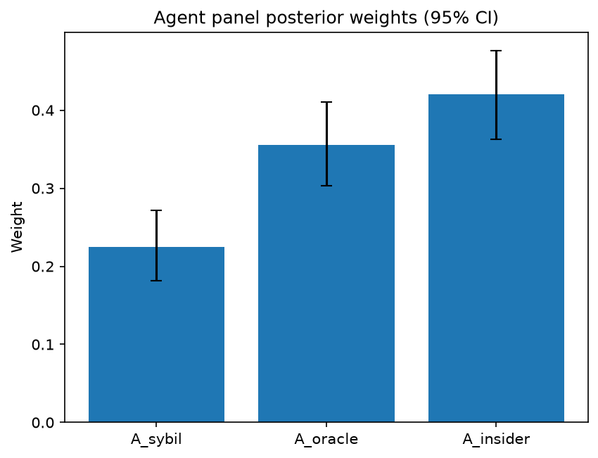

# Survey report: TrustRouter Agentic Full Panel (phi4:14b) -- Level L3d: Attack Resistance sub-parts

Survey ID: `trustrouter-agentic-full-panel-phi4-14b-2026-09-01-L3d`

## Agent panel

- Agents contributing a valid response: 36
- Classical BWM consistency: 36/36 within threshold

| Criterion | Mean | 95% CI lower | 95% CI upper |
|---|---|---|---|
| A_sybil | 0.2245 | 0.1813 | 0.2721 |
| A_oracle | 0.3553 | 0.3030 | 0.4103 |
| A_insider | 0.4202 | 0.3630 | 0.4759 |


## Methodology

Each agent independently completed a Best-Worst Method (BWM) comparison: choosing the single most and least important criterion, then rating every criterion's importance relative to those two on a 1-9 scale. Individual responses were solved with the classical BWM linear program (Rezaei, 2015) for a consistency check, and combined across the panel with a hierarchical Bayesian model (Mohammadi and Rezaei, 2020).


36 agent response(s) were accepted into this result.


Every agent's run began with a QA precheck (its stated configuration verified against ground truth) and every accepted answer's self-reported sources were checked against what reference material was actually available to it; see the Per-agent detail section below and this survey's Conversation Log for each agent's specific results. Every response is schema-validated and independently, repeatedly sampled (never a single completion treated as ground truth); see `guardrails.py`. This survey's complete output is covered by a SHA-256 integrity manifest (`integrity_manifest.json`, `SHA256SUMS`), generated once this run finished, so any later alteration to these files is detectable.


### Charts




## Per-agent detail

### bim-coordinator-base-openmanus (`bim-coordinator-base-openmanus`)

- Role: BIM Coordinator
- Model: ollama/phi4:14b
- DID: `did:key:z6MktjVuxsZoffjLx6zYtw8Bf8nm7iULqLcJwyu2VgSuM19E`
- QA precheck: passed
- Sources used: (not reported)

**Answer:** `{"best": "A_insider", "worst": "A_sybil", "best_to_others": {"A_insider": 1, "A_oracle": 7, "A_sybil": 9}, "others_to_worst": {"A_sybil": 1, "A_oracle": 5, "A_insider": 9}}`

**Reasoning:**

**Reasoning:**

As a BIM Coordinator with extensive experience in managing multi-stakeholder Building Information Models for renovation and new-build projects, I consider the importance of each attack resistance criterion based on their impact on data integrity and trustworthiness within a construction project context.

1. **A_sybil (Sybil resistance):** Fake-identity submissions can undermine the authenticity of contributions to the BIM model. However, in a well-regulated environment with established verification processes, such as those typically found in public infrastructure projects like hospital renovations, the risk is somewhat mitigated by existing identity management protocols.

2. **A_oracle (Oracle resistance):** Tampering at the sensing or device interface poses a significant threat to data integrity. In construction projects, sensor data often informs critical decisions regarding structural health and compliance with safety standards. If this data can be tampered with, it could lead to incorrect assessments and potentially catastrophic outcomes.

3. **A_insider (Insider resistance):** Malicious insiders with legitimate credentials present a substantial risk because they have authorized access to the system. They can exploit their position to alter or delete critical information without detection, which is particularly concerning in projects involving long-term data retention for institutional owners, insurers, and authorities.

Given these considerations, **A_insider** is deemed the most important criterion due to the potential severity of insider threats in compromising the entire BIM process. Conversely, **A_sybil** is considered the least critical in this context, as its impact can be more effectively controlled through existing identity verification measures.

Best factor: A_insider  
Worst factor: A_sybil

**Reasoning:**

In evaluating the importance of each criterion relative to one another, I consider how critical each threat is in terms of potential impact on data integrity and project outcomes within a construction context.

1. **A_insider vs A_oracle:** Insider threats are particularly dangerous because insiders have legitimate access and can bypass many security measures that protect against external attacks. While oracle resistance is crucial for ensuring the accuracy of sensor data, an insider with malicious intent could potentially manipulate or disable these systems entirely. Therefore, I rate insider resistance as significantly more important than oracle resistance.

2. **A_insider vs A_sybil:** As previously discussed, insiders pose a greater threat due to their ability to exploit legitimate access. Sybil attacks are less critical in environments where identity verification is robust and well-managed. Thus, insider resistance is rated much higher in importance compared to sybil resistance.

3. **A_oracle vs A_sybil:** Oracle resistance is more important than sybil resistance because tampering with sensor data can directly affect the safety and compliance of a construction project. While sybil attacks are concerning, they generally have less immediate impact on the core integrity of project data compared to oracle tampering.

Based on this reasoning, here are the ratings:

A_insider vs A_oracle: 7  
A_insider vs A_sybil: 9  
A_oracle vs A_sybil: 5

### bim-coordinator-base-openmanus (`bim-coordinator-base-openmanus`)

- Role: BIM Coordinator
- Model: ollama/phi4:14b
- DID: `did:key:z6MktjVuxsZoffjLx6zYtw8Bf8nm7iULqLcJwyu2VgSuM19E`
- QA precheck: passed
- Sources used: (not reported)

**Answer:** `{"best": "A_insider", "worst": "A_sybil", "best_to_others": {"A_insider": 1, "A_oracle": 7, "A_sybil": 9}, "others_to_worst": {"A_sybil": 1, "A_oracle": 5, "A_insider": 9}}`

**Reasoning:**

As a BIM coordinator with extensive experience managing multi-stakeholder Building Information Models on renovation and new-build projects, I consider the following:

- **A_sybil (Sybil resistance)** is crucial in preventing fake identities from compromising the integrity of the model data. However, given the controlled access typically involved in BIM environments, this may not be as critical compared to other threats.
  
- **A_oracle (Oracle resistance)** involves protecting against tampering at the sensing or device interface. In construction projects, ensuring the accuracy and reliability of sensor data is vital for maintaining model integrity and safety compliance.

- **A_insider (Insider resistance)** addresses the risk posed by individuals with legitimate access who may act maliciously. Given that BIM environments involve multiple stakeholders with varying levels of access, insider threats can be particularly challenging to mitigate.

Considering these factors, **A_insider** is likely the most critical due to the potential for significant harm from trusted insiders with access to sensitive data. Conversely, **A_sybil** might be considered less critical in a well-regulated BIM environment where identity verification processes are robust.

Best factor: A_insider  
Worst factor: A_sybil

In evaluating the relative importance of these factors:

- **A_insider vs. A_oracle**: Insider threats can have a profound impact due to their access and potential for significant damage, making insider resistance more critical than oracle resistance.
  
- **A_insider vs. A_sybil**: As previously discussed, in well-regulated BIM environments, Sybil attacks are less of a concern compared to insider threats.

- **A_oracle vs. A_sybil**: Oracle resistance is crucial for ensuring data integrity from sensors and devices, which can be more immediately impactful than Sybil attacks in this context.

Based on these considerations:

A_insider vs A_oracle: 7  
A_insider vs A_sybil: 9  
A_oracle vs A_sybil: 5

### bim-coordinator-base-openmanus (`bim-coordinator-base-openmanus`)

- Role: BIM Coordinator
- Model: ollama/phi4:14b
- DID: `did:key:z6MktjVuxsZoffjLx6zYtw8Bf8nm7iULqLcJwyu2VgSuM19E`
- QA precheck: passed
- Sources used: (not reported)

**Answer:** `{"best": "A_insider", "worst": "A_sybil", "best_to_others": {"A_insider": 1, "A_oracle": 7, "A_sybil": 8}, "others_to_worst": {"A_sybil": 1, "A_oracle": 6, "A_insider": 8}}`

**Reasoning:**

As a BIM Coordinator with extensive experience managing multi-stakeholder Building Information Models on renovation and new-build projects, my professional judgement is grounded in the importance of maintaining data integrity and security throughout the lifecycle of construction projects. In evaluating the criteria for Attack Resistance (A) within the context of blockchain storage for construction-project records, I consider the implications of each type of attack resistance on the overall trustworthiness and reliability of the data.

**Sybil resistance (A_sybil)** is crucial in preventing fake-identity submissions that could compromise the integrity of the project's stakeholder interactions. However, given the structured nature of BIM projects, where stakeholders are typically well-defined and their identities verified through established channels, the risk posed by Sybil attacks, while significant, may be somewhat mitigated through rigorous access control measures.

**Oracle resistance (A_oracle)** addresses tampering at the sensing or device interface. In construction projects, especially those involving smart buildings or IoT devices for monitoring structural health or energy efficiency, ensuring that data from these sources is accurate and untampered with is paramount. The integrity of this data directly impacts decision-making processes related to safety, compliance, and operational efficiency.

**Insider resistance (A_insider)** focuses on preventing malicious actions by individuals with legitimate access. Given the collaborative nature of construction projects, where multiple stakeholders have varying levels of access to sensitive information, the potential for insider threats is a significant concern. Insiders could exploit their access rights to manipulate data for personal gain or sabotage.

Considering these factors, **insider resistance (A_insider)** emerges as the most critical criterion. The rationale is that insiders already possess legitimate credentials and understanding of the system's vulnerabilities, making them potentially more dangerous than external attackers who must first bypass security measures. Protecting against insider threats requires a comprehensive approach to access control, monitoring, and anomaly detection, which are essential for maintaining the integrity and trustworthiness of construction-project records.

Conversely, while all forms of attack resistance are important, **Sybil resistance (A_sybil)** may be considered the least critical in this specific context. The structured nature of BIM projects and the established processes for stakeholder verification reduce the relative risk posed by Sybil attacks compared to the other types of threats.

Therefore, based on my professional judgement:

Best factor: A_insider  
Worst factor: A_sybil

This assessment is grounded in the understanding that while all forms of attack resistance are vital for securing construction-project records, the unique challenges and risks associated with insider threats necessitate prioritizing insider resistance to ensure data integrity and trustworthiness.

In evaluating the relative importance of each criterion on a 1-9 scale, where 1 indicates equal importance and 9 indicates extremely more important:

**A_insider vs A_oracle:**  
Insider resistance is considered more critical than oracle resistance because insiders have legitimate access and can exploit their knowledge to manipulate data. Oracle resistance, while important for ensuring the accuracy of sensor data, does not pose as immediate a risk as insider threats in this context.

Rating: 7

**A_insider vs A_sybil:**  
Insider resistance is significantly more critical than Sybil resistance due to the direct access insiders have and their potential to cause harm. The structured nature of BIM projects mitigates some risks associated with Sybil attacks, making them less of a priority compared to insider threats.

Rating: 8

**A_oracle vs A_sybil:**  
Oracle resistance is more critical than Sybil resistance because ensuring the integrity of data from sensors and devices directly impacts safety and operational decisions. While preventing fake identities is important, it does not have as immediate an impact on project outcomes as tampering with sensor data.

Rating: 6

Thus, the ratings are:

A_insider vs A_oracle: 7  
A_insider vs A_sybil: 8  
A_oracle vs A_sybil: 6

### bim-coordinator-rag-openmanus (`bim-coordinator-rag-openmanus`)

- Role: BIM Coordinator
- Model: ollama/phi4:14b
- DID: `did:key:z6MkfG5MseccUr21HZSLdPeQrKdR9LQwcXkD4pWXKcUh7U1C`
- QA precheck: passed
- Sources used: (not reported)

**Answer:** `{"best": "A_insider", "worst": "A_sybil", "best_to_others": {"A_insider": 1, "A_oracle": 8, "A_sybil": 9}, "others_to_worst": {"A_sybil": 1, "A_oracle": 7, "A_insider": 9}}`

**Reasoning:**

**Reasoning:**

In evaluating the criteria for attack resistance in a construction project context, I consider the implications and potential impact of each type of attack:

1. **A_sybil (Sybil resistance):** This involves defending against fake-identity submissions which could compromise data integrity by introducing fraudulent records or users into the system. While significant, modern identity verification systems can mitigate this risk to some extent.

2. **A_oracle (Oracle resistance):** This pertains to tampering at the sensing/device interface. In construction projects, sensor data is crucial for monitoring structural health and environmental conditions. Tampering with these inputs could lead to incorrect assessments or decisions, posing a direct threat to safety and project integrity.

3. **A_insider (Insider resistance):** This involves malicious insiders who have legitimate credentials. Insiders can access sensitive information and systems without raising immediate suspicion, potentially leading to significant breaches of data security and trust.

Given these considerations, the most critical factor is likely **A_insider**, as insider threats are often harder to detect and prevent due to their inherent access rights. On the other hand, while all factors are important, **A_sybil** might be considered less immediate in impact compared to direct tampering or insider threats, especially with robust identity verification measures.

**Answer:**

Best factor: A_insider  
Worst factor: A_sybil

To provide the ratings on a 1-9 scale:

1. **A_insider vs A_oracle:** Insider threats can have more severe consequences due to their access and potential for undetected actions, making them extremely important compared to oracle resistance.
   - Rating: 8

2. **A_insider vs A_sybil:** Insider threats are significantly more critical than Sybil attacks because insiders already possess legitimate access, posing a greater risk.
   - Rating: 9

3. **A_oracle vs A_sybil:** Oracle resistance is more crucial than Sybil resistance due to the direct impact on data integrity and safety in construction projects.
   - Rating: 7

Here are the ratings:

```
A_insider vs A_oracle: 8
A_insider vs A_sybil: 9
A_oracle vs A_sybil: 7
```

### bim-coordinator-rag-openmanus (`bim-coordinator-rag-openmanus`)

- Role: BIM Coordinator
- Model: ollama/phi4:14b
- DID: `did:key:z6MkfG5MseccUr21HZSLdPeQrKdR9LQwcXkD4pWXKcUh7U1C`
- QA precheck: passed
- Sources used: (not reported)

**Answer:** `{"best": "A_insider", "worst": "A_sybil", "best_to_others": {"A_insider": 1, "A_oracle": 7, "A_sybil": 9}, "others_to_worst": {"A_sybil": 1, "A_oracle": 8, "A_insider": 9}}`

**Reasoning:**

**Reasoning:**

In evaluating the importance of attack resistance criteria for construction data stored on a blockchain, I consider the nature and impact of each type of threat:

1. **A_sybil (Sybil resistance):** This involves defending against fake-identity attacks where an adversary creates multiple identities to gain undue influence or access. While significant in certain contexts, such as network security, its direct impact on construction data integrity might be less immediate compared to other threats.

2. **A_oracle (Oracle resistance):** This pertains to tampering at the sensing/device interface. In a construction context, where sensor data is crucial for monitoring structural health and compliance, ensuring that this data remains untampered is vital. Compromised sensor data can lead to incorrect assessments of building safety or performance.

3. **A_insider (Insider resistance):** This involves protecting against threats from individuals with legitimate access who may misuse their credentials maliciously. Given the long-term nature and high value of construction projects, insider threats pose a significant risk as they can directly manipulate data or systems without detection for extended periods.

Considering these factors, **A_insider** is deemed the most critical due to the potential for sustained and undetected harm from within an organization. Conversely, **A_sybil** is considered the least important in this specific context because its impact on construction data integrity is relatively indirect compared to oracle tampering or insider threats.

Best factor: A_insider  
Worst factor: A_sybil

To provide the ratings on a 1-9 scale:

- **A_insider vs A_oracle:** Given the critical nature of insider threats in potentially causing long-term damage, I rate this as more important than oracle resistance. However, since both are significant for data integrity, it is not extremely more important. Therefore, I assign a rating of **7**.

- **A_insider vs A_sybil:** Insider resistance is crucially more important than Sybil resistance in the context of construction projects due to its direct impact on data integrity and security. Thus, I rate this as **9**, indicating it is extremely more important.

- **A_oracle vs A_sybil:** Oracle resistance is directly related to ensuring accurate sensor data, which is vital for construction safety and compliance. Sybil attacks are less impactful in this context, so oracle resistance is significantly more important. Therefore, I assign a rating of **8**.

Here are the ratings:

```
A_insider vs A_oracle: 7
A_insider vs A_sybil: 9
A_oracle vs A_sybil: 8
```

### bim-coordinator-rag-openmanus (`bim-coordinator-rag-openmanus`)

- Role: BIM Coordinator
- Model: ollama/phi4:14b
- DID: `did:key:z6MkfG5MseccUr21HZSLdPeQrKdR9LQwcXkD4pWXKcUh7U1C`
- QA precheck: passed
- Sources used: (not reported)

**Answer:** `{"best": "A_sybil", "worst": "A_insider", "best_to_others": {"A_sybil": 1, "A_oracle": 7, "A_insider": 9}, "others_to_worst": {"A_insider": 1, "A_oracle": 5, "A_sybil": 9}}`

**Reasoning:**

**Reasoning:**

As a BIM coordinator with expertise in managing Building Information Models and ensuring data integrity across multi-stakeholder projects, I must assess the importance of different attack resistance criteria for construction project records stored on blockchain. 

- **A_sybil (Sybil resistance):** This criterion addresses the risk of fake identities being used to submit false information or manipulate data. In a BIM context where multiple stakeholders are involved, ensuring that only legitimate entities can contribute is crucial to maintaining data integrity.

- **A_oracle (Oracle resistance):** This involves protecting against tampering at the sensing or device interface. Given the increasing reliance on IoT and sensor data in construction projects for real-time monitoring and decision-making, safeguarding this layer is vital to prevent compromised data from affecting project outcomes.

- **A_insider (Insider resistance):** This criterion focuses on preventing malicious actions by individuals with legitimate access. While insider threats are a concern, the layered security measures typically employed in BIM environments can mitigate some of these risks.

Considering the context of construction projects and the critical role of data integrity, **Sybil resistance (A_sybil)** emerges as the most important factor because it directly impacts the trustworthiness of all stakeholders' contributions. On the other hand, while insider threats are significant, they are often addressed through robust access controls and monitoring systems, making **Insider resistance (A_insider)** relatively less critical compared to the others.

**Answer:**

Best factor: A_sybil  
Worst factor: A_insider

**Ratings:**

- **A_sybil vs A_oracle:** 7  
  Sybil resistance is more important than oracle resistance because ensuring the legitimacy of contributors in a multi-stakeholder environment is crucial for maintaining data integrity. However, both are significant as they address different layers of potential attack vectors.

- **A_sybil vs A_insider:** 9  
  Sybil resistance is extremely more important compared to insider resistance. The ability to prevent fake identities from entering the system is fundamental to trust in a decentralized environment like blockchain, whereas insider threats can often be mitigated with existing security protocols.

- **A_oracle vs A_insider:** 5  
  Oracle resistance and insider resistance are moderately more important than each other. Both address critical vulnerabilities—sensor tampering versus malicious insiders—but the impact of compromised sensor data can have immediate and widespread consequences on project execution, making it slightly more pressing in this context.

### blockchain-engineer-base-openmanus (`blockchain-engineer-base-openmanus`)

- Role: Blockchain / DLT Engineer
- Model: ollama/phi4:14b
- DID: `did:key:z6Mkt3rBXTsyaURYSmKVDjYBpnSZtGCDZ2onmnLPwD2iWGby`
- QA precheck: passed
- Sources used: (not reported)

**Answer:** `{"best": "A_insider", "worst": "A_oracle", "best_to_others": {"A_insider": 1, "A_sybil": 7, "A_oracle": 8}, "others_to_worst": {"A_oracle": 1, "A_sybil": 6, "A_insider": 8}}`

**Reasoning:**

Based on my professional experience as a Blockchain/DLT Engineer with production experience in permissioned-ledger deployments, I would evaluate the criteria for attack resistance as follows:

- **A_sybil (Sybil resistance)** is crucial because it addresses the risk of fake identities infiltrating the network. In permissioned systems, while identity management is more controlled than in public blockchains, ensuring robust mechanisms against Sybil attacks remains important to maintain trust and integrity.

- **A_oracle (Oracle resistance)** pertains to the reliability and security of data inputs from external sources. While this is a significant concern, especially for applications relying on real-world data, permissioned ledgers often have more controlled environments where trusted parties manage these interfaces.

- **A_insider (Insider resistance)** involves protecting against threats posed by individuals with legitimate access who may act maliciously. In permissioned systems, where access control and audit trails are typically more stringent than in public blockchains, mitigating insider threats is a critical concern due to the potential for significant damage from within.

Considering these factors, I would prioritize **A_insider** as the most important criterion because insider threats can exploit legitimate access rights, potentially causing substantial harm. Conversely, while still important, **A_oracle** might be considered less critical in environments where data input sources are well-regulated and trusted.

Best factor: A_insider  
Worst factor: A_oracle

Based on the prioritization of **A_insider** as the most important and **A_oracle** as the least important, I will assign ratings reflecting their relative importance:

- **A_insider vs A_sybil**: Since insider threats are considered more critical due to potential internal access and damage, this would be rated higher than Sybil resistance.  
  Rating: 7

- **A_insider vs A_oracle**: Insider resistance is deemed significantly more important compared to Oracle resistance in a permissioned environment where data sources are typically trusted.  
  Rating: 8

- **A_sybil vs A_oracle**: While both are important, Sybil resistance is generally more critical than Oracle resistance due to the potential for identity-based attacks affecting network integrity.  
  Rating: 6

Here are the ratings:

```
A_insider vs A_sybil: 7
A_insider vs A_oracle: 8
A_sybil vs A_oracle: 6
```

### blockchain-engineer-base-openmanus (`blockchain-engineer-base-openmanus`)

- Role: Blockchain / DLT Engineer
- Model: ollama/phi4:14b
- DID: `did:key:z6Mkt3rBXTsyaURYSmKVDjYBpnSZtGCDZ2onmnLPwD2iWGby`
- QA precheck: passed
- Sources used: (not reported)

**Answer:** `{"best": "A_sybil", "worst": "A_insider", "best_to_others": {"A_sybil": 1, "A_oracle": 7, "A_insider": 9}, "others_to_worst": {"A_insider": 1, "A_oracle": 5, "A_sybil": 9}}`

**Reasoning:**

Best factor: A_sybil  
Worst factor: A_insider  

**Reasoning:** 

From the perspective of a blockchain/DLT engineer with experience in permissioned-ledger deployments, evaluating technical feasibility and security guarantees is crucial. Sybil resistance (A_sybil) is often prioritized because fake-identity attacks can undermine the integrity of the entire network by allowing malicious actors to exert undue influence or disrupt consensus mechanisms. Ensuring robust identity verification processes helps maintain trust and reliability in the system.

On the other hand, insider resistance (A_insider), while important, might be considered less critical compared to Sybil and Oracle resistance in this context. This is because permissioned ledgers inherently limit access to a known set of participants, reducing the risk posed by insiders relative to public or semi-public networks. Furthermore, organizational controls and governance mechanisms can mitigate insider threats more effectively than technical measures alone.

Oracle resistance (A_oracle) is also significant due to its role in ensuring data integrity at the sensing interface, but it may not be as universally critical across all deployments as Sybil resistance, which affects the foundational trust model of distributed ledgers.

A_sybil vs A_oracle: 7  
A_sybil vs A_insider: 9  
A_oracle vs A_insider: 5  

**Reasoning:** 

- **A_sybil vs A_oracle (7):** Sybil resistance is considered significantly more important than Oracle resistance. This is because the integrity of a blockchain network heavily relies on preventing fake identities from compromising consensus mechanisms, which can have widespread implications for trust and security.

- **A_sybil vs A_insider (9):** Sybil resistance is extremely more important compared to Insider resistance in permissioned networks where access control is already stringent. The potential impact of Sybil attacks on network integrity makes it a higher priority.

- **A_oracle vs A_insider (5):** Oracle resistance is moderately more important than Insider resistance. While both are critical for ensuring data accuracy and security, the broader implications of compromised oracles in terms of data integrity across applications make them slightly more pressing to address compared to insider threats that can be mitigated through organizational controls.

### blockchain-engineer-base-openmanus (`blockchain-engineer-base-openmanus`)

- Role: Blockchain / DLT Engineer
- Model: ollama/phi4:14b
- DID: `did:key:z6Mkt3rBXTsyaURYSmKVDjYBpnSZtGCDZ2onmnLPwD2iWGby`
- QA precheck: passed
- Sources used: (not reported)

**Answer:** `{"best": "A_insider", "worst": "A_sybil", "best_to_others": {"A_insider": 1, "A_oracle": 7, "A_sybil": 9}, "others_to_worst": {"A_sybil": 1, "A_oracle": 5, "A_insider": 9}}`

**Reasoning:**

**Reasoning:**

As a blockchain/DLT engineer with experience in permissioned-ledger deployments, I evaluate the importance of these attack resistance factors based on their impact on system security and integrity.

- **A_sybil (Sybil resistance):** In permissioned systems, identity management is crucial. While Sybil attacks are more relevant to public blockchains, they can still pose a risk in environments where identity verification mechanisms might be compromised or not robust enough. However, the controlled nature of permissioned ledgers typically mitigates this threat.

- **A_oracle (Oracle resistance):** Oracle resistance is critical because it addresses vulnerabilities at the interface between the blockchain and external data sources. In construction projects, accurate sensor data is vital for decision-making. Compromised oracles can lead to incorrect data being recorded on the ledger, undermining trust in the system's outputs.

- **A_insider (Insider resistance):** Insider threats are particularly concerning in permissioned systems where users have legitimate access. An insider with malicious intent can exploit their privileges to alter records or disrupt operations, posing a significant risk to data integrity and security.

Given these considerations, **A_insider** is the most important factor due to the potential for direct manipulation of the ledger by trusted parties. Conversely, **A_sybil** is the least critical in this context because permissioned systems inherently limit the impact of fake identities through strict access controls.

Best factor: A_insider  
Worst factor: A_sybil

**Reasoning:**

In evaluating the relative importance of these attack resistance factors, I consider their impact on system security and data integrity in a permissioned blockchain context.

- **A_insider vs A_oracle:** Insider threats are particularly severe because they involve individuals with legitimate access who can exploit their privileges to alter or delete records. This poses a direct threat to the integrity of the ledger. Oracle resistance is also critical, as compromised external data can lead to incorrect decisions based on faulty inputs. However, given the potential for insiders to directly manipulate the system, I rate insider threats as more important.

- **A_insider vs A_sybil:** In permissioned systems, identity management is typically well-controlled, reducing the risk of Sybil attacks compared to public blockchains. Insiders, however, can exploit their access rights maliciously, making this threat significantly more critical.

- **A_oracle vs A_sybil:** Oracle resistance is crucial because it ensures that external data inputs are accurate and trustworthy. While Sybil resistance is important in general blockchain security, its impact is less pronounced in permissioned systems where identities are tightly controlled.

Based on these considerations, the ratings are as follows:

A_insider vs A_oracle: 7  
A_insider vs A_sybil: 9  
A_oracle vs A_sybil: 5

### blockchain-engineer-rag-openmanus (`blockchain-engineer-rag-openmanus`)

- Role: Blockchain / DLT Engineer
- Model: ollama/phi4:14b
- DID: `did:key:z6Mko8hHqpF7sFFLRW2GQFdJtGuQ5oszhR6pSFVQor3f2sFZ`
- QA precheck: passed
- Sources used: (not reported)

**Answer:** `{"best": "A_oracle", "worst": "A_insider", "best_to_others": {"A_oracle": 1, "A_sybil": 7, "A_insider": 8}, "others_to_worst": {"A_insider": 1, "A_sybil": 6, "A_oracle": 8}}`

**Reasoning:**

**Reasoning**

In evaluating the importance of attack resistance criteria for a blockchain/DLT engineer with experience in permissioned-ledger deployments, I consider the specific threats each criterion addresses:

1. **A_sybil (Sybil resistance):** This criterion deals with fake-identity attacks, which are critical in maintaining the integrity and trustworthiness of identities on the ledger. Ensuring that identities cannot be easily spoofed or duplicated is fundamental to a secure system.

2. **A_oracle (Oracle resistance):** Oracle resistance addresses the challenge of integrating real-world data into blockchain systems securely. Given that smart contracts rely heavily on external data, ensuring this data's integrity and authenticity is crucial for preventing manipulation and maintaining trust in automated processes.

3. **A_insider (Insider resistance):** This criterion focuses on protecting against threats from individuals with legitimate access to the system. While important, insider threats are often mitigated through robust internal controls and monitoring, which can be more effectively managed within a permissioned environment compared to public blockchains.

Considering these factors, **A_oracle** emerges as the most critical due to its role in ensuring that external data inputs do not compromise the integrity of blockchain operations. Conversely, while insider threats are significant, they may be somewhat mitigated by existing access controls and monitoring mechanisms within a permissioned ledger context, making **A_insider** relatively less critical compared to the other two.

Best factor: A_oracle  
Worst factor: A_insider

Based on the reasoning provided:

- **A_oracle vs A_sybil:** Oracle resistance is crucial for ensuring data integrity from external sources, which can have a significant impact on automated processes and smart contracts. Sybil resistance is also important but generally pertains more to identity management within the system itself. Therefore, I would rate this as 7.

- **A_oracle vs A_insider:** Given that oracle attacks can compromise the entire decision-making process of blockchain applications by feeding false data into smart contracts, while insider threats are somewhat mitigated through access controls in permissioned environments, I would rate this as 8.

- **A_sybil vs A_insider:** Sybil resistance is critical for maintaining identity integrity on the network, which can have broad implications across all operations. Insider threats, though important, are often more manageable within a controlled environment. Thus, I would rate this as 6.

```
A_oracle vs A_sybil: 7
A_oracle vs A_insider: 8
A_sybil vs A_insider: 6
```

### blockchain-engineer-rag-openmanus (`blockchain-engineer-rag-openmanus`)

- Role: Blockchain / DLT Engineer
- Model: ollama/phi4:14b
- DID: `did:key:z6Mko8hHqpF7sFFLRW2GQFdJtGuQ5oszhR6pSFVQor3f2sFZ`
- QA precheck: passed
- Sources used: (not reported)

**Answer:** `{"best": "A_oracle", "worst": "A_sybil", "best_to_others": {"A_oracle": 1, "A_insider": 7, "A_sybil": 9}, "others_to_worst": {"A_sybil": 1, "A_insider": 5, "A_oracle": 9}}`

**Reasoning:**

**Reasoning:**

In evaluating the importance of attack resistance criteria for blockchain/DLT deployments in construction projects, it's essential to consider the specific threats and their potential impact on data integrity and trustworthiness. 

1. **A_sybil (Sybil resistance):** Sybil attacks involve creating fake identities to subvert the network by overwhelming it with false information or votes. In a permissioned ledger context, where identity verification is typically more stringent than in public blockchains, the risk of Sybil attacks might be lower compared to other threats.

2. **A_oracle (Oracle resistance):** Oracle attacks involve tampering at the interface between real-world data and blockchain systems. Given that smart contracts rely on external data for execution, ensuring this data's integrity is crucial. In construction projects, where sensor data and IoT devices are increasingly used, oracle resistance becomes critical to maintaining trust in automated processes.

3. **A_insider (Insider resistance):** Insider threats involve individuals with legitimate access attempting malicious actions. Given the high stakes of construction projects, including safety and regulatory compliance, insider threats can have severe consequences if not adequately mitigated.

Considering these factors, oracle resistance is often the most critical due to its direct impact on data integrity from external sources, which are increasingly relied upon in automated systems. Conversely, Sybil attacks might be less concerning in a permissioned environment where identity verification is robust.

**Best factor: A_oracle**

**Worst factor: A_sybil**

**Ratings:**

- **A_oracle vs A_insider:** 7  
  Oracle resistance is more critical than insider resistance because tampered external data can compromise the entire system's integrity, especially in automated processes relying on accurate real-world inputs.

- **A_oracle vs A_sybil:** 9  
  Oracle resistance is extremely more important than Sybil resistance. In a permissioned ledger environment, identity verification reduces the risk of Sybil attacks significantly, whereas oracle tampering can directly affect data-driven decisions and operations.

- **A_insider vs A_sybil:** 5  
  Insider resistance is moderately more important than Sybil resistance. While insider threats are serious due to their potential impact on project safety and compliance, the robust identity verification in permissioned networks makes Sybil attacks less likely.

### blockchain-engineer-rag-openmanus (`blockchain-engineer-rag-openmanus`)

- Role: Blockchain / DLT Engineer
- Model: ollama/phi4:14b
- DID: `did:key:z6Mko8hHqpF7sFFLRW2GQFdJtGuQ5oszhR6pSFVQor3f2sFZ`
- QA precheck: passed
- Sources used: (not reported)

**Answer:** `{"best": "A_oracle", "worst": "A_sybil", "best_to_others": {"A_oracle": 1, "A_insider": 7, "A_sybil": 9}, "others_to_worst": {"A_sybil": 1, "A_insider": 6, "A_oracle": 9}}`

**Reasoning:**

**Reasoning:**

In evaluating the importance of attack resistance criteria for a permissioned ledger deployment in construction-project records, we consider the specific threats each criterion addresses:

- **A_sybil (Sybil resistance):** This involves defending against fake identities. In a permissioned environment, where participants are known and vetted, Sybil attacks are less likely compared to public networks. However, ensuring that identities remain trustworthy is still crucial.

- **A_oracle (Oracle resistance):** This criterion addresses the challenge of integrating real-world data into blockchain systems securely. Given that construction projects rely heavily on accurate sensor data for decision-making, protecting against tampering at this interface is critical.

- **A_insider (Insider resistance):** This involves safeguarding against malicious actions by individuals with legitimate access. In a permissioned setting, where trust is partially established through vetting participants, insider threats can be particularly damaging due to the potential for misuse of granted privileges.

Considering these factors, **A_oracle** emerges as the most critical criterion because it directly impacts the integrity and reliability of data that informs construction decisions. Conversely, **A_sybil** is deemed less critical in a permissioned environment where identity verification is inherently stronger than in public networks.

Best factor: A_oracle  
Worst factor: A_sybil

In evaluating the importance of each attack resistance criterion for a permissioned ledger deployment in construction-project records, we consider their relative impact:

- **A_oracle (Oracle resistance)** is critical because it ensures the integrity and reliability of external data inputs, which are vital for informed decision-making in construction projects.
  
- **A_insider (Insider resistance)** is also important due to the potential for misuse by trusted individuals with legitimate access.

- **A_sybil (Sybil resistance)**, while still relevant, is less critical in a permissioned environment where identities are pre-vetted and controlled.

Given these considerations, here are the ratings:

```
A_oracle vs A_insider: 7
A_oracle vs A_sybil: 9
A_insider vs A_sybil: 6
``` 

These ratings reflect that oracle resistance is significantly more important than both insider and Sybil resistance, with insider resistance being moderately more critical than Sybil resistance in this context.

### compliance-officer-base-openmanus (`compliance-officer-base-openmanus`)

- Role: Compliance and Regulatory Officer
- Model: ollama/phi4:14b
- DID: `did:key:z6MkhbjMCfTLP5x4Chc2q7Rskakua1JQfKHHRZtyr5dc3r8w`
- QA precheck: passed
- Sources used: (not reported)

**Answer:** `{"best": "A_insider", "worst": "A_sybil", "best_to_others": {"A_insider": 1, "A_oracle": 7, "A_sybil": 9}, "others_to_worst": {"A_sybil": 1, "A_oracle": 5, "A_insider": 9}}`

**Reasoning:**

**Reasoning**

As a facility-management compliance officer responsible for GDPR and construction-regulatory obligations across a building's operational lifecycle, the primary concern is ensuring data integrity and security against various threats. Each of the criteria—Sybil resistance (A_sybil), Oracle resistance (A_oracle), and Insider resistance (A_insider)—addresses different aspects of attack resistance.

1. **A_sybil: Sybil Resistance**  
   - This criterion addresses fake-identity attacks, which are less relevant in a controlled environment like facility management where identities are typically well-regulated and verified through established processes.
   
2. **A_oracle: Oracle Resistance**  
   - Oracle resistance pertains to tampering at the sensing or device interface. While important for ensuring data accuracy from IoT devices or sensors used in building management systems, it is not as critical as insider threats given the controlled access environment.

3. **A_insider: Insider Resistance**  
   - Insider resistance is crucial because individuals with legitimate credentials can pose significant risks to data integrity and compliance. Insiders have authorized access and could potentially exploit their positions for malicious purposes or unintentionally cause breaches, making this a critical area of focus in facility management.

Given these considerations, **A_insider** (Insider resistance) is the most important criterion due to the potential impact of insider threats on data security and regulatory compliance. Conversely, **A_sybil** (Sybil resistance) is deemed least important in this context because identity verification processes are typically robust within a regulated facility management environment.

**Best factor:** A_insider  
**Worst factor:** A_sybil

**Reasoning**

In evaluating the relative importance of these criteria, I consider the potential impact and likelihood of each threat within a facility management context:

1. **A_insider vs A_oracle:**  
   - Insider threats are generally more concerning than oracle resistance in terms of potential damage to data integrity and compliance. Insiders have authorized access and can exploit their positions for malicious purposes or inadvertently cause breaches, making this threat more significant.
   - Rating: 7 (Insider resistance is significantly more important than Oracle resistance)

2. **A_insider vs A_sybil:**  
   - Insider threats are far more critical in a controlled environment where identities are typically well-regulated and verified. Sybil attacks are less relevant because the risk of fake-identity submissions is lower.
   - Rating: 9 (Insider resistance is extremely more important than Sybil resistance)

3. **A_oracle vs A_sybil:**  
   - Oracle resistance, while not as critical as insider threats, still holds more importance than Sybil resistance in ensuring data accuracy from IoT devices or sensors used in building management systems.
   - Rating: 5 (Oracle resistance is moderately more important than Sybil resistance)

**Ratings:**

A_insider vs A_oracle: 7  
A_insider vs A_sybil: 9  
A_oracle vs A_sybil: 5

### compliance-officer-base-openmanus (`compliance-officer-base-openmanus`)

- Role: Compliance and Regulatory Officer
- Model: ollama/phi4:14b
- DID: `did:key:z6MkhbjMCfTLP5x4Chc2q7Rskakua1JQfKHHRZtyr5dc3r8w`
- QA precheck: passed
- Sources used: (not reported)

**Answer:** `{"best": "A_insider", "worst": "A_sybil", "best_to_others": {"A_insider": 1, "A_oracle": 7, "A_sybil": 9}, "others_to_worst": {"A_sybil": 1, "A_oracle": 5, "A_insider": 9}}`

**Reasoning:**

As a facility-management compliance officer responsible for GDPR and construction-regulatory obligations across a building's operational lifecycle, my primary concern is ensuring that data integrity and security are maintained against various types of attacks. Given the criteria:

- **A_sybil**: Sybil resistance (Fake-identity submissions)
- **A_oracle**: Oracle resistance (Tampering at the sensing/device interface)
- **A_insider**: Insider resistance (Malicious insider with legitimate credentials)

**Best factor: A_insider**

Insider threats pose a significant risk in facility management, especially when dealing with sensitive data such as GDPR compliance and construction regulations. Insiders have legitimate access to systems and can potentially exploit their positions to manipulate or misuse data.

**Worst factor: A_sybil**

While Sybil attacks are concerning, they are generally less relevant in the context of a controlled environment like facility management, where identity verification processes are more robust compared to open networks. The focus is typically on preventing unauthorized access from within rather than external fake identities.

This judgment is based on my professional role and understanding of the operational risks associated with data security in facility management.

As a facility-management compliance officer, I will provide the ratings based on my professional judgment regarding the relative importance of each factor:

- **A_insider vs A_oracle**: 7  
  Insider resistance is more critical than oracle resistance because insiders have legitimate access and can cause significant harm if they act maliciously. Oracle resistance is important but typically involves external tampering, which might be less frequent in a controlled environment.

- **A_insider vs A_sybil**: 9  
  Insider threats are significantly more concerning than Sybil attacks within the context of facility management. Insiders have direct access to systems and data, making their potential for harm much greater compared to fake identities attempting external breaches.

- **A_oracle vs A_sybil**: 5  
  Oracle resistance is moderately more important than Sybil resistance. While both involve tampering risks, oracle attacks directly affect the integrity of sensor data and devices, which are crucial in maintaining operational compliance and safety standards.

### compliance-officer-base-openmanus (`compliance-officer-base-openmanus`)

- Role: Compliance and Regulatory Officer
- Model: ollama/phi4:14b
- DID: `did:key:z6MkhbjMCfTLP5x4Chc2q7Rskakua1JQfKHHRZtyr5dc3r8w`
- QA precheck: passed
- Sources used: (not reported)

**Answer:** `{"best": "A_insider", "worst": "A_sybil", "best_to_others": {"A_insider": 1, "A_oracle": 7, "A_sybil": 9}, "others_to_worst": {"A_sybil": 1, "A_oracle": 5, "A_insider": 9}}`

**Reasoning:**

As a facility-management compliance officer responsible for GDPR and construction-regulatory obligations across a building's operational lifecycle, my professional judgement is grounded in the importance of maintaining data integrity and security throughout this process. 

**Best factor:** A_insider  
**Worst factor:** A_sybil

**Reasoning:**

- **A_insider (Insider resistance):** In the context of GDPR and construction-regulatory obligations, insider threats pose a significant risk due to the potential for misuse of legitimate access by individuals within the organization. Insiders have authorized access to sensitive data, making it crucial to ensure robust measures are in place to prevent malicious activities from those with legitimate credentials. This is particularly important given the long-term nature of compliance and the need to protect personal data over decades.

- **A_sybil (Sybil resistance):** While fake-identity attacks are a concern, they are generally less impactful than insider threats within an organization that has established trust relationships and verification processes for its personnel. The risk from Sybil attacks is mitigated by existing identity management systems, making it the least critical in this context.

- **A_oracle (Oracle resistance):** This criterion involves tampering at the sensing or device interface, which is important but secondary to insider threats when considering data integrity and compliance over a building's lifecycle. Ensuring accurate data from sensors is crucial, yet the potential for insider misuse of legitimate access remains a more pressing concern.

This reasoning aligns with my role's focus on long-term data protection and regulatory compliance, prioritizing the prevention of internal misuse over external identity-based threats.

As a facility-management compliance officer responsible for GDPR and construction-regulatory obligations, my ratings reflect the relative importance of each attack resistance factor in maintaining data integrity and security.

- **A_insider vs A_oracle:** 7  
  Insider threats are more critical due to the potential misuse of legitimate access by individuals within the organization. Ensuring robust measures against insider attacks is essential for long-term compliance and data protection.

- **A_insider vs A_sybil:** 9  
  The risk from insider threats is significantly higher than that from Sybil attacks, given insiders' authorized access to sensitive data. Protecting against insider misuse is paramount in maintaining trust and regulatory adherence over time.

- **A_oracle vs A_sybil:** 5  
  While both are important, oracle resistance (sensing/device tampering) is more critical than Sybil resistance due to the direct impact on data accuracy and integrity from within trusted systems. However, it is less urgent compared to insider threats.

These ratings reflect a prioritization based on the potential impact of each threat type in the context of long-term compliance and data protection responsibilities.

### compliance-officer-rag-openmanus (`compliance-officer-rag-openmanus`)

- Role: Compliance and Regulatory Officer
- Model: ollama/phi4:14b
- DID: `did:key:z6MknnPyULv317BzskfxgnYty22cc5A3AddPeVZZsocVNgeY`
- QA precheck: passed
- Sources used: (not reported)

**Answer:** `{"best": "A_insider", "worst": "A_sybil", "best_to_others": {"A_insider": 1, "A_oracle": 7, "A_sybil": 9}, "others_to_worst": {"A_sybil": 1, "A_oracle": 6, "A_insider": 9}}`

**Reasoning:**

As a facility-management compliance officer responsible for GDPR and construction-regulatory obligations across a building's operational lifecycle, my professional judgment is guided by the need to ensure data integrity and security against various types of attacks. Here’s how I evaluate each criterion:

- **A_sybil (Sybil resistance):** This refers to protection against fake-identity submissions. In the context of GDPR compliance and construction management, ensuring that identities are genuine is crucial for maintaining trust in data sources. However, while important, it might not be as critical as other forms of attack given the structured nature of most construction project roles.

- **A_oracle (Oracle resistance):** This involves protection against tampering at the sensing or device interface. In a facility management setting, ensuring that sensor data and device inputs are accurate is vital for compliance with safety regulations and operational efficiency. Tampered data could lead to significant regulatory breaches and safety hazards.

- **A_insider (Insider resistance):** This criterion addresses the risk of malicious insiders who have legitimate credentials. Given the extensive access required by personnel in facility management, insider threats pose a substantial risk. Insiders can exploit their access for unauthorized changes or data breaches, which could severely impact compliance with GDPR and other regulatory requirements.

Considering these factors, my professional judgment leads me to prioritize:

- **Best factor:** A_insider
- **Worst factor:** A_sybil

This prioritization reflects the higher potential impact of insider threats in a facility management context compared to Sybil attacks, while recognizing that Oracle resistance is also critical but not as immediately threatening given existing controls over device interfaces.

Best factor: A_insider  
Worst factor: A_sybil

In evaluating the importance of each criterion relative to others, I consider the potential impact and likelihood of these threats within a facility management context:

- **A_insider vs A_oracle:** Insider resistance is crucial due to the high level of access insiders have. While Oracle resistance is also important for ensuring data integrity from sensors and devices, the risk posed by insiders can be more severe given their legitimate access. Therefore, I rate this as:  
  `A_insider vs A_oracle: 7`

- **A_insider vs A_sybil:** Insider threats are significantly more critical than Sybil attacks in a structured environment like facility management where roles and identities are typically well-defined. Thus, the importance of insider resistance is much higher:  
  `A_insider vs A_sybil: 9`

- **A_oracle vs A_sybil:** Oracle resistance is more important than Sybil resistance because tampered sensor data can have immediate operational and safety implications, whereas Sybil attacks are less likely in a controlled environment. Therefore, I rate this as:  
  `A_oracle vs A_sybil: 6`

### compliance-officer-rag-openmanus (`compliance-officer-rag-openmanus`)

- Role: Compliance and Regulatory Officer
- Model: ollama/phi4:14b
- DID: `did:key:z6MknnPyULv317BzskfxgnYty22cc5A3AddPeVZZsocVNgeY`
- QA precheck: passed
- Sources used: (not reported)

**Answer:** `{"best": "A_insider", "worst": "A_sybil", "best_to_others": {"A_insider": 1, "A_oracle": 7, "A_sybil": 9}, "others_to_worst": {"A_sybil": 1, "A_oracle": 5, "A_insider": 9}}`

**Reasoning:**

**Reasoning**

As a facility-management compliance officer responsible for GDPR and construction-regulatory obligations across a building's operational lifecycle, my primary concern is ensuring that data integrity and security are maintained while complying with legal requirements. The criteria under consideration—Sybil resistance (A_sybil), Oracle resistance (A_oracle), and Insider resistance (A_insider)—each address different aspects of attack resistance.

1. **A_sybil: Sybil Resistance**  
   - This criterion deals with the prevention of fake-identity attacks, which is crucial for maintaining trust in decentralized systems by ensuring that all participants are genuine.
   - While important, this type of attack is less directly related to compliance and data integrity within a facility management context compared to insider threats.

2. **A_oracle: Oracle Resistance**  
   - This criterion addresses tampering at the sensing or device interface, which can compromise data accuracy and reliability.
   - Ensuring accurate data from sensors is important for operational efficiency and safety, but it does not directly impact compliance as much as insider threats do.

3. **A_insider: Insider Resistance**  
   - This criterion focuses on preventing malicious actions by individuals with legitimate access to the system.
   - Given my role in ensuring compliance with GDPR and other regulations, insider threats pose a significant risk because they can lead to unauthorized data access or manipulation, directly impacting legal obligations and data protection.

Considering these factors, **A_insider** is the most critical criterion for maintaining compliance and protecting sensitive information within a facility management context. Conversely, while still important, **A_sybil** is less immediately relevant to my specific responsibilities compared to insider threats.

**Answer**

Best factor: A_insider  
Worst factor: A_sybil

Given the context of my role and responsibilities:

- **A_insider vs A_oracle**: 7  
  Insider resistance is more critical than oracle resistance because insider threats can directly compromise compliance with GDPR by allowing unauthorized data access or manipulation, which has significant legal implications.

- **A_insider vs A_sybil**: 9  
  Insider resistance is extremely more important than sybil resistance. While sybil attacks are a concern for maintaining trust in decentralized systems, they do not pose as direct a risk to compliance and data protection within the facility management context as insider threats do.

- **A_oracle vs A_sybil**: 5  
  Oracle resistance is moderately more important than sybil resistance. Accurate sensor data is crucial for operational integrity and safety, but it does not have the same immediate impact on legal compliance as insider threats or the potential to undermine trust in the system like sybil attacks.

These ratings reflect the prioritization of factors based on their relevance to maintaining compliance and protecting sensitive information within my professional role.

### compliance-officer-rag-openmanus (`compliance-officer-rag-openmanus`)

- Role: Compliance and Regulatory Officer
- Model: ollama/phi4:14b
- DID: `did:key:z6MknnPyULv317BzskfxgnYty22cc5A3AddPeVZZsocVNgeY`
- QA precheck: passed
- Sources used: (not reported)

**Answer:** `{"best": "A_insider", "worst": "A_sybil", "best_to_others": {"A_insider": 1, "A_oracle": 7, "A_sybil": 9}, "others_to_worst": {"A_sybil": 1, "A_oracle": 5, "A_insider": 9}}`

**Reasoning:**

**Reasoning**

As a facility-management compliance officer responsible for GDPR and construction-regulatory obligations across a building's operational lifecycle, my primary concern is ensuring that data integrity and security are maintained to comply with legal standards. The criteria under consideration—Sybil resistance (A_sybil), Oracle resistance (A_oracle), and Insider resistance (A_insider)—all play crucial roles in safeguarding the blockchain system against different types of attacks.

1. **Sybil Resistance (A_sybil):** This criterion addresses the risk of fake-identity submissions, which can undermine the trustworthiness of data by allowing malicious actors to create multiple identities. While important for maintaining a reliable network, this is less directly tied to compliance and regulatory obligations compared to other criteria.

2. **Oracle Resistance (A_oracle):** Oracle resistance focuses on preventing tampering at the sensing or device interface. This is critical in ensuring that the data fed into the blockchain from external sources remains accurate and untampered with. Given the reliance on IoT devices and sensors in modern construction projects, maintaining the integrity of this data is crucial for compliance, especially when it pertains to safety and regulatory reporting.

3. **Insider Resistance (A_insider):** This criterion deals with preventing malicious actions by individuals who have legitimate access to the system. Insiders can exploit their authorized access to manipulate or corrupt data, which poses a significant risk in terms of both security and compliance. Ensuring that insiders cannot misuse their credentials is paramount for maintaining trust and adhering to regulatory standards.

Given these considerations, **Insider resistance (A_insider)** emerges as the most critical factor due to its direct impact on compliance and the potential for severe consequences if insiders were to exploit their access. Conversely, while Sybil resistance is important, it is less directly tied to immediate compliance concerns compared to insider threats or oracle tampering.

**Best factor:** A_insider  
**Worst factor:** A_sybil

Given the reasoning provided:

- **Insider resistance (A_insider)** is considered most critical due to its direct impact on compliance and potential for severe consequences from misuse by insiders.
  
- **Oracle resistance (A_oracle)** is also highly important as it ensures data integrity from external sources, which is crucial for regulatory reporting.

- **Sybil resistance (A_sybil)**, while essential for maintaining network reliability, is less directly tied to immediate compliance concerns compared to the other two factors.

Based on this analysis:

```
A_insider vs A_oracle: 7
A_insider vs A_sybil: 9
A_oracle vs A_sybil: 5
```

**Explanation:**

- **A_insider vs A_oracle (7):** Insider resistance is more important than oracle resistance, but both are crucial for compliance and data integrity. The difference in importance is significant but not extreme.

- **A_insider vs A_sybil (9):** Insider resistance is extremely more important than Sybil resistance due to the direct impact on compliance and potential consequences of insider threats.

- **A_oracle vs A_sybil (5):** Oracle resistance is moderately more important than Sybil resistance, as ensuring data integrity from external sources is critical for regulatory purposes.

### data-engineer-base-openmanus (`data-engineer-base-openmanus`)

- Role: Data Engineering Specialist
- Model: ollama/phi4:14b
- DID: `did:key:z6Mki7K9yLK1ZtQHSWo1JxgRRhYwtrQJcjwzJ7o4PZnNF83i`
- QA precheck: passed
- Sources used: (not reported)

**Answer:** `{"best": "A_insider", "worst": "A_sybil", "best_to_others": {"A_insider": 1, "A_oracle": 7, "A_sybil": 9}, "others_to_worst": {"A_sybil": 1, "A_oracle": 5, "A_insider": 9}}`

**Reasoning:**

**Reasoning:**

As a data engineering specialist responsible for data quality pipelines and provenance tracking in construction-project datasets, the importance of each attack resistance criterion can be evaluated based on potential impacts on data integrity and trustworthiness.

1. **A_sybil (Sybil resistance):** This refers to protection against fake-identity submissions. In a construction project context, ensuring that only legitimate entities contribute to or alter data is crucial for maintaining accurate records. However, the impact of Sybil attacks might be somewhat mitigated by robust identity verification processes already in place.

2. **A_oracle (Oracle resistance):** This involves safeguarding against tampering at the sensing or device interface. In construction projects, sensor data integrity is vital as it often forms the basis for decision-making and compliance with safety standards. Compromised sensors can lead to incorrect data being recorded, which could have severe consequences.

3. **A_insider (Insider resistance):** This pertains to preventing malicious actions by individuals with legitimate access. Insiders already possess authorized credentials, making it challenging to detect unauthorized changes they might make. The potential for damage is significant because insiders can bypass many external security measures.

Given these considerations, insider threats are often considered the most critical due to their ability to circumvent traditional security controls and cause substantial harm from within. Conversely, Sybil resistance, while important, may be less critical if identity verification processes are robust.

**Answer:**

Best factor: A_insider  
Worst factor: A_sybil

**Reasoning:**

To determine the ratings on a 1-9 scale, we need to compare each pair of criteria based on their relative importance in ensuring data integrity and trustworthiness within construction-project datasets.

1. **A_insider vs A_oracle:** Insider threats are considered more critical because insiders have legitimate access and can bypass many security measures. Oracle resistance is also crucial due to the reliance on sensor data, but insider threats pose a higher risk of undetected tampering. Therefore, A_insider should be rated significantly more important than A_oracle.

2. **A_insider vs A_sybil:** As previously discussed, insider threats are generally considered more severe than Sybil attacks because insiders can exploit their access privileges to cause harm. Thus, A_insider is much more critical compared to A_sybil.

3. **A_oracle vs A_sybil:** Oracle resistance is more important than Sybil resistance in this context because compromised sensor data can directly affect project outcomes and safety standards. While Sybil attacks are concerning, their impact might be less immediate or severe if identity verification processes are robust.

**Ratings:**

A_insider vs A_oracle: 7  
A_insider vs A_sybil: 9  
A_oracle vs A_sybil: 5

### data-engineer-base-openmanus (`data-engineer-base-openmanus`)

- Role: Data Engineering Specialist
- Model: ollama/phi4:14b
- DID: `did:key:z6Mki7K9yLK1ZtQHSWo1JxgRRhYwtrQJcjwzJ7o4PZnNF83i`
- QA precheck: passed
- Sources used: (not reported)

**Answer:** `{"best": "A_oracle", "worst": "A_insider", "best_to_others": {"A_oracle": 1, "A_sybil": 7, "A_insider": 8}, "others_to_worst": {"A_insider": 1, "A_sybil": 6, "A_oracle": 8}}`

**Reasoning:**

As a Data Engineering Specialist focused on data quality pipelines and provenance tracking for construction-project datasets, my professional judgment is guided by the specific threats each criterion addresses in terms of attack resistance.

**Reasoning:**

1. **A_sybil (Sybil resistance):** This criterion deals with fake-identity attacks which can undermine trust in data sources. In a construction project context, ensuring that only legitimate entities contribute to or modify datasets is crucial for maintaining integrity and reliability. Sybil attacks could lead to significant misinformation if not properly mitigated.

2. **A_oracle (Oracle resistance):** This addresses tampering at the sensing or device level. Given the reliance on IoT devices and sensors in modern construction projects, ensuring that data from these sources remains untampered is critical for accurate project monitoring and decision-making.

3. **A_insider (Insider resistance):** This involves preventing malicious actions by individuals with legitimate access. While insider threats are significant, they often require additional layers of security beyond just technical measures, such as organizational controls and audits.

Considering the context of construction-project datasets, where data integrity from external sources is paramount, and given the increasing reliance on IoT devices for real-time monitoring:

- **Best factor:** A_oracle
  - The potential impact of tampered sensor data can be immediate and severe, affecting safety and project timelines.
  
- **Worst factor:** A_insider
  - While important, insider threats are often mitigated through a combination of technical measures and organizational policies.

**Answer:**

Best factor: A_oracle  
Worst factor: A_insider

To provide the ratings on a 1-9 scale for comparing the importance of each criterion, I will consider how each factor impacts data integrity and security in construction-project datasets:

1. **A_oracle vs A_sybil:** Oracle resistance is crucial because tampered sensor data can have immediate and severe consequences on project safety and timelines. While Sybil attacks are significant, they primarily affect trust in data sources rather than the accuracy of real-time data from sensors.

   - Rating: 7 (A_oracle is significantly more important)

2. **A_oracle vs A_insider:** Oracle resistance is prioritized over insider threats because preventing tampering at the device level directly impacts data reliability and project outcomes. Insider threats, while serious, can often be mitigated through organizational controls.

   - Rating: 8 (A_oracle is extremely more important)

3. **A_sybil vs A_insider:** Sybil resistance is more critical than insider threats in this context because ensuring the legitimacy of external data sources is fundamental to maintaining overall data integrity. Insider threats, though significant, are often addressed through additional security measures.

   - Rating: 6 (A_sybil is moderately more important)

**Ratings:**

A_oracle vs A_sybil: 7  
A_oracle vs A_insider: 8  
A_sybil vs A_insider: 6

### data-engineer-base-openmanus (`data-engineer-base-openmanus`)

- Role: Data Engineering Specialist
- Model: ollama/phi4:14b
- DID: `did:key:z6Mki7K9yLK1ZtQHSWo1JxgRRhYwtrQJcjwzJ7o4PZnNF83i`
- QA precheck: passed
- Sources used: (not reported)

**Answer:** `{"best": "A_insider", "worst": "A_sybil", "best_to_others": {"A_insider": 1, "A_oracle": 7, "A_sybil": 9}, "others_to_worst": {"A_sybil": 1, "A_oracle": 6, "A_insider": 9}}`

**Reasoning:**

**Reasoning:**

As a Data Engineering Specialist focusing on data quality pipelines and provenance tracking for construction-project datasets, my judgment is based on the potential impact of each type of attack resistance on maintaining data integrity and trustworthiness.

1. **A_sybil (Sybil resistance):** Fake-identity attacks can undermine the authenticity of data sources. In a polyglot-persistence environment where data from various sources are integrated, ensuring that each source is genuine is critical to prevent fraudulent data entries. However, while important, these attacks often affect less about the core integrity of existing data compared to tampering or insider threats.

2. **A_oracle (Oracle resistance):** Tampering at the sensing or device interface directly affects the accuracy and reliability of data collected from sensors and devices. In construction projects, where sensor data might be used for monitoring structural health or environmental conditions, maintaining the integrity of this data is crucial. Any compromise here can lead to incorrect decision-making based on corrupted data.

3. **A_insider (Insider resistance):** Malicious insiders with legitimate credentials pose a significant threat as they have authorized access and can manipulate data without detection. This type of attack can be particularly damaging because it bypasses many external security measures, allowing for undetected alterations to critical datasets.

Given these considerations, insider threats are often the most challenging to detect and mitigate due to their inherent access privileges. Therefore, **A_insider** is deemed the most important criterion as protecting against such threats ensures a higher level of data integrity and trust.

Conversely, while Sybil attacks are concerning, they generally have less direct impact on existing data integrity compared to oracle tampering or insider manipulation. Thus, **A_sybil** is considered the least critical in this context.

Best factor: A_insider  
Worst factor: A_sybil

**Reasoning:**

1. **A_insider vs A_oracle:** Insider threats are considered more critical than oracle tampering because insiders have legitimate access and can manipulate data without detection, making it harder to identify and mitigate these attacks. Oracle resistance is crucial for ensuring the accuracy of sensor data but does not typically involve bypassing security measures like insider threats do.

   Rating: 7 (A_insider is significantly more important than A_oracle)

2. **A_insider vs A_sybil:** Insider threats are deemed much more critical compared to Sybil attacks, as insiders can directly alter or misuse data with legitimate access, posing a severe risk to data integrity and trustworthiness.

   Rating: 9 (A_insider is extremely more important than A_sybil)

3. **A_oracle vs A_sybil:** Oracle resistance is more important than Sybil resistance because tampering at the device interface directly affects the accuracy of critical sensor data, which can lead to significant operational issues if compromised. While Sybil attacks are concerning, they generally affect data source authenticity rather than existing data integrity.

   Rating: 6 (A_oracle is much more important than A_sybil)

```
A_insider vs A_oracle: 7
A_insider vs A_sybil: 9
A_oracle vs A_sybil: 6
```

### data-engineer-rag-openmanus (`data-engineer-rag-openmanus`)

- Role: Data Engineering Specialist
- Model: ollama/phi4:14b
- DID: `did:key:z6MknK7Wf8f8fYivwnqnYqEAWe9mzXYdboRjVXTZ5FKNGt3J`
- QA precheck: passed
- Sources used: (not reported)

**Answer:** `{"best": "A_insider", "worst": "A_sybil", "best_to_others": {"A_insider": 1, "A_oracle": 7, "A_sybil": 8}, "others_to_worst": {"A_sybil": 1, "A_oracle": 6, "A_insider": 8}}`

**Reasoning:**

**Reasoning:**

As a Data Engineering Specialist focusing on data quality pipelines and provenance tracking, my assessment is grounded in the understanding of how attacks can impact construction-project datasets. 

- **A_sybil (Sybil resistance)** involves defending against fake identities which could flood or manipulate the system with false data entries. While important for maintaining data integrity, its direct impact may be less severe compared to other forms of attack if robust identity verification mechanisms are in place.

- **A_oracle (Oracle resistance)** pertains to tampering at the sensing or device interface. In construction projects, accurate and untampered sensor data is crucial for decision-making processes such as structural integrity assessments. Compromised sensors can lead to catastrophic failures, making this a critical area of concern.

- **A_insider (Insider resistance)** involves protecting against malicious insiders who have legitimate access. Insiders possess the knowledge and capability to bypass many security measures, potentially causing significant harm by altering or deleting data intentionally.

Given these considerations, insider threats often pose the greatest risk due to their potential for deliberate and sophisticated attacks that can undermine all other security measures. Conversely, while Sybil attacks are a concern, they may be mitigated with strong identity verification processes.

**Answer:**

Best factor: A_insider  
Worst factor: A_sybil

**Ratings Explanation:**

- **A_insider vs A_oracle:** Insider threats can have a profound impact due to their potential for deliberate and sophisticated attacks. While oracle resistance is crucial, the ability of insiders to bypass security measures makes insider resistance more critical.

- **A_insider vs A_sybil:** Sybil attacks are significant but generally easier to mitigate with strong identity verification processes compared to the complexity of defending against malicious insiders who have legitimate access.

- **A_oracle vs A_sybil:** Oracle resistance is vital for ensuring data integrity from sensors and devices, which directly impacts decision-making in construction projects. Sybil attacks, while important, are less critical than sensor tampering due to their broader mitigation strategies.

**Ratings:**

A_insider vs A_oracle: 7  
A_insider vs A_sybil: 8  
A_oracle vs A_sybil: 6

### data-engineer-rag-openmanus (`data-engineer-rag-openmanus`)

- Role: Data Engineering Specialist
- Model: ollama/phi4:14b
- DID: `did:key:z6MknK7Wf8f8fYivwnqnYqEAWe9mzXYdboRjVXTZ5FKNGt3J`
- QA precheck: passed
- Sources used: (not reported)

**Answer:** `{"best": "A_sybil", "worst": "A_insider", "best_to_others": {"A_sybil": 1, "A_oracle": 7, "A_insider": 8}, "others_to_worst": {"A_insider": 1, "A_oracle": 6, "A_sybil": 8}}`

**Reasoning:**

**Reasoning:**  
In the context of construction-project datasets, each criterion addresses a different aspect of attack resistance. Sybil resistance (A_sybil) is crucial for preventing fake identities from compromising data integrity, which can be particularly challenging in decentralized environments like blockchain. Oracle resistance (A_oracle) focuses on protecting against tampering at the sensor or device level, ensuring that the data collected and transmitted remains accurate and trustworthy. Insider resistance (A_insider) deals with threats posed by individuals who have legitimate access but may misuse their privileges.

Given the nature of construction projects, where data integrity is paramount and often involves multiple stakeholders and devices, Sybil attacks can be particularly disruptive as they undermine trust in the entire system. Therefore, A_sybil is considered the most critical factor to ensure robust defense against identity fraud. On the other hand, while insider threats are significant, the controlled access environment of construction projects may provide more opportunities for mitigating these risks compared to external Sybil attacks.

**Answer:**  
Best factor: A_sybil  
Worst factor: A_insider

**Reasoning:**  
To determine the relative importance of each factor, we consider their impact on construction-project datasets:

1. **A_sybil vs A_oracle**: Sybil resistance is crucial for maintaining trust in decentralized systems by preventing fake identities from entering the network. Oracle resistance is important to ensure data accuracy at the sensor level. However, without Sybil resistance, even accurate data can be compromised by fraudulent entities. Therefore, Sybil resistance is more critical.

2. **A_sybil vs A_insider**: While insider threats are significant, they often occur within a controlled environment where access is monitored and restricted. In contrast, Sybil attacks can undermine the entire system's trustworthiness from outside, making them potentially more damaging in decentralized systems like blockchain.

3. **A_oracle vs A_insider**: Oracle resistance ensures data integrity at the source, which is foundational for any subsequent analysis or decision-making. Insider threats are serious but can be mitigated through access controls and monitoring. Thus, ensuring accurate data collection (oracle resistance) is more critical than managing insider risks.

**Answer:**  
A_sybil vs A_oracle: 7  
A_sybil vs A_insider: 8  
A_oracle vs A_insider: 6

### data-engineer-rag-openmanus (`data-engineer-rag-openmanus`)

- Role: Data Engineering Specialist
- Model: ollama/phi4:14b
- DID: `did:key:z6MknK7Wf8f8fYivwnqnYqEAWe9mzXYdboRjVXTZ5FKNGt3J`
- QA precheck: passed
- Sources used: (not reported)

**Answer:** `{"best": "A_oracle", "worst": "A_insider", "best_to_others": {"A_oracle": 1, "A_sybil": 7, "A_insider": 9}, "others_to_worst": {"A_insider": 1, "A_sybil": 6, "A_oracle": 9}}`

**Reasoning:**

**Reasoning:**

In the context of construction-project datasets, each criterion addresses a different aspect of attack resistance:

- **A_sybil (Sybil resistance):** This pertains to preventing fake identity attacks. In construction projects, where multiple stakeholders are involved, ensuring that identities cannot be easily spoofed is crucial for maintaining data integrity and trust.

- **A_oracle (Oracle resistance):** This involves protecting against tampering at the sensing or device interface. Given the reliance on IoT devices and sensors in modern construction projects for real-time monitoring and data collection, ensuring these inputs are secure from manipulation is vital.

- **A_insider (Insider resistance):** This addresses the risk of malicious insiders with legitimate credentials. While insider threats are significant, they can often be mitigated through robust access controls and auditing mechanisms.

Considering the potential impact on construction projects:

1. **Sybil attacks** could undermine trust across multiple stakeholders by allowing unauthorized entities to inject false data or make decisions based on incorrect information.
2. **Oracle resistance** is critical due to the heavy reliance on sensor data for operational efficiency and safety, making it a high-priority concern.
3. **Insider threats**, while serious, are often more controllable through internal policies and monitoring.

Given these considerations, **A_oracle** emerges as the most important factor because of its direct impact on the integrity of real-time data crucial for construction operations. Conversely, **A_insider** is deemed least critical due to existing mechanisms that can mitigate such risks effectively.

**Answer:**

Best factor: A_oracle  
Worst factor: A_insider

To provide the ratings on a 1-9 scale:

- **A_oracle vs A_sybil:** Given that both are critical, but oracle resistance is slightly more crucial due to its direct impact on data integrity from sensors and devices, I would rate this as 7. Oracle resistance is extremely more important than Sybil resistance.

- **A_oracle vs A_insider:** Since oracle resistance is deemed the most critical factor for construction projects, it should be rated significantly higher than insider resistance. Therefore, I would choose 9. Oracle resistance is extremely more important than insider resistance.

- **A_sybil vs A_insider:** While both are important, Sybil resistance is slightly more crucial due to its potential impact on stakeholder trust and data integrity across the project. Thus, I would rate this as 6. Sybil resistance is moderately more important than insider resistance.

Here are the ratings:

```
A_oracle vs A_sybil: 7
A_oracle vs A_insider: 9
A_sybil vs A_insider: 6
```

### project-manager-base-openmanus (`project-manager-base-openmanus`)

- Role: Construction Project Manager
- Model: ollama/phi4:14b
- DID: `did:key:z6Mkpbo2bdLzUURLLFBbvXHmY8AEoi5zE6RmFMHBirqEurkd`
- QA precheck: passed
- Sources used: (not reported)

**Answer:** `{"best": "A_insider", "worst": "A_sybil", "best_to_others": {"A_insider": 1, "A_oracle": 7, "A_sybil": 9}, "others_to_worst": {"A_sybil": 1, "A_oracle": 5, "A_insider": 9}}`

**Reasoning:**

As a construction project manager responsible for coordinating multi-stakeholder documentation flows across a renovation or new-build project's full lifecycle, I must consider the implications of each attack resistance criterion on the integrity and security of project data.

**Best factor: A_insider**

Reasoning: In my professional experience, insider threats often pose the most significant risk to construction projects. Insiders have legitimate access to systems and can exploit their knowledge and credentials to manipulate or corrupt data without immediate detection. This can lead to severe consequences, including compromised structural integrity, non-compliance with regulations, and financial losses. Preventing such attacks is crucial for maintaining trust in project documentation.

**Worst factor: A_sybil**

Reasoning: While fake-identity submissions (Sybil attacks) are a concern, they are generally less impactful than insider threats in the context of construction projects. The nature of these projects often involves well-defined roles and responsibilities, making it more challenging for Sybil attackers to gain meaningful access or influence. Additionally, existing verification processes can mitigate some risks associated with fake identities.

In conclusion, prioritizing resistance against malicious insiders is paramount due to their potential to cause significant harm, while Sybil resistance, though important, is relatively less critical in this context.

As a construction project manager, I need to evaluate the relative importance of each attack resistance criterion based on their impact on project integrity and security.

**A_insider vs A_oracle: 7**

Reasoning: Insider threats are generally more dangerous than oracle attacks because insiders have legitimate access and can exploit it without detection. While oracle attacks (tampering at the sensing/device interface) can compromise data accuracy, they often require physical access or specific conditions to execute successfully. Insiders, however, can manipulate data from within the system, making this threat more severe.

**A_insider vs A_sybil: 9**

Reasoning: Insider resistance is significantly more critical than Sybil resistance in construction projects. Insiders have direct access and knowledge of systems, allowing them to cause substantial damage or fraud. In contrast, Sybil attacks involve fake identities trying to gain unauthorized access, which can be mitigated through existing verification processes.

**A_oracle vs A_sybil: 5**

Reasoning: Oracle resistance is moderately more important than Sybil resistance. While both pose risks, oracle attacks directly affect data integrity by tampering with sensors or devices, potentially leading to incorrect decision-making based on false data. Sybil attacks are less impactful as they involve fake identities that are harder to exploit meaningfully in well-structured projects.

These ratings reflect the prioritization of threats based on their potential impact and feasibility within a construction project context.

### project-manager-base-openmanus (`project-manager-base-openmanus`)

- Role: Construction Project Manager
- Model: ollama/phi4:14b
- DID: `did:key:z6Mkpbo2bdLzUURLLFBbvXHmY8AEoi5zE6RmFMHBirqEurkd`
- QA precheck: passed
- Sources used: (not reported)

**Answer:** `{"best": "A_insider", "worst": "A_sybil", "best_to_others": {"A_insider": 1, "A_oracle": 7, "A_sybil": 8}, "others_to_worst": {"A_sybil": 1, "A_oracle": 5, "A_insider": 8}}`

**Reasoning:**

**Reasoning**

As a Construction Project Manager responsible for coordinating multi-stakeholder documentation flows across the full lifecycle of renovation or new-build projects, I must consider which aspect of attack resistance is most critical to maintaining data integrity and trust. 

1. **A_sybil (Sybil resistance)**: Fake-identity attacks can undermine the authenticity of stakeholders involved in a project. However, while important, these are often mitigated through robust identity verification processes that are standard in construction projects.

2. **A_oracle (Oracle resistance)**: Tampering at the sensing or device interface is critical because it directly affects the accuracy and reliability of data collected from sensors and devices on-site. Inaccurate data can lead to significant errors in project execution, safety issues, and compliance failures.

3. **A_insider (Insider resistance)**: Malicious insiders with legitimate credentials pose a severe threat as they have direct access to systems and data. They can manipulate or corrupt data without detection, leading to potentially catastrophic consequences for the project's integrity and stakeholder trust.

Given these considerations, insider threats are often considered the most challenging to detect and mitigate due to their inherent access privileges, making **A_insider** the most critical factor. Conversely, while Sybil attacks are concerning, they are generally easier to manage with existing identity verification protocols, making **A_sybil** the least critical in this context.

**Best factor: A_insider**

**Worst factor: A_sybil**

**Reasoning**

In evaluating the relative importance of these attack resistance factors, I consider how each impacts data integrity and trust in a construction project context:

1. **A_insider vs A_oracle**: Insider threats are more critical because insiders have legitimate access to systems, making their potential for damage greater than external tampering with sensors or devices. Therefore, insider resistance is significantly more important.

2. **A_insider vs A_sybil**: As previously reasoned, insider threats pose a higher risk due to the direct and often undetectable nature of their actions compared to Sybil attacks, which are mitigated through identity verification processes.

3. **A_oracle vs A_sybil**: Oracle resistance is more important than Sybil resistance because tampering with data at the source can have immediate and severe consequences on project outcomes, whereas Sybil attacks primarily affect stakeholder authenticity.

Based on these considerations:

**A_insider vs A_oracle: 7**

**A_insider vs A_sybil: 8**

**A_oracle vs A_sybil: 5**

### project-manager-base-openmanus (`project-manager-base-openmanus`)

- Role: Construction Project Manager
- Model: ollama/phi4:14b
- DID: `did:key:z6Mkpbo2bdLzUURLLFBbvXHmY8AEoi5zE6RmFMHBirqEurkd`
- QA precheck: passed
- Sources used: (not reported)

**Answer:** `{"best": "A_insider", "worst": "A_sybil", "best_to_others": {"A_insider": 1, "A_oracle": 7, "A_sybil": 9}, "others_to_worst": {"A_sybil": 1, "A_oracle": 5, "A_insider": 9}}`

**Reasoning:**

As a construction project manager responsible for coordinating multi-stakeholder documentation flows across a renovation or new-build project's full lifecycle, I must consider the implications of each attack resistance criterion on the integrity and trustworthiness of project data.

**Best factor: A_insider**

Insider threats pose significant risks due to their legitimate access to systems and information. An insider with malicious intent can exploit their knowledge and access privileges to manipulate or corrupt critical project data, which could have severe consequences for project outcomes, compliance, and stakeholder trust. Given the complexity and sensitivity of construction projects, ensuring robust measures against insider threats is paramount.

**Worst factor: A_sybil**

While fake-identity attacks (Sybil attacks) are concerning, they are generally less impactful in a tightly controlled environment like a construction project where access to sensitive data is restricted and verified through established channels. The risk posed by Sybil attacks can be mitigated more effectively compared to insider threats, making it the least critical among the three criteria.

**Reasoning:**

- **A_insider**: Insiders have inherent trust and access, which makes their potential for harm greater if they act maliciously. Protecting against insider threats is crucial for maintaining data integrity.
  
- **A_oracle**: Oracle resistance is important to prevent tampering at the device or sensor level, but it often involves technical safeguards that can be implemented effectively with current technology.

- **A_sybil**: Sybil attacks are less relevant in environments where identity verification and access control are robust, making them a lower priority compared to insider threats.

As a construction project manager, I need to evaluate the relative importance of each attack resistance criterion in terms of their impact on data integrity and trustworthiness within a construction project environment.

**Ratings:**

- **A_insider vs A_oracle:** 7  
  Insider threats are more critical due to their potential for significant harm from within the organization, leveraging legitimate access. While oracle resistance is important, it typically involves technical safeguards that can be effectively managed with current technology.

- **A_insider vs A_sybil:** 9  
  The risk posed by insiders is substantially greater than Sybil attacks in a controlled environment where identity verification and access control are robust. Insiders have direct access to sensitive data, making their potential for harm much higher.

- **A_oracle vs A_sybil:** 5  
  Oracle resistance is more important than Sybil resistance because tampering at the device or sensor level can directly affect project outcomes and compliance. However, it is less critical compared to insider threats due to the effectiveness of existing technical safeguards against such attacks.

These ratings reflect the prioritization based on potential impact and manageability within a construction project context.

### project-manager-rag-openmanus (`project-manager-rag-openmanus`)

- Role: Construction Project Manager
- Model: ollama/phi4:14b
- DID: `did:key:z6MkjmPehzSvYSXaD46cBeezotxqypj5QXmmqiC8HGXfCiqN`
- QA precheck: passed
- Sources used: (not reported)

**Answer:** `{"best": "A_insider", "worst": "A_sybil", "best_to_others": {"A_insider": 1, "A_oracle": 7, "A_sybil": 9}, "others_to_worst": {"A_sybil": 1, "A_oracle": 5, "A_insider": 9}}`

**Reasoning:**

As a construction project manager responsible for coordinating multi-stakeholder documentation flows across a renovation or new-build project's full lifecycle, my professional judgment is grounded in the specific needs and risks associated with managing critical project data.

**Best factor:** A_insider  
**Worst factor:** A_sybil

**Reasoning:**

- **A_insider (Insider resistance):** In construction projects, particularly those involving public assets or long-term institutional ownership like hospitals, maintaining trust in the data is crucial. Insiders with legitimate access can potentially manipulate or misuse sensitive project information, which could lead to significant compliance and safety issues. Therefore, insider resistance is paramount as it directly impacts the integrity of critical documentation over decades.

- **A_sybil (Sybil resistance):** While fake identity submissions are a concern, they typically pose less immediate risk compared to insiders who already have legitimate access. The construction industry often relies on established relationships and verified credentials, reducing the likelihood and impact of Sybil attacks relative to insider threats.

This judgment is based on the need for robust data integrity in long-term projects where trusted insiders play a critical role in maintaining compliance and safety standards.

As a construction project manager, I will rate the importance of each factor based on their relevance to maintaining data integrity and trust in construction projects:

- **A_insider vs A_oracle:** 7  
  Insider resistance is more critical than oracle resistance because insiders have legitimate access and can significantly impact data integrity. Oracle attacks typically involve external tampering with sensors or devices, which are generally less frequent and impactful compared to insider threats.

- **A_insider vs A_sybil:** 9  
  Insider resistance is extremely more important than Sybil resistance. Insiders already have the necessary credentials and access, making their potential for causing harm much greater than fake identities attempting to infiltrate the system.

- **A_oracle vs A_sybil:** 5  
  Oracle resistance is moderately more important than Sybil resistance. While both involve external threats, tampering with sensors or devices (oracle attacks) can have direct and severe consequences on project safety and compliance, whereas Sybil attacks are less likely to directly affect the core data integrity in construction projects.

These ratings reflect the prioritization of risks based on their potential impact on long-term project success and data trustworthiness.

### project-manager-rag-openmanus (`project-manager-rag-openmanus`)

- Role: Construction Project Manager
- Model: ollama/phi4:14b
- DID: `did:key:z6MkjmPehzSvYSXaD46cBeezotxqypj5QXmmqiC8HGXfCiqN`
- QA precheck: passed
- Sources used: (not reported)

**Answer:** `{"best": "A_oracle", "worst": "A_sybil", "best_to_others": {"A_oracle": 1, "A_insider": 7, "A_sybil": 9}, "others_to_worst": {"A_sybil": 1, "A_insider": 5, "A_oracle": 9}}`

**Reasoning:**

As a construction project manager responsible for coordinating multi-stakeholder documentation flows across a renovation or new-build project's full lifecycle, the importance of each criterion can be evaluated based on their impact on maintaining data integrity and trust in the context of blockchain storage.

**Best factor: A_oracle**

Oracle resistance is crucial because it addresses tampering at the sensing or device interface. In construction projects, ensuring that sensor data (e.g., structural health monitoring) remains untampered is vital for safety and compliance. Oracle attacks can undermine the reliability of critical data inputs, which are foundational to decision-making processes in project management.

**Worst factor: A_sybil**

Sybil resistance, while important, is considered less critical compared to oracle and insider threats in this context. While fake-identity submissions could pose risks, they are generally easier to detect and mitigate through identity verification protocols already in place within construction projects. The direct impact on data integrity from Sybil attacks is typically lower than that of tampering or insider threats.

These judgments align with the need for robust data verification mechanisms and the high stakes associated with ensuring accurate sensor data in construction environments.

As a construction project manager evaluating the importance of these factors for blockchain storage in construction projects, here are my ratings:

- **A_oracle vs A_insider**: 7  
  Oracle resistance is more critical than insider resistance because tampering with sensor data can have immediate and severe consequences on safety and compliance. While insider threats are significant, they often involve breaches that may be detected through internal controls.

- **A_oracle vs A_sybil**: 9  
  Oracle resistance is extremely more important than Sybil resistance. Sensor data integrity directly impacts project outcomes, whereas Sybil attacks primarily affect identity verification processes which can be managed with existing protocols.

- **A_insider vs A_sybil**: 5  
  Insider resistance is moderately more important than Sybil resistance. Insiders have legitimate access and the potential to cause significant harm if malicious, while Sybil attacks are generally easier to detect and mitigate.

### project-manager-rag-openmanus (`project-manager-rag-openmanus`)

- Role: Construction Project Manager
- Model: ollama/phi4:14b
- DID: `did:key:z6MkjmPehzSvYSXaD46cBeezotxqypj5QXmmqiC8HGXfCiqN`
- QA precheck: passed
- Sources used: (not reported)

**Answer:** `{"best": "A_sybil", "worst": "A_oracle", "best_to_others": {"A_sybil": 1, "A_insider": 7, "A_oracle": 9}, "others_to_worst": {"A_oracle": 1, "A_insider": 6, "A_sybil": 9}}`

**Reasoning:**

Best factor: A_sybil  
Worst factor: A_oracle  

**Reasoning:** In the context of construction project management, where documentation integrity and stakeholder trust are paramount, Sybil resistance (A_sybil) is critical. Fake-identity attacks can undermine the entire data ecosystem by introducing fraudulent records or altering existing ones, which could have severe downstream costs in terms of dispute resolution and compliance verification. Oracle resistance (A_oracle), while important for ensuring sensor and device integrity, may be considered less immediately impactful compared to Sybil attacks, especially when robust physical security measures are already in place. Insider threats (A_insider) remain significant but can often be mitigated through stringent access controls and auditing processes. Thus, A_sybil is prioritized as the most important factor, while A_oracle is deemed least critical in this specific comparison.

A_sybil vs A_insider: 7  
A_sybil vs A_oracle: 9  
A_insider vs A_oracle: 6  

**Reasoning:** 

- **A_sybil vs A_insider (7):** Sybil resistance is considered more important than insider resistance because fake identities can introduce widespread and undetectable disruptions across the entire project, while insider threats are typically more contained and manageable through access controls.

- **A_sybil vs A_oracle (9):** Sybil attacks pose a greater threat to data integrity compared to oracle resistance. While tampering with sensors/devices is critical, it often requires physical access or specific technical knowledge, whereas Sybil attacks can be executed remotely and affect the entire trust network more broadly.

- **A_insider vs A_oracle (6):** Insider threats are generally considered more significant than oracle resistance because insiders have legitimate access to systems and data, potentially causing more direct and severe damage. However, this is not as critical as Sybil attacks but still more impactful than sensor tampering in many scenarios.

### structural-engineer-base-openmanus (`structural-engineer-base-openmanus`)

- Role: Structural Engineer
- Model: ollama/phi4:14b
- DID: `did:key:z6MkizWoj7UcFyDjtZEfhhVDQyaHcaLKVQLeCuoTuX2Bodbu`
- QA precheck: passed
- Sources used: (not reported)

**Answer:** `{"best": "A_sybil", "worst": "A_oracle", "best_to_others": {"A_sybil": 1, "A_insider": 7, "A_oracle": 8}, "others_to_worst": {"A_oracle": 1, "A_insider": 6, "A_sybil": 8}}`

**Reasoning:**

Best factor: A_sybil  
Worst factor: A_oracle  

**Reasoning:** As a chartered structural engineer responsible for structural-capacity dossiers, the integrity and authenticity of data are paramount. Sybil resistance (A_sybil) is crucial because it protects against fake-identity submissions that could undermine the trustworthiness of the data being archived, which is essential when relying on this information over decades by insurers, regulators, and building owners. Oracle resistance (A_oracle), while important for preventing tampering at the sensing or device interface, may be considered less critical in comparison because structural reports are typically based on established engineering assessments rather than real-time sensor data. Insider resistance (A_insider) is also significant but falls between the other two due to the controlled access usually associated with institutional uploads and digital sealing processes.

A_sybil vs A_insider: 7  
A_sybil vs A_oracle: 8  
A_insider vs A_oracle: 6  

**Reasoning:** 

- **A_sybil vs A_insider (7):** Sybil resistance is more important than insider resistance because preventing fake identities from submitting data ensures the foundational integrity of the information. While insider threats are significant, they typically involve individuals with legitimate access who may be subject to additional layers of security and oversight.

- **A_sybil vs A_oracle (8):** Sybil resistance is extremely more important compared to oracle resistance in this context because structural reports rely heavily on verified identities rather than real-time sensor data. Ensuring that only authentic entities contribute to the dataset maintains its credibility over time, which is crucial for long-term reliance by insurers and regulators.

- **A_insider vs A_oracle (6):** Insider resistance is more important than oracle resistance because insiders with legitimate credentials can potentially cause significant harm if they act maliciously. While tampering at the sensing or device interface is a concern, it is less relevant to structural reports that are primarily based on historical data and engineering assessments rather than live sensor inputs.

### structural-engineer-base-openmanus (`structural-engineer-base-openmanus`)

- Role: Structural Engineer
- Model: ollama/phi4:14b
- DID: `did:key:z6MkizWoj7UcFyDjtZEfhhVDQyaHcaLKVQLeCuoTuX2Bodbu`
- QA precheck: passed
- Sources used: (not reported)

**Answer:** `{"best": "A_oracle", "worst": "A_sybil", "best_to_others": {"A_oracle": 1, "A_insider": 7, "A_sybil": 8}, "others_to_worst": {"A_sybil": 1, "A_insider": 6, "A_oracle": 8}}`

**Reasoning:**

As a chartered structural engineer responsible for structural-capacity dossiers that are relied upon by insurers, regulators, and building owners over decades, the integrity and security of these documents are paramount. The criteria under consideration—Sybil resistance (A_sybil), Oracle resistance (A_oracle), and Insider resistance (A_insider)—each address different aspects of attack resistance.

**Best factor: A_oracle**

Oracle resistance is crucial because it pertains to tampering at the sensing or device interface, which directly impacts the accuracy and reliability of data used in structural assessments. Ensuring that sensors and devices are secure from tampering is vital for maintaining the integrity of the data upon which structural capacity dossiers rely.

**Worst factor: A_sybil**

While Sybil resistance is important to prevent fake-identity submissions, it is less critical than Oracle resistance in this context. The primary concern is ensuring that the data itself remains untampered and accurate, rather than focusing on identity verification issues.

**Reasoning:**  
The reasoning behind prioritizing Oracle resistance stems from its direct impact on data integrity, which is fundamental for long-term reliance by insurers and regulators. Insider resistance is also significant but ranks below Oracle resistance due to the potential severity of external tampering compared to internal threats. Sybil resistance, while important in broader contexts, is less directly impactful on the structural data's reliability.

Best factor: A_oracle  
Worst factor: A_sybil

In evaluating the importance of each criterion on a scale from 1 to 9, where 1 indicates equal importance and 9 indicates extremely more importance:

- **A_oracle vs A_insider:** Oracle resistance is crucial for ensuring data integrity at the sensing level, which directly impacts structural assessments. Insider threats are significant but generally less impactful than external tampering risks.

  Rating: 7

- **A_oracle vs A_sybil:** Oracle resistance is more critical than Sybil resistance in this context because it affects the accuracy and reliability of the data used for structural evaluations.

  Rating: 8

- **A_insider vs A_sybil:** Insider threats are more concerning than Sybil attacks when considering the potential impact on sensitive structural data, as insiders have legitimate access that could be misused.

  Rating: 6

These ratings reflect the prioritization of Oracle resistance due to its direct influence on data integrity and reliability, which is paramount for long-term reliance by insurers and regulators. 

A_oracle vs A_insider: 7  
A_oracle vs A_sybil: 8  
A_insider vs A_sybil: 6

### structural-engineer-base-openmanus (`structural-engineer-base-openmanus`)

- Role: Structural Engineer
- Model: ollama/phi4:14b
- DID: `did:key:z6MkizWoj7UcFyDjtZEfhhVDQyaHcaLKVQLeCuoTuX2Bodbu`
- QA precheck: passed
- Sources used: (not reported)

**Answer:** `{"best": "A_oracle", "worst": "A_sybil", "best_to_others": {"A_oracle": 1, "A_insider": 7, "A_sybil": 9}, "others_to_worst": {"A_sybil": 1, "A_insider": 5, "A_oracle": 9}}`

**Reasoning:**

As a chartered structural engineer responsible for structural-capacity dossiers and their downstream reliance by insurers, regulators, and building owners over decades, my professional judgment is guided by the need to ensure data integrity and security throughout the lifecycle of these documents.

**Best factor: A_oracle**

Oracle resistance (A_oracle) is paramount because it addresses tampering at the sensing or device interface. In structural engineering, ensuring that sensor data used in assessments is accurate and untampered with is crucial for maintaining safety standards and compliance over time. This criterion directly impacts the reliability of the data upon which critical decisions are made.

**Worst factor: A_sybil**

Sybil resistance (A_sybil) is least important in this context because fake-identity submissions do not pose as immediate a threat to the integrity of structural capacity dossiers as tampering with sensor data does. While identity verification is important, it is less critical than ensuring that the data itself remains unaltered and trustworthy.

**Reasoning:**

1. **A_oracle**: Ensuring that sensors and devices are not tampered with is crucial for maintaining the integrity of structural assessments. This directly affects the safety and compliance of buildings over their lifespan.
   
2. **A_insider**: While insider threats are significant, they can often be mitigated through robust access controls and monitoring systems.

3. **A_sybil**: Although important, fake identities pose a lesser risk compared to direct tampering with data or devices, which could lead to catastrophic failures if not addressed.

This judgment is based on the specific needs of structural engineering documentation, where data accuracy and integrity are paramount for long-term safety and compliance.

As a chartered structural engineer focused on the integrity of structural-capacity dossiers, my ratings reflect the relative importance of each criterion in ensuring data security and reliability:

- **A_oracle vs A_insider**: 7  
  Oracle resistance is more critical than insider resistance because tampering with sensor data can directly compromise the accuracy and safety of structural assessments. While insider threats are significant, they can often be mitigated through access controls.

- **A_oracle vs A_sybil**: 9  
  Oracle resistance is extremely more important than Sybil resistance in this context. Ensuring that sensor data is accurate and untampered with is crucial for maintaining the integrity of structural assessments, whereas fake identities pose a lesser risk to the core data's reliability.

- **A_insider vs A_sybil**: 5  
  Insider resistance is moderately more important than Sybil resistance. While both are important, insider threats can have direct implications on data integrity and security, making them slightly more critical than fake identity submissions in this context.

### structural-engineer-rag-openmanus (`structural-engineer-rag-openmanus`)

- Role: Structural Engineer
- Model: ollama/phi4:14b
- DID: `did:key:z6MkuHsH3pcFR9aomrJc1Uwf7eDmorvfqYZ5Nm4F53Tkx6wf`
- QA precheck: passed
- Sources used: (not reported)

**Answer:** `{"best": "A_oracle", "worst": "A_sybil", "best_to_others": {"A_oracle": 1, "A_insider": 7, "A_sybil": 9}, "others_to_worst": {"A_sybil": 1, "A_insider": 5, "A_oracle": 9}}`

**Reasoning:**

Best factor: A_oracle  
Worst factor: A_sybil  

**Reasoning:** In the context of structural health monitoring and digital twins for construction projects, oracle resistance (A_oracle) is paramount. This criterion addresses tampering at the sensing or device interface, which directly impacts the integrity of data used to assess structural safety. Given that corrupted sensor readings could lead to missed failure precursors, ensuring robust protection against such tampering is critical.

On the other hand, while Sybil resistance (A_sybil) is important for preventing fake-identity attacks, its impact on the immediate physical safety and accuracy of structural assessments is less direct compared to oracle resistance. Therefore, in this specific context, A_oracle is prioritized as most important, whereas A_sybil is considered least critical.

This judgment aligns with reference material emphasizing the high stakes of data integrity for digital twins and the role of cryptographic anchoring in ensuring trustworthy sensor data (structural_health_monitoring_and_digital_twins.md).

A_oracle vs A_insider: 7  
A_oracle vs A_sybil: 9  
A_insider vs A_sybil: 5  

**Reasoning:** 

- **A_oracle vs A_insider (7):** Oracle resistance is more critical than insider resistance because tampering at the sensor level can directly compromise data integrity, leading to potentially catastrophic misjudgments about structural health. Insider threats are also significant but often involve human factors that can be mitigated through access controls and monitoring.

- **A_oracle vs A_sybil (9):** Oracle resistance is extremely more important than Sybil resistance in this context. The direct impact of sensor tampering on data integrity and safety assessments makes it a higher priority compared to the risk posed by fake identities, which primarily affects network-level trust rather than immediate structural safety.

- **A_insider vs A_sybil (5):** Insider resistance is moderately more important than Sybil resistance. While both are crucial for maintaining system integrity, insider threats can have direct access to sensitive data and systems, making them a more pressing concern compared to the potential disruptions caused by fake identities.

### structural-engineer-rag-openmanus (`structural-engineer-rag-openmanus`)

- Role: Structural Engineer
- Model: ollama/phi4:14b
- DID: `did:key:z6MkuHsH3pcFR9aomrJc1Uwf7eDmorvfqYZ5Nm4F53Tkx6wf`
- QA precheck: passed
- Sources used: (not reported)

**Answer:** `{"best": "A_oracle", "worst": "A_sybil", "best_to_others": {"A_oracle": 1, "A_insider": 7, "A_sybil": 9}, "others_to_worst": {"A_sybil": 1, "A_insider": 6, "A_oracle": 9}}`

**Reasoning:**

**Reasoning:**

In evaluating the importance of attack resistance criteria for structural data stored on a blockchain, I consider the specific risks and implications associated with each type:

1. **A_sybil (Sybil Resistance):** This criterion addresses the risk of fake-identity attacks. While important in general network security contexts, the impact on structural data integrity is less direct compared to other attack vectors.

2. **A_oracle (Oracle Resistance):** Oracle resistance pertains to tampering at the sensing or device interface. Given that structural health monitoring relies heavily on accurate sensor data, any compromise here can lead directly to incorrect assessments of a structure's condition, potentially resulting in catastrophic failures if not detected.

3. **A_insider (Insider Resistance):** This criterion involves protecting against malicious insiders with legitimate access. In the context of structural engineering, where sensitive and critical data is involved, insider threats pose significant risks due to their potential for bypassing standard security measures.

Considering these points, **oracle resistance (A_oracle)** is deemed most crucial because it directly affects the accuracy and reliability of sensor data integral to structural assessments. Conversely, **Sybil resistance (A_sybil)** is considered least critical in this specific context as its impact on structural data integrity is less immediate compared to oracle or insider threats.

**Answer:**

Best factor: A_oracle  
Worst factor: A_sybil

**Ratings Explanation:**

1. **A_oracle vs A_insider:** Oracle resistance is crucial for ensuring the accuracy of sensor data, which directly impacts structural assessments. Insider threats are also significant but can be mitigated through access controls and monitoring. Thus, oracle resistance is slightly more critical.

2. **A_oracle vs A_sybil:** Sybil attacks involve fake identities, which have a less direct impact on structural data integrity compared to tampering with sensor data. Therefore, oracle resistance is much more important than Sybil resistance.

3. **A_insider vs A_sybil:** Insider threats are more critical than Sybil attacks in the context of structural engineering due to their potential for bypassing security measures and directly affecting sensitive data.

**Ratings:**

A_oracle vs A_insider: 7  
A_oracle vs A_sybil: 9  
A_insider vs A_sybil: 6

### structural-engineer-rag-openmanus (`structural-engineer-rag-openmanus`)

- Role: Structural Engineer
- Model: ollama/phi4:14b
- DID: `did:key:z6MkuHsH3pcFR9aomrJc1Uwf7eDmorvfqYZ5Nm4F53Tkx6wf`
- QA precheck: passed
- Sources used: (not reported)

**Answer:** `{"best": "A_oracle", "worst": "A_sybil", "best_to_others": {"A_oracle": 1, "A_insider": 7, "A_sybil": 9}, "others_to_worst": {"A_sybil": 1, "A_insider": 8, "A_oracle": 9}}`

**Reasoning:**

**Reasoning:**  
In the context of a structural capacity dossier for a chartered structural engineer, the primary concern is ensuring that data integrity and authenticity are maintained over long periods. Given this role's reliance on accurate data for insurers, regulators, and building owners:

- **A_sybil (Sybil resistance):** This criterion addresses fake identity submissions, which can undermine trust in the data source. While important, structural engineers typically rely on verified sources and credentials, reducing the risk of Sybil attacks.

- **A_oracle (Oracle resistance):** This involves tampering at the sensing or device interface. For a structural capacity dossier, ensuring that sensor readings are accurate and untampered is crucial, as corrupted data could lead to incorrect assessments of structural integrity.

- **A_insider (Insider resistance):** This criterion addresses malicious insiders with legitimate access. Given the long retention horizon and the critical nature of structural reports, insider threats pose a significant risk if individuals misuse their access to alter or manipulate data.

Considering these factors, **A_oracle** is most important because ensuring sensor integrity directly impacts the accuracy of structural assessments. Conversely, **A_sybil** is least critical in this context due to established verification processes for data sources.

Best factor: A_oracle  
Worst factor: A_sybil

Given the reasoning above:

- **A_oracle vs A_insider:** Oracle resistance is crucial for ensuring data integrity from sensors, which directly impacts structural assessments. While insider threats are significant, they are somewhat mitigated by access controls and audits. Thus, oracle resistance is slightly more important.

  Rating: 7

- **A_oracle vs A_sybil:** Oracle resistance is significantly more critical than Sybil resistance in this context because the integrity of sensor data directly affects structural assessments, whereas Sybil attacks are less likely due to established verification processes.

  Rating: 9

- **A_insider vs A_sybil:** Insider threats are more concerning than Sybil attacks for a structural capacity dossier, as insiders have legitimate access and can potentially cause significant harm if they misuse their privileges. 

  Rating: 8

```
A_oracle vs A_insider: 7
A_oracle vs A_sybil: 9
A_insider vs A_sybil: 8
```
