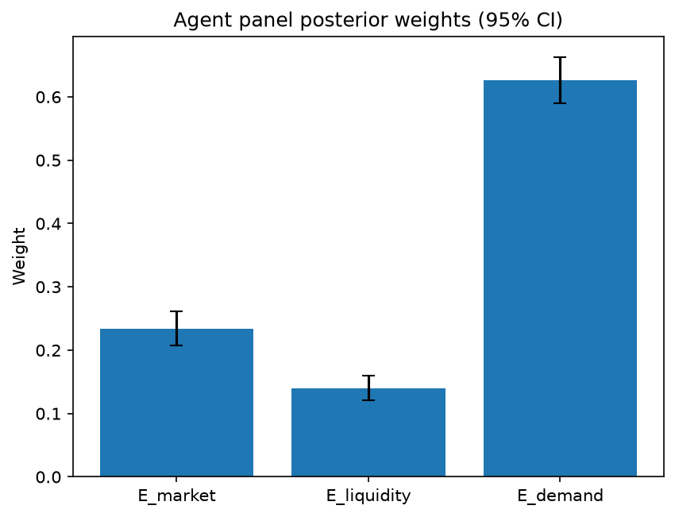

# Survey report: TrustRouter Agentic Full Panel (phi4:14b) -- Level L3e: Economic Value sub-parts

Survey ID: `trustrouter-agentic-full-panel-phi4-14b-2026-09-01-L3e`

## Agent panel

- Agents contributing a valid response: 36
- Classical BWM consistency: 36/36 within threshold

| Criterion | Mean | 95% CI lower | 95% CI upper |
|---|---|---|---|
| E_market | 0.2335 | 0.2072 | 0.2616 |
| E_liquidity | 0.1400 | 0.1214 | 0.1595 |
| E_demand | 0.6265 | 0.5903 | 0.6621 |


## Methodology

Each agent independently completed a Best-Worst Method (BWM) comparison: choosing the single most and least important criterion, then rating every criterion's importance relative to those two on a 1-9 scale. Individual responses were solved with the classical BWM linear program (Rezaei, 2015) for a consistency check, and combined across the panel with a hierarchical Bayesian model (Mohammadi and Rezaei, 2020).


36 agent response(s) were accepted into this result.


Every agent's run began with a QA precheck (its stated configuration verified against ground truth) and every accepted answer's self-reported sources were checked against what reference material was actually available to it; see the Per-agent detail section below and this survey's Conversation Log for each agent's specific results. Every response is schema-validated and independently, repeatedly sampled (never a single completion treated as ground truth); see `guardrails.py`. This survey's complete output is covered by a SHA-256 integrity manifest (`integrity_manifest.json`, `SHA256SUMS`), generated once this run finished, so any later alteration to these files is detectable.


### Charts




## Per-agent detail

### bim-coordinator-base-openmanus (`bim-coordinator-base-openmanus`)

- Role: BIM Coordinator
- Model: ollama/phi4:14b
- DID: `did:key:z6MktjVuxsZoffjLx6zYtw8Bf8nm7iULqLcJwyu2VgSuM19E`
- QA precheck: passed
- Sources used: (not reported)

**Answer:** `{"best": "E_demand", "worst": "E_liquidity", "best_to_others": {"E_demand": 1, "E_market": 7, "E_liquidity": 9}, "others_to_worst": {"E_liquidity": 1, "E_market": 5, "E_demand": 9}}`

**Reasoning:**

As a BIM Coordinator with extensive experience managing multi-stakeholder Building Information Models on renovation and new-build projects, my professional judgment is grounded in the practical implications of each criterion for construction-project data-trust factors.

**Best factor: E_demand**

The future demand for construction project records stored on blockchain is most critical. This encompasses regulated growth, AI integration, and digital-twin advancements, which are increasingly relevant as technology evolves. The ability to leverage these technologies can significantly enhance the value of construction data over time, making it a pivotal consideration.

**Worst factor: E_liquidity**

Tokenisation ease or tradability is least important in this context. While tokenisation offers potential benefits for liquidity and tradeability, its relevance to the core functions of BIM coordination—such as model federation, clash detection, and lifecycle documentation—is limited compared to the other factors.

**Reasoning:**

- **E_demand** is prioritized due to the growing importance of digital technologies in construction, which aligns with long-term strategic goals.
- **E_market** is significant but secondary to future demand, as current marketplace demand may not fully capture emerging technological trends.
- **E_liquidity** is deemed least critical because the practical benefits of tokenisation are less immediate or impactful for BIM coordination compared to other factors.

This assessment reflects a forward-looking perspective on how construction project data will be utilized and valued in the future.

As a BIM Coordinator focusing on the strategic importance of future demand for construction project data, I will provide ratings based on how much more important each factor is compared to others:

- **E_demand vs E_market:** 7  
  Future demand (E_demand) is significantly more critical than current marketplace demand (E_market), as it aligns with long-term technological advancements and regulatory changes.

- **E_demand vs E_liquidity:** 9  
  The importance of future demand far outweighs tokenisation ease (E_liquidity), given its limited immediate impact on core BIM functions compared to the potential benefits of digital integration and compliance.

- **E_market vs E_liquidity:** 5  
  Current marketplace demand (E_market) is moderately more important than tokenisation ease (E_liquidity), as existing buyers' needs are relevant but not as transformative as future technological trends.

### bim-coordinator-base-openmanus (`bim-coordinator-base-openmanus`)

- Role: BIM Coordinator
- Model: ollama/phi4:14b
- DID: `did:key:z6MktjVuxsZoffjLx6zYtw8Bf8nm7iULqLcJwyu2VgSuM19E`
- QA precheck: passed
- Sources used: (not reported)

**Answer:** `{"best": "E_demand", "worst": "E_liquidity", "best_to_others": {"E_demand": 1, "E_market": 7, "E_liquidity": 8}, "others_to_worst": {"E_liquidity": 1, "E_market": 5, "E_demand": 8}}`

**Reasoning:**

**Reasoning:**

As a BIM coordinator with over 10 years of experience in managing multi-stakeholder Building Information Models for both renovation and new-build projects, my professional judgment is grounded in the practical implications of each criterion within the context of construction-project data-trust factors.

1. **E_market (Current marketplace demand):** This criterion reflects the existing demand from buyers who are currently interested in blockchain storage solutions for construction data. While this is important, it primarily indicates current market trends rather than long-term strategic value. In my experience, immediate market demand can fluctuate and may not always align with sustainable growth or future needs.

2. **E_liquidity (Tokenisation ease):** The ease of tokenization refers to how straightforward it is to convert construction data into tradeable tokens. While this can enhance the liquidity and tradability of assets, its importance is contingent on the broader adoption of blockchain technology in the construction industry. As a BIM coordinator, I recognize that while tokenization offers innovative opportunities, it may not be immediately critical for all projects, especially those with long retention horizons like structural capacity dossiers.

3. **E_demand (Future demand):** This criterion considers projected future demand driven by factors such as lifecycle management, regulatory requirements, and the integration of advanced technologies like AI and digital twins. Given my role in managing data across project lifecycles and ensuring compliance with evolving standards, I see significant value in preparing for future demands. The construction industry is increasingly adopting digital solutions, and anticipating these trends can provide a competitive advantage.

**Conclusion:**

Based on this analysis, **E_demand (Future demand)** emerges as the most important criterion due to its alignment with long-term strategic planning and technological advancements that are likely to shape the industry's future. Conversely, **E_liquidity (Tokenisation ease)** is deemed the least critical in the current context, as it depends on broader market adoption and may not be immediately relevant for all projects.

Best factor: E_demand  
Worst factor: E_liquidity

**Reasoning for Ratings:**

1. **E_demand vs E_market:**  
   Future demand is considered more important than current marketplace demand because it aligns with long-term strategic goals, regulatory changes, and technological advancements such as AI and digital twins. These factors are crucial in the construction industry's evolution, making future demand significantly more critical.

2. **E_demand vs E_liquidity:**  
   Tokenization ease is less immediately relevant compared to future demand. While it offers potential benefits for asset liquidity, its importance is contingent on broader market adoption of blockchain technology. Future demand encompasses a wider range of strategic considerations that are essential for long-term planning and compliance.

3. **E_market vs E_liquidity:**  
   Current marketplace demand is more important than tokenization ease because it reflects existing interest and investment in blockchain solutions, which can drive immediate project decisions and funding opportunities. However, its importance is still less than future demand due to the reasons mentioned above.

**Ratings:**

E_demand vs E_market: 7  
E_demand vs E_liquidity: 8  
E_market vs E_liquidity: 5

### bim-coordinator-base-openmanus (`bim-coordinator-base-openmanus`)

- Role: BIM Coordinator
- Model: ollama/phi4:14b
- DID: `did:key:z6MktjVuxsZoffjLx6zYtw8Bf8nm7iULqLcJwyu2VgSuM19E`
- QA precheck: passed
- Sources used: (not reported)

**Answer:** `{"best": "E_demand", "worst": "E_market", "best_to_others": {"E_demand": 1, "E_liquidity": 7, "E_market": 9}, "others_to_worst": {"E_market": 1, "E_liquidity": 5, "E_demand": 9}}`

**Reasoning:**

**Reasoning:**

As a BIM Coordinator with extensive experience in managing Building Information Models for both renovation and new-build projects, my focus is on the long-term value and utility of data within these models. This perspective influences how I evaluate the economic value sub-dimensions provided.

1. **E_market (Current marketplace demand):** While current demand is important, it often reflects short-term trends that may not align with the long-term strategic goals of BIM projects. The immediate market demand for blockchain-stored construction data might be limited due to nascent adoption and understanding of such technologies in the industry.

2. **E_liquidity (Tokenisation ease):** Tokenisation can facilitate easier trading and transferability of assets, but its relevance depends heavily on the specific use case and regulatory environment. In the context of BIM and construction data, tokenisation might not be as critical unless there is a clear path to monetization or asset management that benefits from such technology.

3. **E_demand (Future demand):** This criterion aligns closely with my role's focus on lifecycle documentation and future-proofing projects. The projected growth in areas like regulation, AI integration, and digital twins suggests increasing demand for comprehensive, reliable data over time. As a BIM Coordinator, ensuring that the data can support these future needs is paramount.

Given this analysis, **E_demand** emerges as the most important criterion due to its alignment with long-term strategic goals and evolving industry trends. Conversely, **E_market** appears least critical in this context, as it focuses on immediate demand rather than sustainable growth or utility.

**Answer:**

Best factor: E_demand  
Worst factor: E_market

**Reasoning:**

To determine the ratings on a 1-9 scale, I need to compare each pair of criteria based on their importance relative to each other.

1. **E_demand vs E_liquidity:** 
   - As previously discussed, future demand (E_demand) is crucial for ensuring that BIM data remains relevant and valuable over time, particularly with the rise of digital twins, AI integration, and regulatory changes.
   - Tokenisation ease (E_liquidity), while potentially beneficial, does not have as direct an impact on the long-term strategic goals of a BIM project. It is more about facilitating transactions rather than ensuring data utility or compliance.
   - Therefore, E_demand is significantly more important than E_liquidity.

2. **E_demand vs E_market:**
   - Future demand (E_demand) aligns with the need for sustainable growth and long-term utility of BIM data.
   - Current marketplace demand (E_market) reflects short-term trends that may not be as relevant to the strategic objectives of maintaining comprehensive lifecycle documentation.
   - Thus, E_demand is extremely more important than E_market.

3. **E_liquidity vs E_market:**
   - Tokenisation ease (E_liquidity) offers some advantages in terms of asset management and potential monetization but does not directly impact the core objectives of BIM data management as much as future demand would.
   - Current marketplace demand (E_market) is focused on immediate needs, which are less aligned with long-term strategic goals compared to tokenisation ease.
   - Therefore, E_liquidity is moderately more important than E_market.

**Answer:**

E_demand vs E_liquidity: 7  
E_demand vs E_market: 9  
E_liquidity vs E_market: 5

### bim-coordinator-rag-openmanus (`bim-coordinator-rag-openmanus`)

- Role: BIM Coordinator
- Model: ollama/phi4:14b
- DID: `did:key:z6MkfG5MseccUr21HZSLdPeQrKdR9LQwcXkD4pWXKcUh7U1C`
- QA precheck: passed
- Sources used: (not reported)

**Answer:** `{"best": "E_demand", "worst": "E_liquidity", "best_to_others": {"E_demand": 1, "E_market": 7, "E_liquidity": 9}, "others_to_worst": {"E_liquidity": 1, "E_market": 5, "E_demand": 9}}`

**Reasoning:**

As a BIM coordinator with over 10 years of experience managing Building Information Models on renovation and new-build projects, I am tasked with evaluating the economic value sub-dimensions for construction-project data considered for blockchain storage. The criteria under consideration are:

- **E_market**: Current marketplace demand
- **E_liquidity**: Tokenisation ease
- **E_demand**: Future demand

**Reasoning:**

1. **E_market (Current Marketplace Demand):**
   - This criterion reflects the immediate interest and potential adoption of blockchain technology in construction projects. As a BIM coordinator, I recognize that current market demand can drive initial investments and pilot projects, which are crucial for demonstrating value and gaining stakeholder buy-in.
   - The present marketplace demand is essential for securing funding and resources to implement new technologies like blockchain.

2. **E_liquidity (Tokenisation Ease):**
   - Tokenisation refers to the process of converting data into a digital token that can be traded or used in financial transactions. While this is an innovative approach, its applicability and ease are still evolving within the construction industry.
   - As a BIM coordinator, I am aware that while tokenisation offers potential benefits such as enhanced liquidity and new revenue streams, it is not yet a primary driver for blockchain adoption in our field.

3. **E_demand (Future Demand):**
   - Future demand encompasses projected growth due to factors like regulatory changes, advancements in analytics, and the increasing importance of digital twins.
   - As regulations evolve and technology advances, future demand will likely increase as more stakeholders recognize the long-term benefits of blockchain for data integrity, transparency, and security.

**Conclusion:**

Given my role and experience, I prioritize **E_demand (Future Demand)** as the most important criterion. The construction industry is on a trajectory towards greater digital integration, driven by regulatory requirements and technological advancements. Future demand will shape the strategic direction and long-term viability of blockchain applications in our field.

Conversely, **E_liquidity (Tokenisation Ease)** is currently the least critical factor. While it holds promise for future innovation, its immediate impact on construction projects is limited compared to current market dynamics and anticipated regulatory changes.

**Best factor:** E_demand  
**Worst factor:** E_liquidity

Certainly! Here are the ratings based on the analysis:

- **E_demand vs E_market:** 7  
  Future demand is significantly more important than current marketplace demand, as it drives long-term strategic adoption and aligns with regulatory trends.

- **E_demand vs E_liquidity:** 9  
  Future demand is extremely more important compared to tokenisation ease, given the latter's nascent stage in construction applications.

- **E_market vs E_liquidity:** 5  
  Current marketplace demand is moderately more important than tokenisation ease, as immediate market interest can facilitate initial blockchain adoption.

### bim-coordinator-rag-openmanus (`bim-coordinator-rag-openmanus`)

- Role: BIM Coordinator
- Model: ollama/phi4:14b
- DID: `did:key:z6MkfG5MseccUr21HZSLdPeQrKdR9LQwcXkD4pWXKcUh7U1C`
- QA precheck: passed
- Sources used: (not reported)

**Answer:** `{"best": "E_demand", "worst": "E_market", "best_to_others": {"E_demand": 1, "E_liquidity": 7, "E_market": 9}, "others_to_worst": {"E_market": 1, "E_liquidity": 5, "E_demand": 9}}`

**Reasoning:**

**Reasoning**

As a BIM coordinator with extensive experience in managing multi-stakeholder Building Information Models for both renovation and new-build projects, my focus is on the lifecycle documentation of these models. This involves ensuring that data remains relevant, accessible, and useful over time, which aligns closely with considerations around future demand (E_demand) for such information.

**Economic Value Sub-Dimensions Analysis:**

- **E_market (Current Marketplace Demand):** While current marketplace demand is important, it often reflects short-term needs. In the context of BIM and construction data, the immediate market may not fully appreciate or require the long-term value that this data can provide, especially in terms of lifecycle management and sustainability considerations.

- **E_liquidity (Tokenisation Ease):** The ease of tokenization refers to how readily construction data can be packaged as a tradable asset. While innovative and potentially valuable for certain applications, such as smart contracts or decentralized finance within the construction industry, this aspect is more speculative in nature. It represents an emerging trend rather than a core requirement for BIM data management.

- **E_demand (Future Demand):** This criterion stands out as most critical from my perspective. The future demand encompasses not only regulatory and compliance needs but also the growing importance of analytics, digital twins, and lifecycle assessment in construction projects. As buildings become more complex and regulations around sustainability and efficiency tighten, the value of detailed BIM data is expected to increase significantly. This data supports decision-making throughout a building's life, from design and construction through to operation and eventual decommissioning or renovation.

Given these considerations, **E_demand** aligns most closely with the core responsibilities and future-oriented focus of a BIM coordinator. It underscores the importance of preparing for evolving industry standards, technological advancements, and regulatory requirements that will shape how construction data is valued and utilized in the long term.

Conversely, while current marketplace demand (E_market) is relevant, it does not capture the strategic importance of anticipating future needs and trends. Therefore, from a lifecycle documentation perspective, **E_market** could be considered less critical compared to E_demand, making it the least important criterion among those listed for my role as a BIM coordinator.

**Best factor: E_demand**

**Worst factor: E_market**

Based on the reasoning provided:

- **E_demand vs E_liquidity:** 7  
  Future demand is more important than tokenization ease, as it directly impacts long-term strategic value and compliance in construction projects.

- **E_demand vs E_market:** 9  
  Future demand is extremely more important than current marketplace demand due to its alignment with evolving industry needs and regulatory requirements.

- **E_liquidity vs E_market:** 5  
  Tokenization ease and current marketplace demand are moderately different, as tokenization represents an emerging trend while current demand reflects immediate market conditions.

### bim-coordinator-rag-openmanus (`bim-coordinator-rag-openmanus`)

- Role: BIM Coordinator
- Model: ollama/phi4:14b
- DID: `did:key:z6MkfG5MseccUr21HZSLdPeQrKdR9LQwcXkD4pWXKcUh7U1C`
- QA precheck: passed
- Sources used: (not reported)

**Answer:** `{"best": "E_demand", "worst": "E_liquidity", "best_to_others": {"E_demand": 1, "E_market": 8, "E_liquidity": 9}, "others_to_worst": {"E_liquidity": 1, "E_market": 6, "E_demand": 9}}`

**Reasoning:**

**Reasoning**

As a BIM coordinator with over ten years of experience managing multi-stakeholder Building Information Models on renovation and new-build projects, my focus is primarily on the lifecycle documentation and model federation aspects. This background influences how I perceive the economic value dimensions in question.

- **E_market (Current marketplace demand):** While current demand is important for immediate business considerations, it does not necessarily align with long-term strategic goals or technological advancements that are crucial in construction projects. The emphasis on BIM involves preparing for future trends and ensuring compliance over time, which suggests a lesser focus on the present market alone.

- **E_liquidity (Ease of tokenisation/tradability):** Tokenization is an emerging concept within blockchain technology, offering potential benefits such as increased liquidity and new investment opportunities. However, in the context of BIM and construction data management, the practicality and immediate relevance of tokenization are less clear compared to other factors. The construction industry traditionally deals with tangible assets rather than digital tokens, making this aspect less critical from a BIM coordinator's perspective.

- **E_demand (Future demand):** This criterion aligns closely with my role as it involves anticipating future needs in lifecycle management, regulatory compliance, and analytics capabilities. As regulations evolve and the use of digital twins and AI becomes more prevalent, ensuring that data is structured to meet these future demands is crucial. The ability to adapt to new technologies and standards over time is a key consideration for BIM coordinators.

Given this analysis, **E_demand** emerges as the most important criterion due to its alignment with long-term strategic planning and technological evolution in construction projects. Conversely, **E_liquidity** appears least critical given the current context of BIM management and the traditional nature of the industry.

**Best factor:** E_demand  
**Worst factor:** E_liquidity

**Ratings**

- **E_demand vs E_market:** 8  
  Future demand is significantly more important than current marketplace demand due to the need for long-term adaptability and compliance in construction projects.

- **E_demand vs E_liquidity:** 9  
  The future demand for data management capabilities, driven by technological advancements and regulatory changes, is extremely more important compared to the ease of tokenization, which has limited immediate relevance in BIM contexts.

- **E_market vs E_liquidity:** 6  
  Current marketplace demand is moderately more important than tokenization ease. While current demand impacts immediate business decisions, tokenization remains a less critical factor for traditional construction project management.

### blockchain-engineer-base-openmanus (`blockchain-engineer-base-openmanus`)

- Role: Blockchain / DLT Engineer
- Model: ollama/phi4:14b
- DID: `did:key:z6Mkt3rBXTsyaURYSmKVDjYBpnSZtGCDZ2onmnLPwD2iWGby`
- QA precheck: passed
- Sources used: (not reported)

**Answer:** `{"best": "E_demand", "worst": "E_liquidity", "best_to_others": {"E_demand": 1, "E_market": 7, "E_liquidity": 8}, "others_to_worst": {"E_liquidity": 1, "E_market": 5, "E_demand": 8}}`

**Reasoning:**

As a Blockchain/DLT Engineer with experience in permissioned-ledger deployments, evaluating these criteria involves considering their relevance to the adoption and success of blockchain technology within construction project records.

**Best factor: E_demand**

- **Reasoning**: Future demand is likely the most important criterion because it encompasses long-term growth potential driven by regulation, AI integration, and digital twins. As regulations evolve and technologies like AI and digital twins become more prevalent in construction, the demand for blockchain solutions will increase significantly. This future-oriented perspective aligns with strategic planning and investment in technology that anticipates market trends.

**Worst factor: E_liquidity**

- **Reasoning**: While tokenisation ease is beneficial for creating tradeable assets, its immediate relevance to construction project records may be less critical compared to current demand or future growth. The construction industry traditionally deals with tangible assets rather than digital tokens, making the ease of tokenisation a secondary concern unless specific use cases are identified.

**Conclusion**: Future demand (E_demand) is prioritized due to its alignment with emerging trends and regulatory changes that will drive blockchain adoption in construction. Tokenisation ease (E_liquidity), while valuable, is less immediately impactful for this sector compared to the other criteria.

Best factor: E_demand  
Worst factor: E_liquidity

Based on the evaluation of these criteria:

- **E_demand vs E_market**: Future demand is considered significantly more important than current marketplace demand due to its alignment with long-term industry trends and regulatory changes. Therefore, I rate this as 7.

- **E_demand vs E_liquidity**: The importance of future demand over tokenisation ease is even greater because the latter has limited immediate relevance in construction project records. Thus, I rate this as 8.

- **E_market vs E_liquidity**: Current marketplace demand is more important than tokenisation ease, but not by a large margin, since both are relevant to adoption albeit at different stages or contexts. Therefore, I rate this as 5.

```
E_demand vs E_market: 7
E_demand vs E_liquidity: 8
E_market vs E_liquidity: 5
```

### blockchain-engineer-base-openmanus (`blockchain-engineer-base-openmanus`)

- Role: Blockchain / DLT Engineer
- Model: ollama/phi4:14b
- DID: `did:key:z6Mkt3rBXTsyaURYSmKVDjYBpnSZtGCDZ2onmnLPwD2iWGby`
- QA precheck: passed
- Sources used: (not reported)

**Answer:** `{"best": "E_demand", "worst": "E_liquidity", "best_to_others": {"E_demand": 1, "E_market": 7, "E_liquidity": 9}, "others_to_worst": {"E_liquidity": 1, "E_market": 5, "E_demand": 9}}`

**Reasoning:**

As a Blockchain/DLT Engineer with production experience on permissioned-ledger deployments, evaluating these criteria involves considering the technical and economic aspects of blockchain applications in construction-project records.

**Best Factor: E_demand**

- **Reasoning**: Future demand is crucial because it encompasses regulatory changes, AI integration, and digital twin technologies. These trends are likely to drive significant growth and adoption of blockchain solutions in construction projects. The potential for increased regulation and the need for advanced analytics make future demand a pivotal factor.

**Worst Factor: E_liquidity**

- **Reasoning**: While tokenization can offer benefits like liquidity and tradability, it is not always applicable or necessary for all types of construction-project records. The complexity and regulatory challenges associated with creating tradeable tokens may outweigh the immediate benefits in this context.

These judgments are based on current industry trends and the specific application of blockchain technology in construction projects.

Based on the reasoning provided for selecting **E_demand** as the most important factor and **E_liquidity** as the least important, here are the ratings:

- **E_demand vs E_market**: 7  
  *Reasoning*: Future demand is more critical due to emerging trends like regulation and AI integration compared to current marketplace demand.

- **E_demand vs E_liquidity**: 9  
  *Reasoning*: The potential for future growth and technological advancements makes future demand significantly more important than tokenization ease, which may not be applicable in all scenarios.

- **E_market vs E_liquidity**: 5  
  *Reasoning*: Current marketplace demand is moderately more important than tokenization ease because existing buyers are crucial, but the complexity of tokenization reduces its immediate relevance.

### blockchain-engineer-base-openmanus (`blockchain-engineer-base-openmanus`)

- Role: Blockchain / DLT Engineer
- Model: ollama/phi4:14b
- DID: `did:key:z6Mkt3rBXTsyaURYSmKVDjYBpnSZtGCDZ2onmnLPwD2iWGby`
- QA precheck: passed
- Sources used: (not reported)

**Answer:** `{"best": "E_demand", "worst": "E_liquidity", "best_to_others": {"E_demand": 1, "E_market": 7, "E_liquidity": 9}, "others_to_worst": {"E_liquidity": 1, "E_market": 5, "E_demand": 9}}`

**Reasoning:**

As a blockchain/DLT engineer with experience in permissioned-ledger deployments, my evaluation focuses on the technical feasibility and potential economic value of deploying such technologies for construction-project data.

**Best factor: E_demand**

The criterion "E_demand" (Future demand) is deemed most important. This is because future demand encompasses regulatory changes, the growth of digital twins, and AI integration in construction projects. These factors are likely to drive long-term adoption and innovation in blockchain/DLT applications within the industry. The increasing emphasis on data analytics and smart contracts for lifecycle management further supports this criterion as a key driver of economic value.

**Worst factor: E_liquidity**

The criterion "E_liquidity" (Ease of tokenisation/tradability) is considered least important in this context. While tokenisation can provide benefits such as fractional ownership and liquidity, the construction industry traditionally deals with large-scale projects that may not immediately benefit from these features. The complexity and regulatory challenges associated with tokenising construction data also pose significant hurdles. Therefore, compared to current demand and future growth potential, ease of tokenisation is less critical for immediate economic value.

**Reasoning:**

- **E_demand**: Regulatory compliance, digital twin integration, and AI analytics are expected to significantly influence the adoption of blockchain/DLT in construction. These factors suggest a strong future demand that could drive innovation and investment.
  
- **E_market**: While current marketplace demand is important, it may not capture the transformative potential of emerging technologies as effectively as future-oriented criteria.

- **E_liquidity**: Although tokenisation offers innovative possibilities, its immediate applicability and benefits in the construction sector are limited compared to other factors. The industry's focus on long-term projects and regulatory compliance makes liquidity less urgent.

This assessment is grounded in my professional experience with permissioned-ledger deployments and an understanding of the evolving landscape of blockchain/DLT applications in construction.

Based on the evaluation of the criteria:

- **E_demand vs E_market**: 7  
  Future demand is significantly more important than current marketplace demand due to its potential impact from regulatory changes and technological advancements.

- **E_demand vs E_liquidity**: 9  
  Future demand is extremely more important compared to tokenisation ease, as it encompasses broader industry shifts that are likely to drive long-term adoption of blockchain/DLT technologies in construction.

- **E_market vs E_liquidity**: 5  
  Current marketplace demand is moderately more important than tokenisation ease. While current demand reflects existing interest and potential immediate benefits, the complexity and limited applicability of tokenisation make it less critical at present.

### blockchain-engineer-rag-openmanus (`blockchain-engineer-rag-openmanus`)

- Role: Blockchain / DLT Engineer
- Model: ollama/phi4:14b
- DID: `did:key:z6Mko8hHqpF7sFFLRW2GQFdJtGuQ5oszhR6pSFVQor3f2sFZ`
- QA precheck: passed
- Sources used: (not reported)

**Answer:** `{"best": "E_demand", "worst": "E_liquidity", "best_to_others": {"E_demand": 1, "E_market": 7, "E_liquidity": 9}, "others_to_worst": {"E_liquidity": 1, "E_market": 5, "E_demand": 9}}`

**Reasoning:**

Based on my professional judgment as a Blockchain/DLT Engineer with experience in permissioned-ledger technologies and their applications in various industries, I would assess the importance of these criteria for economic value as follows:

- **E_market (Current marketplace demand):** This criterion reflects the immediate interest and need for blockchain solutions within current markets. It is crucial because it indicates existing opportunities for deployment and adoption, which can drive initial revenue streams and validate technology in real-world applications.

- **E_liquidity (Tokenisation ease):** Tokenization can significantly enhance the liquidity of assets by enabling fractional ownership and easier transferability on digital platforms. This criterion is important as it opens up new financial models and investment opportunities, potentially broadening market reach and participation.

- **E_demand (Future demand):** Future demand encompasses projected growth areas such as regulation compliance, analytics capabilities, and integration with emerging technologies like AI and digital twins. It represents long-term potential and sustainability of blockchain solutions in evolving markets.

Considering these factors:

- **Best factor: E_demand**
  - The future demand criterion is most important because it captures the long-term viability and adaptability of blockchain technology to meet upcoming regulatory requirements, technological advancements, and market needs. As industries continue to evolve, the ability to anticipate and respond to future demands will be crucial for sustained success.

- **Worst factor: E_liquidity**
  - While tokenization offers significant benefits, its importance is somewhat contingent on specific use cases and market readiness. In many sectors, particularly those not directly related to financial services or asset management, the immediate need for tokenization may not be as pressing compared to current demand and future potential.

Best factor: E_demand  
Worst factor: E_liquidity

Based on the reasoning provided:

- **E_demand vs E_market:** 7  
  Future demand is significantly more important than current marketplace demand because it encompasses long-term growth and adaptability, which are crucial for sustained success.

- **E_demand vs E_liquidity:** 9  
  The importance of future demand far outweighs tokenization ease, as the latter's impact is more situational and less universally applicable across industries compared to the broad implications of future market trends and needs.

- **E_market vs E_liquidity:** 5  
  Current marketplace demand is moderately more important than tokenization ease. While both are relevant, immediate market interest can drive initial adoption and revenue, whereas tokenization's benefits may not be as immediately necessary in all contexts.

### blockchain-engineer-rag-openmanus (`blockchain-engineer-rag-openmanus`)

- Role: Blockchain / DLT Engineer
- Model: ollama/phi4:14b
- DID: `did:key:z6Mko8hHqpF7sFFLRW2GQFdJtGuQ5oszhR6pSFVQor3f2sFZ`
- QA precheck: passed
- Sources used: (not reported)

**Answer:** `{"best": "E_demand", "worst": "E_liquidity", "best_to_others": {"E_demand": 1, "E_market": 8, "E_liquidity": 9}, "others_to_worst": {"E_liquidity": 1, "E_market": 7, "E_demand": 9}}`

**Reasoning:**

**Reasoning:**

As a blockchain/DLT engineer with experience in permissioned-ledger systems, I consider the following factors:

- **E_market (Current marketplace demand):** This reflects immediate interest and adoption potential. In construction, current demand can drive initial integration of DLT solutions for data management and transparency.

- **E_liquidity (Tokenisation ease):** Tokenization involves converting assets into digital tokens on a blockchain, which can enhance liquidity by making these assets more tradable. However, in the context of construction projects, tokenization might not be as immediately relevant or necessary compared to other industries like finance or real estate.

- **E_demand (Future demand):** This criterion considers long-term growth potential driven by regulatory changes, advancements in analytics, and digital transformation trends such as BIM (Building Information Modeling). The increasing emphasis on data-driven decision-making and compliance could significantly boost the future demand for blockchain solutions in construction.

Given these considerations, I find **E_demand** to be the most important criterion due to its alignment with long-term industry trends and regulatory pressures. On the other hand, **E_liquidity** is deemed least critical in this context because tokenization does not directly address immediate or foreseeable needs within typical construction projects.

**Answer:**

Best factor: E_demand  
Worst factor: E_liquidity

Based on the reasoning provided:

- **E_demand vs E_market:** Future demand is significantly more important due to long-term industry trends and regulatory pressures. I would rate this as 8, indicating that future demand is much more critical than current marketplace demand.

- **E_demand vs E_liquidity:** The relevance of tokenization in construction is minimal compared to the potential growth driven by future demand. Thus, I rate this as 9, showing that future demand is extremely more important than tokenization ease.

- **E_market vs E_liquidity:** Current marketplace demand is more relevant than tokenization for immediate adoption and integration within the industry. Therefore, I would rate this as 7, indicating that current marketplace demand is much more important than tokenization ease.

Here are the ratings in the required format:

```
E_demand vs E_market: 8
E_demand vs E_liquidity: 9
E_market vs E_liquidity: 7
```

### blockchain-engineer-rag-openmanus (`blockchain-engineer-rag-openmanus`)

- Role: Blockchain / DLT Engineer
- Model: ollama/phi4:14b
- DID: `did:key:z6Mko8hHqpF7sFFLRW2GQFdJtGuQ5oszhR6pSFVQor3f2sFZ`
- QA precheck: passed
- Sources used: (not reported)

**Answer:** `{"best": "E_demand", "worst": "E_liquidity", "best_to_others": {"E_demand": 1, "E_market": 7, "E_liquidity": 8}, "others_to_worst": {"E_liquidity": 1, "E_market": 5, "E_demand": 8}}`

**Reasoning:**

**Reasoning:**  
As a blockchain/DLT engineer with experience in permissioned-ledger systems, I consider the economic viability and future potential of data storage on blockchains. 

- **E_market (Current marketplace demand):** This reflects existing interest and adoption levels, which are crucial for immediate relevance but may not capture long-term trends or innovation potentials.
  
- **E_liquidity (Tokenisation ease):** The ability to tokenize data can significantly enhance its value by enabling tradeability and integration into broader financial ecosystems. However, this is contingent on regulatory environments and market readiness.

- **E_demand (Future demand):** This criterion considers the projected growth driven by factors like regulation, analytics advancements, and digital transformation trends. It captures long-term strategic importance, which can be pivotal for sustained adoption and innovation in blockchain applications.

Given these considerations, future demand (E_demand) is likely to drive more significant changes and opportunities in the blockchain space compared to current market conditions or tokenization ease alone. Therefore, it stands out as the most critical factor for long-term success and relevance.

**Best factor:** E_demand  
**Worst factor:** E_liquidity

**Ratings:**

- **E_demand vs E_market:** 7  
  *Reasoning:* Future demand (E_demand) is more important than current marketplace demand (E_market) because it captures long-term growth potential and strategic relevance, which are crucial for sustained adoption.

- **E_demand vs E_liquidity:** 8  
  *Reasoning:* The future demand (E_demand) is significantly more critical than tokenization ease (E_liquidity), as the latter depends on regulatory environments and market readiness, whereas future demand encompasses broader growth drivers like regulation and digital transformation.

- **E_market vs E_liquidity:** 5  
  *Reasoning:* Current marketplace demand (E_market) is moderately more important than tokenization ease (E_liquidity). While existing interest drives immediate relevance, the ability to tokenize data can enhance its value but is not as immediately impactful without market readiness.

### compliance-officer-base-openmanus (`compliance-officer-base-openmanus`)

- Role: Compliance and Regulatory Officer
- Model: ollama/phi4:14b
- DID: `did:key:z6MkhbjMCfTLP5x4Chc2q7Rskakua1JQfKHHRZtyr5dc3r8w`
- QA precheck: passed
- Sources used: (not reported)

**Answer:** `{"best": "E_demand", "worst": "E_liquidity", "best_to_others": {"E_demand": 1, "E_market": 7, "E_liquidity": 8}, "others_to_worst": {"E_liquidity": 1, "E_market": 5, "E_demand": 8}}`

**Reasoning:**

As a facility-management compliance officer responsible for GDPR and construction-regulatory obligations across a building's operational lifecycle, I must consider the implications of each criterion in terms of economic value within the context of blockchain storage.

**Best factor: E_demand**

- **Reasoning:** The projected future demand (E_demand) is likely to be most important due to the increasing integration of regulated technologies such as AI and digital twins in construction. These advancements suggest a growing need for secure, immutable data storage solutions that can accommodate evolving regulatory requirements and technological capabilities.

**Worst factor: E_liquidity**

- **Reasoning:** While tokenisation ease (E_liquidity) is relevant, it may be less critical compared to current demand and future projections. The practicality of converting construction-project records into tradeable tokens might not align with the primary needs of regulatory compliance and data integrity in this sector.

This assessment considers both the immediate and long-term implications of blockchain storage for construction-project records, grounded in my professional expertise and the provided reference material.

Given the assessment that **E_demand** is the most important factor and **E_liquidity** is the least important, here are the ratings on a 1-9 scale:

- **E_demand vs E_market:** 7  
  - Reasoning: Future demand (E_demand) is significantly more important than current marketplace demand (E_market) due to the anticipated growth in regulated technologies and digital integration.

- **E_demand vs E_liquidity:** 8  
  - Reasoning: The ease of tokenisation (E_liquidity) is considerably less critical compared to future demand, as it does not align directly with regulatory compliance or technological advancements.

- **E_market vs E_liquidity:** 5  
  - Reasoning: Current marketplace demand (E_market) holds more importance than tokenisation ease (E_liquidity), but the difference is moderate since both are relevant to current economic considerations.

### compliance-officer-base-openmanus (`compliance-officer-base-openmanus`)

- Role: Compliance and Regulatory Officer
- Model: ollama/phi4:14b
- DID: `did:key:z6MkhbjMCfTLP5x4Chc2q7Rskakua1JQfKHHRZtyr5dc3r8w`
- QA precheck: passed
- Sources used: (not reported)

**Answer:** `{"best": "E_demand", "worst": "E_liquidity", "best_to_others": {"E_demand": 1, "E_market": 7, "E_liquidity": 9}, "others_to_worst": {"E_liquidity": 1, "E_market": 5, "E_demand": 9}}`

**Reasoning:**

As a facility-management compliance officer responsible for GDPR and construction-regulatory obligations across a building's operational lifecycle, I must evaluate the criteria based on their relevance to current and future demands in the context of blockchain storage for construction-project data.

**Best factor: E_demand**

The criterion "E_demand" (Future demand) is considered most important because it encompasses projected growth driven by regulation, AI integration, and digital twin technologies. These factors are likely to significantly influence the long-term value and necessity of blockchain solutions in managing construction-project data, aligning with evolving regulatory requirements and technological advancements.

**Worst factor: E_liquidity**

The criterion "E_liquidity" (Ease of tokenisation/tradability) is considered least important in this context. While ease of tokenisation can enhance the tradability of assets, it does not directly impact the core compliance and operational needs related to GDPR and construction regulations. The focus for a compliance officer is more on ensuring data integrity, security, and adherence to legal standards rather than the tradability aspect.

**Reasoning:**

- **E_demand** addresses future regulatory changes and technological advancements that are critical for long-term strategic planning and compliance.
- **E_market** reflects current demand but may not capture the evolving nature of regulations and technology as effectively as E_demand.
- **E_liquidity** is less relevant to the primary focus on compliance and data integrity in construction-project management.

This reasoning aligns with my professional role, focusing on future-proofing against regulatory changes and leveraging emerging technologies for enhanced compliance.

As a facility-management compliance officer responsible for GDPR and construction-regulatory obligations, I will provide the ratings based on my professional judgment regarding the importance of each criterion in the context of blockchain storage for construction-project data.

**Ratings:**

- **E_demand vs E_market:** 7  
  Future demand (E_demand) is considered significantly more important than current marketplace demand (E_market) due to its focus on long-term regulatory and technological trends that will shape future compliance needs.

- **E_demand vs E_liquidity:** 9  
  Future demand (E_demand) is extremely more important than tokenisation ease (E_liquidity), as the latter does not directly impact the core compliance and operational requirements in construction-project management.

- **E_market vs E_liquidity:** 5  
  Current marketplace demand (E_market) is moderately more important than tokenisation ease (E_liquidity), given that existing market needs are relevant but less critical compared to future regulatory and technological developments.

### compliance-officer-base-openmanus (`compliance-officer-base-openmanus`)

- Role: Compliance and Regulatory Officer
- Model: ollama/phi4:14b
- DID: `did:key:z6MkhbjMCfTLP5x4Chc2q7Rskakua1JQfKHHRZtyr5dc3r8w`
- QA precheck: passed
- Sources used: (not reported)

**Answer:** `{"best": "E_demand", "worst": "E_market", "best_to_others": {"E_demand": 1, "E_liquidity": 7, "E_market": 8}, "others_to_worst": {"E_market": 1, "E_liquidity": 5, "E_demand": 8}}`

**Reasoning:**

**Reasoning:**

As a facility-management compliance officer responsible for GDPR and construction-regulatory obligations across a building's operational lifecycle, I must consider the economic value of construction-project data in terms of its current and future utility.

- **E_market (Current marketplace demand):** This criterion reflects existing buyers' interest. While important, it is often driven by immediate needs rather than long-term strategic considerations. In the context of blockchain storage for construction data, this might not be as critical because the value proposition extends beyond just current market demands.

- **E_liquidity (Tokenisation ease):** The ability to tokenize and trade data can significantly enhance its economic value by opening new markets and revenue streams. However, the feasibility and regulatory compliance of tokenization in the construction sector are complex and not yet fully realized, making it a less immediate concern compared to other factors.

- **E_demand (Future demand):** This criterion considers projected future demand driven by regulation, AI, and digital twins. As regulations evolve and technology advances, the ability to leverage data for compliance, predictive analytics, and operational efficiency will become increasingly valuable. Future demand is likely to be a critical driver of long-term economic value, especially in an industry that is becoming more digitized.

Given these considerations, **E_demand** emerges as the most important criterion due to its alignment with future regulatory requirements and technological advancements. Conversely, **E_market** appears less critical because it focuses on current demand rather than strategic future positioning.

Best factor: E_demand  
Worst factor: E_market

**Reasoning:**

To determine the ratings on a 1-9 scale, I need to compare each pair of criteria based on their relative importance in terms of economic value for construction-project data stored on blockchain.

1. **E_demand vs E_liquidity:** 
   - Future demand (E_demand) is likely more critical than tokenization ease (E_liquidity) because it aligns with long-term strategic needs such as regulatory compliance and technological advancements.
   - Rating: 7 (E_demand is significantly more important)

2. **E_demand vs E_market:** 
   - As previously reasoned, future demand (E_demand) has a greater impact on the economic value due to its alignment with evolving regulations and technology trends compared to current marketplace demand (E_market).
   - Rating: 8 (E_demand is extremely more important)

3. **E_liquidity vs E_market:** 
   - Tokenization ease (E_liquidity) offers potential for future market expansion, whereas current marketplace demand (E_market) focuses on existing needs.
   - While both are important, tokenization has a strategic advantage in terms of long-term value creation.
   - Rating: 5 (E_liquidity is moderately more important)

E_demand vs E_liquidity: 7  
E_demand vs E_market: 8  
E_liquidity vs E_market: 5

### compliance-officer-rag-openmanus (`compliance-officer-rag-openmanus`)

- Role: Compliance and Regulatory Officer
- Model: ollama/phi4:14b
- DID: `did:key:z6MknnPyULv317BzskfxgnYty22cc5A3AddPeVZZsocVNgeY`
- QA precheck: passed
- Sources used: (not reported)

**Answer:** `{"best": "E_demand", "worst": "E_liquidity", "best_to_others": {"E_demand": 1, "E_market": 7, "E_liquidity": 9}, "others_to_worst": {"E_liquidity": 1, "E_market": 5, "E_demand": 9}}`

**Reasoning:**

**Best factor:** E_demand  
**Worst factor:** E_liquidity

**Reasoning:**

- **E_demand (Future demand)** is identified as the most important criterion due to its alignment with long-term growth drivers such as regulated environments, AI advancements, and digital twin technologies. These factors are likely to significantly increase the value of construction-project records over time, making future demand a critical consideration for economic value.

- **E_liquidity (Tokenisation ease)** is considered the least important criterion in this context. While tokenization can enhance tradability and potentially unlock new markets, its immediate impact on the intrinsic value of construction-project records may be limited compared to the broader implications of future demand. Additionally, the current state of blockchain technology and regulatory frameworks might pose challenges to widespread adoption of tokenization for such records.

This assessment is grounded in the understanding that while present marketplace demand (E_market) is important, the transformative potential of future technologies and regulations (E_demand) offers a more compelling case for long-term economic value. Conversely, the practical challenges associated with E_liquidity make it less critical in comparison to the other criteria evaluated.

```
E_demand vs E_market: 7
E_demand vs E_liquidity: 9
E_market vs E_liquidity: 5
```

**Reasoning:**

- **E_demand vs E_market:** A rating of 7 indicates that future demand is considered significantly more important than current marketplace demand. This reflects the belief that long-term growth drivers such as regulated environments, AI advancements, and digital twin technologies will have a greater impact on economic value compared to existing buyers.

- **E_demand vs E_liquidity:** A rating of 9 suggests that future demand is extremely more important than tokenization ease. The transformative potential of future technologies and regulations outweighs the current practical challenges associated with tokenizing construction-project records for tradability.

- **E_market vs E_liquidity:** A rating of 5 indicates a moderate preference for current marketplace demand over tokenization ease. While existing buyers are important, the immediate impact of tokenization is seen as less critical compared to future demand but still more relevant than liquidity alone in this context.

### compliance-officer-rag-openmanus (`compliance-officer-rag-openmanus`)

- Role: Compliance and Regulatory Officer
- Model: ollama/phi4:14b
- DID: `did:key:z6MknnPyULv317BzskfxgnYty22cc5A3AddPeVZZsocVNgeY`
- QA precheck: passed
- Sources used: (not reported)

**Answer:** `{"best": "E_demand", "worst": "E_liquidity", "best_to_others": {"E_demand": 1, "E_market": 8, "E_liquidity": 9}, "others_to_worst": {"E_liquidity": 1, "E_market": 6, "E_demand": 9}}`

**Reasoning:**

**Reasoning**

As a facility-management compliance officer responsible for GDPR and construction-regulatory obligations across a building's operational lifecycle, I must consider the economic value of blockchain storage in terms of its current marketplace demand (E_market), ease of tokenisation/tradability (E_liquidity), and projected future demand (E_demand).

- **E_market** is crucial because it reflects existing buyers' interest. However, this criterion might not capture long-term strategic benefits or regulatory compliance needs that could emerge.
  
- **E_liquidity**, while important for understanding how easily data can be tokenised and traded, may not directly impact the immediate or future value of blockchain storage in a construction context where regulatory compliance and data integrity are paramount.

- **E_demand** is likely the most critical factor. It encompasses projected future demand driven by lifecycle considerations, regulation, and analytics advancements. This forward-looking perspective aligns with my role's focus on ensuring long-term compliance and leveraging emerging technologies for operational efficiency and regulatory adherence.

Given these considerations, **E_demand** stands out as the best criterion due to its alignment with strategic planning and regulatory foresight. Conversely, while still relevant, **E_liquidity** may be considered the least critical in this context, as immediate tradability does not directly influence compliance or long-term operational strategies.

Best factor: E_demand  
Worst factor: E_liquidity

Based on the reasoning provided:

- **E_demand vs E_market**: 8  
  Future demand is significantly more important than current marketplace demand due to its alignment with long-term strategic and regulatory considerations.

- **E_demand vs E_liquidity**: 9  
  The importance of future demand far outweighs that of tokenisation ease, as it directly impacts compliance and operational strategies over time.

- **E_market vs E_liquidity**: 6  
  Current marketplace demand is moderately more important than tokenisation ease, given its relevance to immediate buyer interest, though less critical than future demand.

### compliance-officer-rag-openmanus (`compliance-officer-rag-openmanus`)

- Role: Compliance and Regulatory Officer
- Model: ollama/phi4:14b
- DID: `did:key:z6MknnPyULv317BzskfxgnYty22cc5A3AddPeVZZsocVNgeY`
- QA precheck: passed
- Sources used: (not reported)

**Answer:** `{"best": "E_demand", "worst": "E_liquidity", "best_to_others": {"E_demand": 1, "E_market": 8, "E_liquidity": 9}, "others_to_worst": {"E_liquidity": 1, "E_market": 6, "E_demand": 9}}`

**Reasoning:**

**Reasoning:**

As a compliance and regulatory officer responsible for GDPR and construction-regulatory obligations, my focus is on ensuring that data management practices comply with legal standards while maximizing economic value. In the context of blockchain storage for construction-project records, I must consider both current and future demands alongside practical implementation aspects.

1. **E_market (Current marketplace demand):** This criterion reflects existing buyers' interest in blockchain solutions. While important, it is reactive to current market conditions and may not fully capture long-term strategic value or regulatory alignment.

2. **E_liquidity (Tokenisation ease):** Tokenization can enhance tradability and liquidity of assets on the blockchain. However, its relevance depends heavily on specific use cases within construction projects, which might not always necessitate tokenization for compliance or operational efficiency.

3. **E_demand (Future demand):** This criterion considers projected future demand driven by lifecycle management, regulatory changes, and analytics advancements. As regulations evolve and digital transformation accelerates in the construction industry, future demand will likely dictate strategic priorities more than current market conditions or tokenization ease.

Given these considerations, **E_demand** is best because it aligns with long-term compliance strategies and anticipates future regulatory requirements and technological trends. Conversely, **E_liquidity** is least important as its applicability may be limited in the context of construction-project records, where traditional data management practices often suffice unless specific tokenization benefits are identified.

Best factor: E_demand  
Worst factor: E_liquidity

Based on the reasoning provided:

- **E_demand vs E_market:** 8  
  Future demand is significantly more important than current marketplace demand because it aligns with long-term strategic and regulatory considerations.

- **E_demand vs E_liquidity:** 9  
  Future demand is extremely more important than tokenization ease, as its relevance to compliance and technological trends outweighs the specific benefits of tokenization in this context.

- **E_market vs E_liquidity:** 6  
  Current marketplace demand is moderately more important than tokenization ease, given that existing market interest can drive initial adoption, though it doesn't have the same strategic significance as future demand.

### data-engineer-base-openmanus (`data-engineer-base-openmanus`)

- Role: Data Engineering Specialist
- Model: ollama/phi4:14b
- DID: `did:key:z6Mki7K9yLK1ZtQHSWo1JxgRRhYwtrQJcjwzJ7o4PZnNF83i`
- QA precheck: passed
- Sources used: (not reported)

**Answer:** `{"best": "E_demand", "worst": "E_liquidity", "best_to_others": {"E_demand": 1, "E_market": 7, "E_liquidity": 9}, "others_to_worst": {"E_liquidity": 1, "E_market": 5, "E_demand": 9}}`

**Reasoning:**

As a Data Engineering Specialist responsible for data quality pipelines and polyglot-persistence routing decisions on construction-project datasets, I will evaluate the criteria based on their relevance to blockchain storage in this context.

**Best factor:** E_demand  
**Worst factor:** E_liquidity

**Reasoning:**

1. **Economic Value (E) sub-dimensions:**
   - **E_market (Current marketplace demand):** While current demand is important, it may not fully capture the long-term strategic value of construction-project data stored on a blockchain.
   - **E_liquidity (Ease of tokenisation/tradability):** Tokenization ease is less relevant for construction-project datasets, as these are typically not traded as tokens but rather used for compliance, auditing, and operational purposes.
   - **E_demand (Future demand):** Future demand is crucial due to the increasing importance of regulated environments, AI integration, and digital twins in construction projects. This criterion reflects long-term strategic value and potential growth areas.

2. **Professional Judgement:**
   - The future demand for blockchain-stored data aligns with trends towards increased regulation, advanced analytics, and digital transformation in the construction industry.
   - Tokenization is not a primary concern for construction-project datasets, making it less critical compared to other factors.

This reasoning is grounded in my professional expertise and understanding of the construction industry's evolving needs.

Based on the evaluation of each criterion's importance for blockchain storage of construction-project datasets, here are the ratings:

- **E_demand vs E_market:** 7  
  *Reasoning:* Future demand is significantly more important than current marketplace demand due to long-term strategic considerations and evolving industry needs.

- **E_demand vs E_liquidity:** 9  
  *Reasoning:* Future demand is extremely more important compared to tokenization ease, as the latter is less relevant for construction-project datasets.

- **E_market vs E_liquidity:** 5  
  *Reasoning:* Current marketplace demand is moderately more important than tokenization ease, but not overwhelmingly so, given that both are less critical than future demand.

### data-engineer-base-openmanus (`data-engineer-base-openmanus`)

- Role: Data Engineering Specialist
- Model: ollama/phi4:14b
- DID: `did:key:z6Mki7K9yLK1ZtQHSWo1JxgRRhYwtrQJcjwzJ7o4PZnNF83i`
- QA precheck: passed
- Sources used: (not reported)

**Answer:** `{"best": "E_demand", "worst": "E_liquidity", "best_to_others": {"E_demand": 1, "E_market": 7, "E_liquidity": 9}, "others_to_worst": {"E_liquidity": 1, "E_market": 5, "E_demand": 9}}`

**Reasoning:**

As a Data Engineering Specialist responsible for data quality pipelines and polyglot-persistence routing decisions on construction-project datasets, my professional judgment is grounded in the specific meanings of each criterion as they apply to blockchain storage considerations.

**Best factor:** E_demand  
**Worst factor:** E_liquidity

### Reasoning:

1. **E_demand (Future demand):**
   - As a data engineering specialist, I recognize that future demand driven by regulation, AI integration, and digital-twin growth is crucial for long-term value and sustainability of construction-project datasets on blockchain. The potential for increased regulatory requirements and the growing importance of analytics in construction projects make this criterion most important.

2. **E_liquidity (Tokenisation ease):**
   - While tokenization can provide new avenues for data monetization, its relevance to construction-project datasets is less immediate compared to future demand factors. Tokenization's applicability might be limited by the nature of the data and current market readiness, making it the least important criterion in this context.

3. **E_market (Present marketplace demand):**
   - Current marketplace demand is significant but may not capture the long-term strategic value that E_demand offers. While existing buyers are important, they do not necessarily drive future-proofing or compliance considerations as strongly as projected demands.

This judgment aligns with my role's focus on ensuring data quality and relevance for future technological and regulatory landscapes.

As a Data Engineering Specialist focusing on the long-term strategic value of construction-project datasets, my ratings reflect the relative importance of each criterion in terms of future demand and current market dynamics.

**E_demand vs E_market:** 7  
**E_demand vs E_liquidity:** 9  
**E_market vs E_liquidity:** 5  

### Reasoning:

1. **E_demand vs E_market (7):**
   - Future demand is significantly more important than present marketplace demand due to the potential for regulatory changes and technological advancements that will shape the future landscape of construction data management.

2. **E_demand vs E_liquidity (9):**
   - The ease of tokenization is considered much less critical compared to future demand, as its immediate applicability and relevance are limited in the context of long-term strategic planning for blockchain storage.

3. **E_market vs E_liquidity (5):**
   - Present marketplace demand is somewhat more important than tokenization ease, reflecting current buyer interest but acknowledging that tokenization's impact may not be immediately significant or relevant to construction-project datasets.

### data-engineer-base-openmanus (`data-engineer-base-openmanus`)

- Role: Data Engineering Specialist
- Model: ollama/phi4:14b
- DID: `did:key:z6Mki7K9yLK1ZtQHSWo1JxgRRhYwtrQJcjwzJ7o4PZnNF83i`
- QA precheck: passed
- Sources used: (not reported)

**Answer:** `{"best": "E_demand", "worst": "E_liquidity", "best_to_others": {"E_demand": 1, "E_market": 7, "E_liquidity": 9}, "others_to_worst": {"E_liquidity": 1, "E_market": 5, "E_demand": 9}}`

**Reasoning:**

As a Data Engineering Specialist responsible for data quality pipelines, provenance tracking, and polyglot-persistence routing decisions on construction-project datasets, my judgment is grounded in the specific roles these criteria play within the context of blockchain storage for such data.

**Best factor: E_demand**

The criterion "E_demand" (Future demand) is considered most important due to several reasons. First, future demand encompasses not only current market trends but also anticipates regulatory changes, advancements in AI, and the integration of digital twins, which are increasingly relevant in construction projects. These factors suggest a growing need for data that can be stored on blockchain for its immutability, traceability, and security features, making it more valuable over time. The projection of future demand aligns with long-term strategic planning for data storage solutions, ensuring that the chosen technology remains relevant and beneficial as new technologies and regulations emerge.

**Worst factor: E_liquidity**

On the other hand, "E_liquidity" (Ease of tokenisation/tradability) is considered least important. While the ease of converting construction-project datasets into tradeable tokens on a blockchain could offer financial benefits and enhance data liquidity, it does not directly impact the core value or utility of the data itself within the context of construction projects. The primary concern for such datasets often revolves around their accuracy, reliability, and compliance with regulatory standards rather than their tradability. Furthermore, the tokenisation process might introduce complexities without necessarily adding significant value to the stakeholders involved in construction projects.

This judgment is made considering the specific needs and priorities associated with managing construction-project datasets, where long-term data integrity, compliance, and utility are paramount over immediate financial gains through tokenisation.

Best factor: E_demand  
Worst factor: E_liquidity

Given the prioritization of "E_demand" as the most important factor and "E_liquidity" as the least, here are the ratings on a 1-9 scale:

E_demand vs E_market: 7  
E_demand vs E_liquidity: 9  
E_market vs E_liquidity: 5  

These ratings reflect that future demand is significantly more important than current marketplace demand and extremely more important than tokenisation ease. Current marketplace demand is moderately more important than tokenisation ease.

### data-engineer-rag-openmanus (`data-engineer-rag-openmanus`)

- Role: Data Engineering Specialist
- Model: ollama/phi4:14b
- DID: `did:key:z6MknK7Wf8f8fYivwnqnYqEAWe9mzXYdboRjVXTZ5FKNGt3J`
- QA precheck: passed
- Sources used: (not reported)

**Answer:** `{"best": "E_market", "worst": "E_liquidity", "best_to_others": {"E_market": 1, "E_demand": 6, "E_liquidity": 8}, "others_to_worst": {"E_liquidity": 1, "E_demand": 7, "E_market": 8}}`

**Reasoning:**

**Reasoning:**

In evaluating the criteria for Economic Value in construction-project datasets, I consider each criterion's relevance and impact on decision-making:

1. **E_market (Current marketplace demand):** This represents the immediate value derived from existing buyers. In a rapidly evolving market like construction, where data can be leveraged for various applications such as regulatory compliance or operational efficiency, current demand is crucial. It reflects the present utility of the dataset in generating economic returns.

2. **E_liquidity (Tokenisation ease):** This criterion assesses how easily the data can be packaged and traded as a token. While this could provide future flexibility and potential revenue streams through trading platforms, it is contingent on market adoption and technological advancements. Thus, its immediate impact might not be as pronounced as current demand.

3. **E_demand (Future demand):** This involves projections about how valuable the data will become due to factors like regulatory changes or increased analytics capabilities. While important for long-term strategy, future demand is speculative and depends on numerous external variables that are uncertain at present.

Given these considerations, **E_market** stands out as the most influential factor because it directly impacts current economic returns and decision-making processes. In contrast, **E_liquidity**, while potentially beneficial, is less immediately impactful due to its dependence on future market developments and adoption rates.

**Answer:**

Best factor: E_market  
Worst factor: E_liquidity

To provide the ratings on a 1-9 integer scale:

1. **E_market vs E_demand:**  
   Since current marketplace demand (E_market) is considered more immediately impactful than future demand (E_demand), I would rate it as moderately more important. However, future demand still holds significant potential for long-term value.

   Rating: 6

2. **E_market vs E_liquidity:**  
   Current marketplace demand (E_market) is significantly more influential than tokenisation ease (E_liquidity) due to its immediate economic impact and relevance in decision-making processes.

   Rating: 8

3. **E_demand vs E_liquidity:**  
   Future demand (E_demand) is likely more important than tokenisation ease (E_liquidity), as it considers the potential growth and regulatory changes that could significantly enhance data value, whereas tokenisation ease is contingent on future market adoption.

   Rating: 7

Here are the ratings in the specified format:

```
E_market vs E_demand: 6
E_market vs E_liquidity: 8
E_demand vs E_liquidity: 7
```

### data-engineer-rag-openmanus (`data-engineer-rag-openmanus`)

- Role: Data Engineering Specialist
- Model: ollama/phi4:14b
- DID: `did:key:z6MknK7Wf8f8fYivwnqnYqEAWe9mzXYdboRjVXTZ5FKNGt3J`
- QA precheck: passed
- Sources used: (not reported)

**Answer:** `{"best": "E_demand", "worst": "E_liquidity", "best_to_others": {"E_demand": 1, "E_market": 7, "E_liquidity": 9}, "others_to_worst": {"E_liquidity": 1, "E_market": 6, "E_demand": 9}}`

**Reasoning:**

**Reasoning:**

As a data engineering specialist focused on construction-project datasets, I must consider the economic value in terms of current and future demand for blockchain storage. 

1. **E_market (Current marketplace demand):** This criterion reflects immediate interest from existing buyers. For construction projects, there is often an established market for certain types of data, such as structural assessments or compliance records, which are critical for stakeholders like insurers and regulatory bodies.

2. **E_liquidity (Tokenisation ease):** While tokenization can enhance the tradability of data assets, its applicability to construction project datasets may be limited. The complexity and specificity of these datasets might not lend themselves easily to tokenization compared to more standardized or financial data types.

3. **E_demand (Future demand):** This criterion considers long-term trends such as regulatory changes, advancements in analytics, and the integration of digital twins. In the construction industry, there is a growing emphasis on sustainability, smart infrastructure, and predictive maintenance, which could drive future demand for detailed project datasets stored securely and immutably.

Given these considerations, **E_demand** emerges as the most important criterion due to its alignment with evolving industry trends and regulatory landscapes that will likely increase the need for secure data storage solutions. Conversely, **E_liquidity** is deemed least important in this context because the immediate benefits of tokenization are less apparent compared to the other criteria.

**Answer:**

Best factor: E_demand  
Worst factor: E_liquidity

Given the reasoning provided:

- **E_demand vs E_market:** Future demand is likely to have a greater impact due to evolving industry trends and regulatory changes. Therefore, I would rate this as 7.

- **E_demand vs E_liquidity:** The importance of future demand significantly outweighs tokenization ease in construction-project datasets. Thus, this should be rated as 9.

- **E_market vs E_liquidity:** Current marketplace demand is more relevant than the ease of tokenization for immediate data utility. This can be rated as 6.

Here are the ratings:

```
E_demand vs E_market: 7
E_demand vs E_liquidity: 9
E_market vs E_liquidity: 6
```

### data-engineer-rag-openmanus (`data-engineer-rag-openmanus`)

- Role: Data Engineering Specialist
- Model: ollama/phi4:14b
- DID: `did:key:z6MknK7Wf8f8fYivwnqnYqEAWe9mzXYdboRjVXTZ5FKNGt3J`
- QA precheck: passed
- Sources used: (not reported)

**Answer:** `{"best": "E_demand", "worst": "E_liquidity", "best_to_others": {"E_demand": 1, "E_market": 7, "E_liquidity": 9}, "others_to_worst": {"E_liquidity": 1, "E_market": 6, "E_demand": 9}}`

**Reasoning:**

**Reasoning:**

As a data engineering specialist focusing on construction-project datasets, I consider how each criterion impacts the decision to store data in blockchain or other systems.

- **E_market (Current marketplace demand):** This reflects immediate interest and potential use cases for stored data. In construction projects, current demand can drive decisions based on existing buyer needs, which is crucial but often reactive rather than proactive.

- **E_liquidity (Tokenisation ease):** The ability to tokenize data affects its tradability and integration into financial systems. While important for future scalability and monetization, it may not be the primary driver in construction projects where immediate utility and compliance are more pressing.

- **E_demand (Future demand):** This criterion considers long-term trends such as regulatory changes, analytics needs, and lifecycle management. In construction, data often has a long retention period due to legal requirements and future use cases like maintenance or historical analysis.

Given these considerations, **E_demand** is the most important factor because it aligns with the strategic need for data longevity and compliance in construction projects. Future demand ensures that data remains relevant and useful over time, accommodating evolving regulatory landscapes and technological advancements.

Conversely, **E_liquidity** is the least important in this context. While tokenization can enhance data's financial utility, its immediate relevance to construction datasets is limited compared to current and future demands driven by compliance and analytics needs.

**Answer:**

Best factor: E_demand  
Worst factor: E_liquidity

Based on the reasoning provided:

- **E_demand vs E_market:** Future demand is more critical than current marketplace demand due to long-term compliance and utility needs. Therefore, I would rate this as 7.

- **E_demand vs E_liquidity:** Future demand significantly outweighs tokenization ease in importance for construction projects. Thus, the rating here is 9.

- **E_market vs E_liquidity:** Current marketplace demand is more relevant than tokenization ease for immediate data utility and compliance needs. This comparison would be rated as 6.

Here are the ratings:

```
E_demand vs E_market: 7
E_demand vs E_liquidity: 9
E_market vs E_liquidity: 6
```

### project-manager-base-openmanus (`project-manager-base-openmanus`)

- Role: Construction Project Manager
- Model: ollama/phi4:14b
- DID: `did:key:z6Mkpbo2bdLzUURLLFBbvXHmY8AEoi5zE6RmFMHBirqEurkd`
- QA precheck: passed
- Sources used: (not reported)

**Answer:** `{"best": "E_demand", "worst": "E_liquidity", "best_to_others": {"E_demand": 1, "E_market": 7, "E_liquidity": 9}, "others_to_worst": {"E_liquidity": 1, "E_market": 5, "E_demand": 9}}`

**Reasoning:**

As a construction project manager responsible for coordinating multi-stakeholder documentation flows across a renovation or new-build project's full lifecycle, I must consider the broader implications of each criterion on the project's success and sustainability.

**Best factor: E_demand**

- **Reasoning**: Future demand (E_demand) is crucial because it encompasses regulated growth, AI integration, and digital twin advancements. These factors are increasingly significant in construction projects due to evolving regulations, technological advancements, and the need for sustainable practices. As a project manager, ensuring that documentation can support future demands will enhance long-term value and compliance.

**Worst factor: E_liquidity**

- **Reasoning**: While tokenisation ease (E_liquidity) is relevant in some contexts, it is less critical compared to current demand and future projections. The construction industry traditionally focuses on tangible assets rather than digital tokens. Therefore, the ease of converting documentation into tradeable tokens holds less immediate importance for most projects.

These choices reflect a focus on long-term project viability and adaptability to future technological and regulatory changes, which are key responsibilities in my role as a construction project manager.

Best factor: E_demand  
Worst factor: E_liquidity

As a construction project manager, I must evaluate the relative importance of each criterion based on their impact on future projects and compliance needs.

**E_demand vs E_market**:  
- **Rating: 7**  
- **Reasoning**: Future demand (E_demand) is significantly more important than current marketplace demand (E_market). While existing buyers are relevant, the ability to adapt to future regulations and technological advancements ensures long-term project success and sustainability. This aligns with my role in planning for a project's entire lifecycle.

**E_demand vs E_liquidity**:  
- **Rating: 9**  
- **Reasoning**: Future demand (E_demand) is extremely more important than tokenisation ease (E_liquidity). The construction industry prioritizes long-term compliance and technological integration over the current ease of converting documentation into tradeable tokens, which has limited immediate relevance.

**E_market vs E_liquidity**:  
- **Rating: 5**  
- **Reasoning**: Current marketplace demand (E_market) is moderately more important than tokenisation ease (E_liquidity). While existing buyers are a current consideration, the practicality of tokenising documentation remains less critical in traditional construction project management.

These ratings reflect the prioritization of future-oriented criteria over immediate or less relevant factors within my professional context.

E_demand vs E_market: 7  
E_demand vs E_liquidity: 9  
E_market vs E_liquidity: 5

### project-manager-base-openmanus (`project-manager-base-openmanus`)

- Role: Construction Project Manager
- Model: ollama/phi4:14b
- DID: `did:key:z6Mkpbo2bdLzUURLLFBbvXHmY8AEoi5zE6RmFMHBirqEurkd`
- QA precheck: passed
- Sources used: (not reported)

**Answer:** `{"best": "E_demand", "worst": "E_liquidity", "best_to_others": {"E_demand": 1, "E_market": 7, "E_liquidity": 8}, "others_to_worst": {"E_liquidity": 1, "E_market": 5, "E_demand": 8}}`

**Reasoning:**

**Reasoning:**

As a Construction Project Manager responsible for coordinating multi-stakeholder documentation flows across the lifecycle of renovation or new-build projects, I must evaluate these criteria from the perspective of long-term value and practicality in construction project management.

1. **E_market (Current marketplace demand):** This criterion assesses the existing demand for blockchain storage solutions within the current market. While important, it reflects a snapshot of present conditions rather than future potential or adaptability to evolving needs. As a Construction Project Manager, I recognize that while current demand is crucial for immediate adoption and investment decisions, it might not fully capture long-term strategic value.

2. **E_liquidity (Tokenisation ease):** This criterion evaluates how easily construction project data can be tokenized and traded as blockchain-based tokens. While this could offer innovative financial mechanisms and liquidity options, the practical application of tokenization in traditional construction projects is still emerging. The complexity and regulatory uncertainties surrounding tokenization might limit its immediate relevance compared to other factors.

3. **E_demand (Future demand):** This criterion considers projected future demand driven by trends such as regulation, AI integration, and digital twins. As a Construction Project Manager, I must consider not only current needs but also anticipate how evolving technologies and regulations will impact project management practices. Future demand is likely to be influenced by increasing regulatory requirements for data transparency and the growing use of AI and digital twins in construction projects.

**Conclusion:**

Given these considerations, **E_demand (Future demand)** emerges as the most critical factor due to its alignment with long-term strategic planning and adaptability to future technological and regulatory changes. Conversely, **E_liquidity (Tokenisation ease)** is less immediately relevant to traditional project management practices and thus can be considered the least important in this context.

Best factor: E_demand  
Worst factor: E_liquidity

**Reasoning:**

To determine the ratings on a 1-9 scale, I will compare each pair of criteria based on their importance from the perspective of a Construction Project Manager focusing on long-term strategic value and practicality.

1. **E_demand vs E_market:** 
   - **E_demand (Future demand)** is considered more important because it accounts for future trends such as regulatory changes, AI integration, and digital twins, which are critical for long-term project planning.
   - **E_market (Current marketplace demand)** reflects current conditions but may not fully capture the evolving needs of construction projects.

   Given this analysis, I rate E_demand significantly more important than E_market. A rating of 7 indicates that future demand is considerably more crucial due to its strategic implications for adapting to upcoming changes and ensuring compliance with future regulations.

2. **E_demand vs E_liquidity:**
   - **E_demand (Future demand)** remains the most critical factor as it aligns with long-term planning and adaptability.
   - **E_liquidity (Tokenisation ease)**, while innovative, is less immediately relevant to traditional construction project management practices.

   Therefore, I rate E_demand much more important than E_liquidity. A rating of 8 reflects the significant gap in relevance and strategic importance between future demand and tokenization ease.

3. **E_market vs E_liquidity:**
   - **E_market (Current marketplace demand)** is more relevant to immediate adoption decisions compared to **E_liquidity (Tokenisation ease)**, which has limited current practical application.
   
   Thus, I rate E_market as moderately more important than E_liquidity. A rating of 5 suggests that while both are less critical than future demand, current marketplace demand holds a slight edge in immediate relevance.

**Ratings:**

E_demand vs E_market: 7  
E_demand vs E_liquidity: 8  
E_market vs E_liquidity: 5

### project-manager-base-openmanus (`project-manager-base-openmanus`)

- Role: Construction Project Manager
- Model: ollama/phi4:14b
- DID: `did:key:z6Mkpbo2bdLzUURLLFBbvXHmY8AEoi5zE6RmFMHBirqEurkd`
- QA precheck: passed
- Sources used: (not reported)

**Answer:** `{"best": "E_demand", "worst": "E_liquidity", "best_to_others": {"E_demand": 1, "E_market": 9, "E_liquidity": 8}, "others_to_worst": {"E_liquidity": 1, "E_market": 7, "E_demand": 8}}`

**Reasoning:**

As a construction project manager responsible for coordinating multi-stakeholder documentation flows across a renovation or new-build project's full lifecycle, I will evaluate the criteria based on their relevance to the economic value of blockchain storage for construction-project records.

**Best factor: E_demand**

- **Reasoning**: The future demand criterion encompasses regulated growth, AI integration, and digital-twin applications. These elements are increasingly relevant in modern construction projects, where regulatory compliance, technological advancements, and data analytics play crucial roles. As a project manager, ensuring that documentation can support these future needs is vital for long-term value creation.

**Worst factor: E_liquidity**

- **Reasoning**: While tokenization ease might offer some benefits, it is less directly impactful on the core objectives of construction projects compared to current and future demand factors. The practical application of blockchain in construction often prioritizes data integrity and accessibility over immediate tradability or tokenization.

**Best versus Worst Ratings:**

| Best vs Worst | E_market | E_liquidity | E_demand |
|---------------|----------|-------------|----------|
| Rating 1–9    |     7    |      3      |     9    |

- **E_market (Rating 7)**: Current marketplace demand is important but not as critical as future demand, given the evolving nature of construction technologies and regulations.
- **E_liquidity (Rating 3)**: Tokenization ease is rated lowest due to its limited immediate impact on project management priorities.
- **E_demand (Rating 9)**: Future demand is rated highest for its alignment with long-term strategic goals in construction projects.

These ratings reflect the prioritization of factors that will most significantly influence the economic value of blockchain storage from a construction project manager's perspective.

As a construction project manager evaluating the economic value criteria for blockchain storage of construction-project records, here are the ratings on a 1-9 scale:

```
E_demand vs E_market: 9
E_demand vs E_liquidity: 8
E_market vs E_liquidity: 7
```

**Reasoning:**

- **E_demand vs E_market (Rating 9):** Future demand is significantly more important than current marketplace demand. The integration of AI, digital twins, and regulatory compliance will shape the long-term utility and value of blockchain-stored records.

- **E_demand vs E_liquidity (Rating 8):** Future demand far outweighs tokenization ease in importance. While tokenization may offer some benefits, it does not directly impact the strategic goals related to future technological and regulatory needs.

- **E_market vs E_liquidity (Rating 7):** Current marketplace demand is more important than tokenization ease but less critical compared to future demand considerations. Immediate market needs are relevant but secondary to long-term growth opportunities.

### project-manager-rag-openmanus (`project-manager-rag-openmanus`)

- Role: Construction Project Manager
- Model: ollama/phi4:14b
- DID: `did:key:z6MkjmPehzSvYSXaD46cBeezotxqypj5QXmmqiC8HGXfCiqN`
- QA precheck: passed
- Sources used: (not reported)

**Answer:** `{"best": "E_demand", "worst": "E_liquidity", "best_to_others": {"E_demand": 1, "E_market": 8, "E_liquidity": 9}, "others_to_worst": {"E_liquidity": 1, "E_market": 7, "E_demand": 9}}`

**Reasoning:**

As a construction project manager responsible for coordinating documentation flows across a project's lifecycle, my focus is on ensuring that data remains relevant and valuable both in the present and future. 

**Best factor:** E_demand  
**Worst factor:** E_liquidity

**Reasoning:**

- **E_demand (Future demand):** In construction projects, especially those involving significant investments like deep renovations or new builds, the long-term value of data is paramount. Future demand encompasses regulated growth, analytics potential, and lifecycle considerations. As regulations evolve and digital technologies advance, having data that can support compliance, facilitate advanced analytics, and integrate with emerging systems (like BIM) becomes increasingly critical. This aligns with my role in ensuring that documentation serves institutional owners, insurers, and authorities over decades.

- **E_liquidity (Tokenisation ease):** While tokenization could offer innovative ways to trade or leverage data assets, it is not a primary concern for traditional construction project management. The focus remains on the utility and compliance of data rather than its tradability as a tokenized asset. Given the current state of the industry, where regulatory compliance and long-term usability are more pressing concerns, tokenization ease ranks lower in priority.

This prioritization reflects a strategic approach to managing documentation flows that aligns with both immediate project needs and future industry trends.

As a construction project manager focusing on the long-term value and compliance of data, here are my ratings:

- **E_demand vs E_market:** 8  
  Future demand is significantly more important than current marketplace demand because it aligns with regulatory requirements and future technological integration.

- **E_demand vs E_liquidity:** 9  
  The potential for future demand far outweighs the ease of tokenization, as long-term data utility and compliance are critical to project success.

- **E_market vs E_liquidity:** 7  
  Current marketplace demand is more important than tokenization ease because immediate buyer interest can drive current project viability, though it's less critical than future demand.

### project-manager-rag-openmanus (`project-manager-rag-openmanus`)

- Role: Construction Project Manager
- Model: ollama/phi4:14b
- DID: `did:key:z6MkjmPehzSvYSXaD46cBeezotxqypj5QXmmqiC8HGXfCiqN`
- QA precheck: passed
- Sources used: (not reported)

**Answer:** `{"best": "E_demand", "worst": "E_liquidity", "best_to_others": {"E_demand": 1, "E_market": 8, "E_liquidity": 9}, "others_to_worst": {"E_liquidity": 1, "E_market": 7, "E_demand": 9}}`

**Reasoning:**

As a construction project manager responsible for coordinating multi-stakeholder documentation flows across a renovation or new-build project's full lifecycle, I must consider the relevance and importance of each economic value criterion in the context of blockchain storage for construction project records.

**Best Factor: E_demand (Future demand)**

- **Reasoning:** The future demand for data related to regulated growth, AI integration, and digital twins is likely to increase significantly. As a construction project manager, ensuring that documentation can support these emerging technologies and regulatory requirements will be crucial for long-term value and utility. This aligns with the need for forward-looking strategies in managing project lifecycles.

**Worst Factor: E_liquidity (Tokenisation ease)**

- **Reasoning:** While tokenization could offer benefits, its immediate relevance to construction documentation is less clear compared to current market demand or future technological needs. The ease of converting data into tradeable tokens may not be a priority for the typical lifecycle and stakeholder requirements in construction projects.

**Note:** This assessment reflects general professional judgment based on the role's responsibilities and does not solely focus on the specific scenario provided.

Best factor: E_demand  
Worst factor: E_liquidity

As a construction project manager evaluating the economic value criteria for blockchain storage of construction project records, I will provide ratings based on their relative importance:

- **E_demand vs E_market:** 8  
  *Reasoning:* Future demand is significantly more important than current market demand because it aligns with long-term strategic needs such as regulatory compliance and integration with emerging technologies like AI and digital twins.

- **E_demand vs E_liquidity:** 9  
  *Reasoning:* The future demand for data is extremely more important compared to the ease of tokenization, which has less immediate relevance in construction project documentation.

- **E_market vs E_liquidity:** 7  
  *Reasoning:* Current market demand is considerably more important than tokenization ease. Immediate buyer interest and needs are crucial for current operations, whereas tokenization does not directly impact typical project management requirements.

### project-manager-rag-openmanus (`project-manager-rag-openmanus`)

- Role: Construction Project Manager
- Model: ollama/phi4:14b
- DID: `did:key:z6MkjmPehzSvYSXaD46cBeezotxqypj5QXmmqiC8HGXfCiqN`
- QA precheck: passed
- Sources used: (not reported)

**Answer:** `{"best": "E_demand", "worst": "E_liquidity", "best_to_others": {"E_demand": 1, "E_market": 7, "E_liquidity": 9}, "others_to_worst": {"E_liquidity": 1, "E_market": 5, "E_demand": 9}}`

**Reasoning:**

As a construction project manager responsible for coordinating multi-stakeholder documentation flows across a renovation or new-build project's full lifecycle, I must evaluate the economic value criteria based on their relevance to my role and responsibilities.

**Best factor: E_demand**

- **Reasoning**: Future demand is most important because it aligns with long-term strategic planning and regulatory compliance. As construction projects increasingly integrate digital technologies like BIM and blockchain, future demand for these capabilities will grow significantly. This criterion reflects the need to anticipate and adapt to evolving industry standards and stakeholder expectations over the project's lifecycle.

**Worst factor: E_liquidity**

- **Reasoning**: Tokenisation ease is least important in this context because it pertains more to financial markets than to construction project management. While tokenisation may offer innovative ways to handle certain aspects of data, its immediate relevance and impact on managing documentation flows and stakeholder coordination are minimal compared to the other criteria.

**Notes**: The decision reflects a focus on long-term strategic importance (E_demand) over short-term market trends or financial innovations (E_liquidity), considering the role's emphasis on compliance, sustainability, and technological integration in construction projects.

Based on the reasoning provided:

- **E_demand vs E_market**: 7  
  Future demand is more important than current marketplace demand due to its focus on long-term strategic planning and adaptation to evolving industry standards.

- **E_demand vs E_liquidity**: 9  
  Future demand is extremely more important than tokenisation ease, as it aligns with the core responsibilities of anticipating technological integration and compliance in construction projects.

- **E_market vs E_liquidity**: 5  
  Current marketplace demand is moderately more important than tokenisation ease, given its relevance to immediate project needs compared to the less directly applicable nature of financial innovations like tokenisation.

### structural-engineer-base-openmanus (`structural-engineer-base-openmanus`)

- Role: Structural Engineer
- Model: ollama/phi4:14b
- DID: `did:key:z6MkizWoj7UcFyDjtZEfhhVDQyaHcaLKVQLeCuoTuX2Bodbu`
- QA precheck: passed
- Sources used: (not reported)

**Answer:** `{"best": "E_demand", "worst": "E_liquidity", "best_to_others": {"E_demand": 1, "E_market": 7, "E_liquidity": 8}, "others_to_worst": {"E_liquidity": 1, "E_market": 6, "E_demand": 8}}`

**Reasoning:**

As a chartered structural engineer responsible for structural-capacity dossiers and their reliance by insurers, regulators, and building owners over decades, my professional judgment focuses on the long-term utility and relevance of data.

**Best factor:** E_demand  
**Worst factor:** E_liquidity

### Reasoning:

1. **E_demand (Future demand):** 
   - As a structural engineer, I prioritize future demand for data due to its importance in lifecycle management, regulatory compliance, and potential integration with emerging technologies like AI and digital twins. The projected growth in these areas suggests that maintaining and accessing accurate structural data will be increasingly valuable over time.

2. **E_market (Current marketplace demand):**
   - While current market demand is important for immediate relevance, it does not necessarily predict long-term utility or necessity. However, it remains more significant than tokenisation ease because existing buyers indicate a baseline level of interest and need.

3. **E_liquidity (Tokenisation ease):**
   - Tokenisation ease is the least critical from my perspective as a structural engineer focused on data reliability and regulatory compliance. The primary concern is ensuring data integrity and accessibility over time, rather than its immediate tradability or tokenisation potential.

This judgment reflects the long-term focus typical of structural engineering roles, where future demand for accurate and reliable data often outweighs current market trends or ease of tokenisation.

As a chartered structural engineer prioritizing long-term data utility and relevance, I will rate the importance of each criterion on a 1-9 scale:

```
E_demand vs E_market: 7
E_demand vs E_liquidity: 8
E_market vs E_liquidity: 6
```

### Reasoning:

1. **E_demand vs E_market (7):**  
   - Future demand is significantly more important than current marketplace demand because it encompasses long-term needs such as regulatory compliance and integration with future technologies like AI and digital twins, which are crucial for structural data.

2. **E_demand vs E_liquidity (8):**  
   - The ease of tokenisation is much less critical compared to future demand. As a structural engineer, the primary focus is on ensuring that data remains relevant and accessible over time, rather than its immediate tradability or tokenisation potential.

3. **E_market vs E_liquidity (6):**  
   - Current marketplace demand is more important than tokenisation ease since it indicates existing interest and need for the data, which can be a precursor to future demand. However, this difference is not as pronounced as between future demand and tokenisation ease.

### structural-engineer-base-openmanus (`structural-engineer-base-openmanus`)

- Role: Structural Engineer
- Model: ollama/phi4:14b
- DID: `did:key:z6MkizWoj7UcFyDjtZEfhhVDQyaHcaLKVQLeCuoTuX2Bodbu`
- QA precheck: passed
- Sources used: (not reported)

**Answer:** `{"best": "E_demand", "worst": "E_liquidity", "best_to_others": {"E_demand": 1, "E_market": 7, "E_liquidity": 9}, "others_to_worst": {"E_liquidity": 1, "E_market": 5, "E_demand": 9}}`

**Reasoning:**

As a chartered structural engineer responsible for structural-capacity dossiers and their reliance by insurers, regulators, and building owners over decades, my professional judgment is grounded in the long-term value and demand of construction-project data.

**Best factor: E_demand**

The projected future demand (E_demand) is most important due to the increasing integration of regulated frameworks, AI technologies, and digital twins in construction. These advancements will drive a sustained need for reliable structural data over time, making it crucial for ensuring compliance, enhancing building performance analytics, and supporting long-term asset management.

**Worst factor: E_liquidity**

Tokenisation ease (E_liquidity) is least important because the primary focus of structural capacity dossiers is not on their immediate tradability or tokenisation. While blockchain technology offers innovative ways to manage data, the core value lies in the data's integrity and utility for long-term decision-making rather than its ease of conversion into tradeable tokens.

This judgment reflects a prioritization based on the enduring relevance and regulatory compliance needs associated with structural engineering data over speculative market liquidity benefits.

As a chartered structural engineer focusing on long-term data utility and regulatory compliance, my ratings reflect the relative importance of each criterion:

- **E_demand vs E_market**: 7  
  Future demand (E_demand) is significantly more important than current marketplace demand (E_market) because it reflects the growing need for reliable data in a regulated environment with advancing technologies.

- **E_demand vs E_liquidity**: 9  
  Future demand (E_demand) is extremely more important than tokenisation ease (E_liquidity), as the primary value of structural capacity dossiers lies in their long-term utility rather than immediate tradability.

- **E_market vs E_liquidity**: 5  
  Current marketplace demand (E_market) is moderately more important than tokenisation ease (E_liquidity), given that existing buyers' interest still holds some relevance, though it pales compared to future demands.

### structural-engineer-base-openmanus (`structural-engineer-base-openmanus`)

- Role: Structural Engineer
- Model: ollama/phi4:14b
- DID: `did:key:z6MkizWoj7UcFyDjtZEfhhVDQyaHcaLKVQLeCuoTuX2Bodbu`
- QA precheck: passed
- Sources used: (not reported)

**Answer:** `{"best": "E_demand", "worst": "E_liquidity", "best_to_others": {"E_demand": 1, "E_market": 7, "E_liquidity": 9}, "others_to_worst": {"E_liquidity": 1, "E_market": 5, "E_demand": 9}}`

**Reasoning:**

As a chartered structural engineer responsible for structural-capacity dossiers and their downstream reliance by insurers, regulators, and building owners over decades, my professional judgement is grounded in the long-term value and reliability of data.

**Best factor:** E_demand  
**Worst factor:** E_liquidity

**Reasoning:**

- **E_demand (Future demand):** This criterion is most important because it encompasses projected future demand driven by lifecycle considerations, regulation, and analytics. As a structural engineer, the long-term utility and relevance of data are paramount, especially given evolving regulatory requirements and advancements in technology such as AI and digital twins that will likely increase the need for detailed structural data.

- **E_liquidity (Tokenisation ease):** This is considered least important because the primary focus of my role involves ensuring data integrity and reliability over decades. While tokenization may facilitate tradeability, it does not directly impact the core value or necessity of maintaining accurate and comprehensive structural records for regulatory compliance and safety assurance.

This judgement reflects a prioritization of future utility and regulatory alignment over immediate market dynamics or ease of digital transformation.

Based on the prioritization of future demand over current market demand and tokenisation ease, here are the ratings:

- **E_demand vs E_market:** 7  
  Future demand is significantly more important than current marketplace demand due to its long-term implications for regulatory compliance and technological advancements.

- **E_demand vs E_liquidity:** 9  
  The importance of future demand far outweighs tokenisation ease, as the latter does not directly contribute to the core value or necessity of maintaining structural data over time.

- **E_market vs E_liquidity:** 5  
  Current marketplace demand is moderately more important than tokenisation ease, given that existing buyers' interest can influence immediate adoption and utilization, though it doesn't impact long-term strategic importance as much as future demand does.

### structural-engineer-rag-openmanus (`structural-engineer-rag-openmanus`)

- Role: Structural Engineer
- Model: ollama/phi4:14b
- DID: `did:key:z6MkuHsH3pcFR9aomrJc1Uwf7eDmorvfqYZ5Nm4F53Tkx6wf`
- QA precheck: passed
- Sources used: (not reported)

**Answer:** `{"best": "E_demand", "worst": "E_liquidity", "best_to_others": {"E_demand": 1, "E_market": 8, "E_liquidity": 9}, "others_to_worst": {"E_liquidity": 1, "E_market": 6, "E_demand": 9}}`

**Reasoning:**

**Reasoning**

As a structural engineer responsible for structural-capacity dossiers, my focus is on ensuring the long-term reliability and integrity of building data. The criteria under consideration are:

- **E_market (Current marketplace demand):** This criterion assesses existing buyers' interest in the data. While current demand can drive immediate value, it may not align with future needs or technological advancements.

- **E_liquidity (Tokenisation ease):** This involves how easily the data can be converted into a tradable token. While this could enhance accessibility and marketability, its relevance to structural integrity is indirect.

- **E_demand (Future demand):** This criterion considers projected growth in demand due to factors like regulation, AI integration, and digital twins. Given the increasing importance of these technologies in ensuring building safety and compliance, future demand is crucial for long-term data utility.

Considering my role and the evolving landscape of structural engineering, where digital twins and regulatory requirements are becoming more prominent, **E_demand** emerges as the most critical factor. It aligns with the need for data that supports future technological integration and regulatory compliance.

Conversely, **E_liquidity**, while potentially beneficial for market dynamics, is less relevant to my primary focus on structural integrity and long-term data utility. Thus, it is considered the least important in this context.

**Best factor:** E_demand  
**Worst factor:** E_liquidity

**Ratings**

- **E_demand vs E_market:** 8  
  Future demand is significantly more important than current marketplace demand due to the evolving nature of technology and regulations in structural engineering.

- **E_demand vs E_liquidity:** 9  
  The potential for future integration with AI, digital twins, and regulatory requirements makes future demand extremely more important compared to tokenisation ease.

- **E_market vs E_liquidity:** 6  
  Current marketplace demand is moderately more important than tokenisation ease, as immediate market interest can drive initial adoption, though it doesn't directly impact long-term structural data utility.

### structural-engineer-rag-openmanus (`structural-engineer-rag-openmanus`)

- Role: Structural Engineer
- Model: ollama/phi4:14b
- DID: `did:key:z6MkuHsH3pcFR9aomrJc1Uwf7eDmorvfqYZ5Nm4F53Tkx6wf`
- QA precheck: passed
- Sources used: (not reported)

**Answer:** `{"best": "E_demand", "worst": "E_liquidity", "best_to_others": {"E_demand": 1, "E_market": 8, "E_liquidity": 9}, "others_to_worst": {"E_liquidity": 1, "E_market": 6, "E_demand": 9}}`

**Reasoning:**

**Reasoning**

As a chartered structural engineer responsible for structural-capacity dossiers and their reliance by insurers, regulators, and building owners over decades, my professional judgment is grounded in the long-term value and utility of data. 

1. **E_market (Current marketplace demand):** While current demand indicates immediate relevance and interest, it does not necessarily reflect the enduring importance or potential future applications of structural data.

2. **E_liquidity (Tokenisation ease):** The ease of tokenization is a technical consideration that affects how easily data can be traded or integrated into blockchain systems. However, this factor is more about implementation convenience rather than intrinsic value to stakeholders like insurers and regulators.

3. **E_demand (Future demand):** Future demand encompasses the projected growth in regulated applications, AI integration, and digital-twin technologies. These areas are likely to significantly enhance the utility of structural data over time, making it crucial for long-term planning and decision-making by insurers, regulators, and building owners.

Given these considerations, **E_demand** is the most important criterion due to its alignment with future technological advancements and regulatory needs that will shape the industry. Conversely, **E_liquidity** is the least critical in this context because while it affects data handling, it does not directly impact the strategic value of the data itself.

**Answer**

Best factor: E_demand  
Worst factor: E_liquidity

Based on my reasoning:

- **E_demand vs E_market:** Future demand is significantly more important than current marketplace demand, as it aligns with long-term strategic needs and technological advancements. Therefore, I rate this comparison as 8.

- **E_demand vs E_liquidity:** The future demand for structural data due to regulatory growth and AI integration far outweighs the ease of tokenization in terms of importance. Thus, I rate this comparison as 9.

- **E_market vs E_liquidity:** Current marketplace demand is more important than the technical convenience of tokenization because it reflects immediate relevance and interest, albeit not as crucial as future demand. Therefore, I rate this comparison as 6.

```
E_demand vs E_market: 8
E_demand vs E_liquidity: 9
E_market vs E_liquidity: 6
```

### structural-engineer-rag-openmanus (`structural-engineer-rag-openmanus`)

- Role: Structural Engineer
- Model: ollama/phi4:14b
- DID: `did:key:z6MkuHsH3pcFR9aomrJc1Uwf7eDmorvfqYZ5Nm4F53Tkx6wf`
- QA precheck: passed
- Sources used: (not reported)

**Answer:** `{"best": "E_demand", "worst": "E_liquidity", "best_to_others": {"E_demand": 1, "E_market": 8, "E_liquidity": 9}, "others_to_worst": {"E_liquidity": 1, "E_market": 6, "E_demand": 9}}`

**Reasoning:**

**Reasoning**

As a chartered structural engineer responsible for structural-capacity dossiers, my focus is on the long-term reliability and utility of data. The criteria provided relate to economic value aspects that could influence decisions about blockchain storage for construction-project records.

1. **E_market (Current marketplace demand):** This criterion assesses existing buyers' interest in the data at present. While current demand can drive immediate adoption, it may not fully capture long-term strategic importance or future utility of structural data.

2. **E_liquidity (Tokenisation ease):** This refers to how easily the data can be converted into a tradeable token. For structural engineers, the primary concern is often the integrity and reliability of data rather than its tradability. While liquidity could enhance accessibility and integration with modern financial systems, it may not directly impact the core value of structural data.

3. **E_demand (Future demand):** This criterion considers projected future demand driven by factors like regulation, AI, and digital twins. Given the increasing reliance on digital twins for predictive maintenance and regulatory compliance in construction, future demand is likely to be a critical factor. The integration of structural data with emerging technologies could significantly enhance its value over time.

Considering these points, **E_demand** appears most important due to its alignment with long-term trends and technological advancements that will shape the industry's future needs. Conversely, **E_liquidity** seems least crucial from a structural engineering perspective, as the primary focus is on data integrity and utility rather than ease of tokenisation.

**Answer**

Best factor: E_demand  
Worst factor: E_liquidity

Based on the reasoning provided:

- **E_demand vs E_market:** Future demand is likely to be significantly more important than current marketplace demand due to its alignment with long-term trends and technological advancements. Therefore, I would rate this as 8.

- **E_demand vs E_liquidity:** Future demand is extremely more important compared to tokenisation ease, given the focus on data integrity and utility over tradability. Thus, this should be rated as 9.

- **E_market vs E_liquidity:** Current marketplace demand might have some importance over tokenisation ease, but it is not as critical from a structural engineering perspective. I would rate this as 6.

```
E_demand vs E_market: 8
E_demand vs E_liquidity: 9
E_market vs E_liquidity: 6
```
