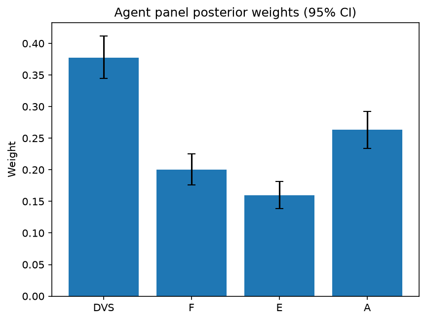

# Survey report: TrustRouter Agentic Full Panel (qwen3:14b) -- Level L1: Top-level TrustRouter factors

Survey ID: `trustrouter-agentic-full-panel-qwen3-14b-2026-09-01-L1`

## Agent panel

- Agents contributing a valid response: 36
- Classical BWM consistency: 36/36 within threshold

| Criterion | Mean | 95% CI lower | 95% CI upper |
|---|---|---|---|
| DVS | 0.3772 | 0.3443 | 0.4120 |
| F | 0.2003 | 0.1761 | 0.2255 |
| E | 0.1594 | 0.1388 | 0.1816 |
| A | 0.2631 | 0.2340 | 0.2923 |

## Methodology

Each agent independently completed a Best-Worst Method (BWM) comparison: choosing the single most and least important criterion, then rating every criterion's importance relative to those two on a 1-9 scale. Individual responses were solved with the classical BWM linear program (Rezaei, 2015) for a consistency check, and combined across the panel with a hierarchical Bayesian model (Mohammadi and Rezaei, 2020).

36 agent response(s) were accepted into this result.

Every agent's run began with a QA precheck (its stated configuration verified against ground truth) and every accepted answer's self-reported sources were checked against what reference material was actually available to it; see the Per-agent detail section below and this survey's Conversation Log for each agent's specific results. Every response is schema-validated and independently, repeatedly sampled (never a single completion treated as ground truth); see `guardrails.py`. This survey's complete output is covered by a SHA-256 integrity manifest (`integrity_manifest.json`, `SHA256SUMS`), generated once this run finished, so any later alteration to these files is detectable.

### Charts

## Per-agent detail

### bim-coordinator-base-openmanus (`bim-coordinator-base-openmanus`)

- Role: BIM Coordinator
- Model: ollama/qwen3:14b
- DID: `did:key:z6MkudbAFJTsT2nAaosLBXGy3dK9HHhxJRGYp85L1rpGG6MW`
- QA precheck: passed
- Sources used: (not reported)

**Answer:** `{"best": "DVS", "worst": "E", "best_to_others": {"DVS": 1, "F": 7, "A": 8, "E": 9}, "others_to_worst": {"E": 1, "F": 8, "A": 9, "DVS": 9}}`

**Reasoning:**

Best factor: DVS  
Worst factor: E

DVS vs F: 7  
DVS vs A: 8  
DVS vs E: 9  
F vs E: 8  
A vs E: 9

### bim-coordinator-base-openmanus (`bim-coordinator-base-openmanus`)

- Role: BIM Coordinator
- Model: ollama/qwen3:14b
- DID: `did:key:z6MkudbAFJTsT2nAaosLBXGy3dK9HHhxJRGYp85L1rpGG6MW`
- QA precheck: passed
- Sources used: (not reported)

**Answer:** `{"best": "DVS", "worst": "E", "best_to_others": {"DVS": 1, "F": 7, "A": 7, "E": 9}, "others_to_worst": {"E": 1, "F": 8, "A": 8, "DVS": 9}}`

**Reasoning:**

Best factor: DVS  
Worst factor: E

DVS vs F: 7  
DVS vs A: 7  
DVS vs E: 9  
F vs E: 8  
A vs E: 8

### bim-coordinator-base-openmanus (`bim-coordinator-base-openmanus`)

- Role: BIM Coordinator
- Model: ollama/qwen3:14b
- DID: `did:key:z6MkudbAFJTsT2nAaosLBXGy3dK9HHhxJRGYp85L1rpGG6MW`
- QA precheck: passed
- Sources used: (not reported)

**Answer:** `{"best": "DVS", "worst": "E", "best_to_others": {"DVS": 1, "F": 7, "A": 8, "E": 9}, "others_to_worst": {"E": 1, "F": 7, "A": 8, "DVS": 9}}`

**Reasoning:**

Best factor: DVS  
Worst factor: E

DVS vs F: 7  
DVS vs A: 8  
DVS vs E: 9  
F vs E: 7  
A vs E: 8

### bim-coordinator-rag-openmanus (`bim-coordinator-rag-openmanus`)

- Role: BIM Coordinator
- Model: ollama/qwen3:14b
- DID: `did:key:z6MkrS7nJZ3C7iB8kChprkVGtviujb1Avhvb1uK7D4V5yACK`
- QA precheck: passed
- Sources used: (not reported)

**Answer:** `{"best": "DVS", "worst": "F", "best_to_others": {"DVS": 1, "E": 7, "A": 6, "F": 9}, "others_to_worst": {"F": 1, "E": 7, "A": 6, "DVS": 9}}`

**Reasoning:**

Best factor: DVS  
Worst factor: F

DVS vs E: 7  
DVS vs A: 6  
DVS vs F: 9  
E vs F: 7  
A vs F: 6  

**Reasoning:**  
- **DVS vs E (7):** Data Value Score (DVS) directly impacts trust in the data's integrity, which is foundational for any blockchain application. Economic Value (E) is critical but secondary—without trustworthy data, even high economic stakes are meaningless. The gap is significant but not extreme.  
- **DVS vs A (6):** DVS and Attack Resistance (A) are both critical for trust, but DVS focuses on data quality, while A focuses on security. They are closely related but not strictly hierarchical; their importance depends on context (e.g., high-value data may require both).  
- **DVS vs F (9):** Technical Feasibility (F) is a constraint on implementation, but DVS is a core factor for trust. Even if a system is technically feasible, low DVS (untrustworthy data) renders it unusable. The gap reflects F being the "worst" factor.  
- **E vs F (7):** Economic Value (E) drives stakeholder investment, but low Technical Feasibility (F) makes the system non-viable. E is more impactful in terms of consequences (loss of value) than F’s implementation barriers, but the difference is not extreme.  
- **A vs F (6):** Attack Resistance (A) and F are both technical factors. A protects against manipulation, while F ensures compatibility with the ledger. Both are important, but A’s role in security is slightly more critical than F’s role in compatibility, though the difference is nuanced.  

All ratings align with the initial judgment that DVS is the best and F is the worst, while balancing their relative importance.

### bim-coordinator-rag-openmanus (`bim-coordinator-rag-openmanus`)

- Role: BIM Coordinator
- Model: ollama/qwen3:14b
- DID: `did:key:z6MkrS7nJZ3C7iB8kChprkVGtviujb1Avhvb1uK7D4V5yACK`
- QA precheck: passed
- Sources used: (not reported)

**Answer:** `{"best": "DVS", "worst": "E", "best_to_others": {"DVS": 1, "F": 7, "A": 6, "E": 9}, "others_to_worst": {"E": 1, "F": 8, "A": 7, "DVS": 9}}`

**Reasoning:**

Best factor: DVS  
Worst factor: E

DVS vs F: 7  
DVS vs A: 6  
DVS vs E: 9  
F vs E: 8  
A vs E: 7

### bim-coordinator-rag-openmanus (`bim-coordinator-rag-openmanus`)

- Role: BIM Coordinator
- Model: ollama/qwen3:14b
- DID: `did:key:z6MkrS7nJZ3C7iB8kChprkVGtviujb1Avhvb1uK7D4V5yACK`
- QA precheck: passed
- Sources used: (not reported)

**Answer:** `{"best": "DVS", "worst": "F", "best_to_others": {"DVS": 1, "E": 7, "A": 6, "F": 9}, "others_to_worst": {"F": 1, "E": 7, "A": 8, "DVS": 9}}`

**Reasoning:**

Best factor: DVS  
Worst factor: F

DVS vs E: 7  
DVS vs A: 6  
DVS vs F: 9  
E vs F: 7  
A vs F: 8

### blockchain-engineer-base-openmanus (`blockchain-engineer-base-openmanus`)

- Role: Blockchain / DLT Engineer
- Model: ollama/qwen3:14b
- DID: `did:key:z6MkvKSFkcT6DEpWEsxp95m1wb9T1hSVzyS5BFz4rn1dkQX2`
- QA precheck: passed
- Sources used: (not reported)

**Answer:** `{"best": "F", "worst": "E", "best_to_others": {"F": 1, "DVS": 7, "A": 8, "E": 9}, "others_to_worst": {"E": 1, "DVS": 8, "A": 7, "F": 9}}`

**Reasoning:**

Best factor: F  
Worst factor: E

F vs DVS: 7  
F vs A: 8  
F vs E: 9  
DVS vs E: 8  
A vs E: 7

### blockchain-engineer-base-openmanus (`blockchain-engineer-base-openmanus`)

- Role: Blockchain / DLT Engineer
- Model: ollama/qwen3:14b
- DID: `did:key:z6MkvKSFkcT6DEpWEsxp95m1wb9T1hSVzyS5BFz4rn1dkQX2`
- QA precheck: passed
- Sources used: (not reported)

**Answer:** `{"best": "F", "worst": "E", "best_to_others": {"F": 1, "DVS": 7, "A": 6, "E": 9}, "others_to_worst": {"E": 1, "DVS": 6, "A": 7, "F": 9}}`

**Reasoning:**

Best factor: F  
Worst factor: E

F vs DVS: 7  
F vs A: 6  
F vs E: 9  
DVS vs E: 6  
A vs E: 7

### blockchain-engineer-base-openmanus (`blockchain-engineer-base-openmanus`)

- Role: Blockchain / DLT Engineer
- Model: ollama/qwen3:14b
- DID: `did:key:z6MkvKSFkcT6DEpWEsxp95m1wb9T1hSVzyS5BFz4rn1dkQX2`
- QA precheck: passed
- Sources used: (not reported)

**Answer:** `{"best": "F", "worst": "E", "best_to_others": {"F": 1, "DVS": 6, "A": 7, "E": 9}, "others_to_worst": {"E": 1, "DVS": 6, "A": 7, "F": 9}}`

**Reasoning:**

Best factor: F  
Worst factor: E

F vs DVS: 6  
F vs A: 7  
F vs E: 9  
DVS vs E: 6  
A vs E: 7

### blockchain-engineer-rag-openmanus (`blockchain-engineer-rag-openmanus`)

- Role: Blockchain / DLT Engineer
- Model: ollama/qwen3:14b
- DID: `did:key:z6MkefhuQ6kB1idjYsNndYCBmDNMXzrmmDaSSNrB7uygb6tb`
- QA precheck: passed
- Sources used: (not reported)

**Answer:** `{"best": "DVS", "worst": "F", "best_to_others": {"DVS": 1, "E": 7, "A": 8, "F": 9}, "others_to_worst": {"F": 1, "E": 7, "A": 8, "DVS": 9}}`

**Reasoning:**

Best factor: DVS  
Worst factor: F

DVS vs E: 7  
DVS vs A: 8  
DVS vs F: 9  
E vs F: 7  
A vs F: 8

### blockchain-engineer-rag-openmanus (`blockchain-engineer-rag-openmanus`)

- Role: Blockchain / DLT Engineer
- Model: ollama/qwen3:14b
- DID: `did:key:z6MkefhuQ6kB1idjYsNndYCBmDNMXzrmmDaSSNrB7uygb6tb`
- QA precheck: passed
- Sources used: (not reported)

**Answer:** `{"best": "DVS", "worst": "F", "best_to_others": {"DVS": 1, "E": 7, "A": 6, "F": 9}, "others_to_worst": {"F": 1, "E": 7, "A": 8, "DVS": 9}}`

**Reasoning:**

Best factor: DVS  
Worst factor: F

DVS vs E: 7  
DVS vs A: 6  
DVS vs F: 9  
E vs F: 7  
A vs F: 8

### blockchain-engineer-rag-openmanus (`blockchain-engineer-rag-openmanus`)

- Role: Blockchain / DLT Engineer
- Model: ollama/qwen3:14b
- DID: `did:key:z6MkefhuQ6kB1idjYsNndYCBmDNMXzrmmDaSSNrB7uygb6tb`
- QA precheck: passed
- Sources used: (not reported)

**Answer:** `{"best": "DVS", "worst": "F", "best_to_others": {"DVS": 1, "E": 7, "A": 6, "F": 9}, "others_to_worst": {"F": 1, "E": 7, "A": 8, "DVS": 9}}`

**Reasoning:**

Best factor: DVS  
Worst factor: F

DVS vs E: 7  
DVS vs A: 6  
DVS vs F: 9  
E vs F: 7  
A vs F: 8

### compliance-officer-base-openmanus (`compliance-officer-base-openmanus`)

- Role: Compliance and Regulatory Officer
- Model: ollama/qwen3:14b
- DID: `did:key:z6Mkhe8EvcrtatxJKQFwRpetMw5DkpvZbrHXSSPefLe5DfVf`
- QA precheck: passed
- Sources used: (not reported)

**Answer:** `{"best": "DVS", "worst": "E", "best_to_others": {"DVS": 1, "F": 7, "A": 8, "E": 9}, "others_to_worst": {"E": 1, "F": 7, "A": 6, "DVS": 9}}`

**Reasoning:**

Best factor: DVS  
Worst factor: E

DVS vs F: 7  
DVS vs A: 8  
DVS vs E: 9  
F vs E: 7  
A vs E: 6

### compliance-officer-base-openmanus (`compliance-officer-base-openmanus`)

- Role: Compliance and Regulatory Officer
- Model: ollama/qwen3:14b
- DID: `did:key:z6Mkhe8EvcrtatxJKQFwRpetMw5DkpvZbrHXSSPefLe5DfVf`
- QA precheck: passed
- Sources used: (not reported)

**Answer:** `{"best": "DVS", "worst": "F", "best_to_others": {"DVS": 1, "E": 7, "A": 8, "F": 9}, "others_to_worst": {"F": 1, "E": 8, "A": 7, "DVS": 9}}`

**Reasoning:**

Best factor: DVS  
Worst factor: F

DVS vs E: 7  
DVS vs A: 8  
DVS vs F: 9  
E vs F: 8  
A vs F: 7

### compliance-officer-base-openmanus (`compliance-officer-base-openmanus`)

- Role: Compliance and Regulatory Officer
- Model: ollama/qwen3:14b
- DID: `did:key:z6Mkhe8EvcrtatxJKQFwRpetMw5DkpvZbrHXSSPefLe5DfVf`
- QA precheck: passed
- Sources used: (not reported)

**Answer:** `{"best": "DVS", "worst": "E", "best_to_others": {"DVS": 1, "F": 7, "A": 6, "E": 9}, "others_to_worst": {"E": 1, "F": 8, "A": 8, "DVS": 9}}`

**Reasoning:**

Best factor: DVS  
Worst factor: E

DVS vs F: 7  
DVS vs A: 6  
DVS vs E: 9  
F vs E: 8  
A vs E: 8

### compliance-officer-rag-openmanus (`compliance-officer-rag-openmanus`)

- Role: Compliance and Regulatory Officer
- Model: ollama/qwen3:14b
- DID: `did:key:z6MkhGj5AAyBKcqGQ794QBjrs7aqk5ChKYRr2bnej5XYT3L2`
- QA precheck: passed
- Sources used: (not reported)

**Answer:** `{"best": "DVS", "worst": "E", "best_to_others": {"DVS": 1, "F": 7, "A": 7, "E": 8}, "others_to_worst": {"E": 1, "F": 7, "A": 7, "DVS": 8}}`

**Reasoning:**

Best factor: DVS  
Worst factor: E

DVS vs F: 7  
DVS vs A: 7  
DVS vs E: 8  
F vs E: 7  
A vs E: 7  

**Reasoning:**  
- **DVS vs F (7):** Both are critical. DVS (data trustworthiness) is foundational for blockchain integrity, but F (technical feasibility) ensures the data can be stored effectively. Neither dominates outright.  
- **DVS vs A (7):** DVS reflects the intrinsic value and reliability of data, while A (attack resistance) safeguards it. In construction contexts, both are interdependent; high DVS without A is risky, but A alone without trustworthy data is less impactful.  
- **DVS vs E (8):** DVS directly impacts the *trust* in data, which is non-negotiable for blockchain adoption. E (economic value) is important but secondary—corruption risks are catastrophic regardless of economic stakes, making DVS more critical.  
- **F vs E (7):** Technical feasibility (F) is essential for practical implementation, but economic value (E) drives prioritization. If E is high, stakeholders may push for solutions even with moderate F.  
- **A vs E (7):** Attack resistance (A) is vital to protect high-value data (E), but E’s importance depends on context. Without A, even low-E data could be compromised, but A alone doesn’t address economic stakes.  

Ratings reflect balanced trade-offs, avoiding overemphasis on any single factor.

### compliance-officer-rag-openmanus (`compliance-officer-rag-openmanus`)

- Role: Compliance and Regulatory Officer
- Model: ollama/qwen3:14b
- DID: `did:key:z6MkhGj5AAyBKcqGQ794QBjrs7aqk5ChKYRr2bnej5XYT3L2`
- QA precheck: passed
- Sources used: (not reported)

**Answer:** `{"best": "DVS", "worst": "F", "best_to_others": {"DVS": 1, "E": 7, "A": 6, "F": 9}, "others_to_worst": {"F": 1, "E": 8, "A": 9, "DVS": 9}}`

**Reasoning:**

Best factor: DVS  
Worst factor: F

DVS vs E: 7  
DVS vs A: 6  
DVS vs F: 9  
E vs F: 8  
A vs F: 9

### compliance-officer-rag-openmanus (`compliance-officer-rag-openmanus`)

- Role: Compliance and Regulatory Officer
- Model: ollama/qwen3:14b
- DID: `did:key:z6MkhGj5AAyBKcqGQ794QBjrs7aqk5ChKYRr2bnej5XYT3L2`
- QA precheck: passed
- Sources used: (not reported)

**Answer:** `{"best": "DVS", "worst": "E", "best_to_others": {"DVS": 1, "F": 6, "A": 5, "E": 9}, "others_to_worst": {"E": 1, "F": 7, "A": 8, "DVS": 9}}`

**Reasoning:**

Best factor: DVS  
Worst factor: E

DVS vs F: 6  
DVS vs A: 5  
DVS vs E: 9  
F vs E: 7  
A vs E: 8  

**Reasoning:**  
- **DVS vs F (6):** Data Value Score (DVS) is critical for ensuring data integrity and compliance with GDPR, but Technical Feasibility (F) is also important to ensure the data can be practically stored on a blockchain. However, DVS's role in regulatory compliance gives it a slight edge.  
- **DVS vs A (5):** Both DVS and Attack Resistance (A) are vital for data security and trust. However, DVS directly relates to the data's inherent value and regulatory requirements, while A focuses on external threats. Their importance is closely balanced.  
- **DVS vs E (9):** Economic Value (E) is less critical in a compliance context compared to DVS, which directly impacts data trustworthiness and regulatory adherence. E's financial implications are secondary to ensuring data integrity.  
- **F vs E (7):** Technical Feasibility (F) is more important than E because a non-viable technical solution (F) would render the project unimplementable, regardless of economic value.  
- **A vs E (8):** Attack Resistance (A) is crucial for preventing data breaches, which aligns with GDPR requirements. Its importance far outweighs E's financial considerations in a compliance framework.

### data-engineer-base-openmanus (`data-engineer-base-openmanus`)

- Role: Data Engineering Specialist
- Model: ollama/qwen3:14b
- DID: `did:key:z6MkoHX584uNGsUNkT4wu6bvscjg7jXYsKj13JDFkz2TH799`
- QA precheck: passed
- Sources used: (not reported)

**Answer:** `{"best": "DVS", "worst": "E", "best_to_others": {"DVS": 1, "F": 7, "A": 6, "E": 9}, "others_to_worst": {"E": 1, "F": 7, "A": 6, "DVS": 9}}`

**Reasoning:**

Best factor: DVS  
Worst factor: E

DVS vs F: 7  
DVS vs A: 6  
DVS vs E: 9  
F vs E: 7  
A vs E: 6

### data-engineer-base-openmanus (`data-engineer-base-openmanus`)

- Role: Data Engineering Specialist
- Model: ollama/qwen3:14b
- DID: `did:key:z6MkoHX584uNGsUNkT4wu6bvscjg7jXYsKj13JDFkz2TH799`
- QA precheck: passed
- Sources used: (not reported)

**Answer:** `{"best": "DVS", "worst": "E", "best_to_others": {"DVS": 1, "F": 7, "A": 6, "E": 9}, "others_to_worst": {"E": 1, "F": 8, "A": 8, "DVS": 9}}`

**Reasoning:**

Best factor: DVS  
Worst factor: E

DVS vs F: 7  
DVS vs A: 6  
DVS vs E: 9  
F vs E: 8  
A vs E: 8

### data-engineer-base-openmanus (`data-engineer-base-openmanus`)

- Role: Data Engineering Specialist
- Model: ollama/qwen3:14b
- DID: `did:key:z6MkoHX584uNGsUNkT4wu6bvscjg7jXYsKj13JDFkz2TH799`
- QA precheck: passed
- Sources used: (not reported)

**Answer:** `{"best": "DVS", "worst": "E", "best_to_others": {"DVS": 1, "F": 7, "A": 8, "E": 9}, "others_to_worst": {"E": 1, "F": 7, "A": 7, "DVS": 9}}`

**Reasoning:**

Best factor: DVS  
Worst factor: E

DVS vs F: 7  
DVS vs A: 8  
DVS vs E: 9  
F vs E: 7  
A vs E: 7

### data-engineer-rag-openmanus (`data-engineer-rag-openmanus`)

- Role: Data Engineering Specialist
- Model: ollama/qwen3:14b
- DID: `did:key:z6Mkw1baUuVQnipgbiBvSVDb8wz6t59Gcd6GT2tqAYBBy8xt`
- QA precheck: passed
- Sources used: (not reported)

**Answer:** `{"best": "DVS", "worst": "F", "best_to_others": {"DVS": 1, "E": 7, "A": 8, "F": 9}, "others_to_worst": {"F": 1, "E": 6, "A": 7, "DVS": 9}}`

**Reasoning:**

Best factor: DVS  
Worst factor: F

DVS vs E: 7  
DVS vs A: 8  
DVS vs F: 9  
E vs F: 6  
A vs F: 7

### data-engineer-rag-openmanus (`data-engineer-rag-openmanus`)

- Role: Data Engineering Specialist
- Model: ollama/qwen3:14b
- DID: `did:key:z6Mkw1baUuVQnipgbiBvSVDb8wz6t59Gcd6GT2tqAYBBy8xt`
- QA precheck: passed
- Sources used: (not reported)

**Answer:** `{"best": "DVS", "worst": "E", "best_to_others": {"DVS": 1, "F": 7, "A": 8, "E": 9}, "others_to_worst": {"E": 1, "F": 7, "A": 8, "DVS": 9}}`

**Reasoning:**

Best factor: DVS  
Worst factor: E

DVS vs F: 7  
DVS vs A: 8  
DVS vs E: 9  
F vs E: 7  
A vs E: 8

### data-engineer-rag-openmanus (`data-engineer-rag-openmanus`)

- Role: Data Engineering Specialist
- Model: ollama/qwen3:14b
- DID: `did:key:z6Mkw1baUuVQnipgbiBvSVDb8wz6t59Gcd6GT2tqAYBBy8xt`
- QA precheck: passed
- Sources used: (not reported)

**Answer:** `{"best": "DVS", "worst": "F", "best_to_others": {"DVS": 1, "E": 8, "A": 7, "F": 9}, "others_to_worst": {"F": 1, "E": 7, "A": 7, "DVS": 9}}`

**Reasoning:**

Best factor: DVS  
Worst factor: F

DVS vs E: 8  
DVS vs A: 7  
DVS vs F: 9  
E vs F: 7  
A vs F: 7

### project-manager-base-openmanus (`project-manager-base-openmanus`)

- Role: Construction Project Manager
- Model: ollama/qwen3:14b
- DID: `did:key:z6MkfMGqRV6T6XUBBe8xDRug3Wf1bA8CzrJeUpsbHgq2TYcL`
- QA precheck: passed
- Sources used: (not reported)

**Answer:** `{"best": "A", "worst": "E", "best_to_others": {"A": 1, "DVS": 7, "F": 6, "E": 9}, "others_to_worst": {"E": 1, "DVS": 7, "F": 7, "A": 9}}`

**Reasoning:**

Best factor: A  
Worst factor: E

A vs DVS: 7  
A vs F: 6  
A vs E: 9  
DVS vs E: 7  
F vs E: 7

### project-manager-base-openmanus (`project-manager-base-openmanus`)

- Role: Construction Project Manager
- Model: ollama/qwen3:14b
- DID: `did:key:z6MkfMGqRV6T6XUBBe8xDRug3Wf1bA8CzrJeUpsbHgq2TYcL`
- QA precheck: passed
- Sources used: (not reported)

**Answer:** `{"best": "DVS", "worst": "E", "best_to_others": {"DVS": 1, "F": 7, "A": 8, "E": 9}, "others_to_worst": {"E": 1, "F": 7, "A": 6, "DVS": 9}}`

**Reasoning:**

Best factor: DVS  
Worst factor: E

DVS vs F: 7  
DVS vs A: 8  
DVS vs E: 9  
F vs E: 7  
A vs E: 6

### project-manager-base-openmanus (`project-manager-base-openmanus`)

- Role: Construction Project Manager
- Model: ollama/qwen3:14b
- DID: `did:key:z6MkfMGqRV6T6XUBBe8xDRug3Wf1bA8CzrJeUpsbHgq2TYcL`
- QA precheck: passed
- Sources used: (not reported)

**Answer:** `{"best": "A", "worst": "F", "best_to_others": {"A": 1, "DVS": 6, "E": 7, "F": 9}, "others_to_worst": {"F": 1, "DVS": 7, "E": 6, "A": 9}}`

**Reasoning:**

Best factor: A  
Worst factor: F

A vs DVS: 6  
A vs E: 7  
A vs F: 9  
DVS vs F: 7  
E vs F: 6

### project-manager-rag-openmanus (`project-manager-rag-openmanus`)

- Role: Construction Project Manager
- Model: ollama/qwen3:14b
- DID: `did:key:z6MkhqFWadXvwg3s6b7ZtNrQPLq6YT88kwodKPsLp3PqQoVA`
- QA precheck: passed
- Sources used: (not reported)

**Answer:** `{"best": "F", "worst": "E", "best_to_others": {"F": 1, "DVS": 7, "A": 8, "E": 9}, "others_to_worst": {"E": 1, "DVS": 7, "A": 8, "F": 9}}`

**Reasoning:**

Best factor: F  
Worst factor: E

F vs DVS: 7  
F vs A: 8  
F vs E: 9  
DVS vs E: 7  
A vs E: 8

### project-manager-rag-openmanus (`project-manager-rag-openmanus`)

- Role: Construction Project Manager
- Model: ollama/qwen3:14b
- DID: `did:key:z6MkhqFWadXvwg3s6b7ZtNrQPLq6YT88kwodKPsLp3PqQoVA`
- QA precheck: passed
- Sources used: (not reported)

**Answer:** `{"best": "A", "worst": "E", "best_to_others": {"A": 1, "DVS": 7, "F": 8, "E": 9}, "others_to_worst": {"E": 1, "DVS": 7, "F": 8, "A": 9}}`

**Reasoning:**

Best factor: A  
Worst factor: E

A vs DVS: 7  
A vs F: 8  
A vs E: 9  
DVS vs E: 7  
F vs E: 8

### project-manager-rag-openmanus (`project-manager-rag-openmanus`)

- Role: Construction Project Manager
- Model: ollama/qwen3:14b
- DID: `did:key:z6MkhqFWadXvwg3s6b7ZtNrQPLq6YT88kwodKPsLp3PqQoVA`
- QA precheck: passed
- Sources used: (not reported)

**Answer:** `{"best": "A", "worst": "E", "best_to_others": {"A": 1, "DVS": 7, "F": 8, "E": 9}, "others_to_worst": {"E": 1, "DVS": 7, "F": 8, "A": 9}}`

**Reasoning:**

Best factor: A  
Worst factor: E

A vs DVS: 7  
A vs F: 8  
A vs E: 9  
DVS vs E: 7  
F vs E: 8

### structural-engineer-base-openmanus (`structural-engineer-base-openmanus`)

- Role: Structural Engineer
- Model: ollama/qwen3:14b
- DID: `did:key:z6MkjijSmZJ4VbnK5WEgJsauUfmcN1JPnNQ9qPUAJf5MS9fW`
- QA precheck: passed
- Sources used: (not reported)

**Answer:** `{"best": "DVS", "worst": "E", "best_to_others": {"DVS": 1, "F": 6, "A": 6, "E": 9}, "others_to_worst": {"E": 1, "F": 7, "A": 6, "DVS": 9}}`

**Reasoning:**

Best factor: DVS  
Worst factor: E

DVS vs F: 6  
DVS vs A: 6  
DVS vs E: 9  
F vs E: 7  
A vs E: 6

### structural-engineer-base-openmanus (`structural-engineer-base-openmanus`)

- Role: Structural Engineer
- Model: ollama/qwen3:14b
- DID: `did:key:z6MkjijSmZJ4VbnK5WEgJsauUfmcN1JPnNQ9qPUAJf5MS9fW`
- QA precheck: passed
- Sources used: (not reported)

**Answer:** `{"best": "DVS", "worst": "E", "best_to_others": {"DVS": 1, "F": 7, "A": 6, "E": 9}, "others_to_worst": {"E": 1, "F": 7, "A": 6, "DVS": 9}}`

**Reasoning:**

Best factor: DVS  
Worst factor: E

DVS vs F: 7  
DVS vs A: 6  
DVS vs E: 9  
F vs E: 7  
A vs E: 6

### structural-engineer-base-openmanus (`structural-engineer-base-openmanus`)

- Role: Structural Engineer
- Model: ollama/qwen3:14b
- DID: `did:key:z6MkjijSmZJ4VbnK5WEgJsauUfmcN1JPnNQ9qPUAJf5MS9fW`
- QA precheck: passed
- Sources used: (not reported)

**Answer:** `{"best": "DVS", "worst": "E", "best_to_others": {"DVS": 1, "F": 7, "A": 6, "E": 9}, "others_to_worst": {"E": 1, "F": 7, "A": 8, "DVS": 9}}`

**Reasoning:**

Best factor: DVS  
Worst factor: E

DVS vs F: 7  
DVS vs A: 6  
DVS vs E: 9  
F vs E: 7  
A vs E: 8

### structural-engineer-rag-openmanus (`structural-engineer-rag-openmanus`)

- Role: Structural Engineer
- Model: ollama/qwen3:14b
- DID: `did:key:z6Mkhs5XsGsxBPxgbvuoZrUdk9QpW6F8xCP9Q5ZRZPqWvGnm`
- QA precheck: passed
- Sources used: (not reported)

**Answer:** `{"best": "E", "worst": "F", "best_to_others": {"E": 1, "DVS": 7, "A": 8, "F": 9}, "others_to_worst": {"F": 1, "DVS": 8, "A": 7, "E": 9}}`

**Reasoning:**

Best factor: E  
Worst factor: F

E vs DVS: 7  
E vs A: 8  
E vs F: 9  
DVS vs F: 8  
A vs F: 7

### structural-engineer-rag-openmanus (`structural-engineer-rag-openmanus`)

- Role: Structural Engineer
- Model: ollama/qwen3:14b
- DID: `did:key:z6Mkhs5XsGsxBPxgbvuoZrUdk9QpW6F8xCP9Q5ZRZPqWvGnm`
- QA precheck: passed
- Sources used: (not reported)

**Answer:** `{"best": "E", "worst": "F", "best_to_others": {"E": 1, "DVS": 7, "A": 6, "F": 9}, "others_to_worst": {"F": 1, "DVS": 7, "A": 8, "E": 9}}`

**Reasoning:**

Best factor: E  
Worst factor: F

E vs DVS: 7  
E vs A: 6  
E vs F: 9  
DVS vs F: 7  
A vs F: 8

### structural-engineer-rag-openmanus (`structural-engineer-rag-openmanus`)

- Role: Structural Engineer
- Model: ollama/qwen3:14b
- DID: `did:key:z6Mkhs5XsGsxBPxgbvuoZrUdk9QpW6F8xCP9Q5ZRZPqWvGnm`
- QA precheck: passed
- Sources used: (not reported)

**Answer:** `{"best": "DVS", "worst": "F", "best_to_others": {"DVS": 1, "E": 7, "A": 8, "F": 9}, "others_to_worst": {"F": 1, "E": 8, "A": 8, "DVS": 9}}`

**Reasoning:**

Best factor: DVS  
Worst factor: F

DVS vs E: 7  
DVS vs A: 8  
DVS vs F: 9  
E vs F: 8  
A vs F: 8
