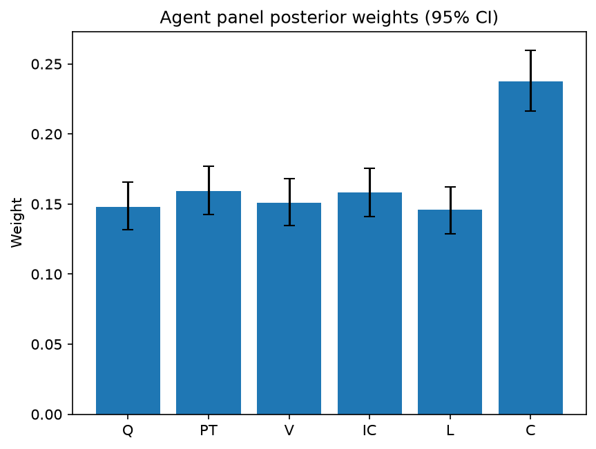

# Survey report: TrustRouter Agentic Full Panel (qwen3:14b) -- Level L2: Six trust dimensions inside DVS

Survey ID: `trustrouter-agentic-full-panel-qwen3-14b-2026-09-01-L2`

## Agent panel

- Agents contributing a valid response: 36
- Classical BWM consistency: 36/36 within threshold

| Criterion | Mean | 95% CI lower | 95% CI upper |
|---|---|---|---|
| Q | 0.1477 | 0.1317 | 0.1657 |
| PT | 0.1594 | 0.1423 | 0.1770 |
| V | 0.1510 | 0.1344 | 0.1680 |
| IC | 0.1585 | 0.1409 | 0.1757 |
| L | 0.1458 | 0.1289 | 0.1624 |
| C | 0.2377 | 0.2164 | 0.2599 |

## Methodology

Each agent independently completed a Best-Worst Method (BWM) comparison: choosing the single most and least important criterion, then rating every criterion's importance relative to those two on a 1-9 scale. Individual responses were solved with the classical BWM linear program (Rezaei, 2015) for a consistency check, and combined across the panel with a hierarchical Bayesian model (Mohammadi and Rezaei, 2020).

36 agent response(s) were accepted into this result.

Every agent's run began with a QA precheck (its stated configuration verified against ground truth) and every accepted answer's self-reported sources were checked against what reference material was actually available to it; see the Per-agent detail section below and this survey's Conversation Log for each agent's specific results. Every response is schema-validated and independently, repeatedly sampled (never a single completion treated as ground truth); see `guardrails.py`. This survey's complete output is covered by a SHA-256 integrity manifest (`integrity_manifest.json`, `SHA256SUMS`), generated once this run finished, so any later alteration to these files is detectable.

### Charts

## Per-agent detail

### bim-coordinator-base-openmanus (`bim-coordinator-base-openmanus`)

- Role: BIM Coordinator
- Model: ollama/qwen3:14b
- DID: `did:key:z6MkudbAFJTsT2nAaosLBXGy3dK9HHhxJRGYp85L1rpGG6MW`
- QA precheck: passed
- Sources used: (not reported)

**Answer:** `{"best": "C", "worst": "PT", "best_to_others": {"C": 1, "Q": 7, "V": 6, "IC": 8, "L": 7, "PT": 9}, "others_to_worst": {"PT": 1, "Q": 5, "V": 6, "IC": 7, "L": 6, "C": 9}}`

**Reasoning:**

Best factor: C  
Worst factor: PT

C vs Q: 7  
C vs V: 6  
C vs IC: 8  
C vs L: 7  
C vs PT: 9  
Q vs PT: 5  
V vs PT: 6  
IC vs PT: 7  
L vs PT: 6

### bim-coordinator-base-openmanus (`bim-coordinator-base-openmanus`)

- Role: BIM Coordinator
- Model: ollama/qwen3:14b
- DID: `did:key:z6MkudbAFJTsT2nAaosLBXGy3dK9HHhxJRGYp85L1rpGG6MW`
- QA precheck: passed
- Sources used: (not reported)

**Answer:** `{"best": "L", "worst": "IC", "best_to_others": {"L": 1, "Q": 6, "PT": 5, "V": 7, "C": 5, "IC": 9}, "others_to_worst": {"IC": 1, "Q": 3, "PT": 4, "V": 5, "C": 4, "L": 9}}`

**Reasoning:**

Best factor: L  
Worst factor: IC

L vs Q: 6  
L vs PT: 5  
L vs V: 7  
L vs C: 5  
L vs IC: 9  
Q vs IC: 3  
PT vs IC: 4  
V vs IC: 5  
C vs IC: 4

### bim-coordinator-base-openmanus (`bim-coordinator-base-openmanus`)

- Role: BIM Coordinator
- Model: ollama/qwen3:14b
- DID: `did:key:z6MkudbAFJTsT2nAaosLBXGy3dK9HHhxJRGYp85L1rpGG6MW`
- QA precheck: passed
- Sources used: (not reported)

**Answer:** `{"best": "C", "worst": "V", "best_to_others": {"C": 1, "Q": 7, "PT": 8, "IC": 8, "L": 7, "V": 9}, "others_to_worst": {"V": 1, "Q": 6, "PT": 7, "IC": 6, "L": 7, "C": 9}}`

**Reasoning:**

Best factor: C  
Worst factor: V

C vs Q: 7  
C vs PT: 8  
C vs IC: 8  
C vs L: 7  
C vs V: 9  
Q vs V: 6  
PT vs V: 7  
IC vs V: 6  
L vs V: 7

### bim-coordinator-rag-openmanus (`bim-coordinator-rag-openmanus`)

- Role: BIM Coordinator
- Model: ollama/qwen3:14b
- DID: `did:key:z6MkrS7nJZ3C7iB8kChprkVGtviujb1Avhvb1uK7D4V5yACK`
- QA precheck: passed
- Sources used: (not reported)

**Answer:** `{"best": "C", "worst": "Q", "best_to_others": {"C": 1, "PT": 7, "V": 8, "IC": 8, "L": 9, "Q": 7}, "others_to_worst": {"Q": 1, "PT": 3, "V": 3, "IC": 3, "L": 5, "C": 7}}`

**Reasoning:**

Best factor: C  
Worst factor: Q

C vs PT: 7  
C vs V: 8  
C vs IC: 8  
C vs L: 9  
C vs Q: 7  
PT vs Q: 3  
V vs Q: 3  
IC vs Q: 3  
L vs Q: 5

### bim-coordinator-rag-openmanus (`bim-coordinator-rag-openmanus`)

- Role: BIM Coordinator
- Model: ollama/qwen3:14b
- DID: `did:key:z6MkrS7nJZ3C7iB8kChprkVGtviujb1Avhvb1uK7D4V5yACK`
- QA precheck: passed
- Sources used: (not reported)

**Answer:** `{"best": "C", "worst": "L", "best_to_others": {"C": 1, "Q": 7, "PT": 6, "V": 7, "IC": 8, "L": 9}, "others_to_worst": {"L": 1, "Q": 7, "PT": 8, "V": 8, "IC": 9, "C": 9}}`

**Reasoning:**

Best factor: C  
Worst factor: L

C vs Q: 7  
C vs PT: 6  
C vs V: 7  
C vs IC: 8  
C vs L: 9  
Q vs L: 7  
PT vs L: 8  
V vs L: 8  
IC vs L: 9

### bim-coordinator-rag-openmanus (`bim-coordinator-rag-openmanus`)

- Role: BIM Coordinator
- Model: ollama/qwen3:14b
- DID: `did:key:z6MkrS7nJZ3C7iB8kChprkVGtviujb1Avhvb1uK7D4V5yACK`
- QA precheck: passed
- Sources used: (not reported)

**Answer:** `{"best": "C", "worst": "V", "best_to_others": {"C": 1, "Q": 7, "PT": 6, "IC": 5, "L": 6, "V": 9}, "others_to_worst": {"V": 1, "Q": 7, "PT": 6, "IC": 7, "L": 8, "C": 9}}`

**Reasoning:**

Best factor: C  
Worst factor: V

C vs Q: 7  
C vs PT: 6  
C vs IC: 5  
C vs L: 6  
C vs V: 9  
Q vs V: 7  
PT vs V: 6  
IC vs V: 7  
L vs V: 8  

**Reasoning:**  
- **C (Criticality)** is prioritized because errors in critical data (e.g., structural integrity, safety) have irreversible consequences, making its importance paramount.  
- **V (Verification Strength)** is rated lowest because cryptographic evidence, while valuable, is secondary to the *impact* of data accuracy (C) and *legal mandates* (L).  
- **Q (Quality)** is important but secondary to criticality; clean data is less impactful if the data’s stakes are low.  
- **L (Legal Compliance)** is weighted highly because non-compliance risks legal penalties, but it is less urgent than the direct operational risks of incorrect data (C).  
- **IC (Independent Confirmation)** and **PT (Provenance Trust)** are mid-tier, as they add reliability but are not as immediately critical as C or L.  
- Comparisons like **L vs V** (8) reflect that legal compliance is more urgent than verification methods, which may not always be legally required.

### blockchain-engineer-base-openmanus (`blockchain-engineer-base-openmanus`)

- Role: Blockchain / DLT Engineer
- Model: ollama/qwen3:14b
- DID: `did:key:z6MkvKSFkcT6DEpWEsxp95m1wb9T1hSVzyS5BFz4rn1dkQX2`
- QA precheck: passed
- Sources used: (not reported)

**Answer:** `{"best": "V", "worst": "L", "best_to_others": {"V": 1, "Q": 7, "PT": 8, "IC": 6, "C": 8, "L": 9}, "others_to_worst": {"L": 1, "Q": 5, "PT": 6, "IC": 7, "C": 6, "V": 9}}`

**Reasoning:**

Best factor: V  
Worst factor: L

V vs Q: 7  
V vs PT: 8  
V vs IC: 6  
V vs C: 8  
V vs L: 9  
Q vs L: 5  
PT vs L: 6  
IC vs L: 7  
C vs L: 6

### blockchain-engineer-base-openmanus (`blockchain-engineer-base-openmanus`)

- Role: Blockchain / DLT Engineer
- Model: ollama/qwen3:14b
- DID: `did:key:z6MkvKSFkcT6DEpWEsxp95m1wb9T1hSVzyS5BFz4rn1dkQX2`
- QA precheck: passed
- Sources used: (not reported)

**Answer:** `{"best": "V", "worst": "L", "best_to_others": {"V": 1, "Q": 7, "PT": 8, "IC": 6, "C": 9, "L": 8}, "others_to_worst": {"L": 1, "Q": 5, "PT": 6, "IC": 7, "C": 8, "V": 8}}`

**Reasoning:**

Best factor: V  
Worst factor: L

V vs Q: 7  
V vs PT: 8  
V vs IC: 6  
V vs C: 9  
V vs L: 8  
Q vs L: 5  
PT vs L: 6  
IC vs L: 7  
C vs L: 8

### blockchain-engineer-base-openmanus (`blockchain-engineer-base-openmanus`)

- Role: Blockchain / DLT Engineer
- Model: ollama/qwen3:14b
- DID: `did:key:z6MkvKSFkcT6DEpWEsxp95m1wb9T1hSVzyS5BFz4rn1dkQX2`
- QA precheck: passed
- Sources used: (not reported)

**Answer:** `{"best": "V", "worst": "L", "best_to_others": {"V": 1, "Q": 6, "PT": 7, "IC": 5, "C": 8, "L": 7}, "others_to_worst": {"L": 1, "Q": 6, "PT": 7, "IC": 6, "C": 8, "V": 7}}`

**Reasoning:**

Best factor: V  
Worst factor: L

V vs Q: 6  
V vs PT: 7  
V vs IC: 5  
V vs C: 8  
V vs L: 7  
Q vs L: 6  
PT vs L: 7  
IC vs L: 6  
C vs L: 8

### blockchain-engineer-rag-openmanus (`blockchain-engineer-rag-openmanus`)

- Role: Blockchain / DLT Engineer
- Model: ollama/qwen3:14b
- DID: `did:key:z6MkefhuQ6kB1idjYsNndYCBmDNMXzrmmDaSSNrB7uygb6tb`
- QA precheck: passed
- Sources used: (not reported)

**Answer:** `{"best": "V", "worst": "L", "best_to_others": {"V": 1, "Q": 7, "PT": 8, "IC": 7, "C": 9, "L": 9}, "others_to_worst": {"L": 1, "Q": 7, "PT": 8, "IC": 8, "C": 7, "V": 9}}`

**Reasoning:**

Best factor: V  
Worst factor: L

V vs Q: 7  
V vs PT: 8  
V vs IC: 7  
V vs C: 9  
V vs L: 9  
Q vs L: 7  
PT vs L: 8  
IC vs L: 8  
C vs L: 7

### blockchain-engineer-rag-openmanus (`blockchain-engineer-rag-openmanus`)

- Role: Blockchain / DLT Engineer
- Model: ollama/qwen3:14b
- DID: `did:key:z6MkefhuQ6kB1idjYsNndYCBmDNMXzrmmDaSSNrB7uygb6tb`
- QA precheck: passed
- Sources used: (not reported)

**Answer:** `{"best": "V", "worst": "L", "best_to_others": {"V": 1, "Q": 7, "PT": 7, "IC": 8, "C": 9, "L": 9}, "others_to_worst": {"L": 1, "Q": 3, "PT": 4, "IC": 5, "C": 6, "V": 9}}`

**Reasoning:**

Best factor: V  
Worst factor: L

V vs Q: 7  
V vs PT: 7  
V vs IC: 8  
V vs C: 9  
V vs L: 9  
Q vs L: 3  
PT vs L: 4  
IC vs L: 5  
C vs L: 6  

**Reasoning:**  
- **V (Verification Strength)** is prioritized because cryptographic/evidence-based verification directly ensures tamper-evidence and data integrity, which are foundational for trust in blockchain/DLT systems. Comparisons to L (Legal Compliance) are rated 9 because legal compliance, while important, is a regulatory requirement rather than a technical guarantee of trust.  
- **V vs Q (Quality):** Quality (data cleanliness) is important but secondary to cryptographic verification, which provides objective, tamper-proof validation.  
- **V vs PT (Provenance Trust):** Provenance trust (source credibility) is critical but complementary to verification; verification adds an independent layer of assurance.  
- **V vs IC (Independent Confirmation):** Independent confirmation is valuable but less direct than cryptographic verification in ensuring data authenticity.  
- **V vs C (Criticality):** Criticality (impact of errors) is a downstream consequence; verification directly mitigates risks.  
- **Q vs L:** Legal compliance is a baseline requirement, but data quality (Q) is more directly tied to trust in the data's utility.  
- **PT vs L:** Provenance trust (PT) is more about source credibility than legal mandates (L), which are external constraints.  
- **IC vs L:** Independent confirmation (IC) adds multi-party validation, which is more impactful for trust than legal compliance (L).  
- **C vs L:** Criticality (C) reflects the stakes of data accuracy, which is more impactful than legal compliance (L) as a regulatory checkbox.

### blockchain-engineer-rag-openmanus (`blockchain-engineer-rag-openmanus`)

- Role: Blockchain / DLT Engineer
- Model: ollama/qwen3:14b
- DID: `did:key:z6MkefhuQ6kB1idjYsNndYCBmDNMXzrmmDaSSNrB7uygb6tb`
- QA precheck: passed
- Sources used: (not reported)

**Answer:** `{"best": "V", "worst": "L", "best_to_others": {"V": 1, "Q": 8, "PT": 8, "IC": 7, "C": 8, "L": 9}, "others_to_worst": {"L": 1, "Q": 7, "PT": 6, "IC": 8, "C": 7, "V": 9}}`

**Reasoning:**

Best factor: V  
Worst factor: L

V vs Q: 8  
V vs PT: 8  
V vs IC: 7  
V vs C: 8  
V vs L: 9  
Q vs L: 7  
PT vs L: 6  
IC vs L: 8  
C vs L: 7

### compliance-officer-base-openmanus (`compliance-officer-base-openmanus`)

- Role: Compliance and Regulatory Officer
- Model: ollama/qwen3:14b
- DID: `did:key:z6Mkhe8EvcrtatxJKQFwRpetMw5DkpvZbrHXSSPefLe5DfVf`
- QA precheck: passed
- Sources used: (not reported)

**Answer:** `{"best": "C", "worst": "Q", "best_to_others": {"C": 1, "PT": 7, "V": 8, "IC": 7, "L": 6, "Q": 9}, "others_to_worst": {"Q": 1, "PT": 7, "V": 8, "IC": 9, "L": 8, "C": 9}}`

**Reasoning:**

Best factor: C  
Worst factor: Q

C vs PT: 7  
C vs V: 8  
C vs IC: 7  
C vs L: 6  
C vs Q: 9  
PT vs Q: 7  
V vs Q: 8  
IC vs Q: 9  
L vs Q: 8

### compliance-officer-base-openmanus (`compliance-officer-base-openmanus`)

- Role: Compliance and Regulatory Officer
- Model: ollama/qwen3:14b
- DID: `did:key:z6Mkhe8EvcrtatxJKQFwRpetMw5DkpvZbrHXSSPefLe5DfVf`
- QA precheck: passed
- Sources used: (not reported)

**Answer:** `{"best": "L", "worst": "Q", "best_to_others": {"L": 1, "PT": 7, "V": 8, "IC": 9, "C": 7, "Q": 9}, "others_to_worst": {"Q": 1, "PT": 6, "V": 7, "IC": 8, "C": 7, "L": 9}}`

**Reasoning:**

Best factor: L  
Worst factor: Q

L vs PT: 7  
L vs V: 8  
L vs IC: 9  
L vs C: 7  
L vs Q: 9  
PT vs Q: 6  
V vs Q: 7  
IC vs Q: 8  
C vs Q: 7

### compliance-officer-base-openmanus (`compliance-officer-base-openmanus`)

- Role: Compliance and Regulatory Officer
- Model: ollama/qwen3:14b
- DID: `did:key:z6Mkhe8EvcrtatxJKQFwRpetMw5DkpvZbrHXSSPefLe5DfVf`
- QA precheck: passed
- Sources used: (not reported)

**Answer:** `{"best": "C", "worst": "V", "best_to_others": {"C": 1, "Q": 7, "PT": 7, "IC": 6, "L": 6, "V": 9}, "others_to_worst": {"V": 1, "Q": 7, "PT": 6, "IC": 7, "L": 6, "C": 9}}`

**Reasoning:**

Best factor: C  
Worst factor: V

C vs Q: 7  
C vs PT: 7  
C vs IC: 6  
C vs L: 6  
C vs V: 9  
Q vs V: 7  
PT vs V: 6  
IC vs V: 7  
L vs V: 6

### compliance-officer-rag-openmanus (`compliance-officer-rag-openmanus`)

- Role: Compliance and Regulatory Officer
- Model: ollama/qwen3:14b
- DID: `did:key:z6MkhGj5AAyBKcqGQ794QBjrs7aqk5ChKYRr2bnej5XYT3L2`
- QA precheck: FAILED, see Conversation Log
- Sources used: (not reported)

**Answer:** `{"best": "L", "worst": "Q", "best_to_others": {"L": 1, "PT": 7, "V": 8, "IC": 8, "C": 7, "Q": 9}, "others_to_worst": {"Q": 1, "PT": 7, "V": 8, "IC": 8, "C": 8, "L": 9}}`

**Reasoning:**

Best factor: L  
Worst factor: Q

L vs PT: 7  
L vs V: 8  
L vs IC: 8  
L vs C: 7  
L vs Q: 9  
PT vs Q: 7  
V vs Q: 8  
IC vs Q: 8  
C vs Q: 8  

**Reasoning:**  
- **L (Legal Compliance)** is critical in construction for GDPR and regulatory adherence, making it a non-negotiable factor (hence higher ratings vs others).  
- **Q (Quality)** is less prioritized in this context because technical cleanliness, while important, is secondary to legal and regulatory obligations.  
- **PT (Provenance Trust)** and **V (Verification Strength)** are important but not as mandatory as legal compliance.  
- **IC (Independent Confirmation)** and **C (Criticality)** are significant but depend on context; criticality’s impact is high, but legal compliance remains a baseline requirement.  
- Ratings reflect that **L > PT/V/IC/C > Q**, with close calls between **L vs C** and **V vs Q** due to overlapping importance in risk management.

### compliance-officer-rag-openmanus (`compliance-officer-rag-openmanus`)

- Role: Compliance and Regulatory Officer
- Model: ollama/qwen3:14b
- DID: `did:key:z6MkhGj5AAyBKcqGQ794QBjrs7aqk5ChKYRr2bnej5XYT3L2`
- QA precheck: FAILED, see Conversation Log
- Sources used: (not reported)

**Answer:** `{"best": "L", "worst": "Q", "best_to_others": {"L": 1, "PT": 7, "V": 8, "IC": 8, "C": 7, "Q": 9}, "others_to_worst": {"Q": 1, "PT": 6, "V": 6, "IC": 6, "C": 7, "L": 9}}`

**Reasoning:**

Best factor: L  
Worst factor: Q

L vs PT: 7  
L vs V: 8  
L vs IC: 8  
L vs C: 7  
L vs Q: 9  
PT vs Q: 6  
V vs Q: 6  
IC vs Q: 6  
C vs Q: 7  

**Reasoning:**  
- **L (Legal Compliance)** is prioritized due to regulatory obligations (e.g., GDPR, construction codes) that carry severe penalties for non-compliance, making it critical for operational legitimacy.  
- **PT (Provenance Trust)** and **V (Verification Strength)** are important for data integrity but secondary to legal compliance, which is mandatory.  
- **IC (Independent Confirmation)** and **C (Criticality)** are significant but not as non-negotiable as legal compliance.  
- **Q (Quality)** is technically important but less critical than legal compliance, as poor data quality can be mitigated (e.g., reprocessing), whereas legal non-compliance cannot.  
- Comparisons like **PT vs Q** and **V vs Q** are closer, as both relate to data reliability, but **L** consistently dominates due to its regulatory weight.

### compliance-officer-rag-openmanus (`compliance-officer-rag-openmanus`)

- Role: Compliance and Regulatory Officer
- Model: ollama/qwen3:14b
- DID: `did:key:z6MkhGj5AAyBKcqGQ794QBjrs7aqk5ChKYRr2bnej5XYT3L2`
- QA precheck: FAILED, see Conversation Log
- Sources used: (not reported)

**Answer:** `{"best": "L", "worst": "Q", "best_to_others": {"L": 1, "PT": 7, "V": 8, "IC": 8, "C": 9, "Q": 9}, "others_to_worst": {"Q": 1, "PT": 6, "V": 7, "IC": 6, "C": 7, "L": 9}}`

**Reasoning:**

Best factor: L  
Worst factor: Q

L vs PT: 7  
L vs V: 8  
L vs IC: 8  
L vs C: 9  
L vs Q: 9  
PT vs Q: 6  
V vs Q: 7  
IC vs Q: 6  
C vs Q: 7  

**Reasoning:**  
- **L (Legal Compliance)** is prioritized because non-compliance with regulations (e.g., GDPR, construction codes) can result in legal penalties, operational shutdowns, or reputational harm, which outweighs technical quality (Q) or even verification (V).  
- **V (Verification Strength)** and **IC (Independent Confirmation)** are rated higher than Q because cryptographic evidence or audit trails (V) and third-party validation (IC) add layers of trust critical for blockchain storage, but still secondary to legal obligations.  
- **C (Criticality)** is rated higher than Q because the impact of data errors (e.g., safety failures in construction) is severe, but legal compliance (L) remains non-negotiable.  
- **PT (Provenance Trust)** is rated slightly higher than Q because knowing the data’s origin is vital for accountability, but less critical than legal compliance.  
- **Q (Quality)** is rated lowest because technically clean data, while important, cannot override legal or regulatory requirements. Comparisons involving Q are close (e.g., PT vs Q: 6, V vs Q: 7) due to overlapping importance in trust-building, but legal and compliance factors dominate.

### data-engineer-base-openmanus (`data-engineer-base-openmanus`)

- Role: Data Engineering Specialist
- Model: ollama/qwen3:14b
- DID: `did:key:z6MkoHX584uNGsUNkT4wu6bvscjg7jXYsKj13JDFkz2TH799`
- QA precheck: FAILED, see Conversation Log
- Sources used: (not reported)

**Answer:** `{"best": "C", "worst": "L", "best_to_others": {"C": 1, "Q": 7, "PT": 6, "V": 8, "IC": 7, "L": 9}, "others_to_worst": {"L": 1, "Q": 7, "PT": 6, "V": 7, "IC": 8, "C": 9}}`

**Reasoning:**

Best factor: C  
Worst factor: L

C vs Q: 7  
C vs PT: 6  
C vs V: 8  
C vs IC: 7  
C vs L: 9  
Q vs L: 7  
PT vs L: 6  
V vs L: 7  
IC vs L: 8

### data-engineer-base-openmanus (`data-engineer-base-openmanus`)

- Role: Data Engineering Specialist
- Model: ollama/qwen3:14b
- DID: `did:key:z6MkoHX584uNGsUNkT4wu6bvscjg7jXYsKj13JDFkz2TH799`
- QA precheck: FAILED, see Conversation Log
- Sources used: (not reported)

**Answer:** `{"best": "C", "worst": "IC", "best_to_others": {"C": 1, "Q": 7, "PT": 8, "V": 7, "L": 6, "IC": 9}, "others_to_worst": {"IC": 1, "Q": 5, "PT": 6, "V": 7, "L": 8, "C": 9}}`

**Reasoning:**

Best factor: C  
Worst factor: IC

C vs Q: 7  
C vs PT: 8  
C vs V: 7  
C vs L: 6  
C vs IC: 9  
Q vs IC: 5  
PT vs IC: 6  
V vs IC: 7  
L vs IC: 8

### data-engineer-base-openmanus (`data-engineer-base-openmanus`)

- Role: Data Engineering Specialist
- Model: ollama/qwen3:14b
- DID: `did:key:z6MkoHX584uNGsUNkT4wu6bvscjg7jXYsKj13JDFkz2TH799`
- QA precheck: FAILED, see Conversation Log
- Sources used: (not reported)

**Answer:** `{"best": "Q", "worst": "IC", "best_to_others": {"Q": 1, "PT": 7, "V": 6, "L": 5, "C": 4, "IC": 9}, "others_to_worst": {"IC": 1, "PT": 7, "V": 8, "L": 7, "C": 6, "Q": 9}}`

**Reasoning:**

Best factor: Q  
Worst factor: IC

Q vs PT: 7  
Q vs V: 6  
Q vs L: 5  
Q vs C: 4  
Q vs IC: 9  
PT vs IC: 7  
V vs IC: 8  
L vs IC: 7  
C vs IC: 6

### data-engineer-rag-openmanus (`data-engineer-rag-openmanus`)

- Role: Data Engineering Specialist
- Model: ollama/qwen3:14b
- DID: `did:key:z6Mkw1baUuVQnipgbiBvSVDb8wz6t59Gcd6GT2tqAYBBy8xt`
- QA precheck: passed
- Sources used: (not reported)

**Answer:** `{"best": "C", "worst": "L", "best_to_others": {"C": 1, "Q": 7, "PT": 7, "V": 7, "IC": 8, "L": 9}, "others_to_worst": {"L": 1, "Q": 7, "PT": 8, "V": 7, "IC": 8, "C": 9}}`

**Reasoning:**

Best factor: C  
Worst factor: L

C vs Q: 7  
C vs PT: 7  
C vs V: 7  
C vs IC: 8  
C vs L: 9  
Q vs L: 7  
PT vs L: 8  
V vs L: 7  
IC vs L: 8

### data-engineer-rag-openmanus (`data-engineer-rag-openmanus`)

- Role: Data Engineering Specialist
- Model: ollama/qwen3:14b
- DID: `did:key:z6Mkw1baUuVQnipgbiBvSVDb8wz6t59Gcd6GT2tqAYBBy8xt`
- QA precheck: passed
- Sources used: (not reported)

**Answer:** `{"best": "C", "worst": "L", "best_to_others": {"C": 1, "Q": 7, "PT": 6, "V": 5, "IC": 6, "L": 9}, "others_to_worst": {"L": 1, "Q": 7, "PT": 8, "V": 8, "IC": 8, "C": 9}}`

**Reasoning:**

Best factor: C  
Worst factor: L

C vs Q: 7  
C vs PT: 6  
C vs V: 5  
C vs IC: 6  
C vs L: 9  
Q vs L: 7  
PT vs L: 8  
V vs L: 8  
IC vs L: 8

### data-engineer-rag-openmanus (`data-engineer-rag-openmanus`)

- Role: Data Engineering Specialist
- Model: ollama/qwen3:14b
- DID: `did:key:z6Mkw1baUuVQnipgbiBvSVDb8wz6t59Gcd6GT2tqAYBBy8xt`
- QA precheck: passed
- Sources used: (not reported)

**Answer:** `{"best": "Q", "worst": "L", "best_to_others": {"Q": 1, "PT": 7, "V": 8, "IC": 8, "C": 9, "L": 8}, "others_to_worst": {"L": 1, "PT": 6, "V": 7, "IC": 7, "C": 8, "Q": 8}}`

**Reasoning:**

Best factor: Q  
Worst factor: L

Q vs PT: 7  
Q vs V: 8  
Q vs IC: 8  
Q vs C: 9  
Q vs L: 8  
PT vs L: 6  
V vs L: 7  
IC vs L: 7  
C vs L: 8

### project-manager-base-openmanus (`project-manager-base-openmanus`)

- Role: Construction Project Manager
- Model: ollama/qwen3:14b
- DID: `did:key:z6MkfMGqRV6T6XUBBe8xDRug3Wf1bA8CzrJeUpsbHgq2TYcL`
- QA precheck: passed
- Sources used: (not reported)

**Answer:** `{"best": "C", "worst": "V", "best_to_others": {"C": 1, "Q": 7, "PT": 6, "IC": 5, "L": 4, "V": 9}, "others_to_worst": {"V": 1, "Q": 7, "PT": 6, "IC": 5, "L": 8, "C": 9}}`

**Reasoning:**

Best factor: C  
Worst factor: V

C vs Q: 7  
C vs PT: 6  
C vs IC: 5  
C vs L: 4  
C vs V: 9  
Q vs V: 7  
PT vs V: 6  
IC vs V: 5  
L vs V: 8

### project-manager-base-openmanus (`project-manager-base-openmanus`)

- Role: Construction Project Manager
- Model: ollama/qwen3:14b
- DID: `did:key:z6MkfMGqRV6T6XUBBe8xDRug3Wf1bA8CzrJeUpsbHgq2TYcL`
- QA precheck: passed
- Sources used: (not reported)

**Answer:** `{"best": "L", "worst": "V", "best_to_others": {"L": 1, "Q": 7, "PT": 6, "IC": 8, "C": 7, "V": 9}, "others_to_worst": {"V": 1, "Q": 6, "PT": 5, "IC": 5, "C": 6, "L": 9}}`

**Reasoning:**

Best factor: L  
Worst factor: V

L vs Q: 7  
L vs PT: 6  
L vs IC: 8  
L vs C: 7  
L vs V: 9  
Q vs V: 6  
PT vs V: 5  
IC vs V: 5  
C vs V: 6

### project-manager-base-openmanus (`project-manager-base-openmanus`)

- Role: Construction Project Manager
- Model: ollama/qwen3:14b
- DID: `did:key:z6MkfMGqRV6T6XUBBe8xDRug3Wf1bA8CzrJeUpsbHgq2TYcL`
- QA precheck: passed
- Sources used: (not reported)

**Answer:** `{"best": "C", "worst": "V", "best_to_others": {"C": 1, "Q": 6, "PT": 5, "IC": 7, "L": 6, "V": 9}, "others_to_worst": {"V": 1, "Q": 7, "PT": 6, "IC": 7, "L": 8, "C": 9}}`

**Reasoning:**

Best factor: C  
Worst factor: V

C vs Q: 6  
C vs PT: 5  
C vs IC: 7  
C vs L: 6  
C vs V: 9  
Q vs V: 7  
PT vs V: 6  
IC vs V: 7  
L vs V: 8

### project-manager-rag-openmanus (`project-manager-rag-openmanus`)

- Role: Construction Project Manager
- Model: ollama/qwen3:14b
- DID: `did:key:z6MkhqFWadXvwg3s6b7ZtNrQPLq6YT88kwodKPsLp3PqQoVA`
- QA precheck: passed
- Sources used: (not reported)

**Answer:** `{"best": "C", "worst": "V", "best_to_others": {"C": 1, "Q": 7, "PT": 6, "IC": 5, "L": 6, "V": 9}, "others_to_worst": {"V": 1, "Q": 7, "PT": 6, "IC": 7, "L": 6, "C": 9}}`

**Reasoning:**

Best factor: C  
Worst factor: V

C vs Q: 7  
C vs PT: 6  
C vs IC: 5  
C vs L: 6  
C vs V: 9  
Q vs V: 7  
PT vs V: 6  
IC vs V: 7  
L vs V: 6

### project-manager-rag-openmanus (`project-manager-rag-openmanus`)

- Role: Construction Project Manager
- Model: ollama/qwen3:14b
- DID: `did:key:z6MkhqFWadXvwg3s6b7ZtNrQPLq6YT88kwodKPsLp3PqQoVA`
- QA precheck: passed
- Sources used: (not reported)

**Answer:** `{"best": "C", "worst": "V", "best_to_others": {"C": 1, "Q": 7, "PT": 6, "IC": 8, "L": 7, "V": 9}, "others_to_worst": {"V": 1, "Q": 6, "PT": 7, "IC": 8, "L": 7, "C": 9}}`

**Reasoning:**

Best factor: C  
Worst factor: V

C vs Q: 7  
C vs PT: 6  
C vs IC: 8  
C vs L: 7  
C vs V: 9  
Q vs V: 6  
PT vs V: 7  
IC vs V: 8  
L vs V: 7  

**Reasoning:**  
- **C (Criticality)** is prioritized because errors in construction data (e.g., structural integrity, safety compliance) can lead to catastrophic failures, making its impact on project outcomes far greater than other factors.  
- **V (Verification Strength)** is rated lowest because cryptographic or audit-trail evidence, while valuable, is often secondary to the immediate practical need for data accuracy and legal compliance in fast-paced construction workflows.  
- **Q (Quality)** is important but secondary to criticality; clean data is necessary but less urgent than ensuring data correctness in high-stakes scenarios.  
- **IC (Independent Confirmation)** and **L (Legal Compliance)** are rated higher than V because multiple-party validation and regulatory adherence are non-negotiable in construction, though they are still less critical than the direct impact of data errors.  
- Comparisons like **IC vs V** (8) reflect that independent confirmation adds trust through collaboration, but verification methods (e.g., blockchain immutability) are still less impactful than the systemic need for cross-party agreement.  
- Ratings are grounded in construction project management priorities, where safety, compliance, and stakeholder alignment often outweigh technical verification mechanisms.

### project-manager-rag-openmanus (`project-manager-rag-openmanus`)

- Role: Construction Project Manager
- Model: ollama/qwen3:14b
- DID: `did:key:z6MkhqFWadXvwg3s6b7ZtNrQPLq6YT88kwodKPsLp3PqQoVA`
- QA precheck: passed
- Sources used: (not reported)

**Answer:** `{"best": "C", "worst": "V", "best_to_others": {"C": 1, "Q": 7, "PT": 6, "IC": 8, "L": 7, "V": 9}, "others_to_worst": {"V": 1, "Q": 5, "PT": 6, "IC": 7, "L": 6, "C": 9}}`

**Reasoning:**

Best factor: C  
Worst factor: V

C vs Q: 7  
C vs PT: 6  
C vs IC: 8  
C vs L: 7  
C vs V: 9  
Q vs V: 5  
PT vs V: 6  
IC vs V: 7  
L vs V: 6

### structural-engineer-base-openmanus (`structural-engineer-base-openmanus`)

- Role: Structural Engineer
- Model: ollama/qwen3:14b
- DID: `did:key:z6MkjijSmZJ4VbnK5WEgJsauUfmcN1JPnNQ9qPUAJf5MS9fW`
- QA precheck: passed
- Sources used: (not reported)

**Answer:** `{"best": "C", "worst": "V", "best_to_others": {"C": 1, "Q": 7, "PT": 8, "IC": 6, "L": 7, "V": 9}, "others_to_worst": {"V": 1, "Q": 9, "PT": 8, "IC": 7, "L": 8, "C": 9}}`

**Reasoning:**

Best factor: C  
Worst factor: V

C vs Q: 7  
C vs PT: 8  
C vs IC: 6  
C vs L: 7  
C vs V: 9  
Q vs V: 9  
PT vs V: 8  
IC vs V: 7  
L vs V: 8

### structural-engineer-base-openmanus (`structural-engineer-base-openmanus`)

- Role: Structural Engineer
- Model: ollama/qwen3:14b
- DID: `did:key:z6MkjijSmZJ4VbnK5WEgJsauUfmcN1JPnNQ9qPUAJf5MS9fW`
- QA precheck: passed
- Sources used: (not reported)

**Answer:** `{"best": "C", "worst": "Q", "best_to_others": {"C": 1, "PT": 7, "V": 8, "IC": 7, "L": 8, "Q": 9}, "others_to_worst": {"Q": 1, "PT": 7, "V": 8, "IC": 8, "L": 7, "C": 9}}`

**Reasoning:**

Best factor: C  
Worst factor: Q

C vs PT: 7  
C vs V: 8  
C vs IC: 7  
C vs L: 8  
C vs Q: 9  
PT vs Q: 7  
V vs Q: 8  
IC vs Q: 8  
L vs Q: 7

### structural-engineer-base-openmanus (`structural-engineer-base-openmanus`)

- Role: Structural Engineer
- Model: ollama/qwen3:14b
- DID: `did:key:z6MkjijSmZJ4VbnK5WEgJsauUfmcN1JPnNQ9qPUAJf5MS9fW`
- QA precheck: passed
- Sources used: (not reported)

**Answer:** `{"best": "C", "worst": "L", "best_to_others": {"C": 1, "Q": 7, "PT": 8, "V": 7, "IC": 6, "L": 9}, "others_to_worst": {"L": 1, "Q": 9, "PT": 9, "V": 9, "IC": 9, "C": 9}}`

**Reasoning:**

Best factor: C  
Worst factor: L

C vs Q: 7  
C vs PT: 8  
C vs V: 7  
C vs IC: 6  
C vs L: 9  
Q vs L: 9  
PT vs L: 9  
V vs L: 9  
IC vs L: 9

### structural-engineer-rag-openmanus (`structural-engineer-rag-openmanus`)

- Role: Structural Engineer
- Model: ollama/qwen3:14b
- DID: `did:key:z6Mkhs5XsGsxBPxgbvuoZrUdk9QpW6F8xCP9Q5ZRZPqWvGnm`
- QA precheck: passed
- Sources used: (not reported)

**Answer:** `{"best": "C", "worst": "L", "best_to_others": {"C": 1, "Q": 7, "PT": 8, "V": 9, "IC": 8, "L": 9}, "others_to_worst": {"L": 1, "Q": 6, "PT": 7, "V": 8, "IC": 7, "C": 9}}`

**Reasoning:**

Best factor: C  
Worst factor: L

C vs Q: 7  
C vs PT: 8  
C vs V: 9  
C vs IC: 8  
C vs L: 9  
Q vs L: 6  
PT vs L: 7  
V vs L: 8  
IC vs L: 7

### structural-engineer-rag-openmanus (`structural-engineer-rag-openmanus`)

- Role: Structural Engineer
- Model: ollama/qwen3:14b
- DID: `did:key:z6Mkhs5XsGsxBPxgbvuoZrUdk9QpW6F8xCP9Q5ZRZPqWvGnm`
- QA precheck: passed
- Sources used: (not reported)

**Answer:** `{"best": "C", "worst": "L", "best_to_others": {"C": 1, "Q": 7, "PT": 8, "V": 9, "IC": 8, "L": 9}, "others_to_worst": {"L": 1, "Q": 6, "PT": 7, "V": 8, "IC": 7, "C": 9}}`

**Reasoning:**

Best factor: C  
Worst factor: L

C vs Q: 7  
C vs PT: 8  
C vs V: 9  
C vs IC: 8  
C vs L: 9  
Q vs L: 6  
PT vs L: 7  
V vs L: 8  
IC vs L: 7

### structural-engineer-rag-openmanus (`structural-engineer-rag-openmanus`)

- Role: Structural Engineer
- Model: ollama/qwen3:14b
- DID: `did:key:z6Mkhs5XsGsxBPxgbvuoZrUdk9QpW6F8xCP9Q5ZRZPqWvGnm`
- QA precheck: passed
- Sources used: (not reported)

**Answer:** `{"best": "C", "worst": "L", "best_to_others": {"C": 1, "Q": 8, "PT": 9, "V": 7, "IC": 8, "L": 9}, "others_to_worst": {"L": 1, "Q": 7, "PT": 8, "V": 9, "IC": 9, "C": 9}}`

**Reasoning:**

Best factor: C  
Worst factor: L

C vs Q: 8  
C vs PT: 9  
C vs V: 7  
C vs IC: 8  
C vs L: 9  
Q vs L: 7  
PT vs L: 8  
V vs L: 9  
IC vs L: 9
