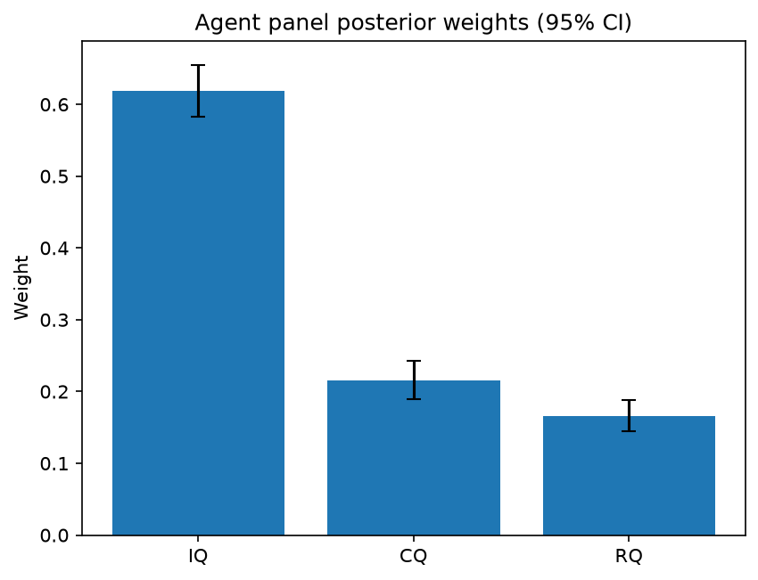

# Survey report: TrustRouter Agentic Full Panel (qwen3:14b) -- Level L3a: Quality clusters (ISO 25012)

Survey ID: `trustrouter-agentic-full-panel-qwen3-14b-2026-09-01-L3a`

## Agent panel

- Agents contributing a valid response: 36
- Classical BWM consistency: 36/36 within threshold

| Criterion | Mean | 95% CI lower | 95% CI upper |
|---|---|---|---|
| IQ | 0.6192 | 0.5824 | 0.6553 |
| CQ | 0.2151 | 0.1888 | 0.2430 |
| RQ | 0.1657 | 0.1441 | 0.1885 |

## Methodology

Each agent independently completed a Best-Worst Method (BWM) comparison: choosing the single most and least important criterion, then rating every criterion's importance relative to those two on a 1-9 scale. Individual responses were solved with the classical BWM linear program (Rezaei, 2015) for a consistency check, and combined across the panel with a hierarchical Bayesian model (Mohammadi and Rezaei, 2020).

36 agent response(s) were accepted into this result.

Every agent's run began with a QA precheck (its stated configuration verified against ground truth) and every accepted answer's self-reported sources were checked against what reference material was actually available to it; see the Per-agent detail section below and this survey's Conversation Log for each agent's specific results. Every response is schema-validated and independently, repeatedly sampled (never a single completion treated as ground truth); see `guardrails.py`. This survey's complete output is covered by a SHA-256 integrity manifest (`integrity_manifest.json`, `SHA256SUMS`), generated once this run finished, so any later alteration to these files is detectable.

### Charts

## Per-agent detail

### bim-coordinator-base-openmanus (`bim-coordinator-base-openmanus`)

- Role: BIM Coordinator
- Model: ollama/qwen3:14b
- DID: `did:key:z6MkudbAFJTsT2nAaosLBXGy3dK9HHhxJRGYp85L1rpGG6MW`
- QA precheck: passed
- Sources used: (not reported)

**Answer:** `{"best": "IQ", "worst": "RQ", "best_to_others": {"IQ": 1, "CQ": 7, "RQ": 8}, "others_to_worst": {"RQ": 1, "CQ": 6, "IQ": 8}}`

**Reasoning:**

Best factor: IQ  
Worst factor: RQ

IQ vs CQ: 7  
IQ vs RQ: 8  
CQ vs RQ: 6

### bim-coordinator-base-openmanus (`bim-coordinator-base-openmanus`)

- Role: BIM Coordinator
- Model: ollama/qwen3:14b
- DID: `did:key:z6MkudbAFJTsT2nAaosLBXGy3dK9HHhxJRGYp85L1rpGG6MW`
- QA precheck: passed
- Sources used: (not reported)

**Answer:** `{"best": "IQ", "worst": "RQ", "best_to_others": {"IQ": 1, "CQ": 7, "RQ": 9}, "others_to_worst": {"RQ": 1, "CQ": 6, "IQ": 9}}`

**Reasoning:**

Best factor: IQ  
Worst factor: RQ

IQ vs CQ: 7  
IQ vs RQ: 9  
CQ vs RQ: 6

### bim-coordinator-base-openmanus (`bim-coordinator-base-openmanus`)

- Role: BIM Coordinator
- Model: ollama/qwen3:14b
- DID: `did:key:z6MkudbAFJTsT2nAaosLBXGy3dK9HHhxJRGYp85L1rpGG6MW`
- QA precheck: passed
- Sources used: (not reported)

**Answer:** `{"best": "IQ", "worst": "RQ", "best_to_others": {"IQ": 1, "CQ": 7, "RQ": 9}, "others_to_worst": {"RQ": 1, "CQ": 6, "IQ": 9}}`

**Reasoning:**

Best factor: IQ  
Worst factor: RQ

IQ vs CQ: 7  
IQ vs RQ: 9  
CQ vs RQ: 6

### bim-coordinator-rag-openmanus (`bim-coordinator-rag-openmanus`)

- Role: BIM Coordinator
- Model: ollama/qwen3:14b
- DID: `did:key:z6MkrS7nJZ3C7iB8kChprkVGtviujb1Avhvb1uK7D4V5yACK`
- QA precheck: passed
- Sources used: (not reported)

**Answer:** `{"best": "IQ", "worst": "RQ", "best_to_others": {"IQ": 1, "CQ": 7, "RQ": 9}, "others_to_worst": {"RQ": 1, "CQ": 6, "IQ": 9}}`

**Reasoning:**

Best factor: IQ  
Worst factor: RQ

IQ vs CQ: 7  
IQ vs RQ: 9  
CQ vs RQ: 6

### bim-coordinator-rag-openmanus (`bim-coordinator-rag-openmanus`)

- Role: BIM Coordinator
- Model: ollama/qwen3:14b
- DID: `did:key:z6MkrS7nJZ3C7iB8kChprkVGtviujb1Avhvb1uK7D4V5yACK`
- QA precheck: passed
- Sources used: (not reported)

**Answer:** `{"best": "IQ", "worst": "CQ", "best_to_others": {"IQ": 1, "RQ": 7, "CQ": 8}, "others_to_worst": {"CQ": 1, "RQ": 6, "IQ": 8}}`

**Reasoning:**

Best factor: IQ  
Worst factor: CQ

IQ vs RQ: 7  
IQ vs CQ: 8  
RQ vs CQ: 6  

**Reasoning:**  
- **IQ vs RQ (7):** Intrinsic Quality (IQ) is foundational for trust in blockchain-stored data (accuracy, validity, uniqueness), which is critical for construction records. Representational Quality (RQ) ensures consistency across sources, which is important but secondary to the inherent correctness of data.  
- **IQ vs CQ (8):** IQ is far more critical than Contextual Quality (CQ). While completeness and timeliness (CQ) matter, incomplete or delayed data can be mitigated by rigorous validation (IQ). In blockchain contexts, incorrect data (low IQ) undermines trust irreparably.  
- **RQ vs CQ (6):** Consistency across sources (RQ) is more vital than completeness/timeliness (CQ) for multi-stakeholder collaboration in construction. However, CQ’s impact is less severe if data is consistent but slightly delayed, compared to inconsistent data causing conflicts.

### bim-coordinator-rag-openmanus (`bim-coordinator-rag-openmanus`)

- Role: BIM Coordinator
- Model: ollama/qwen3:14b
- DID: `did:key:z6MkrS7nJZ3C7iB8kChprkVGtviujb1Avhvb1uK7D4V5yACK`
- QA precheck: passed
- Sources used: (not reported)

**Answer:** `{"best": "IQ", "worst": "RQ", "best_to_others": {"IQ": 1, "CQ": 7, "RQ": 9}, "others_to_worst": {"RQ": 1, "CQ": 6, "IQ": 9}}`

**Reasoning:**

Best factor: IQ  
Worst factor: RQ

IQ vs CQ: 7  
IQ vs RQ: 9  
CQ vs RQ: 6

### blockchain-engineer-base-openmanus (`blockchain-engineer-base-openmanus`)

- Role: Blockchain / DLT Engineer
- Model: ollama/qwen3:14b
- DID: `did:key:z6MkvKSFkcT6DEpWEsxp95m1wb9T1hSVzyS5BFz4rn1dkQX2`
- QA precheck: passed
- Sources used: (not reported)

**Answer:** `{"best": "IQ", "worst": "RQ", "best_to_others": {"IQ": 1, "CQ": 7, "RQ": 9}, "others_to_worst": {"RQ": 1, "CQ": 6, "IQ": 9}}`

**Reasoning:**

Best factor: IQ  
Worst factor: RQ

IQ vs CQ: 7  
IQ vs RQ: 9  
CQ vs RQ: 6

### blockchain-engineer-base-openmanus (`blockchain-engineer-base-openmanus`)

- Role: Blockchain / DLT Engineer
- Model: ollama/qwen3:14b
- DID: `did:key:z6MkvKSFkcT6DEpWEsxp95m1wb9T1hSVzyS5BFz4rn1dkQX2`
- QA precheck: passed
- Sources used: (not reported)

**Answer:** `{"best": "IQ", "worst": "CQ", "best_to_others": {"IQ": 1, "RQ": 7, "CQ": 8}, "others_to_worst": {"CQ": 1, "RQ": 6, "IQ": 8}}`

**Reasoning:**

Best factor: IQ  
Worst factor: CQ

IQ vs RQ: 7  
IQ vs CQ: 8  
RQ vs CQ: 6

### blockchain-engineer-base-openmanus (`blockchain-engineer-base-openmanus`)

- Role: Blockchain / DLT Engineer
- Model: ollama/qwen3:14b
- DID: `did:key:z6MkvKSFkcT6DEpWEsxp95m1wb9T1hSVzyS5BFz4rn1dkQX2`
- QA precheck: passed
- Sources used: (not reported)

**Answer:** `{"best": "IQ", "worst": "CQ", "best_to_others": {"IQ": 1, "RQ": 7, "CQ": 9}, "others_to_worst": {"CQ": 1, "RQ": 6, "IQ": 9}}`

**Reasoning:**

Best factor: IQ  
Worst factor: CQ

IQ vs RQ: 7  
IQ vs CQ: 9  
RQ vs CQ: 6

### blockchain-engineer-rag-openmanus (`blockchain-engineer-rag-openmanus`)

- Role: Blockchain / DLT Engineer
- Model: ollama/qwen3:14b
- DID: `did:key:z6MkefhuQ6kB1idjYsNndYCBmDNMXzrmmDaSSNrB7uygb6tb`
- QA precheck: passed
- Sources used: (not reported)

**Answer:** `{"best": "IQ", "worst": "RQ", "best_to_others": {"IQ": 1, "CQ": 8, "RQ": 9}, "others_to_worst": {"RQ": 1, "CQ": 7, "IQ": 9}}`

**Reasoning:**

Best factor: IQ  
Worst factor: RQ

IQ vs CQ: 8  
IQ vs RQ: 9  
CQ vs RQ: 7

### blockchain-engineer-rag-openmanus (`blockchain-engineer-rag-openmanus`)

- Role: Blockchain / DLT Engineer
- Model: ollama/qwen3:14b
- DID: `did:key:z6MkefhuQ6kB1idjYsNndYCBmDNMXzrmmDaSSNrB7uygb6tb`
- QA precheck: passed
- Sources used: (not reported)

**Answer:** `{"best": "IQ", "worst": "CQ", "best_to_others": {"IQ": 1, "RQ": 7, "CQ": 9}, "others_to_worst": {"CQ": 1, "RQ": 7, "IQ": 9}}`

**Reasoning:**

Best factor: IQ  
Worst factor: CQ

IQ vs RQ: 7  
IQ vs CQ: 9  
RQ vs CQ: 7  

**Reasoning:**  
- **IQ vs RQ (7):** Intrinsic Quality (IQ) is foundational for trust in blockchain data (accuracy, validity), but Representational Quality (RQ) is also critical for cross-source consistency. While IQ is more central to data integrity, RQ's role in avoiding contradictions across stakeholders makes it non-trivial.  
- **IQ vs CQ (9):** IQ is paramount for blockchain's tamper-evidence and reliability, whereas Contextual Quality (CQ) (completeness, timeliness) is secondary. In construction projects, incomplete or delayed data can be mitigated by post-hoc validation, but invalid data (IQ failure) undermines the entire system.  
- **RQ vs CQ (7):** Consistency (RQ) is vital for trust in multi-party systems, but Contextual Quality (CQ) (e.g., timely updates) is less critical in permissioned ledgers where data can be retroactively verified. However, CQ's role in completeness remains a practical concern for real-world adoption.

### blockchain-engineer-rag-openmanus (`blockchain-engineer-rag-openmanus`)

- Role: Blockchain / DLT Engineer
- Model: ollama/qwen3:14b
- DID: `did:key:z6MkefhuQ6kB1idjYsNndYCBmDNMXzrmmDaSSNrB7uygb6tb`
- QA precheck: passed
- Sources used: (not reported)

**Answer:** `{"best": "IQ", "worst": "RQ", "best_to_others": {"IQ": 1, "CQ": 7, "RQ": 9}, "others_to_worst": {"RQ": 1, "CQ": 7, "IQ": 9}}`

**Reasoning:**

Best factor: IQ  
Worst factor: RQ

IQ vs CQ: 7  
IQ vs RQ: 9  
CQ vs RQ: 7  

**Reasoning:**  
- **IQ vs CQ (7):** Intrinsic Quality (accuracy, validity, uniqueness) is foundational for trust in blockchain records, but Contextual Quality (completeness, timeliness) is also critical for practical usability. While IQ ensures data correctness, CQ ensures data is fully available and up-to-date, both being essential but not strictly hierarchical.  
- **IQ vs RQ (9):** Intrinsic Quality is far more critical than Representational Quality (consistency across sources). Even if data is inconsistent across sources (RQ), accurate and valid data (IQ) remains the priority. Consistency can often be addressed through reconciliation, but incorrect data (low IQ) undermines trust irreparably.  
- **CQ vs RQ (7):** Completeness and timeliness (CQ) are more impactful than consistency (RQ) in construction-project records. Missing or outdated data (low CQ) directly hinders project execution, whereas inconsistency (low RQ) is secondary unless it leads to conflicting interpretations of valid data.

### compliance-officer-base-openmanus (`compliance-officer-base-openmanus`)

- Role: Compliance and Regulatory Officer
- Model: ollama/qwen3:14b
- DID: `did:key:z6Mkhe8EvcrtatxJKQFwRpetMw5DkpvZbrHXSSPefLe5DfVf`
- QA precheck: passed
- Sources used: (not reported)

**Answer:** `{"best": "IQ", "worst": "CQ", "best_to_others": {"IQ": 1, "RQ": 7, "CQ": 9}, "others_to_worst": {"CQ": 1, "RQ": 6, "IQ": 9}}`

**Reasoning:**

Best factor: IQ  
Worst factor: CQ

IQ vs RQ: 7  
IQ vs CQ: 9  
RQ vs CQ: 6

### compliance-officer-base-openmanus (`compliance-officer-base-openmanus`)

- Role: Compliance and Regulatory Officer
- Model: ollama/qwen3:14b
- DID: `did:key:z6Mkhe8EvcrtatxJKQFwRpetMw5DkpvZbrHXSSPefLe5DfVf`
- QA precheck: passed
- Sources used: (not reported)

**Answer:** `{"best": "IQ", "worst": "RQ", "best_to_others": {"IQ": 1, "CQ": 7, "RQ": 9}, "others_to_worst": {"RQ": 1, "CQ": 6, "IQ": 9}}`

**Reasoning:**

Best factor: IQ  
Worst factor: RQ

IQ vs CQ: 7  
IQ vs RQ: 9  
CQ vs RQ: 6

### compliance-officer-base-openmanus (`compliance-officer-base-openmanus`)

- Role: Compliance and Regulatory Officer
- Model: ollama/qwen3:14b
- DID: `did:key:z6Mkhe8EvcrtatxJKQFwRpetMw5DkpvZbrHXSSPefLe5DfVf`
- QA precheck: passed
- Sources used: (not reported)

**Answer:** `{"best": "IQ", "worst": "CQ", "best_to_others": {"IQ": 1, "RQ": 7, "CQ": 9}, "others_to_worst": {"CQ": 1, "RQ": 6, "IQ": 9}}`

**Reasoning:**

Best factor: IQ  
Worst factor: CQ

IQ vs RQ: 7  
IQ vs CQ: 9  
RQ vs CQ: 6

### compliance-officer-rag-openmanus (`compliance-officer-rag-openmanus`)

- Role: Compliance and Regulatory Officer
- Model: ollama/qwen3:14b
- DID: `did:key:z6MkhGj5AAyBKcqGQ794QBjrs7aqk5ChKYRr2bnej5XYT3L2`
- QA precheck: passed
- Sources used: (not reported)

**Answer:** `{"best": "IQ", "worst": "RQ", "best_to_others": {"IQ": 1, "CQ": 7, "RQ": 8}, "others_to_worst": {"RQ": 1, "CQ": 6, "IQ": 8}}`

**Reasoning:**

Best factor: IQ  
Worst factor: RQ

IQ vs CQ: 7  
IQ vs RQ: 8  
CQ vs RQ: 6

### compliance-officer-rag-openmanus (`compliance-officer-rag-openmanus`)

- Role: Compliance and Regulatory Officer
- Model: ollama/qwen3:14b
- DID: `did:key:z6MkhGj5AAyBKcqGQ794QBjrs7aqk5ChKYRr2bnej5XYT3L2`
- QA precheck: passed
- Sources used: (not reported)

**Answer:** `{"best": "IQ", "worst": "RQ", "best_to_others": {"IQ": 1, "CQ": 7, "RQ": 8}, "others_to_worst": {"RQ": 1, "CQ": 6, "IQ": 8}}`

**Reasoning:**

Best factor: IQ  
Worst factor: RQ

IQ vs CQ: 7  
IQ vs RQ: 8  
CQ vs RQ: 6

### compliance-officer-rag-openmanus (`compliance-officer-rag-openmanus`)

- Role: Compliance and Regulatory Officer
- Model: ollama/qwen3:14b
- DID: `did:key:z6MkhGj5AAyBKcqGQ794QBjrs7aqk5ChKYRr2bnej5XYT3L2`
- QA precheck: passed
- Sources used: (not reported)

**Answer:** `{"best": "IQ", "worst": "RQ", "best_to_others": {"IQ": 1, "CQ": 8, "RQ": 9}, "others_to_worst": {"RQ": 1, "CQ": 7, "IQ": 9}}`

**Reasoning:**

Best factor: IQ  
Worst factor: RQ

IQ vs CQ: 8  
IQ vs RQ: 9  
CQ vs RQ: 7

### data-engineer-base-openmanus (`data-engineer-base-openmanus`)

- Role: Data Engineering Specialist
- Model: ollama/qwen3:14b
- DID: `did:key:z6MkoHX584uNGsUNkT4wu6bvscjg7jXYsKj13JDFkz2TH799`
- QA precheck: passed
- Sources used: (not reported)

**Answer:** `{"best": "IQ", "worst": "CQ", "best_to_others": {"IQ": 1, "RQ": 6, "CQ": 8}, "others_to_worst": {"CQ": 1, "RQ": 5, "IQ": 8}}`

**Reasoning:**

Best factor: IQ  
Worst factor: CQ

IQ vs RQ: 6  
IQ vs CQ: 8  
RQ vs CQ: 5

### data-engineer-base-openmanus (`data-engineer-base-openmanus`)

- Role: Data Engineering Specialist
- Model: ollama/qwen3:14b
- DID: `did:key:z6MkoHX584uNGsUNkT4wu6bvscjg7jXYsKj13JDFkz2TH799`
- QA precheck: passed
- Sources used: (not reported)

**Answer:** `{"best": "IQ", "worst": "CQ", "best_to_others": {"IQ": 1, "RQ": 6, "CQ": 8}, "others_to_worst": {"CQ": 1, "RQ": 5, "IQ": 8}}`

**Reasoning:**

Best factor: IQ  
Worst factor: CQ

IQ vs RQ: 6  
IQ vs CQ: 8  
RQ vs CQ: 5

### data-engineer-base-openmanus (`data-engineer-base-openmanus`)

- Role: Data Engineering Specialist
- Model: ollama/qwen3:14b
- DID: `did:key:z6MkoHX584uNGsUNkT4wu6bvscjg7jXYsKj13JDFkz2TH799`
- QA precheck: passed
- Sources used: (not reported)

**Answer:** `{"best": "IQ", "worst": "CQ", "best_to_others": {"IQ": 1, "RQ": 7, "CQ": 9}, "others_to_worst": {"CQ": 1, "RQ": 7, "IQ": 9}}`

**Reasoning:**

Best factor: IQ  
Worst factor: CQ

IQ vs RQ: 7  
IQ vs CQ: 9  
RQ vs CQ: 7

### data-engineer-rag-openmanus (`data-engineer-rag-openmanus`)

- Role: Data Engineering Specialist
- Model: ollama/qwen3:14b
- DID: `did:key:z6Mkw1baUuVQnipgbiBvSVDb8wz6t59Gcd6GT2tqAYBBy8xt`
- QA precheck: passed
- Sources used: (not reported)

**Answer:** `{"best": "IQ", "worst": "RQ", "best_to_others": {"IQ": 1, "CQ": 5, "RQ": 9}, "others_to_worst": {"RQ": 1, "CQ": 6, "IQ": 9}}`

**Reasoning:**

Best factor: IQ  
Worst factor: RQ

IQ vs CQ: 5  
IQ vs RQ: 9  
CQ vs RQ: 6  

**Reasoning**:  
- **IQ vs CQ (5)**: Both are critical. Intrinsic quality (accuracy, validity) ensures data correctness, which is foundational for blockchain immutability. Contextual quality (completeness, timeliness) ensures data sufficiency and relevance. However, intrinsic quality may be slightly more critical in blockchain contexts where errors cannot be corrected post-creation.  
- **IQ vs RQ (9)**: Intrinsic quality is far more critical. Representational consistency (RQ) is inherently managed by blockchain consensus mechanisms, reducing its standalone importance. Inaccurate or invalid data (IQ) would render even consistent data unusable.  
- **CQ vs RQ (6)**: Contextual quality (completeness, timeliness) is more important than representational consistency (RQ) for actionable project decisions. Incomplete or delayed data (CQ) directly impacts project outcomes, whereas RQ’s role is secondary in blockchain’s structured environment.  

Citations: Role knowledge: data_engineer (ISO 25012 clusters, blockchain data requirements).

### data-engineer-rag-openmanus (`data-engineer-rag-openmanus`)

- Role: Data Engineering Specialist
- Model: ollama/qwen3:14b
- DID: `did:key:z6Mkw1baUuVQnipgbiBvSVDb8wz6t59Gcd6GT2tqAYBBy8xt`
- QA precheck: passed
- Sources used: (not reported)

**Answer:** `{"best": "IQ", "worst": "CQ", "best_to_others": {"IQ": 1, "RQ": 7, "CQ": 9}, "others_to_worst": {"CQ": 1, "RQ": 5, "IQ": 9}}`

**Reasoning:**

Best factor: IQ  
Worst factor: CQ

IQ vs RQ: 7  
IQ vs CQ: 9  
RQ vs CQ: 5

### data-engineer-rag-openmanus (`data-engineer-rag-openmanus`)

- Role: Data Engineering Specialist
- Model: ollama/qwen3:14b
- DID: `did:key:z6Mkw1baUuVQnipgbiBvSVDb8wz6t59Gcd6GT2tqAYBBy8xt`
- QA precheck: passed
- Sources used: (not reported)

**Answer:** `{"best": "IQ", "worst": "CQ", "best_to_others": {"IQ": 1, "RQ": 7, "CQ": 9}, "others_to_worst": {"CQ": 1, "RQ": 7, "IQ": 9}}`

**Reasoning:**

Best factor: IQ  
Worst factor: CQ

IQ vs RQ: 7  
IQ vs CQ: 9  
RQ vs CQ: 7  

**Reasoning:**  
- **IQ vs RQ (7):** Intrinsic Quality (IQ) is foundational for trust in blockchain storage, as inaccurate or invalid data undermines the entire system. Representational Quality (RQ) is important for cross-source consistency, but less critical than ensuring data accuracy/validity first.  
- **IQ vs CQ (9):** Intrinsic Quality (IQ) is far more critical than Contextual Quality (CQ). Even complete and timely data (CQ) is useless if it’s inaccurate or invalid (IQ). Blockchain relies on immutable, trustworthy data, making IQ paramount.  
- **RQ vs CQ (7):** Representational consistency (RQ) is more important than completeness/timeliness (CQ) in blockchain contexts. Inconsistent data across sources can create conflicts, but incomplete/timely data can often be addressed later (e.g., through updates or reconciliation). However, RQ’s impact on trust is still secondary to IQ.  

Citations: Role knowledge: data_engineer (ISO 25012 quality clusters, blockchain data integrity requirements).

### project-manager-base-openmanus (`project-manager-base-openmanus`)

- Role: Construction Project Manager
- Model: ollama/qwen3:14b
- DID: `did:key:z6MkfMGqRV6T6XUBBe8xDRug3Wf1bA8CzrJeUpsbHgq2TYcL`
- QA precheck: passed
- Sources used: (not reported)

**Answer:** `{"best": "IQ", "worst": "RQ", "best_to_others": {"IQ": 1, "CQ": 7, "RQ": 9}, "others_to_worst": {"RQ": 1, "CQ": 7, "IQ": 9}}`

**Reasoning:**

Best factor: IQ  
Worst factor: RQ

IQ vs CQ: 7  
IQ vs RQ: 9  
CQ vs RQ: 7

### project-manager-base-openmanus (`project-manager-base-openmanus`)

- Role: Construction Project Manager
- Model: ollama/qwen3:14b
- DID: `did:key:z6MkfMGqRV6T6XUBBe8xDRug3Wf1bA8CzrJeUpsbHgq2TYcL`
- QA precheck: passed
- Sources used: (not reported)

**Answer:** `{"best": "IQ", "worst": "RQ", "best_to_others": {"IQ": 1, "CQ": 7, "RQ": 8}, "others_to_worst": {"RQ": 1, "CQ": 6, "IQ": 8}}`

**Reasoning:**

Best factor: IQ  
Worst factor: RQ

IQ vs CQ: 7  
IQ vs RQ: 8  
CQ vs RQ: 6

### project-manager-base-openmanus (`project-manager-base-openmanus`)

- Role: Construction Project Manager
- Model: ollama/qwen3:14b
- DID: `did:key:z6MkfMGqRV6T6XUBBe8xDRug3Wf1bA8CzrJeUpsbHgq2TYcL`
- QA precheck: passed
- Sources used: (not reported)

**Answer:** `{"best": "IQ", "worst": "RQ", "best_to_others": {"IQ": 1, "CQ": 7, "RQ": 9}, "others_to_worst": {"RQ": 1, "CQ": 6, "IQ": 9}}`

**Reasoning:**

Best factor: IQ  
Worst factor: RQ

IQ vs CQ: 7  
IQ vs RQ: 9  
CQ vs RQ: 6

### project-manager-rag-openmanus (`project-manager-rag-openmanus`)

- Role: Construction Project Manager
- Model: ollama/qwen3:14b
- DID: `did:key:z6MkhqFWadXvwg3s6b7ZtNrQPLq6YT88kwodKPsLp3PqQoVA`
- QA precheck: passed
- Sources used: (not reported)

**Answer:** `{"best": "IQ", "worst": "RQ", "best_to_others": {"IQ": 1, "CQ": 7, "RQ": 8}, "others_to_worst": {"RQ": 1, "CQ": 7, "IQ": 8}}`

**Reasoning:**

Best factor: IQ  
Worst factor: RQ

IQ vs CQ: 7  
IQ vs RQ: 8  
CQ vs RQ: 7

### project-manager-rag-openmanus (`project-manager-rag-openmanus`)

- Role: Construction Project Manager
- Model: ollama/qwen3:14b
- DID: `did:key:z6MkhqFWadXvwg3s6b7ZtNrQPLq6YT88kwodKPsLp3PqQoVA`
- QA precheck: passed
- Sources used: (not reported)

**Answer:** `{"best": "IQ", "worst": "RQ", "best_to_others": {"IQ": 1, "CQ": 8, "RQ": 9}, "others_to_worst": {"RQ": 1, "CQ": 7, "IQ": 9}}`

**Reasoning:**

Best factor: IQ  
Worst factor: RQ

IQ vs CQ: 8  
IQ vs RQ: 9  
CQ vs RQ: 7  

**Reasoning:**  
- **IQ vs CQ (8):** Intrinsic Quality (accuracy, validity, uniqueness) is foundational for trust in construction data—errors here directly compromise project integrity. Contextual Quality (completeness, timeliness) is critical but secondary; even complete data is useless if it’s inaccurate.  
- **IQ vs RQ (9):** Intrinsic Quality is non-negotiable for data trust. Representational Quality (consistency across sources) is important but can often be addressed through reconciliation processes, whereas intrinsic flaws (e.g., invalid measurements) are irreparable without rework.  
- **CQ vs RQ (7):** Completeness and timeliness are vital for workflow coordination, but consistency issues (RQ) can be mitigated through cross-checking, while incomplete or delayed data (CQ) causes systemic delays. However, CQ’s impact on real-time decision-making gives it a slight edge over RQ.  

(Citations: role knowledge: construction_project_manager; shared knowledge: ISO 25012 quality clusters.)

### project-manager-rag-openmanus (`project-manager-rag-openmanus`)

- Role: Construction Project Manager
- Model: ollama/qwen3:14b
- DID: `did:key:z6MkhqFWadXvwg3s6b7ZtNrQPLq6YT88kwodKPsLp3PqQoVA`
- QA precheck: passed
- Sources used: (not reported)

**Answer:** `{"best": "IQ", "worst": "RQ", "best_to_others": {"IQ": 1, "CQ": 7, "RQ": 9}, "others_to_worst": {"RQ": 1, "CQ": 6, "IQ": 9}}`

**Reasoning:**

Best factor: IQ  
Worst factor: RQ

IQ vs CQ: 7  
IQ vs RQ: 9  
CQ vs RQ: 6

### structural-engineer-base-openmanus (`structural-engineer-base-openmanus`)

- Role: Structural Engineer
- Model: ollama/qwen3:14b
- DID: `did:key:z6MkjijSmZJ4VbnK5WEgJsauUfmcN1JPnNQ9qPUAJf5MS9fW`
- QA precheck: passed
- Sources used: (not reported)

**Answer:** `{"best": "IQ", "worst": "RQ", "best_to_others": {"IQ": 1, "CQ": 7, "RQ": 8}, "others_to_worst": {"RQ": 1, "CQ": 6, "IQ": 8}}`

**Reasoning:**

Best factor: IQ  
Worst factor: RQ

IQ vs CQ: 7  
IQ vs RQ: 8  
CQ vs RQ: 6

### structural-engineer-base-openmanus (`structural-engineer-base-openmanus`)

- Role: Structural Engineer
- Model: ollama/qwen3:14b
- DID: `did:key:z6MkjijSmZJ4VbnK5WEgJsauUfmcN1JPnNQ9qPUAJf5MS9fW`
- QA precheck: passed
- Sources used: (not reported)

**Answer:** `{"best": "IQ", "worst": "RQ", "best_to_others": {"IQ": 1, "CQ": 7, "RQ": 9}, "others_to_worst": {"RQ": 1, "CQ": 6, "IQ": 9}}`

**Reasoning:**

Best factor: IQ  
Worst factor: RQ

IQ vs CQ: 7  
IQ vs RQ: 9  
CQ vs RQ: 6

### structural-engineer-base-openmanus (`structural-engineer-base-openmanus`)

- Role: Structural Engineer
- Model: ollama/qwen3:14b
- DID: `did:key:z6MkjijSmZJ4VbnK5WEgJsauUfmcN1JPnNQ9qPUAJf5MS9fW`
- QA precheck: passed
- Sources used: (not reported)

**Answer:** `{"best": "IQ", "worst": "RQ", "best_to_others": {"IQ": 1, "CQ": 7, "RQ": 8}, "others_to_worst": {"RQ": 1, "CQ": 6, "IQ": 8}}`

**Reasoning:**

Best factor: IQ  
Worst factor: RQ

IQ vs CQ: 7  
IQ vs RQ: 8  
CQ vs RQ: 6

### structural-engineer-rag-openmanus (`structural-engineer-rag-openmanus`)

- Role: Structural Engineer
- Model: ollama/qwen3:14b
- DID: `did:key:z6Mkhs5XsGsxBPxgbvuoZrUdk9QpW6F8xCP9Q5ZRZPqWvGnm`
- QA precheck: passed
- Sources used: (not reported)

**Answer:** `{"best": "IQ", "worst": "RQ", "best_to_others": {"IQ": 1, "CQ": 7, "RQ": 9}, "others_to_worst": {"RQ": 1, "CQ": 6, "IQ": 9}}`

**Reasoning:**

Best factor: IQ  
Worst factor: RQ

IQ vs CQ: 7  
IQ vs RQ: 9  
CQ vs RQ: 6

### structural-engineer-rag-openmanus (`structural-engineer-rag-openmanus`)

- Role: Structural Engineer
- Model: ollama/qwen3:14b
- DID: `did:key:z6Mkhs5XsGsxBPxgbvuoZrUdk9QpW6F8xCP9Q5ZRZPqWvGnm`
- QA precheck: passed
- Sources used: (not reported)

**Answer:** `{"best": "IQ", "worst": "RQ", "best_to_others": {"IQ": 1, "CQ": 7, "RQ": 8}, "others_to_worst": {"RQ": 1, "CQ": 6, "IQ": 8}}`

**Reasoning:**

Best factor: IQ  
Worst factor: RQ

IQ vs CQ: 7  
IQ vs RQ: 8  
CQ vs RQ: 6

### structural-engineer-rag-openmanus (`structural-engineer-rag-openmanus`)

- Role: Structural Engineer
- Model: ollama/qwen3:14b
- DID: `did:key:z6Mkhs5XsGsxBPxgbvuoZrUdk9QpW6F8xCP9Q5ZRZPqWvGnm`
- QA precheck: passed
- Sources used: (not reported)

**Answer:** `{"best": "IQ", "worst": "RQ", "best_to_others": {"IQ": 1, "CQ": 7, "RQ": 9}, "others_to_worst": {"RQ": 1, "CQ": 6, "IQ": 9}}`

**Reasoning:**

Best factor: IQ  
Worst factor: RQ

IQ vs CQ: 7  
IQ vs RQ: 9  
CQ vs RQ: 6
