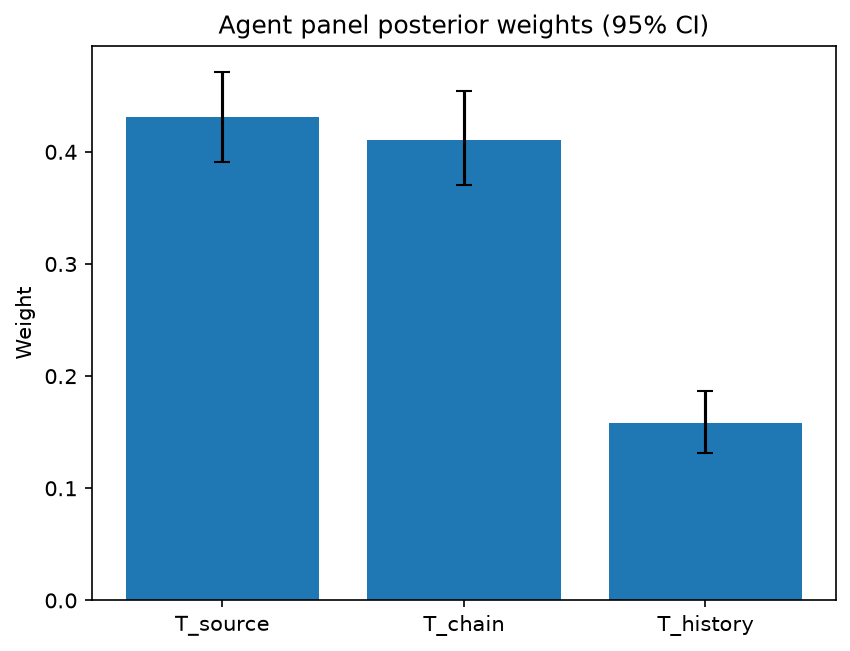

# Survey report: TrustRouter Agentic Full Panel (qwen3:14b) -- Level L3b: Provenance Trust sub-parts

Survey ID: `trustrouter-agentic-full-panel-qwen3-14b-2026-09-01-L3b`

## Agent panel

- Agents contributing a valid response: 36
- Classical BWM consistency: 36/36 within threshold

| Criterion | Mean | 95% CI lower | 95% CI upper |
|---|---|---|---|
| T_source | 0.4315 | 0.3909 | 0.4709 |
| T_chain | 0.4107 | 0.3706 | 0.4539 |
| T_history | 0.1578 | 0.1318 | 0.1865 |

## Methodology

Each agent independently completed a Best-Worst Method (BWM) comparison: choosing the single most and least important criterion, then rating every criterion's importance relative to those two on a 1-9 scale. Individual responses were solved with the classical BWM linear program (Rezaei, 2015) for a consistency check, and combined across the panel with a hierarchical Bayesian model (Mohammadi and Rezaei, 2020).

36 agent response(s) were accepted into this result.

Every agent's run began with a QA precheck (its stated configuration verified against ground truth) and every accepted answer's self-reported sources were checked against what reference material was actually available to it; see the Per-agent detail section below and this survey's Conversation Log for each agent's specific results. Every response is schema-validated and independently, repeatedly sampled (never a single completion treated as ground truth); see `guardrails.py`. This survey's complete output is covered by a SHA-256 integrity manifest (`integrity_manifest.json`, `SHA256SUMS`), generated once this run finished, so any later alteration to these files is detectable.

### Charts

## Per-agent detail

### bim-coordinator-base-openmanus (`bim-coordinator-base-openmanus`)

- Role: BIM Coordinator
- Model: ollama/qwen3:14b
- DID: `did:key:z6MkudbAFJTsT2nAaosLBXGy3dK9HHhxJRGYp85L1rpGG6MW`
- QA precheck: FAILED, see Conversation Log
- Sources used: (not reported)

**Answer:** `{"best": "T_chain", "worst": "T_history", "best_to_others": {"T_chain": 1, "T_source": 7, "T_history": 9}, "others_to_worst": {"T_history": 1, "T_source": 6, "T_chain": 9}}`

**Reasoning:**

Best factor: T_chain  
Worst factor: T_history

T_chain vs T_source: 7  
T_chain vs T_history: 9  
T_source vs T_history: 6

### bim-coordinator-base-openmanus (`bim-coordinator-base-openmanus`)

- Role: BIM Coordinator
- Model: ollama/qwen3:14b
- DID: `did:key:z6MkudbAFJTsT2nAaosLBXGy3dK9HHhxJRGYp85L1rpGG6MW`
- QA precheck: FAILED, see Conversation Log
- Sources used: (not reported)

**Answer:** `{"best": "T_source", "worst": "T_history", "best_to_others": {"T_source": 1, "T_chain": 7, "T_history": 9}, "others_to_worst": {"T_history": 1, "T_chain": 7, "T_source": 9}}`

**Reasoning:**

Best factor: T_source  
Worst factor: T_history

T_source vs T_chain: 7  
T_source vs T_history: 9  
T_chain vs T_history: 7

### bim-coordinator-base-openmanus (`bim-coordinator-base-openmanus`)

- Role: BIM Coordinator
- Model: ollama/qwen3:14b
- DID: `did:key:z6MkudbAFJTsT2nAaosLBXGy3dK9HHhxJRGYp85L1rpGG6MW`
- QA precheck: FAILED, see Conversation Log
- Sources used: (not reported)

**Answer:** `{"best": "T_source", "worst": "T_history", "best_to_others": {"T_source": 1, "T_chain": 6, "T_history": 8}, "others_to_worst": {"T_history": 1, "T_chain": 6, "T_source": 8}}`

**Reasoning:**

Best factor: T_source  
Worst factor: T_history

T_source vs T_chain: 6  
T_source vs T_history: 8  
T_chain vs T_history: 6

### bim-coordinator-rag-openmanus (`bim-coordinator-rag-openmanus`)

- Role: BIM Coordinator
- Model: ollama/qwen3:14b
- DID: `did:key:z6MkrS7nJZ3C7iB8kChprkVGtviujb1Avhvb1uK7D4V5yACK`
- QA precheck: passed
- Sources used: (not reported)

**Answer:** `{"best": "T_chain", "worst": "T_history", "best_to_others": {"T_chain": 1, "T_source": 7, "T_history": 8}, "others_to_worst": {"T_history": 1, "T_source": 7, "T_chain": 8}}`

**Reasoning:**

Best factor: T_chain  
Worst factor: T_history

T_chain vs T_source: 7  
T_chain vs T_history: 8  
T_source vs T_history: 7

### bim-coordinator-rag-openmanus (`bim-coordinator-rag-openmanus`)

- Role: BIM Coordinator
- Model: ollama/qwen3:14b
- DID: `did:key:z6MkrS7nJZ3C7iB8kChprkVGtviujb1Avhvb1uK7D4V5yACK`
- QA precheck: passed
- Sources used: (not reported)

**Answer:** `{"best": "T_chain", "worst": "T_history", "best_to_others": {"T_chain": 1, "T_source": 7, "T_history": 9}, "others_to_worst": {"T_history": 1, "T_source": 6, "T_chain": 9}}`

**Reasoning:**

Best factor: T_chain  
Worst factor: T_history

T_chain vs T_source: 7  
T_chain vs T_history: 9  
T_source vs T_history: 6

### bim-coordinator-rag-openmanus (`bim-coordinator-rag-openmanus`)

- Role: BIM Coordinator
- Model: ollama/qwen3:14b
- DID: `did:key:z6MkrS7nJZ3C7iB8kChprkVGtviujb1Avhvb1uK7D4V5yACK`
- QA precheck: passed
- Sources used: (not reported)

**Answer:** `{"best": "T_source", "worst": "T_history", "best_to_others": {"T_source": 1, "T_chain": 7, "T_history": 8}, "others_to_worst": {"T_history": 1, "T_chain": 5, "T_source": 8}}`

**Reasoning:**

Best factor: T_source  
Worst factor: T_history

T_source vs T_chain: 7  
T_source vs T_history: 8  
T_chain vs T_history: 5

### blockchain-engineer-base-openmanus (`blockchain-engineer-base-openmanus`)

- Role: Blockchain / DLT Engineer
- Model: ollama/qwen3:14b
- DID: `did:key:z6MkvKSFkcT6DEpWEsxp95m1wb9T1hSVzyS5BFz4rn1dkQX2`
- QA precheck: passed
- Sources used: (not reported)

**Answer:** `{"best": "T_source", "worst": "T_history", "best_to_others": {"T_source": 1, "T_chain": 7, "T_history": 9}, "others_to_worst": {"T_history": 1, "T_chain": 6, "T_source": 9}}`

**Reasoning:**

Best factor: T_source  
Worst factor: T_history

T_source vs T_chain: 7  
T_source vs T_history: 9  
T_chain vs T_history: 6

### blockchain-engineer-base-openmanus (`blockchain-engineer-base-openmanus`)

- Role: Blockchain / DLT Engineer
- Model: ollama/qwen3:14b
- DID: `did:key:z6MkvKSFkcT6DEpWEsxp95m1wb9T1hSVzyS5BFz4rn1dkQX2`
- QA precheck: passed
- Sources used: (not reported)

**Answer:** `{"best": "T_chain", "worst": "T_history", "best_to_others": {"T_chain": 1, "T_source": 7, "T_history": 9}, "others_to_worst": {"T_history": 1, "T_source": 7, "T_chain": 9}}`

**Reasoning:**

Best factor: T_chain  
Worst factor: T_history  

**Reasoning**:  
As a blockchain/DLT engineer, **T_chain** (custody chain integrity) is foundational to tamper-evidence guarantees, which are central to blockchain's value proposition. A secure custody chain ensures data hasn't been altered during transit, even if the source is credible. While **T_source** (source credibility) is critical, it can be validated through the custody chain (e.g., verifying signatures, hashes). **T_history** (historical track record), though useful, is secondary: a source's past reliability doesn't inherently ensure current data integrity if the custody chain is compromised. The comparison between **T_chain** and **T_source** is close, but **T_chain** directly addresses the immutable ledger's core function, making it more critical in technical feasibility assessments.

T_chain vs T_source: 7  
T_chain vs T_history: 9  
T_source vs T_history: 7

### blockchain-engineer-base-openmanus (`blockchain-engineer-base-openmanus`)

- Role: Blockchain / DLT Engineer
- Model: ollama/qwen3:14b
- DID: `did:key:z6MkvKSFkcT6DEpWEsxp95m1wb9T1hSVzyS5BFz4rn1dkQX2`
- QA precheck: passed
- Sources used: (not reported)

**Answer:** `{"best": "T_chain", "worst": "T_history", "best_to_others": {"T_chain": 1, "T_source": 7, "T_history": 8}, "others_to_worst": {"T_history": 1, "T_source": 5, "T_chain": 8}}`

**Reasoning:**

Best factor: T_chain  
Worst factor: T_history

T_chain vs T_source: 7  
T_chain vs T_history: 8  
T_source vs T_history: 5

### blockchain-engineer-rag-openmanus (`blockchain-engineer-rag-openmanus`)

- Role: Blockchain / DLT Engineer
- Model: ollama/qwen3:14b
- DID: `did:key:z6MkefhuQ6kB1idjYsNndYCBmDNMXzrmmDaSSNrB7uygb6tb`
- QA precheck: passed
- Sources used: (not reported)

**Answer:** `{"best": "T_source", "worst": "T_history", "best_to_others": {"T_source": 1, "T_chain": 7, "T_history": 9}, "others_to_worst": {"T_history": 1, "T_chain": 7, "T_source": 9}}`

**Reasoning:**

Best factor: T_source  
Worst factor: T_history

T_source vs T_chain: 7  
T_source vs T_history: 9  
T_chain vs T_history: 7

### blockchain-engineer-rag-openmanus (`blockchain-engineer-rag-openmanus`)

- Role: Blockchain / DLT Engineer
- Model: ollama/qwen3:14b
- DID: `did:key:z6MkefhuQ6kB1idjYsNndYCBmDNMXzrmmDaSSNrB7uygb6tb`
- QA precheck: passed
- Sources used: (not reported)

**Answer:** `{"best": "T_chain", "worst": "T_history", "best_to_others": {"T_chain": 1, "T_source": 7, "T_history": 9}, "others_to_worst": {"T_history": 1, "T_source": 6, "T_chain": 9}}`

**Reasoning:**

Best factor: T_chain  
Worst factor: T_history

T_chain vs T_source: 7  
T_chain vs T_history: 9  
T_source vs T_history: 6

### blockchain-engineer-rag-openmanus (`blockchain-engineer-rag-openmanus`)

- Role: Blockchain / DLT Engineer
- Model: ollama/qwen3:14b
- DID: `did:key:z6MkefhuQ6kB1idjYsNndYCBmDNMXzrmmDaSSNrB7uygb6tb`
- QA precheck: passed
- Sources used: (not reported)

**Answer:** `{"best": "T_source", "worst": "T_history", "best_to_others": {"T_source": 1, "T_chain": 7, "T_history": 9}, "others_to_worst": {"T_history": 1, "T_chain": 6, "T_source": 9}}`

**Reasoning:**

Best factor: T_source  
Worst factor: T_history

T_source vs T_chain: 7  
T_source vs T_history: 9  
T_chain vs T_history: 6

### compliance-officer-base-openmanus (`compliance-officer-base-openmanus`)

- Role: Compliance and Regulatory Officer
- Model: ollama/qwen3:14b
- DID: `did:key:z6Mkhe8EvcrtatxJKQFwRpetMw5DkpvZbrHXSSPefLe5DfVf`
- QA precheck: passed
- Sources used: (not reported)

**Answer:** `{"best": "T_chain", "worst": "T_history", "best_to_others": {"T_chain": 1, "T_source": 6, "T_history": 9}, "others_to_worst": {"T_history": 1, "T_source": 7, "T_chain": 9}}`

**Reasoning:**

Best factor: T_chain  
Worst factor: T_history  

**Reasoning:**  
- **T_chain (Custody chain integrity)** is critical for ensuring data hasn't been tampered with during transmission/storage, which is foundational to trust in blockchain systems. A broken custody chain undermines all other factors, making it the most pivotal for verification.  
- **T_history (Historical track record)** is important but secondary, as past reliability does not guarantee current integrity. While useful, it is less directly actionable than real-time custody chain validation.  
- The comparison between T_chain and T_source is close, but custody chain integrity (T_chain) is prioritized here due to its direct role in verifying data authenticity during the blockchain's operational lifecycle.

T_chain vs T_source: 6  
T_chain vs T_history: 9  
T_source vs T_history: 7

### compliance-officer-base-openmanus (`compliance-officer-base-openmanus`)

- Role: Compliance and Regulatory Officer
- Model: ollama/qwen3:14b
- DID: `did:key:z6Mkhe8EvcrtatxJKQFwRpetMw5DkpvZbrHXSSPefLe5DfVf`
- QA precheck: passed
- Sources used: (not reported)

**Answer:** `{"best": "T_source", "worst": "T_history", "best_to_others": {"T_source": 1, "T_chain": 7, "T_history": 9}, "others_to_worst": {"T_history": 1, "T_chain": 6, "T_source": 9}}`

**Reasoning:**

Best factor: T_source  
Worst factor: T_history

T_source vs T_chain: 7  
T_source vs T_history: 9  
T_chain vs T_history: 6

### compliance-officer-base-openmanus (`compliance-officer-base-openmanus`)

- Role: Compliance and Regulatory Officer
- Model: ollama/qwen3:14b
- DID: `did:key:z6Mkhe8EvcrtatxJKQFwRpetMw5DkpvZbrHXSSPefLe5DfVf`
- QA precheck: passed
- Sources used: (not reported)

**Answer:** `{"best": "T_chain", "worst": "T_history", "best_to_others": {"T_chain": 1, "T_source": 7, "T_history": 9}, "others_to_worst": {"T_history": 1, "T_source": 6, "T_chain": 9}}`

**Reasoning:**

Best factor: T_chain  
Worst factor: T_history

T_chain vs T_source: 7  
T_chain vs T_history: 9  
T_source vs T_history: 6

### compliance-officer-rag-openmanus (`compliance-officer-rag-openmanus`)

- Role: Compliance and Regulatory Officer
- Model: ollama/qwen3:14b
- DID: `did:key:z6MkhGj5AAyBKcqGQ794QBjrs7aqk5ChKYRr2bnej5XYT3L2`
- QA precheck: passed
- Sources used: (not reported)

**Answer:** `{"best": "T_source", "worst": "T_history", "best_to_others": {"T_source": 1, "T_chain": 7, "T_history": 9}, "others_to_worst": {"T_history": 1, "T_chain": 7, "T_source": 9}}`

**Reasoning:**

Best factor: T_source  
Worst factor: T_history

T_source vs T_chain: 7  
T_source vs T_history: 9  
T_chain vs T_history: 7

### compliance-officer-rag-openmanus (`compliance-officer-rag-openmanus`)

- Role: Compliance and Regulatory Officer
- Model: ollama/qwen3:14b
- DID: `did:key:z6MkhGj5AAyBKcqGQ794QBjrs7aqk5ChKYRr2bnej5XYT3L2`
- QA precheck: passed
- Sources used: (not reported)

**Answer:** `{"best": "T_source", "worst": "T_history", "best_to_others": {"T_source": 1, "T_chain": 7, "T_history": 9}, "others_to_worst": {"T_history": 1, "T_chain": 6, "T_source": 9}}`

**Reasoning:**

Best factor: T_source  
Worst factor: T_history

T_source vs T_chain: 7  
T_source vs T_history: 9  
T_chain vs T_history: 6

### compliance-officer-rag-openmanus (`compliance-officer-rag-openmanus`)

- Role: Compliance and Regulatory Officer
- Model: ollama/qwen3:14b
- DID: `did:key:z6MkhGj5AAyBKcqGQ794QBjrs7aqk5ChKYRr2bnej5XYT3L2`
- QA precheck: passed
- Sources used: (not reported)

**Answer:** `{"best": "T_chain", "worst": "T_history", "best_to_others": {"T_chain": 1, "T_source": 7, "T_history": 9}, "others_to_worst": {"T_history": 1, "T_source": 6, "T_chain": 9}}`

**Reasoning:**

Best factor: T_chain  
Worst factor: T_history

T_chain vs T_source: 7  
T_chain vs T_history: 9  
T_source vs T_history: 6  

**Reasoning:**  
- **T_chain vs T_source (7):** While source credentials (T_source) are important for establishing initial trust (e.g., verifying data origin aligns with GDPR's "lawfulness of processing"), the custody chain (T_chain) provides continuous verification of data integrity throughout its lifecycle. In construction projects, regulatory compliance (e.g., audit trails for building permits) depends on knowing *what happened to data* (custody) as much as *who produced it* (source).  
- **T_chain vs T_history (9):** Custody chain (T_chain) is critical for real-time compliance monitoring (e.g., tracking data modifications during construction phases), whereas historical track record (T_history) reflects past reliability, which is less actionable for current regulatory obligations. GDPR prioritizes present accountability over historical data unless explicitly required (e.g., breach investigations).  
- **T_source vs T_history (6):** Source credentials (T_source) are more important than historical track record (T_history) because verifying data origin (e.g., ensuring a construction firm’s data meets ISO standards) directly impacts compliance, whereas historical reliability is a secondary consideration unless tied to specific regulatory audits.

### data-engineer-base-openmanus (`data-engineer-base-openmanus`)

- Role: Data Engineering Specialist
- Model: ollama/qwen3:14b
- DID: `did:key:z6MkoHX584uNGsUNkT4wu6bvscjg7jXYsKj13JDFkz2TH799`
- QA precheck: passed
- Sources used: (not reported)

**Answer:** `{"best": "T_chain", "worst": "T_history", "best_to_others": {"T_chain": 1, "T_source": 7, "T_history": 8}, "others_to_worst": {"T_history": 1, "T_source": 5, "T_chain": 8}}`

**Reasoning:**

Best factor: T_chain  
Worst factor: T_history

T_chain vs T_source: 7  
T_chain vs T_history: 8  
T_source vs T_history: 5

### data-engineer-base-openmanus (`data-engineer-base-openmanus`)

- Role: Data Engineering Specialist
- Model: ollama/qwen3:14b
- DID: `did:key:z6MkoHX584uNGsUNkT4wu6bvscjg7jXYsKj13JDFkz2TH799`
- QA precheck: passed
- Sources used: (not reported)

**Answer:** `{"best": "T_chain", "worst": "T_history", "best_to_others": {"T_chain": 1, "T_source": 7, "T_history": 8}, "others_to_worst": {"T_history": 1, "T_source": 6, "T_chain": 8}}`

**Reasoning:**

Best factor: T_chain  
Worst factor: T_history

T_chain vs T_source: 7  
T_chain vs T_history: 8  
T_source vs T_history: 6

### data-engineer-base-openmanus (`data-engineer-base-openmanus`)

- Role: Data Engineering Specialist
- Model: ollama/qwen3:14b
- DID: `did:key:z6MkoHX584uNGsUNkT4wu6bvscjg7jXYsKj13JDFkz2TH799`
- QA precheck: passed
- Sources used: (not reported)

**Answer:** `{"best": "T_chain", "worst": "T_history", "best_to_others": {"T_chain": 1, "T_source": 7, "T_history": 9}, "others_to_worst": {"T_history": 1, "T_source": 6, "T_chain": 9}}`

**Reasoning:**

Best factor: T_chain  
Worst factor: T_history

T_chain vs T_source: 7  
T_chain vs T_history: 9  
T_source vs T_history: 6

### data-engineer-rag-openmanus (`data-engineer-rag-openmanus`)

- Role: Data Engineering Specialist
- Model: ollama/qwen3:14b
- DID: `did:key:z6Mkw1baUuVQnipgbiBvSVDb8wz6t59Gcd6GT2tqAYBBy8xt`
- QA precheck: passed
- Sources used: (not reported)

**Answer:** `{"best": "T_chain", "worst": "T_history", "best_to_others": {"T_chain": 1, "T_source": 7, "T_history": 9}, "others_to_worst": {"T_history": 1, "T_source": 7, "T_chain": 9}}`

**Reasoning:**

Best factor: T_chain  
Worst factor: T_history

T_chain vs T_source: 7  
T_chain vs T_history: 9  
T_source vs T_history: 7  

**Reasoning:**  
- **T_chain > T_source (7):** While source credentials matter, a clear custody chain (T_chain) provides verifiable evidence of data integrity during transit, which is critical for blockchain trust. A credible source (T_source) without a transparent chain risks untraceable tampering.  
- **T_chain > T_history (9):** Historical track record (T_history) is less actionable for current data trust compared to the immediate, verifiable custody chain. Past reliability (T_history) cannot guarantee present data integrity as effectively as a transparent chain (T_chain).  
- **T_source > T_history (7):** Source credibility (T_source) directly impacts initial trust in data authenticity, which is more immediately relevant than historical reliability (T_history), which may not reflect current practices.

### data-engineer-rag-openmanus (`data-engineer-rag-openmanus`)

- Role: Data Engineering Specialist
- Model: ollama/qwen3:14b
- DID: `did:key:z6Mkw1baUuVQnipgbiBvSVDb8wz6t59Gcd6GT2tqAYBBy8xt`
- QA precheck: passed
- Sources used: (not reported)

**Answer:** `{"best": "T_chain", "worst": "T_history", "best_to_others": {"T_chain": 1, "T_source": 7, "T_history": 8}, "others_to_worst": {"T_history": 1, "T_source": 6, "T_chain": 8}}`

**Reasoning:**

Best factor: T_chain  
Worst factor: T_history

T_chain vs T_source: 7  
T_chain vs T_history: 8  
T_source vs T_history: 6

### data-engineer-rag-openmanus (`data-engineer-rag-openmanus`)

- Role: Data Engineering Specialist
- Model: ollama/qwen3:14b
- DID: `did:key:z6Mkw1baUuVQnipgbiBvSVDb8wz6t59Gcd6GT2tqAYBBy8xt`
- QA precheck: passed
- Sources used: (not reported)

**Answer:** `{"best": "T_source", "worst": "T_history", "best_to_others": {"T_source": 1, "T_chain": 7, "T_history": 9}, "others_to_worst": {"T_history": 1, "T_chain": 7, "T_source": 9}}`

**Reasoning:**

Best factor: T_source  
Worst factor: T_history

T_source vs T_chain: 7  
T_source vs T_history: 9  
T_chain vs T_history: 7  

**Reasoning**:  
- **T_source vs T_chain (7)**: Source credentials are foundational (e.g., verified entity, legal authority) and directly impact initial trust. Custody chain (T_chain) adds value by showing data lineage, but its importance is secondary to the source's inherent credibility. A strong source can mitigate some custody chain ambiguities, but a weak source cannot be fully redeemed by a perfect custody chain.  
- **T_source vs T_history (9)**: Historical track record (T_history) is inherently less actionable for current trust assessments. While past reliability matters, it is indirect compared to the immediate credibility of the source (e.g., current certifications, legal standing). A source with no history but strong current credentials may outperform one with a mixed history but weaker current credentials.  
- **T_chain vs T_history (7)**: Custody chain (T_chain) provides concrete, verifiable steps in data provenance, which is more immediately relevant to trust than historical track record (T_history). However, T_chain’s importance is limited by its dependency on the source’s credibility (T_source) and the lack of direct accountability for past errors (unlike T_history, which reflects prior reliability).

### project-manager-base-openmanus (`project-manager-base-openmanus`)

- Role: Construction Project Manager
- Model: ollama/qwen3:14b
- DID: `did:key:z6MkfMGqRV6T6XUBBe8xDRug3Wf1bA8CzrJeUpsbHgq2TYcL`
- QA precheck: passed
- Sources used: (not reported)

**Answer:** `{"best": "T_chain", "worst": "T_history", "best_to_others": {"T_chain": 1, "T_source": 7, "T_history": 9}, "others_to_worst": {"T_history": 1, "T_source": 7, "T_chain": 9}}`

**Reasoning:**

Best factor: T_chain  
Worst factor: T_history

T_chain vs T_source: 7  
T_chain vs T_history: 9  
T_source vs T_history: 7

### project-manager-base-openmanus (`project-manager-base-openmanus`)

- Role: Construction Project Manager
- Model: ollama/qwen3:14b
- DID: `did:key:z6MkfMGqRV6T6XUBBe8xDRug3Wf1bA8CzrJeUpsbHgq2TYcL`
- QA precheck: passed
- Sources used: (not reported)

**Answer:** `{"best": "T_source", "worst": "T_history", "best_to_others": {"T_source": 1, "T_chain": 7, "T_history": 8}, "others_to_worst": {"T_history": 1, "T_chain": 6, "T_source": 8}}`

**Reasoning:**

Best factor: T_source  
Worst factor: T_history

T_source vs T_chain: 7  
T_source vs T_history: 8  
T_chain vs T_history: 6

### project-manager-base-openmanus (`project-manager-base-openmanus`)

- Role: Construction Project Manager
- Model: ollama/qwen3:14b
- DID: `did:key:z6MkfMGqRV6T6XUBBe8xDRug3Wf1bA8CzrJeUpsbHgq2TYcL`
- QA precheck: passed
- Sources used: (not reported)

**Answer:** `{"best": "T_chain", "worst": "T_history", "best_to_others": {"T_chain": 1, "T_source": 7, "T_history": 9}, "others_to_worst": {"T_history": 1, "T_source": 5, "T_chain": 9}}`

**Reasoning:**

Best factor: T_chain  
Worst factor: T_history

T_chain vs T_source: 7  
T_chain vs T_history: 9  
T_source vs T_history: 5

### project-manager-rag-openmanus (`project-manager-rag-openmanus`)

- Role: Construction Project Manager
- Model: ollama/qwen3:14b
- DID: `did:key:z6MkhqFWadXvwg3s6b7ZtNrQPLq6YT88kwodKPsLp3PqQoVA`
- QA precheck: passed
- Sources used: (not reported)

**Answer:** `{"best": "T_source", "worst": "T_history", "best_to_others": {"T_source": 1, "T_chain": 7, "T_history": 8}, "others_to_worst": {"T_history": 1, "T_chain": 6, "T_source": 8}}`

**Reasoning:**

Best factor: T_source  
Worst factor: T_history

T_source vs T_chain: 7  
T_source vs T_history: 8  
T_chain vs T_history: 6

### project-manager-rag-openmanus (`project-manager-rag-openmanus`)

- Role: Construction Project Manager
- Model: ollama/qwen3:14b
- DID: `did:key:z6MkhqFWadXvwg3s6b7ZtNrQPLq6YT88kwodKPsLp3PqQoVA`
- QA precheck: passed
- Sources used: (not reported)

**Answer:** `{"best": "T_source", "worst": "T_history", "best_to_others": {"T_source": 1, "T_chain": 7, "T_history": 8}, "others_to_worst": {"T_history": 1, "T_chain": 6, "T_source": 8}}`

**Reasoning:**

Best factor: T_source  
Worst factor: T_history

T_source vs T_chain: 7  
T_source vs T_history: 8  
T_chain vs T_history: 6

### project-manager-rag-openmanus (`project-manager-rag-openmanus`)

- Role: Construction Project Manager
- Model: ollama/qwen3:14b
- DID: `did:key:z6MkhqFWadXvwg3s6b7ZtNrQPLq6YT88kwodKPsLp3PqQoVA`
- QA precheck: passed
- Sources used: (not reported)

**Answer:** `{"best": "T_chain", "worst": "T_history", "best_to_others": {"T_chain": 1, "T_source": 7, "T_history": 9}, "others_to_worst": {"T_history": 1, "T_source": 6, "T_chain": 9}}`

**Reasoning:**

Best factor: T_chain  
Worst factor: T_history

T_chain vs T_source: 7  
T_chain vs T_history: 9  
T_source vs T_history: 6

### structural-engineer-base-openmanus (`structural-engineer-base-openmanus`)

- Role: Structural Engineer
- Model: ollama/qwen3:14b
- DID: `did:key:z6MkjijSmZJ4VbnK5WEgJsauUfmcN1JPnNQ9qPUAJf5MS9fW`
- QA precheck: passed
- Sources used: (not reported)

**Answer:** `{"best": "T_source", "worst": "T_history", "best_to_others": {"T_source": 1, "T_chain": 7, "T_history": 9}, "others_to_worst": {"T_history": 1, "T_chain": 7, "T_source": 9}}`

**Reasoning:**

Best factor: T_source  
Worst factor: T_history

T_source vs T_chain: 7  
T_source vs T_history: 9  
T_chain vs T_history: 7

### structural-engineer-base-openmanus (`structural-engineer-base-openmanus`)

- Role: Structural Engineer
- Model: ollama/qwen3:14b
- DID: `did:key:z6MkjijSmZJ4VbnK5WEgJsauUfmcN1JPnNQ9qPUAJf5MS9fW`
- QA precheck: passed
- Sources used: (not reported)

**Answer:** `{"best": "T_source", "worst": "T_history", "best_to_others": {"T_source": 1, "T_chain": 7, "T_history": 8}, "others_to_worst": {"T_history": 1, "T_chain": 6, "T_source": 8}}`

**Reasoning:**

Best factor: T_source  
Worst factor: T_history

T_source vs T_chain: 7  
T_source vs T_history: 8  
T_chain vs T_history: 6

### structural-engineer-base-openmanus (`structural-engineer-base-openmanus`)

- Role: Structural Engineer
- Model: ollama/qwen3:14b
- DID: `did:key:z6MkjijSmZJ4VbnK5WEgJsauUfmcN1JPnNQ9qPUAJf5MS9fW`
- QA precheck: passed
- Sources used: (not reported)

**Answer:** `{"best": "T_source", "worst": "T_history", "best_to_others": {"T_source": 1, "T_chain": 7, "T_history": 9}, "others_to_worst": {"T_history": 1, "T_chain": 6, "T_source": 9}}`

**Reasoning:**

Best factor: T_source  
Worst factor: T_history

T_source vs T_chain: 7  
T_source vs T_history: 9  
T_chain vs T_history: 6

### structural-engineer-rag-openmanus (`structural-engineer-rag-openmanus`)

- Role: Structural Engineer
- Model: ollama/qwen3:14b
- DID: `did:key:z6Mkhs5XsGsxBPxgbvuoZrUdk9QpW6F8xCP9Q5ZRZPqWvGnm`
- QA precheck: passed
- Sources used: (not reported)

**Answer:** `{"best": "T_source", "worst": "T_chain", "best_to_others": {"T_source": 1, "T_history": 6, "T_chain": 8}, "others_to_worst": {"T_chain": 1, "T_history": 7, "T_source": 8}}`

**Reasoning:**

Best factor: T_source  
Worst factor: T_chain

T_source vs T_history: 6  
T_source vs T_chain: 8  
T_history vs T_chain: 7

### structural-engineer-rag-openmanus (`structural-engineer-rag-openmanus`)

- Role: Structural Engineer
- Model: ollama/qwen3:14b
- DID: `did:key:z6Mkhs5XsGsxBPxgbvuoZrUdk9QpW6F8xCP9Q5ZRZPqWvGnm`
- QA precheck: passed
- Sources used: (not reported)

**Answer:** `{"best": "T_source", "worst": "T_history", "best_to_others": {"T_source": 1, "T_chain": 7, "T_history": 8}, "others_to_worst": {"T_history": 1, "T_chain": 7, "T_source": 8}}`

**Reasoning:**

Best factor: T_source  
Worst factor: T_history

T_source vs T_chain: 7  
T_source vs T_history: 8  
T_chain vs T_history: 7

### structural-engineer-rag-openmanus (`structural-engineer-rag-openmanus`)

- Role: Structural Engineer
- Model: ollama/qwen3:14b
- DID: `did:key:z6Mkhs5XsGsxBPxgbvuoZrUdk9QpW6F8xCP9Q5ZRZPqWvGnm`
- QA precheck: passed
- Sources used: (not reported)

**Answer:** `{"best": "T_source", "worst": "T_history", "best_to_others": {"T_source": 1, "T_chain": 7, "T_history": 9}, "others_to_worst": {"T_history": 1, "T_chain": 6, "T_source": 9}}`

**Reasoning:**

Best factor: T_source  
Worst factor: T_history

T_source vs T_chain: 7  
T_source vs T_history: 9  
T_chain vs T_history: 6
