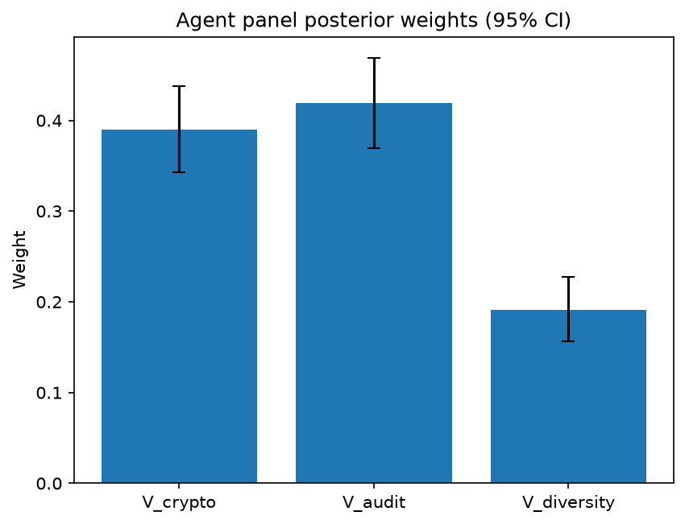

# Survey report: TrustRouter Agentic Full Panel (qwen3:14b) -- Level L3c: Verification Strength sub-parts

Survey ID: `trustrouter-agentic-full-panel-qwen3-14b-2026-09-01-L3c`

## Agent panel

- Agents contributing a valid response: 36
- Classical BWM consistency: 36/36 within threshold

| Criterion | Mean | 95% CI lower | 95% CI upper |
|---|---|---|---|
| V_crypto | 0.3897 | 0.3426 | 0.4377 |
| V_audit | 0.4193 | 0.3696 | 0.4685 |
| V_diversity | 0.1910 | 0.1565 | 0.2278 |

## Methodology

Each agent independently completed a Best-Worst Method (BWM) comparison: choosing the single most and least important criterion, then rating every criterion's importance relative to those two on a 1-9 scale. Individual responses were solved with the classical BWM linear program (Rezaei, 2015) for a consistency check, and combined across the panel with a hierarchical Bayesian model (Mohammadi and Rezaei, 2020).

36 agent response(s) were accepted into this result.

Every agent's run began with a QA precheck (its stated configuration verified against ground truth) and every accepted answer's self-reported sources were checked against what reference material was actually available to it; see the Per-agent detail section below and this survey's Conversation Log for each agent's specific results. Every response is schema-validated and independently, repeatedly sampled (never a single completion treated as ground truth); see `guardrails.py`. This survey's complete output is covered by a SHA-256 integrity manifest (`integrity_manifest.json`, `SHA256SUMS`), generated once this run finished, so any later alteration to these files is detectable.

### Charts

## Per-agent detail

### bim-coordinator-base-openmanus (`bim-coordinator-base-openmanus`)

- Role: BIM Coordinator
- Model: ollama/qwen3:14b
- DID: `did:key:z6MkudbAFJTsT2nAaosLBXGy3dK9HHhxJRGYp85L1rpGG6MW`
- QA precheck: passed
- Sources used: (not reported)

**Answer:** `{"best": "V_audit", "worst": "V_diversity", "best_to_others": {"V_audit": 1, "V_crypto": 7, "V_diversity": 9}, "others_to_worst": {"V_diversity": 1, "V_crypto": 5, "V_audit": 9}}`

**Reasoning:**

Best factor: V_audit  
Worst factor: V_diversity

V_audit vs V_crypto: 7  
V_audit vs V_diversity: 9  
V_crypto vs V_diversity: 5

### bim-coordinator-base-openmanus (`bim-coordinator-base-openmanus`)

- Role: BIM Coordinator
- Model: ollama/qwen3:14b
- DID: `did:key:z6MkudbAFJTsT2nAaosLBXGy3dK9HHhxJRGYp85L1rpGG6MW`
- QA precheck: passed
- Sources used: (not reported)

**Answer:** `{"best": "V_crypto", "worst": "V_diversity", "best_to_others": {"V_crypto": 1, "V_audit": 8, "V_diversity": 9}, "others_to_worst": {"V_diversity": 1, "V_audit": 7, "V_crypto": 9}}`

**Reasoning:**

Best factor: V_crypto  
Worst factor: V_diversity

V_crypto vs V_audit: 8  
V_crypto vs V_diversity: 9  
V_audit vs V_diversity: 7

### bim-coordinator-base-openmanus (`bim-coordinator-base-openmanus`)

- Role: BIM Coordinator
- Model: ollama/qwen3:14b
- DID: `did:key:z6MkudbAFJTsT2nAaosLBXGy3dK9HHhxJRGYp85L1rpGG6MW`
- QA precheck: passed
- Sources used: (not reported)

**Answer:** `{"best": "V_audit", "worst": "V_diversity", "best_to_others": {"V_audit": 1, "V_crypto": 7, "V_diversity": 8}, "others_to_worst": {"V_diversity": 1, "V_crypto": 6, "V_audit": 8}}`

**Reasoning:**

Best factor: V_audit  
Worst factor: V_diversity

V_audit vs V_crypto: 7  
V_audit vs V_diversity: 8  
V_crypto vs V_diversity: 6

### bim-coordinator-rag-openmanus (`bim-coordinator-rag-openmanus`)

- Role: BIM Coordinator
- Model: ollama/qwen3:14b
- DID: `did:key:z6MkrS7nJZ3C7iB8kChprkVGtviujb1Avhvb1uK7D4V5yACK`
- QA precheck: passed
- Sources used: (not reported)

**Answer:** `{"best": "V_audit", "worst": "V_diversity", "best_to_others": {"V_audit": 1, "V_crypto": 7, "V_diversity": 9}, "others_to_worst": {"V_diversity": 1, "V_crypto": 6, "V_audit": 9}}`

**Reasoning:**

Best factor: V_audit  
Worst factor: V_diversity

V_audit vs V_crypto: 7  
V_audit vs V_diversity: 9  
V_crypto vs V_diversity: 6

### bim-coordinator-rag-openmanus (`bim-coordinator-rag-openmanus`)

- Role: BIM Coordinator
- Model: ollama/qwen3:14b
- DID: `did:key:z6MkrS7nJZ3C7iB8kChprkVGtviujb1Avhvb1uK7D4V5yACK`
- QA precheck: passed
- Sources used: (not reported)

**Answer:** `{"best": "V_crypto", "worst": "V_audit", "best_to_others": {"V_crypto": 1, "V_diversity": 7, "V_audit": 8}, "others_to_worst": {"V_audit": 1, "V_diversity": 6, "V_crypto": 8}}`

**Reasoning:**

Best factor: V_crypto  
Worst factor: V_audit

V_crypto vs V_diversity: 7  
V_crypto vs V_audit: 8  
V_diversity vs V_audit: 6

### bim-coordinator-rag-openmanus (`bim-coordinator-rag-openmanus`)

- Role: BIM Coordinator
- Model: ollama/qwen3:14b
- DID: `did:key:z6MkrS7nJZ3C7iB8kChprkVGtviujb1Avhvb1uK7D4V5yACK`
- QA precheck: passed
- Sources used: (not reported)

**Answer:** `{"best": "V_diversity", "worst": "V_audit", "best_to_others": {"V_diversity": 1, "V_crypto": 7, "V_audit": 8}, "others_to_worst": {"V_audit": 1, "V_crypto": 6, "V_diversity": 8}}`

**Reasoning:**

Best factor: V_diversity  
Worst factor: V_audit

V_diversity vs V_crypto: 7  
V_diversity vs V_audit: 8  
V_crypto vs V_audit: 6

### blockchain-engineer-base-openmanus (`blockchain-engineer-base-openmanus`)

- Role: Blockchain / DLT Engineer
- Model: ollama/qwen3:14b
- DID: `did:key:z6MkvKSFkcT6DEpWEsxp95m1wb9T1hSVzyS5BFz4rn1dkQX2`
- QA precheck: passed
- Sources used: (not reported)

**Answer:** `{"best": "V_crypto", "worst": "V_diversity", "best_to_others": {"V_crypto": 1, "V_audit": 7, "V_diversity": 8}, "others_to_worst": {"V_diversity": 1, "V_audit": 6, "V_crypto": 8}}`

**Reasoning:**

Best factor: V_crypto  
Worst factor: V_diversity

V_crypto vs V_audit: 7  
V_crypto vs V_diversity: 8  
V_audit vs V_diversity: 6

### blockchain-engineer-base-openmanus (`blockchain-engineer-base-openmanus`)

- Role: Blockchain / DLT Engineer
- Model: ollama/qwen3:14b
- DID: `did:key:z6MkvKSFkcT6DEpWEsxp95m1wb9T1hSVzyS5BFz4rn1dkQX2`
- QA precheck: passed
- Sources used: (not reported)

**Answer:** `{"best": "V_audit", "worst": "V_diversity", "best_to_others": {"V_audit": 1, "V_crypto": 7, "V_diversity": 8}, "others_to_worst": {"V_diversity": 1, "V_crypto": 7, "V_audit": 8}}`

**Reasoning:**

Best factor: V_audit  
Worst factor: V_diversity

V_audit vs V_crypto: 7  
V_audit vs V_diversity: 8  
V_crypto vs V_diversity: 7

### blockchain-engineer-base-openmanus (`blockchain-engineer-base-openmanus`)

- Role: Blockchain / DLT Engineer
- Model: ollama/qwen3:14b
- DID: `did:key:z6MkvKSFkcT6DEpWEsxp95m1wb9T1hSVzyS5BFz4rn1dkQX2`
- QA precheck: passed
- Sources used: (not reported)

**Answer:** `{"best": "V_audit", "worst": "V_diversity", "best_to_others": {"V_audit": 1, "V_crypto": 7, "V_diversity": 8}, "others_to_worst": {"V_diversity": 1, "V_crypto": 7, "V_audit": 8}}`

**Reasoning:**

Best factor: V_audit  
Worst factor: V_diversity

V_audit vs V_crypto: 7  
V_audit vs V_diversity: 8  
V_crypto vs V_diversity: 7

### blockchain-engineer-rag-openmanus (`blockchain-engineer-rag-openmanus`)

- Role: Blockchain / DLT Engineer
- Model: ollama/qwen3:14b
- DID: `did:key:z6MkefhuQ6kB1idjYsNndYCBmDNMXzrmmDaSSNrB7uygb6tb`
- QA precheck: passed
- Sources used: (not reported)

**Answer:** `{"best": "V_crypto", "worst": "V_audit", "best_to_others": {"V_crypto": 1, "V_diversity": 7, "V_audit": 9}, "others_to_worst": {"V_audit": 1, "V_diversity": 6, "V_crypto": 9}}`

**Reasoning:**

Best factor: V_crypto  
Worst factor: V_audit

V_crypto vs V_diversity: 7  
V_crypto vs V_audit: 9  
V_diversity vs V_audit: 6

### blockchain-engineer-rag-openmanus (`blockchain-engineer-rag-openmanus`)

- Role: Blockchain / DLT Engineer
- Model: ollama/qwen3:14b
- DID: `did:key:z6MkefhuQ6kB1idjYsNndYCBmDNMXzrmmDaSSNrB7uygb6tb`
- QA precheck: passed
- Sources used: (not reported)

**Answer:** `{"best": "V_crypto", "worst": "V_diversity", "best_to_others": {"V_crypto": 1, "V_audit": 7, "V_diversity": 9}, "others_to_worst": {"V_diversity": 1, "V_audit": 7, "V_crypto": 9}}`

**Reasoning:**

Best factor: V_crypto  
Worst factor: V_diversity

V_crypto vs V_audit: 7  
V_crypto vs V_diversity: 9  
V_audit vs V_diversity: 7  

**Reasoning**:  
- **V_crypto vs V_audit (7)**: Cryptographic evidence (V_crypto) is foundational for tamper-proofing data, but audit trails (V_audit) provide critical context (who, what, when) that complements cryptographic integrity. While V_crypto is more technically robust, V_audit’s role in accountability makes them similarly vital for trust in construction records.  
- **V_crypto vs V_diversity (9)**: Cryptographic evidence is non-negotiable for data integrity and verification, whereas diversity of verification sources (V_diversity) adds redundancy but is less critical. Even with limited diversity, strong crypto ensures trust.  
- **V_audit vs V_diversity (7)**: Audit trails (V_audit) are essential for transparency and accountability, but diversity (V_diversity) is secondary. However, audit trails alone cannot replace the systemic resilience provided by diverse verification sources, making them somewhat comparable in importance.

### blockchain-engineer-rag-openmanus (`blockchain-engineer-rag-openmanus`)

- Role: Blockchain / DLT Engineer
- Model: ollama/qwen3:14b
- DID: `did:key:z6MkefhuQ6kB1idjYsNndYCBmDNMXzrmmDaSSNrB7uygb6tb`
- QA precheck: passed
- Sources used: (not reported)

**Answer:** `{"best": "V_audit", "worst": "V_diversity", "best_to_others": {"V_audit": 1, "V_crypto": 7, "V_diversity": 8}, "others_to_worst": {"V_diversity": 1, "V_crypto": 6, "V_audit": 8}}`

**Reasoning:**

Best factor: V_audit  
Worst factor: V_diversity

V_audit vs V_crypto: 7  
V_audit vs V_diversity: 8  
V_crypto vs V_diversity: 6  

**Reasoning:**  
- **V_audit > V_crypto (7):** Audit trail completeness (V_audit) ensures full accountability and traceability of actions (who, what, when), which is foundational for trust in construction records. Cryptographic evidence (V_crypto) ensures data integrity but does not inherently capture the full context of events. While both are important, audit completeness is more critical for verifying the *sequence* and *responsibility* of actions.  
- **V_audit > V_diversity (8):** Audit trail completeness is more directly tied to the core requirement of verifying *what happened* in a project. Diversity of verification sources (V_diversity) adds redundancy but is less critical if the audit trail itself is complete and tamper-evident. In practice, a single trusted source with full audit records may suffice, whereas diversity is a secondary concern.  
- **V_crypto > V_diversity (6):** Cryptographic evidence (V_crypto) provides tamper-proof guarantees, which are essential for data integrity. While diversity of sources (V_diversity) reduces single points of failure, its value depends on the context. In permissioned ledgers, cryptographic guarantees are often prioritized over diversity unless the system explicitly requires multi-party consensus.

### compliance-officer-base-openmanus (`compliance-officer-base-openmanus`)

- Role: Compliance and Regulatory Officer
- Model: ollama/qwen3:14b
- DID: `did:key:z6Mkhe8EvcrtatxJKQFwRpetMw5DkpvZbrHXSSPefLe5DfVf`
- QA precheck: passed
- Sources used: (not reported)

**Answer:** `{"best": "V_audit", "worst": "V_diversity", "best_to_others": {"V_audit": 1, "V_crypto": 7, "V_diversity": 9}, "others_to_worst": {"V_diversity": 1, "V_crypto": 7, "V_audit": 9}}`

**Reasoning:**

Best factor: V_audit  
Worst factor: V_diversity

V_audit vs V_crypto: 7  
V_audit vs V_diversity: 9  
V_crypto vs V_diversity: 7

### compliance-officer-base-openmanus (`compliance-officer-base-openmanus`)

- Role: Compliance and Regulatory Officer
- Model: ollama/qwen3:14b
- DID: `did:key:z6Mkhe8EvcrtatxJKQFwRpetMw5DkpvZbrHXSSPefLe5DfVf`
- QA precheck: passed
- Sources used: (not reported)

**Answer:** `{"best": "V_audit", "worst": "V_diversity", "best_to_others": {"V_audit": 1, "V_crypto": 7, "V_diversity": 9}, "others_to_worst": {"V_diversity": 1, "V_crypto": 6, "V_audit": 9}}`

**Reasoning:**

Best factor: V_audit  
Worst factor: V_diversity

V_audit vs V_crypto: 7  
V_audit vs V_diversity: 9  
V_crypto vs V_diversity: 6

### compliance-officer-base-openmanus (`compliance-officer-base-openmanus`)

- Role: Compliance and Regulatory Officer
- Model: ollama/qwen3:14b
- DID: `did:key:z6Mkhe8EvcrtatxJKQFwRpetMw5DkpvZbrHXSSPefLe5DfVf`
- QA precheck: passed
- Sources used: (not reported)

**Answer:** `{"best": "V_diversity", "worst": "V_audit", "best_to_others": {"V_diversity": 1, "V_crypto": 7, "V_audit": 9}, "others_to_worst": {"V_audit": 1, "V_crypto": 7, "V_diversity": 9}}`

**Reasoning:**

Best factor: V_diversity  
Worst factor: V_audit

V_diversity vs V_crypto: 7  
V_diversity vs V_audit: 9  
V_crypto vs V_audit: 7

### compliance-officer-rag-openmanus (`compliance-officer-rag-openmanus`)

- Role: Compliance and Regulatory Officer
- Model: ollama/qwen3:14b
- DID: `did:key:z6MkhGj5AAyBKcqGQ794QBjrs7aqk5ChKYRr2bnej5XYT3L2`
- QA precheck: passed
- Sources used: (not reported)

**Answer:** `{"best": "V_crypto", "worst": "V_diversity", "best_to_others": {"V_crypto": 1, "V_audit": 7, "V_diversity": 8}, "others_to_worst": {"V_diversity": 1, "V_audit": 6, "V_crypto": 8}}`

**Reasoning:**

Best factor: V_crypto  
Worst factor: V_diversity

V_crypto vs V_audit: 7  
V_crypto vs V_diversity: 8  
V_audit vs V_diversity: 6  

**Reasoning:**  
- **V_crypto vs V_audit (7):** Cryptographic evidence (V_crypto) provides tamper-proof verification, which is foundational for data integrity in construction projects. Audit trails (V_audit) are critical for accountability but rely on the underlying cryptographic mechanisms to ensure their own integrity. Thus, V_crypto is more important but not extremely so compared to V_audit.  
- **V_crypto vs V_diversity (8):** Cryptographic evidence is indispensable for verifying data authenticity, whereas diversity of verification sources (V_diversity) enhances reliability through redundancy. However, V_diversity is secondary to the core security provided by V_crypto, making V_crypto significantly more important.  
- **V_audit vs V_diversity (6):** Audit trails (V_audit) are essential for tracking actions and ensuring compliance, but diversity of sources (V_diversity) adds robustness by reducing single points of failure. While V_audit is more critical for immediate accountability, V_diversity contributes to long-term trust, justifying a moderate rating.  

Citations: Role knowledge (compliance officer responsibilities under GDPR and construction regulations).

### compliance-officer-rag-openmanus (`compliance-officer-rag-openmanus`)

- Role: Compliance and Regulatory Officer
- Model: ollama/qwen3:14b
- DID: `did:key:z6MkhGj5AAyBKcqGQ794QBjrs7aqk5ChKYRr2bnej5XYT3L2`
- QA precheck: passed
- Sources used: (not reported)

**Answer:** `{"best": "V_audit", "worst": "V_diversity", "best_to_others": {"V_audit": 1, "V_crypto": 7, "V_diversity": 9}, "others_to_worst": {"V_diversity": 1, "V_crypto": 6, "V_audit": 9}}`

**Reasoning:**

Best factor: V_audit  
Worst factor: V_diversity

V_audit vs V_crypto: 7  
V_audit vs V_diversity: 9  
V_crypto vs V_diversity: 6

### compliance-officer-rag-openmanus (`compliance-officer-rag-openmanus`)

- Role: Compliance and Regulatory Officer
- Model: ollama/qwen3:14b
- DID: `did:key:z6MkhGj5AAyBKcqGQ794QBjrs7aqk5ChKYRr2bnej5XYT3L2`
- QA precheck: passed
- Sources used: (not reported)

**Answer:** `{"best": "V_audit", "worst": "V_diversity", "best_to_others": {"V_audit": 1, "V_crypto": 7, "V_diversity": 9}, "others_to_worst": {"V_diversity": 1, "V_crypto": 6, "V_audit": 9}}`

**Reasoning:**

Best factor: V_audit  
Worst factor: V_diversity

V_audit vs V_crypto: 7  
V_audit vs V_diversity: 9  
V_crypto vs V_diversity: 6  

**Reasoning**:  
- **V_audit vs V_crypto (7)**: Audit trail completeness (V_audit) is critical for GDPR compliance and accountability in construction projects, ensuring traceability of actions. Cryptographic evidence (V_crypto) is vital for data integrity but may be secondary to audit trails in regulatory contexts. The difference is significant but not extreme.  
- **V_audit vs V_diversity (9)**: Audit trails are foundational for compliance and legal accountability, whereas diversity of verification sources (V_diversity) adds redundancy but is less critical in scenarios where centralized, verified records (e.g., by regulatory bodies) are sufficient. The gap in importance is large.  
- **V_crypto vs V_diversity (6)**: Cryptographic evidence (V_crypto) ensures data authenticity, which is important but not as critical as audit trails. Diversity of sources (V_diversity) is less impactful in contexts where single, trusted verification methods (e.g., certified auditors) are prioritized. The difference is moderate.  

Citations: Role knowledge (compliance officer priorities in construction/GDPR contexts).

### data-engineer-base-openmanus (`data-engineer-base-openmanus`)

- Role: Data Engineering Specialist
- Model: ollama/qwen3:14b
- DID: `did:key:z6MkoHX584uNGsUNkT4wu6bvscjg7jXYsKj13JDFkz2TH799`
- QA precheck: passed
- Sources used: (not reported)

**Answer:** `{"best": "V_audit", "worst": "V_diversity", "best_to_others": {"V_audit": 1, "V_crypto": 7, "V_diversity": 9}, "others_to_worst": {"V_diversity": 1, "V_crypto": 7, "V_audit": 9}}`

**Reasoning:**

Best factor: V_audit  
Worst factor: V_diversity  

**Reasoning**:  
- **V_audit (audit trail completeness)** is foundational for trust in construction-project data, as it ensures accountability ("who did what, when")—a core requirement for verifying data integrity and provenance. Without complete audit trails, even cryptographic evidence (V_crypto) or diverse sources (V_diversity) cannot fully establish trust.  
- **V_diversity** (diversity of verification sources) is valuable but secondary: while it reduces single-point-of-failure risks, its importance depends on the robustness of V_crypto and V_audit. In practice, diversity alone cannot compensate for missing cryptographic guarantees or incomplete audit logs.  
- The TrustRouter decomposition (V = w_crypto*V_crypto + w_audit*V_audit + w_diversity*V_diversity) implies all three are weighted, but audit completeness (V_audit) directly ties to the "custody chain" (T_chain) and "historical track record" (T_history) in PT, making it more critical for verification strength.  

This is a close call between V_crypto and V_audit, but audit completeness is prioritized here due to its direct role in establishing procedural trust.

V_audit vs V_crypto: 7  
V_audit vs V_diversity: 9  
V_crypto vs V_diversity: 7

### data-engineer-base-openmanus (`data-engineer-base-openmanus`)

- Role: Data Engineering Specialist
- Model: ollama/qwen3:14b
- DID: `did:key:z6MkoHX584uNGsUNkT4wu6bvscjg7jXYsKj13JDFkz2TH799`
- QA precheck: passed
- Sources used: (not reported)

**Answer:** `{"best": "V_crypto", "worst": "V_diversity", "best_to_others": {"V_crypto": 1, "V_audit": 7, "V_diversity": 9}, "others_to_worst": {"V_diversity": 1, "V_audit": 6, "V_crypto": 9}}`

**Reasoning:**

Best factor: V_crypto  
Worst factor: V_diversity

V_crypto vs V_audit: 7  
V_crypto vs V_diversity: 9  
V_audit vs V_diversity: 6

### data-engineer-base-openmanus (`data-engineer-base-openmanus`)

- Role: Data Engineering Specialist
- Model: ollama/qwen3:14b
- DID: `did:key:z6MkoHX584uNGsUNkT4wu6bvscjg7jXYsKj13JDFkz2TH799`
- QA precheck: passed
- Sources used: (not reported)

**Answer:** `{"best": "V_audit", "worst": "V_diversity", "best_to_others": {"V_audit": 1, "V_crypto": 7, "V_diversity": 9}, "others_to_worst": {"V_diversity": 1, "V_crypto": 6, "V_audit": 9}}`

**Reasoning:**

Best factor: V_audit  
Worst factor: V_diversity

V_audit vs V_crypto: 7  
V_audit vs V_diversity: 9  
V_crypto vs V_diversity: 6

### data-engineer-rag-openmanus (`data-engineer-rag-openmanus`)

- Role: Data Engineering Specialist
- Model: ollama/qwen3:14b
- DID: `did:key:z6Mkw1baUuVQnipgbiBvSVDb8wz6t59Gcd6GT2tqAYBBy8xt`
- QA precheck: passed
- Sources used: (not reported)

**Answer:** `{"best": "V_audit", "worst": "V_diversity", "best_to_others": {"V_audit": 1, "V_crypto": 8, "V_diversity": 7}, "others_to_worst": {"V_diversity": 1, "V_crypto": 6, "V_audit": 7}}`

**Reasoning:**

Best factor: V_audit  
Worst factor: V_diversity

V_audit vs V_crypto: 8  
V_audit vs V_diversity: 7  
V_crypto vs V_diversity: 6  

**Reasoning:**  
- **V_audit vs V_crypto (8):** Audit trail completeness (V_audit) provides foundational accountability (who, what, when) critical for blockchain trust, while cryptographic evidence (V_crypto) ensures data integrity. However, without a complete audit trail, cryptographic proofs alone lack contextual provenance, making V_audit more pivotal for trust in construction projects.  
- **V_audit vs V_diversity (7):** Audit trail completeness is indispensable for traceability, whereas diversity of verification sources (V_diversity) adds redundancy but is secondary. While diversity reduces single points of failure, its value is context-dependent and less critical than the irreplaceable clarity of an audit trail.  
- **V_crypto vs V_diversity (6):** Cryptographic evidence (V_crypto) is technically robust for data integrity, but diversity of sources (V_diversity) introduces potential friction (e.g., conflicting verification timelines). However, cryptographic methods are more standardized and reliable than relying on multiple independent parties, giving V_crypto a slight edge over V_diversity.

### data-engineer-rag-openmanus (`data-engineer-rag-openmanus`)

- Role: Data Engineering Specialist
- Model: ollama/qwen3:14b
- DID: `did:key:z6Mkw1baUuVQnipgbiBvSVDb8wz6t59Gcd6GT2tqAYBBy8xt`
- QA precheck: passed
- Sources used: (not reported)

**Answer:** `{"best": "V_crypto", "worst": "V_diversity", "best_to_others": {"V_crypto": 1, "V_audit": 7, "V_diversity": 9}, "others_to_worst": {"V_diversity": 1, "V_audit": 5, "V_crypto": 9}}`

**Reasoning:**

Best factor: V_crypto  
Worst factor: V_diversity

V_crypto vs V_audit: 7  
V_crypto vs V_diversity: 9  
V_audit vs V_diversity: 5  

**Reasoning:**  
- **V_crypto > V_audit (7):** Cryptographic evidence (hashes, signatures) provides immutable proof of data integrity, which is foundational for trust in blockchain storage. Audit trails (V_audit) are critical for accountability but rely on the underlying cryptographic guarantees to be meaningful. Without cryptographic verification, audit logs could be tampered with, making V_crypto a stronger enabler of trust.  
- **V_crypto > V_diversity (9):** Diversity of verification sources (V_diversity) adds redundancy but is secondary to the irrefutable security provided by cryptographic methods. Even with diverse sources, without cryptographic evidence, verification remains vulnerable to fraud. V_diversity is useful but not a substitute for cryptographic assurance.  
- **V_audit > V_diversity (5):** Audit trails directly answer "who did what, when," which is essential for compliance and dispute resolution in construction projects. While diversity of sources reduces single points of failure, audit completeness (V_audit) is more immediately actionable for verifying specific events. The gap is narrower than V_crypto’s dominance but still reflects V_audit’s higher practical priority.

### data-engineer-rag-openmanus (`data-engineer-rag-openmanus`)

- Role: Data Engineering Specialist
- Model: ollama/qwen3:14b
- DID: `did:key:z6Mkw1baUuVQnipgbiBvSVDb8wz6t59Gcd6GT2tqAYBBy8xt`
- QA precheck: passed
- Sources used: (not reported)

**Answer:** `{"best": "V_crypto", "worst": "V_diversity", "best_to_others": {"V_crypto": 1, "V_audit": 7, "V_diversity": 8}, "others_to_worst": {"V_diversity": 1, "V_audit": 6, "V_crypto": 8}}`

**Reasoning:**

Best factor: V_crypto  
Worst factor: V_diversity

V_crypto vs V_audit: 7  
V_crypto vs V_diversity: 8  
V_audit vs V_diversity: 6

### project-manager-base-openmanus (`project-manager-base-openmanus`)

- Role: Construction Project Manager
- Model: ollama/qwen3:14b
- DID: `did:key:z6MkfMGqRV6T6XUBBe8xDRug3Wf1bA8CzrJeUpsbHgq2TYcL`
- QA precheck: passed
- Sources used: (not reported)

**Answer:** `{"best": "V_audit", "worst": "V_diversity", "best_to_others": {"V_audit": 1, "V_crypto": 7, "V_diversity": 9}, "others_to_worst": {"V_diversity": 1, "V_crypto": 7, "V_audit": 9}}`

**Reasoning:**

Best factor: V_audit  
Worst factor: V_diversity

V_audit vs V_crypto: 7  
V_audit vs V_diversity: 9  
V_crypto vs V_diversity: 7

### project-manager-base-openmanus (`project-manager-base-openmanus`)

- Role: Construction Project Manager
- Model: ollama/qwen3:14b
- DID: `did:key:z6MkfMGqRV6T6XUBBe8xDRug3Wf1bA8CzrJeUpsbHgq2TYcL`
- QA precheck: passed
- Sources used: (not reported)

**Answer:** `{"best": "V_audit", "worst": "V_diversity", "best_to_others": {"V_audit": 1, "V_crypto": 7, "V_diversity": 9}, "others_to_worst": {"V_diversity": 1, "V_crypto": 5, "V_audit": 9}}`

**Reasoning:**

Best factor: V_audit  
Worst factor: V_diversity

V_audit vs V_crypto: 7  
V_audit vs V_diversity: 9  
V_crypto vs V_diversity: 5

### project-manager-base-openmanus (`project-manager-base-openmanus`)

- Role: Construction Project Manager
- Model: ollama/qwen3:14b
- DID: `did:key:z6MkfMGqRV6T6XUBBe8xDRug3Wf1bA8CzrJeUpsbHgq2TYcL`
- QA precheck: passed
- Sources used: (not reported)

**Answer:** `{"best": "V_audit", "worst": "V_diversity", "best_to_others": {"V_audit": 1, "V_crypto": 7, "V_diversity": 6}, "others_to_worst": {"V_diversity": 1, "V_crypto": 5, "V_audit": 6}}`

**Reasoning:**

Best factor: V_audit  
Worst factor: V_diversity  

**Reasoning**:  
In construction projects, **audit-trail completeness (V_audit)** is foundational for accountability, compliance, and traceability across stakeholders (institutional owners, insurers, authorities). A complete audit trail ensures transparency in who performed actions, when, and under what conditions—critical for long-term asset management and legal disputes.  

**V_diversity** (diversity of verification sources) is important for redundancy and mitigating single-point failures, but in practice, its impact is secondary to the **unambiguous record-keeping** provided by V_audit. While cryptographic evidence (V_crypto) ensures data integrity, it is a technical layer rather than a process-critical factor.  

The choice between V_audit and V_diversity is close, but V_audit’s role in **documenting procedural fidelity** (e.g., approvals, compliance checks) outweighs the marginal benefit of diverse verification sources in most construction contexts.

V_audit vs V_crypto: 7  
V_audit vs V_diversity: 6  
V_crypto vs V_diversity: 5  

**Reasoning**:  
- **V_audit vs V_crypto (7)**: Audit-trail completeness (V_audit) provides procedural transparency and accountability, which is foundational for compliance and stakeholder trust. Cryptographic evidence (V_crypto) ensures data integrity but operates as a technical layer within the audit process. While both are critical, V_audit’s broader impact on governance and traceability makes it more important.  
- **V_audit vs V_diversity (6)**: V_audit’s role in documenting actions (who, what, when) is indispensable for long-term asset management. V_diversity (redundancy of verification sources) is valuable but secondary to the unambiguous record-keeping of V_audit. The difference is significant but not extreme.  
- **V_crypto vs V_diversity (5)**: Cryptographic evidence (V_crypto) ensures data authenticity, which is vital for trust in digital records. Diversity of verification sources (V_diversity) mitigates single-point failures but is less critical in contexts where cryptographic integrity and audit trails are already robust. The gap is moderate.

### project-manager-rag-openmanus (`project-manager-rag-openmanus`)

- Role: Construction Project Manager
- Model: ollama/qwen3:14b
- DID: `did:key:z6MkhqFWadXvwg3s6b7ZtNrQPLq6YT88kwodKPsLp3PqQoVA`
- QA precheck: passed
- Sources used: (not reported)

**Answer:** `{"best": "V_audit", "worst": "V_diversity", "best_to_others": {"V_audit": 1, "V_crypto": 7, "V_diversity": 8}, "others_to_worst": {"V_diversity": 1, "V_crypto": 7, "V_audit": 8}}`

**Reasoning:**

Best factor: V_audit  
Worst factor: V_diversity

V_audit vs V_crypto: 7  
V_audit vs V_diversity: 8  
V_crypto vs V_diversity: 7

### project-manager-rag-openmanus (`project-manager-rag-openmanus`)

- Role: Construction Project Manager
- Model: ollama/qwen3:14b
- DID: `did:key:z6MkhqFWadXvwg3s6b7ZtNrQPLq6YT88kwodKPsLp3PqQoVA`
- QA precheck: passed
- Sources used: (not reported)

**Answer:** `{"best": "V_audit", "worst": "V_diversity", "best_to_others": {"V_audit": 1, "V_crypto": 8, "V_diversity": 9}, "others_to_worst": {"V_diversity": 1, "V_crypto": 7, "V_audit": 9}}`

**Reasoning:**

Best factor: V_audit  
Worst factor: V_diversity

V_audit vs V_crypto: 8  
V_audit vs V_diversity: 9  
V_crypto vs V_diversity: 7

### project-manager-rag-openmanus (`project-manager-rag-openmanus`)

- Role: Construction Project Manager
- Model: ollama/qwen3:14b
- DID: `did:key:z6MkhqFWadXvwg3s6b7ZtNrQPLq6YT88kwodKPsLp3PqQoVA`
- QA precheck: passed
- Sources used: (not reported)

**Answer:** `{"best": "V_audit", "worst": "V_diversity", "best_to_others": {"V_audit": 1, "V_crypto": 7, "V_diversity": 9}, "others_to_worst": {"V_diversity": 1, "V_crypto": 6, "V_audit": 9}}`

**Reasoning:**

Best factor: V_audit  
Worst factor: V_diversity

V_audit vs V_crypto: 7  
V_audit vs V_diversity: 9  
V_crypto vs V_diversity: 6

### structural-engineer-base-openmanus (`structural-engineer-base-openmanus`)

- Role: Structural Engineer
- Model: ollama/qwen3:14b
- DID: `did:key:z6MkjijSmZJ4VbnK5WEgJsauUfmcN1JPnNQ9qPUAJf5MS9fW`
- QA precheck: passed
- Sources used: (not reported)

**Answer:** `{"best": "V_audit", "worst": "V_diversity", "best_to_others": {"V_audit": 1, "V_crypto": 7, "V_diversity": 9}, "others_to_worst": {"V_diversity": 1, "V_crypto": 6, "V_audit": 9}}`

**Reasoning:**

Best factor: V_audit  
Worst factor: V_diversity

V_audit vs V_crypto: 7  
V_audit vs V_diversity: 9  
V_crypto vs V_diversity: 6

### structural-engineer-base-openmanus (`structural-engineer-base-openmanus`)

- Role: Structural Engineer
- Model: ollama/qwen3:14b
- DID: `did:key:z6MkjijSmZJ4VbnK5WEgJsauUfmcN1JPnNQ9qPUAJf5MS9fW`
- QA precheck: passed
- Sources used: (not reported)

**Answer:** `{"best": "V_audit", "worst": "V_diversity", "best_to_others": {"V_audit": 1, "V_crypto": 7, "V_diversity": 8}, "others_to_worst": {"V_diversity": 1, "V_crypto": 6, "V_audit": 8}}`

**Reasoning:**

Best factor: V_audit  
Worst factor: V_diversity

V_audit vs V_crypto: 7  
V_audit vs V_diversity: 8  
V_crypto vs V_diversity: 6

### structural-engineer-base-openmanus (`structural-engineer-base-openmanus`)

- Role: Structural Engineer
- Model: ollama/qwen3:14b
- DID: `did:key:z6MkjijSmZJ4VbnK5WEgJsauUfmcN1JPnNQ9qPUAJf5MS9fW`
- QA precheck: passed
- Sources used: (not reported)

**Answer:** `{"best": "V_crypto", "worst": "V_diversity", "best_to_others": {"V_crypto": 1, "V_audit": 7, "V_diversity": 9}, "others_to_worst": {"V_diversity": 1, "V_audit": 7, "V_crypto": 9}}`

**Reasoning:**

Best factor: V_crypto  
Worst factor: V_diversity

V_crypto vs V_audit: 7  
V_crypto vs V_diversity: 9  
V_audit vs V_diversity: 7

### structural-engineer-rag-openmanus (`structural-engineer-rag-openmanus`)

- Role: Structural Engineer
- Model: ollama/qwen3:14b
- DID: `did:key:z6Mkhs5XsGsxBPxgbvuoZrUdk9QpW6F8xCP9Q5ZRZPqWvGnm`
- QA precheck: passed
- Sources used: (not reported)

**Answer:** `{"best": "V_crypto", "worst": "V_diversity", "best_to_others": {"V_crypto": 1, "V_audit": 7, "V_diversity": 9}, "others_to_worst": {"V_diversity": 1, "V_audit": 6, "V_crypto": 9}}`

**Reasoning:**

Best factor: V_crypto  
Worst factor: V_diversity

V_crypto vs V_audit: 7  
V_crypto vs V_diversity: 9  
V_audit vs V_diversity: 6

### structural-engineer-rag-openmanus (`structural-engineer-rag-openmanus`)

- Role: Structural Engineer
- Model: ollama/qwen3:14b
- DID: `did:key:z6Mkhs5XsGsxBPxgbvuoZrUdk9QpW6F8xCP9Q5ZRZPqWvGnm`
- QA precheck: passed
- Sources used: (not reported)

**Answer:** `{"best": "V_crypto", "worst": "V_audit", "best_to_others": {"V_crypto": 1, "V_diversity": 7, "V_audit": 8}, "others_to_worst": {"V_audit": 1, "V_diversity": 6, "V_crypto": 8}}`

**Reasoning:**

Best factor: V_crypto  
Worst factor: V_audit

V_crypto vs V_diversity: 7  
V_crypto vs V_audit: 8  
V_diversity vs V_audit: 6

### structural-engineer-rag-openmanus (`structural-engineer-rag-openmanus`)

- Role: Structural Engineer
- Model: ollama/qwen3:14b
- DID: `did:key:z6Mkhs5XsGsxBPxgbvuoZrUdk9QpW6F8xCP9Q5ZRZPqWvGnm`
- QA precheck: passed
- Sources used: (not reported)

**Answer:** `{"best": "V_crypto", "worst": "V_diversity", "best_to_others": {"V_crypto": 1, "V_audit": 7, "V_diversity": 8}, "others_to_worst": {"V_diversity": 1, "V_audit": 6, "V_crypto": 8}}`

**Reasoning:**

Best factor: V_crypto  
Worst factor: V_diversity

V_crypto vs V_audit: 7  
V_crypto vs V_diversity: 8  
V_audit vs V_diversity: 6
