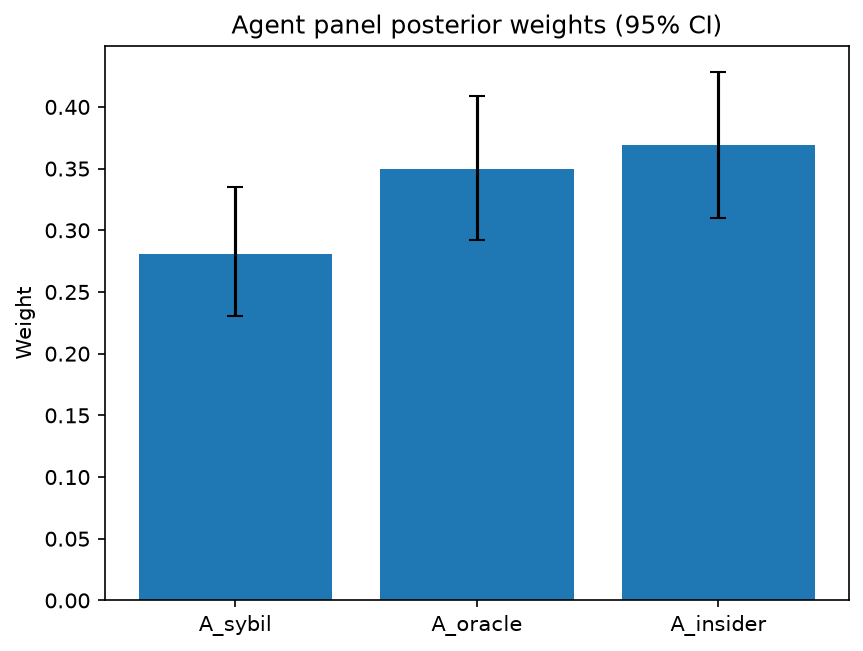

# Survey report: TrustRouter Agentic Full Panel (qwen3:14b) -- Level L3d: Attack Resistance sub-parts

Survey ID: `trustrouter-agentic-full-panel-qwen3-14b-2026-09-01-L3d`

## Agent panel

- Agents contributing a valid response: 36
- Classical BWM consistency: 36/36 within threshold

| Criterion | Mean | 95% CI lower | 95% CI upper |
|---|---|---|---|
| A_sybil | 0.2811 | 0.2302 | 0.3354 |
| A_oracle | 0.3494 | 0.2925 | 0.4086 |
| A_insider | 0.3694 | 0.3097 | 0.4280 |

## Methodology

Each agent independently completed a Best-Worst Method (BWM) comparison: choosing the single most and least important criterion, then rating every criterion's importance relative to those two on a 1-9 scale. Individual responses were solved with the classical BWM linear program (Rezaei, 2015) for a consistency check, and combined across the panel with a hierarchical Bayesian model (Mohammadi and Rezaei, 2020).

36 agent response(s) were accepted into this result.

Every agent's run began with a QA precheck (its stated configuration verified against ground truth) and every accepted answer's self-reported sources were checked against what reference material was actually available to it; see the Per-agent detail section below and this survey's Conversation Log for each agent's specific results. Every response is schema-validated and independently, repeatedly sampled (never a single completion treated as ground truth); see `guardrails.py`. This survey's complete output is covered by a SHA-256 integrity manifest (`integrity_manifest.json`, `SHA256SUMS`), generated once this run finished, so any later alteration to these files is detectable.

### Charts

## Per-agent detail

### bim-coordinator-base-openmanus (`bim-coordinator-base-openmanus`)

- Role: BIM Coordinator
- Model: ollama/qwen3:14b
- DID: `did:key:z6MkudbAFJTsT2nAaosLBXGy3dK9HHhxJRGYp85L1rpGG6MW`
- QA precheck: passed
- Sources used: (not reported)

**Answer:** `{"best": "A_insider", "worst": "A_oracle", "best_to_others": {"A_insider": 1, "A_sybil": 7, "A_oracle": 9}, "others_to_worst": {"A_oracle": 1, "A_sybil": 6, "A_insider": 9}}`

**Reasoning:**

Best factor: A_insider  
Worst factor: A_oracle

A_insider vs A_sybil: 7  
A_insider vs A_oracle: 9  
A_sybil vs A_oracle: 6

### bim-coordinator-base-openmanus (`bim-coordinator-base-openmanus`)

- Role: BIM Coordinator
- Model: ollama/qwen3:14b
- DID: `did:key:z6MkudbAFJTsT2nAaosLBXGy3dK9HHhxJRGYp85L1rpGG6MW`
- QA precheck: passed
- Sources used: (not reported)

**Answer:** `{"best": "A_insider", "worst": "A_sybil", "best_to_others": {"A_insider": 1, "A_oracle": 7, "A_sybil": 9}, "others_to_worst": {"A_sybil": 1, "A_oracle": 7, "A_insider": 9}}`

**Reasoning:**

Best factor: A_insider  
Worst factor: A_sybil

A_insider vs A_oracle: 7  
A_insider vs A_sybil: 9  
A_oracle vs A_sybil: 7

### bim-coordinator-base-openmanus (`bim-coordinator-base-openmanus`)

- Role: BIM Coordinator
- Model: ollama/qwen3:14b
- DID: `did:key:z6MkudbAFJTsT2nAaosLBXGy3dK9HHhxJRGYp85L1rpGG6MW`
- QA precheck: passed
- Sources used: (not reported)

**Answer:** `{"best": "A_insider", "worst": "A_sybil", "best_to_others": {"A_insider": 1, "A_oracle": 7, "A_sybil": 9}, "others_to_worst": {"A_sybil": 1, "A_oracle": 5, "A_insider": 9}}`

**Reasoning:**

Best factor: A_insider  
Worst factor: A_sybil

A_insider vs A_oracle: 7  
A_insider vs A_sybil: 9  
A_oracle vs A_sybil: 5

### bim-coordinator-rag-openmanus (`bim-coordinator-rag-openmanus`)

- Role: BIM Coordinator
- Model: ollama/qwen3:14b
- DID: `did:key:z6MkrS7nJZ3C7iB8kChprkVGtviujb1Avhvb1uK7D4V5yACK`
- QA precheck: passed
- Sources used: (not reported)

**Answer:** `{"best": "A_sybil", "worst": "A_oracle", "best_to_others": {"A_sybil": 1, "A_insider": 7, "A_oracle": 9}, "others_to_worst": {"A_oracle": 1, "A_insider": 6, "A_sybil": 9}}`

**Reasoning:**

Best factor: A_sybil  
Worst factor: A_oracle

A_sybil vs A_insider: 7  
A_sybil vs A_oracle: 9  
A_insider vs A_oracle: 6  

**Reasoning:**  
- **A_sybil (Sybil resistance)** is critical for ensuring only legitimate stakeholders (e.g., contractors, owners) can participate in the blockchain, preventing manipulation by fake identities. This directly impacts trust in the network’s integrity, making it a foundational factor.  
- **A_insider (Insider resistance)** addresses risks from authorized users (e.g., employees, subcontractors) who might exploit their access. While important, it is a secondary layer of defense compared to Sybil, which prevents unauthorized entry entirely.  
- **A_oracle (Oracle resistance)** deals with tampering of external data sources (e.g., sensors, IoT devices). While critical for data integrity, its impact is often mitigated by redundant systems or verification protocols, making it less urgent than Sybil or Insider risks in the context of construction-project record trust.  

The ratings reflect the hierarchy: Sybil > Insider > Oracle, with Sybil being most critical (9) and Oracle least (6).

### bim-coordinator-rag-openmanus (`bim-coordinator-rag-openmanus`)

- Role: BIM Coordinator
- Model: ollama/qwen3:14b
- DID: `did:key:z6MkrS7nJZ3C7iB8kChprkVGtviujb1Avhvb1uK7D4V5yACK`
- QA precheck: passed
- Sources used: (not reported)

**Answer:** `{"best": "A_sybil", "worst": "A_insider", "best_to_others": {"A_sybil": 1, "A_oracle": 7, "A_insider": 9}, "others_to_worst": {"A_insider": 1, "A_oracle": 6, "A_sybil": 9}}`

**Reasoning:**

Best factor: A_sybil  
Worst factor: A_insider

A_sybil vs A_oracle: 7  
A_sybil vs A_insider: 9  
A_oracle vs A_insider: 6  

**Reasoning:**  
- **A_sybil (Sybil resistance)** is critical for blockchain systems in construction projects, as fake identities could compromise trust in the network. This directly impacts data integrity and consensus mechanisms, making it a high-priority factor.  
- **A_insider (Insider resistance)** is the worst because insider threats (e.g., authorized users tampering with data) are harder to detect and can cause severe, localized damage to project records. While important, the systemic risk is lower compared to Sybil attacks, which undermine the entire network.  
- **A_oracle (Oracle resistance)** is moderately important. Ensuring sensor/device data integrity is vital for accurate construction records, but its impact is less systemic than Sybil resistance and less directly tied to trust in the network compared to insider threats. The 6 reflects that Oracle resistance is more important than Insider resistance but less so than Sybil resistance.

### bim-coordinator-rag-openmanus (`bim-coordinator-rag-openmanus`)

- Role: BIM Coordinator
- Model: ollama/qwen3:14b
- DID: `did:key:z6MkrS7nJZ3C7iB8kChprkVGtviujb1Avhvb1uK7D4V5yACK`
- QA precheck: passed
- Sources used: (not reported)

**Answer:** `{"best": "A_sybil", "worst": "A_oracle", "best_to_others": {"A_sybil": 1, "A_insider": 7, "A_oracle": 9}, "others_to_worst": {"A_oracle": 1, "A_insider": 7, "A_sybil": 9}}`

**Reasoning:**

Best factor: A_sybil  
Worst factor: A_oracle

A_sybil vs A_insider: 7  
A_sybil vs A_oracle: 9  
A_insider vs A_oracle: 7  

**Reasoning:**  
- **A_sybil vs A_insider (7):** Both are critical for trust in blockchain systems. Sybil resistance (preventing fake identities) is foundational to network integrity, while insider resistance addresses malicious actions by legitimate actors. However, insider threats are harder to detect and mitigate due to access privileges, making them nearly as critical. The difference is not extreme, hence a mid-range rating.  
- **A_sybil vs A_oracle (9):** Sybil resistance is far more critical than oracle resistance. A Sybil attack could compromise the entire network’s trust, whereas oracle tampering (sensor/device manipulation) affects data accuracy but is often addressed through technical safeguards. The gap in importance is significant.  
- **A_insider vs A_oracle (7):** Insider threats are more severe than oracle tampering because insiders can exploit privileged access to cause systemic harm. However, oracle tampering can still lead to critical data corruption, making the difference moderate.

### blockchain-engineer-base-openmanus (`blockchain-engineer-base-openmanus`)

- Role: Blockchain / DLT Engineer
- Model: ollama/qwen3:14b
- DID: `did:key:z6MkvKSFkcT6DEpWEsxp95m1wb9T1hSVzyS5BFz4rn1dkQX2`
- QA precheck: passed
- Sources used: (not reported)

**Answer:** `{"best": "A_sybil", "worst": "A_insider", "best_to_others": {"A_sybil": 1, "A_oracle": 7, "A_insider": 8}, "others_to_worst": {"A_insider": 1, "A_oracle": 6, "A_sybil": 8}}`

**Reasoning:**

Best factor: A_sybil  
Worst factor: A_insider

A_sybil vs A_oracle: 7  
A_sybil vs A_insider: 8  
A_oracle vs A_insider: 6

### blockchain-engineer-base-openmanus (`blockchain-engineer-base-openmanus`)

- Role: Blockchain / DLT Engineer
- Model: ollama/qwen3:14b
- DID: `did:key:z6MkvKSFkcT6DEpWEsxp95m1wb9T1hSVzyS5BFz4rn1dkQX2`
- QA precheck: passed
- Sources used: (not reported)

**Answer:** `{"best": "A_sybil", "worst": "A_insider", "best_to_others": {"A_sybil": 1, "A_oracle": 7, "A_insider": 8}, "others_to_worst": {"A_insider": 1, "A_oracle": 6, "A_sybil": 8}}`

**Reasoning:**

Best factor: A_sybil  
Worst factor: A_insider

A_sybil vs A_oracle: 7  
A_sybil vs A_insider: 8  
A_oracle vs A_insider: 6

### blockchain-engineer-base-openmanus (`blockchain-engineer-base-openmanus`)

- Role: Blockchain / DLT Engineer
- Model: ollama/qwen3:14b
- DID: `did:key:z6MkvKSFkcT6DEpWEsxp95m1wb9T1hSVzyS5BFz4rn1dkQX2`
- QA precheck: passed
- Sources used: (not reported)

**Answer:** `{"best": "A_oracle", "worst": "A_sybil", "best_to_others": {"A_oracle": 1, "A_insider": 7, "A_sybil": 9}, "others_to_worst": {"A_sybil": 1, "A_insider": 6, "A_oracle": 9}}`

**Reasoning:**

Best factor: A_oracle  
Worst factor: A_sybil

A_oracle vs A_insider: 7  
A_oracle vs A_sybil: 9  
A_insider vs A_sybil: 6

### blockchain-engineer-rag-openmanus (`blockchain-engineer-rag-openmanus`)

- Role: Blockchain / DLT Engineer
- Model: ollama/qwen3:14b
- DID: `did:key:z6MkefhuQ6kB1idjYsNndYCBmDNMXzrmmDaSSNrB7uygb6tb`
- QA precheck: passed
- Sources used: (not reported)

**Answer:** `{"best": "A_sybil", "worst": "A_insider", "best_to_others": {"A_sybil": 1, "A_oracle": 7, "A_insider": 9}, "others_to_worst": {"A_insider": 1, "A_oracle": 3, "A_sybil": 9}}`

**Reasoning:**

Best factor: A_sybil  
Worst factor: A_insider

A_sybil vs A_oracle: 7  
A_sybil vs A_insider: 9  
A_oracle vs A_insider: 3  

**Reasoning:**  
- **A_sybil vs A_oracle (7):** Sybil resistance is critical in permissioned ledgers to prevent fake identities from disrupting consensus, but oracle tampering (external data integrity) is also vital. However, Sybil attacks can scale more broadly, making them slightly more important.  
- **A_sybil vs A_insider (9):** Sybil resistance is far more critical than insider resistance because Sybil attacks can compromise the entire network’s structure, whereas insider threats, while severe, are often mitigated through access controls and monitoring.  
- **A_oracle vs A_insider (3):** Oracle tampering is less critical than insider threats. Insiders have legitimate access and can cause deeper, harder-to-detect damage, making insider resistance significantly more important.

### blockchain-engineer-rag-openmanus (`blockchain-engineer-rag-openmanus`)

- Role: Blockchain / DLT Engineer
- Model: ollama/qwen3:14b
- DID: `did:key:z6MkefhuQ6kB1idjYsNndYCBmDNMXzrmmDaSSNrB7uygb6tb`
- QA precheck: passed
- Sources used: (not reported)

**Answer:** `{"best": "A_sybil", "worst": "A_insider", "best_to_others": {"A_sybil": 1, "A_oracle": 7, "A_insider": 8}, "others_to_worst": {"A_insider": 1, "A_oracle": 6, "A_sybil": 8}}`

**Reasoning:**

Best factor: A_sybil  
Worst factor: A_insider

A_sybil vs A_oracle: 7  
A_sybil vs A_insider: 8  
A_oracle vs A_insider: 6  

**Reasoning:**  
- **A_sybil > A_oracle (7):** Sybil resistance is foundational to preventing network infiltration by fake identities, which directly undermines trust in permissioned ledgers. Oracle tampering (A_oracle) is critical but often mitigated via cryptographic proofs or third-party validation, making it slightly less urgent than Sybil attacks, which can compromise consensus mechanisms.  
- **A_sybil > A_insider (8):** Sybil attacks pose a broader systemic risk by enabling coordinated malicious behavior at scale, whereas insider threats (A_insider) are localized to legitimate actors. While insider risks are severe, Sybil attacks can subvert the entire network's integrity, making them more critical.  
- **A_oracle > A_insider (6):** Oracle tampering (A_oracle) affects data integrity for external dependencies (e.g., IoT sensors), which is vital for smart contracts. Insider threats (A_insider) are harder to detect but often addressed via access controls. Oracle risks are more technical and systemic in nature, giving them a slight edge over insider risks.

### blockchain-engineer-rag-openmanus (`blockchain-engineer-rag-openmanus`)

- Role: Blockchain / DLT Engineer
- Model: ollama/qwen3:14b
- DID: `did:key:z6MkefhuQ6kB1idjYsNndYCBmDNMXzrmmDaSSNrB7uygb6tb`
- QA precheck: passed
- Sources used: (not reported)

**Answer:** `{"best": "A_sybil", "worst": "A_insider", "best_to_others": {"A_sybil": 1, "A_oracle": 7, "A_insider": 9}, "others_to_worst": {"A_insider": 1, "A_oracle": 6, "A_sybil": 9}}`

**Reasoning:**

Best factor: A_sybil  
Worst factor: A_insider

A_sybil vs A_oracle: 7  
A_sybil vs A_insider: 9  
A_oracle vs A_insider: 6

### compliance-officer-base-openmanus (`compliance-officer-base-openmanus`)

- Role: Compliance and Regulatory Officer
- Model: ollama/qwen3:14b
- DID: `did:key:z6Mkhe8EvcrtatxJKQFwRpetMw5DkpvZbrHXSSPefLe5DfVf`
- QA precheck: passed
- Sources used: (not reported)

**Answer:** `{"best": "A_insider", "worst": "A_sybil", "best_to_others": {"A_insider": 1, "A_oracle": 7, "A_sybil": 8}, "others_to_worst": {"A_sybil": 1, "A_oracle": 6, "A_insider": 8}}`

**Reasoning:**

Best factor: A_insider  
Worst factor: A_sybil

A_insider vs A_oracle: 7  
A_insider vs A_sybil: 8  
A_oracle vs A_sybil: 6

### compliance-officer-base-openmanus (`compliance-officer-base-openmanus`)

- Role: Compliance and Regulatory Officer
- Model: ollama/qwen3:14b
- DID: `did:key:z6Mkhe8EvcrtatxJKQFwRpetMw5DkpvZbrHXSSPefLe5DfVf`
- QA precheck: passed
- Sources used: (not reported)

**Answer:** `{"best": "A_oracle", "worst": "A_sybil", "best_to_others": {"A_oracle": 1, "A_insider": 7, "A_sybil": 9}, "others_to_worst": {"A_sybil": 1, "A_insider": 6, "A_oracle": 9}}`

**Reasoning:**

Best factor: A_oracle  
Worst factor: A_sybil

A_oracle vs A_insider: 7  
A_oracle vs A_sybil: 9  
A_insider vs A_sybil: 6

### compliance-officer-base-openmanus (`compliance-officer-base-openmanus`)

- Role: Compliance and Regulatory Officer
- Model: ollama/qwen3:14b
- DID: `did:key:z6Mkhe8EvcrtatxJKQFwRpetMw5DkpvZbrHXSSPefLe5DfVf`
- QA precheck: passed
- Sources used: (not reported)

**Answer:** `{"best": "A_insider", "worst": "A_sybil", "best_to_others": {"A_insider": 1, "A_oracle": 7, "A_sybil": 9}, "others_to_worst": {"A_sybil": 1, "A_oracle": 7, "A_insider": 9}}`

**Reasoning:**

Best factor: A_insider  
Worst factor: A_sybil

A_insider vs A_oracle: 7  
A_insider vs A_sybil: 9  
A_oracle vs A_sybil: 7

### compliance-officer-rag-openmanus (`compliance-officer-rag-openmanus`)

- Role: Compliance and Regulatory Officer
- Model: ollama/qwen3:14b
- DID: `did:key:z6MkhGj5AAyBKcqGQ794QBjrs7aqk5ChKYRr2bnej5XYT3L2`
- QA precheck: passed
- Sources used: (not reported)

**Answer:** `{"best": "A_sybil", "worst": "A_insider", "best_to_others": {"A_sybil": 1, "A_oracle": 7, "A_insider": 8}, "others_to_worst": {"A_insider": 1, "A_oracle": 6, "A_sybil": 8}}`

**Reasoning:**

Best factor: A_sybil  
Worst factor: A_insider

A_sybil vs A_oracle: 7  
A_sybil vs A_insider: 8  
A_oracle vs A_insider: 6  

**Reasoning:**  
- **A_sybil vs A_oracle (7):** Sybil resistance (preventing fake identities) is critical for blockchain integrity in construction projects, as it ensures no malicious actors can dominate the network. Oracle resistance (sensor tampering) is also vital but slightly less urgent, as sensor data is often more compartmentalized and verifiable through physical checks.  
- **A_sybil vs A_insider (8):** Sybil resistance is far more critical than insider resistance. While insider threats are severe, they are often mitigated through access controls and audits. Sybil attacks, however, can compromise the entire network’s trust model, making them a higher priority.  
- **A_oracle vs A_insider (6):** Oracle resistance is more important than insider resistance. Sensor tampering can be detected through cryptographic proofs and hardware validation, whereas insider threats rely on human oversight and may be harder to quantify or prevent without robust policy frameworks. However, both are significant, with insider risks being slightly less prioritized in technical design compared to Oracle and Sybil factors.

### compliance-officer-rag-openmanus (`compliance-officer-rag-openmanus`)

- Role: Compliance and Regulatory Officer
- Model: ollama/qwen3:14b
- DID: `did:key:z6MkhGj5AAyBKcqGQ794QBjrs7aqk5ChKYRr2bnej5XYT3L2`
- QA precheck: passed
- Sources used: (not reported)

**Answer:** `{"best": "A_insider", "worst": "A_sybil", "best_to_others": {"A_insider": 1, "A_oracle": 7, "A_sybil": 8}, "others_to_worst": {"A_sybil": 1, "A_oracle": 5, "A_insider": 8}}`

**Reasoning:**

Best factor: A_insider  
Worst factor: A_sybil

A_insider vs A_oracle: 7  
A_insider vs A_sybil: 8  
A_oracle vs A_sybil: 5

### compliance-officer-rag-openmanus (`compliance-officer-rag-openmanus`)

- Role: Compliance and Regulatory Officer
- Model: ollama/qwen3:14b
- DID: `did:key:z6MkhGj5AAyBKcqGQ794QBjrs7aqk5ChKYRr2bnej5XYT3L2`
- QA precheck: passed
- Sources used: (not reported)

**Answer:** `{"best": "A_sybil", "worst": "A_insider", "best_to_others": {"A_sybil": 1, "A_oracle": 7, "A_insider": 8}, "others_to_worst": {"A_insider": 1, "A_oracle": 6, "A_sybil": 8}}`

**Reasoning:**

Best factor: A_sybil  
Worst factor: A_insider

A_sybil vs A_oracle: 7  
A_sybil vs A_insider: 8  
A_oracle vs A_insider: 6  

**Reasoning:**  
- **A_sybil vs A_oracle (7):** Both are critical for data integrity, but Sybil resistance (preventing fake identities) is foundational to trust in decentralized systems. Oracle resistance (sensor tampering) is also vital, but its impact is more localized to data accuracy rather than systemic trust. The difference is narrow, hence a mid-range rating.  
- **A_sybil vs A_insider (8):** Sybil resistance addresses external, large-scale attacks that could undermine the entire network, while Insider resistance focuses on mitigating risks from authorized actors. Though both are important, Sybil’s systemic threat makes it more critical in a blockchain context.  
- **A_oracle vs A_insider (6):** Oracle tampering risks data integrity, but Insider threats (malicious legitimate access) can exploit deeper system vulnerabilities. However, Insider risks are harder to detect and prevent, making Oracle resistance slightly more straightforward to address, hence a moderate rating.

### data-engineer-base-openmanus (`data-engineer-base-openmanus`)

- Role: Data Engineering Specialist
- Model: ollama/qwen3:14b
- DID: `did:key:z6MkoHX584uNGsUNkT4wu6bvscjg7jXYsKj13JDFkz2TH799`
- QA precheck: passed
- Sources used: (not reported)

**Answer:** `{"best": "A_insider", "worst": "A_sybil", "best_to_others": {"A_insider": 1, "A_oracle": 7, "A_sybil": 8}, "others_to_worst": {"A_sybil": 1, "A_oracle": 5, "A_insider": 8}}`

**Reasoning:**

Best factor: A_insider  
Worst factor: A_sybil

A_insider vs A_oracle: 7  
A_insider vs A_sybil: 8  
A_oracle vs A_sybil: 5

### data-engineer-base-openmanus (`data-engineer-base-openmanus`)

- Role: Data Engineering Specialist
- Model: ollama/qwen3:14b
- DID: `did:key:z6MkoHX584uNGsUNkT4wu6bvscjg7jXYsKj13JDFkz2TH799`
- QA precheck: passed
- Sources used: (not reported)

**Answer:** `{"best": "A_insider", "worst": "A_sybil", "best_to_others": {"A_insider": 1, "A_oracle": 7, "A_sybil": 8}, "others_to_worst": {"A_sybil": 1, "A_oracle": 6, "A_insider": 8}}`

**Reasoning:**

Best factor: A_insider  
Worst factor: A_sybil

A_insider vs A_oracle: 7  
A_insider vs A_sybil: 8  
A_oracle vs A_sybil: 6

### data-engineer-base-openmanus (`data-engineer-base-openmanus`)

- Role: Data Engineering Specialist
- Model: ollama/qwen3:14b
- DID: `did:key:z6MkoHX584uNGsUNkT4wu6bvscjg7jXYsKj13JDFkz2TH799`
- QA precheck: passed
- Sources used: (not reported)

**Answer:** `{"best": "A_oracle", "worst": "A_insider", "best_to_others": {"A_oracle": 1, "A_sybil": 7, "A_insider": 9}, "others_to_worst": {"A_insider": 1, "A_sybil": 6, "A_oracle": 9}}`

**Reasoning:**

Best factor: A_oracle  
Worst factor: A_insider

A_oracle vs A_sybil: 7  
A_oracle vs A_insider: 9  
A_sybil vs A_insider: 6

### data-engineer-rag-openmanus (`data-engineer-rag-openmanus`)

- Role: Data Engineering Specialist
- Model: ollama/qwen3:14b
- DID: `did:key:z6Mkw1baUuVQnipgbiBvSVDb8wz6t59Gcd6GT2tqAYBBy8xt`
- QA precheck: passed
- Sources used: (not reported)

**Answer:** `{"best": "A_oracle", "worst": "A_sybil", "best_to_others": {"A_oracle": 1, "A_insider": 7, "A_sybil": 8}, "others_to_worst": {"A_sybil": 1, "A_insider": 6, "A_oracle": 8}}`

**Reasoning:**

Best factor: A_oracle  
Worst factor: A_sybil

A_oracle vs A_insider: 7  
A_oracle vs A_sybil: 8  
A_insider vs A_sybil: 6  

**Reasoning:**  
- **A_oracle > A_insider (7):** Oracle resistance (sensor/device tampering) directly impacts data integrity in construction projects, where compromised sensors could corrupt critical measurements (e.g., structural health, environmental conditions). Insider threats, while serious, are often mitigated via access controls and audits, whereas Oracle attacks require systemic safeguards (e.g., hardware security modules, cryptographic verification).  
- **A_oracle > A_sybil (8):** Sybil resistance (fake-identity attacks) is less critical in blockchain contexts where consensus mechanisms (e.g., proof-of-stake, reputation systems) inherently limit Sybil risks. Oracle attacks, however, are more directly tied to data trustworthiness, which is foundational for construction-project records stored on-chain.  
- **A_insider > A_sybil (6):** Insider threats (malicious legitimate access) are more tangible risks in construction ecosystems, where insiders (e.g., engineers, contractors) have direct access to sensitive data. Sybil attacks, while theoretically impactful, are less relevant in permissioned blockchain systems common to construction projects, where identity verification is stricter.

### data-engineer-rag-openmanus (`data-engineer-rag-openmanus`)

- Role: Data Engineering Specialist
- Model: ollama/qwen3:14b
- DID: `did:key:z6Mkw1baUuVQnipgbiBvSVDb8wz6t59Gcd6GT2tqAYBBy8xt`
- QA precheck: passed
- Sources used: (not reported)

**Answer:** `{"best": "A_insider", "worst": "A_sybil", "best_to_others": {"A_insider": 1, "A_oracle": 7, "A_sybil": 8}, "others_to_worst": {"A_sybil": 1, "A_oracle": 6, "A_insider": 8}}`

**Reasoning:**

Best factor: A_insider  
Worst factor: A_sybil

A_insider vs A_oracle: 7  
A_insider vs A_sybil: 8  
A_oracle vs A_sybil: 6

### data-engineer-rag-openmanus (`data-engineer-rag-openmanus`)

- Role: Data Engineering Specialist
- Model: ollama/qwen3:14b
- DID: `did:key:z6Mkw1baUuVQnipgbiBvSVDb8wz6t59Gcd6GT2tqAYBBy8xt`
- QA precheck: passed
- Sources used: (not reported)

**Answer:** `{"best": "A_insider", "worst": "A_oracle", "best_to_others": {"A_insider": 1, "A_sybil": 7, "A_oracle": 9}, "others_to_worst": {"A_oracle": 1, "A_sybil": 7, "A_insider": 9}}`

**Reasoning:**

Best factor: A_insider  
Worst factor: A_oracle

A_insider vs A_sybil: 7  
A_insider vs A_oracle: 9  
A_sybil vs A_oracle: 7  

**Reasoning:**  
- **A_insider vs A_sybil (7):** Insider resistance (A_insider) is critical because malicious insiders have legitimate access and can cause severe, hard-to-detect damage (e.g., data tampering, sabotage). Sybil resistance (A_sybil) focuses on fake identities, which are also important but less immediately impactful in construction projects where trust in legitimate users is paramount. The difference is significant but not extreme.  
- **A_insider vs A_oracle (9):** Insider threats are far more damaging than oracle tampering (A_oracle), which involves sensor/device manipulation. While oracle attacks can compromise data integrity, insider threats leverage existing access privileges to cause systemic harm, making A_insider vastly more critical.  
- **A_sybil vs A_oracle (7):** Sybil resistance (A_sybil) is more important than oracle resistance (A_oracle) because fake identities can undermine trust in the entire system, whereas oracle attacks target specific sensors. However, oracle tampering is still a major concern, so the gap is moderate.

### project-manager-base-openmanus (`project-manager-base-openmanus`)

- Role: Construction Project Manager
- Model: ollama/qwen3:14b
- DID: `did:key:z6MkfMGqRV6T6XUBBe8xDRug3Wf1bA8CzrJeUpsbHgq2TYcL`
- QA precheck: passed
- Sources used: (not reported)

**Answer:** `{"best": "A_insider", "worst": "A_sybil", "best_to_others": {"A_insider": 1, "A_oracle": 7, "A_sybil": 9}, "others_to_worst": {"A_sybil": 1, "A_oracle": 5, "A_insider": 9}}`

**Reasoning:**

Best factor: A_insider  
Worst factor: A_sybil

A_insider vs A_oracle: 7  
A_insider vs A_sybil: 9  
A_oracle vs A_sybil: 5

### project-manager-base-openmanus (`project-manager-base-openmanus`)

- Role: Construction Project Manager
- Model: ollama/qwen3:14b
- DID: `did:key:z6MkfMGqRV6T6XUBBe8xDRug3Wf1bA8CzrJeUpsbHgq2TYcL`
- QA precheck: passed
- Sources used: (not reported)

**Answer:** `{"best": "A_oracle", "worst": "A_sybil", "best_to_others": {"A_oracle": 1, "A_insider": 7, "A_sybil": 8}, "others_to_worst": {"A_sybil": 1, "A_insider": 6, "A_oracle": 8}}`

**Reasoning:**

Best factor: A_oracle  
Worst factor: A_sybil

A_oracle vs A_insider: 7  
A_oracle vs A_sybil: 8  
A_insider vs A_sybil: 6

### project-manager-base-openmanus (`project-manager-base-openmanus`)

- Role: Construction Project Manager
- Model: ollama/qwen3:14b
- DID: `did:key:z6MkfMGqRV6T6XUBBe8xDRug3Wf1bA8CzrJeUpsbHgq2TYcL`
- QA precheck: passed
- Sources used: (not reported)

**Answer:** `{"best": "A_oracle", "worst": "A_sybil", "best_to_others": {"A_oracle": 1, "A_insider": 7, "A_sybil": 8}, "others_to_worst": {"A_sybil": 1, "A_insider": 6, "A_oracle": 8}}`

**Reasoning:**

Best factor: A_oracle  
Worst factor: A_sybil

A_oracle vs A_insider: 7  
A_oracle vs A_sybil: 8  
A_insider vs A_sybil: 6

### project-manager-rag-openmanus (`project-manager-rag-openmanus`)

- Role: Construction Project Manager
- Model: ollama/qwen3:14b
- DID: `did:key:z6MkhqFWadXvwg3s6b7ZtNrQPLq6YT88kwodKPsLp3PqQoVA`
- QA precheck: passed
- Sources used: (not reported)

**Answer:** `{"best": "A_oracle", "worst": "A_sybil", "best_to_others": {"A_oracle": 1, "A_insider": 7, "A_sybil": 9}, "others_to_worst": {"A_sybil": 1, "A_insider": 7, "A_oracle": 9}}`

**Reasoning:**

Best factor: A_oracle  
Worst factor: A_sybil

A_oracle vs A_insider: 7  
A_oracle vs A_sybil: 9  
A_insider vs A_sybil: 7  

**Reasoning:**  
- **A_oracle (Oracle resistance)** is critical in construction projects because tampered sensor data (e.g., structural health monitors, environmental sensors) could lead to catastrophic failures or compliance violations. Ensuring oracle resistance directly impacts the reliability of physical infrastructure data, making it a high-priority factor.  
- **A_insider (Insider resistance)** is also important, as insiders (e.g., contractors, employees) with legitimate access could intentionally sabotage systems or leak sensitive data. However, its impact is somewhat narrower compared to oracle resistance, which affects all data integrity.  
- **A_sybil (Sybil resistance)** is less critical in this context because fake-identity attacks (e.g., creating multiple fake accounts) are less directly impactful than tampered sensor data or insider threats. While still relevant, the risk is mitigated by existing access controls and identity verification in construction project ecosystems.  

The ratings reflect the relative urgency of protecting data integrity (A_oracle) versus mitigating insider or Sybil threats, grounded in construction-project-specific risks.

### project-manager-rag-openmanus (`project-manager-rag-openmanus`)

- Role: Construction Project Manager
- Model: ollama/qwen3:14b
- DID: `did:key:z6MkhqFWadXvwg3s6b7ZtNrQPLq6YT88kwodKPsLp3PqQoVA`
- QA precheck: passed
- Sources used: (not reported)

**Answer:** `{"best": "A_insider", "worst": "A_sybil", "best_to_others": {"A_insider": 1, "A_oracle": 7, "A_sybil": 8}, "others_to_worst": {"A_sybil": 1, "A_oracle": 6, "A_insider": 8}}`

**Reasoning:**

Best factor: A_insider  
Worst factor: A_sybil

A_insider vs A_oracle: 7  
A_insider vs A_sybil: 8  
A_oracle vs A_sybil: 6

### project-manager-rag-openmanus (`project-manager-rag-openmanus`)

- Role: Construction Project Manager
- Model: ollama/qwen3:14b
- DID: `did:key:z6MkhqFWadXvwg3s6b7ZtNrQPLq6YT88kwodKPsLp3PqQoVA`
- QA precheck: passed
- Sources used: (not reported)

**Answer:** `{"best": "A_sybil", "worst": "A_oracle", "best_to_others": {"A_sybil": 1, "A_insider": 7, "A_oracle": 9}, "others_to_worst": {"A_oracle": 1, "A_insider": 6, "A_sybil": 9}}`

**Reasoning:**

Best factor: A_sybil  
Worst factor: A_oracle

A_sybil vs A_insider: 7  
A_sybil vs A_oracle: 9  
A_insider vs A_oracle: 6  

**Reasoning**:  
- **A_sybil vs A_insider (7)**: Sybil resistance (preventing fake identities) is critical for trust in multi-stakeholder systems, but insider threats (malicious legitimate access) are also severe. Sybil attacks could compromise the entire network's integrity, while insider threats are harder to detect due to legitimate access. The difference is significant but not extreme.  
- **A_sybil vs A_oracle (9)**: Sybil resistance is far more critical than Oracle resistance (sensor/device tampering). A Sybil attack could undermine the entire system's trust model, whereas Oracle tampering affects data accuracy but is often mitigated through redundancy and verification.  
- **A_insider vs A_oracle (6)**: Insider threats are more impactful than Oracle tampering. Insiders have legitimate access and intent to harm, making their actions harder to prevent. However, Oracle tampering (e.g., falsified sensor data) can still cause critical failures, though arguably less severe than insider sabotage. The gap is moderate.

### structural-engineer-base-openmanus (`structural-engineer-base-openmanus`)

- Role: Structural Engineer
- Model: ollama/qwen3:14b
- DID: `did:key:z6MkjijSmZJ4VbnK5WEgJsauUfmcN1JPnNQ9qPUAJf5MS9fW`
- QA precheck: passed
- Sources used: (not reported)

**Answer:** `{"best": "A_insider", "worst": "A_sybil", "best_to_others": {"A_insider": 1, "A_oracle": 7, "A_sybil": 9}, "others_to_worst": {"A_sybil": 1, "A_oracle": 6, "A_insider": 9}}`

**Reasoning:**

Best factor: A_insider  
Worst factor: A_sybil

A_insider vs A_oracle: 7  
A_insider vs A_sybil: 9  
A_oracle vs A_sybil: 6

### structural-engineer-base-openmanus (`structural-engineer-base-openmanus`)

- Role: Structural Engineer
- Model: ollama/qwen3:14b
- DID: `did:key:z6MkjijSmZJ4VbnK5WEgJsauUfmcN1JPnNQ9qPUAJf5MS9fW`
- QA precheck: passed
- Sources used: (not reported)

**Answer:** `{"best": "A_insider", "worst": "A_sybil", "best_to_others": {"A_insider": 1, "A_oracle": 7, "A_sybil": 9}, "others_to_worst": {"A_sybil": 1, "A_oracle": 5, "A_insider": 9}}`

**Reasoning:**

Best factor: A_insider  
Worst factor: A_sybil

A_insider vs A_oracle: 7  
A_insider vs A_sybil: 9  
A_oracle vs A_sybil: 5

### structural-engineer-base-openmanus (`structural-engineer-base-openmanus`)

- Role: Structural Engineer
- Model: ollama/qwen3:14b
- DID: `did:key:z6MkjijSmZJ4VbnK5WEgJsauUfmcN1JPnNQ9qPUAJf5MS9fW`
- QA precheck: passed
- Sources used: (not reported)

**Answer:** `{"best": "A_insider", "worst": "A_sybil", "best_to_others": {"A_insider": 1, "A_oracle": 7, "A_sybil": 8}, "others_to_worst": {"A_sybil": 1, "A_oracle": 6, "A_insider": 8}}`

**Reasoning:**

Best factor: A_insider  
Worst factor: A_sybil

A_insider vs A_oracle: 7  
A_insider vs A_sybil: 8  
A_oracle vs A_sybil: 6

### structural-engineer-rag-openmanus (`structural-engineer-rag-openmanus`)

- Role: Structural Engineer
- Model: ollama/qwen3:14b
- DID: `did:key:z6Mkhs5XsGsxBPxgbvuoZrUdk9QpW6F8xCP9Q5ZRZPqWvGnm`
- QA precheck: passed
- Sources used: (not reported)

**Answer:** `{"best": "A_oracle", "worst": "A_sybil", "best_to_others": {"A_oracle": 1, "A_insider": 7, "A_sybil": 9}, "others_to_worst": {"A_sybil": 1, "A_insider": 6, "A_oracle": 9}}`

**Reasoning:**

Best factor: A_oracle  
Worst factor: A_sybil

A_oracle vs A_insider: 7  
A_oracle vs A_sybil: 9  
A_insider vs A_sybil: 6

### structural-engineer-rag-openmanus (`structural-engineer-rag-openmanus`)

- Role: Structural Engineer
- Model: ollama/qwen3:14b
- DID: `did:key:z6Mkhs5XsGsxBPxgbvuoZrUdk9QpW6F8xCP9Q5ZRZPqWvGnm`
- QA precheck: passed
- Sources used: (not reported)

**Answer:** `{"best": "A_oracle", "worst": "A_sybil", "best_to_others": {"A_oracle": 1, "A_insider": 7, "A_sybil": 9}, "others_to_worst": {"A_sybil": 1, "A_insider": 7, "A_oracle": 9}}`

**Reasoning:**

Best factor: A_oracle  
Worst factor: A_sybil

A_oracle vs A_insider: 7  
A_oracle vs A_sybil: 9  
A_insider vs A_sybil: 7

### structural-engineer-rag-openmanus (`structural-engineer-rag-openmanus`)

- Role: Structural Engineer
- Model: ollama/qwen3:14b
- DID: `did:key:z6Mkhs5XsGsxBPxgbvuoZrUdk9QpW6F8xCP9Q5ZRZPqWvGnm`
- QA precheck: passed
- Sources used: (not reported)

**Answer:** `{"best": "A_oracle", "worst": "A_sybil", "best_to_others": {"A_oracle": 1, "A_insider": 7, "A_sybil": 9}, "others_to_worst": {"A_sybil": 1, "A_insider": 6, "A_oracle": 9}}`

**Reasoning:**

Best factor: A_oracle  
Worst factor: A_sybil

A_oracle vs A_insider: 7  
A_oracle vs A_sybil: 9  
A_insider vs A_sybil: 6
