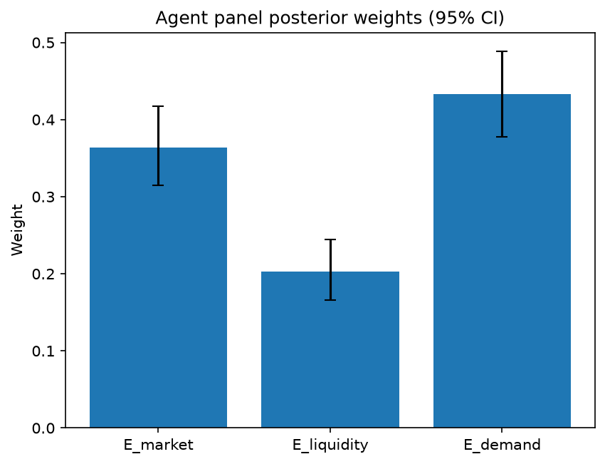

# Survey report: TrustRouter Agentic Full Panel (qwen3:14b) -- Level L3e: Economic Value sub-parts

Survey ID: `trustrouter-agentic-full-panel-qwen3-14b-2026-09-01-L3e`

## Agent panel

- Agents contributing a valid response: 36
- Classical BWM consistency: 36/36 within threshold

| Criterion | Mean | 95% CI lower | 95% CI upper |
|---|---|---|---|
| E_market | 0.3641 | 0.3144 | 0.4170 |
| E_liquidity | 0.2032 | 0.1656 | 0.2443 |
| E_demand | 0.4327 | 0.3780 | 0.4881 |

## Methodology

Each agent independently completed a Best-Worst Method (BWM) comparison: choosing the single most and least important criterion, then rating every criterion's importance relative to those two on a 1-9 scale. Individual responses were solved with the classical BWM linear program (Rezaei, 2015) for a consistency check, and combined across the panel with a hierarchical Bayesian model (Mohammadi and Rezaei, 2020).

36 agent response(s) were accepted into this result.

Every agent's run began with a QA precheck (its stated configuration verified against ground truth) and every accepted answer's self-reported sources were checked against what reference material was actually available to it; see the Per-agent detail section below and this survey's Conversation Log for each agent's specific results. Every response is schema-validated and independently, repeatedly sampled (never a single completion treated as ground truth); see `guardrails.py`. This survey's complete output is covered by a SHA-256 integrity manifest (`integrity_manifest.json`, `SHA256SUMS`), generated once this run finished, so any later alteration to these files is detectable.

### Charts

## Per-agent detail

### bim-coordinator-base-openmanus (`bim-coordinator-base-openmanus`)

- Role: BIM Coordinator
- Model: ollama/qwen3:14b
- DID: `did:key:z6MkudbAFJTsT2nAaosLBXGy3dK9HHhxJRGYp85L1rpGG6MW`
- QA precheck: passed
- Sources used: (not reported)

**Answer:** `{"best": "E_demand", "worst": "E_liquidity", "best_to_others": {"E_demand": 1, "E_market": 7, "E_liquidity": 8}, "others_to_worst": {"E_liquidity": 1, "E_market": 6, "E_demand": 8}}`

**Reasoning:**

Best factor: E_demand  
Worst factor: E_liquidity

E_demand vs E_market: 7  
E_demand vs E_liquidity: 8  
E_market vs E_liquidity: 6

### bim-coordinator-base-openmanus (`bim-coordinator-base-openmanus`)

- Role: BIM Coordinator
- Model: ollama/qwen3:14b
- DID: `did:key:z6MkudbAFJTsT2nAaosLBXGy3dK9HHhxJRGYp85L1rpGG6MW`
- QA precheck: passed
- Sources used: (not reported)

**Answer:** `{"best": "E_demand", "worst": "E_market", "best_to_others": {"E_demand": 1, "E_liquidity": 7, "E_market": 9}, "others_to_worst": {"E_market": 1, "E_liquidity": 6, "E_demand": 9}}`

**Reasoning:**

Best factor: E_demand  
Worst factor: E_market

E_demand vs E_liquidity: 7  
E_demand vs E_market: 9  
E_liquidity vs E_market: 6

### bim-coordinator-base-openmanus (`bim-coordinator-base-openmanus`)

- Role: BIM Coordinator
- Model: ollama/qwen3:14b
- DID: `did:key:z6MkudbAFJTsT2nAaosLBXGy3dK9HHhxJRGYp85L1rpGG6MW`
- QA precheck: passed
- Sources used: (not reported)

**Answer:** `{"best": "E_demand", "worst": "E_liquidity", "best_to_others": {"E_demand": 1, "E_market": 7, "E_liquidity": 9}, "others_to_worst": {"E_liquidity": 1, "E_market": 6, "E_demand": 9}}`

**Reasoning:**

Best factor: E_demand  
Worst factor: E_liquidity

E_demand vs E_market: 7  
E_demand vs E_liquidity: 9  
E_market vs E_liquidity: 6

### bim-coordinator-rag-openmanus (`bim-coordinator-rag-openmanus`)

- Role: BIM Coordinator
- Model: ollama/qwen3:14b
- DID: `did:key:z6MkrS7nJZ3C7iB8kChprkVGtviujb1Avhvb1uK7D4V5yACK`
- QA precheck: passed
- Sources used: (not reported)

**Answer:** `{"best": "E_demand", "worst": "E_liquidity", "best_to_others": {"E_demand": 1, "E_market": 7, "E_liquidity": 9}, "others_to_worst": {"E_liquidity": 1, "E_market": 6, "E_demand": 9}}`

**Reasoning:**

Best factor: E_demand  
Worst factor: E_liquidity

E_demand vs E_market: 7  
E_demand vs E_liquidity: 9  
E_market vs E_liquidity: 6  

**Reasoning**:  
- **E_demand vs E_market (7)**: Future demand (E_demand) is more strategically critical for long-term value, especially with AI/digital twin growth, but current market demand (E_market) still provides immediate validation. The gap is significant but not "extreme."  
- **E_demand vs E_liquidity (9)**: Future demand dwarfs tokenisation ease (E_liquidity) in importance. Liquidity is a technical enabler, but without future demand, the economic value proposition collapses.  
- **E_market vs E_liquidity (6)**: Current market demand is more important than tokenisation ease, but the gap is smaller than E_demand’s dominance. Liquidity barriers can hinder adoption, but existing demand is a more tangible driver today.  

Citations: Role knowledge (BIM coordinator’s focus on long-term project lifecycle and stakeholder value alignment).

### bim-coordinator-rag-openmanus (`bim-coordinator-rag-openmanus`)

- Role: BIM Coordinator
- Model: ollama/qwen3:14b
- DID: `did:key:z6MkrS7nJZ3C7iB8kChprkVGtviujb1Avhvb1uK7D4V5yACK`
- QA precheck: passed
- Sources used: (not reported)

**Answer:** `{"best": "E_demand", "worst": "E_liquidity", "best_to_others": {"E_demand": 1, "E_market": 7, "E_liquidity": 9}, "others_to_worst": {"E_liquidity": 1, "E_market": 7, "E_demand": 9}}`

**Reasoning:**

Best factor: E_demand  
Worst factor: E_liquidity

E_demand vs E_market: 7  
E_demand vs E_liquidity: 9  
E_market vs E_liquidity: 7

### bim-coordinator-rag-openmanus (`bim-coordinator-rag-openmanus`)

- Role: BIM Coordinator
- Model: ollama/qwen3:14b
- DID: `did:key:z6MkrS7nJZ3C7iB8kChprkVGtviujb1Avhvb1uK7D4V5yACK`
- QA precheck: passed
- Sources used: (not reported)

**Answer:** `{"best": "E_demand", "worst": "E_liquidity", "best_to_others": {"E_demand": 1, "E_market": 7, "E_liquidity": 9}, "others_to_worst": {"E_liquidity": 1, "E_market": 6, "E_demand": 9}}`

**Reasoning:**

Best factor: E_demand  
Worst factor: E_liquidity

E_demand vs E_market: 7  
E_demand vs E_liquidity: 9  
E_market vs E_liquidity: 6  

**Reasoning:**  
- **E_demand vs E_market (7):** Future demand (E_demand) is more impactful than current market demand (E_market) because it ties to long-term growth drivers like AI and digital twins, which are transformative for construction data value. However, current demand (E_market) still holds relevance for immediate economic viability, so the gap is significant but not extreme.  
- **E_demand vs E_liquidity (9):** Future demand (E_demand) is vastly more critical than tokenisation ease (E_liquidity). While tokenisation ease affects tradability, its importance is secondary to the transformative potential of future demand, which directly shapes the economic value of data in emerging markets.  
- **E_market vs E_liquidity (6):** Current market demand (E_market) is more important than tokenisation ease (E_liquidity) because existing buyers directly influence immediate economic value. However, tokenisation ease (E_liquidity) is a technical barrier that could hinder value realization, making the gap moderate but not extreme.

### blockchain-engineer-base-openmanus (`blockchain-engineer-base-openmanus`)

- Role: Blockchain / DLT Engineer
- Model: ollama/qwen3:14b
- DID: `did:key:z6MkvKSFkcT6DEpWEsxp95m1wb9T1hSVzyS5BFz4rn1dkQX2`
- QA precheck: passed
- Sources used: (not reported)

**Answer:** `{"best": "E_market", "worst": "E_demand", "best_to_others": {"E_market": 1, "E_liquidity": 7, "E_demand": 8}, "others_to_worst": {"E_demand": 1, "E_liquidity": 6, "E_market": 8}}`

**Reasoning:**

Best factor: E_market  
Worst factor: E_demand

E_market vs E_liquidity: 7  
E_market vs E_demand: 8  
E_liquidity vs E_demand: 6

### blockchain-engineer-base-openmanus (`blockchain-engineer-base-openmanus`)

- Role: Blockchain / DLT Engineer
- Model: ollama/qwen3:14b
- DID: `did:key:z6MkvKSFkcT6DEpWEsxp95m1wb9T1hSVzyS5BFz4rn1dkQX2`
- QA precheck: passed
- Sources used: (not reported)

**Answer:** `{"best": "E_market", "worst": "E_demand", "best_to_others": {"E_market": 1, "E_liquidity": 7, "E_demand": 9}, "others_to_worst": {"E_demand": 1, "E_liquidity": 6, "E_market": 9}}`

**Reasoning:**

Best factor: E_market  
Worst factor: E_demand

E_market vs E_liquidity: 7  
E_market vs E_demand: 9  
E_liquidity vs E_demand: 6

### blockchain-engineer-base-openmanus (`blockchain-engineer-base-openmanus`)

- Role: Blockchain / DLT Engineer
- Model: ollama/qwen3:14b
- DID: `did:key:z6MkvKSFkcT6DEpWEsxp95m1wb9T1hSVzyS5BFz4rn1dkQX2`
- QA precheck: passed
- Sources used: (not reported)

**Answer:** `{"best": "E_liquidity", "worst": "E_demand", "best_to_others": {"E_liquidity": 1, "E_market": 7, "E_demand": 9}, "others_to_worst": {"E_demand": 1, "E_market": 5, "E_liquidity": 9}}`

**Reasoning:**

Best factor: E_liquidity  
Worst factor: E_demand

E_liquidity vs E_market: 7  
E_liquidity vs E_demand: 9  
E_market vs E_demand: 5

### blockchain-engineer-rag-openmanus (`blockchain-engineer-rag-openmanus`)

- Role: Blockchain / DLT Engineer
- Model: ollama/qwen3:14b
- DID: `did:key:z6MkefhuQ6kB1idjYsNndYCBmDNMXzrmmDaSSNrB7uygb6tb`
- QA precheck: passed
- Sources used: (not reported)

**Answer:** `{"best": "E_market", "worst": "E_demand", "best_to_others": {"E_market": 1, "E_liquidity": 7, "E_demand": 9}, "others_to_worst": {"E_demand": 1, "E_liquidity": 7, "E_market": 9}}`

**Reasoning:**

Best factor: E_market  
Worst factor: E_demand

E_market vs E_liquidity: 7  
E_market vs E_demand: 9  
E_liquidity vs E_demand: 7

### blockchain-engineer-rag-openmanus (`blockchain-engineer-rag-openmanus`)

- Role: Blockchain / DLT Engineer
- Model: ollama/qwen3:14b
- DID: `did:key:z6MkefhuQ6kB1idjYsNndYCBmDNMXzrmmDaSSNrB7uygb6tb`
- QA precheck: passed
- Sources used: (not reported)

**Answer:** `{"best": "E_market", "worst": "E_liquidity", "best_to_others": {"E_market": 1, "E_demand": 7, "E_liquidity": 9}, "others_to_worst": {"E_liquidity": 1, "E_demand": 8, "E_market": 9}}`

**Reasoning:**

Best factor: E_market  
Worst factor: E_liquidity

E_market vs E_demand: 7  
E_market vs E_liquidity: 9  
E_demand vs E_liquidity: 8

### blockchain-engineer-rag-openmanus (`blockchain-engineer-rag-openmanus`)

- Role: Blockchain / DLT Engineer
- Model: ollama/qwen3:14b
- DID: `did:key:z6MkefhuQ6kB1idjYsNndYCBmDNMXzrmmDaSSNrB7uygb6tb`
- QA precheck: passed
- Sources used: (not reported)

**Answer:** `{"best": "E_demand", "worst": "E_liquidity", "best_to_others": {"E_demand": 1, "E_market": 7, "E_liquidity": 9}, "others_to_worst": {"E_liquidity": 1, "E_market": 6, "E_demand": 9}}`

**Reasoning:**

Best factor: E_demand  
Worst factor: E_liquidity

E_demand vs E_market: 7  
E_demand vs E_liquidity: 9  
E_market vs E_liquidity: 6

### compliance-officer-base-openmanus (`compliance-officer-base-openmanus`)

- Role: Compliance and Regulatory Officer
- Model: ollama/qwen3:14b
- DID: `did:key:z6Mkhe8EvcrtatxJKQFwRpetMw5DkpvZbrHXSSPefLe5DfVf`
- QA precheck: passed
- Sources used: (not reported)

**Answer:** `{"best": "E_demand", "worst": "E_liquidity", "best_to_others": {"E_demand": 1, "E_market": 7, "E_liquidity": 9}, "others_to_worst": {"E_liquidity": 1, "E_market": 5, "E_demand": 9}}`

**Reasoning:**

Best factor: E_demand  
Worst factor: E_liquidity

E_demand vs E_market: 7  
E_demand vs E_liquidity: 9  
E_market vs E_liquidity: 5

### compliance-officer-base-openmanus (`compliance-officer-base-openmanus`)

- Role: Compliance and Regulatory Officer
- Model: ollama/qwen3:14b
- DID: `did:key:z6Mkhe8EvcrtatxJKQFwRpetMw5DkpvZbrHXSSPefLe5DfVf`
- QA precheck: passed
- Sources used: (not reported)

**Answer:** `{"best": "E_demand", "worst": "E_liquidity", "best_to_others": {"E_demand": 1, "E_market": 7, "E_liquidity": 9}, "others_to_worst": {"E_liquidity": 1, "E_market": 6, "E_demand": 9}}`

**Reasoning:**

Best factor: E_demand  
Worst factor: E_liquidity  

**Reasoning**:  
- **E_demand** (Future demand) is prioritized due to its alignment with long-term regulatory trends (e.g., AI, digital twins) and lifecycle value for insurers/authorities, which may drive sustained economic value even if current markets are nascent.  
- **E_liquidity** (Tokenisation ease) is deemed less critical in this context, as the scenario describes a static, archival PDF with no immediate trading intent. While liquidity matters for tradability, the use case here focuses on retention and legal compliance rather than market participation.  
- The ranking reflects a balance between immediate utility (E_market) and speculative growth (E_demand), with E_liquidity being secondary in this specific archival scenario.  

(Note: This judgment hinges on the scenario’s emphasis on archival use over tradability, which may not universally apply.)

E_demand vs E_market: 7  
E_demand vs E_liquidity: 9  
E_market vs E_liquidity: 6

### compliance-officer-base-openmanus (`compliance-officer-base-openmanus`)

- Role: Compliance and Regulatory Officer
- Model: ollama/qwen3:14b
- DID: `did:key:z6Mkhe8EvcrtatxJKQFwRpetMw5DkpvZbrHXSSPefLe5DfVf`
- QA precheck: passed
- Sources used: (not reported)

**Answer:** `{"best": "E_demand", "worst": "E_liquidity", "best_to_others": {"E_demand": 1, "E_market": 7, "E_liquidity": 9}, "others_to_worst": {"E_liquidity": 1, "E_market": 6, "E_demand": 9}}`

**Reasoning:**

Best factor: E_demand  
Worst factor: E_liquidity

E_demand vs E_market: 7  
E_demand vs E_liquidity: 9  
E_market vs E_liquidity: 6

### compliance-officer-rag-openmanus (`compliance-officer-rag-openmanus`)

- Role: Compliance and Regulatory Officer
- Model: ollama/qwen3:14b
- DID: `did:key:z6MkhGj5AAyBKcqGQ794QBjrs7aqk5ChKYRr2bnej5XYT3L2`
- QA precheck: passed
- Sources used: (not reported)

**Answer:** `{"best": "E_demand", "worst": "E_liquidity", "best_to_others": {"E_demand": 1, "E_market": 7, "E_liquidity": 9}, "others_to_worst": {"E_liquidity": 1, "E_market": 6, "E_demand": 9}}`

**Reasoning:**

Best factor: E_demand  
Worst factor: E_liquidity

E_demand vs E_market: 7  
E_demand vs E_liquidity: 9  
E_market vs E_liquidity: 6

### compliance-officer-rag-openmanus (`compliance-officer-rag-openmanus`)

- Role: Compliance and Regulatory Officer
- Model: ollama/qwen3:14b
- DID: `did:key:z6MkhGj5AAyBKcqGQ794QBjrs7aqk5ChKYRr2bnej5XYT3L2`
- QA precheck: passed
- Sources used: (not reported)

**Answer:** `{"best": "E_demand", "worst": "E_liquidity", "best_to_others": {"E_demand": 1, "E_market": 7, "E_liquidity": 9}, "others_to_worst": {"E_liquidity": 1, "E_market": 5, "E_demand": 9}}`

**Reasoning:**

Best factor: E_demand  
Worst factor: E_liquidity

E_demand vs E_market: 7  
E_demand vs E_liquidity: 9  
E_market vs E_liquidity: 5  

**Reasoning**:  
- **E_demand vs E_market (7)**: Future demand (E_demand) is more strategically impactful for long-term value than current market demand (E_market), but E_market still provides immediate relevance. The gap is significant but not extreme.  
- **E_demand vs E_liquidity (9)**: E_demand (future growth from regulated/AI/digital twin sectors) is vastly more critical than E_liquidity (tokenisation ease), which is a technical enabler but not a primary driver of economic value.  
- **E_market vs E_liquidity (5)**: Current market demand (E_market) is more directly tied to immediate economic value than tokenisation ease (E_liquidity), but the difference is moderate compared to the E_demand vs E_liquidity gap.  

These ratings reflect professional judgment based on the criteria's definitions and their relative influence on economic value in construction-project data-trust contexts.

### compliance-officer-rag-openmanus (`compliance-officer-rag-openmanus`)

- Role: Compliance and Regulatory Officer
- Model: ollama/qwen3:14b
- DID: `did:key:z6MkhGj5AAyBKcqGQ794QBjrs7aqk5ChKYRr2bnej5XYT3L2`
- QA precheck: passed
- Sources used: (not reported)

**Answer:** `{"best": "E_demand", "worst": "E_liquidity", "best_to_others": {"E_demand": 1, "E_market": 7, "E_liquidity": 8}, "others_to_worst": {"E_liquidity": 1, "E_market": 6, "E_demand": 8}}`

**Reasoning:**

Best factor: E_demand  
Worst factor: E_liquidity

E_demand vs E_market: 7  
E_demand vs E_liquidity: 8  
E_market vs E_liquidity: 6

### data-engineer-base-openmanus (`data-engineer-base-openmanus`)

- Role: Data Engineering Specialist
- Model: ollama/qwen3:14b
- DID: `did:key:z6MkoHX584uNGsUNkT4wu6bvscjg7jXYsKj13JDFkz2TH799`
- QA precheck: passed
- Sources used: (not reported)

**Answer:** `{"best": "E_market", "worst": "E_demand", "best_to_others": {"E_market": 1, "E_liquidity": 7, "E_demand": 8}, "others_to_worst": {"E_demand": 1, "E_liquidity": 6, "E_market": 8}}`

**Reasoning:**

Best factor: E_market  
Worst factor: E_demand

E_market vs E_liquidity: 7  
E_market vs E_demand: 8  
E_liquidity vs E_demand: 6

### data-engineer-base-openmanus (`data-engineer-base-openmanus`)

- Role: Data Engineering Specialist
- Model: ollama/qwen3:14b
- DID: `did:key:z6MkoHX584uNGsUNkT4wu6bvscjg7jXYsKj13JDFkz2TH799`
- QA precheck: passed
- Sources used: (not reported)

**Answer:** `{"best": "E_demand", "worst": "E_liquidity", "best_to_others": {"E_demand": 1, "E_market": 7, "E_liquidity": 8}, "others_to_worst": {"E_liquidity": 1, "E_market": 5, "E_demand": 8}}`

**Reasoning:**

Best factor: E_demand  
Worst factor: E_liquidity

E_demand vs E_market: 7  
E_demand vs E_liquidity: 8  
E_market vs E_liquidity: 5

### data-engineer-base-openmanus (`data-engineer-base-openmanus`)

- Role: Data Engineering Specialist
- Model: ollama/qwen3:14b
- DID: `did:key:z6MkoHX584uNGsUNkT4wu6bvscjg7jXYsKj13JDFkz2TH799`
- QA precheck: passed
- Sources used: (not reported)

**Answer:** `{"best": "E_market", "worst": "E_demand", "best_to_others": {"E_market": 1, "E_liquidity": 7, "E_demand": 9}, "others_to_worst": {"E_demand": 1, "E_liquidity": 6, "E_market": 9}}`

**Reasoning:**

Best factor: E_market  
Worst factor: E_demand

E_market vs E_liquidity: 7  
E_market vs E_demand: 9  
E_liquidity vs E_demand: 6

### data-engineer-rag-openmanus (`data-engineer-rag-openmanus`)

- Role: Data Engineering Specialist
- Model: ollama/qwen3:14b
- DID: `did:key:z6Mkw1baUuVQnipgbiBvSVDb8wz6t59Gcd6GT2tqAYBBy8xt`
- QA precheck: passed
- Sources used: (not reported)

**Answer:** `{"best": "E_demand", "worst": "E_liquidity", "best_to_others": {"E_demand": 1, "E_market": 7, "E_liquidity": 9}, "others_to_worst": {"E_liquidity": 1, "E_market": 7, "E_demand": 9}}`

**Reasoning:**

Best factor: E_demand  
Worst factor: E_liquidity

E_demand vs E_market: 7  
E_demand vs E_liquidity: 9  
E_market vs E_liquidity: 7  

**Reasoning**:  
- **E_demand vs E_market (7)**: Future demand (E_demand) is more strategically impactful for long-term value (e.g., AI, digital twin adoption) than current market demand (E_market), but E_market still reflects immediate economic relevance. The gap is moderate.  
- **E_demand vs E_liquidity (9)**: Tokenisation ease (E_liquidity) is a critical enabler for blockchain adoption, but its absence (low E_liquidity) creates a severe bottleneck. E_demand’s future-oriented focus on regulated/AI growth dwarfs the importance of tokenisation ease in this context.  
- **E_market vs E_liquidity (7)**: Current market demand (E_market) is more immediately actionable than tokenisation ease (E_liquidity), which is a technical barrier. However, E_liquidity’s impact on tradeability makes it a significant, though secondary, factor compared to E_market.  

Citations: Role knowledge (data_engineer) and shared knowledge (economic_value_decomposition).

### data-engineer-rag-openmanus (`data-engineer-rag-openmanus`)

- Role: Data Engineering Specialist
- Model: ollama/qwen3:14b
- DID: `did:key:z6Mkw1baUuVQnipgbiBvSVDb8wz6t59Gcd6GT2tqAYBBy8xt`
- QA precheck: passed
- Sources used: (not reported)

**Answer:** `{"best": "E_market", "worst": "E_liquidity", "best_to_others": {"E_market": 1, "E_demand": 7, "E_liquidity": 9}, "others_to_worst": {"E_liquidity": 1, "E_demand": 6, "E_market": 9}}`

**Reasoning:**

Best factor: E_market  
Worst factor: E_liquidity

E_market vs E_demand: 7  
E_market vs E_liquidity: 9  
E_demand vs E_liquidity: 6

### data-engineer-rag-openmanus (`data-engineer-rag-openmanus`)

- Role: Data Engineering Specialist
- Model: ollama/qwen3:14b
- DID: `did:key:z6Mkw1baUuVQnipgbiBvSVDb8wz6t59Gcd6GT2tqAYBBy8xt`
- QA precheck: passed
- Sources used: (not reported)

**Answer:** `{"best": "E_market", "worst": "E_demand", "best_to_others": {"E_market": 1, "E_liquidity": 7, "E_demand": 9}, "others_to_worst": {"E_demand": 1, "E_liquidity": 8, "E_market": 9}}`

**Reasoning:**

Best factor: E_market  
Worst factor: E_demand

E_market vs E_liquidity: 7  
E_market vs E_demand: 9  
E_liquidity vs E_demand: 8

### project-manager-base-openmanus (`project-manager-base-openmanus`)

- Role: Construction Project Manager
- Model: ollama/qwen3:14b
- DID: `did:key:z6MkfMGqRV6T6XUBBe8xDRug3Wf1bA8CzrJeUpsbHgq2TYcL`
- QA precheck: passed
- Sources used: (not reported)

**Answer:** `{"best": "E_demand", "worst": "E_liquidity", "best_to_others": {"E_demand": 1, "E_market": 7, "E_liquidity": 8}, "others_to_worst": {"E_liquidity": 1, "E_market": 6, "E_demand": 8}}`

**Reasoning:**

Best factor: E_demand  
Worst factor: E_liquidity

E_demand vs E_market: 7  
E_demand vs E_liquidity: 8  
E_market vs E_liquidity: 6

### project-manager-base-openmanus (`project-manager-base-openmanus`)

- Role: Construction Project Manager
- Model: ollama/qwen3:14b
- DID: `did:key:z6MkfMGqRV6T6XUBBe8xDRug3Wf1bA8CzrJeUpsbHgq2TYcL`
- QA precheck: passed
- Sources used: (not reported)

**Answer:** `{"best": "E_market", "worst": "E_demand", "best_to_others": {"E_market": 1, "E_liquidity": 7, "E_demand": 8}, "others_to_worst": {"E_demand": 1, "E_liquidity": 6, "E_market": 8}}`

**Reasoning:**

Best factor: E_market  
Worst factor: E_demand

E_market vs E_liquidity: 7  
E_market vs E_demand: 8  
E_liquidity vs E_demand: 6

### project-manager-base-openmanus (`project-manager-base-openmanus`)

- Role: Construction Project Manager
- Model: ollama/qwen3:14b
- DID: `did:key:z6MkfMGqRV6T6XUBBe8xDRug3Wf1bA8CzrJeUpsbHgq2TYcL`
- QA precheck: passed
- Sources used: (not reported)

**Answer:** `{"best": "E_demand", "worst": "E_liquidity", "best_to_others": {"E_demand": 1, "E_market": 7, "E_liquidity": 8}, "others_to_worst": {"E_liquidity": 1, "E_market": 5, "E_demand": 8}}`

**Reasoning:**

Best factor: E_demand  
Worst factor: E_liquidity

E_demand vs E_market: 7  
E_demand vs E_liquidity: 8  
E_market vs E_liquidity: 5

### project-manager-rag-openmanus (`project-manager-rag-openmanus`)

- Role: Construction Project Manager
- Model: ollama/qwen3:14b
- DID: `did:key:z6MkhqFWadXvwg3s6b7ZtNrQPLq6YT88kwodKPsLp3PqQoVA`
- QA precheck: passed
- Sources used: (not reported)

**Answer:** `{"best": "E_demand", "worst": "E_liquidity", "best_to_others": {"E_demand": 1, "E_market": 7, "E_liquidity": 9}, "others_to_worst": {"E_liquidity": 1, "E_market": 6, "E_demand": 9}}`

**Reasoning:**

Best factor: E_demand  
Worst factor: E_liquidity

E_demand vs E_market: 7  
E_demand vs E_liquidity: 9  
E_market vs E_liquidity: 6  

**Reasoning:**  
- **E_demand vs E_market (7):** Future demand (E_demand) drives long-term economic value and strategic investment, while current market demand (E_market) reflects immediate opportunities. However, both are critical for different stages of a project, so the gap is significant but not extreme.  
- **E_demand vs E_liquidity (9):** Future demand is foundational to economic value, whereas tokenisation ease (E_liquidity) is a technical enabler with secondary impact. Even if tokenisation is challenging, strong future demand can justify higher priority.  
- **E_market vs E_liquidity (6):** Current market demand directly influences short-term revenue and project viability, while tokenisation ease affects secondary marketability. The gap is moderate, as both influence economic value but in distinct ways.  

These ratings align with the role's focus on lifecycle value, where future demand is prioritized, followed by immediate market relevance, with tokenisation ease being a lower-priority enabler.

### project-manager-rag-openmanus (`project-manager-rag-openmanus`)

- Role: Construction Project Manager
- Model: ollama/qwen3:14b
- DID: `did:key:z6MkhqFWadXvwg3s6b7ZtNrQPLq6YT88kwodKPsLp3PqQoVA`
- QA precheck: passed
- Sources used: (not reported)

**Answer:** `{"best": "E_demand", "worst": "E_liquidity", "best_to_others": {"E_demand": 1, "E_market": 8, "E_liquidity": 9}, "others_to_worst": {"E_liquidity": 1, "E_market": 7, "E_demand": 9}}`

**Reasoning:**

Best factor: E_demand  
Worst factor: E_liquidity

E_demand vs E_market: 8  
E_demand vs E_liquidity: 9  
E_market vs E_liquidity: 7

### project-manager-rag-openmanus (`project-manager-rag-openmanus`)

- Role: Construction Project Manager
- Model: ollama/qwen3:14b
- DID: `did:key:z6MkhqFWadXvwg3s6b7ZtNrQPLq6YT88kwodKPsLp3PqQoVA`
- QA precheck: passed
- Sources used: (not reported)

**Answer:** `{"best": "E_demand", "worst": "E_liquidity", "best_to_others": {"E_demand": 1, "E_market": 8, "E_liquidity": 9}, "others_to_worst": {"E_liquidity": 1, "E_market": 7, "E_demand": 9}}`

**Reasoning:**

Best factor: E_demand  
Worst factor: E_liquidity

E_demand vs E_market: 8  
E_demand vs E_liquidity: 9  
E_market vs E_liquidity: 7

### structural-engineer-base-openmanus (`structural-engineer-base-openmanus`)

- Role: Structural Engineer
- Model: ollama/qwen3:14b
- DID: `did:key:z6MkjijSmZJ4VbnK5WEgJsauUfmcN1JPnNQ9qPUAJf5MS9fW`
- QA precheck: passed
- Sources used: (not reported)

**Answer:** `{"best": "E_demand", "worst": "E_liquidity", "best_to_others": {"E_demand": 1, "E_market": 7, "E_liquidity": 9}, "others_to_worst": {"E_liquidity": 1, "E_market": 7, "E_demand": 9}}`

**Reasoning:**

Best factor: E_demand  
Worst factor: E_liquidity

E_demand vs E_market: 7  
E_demand vs E_liquidity: 9  
E_market vs E_liquidity: 7

### structural-engineer-base-openmanus (`structural-engineer-base-openmanus`)

- Role: Structural Engineer
- Model: ollama/qwen3:14b
- DID: `did:key:z6MkjijSmZJ4VbnK5WEgJsauUfmcN1JPnNQ9qPUAJf5MS9fW`
- QA precheck: passed
- Sources used: (not reported)

**Answer:** `{"best": "E_market", "worst": "E_liquidity", "best_to_others": {"E_market": 1, "E_demand": 7, "E_liquidity": 9}, "others_to_worst": {"E_liquidity": 1, "E_demand": 7, "E_market": 9}}`

**Reasoning:**

Best factor: E_market  
Worst factor: E_liquidity

E_market vs E_demand: 7  
E_market vs E_liquidity: 9  
E_demand vs E_liquidity: 7

### structural-engineer-base-openmanus (`structural-engineer-base-openmanus`)

- Role: Structural Engineer
- Model: ollama/qwen3:14b
- DID: `did:key:z6MkjijSmZJ4VbnK5WEgJsauUfmcN1JPnNQ9qPUAJf5MS9fW`
- QA precheck: passed
- Sources used: (not reported)

**Answer:** `{"best": "E_demand", "worst": "E_liquidity", "best_to_others": {"E_demand": 1, "E_market": 7, "E_liquidity": 9}, "others_to_worst": {"E_liquidity": 1, "E_market": 6, "E_demand": 9}}`

**Reasoning:**

Best factor: E_demand  
Worst factor: E_liquidity

E_demand vs E_market: 7  
E_demand vs E_liquidity: 9  
E_market vs E_liquidity: 6

### structural-engineer-rag-openmanus (`structural-engineer-rag-openmanus`)

- Role: Structural Engineer
- Model: ollama/qwen3:14b
- DID: `did:key:z6Mkhs5XsGsxBPxgbvuoZrUdk9QpW6F8xCP9Q5ZRZPqWvGnm`
- QA precheck: passed
- Sources used: (not reported)

**Answer:** `{"best": "E_market", "worst": "E_liquidity", "best_to_others": {"E_market": 1, "E_demand": 7, "E_liquidity": 9}, "others_to_worst": {"E_liquidity": 1, "E_demand": 6, "E_market": 9}}`

**Reasoning:**

Best factor: E_market  
Worst factor: E_liquidity

E_market vs E_demand: 7  
E_market vs E_liquidity: 9  
E_demand vs E_liquidity: 6

### structural-engineer-rag-openmanus (`structural-engineer-rag-openmanus`)

- Role: Structural Engineer
- Model: ollama/qwen3:14b
- DID: `did:key:z6Mkhs5XsGsxBPxgbvuoZrUdk9QpW6F8xCP9Q5ZRZPqWvGnm`
- QA precheck: passed
- Sources used: (not reported)

**Answer:** `{"best": "E_demand", "worst": "E_liquidity", "best_to_others": {"E_demand": 1, "E_market": 7, "E_liquidity": 9}, "others_to_worst": {"E_liquidity": 1, "E_market": 6, "E_demand": 9}}`

**Reasoning:**

Best factor: E_demand  
Worst factor: E_liquidity

E_demand vs E_market: 7  
E_demand vs E_liquidity: 9  
E_market vs E_liquidity: 6

### structural-engineer-rag-openmanus (`structural-engineer-rag-openmanus`)

- Role: Structural Engineer
- Model: ollama/qwen3:14b
- DID: `did:key:z6Mkhs5XsGsxBPxgbvuoZrUdk9QpW6F8xCP9Q5ZRZPqWvGnm`
- QA precheck: passed
- Sources used: (not reported)

**Answer:** `{"best": "E_demand", "worst": "E_liquidity", "best_to_others": {"E_demand": 1, "E_market": 7, "E_liquidity": 9}, "others_to_worst": {"E_liquidity": 1, "E_market": 6, "E_demand": 9}}`

**Reasoning:**

Best factor: E_demand  
Worst factor: E_liquidity

E_demand vs E_market: 7  
E_demand vs E_liquidity: 9  
E_market vs E_liquidity: 6
