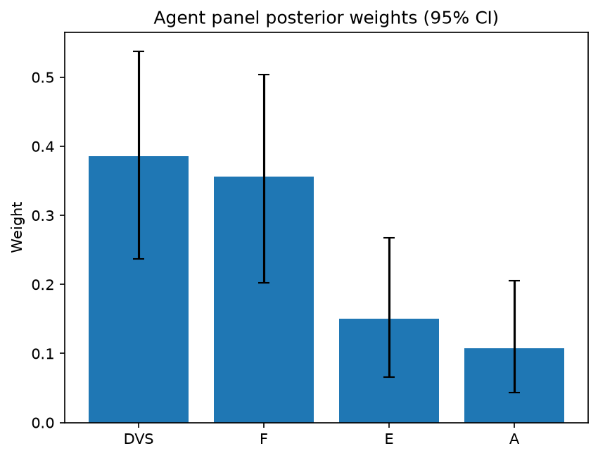

# Survey report: TrustRouter Agentic Two-Stage Pilot (mistral:7b) -- Level L1

Survey ID: `trustrouter-agentic-two-stage-pilot-2026-09-01`

## Agent panel

- Agents contributing a valid response: 2
- Classical BWM consistency: 2/2 within threshold

| Criterion | Mean | 95% CI lower | 95% CI upper |
|---|---|---|---|
| DVS | 0.3858 | 0.2365 | 0.5378 |
| F | 0.3557 | 0.2027 | 0.5039 |
| E | 0.1505 | 0.0663 | 0.2677 |
| A | 0.1080 | 0.0438 | 0.2051 |

## Methodology

Each agent independently completed a Best-Worst Method (BWM) comparison: choosing the single most and least important criterion, then rating every criterion's importance relative to those two on a 1-9 scale. Individual responses were solved with the classical BWM linear program (Rezaei, 2015) for a consistency check, and combined across the panel with a hierarchical Bayesian model (Mohammadi and Rezaei, 2020).

2 agent response(s) were accepted into this result.

Every agent's run began with a QA precheck (its stated configuration verified against ground truth) and every accepted answer's self-reported sources were checked against what reference material was actually available to it; see the Per-agent detail section below and this survey's Conversation Log for each agent's specific results. Every response is schema-validated and independently, repeatedly sampled (never a single completion treated as ground truth); see `guardrails.py`. This survey's complete output is covered by a SHA-256 integrity manifest (`integrity_manifest.json`, `SHA256SUMS`), generated once this run finished, so any later alteration to these files is detectable.

### Charts

## Per-agent detail

### blockchain-engineer-openmanus-ollama (`blockchain-engineer-openmanus-ollama`)

- Role: Blockchain / DLT Engineer
- Model: ollama/mistral:7b
- DID: `did:key:z6MksfJdDd2LbuMjAB5Eg4UqNeuNpnyKqrL4YmtmeShxHwdx`
- QA precheck: passed
- Sources used: (not reported)

**Answer:** `{"best": "DVS", "worst": "A", "best_to_others": {"DVS": 1, "F": 1, "E": 9, "A": 8}, "others_to_worst": {"A": 1, "F": 7, "E": 6, "DVS": 8}}`

**Reasoning:**

 Best factor: DVS
Worst factor: A

 DVS vs F: 1
DVS vs E: 9
DVS vs A: 8
F vs A: 7
E vs A: 6

### blockchain-engineer-openmanus-ollama (`blockchain-engineer-openmanus-ollama`)

- Role: Blockchain / DLT Engineer
- Model: ollama/mistral:7b
- DID: `did:key:z6MksfJdDd2LbuMjAB5Eg4UqNeuNpnyKqrL4YmtmeShxHwdx`
- QA precheck: passed
- Sources used: (not reported)

**Answer:** `{"best": "DVS", "worst": "A", "best_to_others": {"DVS": 1, "F": 1, "E": 9, "A": 8}, "others_to_worst": {"A": 1, "F": 7, "E": 6, "DVS": 8}}`

**Reasoning:**

 Best factor: DVS
Worst factor: A

 DVS vs F: 1
DVS vs E: 9
DVS vs A: 8
F vs A: 7
E vs A: 6

Reasoning:
- DVS vs F: The data value score (DVS) is the composite trustworthiness of the data, which is considered more important than technical feasibility fit (F) as the quality and relevance of the data are crucial for the blockchain's effectiveness.
- DVS vs E: The data value score (DVS) is more important than economic value (E) because even if a project has high economic value, it may not be as valuable if the data associated with it lacks trustworthiness.
- DVS vs A: The data value score (DVS) is more important than attack resistance (A) because even if the data is highly trusted, if it can easily be manipulated or corrupted, its value diminishes significantly.
- F vs A: Technical feasibility fit (F) is less important than attack resistance (A) as a blockchain with poor attack resistance would be vulnerable to tampering and thus compromise the integrity of the stored data.
- E vs A: Economic value (E) is less important than attack resistance (A) because even if there is a high economic value at stake, if the data can easily be manipulated or corrupted, it could lead to significant financial losses.
