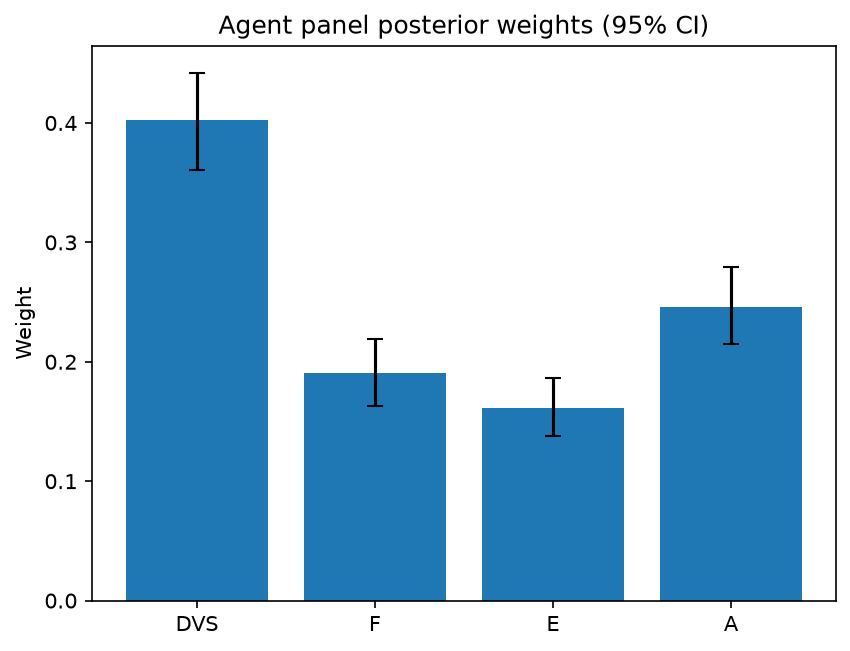

# Survey report: TrustRouter Claude CLI Panel (haiku) -- Level L1: Top-level TrustRouter factors

Survey ID: `trustrouter-claude-cli-full-panel-claude-haiku-2026-09-01-L1`

## Agent panel

- Agents contributing a valid response: 36
- Classical BWM consistency: 36/36 within threshold

| Criterion | Mean | 95% CI lower | 95% CI upper |
|---|---|---|---|
| DVS | 0.4022 | 0.3606 | 0.4422 |
| F | 0.1906 | 0.1631 | 0.2194 |
| E | 0.1611 | 0.1378 | 0.1863 |
| A | 0.2461 | 0.2146 | 0.2798 |

## Methodology

Each agent independently completed a Best-Worst Method (BWM) comparison: choosing the single most and least important criterion, then rating every criterion's importance relative to those two on a 1-9 scale. Individual responses were solved with the classical BWM linear program (Rezaei, 2015) for a consistency check, and combined across the panel with a hierarchical Bayesian model (Mohammadi and Rezaei, 2020).

36 agent response(s) were accepted into this result.

Every agent's run began with a QA precheck (its stated configuration verified against ground truth) and every accepted answer's self-reported sources were checked against what reference material was actually available to it; see the Per-agent detail section below and this survey's Conversation Log for each agent's specific results. Every response is schema-validated and independently, repeatedly sampled (never a single completion treated as ground truth); see `guardrails.py`. This survey's complete output is covered by a SHA-256 integrity manifest (`integrity_manifest.json`, `SHA256SUMS`), generated once this run finished, so any later alteration to these files is detectable.

### Charts

## Per-agent detail

### bim-coordinator-base-claude (`bim-coordinator-base-claude`)

- Role: BIM Coordinator
- Model: claude_cli/haiku
- DID: `did:key:z6MkjBimqskXZkR9Zx6uMHqsjZopoCEJaQ9tb7XoVSAZiujx`
- QA precheck: passed
- Sources used: shared knowledge: trustrouter_expert_questionnaire_v5_real_survey_instrument.md, general_knowledge

**Answer:** `{"best": "DVS", "worst": "E", "best_to_others": {"DVS": 1, "F": 3, "E": 5, "A": 2}, "others_to_worst": {"DVS": 5, "F": 4, "E": 1, "A": 4}}`

**Reasoning:**

DVS is the foundational criterion because trustworthiness of construction records—their intrinsic quality, provenance, verification strength, independent confirmation, legal compliance, and criticality—is the BIM coordinator's core responsibility and a prerequisite for any blockchain application. In the multiplicative TrustRouter model, DVS has direct multiplicative impact (×DVS); if DVS is weak, superior performance in F, A, or E cannot compensate. For multi-decade institutional records serving structural, compliance, and legal functions (as in Hospital Real), poor data trustworthiness is a fundamental failure. E is the least important because: (1) the formula applies (1+E) rather than pure multiplication, dampening E's criticative impact; (2) economic value motivates investment but does not determine trustworthiness itself—a high-value record can still be poorly structured, unverifiable, or legally non-compliant; and (3) even low-value records must be trustworthy if they are part of building documentation. A (Attack Resistance) is rated closer to DVS (2×) than F (3×) because both integrity and trustworthiness are critical in blockchain contexts. However, DVS is foundational: verification strength is already embedded in DVS, and an attack-resistant system cannot compensate for poor data quality or weak provenance. F (Technical Feasibility) must hold for the technology to work at all, but it is about implementation constraints, not data trust itself.

### bim-coordinator-base-claude (`bim-coordinator-base-claude`)

- Role: BIM Coordinator
- Model: claude_cli/haiku
- DID: `did:key:z6MkjBimqskXZkR9Zx6uMHqsjZopoCEJaQ9tb7XoVSAZiujx`
- QA precheck: passed
- Sources used: shared knowledge: trustrouter_expert_questionnaire_v5_real_survey_instrument.md, general_knowledge

**Answer:** `{"best": "DVS", "worst": "F", "best_to_others": {"DVS": 1, "F": 7, "E": 3, "A": 2}, "others_to_worst": {"DVS": 7, "F": 1, "E": 4, "A": 5}}`

**Reasoning:**

As a BIM coordinator managing multi-stakeholder model federation and clash detection over decades, I rank DVS (Data Value Score) as best because the trustworthiness of the data itself is foundational and non-negotiable. In renovation projects serving institutional owners, insurers, and regulatory authorities for decades, all downstream decisions—structural validation, compliance certification, insurance claims, facility management—depend on whether the source data can be relied upon. Without trustworthy data, no technical infrastructure, economic protection, or attack resistance can compensate. F (Technical Feasibility Fit) ranks worst because while ledger constraints are real, they are the most flexible challenge. If data is genuinely critical and valuable, technical solutions exist—data compression, selective storage, off-chain references, or alternative distributed systems—to work around capacity or latency constraints. The constraint is an engineering problem; data trustworthiness is foundational. A (Attack Resistance) rates very close to DVS (2 vs 1) because for long-lived institutional records subject to regulatory scrutiny, protection against undetected manipulation is nearly as critical as quality itself. However, DVS logically precedes A: you protect trustworthy data; protection cannot make untrustworthy data reliable. E (Economic Value) rates 3—significant but more context-dependent than DVS or A. A hospital renovation does carry substantial asset value and operational risk, but economic impact can be mitigated through phased rollout, insurance structures, and staged verification, whereas data trustworthiness cannot. Source material confirms that this scenario requires data to serve 'institutional owners, insurers, and authorities for decades', reinforcing that foundational data quality and resistance to undetected tampering outweigh technical implementation constraints.

### bim-coordinator-base-claude (`bim-coordinator-base-claude`)

- Role: BIM Coordinator
- Model: claude_cli/haiku
- DID: `did:key:z6MkjBimqskXZkR9Zx6uMHqsjZopoCEJaQ9tb7XoVSAZiujx`
- QA precheck: passed
- Sources used: shared knowledge: trustrouter_expert_questionnaire_v5_real_survey_instrument.md, general_knowledge

**Answer:** `{"best": "DVS", "worst": "E", "best_to_others": {"DVS": 1, "F": 3, "E": 4, "A": 2}, "others_to_worst": {"DVS": 4, "F": 3, "A": 3, "E": 1}}`

**Reasoning:**

As a BIM coordinator managing multi-stakeholder renovation documentation, I rank DVS as Best because data trustworthiness is the foundational prerequisite. For Hospital Real's deep renovation (shared reference scenario), the BIM model and compliance records form the basis for decisions by owners, insurers, and authorities over decades. Under TrustRouter's multiplicative model (DVS × F × (1+E) × A), if DVS collapses to near-zero (corrupted, low-quality, or untraceable data), the entire composition fails regardless of how feasible, valuable, or attack-resistant the system is. Quality provenance, verification strength, and legal compliance—the internal constituents of DVS—are prerequisites that all downstream factors depend on.

I rank E as Worst for two reasons grounded in the multiplicative structure and the renovation context. First, E's formulation as (1 + E) mathematically dampens its relative impact compared to DVS, F, and A, which multiply linearly. Second, while Hospital Real's economic stakes are substantial (public asset, lifecycle implications, insurance and compliance liability), the economic value itself does not determine whether the blockchain solution works. A renovation project with lower asset value but identical technical, data quality, and attack-resistance challenges would need the same DVS, F, and A guarantees. Economic value sets the consequence threshold but not the necessity threshold.

F (Technical Feasibility Fit) rates as 3 relative to DVS because ledger constraints—model size, update frequency, latency—are necessary gate-keepers. A 500 MB BIM model updating every 6 hours may simply not fit distributed ledger architecture regardless of data quality. However, DVS is still more foundational: infeasible ledger constraints can disqualify the solution, but poor data quality disqualifies its purpose.

A (Attack Resistance) rates as 2 relative to DVS—nearly parity. For a healthcare facility, preventing undetected manipulation of structural, safety, and compliance records is close to DVS in criticality. However, I score it slightly behind DVS because attack resistance protects trustworthy data; it assumes trustworthy data exists first. An attack-resistant ledger storing corrupted data is a locked vault holding garbage.

E rates as 1 relative to A and F because while stake magnitude affects decisions about whether to adopt blockchain, it does not affect whether the technical, data, or security prerequisites are met.

### bim-coordinator-rag-claude (`bim-coordinator-rag-claude`)

- Role: BIM Coordinator
- Model: claude_cli/haiku
- DID: `did:key:z6MkgKPXYGDwJ56epiD68PaM63oukrBdhu5ziYGo84AZKm9n`
- QA precheck: passed
- Sources used: bim_and_digital_building_logbooks.md, shared knowledge: trustrouter_expert_questionnaire_v5_real_survey_instrument.md, general_knowledge

**Answer:** `{"best": "DVS", "worst": "F", "best_to_others": {"DVS": 1, "F": 6, "E": 4, "A": 3}, "others_to_worst": {"DVS": 6, "F": 1, "E": 3, "A": 3}}`

**Reasoning:**

As a BIM coordinator with 10+ years managing multi-stakeholder federated models, my ranking reflects the foundational role of data trustworthiness in construction delivery. DVS is the clear best because the integrity, completeness, and verifiability of federated BIM data is non-negotiable: ISO 19650 already requires independent validation by multiple task teams before model acceptance, and that validation process assesses the very constituents DVS comprises (Quality, Provenance Trust, Verification Strength, Independent Confirmation, Legal Compliance). Without trustworthy data, clashes go undetected, coordination breaks down, and downstream decision-making becomes unreliable. F (Technical Feasibility Fit) ranks as worst because ledger-constraint tradeoffs—size, update rate, latency—are secondary design problems. Architecture choices can address technical fit; data quality requirements are intrinsic to project delivery and cannot be designed away. E (Economic Value) ranks above F but below DVS because high-value assets (the hospital renovation scenario exemplifies this) create the business case for trustworthiness investment, but economic context alone does not guarantee data integrity. A (Attack Resistance) ranks above E because undetected manipulation directly threatens the trustworthiness DVS already embodies; it is a specific mechanism for achieving the integrity a BIM coordinator must maintain. The gap between DVS and all others is substantial (DVS is 3-6× more important) because trustworthiness is the prerequisite for any of the other factors to matter. The ratings reflect practical judgment: I can architect around technical constraints, but I cannot compromise on the integrity my teams depend on for safe, coordinated construction delivery.

### bim-coordinator-rag-claude (`bim-coordinator-rag-claude`)

- Role: BIM Coordinator
- Model: claude_cli/haiku
- DID: `did:key:z6MkgKPXYGDwJ56epiD68PaM63oukrBdhu5ziYGo84AZKm9n`
- QA precheck: passed
- Sources used: bim_and_digital_building_logbooks.md, shared knowledge: trustrouter_expert_questionnaire_v5_real_survey_instrument.md, SOURCES.md, general_knowledge

**Answer:** `{"best": "DVS", "worst": "A", "best_to_others": {"DVS": 1, "F": 5, "E": 4, "A": 7}, "others_to_worst": {"DVS": 7, "F": 5, "E": 4, "A": 1}}`

**Reasoning:**

As a BIM coordinator managing federated models across multi-stakeholder teams, data trustworthiness (DVS) is foundational. DVS subsumes the six constituents that directly answer whether records deserve to be relied on: Quality, Provenance Trust, Verification Strength, Independent Confirmation, Legal Compliance, and Criticality. Per ISO 19650 guidance cited in the reference material, BIM information delivery already mandates independent validation across task teams before federated models are accepted—this is the real-world instantiation of DVS for construction data. Without trustworthy data, the other three factors become strategically irrelevant: feasibility (F) of storing untrustworthy data is a wasted investment; economic value (E) of corrupted records collapses; and attack resistance (A) on data that fails basic quality, provenance, or legal compliance provides no protection of genuine value. F ranks second (5× more important than A): technical feasibility is prerequisite—the data must actually be storable and retrievable in practice. E ranks third (4× more important than A): economic value determines which records warrant blockchain investment, but it is secondary to trustworthiness; many high-value records are too ephemeral or privacy-constrained for blockchain storage regardless of value. A ranks worst (1×, baseline): attack resistance, while architecturally important, addresses a secondary layer of risk. In renovation projects with institutional owners and regulatory oversight, the immediate professional concern is whether data is accurate, complete, timely, properly verified, and legally defensible—not sophisticated undetected manipulation. Gartoumi 2024 notes construction still lacks calibrated decision criteria for blockchain suitability; DVS is that foundational criterion. The multiplicative formula (DVS × F × (1+E) × A) mathematically confirms this ranking: if DVS approaches zero, the entire score collapses regardless of F, E, or A strength, reflecting the primacy of trustworthiness in construction record governance.

### bim-coordinator-rag-claude (`bim-coordinator-rag-claude`)

- Role: BIM Coordinator
- Model: claude_cli/haiku
- DID: `did:key:z6MkgKPXYGDwJ56epiD68PaM63oukrBdhu5ziYGo84AZKm9n`
- QA precheck: passed
- Sources used: shared knowledge: trustrouter_expert_questionnaire_v5_real_survey_instrument.md, bim_and_digital_building_logbooks.md, general_knowledge

**Answer:** `{"best": "DVS", "worst": "F", "best_to_others": {"DVS": 1, "F": 6, "E": 3, "A": 2}, "others_to_worst": {"DVS": 6, "E": 3, "A": 2, "F": 1}}`

**Reasoning:**

From a BIM coordinator's perspective, Data Value Score (DVS) is the foundational decision criterion. In multi-stakeholder federated models, trustworthiness of the underlying data—its quality, provenance, verification strength, independent confirmation, and legal compliance—is prerequisite. ISO 19650 mandates exactly this: multiple independent parties (lead appointed party, task teams) must validate federated models before acceptance (shared knowledge: trustrouter_expert_questionnaire_v5_real_survey_instrument.md). For the Hospital Real scenario specifically—a multi-decade public asset serving institutional owners, insurers, and authorities—the data's trustworthiness is the strategic foundation. If DVS is inadequate, technical feasibility becomes moot (we simply should not store untrustworthy data on ledger, regardless of feasibility). Conversely, low feasibility with high DVS is an engineering problem we solve for; high feasibility with low DVS is a decision we reject. Economic Value (E) and Attack Resistance (A) are both meaningful but depend on DVS existing first. E helps justify investment once data is trustworthy; A protects trustworthiness over time. Technical Feasibility (F) is the constraint we engineer around, not the primary decision driver. Feasibility issues are often solvable with time and resources, whereas compromising DVS to gain feasibility trades the core asset away. Rating ratios reflect this hierarchy: DVS is 6× more important than F (trustworthiness versus technical constraint); 3× more important than E (data integrity precedes financial calculation); and 2× more important than A (you build protection once data is trustworthy). E and A, respectively, are 3× and 2× more important than F because both matter more than solving technical constraints.

### blockchain-engineer-base-claude (`blockchain-engineer-base-claude`)

- Role: Blockchain / DLT Engineer
- Model: claude_cli/haiku
- DID: `did:key:z6MkjavCfxYpe2BkYMXfrJDvcH43kkcZRgoJAFJLDqtqyLmk`
- QA precheck: passed
- Sources used: shared knowledge: trustrouter_expert_questionnaire_v5_real_survey_instrument.md, general_knowledge

**Answer:** `{"best": "A", "worst": "F", "best_to_others": {"A": 1, "DVS": 2, "E": 2, "F": 4}, "others_to_worst": {"A": 4, "DVS": 2, "E": 2, "F": 1}}`

**Reasoning:**

From a production permissioned-ledger engineer's perspective, Attack Resistance (A) is the deciding factor for whether construction data warrants blockchain deployment at all. Blockchain's core value proposition is providing tamper-evidence and immutability against undetected manipulation—if there is no significant risk of tampering or data corruption (low A), then blockchain introduces cost and complexity without corresponding benefit, regardless of other factors. Conversely, high A directly justifies blockchain's deployment cost. Technical Feasibility Fit (F) is ranked worst not because it is unimportant, but because modern ledger architectures and hybrid approaches (IPFS + on-chain hash, sidechains, state channels, sharding) can often work around size, throughput, and latency constraints that would have been hard blockers in earlier systems. F is thus more a choice of implementation tier (full on-chain vs. hybrid vs. conventional) than a gating factor for whether blockchain is viable in principle. Data Value Score (DVS) and Economic Value (E) are rated equally in importance relative to A. DVS—encompassing Quality, Provenance Trust, and Verification Strength (per reference material)—reflects whether the data is trustworthy to begin with; blockchain cannot cure poor underlying data quality or weak provenance, it only preserves whatever state is recorded. E reflects whether the financial or asset value at risk justifies the cost premium of blockchain; without sufficient economic stakes, deployment is economically irrational. Both constrain the decision but are subordinate to A as the fundamental justification for blockchain involvement. The multiplicative TrustRouter model (DVS × F × (1+E) × A) itself shows that if A approaches zero, the entire product approaches zero, confirming A's gating role.

### blockchain-engineer-base-claude (`blockchain-engineer-base-claude`)

- Role: Blockchain / DLT Engineer
- Model: claude_cli/haiku
- DID: `did:key:z6MkjavCfxYpe2BkYMXfrJDvcH43kkcZRgoJAFJLDqtqyLmk`
- QA precheck: passed
- Sources used: shared knowledge: trustrouter_expert_questionnaire_v5_real_survey_instrument.md, general_knowledge

**Answer:** `{"best": "F", "worst": "E", "best_to_others": {"F": 1, "DVS": 2, "A": 4, "E": 6}, "others_to_worst": {"F": 6, "DVS": 3, "A": 2, "E": 1}}`

**Reasoning:**

From a production blockchain engineer's perspective, Technical Feasibility (F) is the most operationally influential decision gate for routing construction data to a ledger tier. Here is the logic: (1) F is a hard constraint — if data does not fit ledger capacity, latency, or update-rate constraints, implementation fails technically regardless of other factors. This gating property aligns with the multiplicative TrustRouter formula (DVS × F × (1+E) × A), where F near zero collapses the entire score. (2) In real permissioned-ledger deployments, feasibility assessment is the first go/no-go decision: Can the throughput, state size, and finality requirements of the ledger accommodate this data? If not, the project stops. (3) Data Value Score (DVS) is close in importance because trustworthiness is foundational — untrusted data should not be on-chain — but DVS is typically evaluated *after* determining that feasibility is viable. I rate F 2× more important than DVS because feasibility gates whether the architecture is even buildable, whereas DVS is an input quality check. (4) Attack Resistance (A) is important but secondary to feasibility; a technically infeasible system cannot be secured. (5) Economic Value (E) is least influential because legitimate on-chain routing decisions can be driven by regulatory compliance, transparency mandates, or industry-standard provenance requirements independent of financial value at stake. Routing decisions prioritize 'can we build this safely?' over 'is it financially justified?'

### blockchain-engineer-base-claude (`blockchain-engineer-base-claude`)

- Role: Blockchain / DLT Engineer
- Model: claude_cli/haiku
- DID: `did:key:z6MkjavCfxYpe2BkYMXfrJDvcH43kkcZRgoJAFJLDqtqyLmk`
- QA precheck: passed
- Sources used: shared knowledge: trustrouter_expert_questionnaire_v5_real_survey_instrument.md, general_knowledge

**Answer:** `{"best": "F", "worst": "E", "best_to_others": {"DVS": 3, "F": 1, "E": 6, "A": 3}, "others_to_worst": {"DVS": 5, "F": 6, "E": 1, "A": 4}}`

**Reasoning:**

From the perspective of a blockchain/DLT engineer with production experience on permissioned-ledger deployments, I rank F (Technical Feasibility Fit) as BEST because it acts as a hard gate-keeper in routing decisions. In practice, even high-quality, high-value, high-security construction data cannot be stored on-chain if it violates fundamental blockchain constraints—size limits, update frequency, or latency requirements—regardless of how trustworthy or economically valuable it is. Construction records are often large, complex (IFC models), and subject to frequent updates during active project phases; infeasibility is a common dealbreaker. E (Economic Value) is WORST because while important for business justification, it is secondary to the technical and trust dimensions. A safety-critical construction record (e.g., structural-engineer certification, inspection findings) may justify blockchain storage on trustworthiness and tamper-evidence grounds even if the direct financial value is modest; conversely, high-value data lacking trustworthiness or feasibility cannot be rescued by economic metrics alone. DVS ranks 3× less important than F because both are fundamental, but feasibility is the immediate practical constraint; A ranks similarly because both affect deployability, though feasibility more directly gates the routing decision. DVS ranks 5× more important than E because data quality, provenance, and verification strength are intrinsic to why construction data needs blockchain protection in the first place; E is an amplifier, not a foundational criterion. A ranks 4× more important than E because resistance to tampering directly justifies on-chain storage, whereas economic value is a cost-benefit lever after that justification is already made.

### blockchain-engineer-rag-claude (`blockchain-engineer-rag-claude`)

- Role: Blockchain / DLT Engineer
- Model: claude_cli/haiku
- DID: `did:key:z6MkooUJEyuLt3VzrACQLf8YLETe6fkJK66UWcp4jm9g2LzP`
- QA precheck: passed
- Sources used: blockchain_trust_and_attack_resistance.md, shared knowledge: trustrouter_expert_questionnaire_v5_real_survey_instrument.md, general_knowledge

**Answer:** `{"best": "F", "worst": "E", "best_to_others": {"F": 1, "A": 2, "DVS": 3, "E": 5}, "others_to_worst": {"F": 5, "A": 3, "DVS": 2, "E": 1}}`

**Reasoning:**

As a blockchain/DLT engineer evaluating permissioned-ledger deployments, I rank F (Technical Feasibility Fit) as Best because it is the foundational gating constraint: if construction data exceeds ledger throughput, size, or latency constraints, no amount of other desirable properties makes blockchain viable. Feasibility is non-negotiable and precedes all other considerations. E (Economic Value) is Worst because while E justifies the cost-benefit of blockchain deployment, it is extrinsic and does not determine whether blockchain is technically appropriate for a dataset. Low economic value does not render blockchain infeasible; it may simply make it uneconomic, but the decision to use blockchain is driven by intrinsic technical fit and the data's trust characteristics, not by the financial value at stake. A (Attack Resistance) is rated second-most important (2x less important than F) because it is the core value proposition of blockchain: permissioned ledgers like Hyperledger Fabric (referenced in Rouhani and Deters 2021) derive their utility from Byzantine fault tolerance and Sybil/Insider resistance. If construction data faces no tampering threats, blockchain is unjustified, even if technically feasible. However, A is subordinate to F because attack resistance is irrelevant if the ledger cannot physically accommodate the data. DVS (Data Value Score) is third because while it aggregates quality, provenance, and verification strength—all critical attributes—these are important for any data system, not uniquely for blockchain. High-quality provenance and verification can exist off-chain through other means (signed reports, qualified signatures). Blockchain specifically mitigates tampering and ensures immutable audit trails for data that is already trustworthy; it cannot recover compromised data quality. The multiplicative formula (TrustRouter = DVS × F × (1+E) × A) reinforces this logic: F acts as a hard constraint (if F ≈ 0, the score collapses), while E enters additively as (1+E), dampening its individual impact relative to the multiplicative factors.

### blockchain-engineer-rag-claude (`blockchain-engineer-rag-claude`)

- Role: Blockchain / DLT Engineer
- Model: claude_cli/haiku
- DID: `did:key:z6MkooUJEyuLt3VzrACQLf8YLETe6fkJK66UWcp4jm9g2LzP`
- QA precheck: passed
- Sources used: blockchain_trust_and_attack_resistance.md, shared knowledge: trustrouter_expert_questionnaire_v5_real_survey_instrument.md, general_knowledge

**Answer:** `{"best": "A", "worst": "DVS", "best_to_others": {"A": 1, "E": 2, "F": 3, "DVS": 6}, "others_to_worst": {"A": 6, "E": 3, "F": 2, "DVS": 1}}`

**Reasoning:**

Attack Resistance (A) is the most critical factor for routing decisions because it determines whether decentralized consensus adds genuine value. A permissioned blockchain's primary advantage over conventional audit logs is resilience against insider abuse, identity fraud, and compromised validators—exactly the threats A measures. High A forces full on-chain storage regardless of other factors; low A makes blockchain irrelevant even if E and F are favorable. This aligns with the reference material: Vaziry et al. (2024) identifies insider and Sybil resistance as core trust gaps that on-chain identity mechanisms must solve, directly feeding A rankings. Economic Value (E) is nearly as important because it justifies the cost/constraint trade-offs of blockchain, but high E without high A can often be addressed via IPFS_HASH hybrid tiers. Technical Feasibility (F) is a hard prerequisite—if data doesn't fit on-chain (size, latency, throughput), you move to IPFS_HASH or conventional—but F is largely binary once evaluated; it doesn't distinguish *between* tiers the way A and E do. Data Value Score (DVS) is least important for the *routing decision* because it measures input-side data governance (quality Q, provenance trust PT, verification strength V), not the output benefit of blockchain. DVS determines whether you *accept* the data at all, but not which tier to choose if you're storing it anyway. A low DVS may trigger rejection or pre-processing, but doesn't affect the blockchain-vs-conventional choice; a high DVS provides no advantage to blockchain over conventional systems in preventing tampering. Rouhani and Deters (2021) demonstrate that trust scores gate validation strength dynamically—this suggests DVS should influence *how much* consensus a stored record needs, not *where* to store it.

### blockchain-engineer-rag-claude (`blockchain-engineer-rag-claude`)

- Role: Blockchain / DLT Engineer
- Model: claude_cli/haiku
- DID: `did:key:z6MkooUJEyuLt3VzrACQLf8YLETe6fkJK66UWcp4jm9g2LzP`
- QA precheck: passed
- Sources used: shared knowledge: trustrouter_expert_questionnaire_v5_real_survey_instrument.md, general_knowledge

**Answer:** `{"best": "A", "worst": "E", "best_to_others": {"A": 1, "DVS": 3, "F": 2, "E": 4}, "others_to_worst": {"A": 4, "DVS": 2, "F": 3, "E": 1}}`

**Reasoning:**

As a blockchain engineer evaluating routing decisions for construction data, Attack Resistance (A) is the most influential factor because it represents the core technical justification for blockchain deployment. Construction projects involve multiple stakeholders with conflicting incentives (contractors, inspectors, owners), creating real fraud vectors (material substitution, inspection falsification, damage under-reporting). Blockchain's tamper-evidence guarantee directly addresses this threat model; if attack surface is low (data cannot be meaningfully altered or attacked), blockchain adds no security value regardless of other factors. This drives the fundamental decision of whether ledger-based storage is appropriate. Economic Value (E) is least influential because it operates downstream from technical feasibility: it determines cost-benefit justification AFTER the technical decision to use blockchain has already been made. The financial ROI calculation assumes F (feasibility), DVS (data trustworthiness), and A (security benefit) are already adequate; E gates affordability, not possibility. F is the hard constraint (if technically infeasible, decision is made automatically), but A is more influential to the choice itself because feasibility and economic value merely enable or discourage what A motivates. DVS (data trustworthiness) is foundational but rates below A because blockchain does not improve poor provenance or quality—those are prerequisites for any secure system. The multiplicative nature of TrustRouter (DVS × F × (1+E) × A) supports this: A and DVS are linear multipliers whose absence eliminates the score; F gates possibility; E's (1+E) form makes it the 'softest' factor multiplicatively. Source: shared knowledge: trustrouter_expert_questionnaire_v5_real_survey_instrument.md; general_knowledge from production permissioned-ledger experience.

### compliance-officer-base-claude (`compliance-officer-base-claude`)

- Role: Compliance and Regulatory Officer
- Model: claude_cli/haiku
- DID: `did:key:z6MkgGS4Yb7TwydcexnZQyhuB5HMp1ig3wLJaXRe6WiEC8hb`
- QA precheck: passed
- Sources used: shared knowledge: trustrouter_expert_questionnaire_v5_real_survey_instrument.md, general_knowledge

**Answer:** `{"best": "DVS", "worst": "E", "best_to_others": {"DVS": 1, "A": 2, "F": 3, "E": 4}, "others_to_worst": {"E": 1, "F": 2, "A": 3, "DVS": 4}}`

**Reasoning:**

As a facility-management compliance officer responsible for GDPR and construction-regulatory obligations, my judgment is grounded in what makes regulatory compliance possible and what enables trustworthy operational record-keeping across a building's lifecycle. DVS is Best because regulatory obligations—whether GDPR data-integrity requirements, building-code safety dependencies, or audit-trail mandates—all rest fundamentally on having trustworthy, verifiable data. The six constituents within DVS (Quality, Provenance Trust, Verification Strength, Independent Confirmation, Legal Compliance, and Criticality as defined in the reference material) collectively address the intrinsic and contextual fidelity of records, which is non-negotiable for compliance. Attack Resistance (A) is critical and ranks second, because undectable manipulation of construction records undermines every regulatory claim; however, DVS is broader—trustworthiness encompasses but is not limited to attack resistance. Technical Feasibility Fit (F) ranks third: while practical implementation matters, a system that doesn't technically fit is a deployment problem, not a compliance problem, and can be addressed through alternative platforms. Economic Value (E) is Worst from my regulatory lens: GDPR, building codes, and safety obligations apply uniformly regardless of whether a project is high-value or modest. Economic value matters for risk prioritization and resource allocation but not for the existence of regulatory obligation itself. The multiplicative structure of TrustRouter (DVS × F × (1+E) × A) supports this ordering: DVS functions as a gate—no trustworthiness, no trust regardless of the other factors' values—whereas E's additive form (1+E) reflects its role as a contextual modifier rather than a gating requirement.

### compliance-officer-base-claude (`compliance-officer-base-claude`)

- Role: Compliance and Regulatory Officer
- Model: claude_cli/haiku
- DID: `did:key:z6MkgGS4Yb7TwydcexnZQyhuB5HMp1ig3wLJaXRe6WiEC8hb`
- QA precheck: passed
- Sources used: shared knowledge: trustrouter_expert_questionnaire_v5_real_survey_instrument.md, general_knowledge

**Answer:** `{"best": "DVS", "worst": "E", "best_to_others": {"DVS": 1, "F": 6, "E": 7, "A": 3}, "others_to_worst": {"DVS": 7, "F": 5, "E": 1, "A": 6}}`

**Reasoning:**

As a compliance officer responsible for GDPR and construction-regulatory obligations, I prioritize DVS (Data Value Score) as the foundational criterion. The reference material defines DVS as the composite trustworthiness of the data, composed of six constituents: Quality, Provenance Trust, Verification Strength, Independent Confirmation, Legal Compliance, and Criticality. These align directly with my regulatory responsibilities: GDPR requires documented data accuracy, integrity, and accountability; construction regulations mandate trustworthy audit trails and provenance documentation. Without trustworthy data (high DVS), blockchain storage is meaningless regardless of other factors. DVS is therefore the prerequisite condition.

I rate A (Attack Resistance) as substantially important (3:1 to DVS) because GDPR Article 32 explicitly mandates integrity protections, and construction records require cryptographically secure audit trails. However, DVS subsumes verification strength—which includes cryptographic evidence—making it slightly more comprehensive than A alone.

F (Technical Feasibility Fit) is rated 6:1 below DVS. It is a necessary gating factor for implementation, but operates as a binary constraint (feasible or not) rather than a continuous trustworthiness measure. A compliance officer must ensure data meets regulatory standards; technical fit is secondary.

E (Economic Value) is worst because it is project-dependent and inconsistent with regulatory principle. GDPR and construction law apply uniform compliance standards regardless of financial exposure. A low-value record still requires equivalent data protection, legal compliance, and audit integrity as a high-value one. Economic value is a risk-weighting metric for stakeholder decisions, not a compliance metric for data governance.

Ratings reflect these logical dependencies: DVS is foundational (1), A is nearly as critical (3), F is a necessary constraint (6), and E is least relevant to compliance mandates (7).

### compliance-officer-base-claude (`compliance-officer-base-claude`)

- Role: Compliance and Regulatory Officer
- Model: claude_cli/haiku
- DID: `did:key:z6MkgGS4Yb7TwydcexnZQyhuB5HMp1ig3wLJaXRe6WiEC8hb`
- QA precheck: passed
- Sources used: shared knowledge: trustrouter_expert_questionnaire_v5_real_survey_instrument.md, general_knowledge

**Answer:** `{"best": "DVS", "worst": "E", "best_to_others": {"DVS": 1, "F": 2, "E": 4, "A": 2}, "others_to_worst": {"DVS": 4, "F": 3, "E": 1, "A": 3}}`

**Reasoning:**

From the perspective of a facility-management compliance officer, Data Value Score (DVS) is the foundational criterion. Construction-project compliance depends on trustworthy records: GDPR Article 5 mandates integrity and authenticity of personal data and processing records, and Article 32 requires appropriate technical measures to ensure security. A construction record that is not trustworthy fails the entire compliance purpose, regardless of its feasibility or economic value. DVS encompasses Quality, Provenance Trust, Verification Strength, Independent Confirmation, Legal Compliance, and Criticality—all of which are regulatory imperatives in construction and GDPR contexts. Economic Value (E) is rated Worst because, while it informs risk quantification and business decisions about *whether* to blockchain-store something, a compliance officer's primary duty is ensuring that records *that are stored* meet trustworthiness, feasibility, and security standards. Low-value records must still meet these standards; economic value does not drive regulatory obligation. Attack Resistance (A) and Technical Feasibility Fit (F) are close to DVS in importance: both are compliance-critical and practicality gates. However, DVS (the composite trustworthiness measure) is slightly more foundational than either: untrustworthy data cannot be remedied by attack resistance alone, and data that is trustworthy but technically infeasible creates a hard constraint rather than a ranking differentiation. DVS is rated 2× more important than both F and A (close calls reflecting their mutual criticality in compliance), and 4× more important than E (reflecting that economic magnitude does not substitute for regulatory obligation).

### compliance-officer-rag-claude (`compliance-officer-rag-claude`)

- Role: Compliance and Regulatory Officer
- Model: claude_cli/haiku
- DID: `did:key:z6MkvsMfbM7uWXaYfBeyMot693DSNk3VXfm2U8UeY54UDj2D`
- QA precheck: passed
- Sources used: gdpr_and_data_governance.md, shared knowledge: trustrouter_expert_questionnaire_v5_real_survey_instrument.md, general_knowledge

**Answer:** `{"best": "DVS", "worst": "E", "best_to_others": {"DVS": 1, "F": 3, "E": 7, "A": 2}, "others_to_worst": {"DVS": 7, "F": 5, "A": 6, "E": 1}}`

**Reasoning:**

As a compliance and regulatory officer focused on GDPR and construction regulations, I prioritize DVS as the foundational criterion because it directly incorporates the trustworthiness assessment—including Legal Compliance (L) as one of its six constituents—that must gate any decision about blockchain storage. Reference material (gdpr_and_data_governance.md) explicitly frames the constraint-gate stage (legal/privacy assessment) as preceding all trust scoring, and notes that the construction sector lacks rigorous decision criteria for when blockchain storage is legally appropriate. This governance gap is a compliance liability. DVS encompasses the integrity questions a regulatory officer must resolve first: Is the data provenance trustworthy? Does it meet verification and audit standards? Is it legally permissible to store it immutably given GDPR obligations (especially the right to erasure)? Until these questions are answered affirmatively, no amount of economic value, technical feasibility, or attack resistance justifies on-chain storage. E is worst because, while financially motivated stakeholders care about the value at stake, economic incentives cannot override regulatory compliance. GDPR requirements and building-code mandates do not yield to cost-benefit arguments. F ranks above E because technical feasibility directly shapes whether a compliant solution is practically achievable; it is a real constraint on what *can* be done within legal bounds. A ranks just below DVS because attack resistance is critical to trustworthiness, but the assessment of *whether the data should be on-chain at all* (DVS) logically precedes the question of *how well we can protect it once it is* (A). The multiplicative formula amplifies this hierarchy: a zero or low DVS makes the entire score collapse, whereas low E merely scales down an otherwise sound decision.

### compliance-officer-rag-claude (`compliance-officer-rag-claude`)

- Role: Compliance and Regulatory Officer
- Model: claude_cli/haiku
- DID: `did:key:z6MkvsMfbM7uWXaYfBeyMot693DSNk3VXfm2U8UeY54UDj2D`
- QA precheck: passed
- Sources used: gdpr_and_data_governance.md, shared knowledge: trustrouter_expert_questionnaire_v5_real_survey_instrument.md, general_knowledge

**Answer:** `{"best": "DVS", "worst": "E", "best_to_others": {"DVS": 1, "F": 3, "E": 6, "A": 2}, "others_to_worst": {"DVS": 6, "F": 3, "A": 3, "E": 1}}`

**Reasoning:**

As a facility-management compliance officer, my primary obligation is to ensure data records satisfy GDPR and construction-regulatory requirements. DVS (Data Value Score) is the best criterion because it represents composite trustworthiness—encompassing all dimensions of data integrity (Quality, Provenance Trust, Verification Strength, Independent Confirmation, Legal Compliance, and Criticality as defined in the survey instrument). Without trustworthy data, no compliance decision is defensible; this is the foundational gate through which all construction records must pass. The reference material (gdpr_and_data_governance.md) emphasizes that Legal Compliance (L) is a binding regulatory/statutory obligation, and it sits within DVS, not separately. DVS is therefore prerequisite to everything else: you cannot assess feasibility, value, or attack resistance for data you cannot trust.

A (Attack Resistance) is rated nearly as important (only 2x less important than DVS) because regulatory audit trails and construction records must be tamper-evident and undetectable in their manipulation. The blockchain immutability that attack resistance provides is precisely what construction compliance audits depend on—yet this is subordinate to the prior question of whether the data is trustworthy to begin with (DVS).

F (Technical Feasibility Fit) is rated 3x less important than DVS. Technical fit matters—construction records must actually be storable on the chosen infrastructure—but it is a secondary gate. The reference material (gdpr_and_data_governance.md) notes that blockchain is a complement to, not replacement for, traditional databases, and that some data (e.g., subject to GDPR right to erasure) should not go on blockchain regardless of technical feasibility. Feasibility is therefore a necessary but not sufficient condition; trustworthiness is sufficient.

E (Economic Value) is worst because it does not drive compliance obligations. A construction record with low financial value may be safety-critical and legally mandatory; conversely, a high-value financial record may not require blockchain storage if lower-assurance approaches satisfy the regulation. Economic value is an amplification factor in the multiplicative model (1+E form), not a gate. From a compliance officer's standpoint, regulatory duty overrides economic calculation.

### compliance-officer-rag-claude (`compliance-officer-rag-claude`)

- Role: Compliance and Regulatory Officer
- Model: claude_cli/haiku
- DID: `did:key:z6MkvsMfbM7uWXaYfBeyMot693DSNk3VXfm2U8UeY54UDj2D`
- QA precheck: passed
- Sources used: gdpr_and_data_governance.md, SOURCES.md, general_knowledge

**Answer:** `{"best": "DVS", "worst": "E", "best_to_others": {"DVS": 1, "F": 3, "E": 5, "A": 3}, "others_to_worst": {"DVS": 5, "F": 4, "E": 1, "A": 4}}`

**Reasoning:**

As a compliance and regulatory officer, my judgment prioritizes legal and regulatory compliance as foundational to any decision about immutable data storage in construction projects. DVS (Data Value Score) is the most critical factor because it is the composite trustworthiness measure that combines Quality, Provenance Trust, Verification Strength, Independent Confirmation, Legal Compliance, and Criticality—the entire upstream governance question of whether a specific datum should be stored immutably at all. The reference material (gdpr_and_data_governance.md) identifies the central tension: GDPR's right to erasure is incompatible with blockchain immutability, and the governance gap in construction is precisely the lack of rigorous decision criteria for when blockchain is legally and practically appropriate. This gatekeeping function—deciding whether a datum is fit for immutable storage before any trust score is computed—is my primary regulatory responsibility. Putting untrustworthy, incomplete, or legally non-compliant data onto an immutable ledger creates irreversible compliance liability. Feasibility (F) matters second because it is a technical prerequisite, but it is a pass/fail constraint rather than a trust factor: if data doesn't technically fit ledger limits, it simply should not be stored there. Attack Resistance (A) is important for protecting trustworthy data, but its value depends entirely on DVS being sound first. Economic Value (E) is the least important to the regulatory officer's mandate because regulatory obligations (including GDPR compliance and construction safety standards) are binding regardless of the financial value at stake. A structural safety certification or identity-verification datum must be handled with equal legal rigor whether its direct economic exposure is £1,000 or £1M; compliance cannot be economically conditional. E is useful for determining prioritization (which data to invest blockchain resources in), but it cannot determine whether legal obligations must be met. The ratios reflect that DVS is substantially more important than E (5×) because trustworthiness is prerequisite to justified immutability, while F and A are moderately more important than E (4×) because feasibility and attack resistance both support trustworthiness, whereas economic value does not.

### data-engineer-base-claude (`data-engineer-base-claude`)

- Role: Data Engineering Specialist
- Model: claude_cli/haiku
- DID: `did:key:z6MkwWLFsHqByat9fpS7uQaUXhG2ERBVxYgB8hVuvtEatajg`
- QA precheck: passed
- Sources used: shared knowledge: trustrouter_expert_questionnaire_v5_real_survey_instrument.md, general_knowledge

**Answer:** `{"best": "DVS", "worst": "E", "best_to_others": {"DVS": 1, "F": 3, "E": 5, "A": 2}, "others_to_worst": {"DVS": 5, "F": 4, "A": 3, "E": 1}}`

**Reasoning:**

As a data engineering specialist responsible for data quality and provenance, I rank **DVS (Data Value Score) as BEST** because trustworthiness is the foundational gate for all routing decisions. Construction data with poor quality, weak provenance, or inadequate verification cannot be reliably used anywhere—ledger or conventional storage. No storage system choice compensates for fundamentally untrustworthy data. DVS directly reflects my professional domain: intrinsic fidelity, custody integrity, and verification strength are the core concerns of data engineering. I rank **E (Economic Value) as WORST** because while financially important for business decisions, it is secondary to technical data concerns from an engineering perspective. Economic value determines *whether* a ledger investment is justified, but engineers must first establish that data is trustworthy (DVS), technically storable (F), and resistant to manipulation (A) before cost-benefit analysis becomes relevant. Even low-value construction data benefits from provenance integrity to prevent disputes; conversely, high-value data cannot be salvaged by ledger placement if it fails quality or feasibility gates. **F (Technical Feasibility)** rates 3 relative to DVS because it is a hard constraint—data that doesn't fit ledger size, update rate, or latency constraints simply cannot be stored on-chain. However, DVS is more influential in the routing decision itself: you must decide data is trustworthy before asking whether it *fits* technically. **A (Attack Resistance)** rates 2 relative to DVS—close in importance—because security matters greatly, but it is partially redundant with DVS's verification-strength and provenance-trust components. A ledger itself provides attack resistance through immutability; data with strong provenance and cryptographic verification (DVS constituents) already resists undetected manipulation. **F and A relative to E**: F rates 4 to E because technical feasibility is an engineering prerequisite, while E is conditional business logic. A rates 3 to E because security/attack resistance directly affects data integrity (my domain), whereas economic value is organizational-level governance.

### data-engineer-base-claude (`data-engineer-base-claude`)

- Role: Data Engineering Specialist
- Model: claude_cli/haiku
- DID: `did:key:z6MkwWLFsHqByat9fpS7uQaUXhG2ERBVxYgB8hVuvtEatajg`
- QA precheck: passed
- Sources used: shared knowledge: trustrouter_expert_questionnaire_v5_real_survey_instrument.md, general_knowledge

**Answer:** `{"best": "DVS", "worst": "A", "best_to_others": {"DVS": 1, "F": 2, "E": 3, "A": 6}, "others_to_worst": {"DVS": 6, "F": 3, "E": 2, "A": 1}}`

**Reasoning:**

As a data engineering specialist focused on construction-project data quality and routing decisions, I rank these factors by their role in the fundamental decision: should this data be routed to full on-chain, hybrid, or conventional storage? DVS is clearly most influential because trustworthiness (encompassing quality, provenance trust, verification strength, independent confirmation, legal compliance, and criticality per the survey instrument) is a prerequisite—untrustworthy data should not be routed to blockchain regardless of other factors. Construction disputes frequently turn on data integrity and provenance (who documented what, when, and under what authority), making DVS foundational. Technical Feasibility (F) ranks second because it represents a hard constraint: construction technical specifications (~20MB), daily photographs (~5MB/day), and design reviews (~260kB) create real size and update-rate pressures. If data does not fit ledger constraints, blockchain routing is physically impossible, making F a mandatory gate. Economic Value (E) ranks third because it drives the business case—you need sufficient financial or asset value at stake to justify the complexity of blockchain or hybrid routing, but economic considerations follow technical feasibility and trustworthiness in the decision tree. Attack Resistance (A) ranks last because it is primarily a benefit you obtain from choosing blockchain technology, not a primary criterion for deciding whether blockchain is appropriate. A construction data record with high DVS, acceptable F, and meaningful E may be valuable even if A (in the sense of preventing undetected manipulation) is moderate, because the immutability and audit trail of a ledger provide value beyond attack prevention alone. The multiplicative TrustRouter formula reflects that all four matter, but in a routing decision, trustworthiness is prerequisite, feasibility is constraint, economic value justifies effort, and attack resistance is outcome.

### data-engineer-base-claude (`data-engineer-base-claude`)

- Role: Data Engineering Specialist
- Model: claude_cli/haiku
- DID: `did:key:z6MkwWLFsHqByat9fpS7uQaUXhG2ERBVxYgB8hVuvtEatajg`
- QA precheck: passed
- Sources used: shared knowledge: trustrouter_expert_questionnaire_v5_real_survey_instrument.md, general_knowledge

**Answer:** `{"best": "DVS", "worst": "E", "best_to_others": {"DVS": 1, "F": 3, "E": 5, "A": 4}, "others_to_worst": {"DVS": 5, "F": 3, "E": 1, "A": 4}}`

**Reasoning:**

As a data engineering specialist responsible for data quality pipelines and provenance routing, I prioritize DVS (Data Value Score) as the most influential criterion for ledger routing decisions. DVS encompasses the intrinsic trustworthiness of the data itself—quality, provenance trust, verification strength, independent confirmation, legal compliance, and criticality (shared knowledge: trustrouter_expert_questionnaire_v5_real_survey_instrument.md). A blockchain is a trust amplifier, not a trust generator; data with poor quality or uncertain provenance cannot be rescued by on-chain storage. Before considering technical feasibility, economic cost, or attack resistance, a data engineer must first establish whether the source data can be trusted. Technical Feasibility (F) is rated 3x less important than DVS because it represents a hard constraint on *which* routing option is viable, but that decision should only be made after confirming the data deserves blockchain protection. Attack Resistance (A) is rated 4x less important than DVS because attack-resistant architecture is built *atop* trusted data; without data integrity, resistance mechanisms protect little of value. Economic Value (E) is rated 5x less important than DVS and becomes the least influential criterion. While E justifies business investment in stronger protections, it does not directly drive the technical routing decision itself. A data engineer routes based on quality and technical fit; business stakeholders then evaluate whether the cost is justified. F is rated 3x more important than E, and A is 4x more important than E, because both technical feasibility and attack resistance are more directly tied to the engineering decision than economic considerations.

### data-engineer-rag-claude (`data-engineer-rag-claude`)

- Role: Data Engineering Specialist
- Model: claude_cli/haiku
- DID: `did:key:z6Mknx9SDBfJkpRBgat4tMwAWaw5EZtoMF8kY6JBeuWvWSen`
- QA precheck: passed
- Sources used: data_quality_and_polyglot_persistence.md, shared knowledge: trustrouter_expert_questionnaire_v5_real_survey_instrument.md, general_knowledge

**Answer:** `{"best": "DVS", "worst": "A", "best_to_others": {"DVS": 1, "F": 5, "E": 4, "A": 7}, "others_to_worst": {"DVS": 7, "F": 6, "E": 5, "A": 1}}`

**Reasoning:**

From a data engineering perspective on construction-project routing decisions, Data Value Score (DVS) is the most fundamental criterion. DVS—encompassing Quality, Provenance Trust, Verification Strength, Independent Confirmation, Legal Compliance, and Criticality—addresses whether the data's trustworthiness justifies any routing decision at all. For construction records (certified inspection reports, signed drawings, structural engineer approvals), the integrity and provenance of the data itself are prerequisite to deciding whether blockchain protection is needed. Poor-quality data or unclear provenance cannot be fixed by moving it on-chain; this is fundamentally a data-integrity problem, not a routing problem. Reference material on polyglot persistence emphasizes that routing decisions must match data characteristics to storage systems; trustworthiness is the primary characteristic determining whether a data artefact warrants the overhead of ledger storage. Technical Feasibility (F) is a necessary condition but rarely the binding constraint for construction data—most certificatesand reports are small enough and static enough (designs ~20 MB, certificates ~50–500 kB, progress photos manageable daily) that feasibility is not the primary limiter. Economic Value (E) ranks below DVS because while high-value assets justify protection investments, the quality and trustworthiness of the data itself is a prerequisite; economic value without data trustworthiness is not actionable. Attack Resistance (A) ranks as least influential for construction data. Construction project disputes are common, but systematic adversarial falsification of in-process records by external attackers is less prevalent than version-control chaos, document loss, or custody ambiguity. Construction domains face moderate rather than high-severity active-threat models compared to financial or supply-chain sectors. Trustworthiness and economic value are the primary drivers; attack resistance becomes relevant only after those are established. This ranking reflects that polyglot-persistence decisions for construction data are primarily driven by whether the data itself can be trusted (DVS), not by external threat actors (A).

### data-engineer-rag-claude (`data-engineer-rag-claude`)

- Role: Data Engineering Specialist
- Model: claude_cli/haiku
- DID: `did:key:z6Mknx9SDBfJkpRBgat4tMwAWaw5EZtoMF8kY6JBeuWvWSen`
- QA precheck: passed
- Sources used: data_quality_and_polyglot_persistence.md, shared knowledge: trustrouter_expert_questionnaire_v5_real_survey_instrument.md, general_knowledge

**Answer:** `{"best": "DVS", "worst": "E", "best_to_others": {"DVS": 1, "F": 2, "E": 4, "A": 2}, "others_to_worst": {"DVS": 4, "F": 3, "A": 3, "E": 1}}`

**Reasoning:**

As a data engineer responsible for data quality pipelines and provenance tracking, I rank DVS (Data Value Score) as most important because it addresses the foundational question: is the underlying data actually trustworthy enough to justify immutable storage? DVS aggregates the six constituents (Quality, Provenance Trust, Verification Strength, Independent Confirmation, Legal Compliance, Criticality) that directly measure whether a construction record is fit for preservation at all. Per the reference material's emphasis on per-artefact quality assessment and data trust frameworks, data quality and provenance must be established first; blockchain cannot fix bad source data, it only makes it immutable. F (Technical Feasibility Fit) is rated nearly equal to DVS (ratio 1:2) because it is a hard constraint—if a 20 MB construction drawing or 5 MB/day photo stream does not fit blockchain's size and update-rate limits, the routing decision is made regardless of DVS. However, DVS edges F slightly because the architectural decision is 'should this data type be blockchain-preserved' (answered by trustworthiness) before 'can it physically fit' (answered by F). A (Attack Resistance) is rated 1:2 against DVS because blockchain's primary value proposition is inherent resistance to undetected manipulation through cryptography and consensus; attack resistance is partly a given feature of the ledger itself rather than a distinguishing decision factor. E (Economic Value) is rated worst because it is a cost-benefit refinement, not a gate: once DVS, F, and A establish that data is trustworthy, technically feasible, and resistant to attack, economic value determines whether the added cost of blockchain is justified. But if the data itself is untrustworthy (DVS low), no amount of economic value justifies on-chain storage. From polyglot-persistence routing logic (reference material: Kosmerl et al. 2018, Prasad and S B 2014), the sequence is: verify trustworthiness, check technical fit, then optimize cost. E is refined cost-benefit reasoning, not foundational routing criterion.

### data-engineer-rag-claude (`data-engineer-rag-claude`)

- Role: Data Engineering Specialist
- Model: claude_cli/haiku
- DID: `did:key:z6Mknx9SDBfJkpRBgat4tMwAWaw5EZtoMF8kY6JBeuWvWSen`
- QA precheck: passed
- Sources used: data_quality_and_polyglot_persistence.md, shared knowledge: trustrouter_expert_questionnaire_v5_real_survey_instrument.md, general_knowledge

**Answer:** `{"best": "DVS", "worst": "F", "best_to_others": {"DVS": 1, "F": 5, "E": 4, "A": 4}, "others_to_worst": {"DVS": 5, "E": 2, "A": 3, "F": 1}}`

**Reasoning:**

From a data-engineering perspective evaluating construction-project records for ledger routing, Data Value Score (DVS) is the foundational criterion. The reference material emphasizes that construction records require ISO 25012 intrinsic and contextual quality (IFC-valid models, signed engineer reports, qualified electronic signatures, provenance evidence, and audit logging). No amount of technical feasibility, economic justification, or attack resistance matters if the underlying data is untrustworthy or unverified—you would only succeed in immortalizing defective records on-chain. DVS subsumes the prerequisites that justify ledger deployment in the first place: if a record lacks quality, provenance trust, verification strength, independent confirmation, legal compliance, or criticality, the routing decision should not depend on the other factors.

Technical Feasibility Fit (F) ranks as least important because it is the most readily mitigated through architectural flexibility. The polyglot-persistence reference material (Kosmerl et al. 2018, Prasad & S B 2014) demonstrates that data-routing problems are solved by selecting appropriate storage modalities—IPFS hashing for large files (e.g., construction drawings ~20 MB), time-series stores for high-frequency updates, relational stores for transactional ACID data. The question "does this belong on-chain?" is answered first by trustworthiness (DVS), then justified by stake (E) and threat model (A); technical fit is a constraint that almost always has a solution (hybrid architectures, compression, hashing).

Economic Value (E) and Attack Resistance (A) are roughly comparable in importance but both slightly less critical than DVS. E provides the business case—projects worth millions justify blockchain investment more than minor sketches do. A reflects the threat model—if undetected manipulation is trivial or attacks are implausible, on-chain storage adds cost without benefit. Both are necessary but secondary to confirming the data itself is trustworthy. E is rated slightly more important than A because economic justification is often the gating factor in deployment decisions, while attack resistance is more often an output of the infrastructure choice than an independent driver.

### project-manager-base-claude (`project-manager-base-claude`)

- Role: Construction Project Manager
- Model: claude_cli/haiku
- DID: `did:key:z6MkmbMHfpwQi6Y7FbdLU12dMCxJZnxzRBXEPi1iKygbQ1AP`
- QA precheck: passed
- Sources used: shared knowledge: trustrouter_expert_questionnaire_v5_real_survey_instrument.md, general_knowledge

**Answer:** `{"best": "DVS", "worst": "E", "best_to_others": {"DVS": 1, "F": 2, "E": 3, "A": 2}, "others_to_worst": {"DVS": 3, "F": 3, "E": 1, "A": 3}}`

**Reasoning:**

From a construction project manager's perspective evaluating records for blockchain storage across a project lifecycle: Data Value Score (DVS) is most foundational. DVS encompasses quality, provenance trust, and verification strength of the record itself. Without trustworthy data, blockchain storage is a liability rather than a solution—all downstream stakeholders (institutional owners, insurers, authorities) depend on data integrity for decades of institutional decision-making, compliance, and liability defense. This is non-negotiable regardless of project type. Economic Value (E) is least central to the blockchain storage decision. While E matters for cost-benefit analysis, many construction records must be preserved for legal and compliance reasons regardless of direct financial stakes (e.g., public asset renovations, statutory certifications). Critically, the reference scenario—a multi-decade public asset with mixed structural, energy, and compliance documentation—shows that compliance-driven records have high stakes for liability even when per-record economic value is moderate. Feasibility (F) is nearly as important as DVS because it is a hard gating constraint—if data doesn't fit the ledger's size, latency, or update-rate limits, implementation fails. Attack Resistance (A) is also critical for records that must resist undetected manipulation under regulatory and insurance scrutiny. However, DVS is slightly more important than both because it determines whether blockchain is justified at all; F and A are questions of how to implement safely once DVS justifies the choice. The gap from DVS to E (3x) is larger than DVS to F or A (2x each) because E is contingent on project context, whereas DVS, F, and A are structural requirements for the blockchain decision itself. From F and A to E, all are roughly 3x more important than E, reflecting that technical feasibility and security are prerequisites, while economic assessment is secondary to compliance and liability concerns in construction contexts.

### project-manager-base-claude (`project-manager-base-claude`)

- Role: Construction Project Manager
- Model: claude_cli/haiku
- DID: `did:key:z6MkmbMHfpwQi6Y7FbdLU12dMCxJZnxzRBXEPi1iKygbQ1AP`
- QA precheck: passed
- Sources used: shared knowledge: trustrouter_expert_questionnaire_v5_real_survey_instrument.md, general_knowledge

**Answer:** `{"best": "DVS", "worst": "F", "best_to_others": {"DVS": 1, "F": 6, "E": 3, "A": 2}, "others_to_worst": {"DVS": 6, "A": 3, "E": 2, "F": 1}}`

**Reasoning:**

As a construction project manager responsible for coordinating multi-stakeholder documentation over the full project lifecycle, my primary concern is the trustworthiness and verifiability of the data itself. The reference material emphasizes that construction records must serve institutional owners, insurers, and regulatory authorities for decades—a Hospital Real deep renovation scenario. DVS (Data Value Score), comprising Quality, Provenance Trust, and Verification Strength, directly addresses this foundational need. Without trustworthy data—records of verifiable origin, strong audit evidence, and high quality—no amount of technical fit or attack resistance can rescue a deficient record. A PM's liability and professional responsibility centres on data integrity and chain of custody over decades. F (Technical Feasibility Fit) ranks lowest because it is primarily a technical constraint gate: once assessed, the determination is relatively deterministic (either the record fits ledger size, update-rate, and latency constraints or it does not). It is a prerequisite that filters candidacy but does not measure the depth of trust required or the consequences of failure. Attack Resistance (A) ranks above F but below DVS because while preventing undetected manipulation is critical on a shared, multi-stakeholder ledger (especially one storing records for authorities), it is a secondary safeguard; if the data is already untrustworthy (poor quality, uncertain provenance), attack resistance cannot fix it. Economic Value (E) is moderately important for risk prioritization and stakeholder communication, but it is a consequence of data trustworthiness rather than a driver of it. The multiplicative TrustRouter formula means all factors matter, but their relative importance for professional judgment prioritises foundational data trust.

### project-manager-base-claude (`project-manager-base-claude`)

- Role: Construction Project Manager
- Model: claude_cli/haiku
- DID: `did:key:z6MkmbMHfpwQi6Y7FbdLU12dMCxJZnxzRBXEPi1iKygbQ1AP`
- QA precheck: passed
- Sources used: shared knowledge: trustrouter_expert_questionnaire_v5_real_survey_instrument.md, general_knowledge

**Answer:** `{"best": "DVS", "worst": "F", "best_to_others": {"DVS": 1, "F": 7, "E": 4, "A": 6}, "others_to_worst": {"DVS": 7, "F": 1, "E": 6, "A": 5}}`

**Reasoning:**

As a construction project manager coordinating multi-stakeholder documentation for a multi-decade asset (per the Hospital Real renovation scenario), my professional judgment ranks DVS as best and F as worst based on how these factors drive actual project outcomes. DVS (Data Value Score — composite trustworthiness) is foundational because every downstream decision depends on it: structural safety assessments, compliance verification, maintenance scheduling, and cross-stakeholder coordination all rest on data quality, provenance trust, and verification strength. Without DVS, a technically feasible system (F) delivers only false certainty. F ranks as worst not because it is unimportant (the system must technically function), but because it is the easiest constraint to solve — choosing the right platform technology addresses F, whereas DVS requires governance, source-level verification, custody controls, and domain expertise that cannot be engineered around. E (Economic Value) is substantial in a hospital context (millions in renovation cost, decades of operational impact, liability exposure to insurers and authorities), making it more important than the binary feasibility question F poses, but DVS remains more critical because trustworthy data enables economic protection, whereas high stakes without trustworthy data creates catastrophic risk. A (Attack Resistance) is significant — undetected manipulation of structural or compliance records could be dangerous — but it is slightly less central than DVS itself; strong DVS (particularly provenance trust and verification) naturally supports attack resistance, whereas attack resistance alone cannot compensate for weak underlying data quality. The multiplicative TrustRouter formula (DVS × F × (1+E) × A) means all factors matter, but in terms of professional priority and operational consequence for a CPM, trustworthiness of source data is the irreducible foundation, technical fit is a solved constraint, and economic and security concerns follow from data integrity.

### project-manager-rag-claude (`project-manager-rag-claude`)

- Role: Construction Project Manager
- Model: claude_cli/haiku
- DID: `did:key:z6MkgcpBWMRETjwEN39T1S93W7uzSnGEo6oioFMta7r3bPMs`
- QA precheck: passed
- Sources used: construction_project_management_and_mcdm.md, shared knowledge: trustrouter_expert_questionnaire_v5_real_survey_instrument.md, general_knowledge

**Answer:** `{"best": "DVS", "worst": "E", "best_to_others": {"DVS": 1, "F": 3, "E": 5, "A": 2}, "others_to_worst": {"DVS": 9, "F": 7, "E": 1, "A": 8}}`

**Reasoning:**

As a construction project manager deciding what records are candidates for blockchain storage, data trustworthiness (DVS) is the foundational criterion. Per Gartoumi 2024, construction blockchain use cases center on dispute resolution and document provenance—scenarios where an unverifiable or degraded record creates downstream liability decades later. If a record's intrinsic trustworthiness, provenance, or verification strength is weak, blockchain cannot repair it; storing low-DVS data immutably on-chain simply crystallizes that weakness. DVS therefore dominates the comparison.

I rate Attack Resistance (A) nearly as important as DVS (A:DVS = 2:1) because DVS and A are mutually dependent in practice: a record with high trustworthiness (DVS) but easily manipulated (low A) becomes worthless when later audited, since no one can prove the immutable record on-chain matches the builder's original intent. Conversely, attack-resistant storage of low-trust data adds no value. In the multiplicative formulation (DVS × F × (1+E) × A), if A approaches zero, TrustRouter approaches zero regardless of DVS.

Technical Feasibility (F) is necessary but less central: it is a hard constraint that must be cleared (construction project data sets are large—up to 20 MB for drawing sets—with daily changes requiring near-real-time access). However, once F is satisfactory, further improvements in feasibility margin contribute less than improvements in trust or attack resistance. F is a gating criterion, not a ranking criterion among feasible candidates.

Economic Value (E) is the weakest factor. As a project manager, I control which records merit blockchain storage partly based on financial stakes, but E is context-dependent and already handled multiplicatively in the formula (1+E scales the impact rather than acting as a threshold). A hospital renovation has high E, a small retrofit may have low E, yet both require equally trustworthy and tamper-resistant records for compliance and dispute resolution. Conversely, records with low or zero direct financial value (e.g., routine inspection logs not expected to trigger disputes) still need DVS and A. The economic-value calculation informs *whether* to blockchain a given record type, but DVS, F, and A determine *whether blockchain is appropriate at all* for trustworthy, auditable construction documentation.

### project-manager-rag-claude (`project-manager-rag-claude`)

- Role: Construction Project Manager
- Model: claude_cli/haiku
- DID: `did:key:z6MkgcpBWMRETjwEN39T1S93W7uzSnGEo6oioFMta7r3bPMs`
- QA precheck: passed
- Sources used: construction_project_management_and_mcdm.md, shared knowledge: trustrouter_expert_questionnaire_v5_real_survey_instrument.md, general_knowledge

**Answer:** `{"best": "DVS", "worst": "F", "best_to_others": {"DVS": 1, "F": 7, "E": 4, "A": 5}, "others_to_worst": {"DVS": 7, "E": 3, "A": 5, "F": 1}}`

**Reasoning:**

As a construction project manager coordinating multi-stakeholder documentation flows, I rank DVS (Data Value Score) as BEST because trustworthiness of the data is foundational to any blockchain storage decision. Per construction_project_management_and_mcdm.md (Gartoumi 2024), blockchain's primary demonstrated benefits in construction are dispute resolution and document management—both of which depend entirely on whether data can be trusted after the fact. For a multi-decade public asset serving institutional owners, insurers, and authorities, disputes hinge on whether documentation is verifiable and unaltered from its source. If DVS is compromised (poor quality, weak provenance, insufficient verification strength), blockchain storage cannot solve the trust problem: a ledger merely immutabilizes untrusted data. In contrast, high DVS is necessary (though not alone sufficient) for the entire technology stack to be valuable. F (Technical Feasibility Fit) ranks WORST because most construction records in the reference scenario (50 KB statutory certificates, 20 MB drawing sets, daily photograph streams) are already well within practical ledger constraints. Technical fit functions as a gate condition—records either fit or they don't—rather than as a nuanced decision factor among candidate records. Once fit is established (the binary gate), it ceases to differentiate candidates. For a PM managing competing priorities across many document types, feasibility is necessary but not where the judgment lies. E (Economic Value) ranks 4 relative to DVS because high-value assets absolutely require trustworthy documentation, but economic criticality is distinct from data trustworthiness itself: a high-value record can be economically important yet untrustworthy, and a low-value record can be completely trustworthy. A (Attack Resistance) ranks 5 relative to DVS because resistance to undetected manipulation is critical in multi-stakeholder environments where disputes arise, but only protects data that is already trustworthy to begin with. All three other factors matter meaningfully; none is negligible. But DVS is the foundation on which the others operate.

### project-manager-rag-claude (`project-manager-rag-claude`)

- Role: Construction Project Manager
- Model: claude_cli/haiku
- DID: `did:key:z6MkgcpBWMRETjwEN39T1S93W7uzSnGEo6oioFMta7r3bPMs`
- QA precheck: passed
- Sources used: construction_project_management_and_mcdm.md, general_knowledge

**Answer:** `{"best": "DVS", "worst": "F", "best_to_others": {"DVS": 1, "F": 7, "E": 4, "A": 5}, "others_to_worst": {"DVS": 7, "F": 1, "E": 5, "A": 6}}`

**Reasoning:**

DVS (Data Value Score) is best because construction project documentation's value to a PM depends first and foremost on whether the underlying data itself can be trusted. Reference material (Gartoumi 2024) identifies dispute resolution and document management as blockchain's primary construction use cases—both of which hinge on verifiable trustworthiness of the record, not on technical infrastructure alone. If quality, provenance, or verification strength (the DVS constituents) are weak, blockchain provides no real protection in a dispute. The multiplicative formula underscores this: low DVS drives the entire score toward zero regardless of how strong F, E, or A are. In a Hospital Real scenario spanning decades and serving institutional, insurance, and regulatory stakeholders, a PM's core concern is whether inspection certificates, drawings, change orders, and material tests can be relied upon. Technically feasible but untrusworthy data is worse than no data.

F (Technical Feasibility Fit) is worst because while it is a necessary gating constraint, it is the least discriminating factor among the four for construction project records. Most construction documents—drawings at 20 MB, inspection certificates at 50 KB, RFIs at 100 KB, material tests at 500 KB—fall within the technical envelope of modern blockchain solutions. Feasibility becomes a binary gate (solvable or not) rather than a primary value driver. In contrast, DVS, E, and A all directly address why blockchain should be chosen and how effectively it serves the PM's actual goal: establishing trust in dispute-prone records where financial and regulatory consequences are severe. A technically infeasible deployment cannot proceed, but among the four ranking criteria, feasibility itself contributes less to the decision to adopt blockchain for construction data than trustworthiness, economic stakes, or security.

Ratings reflect the following: DVS is 7× more important than F (trustworthiness far outweighs technical constraints in construction decision-making), 4× E (trustworthiness more fundamental than economic stakes, though stakes justify investment), and 5× A (trustworthiness more foundational than security properties, both essential). E is 5× F (economic value justifies technical investment), and A is 6× F (security matters more than mere feasibility when trust is the objective).

### structural-engineer-base-claude (`structural-engineer-base-claude`)

- Role: Structural Engineer
- Model: claude_cli/haiku
- DID: `did:key:z6MkwHPjNHbEfDhha3TFbbzwGmk6cFQ7di85Qq6pNXn25w2M`
- QA precheck: passed
- Sources used: shared knowledge: trustrouter_expert_questionnaire_v5_real_survey_instrument.md, general_knowledge

**Answer:** `{"best": "DVS", "worst": "A", "best_to_others": {"DVS": 1, "E": 3, "F": 4, "A": 7}, "others_to_worst": {"DVS": 7, "E": 3, "F": 3, "A": 1}}`

**Reasoning:**

As a structural engineer, DVS is the foundational pillar. For a multi-decade structural capacity dossier used by insurers and authorities (Scenario A), trustworthiness—comprising quality of the record, provenance (chartered engineer signature and custody chain), and verification strength (digital seal + audit evidence)—is non-negotiable. Blockchain cannot retrofit weak provenance; if the source is untrustworthy, immutability becomes a liability, not an asset. DVS underpins decades of regulatory and insurance reliance on what could be safety-critical data.

E (economic value) and F (technical feasibility fit) are enabling factors, not drivers. The 2MB structural report is trivially within blockchain constraints (F is clearly passed), so feasibility is necessary but entirely secondary. Economic value justifies *why* we archive (the multi-decade public asset and insurance exposure), but it does not determine *whether* the specific data is trustworthy. Both E and F are amplifiers or context, not core.

A (attack resistance) is least critical for this use case. While preventing undetected manipulation of structural data is important, the primary risks to a decades-long institutional archive are accidental loss, format obsolescence, and custody gaps—not sophisticated adversarial attacks on blockchain-stored professional reports. Attack resistance presupposes that the data is already worth protecting (DVS) and economically justified (E); it cannot overcome weak provenance. The multiplicative formula TrustRouter = DVS × F × (1+E) × A reflects this: A amplifies only if the other factors are solid.

Ratings reflect the hierarchy: DVS is 7× more important than A (trustworthiness vs. active-attack surface), 4× more important than F (core vs. enabler), and 3× more important than E (intrinsic vs. contextual). E and F are roughly equivalent as secondary factors (~3× more important than A).

This judgement is grounded in the structural capacity dossier scenario (Scenario A) and generalizes to institutional archiving of professional records over decades: the source and chain of custody matter more than defence against adversaries.

### structural-engineer-base-claude (`structural-engineer-base-claude`)

- Role: Structural Engineer
- Model: claude_cli/haiku
- DID: `did:key:z6MkwHPjNHbEfDhha3TFbbzwGmk6cFQ7di85Qq6pNXn25w2M`
- QA precheck: passed
- Sources used: shared knowledge: trustrouter_expert_questionnaire_v5_real_survey_instrument.md, general_knowledge

**Answer:** `{"best": "DVS", "worst": "E", "best_to_others": {"DVS": 1, "F": 4, "E": 5, "A": 2}, "others_to_worst": {"DVS": 5, "F": 2, "A": 3, "E": 1}}`

**Reasoning:**

As a structural engineer responsible for capacity dossiers served to insurers and regulators over decades, I rank DVS (Data Value Score) as best because trustworthiness of structural data is foundational—it underpins every downstream decision about building integrity, liability, and compliance. Without intrinsic data quality, provenance trust in the certifying engineer, and verification strength, all other factors become moot. Insurers and authorities cannot underwrite or regulate on data they cannot trust; safety decisions depend on it. I rank E (Economic Value) as worst because the requirement for trustworthy structural records exists regardless of whether an asset is worth €1 million or €100 million. Both require the same data integrity standard. E affects the cost-benefit calculation for implementing blockchain storage and the incentive structure around attacks, but it does not directly determine whether structural data can be trusted. F (Technical Feasibility Fit) rates higher than E because, while structural dossiers (~2 MB digitally sealed PDFs with low update frequency) are straightforward to store on modern blockchains, technical fit would become a binding constraint for other project records with higher throughput or size requirements. A (Attack Resistance) rates between DVS and F because a qualified electronic signature plus ledger immutability provides strong resistance to undetected manipulation in this context, but it is secondary to having trustworthy source data in the first place. The distinction between DVS and A reflects that data quality precedes attack-resistance measures: you cannot protect what was never good.

### structural-engineer-base-claude (`structural-engineer-base-claude`)

- Role: Structural Engineer
- Model: claude_cli/haiku
- DID: `did:key:z6MkwHPjNHbEfDhha3TFbbzwGmk6cFQ7di85Qq6pNXn25w2M`
- QA precheck: passed
- Sources used: shared knowledge: trustrouter_expert_questionnaire_v5_real_survey_instrument.md, general_knowledge

**Answer:** `{"best": "DVS", "worst": "F", "best_to_others": {"DVS": 1, "F": 6, "E": 4, "A": 3}, "others_to_worst": {"DVS": 6, "F": 1, "E": 2, "A": 3}}`

**Reasoning:**

For construction-project records serving institutional owners, insurers, and regulators over decades, DVS (Data Value Score) is foundational. As a structural engineer, my primary concern is whether the data can be relied upon for decisions about structural capacity, compliance, and risk—this is what DVS measures through quality, provenance trust, and verification strength. Without trustworthy data, attack resistance, economic value, and technical feasibility are moot; conversely, highly trustworthy data justifies investment even with moderate economic stakes or tighter feasibility constraints. F is ranked worst because technical feasibility is a solvable engineering problem—construction documents can be managed through various blockchain architectures, layer solutions, or hybrid approaches. It is a necessary gate but not a comparative importance metric in the way the others are. E (Economic Value) is secondary to DVS but more consequential than F: the real-world stakes justify implementing a trustworthy system, but the decision to adopt blockchain is ultimately driven by the trustworthiness gap (DVS), not the size of the financial exposure. A (Attack Resistance) ranks between F and E: protection against undetected manipulation matters significantly, but it protects data that must already be trustworthy; a secure system storing compromised data is less valuable than a less-resistant system storing reliable data. The multiplicative structure of TrustRouter reflects that each factor is necessary, but importance is not uniform—trustworthiness is the prerequisite without which the others have little meaning.

### structural-engineer-rag-claude (`structural-engineer-rag-claude`)

- Role: Structural Engineer
- Model: claude_cli/haiku
- DID: `did:key:z6MkkkSr7eLXockuCDowP5tCv9MLkuxWwbxeWDZKDF1MzpSM`
- QA precheck: passed
- Sources used: structural_health_monitoring_and_digital_twins.md, shared knowledge: trustrouter_expert_questionnaire_v5_real_survey_instrument.md, general_knowledge

**Answer:** `{"best": "DVS", "worst": "E", "best_to_others": {"DVS": 1, "F": 3, "E": 5, "A": 2}, "others_to_worst": {"DVS": 5, "F": 2, "A": 3, "E": 1}}`

**Reasoning:**

As a chartered structural engineer responsible for capacity dossiers relied upon by insurers and regulators for decades, I prioritize **DVS** as best because trustworthiness of the underlying data is foundational. A structurally sound blockchain implementation of untrustworthy data is pointless; if the capacity assessment has quality issues, poor provenance, or weak verification, the entire archive fails its purpose regardless of technical elegance. The reference material on digital twins emphasizes that sensor/report trustworthiness is the prerequisite for any downstream system—cryptographic anchoring and multi-party validation exist to protect genuinely trustworthy data, not to rehabilitate compromised data. For structural records with decades-long retention horizons (reference scenario: Hospital Real serving insurers and authorities), DVS encompasses the intrinsic fidelity and custody chain that determines if the dossier can be relied upon for structural decisions affecting safety.

**F** (Technical Feasibility Fit) is second: the 2 MB structural report must physically fit on the ledger and be retrievable, but this is a necessary-but-secondary condition. Modern blockchains generally accommodate document storage at this scale; the constraint is technical, not principled.

**A** (Attack Resistance) is third: preventing undetected tampering is critical for a decades-long institutional archive, yet it operates in service of protecting trustworthy data. Attack resistance without strong DVS protects compromised data. Both are essential, but A depends on DVS being solid first.

**E** (Economic Value) is worst because it determines *prioritization* of which projects justify blockchain overhead, not *trustworthiness* of a given record. A structural engineer's duty to assess capacity correctly is independent of whether the asset is worth €5M or €50M. Economic value affects resource allocation across projects, not the trustworthiness criteria for any single dossier. The formula's (1+E) modifier correctly reflects E as the smallest-impact factor relative to the multiplicative contributions of DVS, F, and A.

Ratings reflect that DVS dominates (1x itself, 3–5x the others), A and F are closer together but both essential, and E is secondary to the core trust problem.

### structural-engineer-rag-claude (`structural-engineer-rag-claude`)

- Role: Structural Engineer
- Model: claude_cli/haiku
- DID: `did:key:z6MkkkSr7eLXockuCDowP5tCv9MLkuxWwbxeWDZKDF1MzpSM`
- QA precheck: passed
- Sources used: structural_health_monitoring_and_digital_twins.md, shared knowledge: trustrouter_expert_questionnaire_v5_real_survey_instrument.md, general_knowledge

**Answer:** `{"best": "DVS", "worst": "F", "best_to_others": {"DVS": 1, "F": 7, "E": 4, "A": 3}, "others_to_worst": {"DVS": 7, "F": 1, "E": 5, "A": 4}}`

**Reasoning:**

As a structural engineer responsible for capacity dossiers used by insurers and authorities over decades, trustworthiness of data is foundational. DVS—the composite of data quality, provenance trust, and verification strength—directly determines whether a structural assessment can be relied upon for consequential decisions (insurance underwriting, regulatory compliance, continued asset use). A corrupted or untrusted capacity reading represents professional liability and potential physical harm risk; these stakes cannot be mitigated by technical infrastructure alone. DVS is therefore best. Technical Feasibility Fit (F) is worst for construction project records. The reference scenario involves static/quasi-static documents: a digitally sealed 2 MB PDF report and certificate files (50 kB to 20 MB). Modern ledgers handle these sizes and update frequencies trivially—constraints like on-chain latency or storage limits, discussed in the SHM literature for high-frequency sensor streams, are not binding for construction dossiers. A trustworthy dataset that strains infrastructure is preferable to infrastructure perfectly fitted to untrustworthy data. Economic Value (E) matters and sets real stakes for insurer decisions, but is secondary to whether data is trustworthy: financial value alone does not repair compromised provenance. Attack Resistance (A) is critical, but is substantially captured within DVS's 'Verification Strength' pillar (cryptographic audit, qualified signatures), making it somewhat redundant at the top level, whereas DVS encompasses broader data fidelity concerns beyond attack scenarios. The reference material on trustworthy digital twins (Suhail et al., 2020, 2021) emphasizes that trust in sensor/document data is the prerequisite for any downstream use; this precedence grounds the DVS-first ranking.

### structural-engineer-rag-claude (`structural-engineer-rag-claude`)

- Role: Structural Engineer
- Model: claude_cli/haiku
- DID: `did:key:z6MkkkSr7eLXockuCDowP5tCv9MLkuxWwbxeWDZKDF1MzpSM`
- QA precheck: passed
- Sources used: shared knowledge: trustrouter_expert_questionnaire_v5_real_survey_instrument.md, general_knowledge

**Answer:** `{"best": "DVS", "worst": "F", "best_to_others": {"DVS": 1, "A": 2, "E": 3, "F": 5}, "others_to_worst": {"DVS": 5, "A": 3, "E": 2, "F": 1}}`

**Reasoning:**

As a chartered structural engineer responsible for dossiers relied upon by insurers and regulators over decades, I rank trustworthiness of the data itself (DVS) as the single most critical factor. A structural capacity assessment is fundamental to assessing building safety and regulatory compliance. Per the reference material on digital twins (shared knowledge: trustrouter_expert_questionnaire_v5_real_survey_instrument.md), 'a digital twin's usefulness depends entirely on whether its underlying sensor data can be trusted to represent the physical asset's real state.' For structural data, this principle is critical: a corrupted or untrustworthy structural assessment could result in missed failure precursors with catastrophic consequences (building failure, loss of life, regulatory breach). DVS subsumes the intrinsic quality of the assessment, provenance trust (chartered engineer authorship), and verification strength (cryptographic sealing), all of which are non-negotiable. Attack Resistance (A) is the second-most important: it protects the trustworthiness that DVS represents. Without robust defense against undetected manipulation, DVS becomes unverifiable. Economic Value (E) matters substantially—a major building's structural dossier has high financial and asset value at stake—but varies by building context and is secondary to having trustworthy data. Technical Feasibility Fit (F) is least important: a ~2 MB sealed PDF document fits comfortably within blockchain constraints; it is not frequently updated, and latency is not critical for a structural dossier. While technical fit must be adequate, it does not prevent storage or trust establishment; workarounds exist if constraints are slightly tight. The multiplicative TrustRouter formula makes each factor's absolute importance clear: a zero or very low DVS compromises the entire result regardless of other factors being high. Conversely, imperfect technical fit (say, needing to shard a document or use a sidechain) does not invalidate trustworthy data or robust cryptographic protection.
