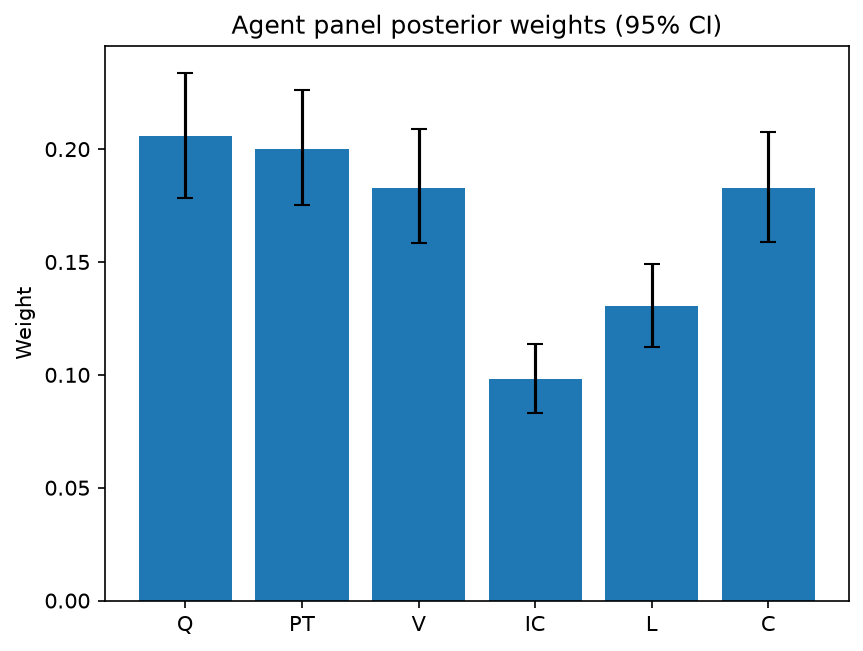

# Survey report: TrustRouter Claude CLI Panel (haiku) -- Level L2: Six trust dimensions inside DVS

Survey ID: `trustrouter-claude-cli-full-panel-claude-haiku-2026-09-01-L2`

## Agent panel

- Agents contributing a valid response: 36
- Classical BWM consistency: 35/36 within threshold

| Criterion | Mean | 95% CI lower | 95% CI upper |
|---|---|---|---|
| Q | 0.2056 | 0.1781 | 0.2339 |
| PT | 0.2001 | 0.1751 | 0.2263 |
| V | 0.1830 | 0.1586 | 0.2088 |
| IC | 0.0982 | 0.0831 | 0.1137 |
| L | 0.1304 | 0.1124 | 0.1493 |
| C | 0.1826 | 0.1588 | 0.2075 |

## Methodology

Each agent independently completed a Best-Worst Method (BWM) comparison: choosing the single most and least important criterion, then rating every criterion's importance relative to those two on a 1-9 scale. Individual responses were solved with the classical BWM linear program (Rezaei, 2015) for a consistency check, and combined across the panel with a hierarchical Bayesian model (Mohammadi and Rezaei, 2020).

36 agent response(s) were accepted into this result.

Every agent's run began with a QA precheck (its stated configuration verified against ground truth) and every accepted answer's self-reported sources were checked against what reference material was actually available to it; see the Per-agent detail section below and this survey's Conversation Log for each agent's specific results. Every response is schema-validated and independently, repeatedly sampled (never a single completion treated as ground truth); see `guardrails.py`. This survey's complete output is covered by a SHA-256 integrity manifest (`integrity_manifest.json`, `SHA256SUMS`), generated once this run finished, so any later alteration to these files is detectable.

### Charts

## Per-agent detail

### bim-coordinator-base-claude (`bim-coordinator-base-claude`)

- Role: BIM Coordinator
- Model: claude_cli/haiku
- DID: `did:key:z6MkjBimqskXZkR9Zx6uMHqsjZopoCEJaQ9tb7XoVSAZiujx`
- QA precheck: passed
- Sources used: shared knowledge: trustrouter_expert_questionnaire_v5_real_survey_instrument.md, general_knowledge

**Answer:** `{"best": "Q", "worst": "V", "best_to_others": {"Q": 1, "PT": 2, "V": 3, "IC": 2, "L": 2, "C": 1}, "others_to_worst": {"Q": 3, "PT": 3, "V": 1, "IC": 2, "L": 3, "C": 3}}`

**Reasoning:**

Quality (Q) is foundational as BEST because in multi-stakeholder BIM coordination, if the data record itself—its geometric accuracy, semantic validity, and completeness—is compromised, all downstream trust mechanisms become irrelevant. As a BIM coordinator managing model federation on renovation projects, I know that even perfectly provenance-tracked or cryptographically signed garbage data destroys coordination and decision-making. The Hospital Real scenario (mixed structural, energy, compliance docs serving owners, insurers, authorities for decades) depends first on the IFC model being intrinsically sound. Quality is prerequisite for Provenance Trust, Legal Compliance, and Criticality to have any purchase. Verification Strength (V) is WORST because, while cryptographic and audit-trail evidence has value, it is largely a procedural/technical layer addressing *how* trust is documented rather than *whether* the underlying data merits trust. A high-quality coordination model from a structurally sound provenance (e.g., signed report from a chartered engineer), with clear legal ownership and understood impact if wrong, is trustworthy even without qualified electronic signatures or tamper-evident cryptographic chains. Conversely, cryptographic verification of corrupt data is empty. In practice, BIM coordination trust rests on data integrity, custody clarity, and business consequence—not signature algorithms. Provenance Trust (PT), Legal Compliance (L), and Independent Confirmation (IC) rank substantially higher than Verification Strength because they address the substantive question of whether the data source and context are credible and the governance is clear. Criticality (C) rates equal to Quality because Q and C together form a contract: high-quality data of low-criticality items does not demand blockchain; poor-quality data of high-criticality items is unusable regardless of criticality label. Both are foundational filters.

### bim-coordinator-base-claude (`bim-coordinator-base-claude`)

- Role: BIM Coordinator
- Model: claude_cli/haiku
- DID: `did:key:z6MkjBimqskXZkR9Zx6uMHqsjZopoCEJaQ9tb7XoVSAZiujx`
- QA precheck: passed
- Sources used: shared knowledge: trustrouter_expert_questionnaire_v5_real_survey_instrument.md, general_knowledge

**Answer:** `{"best": "Q", "worst": "IC", "best_to_others": {"Q": 1, "PT": 3, "V": 2, "IC": 4, "L": 2, "C": 2}, "others_to_worst": {"Q": 4, "PT": 3, "V": 2, "IC": 1, "L": 2, "C": 2}}`

**Reasoning:**

As a BIM coordinator managing multi-stakeholder model federation and lifecycle documentation, Quality (Q) emerges as the foundational criterion because all downstream trust measures depend on intrinsically sound data. In my daily practice, I verify IFC validity, detect clashes, and coordinate across disciplines—quality issues at this level are irreversible and undermine every other trust signal. A cryptographically verified or legally compliant record of bad data (inaccurate dimensions, invalid geometry, incomplete scope per ISO 25012) remains bad data; verification and compliance cannot fix core technical fidelity. Provenance Trust (PT) is important (I rely on PE stamps and consultant signatures), and both Verification Strength and Legal Compliance matter for formal governance, but quality is the prerequisite. Criticality (C) determines scope and resource allocation but does not change the importance of ensuring what we do store is right. Independent Confirmation (IC) is the weakest criterion in this context because: (1) construction records often have a single authoritative source (architect's design intent, structural engineer's calculations) that do not require independent confirmation to be trustworthy; (2) blockchain's strength lies in cryptographic proof and provenance audit, not consensus confirmation; (3) federated BIM models depend on coordinated single-source data with clear custody chains, not duplicate independent checks. IC becomes valuable for validation processes and dispute resolution, but it is not foundational to data-trust judgement for blockchain-archived records. Ratings reflect quality as foundational (all others depend on it), provenance and legal compliance as essential but secondary to data quality itself, verification strength as important but not as critical as the quality of what is being verified, and independent confirmation as the least critical for single-source construction records with clear custody.

### bim-coordinator-base-claude (`bim-coordinator-base-claude`)

- Role: BIM Coordinator
- Model: claude_cli/haiku
- DID: `did:key:z6MkjBimqskXZkR9Zx6uMHqsjZopoCEJaQ9tb7XoVSAZiujx`
- QA precheck: passed
- Sources used: shared knowledge: trustrouter_expert_questionnaire_v5_real_survey_instrument.md, general_knowledge

**Answer:** `{"best": "Q", "worst": "IC", "best_to_others": {"Q": 1, "PT": 2, "V": 2, "L": 2, "C": 3, "IC": 5}, "others_to_worst": {"Q": 5, "PT": 3, "V": 3, "L": 3, "C": 2, "IC": 1}}`

**Reasoning:**

Quality (Q) is foundational for blockchain-stored construction records. As a BIM coordinator managing multi-stakeholder models, I know that data quality—intrinsic accuracy, validity, IFC structural integrity, and contextual completeness—is prerequisite to every other trust dimension. A geometrically invalid model, missing critical building systems, or temporally stale data becomes a liability regardless of how well it is verified or legally compliant. The Hospital Real scenario reinforces this: structural engineers, MEP designers, and facility managers depend on correct coordinate data, complete object inventories, and valid schemas to perform clash detection, compliance checking, and lifecycle documentation. Without quality, verification and provenance become academic exercises.

Provenance Trust (PT), Verification Strength (V), and Legal Compliance (L) are co-equal second-tier essentials. PT—knowing and trusting who created the data and how custody was maintained—is critical for accountability over decades. V—cryptographic signatures and audit trails—provides tamper evidence essential for an immutable record. L—regulatory conformity with building codes and GDPR—is non-negotiable for a public hospital asset and creates liability if violated. These three reinforce confidence in the same way: they are about trust in the data and its handling, not the data itself.

Criticality (C) ranks third. The impact of wrong data is important context that determines how much trust is needed, but criticality is somewhat external to the data's trustworthiness per se. A low-criticality record (e.g., paint color) might require only basic Q; a high-criticality one (structural beam capacity) demands high Q, PT, V, L together. But once a record is decided to be stored—especially in a high-stakes renovation of a public hospital—criticality does not alter the inherent importance of the quality and custody factors.

Independent Confirmation (IC) is least essential. While validation from multiple parties is valuable, it is not necessary in practice. A single authoritative source (primary contractor's engineer, certified surveyor, or architect of record) with strong provenance (charter, license, locked commissioning date), robust verification (qualified electronic signature, tamper-evident dossier), and legal compliance (conformity assessment) can be fully trustworthy. Requiring true independent confirmation from every stakeholder on a complex renovation is prohibitively expensive and often impossible. In my experience, one rigorous, documented source coupled with strong V and PT is often more reliable than a consensus that forces aggregation of heterogeneous data quality. IC becomes important for cross-checking, but it is supplementary rather than core.

### bim-coordinator-rag-claude (`bim-coordinator-rag-claude`)

- Role: BIM Coordinator
- Model: claude_cli/haiku
- DID: `did:key:z6MkgKPXYGDwJ56epiD68PaM63oukrBdhu5ziYGo84AZKm9n`
- QA precheck: passed
- Sources used: shared knowledge: trustrouter_expert_questionnaire_v5_real_survey_instrument.md, bim_and_digital_building_logbooks.md, general_knowledge

**Answer:** `{"best": "Q", "worst": "C", "best_to_others": {"Q": 1, "PT": 2, "V": 3, "IC": 2, "L": 3, "C": 4}, "others_to_worst": {"Q": 4, "PT": 3, "V": 3, "IC": 3, "L": 2, "C": 1}}`

**Reasoning:**

As a BIM Coordinator managing multi-stakeholder projects, I rank Quality (Q) as BEST because technical fidelity is foundational in BIM: if an IFC coordination model is dimensionally invalid, semantically corrupted, or coordinate-inaccurate, no amount of provenance trust, verification strength, or legal compliance can repair the underlying data. For a long-lifecycle public asset like the Hospital Real renovation serving authorities and insurers over decades, data must be intrinsically valid first (shared knowledge: trustrouter_expert_questionnaire_v5_real_survey_instrument.md defines Q as "intrinsic and contextual fidelity"; ISO 19650 guidance emphasizes this baseline in federation workflows). Critically, Q enables meaningful assessment of all other trust dimensions—you cannot meaningfully verify corrupted data, confirm agreement on false values, or establish genuine legal compliance on invalid records. I rank Criticality (C) as WORST because it is conceptually distinct from the other five: C measures the consequence if data fails, not the data's own trustworthiness properties. Low-criticality data can be deeply trustworthy; high-criticality data can be entirely unreliable. In a data-trust scoring framework (shared knowledge: trustrouter_expert_questionnaire_v5_real_survey_instrument.md identifies six constituents "inside DVS"), the other five dimensions assess intrinsic or procedural properties of the record itself or its chain of custody; C assesses external impact, making it a different category. For best-to-others: Q outweighs Provenance Trust (PT) and Independent Confirmation (IC) only slightly (ratio 2) because both are critical in ISO 19650's federated validation model (bim_and_digital_building_logbooks.md: "ISO 19650's information-delivery process requires multiple parties to independently validate"), but Q remains foundational; Q outweighs Verification Strength (V) and Legal Compliance (L) more (ratio 3) because both are important but downstream of data validity; Q outweighs Criticality (ratio 4) because impact is orthogonal to trustworthiness itself. For others-to-worst: all other dimensions rate 2–4× more important than C because each addresses trust properties of the data itself (PT: custody chain; V: cryptographic evidence; IC: multi-party agreement; L: regulatory requirement), whereas C is about consequence. PT, V, and IC all rate as 3× more important than C (equivalently positioned as "notably more important"), while L rates 2× (mandatory compliance matters more than consequence alone, but less urgently than trust mechanics).

### bim-coordinator-rag-claude (`bim-coordinator-rag-claude`)

- Role: BIM Coordinator
- Model: claude_cli/haiku
- DID: `did:key:z6MkgKPXYGDwJ56epiD68PaM63oukrBdhu5ziYGo84AZKm9n`
- QA precheck: passed
- Sources used: bim_and_digital_building_logbooks.md, shared knowledge: trustrouter_expert_questionnaire_v5_real_survey_instrument.md, general_knowledge

**Answer:** `{"best": "PT", "worst": "L", "best_to_others": {"Q": 2, "PT": 1, "V": 3, "IC": 2, "L": 6, "C": 5}, "others_to_worst": {"Q": 3, "PT": 6, "V": 5, "IC": 3, "L": 1, "C": 2}}`

**Reasoning:**

As a BIM coordinator managing multi-stakeholder models across task teams and decades of building lifecycle, Provenance Trust (PT) is the foundational criterion for trustworthy construction-project records in blockchain storage. The core challenge in federated BIM environments is answering: Who made this claim about the building, and can we trust their credentials and methodology? This question precedes all others. Kochovski et al. (2026) in the reference material specifically addresses PT as 'trust in who created the data and custody until handover,' using W3C decentralized identifiers to establish verifiable provenance. In practice, I have seen disputes arise repeatedly in model federation: coordination model elements are questioned not because they lack intrinsic quality (Q) but because their authorship is unclear. Quality without known provenance is epistemically hollow. Verification Strength (V) can only verify what has been captured and stored; it cannot retroactively establish the trustworthiness of the original source. Independent Confirmation (IC), mandated by ISO 19650 for multiple-party validation, is itself contingent on trusting the parties doing the confirming. Each tier builds on PT. Legal Compliance (L) is the weakest criterion for this assessment because it addresses governance requirement (whether we are legally required to store a record) rather than trust in the record itself. A data point may be legally required to retain yet come from an untrustworthy source. The five other dimensions directly assess trustworthiness; L is orthogonal to that question. Criticality (C), while relevant to the storage decision, matters less than provenance because non-critical data can still require trustworthiness for accurate lifecycle documentation, whereas legal compliance is a separate governance domain. The ratings reflect close complementarity between PT and both Q and IC (reflecting their procedural interdependence in practice), greater distance to V and C (both important but not foundational to source trust), and strong separation from L (governance rather than trust).

### bim-coordinator-rag-claude (`bim-coordinator-rag-claude`)

- Role: BIM Coordinator
- Model: claude_cli/haiku
- DID: `did:key:z6MkgKPXYGDwJ56epiD68PaM63oukrBdhu5ziYGo84AZKm9n`
- QA precheck: passed
- Sources used: bim_and_digital_building_logbooks.md, shared knowledge: trustrouter_expert_questionnaire_v5_real_survey_instrument.md, general_knowledge

**Answer:** `{"best": "PT", "worst": "L", "best_to_others": {"PT": 1, "Q": 1, "V": 2, "IC": 2, "C": 2, "L": 4}, "others_to_worst": {"PT": 4, "Q": 4, "V": 2, "IC": 2, "C": 2, "L": 1}}`

**Reasoning:**

From a BIM coordinator's perspective managing multi-stakeholder models over decades, Provenance Trust (PT) is the foundational trust anchor. In construction, the identity and professional credentials of who created a record—a chartered structural engineer, a certified inspector, a qualified manufacturer—is the primary basis for accepting the data. All downstream verification and compliance flows from confidence in the source. The reference material (bim_and_digital_building_logbooks.md, Kochovski et al. 2026) emphasizes decentralized identity as central to digital building logbooks; this is provenance. Quality (Q) ranks equally with PT because accurate data from a trusted source are both necessary, but I rate PT marginally equal because PT is the gate through which we initially decide to trust a record—poor provenance taints all else. Verification Strength (V) and Independent Confirmation (IC) are both rated 2× less important than PT: while cryptographic audit evidence and multi-party validation strengthen confidence in blockchain storage, they cannot fully compensate for weak source credentials. A well-signed report from an unqualified person is still untrustworthy; a signed report from a PE is inherently more valuable even without cryptographic enhancement. Criticality (C) is also 2× less important because it is contextual—it determines how much verification effort we should invest, but does not itself establish trustworthiness. Legal Compliance (L) is rated Worst at 4× less important than PT. Regulatory fit is jurisdiction-specific and often determinable post-hoc if needed, whereas provenance is intrinsic to the record. In a hospital renovation serving institutional owners, insurers, and authorities for decades, a technically excellent record from a qualified source that is not currently legally mandated is more trustworthy than a marginally-sourced record that happens to be compliance-aligned. The multiplicative TrustRouter model requires all six dimensions to be non-trivial, but PT gates the entire evaluation: untrustworthy provenance makes the entire trust score fail regardless of downstream verification.

### blockchain-engineer-base-claude (`blockchain-engineer-base-claude`)

- Role: Blockchain / DLT Engineer
- Model: claude_cli/haiku
- DID: `did:key:z6MkjavCfxYpe2BkYMXfrJDvcH43kkcZRgoJAFJLDqtqyLmk`
- QA precheck: passed
- Sources used: shared knowledge: trustrouter_expert_questionnaire_v5_real_survey_instrument.md, general_knowledge

**Answer:** `{"best": "V", "worst": "IC", "best_to_others": {"Q": 2, "PT": 2, "V": 1, "IC": 5, "L": 2, "C": 3}, "others_to_worst": {"V": 5, "PT": 3, "Q": 3, "L": 3, "C": 2, "IC": 1}}`

**Reasoning:**

From a blockchain/DLT engineer's perspective evaluating construction records for on-chain storage, Verification Strength (V) is most influential because blockchain's core value proposition is cryptographic tamper-evidence and immutability. For construction data—where as-built records, structural certifications, and inspection reports are critical and mutable by conventional means—strong audit trails and qualified signatures determine whether blockchain deployment makes technical sense. V is the unique capability that distinguishes blockchain from centralized databases; without it, you incur operational cost with no gain. Conversely, Provenance Trust and Quality are foundational (both essential gates), and Legal Compliance and Criticality are important routing constraints, but all are secondary to the technical verification capability that makes blockchain fit. Independent Confirmation (IC) ranks as least important because, in a permissioned consortium of trusted parties with established governance, multiple independent confirmations become supplementary if provenance (PT) is established and verification (V) is strong. A single authoritative, cryptographically-verifiable source (e.g., a licensed structural engineer's signed report in an IFC model) often suffices; IC becomes valuable for public blockchains or adversarial contexts, not permissioned construction ledgers. PT and V are both essential but roughly comparable (both ~2x more important than Q, L individually); Q and L are foundational gates that apply regardless of blockchain choice; C reflects deployment urgency rather than technical suitability.

### blockchain-engineer-base-claude (`blockchain-engineer-base-claude`)

- Role: Blockchain / DLT Engineer
- Model: claude_cli/haiku
- DID: `did:key:z6MkjavCfxYpe2BkYMXfrJDvcH43kkcZRgoJAFJLDqtqyLmk`
- QA precheck: passed
- Sources used: shared knowledge: trustrouter_expert_questionnaire_v5_real_survey_instrument.md, general_knowledge

**Answer:** `{"best": "V", "worst": "IC", "best_to_others": {"V": 1, "Q": 2, "PT": 2, "IC": 5, "L": 3, "C": 3}, "others_to_worst": {"V": 5, "Q": 2, "PT": 2, "IC": 1, "L": 2, "C": 2}}`

**Reasoning:**

From the perspective of a blockchain/DLT engineer responsible for evaluating technical feasibility and tamper-evidence guarantees: **Verification Strength (V)** is the best criterion because blockchain's core value proposition—and the specific capability that justifies on-chain storage over conventional systems—is creating cryptographically verifiable, tamper-evident audit trails. In permissioned-ledger deployments, the ability to prove what was recorded, by whom, and when is fundamental to construction disputes, liability tracking, and regulatory audit. Without strong verification mechanisms (qualified signatures, audit trails, immutable records), there is no technical justification for blockchain. **Independent Confirmation (IC)** is the worst because, while valuable, it is not essential to the decision of whether data belongs on-chain. In permissioned networks with controlled access, a single trusted source whose record is cryptographically verified and tamper-evident can be sufficient; you do not need multiple independent parties to agree in order for blockchain to provide value. Independent confirmation is more a matter of governance and trust model than of technical blockchain fit. **Quality (Q)** and **Provenance Trust (PT)** are close to Verification in importance—both are prerequisites—but neither is as uniquely central to blockchain's technical advantage. **Legal Compliance (L)** and **Criticality (C)** are important for prioritization and context but are less determinative of whether a particular data type should be stored on-chain versus conventionally.

### blockchain-engineer-base-claude (`blockchain-engineer-base-claude`)

- Role: Blockchain / DLT Engineer
- Model: claude_cli/haiku
- DID: `did:key:z6MkjavCfxYpe2BkYMXfrJDvcH43kkcZRgoJAFJLDqtqyLmk`
- QA precheck: passed
- Sources used: shared knowledge: trustrouter_expert_questionnaire_v5_real_survey_instrument.md, general_knowledge

**Answer:** `{"best": "V", "worst": "IC", "best_to_others": {"V": 1, "Q": 2, "PT": 2, "C": 3, "L": 4, "IC": 9}, "others_to_worst": {"V": 9, "Q": 5, "PT": 5, "C": 3, "L": 2, "IC": 1}}`

**Reasoning:**

From a blockchain/DLT engineer's perspective on routing construction-project data to ledger systems, Verification Strength (V) is the decisive criterion. Blockchain's core value proposition—what justifies its operational overhead—is cryptographic evidence and immutability. If a construction dataset cannot achieve strong verification through qualified signatures, tamper-evidence audit trails, or other provable mechanisms (shared knowledge: trustrouter_expert_questionnaire_v5_real_survey_instrument.md, definition: "Qualified electronic signature dossier + tamper-evidence"), then blockchain offers no technical advantage over conventional systems. Weak verification makes the ledger redundant. This aligns directly with my stated responsibility for "tamper-evidence guarantees"; V is the criterion that operationalizes that guarantee.

Quality (Q) and Provenance Trust (PT) rank as the next tier. Both are foundational: data must be intrinsically sound (IFC-valid models), and we must trust the originating party (e.g., a chartered engineer's signed report). However, blockchain does not repair poor quality nor create trust where the source is untrustworthy—these are preconditions, not problems blockchain solves. Criticality (C) ranks third; high-criticality data (e.g., structural load calculations) strengthens the risk/reward case for ledger use, but criticality alone does not drive the routing decision if verification strength is absent.

Legal Compliance (L) ranks fourth. Whether data is legally required or regulated is contextual and orthogonal to technical routing. A dataset can be legally mandated but technically unsuitable for blockchain (e.g., if it requires frequent modification); conversely, highly valuable datasets may not be legally required at all. The regulatory envelope is a gating constraint, not a discrimination criterion.

Independent Confirmation (IC) ranks last. A single authoritative source (e.g., an official structural engineer's report with strong cryptographic verification, clear provenance, and high criticality) needs no external confirmation to justify ledger storage. IC becomes valuable only when verification or provenance is weaker and must be reinforced by consensus. Single-source, high-confidence datasets are common in construction—a structural design from the lead engineer is authoritative without needing confirmation from a second engineer. Thus IC is optional, conditional on other factors being weak.

The rating V:IC = 9:1 reflects that verification is the lever that makes or breaks the blockchain case; all six factors influence risk and routing, but V is the gating technical criterion unique to ledger systems.

### blockchain-engineer-rag-claude (`blockchain-engineer-rag-claude`)

- Role: Blockchain / DLT Engineer
- Model: claude_cli/haiku
- DID: `did:key:z6MkooUJEyuLt3VzrACQLf8YLETe6fkJK66UWcp4jm9g2LzP`
- QA precheck: passed
- Sources used: blockchain_trust_and_attack_resistance.md, shared knowledge: trustrouter_expert_questionnaire_v5_real_survey_instrument.md, general_knowledge

**Answer:** `{"best": "V", "worst": "IC", "best_to_others": {"V": 1, "Q": 3, "PT": 2, "IC": 5, "L": 4, "C": 4}, "others_to_worst": {"V": 5, "PT": 4, "Q": 3, "L": 2, "C": 2, "IC": 1}}`

**Reasoning:**

Verification Strength (V) is the most influential criterion for routing construction data to blockchain because blockchain's core value proposition—immutability, tamper-evidence, and cryptographic proof—depends entirely on strong verification mechanisms. Without cryptographic or procedural audit-trail evidence, a blockchain system is functionally indistinguishable from a conventional database but with higher overhead and latency penalties. Reference material (Rouhani & Deters 2021, cited in blockchain_trust_and_attack_resistance.md) demonstrates this: their adaptive transaction validation model directly gates consensus cost by the computed trust value, with verification strength (audit-trail completeness) as the enabling mechanism. For permissioned-ledger construction deployments, a single qualified professional (structural engineer, architect) issuing a cryptographically signed, time-stamped report can provide sufficient assurance; the routing decision hinges on whether that assurance is mechanically verifiable and immutable. Provenance Trust (PT) ranks second: knowing who created the data is foundational, but cryptographic verification is the mechanism that proves and preserves PT claims. Quality (Q) ranks third: while technical cleanliness is necessary, it is prerequisite rather than differentiating. Criticality (C) and Legal Compliance (L) rank fourth: both are constraints on whether blockchain is cost-justified, but neither directly determines trust strength. Independent Confirmation (IC) ranks last because permissioned construction systems do not require Sybil resistance from unrelated independent parties; consensus emerges from known, credentialed participants whose credentials are the trust anchor, not Byzantine agreement from strangers.

### blockchain-engineer-rag-claude (`blockchain-engineer-rag-claude`)

- Role: Blockchain / DLT Engineer
- Model: claude_cli/haiku
- DID: `did:key:z6MkooUJEyuLt3VzrACQLf8YLETe6fkJK66UWcp4jm9g2LzP`
- QA precheck: passed
- Sources used: blockchain_trust_and_attack_resistance.md, shared knowledge: trustrouter_expert_questionnaire_v5_real_survey_instrument.md, general_knowledge

**Answer:** `{"best": "C", "worst": "IC", "best_to_others": {"C": 1, "Q": 2, "PT": 2, "V": 2, "L": 2, "IC": 3}, "others_to_worst": {"C": 3, "Q": 2, "PT": 3, "V": 2, "L": 2, "IC": 1}}`

**Reasoning:**

Criticality (C) is the most influential factor for routing construction data to blockchain because it fundamentally determines whether heightened trust assurance is required at all. If a construction record is non-critical (e.g., aesthetic finish details), lower standards on provenance rigor, verification strength, and independent confirmation are acceptable. Conversely, safety-critical data (load-bearing member dimensions, inspection certifications, structural calculations) demands strict compliance across all other trust dimensions. In permissioned-ledger deployments, criticality functions as the primary risk driver that gates the entire trust-architecture decision: it determines which ledger routing approach is justified. Quality, Provenance Trust, and Verification Strength directly scale with criticality. Legal Compliance is somewhat orthogonal—regulatory requirements may or may not correlate with criticality (a non-critical component might still be legally regulated in some jurisdictions). Independent Confirmation is least influential because many construction records are legitimately single-authored—a design by a licensed structural engineer, a test result from an accredited lab, or an inspection report from a qualified inspector carries full professional authority without requiring confirmation from other parties. Consensus across multiple parties is a valuable quality signal but not a prerequisite for trustworthiness in professionally accountable contexts. The other five dimensions are all more fundamental to the core question: does this data belong on a ledger, and if so, with what assurance level?

### blockchain-engineer-rag-claude (`blockchain-engineer-rag-claude`)

- Role: Blockchain / DLT Engineer
- Model: claude_cli/haiku
- DID: `did:key:z6MkooUJEyuLt3VzrACQLf8YLETe6fkJK66UWcp4jm9g2LzP`
- QA precheck: passed
- Sources used: shared knowledge: trustrouter_expert_questionnaire_v5_real_survey_instrument.md, blockchain_trust_and_attack_resistance.md, general_knowledge

**Answer:** `{"best": "V", "worst": "L", "best_to_others": {"Q": 3, "PT": 3, "V": 1, "IC": 2, "L": 6, "C": 2}, "others_to_worst": {"Q": 4, "PT": 4, "V": 6, "IC": 3, "L": 1, "C": 3}}`

**Reasoning:**

Verification Strength (V) is the best criterion for construction-data routing decisions because it is the unique technical capability that blockchain (especially permissioned ledgers like Hyperledger Fabric) actually provides: cryptographic proof of authenticity, immutable audit trails, and provable absence of tampering. In real deployments, V is the mechanism that determines what level of consensus a transaction requires—as Rouhani & Deters (2021) show, adaptive transaction validation directly adjusts signature requirements based on the computed trust value, meaning V is the control lever for the routing decision itself. For construction records where liability and evidence preservation matter, the ability to prove a record is authentic and unaltered (V) is more foundational than trust in the data source alone (PT) or data quality (Q), both of which are necessary but insufficient without cryptographic proof. Q and PT establish baseline credibility; V is what blockchain adds. IC (independent confirmation) is close to V in value but requires external coordination that may not always be available. C (criticality) drives *requirements* for V but V is the *mechanism*. Legal Compliance (L) is worst because it is not a trust dimension itself but an external gate or constraint. L determines whether on-chain storage is *permitted*, not whether data is *trustworthy*; a record can have high Q, PT, V, IC, and C but still be excluded by L (e.g., GDPR right to be forgotten vs. blockchain's immutability). In the routing decision, L acts as a binary admissibility filter applied *after* trust assessment, whereas the other five dimensions directly measure data trustworthiness. For a permissioned ledger where you control participants and endorsement policies, V is what you control and leverage; L is what constrains you externally.

### compliance-officer-base-claude (`compliance-officer-base-claude`)

- Role: Compliance and Regulatory Officer
- Model: claude_cli/haiku
- DID: `did:key:z6MkgGS4Yb7TwydcexnZQyhuB5HMp1ig3wLJaXRe6WiEC8hb`
- QA precheck: passed
- Sources used: shared knowledge: trustrouter_expert_questionnaire_v5_real_survey_instrument.md, shared knowledge: trustrouter_concept_paper_primer.md, general_knowledge

**Answer:** `{"best": "C", "worst": "IC", "best_to_others": {"Q": 3, "PT": 4, "V": 4, "IC": 7, "L": 2, "C": 1}, "others_to_worst": {"Q": 4, "PT": 3, "V": 3, "IC": 1, "L": 5, "C": 7}}`

**Reasoning:**

As a facility-management compliance officer, my judgement prioritises safety and operational impact above all other factors when assessing construction records for blockchain storage. Criticality (C) is the best criterion because it directly addresses the consequences that drive both regulatory obligation and operational necessity: if a structural record (load-bearing capacity, fire rating, occupancy class) is wrong, the impact spans life-safety, financial liability, and contractual breach. This dominates the compliance officer's risk calculus. Legal Compliance (L) is nearly as important (rated 2x less critical than C) because regulatory mandates are non-negotiable, but critically, safety/operational impact typically drives regulatory requirements rather than the reverse. Quality (Q) is foundational (3x less important than C) but is a prerequisite rather than a differentiator—garbage data of low criticality is still garbage data, but excellent data on trivial facts adds little value. Provenance Trust (PT) and Verification Strength (V) are both moderately important (4x less than C) for accountability and blockchain integrity, but a single record from a qualified source with strong audit evidence can suffice. Independent Confirmation (IC) is least important (7x less critical than C) because a single verified, high-criticality record from a trusted, compliant source is operationally superior to weak confirmations across multiple parties; blockchain's cryptographic strength substitutes partly for consensus, and in construction, authoritative single records (from a chartered engineer, licensed contractor, or regulatory body) often carry more weight than committee agreement. This ranking reflects the compliance officer's duty to prevent high-impact failures first, then ensure legal defensibility, then layer in the technical trust machinery (verification, provenance) that makes blockchain an appropriate storage mechanism.

### compliance-officer-base-claude (`compliance-officer-base-claude`)

- Role: Compliance and Regulatory Officer
- Model: claude_cli/haiku
- DID: `did:key:z6MkgGS4Yb7TwydcexnZQyhuB5HMp1ig3wLJaXRe6WiEC8hb`
- QA precheck: passed
- Sources used: shared knowledge: trustrouter_expert_questionnaire_v5_real_survey_instrument.md, shared knowledge: trustrouter_concept_paper_primer.md, general_knowledge

**Answer:** `{"best": "L", "worst": "IC", "best_to_others": {"L": 1, "C": 2, "Q": 2, "PT": 2, "V": 2, "IC": 4}, "others_to_worst": {"L": 4, "C": 2, "Q": 2, "PT": 2, "V": 2, "IC": 1}}`

**Reasoning:**

As a compliance and regulatory officer, Legal Compliance (L) is the foundational requirement: construction-project records must first satisfy GDPR's lawfulness principle, binding regulatory obligations (e.g., energy-performance disclosure classes), and statutory building-code requirements before other trust dimensions are even relevant. Non-compliant data should not be stored at all, making L a threshold gate. Criticality (C), Quality (Q), and Provenance Trust (PT) are comparably important—all are essential to trustworthiness once legality is established. Criticality determines how stringent trust demands must be; Quality ensures technical accuracy; Provenance supports GDPR accountability. Verification Strength (V) is somewhat less critical because strong provenance and quality can substitute for some verification burden in cases where the source is authoritative (e.g., a licensed structural engineer's report with good chain-of-custody). Independent Confirmation (IC) is least important: while it strengthens confidence, independent confirmation is neither always practical nor necessary. Single authoritative sources (licensed professionals, qualified sensors) can be sufficient for many construction records; cost and timeline constraints often prohibit independent validation for routine project data. Some data is inherently one-source (e.g., a site observation on a specific date by a specific engineer). The gap between L and IC (4:1) reflects the fundamental importance of legal compliance for a regulatory officer, while C, Q, PT, and V are all approximately twice as important as IC, reflecting that independent confirmation is supplementary to, not foundational for, trustworthiness.

### compliance-officer-base-claude (`compliance-officer-base-claude`)

- Role: Compliance and Regulatory Officer
- Model: claude_cli/haiku
- DID: `did:key:z6MkgGS4Yb7TwydcexnZQyhuB5HMp1ig3wLJaXRe6WiEC8hb`
- QA precheck: passed
- Sources used: shared knowledge: trustrouter_expert_questionnaire_v5_real_survey_instrument.md, shared knowledge: trustrouter_concept_paper_primer.md, general_knowledge

**Answer:** `{"best": "Q", "worst": "IC", "best_to_others": {"Q": 1, "PT": 3, "V": 2, "IC": 4, "L": 2, "C": 2}, "others_to_worst": {"Q": 4, "PT": 2, "V": 2, "IC": 1, "L": 2, "C": 2}}`

**Reasoning:**

As a compliance officer overseeing construction records proposed for blockchain storage, I rank Quality (Q) as most important and Independent Confirmation (IC) as least important, based on the specific context of immutable, permanent ledger records. BEST = Q: Blockchain's defining feature is immutability; once data is recorded, it cannot be corrected. Poor technical quality—inaccuracy, incompleteness, or invalid-for-context values—becomes permanent corruption. This applies whether data is high- or low-criticality; a malformed IFC model or an incorrect timestamp is equally problematic when frozen on chain. Quality is foundational; all other dimensions (Provenance, Verification, Legal Compliance, Criticality) either presuppose quality or cannot remedy its absence. From a GDPR perspective, data accuracy is a binding principle regardless of regulatory classification. WORST = IC: While Independent Confirmation serves as a valuable cross-check, it is the most substitutable dimension in this context. A record from a single qualified source (high PT) with strong cryptographic and procedural verification (V) and clear provenance custody can be trusted without requiring independent confirmers. This is especially true for routine professional outputs (e.g., a signed engineer's site inspection report) where one authoritative party is both normal and acceptable. For low-criticality items in particular, demanding independent confirmation is an expensive luxury. By contrast, Q, PT, V, L, and C each have less wiggle room: you cannot skip quality, cannot ignore who produced data, cannot abandon verification evidence, cannot disregard binding regulatory obligations, and cannot ignore when failures have safety or contractual impact. RATIOS: Quality is rated 2–3× more important than PT, V, L, and C because it is prerequisite, but only 4× more than IC because IC, while valuable, is least critical to accept-or-reject decisions for blockchain. Conversely, each other criterion is 2× more important than IC, reflecting that IC is valuable but dispensable when the other five are strong, whereas no other criterion can be easily traded away. L and C are rated closer to Q (2× rather than 3–4×) because legal obligation and failure impact are both nearly coequal with quality in a compliance context, though I still rate quality slightly higher as the technical prerequisite that legal and safety decisions depend on.

### compliance-officer-rag-claude (`compliance-officer-rag-claude`)

- Role: Compliance and Regulatory Officer
- Model: claude_cli/haiku
- DID: `did:key:z6MkvsMfbM7uWXaYfBeyMot693DSNk3VXfm2U8UeY54UDj2D`
- QA precheck: passed
- Sources used: gdpr_and_data_governance.md, shared knowledge: trustrouter_concept_paper_primer.md, shared knowledge: trustrouter_expert_questionnaire_v5_real_survey_instrument.md

**Answer:** `{"best": "L", "worst": "IC", "best_to_others": {"L": 1, "C": 2, "Q": 2, "PT": 3, "V": 4, "IC": 5}, "others_to_worst": {"L": 5, "C": 3, "Q": 4, "PT": 2, "V": 2, "IC": 1}}`

**Reasoning:**

L (Legal Compliance) is BEST. As a compliance officer, the foundational gate for storing any construction record on blockchain is whether it is legally permissible to do so. The core tension—identified in the Wilson et al. (2019) analysis within gdpr_and_data_governance.md—is that GDPR's right to erasure cannot be honoured against an immutable ledger. Before evaluating technical quality, provenance trust, or verification strength, I must determine whether storing a record on blockchain creates a regulatory liability or violates binding statutory obligations. This is existential: if L fails, the record cannot go on blockchain at all, regardless of how good the data quality or verification is. The governance gap described in the construction blockchain literature reflects the lack of systematic assessment of this dimension.

IC (Independent Confirmation) is WORST. In a regulated construction context, specific accountable parties (licensed structural engineers, architects, building control bodies) bear legal responsibility and are subject to professional liability. A single authoritative, qualified, and verified source—combined with strong provenance trust (PT) and verification strength (V)—is typically sufficient in this context. Independent confirmation of the same quantities adds value for redundancy but is not necessary when the primary source is trusted and cryptographically verifiable. In contrast, all other dimensions directly support the compliance decision: C (consequence of error) determines the verification rigor required; Q (data quality) is foundational to any trust assessment; PT (provenance trust) establishes credibility of the source; V (verification strength) enables blockchain's core benefit of immutable audit trails.

The tiered ratings reflect: L as the existential gate; C and Q as jointly critical (determining both whether to proceed and how thoroughly to verify); PT as necessary for source credibility; V as supporting the blockchain value proposition; IC as least essential when single-source accountability and qualification are clear. This ranking is grounded in the regulatory and governance context described in the reference materials (trustrouter_concept_paper_primer.md, trustrouter_expert_questionnaire_v5_real_survey_instrument.md, gdpr_and_data_governance.md) and in the professional judgment that legal compliance determines feasibility while other dimensions determine thoroughness and confidence within that feasible space.

### compliance-officer-rag-claude (`compliance-officer-rag-claude`)

- Role: Compliance and Regulatory Officer
- Model: claude_cli/haiku
- DID: `did:key:z6MkvsMfbM7uWXaYfBeyMot693DSNk3VXfm2U8UeY54UDj2D`
- QA precheck: passed
- Sources used: gdpr_and_data_governance.md, shared knowledge: trustrouter_concept_paper_primer.md, general_knowledge

**Answer:** `{"best": "L", "worst": "IC", "best_to_others": {"L": 1, "Q": 3, "PT": 4, "V": 3, "IC": 6, "C": 2}, "others_to_worst": {"L": 6, "Q": 4, "PT": 4, "V": 4, "C": 3, "IC": 1}}`

**Reasoning:**

As a compliance officer, Legal Compliance (L) is foundational because it is the gating criterion: data that fails regulatory or legal requirements should not be stored on blockchain at all, regardless of its quality, provenance, or verification strength. The reference material (Wilson et al., 2019, cited in gdpr_and_data_governance.md) explicitly identifies that blockchain's immutability directly conflicts with GDPR's right to erasure—a core legal obligation. Before any trust-scoring logic applies, I must determine whether the specific data item is legally permissible to store immutably and decentralized. This is categorical: non-compliant data creates regulatory liability with no offsetting benefit, whereas other trust dimensions can be traded within a compliant data set. Criticality (C) is close to L in importance (ratio 2:1) because high-impact data demands rigorous trust; however, regulatory compliance is the prerequisite condition rather than a consequence of importance. Quality (Q) and Verification Strength (V) both rate 3:1 to L because they establish technical soundness, but legal compliance determines whether that technical soundness can be deployed at all. Provenance Trust (PT) rates 4:1 to L because knowing who created and held the data is important for trust, but regulatory permission precedes provenance assessment. Independent Confirmation (IC) rates 6:1 worst because: (1) many authoritative construction records come from single qualified sources (e.g., a structural engineer's sealed report) and do not require independent cross-verification to be trustworthy; (2) demanding independent confirmation for every data item could be impractical and economically unreasonable; (3) the other five dimensions can establish sufficient trust without IC, whereas L is non-negotiable. IC is valuable where available but not universally necessary, whereas Q, PT, V, C, and especially L are structurally essential.

### compliance-officer-rag-claude (`compliance-officer-rag-claude`)

- Role: Compliance and Regulatory Officer
- Model: claude_cli/haiku
- DID: `did:key:z6MkvsMfbM7uWXaYfBeyMot693DSNk3VXfm2U8UeY54UDj2D`
- QA precheck: passed
- Sources used: gdpr_and_data_governance.md, shared knowledge: trustrouter_concept_paper_primer.md, shared knowledge: trustrouter_expert_questionnaire_v5_real_survey_instrument.md, general_knowledge

**Answer:** `{"best": "L", "worst": "IC", "best_to_others": {"L": 1, "C": 3, "V": 4, "PT": 5, "Q": 5, "IC": 8}, "others_to_worst": {"L": 8, "C": 3, "V": 3, "PT": 2, "Q": 2, "IC": 1}}`

**Reasoning:**

As a Compliance and Regulatory Officer, my judgment prioritizes Legal Compliance (L) as the foundational criterion. The construction-sector decision principle is gatekeeping: before any blockchain storage is considered, we must first establish whether the specific data artefact is legally required to exist and whether blockchain storage creates or violates compliance obligations. Wilson et al. (2019, referenced in gdpr_and_data_governance.md) identifies the core tension between blockchain's immutability and GDPR's right to erasure; this is not a technical problem to engineer around but a legal boundary that determines whether blockchain is even appropriate for a given dataset. The concept-paper primer clarifies that L (Legal Compliance) is distinct from the Stage-1 legal gate—a record can pass the gate and still have a low L score if it is not regulatory-required—but as a gating principle before trust scoring begins, legal compliance is the first question a compliance officer must answer. Gartoumi (2024, referenced in gdpr_and_data_governance.md) documents that the construction sector has evolved for five years without rigorous decision criteria for when blockchain storage is legally and practically appropriate; this governance gap makes the L dimension the most critical gate. Criticality (C) ranks second because safety, financial, and contractual impacts create regulatory obligations and due-diligence duties. Verification Strength (V) and Provenance Trust (PT) rank third and fourth—both are essential for demonstrating authenticity and regulatory auditability, but they presuppose that blockchain storage is legally justified in the first place. Quality (Q) and Independent Confirmation (IC) rank lowest. Quality matters, but if the other dimensions are strong, quality issues in a single item may be manageable or remediable. Independent Confirmation (IC) is the weakest dimension for this role: a single trusted source—such as a licensed structural engineer's signed report—can satisfy governance and legal audit requirements without requiring cross-validation by a second independent party on every item. Operationally, requiring IC for all records would be impractical; IC is a desirable-to-have rather than a gate. The best-to-others and others-to-worst ratings reflect that L is much more important than IC (8:1 ratio), moderately more important than V and C (3-4:1), and somewhat more important than PT and Q (5:1). This ranking directly reflects the professional duties and constraints a compliance officer faces: legal permissibility first; risk and evidence second; independent agreement last.

### data-engineer-base-claude (`data-engineer-base-claude`)

- Role: Data Engineering Specialist
- Model: claude_cli/haiku
- DID: `did:key:z6MkwWLFsHqByat9fpS7uQaUXhG2ERBVxYgB8hVuvtEatajg`
- QA precheck: passed
- Sources used: shared knowledge: trustrouter_expert_questionnaire_v5_real_survey_instrument.md, general_knowledge

**Answer:** `{"best": "C", "worst": "L", "best_to_others": {"C": 1, "PT": 2, "V": 2, "Q": 2, "IC": 3, "L": 3}, "others_to_worst": {"C": 3, "PT": 2, "V": 2, "Q": 2, "IC": 2, "L": 1}}`

**Reasoning:**

As a data engineer managing polyglot-persistence routing for construction projects, I rank Criticality (C) as best and Legal Compliance (L) as worst for these reasons:

**Criticality (C) as Best:** Criticality is the primary driver of routing decisions. Blockchain's value—immutability, tamper-evident audit trails, and distributed consensus—matters most when data loss or corruption carries high stakes (safety hazards, financial exposure, project failure). For non-critical data, the overhead of blockchain is unjustified even with perfect provenance. Criticality determines whether we need blockchain at all; it is the gating factor for routing decisions.

**Legal Compliance (L) as Worst:** While legally required, L is a constraint that operates at a different level than routing drivers. Many storage architectures (conventional, hybrid, blockchain) can satisfy regulatory requirements. L rarely differentiates which technology to choose—it defines boundaries the solution must respect. Compliance is an enabler of trust, not a driver of routing architecture itself.

**Middle-tier ratios:** Provenance Trust, Verification Strength, and Quality are all fundamental but less decisive than Criticality. PT and V work together to establish trustworthiness; Q is a prerequisite for any system. However, they are all somewhat secondary to the question "how much assurance does this data actually need?" (C). Independent Confirmation sits lower because while valuable, it requires either multiple trustworthy sources or consensus mechanisms—both more dependent on other factors than critical to routing itself. A single trusted source (PT) is sufficient if quality is assured; blockchain's consensus doesn't replace bad source trust.

**Consistency note:** The 2:3 ratio between C and secondary factors (PT, V, Q) reflects that these four are roughly in the same importance tier for data trust but C edges ahead as the routing differentiator. The 2:1 ratio between C and L reflects that criticality drives technology choice while compliance sets constraints on all choices.

### data-engineer-base-claude (`data-engineer-base-claude`)

- Role: Data Engineering Specialist
- Model: claude_cli/haiku
- DID: `did:key:z6MkwWLFsHqByat9fpS7uQaUXhG2ERBVxYgB8hVuvtEatajg`
- QA precheck: passed
- Sources used: shared knowledge: trustrouter_expert_questionnaire_v5_real_survey_instrument.md, general_knowledge

**Answer:** `{"best": "Q", "worst": "L", "best_to_others": {"Q": 1, "PT": 4, "V": 4, "IC": 5, "L": 3, "C": 3}, "others_to_worst": {"Q": 5, "PT": 3, "V": 3, "IC": 2, "L": 1, "C": 3}}`

**Reasoning:**

Quality (Q) is the foundational criterion for all data trust routing decisions. As a data engineer deciding whether construction-project records should route to blockchain, hybrid, or conventional storage, I cannot assess trustworthiness of data I have not first verified is intrinsically and contextually sound. Per the shared knowledge, Quality encompasses both intrinsic fidelity (accuracy, validity) and contextual completeness—the absence of either makes upstream assessments of provenance, verification, or criticality moot. A record that is incomplete, inconsistent across copies, or factually wrong cannot be trusted regardless of its source or cryptographic proof. This aligns with data quality lifecycle practice: validation comes before commitment to immutable systems.\n\nProvenance Trust (PT) and Verification Strength (V) rank nearly as high as Quality. Once data is known to be sound, you must trust its origin and custody chain (PT), and have strong cryptographic or procedural audit trails (V) to justify blockchain routing. These are prerequisite for any on-chain decision.\n\nIndependent Confirmation (IC) ranks slightly below, at a ratio of 1:5 against Quality. IC is valuable—multiple independent parties agreeing increases confidence—but it is not always available in real-time construction workflows and is more a validation signal than a trust foundation.\n\nCriticality (C) ranks at 1:3 against Quality. Impact severity determines routing intensity (full on-chain vs. hybrid), but criticality alone does not tell you whether data is reliable; you must still verify Quality first.\n\nLegal Compliance (L) is ranked worst because, while necessary as a gating constraint in regulated sectors, it is not itself a direct measure of data trustworthiness. Compliance is enforced through Provenance Trust, Verification Strength, and Criticality; it is a binary/threshold property, not a continuous spectrum that influences routing granularity the way the other five do. A dataset can be legally compliant yet poor quality, or high-quality but not yet subject to relevant regulations. The other five criteria directly inform whether data can be trusted; Legal Compliance is a regulatory boundary condition.\n\nRatings reflect that Q is necessary-but-not-sufficient (hence separation from PT and V), while L provides no direct signal about trustworthiness itself.

### data-engineer-base-claude (`data-engineer-base-claude`)

- Role: Data Engineering Specialist
- Model: claude_cli/haiku
- DID: `did:key:z6MkwWLFsHqByat9fpS7uQaUXhG2ERBVxYgB8hVuvtEatajg`
- QA precheck: passed
- Sources used: shared knowledge: trustrouter_expert_questionnaire_v5_real_survey_instrument.md, general_knowledge

**Answer:** `{"best": "PT", "worst": "L", "best_to_others": {"Q": 1, "PT": 1, "V": 2, "IC": 2, "L": 5, "C": 2}, "others_to_worst": {"Q": 4, "PT": 5, "V": 3, "IC": 2, "L": 1, "C": 3}}`

**Reasoning:**

As a data engineer routing construction-project records to blockchain, hybrid, or conventional storage, I rank Provenance Trust (PT) as best because blockchain's immutability makes the source gate the foundational control. Bad provenance locked onto an immutable ledger is irreversible; a data engineer's routing decision must prioritize authentication first. Quality (Q) is nearly as critical—garbage data cannot be fixed by storage choice—but is rated slightly lower because quality issues can sometimes be supplemented or corrected downstream, whereas provenance cannot be retroactively established. Verification Strength (V) supports on-chain confidence through cryptographic or audit trails but is secondary to knowing the source is legitimate. Criticality (C) and Independent Confirmation (IC) both matter for risk assessment—high-stakes data deserves stronger assurance, and multi-party agreement adds confidence—but IC is often unavailable at routing time and C is orthogonal to trustworthiness itself. Legal Compliance (L) is ranked worst because it is primarily a governance and metadata prerequisite (schema, retention, access control) rather than a differentiator between routing paths. Two records with identical legal status may have dramatically different provenance and quality profiles that warrant different routing; compliance is binary and necessary but not discriminating. The ratings reflect that PT and Q dominate (foundational gates), V provides meaningful secondary assurance (especially for blockchain), while IC and C are moderately valuable but context-dependent, and L is necessary but non-differentiating.

### data-engineer-rag-claude (`data-engineer-rag-claude`)

- Role: Data Engineering Specialist
- Model: claude_cli/haiku
- DID: `did:key:z6Mknx9SDBfJkpRBgat4tMwAWaw5EZtoMF8kY6JBeuWvWSen`
- QA precheck: passed
- Sources used: shared knowledge: trustrouter_expert_questionnaire_v5_real_survey_instrument.md, general_knowledge

**Answer:** `{"best": "C", "worst": "L", "best_to_others": {"C": 1, "Q": 4, "PT": 5, "V": 5, "IC": 6, "L": 7}, "others_to_worst": {"C": 7, "Q": 5, "PT": 5, "V": 5, "IC": 3, "L": 1}}`

**Reasoning:**

As a data engineering specialist making polyglot-persistence routing decisions, Criticality (C) is the primary decision lever for construction-project records. The routing choice (on-chain vs. hybrid vs. conventional) is fundamentally driven by consequence: if a record is low-criticality, the operational cost of blockchain verification overhead is unjustifiable; if criticality is high (structural loads, safety coordinates), on-chain immutability and verification become essential regardless of other factors. Criticality thus gates whether other trust properties are even needed at this granularity. Quality (Q) is foundational (low-quality data undermines any verification), Provenance Trust (PT) and Verification Strength (V) are equally critical for on-chain decisions (they determine trustworthiness of the record), and Independent Confirmation (IC) strengthens but does not determine routing. Legal Compliance (L) is rated worst because it operates largely as a binary gate ('data must be compliant or cannot be used') rather than a graded trust-routing differentiator. Most construction projects operate in similar regulatory frameworks, making compliance less variable across routing decisions than the technical trust properties. Compliance mandates on-chain storage directly only in specific domains (liability records), not across the general class of construction data. The multiplicative structure (TrustRouter = DVS × F × (1 + E) × A) amplifies criticality's effect: a high-criticality record with moderate trust properties still demands on-chain routing, whereas low-criticality data with perfect trust properties may not warrant the cost. This front-loads Criticality's importance in the decision.

### data-engineer-rag-claude (`data-engineer-rag-claude`)

- Role: Data Engineering Specialist
- Model: claude_cli/haiku
- DID: `did:key:z6Mknx9SDBfJkpRBgat4tMwAWaw5EZtoMF8kY6JBeuWvWSen`
- QA precheck: passed
- Sources used: shared knowledge: trustrouter_expert_questionnaire_v5_real_survey_instrument.md, general_knowledge

**Answer:** `{"best": "PT", "worst": "L", "best_to_others": {"PT": 1, "Q": 2, "V": 2, "IC": 3, "L": 5, "C": 2}, "others_to_worst": {"PT": 5, "Q": 4, "V": 4, "IC": 3, "L": 1, "C": 3}}`

**Reasoning:**

For routing construction-project data to blockchain versus conventional storage systems, Provenance Trust (PT) is the most influential criterion because it determines whether a source is sufficiently trustworthy to justify immutable blockchain storage. Data from untrusted sources, regardless of technical quality, should not be placed on blockchain because doing so makes fraudulent records permanent—a particularly acute risk in construction, where professional liability and contractual disputes hinge on verifiable authorship by qualified engineers. Quality (Q) is also essential and non-negotiable (data must be technically sound and meet IFC standards), but it is secondary to provenance for routing decisions because quality issues can be remediated through engineering review and remediation workflows, whereas compromised provenance cannot. Verification Strength (V) represents blockchain's native technical capability (cryptographic tamper-proofing and audit trails per the survey definition) but only adds value if provenance is established first; it confirms a record's immutability after entry, not its trustworthiness before entry. Independent Confirmation (IC) is valuable for detecting errors across multiple independent sources but is not available for all data types in construction projects and serves as supplementary validation to direct provenance trust rather than a foundational routing criterion. Criticality (C) matters for prioritizing which records justify blockchain's operational overhead but does not directly influence the routing architecture decision itself. Legal Compliance (L) is a binary gate (records either meet regulatory requirements or they do not) rather than a spectrum affecting routing strategy; it operates as a constraint applied after engineering decisions are made, not as a factor in the routing logic itself, making it the least influential for data-engineering routing choices. The ratings reflect this hierarchy: PT is 1× (Best vs. itself), approximately 2× more important than Q/V/C (quality and verification strength as co-requirements with criticality as context), 3× more important than IC (nice-to-have supplementary validation), and 5× more important than L (compliance gate).

### data-engineer-rag-claude (`data-engineer-rag-claude`)

- Role: Data Engineering Specialist
- Model: claude_cli/haiku
- DID: `did:key:z6Mknx9SDBfJkpRBgat4tMwAWaw5EZtoMF8kY6JBeuWvWSen`
- QA precheck: passed
- Sources used: data_quality_and_polyglot_persistence.md, shared knowledge: trustrouter_expert_questionnaire_v5_real_survey_instrument.md, general_knowledge

**Answer:** `{"best": "PT", "worst": "L", "best_to_others": {"Q": 2, "PT": 1, "V": 2, "IC": 4, "L": 9, "C": 3}, "others_to_worst": {"Q": 5, "PT": 9, "V": 5, "IC": 2, "L": 1, "C": 3}}`

**Reasoning:**

For construction-project blockchain routing decisions, Provenance Trust (PT) is most influential because blockchain's unique value proposition is establishing an immutable chain of custody and verifying data source authenticity. In construction, contractual disputes—the context driving blockchain adoption—fundamentally concern 'who signed what and when,' which is precisely what PT addresses: trust in who created the data and integrity of custody until handover. Quality (Q) and Verification Strength (V) are nearly as important (both rated 2× less important than PT) because you cannot route technically defective or unverifiable data to blockchain regardless of provenance; these three form the essential foundation. Criticality (C) is important (3×) because low-impact data does not justify blockchain overhead, but C determines urgency of protection, not whether blockchain is viable. Independent Confirmation (IC) is substantially less critical (4×) because construction data often rests on single authoritative sources—a licensed structural engineer's certification or a main contractor's signed record—making multiple independent confirmations neither available nor always necessary in this domain. Legal Compliance (L) is least important for routing decisions because it operates as a binary gate: data is either legally compliant with a storage method or prohibited, regardless of trustworthiness or quality. Among data already compliant with conventional storage, legal compliance does not differentiate routing choices. The reference material on polyglot persistence (data_quality_and_polyglot_persistence.md) emphasizes that different data types have different trust profiles requiring different storage treatment; provenance trust is the differentiating characteristic most specific to blockchain's value in construction.

### project-manager-base-claude (`project-manager-base-claude`)

- Role: Construction Project Manager
- Model: claude_cli/haiku
- DID: `did:key:z6MkmbMHfpwQi6Y7FbdLU12dMCxJZnxzRBXEPi1iKygbQ1AP`
- QA precheck: passed
- Sources used: shared knowledge: trustrouter_expert_questionnaire_v5_real_survey_instrument.md, general_knowledge

**Answer:** `{"best": "PT", "worst": "L", "best_to_others": {"PT": 1, "Q": 3, "V": 2, "IC": 4, "L": 5, "C": 3}, "others_to_worst": {"PT": 5, "Q": 3, "V": 4, "IC": 2, "C": 2, "L": 1}}`

**Reasoning:**

As a construction project manager evaluating data for blockchain storage, Provenance Trust is the decisive criterion because blockchain's immutability creates a permanent commitment to data truth. Once data is recorded on-chain, it cannot be altered or retracted—only supplemented. If the original creator or custodian is untrustworthy or improperly documented, that liability becomes permanent. Conversely, high provenance trust (e.g., a signed report from a chartered structural engineer) creates confidence that the immutable record serves its purpose rather than locking in error. This makes PT the gatekeeper for the routing decision. Quality (Q) and Verification Strength (V) are important but contextual: they describe the state of data once created, whereas provenance trust determines whether we should trust that creation in the first place. Independent Confirmation (IC) and Criticality (C) are valuable but not primary to routing: IC increases confidence but depends on prior trust in the confirming parties, and C determines consequences of error, not whether to go on-chain. Legal Compliance (L) is least influential on routing decisions because it operates as a constraint—it specifies what data *cannot* go on-chain or must be encrypted—rather than determining what *should*. A legally compliant data set that fails provenance trust is worse than a non-compliant one with clear provenance. In renovation and new-build contexts where institutional owners and insurers must rely on records for decades, the identity and accountability of the data creator outweighs regulatory checklist satisfaction.

### project-manager-base-claude (`project-manager-base-claude`)

- Role: Construction Project Manager
- Model: claude_cli/haiku
- DID: `did:key:z6MkmbMHfpwQi6Y7FbdLU12dMCxJZnxzRBXEPi1iKygbQ1AP`
- QA precheck: passed
- Sources used: shared knowledge: trustrouter_expert_questionnaire_v5_real_survey_instrument.md, general_knowledge

**Answer:** `{"best": "Q", "worst": "IC", "best_to_others": {"Q": 1, "PT": 2, "V": 2, "IC": 4, "L": 2, "C": 2}, "others_to_worst": {"Q": 4, "PT": 2, "V": 2, "IC": 1, "L": 2, "C": 2}}`

**Reasoning:**

Quality is the foundational criterion for routing construction data to blockchain. From a project manager's perspective coordinating multi-stakeholder documentation flows, data fidelity—whether records are technically clean, semantically coherent, and contextually accurate (as exemplified by IFC-valid models in the reference material)—gates every downstream decision. Poor data quality contaminates the entire ledger and cascades into disputes, rework, and cost overruns, regardless of how trusted the provenance, how strong the verification, or how legally mandated the record. Quality must be the pivot point: it determines whether other criteria can even meaningfully apply. The other five criteria sit roughly at parity relative to Q (2:1 ratio), each materially important but secondary to having fit-for-purpose data. Independent Confirmation ranks as least influential for routing decisions. While valuable in principle, many construction records are created by single authoritative sources (a chartered structural engineer's design calculations, a specialist's certification) and lack independent corroboration, yet remain essential for long-term institutional, insurance, and regulatory stewardship. A project manager regularly works with single-source-of-truth documents that have no practical independent verification pathway; asking for IC before routing to blockchain would needlessly exclude essential records. Provenance Trust, Verification Strength, Legal Compliance, and Criticality all outweigh IC because they more directly constrain what data is trustworthy enough to preserve at all. The Hospital Real renovation reference illustrates this: decades of institutional stewardship depend first on having clean structural and energy data, not on achieving consensus across multiple parties on that data's correctness.

### project-manager-base-claude (`project-manager-base-claude`)

- Role: Construction Project Manager
- Model: claude_cli/haiku
- DID: `did:key:z6MkmbMHfpwQi6Y7FbdLU12dMCxJZnxzRBXEPi1iKygbQ1AP`
- QA precheck: passed
- Sources used: shared knowledge: trustrouter_expert_questionnaire_v5_real_survey_instrument.md, general_knowledge

**Answer:** `{"best": "PT", "worst": "IC", "best_to_others": {"PT": 1, "L": 2, "Q": 2, "V": 3, "C": 4, "IC": 7}, "others_to_worst": {"PT": 7, "L": 5, "Q": 5, "V": 4, "C": 2, "IC": 1}}`

**Reasoning:**

Provenance Trust (PT) is the best—most important—criterion for routing construction project data. In construction, the professional identity and accountability of who created and handled the data is paramount. Structural engineers, MEP specialists, and certified inspectors carry legal and professional liability; their signatures and credentials are non-negotiable validators. Without trust in the source, even technically perfect data loses credibility for insurers, authorities, and institutional owners who will rely on these records for decades. Quality (Q) and Legal Compliance (L) are close seconds (both rated 2× less important than PT), because while technical cleanliness and regulatory alignment are foundational, they are secondary to knowing whether the data originates from a qualified, accountable professional. Verification Strength (V) at 3× less important reflects that cryptographic audit evidence, while valuable for blockchain contexts, is less critical than the human accountability embodied in provenance. Criticality (C) at 4× less important is a consequence measure, not a primary trust factor—it determines the cost of being wrong, not whether the data is trustworthy. Independent Confirmation (IC) is the worst—least important. While multiple parties confirming a finding adds robustness, IC is often unavailable in construction (most records are created once by the responsible party and not independently verified), and the routing decision can be sound without it. The core trust decision rests on source, compliance, and quality; IC is a nice-to-have validation layer, not foundational. This ranking reflects a construction PM's professional judgment: accountability and regulatory standing of the data creator outweigh all other factors.

### project-manager-rag-claude (`project-manager-rag-claude`)

- Role: Construction Project Manager
- Model: claude_cli/haiku
- DID: `did:key:z6MkgcpBWMRETjwEN39T1S93W7uzSnGEo6oioFMta7r3bPMs`
- QA precheck: passed
- Sources used: construction_project_management_and_mcdm.md, shared knowledge: trustrouter_expert_questionnaire_v5_real_survey_instrument.md, general_knowledge

**Answer:** `{"best": "C", "worst": "IC", "best_to_others": {"C": 1, "L": 2, "PT": 3, "V": 4, "Q": 4, "IC": 6}, "others_to_worst": {"C": 6, "L": 3, "PT": 4, "V": 3, "Q": 2, "IC": 1}}`

**Reasoning:**

As a construction project manager, my primary responsibility is avoiding disputes and managing downstream liability over decades. Criticality (C) is the most important criterion because it directly determines which data items merit the overhead of blockchain storage. The Gartoumi (2024) review explicitly identifies dispute resolution as a key blockchain use case in construction, noting that under-documented or unverifiable data on high-impact items (e.g., structural inspections, compliance sign-offs) creates the highest downstream cost if trust cannot later be established. In the Hospital Real scenario—a multi-decade public renovation serving institutional owners, insurers, and authorities—a single faulty structural inspection certificate represents far greater risk than a high-quality but non-critical photograph or meeting note. Legal Compliance (L) ranks second: regulatory data is often mandatory regardless of criticality, though some high-impact items may not be legally mandated yet still warrant blockchain storage. Provenance Trust (PT) ranks third; knowing who created data is essential but secondary to understanding what data is critical enough to preserve. Verification Strength (V) and Quality (Q) rank jointly fourth; both are important prerequisites, but non-critical data does not require blockchain-grade cryptographic verification or pristine quality. Independent Confirmation (IC) ranks worst because it is neither always available nor strictly necessary: a single trusted source (e.g., a licensed structural engineer's signed report) with strong provenance and verification can be sufficient for blockchain storage even without independent confirmation. Not all construction data will have multiple independent parties able to verify it, yet criticality and compliance requirements make blockchain storage necessary regardless.

### project-manager-rag-claude (`project-manager-rag-claude`)

- Role: Construction Project Manager
- Model: claude_cli/haiku
- DID: `did:key:z6MkgcpBWMRETjwEN39T1S93W7uzSnGEo6oioFMta7r3bPMs`
- QA precheck: passed
- Sources used: construction_project_management_and_mcdm.md, shared knowledge: trustrouter_expert_questionnaire_v5_real_survey_instrument.md, general_knowledge

**Answer:** `{"best": "C", "worst": "IC", "best_to_others": {"C": 1, "Q": 3, "PT": 4, "V": 5, "L": 4, "IC": 7}, "others_to_worst": {"C": 7, "Q": 4, "PT": 5, "V": 6, "L": 3, "IC": 1}}`

**Reasoning:**

As a construction project manager for the Hospital Real deep renovation, my routing decision for data (full on-chain, hybrid, or conventional storage) is primarily driven by **Criticality (C)**, not by any single verification or provenance attribute. Here is my reasoning: First, **why Criticality is Best**: The scenario is a multi-decade public asset where structural, energy, and compliance documentation must serve institutional owners, insurers, and authorities. Gartoumi (2024) notes blockchain's demonstrated benefits in dispute resolution—exactly the scenario where an under-documented or unverifiable item (e.g., a structural inspection sign-off or safety certificate) creates the highest downstream cost if trust cannot be established later. From a project manager's standpoint, the impact of data being wrong drives the urgency to store it on-chain for immutability and long-term proof. A faulty structural inspection on a hospital creates decades of liability and safety risk; a faded construction photo does not. Criticality determines whether a record is worth the overhead of on-chain storage. Quality, provenance, and verification all serve to protect data that *matters*; if the data doesn't matter (low criticality), perfect provenance or cryptographic proof adds no value. Legal compliance and independent confirmation are secondary to understanding what is actually at stake. Second, **why Independent Confirmation is Worst**: Construction projects operate under time and resource constraints. Many records come from a single authoritative source (a licensed structural engineer's inspection, a certified HVAC technician's sign-off). These single sources carry weight *because they are qualified and trusted*, not because multiple parties independently confirm them. Waiting for independent confirmation before archiving critical documentation is impractical and delays delivery. A project manager must work with available expertise: one certified structural engineer's report is sufficient and necessary; the ideal of two independent structural surveys is rarely feasible within budget or schedule. Quality (4x better than IC) and Verification Strength (6x better) matter more because they protect the integrity of data from the single authoritative source. Provenance Trust (5x better) matters because it establishes that single source's credentials. Criticality (7x better) matters most because it determines which records justify on-chain storage at all. Legal Compliance (3x better) matters because regulatory requirements must be met regardless of confirmation count. In a practical delivery context, IC ranks lowest among the six factors.

### project-manager-rag-claude (`project-manager-rag-claude`)

- Role: Construction Project Manager
- Model: claude_cli/haiku
- DID: `did:key:z6MkgcpBWMRETjwEN39T1S93W7uzSnGEo6oioFMta7r3bPMs`
- QA precheck: passed
- Sources used: construction_project_management_and_mcdm.md, general_knowledge

**Answer:** `{"best": "C", "worst": "IC", "best_to_others": {"C": 1, "L": 2, "V": 3, "Q": 3, "PT": 3, "IC": 6}, "others_to_worst": {"C": 6, "L": 3, "V": 2, "Q": 2, "PT": 2, "IC": 1}}`

**Reasoning:**

As a construction project manager, the decision to route data to blockchain—rather than hybrid or conventional storage—is fundamentally a risk-management choice: what is the cost of this record being later disputed, forged, or shown false? This makes Criticality (C) the primary driver.

Gartoumi 2024 (reference material: construction_project_management_and_mcdm.md) demonstrates that blockchain's highest-value use in construction is dispute resolution, particularly for change orders, inspection sign-offs, and compliance certifications—exactly the records where an un-verifiable or under-documented item creates substantial downstream liability. A project manager's routing decision hinges on: 'If this record matters for a future dispute, retention denial, or regulatory audit, does the cost of being unable to prove its integrity justify blockchain storage?' Criticality answers that question directly.

Legal Compliance (L) is important—some data must be retained and auditable by law—but legal requirements are typically satisfied by conventional audit trails and custody procedures. Blockchain adds value above that baseline primarily when the data is high-stakes. Quality (Q) is foundational: garbage data remains garbage whether on-chain or off. But quality filtering happens upstream of the routing decision; among data items already deemed worth retaining, criticality determines whether blockchain's cost and overhead is justified. Verification Strength (V) is what blockchain provides, yet it only becomes a routing criterion for data whose failure would be expensive. Provenance Trust (PT) matters—knowing who created the record is important—but cryptographic verification (V) can partially substitute for provenance confidence when working with high-criticality data from less-trusted sources.

Independent Confirmation (IC) ranks worst because it is a luxury, not a prerequisite. Many critical construction records are inherently singular: a structural engineer's design calculation, a site photograph, a laboratory test of a specific batch of concrete. These cannot be independently confirmed by a second party without re-doing the work, yet they may be highly critical. Legal compliance does not require IC, quality does not require IC, and blockchain does not require IC—it can cryptographically verify a single record. IC strengthens trust incrementally but is not a routing decision driver; a single signed and cryptographically verified change order by the project engineer is often sufficient for blockchain, even without independent confirmation.

The ratings reflect these relationships: Criticality is 2× more important than Legal Compliance (law sets baselines, but impact drives routing), 3× more important than Verification and Quality (both are necessary but not sufficient), 3× more important than Provenance (strong proof substitutes for strong provenance), and 6× more important than Independent Confirmation (the latter is value-added noise on top of the core routing question).

### structural-engineer-base-claude (`structural-engineer-base-claude`)

- Role: Structural Engineer
- Model: claude_cli/haiku
- DID: `did:key:z6MkwHPjNHbEfDhha3TFbbzwGmk6cFQ7di85Qq6pNXn25w2M`
- QA precheck: passed
- Sources used: shared knowledge: trustrouter_expert_questionnaire_v5_real_survey_instrument.md, general_knowledge

**Answer:** `{"best": "C", "worst": "IC", "best_to_others": {"C": 1, "Q": 2, "PT": 2, "V": 3, "L": 3, "IC": 4}, "others_to_worst": {"C": 4, "Q": 3, "PT": 3, "V": 2, "L": 2, "IC": 1}}`

**Reasoning:**

As a chartered structural engineer responsible for decades-long liability dossiers serving institutional owners, insurers, and regulators, I rank Criticality as the dominant factor because the consequence of error in construction records is not merely inconvenient—it is potentially catastrophic and personally liable. Structural data for a public asset like Hospital Real bears on public safety, regulatory compliance, and insurance validity. Criticality sets the evidentiary bar: if something is low-criticality (e.g., decorative finishes), the same standard of provenance, quality, and verification is less essential; if high-criticality (e.g., primary structural capacity), all other factors must be excellent. No amount of independent confirmation, legal compliance, or verification strength can compensate for trivial data, nor can they solve data that is fundamentally flawed or untrustworthy at its source. Quality and Provenance Trust are close seconds—I rank them equally at 2x versus Criticality because data from a chartered engineer (PT) and technically sound data (Q) are professional necessities. But criticality slightly dominates because excellent provenance for unimportant data is less valuable than weak provenance for critical data (though unacceptable). Verification Strength and Legal Compliance (both 3x) matter for audit trails and regulatory longevity, but they are secondary to having critical, high-quality data from trusted sources. Independent Confirmation ranks worst because while reassuring, it does not substitute for foundational trust in the original source or technical quality. One authoritative, qualified source meeting regulatory requirements is sufficient if it is reliable; multiple unqualified or weakly sourced confirmations do not fix the underlying problem. Reference: shared knowledge: trustrouter_expert_questionnaire_v5_real_survey_instrument.md (definitions of Q, PT, V, IC, L, C and reference scenario context).

### structural-engineer-base-claude (`structural-engineer-base-claude`)

- Role: Structural Engineer
- Model: claude_cli/haiku
- DID: `did:key:z6MkwHPjNHbEfDhha3TFbbzwGmk6cFQ7di85Qq6pNXn25w2M`
- QA precheck: passed
- Sources used: shared knowledge: trustrouter_expert_questionnaire_v5_real_survey_instrument.md, general_knowledge

**Answer:** `{"best": "PT", "worst": "L", "best_to_others": {"PT": 1, "Q": 2, "V": 3, "IC": 4, "C": 3, "L": 5}, "others_to_worst": {"PT": 5, "Q": 3, "V": 2, "IC": 1, "C": 2, "L": 1}}`

**Reasoning:**

As a structural engineer responsible for capacity dossiers relied upon by institutional owners, insurers, and regulatory authorities over decades, I rank Provenance Trust as the most important trust dimension and Legal Compliance as the least. Here is the logic: In a multi-stakeholder, multi-decade scenario where structural data is handed off repeatedly and relied upon by parties who cannot directly re-verify the underlying calculations or site conditions, knowing that data originated from a qualified, chartered structural engineer and that its custody chain is documented is foundational. Quality can be independently verified through testing or review; compliance can be checked against standards; but once provenance is compromised or unclear, it cannot be easily recovered. Data from an unknown or questionable source is unreliable regardless of technical appearance. Legal Compliance, while important, is more of a derived requirement—competent structural engineers following accepted practice typically satisfy regulatory requirements. I rate Provenance 2× more important than Quality because quality can be verified but provenance must be established upfront; 3× more important than Verification Strength because cryptographic signatures are mechanisms, not substitutes for source trust; and 4× more important than Independent Confirmation because structural design, in practice, often rests on a single qualified designer with independent review, not multiple parallel confirmations. Quality and Criticality are rated 2–3× more important than Compliance because the core trust assessment is about the data itself and its source, while compliance is a constraint that follows from those.

### structural-engineer-base-claude (`structural-engineer-base-claude`)

- Role: Structural Engineer
- Model: claude_cli/haiku
- DID: `did:key:z6MkwHPjNHbEfDhha3TFbbzwGmk6cFQ7di85Qq6pNXn25w2M`
- QA precheck: passed
- Sources used: shared knowledge: trustrouter_expert_questionnaire_v5_real_survey_instrument.md, general_knowledge

**Answer:** `{"best": "Q", "worst": "IC", "best_to_others": {"Q": 1, "PT": 2, "V": 2, "IC": 4, "L": 2, "C": 2}, "others_to_worst": {"Q": 4, "PT": 2, "V": 2, "IC": 1, "L": 2, "C": 2}}`

**Reasoning:**

Quality is BEST because a structural-capacity dossier must be technically sound first. Without accurate dimensional, material property, and engineering data, no verification mechanism, legal framework, or external confirmation can remedy fundamental errors. For a structural engineer managing records serving insurers, regulators, and building owners over decades, technical fidelity of the record is foundational—if the data is wrong, the building itself is at risk regardless of provenance pedigree or cryptographic proof. Every other trust factor ultimately depends on the underlying data being correct.

Independent Confirmation is WORST because it is the most contingent and least foundational. While verification by multiple parties increases confidence, it requires availability of qualified independent assessors, which is often impractical in construction contexts. Critically, if Quality is high, Provenance Trust is established, and Verification Strength is robust (cryptographic/audit-trail evidence), independent confirmation becomes a nice-to-have rather than essential. A structural engineer can responsibly rely on a single trusted source (e.g., a chartered engineer's signed report per the reference material's provenance example) if that source is credible and verified—but cannot operate safely on data of poor quality regardless of confirmation.

The intermediate factors (Provenance Trust, Verification Strength, Legal Compliance, Criticality) are all roughly 2–4× less critical than Quality but more critical than Independent Confirmation. Provenance Trust ranks near Verification and Criticality because knowing the data originated from qualified professionals is essential to credibility, but it is secondary to the fact of technical accuracy. Legal Compliance is similarly important but somewhat derivative—compliance status flows from having correct, verified, and trustworthy data. Criticality (stakes if wrong) reflects consequence rather than trustworthiness itself; it motivates why the other factors matter, but is not a trust criterion in isolation.

### structural-engineer-rag-claude (`structural-engineer-rag-claude`)

- Role: Structural Engineer
- Model: claude_cli/haiku
- DID: `did:key:z6MkkkSr7eLXockuCDowP5tCv9MLkuxWwbxeWDZKDF1MzpSM`
- QA precheck: passed
- Sources used: shared knowledge: trustrouter_expert_questionnaire_v5_real_survey_instrument.md, structural_health_monitoring_and_digital_twins.md, general_knowledge

**Answer:** `{"best": "Q", "worst": "L", "best_to_others": {"Q": 1, "PT": 2, "V": 3, "IC": 3, "C": 2, "L": 6}, "others_to_worst": {"Q": 6, "PT": 3, "V": 2, "IC": 2, "C": 3, "L": 1}}`

**Reasoning:**

As a structural engineer responsible for capacity dossiers used by insurers, regulators, and building owners over decades, I rank Quality as the most important trust dimension because technical soundness is the prerequisite for all downstream decisions about structural adequacy and safety. A structural engineer's first assessment of any decades-old record is whether the data is clean and physically coherent; without it, source trust and verification mechanisms cannot salvage the analysis. This reasoning aligns with the reference material's discussion of quality failure modes in structural monitoring systems (sensor drift, missed anomaly windows), which are specific failure modes that render data untrustworthy independent of their provenance or verification status. Provenance Trust ranks second (ratio 1:2) because knowing whether a licensed, chartered structural engineer or other qualified source produced and maintained the record is the second critical gate; structural decisions depend on professional accountability. Criticality ranks alongside Provenance Trust (ratio 1:2) because structural data is inherently high-consequence—a missed failure precursor due to corrupted data means safety failure—but criticality alone does not differentiate trustworthiness; what matters is trustworthy data about critical systems. Verification Strength and Independent Confirmation rank lower (ratio 1:3 each) because, while important for preventing tampering and validating readings, they are secondary to having clean data from reliable sources to begin with. For blockchain-stored records, verification is partially provided by the immutable ledger itself. Legal Compliance ranks last (ratio 1:6) because it functions as a binary compliance gate rather than a gradient discriminator of trustworthiness; a legally compliant record could still be technically unsound or from an untrustworthy source, and for a structural engineer assessing adequacy, technical trustworthiness precedes regulatory status.

### structural-engineer-rag-claude (`structural-engineer-rag-claude`)

- Role: Structural Engineer
- Model: claude_cli/haiku
- DID: `did:key:z6MkkkSr7eLXockuCDowP5tCv9MLkuxWwbxeWDZKDF1MzpSM`
- QA precheck: passed
- Sources used: structural_health_monitoring_and_digital_twins.md, shared knowledge: trustrouter_expert_questionnaire_v5_real_survey_instrument.md, general_knowledge

**Answer:** `{"best": "V", "worst": "L", "best_to_others": {"V": 1, "C": 2, "Q": 2, "PT": 2, "IC": 4, "L": 6}, "others_to_worst": {"V": 6, "C": 5, "Q": 2, "PT": 3, "IC": 3, "L": 1}}`

**Reasoning:**

As a structural engineer responsible for capacity dossiers used by multiple parties (insurers, regulators, building owners) over decades, my professional judgment prioritizes **Verification Strength (V)** as the best criterion. The reference material on structural health monitoring emphasizes that 'cryptographic anchoring of sensor provenance [is] the mechanism that makes a digital twin's data trustworthy in the first place' (structural_health_monitoring_and_digital_twins.md). For blockchain-stored construction records, cryptographic and procedural verification is not merely one trust factor among several—it is the fundamental mechanism that solves the trust problem across time and multiple independent parties. While structural data is inherently critical (high C), criticality alone does not establish trustworthiness; it only motivates the need for it. Verification mechanisms, embedded in blockchain architecture and qualified signatures, are what actually deliver trust over decades. I rate C as nearly equal to V (2:1 ratio) because structural data's inherent criticality drives the entire requirement for verification, but V edges ahead because it is the solution mechanism specific to blockchain's value proposition. Legal Compliance (L) ranks as worst because regulatory compliance is derivative—it flows downstream from technical trustworthiness rather than being foundational to it. A technically trustworthy record will satisfy legal requirements across jurisdictions and time; conversely, legal compliance without technical verification offers no genuine protection for long-term liability.

### structural-engineer-rag-claude (`structural-engineer-rag-claude`)

- Role: Structural Engineer
- Model: claude_cli/haiku
- DID: `did:key:z6MkkkSr7eLXockuCDowP5tCv9MLkuxWwbxeWDZKDF1MzpSM`
- QA precheck: passed
- Sources used: shared knowledge: trustrouter_expert_questionnaire_v5_real_survey_instrument.md, structural_health_monitoring_and_digital_twins.md, general_knowledge

**Answer:** `{"best": "PT", "worst": "IC", "best_to_others": {"PT": 1, "Q": 2, "C": 3, "V": 4, "L": 4, "IC": 5}, "others_to_worst": {"PT": 5, "Q": 4, "C": 3, "V": 3, "L": 2, "IC": 1}}`

**Reasoning:**

As a structural engineer responsible for capacity dossiers relied upon by insurers and regulators over decades, my professional judgment ranks Provenance Trust (PT) as the single most important data-trust criterion. Blockchain's primary value for construction records is cryptographic establishment and verification of provenance: who created this data, under what conditions, and whether it has been tampered with. I will not rely on structural data—especially data guiding safety decisions—from unknown or unqualified sources, regardless of other factors. This aligns with the survey's own definition of PT as trust in 'who created the data and custody until handover,' exemplified by 'Signed report from a chartered structural engineer' (shared knowledge: trustrouter_expert_questionnaire_v5_real_survey_instrument.md). The reference material on structural digital twins (structural_health_monitoring_and_digital_twins.md) emphasizes that 'a digital twin's usefulness depends entirely on whether its underlying sensor data can be trusted to represent the physical asset's real state,' with provenance and cryptographic anchoring as the foundational mechanism. Quality (Q) is a close second because garbage data from a trusted source is still problematic, but provenance establishes the chain of custody that makes quality claims verifiable and correctable. Criticality (C) is important for framing stakes and allocation of verification effort, but it describes the consequence rather than establishing initial trustworthiness. Verification Strength (V) and Legal Compliance (L) are both necessary but secondary: cryptographic verification reinforces provenance, and legal compliance follows from strong provenance and quality. Independent Confirmation (IC) is least important because: (1) not all data sources provide it, (2) a single qualified engineer's certified inspection is legitimate even without corroboration, and (3) strong PT, Q, and V substantially reduce the incremental value of IC. For structural records archived on blockchain for decades, knowing with certainty who said what and when—and having that provenance immutably recorded—is the irreducible foundation of trustworthiness.
