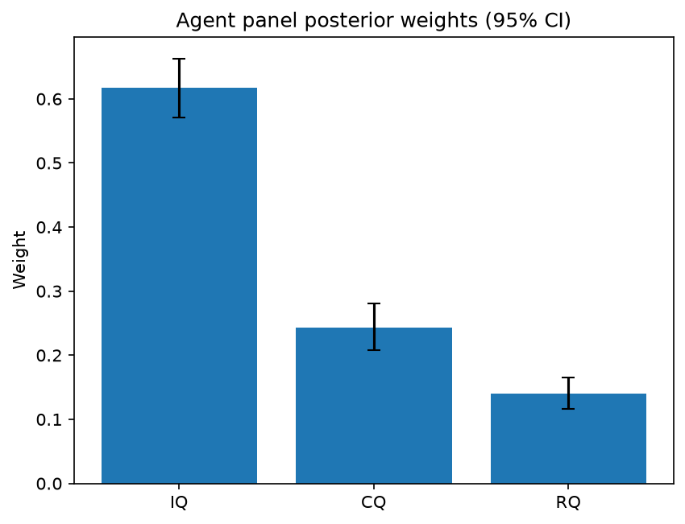

# Survey report: TrustRouter Claude CLI Panel (haiku) -- Level L3a: Quality clusters (ISO 25012)

Survey ID: `trustrouter-claude-cli-full-panel-claude-haiku-2026-09-01-L3a`

## Agent panel

- Agents contributing a valid response: 36
- Classical BWM consistency: 36/36 within threshold

| Criterion | Mean | 95% CI lower | 95% CI upper |
|---|---|---|---|
| IQ | 0.6172 | 0.5704 | 0.6631 |
| CQ | 0.2433 | 0.2075 | 0.2804 |
| RQ | 0.1395 | 0.1160 | 0.1653 |

## Methodology

Each agent independently completed a Best-Worst Method (BWM) comparison: choosing the single most and least important criterion, then rating every criterion's importance relative to those two on a 1-9 scale. Individual responses were solved with the classical BWM linear program (Rezaei, 2015) for a consistency check, and combined across the panel with a hierarchical Bayesian model (Mohammadi and Rezaei, 2020).

36 agent response(s) were accepted into this result.

Every agent's run began with a QA precheck (its stated configuration verified against ground truth) and every accepted answer's self-reported sources were checked against what reference material was actually available to it; see the Per-agent detail section below and this survey's Conversation Log for each agent's specific results. Every response is schema-validated and independently, repeatedly sampled (never a single completion treated as ground truth); see `guardrails.py`. This survey's complete output is covered by a SHA-256 integrity manifest (`integrity_manifest.json`, `SHA256SUMS`), generated once this run finished, so any later alteration to these files is detectable.

### Charts

## Per-agent detail

### bim-coordinator-base-claude (`bim-coordinator-base-claude`)

- Role: BIM Coordinator
- Model: claude_cli/haiku
- DID: `did:key:z6MkjBimqskXZkR9Zx6uMHqsjZopoCEJaQ9tb7XoVSAZiujx`
- QA precheck: passed
- Sources used: shared knowledge: trustrouter_expert_questionnaire_v5_real_survey_instrument.md, general_knowledge

**Answer:** `{"best": "IQ", "worst": "RQ", "best_to_others": {"IQ": 1, "CQ": 4, "RQ": 5}, "others_to_worst": {"IQ": 5, "CQ": 3, "RQ": 1}}`

**Reasoning:**

From a BIM coordinator's perspective managing model federation and lifecycle documentation, Intrinsic Quality is most critical for blockchain-stored construction records because data immutability makes correctness irreversible. A record with inaccurate dimensions, material properties, or load ratings cannot be corrected after blockchain commitment; it remains wrong indefinitely and corrupts any downstream decision-making. Accuracy and validity are foundational—if underlying values are wrong, no amount of completeness or consistency will make the record trustworthy. Contextual Quality (completeness and timeliness) ranks second: incomplete data is problematic and late data loses value, but accurate partial information can still guide decisions and can be supplemented over time. Representational Quality ranks lowest for blockchain trust because consistency issues can often be addressed through schema transformation and data harmonization—correct values rendered inconsistently across federated models are far preferable to inconsistently represented wrong values. In renovation projects especially, where custody and modification history matter, the accuracy of what was actually built matters more than whether multiple models express it in identical formats. IQ is rated 4× more important than CQ because correctness trumps scope when data is immutable; 5× more important than RQ because accuracy cannot be retroactively salvaged through better representation, whereas formatting and consistency can be resolved post-capture. CQ is rated 3× more important than RQ because incompleteness and timing failures are more damaging to trust than consistency failures.

### bim-coordinator-base-claude (`bim-coordinator-base-claude`)

- Role: BIM Coordinator
- Model: claude_cli/haiku
- DID: `did:key:z6MkjBimqskXZkR9Zx6uMHqsjZopoCEJaQ9tb7XoVSAZiujx`
- QA precheck: passed
- Sources used: shared knowledge: trustrouter_expert_questionnaire_v5_real_survey_instrument.md, shared knowledge: trustrouter_concept_paper_primer.md, general_knowledge

**Answer:** `{"best": "IQ", "worst": "RQ", "best_to_others": {"IQ": 1, "CQ": 4, "RQ": 6}, "others_to_worst": {"IQ": 6, "CQ": 2, "RQ": 1}}`

**Reasoning:**

From a BIM coordinator's perspective managing multi-stakeholder model federation and clash detection, **Intrinsic Quality (IQ) is the foundational criterion** for data trust in long-lived construction records. A model's accuracy, validity, and uniqueness are non-negotiable because structural dimensions, material properties, and system specifications cascade into every downstream decision—safety, cost, scheduling, and compliance verification. An inaccurate structural dimension stored in blockchain creates permanent, federated liability across all stakeholders; no amount of completeness or consistency can recover from this fundamental flaw. This judgment reflects 10+ years of experience observing that geometric and specification errors drive the costliest project failures. **Contextual Quality (CQ) ranks second**: completeness and timeliness are essential for actionable decision-making, especially for a building serving institutional owners, insurers, and authorities for decades. However, a single accurate, timely attribute is more useful than all attributes present but some incorrect. **Representational Quality (RQ) is least important**: while consistency across federated models prevents confusion among disciplines, it is derivative of the data's inherent trustworthiness. You can manage partial inconsistency between architectural and structural models if both are individually accurate; you cannot manage propagating inaccuracy across consistent copies. The ratings reflect: IQ is 4× more important than CQ (accuracy beats completeness in priority), IQ is 6× more important than RQ (accuracy far outweighs consistency as a trust factor), and CQ is 2× more important than RQ (scope/timing beats representation format).

### bim-coordinator-base-claude (`bim-coordinator-base-claude`)

- Role: BIM Coordinator
- Model: claude_cli/haiku
- DID: `did:key:z6MkjBimqskXZkR9Zx6uMHqsjZopoCEJaQ9tb7XoVSAZiujx`
- QA precheck: passed
- Sources used: shared knowledge: trustrouter_expert_questionnaire_v5_real_survey_instrument.md, shared knowledge: trustrouter_concept_paper_primer.md, general_knowledge

**Answer:** `{"best": "IQ", "worst": "RQ", "best_to_others": {"IQ": 1, "CQ": 4, "RQ": 6}, "others_to_worst": {"IQ": 6, "CQ": 2, "RQ": 1}}`

**Reasoning:**

As a BIM coordinator managing multi-stakeholder federated models over decades, I rank Intrinsic Quality as best because accuracy, validity, and uniqueness are foundational trust properties—especially for institutional records supporting structural, energy, and compliance decisions in a long-term renovation context. Wrong data that is complete, timely, and consistent across sources is worse than incomplete but accurate data; accuracy cannot be recovered by consistency or timeliness alone. Contextual Quality (completeness + timeliness) ranks second: for institutional use spanning decades, having current, complete records matters significantly, but gaps in accurate data are preferable to errors. Representational Quality ranks worst because: (1) in a properly designed blockchain archive with version control and metadata, consistency issues can be managed via audit trails rather than being a primary trust failure; (2) the Hospital Real scenario involves archival of renovation records where a single authoritative version-controlled source is the design pattern, not continuous federation across mutable sources; (3) consistency presupposes that underlying data is accurate—consistent errors are trust failures. In federated BIM during *active design*, RQ would rank higher, but for long-term institutional storage and lifecycle documentation, IQ dominates. IQ is rated 4× more important than CQ (accuracy critical, but completeness still matters), and 6× more important than RQ (accuracy foundational, consistency secondary). CQ rates 2× more important than RQ (gaps are preferable to versioning confusion for an archivist, though both matter far less than getting the data right).

### bim-coordinator-rag-claude (`bim-coordinator-rag-claude`)

- Role: BIM Coordinator
- Model: claude_cli/haiku
- DID: `did:key:z6MkgKPXYGDwJ56epiD68PaM63oukrBdhu5ziYGo84AZKm9n`
- QA precheck: passed
- Sources used: bim_and_digital_building_logbooks.md, shared knowledge: trustrouter_expert_questionnaire_v5_real_survey_instrument.md, shared knowledge: trustrouter_concept_paper_primer.md, general_knowledge

**Answer:** `{"best": "IQ", "worst": "CQ", "best_to_others": {"IQ": 1, "CQ": 4, "RQ": 2}, "others_to_worst": {"IQ": 4, "CQ": 1, "RQ": 2}}`

**Reasoning:**

As a BIM Coordinator managing federated models on renovation projects, my assessment prioritizes Intrinsic Quality (IQ) as Best because accuracy and validity of construction records are foundational for blockchain storage, where immutability makes errors permanent. In the Hospital Real scenario—data serving institutional owners, insurers, and authorities over decades—wrong dimensions, structural properties, or material specifications can cascade into design errors, clash-detection failures, and regulatory liability. A federated BIM depends on each source being accurate before consistency can be meaningful. Representational Quality (RQ) ranks second because consistency across parties is essential for federation and aligns with ISO 19650's independent validation requirement (reference: bim_and_digital_building_logbooks.md), but RQ only amplifies errors if source accuracy is poor. Contextual Quality (CQ) ranks Worst because while completeness matters, timeliness is less critical for historical/archival records, and staged delivery with documented gaps is more manageable than inaccurate or inconsistent data. The 4:2:1 ratio (IQ:RQ:CQ) reflects that accuracy is the precondition for trustworthy federation, consistency follows from accurate sources, and completeness can be managed around known constraints. For blockchain specifically, where a party cannot later correct stored data (reference: shared knowledge: trustrouter_concept_paper_primer.md on immutability), accuracy before commit is non-negotiable.

### bim-coordinator-rag-claude (`bim-coordinator-rag-claude`)

- Role: BIM Coordinator
- Model: claude_cli/haiku
- DID: `did:key:z6MkgKPXYGDwJ56epiD68PaM63oukrBdhu5ziYGo84AZKm9n`
- QA precheck: passed
- Sources used: bim_and_digital_building_logbooks.md, shared knowledge: trustrouter_concept_paper_primer.md, general_knowledge

**Answer:** `{"best": "IQ", "worst": "RQ", "best_to_others": {"IQ": 1, "CQ": 3, "RQ": 6}, "others_to_worst": {"IQ": 6, "CQ": 2, "RQ": 1}}`

**Reasoning:**

As a BIM coordinator managing federated models over decades-long renovation projects, I rank Intrinsic Quality (IQ) as best because accuracy, validity, and uniqueness of the underlying data are foundational to trust. If structural geometry, material specifications, or system configurations are inaccurate, no downstream institutional decision—insurance claims, regulatory compliance, design intervention—can be trusted, regardless of how complete or consistent the record is. For blockchain-stored construction records that will inform decisions over decades, the data's correctness at its source is non-negotiable.

Contextual Quality (CQ—completeness and timeliness) ranks second. Renovation projects require comprehensive information (all building systems documented) and current data reflecting actual as-built conditions. However, incompleteness or staleness is more recoverable than inaccuracy: an incomplete record can be supplemented; an inaccurate one cannot be trusted when supplemented with more inaccurate data. CQ is significantly important but derivative of IQ.

Representational Quality (RQ—consistency across sources) ranks last, not because it is unimportant, but because of how professional BIM federation already handles it and what blockchain adds. ISO 19650's information-delivery process (reference: bim_and_digital_building_logbooks.md) already requires independent validation across federated models before acceptance—consistency is a gatekeeping step enforced upstream. Additionally, blockchain's immutability and audit trail mean that version inconsistencies can be documented and traced; the provenance of different states is clear rather than hidden. Within a federated model managed under ISO 19650, consistency problems are typically identified and resolved before blockchain storage; where versions legitimately differ, their history is auditable.

The 3:1 ratio (IQ vs CQ) reflects that accuracy is foundational but completeness is still essential. The 6:1 ratio (IQ vs RQ) reflects that accuracy is far more trust-critical than consistency when the consistency-assurance process is already established by professional practice. The 2:1 ratio (CQ vs RQ) reflects that timeliness and completeness matter for utility but are secondary to the accuracy-first and process-enforced-consistency baseline.

### bim-coordinator-rag-claude (`bim-coordinator-rag-claude`)

- Role: BIM Coordinator
- Model: claude_cli/haiku
- DID: `did:key:z6MkgKPXYGDwJ56epiD68PaM63oukrBdhu5ziYGo84AZKm9n`
- QA precheck: passed
- Sources used: bim_and_digital_building_logbooks.md, shared knowledge: trustrouter_expert_questionnaire_v5_real_survey_instrument.md, general_knowledge

**Answer:** `{"best": "IQ", "worst": "RQ", "best_to_others": {"IQ": 1, "CQ": 2, "RQ": 3}, "others_to_worst": {"IQ": 3, "CQ": 2, "RQ": 1}}`

**Reasoning:**

As a BIM coordinator managing multi-stakeholder model federation, I rank Intrinsic Quality (accuracy, validity, uniqueness) as Best because it is the foundational criterion on which all other data qualities depend. In practice, an inaccurate spatial model or specification will compromise clash detection, coordination, and construction safety regardless of how consistent or timely it is—this is a non-negotiable starting point in BIM. The Hospital Real scenario reinforces this: renovation of a complex public asset serving institutional owners, insurers, and authorities over decades demands absolute accuracy in structural, energy, and compliance data before anything else. Contextual Quality (completeness, timeliness) ranks second; it is nearly as critical for project delivery and long-term asset stewardship, but a dataset can be slightly less complete and still usable if the parts present are accurate, whereas inaccurate data cannot be rescued by timeliness alone. Representational Quality (consistency across sources) ranks Worst among the three because, while essential for multi-party federation, it is a secondary quality check that depends on both IQ and CQ being sound first. Consistency of poor data serves no one; consistent accuracy is the goal. In the real ISO 19650 validation process that BIM coordinators execute (multiple independent parties validating federated models), consistency is verified *after* the source data is sound, not before. The ratings reflect IQ's slight but clear primacy (2x more important than CQ, 3x more important than RQ) while acknowledging that all three clusters matter in construction data management.

### blockchain-engineer-base-claude (`blockchain-engineer-base-claude`)

- Role: Blockchain / DLT Engineer
- Model: claude_cli/haiku
- DID: `did:key:z6MkjavCfxYpe2BkYMXfrJDvcH43kkcZRgoJAFJLDqtqyLmk`
- QA precheck: passed
- Sources used: shared knowledge: trustrouter_concept_paper_primer.md, shared knowledge: trustrouter_expert_questionnaire_v5_real_survey_instrument.md, general_knowledge

**Answer:** `{"best": "IQ", "worst": "CQ", "best_to_others": {"IQ": 1, "RQ": 3, "CQ": 5}, "others_to_worst": {"IQ": 5, "RQ": 3, "CQ": 1}}`

**Reasoning:**

From a blockchain/DLT engineer's perspective on permissioned-ledger deployments for construction data, Intrinsic Quality is most influential because the ledger itself cannot fix intrinsically incorrect data. A Byzantine-resistant or cryptographically secured ledger proves WHO asserted what and WHEN, but cannot enforce whether measurements are accurate, coordinate systems are valid, or records are free of contradictions. In construction—where safety, compliance, and liability consequences depend on data correctness—a blockchain cannot substitute for source validity. An IFC model stored on ledger with wrong structural loads remains dangerous; the immutability is a liability, not an asset. Representational Quality ranks second: in distributed/permissioned ledger deployments with multiple contributors (architects, engineers, contractors), consistency across formats (IFC vs. JSON, signed report vs. CAD model) directly affects verification strength and trust chains. Inconsistency can render the ledger untrustworthy because conflicts are immutable and cannot be resolved post facto. Contextual Quality (Completeness and Timeliness) ranks lowest because: (1) blockchain itself provides immutable timestamping, partially addressing timeliness concerns; (2) partial but accurate records retain value for historical lineage and provenance use cases—blockchain excels at proving what WAS recorded and in what order, even if the snapshot is incomplete at any given moment; (3) for ledger-based construction records, proof of accurate historical state matters more than real-time completeness. A complete, up-to-date record is useful operationally, but an incomplete but valid historical record is more defensible in litigation and audit contexts—blockchain's core strength. The 5-to-1 ratio for IQ-to-CQ reflects this: bad data is fundamentally incompatible with ledger utility; missing or stale data is a limitation, not a breaking flaw.

### blockchain-engineer-base-claude (`blockchain-engineer-base-claude`)

- Role: Blockchain / DLT Engineer
- Model: claude_cli/haiku
- DID: `did:key:z6MkjavCfxYpe2BkYMXfrJDvcH43kkcZRgoJAFJLDqtqyLmk`
- QA precheck: passed
- Sources used: shared knowledge: trustrouter_concept_paper_primer.md, general_knowledge

**Answer:** `{"best": "IQ", "worst": "RQ", "best_to_others": {"IQ": 1, "CQ": 3, "RQ": 7}, "others_to_worst": {"IQ": 7, "CQ": 2, "RQ": 1}}`

**Reasoning:**

From a blockchain/DLT engineer's perspective focused on permissioned-ledger deployments and tamper-evidence guarantees, Intrinsic Quality (IQ) is the foundational criterion for construction-project records. The core value proposition of blockchain is creating immutable evidence of data presence and integrity, not correcting underlying data defects. If a record is inaccurate (wrong coordinates, specifications, or material certifications), validity-invalid (non-conforming to required schemas like IFC), or non-unique (ambiguous identity of structural elements or material batches), placing it on-chain with tamper-evidence does not remediate those problems—it only makes the error permanent and widely witnessed. In construction contexts, such inaccuracy directly risks safety compliance, structural integrity, project disputes, and financial harm. Contextual Quality (CQ)—completeness and timeliness—is important for operational utility and decision-making, particularly for active construction coordination. However, completeness and timeliness can be enforced through data governance, schema validation, and application-layer business logic in a permissioned environment, reducing their criticality compared to the fundamental accuracy of what is recorded. Representational Quality (RQ)—consistency across sources—is the least critical for this use case. In a permissioned ledger with centralized governance and enforced schema, a single canonical record on-chain naturally resolves many consistency problems; this is one of blockchain's architectural advantages for construction. While consistency matters for interoperability and reducing confusion, it is more addressable through standardized encoding at the application layer than IQ or CQ failures. Internally, this ranking reflects: IQ is approximately 7 times more important than RQ, 3 times more important than CQ, with CQ approximately 2 times more important than RQ.

### blockchain-engineer-base-claude (`blockchain-engineer-base-claude`)

- Role: Blockchain / DLT Engineer
- Model: claude_cli/haiku
- DID: `did:key:z6MkjavCfxYpe2BkYMXfrJDvcH43kkcZRgoJAFJLDqtqyLmk`
- QA precheck: passed
- Sources used: shared knowledge: trustrouter_concept_paper_primer.md, shared knowledge: trustrouter_expert_questionnaire_v5_real_survey_instrument.md, general_knowledge

**Answer:** `{"best": "IQ", "worst": "RQ", "best_to_others": {"IQ": 1, "CQ": 5, "RQ": 8}, "others_to_worst": {"IQ": 8, "CQ": 3, "RQ": 1}}`

**Reasoning:**

From a blockchain/DLT engineer's perspective focused on construction-project records, Intrinsic Quality (IQ—accuracy, validity, uniqueness) is the dominant factor because blockchain's immutability creates an asymmetric cost structure around recording errors. Once a construction record (structural certification, compliance attestation, material specification) is committed to an immutable ledger, inaccuracy becomes a permanent, costly liability. A blockchain's trust proposition depends fundamentally on the integrity of data at the point of commitment, not on how consistently it is later formatted or managed operationally. Contextual Quality (CQ—completeness, timeliness) ranks second; incomplete or delayed data can still be accurate within its scope, and timeliness is primarily an operational concern rather than a tamper-evidence or trust concern. Governance and operational discipline can mitigate CQ gaps. Representational Quality (RQ—consistency across sources) ranks lowest; consistency in data representation can be enforced through schema validation and programmatic rules, and it addresses a surface-level concern relative to accuracy. A consistently formatted but inaccurate record is worse than an inconsistently formatted but accurate one. The 8:1 ratio (IQ to RQ) reflects the primacy of accuracy under immutability; the 5:1 ratio (IQ to CQ) reflects that accuracy and validity are more foundational to blockchain trust than operational completeness or timeliness; the 3:1 ratio (CQ to RQ) reflects that completeness at least affects decision-making, whereas consistency is primarily a usability concern.

### blockchain-engineer-rag-claude (`blockchain-engineer-rag-claude`)

- Role: Blockchain / DLT Engineer
- Model: claude_cli/haiku
- DID: `did:key:z6MkooUJEyuLt3VzrACQLf8YLETe6fkJK66UWcp4jm9g2LzP`
- QA precheck: passed
- Sources used: shared knowledge: blockchain_trust_and_attack_resistance.md, shared knowledge: trustrouter_concept_paper_primer.md, general_knowledge

**Answer:** `{"best": "IQ", "worst": "RQ", "best_to_others": {"IQ": 1, "CQ": 2, "RQ": 3}, "others_to_worst": {"IQ": 3, "CQ": 2, "RQ": 1}}`

**Reasoning:**

IQ (Intrinsic Quality: accuracy, validity, uniqueness) is the most influential criterion for routing construction data to blockchain. From a blockchain engineer's perspective: immutability is the ledger's defining property, which means inaccurate or invalid data becomes a permanent liability rather than an asset. Once recorded on-chain, an accuracy or validity failure cannot be corrected—only worked around. This asymmetry makes IQ foundational; no amount of completeness, timeliness, or consistency can remedy data that is fundamentally wrong. Rouhani and Deters (2021) emphasize that blockchain-based data trust frameworks depend on the initial credibility of the recorded data itself, with adaptive transaction validation based on trust scores, but that model assumes input data is valid to begin with (shared knowledge: blockchain_trust_and_attack_resistance.md).

RQ (Representational Quality: consistency across sources) is least influential, though still necessary, because blockchain's consensus and cryptographic mechanisms naturally enforce consistency across distributed copies. If data is accurate and entered once on-chain via proper access controls, consistency across replicas is largely a solved problem—it is what blockchain does by design. Conversely, CQ (Completeness and Timeliness) sits between the two: construction projects depend on complete, current information for coordination and decision-making, and blockchain's consensus latency can actually hinder timeliness. However, CQ is more addressable through schema validation and application-layer logic than IQ is, and it depends less directly on blockchain's specific strengths.

For construction-project records considered for on-chain routing, the ranking reflects: IQ as prerequisite (3x more important than RQ), CQ as practical necessity (2x more important than RQ), and RQ as what the ledger inherently provides. This is consistent with the ISO 25012 quality model as applied to permissioned ledger deployments (shared knowledge: trustrouter_concept_paper_primer.md).

### blockchain-engineer-rag-claude (`blockchain-engineer-rag-claude`)

- Role: Blockchain / DLT Engineer
- Model: claude_cli/haiku
- DID: `did:key:z6MkooUJEyuLt3VzrACQLf8YLETe6fkJK66UWcp4jm9g2LzP`
- QA precheck: passed
- Sources used: shared knowledge: trustrouter_concept_paper_primer.md, blockchain_trust_and_attack_resistance.md, general_knowledge

**Answer:** `{"best": "IQ", "worst": "CQ", "best_to_others": {"IQ": 1, "RQ": 2, "CQ": 4}, "others_to_worst": {"IQ": 4, "RQ": 2, "CQ": 1}}`

**Reasoning:**

From a permissioned-blockchain perspective, IQ (Intrinsic Quality: accuracy, validity, uniqueness) is most influential for construction-data routing decisions, while CQ (Contextual Quality: completeness, timeliness) is least. The reasoning follows three arguments: (1) Irreversibility: on immutable ledgers, inaccurate or invalid records cannot be corrected retroactively, whereas incomplete data can be supplemented or queried-around at the application layer. A measurement that is wrong is permanently wrong; missing data is a solvable operational problem. (2) Foundation for downstream use: construction validity depends critically on conformance to standards (IFC, building codes, structural safety); an inaccurate coordinate system or material specification invalidates all dependent calculations and liability chains. Completeness and timeliness, while operationally important, do not determine trustworthiness if the data itself is sound. (3) Oracle problem: the reference material on attack resistance emphasizes that verification strength depends on diversity of independent sources—but only if those sources are individually accurate. Consistency across sources (RQ) helps detect tampering or systemic error, making it more important than temporal/operational completeness, but only after the source data itself is known to be accurate. IQ ranks 4× more important than CQ because accuracy gates the value of any other quality dimension; irreversible commitment to false data on-chain is the core failure mode. IQ ranks 2× more important than RQ because accuracy is prerequisite to verification, though RQ's cross-source consistency provides crucial secondary defense against the oracle problem (shared knowledge: trustrouter_concept_paper_primer.md definition of Q; blockchain_trust_and_attack_resistance.md on oracle/verification diversity; general_knowledge on permissioned-system immutability).

### blockchain-engineer-rag-claude (`blockchain-engineer-rag-claude`)

- Role: Blockchain / DLT Engineer
- Model: claude_cli/haiku
- DID: `did:key:z6MkooUJEyuLt3VzrACQLf8YLETe6fkJK66UWcp4jm9g2LzP`
- QA precheck: passed
- Sources used: shared knowledge: trustrouter_concept_paper_primer.md, general_knowledge

**Answer:** `{"best": "IQ", "worst": "RQ", "best_to_others": {"IQ": 1, "CQ": 3, "RQ": 5}, "others_to_worst": {"IQ": 5, "CQ": 2, "RQ": 1}}`

**Reasoning:**

For construction-project records on an immutable blockchain ledger, Intrinsic Quality (accuracy, validity, uniqueness) is the most critical factor. Blockchain's immutability is a double-edged sword: once incorrect data is recorded, it cannot be erased—only amended, creating a permanent liability and audit trail of the error. This makes accuracy and validity non-negotiable foundations for construction records, where structural calculations, material certifications, and compliance proofs are legally and safety-critical. Contextual Quality (completeness, timeliness) is important but secondary: incomplete data can be remedied through future submissions or process improvements; inaccurate data on an immutable ledger cannot. Representational Quality (consistency across sources) is least influential for the routing decision. Consistency of representation is a downstream usability and interoperability concern; if the underlying data is accurate and complete, representation inconsistencies are manageable. Conversely, consistent representation of inaccurate or incomplete data does not solve the core trust problem blockchain is meant to address. The 3:2 ratio between CQ and RQ reflects that completeness is functionally necessary for a construction logbook, whereas consistency is supplementary to correctness. The 5:1 ratio IQ:RQ reflects the foundational importance of accuracy in immutable systems.

### compliance-officer-base-claude (`compliance-officer-base-claude`)

- Role: Compliance and Regulatory Officer
- Model: claude_cli/haiku
- DID: `did:key:z6MkgGS4Yb7TwydcexnZQyhuB5HMp1ig3wLJaXRe6WiEC8hb`
- QA precheck: passed
- Sources used: shared knowledge: trustrouter_concept_paper_primer.md, shared knowledge: trustrouter_expert_questionnaire_v5_real_survey_instrument.md, general_knowledge

**Answer:** `{"best": "IQ", "worst": "RQ", "best_to_others": {"IQ": 1, "CQ": 3, "RQ": 5}, "others_to_worst": {"IQ": 5, "CQ": 3, "RQ": 1}}`

**Reasoning:**

As a Compliance and Regulatory Officer, my ranking prioritizes data accuracy and validity as foundational to regulatory compliance. IQ (Intrinsic Quality: accuracy, validity, uniqueness) is the best because GDPR Article 5 mandates accurate data processing, and construction safety standards require accurate records of construction activities and conditions. A record that is inaccurate in its core values cannot satisfy compliance obligations regardless of how complete, timely, or consistent it may be. RQ (Representational Quality: consistency across sources) is the worst because while consistency provides additional confidence in a blockchain context, it is a secondary property that depends on the quality of underlying sources. If sources are inconsistent, that signals a governance problem, not a quality problem—and if all sources are consistently wrong, consistency adds no compliance value. CQ (Contextual Quality: completeness, timeliness) ranks between them as important but secondary to accuracy. Regulatory requirements do mandate complete records and timely reporting, but an incomplete or slightly dated record that is accurate remains compliant in substance; an incomplete record that is inaccurate fails compliance entirely. In blockchain storage for construction records specifically, the immutability of the ledger makes accuracy at the point of entry critical—errors cannot be corrected later—whereas consistency and completeness can be addressed through governance processes. IQ is rated 3× more important than CQ (accuracy is more foundational than completeness to regulatory validity) and 5× more important than RQ (accuracy far outweighs consistency as a compliance requirement). CQ is rated 3× more important than RQ (completeness/timeliness are directly required by regulations; consistency is a meta-property).

### compliance-officer-base-claude (`compliance-officer-base-claude`)

- Role: Compliance and Regulatory Officer
- Model: claude_cli/haiku
- DID: `did:key:z6MkgGS4Yb7TwydcexnZQyhuB5HMp1ig3wLJaXRe6WiEC8hb`
- QA precheck: passed
- Sources used: shared knowledge: trustrouter_concept_paper_primer.md, shared knowledge: trustrouter_expert_questionnaire_v5_real_survey_instrument.md, general_knowledge

**Answer:** `{"best": "IQ", "worst": "RQ", "best_to_others": {"IQ": 1, "CQ": 3, "RQ": 5}, "others_to_worst": {"IQ": 5, "CQ": 3, "RQ": 1}}`

**Reasoning:**

From a construction compliance and GDPR perspective, Intrinsic Quality (IQ)—accuracy, validity, uniqueness—is the foundational criterion. GDPR explicitly mandates data accuracy as a core principle, and construction safety depends critically on accurate records. Without intrinsic correctness, no downstream quality attribute can remediate the breach of compliance. Contextual Quality (CQ)—completeness and timeliness—ranks second: GDPR requires data to be adequate and relevant to its purpose, and construction projects are time-bound; incomplete or stale data fails regulatory obligations. Representational Quality (RQ)—consistency across sources—ranks least important, though not negligibly. While consistency matters for audit trails and distributed-ledger verification, it is more a property that emerges from sound IQ and CQ than a primary compliance requirement. You can have accurate, complete, timely data that is representationally inconsistent (different formatting, schemas) and still meet substantive compliance; conversely, you can have perfectly consistent-but-wrong data that fails compliance entirely. The ratio 5:3:1 (IQ:CQ:RQ) reflects this hierarchy: IQ is approximately 1.7× more critical than CQ, and substantially more critical than RQ, while CQ and RQ are closer in secondary importance.

### compliance-officer-base-claude (`compliance-officer-base-claude`)

- Role: Compliance and Regulatory Officer
- Model: claude_cli/haiku
- DID: `did:key:z6MkgGS4Yb7TwydcexnZQyhuB5HMp1ig3wLJaXRe6WiEC8hb`
- QA precheck: passed
- Sources used: shared knowledge: trustrouter_concept_paper_primer.md, shared knowledge: trustrouter_expert_questionnaire_v5_real_survey_instrument.md, general_knowledge

**Answer:** `{"best": "IQ", "worst": "RQ", "best_to_others": {"IQ": 1, "CQ": 3, "RQ": 6}, "others_to_worst": {"IQ": 6, "CQ": 2, "RQ": 1}}`

**Reasoning:**

As a compliance and regulatory officer responsible for GDPR and construction-regulatory obligations, I ground this judgment in the substantive requirements of the frameworks I administer. Intrinsic Quality (IQ—accuracy, validity, uniqueness) is the best criterion because construction records in blockchain storage must be fundamentally correct to satisfy regulatory mandates. GDPR Article 5(1)(a) explicitly requires accuracy; building codes and safety regulations depend on correct structural, electrical, mechanical, and life-safety data. An inaccurate record that is immutably recorded on blockchain becomes a compliance liability, not an asset—the permanence amplifies the risk of the error. Inaccuracy breaches regulatory duty regardless of completeness or timeliness. Contextual Quality (CQ—completeness, timeliness) ranks second. Both are explicitly regulated (e.g., energy-performance disclosure deadlines, audit-trail timing requirements), and an incomplete record can fail an inspection or audit. However, completeness failures are typically identifiable and remediable; accuracy failures often propagate undetected into downstream decisions and regulatory breaches. Representational Quality (RQ—consistency across sources) ranks worst. While consistency strengthens trustworthiness and integration, it does not ensure substantive correctness. A consistently formatted but inaccurate record remains inaccurate. RQ is a 'quality of service' dimension; IQ and CQ are 'regulatory gate-keepers.' The ratios reflect that: IQ is roughly 3× more important than CQ (both critical, but accuracy is foundational), and CQ is roughly 2× more important than RQ (compliance-relevant vs. format-coherence). No trade-off between the three is close; the hierarchy is well-grounded in audit, liability, and statutory requirements specific to this role.

### compliance-officer-rag-claude (`compliance-officer-rag-claude`)

- Role: Compliance and Regulatory Officer
- Model: claude_cli/haiku
- DID: `did:key:z6MkvsMfbM7uWXaYfBeyMot693DSNk3VXfm2U8UeY54UDj2D`
- QA precheck: passed
- Sources used: gdpr_and_data_governance.md, shared knowledge: trustrouter_concept_paper_primer.md, general_knowledge

**Answer:** `{"best": "IQ", "worst": "CQ", "best_to_others": {"IQ": 1, "RQ": 3, "CQ": 6}, "others_to_worst": {"IQ": 6, "RQ": 2, "CQ": 1}}`

**Reasoning:**

As a compliance officer assessing whether construction-project records should be stored on an immutable blockchain, intrinsic quality (IQ) is foundational and must be Best. Once a record is committed to an immutable ledger, accuracy, validity, and uniqueness cannot be corrected. Wrong material specifications, invalid safety certifications, or duplicate entries locked on blockchain create permanent regulatory liability and directly violate GDPR rights of rectification and erasure. This is the core gate: intrinsic data quality determines whether blockchain storage is legally and practically appropriate at all. From the GDPR governance materials (Wilson et al. 2019), blockchain's immutability directly conflicts with the right to erasure and complex data corrections; the decision to use blockchain must hinge on whether the data is accurate enough to warrant permanent storage with no correction path. Representational Quality (RQ—consistency across sources) ranks second. Consistency matters for blockchain's multi-party verification value and audit credibility, and inconsistencies should be resolved before blockchain entry. However, inconsistencies are detectable and their sources are auditable; they do not create the same irreversible lock-in risk as intrinsic inaccuracy. Contextual Quality (CQ—completeness and timeliness) ranks Worst, though not negligibly. Completeness and timeliness are important process-management and audit factors, but they present differently under immutability: incomplete records can be flagged and supplemented through process controls; late timestamps can be noted in audit logs. Neither creates the permanent data-integrity damage that IQ deficiencies do. CQ issues are governance and workflow problems, not immutability problems. From the construction context (Gartoumi 2024), the industry lacks rigorous decision criteria for blockchain appropriateness—this ranking reflects that the compliance gate must prioritize intrinsic data trustworthiness before any record reaches an immutable ledger.

### compliance-officer-rag-claude (`compliance-officer-rag-claude`)

- Role: Compliance and Regulatory Officer
- Model: claude_cli/haiku
- DID: `did:key:z6MkvsMfbM7uWXaYfBeyMot693DSNk3VXfm2U8UeY54UDj2D`
- QA precheck: passed
- Sources used: gdpr_and_data_governance.md, shared knowledge: trustrouter_concept_paper_primer.md

**Answer:** `{"best": "IQ", "worst": "RQ", "best_to_others": {"IQ": 1, "CQ": 3, "RQ": 6}, "others_to_worst": {"IQ": 6, "CQ": 2, "RQ": 1}}`

**Reasoning:**

From a Compliance and Regulatory Officer's perspective evaluating construction-project records for blockchain storage, Intrinsic Quality (accuracy, validity, uniqueness) is the paramount concern. The reference material from Wilson et al. 2019 (gdpr_and_data_governance.md) identifies the core tension: blockchain's immutability directly conflicts with GDPR's right to erasure and traditional data-management requirements. This creates a critical asymmetry—inaccurate data stored on an immutable ledger becomes a permanent compliance liability with no correction mechanism. Regulatory obligations (GDPR Article 5 on data accuracy, construction code compliance) depend first on having correct data; once that is compromised via immutability, no amount of completeness or cross-source consistency can remedy it. Contextual Quality (completeness, timeliness) ranks second. Regulatory audit trails and compliance documentation require complete records, and timely data is necessary for informed decision-making and remediation. However, complete but inaccurate data creates false confidence and regulatory exposure. Representational Quality (consistency across sources) ranks lowest. While cross-source consistency is useful as a validation heuristic, it is not a primary regulatory obligation and can be addressed through audit procedures and provenance tracking (which appear elsewhere in the TrustRouter model). A single authoritative, accurate source with documented provenance is superior to multiple inconsistent sources for regulatory purposes. The Gartoumi 2024 finding (gdpr_and_data_governance.md) that construction-sector blockchain adoption lacks rigorous decision criteria for legal and practical appropriateness reinforces this priority: the governance gate must filter for accuracy first, before any trust-weighted scoring occurs.

### compliance-officer-rag-claude (`compliance-officer-rag-claude`)

- Role: Compliance and Regulatory Officer
- Model: claude_cli/haiku
- DID: `did:key:z6MkvsMfbM7uWXaYfBeyMot693DSNk3VXfm2U8UeY54UDj2D`
- QA precheck: passed
- Sources used: gdpr_and_data_governance.md, shared knowledge: trustrouter_concept_paper_primer.md, shared knowledge: trustrouter_expert_questionnaire_v5_real_survey_instrument.md, general_knowledge

**Answer:** `{"best": "IQ", "worst": "RQ", "best_to_others": {"IQ": 1, "CQ": 2, "RQ": 6}, "others_to_worst": {"IQ": 6, "CQ": 3, "RQ": 1}}`

**Reasoning:**

As a facility-management compliance officer, my ranking prioritizes IQ (Intrinsic Quality) as the gating criterion for blockchain storage of construction records, with RQ (Representational Quality) as the least critical. This judgment follows from the governance gap and legal-compliance framing in the reference material. From gdpr_and_data_governance.md: blockchain's immutability directly conflicts with GDPR's right to erasure, and Wilson et al. (2019) emphasizes that blockchain must be reserved for uses that genuinely require immutability—audit logs and provenance—while traditional databases handle other workloads. A compliance officer cannot permit inaccurate, invalid, or duplicate data to be committed permanently to an immutable ledger; IQ is the prerequisite gating function. Accuracy and validity determine whether a record should ever reach blockchain storage. Uniqueness (part of IQ) prevents conflicting claims on-chain. CQ (Completeness and Timeliness) is important—construction regulations mandate that specific data elements exist and be recorded to schedule—but it is secondary to ensuring those elements are intrinsically correct at the source before immutability locks them in. RQ (Consistency across sources) is the least critical from a compliance standpoint. While cross-source agreement is desirable for dispute resolution and audit verification, RQ is derivative of source-level quality and is more a governance question (which party is authoritative?) than a data-quality gate. If records are intrinsically accurate and complete, representational consistency becomes achievable through governance rather than being a prerequisite quality dimension. The rating of IQ six times more important than RQ reflects the foundational role of accuracy in blockchain immutability compliance, while CQ's twofold elevation over RQ reflects the regulatory necessity of completeness and timely recording against the secondary verification value of cross-source consistency.

### data-engineer-base-claude (`data-engineer-base-claude`)

- Role: Data Engineering Specialist
- Model: claude_cli/haiku
- DID: `did:key:z6MkwWLFsHqByat9fpS7uQaUXhG2ERBVxYgB8hVuvtEatajg`
- QA precheck: passed
- Sources used: shared knowledge: trustrouter_expert_questionnaire_v5_real_survey_instrument.md, shared knowledge: trustrouter_concept_paper_primer.md, general_knowledge

**Answer:** `{"best": "IQ", "worst": "RQ", "best_to_others": {"IQ": 1, "CQ": 2, "RQ": 5}, "others_to_worst": {"IQ": 5, "CQ": 2, "RQ": 1}}`

**Reasoning:**

For construction-project records destined for blockchain storage, Intrinsic Quality (IQ) is most critical because blockchain's immutability makes upfront accuracy non-negotiable. Once a record is committed to a ledger, errors in accuracy, validity, or uniqueness cannot be easily corrected—they become permanent liabilities in project audit trails, financial reconciliation, and dispute resolution. A construction dataset with precise measurements, valid specifications, and deduplicated records serves the core purpose regardless of minor gaps. By contrast, Representational Quality (RQ)—consistency across sources—addresses a derivative concern: it verifies whether multiple copies agree, but does not fix the underlying accuracy problem if they all agree on incorrect data. RQ becomes valuable primarily as an audit mechanism after IQ and CQ are established. Contextual Quality (CQ) occupies the middle ground: completeness and timeliness matter substantially because construction operates under tight schedules and depends on comprehensive data for job-site coordination and billing. However, a complete but inaccurate record is less trustworthy than an accurate but slightly delayed one. My ratings reflect this hierarchy: IQ is 5× more important than RQ (foundational vs. derivative), 2× more important than CQ (accuracy over timeliness), and CQ is 2× more important than RQ (contextual fit over cross-record consistency). This ranking grounds in the blockchain and construction context: immutability, precision, and single-source-of-truth governance privilege accuracy first, then completeness and timeliness, then cross-source reconciliation.

### data-engineer-base-claude (`data-engineer-base-claude`)

- Role: Data Engineering Specialist
- Model: claude_cli/haiku
- DID: `did:key:z6MkwWLFsHqByat9fpS7uQaUXhG2ERBVxYgB8hVuvtEatajg`
- QA precheck: passed
- Sources used: shared knowledge: trustrouter_expert_questionnaire_v5_real_survey_instrument.md, shared knowledge: trustrouter_concept_paper_primer.md, general_knowledge

**Answer:** `{"best": "IQ", "worst": "RQ", "best_to_others": {"IQ": 1, "CQ": 2, "RQ": 4}, "others_to_worst": {"IQ": 4, "CQ": 2, "RQ": 1}}`

**Reasoning:**

From a data engineering perspective on construction-project records destined for blockchain storage, intrinsic quality (IQ—accuracy, validity, uniqueness) is the foundation. Blockchain's immutability means inaccurate data becomes a permanent liability; wrong measurements, material specs, or compliance records directly threaten structural safety and regulatory standing. No amount of consistency or completeness salvages intrinsically false data.

Contextual quality (CQ—completeness and timeliness) is important but secondary. Completeness matters: missing change orders or omitted inspections create blind spots in the audit trail. Timeliness, while valuable for active project coordination, becomes less critical once data is immutably recorded on the ledger—the blockchain itself provides a definitive historical record. A construction record that is accurate and reasonably complete but recorded with a slight delay is preferable to a current but inaccurate one.

Representational quality (RQ—consistency across source copies) ranks lowest for blockchain-stored construction data. Blockchain's design principle is a single canonical ledger; once data is recorded, there is one authoritative version, not multiple copies requiring reconciliation. If intrinsic accuracy is high and the data capture process is sound, consistency becomes a data governance and deduplication problem rather than a trust or integrity problem. Historical disputes in construction often turn on accuracy and completeness ("what was actually specified and recorded?"), not on whether multiple copies agree.

Ratings reflect: IQ is approximately 2× more critical than CQ (accuracy slightly outweighs completeness/timeliness), and CQ is 2× more critical than RQ (data scope and currency outweigh version consistency). This yields IQ 4× more important than RQ overall, consistent with the layered risk: inaccurate data > incomplete data > inconsistent copies (when underlying data is sound).

### data-engineer-base-claude (`data-engineer-base-claude`)

- Role: Data Engineering Specialist
- Model: claude_cli/haiku
- DID: `did:key:z6MkwWLFsHqByat9fpS7uQaUXhG2ERBVxYgB8hVuvtEatajg`
- QA precheck: passed
- Sources used: shared knowledge: trustrouter_concept_paper_primer.md, shared knowledge: trustrouter_expert_questionnaire_v5_real_survey_instrument.md, general_knowledge

**Answer:** `{"best": "IQ", "worst": "RQ", "best_to_others": {"IQ": 1, "CQ": 3, "RQ": 7}, "others_to_worst": {"IQ": 7, "CQ": 3, "RQ": 1}}`

**Reasoning:**

IQ (Intrinsic Quality—accuracy, validity, uniqueness) is the most critical dimension for construction-project records destined for blockchain storage. The fundamental property of blockchain is immutability: once data is committed to the ledger, it cannot be corrected or deleted. This makes accuracy and validity non-negotiable at the point of entry. An inaccurate record is permanently inaccurate; there is no recovery path through downstream governance. For construction data, this is catastrophic—e.g., structural loads recorded incorrectly, material specifications wrong, or safety-critical measurements invalid—these errors persist forever in the distributed ledger. Uniqueness within IQ is also important to prevent duplicate records that could cause ambiguity in the chain of custody or project timeline. CQ (Contextual Quality—completeness, timeliness) is important but secondary. Incomplete data hampers decision-making during active construction and complicates audits; timeliness affects operational responsiveness. However, these issues are addressable through data-entry governance, validation gates before blockchain commit, and backward-filling of late-arriving records with proper timestamping. Blockchain's append-only design actually supports complete historical records even if data arrives later than collection. RQ (Representational Quality—consistency across sources) is the least critical of the three. Construction projects inherently involve multiple independent parties (contractors, engineers, inspectors, facility managers) producing different versions of the truth at different times and from different vantage points. Blockchain systems are designed to track and reconcile such versions through transparent audit trails and timestamps. Consistency can be managed through reconciliation logic, version selection policies, and ledger-based adjudication, whereas IQ issues cannot be repaired post-commit. The multiplicative nature of TrustRouter's design (referenced in the concept paper) means that defects in foundational dimensions (IQ) cascade; a unit defect in accuracy is more damaging than a unit defect in consistency.

### data-engineer-rag-claude (`data-engineer-rag-claude`)

- Role: Data Engineering Specialist
- Model: claude_cli/haiku
- DID: `did:key:z6Mknx9SDBfJkpRBgat4tMwAWaw5EZtoMF8kY6JBeuWvWSen`
- QA precheck: passed
- Sources used: shared knowledge: trustrouter_expert_questionnaire_v5_real_survey_instrument.md, shared knowledge: trustrouter_concept_paper_primer.md, data_quality_and_polyglot_persistence.md, general_knowledge

**Answer:** `{"best": "IQ", "worst": "RQ", "best_to_others": {"IQ": 1, "CQ": 3, "RQ": 6}, "others_to_worst": {"IQ": 6, "CQ": 2, "RQ": 1}}`

**Reasoning:**

From a data engineering perspective on construction-project blockchain storage, Intrinsic Quality (IQ) is the most critical factor because blockchain's immutability means the accuracy, validity, and uniqueness of source data must be right BEFORE commitment; corrupted baseline facts cannot be repaired post-ledger. Construction decisions (cost allocations, safety protocols, schedule changes) depend on accurate base records, and blockchain provides no mechanism to retroactively correct IQ failures. Contextual Quality (CQ—completeness and timeliness) is important for decision-making but secondary; incomplete data can sometimes be backfilled via change orders or site records, and delayed-but-accurate data is usually preferable to immediate-but-inaccurate data. Representational Quality (RQ—consistency across copies) is the least critical because blockchain inherently solves this through distributed consensus; all nodes hold identical copies by design. The consistency problem that actually matters in construction (different contractors reporting different measurements or costs) is a source-credibility or provenance issue, not an RQ problem. RQ, in ISO 25012's sense (consistency of representation across data instances), is largely guaranteed by the technology itself and is therefore orthogonal to the data-engineering quality pipeline concerns this role addresses. Ratings reflect: IQ is 3x more important than CQ (foundational correctness outweighs contextual fit), IQ is 6x more important than RQ (IQ requires pipeline design and validation; RQ is technology-assured), and CQ is 2x more important than RQ (completeness and timing affect usability; consistency is a sunk cost of the ledger).

### data-engineer-rag-claude (`data-engineer-rag-claude`)

- Role: Data Engineering Specialist
- Model: claude_cli/haiku
- DID: `did:key:z6Mknx9SDBfJkpRBgat4tMwAWaw5EZtoMF8kY6JBeuWvWSen`
- QA precheck: passed
- Sources used: data_quality_and_polyglot_persistence.md, shared knowledge: trustrouter_expert_questionnaire_v5_real_survey_instrument.md, shared knowledge: trustrouter_concept_paper_primer.md, general_knowledge

**Answer:** `{"best": "IQ", "worst": "RQ", "best_to_others": {"IQ": 1, "CQ": 4, "RQ": 5}, "others_to_worst": {"IQ": 5, "CQ": 3, "RQ": 1}}`

**Reasoning:**

From a data engineering specialist's perspective on construction-project datasets destined for blockchain storage: Intrinsic Quality (IQ) is the foundational criterion because inaccuracy, invalidity, or duplication of core data creates an irreversible contamination of an immutable ledger. On a blockchain, the correctness of recorded facts—structural dimensions, contractual terms, inspection results, timestamps—cannot be retroactively repaired without breaking the chain's integrity guarantees. A construction record's accuracy and uniqueness are prerequisite to any downstream trust claim. Contextual Quality (CQ) ranks second: while completeness and timeliness are important operational concerns, an incomplete but accurate record (which can be enriched later in the pipeline) is preferable to a complete but inaccurate one; and delayed-but-correct data can still be reliably stored and audited. Representational Quality (RQ)—consistency across sources—ranks last in isolation because for a single construction-project record being committed to blockchain, internal consistency of that record is not the primary quality concern; consistency matters more in multi-source scenarios where reconciliation and deduplication are needed upstream, which is a separate data integration problem from whether the committed record itself is trustworthy. RQ also depends on IQ being met first: identical but wrong versions achieve consistency without trust. This ranking reflects the polyglot-persistence principle noted in the reference material (Prasad and S B, 2014): different data types and pipeline stages have different quality profiles; for immutable ledgers, intrinsic correctness dominates operational scheduling concerns.

### data-engineer-rag-claude (`data-engineer-rag-claude`)

- Role: Data Engineering Specialist
- Model: claude_cli/haiku
- DID: `did:key:z6Mknx9SDBfJkpRBgat4tMwAWaw5EZtoMF8kY6JBeuWvWSen`
- QA precheck: passed
- Sources used: data_quality_and_polyglot_persistence.md, shared knowledge: trustrouter_concept_paper_primer.md, shared knowledge: trustrouter_expert_questionnaire_v5_real_survey_instrument.md, general_knowledge

**Answer:** `{"best": "IQ", "worst": "RQ", "best_to_others": {"IQ": 1, "CQ": 4, "RQ": 7}, "others_to_worst": {"IQ": 7, "CQ": 2, "RQ": 1}}`

**Reasoning:**

From a data-engineering perspective on construction-project records destined for blockchain storage, Intrinsic Quality (IQ) is best, and Representational Quality (RQ) is worst. IQ—accuracy, validity, uniqueness—is foundational because blockchain's immutability means incorrect or duplicate data cannot be corrected retroactively without governance overhead. Once a flawed record is committed to the ledger, the data-engineering cost of remediating it is asymmetrically high. Construction projects have cascading temporal dependencies (e.g., inspection sequencing, material provenance chains); errors in intrinsic data quality propagate downstream through project logic in ways that incomplete or slightly-untimely data do not. CQ (Contextual Quality: completeness, timeliness) is notably important—missing data or data recorded after the fact reduces usability and complicates lineage tracking—but it does not compromise the correctness of what *is* present. RQ (Representational Quality: consistency across sources) is least critical in a blockchain context because the ledger itself serves as the single authoritative source. If data is validated properly on entry (IQ) and scoped correctly (CQ), representational consistency is enforced by the distributed consensus mechanism and ledger structure, not by pre-ingestion cross-source reconciliation. The polyglot-persistence literature (Prasad and S B, 2014, on energy data management) reinforces that different data types require different storage treatment per their structural needs; in blockchain's case, structural consistency is a property of the ledger, not something IQ/CQ/RQ must supply. The Rouhani and Deters (2021) trust framework emphasizes data provenance and auditing, which ties more closely to validation chains (IQ) and temporal accountability (CQ) than to cross-source agreement (RQ). The gap between IQ and CQ is 4× (IQ substantially more critical, but CQ still material for project sequencing). The gap between CQ and RQ is 2× (RQ is least critical but not negligible if data pathways do converge from multiple sources upstream of blockchain commitment).

### project-manager-base-claude (`project-manager-base-claude`)

- Role: Construction Project Manager
- Model: claude_cli/haiku
- DID: `did:key:z6MkmbMHfpwQi6Y7FbdLU12dMCxJZnxzRBXEPi1iKygbQ1AP`
- QA precheck: passed
- Sources used: shared knowledge: trustrouter_expert_questionnaire_v5_real_survey_instrument.md, general_knowledge

**Answer:** `{"best": "IQ", "worst": "RQ", "best_to_others": {"IQ": 1, "CQ": 2, "RQ": 4}, "others_to_worst": {"IQ": 4, "CQ": 2, "RQ": 1}}`

**Reasoning:**

From a construction project manager's perspective, Intrinsic Quality (accuracy, validity, uniqueness) is the foundation upon which all other quality dimensions rest. For a multi-decade public asset like the Hospital Real renovation, where records serve institutional owners, insurers, and authorities with legal and safety implications, inaccurate structural data, material specifications, or test results are worse than no record at all. Blockchain immutability amplifies this risk — wrong data becomes permanently embedded. Contextual Quality (completeness and timeliness) is the next priority. A PM must have complete documentation of what was built and when, and timely access to those records for decision-making. However, completeness is somewhat more tractable through document management procedures — missing records can be pursued and added. The PM can document the gap in coverage. Representational Quality (consistency across versions) ranks third because: (1) construction practice typically establishes a clear authoritative version (the as-built record or record drawings), and stakeholders know to consult that single source; (2) blockchain's immutability actually mitigates consistency risk — once recorded, a version cannot change; (3) version inconsistency is primarily a governance and reference problem, not a data-quality problem in the ISO 25012 sense. A PM can resolve which version is current; they cannot easily fix data that was recorded inaccurately to begin with. IQ and CQ are closer than IQ and RQ, reflecting that completeness is nearly as critical as accuracy in project management, but accuracy remains foundational.

### project-manager-base-claude (`project-manager-base-claude`)

- Role: Construction Project Manager
- Model: claude_cli/haiku
- DID: `did:key:z6MkmbMHfpwQi6Y7FbdLU12dMCxJZnxzRBXEPi1iKygbQ1AP`
- QA precheck: passed
- Sources used: shared knowledge: trustrouter_expert_questionnaire_v5_real_survey_instrument.md, general_knowledge

**Answer:** `{"best": "IQ", "worst": "RQ", "best_to_others": {"IQ": 1, "CQ": 4, "RQ": 6}, "others_to_worst": {"IQ": 6, "CQ": 2, "RQ": 1}}`

**Reasoning:**

As a construction project manager responsible for multi-stakeholder documentation over decades, accuracy and validity are foundational to trust. In the Hospital Real scenario (shared knowledge: trustrouter_expert_questionnaire_v5_real_survey_instrument.md), records must serve institutional owners, insurers, and authorities for regulatory and asset-protection decisions. A single inaccurate structural calculation, material test result, or compliance certification—if immutably recorded on blockchain—becomes a permanent liability that cannot be corrected, only appended. This amplifies the criticality of Intrinsic Quality: the data must be right the first time. Contextual Quality (completeness and timeliness) is secondary but operationally important; a missing record is problematic but recoverable, and late submission delays decisions but does not corrupt the record itself. Representational Quality (consistency across copies) ranks lowest in a blockchain context because the technology creates a single authoritative ledger; the 'copies problem' that RQ addresses is partially inherent to the solution itself. A project manager's core concern is whether the data accurately reflects what actually happened on site and whether it is available when needed—not whether multiple versions agree, which blockchain's immutability and versioning architecture help ensure. The 4:2:1 ratio between IQ, CQ, and RQ reflects that accuracy is approximately 4x more critical than timeliness/completeness for institutional asset records, and both are substantially more critical than cross-copy consistency.

### project-manager-base-claude (`project-manager-base-claude`)

- Role: Construction Project Manager
- Model: claude_cli/haiku
- DID: `did:key:z6MkmbMHfpwQi6Y7FbdLU12dMCxJZnxzRBXEPi1iKygbQ1AP`
- QA precheck: passed
- Sources used: shared knowledge: trustrouter_expert_questionnaire_v5_real_survey_instrument.md, general_knowledge

**Answer:** `{"best": "CQ", "worst": "RQ", "best_to_others": {"CQ": 1, "IQ": 2, "RQ": 4}, "others_to_worst": {"CQ": 4, "IQ": 2, "RQ": 1}}`

**Reasoning:**

As a construction project manager coordinating multi-stakeholder documentation flows across a decades-long project lifecycle, Contextual Quality (completeness + timeliness) is the highest-priority criterion. The Hospital Real scenario explicitly requires data to serve institutional owners, insurers, and authorities across time. A PM's core responsibility is ensuring that the right documentation—structural drawings, inspection certificates, RFIs, progress records, material certificates—reaches each stakeholder at the moment they need it (for compliance audits, insurance claims, facility management, regulatory sign-offs, or future renovation phases). Missing documentation or late delivery creates cascading legal, compliance, and contractual risks that outweigh other quality dimensions. Intrinsic Quality (accuracy, validity, uniqueness) ranks second—correct technical specifications and valid test certificates are essential, but a competent PM can often work around minor inaccuracies if core documents are present and timely; conversely, complete but inaccurate data is itself a critical failure, so IQ remains firmly important. Representational Quality (consistency across copies) ranks last. While consistency matters for blockchain integrity, it is a technical property that becomes less critical once source data is accurate and complete; a single authoritative version with strong provenance (IQ) and timely distribution (CQ) largely mitigates consistency risk. A PM is judged on delivery, completeness, and stakeholder communication—not on de-duplication or version management. This ranking reflects the sequencing of risk exposure over a project's lifecycle: first ensure you have what you need and when you need it; second, ensure what you have is right; third, manage copies and consistency.

### project-manager-rag-claude (`project-manager-rag-claude`)

- Role: Construction Project Manager
- Model: claude_cli/haiku
- DID: `did:key:z6MkgcpBWMRETjwEN39T1S93W7uzSnGEo6oioFMta7r3bPMs`
- QA precheck: passed
- Sources used: construction_project_management_and_mcdm.md, shared knowledge: trustrouter_expert_questionnaire_v5_real_survey_instrument.md, general_knowledge

**Answer:** `{"best": "CQ", "worst": "RQ", "best_to_others": {"CQ": 1, "IQ": 2, "RQ": 6}, "others_to_worst": {"CQ": 6, "IQ": 3, "RQ": 1}}`

**Reasoning:**

From a construction project manager's perspective coordinating multi-stakeholder documentation across a building's full lifecycle, Contextual Quality (completeness + timeliness) is the most critical factor for blockchain-stored construction records. The Gartoumi (2024) reference on blockchain's dispute-resolution benefits specifically identifies incomplete or unverifiable documentation as the highest-cost failure mode in construction projects: 'under-documented or unverifiable data items (a change order, an inspection sign-off) create the highest downstream cost if trust cannot later be established.' Completeness directly addresses this—missing inspection records, change orders, or compliance certifications create institutional knowledge gaps and future liability for owners, insurers, and authorities. Timeliness ensures information is captured when it matters (e.g., structural inspection when performed, not weeks later). A PM's primary coordination function is ensuring documentation completeness across all stakeholders and lifecycle phases. Intrinsic Quality (accuracy, validity, uniqueness) is foundational but somewhat upstream of the PM's direct control; source credibility and input validation are typically managed by specialist roles (engineers, inspectors). RQ (representational consistency) is rated lowest because the blockchain structure itself provides immutability and consistency guarantees, reducing its practical importance as a decision criterion compared to whether the data is complete and timely. Inaccurate data compounds with incompleteness (IQ-CQ interaction), while consistency across copies is partially handled by the technology. The 2:1 ratio of CQ to IQ reflects that both matter significantly, but completeness is the dominant practical concern. The 3:1 ratio of IQ to RQ reflects that accuracy matters considerably more than consistency across copies, which blockchain architecture mitigates.

### project-manager-rag-claude (`project-manager-rag-claude`)

- Role: Construction Project Manager
- Model: claude_cli/haiku
- DID: `did:key:z6MkgcpBWMRETjwEN39T1S93W7uzSnGEo6oioFMta7r3bPMs`
- QA precheck: passed
- Sources used: construction_project_management_and_mcdm.md, shared knowledge: trustrouter_expert_questionnaire_v5_real_survey_instrument.md, general_knowledge

**Answer:** `{"best": "IQ", "worst": "RQ", "best_to_others": {"IQ": 1, "CQ": 3, "RQ": 6}, "others_to_worst": {"IQ": 6, "CQ": 2, "RQ": 1}}`

**Reasoning:**

From a construction project manager's perspective managing multi-stakeholder documentation for blockchain storage, Intrinsic Quality (accuracy, validity, uniqueness) is the most critical, and Representational Quality (consistency) is the least critical in this specific context. Reasoning: (1) Blockchain's core architectural feature is immutability and distributed consensus — it inherently solves the representational consistency problem by design. Once data is recorded on a blockchain, it is by definition consistent across all copies and cannot be silently altered. This is what blockchain *does best* for the construction domain. Therefore, RQ is the criterion least in need of evaluation as a trust factor; the technology handles it. (2) What blockchain *cannot* solve is whether the original data entered into the ledger is accurate. A wrong inspection result, a falsified material certificate, or an invalid signature on a change order will be recorded immutably and consistently — making the problem *worse*, not better. This aligns with Gartoumi's (2024) finding that blockchain's highest-value use case in construction is dispute resolution and document authenticity; disputes are resolved by establishing what actually happened (accuracy/validity), not by confirming copies match. (3) Between IQ and CQ: Intrinsic Quality is more fundamental. Incomplete or untimely data creates operational friction and decision delays, but inaccurate data creates liability and disputes. A construction PM would rationally prefer sparse-but-accurate documentation (high IQ, low CQ) over complete-and-timely-but-wrong documentation (low IQ, high CQ). Completeness and timeliness matter significantly — rated 2–3x less important than IQ — but accuracy is the bedrock.

### project-manager-rag-claude (`project-manager-rag-claude`)

- Role: Construction Project Manager
- Model: claude_cli/haiku
- DID: `did:key:z6MkgcpBWMRETjwEN39T1S93W7uzSnGEo6oioFMta7r3bPMs`
- QA precheck: passed
- Sources used: construction_project_management_and_mcdm.md, shared knowledge: trustrouter_expert_questionnaire_v5_real_survey_instrument.md, general_knowledge

**Answer:** `{"best": "IQ", "worst": "RQ", "best_to_others": {"IQ": 1, "CQ": 3, "RQ": 5}, "others_to_worst": {"IQ": 5, "CQ": 2, "RQ": 1}}`

**Reasoning:**

As a construction project manager coordinating multi-stakeholder documentation, my core responsibility is ensuring that records can be relied upon for their intended purpose: institutional compliance, dispute resolution, and regulatory accountability across decades. Intrinsic Quality (IQ—accuracy, validity, uniqueness) is foundational because a record that is inaccurate or invalid is actively harmful, regardless of how complete or consistent it is. Per Gartoumi 2024's analysis of blockchain in construction, the critical use case is dispute resolution, which hinges entirely on being able to verify that a record accurately reflects what actually happened—an IQ concern. A material test certificate with wrong lab results, a structural inspection with incorrect measurements, or a compliance statement that does not reflect actual conditions creates immediate liability and safety risk. Completeness (part of CQ) is the second-order concern: I need all required inspections and certificates, and I need them in time to meet regulatory deadlines or handover schedules. However, a late or incomplete but accurate record can be worked around; an accurate but missing inspection can trigger a field re-inspection. A complete but inaccurate record cannot be fixed without recreating the work or investigation it documents. Representational Quality (RQ—consistency across copies) is least critical in this context. Once a source record is established as accurate and complete on an immutable ledger, consistency across copies follows automatically; blockchain's immutability ensures all parties reference the same version. Consistency becomes a concern only if source accuracy is already compromised. I rate IQ 3× more important than CQ because the foundational trust problem—'Is this data what it claims to be?'—must be solved before completeness questions matter. I rate IQ 5× more important than RQ because accuracy is a prerequisite to trust; consistency without accuracy is worthless. I rate CQ 2× more important than RQ because completeness of accurate records is a real business constraint (regulatory, insurance, handover), whereas consistency is a property that flows from immutable source records.

### structural-engineer-base-claude (`structural-engineer-base-claude`)

- Role: Structural Engineer
- Model: claude_cli/haiku
- DID: `did:key:z6MkwHPjNHbEfDhha3TFbbzwGmk6cFQ7di85Qq6pNXn25w2M`
- QA precheck: passed
- Sources used: shared knowledge: trustrouter_expert_questionnaire_v5_real_survey_instrument.md, general_knowledge

**Answer:** `{"best": "IQ", "worst": "RQ", "best_to_others": {"IQ": 1, "CQ": 3, "RQ": 6}, "others_to_worst": {"IQ": 6, "CQ": 2, "RQ": 1}}`

**Reasoning:**

For a structural-capacity dossier relied upon by insurers, regulators, and building owners over decades, Intrinsic Quality (IQ—accuracy, validity, uniqueness) is foundational. If underlying facts are inaccurate or invalid—wrong material properties, incorrect section dimensions, falsified test certificates—the entire dossier is compromised regardless of other qualities. No amount of completeness or consistency can rescue fundamentally wrong data. A structural engineer responsible for this dossier must prioritize getting the facts right.

Contextual Quality (CQ—completeness, timeliness) ranks second. Missing or late data degrades usability and decision quality, but deficiencies here are recoverable within limits: decisions can be made on 80% complete data; late-arriving data remains useful for historical audit and legal purposes. The reference scenario emphasizes decades-long institutional reliance, where timestamping (solved by blockchain) is more critical than real-time delivery.

Representational Quality (RQ—consistency across sources) ranks least important in this blockchain context. Blockchain's core mechanism—distributed consensus and cryptographic immutability—mechanically ensures that copies remain consistent and verifiable across nodes. The RQ question of "do versions agree?" is largely answered by the ledger structure itself, not by data-quality choices upstream. This is a meaningful efficiency gain in the storage layer that reduces RQ's weight as a quality criterion. Moreover, different qualified practitioners producing different (but individually accurate) reports at different times is a coordination issue, not a data-quality flaw—one selects the authoritative version by provenance, not by hunting for consistency.

Ratios reflect that IQ is roughly twice as important as CQ (accuracy edges completeness in a dossier context), and CQ is roughly twice as important as RQ (usability matters more than mechanically guaranteed consistency). Sources: shared knowledge reference material on ISO 25012 quality clusters and the TrustRouter framework for construction-project blockchain storage, applied to professional judgment as a structural engineer responsible for decades-long reliance chains.

### structural-engineer-base-claude (`structural-engineer-base-claude`)

- Role: Structural Engineer
- Model: claude_cli/haiku
- DID: `did:key:z6MkwHPjNHbEfDhha3TFbbzwGmk6cFQ7di85Qq6pNXn25w2M`
- QA precheck: passed
- Sources used: shared knowledge: trustrouter_expert_questionnaire_v5_real_survey_instrument.md, general_knowledge

**Answer:** `{"best": "IQ", "worst": "RQ", "best_to_others": {"IQ": 1, "CQ": 2, "RQ": 6}, "others_to_worst": {"IQ": 6, "CQ": 3, "RQ": 1}}`

**Reasoning:**

For structural-capacity dossiers serving institutional owners, insurers, and authorities over decades, Intrinsic Quality (accuracy and validity of technical content) is foundational. In the Hospital Real scenario and across building lifecycles, structural safety depends directly on whether load calculations, material properties, capacity assessments, and design assumptions are correct. Inaccurate data—even if complete and consistent—creates life-safety risk and exposes insurers to false confidence in structural capacity. Inaccuracy cannot be compensated by other qualities.

Contextual Quality (completeness and timeliness) ranks second. A structural engineer cannot properly assess building capacity, plan renovations, or verify regulatory compliance without complete documentation or current information. Twenty-year-old inspection records without recent updates create decision blindness. However, if forced to choose between perfect consistency with incomplete/outdated data versus a single, complete, accurate record, the latter serves the engineer's professional duty better.

Representational Quality (consistency across copies) ranks third. In blockchain or distributed-ledger storage, consistency across nodes protects against tampering and drift, supporting verification of integrity. However, consistency is a necessary condition for trust, not a sufficient one for decision-making. If all copies of an inaccurate specification agree perfectly, that agreement provides false confidence. Consistency matters most as evidence that accurate, complete data has been preserved; it matters least as a substitute for substance.

The relative ratings reflect this hierarchy: IQ is twice as important as CQ because both are critical but accuracy precedes completeness in the causal chain of safety assurance. IQ is six times as important as RQ because RQ is derivative—it verifies the integrity of IQ and CQ but does not substitute for either. CQ is three times as important as RQ because having the right information available is more essential than having multiple identical copies of insufficient information.

### structural-engineer-base-claude (`structural-engineer-base-claude`)

- Role: Structural Engineer
- Model: claude_cli/haiku
- DID: `did:key:z6MkwHPjNHbEfDhha3TFbbzwGmk6cFQ7di85Qq6pNXn25w2M`
- QA precheck: passed
- Sources used: shared knowledge: trustrouter_expert_questionnaire_v5_real_survey_instrument.md, general_knowledge

**Answer:** `{"best": "IQ", "worst": "RQ", "best_to_others": {"IQ": 1, "CQ": 3, "RQ": 6}, "others_to_worst": {"IQ": 6, "CQ": 2, "RQ": 1}}`

**Reasoning:**

For a structural engineer managing capacity dossiers relied upon by insurers, regulators, and building owners over decades, IQ (Intrinsic Quality) is best because accuracy and validity of the underlying engineering data are foundational to safety. A single error in load calculations, material properties, or structural assumptions exposes downstream stakeholders to catastrophic risk, regardless of completeness or consistency. In professional practice, a faulty structural assessment—however well-documented—is worse than a correct one with minor gaps.

CQ (Contextual Quality) ranks second. Completeness matters significantly: missing load calculations, inspection results, or certification chains create dangerous knowledge gaps for insurers and regulators. However, a complete but erroneous record is worse than an incomplete but accurate one. An insurer preferring to request missing data over acting on false information reflects this hierarchy.

RQ (Representational Quality) ranks worst. While consistency across blockchain copies is important for tamper-detection and audit trails, it is secondary to data truth. A blockchain that reliably preserves an incorrect structural assessment provides false confidence; consistency without accuracy has no value. RQ serves integrity verification but does not ensure the data was correct in the first place.

Ratings reflect this hierarchy: IQ is 3× more important than CQ (accuracy is foundational; completeness is significant but secondary) and 6× more important than RQ (accuracy is non-negotiable; consistency is a verification tool, not a safety guarantee). CQ is 2× more important than RQ (missing data is a known gap requiring follow-up; false data is an unknown hazard).

### structural-engineer-rag-claude (`structural-engineer-rag-claude`)

- Role: Structural Engineer
- Model: claude_cli/haiku
- DID: `did:key:z6MkkkSr7eLXockuCDowP5tCv9MLkuxWwbxeWDZKDF1MzpSM`
- QA precheck: passed
- Sources used: structural_health_monitoring_and_digital_twins.md, shared knowledge: trustrouter_expert_questionnaire_v5_real_survey_instrument.md, general_knowledge

**Answer:** `{"best": "IQ", "worst": "RQ", "best_to_others": {"IQ": 1, "CQ": 4, "RQ": 6}, "others_to_worst": {"IQ": 6, "CQ": 3, "RQ": 1}}`

**Reasoning:**

As a structural engineer managing dossiers used for decades by insurers, regulators, and building owners, intrinsic quality must be best. The reference material on structural health monitoring emphasizes that 'a corrupted structural reading could mean a missed failure precursor' and asks 'how big is the impact if it is wrong'—for structural data, the impact is highest precisely because accuracy determines whether critical failures are caught. A design load calculation, material test result, or capacity assessment that is inaccurate cannot be redeemed by being consistent across copies or timely; it is fundamentally unsuitable for structural decision-making, regardless of blockchain's distribution guarantees. Contextual quality (completeness + timeliness) ranks second. Incomplete or delayed information impairs decision-making, but a well-documented, accurate, yet slightly delayed record is usable; an inaccurate one is not. Representational quality (consistency across sources) ranks last. Consistency matters—blockchain's strength lies in ensuring all parties see the same ledger—but it is instrumental, not foundational. If intrinsic data is accurate and contextually adequate, consistency follows from proper engineering practice and cryptographic anchoring. Conversely, perfect consistency of inaccurate or incomplete data creates false confidence and does not serve the long-term stewardship this scenario demands. A structural engineer would verify the source data's accuracy and completeness first; consistency is the mechanism that preserves these properties across custody, not the property itself.

### structural-engineer-rag-claude (`structural-engineer-rag-claude`)

- Role: Structural Engineer
- Model: claude_cli/haiku
- DID: `did:key:z6MkkkSr7eLXockuCDowP5tCv9MLkuxWwbxeWDZKDF1MzpSM`
- QA precheck: passed
- Sources used: structural_health_monitoring_and_digital_twins.md, shared knowledge: trustrouter_expert_questionnaire_v5_real_survey_instrument.md, general_knowledge

**Answer:** `{"best": "IQ", "worst": "RQ", "best_to_others": {"IQ": 1, "CQ": 5, "RQ": 8}, "others_to_worst": {"IQ": 8, "CQ": 2, "RQ": 1}}`

**Reasoning:**

As a structural engineer responsible for multi-decade structural-capacity dossiers that guide insurers, regulators, and building owners, intrinsic quality is the foundation of trust. A structural record with inaccurate material properties, incorrect load calculations, or falsified test certificates creates liability and safety risk regardless of how complete or consistent the dossier is. The reference material emphasizes this criticality: 'a corrupted structural reading could mean a missed failure precursor' (structural_health_monitoring_and_digital_twins.md, citing Suhail et al., 2020). In structural practice, wrong data is worse than incomplete data—an engineer can request missing information, but cannot trust fundamentally inaccurate information. Contextual quality (completeness and timeliness) is substantial but subordinate. A complete, current dossier is necessary for decision-making, but completeness of inaccurate data adds risk, not value. Representational quality is least critical: a single authoritative version (which blockchain storage enforces) minimizes representation inconsistency, and consistency issues can be detected and resolved if the underlying data is sound. My rating reflects the dependency hierarchy: accuracy must come first; completeness and timeliness must follow; consistency is a protective mechanism for otherwise-sound data.

### structural-engineer-rag-claude (`structural-engineer-rag-claude`)

- Role: Structural Engineer
- Model: claude_cli/haiku
- DID: `did:key:z6MkkkSr7eLXockuCDowP5tCv9MLkuxWwbxeWDZKDF1MzpSM`
- QA precheck: passed
- Sources used: structural_health_monitoring_and_digital_twins.md, shared knowledge: trustrouter_expert_questionnaire_v5_real_survey_instrument.md, general_knowledge

**Answer:** `{"best": "IQ", "worst": "RQ", "best_to_others": {"IQ": 1, "CQ": 3, "RQ": 5}, "others_to_worst": {"IQ": 5, "CQ": 2, "RQ": 1}}`

**Reasoning:**

For a structural-capacity dossier serving insurers, regulators, and building owners over decades, Intrinsic Quality is the dominant concern. A structural engineer's primary professional responsibility is that capacity calculations, material properties, and failure-mode assessments are accurate. An inaccurate dossier—even if complete, timely, and multiply-confirmed across versions—is actively dangerous: it can lead to under-designed retrofits, mispriced insurance, or missed safety margins. The reference material on structural health monitoring notes that "a corrupted structural reading could mean a missed failure precursor" (structural_health_monitoring_and_digital_twins.md); this applies equally to capacity dossiers. Conversely, an incomplete or somewhat-dated dossier with high IQ can be supplemented and reviewed by expert judgment; missing data is typically knowable and can be investigated. Contextual Quality (completeness and timeliness) ranks second: you cannot make sound decisions without comprehensive documentation of all load-bearing elements and current information about modifications. However, CQ is somewhat less critical than IQ because incompleteness is detectable and recoverable. Representational Quality ranks last. In a blockchain context, the ledger itself enforces a single immutable source of truth, so consistency across multiple copies is less of a primary data-quality concern than in uncontrolled archives. More fundamentally, if multiple copies of wrong data are perfectly consistent, consistency adds no value—what matters is whether the authoritative version is accurate. The ratio 1:3:5 (IQ:CQ:RQ) reflects that accuracy is the irreducible foundation, completeness is necessary but secondary, and consistency (while useful for audit and tamper-detection) is downstream of actual structural fidelity.
