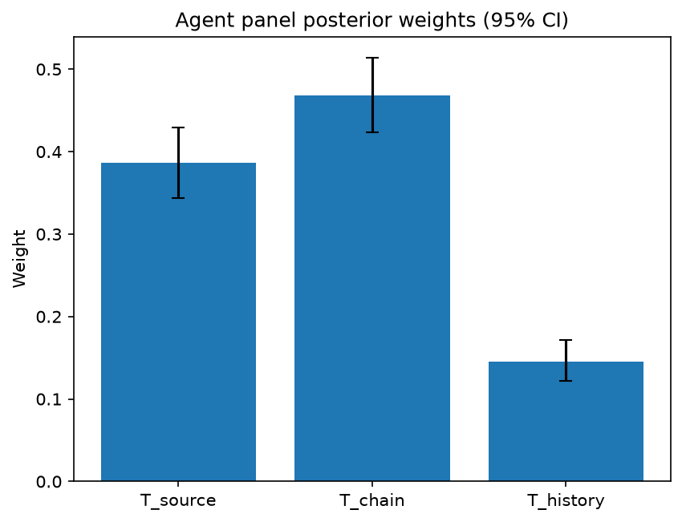

# Survey report: TrustRouter Claude CLI Panel (haiku) -- Level L3b: Provenance Trust sub-parts

Survey ID: `trustrouter-claude-cli-full-panel-claude-haiku-2026-09-01-L3b`

## Agent panel

- Agents contributing a valid response: 36
- Classical BWM consistency: 36/36 within threshold

| Criterion | Mean | 95% CI lower | 95% CI upper |
|---|---|---|---|
| T_source | 0.3861 | 0.3435 | 0.4296 |
| T_chain | 0.4682 | 0.4233 | 0.5135 |
| T_history | 0.1457 | 0.1220 | 0.1712 |

## Methodology

Each agent independently completed a Best-Worst Method (BWM) comparison: choosing the single most and least important criterion, then rating every criterion's importance relative to those two on a 1-9 scale. Individual responses were solved with the classical BWM linear program (Rezaei, 2015) for a consistency check, and combined across the panel with a hierarchical Bayesian model (Mohammadi and Rezaei, 2020).

36 agent response(s) were accepted into this result.

Every agent's run began with a QA precheck (its stated configuration verified against ground truth) and every accepted answer's self-reported sources were checked against what reference material was actually available to it; see the Per-agent detail section below and this survey's Conversation Log for each agent's specific results. Every response is schema-validated and independently, repeatedly sampled (never a single completion treated as ground truth); see `guardrails.py`. This survey's complete output is covered by a SHA-256 integrity manifest (`integrity_manifest.json`, `SHA256SUMS`), generated once this run finished, so any later alteration to these files is detectable.

### Charts

## Per-agent detail

### bim-coordinator-base-claude (`bim-coordinator-base-claude`)

- Role: BIM Coordinator
- Model: claude_cli/haiku
- DID: `did:key:z6MkjBimqskXZkR9Zx6uMHqsjZopoCEJaQ9tb7XoVSAZiujx`
- QA precheck: passed
- Sources used: shared knowledge: trustrouter_expert_questionnaire_v5_real_survey_instrument.md, general_knowledge

**Answer:** `{"best": "T_chain", "worst": "T_history", "best_to_others": {"T_chain": 1, "T_source": 3, "T_history": 6}, "others_to_worst": {"T_chain": 6, "T_source": 2, "T_history": 1}}`

**Reasoning:**

In multi-stakeholder construction projects, custody chain integrity is the critical gate for data trustworthiness. T_chain is my Best because a broken or undocumented chain makes data unusable for blockchain routing regardless of original source credentials or historical performance. In federated BIM environments, data passes through architects, engineers, contractors, and facility managers—any gap in chain documentation introduces unacceptable risk of tampering or loss of context. Even excellent source credentials and past performance cannot redeem a custody chain with missing handoffs or unexplained modifications. T_source is secondary but important: knowing who authored a structural analysis or MEP schedule is essential, but this credential value evaporates if the chain is broken. T_history is my Worst because historical track record, while useful context, is the least actionable for routing *this* data transfer. Past performance does not guarantee current integrity; teams change, processes evolve, and even reliable sources can have lapses. A source with good history might produce problematic data in this instance; conversely, a source with poor history might be credible on this specific document. For routing decisions in a multiplicative framework (where any weak link degrades the whole score), the current evidence of chain integrity and source credentials outweighs historical pattern. Rating T_chain to T_source at 3:1 reflects that while source credentials matter significantly, chain custody is harder to recover from if compromised. Rating T_chain to T_history at 6:1 reflects the substantially higher weight of verifiable custody evidence over backward-looking historical assessment.

### bim-coordinator-base-claude (`bim-coordinator-base-claude`)

- Role: BIM Coordinator
- Model: claude_cli/haiku
- DID: `did:key:z6MkjBimqskXZkR9Zx6uMHqsjZopoCEJaQ9tb7XoVSAZiujx`
- QA precheck: passed
- Sources used: shared knowledge: trustrouter_expert_questionnaire_v5_real_survey_instrument.md, general_knowledge

**Answer:** `{"best": "T_chain", "worst": "T_history", "best_to_others": {"T_chain": 1, "T_source": 3, "T_history": 5}, "others_to_worst": {"T_chain": 5, "T_source": 3, "T_history": 1}}`

**Reasoning:**

As a BIM Coordinator managing multi-stakeholder model federation over decades, custody chain integrity is foundational to the entire provenance-trust model. In the Hospital Real scenario—a public institutional asset serving owners, insurers, and authorities across a 50+ year lifecycle—data that originated from a credible source or has good historical provenance becomes unreliable if it has been altered, improperly transferred between BIM platforms, or modified without audit trail. Blockchain's core value is tamper-evidence; the custody chain is what makes tamper-evidence actionable. Without integrity in the chain from creation to submission, credentials and track record become moot. T_source (source credentials) ranks second: knowing the authoring party's identity, licensing, and role is immediately verifiable and actionable, but remains subordinate to chain integrity—a credible source's data may still be corrupted in transit. T_history (historical track record) ranks worst: while useful for statistical confidence, it is backward-looking, contextual to specific project types, and cannot guarantee current submission integrity. Many stakeholders in renovation contexts lack extensive prior relationships; past performance does not prevent current data corruption. In multi-year BIM federation with model revisions, custody tracking is the primary mechanism of trust; credentials and track record are reinforcing signals, not foundational.

### bim-coordinator-base-claude (`bim-coordinator-base-claude`)

- Role: BIM Coordinator
- Model: claude_cli/haiku
- DID: `did:key:z6MkjBimqskXZkR9Zx6uMHqsjZopoCEJaQ9tb7XoVSAZiujx`
- QA precheck: passed
- Sources used: shared knowledge: trustrouter_expert_questionnaire_v5_real_survey_instrument.md, general_knowledge

**Answer:** `{"best": "T_chain", "worst": "T_history", "best_to_others": {"T_chain": 1, "T_source": 3, "T_history": 6}, "others_to_worst": {"T_chain": 6, "T_source": 5, "T_history": 1}}`

**Reasoning:**

For construction-project data destined for blockchain storage, custody chain integrity is the primary trust determinant. The reference material emphasizes that blockchain improves tamper-evidence but is immutable—corrupted data cannot be amended on-chain. This makes T_chain critical: a broken chain of custody from creation to submission defeats blockchain's core value proposition, and corrupted data locked into a distributed ledger cannot be corrected. T_source (authorship credentials) is strong and foundational for accountability and competence assessment, but is secondary to direct assurance of custody integrity. A well-credentialed source whose data has been corrupted in handling is less trustworthy than an newer source with verifiable custody controls. T_history (track record) is a useful due-diligence signal for assessing reliability, but is the least directly determinative of whether the specific data submission in hand is trustworthy. A new designer or data provider with impeccable current credentials and verified custody chain may produce more reliable data than an established source with a broken custody trail or historical lapses. The scenario (multi-decade public asset, institutional owners, insurers, authorities) reinforces this: stakeholders need confidence that data has not been corrupted or altered en route, more than they need evidence of past performance.

### bim-coordinator-rag-claude (`bim-coordinator-rag-claude`)

- Role: BIM Coordinator
- Model: claude_cli/haiku
- DID: `did:key:z6MkgKPXYGDwJ56epiD68PaM63oukrBdhu5ziYGo84AZKm9n`
- QA precheck: passed
- Sources used: shared knowledge: trustrouter_expert_questionnaire_v5_real_survey_instrument.md, bim_and_digital_building_logbooks.md, general_knowledge

**Answer:** `{"best": "T_source", "worst": "T_history", "best_to_others": {"T_source": 1, "T_chain": 4, "T_history": 6}, "others_to_worst": {"T_source": 6, "T_chain": 5, "T_history": 1}}`

**Reasoning:**

T_source (source credentials) is the foundational criterion for construction data destined for long-term institutional or blockchain storage. In multi-stakeholder BIM environments like the Hospital Real scenario, ISO 19650's information-delivery process mandates party identification and independent validation by named, qualified parties. Without knowing who produced data and their professional credentials (structural engineer, certified surveyor, approved inspection bureau), the other trust factors become conditional or purely confirmatory. In federated models spanning decades with multiple stakeholders (owners, insurers, authorities), accountability to an identified, credentialed source is non-negotiable and legally mandatory. T_chain (custody integrity) ranks second: data quality degrades measurably through schema conversions, coordinate-system transforms, and model federation steps. Knowing the chain matters critically to detect whether intermediate modifications compromised the data. However, chain integrity is only actionable if the originating source is trustworthy; perfect chain evidence from an unqualified source provides false confidence. T_history (prior track record) ranks worst because it is supplementary rather than foundational: historical reliability provides context but cannot be applied to new data sources, new delivery parties, or novel data types—all common in renovation projects. While past performance matters for institutional decision-making, it is not mandatory (new parties lack it), not directly observable in the data itself, and does not guarantee current performance if circumstances have changed. The rating gap between source and chain (4:1) reflects that chain is significant but conditional on source. The gap between source and history (6:1) reflects that source is mandatory and observable, while history is optional and retrospective. The gap between chain and history (5:1) reflects that chain directly affects current trustworthiness, while history is supportive context. This ranking aligns with professional practice in multi-party BIM delivery: party identification and responsibility matrices are established first (source); chain-of-custody procedures (who modified what, when) are then implemented; and source reputation is accumulated over time (history).

### bim-coordinator-rag-claude (`bim-coordinator-rag-claude`)

- Role: BIM Coordinator
- Model: claude_cli/haiku
- DID: `did:key:z6MkgKPXYGDwJ56epiD68PaM63oukrBdhu5ziYGo84AZKm9n`
- QA precheck: passed
- Sources used: bim_and_digital_building_logbooks.md, shared knowledge: trustrouter_expert_questionnaire_v5_real_survey_instrument.md, general_knowledge

**Answer:** `{"best": "T_chain", "worst": "T_history", "best_to_others": {"T_chain": 1, "T_source": 3, "T_history": 5}, "others_to_worst": {"T_source": 2, "T_chain": 5, "T_history": 1}}`

**Reasoning:**

For construction-project records routed to blockchain storage in a multi-stakeholder BIM environment, custody chain integrity is the most critical of the three PT sub-parts. In federated BIM models under ISO 19650, independent validation and acceptance depend on verifiable integrity from source to submission—precisely the tamper-evidence problem blockchain is designed to solve. Data with excellent source credentials and a reliable originator is worthless if it has been corrupted, altered undetectably, or improperly handed off in intermediate steps. In my role coordinating multi-party federated models, I have observed that the weakest link in data integrity is typically the custody and handoff process, not the initial creation. The reference material notes that 'decentralised ledgers improve tamper-evidence (changes become detectable),' which directly addresses the custody-chain risk. Historical track record, while valuable for ongoing trust relationships and stakeholder confidence, is the least actionable for a single submission decision. A newly formed team or organization could submit trustworthy data if source credentials are verifiable and custody is maintained; conversely, a historically reliable source's data becomes unsafe if the chain of custody is broken. T_source falls between the two: knowing who created the data matters, but only if that creation is followed by a protected custody chain to the point of blockchain submission.

### bim-coordinator-rag-claude (`bim-coordinator-rag-claude`)

- Role: BIM Coordinator
- Model: claude_cli/haiku
- DID: `did:key:z6MkgKPXYGDwJ56epiD68PaM63oukrBdhu5ziYGo84AZKm9n`
- QA precheck: passed
- Sources used: shared knowledge: trustrouter_expert_questionnaire_v5_real_survey_instrument.md, general_knowledge

**Answer:** `{"best": "T_source", "worst": "T_history", "best_to_others": {"T_source": 1, "T_chain": 4, "T_history": 6}, "others_to_worst": {"T_source": 6, "T_chain": 4, "T_history": 1}}`

**Reasoning:**

As a BIM Coordinator managing federated models across multi-stakeholder renovation and new-build projects, source credentials (T_source) is foundational to all downstream trust decisions. In model federation, every federated element must be traceable to a discipline team with the authority and competence to produce that data type—structural engineers for load-bearing elements, MEP specialists for systems, surveyors for as-built dimensions. Without knowing who created the data and whether they held the relevant authority for that data class, neither custody-chain integrity nor historical track record provides actionable assurance. T_source is logically prior. T_chain (custody integrity) ranks second because, even with credible authoring, data can be corrupted in transit across authoring tools, model servers, and federation platforms—a risk I encounter regularly in multi-stage handoffs. However, custody-chain failures can only matter if the source was credible to begin with. T_history (track record) ranks last. While institutional knowledge of a consultant's or contractor's historical performance is contextually valuable, it is a heuristic supplement to direct source evaluation, not a primary trust gate. On a specific project record, what matters is whether that source holds the current authority and whether its data for this project has been protected in custody, not whether they performed well on a prior engagement. Track record can shift with personnel changes, organizational restructuring, or disciplinary transitions. For construction-project data destined for blockchain storage or digital building logbooks serving multi-decade institutional and regulatory use (as per the reference scenario), establishing source credentials first is the rational routing priority.

### blockchain-engineer-base-claude (`blockchain-engineer-base-claude`)

- Role: Blockchain / DLT Engineer
- Model: claude_cli/haiku
- DID: `did:key:z6MkjavCfxYpe2BkYMXfrJDvcH43kkcZRgoJAFJLDqtqyLmk`
- QA precheck: passed
- Sources used: shared knowledge: trustrouter_expert_questionnaire_v5_real_survey_instrument.md, general_knowledge

**Answer:** `{"best": "T_chain", "worst": "T_history", "best_to_others": {"T_chain": 1, "T_source": 2, "T_history": 4}, "others_to_worst": {"T_chain": 4, "T_source": 2, "T_history": 1}}`

**Reasoning:**

From a blockchain/DLT engineering perspective, the integrity of the custody chain (T_chain) is the most critical factor for routing construction data to on-chain storage. Distributed ledger technology's core value proposition is precisely what it addresses: creating immutable audit trails and tamper-evidence guarantees for data integrity from creation through transformation and transmission. This directly aligns with the role's emphasis on 'tamper-evidence guarantees.' Without chain integrity, no amount of source credentialing or historical assurance matters—the data could have been altered at any point. By contrast, source credentials (T_source) can be cryptographically verified through PKI and digital signatures, reducing this to a technical problem that blockchain helps solve, while historical track record (T_history) is the weakest factor for an on-chain routing decision. Past source behavior predicts nothing about current data in a cryptographic verification context; a source with no history but verifiable credentials and perfect chain integrity is more trustworthy than one with excellent history but compromised chain custody. T_history provides contextual risk assessment but no direct evidence, and is outside the technical scope where DLT engineering adds value. This is a confidence judgment based on the technical capabilities of blockchain systems and the particular expertise of a DLT engineer.

### blockchain-engineer-base-claude (`blockchain-engineer-base-claude`)

- Role: Blockchain / DLT Engineer
- Model: claude_cli/haiku
- DID: `did:key:z6MkjavCfxYpe2BkYMXfrJDvcH43kkcZRgoJAFJLDqtqyLmk`
- QA precheck: passed
- Sources used: general_knowledge

**Answer:** `{"best": "T_chain", "worst": "T_history", "best_to_others": {"T_chain": 1, "T_source": 3, "T_history": 6}, "others_to_worst": {"T_source": 4, "T_chain": 6, "T_history": 1}}`

**Reasoning:**

As a blockchain/DLT engineer focused on tamper-evidence guarantees and technical feasibility, custody chain (T_chain) is the criterion most influential in deciding whether construction data should be routed to blockchain storage versus hybrid or conventional approaches. The custody chain is what blockchain technology uniquely provides: cryptographic proof that data has not been altered from creation through submission. This is the core technical guarantee and differentiator—it directly addresses the tamper-evidence objective and is the primary reason to consider on-chain storage at all. T_source (source credentials) is critical but secondary: it establishes credibility at the origin, but blockchain itself does not solve the 'garbage in, garbage out' problem; it only protects data in transit and at rest. A poorly identified or unauthorized source should disqualify blockchain consideration beforehand, making it important but not the primary routing decision. T_history (historical track record) is the least influential. While prior reliability is useful contextual risk information, it is neither a technical guarantee nor a gate condition. A previously reliable source can still submit bad data once; conversely, a new source with no track record can be perfectly trustworthy if properly credentialed and if custody chains are verified. From a technical feasibility perspective, historical performance is secondary to present-moment verification of source identity and chain integrity. The ratios reflect that T_chain is moderately more important than T_source (both are critical technical considerations, but chain integrity is the blockchain-specific advantage), and substantially more important than T_history (which is more about reputation than technical proof).

### blockchain-engineer-base-claude (`blockchain-engineer-base-claude`)

- Role: Blockchain / DLT Engineer
- Model: claude_cli/haiku
- DID: `did:key:z6MkjavCfxYpe2BkYMXfrJDvcH43kkcZRgoJAFJLDqtqyLmk`
- QA precheck: passed
- Sources used: shared knowledge: trustrouter_expert_questionnaire_v5_real_survey_instrument.md, general_knowledge

**Answer:** `{"best": "T_source", "worst": "T_history", "best_to_others": {"T_source": 1, "T_chain": 3, "T_history": 7}, "others_to_worst": {"T_source": 7, "T_chain": 2, "T_history": 1}}`

**Reasoning:**

From a blockchain/DLT engineer's perspective focused on technical feasibility, throughput, and tamper-evidence: T_source (source credentials) is the foundational gatekeeper for permissioned-ledger systems. Identity verification via cryptographic credentials, PKI, and access control is a prerequisite for any data to reach the ledger; without trusted sources, on-chain data lacks legitimacy regardless of subsequent protections. This directly controls admission to the network and is essential for the ledger's utility. T_chain (custody chain from creation to submission) is materially important because it represents the off-chain window where data can be compromised before cryptographic on-chain protections apply. However, once data is on-chain, the ledger's tamper-evidence mechanisms and immutability protect integrity. The custody chain matters but is secondary to establishing source authorization upfront. T_history (historical track record) is least critical for immediate technical feasibility decisions. While reputation provides useful context, a source with poor historical performance could be performing correctly now; conversely, a previously reliable source could fail at any moment. Historical lookup adds latency without preventing tampering or ensuring current integrity; technical controls (signatures, hashes, audit trails) provide stronger guarantees than reputation. From a throughput perspective, avoiding synchronous historical checks is preferable. The ratios reflect: T_source is 3x more important than T_chain (identity precedes chain-of-custody verification), and 7x more important than T_history (technical authentication far outweighs reputation in immediate deployment decisions). T_chain is roughly 2x more important than T_history (process integrity matters more than past track record). This ranking aligns with permissioned-ledger architecture where access control and identity are enforced before transaction acceptance.

### blockchain-engineer-rag-claude (`blockchain-engineer-rag-claude`)

- Role: Blockchain / DLT Engineer
- Model: claude_cli/haiku
- DID: `did:key:z6MkooUJEyuLt3VzrACQLf8YLETe6fkJK66UWcp4jm9g2LzP`
- QA precheck: passed
- Sources used: blockchain_trust_and_attack_resistance.md, general_knowledge

**Answer:** `{"best": "T_chain", "worst": "T_history", "best_to_others": {"T_chain": 1, "T_source": 4, "T_history": 7}, "others_to_worst": {"T_chain": 7, "T_source": 3, "T_history": 1}}`

**Reasoning:**

As a blockchain engineer evaluating construction records for on-chain storage, custody chain integrity is the foundational trust factor because it directly addresses blockchain's core value proposition: immutable audit trails that prevent tampering. Even data from a highly credentialed source (T_source) with a flawless historical record (T_history) loses all trust value if the custody chain is compromised—the record could have been altered at any point between creation and submission, defeating blockchain's tamper-evidence guarantee. Rouhani and Deters (2021) emphasize that audit-trail completeness is central to adaptive trust-based validation in blockchain systems; a broken chain makes such validation impossible. T_chain directly answers the question "what happened to this data?" in a way blockchain uniquely solves through immutability. T_source (credentials of the originator) remains important but secondary: blockchain cannot independently verify an identity—it relies on external PKI mechanisms (as noted in Vaziry et al. 2024 on on-chain identity). T_source informs data governance and risk assessment, but the chain itself is more protective against tampering than credentials alone. T_history (historical reliability) is least critical for blockchain decisions because blockchain provides real-time, transaction-specific chain verification that supersedes statistical patterns. A source could have been 100% reliable historically but could produce compromised data this time; the chain detects this, whereas history does not. Historical track record is useful for conventional systems and for adaptive validation thresholds, but in the presence of an immutable custody chain, it becomes the weakest of the three trust sub-factors. The 4:3 ratio between T_source and T_history reflects that knowing the originator's identity is more important than their aggregate past performance in a blockchain context; the 7:1 ratio between T_chain and T_history reflects blockchain's structural advantage in audit completeness over statistical inference.

### blockchain-engineer-rag-claude (`blockchain-engineer-rag-claude`)

- Role: Blockchain / DLT Engineer
- Model: claude_cli/haiku
- DID: `did:key:z6MkooUJEyuLt3VzrACQLf8YLETe6fkJK66UWcp4jm9g2LzP`
- QA precheck: passed
- Sources used: blockchain_trust_and_attack_resistance.md, shared knowledge: trustrouter_expert_questionnaire_v5_real_survey_instrument.md, general_knowledge

**Answer:** `{"best": "T_chain", "worst": "T_history", "best_to_others": {"T_chain": 1, "T_source": 3, "T_history": 6}, "others_to_worst": {"T_chain": 6, "T_source": 2, "T_history": 1}}`

**Reasoning:**

For a permissioned blockchain deployment storing construction-project records, custody chain integrity (T_chain) is the most critical provenance factor because: (1) it directly addresses the pre-blockchain risk that cannot be retrospectively fixed by on-chain storage—if data is altered before submission, blockchain immutability cannot restore authenticity; (2) for technical feasibility and tamper-evidence guarantees, establishing that data has not been modified in transit or storage is the prerequisite for anything else; (3) once on-chain, the ledger's cryptographic properties handle downstream integrity, but T_chain is the gating factor for storing valid data in the first place. T_source (source credentials and identity) is rated 3x less important than T_chain, not because identity is unimportant—it is essential for accountability—but in a permissioned system, source identity is pre-validated by network governance; the blockchain engineer's concern shifts to integrity of the data itself rather than identity verification, which is an access-control layer below blockchain deployment. T_history (historical track record) is rated 6x less important than T_chain because while a source's track record informs risk-based trust scoring (as noted in Rouhani and Deters 2021), it is not a technical prerequisite: a first-time or newer source can provide valid, unaltered data if T_source and T_chain are strong. Track record supports confidence judgment but does not determine technical feasibility. This assessment grounds in the engineering perspective: T_chain directly mitigates the attack surface for data integrity before ledger entry; T_source establishes accountability post-entry; T_history is a secondary risk-assessment factor.

### blockchain-engineer-rag-claude (`blockchain-engineer-rag-claude`)

- Role: Blockchain / DLT Engineer
- Model: claude_cli/haiku
- DID: `did:key:z6MkooUJEyuLt3VzrACQLf8YLETe6fkJK66UWcp4jm9g2LzP`
- QA precheck: passed
- Sources used: blockchain_trust_and_attack_resistance.md, shared knowledge: trustrouter_expert_questionnaire_v5_real_survey_instrument.md, general_knowledge

**Answer:** `{"best": "T_chain", "worst": "T_history", "best_to_others": {"T_chain": 1, "T_source": 2, "T_history": 4}, "others_to_worst": {"T_source": 3, "T_chain": 5, "T_history": 1}}`

**Reasoning:**

From a blockchain/DLT engineer's perspective focused on permissioned-ledger deployments and tamper-evidence guarantees, T_chain (custody chain integrity) is the most important provenance criterion because it directly addresses blockchain's core value proposition: protecting data from creation through submission against tampering. Rouhani and Deters (2021) frames provenance as a key data trust property implemented on-chain with adaptive validation—the integrity of the path data takes is what determines whether on-chain storage is meaningful at all. Without a trustworthy custody chain, the data cannot be verified to be unaltered, making the blockchain itself ineffective. T_source (source credentials) ranks second: identifying the authoring source is essential for establishing accountability and is a prerequisite for any trust assessment, but source authentication alone does not guarantee the data has not been altered in transit. T_history (historical track record) ranks worst because while historical reliability provides statistical confidence in a source's future behaviour, it does not address the immediate integrity concerns of the current submission and is therefore less directly relevant to the routing decision for a specific construction record. A source with a good track record could still submit tampered data; conversely, a trustworthy chain of custody provides cryptographic assurance regardless of historical context. The ratings reflect this hierarchy: T_chain is 4x more important than historical track record because it is the determinative factor for on-chain suitability, while T_source-to-T_history rating of 3x reflects that source identification is notably more binding than historical confidence, but less critical than chain integrity.

### compliance-officer-base-claude (`compliance-officer-base-claude`)

- Role: Compliance and Regulatory Officer
- Model: claude_cli/haiku
- DID: `did:key:z6MkgGS4Yb7TwydcexnZQyhuB5HMp1ig3wLJaXRe6WiEC8hb`
- QA precheck: passed
- Sources used: shared knowledge: trustrouter_expert_questionnaire_v5_real_survey_instrument.md, general_knowledge

**Answer:** `{"best": "T_source", "worst": "T_history", "best_to_others": {"T_source": 1, "T_chain": 2, "T_history": 4}, "others_to_worst": {"T_source": 4, "T_chain": 2, "T_history": 1}}`

**Reasoning:**

As a facility-management compliance officer, source credentials (T_source) is most critical because regulatory acceptance and legal obligation in construction hinge fundamentally on who produced the data. A construction record's validity depends first on whether it was created by a qualified, authorized party—a licensed structural engineer, certified inspector, or authorized signatory with appropriate credentials. Without this foundational authority, the record lacks the legitimacy required for compliance with building codes, GDPR, and contractual obligations, regardless of how well it was subsequently protected. T_chain (custody chain) is secondarily important—it ensures data integrity from creation to submission and is essential in blockchain/digital contexts to prevent tampering. However, a perfect chain of custody cannot compensate for unknown or inadequate source credentials; it merely protects what already exists. T_history (historical track record) is least important because a new source with strong credentials and transparent custody should be acceptable for regulatory purposes. While a proven track record is confidence-building, it is not a prerequisite for accepting a well-authored, well-protected record from a qualified source. The ratings reflect this hierarchy: T_source is rated twice as important as T_chain (both are critical, but source authority is foundational), and four times as important as T_history (which is a secondary assurance factor). T_chain is rated twice as important as T_history, since chain integrity matters more than prior performance when processing new submissions.

### compliance-officer-base-claude (`compliance-officer-base-claude`)

- Role: Compliance and Regulatory Officer
- Model: claude_cli/haiku
- DID: `did:key:z6MkgGS4Yb7TwydcexnZQyhuB5HMp1ig3wLJaXRe6WiEC8hb`
- QA precheck: passed
- Sources used: shared knowledge: trustrouter_expert_questionnaire_v5_real_survey_instrument.md, general_knowledge

**Answer:** `{"best": "T_source", "worst": "T_history", "best_to_others": {"T_source": 1, "T_chain": 2, "T_history": 3}, "others_to_worst": {"T_source": 3, "T_chain": 2, "T_history": 1}}`

**Reasoning:**

As a compliance officer evaluating construction records for blockchain storage under GDPR and regulatory obligations, source credentials (T_source) must be the foundational trust factor. Before any record can be considered authoritative, I must verify who created it and whether they hold the necessary qualifications and legal authorization to generate construction data—whether that is a licensed structural engineer, certified inspector, or authorized contractor. Without establishing the source's credentials first, neither custody integrity nor historical track record can be meaningfully evaluated. T_source is logically prior to the other criteria and is a regulatory prerequisite for acceptance. T_chain (custody chain) ranks second in importance. GDPR compliance requires documented accountability for data processing and handling; construction regulatory obligations demand auditable evidence that records have not been altered in transit. The integrity of the custody chain is critical for blockchain use because the immutability that blockchain provides is only meaningful if the record entering the chain is itself secure and uncompromised. However, T_chain is slightly subordinate to T_source because a compromised chain would disqualify a record regardless of who created it, whereas a properly-credentialed source with good custody is a baseline expectation. T_history (historical track record) ranks least important. While a source's past reliability provides useful context and may trigger additional scrutiny if absent, current regulatory status and proper authorization always supersede historical record. A newly licensed professional with impeccable current credentials and clear custody documentation should be acceptable even without an extensive track record; conversely, a historically reliable source that has since lost its credentials or become inactive would not be acceptable for current construction records. The comparison between Best and Worst (T_source vs T_history) is decisive: current authority and qualification matter far more than historical performance when evaluating the trustworthiness of a construction datum for immutable archival.

### compliance-officer-base-claude (`compliance-officer-base-claude`)

- Role: Compliance and Regulatory Officer
- Model: claude_cli/haiku
- DID: `did:key:z6MkgGS4Yb7TwydcexnZQyhuB5HMp1ig3wLJaXRe6WiEC8hb`
- QA precheck: passed
- Sources used: shared knowledge: trustrouter_expert_questionnaire_v5_real_survey_instrument.md, general_knowledge

**Answer:** `{"best": "T_chain", "worst": "T_history", "best_to_others": {"T_chain": 1, "T_source": 4, "T_history": 7}, "others_to_worst": {"T_source": 3, "T_chain": 7, "T_history": 1}}`

**Reasoning:**

As a Compliance and Regulatory Officer, I rank custody chain (T_chain) as best because it is the foundational control for meeting regulatory obligations under GDPR Article 5 (integrity and confidentiality) and construction regulatory frameworks. For a construction-project record under blockchain storage consideration, an intact and documented custody chain proves the record has not been altered, contaminated, or improperly handled—establishing admissibility as evidence and demonstrating lawful processing. Without a defensible chain, neither source credentials nor historical track record provides meaningful assurance. T_chain is multiplicative: it enables trust in everything downstream. T_source (source credentials) ranks second, not worst, because accountability to a known, qualified party (chartered engineer, regulated data controller) is important for regulatory attribution and compliance, but credentials alone do not guarantee the current record's integrity if the custody chain is broken. T_history (historical track record) ranks worst because it is predictive rather than direct evidence. A source's past reliability does not guarantee current reliability, and past reliability cannot overcome a compromised custody chain for the current record. Under construction and GDPR compliance regimes, a direct, auditable chain of custody (who handled it, when, how, with what protective measures) is more decisive than historical inference. The ratings reflect this hierarchy: T_chain is 4 times more important than credentials and 7 times more important than history; T_source is 3 times more important than history; T_chain is 7 times more important than history (worst).

### compliance-officer-rag-claude (`compliance-officer-rag-claude`)

- Role: Compliance and Regulatory Officer
- Model: claude_cli/haiku
- DID: `did:key:z6MkvsMfbM7uWXaYfBeyMot693DSNk3VXfm2U8UeY54UDj2D`
- QA precheck: passed
- Sources used: shared knowledge: trustrouter_expert_questionnaire_v5_real_survey_instrument.md, gdpr_and_data_governance.md, general_knowledge

**Answer:** `{"best": "T_source", "worst": "T_history", "best_to_others": {"T_source": 1, "T_chain": 3, "T_history": 5}, "others_to_worst": {"T_source": 5, "T_chain": 3, "T_history": 1}}`

**Reasoning:**

As a compliance officer assessing construction project records for blockchain archiving, I rank source credentials (T_source) as best because it is foundational to regulatory trust. Construction records must originate from authorized, competent professionals—architects, engineers, inspectors—whose credentials are verifiable and legally sufficient under building codes and GDPR's accuracy requirement (Article 5). Without credible source credentials, no downstream custody protection or historical track record can remediate the deficiency; the source authority is the entry point for all trust in the record's legitimacy. T_chain (custody chain) ranks second at 3x importance relative to T_source, because chain of custody is essential for legal admissibility and GDPR integrity protection during transit to storage. However, for blockchain specifically, the immutable ledger itself becomes the custody mechanism once data enters it; the critical chain is upstream of that commitment. T_history (track record) ranks worst at 5x less important than T_source because a source with poor historical reliability might still produce one accurate record in the current submission, whereas a source lacking current professional credentials cannot be remediated by past performance. Regulatory verification prioritizes current authorization and protection over historical aggregate reliability. The comparison is grounded in construction regulation (professional licensing requirements) and GDPR's data governance model: accuracy and integrity depend first on who creates the data and protects it, second on past patterns of reliability.

### compliance-officer-rag-claude (`compliance-officer-rag-claude`)

- Role: Compliance and Regulatory Officer
- Model: claude_cli/haiku
- DID: `did:key:z6MkvsMfbM7uWXaYfBeyMot693DSNk3VXfm2U8UeY54UDj2D`
- QA precheck: passed
- Sources used: gdpr_and_data_governance.md, shared knowledge: trustrouter_expert_questionnaire_v5_real_survey_instrument.md, general_knowledge

**Answer:** `{"best": "T_source", "worst": "T_history", "best_to_others": {"T_source": 1, "T_chain": 2, "T_history": 5}, "others_to_worst": {"T_source": 5, "T_chain": 3, "T_history": 1}}`

**Reasoning:**

From a compliance officer's perspective responsible for GDPR and construction regulations, source credentials (T_source) are the foundational trust component. Construction records require proper authorship credentials (licensed engineers, qualified contractors) both as a regulatory requirement and as the basis for legal accountability. GDPR imposes accountability obligations on data controllers and processors—you must be able to demonstrate who is responsible for the record and whether they had proper authority to create it. Without established source credentials, the regulatory chain of responsibility breaks down. Custody chain (T_chain) is the second priority—it ensures data integrity during transit, which is essential for GDPR compliance and critical for immutable storage where modification is impossible post-submission. However, if the source lacks proper credentials, integrity of chain alone cannot remedy the underlying accountability gap. Historical track record (T_history) ranks lowest because while past reliability is useful predictive context, it does not establish current accountability or current integrity. A previously reliable source can produce flawed data in any given instance, and for a specific construction record being submitted for blockchain storage, what matters is the present credentials and chain integrity, not statistical past performance. The reference material on blockchain and GDPR emphasizes that immutability creates regulatory tension—T_source establishes the initial trusted authority whose data is being immutably recorded, making it the critical starting point.

### compliance-officer-rag-claude (`compliance-officer-rag-claude`)

- Role: Compliance and Regulatory Officer
- Model: claude_cli/haiku
- DID: `did:key:z6MkvsMfbM7uWXaYfBeyMot693DSNk3VXfm2U8UeY54UDj2D`
- QA precheck: passed
- Sources used: shared knowledge: trustrouter_expert_questionnaire_v5_real_survey_instrument.md, gdpr_and_data_governance.md, general_knowledge

**Answer:** `{"best": "T_source", "worst": "T_history", "best_to_others": {"T_source": 1, "T_chain": 2, "T_history": 4}, "others_to_worst": {"T_source": 4, "T_chain": 3, "T_history": 1}}`

**Reasoning:**

From a construction-regulatory and GDPR compliance perspective, source credentials (T_source) form the foundational gate for assessing whether a construction record should be considered for blockchain storage at all. In construction, regulated credentials—professional engineer stamps, architect licenses, inspection certifications, qualified-signatory authority—establish both legal standing (data-controller accountability under GDPR) and technical competence. Without credible source identification, neither custody integrity nor historical track record adds meaningful trust. T_chain (custody integrity) ranks second: the entire blockchain value proposition rests on creating an auditable, immutable chain of custody from creation to submission. A highly credentialed source whose record is then tampered with in transit becomes worthless; T_chain validates T_source's data in practice. T_history ranks lowest because: (1) new sources exist without prior history yet, and construction records often come from sources with limited prior interaction with this organization; (2) T_source and T_chain are immediately evaluable at submission time, while T_history requires accumulation over repeated transactions; (3) in a compliance gate framework, immediate controls (credentials, custody) must suffice; historical confidence is an enhancement, not a prerequisite. The reference material (shared knowledge: trustrouter_expert_questionnaire_v5_real_survey_instrument.md, gdpr_and_data_governance.md) frames PT as 'trust in who created the data and custody until handover,' with credentials and chain as the active, verifiable components; T_history is empirical validation that develops after multiple prior reliable submissions. For a facility-management compliance officer, T_source is the hard requirement, T_chain ensures integrity, and T_history is a risk-optimization signal for repeat suppliers.

### data-engineer-base-claude (`data-engineer-base-claude`)

- Role: Data Engineering Specialist
- Model: claude_cli/haiku
- DID: `did:key:z6MkwWLFsHqByat9fpS7uQaUXhG2ERBVxYgB8hVuvtEatajg`
- QA precheck: passed
- Sources used: shared knowledge: trustrouter_expert_questionnaire_v5_real_survey_instrument.md, general_knowledge

**Answer:** `{"best": "T_chain", "worst": "T_history", "best_to_others": {"T_chain": 1, "T_source": 3, "T_history": 5}, "others_to_worst": {"T_source": 2, "T_chain": 5, "T_history": 1}}`

**Reasoning:**

For polyglot-persistence routing decisions on construction data, the integrity of the custody chain (T_chain) is the most critical factor. In data engineering practice, custody-chain verification is the primary technical evidence of whether data can be trusted for on-chain storage or other persistence modes. Even data from highly credentialed sources (T_source) can be corrupted or tampered with during transmission and handling; conversely, a verified, intact chain provides direct evidence that a specific data instance is trustworthy, regardless of source credentials. This makes T_chain approximately 3× more important than T_source for routing decisions. Historical track record (T_history) is least important because it is backward-looking and does not guarantee this instance's integrity. A source with perfect historical reliability can still produce compromised data in this instance. Past performance is a confidence signal, but in data governance for blockchain or hybrid storage, actionable evidence of current integrity outweighs aggregate historical confidence. T_source is approximately 2× more important than T_history because source identity and credibility are directly verifiable and required for data governance compliance and lineage tracking, whereas history is merely predictive. The custody chain is approximately 5× more important than history—the immediate technical evidence of integrity is far more decisive than aggregate past performance when deciding whether to commit data to immutable ledgers.

### data-engineer-base-claude (`data-engineer-base-claude`)

- Role: Data Engineering Specialist
- Model: claude_cli/haiku
- DID: `did:key:z6MkwWLFsHqByat9fpS7uQaUXhG2ERBVxYgB8hVuvtEatajg`
- QA precheck: passed
- Sources used: shared knowledge: trustrouter_expert_questionnaire_v5_real_survey_instrument.md, general_knowledge

**Answer:** `{"best": "T_chain", "worst": "T_history", "best_to_others": {"T_chain": 1, "T_source": 3, "T_history": 5}, "others_to_worst": {"T_chain": 5, "T_source": 2, "T_history": 1}}`

**Reasoning:**

As a data engineering specialist responsible for provenance tracking and polyglot-persistence routing, I rank T_chain (custody chain) as best because it is the technical and governance foundation of all provenance assessment. Provenance tracking in data engineering is fundamentally about audit trails and chain-of-custody verification—the ability to answer 'what happened to this data between creation and submission?' This is especially critical for construction data destined for blockchain, where immutability depends on verifying that the data entering the chain has not been tampered with or corrupted en route. A broken or undocumented custody chain cannot be remedied retrospectively, even if the source has excellent credentials or a strong track record. T_chain is directly verifiable through technical means (audit logs, cryptographic integrity, version control) and directly governs compliance and liability in construction projects. T_source (source credentials) is notably important—you must know and trust the creator—but credentials alone do not ensure this specific record's integrity; a trusted source's data could still be corrupted or mishandled in transit. T_history (track record) is useful for risk profiling but is the least critical for routing decisions on an individual record. Historical reliability informs confidence in the source but does not substitute for verifying this data's actual path and integrity. A source with a good track record can still be compromised in a specific instance if custody is broken, whereas a documented, auditable chain provides immediate, record-specific assurance. T_chain ranks 5x more important than T_history because chain integrity is the precondition for provenance in data systems; T_source ranks 3x more important than T_chain because source identity and authority are the baseline trust anchor before chain assessment even applies, but chain verification is more directly decisive for this routing decision; T_source ranks 2x more important than T_history because knowing the creator now is more immediately actionable than validating patterns over time.

### data-engineer-base-claude (`data-engineer-base-claude`)

- Role: Data Engineering Specialist
- Model: claude_cli/haiku
- DID: `did:key:z6MkwWLFsHqByat9fpS7uQaUXhG2ERBVxYgB8hVuvtEatajg`
- QA precheck: passed
- Sources used: shared knowledge: trustrouter_expert_questionnaire_v5_real_survey_instrument.md, general_knowledge

**Answer:** `{"best": "T_chain", "worst": "T_history", "best_to_others": {"T_chain": 1, "T_source": 6, "T_history": 8}, "others_to_worst": {"T_chain": 8, "T_source": 3, "T_history": 1}}`

**Reasoning:**

As a data engineering specialist responsible for polyglot-persistence routing, my judgment prioritizes custody-chain integrity as the single most critical factor for construction data destined for blockchain storage. This reasoning is rooted in the irreversibility principle: blockchain is immutable by design, meaning any data corruption before storage becomes permanent and unrecoverable. The custody chain is the only mechanism that provides real-time, deterministic verification of whether specific data has been tampered with en route from creation to submission. Once data is on-chain, no amount of source credibility or historical track record can retroactively correct corruption. For routing decisions (full on-chain vs. hybrid vs. conventional storage), chain integrity is therefore the gating factor: if the custody chain is compromised, the data is unsuitable for immutable storage regardless of other factors. T_source (source credentials) ranks second: knowing and trusting the authoring organization is a prerequisite for baseline confidence, but source verification alone is insufficient—a trusted source can have one specific dataset corrupted. T_history (historical track record) ranks third: while useful for probabilistic confidence, it is predictive rather than deterministic about this submission, and new sources (common in construction projects) may have no history at all, yet the other two factors still apply. In construction contexts with long asset lifecycles (as noted in the reference scenario), the integrity of data entering permanent records is non-negotiable; custody-chain evidence is the only mechanism that prevents storing corrupted data on immutable ledgers. The multiplicative nature of trust (per the TrustRouter model cited in the survey structure) means chain failure is a critical path failure: broken chain zero-outs all other trust factors.

### data-engineer-rag-claude (`data-engineer-rag-claude`)

- Role: Data Engineering Specialist
- Model: claude_cli/haiku
- DID: `did:key:z6Mknx9SDBfJkpRBgat4tMwAWaw5EZtoMF8kY6JBeuWvWSen`
- QA precheck: passed
- Sources used: data_quality_and_polyglot_persistence.md, shared knowledge: trustrouter_expert_questionnaire_v5_real_survey_instrument.md, general_knowledge

**Answer:** `{"best": "T_chain", "worst": "T_history", "best_to_others": {"T_chain": 1, "T_source": 5, "T_history": 7}, "others_to_worst": {"T_chain": 7, "T_source": 4, "T_history": 1}}`

**Reasoning:**

For routing construction data to blockchain or hybrid storage, the integrity of the custody chain is the most critical factor. This follows from the data-engineering principle that audit logging and lineage tracking constitute the first-hand evidence for provenance trust; without a documented, unbroken custody chain, a data item's current state cannot be verified, regardless of source credentials or historical reliability. A known source (T_source) remains important but secondary—source credentials are necessary context, but they do not guarantee that a specific instance of data has not been altered, corrupted, or tampered with in transit. Historical track record (T_history) ranks worst because it is backward-looking and probabilistic; a historically reliable source can fail on any given submission, and conversely, past failures do not prevent a specific data item from being trustworthy if its chain is intact and its source is credible. From a data-pipeline perspective, the custody chain is the only contemporaneous evidence that the data matches its claimed provenance. Therefore T_chain is rated 7× more important than T_history (a large gap) and 5× more important than T_source (a moderate gap reflecting that source credentials matter but are overshadowed by chain integrity).

### data-engineer-rag-claude (`data-engineer-rag-claude`)

- Role: Data Engineering Specialist
- Model: claude_cli/haiku
- DID: `did:key:z6Mknx9SDBfJkpRBgat4tMwAWaw5EZtoMF8kY6JBeuWvWSen`
- QA precheck: passed
- Sources used: shared knowledge: trustrouter_expert_questionnaire_v5_real_survey_instrument.md, data_quality_and_polyglot_persistence.md, general_knowledge

**Answer:** `{"best": "T_chain", "worst": "T_history", "best_to_others": {"T_chain": 1, "T_source": 2, "T_history": 5}, "others_to_worst": {"T_chain": 5, "T_source": 3, "T_history": 1}}`

**Reasoning:**

From a data engineering perspective focused on provenance tracking and pipeline integrity for blockchain-routed construction data, T_chain (custody chain integrity) is the most influential criterion for routing decisions. Here is the reasoning: (1) **T_chain is foundational to verification:** Even data from a credible source (T_source) becomes untrusted if the custody chain cannot be verified. In blockchain and distributed ledger contexts, the integrity of the chain itself is the verification mechanism—audit trails and lineage tracking provide the direct, first-hand evidence that a record has not been tampered with in transit. The reference material on data quality emphasizes that 'a data pipeline's own audit logging and lineage tracking is often the first-hand source of evidence a Verification Strength (V) or Provenance Trust (PT) score should actually be based on' (shared knowledge: data_quality_and_polyglot_persistence.md). For my role, T_chain directly maps to this audit-logging capability. (2) **T_source and T_history are secondary:** T_source (credentials of the originating party) is necessary for initial intake decisions but does not protect against corruption or manipulation en route. T_history (past reliability) is useful for risk scoring but is predictive rather than confirmatory—a source with excellent past performance can still deliver corrupted or altered data if the custody chain is not verified. For blockchain routing specifically, current verification (T_chain) is more actionable than statistical inference from history. (3) **T_history is least important:** It requires longitudinal data that may not exist for all sources, and its predictive value is superseded by verifiable current-state custody evidence. If you can confirm chain integrity, historical track record becomes supplementary. **Ratings justification:** T_chain is approximately 2x more critical than T_source (source credentials matter, but chain integrity is the actual verification gate). T_chain is approximately 5x more critical than T_history (current verification vs. past patterns). T_source is approximately 3x more critical than T_history (at least source credibility is directly actionable; history requires longitudinal data and inference).

### data-engineer-rag-claude (`data-engineer-rag-claude`)

- Role: Data Engineering Specialist
- Model: claude_cli/haiku
- DID: `did:key:z6Mknx9SDBfJkpRBgat4tMwAWaw5EZtoMF8kY6JBeuWvWSen`
- QA precheck: passed
- Sources used: data_quality_and_polyglot_persistence.md, general_knowledge

**Answer:** `{"best": "T_chain", "worst": "T_history", "best_to_others": {"T_chain": 1, "T_source": 3, "T_history": 6}, "others_to_worst": {"T_source": 2, "T_chain": 6, "T_history": 1}}`

**Reasoning:**

From a data engineering perspective focused on provenance tracking and audit-trail integrity, custody chain (T_chain) is most critical because it is the direct, verifiable evidence of data integrity from creation to submission. The reference material emphasizes that a data pipeline's audit logging and lineage tracking is the first-hand source of evidence for trust assessment (data_quality_and_polyglot_persistence.md). For construction data destined for blockchain storage, a broken or incomplete chain of custody cannot be recovered by knowing the source's credentials; chain integrity enables independent verification and creates the immutable provenance record essential for polyglot-persistence routing decisions. T_source (source credentials) is important but serves as a baseline trust assumption rather than verification mechanism—a credentialed source can still produce data compromised in transit. T_history is least critical: historical track record is predictive rather than definitive, and past reliability does not guarantee current submission integrity; a single compromised data point falsifies historical assurance without custody-chain evidence to detect it. The gap from T_chain to T_source is moderate (3×) because both are necessary, but chain integrity is the mechanism that makes source credentials actionable. The gap from T_source to T_history is smaller (2×) because knowing who produced data matters more than when they may have been reliable, but both pale against the need for custody verification.

### project-manager-base-claude (`project-manager-base-claude`)

- Role: Construction Project Manager
- Model: claude_cli/haiku
- DID: `did:key:z6MkmbMHfpwQi6Y7FbdLU12dMCxJZnxzRBXEPi1iKygbQ1AP`
- QA precheck: passed
- Sources used: shared knowledge: trustrouter_expert_questionnaire_v5_real_survey_instrument.md, general_knowledge

**Answer:** `{"best": "T_source", "worst": "T_history", "best_to_others": {"T_source": 1, "T_chain": 2, "T_history": 5}, "others_to_worst": {"T_source": 5, "T_chain": 3, "T_history": 1}}`

**Reasoning:**

As a construction PM coordinating multi-stakeholder documentation for institutional, insurance, and regulatory purposes over decades, source credentials (T_source) are the foundational decision point. For construction data that must serve compliance, insurance claims, and authority verification, the authoring source's qualifications and accountability—whether an accredited engineer, certified contractor, or authorized architect—determines whether the record has legal and professional standing from inception. Without qualified source credentials, subsequent handling and historical reputation cannot salvage data validity for institutional use. T_chain (custody chain) ranks second: integrity of the chain from creation to submission is critical for blockchain contexts specifically, since on-chain immutability is only valuable if the data was uncompromised before commitment. However, even a perfectly maintained chain cannot overcome weak source credentials. T_history (historical track record) is least critical for this decision because a single record's trustworthiness depends primarily on who created it and how it was handled, not on the source's past performance. A historically reliable organization can still produce flawed records, and a source with past issues may have improved. For long-term institutional storage, what matters most is verifying *this specific record's* credibility and integrity, not the organization's track record—though past performance weakly informs confidence. The ratings reflect these dependencies: T_source is 2× more important than T_chain (foundation vs. implementation of integrity), and 5× more important than T_history (credentialing vs. historical indicators). T_chain is 3× more important than T_history (current integrity vs. past performance). This ordering reflects real-world professional priorities in regulated construction contexts where liability, compliance, and insurance hinge on accountable, credentialed sources and verifiable data handling.

### project-manager-base-claude (`project-manager-base-claude`)

- Role: Construction Project Manager
- Model: claude_cli/haiku
- DID: `did:key:z6MkmbMHfpwQi6Y7FbdLU12dMCxJZnxzRBXEPi1iKygbQ1AP`
- QA precheck: passed
- Sources used: shared knowledge: trustrouter_expert_questionnaire_v5_real_survey_instrument.md, general_knowledge

**Answer:** `{"best": "T_source", "worst": "T_history", "best_to_others": {"T_source": 1, "T_chain": 2, "T_history": 3}, "others_to_worst": {"T_source": 3, "T_chain": 2, "T_history": 1}}`

**Reasoning:**

From a construction project manager's perspective managing institutional assets serving insurers and authorities, source credibility is foundational and ranks as most important. Without knowing who authored the data—their credentials, authority, and competence—the document is unusable in a professional context regardless of how well it was preserved. Knowing the authoring source (person/organization) is the first gate: institutional owners, insurers, and regulatory bodies all demand traceable responsibility for construction records. The custody chain (T_chain) ranks second: once I know the source, I must verify the data has not been altered in transit or through unauthorized access prior to blockchain submission. This ensures integrity after creation. The historical track record (T_history) ranks third. While useful for assessing confidence, a source without prior history can still be trustworthy if properly credentialed and properly handled. Construction regularly involves new professionals and organizations entering the field; a single well-documented record from a new but properly-credentialed entity serving a renovation project is professionally defensible. History validates but is not strictly necessary for individual transactions, especially in institutional contexts where current credentials and chain integrity carry the primary burden of trust.

### project-manager-base-claude (`project-manager-base-claude`)

- Role: Construction Project Manager
- Model: claude_cli/haiku
- DID: `did:key:z6MkmbMHfpwQi6Y7FbdLU12dMCxJZnxzRBXEPi1iKygbQ1AP`
- QA precheck: passed
- Sources used: shared knowledge: trustrouter_expert_questionnaire_v5_real_survey_instrument.md, general_knowledge

**Answer:** `{"best": "T_chain", "worst": "T_history", "best_to_others": {"T_chain": 1, "T_source": 4, "T_history": 7}, "others_to_worst": {"T_chain": 7, "T_source": 4, "T_history": 1}}`

**Reasoning:**

As a construction project manager overseeing multi-stakeholder data flows for long-lifecycle assets, custody chain integrity is the decisive factor for blockchain-based or hybrid storage. Here is why: First, blockchain's entire value proposition—for a public hospital asset serving institutional owners, insurers, and authorities—rests on an immutable, auditable chain of custody. Without custody-chain integrity, even pristine source credentials become meaningless if data is corrupted, modified, or diverted in transit. Second, in construction disputes (which the survey acknowledges occur), the chain of custody is the legal evidence that settles attribution and sequence; source credentials alone do not prevent tampering or loss between creation and submission. Third, T_source (credentials) ranks second: knowing who created the data and their authority is essential for initial vetting and compliance, but credentials do not protect data once it leaves the author's control. Finally, T_history (track record) ranks third. While it provides useful predictive signal about a source's ongoing reliability, it does not directly validate a specific record's integrity. A source with perfect history can produce one bad record, and a previously unreliable source's data might be sound if accompanied by a clean chain. For multi-decade institutional assets, chain integrity is the concrete, auditable foundation; history is inference. The ratings reflect this hierarchy: T_chain is 4× more important than source credentials (credentials are necessary but insufficient) and 7× more important than history (history informs but does not replace current chain evidence).

### project-manager-rag-claude (`project-manager-rag-claude`)

- Role: Construction Project Manager
- Model: claude_cli/haiku
- DID: `did:key:z6MkgcpBWMRETjwEN39T1S93W7uzSnGEo6oioFMta7r3bPMs`
- QA precheck: passed
- Sources used: construction_project_management_and_mcdm.md, shared knowledge: trustrouter_expert_questionnaire_v5_real_survey_instrument.md, general_knowledge

**Answer:** `{"best": "T_source", "worst": "T_history", "best_to_others": {"T_source": 1, "T_chain": 3, "T_history": 6}, "others_to_worst": {"T_source": 6, "T_chain": 3, "T_history": 1}}`

**Reasoning:**

As a Construction Project Manager evaluating provenance trust for blockchain storage, source credentials (T_source) are foundational to all downstream trust. The rationale: (1) In construction, you cannot safely proceed with any record unless the originating source is credible. An unverifiable or unauthorised originator invalidates the data regardless of how well it was protected afterward. Credential validation—is this a licensed structural engineer, an authorized site inspector, an authenticated facility manager—is the first gate. (2) Custody chain (T_chain) ranks second because blockchain's primary value proposition is preventing tampering and ensuring immutability during transit and storage. Once you trust the source, maintaining integrity in the custody chain becomes critical for dispute resolution (per Gartoumi 2024's emphasis on blockchain's benefits in dispute resolution and document management). A change order or inspection sign-off is only evidentiary if we can later prove it has not been modified—exactly the problem blockchain addresses. (3) Historical track record (T_history) ranks last because it is backward-looking. While a source's past reliability informs our confidence, for the immediate storage decision, what matters is: who is authoring this specific record right now, and can we ensure its integrity in transit? A single historical inspection failure does not invalidate current data from that source; conversely, a solid history cannot compensate for current unknown or untrusted authorship. For blockchain decisions specifically, the question 'has this source been reliable?' is less actionable than 'who is this source?' and 'can we cryptographically verify this data has not been altered?'. Ratings reflect this hierarchy: T_source is 3× more important than T_chain and 6× more important than T_history; T_chain is 3× more important than T_history.

### project-manager-rag-claude (`project-manager-rag-claude`)

- Role: Construction Project Manager
- Model: claude_cli/haiku
- DID: `did:key:z6MkgcpBWMRETjwEN39T1S93W7uzSnGEo6oioFMta7r3bPMs`
- QA precheck: passed
- Sources used: construction_project_management_and_mcdm.md, shared knowledge: trustrouter_expert_questionnaire_v5_real_survey_instrument.md, general_knowledge

**Answer:** `{"best": "T_chain", "worst": "T_history", "best_to_others": {"T_chain": 1, "T_source": 3, "T_history": 5}, "others_to_worst": {"T_chain": 5, "T_source": 3, "T_history": 1}}`

**Reasoning:**

As a construction project manager responsible for multi-stakeholder documentation across a project's full lifecycle, my ranking reflects the specific risks and litigation scenarios that dominate construction practice. The custody chain (T_chain) is most critical because it directly enables the core dispute-resolution use case identified by Gartoumi (2024) in blockchain's construction applications: when a structural issue, warranty claim, or regulatory dispute arises years or decades later—exactly the scenario the Hospital Real reference contemplates—proof that an inspection record, change order, or compliance sign-off has not been altered since creation is essential. Blockchain's value proposition in construction hinges on this verifiability, not merely on knowing who authored the data. Source credentials (T_source) matter significantly—a licensed engineer carries more weight than an unknown party—but source identity alone cannot prevent or detect tampering. Historical track record (T_history) is least critical because it is retrospective and probabilistic: even a contractor with a 20-year record could produce a fraudulent document in year 21, and conversely, a new compliance officer with no history could create authentic, unaltered records. In the disputes where blockchain documentation is most valuable, what matters is proof of integrity in that specific document, not the source's past behavior. The ratios reflect that custody chain integrity is substantially more important than either of the other factors, with source credentials moderately more important than track record.

### project-manager-rag-claude (`project-manager-rag-claude`)

- Role: Construction Project Manager
- Model: claude_cli/haiku
- DID: `did:key:z6MkgcpBWMRETjwEN39T1S93W7uzSnGEo6oioFMta7r3bPMs`
- QA precheck: passed
- Sources used: construction_project_management_and_mcdm.md, shared knowledge: trustrouter_expert_questionnaire_v5_real_survey_instrument.md, general_knowledge

**Answer:** `{"best": "T_chain", "worst": "T_history", "best_to_others": {"T_chain": 1, "T_source": 3, "T_history": 5}, "others_to_worst": {"T_chain": 5, "T_source": 2, "T_history": 1}}`

**Reasoning:**

As a construction project manager evaluating records for blockchain storage, the custody chain is the single most critical factor for determining whether a document can be trusted in a dispute context. Blockchain's core value proposition for construction is creating an immutable, verifiable audit trail—a property that depends entirely on the integrity of the chain from creation through submission. A perfectly sourced document from a qualified, credible author (T_source) is of little value if subsequent handlers modified it, and this risk is exactly what blockchain is designed to mitigate. In multi-year projects with dozens of signatures and revisions, the ability to prove 'this document was not altered after this date by this person' is more legally and operationally critical than either the source's credentials or historical reliability. Source credentials (T_source) matter, but they rank second because they describe the document's *initial* trustworthiness; they do not protect against post-creation tampering, which is the dispute scenario the literature emphasizes (Gartoumi 2024 identifies dispute resolution as a primary blockchain use case in construction). Historical track record (T_history) ranks last because it is contextual and probabilistic rather than direct evidence for this specific record. A reliable organization can make a single error; an unreliable one might document something correctly. For blockchain storage—where the goal is to pin records to an immutable ledger precisely because future disputes may arise—direct cryptographic and chronological evidence of the chain outweighs reputational factors. The magnitude of the gaps (T_chain is 3x T_source, and 5x T_history) reflects that chain integrity is not merely one factor among several in construction, but the primary problem blockchain solves.

### structural-engineer-base-claude (`structural-engineer-base-claude`)

- Role: Structural Engineer
- Model: claude_cli/haiku
- DID: `did:key:z6MkwHPjNHbEfDhha3TFbbzwGmk6cFQ7di85Qq6pNXn25w2M`
- QA precheck: passed
- Sources used: shared knowledge: trustrouter_expert_questionnaire_v5_real_survey_instrument.md, general_knowledge

**Answer:** `{"best": "T_source", "worst": "T_history", "best_to_others": {"T_source": 1, "T_chain": 3, "T_history": 5}, "others_to_worst": {"T_source": 5, "T_chain": 2, "T_history": 1}}`

**Reasoning:**

As a chartered structural engineer responsible for structural-capacity dossiers relied upon by insurers, regulators, and building owners over decades, I rank these criteria from the perspective of data trust for construction records, particularly those with long-term liability and safety implications. T_source (source credentials) is BEST because the identity and professional credentials of whoever produced structural data—measurements, calculations, test results—is the foundational gate for trustworthiness. In structural engineering, professional licensing (PE, CEng, or equivalent) carries legal responsibility; without credible authorship, the entire chain of reliance collapses, regardless of chain integrity or historical reputation. T_history (historical track record) is WORST because while useful context, it is backward-looking and indirect: past reliability does not guarantee this specific record's integrity or that the current submitter has not altered data. It provides corroborating evidence but not direct control. T_chain ranks between them because custody-chain integrity is significant—data should not be corrupted in transit—but can be partially mitigated through cryptographic controls and audit trails. A record from a credible, licensed source carries higher baseline confidence even if chain history is complex; conversely, a record with perfect chain integrity but unknown or uncredentialed origin is unreliable for structural decisions. This ranking reflects the professional hierarchy of evidence in structural engineering: credible authorship and professional accountability anchor trust, chain integrity preserves it, and historical reputation provides supporting context.

### structural-engineer-base-claude (`structural-engineer-base-claude`)

- Role: Structural Engineer
- Model: claude_cli/haiku
- DID: `did:key:z6MkwHPjNHbEfDhha3TFbbzwGmk6cFQ7di85Qq6pNXn25w2M`
- QA precheck: passed
- Sources used: shared knowledge: trustrouter_expert_questionnaire_v5_real_survey_instrument.md, general_knowledge

**Answer:** `{"best": "T_source", "worst": "T_history", "best_to_others": {"T_source": 1, "T_chain": 2, "T_history": 4}, "others_to_worst": {"T_source": 4, "T_chain": 2, "T_history": 1}}`

**Reasoning:**

As a structural engineer responsible for capacity dossiers, source credentials (T_source) are foundational: data from a qualified, licensed structural engineer or architect carries intrinsic credibility; data from an unqualified source is unreliable regardless of what happens to it afterward. A well-credentialed source establishes the baseline that construction data is competent before any further verification. Custody chain (T_chain) is also critical—data integrity can be compromised en route to blockchain, and for records serving insurers and authorities over decades, an unbroken audit trail is essential. However, source credentials come first: they determine whether the data was correct at inception. A perfectly-preserved chain cannot rescue fundamentally incorrect structural analysis from an uncredentialed source. T_chain rates 2x less critical than T_source because blockchain and custody verification can provide post-hoc assurance of data integrity, but source credentials determine what data existed before any chain exists. Historical track record (T_history) is the least influential factor. While a source with a long record of reliable output provides useful corroboration, it should not override current credentials. A newly-qualified structural engineer (no history) is trustworthy if properly licensed and competent. Conversely, an engineer with poor historical performance should not be relied upon regardless. T_source and T_chain both outweigh T_history by large margins because immediate, verifiable factors (credentials and custody) are more actionable than past performance, especially when professional licensing standards already incorporate quality expectations. T_history functions as supporting evidence rather than a primary determinant of whether to route data on-chain.

### structural-engineer-base-claude (`structural-engineer-base-claude`)

- Role: Structural Engineer
- Model: claude_cli/haiku
- DID: `did:key:z6MkwHPjNHbEfDhha3TFbbzwGmk6cFQ7di85Qq6pNXn25w2M`
- QA precheck: passed
- Sources used: shared knowledge: trustrouter_expert_questionnaire_v5_real_survey_instrument.md, general_knowledge

**Answer:** `{"best": "T_source", "worst": "T_history", "best_to_others": {"T_source": 1, "T_chain": 2, "T_history": 4}, "others_to_worst": {"T_source": 4, "T_chain": 3, "T_history": 1}}`

**Reasoning:**

As a structural engineer responsible for dossiers that serve insurers, regulators, and building owners over decades, I rank T_source (source credentials) as best because professional authority is foundational: a dossier prepared by a chartered engineer or equivalent carries legal liability and institutional standing that no amount of chain integrity can substitute for. Conversely, data that is poorly sourced but perfectly preserved remains professionally unreliable. T_history ranks worst because while past performance is useful context for calibrating risk, it is the least directly actionable for evaluating a specific dossier—even a reliable source can fail once, and historical track record cannot substitute for verifying the credentials and integrity of the data at hand. T_chain ranks between them: custody integrity is critical (especially in blockchain context where tamper-detection is the core value proposition), but it remains secondary to establishing that the source itself is credible. A well-preserved record of garbage data is still garbage data. In the context of institutional construction records spanning decades, source credentials determine whether the data has professional authority; chain integrity verifies it has not been corrupted; history provides supporting context but cannot override either of the former.

### structural-engineer-rag-claude (`structural-engineer-rag-claude`)

- Role: Structural Engineer
- Model: claude_cli/haiku
- DID: `did:key:z6MkkkSr7eLXockuCDowP5tCv9MLkuxWwbxeWDZKDF1MzpSM`
- QA precheck: passed
- Sources used: structural_health_monitoring_and_digital_twins.md, shared knowledge: trustrouter_expert_questionnaire_v5_real_survey_instrument.md, general_knowledge

**Answer:** `{"best": "T_source", "worst": "T_history", "best_to_others": {"T_source": 1, "T_chain": 2, "T_history": 3}, "others_to_worst": {"T_source": 3, "T_chain": 2, "T_history": 1}}`

**Reasoning:**

As a structural engineer responsible for dossiers relied upon by insurers, regulators, and building owners over decades, I must establish which provenance factor is most critical for determining trustworthiness of construction records—particularly structural data—on blockchain.

T_source (Source credentials) is BEST because: In structural engineering practice, professional liability and verifiability depend entirely on knowing the source's qualifications and identity. A structural calculation or monitoring reading signed by a PE or CEng engineer carries inherent accountability; an anonymous or unverifiable source has zero credibility regardless of other factors. When insurers or regulators later challenge a structural decision, I must be able to trace the data to a responsible, qualified party. This is non-negotiable for load-bearing elements or safety-critical systems. Without knowing WHO created the data, I cannot meaningfully assess its validity, apply professional judgment, or establish a chain of responsibility.

T_history (Historical track record) is WORST because: While a source's past reliability provides useful context, it does not guarantee current trustworthiness and is secondary to immediate verification. A previously reliable engineer or lab could make an error, or their methods could have degraded. Conversely, I can mitigate weak track record through cryptographic verification, multiple confirmations, and audit trails—but I cannot overcome not knowing the source at all. Track record is confirmatory, not foundational.

T_chain (Custody chain) is intermediate: Data integrity between creation and use is important and defensible through digital signatures and cryptographic anchoring (per the Suhail et al. (2020, 2021) work on blockchain-digital-twin trust). However, it is secondary to establishing source credentials. A sound chain cannot salvage a questionable source, but a questionable chain can be verified cryptographically if the source is known and credible.

Numerically: T_source is rated approximately 2× more important than T_chain (source identity is more foundational than integrity verification, though both matter), and 3× more important than T_history (source credentials far outweigh track record in structural practice). T_chain is 2× more important than T_history because custody integrity is more immediately verifiable and actionable than historical track record alone.

### structural-engineer-rag-claude (`structural-engineer-rag-claude`)

- Role: Structural Engineer
- Model: claude_cli/haiku
- DID: `did:key:z6MkkkSr7eLXockuCDowP5tCv9MLkuxWwbxeWDZKDF1MzpSM`
- QA precheck: passed
- Sources used: shared knowledge: trustrouter_expert_questionnaire_v5_real_survey_instrument.md, structural_health_monitoring_and_digital_twins.md, general_knowledge

**Answer:** `{"best": "T_source", "worst": "T_history", "best_to_others": {"T_source": 1, "T_chain": 2, "T_history": 3}, "others_to_worst": {"T_source": 3, "T_chain": 2, "T_history": 1}}`

**Reasoning:**

As a structural engineer responsible for capacity dossiers serving insurers and regulators over decades, source credentials are the foundational trust signal. Construction-project data quality depends first on whether it originated from a qualified, credentialed source—a Licensed Professional Engineer, Chartered Engineer, or certified testing laboratory. Per shared knowledge (trustrouter_expert_questionnaire_v5_real_survey_instrument.md), the reference scenario is a multi-decade public asset where structural integrity data must serve institutional owners and authorities; for such high-consequence data, source competence is non-negotiable. The structural_health_monitoring_and_digital_twins.md material emphasizes that a digital twin's usefulness depends on whether its sensor data represents the physical asset's real state, and that cryptographic provenance anchoring is the mechanism that makes data trustworthy—implying both credential-based source verification and technical assurance matter, but credential failure cannot be overcome by chain mechanisms. Custody chain (T_chain) is the second most important: even data from a qualified source can be corrupted in transmission or storage, and blockchain/cryptographic audit trails provide direct technical assurance here. However, cryptographic integrity mechanisms are now mature and quasi-automatic, whereas verifying source credentials remains a human judgment task specific to each submission. Historical track record (T_history) ranks third: past performance of a source is useful context, but is retrospective and does not guarantee future performance on this particular project. A previously reliable lab can still produce a defective measurement; conversely, a newly-hired but properly credentialed engineer will produce trustworthy data even without historical track record. For multi-decade records, positive history becomes more valuable over time, but cannot compensate for missing or weak credentials in the present submission.

### structural-engineer-rag-claude (`structural-engineer-rag-claude`)

- Role: Structural Engineer
- Model: claude_cli/haiku
- DID: `did:key:z6MkkkSr7eLXockuCDowP5tCv9MLkuxWwbxeWDZKDF1MzpSM`
- QA precheck: passed
- Sources used: structural_health_monitoring_and_digital_twins.md, shared knowledge: trustrouter_expert_questionnaire_v5_real_survey_instrument.md, general_knowledge

**Answer:** `{"best": "T_source", "worst": "T_history", "best_to_others": {"T_source": 1, "T_chain": 3, "T_history": 6}, "others_to_worst": {"T_source": 6, "T_chain": 2, "T_history": 1}}`

**Reasoning:**

As a structural engineer responsible for dossiers that guide safety and insurance decisions for decades, source credentials (T_source) must be Best because no amount of custody integrity or historical reliability can compensate for data originating from an unqualified or non-credentialed author. For structural data—load-bearing assessments, material properties, safety-critical measurements—I must first answer: Is this measurement/analysis from a PE, a CEng, or a reputable structural firm with documented qualifications? If the original source lacks verifiable technical credentials, the data is unreliable at face value, regardless of how well it was preserved afterward.

Custody chain (T_chain) ranks second because even excellent source credentials become worthless if data was corrupted, altered, or tampered with during transmission. For decades-long asset documentation serving insurers and regulators, demonstrable integrity of the chain (what happened to this data after creation) is critical. However, a broken chain can often be detected and rejected; bad source credentials are frequently discovered only after the data is already in use.

Historical track record (T_history) is Worst because it is partially redundant with the other two: if I can verify the current source's credentials and audit the current custody chain, I have the most actionable information for a specific data item. Track record offers confirmatory value—a source with decades of reliability is reassuring—but it cannot substitute for knowing who created this particular record and whether its integrity is intact. New sources with strong credentials and unbroken chains can be trusted without historical precedent; conversely, a source with excellent history can fail on a single measurement if that measurement lacked proper credentials or was corrupted in transit.

The rating multipliers reflect that T_source dominates: T_source is approximately 3× more critical than T_chain (because source identity is foundational, even if chain verification requires cryptographic or audit evidence per the structural_health_monitoring_and_digital_twins.md reference to sensor provenance anchoring), and approximately 6× more critical than T_history (because credentials and chain integrity are verifiable for any given data item without needing years of background history). T_chain is approximately 2× more important than T_history because present custody integrity is more actionable than past reputation.
