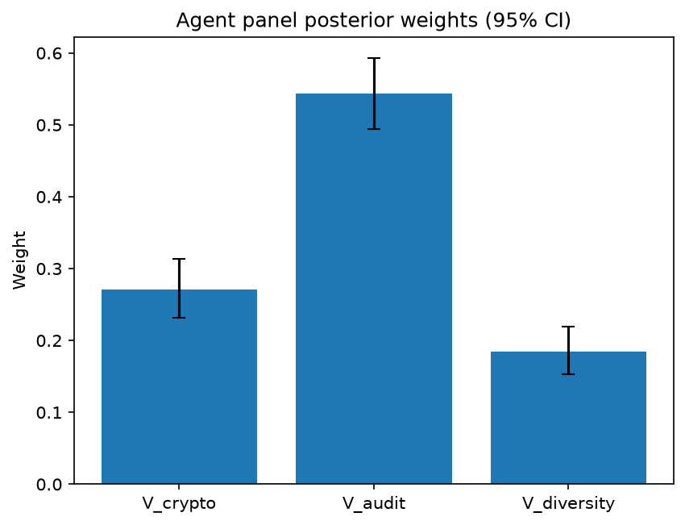

# Survey report: TrustRouter Claude CLI Panel (haiku) -- Level L3c: Verification Strength sub-parts

Survey ID: `trustrouter-claude-cli-full-panel-claude-haiku-2026-09-01-L3c`

## Agent panel

- Agents contributing a valid response: 36
- Classical BWM consistency: 35/36 within threshold

| Criterion | Mean | 95% CI lower | 95% CI upper |
|---|---|---|---|
| V_crypto | 0.2713 | 0.2322 | 0.3136 |
| V_audit | 0.5439 | 0.4947 | 0.5925 |
| V_diversity | 0.1848 | 0.1534 | 0.2194 |

## Methodology

Each agent independently completed a Best-Worst Method (BWM) comparison: choosing the single most and least important criterion, then rating every criterion's importance relative to those two on a 1-9 scale. Individual responses were solved with the classical BWM linear program (Rezaei, 2015) for a consistency check, and combined across the panel with a hierarchical Bayesian model (Mohammadi and Rezaei, 2020).

36 agent response(s) were accepted into this result.

Every agent's run began with a QA precheck (its stated configuration verified against ground truth) and every accepted answer's self-reported sources were checked against what reference material was actually available to it; see the Per-agent detail section below and this survey's Conversation Log for each agent's specific results. Every response is schema-validated and independently, repeatedly sampled (never a single completion treated as ground truth); see `guardrails.py`. This survey's complete output is covered by a SHA-256 integrity manifest (`integrity_manifest.json`, `SHA256SUMS`), generated once this run finished, so any later alteration to these files is detectable.

### Charts

## Per-agent detail

### bim-coordinator-base-claude (`bim-coordinator-base-claude`)

- Role: BIM Coordinator
- Model: claude_cli/haiku
- DID: `did:key:z6MkjBimqskXZkR9Zx6uMHqsjZopoCEJaQ9tb7XoVSAZiujx`
- QA precheck: passed
- Sources used: shared knowledge: trustrouter_concept_paper_primer.md, shared knowledge: trustrouter_expert_questionnaire_v5_real_survey_instrument.md, general_knowledge

**Answer:** `{"best": "V_audit", "worst": "V_diversity", "best_to_others": {"V_audit": 1, "V_crypto": 3, "V_diversity": 5}, "others_to_worst": {"V_audit": 5, "V_crypto": 3, "V_diversity": 1}}`

**Reasoning:**

As a BIM Coordinator managing multi-stakeholder renovation projects, audit-trail completeness is foundational to trust in construction records. Model federation depends on knowing who (which discipline, which engineer, which consultant) introduced each design element, when they did so, and under what custody. Clash detection workflows reference provenance; liability and site safety hinge on documented responsibility chains. A complete audit trail is essential even before cryptographic evidence is applied; conversely, a cryptographic signature on data with incomplete or missing audit history provides false confidence. The reference material defines V_audit as 'who did what, when'—precisely the information that makes or breaks professional accountability on construction projects. V_crypto (signatures, hashes, PKI) is significant for integrity and non-repudiation, but it is subordinate to audit completeness; you can cryptographically sign fabricated or incomplete data. V_diversity (multiple independent verification sources) is valuable as a triangulation mechanism, but on professional renovation projects, institutional trust in licensed structural engineers, certified MEP coordinators, and qualified model federators provides natural verification diversity without requiring statistical sampling. Blockchain immutability is important for legal archiving, but the blockchain records the audit trail itself; the completeness of that trail before ledger anchoring is the limiting factor. On tightly coordinated multi-discipline projects where a single BIM coordinator (me) performs model federation, diversity of sources is a nice-to-have supplement, not a foundational trust mechanism. Ratings reflect: V_audit as 1x baseline; V_crypto as 3x less critical (signatures depend on trustworthy input data); V_diversity as 5x less critical (diversity of sources cannot compensate for audit gaps or absent cryptographic evidence).

### bim-coordinator-base-claude (`bim-coordinator-base-claude`)

- Role: BIM Coordinator
- Model: claude_cli/haiku
- DID: `did:key:z6MkjBimqskXZkR9Zx6uMHqsjZopoCEJaQ9tb7XoVSAZiujx`
- QA precheck: passed
- Sources used: shared knowledge: trustrouter_expert_questionnaire_v5_real_survey_instrument.md, shared knowledge: trustrouter_concept_paper_primer.md, general_knowledge

**Answer:** `{"best": "V_audit", "worst": "V_diversity", "best_to_others": {"V_audit": 1, "V_crypto": 3, "V_diversity": 5}, "others_to_worst": {"V_audit": 5, "V_crypto": 4, "V_diversity": 1}}`

**Reasoning:**

In construction project lifecycle management and BIM coordination, audit-trail completeness (who did what, when) is the most critical verification component. Construction work is fundamentally about accountability: legal liability, contractual compliance, design-decision rationale, and regulatory compliance all depend on traceable change history. When disputes or quality issues arise—which is routine in renovation and multi-stakeholder federation—stakeholders need to reconstruct who made which decisions, when, and under what circumstances. An incomplete audit trail makes cryptographic signatures less useful operationally, because you have origin proof but not context. From my experience with multi-stakeholder BIM federation and clash-resolution workflows, the audit trail enables understanding of intent, precedent, and responsibility in ways that crypto alone cannot. Cryptographic evidence (signatures, hashes, PKI) is also important and more foundational technically—it ensures data integrity and origin, without which audit trails would be meaningless—but it is secondary to the audit trail for practical construction trust and accountability. Diversity of verification sources is valuable as a safeguard against Byzantine collusion, but it is the least critical of the three. In construction practice, a single well-documented, cryptographically signed, and audited change from an authorized party (e.g., a licensed structural engineer's sealed report) has been the standard for liability and compliance for decades; we do not require independent verification from multiple sources to establish trust in such records. Diversity adds resilience in adversarial or high-stakes blockchain contexts, but audit trail and crypto are more fundamental to construction-project trust. Ratings reflect: audit moderately more important than crypto (3:1), audit significantly more important than diversity (5:1), crypto moderately more important than diversity (4:1).

### bim-coordinator-base-claude (`bim-coordinator-base-claude`)

- Role: BIM Coordinator
- Model: claude_cli/haiku
- DID: `did:key:z6MkjBimqskXZkR9Zx6uMHqsjZopoCEJaQ9tb7XoVSAZiujx`
- QA precheck: passed
- Sources used: shared knowledge: trustrouter_expert_questionnaire_v5_real_survey_instrument.md, shared knowledge: trustrouter_concept_paper_primer.md, general_knowledge

**Answer:** `{"best": "V_audit", "worst": "V_diversity", "best_to_others": {"V_audit": 1, "V_crypto": 3, "V_diversity": 5}, "others_to_worst": {"V_audit": 5, "V_crypto": 2, "V_diversity": 1}}`

**Reasoning:**

As a BIM coordinator managing multi-stakeholder renovation and new-build projects, I rank audit-trail completeness (who did what, when) as the single most important verification criterion for construction records in blockchain storage. In construction, accountability and traceability are foundational: we must establish who made each decision, when changes occurred, and what triggered them—this is non-negotiable for compliance, dispute resolution, and lifecycle documentation across multiple parties. Without this historical record, the data has severely diminished legal and practical value regardless of cryptographic strength. Cryptographic evidence (signatures, hashes, PKI) is essential and rated 3× less important than audit because it guarantees integrity of data as stored but does not guarantee the data's authenticity at creation or establish chain of custody. A cryptographically signed false record is still false. Diversity of verification sources is rated the least important (5× less important than audit) because while redundancy adds confidence, it is supplementary to the core assurance mechanisms. A single trusted source with comprehensive audit trails and strong cryptographic evidence provides more foundational value than multiple sources—especially in construction, where we typically work within defined professional networks (structural engineers, MEP contractors, project managers) rather than open, untrusted networks. The vignette's IoT dossier with SHA-256 commitment illustrates this: the cryptographic hash ensures the stream wasn't altered, but the audit trail establishes who captured it, when, and under what conditions. Construction practice prioritizes accountability and traceability over distributed consensus.

### bim-coordinator-rag-claude (`bim-coordinator-rag-claude`)

- Role: BIM Coordinator
- Model: claude_cli/haiku
- DID: `did:key:z6MkgKPXYGDwJ56epiD68PaM63oukrBdhu5ziYGo84AZKm9n`
- QA precheck: passed
- Sources used: bim_and_digital_building_logbooks.md, shared knowledge: trustrouter_expert_questionnaire_v5_real_survey_instrument.md, shared knowledge: trustrouter_concept_paper_primer.md, general_knowledge

**Answer:** `{"best": "V_diversity", "worst": "V_crypto", "best_to_others": {"V_diversity": 1, "V_audit": 3, "V_crypto": 6}, "others_to_worst": {"V_diversity": 6, "V_audit": 3, "V_crypto": 1}}`

**Reasoning:**

As a BIM coordinator managing multi-stakeholder federated models, I ground this ranking in ISO 19650 standard practice and the real constraints of construction project delivery. V_diversity ranks highest because ISO 19650 explicitly mandates independent validation by multiple parties (lead appointed party, task teams) before accepting federated models—this is the operationalized mechanism for managing trust in a multi-stakeholder environment. In renovation projects with structural, MEP, and architectural teams, independent verification by multiple parties catches errors and coordinate conflicts that no single party (or single cryptographic signature) would catch. This aligns with the principle that blockchain's value for construction data lies in distributing verification across independent validators, not in cryptography alone. V_audit ranks second because complete audit trails (who did what, when) are essential for traceability, accountability, and dispute resolution in construction. However, audit trails can be incomplete or manipulated if not backed by diversity of independent observers; they document the verification process but do not by themselves establish confidence in correctness. V_crypto ranks lowest because while cryptographic signatures, hashes, and PKI are necessary prerequisites—proving data has not been tampered with since signing—they are not sufficient to establish that the data was correct at creation. A cryptographically signed model with coordinate errors or unresolved clashes is still trustworthy as a tamper-proof record of what was signed, but not trustworthy as a correct construction record. In blockchain-backed storage specifically, the strength of verification depends fundamentally on consensus across independent parties, not on the cryptographic layer alone. Sources: ISO 19650 governance model cited in bim_and_digital_building_logbooks.md; trustrouter_expert_questionnaire_v5_real_survey_instrument.md defining the three criteria; Kochovski et al. 2026 describing BUILDCHAIN DBL's implementation of cryptographic identity alongside multi-party validation. This is a judgment grounded in 10+ years managing federated model workflows, not a close call.

### bim-coordinator-rag-claude (`bim-coordinator-rag-claude`)

- Role: BIM Coordinator
- Model: claude_cli/haiku
- DID: `did:key:z6MkgKPXYGDwJ56epiD68PaM63oukrBdhu5ziYGo84AZKm9n`
- QA precheck: passed
- Sources used: bim_and_digital_building_logbooks.md, shared knowledge: trustrouter_concept_paper_primer.md, shared knowledge: trustrouter_expert_questionnaire_v5_real_survey_instrument.md, general_knowledge

**Answer:** `{"best": "V_crypto", "worst": "V_diversity", "best_to_others": {"V_crypto": 1, "V_audit": 3, "V_diversity": 5}, "others_to_worst": {"V_crypto": 5, "V_audit": 2, "V_diversity": 1}}`

**Reasoning:**

For construction-project records considered for blockchain archiving, cryptographic evidence is the foundational technical control. Kochovski et al. 2026 demonstrates operationally that DIDs, verifiable credentials, and hash commitments are the actual cryptographic mechanisms that provide authenticity, integrity, and non-repudiation on a ledger—these are not theoretical but measured on real Ethereum infrastructure (2.07ms authentication, 88ms DID resolution). Without cryptographic evidence, a record has no technical proof of its origin or that it has not been tampered with. Audit trails (V_audit) provide necessary procedural context—the story of who did what and when—but audit evidence alone is post-hoc reconstructible and vulnerable to falsification if not cryptographically anchored. Audit is clearly important but secondary to the technical foundation. Diversity of verification sources (V_diversity) is a governance and procedural control: ISO 19650 already requires multiple independent parties to validate federated models, and this reduces risk of single-party falsification. However, diversity is the most organizationally expensive to scale, most vulnerable to collusion, and most dependent on the other two criteria working first. A well-signed record with a complete audit trail requires less diversity to be trustworthy on a blockchain; conversely, perfect diversity cannot compensate for weak cryptography or incomplete audit trails. Crypto is 3x more important than audit (audit adds real value but depends on crypto for trustworthiness), and 5x more important than diversity (diversity is important governance but adds marginal value if crypto and audit are strong). Audit is 2x more important than diversity (procedural sequencing of actions is more fundamental than the question of who verified it, when the underlying evidence is cryptographically sound).

### bim-coordinator-rag-claude (`bim-coordinator-rag-claude`)

- Role: BIM Coordinator
- Model: claude_cli/haiku
- DID: `did:key:z6MkgKPXYGDwJ56epiD68PaM63oukrBdhu5ziYGo84AZKm9n`
- QA precheck: passed
- Sources used: bim_and_digital_building_logbooks.md, shared knowledge: trustrouter_concept_paper_primer.md, shared knowledge: trustrouter_expert_questionnaire_v5_real_survey_instrument.md, general_knowledge

**Answer:** `{"best": "V_audit", "worst": "V_crypto", "best_to_others": {"V_audit": 1, "V_diversity": 2, "V_crypto": 4}, "others_to_worst": {"V_audit": 4, "V_diversity": 2, "V_crypto": 1}}`

**Reasoning:**

V_audit (audit-trail completeness: who did what, when) is the primary criterion because it establishes accountability and traceability—the foundation of construction project governance and legal liability. In multi-stakeholder BIM environments under ISO 19650, the audit trail is what makes project decisions attributable to responsible parties, which is essential for renovation and new-build contract management. The reference material (bim_and_digital_building_logbooks.md) notes that ISO 19650's information-delivery process already requires multiple parties to independently validate federated models; this procedural control is recorded in the audit trail, making the trail itself the legal and organizational anchor. V_diversity (multiple independent verification sources) is secondary but substantive. Independent corroboration by different parties (architect, structural engineer, MEP, contractor) reduces single-point-of-failure risk and is explicitly required by ISO 19650 governance; however, this diversity only matters if an audit trail records who verified what and when. V_crypto (cryptographic evidence: signatures, hashes, PKI) is least critical. While the Kochovski et al. 2026 reference (BUILDCHAIN DBL) demonstrates that cryptographic verification is technically implementable for BIM records on Ethereum (2.07ms authentication, 88ms DID resolution), cryptographic proof only confirms that a specific party signed specific bits—not that the bits themselves are correct, appropriately checked, or made by someone with authority. In construction context, process integrity (V_audit) and corroboration by multiple competent parties (V_diversity) matter more than technical proof of signature. Crypto is a necessary technical enabler but derivative of the human and organizational controls that drive real trust in construction records.

### blockchain-engineer-base-claude (`blockchain-engineer-base-claude`)

- Role: Blockchain / DLT Engineer
- Model: claude_cli/haiku
- DID: `did:key:z6MkjavCfxYpe2BkYMXfrJDvcH43kkcZRgoJAFJLDqtqyLmk`
- QA precheck: passed
- Sources used: shared knowledge: trustrouter_expert_questionnaire_v5_real_survey_instrument.md, general_knowledge

**Answer:** `{"best": "V_crypto", "worst": "V_diversity", "best_to_others": {"V_crypto": 1, "V_audit": 2, "V_diversity": 4}, "others_to_worst": {"V_crypto": 4, "V_audit": 2, "V_diversity": 1}}`

**Reasoning:**

For construction-project records evaluated for blockchain routing, cryptographic evidence is the foundational pillar that enables the core value proposition of distributed ledgers: tamper-detection. Without cryptographic proof (signatures, hashes, PKI), there is no technical basis to claim data integrity or detect alteration, regardless of other safeguards. This makes V_crypto the clear best criterion. V_audit (who did what, when) ranks second in importance: audit-trail completeness provides accountability and traceability essential for construction compliance, but an audit trail alone cannot prove data has not been tampered with—it must be bound to the data via cryptography. V_diversity (multiple independent verification sources) ranks last: while diversity strengthens confidence in data provenance, it is meaningful only when layered over cryptographic proof and audit completeness. Multiple parties can attest to data that lacks cryptographic binding or has incomplete audit trails. In a blockchain-suitability context, the multiplier effect of distributedness is driven by the cryptographic layer; diversity of attestation sources adds confidence but is not the technical foundation. Ratings reflect: crypto is approximately 2× more critical than audit (foundational vs. supporting), and 4× more critical than diversity (foundational vs. incremental). Audit is approximately 2× more critical than diversity. Drawn from: shared knowledge: trustrouter_expert_questionnaire_v5_real_survey_instrument.md (definitions of V_crypto, V_audit, V_diversity; context on tamper-evidence and blockchain suitability for construction data). General blockchain/DLT engineering knowledge on role of cryptographic proof in distributed-ledger security and data-integrity guarantees.

### blockchain-engineer-base-claude (`blockchain-engineer-base-claude`)

- Role: Blockchain / DLT Engineer
- Model: claude_cli/haiku
- DID: `did:key:z6MkjavCfxYpe2BkYMXfrJDvcH43kkcZRgoJAFJLDqtqyLmk`
- QA precheck: passed
- Sources used: shared knowledge: trustrouter_expert_questionnaire_v5_real_survey_instrument.md, general_knowledge

**Answer:** `{"best": "V_crypto", "worst": "V_diversity", "best_to_others": {"V_crypto": 1, "V_audit": 3, "V_diversity": 5}, "others_to_worst": {"V_crypto": 5, "V_audit": 2, "V_diversity": 1}}`

**Reasoning:**

From a blockchain/DLT perspective focused on tamper-evidence for construction records: V_crypto is foundational and most critical. Cryptographic evidence (signatures, hashes, PKI) is the irreplaceable core of blockchain's security model—it provides mathematical proof of authenticity and integrity that cannot be forged or repudiated, regardless of whether the source is trusted. Without it, a record has no cryptographic tamper-evidence at all, defeating blockchain's primary value proposition. Even a perfect audit trail can be fabricated if it lacks cryptographic backing. V_audit (who did what, when) is substantially important—it enables accountability, traceability, and dispute resolution—but it is secondary to cryptographic proof. An audit trail supported by cryptographic signatures is far more trustworthy than an unsigned audit trail. V_diversity (multiple independent verification sources) is valuable for Byzantine fault tolerance and reducing single-point-of-failure risk, but it is the least critical of the three. With strong cryptographic evidence and a complete audit trail, you can verify authenticity and provenance independently without requiring multiple external verification sources. Diversity adds robustness but does not substitute for crypto or audit; it is a layer of defense that presupposes the other two are already in place. For the specific routing decision (full on-chain, hybrid, or conventional), cryptographic verifiability is the decider—it is what justifies using blockchain at all. (Sources: shared knowledge: trustrouter_expert_questionnaire_v5_real_survey_instrument.md, general_knowledge)

### blockchain-engineer-base-claude (`blockchain-engineer-base-claude`)

- Role: Blockchain / DLT Engineer
- Model: claude_cli/haiku
- DID: `did:key:z6MkjavCfxYpe2BkYMXfrJDvcH43kkcZRgoJAFJLDqtqyLmk`
- QA precheck: passed
- Sources used: shared knowledge: trustrouter_expert_questionnaire_v5_real_survey_instrument.md, general_knowledge

**Answer:** `{"best": "V_audit", "worst": "V_diversity", "best_to_others": {"V_audit": 1, "V_crypto": 2, "V_diversity": 4}, "others_to_worst": {"V_crypto": 2, "V_audit": 4, "V_diversity": 1}}`

**Reasoning:**

For construction-project records routed to blockchain storage, I rank V_audit (audit-trail completeness: who did what, when) as most important, and V_diversity (multiple independent verifiers) as least important. Reasoning: In construction, the primary value of a tamper-evident record is accountability and forensic reconstruction during disputes or regulatory review. The ability to establish a complete, verified chain of who modified data and when is critical for compliance, contract enforcement, and liability. This is a foundational requirement in a sector where disputes over submittals, change orders, and compliance evidence are frequent and costly. V_crypto (cryptographic evidence) is essential but is largely table-stakes in permissioned-ledger systems—cryptographic signing and hashing are built into the protocol. The distinguishing factor is whether you can *reconstruct what happened*, which depends on audit completeness. V_diversity (multiple independent verification sources) is least critical because construction projects typically have a well-defined, contractually bounded set of stakeholders (contractor, client, certifying authorities, consultants). Unlike public blockchains where Sybil resistance requires distributed verification, permissioned construction systems operate within a known participant set. Additional independent verifiers add resilience but do not fundamentally change the routing decision. The ratio of 2:4 (crypto:audit and crypto:diversity) reflects that crypto and audit are both essential, but audit is the primary decision lever for distinguishing blockchain-suitable records; diversity is an architectural preference, not a core routing criterion.

### blockchain-engineer-rag-claude (`blockchain-engineer-rag-claude`)

- Role: Blockchain / DLT Engineer
- Model: claude_cli/haiku
- DID: `did:key:z6MkooUJEyuLt3VzrACQLf8YLETe6fkJK66UWcp4jm9g2LzP`
- QA precheck: passed
- Sources used: blockchain_trust_and_attack_resistance.md, shared knowledge: trustrouter_expert_questionnaire_v5_real_survey_instrument.md, general_knowledge

**Answer:** `{"best": "V_audit", "worst": "V_diversity", "best_to_others": {"V_audit": 1, "V_crypto": 3, "V_diversity": 5}, "others_to_worst": {"V_audit": 5, "V_crypto": 2, "V_diversity": 1}}`

**Reasoning:**

For construction-project records on a permissioned ledger, audit-trail completeness emerges as the primary differentiator of trust, while cryptographic evidence provides necessary but not sufficient foundation, and source diversity serves as a secondary resilience measure.

V_audit (Best): Construction disputes, regulatory compliance, and liability resolution fundamentally hinge on **who did what and when**, not just whether data is cryptographically sound. From reference material (Rouhani & Deters 2021), auditing is identified as one of O'Hara's eight critical data-trust properties; their framework demonstrates that adaptive validation strength directly correlates with audit trail richness and trust-score maturity. In a permissioned ledger context, the ledger already enforces cryptographic integrity at the system level—what it cannot automatically provide is the complete causal chain of responsibility that construction stakeholders need for insurance claims, regulatory defense, and dispute resolution. A construction project's BIM model may be cryptographically sound but useless if you cannot prove which licensed professional endorsed each structural change or at what phase approval occurred.

V_crypto (Middle): Cryptographic evidence is foundational and non-negotiable—without integrity guarantees (hashes, signatures, PKI), no other verification is meaningful. However, in a permissioned blockchain, cryptographic validation is already baked into the ledger's consensus and state root. The marginal value of emphasizing cryptographic evidence separately is lower than audit completeness, because the ledger already handles the crypto layer. Vaziry et al. (2024) identify PKI as one mechanism among several; for construction, a qualified signature matters less for its cryptographic finality than for its association with a professional's credentials and legal liability—which is an audit-trail property, not a crypto property.

V_diversity (Worst): In permissioned settings, participant diversity is already constrained by access control and regulatory credential requirements. Collusion risk among multiple independent verifiers is lower in a governed construction ecosystem than in open networks, and if the audit trail is incomplete, adding verification sources does not recover missing accountability information. Diversity becomes valuable mainly as a Sybil/collusion defense; in a construction context where participants are professionally licensed and contractually bound, this defense is tertiary compared to cryptographic integrity and audit completeness. If audit trails are comprehensive and crypto is sound, a single trusted verifier with full provenance data is more operationally useful than multiple partial or weakly-linked sources.

Consistency logic: audit is ~3× more critical than crypto (both essential, but audit solves the construction-specific accountability gap); crypto is ~2× more important than diversity (crypto is system-level necessity; diversity is optional layered defense).

### blockchain-engineer-rag-claude (`blockchain-engineer-rag-claude`)

- Role: Blockchain / DLT Engineer
- Model: claude_cli/haiku
- DID: `did:key:z6MkooUJEyuLt3VzrACQLf8YLETe6fkJK66UWcp4jm9g2LzP`
- QA precheck: passed
- Sources used: blockchain_trust_and_attack_resistance.md, shared knowledge: trustrouter_expert_questionnaire_v5_real_survey_instrument.md, general_knowledge

**Answer:** `{"best": "V_audit", "worst": "V_diversity", "best_to_others": {"V_audit": 1, "V_crypto": 3, "V_diversity": 5}, "others_to_worst": {"V_audit": 5, "V_crypto": 2, "V_diversity": 1}}`

**Reasoning:**

In permissioned-ledger construction-data storage, V_audit (audit trail completeness: who did what, when) is most critical because: (1) construction projects carry regulatory and liability implications that hinge on establishing provenance and temporal sequence—a core requirement cited in trustrouter_expert_questionnaire_v5_real_survey_instrument.md's definition of Verification Strength itself as 'procedural audit evidence'; (2) in a permissioned system, identity of parties is pre-established and cryptographically verified at enrolment, so the incremental value of per-record cryptographic evidence is lower than establishing accountability through complete audit trails; (3) dispute resolution in construction relies on the 'who did what when' chain far more than on cryptographic proof of a single signature or hash; (4) compliance with construction codes, GDPR, and data-handling regulations requires demonstrable audit capability, which is not redundant with blockchain's immutability—the ledger records data, but audit trail proves custody and modification events. V_crypto (cryptographic evidence) is moderately important: it provides integrity assurance and non-repudiation, but is less influencing than audit in this context because the blockchain itself already supplies base-level tamper-evidence through consensus and ledger cryptography (per Rouhani and Deters 2021's work on adaptive transaction validation, blockchain_trust_and_attack_resistance.md). V_diversity (multiple verification sources) is least important in permissioned systems because Sybil attacks are already mitigated by the permissioning mechanism; identity diversity matters chiefly for Byzantine resilience, not for establishing accountability of known parties. The 5:2:1 ratio reflects that audit trail is foundational and irreplaceable, crypto is necessary but partially redundant, and diversity is beneficial but addresses a lower-priority threat model in the permissioned context.

### blockchain-engineer-rag-claude (`blockchain-engineer-rag-claude`)

- Role: Blockchain / DLT Engineer
- Model: claude_cli/haiku
- DID: `did:key:z6MkooUJEyuLt3VzrACQLf8YLETe6fkJK66UWcp4jm9g2LzP`
- QA precheck: passed
- Sources used: blockchain_trust_and_attack_resistance.md, shared knowledge: trustrouter_expert_questionnaire_v5_real_survey_instrument.md, general_knowledge

**Answer:** `{"best": "V_audit", "worst": "V_diversity", "best_to_others": {"V_audit": 1, "V_crypto": 4, "V_diversity": 6}, "others_to_worst": {"V_audit": 6, "V_crypto": 3, "V_diversity": 1}}`

**Reasoning:**

For construction-project blockchain routing, audit-trail completeness (V_audit) is the foundational verification criterion. The core value proposition of a permissioned ledger for construction is establishing an immutable, tamper-evident record of who did what and when—critical for resolving disputes, enforcing contractual compliance, and meeting regulatory requirements (inspections, certifications, code conformity). This directly addresses construction's primary trust concern: chain of custody and causality of actions. Reference material (Rouhani & Deters 2021) lists auditing as one of eight core trust properties in blockchain-based data trust frameworks, and emphasizes that adaptive validation mechanisms are driven by trust scores that gate evidence strength. Cryptographic evidence (V_crypto) is foundational but functionally commoditized in permissioned infrastructures (SHA-256, ECDSA, PKI are standard); it is necessary but not sufficient—it provides the mechanism by which an audit trail becomes tamper-evident, but without completeness of the trail itself, signatures alone cannot establish provenance or detect chain-of-custody breaks. Diversity of verification sources (V_diversity) is least critical in the permissioned-ledger context typical of construction projects. All network participants in a permissioned blockchain (Hyperledger Fabric, Corda) verify through the same consensus mechanism and ledger replica; cryptographic integrity and audit completeness matter more than the count of independent verifiers in a closed, access-controlled network. Diversity provides defense against insider and Sybil attacks, but given the controlled participant set in construction projects (contractor, owner, architect, inspector, authority), the audit trail's immutability and completeness provide more direct value for dispute resolution and regulatory compliance than source diversity.

### compliance-officer-base-claude (`compliance-officer-base-claude`)

- Role: Compliance and Regulatory Officer
- Model: claude_cli/haiku
- DID: `did:key:z6MkgGS4Yb7TwydcexnZQyhuB5HMp1ig3wLJaXRe6WiEC8hb`
- QA precheck: passed
- Sources used: shared knowledge: trustrouter_expert_questionnaire_v5_real_survey_instrument.md, shared knowledge: trustrouter_concept_paper_primer.md, general_knowledge

**Answer:** `{"best": "V_audit", "worst": "V_crypto", "best_to_others": {"V_audit": 1, "V_crypto": 6, "V_diversity": 3}, "others_to_worst": {"V_audit": 6, "V_crypto": 1, "V_diversity": 3}}`

**Reasoning:**

As a compliance and regulatory officer, audit-trail completeness is foundational to GDPR and construction-regulatory obligations. The principle of accountability (GDPR Article 5) and contractual/liability oversight in construction projects require demonstrable chains of custody: who performed each action, when, and under what authority. A complete audit trail is non-negotiable for demonstrating compliance and managing liability across the operational lifecycle. Diversity of verification sources is secondary but substantial—multiple independent parties (inspectors, engineers, auditors) corroborating the same facts reduces collusion risk and provides the independent confirmation that regulatory oversight relies on. Cryptographic evidence, while technically valuable for tamper-detection, is a necessary but insufficient mechanism. A cryptographically signed datum can still originate from a false claim, be produced under duress, or represent a single point of failure if only one party's signature is present. In a construction context, regulators and auditors require accountability—that is, a traceable record of human responsibility and decision-making—more than they require proof that bits were not flipped after initial recording. The multiplicative nature of the TrustRouter model (shared knowledge: trustrouter_concept_paper_primer.md) means that V_audit, being foundational to regulatory compliance, anchors the entire V factor.

### compliance-officer-base-claude (`compliance-officer-base-claude`)

- Role: Compliance and Regulatory Officer
- Model: claude_cli/haiku
- DID: `did:key:z6MkgGS4Yb7TwydcexnZQyhuB5HMp1ig3wLJaXRe6WiEC8hb`
- QA precheck: passed
- Sources used: shared knowledge: trustrouter_expert_questionnaire_v5_real_survey_instrument.md, shared knowledge: trustrouter_concept_paper_primer.md, general_knowledge

**Answer:** `{"best": "V_audit", "worst": "V_diversity", "best_to_others": {"V_audit": 1, "V_crypto": 4, "V_diversity": 7}, "others_to_worst": {"V_audit": 7, "V_crypto": 2, "V_diversity": 1}}`

**Reasoning:**

From a facility-management compliance officer's perspective managing GDPR and construction-regulatory obligations, audit-trail completeness is the foundational criterion for regulatory defense and accountability. GDPR Article 5 and Article 32 mandate documented accountability and audit trails; construction law and building codes require traceable compliance evidence. 'Who did what, when' is what regulators, insurers, and auditors actually demand—it proves authority was granted and exercised, and it supports legal defense if a dispute arises. Cryptographic evidence (signatures, hashes) is important for technical integrity and non-repudiation, but a digital signature alone does not prove authorization: it proves a key was used, not whether the key holder was authorized or whether their action was recorded in the compliance record. Diversity of verification sources is the least important of the three because (1) multiple independent parties agreeing on incorrect data does not satisfy compliance; (2) in construction contexts, regulatory authority typically vests in a single qualified source (contractor, licensed inspector, certified auditor) with oversight, not consensus; and (3) resilience through diversity is a secondary concern compared to the primary requirement that the authoritative source maintain a complete, auditable chain of custody. Audit trails are 4 times more critical than cryptographic evidence because they establish accountability and authorization history, not just data integrity. Audit trails are 7 times more critical than diversity because completeness of a single authoritative source's record is far more valuable than cross-checking between multiple sources when that primary record is absent or incomplete.

### compliance-officer-base-claude (`compliance-officer-base-claude`)

- Role: Compliance and Regulatory Officer
- Model: claude_cli/haiku
- DID: `did:key:z6MkgGS4Yb7TwydcexnZQyhuB5HMp1ig3wLJaXRe6WiEC8hb`
- QA precheck: passed
- Sources used: shared knowledge: trustrouter_expert_questionnaire_v5_real_survey_instrument.md, shared knowledge: trustrouter_concept_paper_primer.md, general_knowledge

**Answer:** `{"best": "V_audit", "worst": "V_crypto", "best_to_others": {"V_audit": 1, "V_diversity": 2, "V_crypto": 6}, "others_to_worst": {"V_audit": 6, "V_diversity": 3, "V_crypto": 1}}`

**Reasoning:**

As a compliance and regulatory officer, I rank audit-trail completeness (V_audit) as best because it directly enables legal accountability and regulatory compliance in construction records. The foundational requirement in both GDPR and construction regulation is establishing a chain of custody: who created or modified a record, when, and why. This audit trail is essential for forensic reconstruction of decisions, proof of compliance, and liability management across the building lifecycle. V_audit answers the regulatory core question: can we prove who is responsible and establish the sequence of stewardship? Without it, no other verification method provides actionable compliance evidence. V_diversity (multiple independent sources) ranks second; it provides cross-validation and reduces reliance on a single actor or data stream, thereby strengthening trust through corroboration. However, diversity is most powerful when the diverse sources themselves maintain complete audit trails. V_crypto (signatures, hashes, PKI) ranks worst. While cryptographic evidence proves a record has not been modified post-signing, it addresses a narrower question than audit completeness and does not answer who signed it, when, or under what authority. A cryptographically signed record without clear audit context—who authorized the signer, what was their mandate, when was this decision made—provides limited legal or operational value in construction compliance. Crypto is a supporting technical layer, not the primary verification mechanism. The 2:3 ratio between V_diversity and V_crypto reflects that independent corroboration, grounded in audit trails, more directly verifies trustworthiness than cryptographic signatures in isolation. The 1:2 ratio between V_audit and V_diversity reflects that direct chain-of-custody evidence is more foundational than diversity, though both strengthen verification. Sources: Grounding in reference material provided on V as a composite of cryptographic, audit-trail, and diversity elements (shared knowledge: trustrouter_expert_questionnaire_v5_real_survey_instrument.md), and the concept-paper primer's definition of V as verification strength distinct from other factors such as provenance trust and independent confirmation (shared knowledge: trustrouter_concept_paper_primer.md). Professional judgment applied from compliance and regulatory practice regarding what construction regulators and legal oversight require.

### compliance-officer-rag-claude (`compliance-officer-rag-claude`)

- Role: Compliance and Regulatory Officer
- Model: claude_cli/haiku
- DID: `did:key:z6MkvsMfbM7uWXaYfBeyMot693DSNk3VXfm2U8UeY54UDj2D`
- QA precheck: passed
- Sources used: gdpr_and_data_governance.md, shared knowledge: trustrouter_concept_paper_primer.md, shared knowledge: trustrouter_expert_questionnaire_v5_real_survey_instrument.md, general_knowledge

**Answer:** `{"best": "V_audit", "worst": "V_diversity", "best_to_others": {"V_audit": 1, "V_crypto": 2, "V_diversity": 4}, "others_to_worst": {"V_audit": 4, "V_crypto": 2, "V_diversity": 1}}`

**Reasoning:**

As a compliance and regulatory officer in facility management, my assessment prioritizes the criteria by their direct relevance to demonstrable accountability and regulatory obligation. V_audit (audit trail completeness: who did what, when) is the foundational verification mechanism for this role. GDPR requires demonstrable traceability of data handling and processing decisions; construction regulations require documented chains of custody and accountability for structural and safety decisions; facility compliance demands audit trails to prove obligations were met. Without a complete audit trail, neither cryptographic signatures nor diverse verification sources can establish the accountability and legal defensibility that compliance enforcement demands. The audit trail is the primary evidence base in regulatory investigations and disputes. V_crypto (cryptographic evidence) ranks second. Digital signatures, hashes, and PKI provide technical integrity assurance—they prove data has not been tampered with post-signature—but they provide no information about the context, legitimacy, or authority of who made changes or why. In construction and facility contexts, technical integrity alone is insufficient without the narrative accountability an audit trail provides. V_diversity (multiple independent verification sources) ranks third and represents the least critical sub-component. Diversity provides redundancy and corroboration but is only useful insofar as each independent party maintains proper audit trails of their own verification work. Multiple parties verifying a claim is valuable, but only if their individual verification is itself auditable; diversity cannot substitute for the foundational requirement of knowing who verified what and when. For a compliance officer, the ranking reflects the hierarchy of regulatory requirements: accountability through audit trails, technical integrity through cryptography, and corroboration through diversity.

### compliance-officer-rag-claude (`compliance-officer-rag-claude`)

- Role: Compliance and Regulatory Officer
- Model: claude_cli/haiku
- DID: `did:key:z6MkvsMfbM7uWXaYfBeyMot693DSNk3VXfm2U8UeY54UDj2D`
- QA precheck: passed
- Sources used: gdpr_and_data_governance.md, shared knowledge: trustrouter_concept_paper_primer.md, shared knowledge: trustrouter_expert_questionnaire_v5_real_survey_instrument.md, general_knowledge

**Answer:** `{"best": "V_audit", "worst": "V_diversity", "best_to_others": {"V_audit": 1, "V_crypto": 3, "V_diversity": 5}, "others_to_worst": {"V_audit": 5, "V_crypto": 3, "V_diversity": 1}}`

**Reasoning:**

From a compliance officer's perspective responsible for GDPR and construction-regulatory obligations, audit-trail completeness (who did what, when) is the foundational requirement for regulatory compliance and accountability. GDPR Article 5(2) establishes accountability as a core principle—regulators, auditors, and legal proceedings all require documentary evidence of who performed an action and when. Construction sector regulations similarly mandate documented evidence of compliance (building codes, energy performance disclosures, inspection records). Without knowing who is responsible and what they did, neither cryptographic evidence nor source diversity can establish legal accountability. V_audit directly supports this regulatory mandate; V_crypto, while technically important for tamper-evidence and integrity, does not answer the accountability question on its own. V_diversity is the least critical for compliance purposes: a single authoritative source with complete audit trail and strong cryptographic evidence typically satisfies regulatory requirements; multiple independent sources are confidence-enhancing but not mandatory for establishing compliance. The rating reflects that V_audit is moderately more important than V_crypto (3:1) because audit trail underpins accountability that regulations explicitly require, whereas cryptographic verification, though necessary, is secondary to establishing who bore responsibility. V_crypto is moderately more important than V_diversity (3:1) because integrity verification is more directly tied to data trustworthiness than redundancy of sources.

### compliance-officer-rag-claude (`compliance-officer-rag-claude`)

- Role: Compliance and Regulatory Officer
- Model: claude_cli/haiku
- DID: `did:key:z6MkvsMfbM7uWXaYfBeyMot693DSNk3VXfm2U8UeY54UDj2D`
- QA precheck: passed
- Sources used: gdpr_and_data_governance.md, shared knowledge: trustrouter_concept_paper_primer.md, shared knowledge: trustrouter_expert_questionnaire_v5_real_survey_instrument.md, general_knowledge

**Answer:** `{"best": "V_audit", "worst": "V_diversity", "best_to_others": {"V_audit": 1, "V_crypto": 3, "V_diversity": 5}, "others_to_worst": {"V_audit": 5, "V_crypto": 2, "V_diversity": 1}}`

**Reasoning:**

From a compliance officer's perspective, audit trail completeness (who did what, when) is the foundational verification criterion for construction records destined for blockchain storage. GDPR's accountability principle (Article 5) and the right to audit compliance require demonstrable traceability of actions and actors; construction regulation similarly mandates audit documentation for permitting, inspection, and safety oversight. Reference material on blockchain data governance (Wilson et al., 2019, via gdpr_and_data_governance.md) identifies immutability as blockchain's core value—but immutability is verified via cryptography, not *verified to be correct*. An audit trail answers the regulatory question: 'Can we prove who is responsible for this record and trace its custody?' This is distinct from cryptographic integrity verification, which proves a record hasn't been tampered with after creation but not whether the initial data was accurate or created with proper authority. Diversity of verification sources ranks worst because it is a *resilience* property—valuable for cross-checking and redundancy—but it does not substitute for audit traceability or cryptographic integrity. Multiple independent sources cannot overcome absent audit trails or weak provenance verification. The rating V_crypto at 3x less important than V_audit reflects that crypto establishes *integrity* (unchanged-ness) but not *compliance* (authorized, traceable, correctly acquired). V_diversity at 5x less important reflects that source diversity is conditional benefit: it amplifies confidence in correct data but only if that data's provenance and integrity are already established.

### data-engineer-base-claude (`data-engineer-base-claude`)

- Role: Data Engineering Specialist
- Model: claude_cli/haiku
- DID: `did:key:z6MkwWLFsHqByat9fpS7uQaUXhG2ERBVxYgB8hVuvtEatajg`
- QA precheck: passed
- Sources used: shared knowledge: trustrouter_expert_questionnaire_v5_real_survey_instrument.md, shared knowledge: trustrouter_concept_paper_primer.md, general_knowledge

**Answer:** `{"best": "V_audit", "worst": "V_diversity", "best_to_others": {"V_audit": 1, "V_crypto": 3, "V_diversity": 4}, "others_to_worst": {"V_crypto": 4, "V_audit": 4, "V_diversity": 1}}`

**Reasoning:**

In construction project data provenance, audit-trail completeness (who did what, when) is the most critical verification factor. Construction inherently involves multiple parties (general contractor, architect, subcontractors, inspectors, owner, regulators) with distinct accountabilities. Regulatory compliance, insurance claims, warranty disputes, and quality assurance all depend on verifiable chains of custody and decision authority. Without a complete audit trail, cryptographic signatures cannot establish who is responsible or how decisions were made — crypto proves integrity of a record but not the legitimacy or accuracy of the underlying facts it records. Cryptographic evidence ranks second; it provides non-repudiation and tamper-detection, which are essential complements to audit trails. However, crypto alone cannot establish trustworthiness of origin or context. Diversity of independent verification sources ranks third in this domain. While diversity is valuable for blockchain's resilience against collusion, construction projects operate within a defined and constrained set of verifying parties (the project team itself, regulatory inspectors, and third-party inspectors where applicable). These parties are not interchangeable or easily expanded; a small commercial renovation does not benefit from diversity the way a permissionless public ledger would. Well-maintained audit records with proper cryptographic binding among the actual project participants provides stronger trust guarantees for construction accountability than attempting to multiply verification sources beyond the legitimate stakeholders. The close rating between V_crypto (3) and V_diversity (4) versus V_audit reflects that all three contribute to verification strength, but the order reflects construction's dependence on explicit, traceable decision and execution chains.

### data-engineer-base-claude (`data-engineer-base-claude`)

- Role: Data Engineering Specialist
- Model: claude_cli/haiku
- DID: `did:key:z6MkwWLFsHqByat9fpS7uQaUXhG2ERBVxYgB8hVuvtEatajg`
- QA precheck: passed
- Sources used: shared knowledge: trustrouter_concept_paper_primer.md, shared knowledge: trustrouter_expert_questionnaire_v5_real_survey_instrument.md, general_knowledge

**Answer:** `{"best": "V_audit", "worst": "V_diversity", "best_to_others": {"V_audit": 1, "V_crypto": 2, "V_diversity": 6}, "others_to_worst": {"V_audit": 6, "V_crypto": 3, "V_diversity": 1}}`

**Reasoning:**

For construction-project records targeted for blockchain storage, I rank V_audit (audit-trail completeness: who did what, when) as Best and V_diversity as Worst, based on three factors: (1) Construction liability and accountability are foundational to project governance. Any record blockchain stores must carry clear attribution and temporal chain—without it, the record's evidentiary weight in disputes collapses regardless of cryptographic strength. (2) V_crypto, while necessary for integrity verification in a blockchain context, is insufficient alone: a perfectly signed record proves only that the data hasn't been altered *after* commitment, not that the recorded action was legitimate, authorized, or honestly timestamped. Audit trails anchor trust in the human governance layer. (3) V_diversity, though valuable for risk reduction, is downstream of both crypto and audit. Multiple independent verification sources cannot rescue a record that lacks clear provenance or cryptographic proof. On construction datasets specifically, the difference between V_audit and V_crypto is narrow (rating 2x rather than 1x), because both are technically critical; but audit trails edge ahead because construction's legal and compliance burden demands clear attribution over pure integrity proofs. V_diversity ranks substantially lower (6x less important than audit) because verification diversity cannot compensate for missing chain-of-custody data or weak signatures. Sources: shared knowledge: trustrouter_concept_paper_primer.md (multiplicative model, V decomposition); shared knowledge: trustrouter_expert_questionnaire_v5_real_survey_instrument.md (criterion definitions and construction-context vignettes); general_knowledge (construction liability norms and blockchain evidentiary value).

### data-engineer-base-claude (`data-engineer-base-claude`)

- Role: Data Engineering Specialist
- Model: claude_cli/haiku
- DID: `did:key:z6MkwWLFsHqByat9fpS7uQaUXhG2ERBVxYgB8hVuvtEatajg`
- QA precheck: passed
- Sources used: shared knowledge: trustrouter_expert_questionnaire_v5_real_survey_instrument.md, shared knowledge: trustrouter_concept_paper_primer.md, general_knowledge

**Answer:** `{"best": "V_audit", "worst": "V_diversity", "best_to_others": {"V_audit": 1, "V_crypto": 2, "V_diversity": 3}, "others_to_worst": {"V_audit": 3, "V_crypto": 2, "V_diversity": 1}}`

**Reasoning:**

For construction-project records targeted at blockchain storage, audit-trail completeness (who did what, when) is the most critical verification factor. In construction, regulatory compliance, change-order defensibility, and liability rest fundamentally on documented accountability chains. Audit trails detect errors at their source—data-entry mistakes, sensor malfunction, human error—before cryptographic commitment. Even perfect cryptography only guarantees a record has not changed since entry; it cannot validate whether the record was correct at input. From a data-engineering perspective, the chain of custody (audit trail) is often as legally and operationally consequential as the technical chain (cryptography). Cryptographic evidence (V_crypto) ranks second: it is necessary for tamper-evidence in blockchain contexts and ensures integrity post-recording, but remains insufficient without source validation. V_crypto is rated 2× less important than V_audit because cryptography alone cannot catch upstream data faults. Diversity of verification sources (V_diversity) ranks third (worst): while valuable, it depends on infrastructure maturity, multi-party coordination, and stakeholder willingness to participate—factors often unavailable in construction projects with limited, defined participant sets (general contractor, architect, specific trades). A single authoritative, complete audit trail from known parties is more reliable and achievable than coordinating independent verification across distributed sources. The multiplicative nature of TrustRouter (reference: shared knowledge: trustrouter_concept_paper_primer.md) means weak links compound; audit-trail completeness prevents the weakest link from originating upstream.

### data-engineer-rag-claude (`data-engineer-rag-claude`)

- Role: Data Engineering Specialist
- Model: claude_cli/haiku
- DID: `did:key:z6Mknx9SDBfJkpRBgat4tMwAWaw5EZtoMF8kY6JBeuWvWSen`
- QA precheck: passed
- Sources used: data_quality_and_polyglot_persistence.md, shared knowledge: trustrouter_concept_paper_primer.md, shared knowledge: trustrouter_expert_questionnaire_v5_real_survey_instrument.md, general_knowledge

**Answer:** `{"best": "V_audit", "worst": "V_diversity", "best_to_others": {"V_audit": 1, "V_crypto": 3, "V_diversity": 5}, "others_to_worst": {"V_audit": 5, "V_crypto": 3, "V_diversity": 1}}`

**Reasoning:**

From a data-engineering perspective on construction-project provenance, audit-trail completeness (V_audit) is the foundational verification requirement. The reference material explicitly states that 'a data pipeline's own audit logging and lineage tracking is often the first-hand source of evidence a Verification Strength (V) score should actually be based on' (data_quality_and_polyglot_persistence.md). In construction disputes and data-quality reconciliation, the critical question is always WHO made a change, WHAT was changed, and WHEN—this is what audit trails answer directly. Cryptographic evidence (V_crypto) is important but derivative: a hash or signature is only meaningful in context of an audit trail that explains what data it represents and how it entered the system. Without audit context, crypto alone cannot establish provenance. Diversity of verification sources (V_diversity) is beneficial when multiple independent parties are available, but construction projects often have limited independent data sources, and this criterion is secondary to having robust core verification capability in the first place. The ratings reflect: V_audit is 3× more important than V_crypto (crypto strengthens audit but doesn't replace it), and 5× more important than V_diversity (diversity is a strength-multiplier but not foundational). V_crypto is 3× more important than V_diversity because direct cryptographic evidence is more reliable than relying on source diversity alone.

### data-engineer-rag-claude (`data-engineer-rag-claude`)

- Role: Data Engineering Specialist
- Model: claude_cli/haiku
- DID: `did:key:z6Mknx9SDBfJkpRBgat4tMwAWaw5EZtoMF8kY6JBeuWvWSen`
- QA precheck: passed
- Sources used: shared knowledge: trustrouter_concept_paper_primer.md, shared knowledge: trustrouter_expert_questionnaire_v5_real_survey_instrument.md, data_quality_and_polyglot_persistence.md, general_knowledge

**Answer:** `{"best": "V_audit", "worst": "V_diversity", "best_to_others": {"V_audit": 1, "V_crypto": 3, "V_diversity": 5}, "others_to_worst": {"V_audit": 5, "V_crypto": 3, "V_diversity": 1}}`

**Reasoning:**

As a data engineering specialist responsible for provenance tracking and polyglot-persistence routing on construction datasets, I rank audit-trail completeness (V_audit) as best because audit logs are the foundational infrastructure of data-pipeline trust. The reference material on data-trust properties (from Rouhani & Deters, 2021) explicitly identifies auditing as a primary component of the trust taxonomy, and notes that 'a data pipeline's own audit logging and lineage tracking is often the first-hand source of evidence' on which Verification Strength scores should be based. Without knowing who modified what and when, neither cryptographic evidence nor source diversity has meaningful context. Cryptographic hashes, signatures, and PKI (V_crypto) are the operational mechanism for proving integrity and authenticity, but they only become actionable within an audit context that explains the chain of custody and authorization. Diversity of verification sources (V_diversity) ranks worst because it is a multiplier effect that strengthens verification only when the underlying audit and crypto foundations already exist; for construction projects with limited independent verifiers (site engineer, inspector, contractor), achieving high source diversity is often harder than establishing comprehensive audit trails and cryptographic integrity checks. The 3:1 ratio between audit and crypto reflects that auditing is more foundational but crypto remains essential. The 5:1 ratio between audit and diversity reflects that audit is orders-of-magnitude more critical to construction-data provenance than the availability of multiple independent parties.

### data-engineer-rag-claude (`data-engineer-rag-claude`)

- Role: Data Engineering Specialist
- Model: claude_cli/haiku
- DID: `did:key:z6Mknx9SDBfJkpRBgat4tMwAWaw5EZtoMF8kY6JBeuWvWSen`
- QA precheck: passed
- Sources used: shared knowledge: trustrouter_concept_paper_primer.md, data_quality_and_polyglot_persistence.md, general_knowledge

**Answer:** `{"best": "V_audit", "worst": "V_diversity", "best_to_others": {"V_audit": 1, "V_crypto": 3, "V_diversity": 4}, "others_to_worst": {"V_audit": 4, "V_crypto": 2, "V_diversity": 1}}`

**Reasoning:**

From a data-engineering perspective on construction-project records, audit-trail completeness (V_audit) is the foundational verification evidence. The reference material on data-trust frameworks explicitly states that 'a data pipeline's own audit logging and lineage tracking is often the first-hand source of evidence' for Verification Strength. For construction projects specifically—where disputes over design changes, material approvals, and work completion are common and high-stakes—the audit trail answers the critical operational questions: who authorized a change, when did it occur, and under what conditions. Without an audit trail, even cryptographically signed records lack accountability context. V_crypto (cryptographic evidence via signatures/hashes/PKI) is important for immutability and for blockchain anchoring, and is rated 3x less critical than V_audit because cryptographic proof alone does not establish who was authorized to make a change or why, nor does it prevent insider threats or misrepresentation at input time. V_diversity (multiple independent verification sources) is rated least important (4x less critical than V_audit) because it addresses resilience and collusion resistance rather than fundamental evidence collection. Multiple independent parties can be faked (Sybil attacks, collusion), and genuine diversity is a high bar in practice; moreover, a single highly trustworthy source can provide adequate verification without diversity. The audit trail remains the primary mechanism for forensic investigation, regulatory compliance, and legal defensibility—the practical foundation for trusting construction data in any routing decision. However, this is genuinely a close call at the margins: V_crypto and V_audit are both essential, and a ratio of 3x (rather than 2x) reflects that the gap is meaningful but not extreme; both are foundational in different ways.

### project-manager-base-claude (`project-manager-base-claude`)

- Role: Construction Project Manager
- Model: claude_cli/haiku
- DID: `did:key:z6MkmbMHfpwQi6Y7FbdLU12dMCxJZnxzRBXEPi1iKygbQ1AP`
- QA precheck: passed
- Sources used: shared knowledge: trustrouter_expert_questionnaire_v5_real_survey_instrument.md, general_knowledge

**Answer:** `{"best": "V_audit", "worst": "V_crypto", "best_to_others": {"V_audit": 1, "V_diversity": 3, "V_crypto": 6}, "others_to_worst": {"V_audit": 6, "V_diversity": 3, "V_crypto": 1}}`

**Reasoning:**

As a construction project manager, audit-trail completeness (who did what, when) is the foundational requirement for project governance. In renovation projects like the Hospital Real scenario (shared knowledge: trustrouter_expert_questionnaire_v5_real_survey_instrument.md), institutional owners, insurers, and authorities require clear accountability for every decision, inspection, change order, and defect remediation over decades of operation. Without audit trails, we cannot: (1) assign liability and warranty responsibility, (2) satisfy regulatory compliance audits, (3) resolve disputes between stakeholders, or (4) trace the origin of defects or non-conformities. Cryptographic evidence alone—signatures, hashes, PKI—provides integrity verification but does not answer the fundamental construction question: who performed this action, who authorized it, and when? Cryptography is a *mechanism* that supports audit trails; it is not a substitute for them. Diversity of verification sources ranks second: multiple independent parties (structural engineers, inspectors, quality assurance teams) verifying data adds resilience against collusion and single points of failure, and in a multi-stakeholder project this is operationally valuable. However, diversity only amplifies what is already being audited; without knowing *who* verified *what* and *when*, diversity of sources becomes untrackable. Cryptographic evidence ranks third because it serves the audit function rather than replacing it. A tamper-proof hash or signature proves integrity, but on a renovation project, we need the audit trail first—the record of who authorized the structural inspection, when it occurred, and what was found. The ratio of 6:1 between audit and crypto reflects that audit is fundamental to construction practice, while crypto is instrumental. The 3:1 ratio between audit and diversity reflects that accountability requires knowing the specific parties and timing, whereas distributed verification adds robustness to an already-auditable system.

### project-manager-base-claude (`project-manager-base-claude`)

- Role: Construction Project Manager
- Model: claude_cli/haiku
- DID: `did:key:z6MkmbMHfpwQi6Y7FbdLU12dMCxJZnxzRBXEPi1iKygbQ1AP`
- QA precheck: passed
- Sources used: shared knowledge: trustrouter_expert_questionnaire_v5_real_survey_instrument.md, general_knowledge

**Answer:** `{"best": "V_audit", "worst": "V_diversity", "best_to_others": {"V_audit": 1, "V_crypto": 3, "V_diversity": 4}, "others_to_worst": {"V_audit": 4, "V_crypto": 3, "V_diversity": 1}}`

**Reasoning:**

From a construction project manager's perspective on multi-stakeholder documentation flows, audit-trail completeness (who did what, when) is the most critical verification factor for institutional accountability, compliance, and dispute resolution. In the Hospital Real scenario cited in the reference material, the data must serve institutional owners, insurers, and authorities over decades. A complete audit trail directly addresses this need by establishing an immutable chain of custody and decision provenance—essential for liability assignment, insurance claims, regulatory compliance verification, and resolving disputes among structural engineers, MEP specialists, inspectors, and authorities. This is particularly acute in renovation projects where multiple parties make sequential decisions with downstream consequences. Cryptographic evidence (V_crypto) is materially important but secondary: it provides technical assurance against post-hoc tampering and enables remote verification, but in a construction context where parties are known and audit trails capture who performed actions, crypto becomes a confirming layer rather than the foundational trust mechanism. The signature of an authorized engineer timestamped in an audit log is already cryptographically meaningful if the log itself is tamper-evident. Diversity of verification sources (V_diversity) is the least critical of the three because, unlike distributed networks with unknown peers, construction projects operate within a defined stakeholder ecosystem (contractors, inspectors, authorities, insurers). A complete audit trail from these known parties already provides inherent diversity of voice; additional independent verification adds robustness against Sybil attacks but is less fundamental to the primary need—establishing accountability and reconstructing decision history under scrutiny. Relative importance: V_audit is ~3x more critical than V_crypto (foundational vs. confirming layer) and ~4x more critical than V_diversity (direct accountability need vs. Sybil-resistance benefit). V_crypto is ~3x more important than V_diversity because data-integrity assurance is more urgent than multi-party redundancy in a known-stakeholder setting.

### project-manager-base-claude (`project-manager-base-claude`)

- Role: Construction Project Manager
- Model: claude_cli/haiku
- DID: `did:key:z6MkmbMHfpwQi6Y7FbdLU12dMCxJZnxzRBXEPi1iKygbQ1AP`
- QA precheck: passed
- Sources used: shared knowledge: trustrouter_expert_questionnaire_v5_real_survey_instrument.md, shared knowledge: trustrouter_research_hypothesis.md, general_knowledge

**Answer:** `{"best": "V_audit", "worst": "V_crypto", "best_to_others": {"V_audit": 1, "V_diversity": 3, "V_crypto": 6}, "others_to_worst": {"V_audit": 6, "V_diversity": 3, "V_crypto": 1}}`

**Reasoning:**

From a construction project manager's perspective, V_audit (who did what, when) is the primary trust factor because construction project governance and dispute resolution fundamentally depend on establishing accountability and contractual obligation through timestamped records of authorization and action. In multi-stakeholder renovation contexts with institutional owners, insurers, and authorities as end-users over decades, the audit trail determines liability assignment, compliance verification, and enforceability—these are the core concerns a PM must address. V_crypto (cryptographic evidence via signatures, hashes, PKI) is important for technical data integrity but is secondary: a perfectly cryptographically-sound hash provides no trust value if the underlying question—'who created this, when, and under what authorization?'—remains unanswered. Crypto is a supporting mechanism, not a primary trust factor. V_diversity (multiple independent verification sources) falls between them: it adds resilience against collusion and single-point-of-failure, which is valuable in adversarial multi-party settings, but it does not by itself establish the authorship, timing, and accountability that construction disputes actually turn on. The ratings reflect that audit trail superiority over crypto is substantial (6:1) because the audit function is irreplaceable, while diversity's value is material but more circumscribed (3:1 over crypto, but only 1:3 against audit).

### project-manager-rag-claude (`project-manager-rag-claude`)

- Role: Construction Project Manager
- Model: claude_cli/haiku
- DID: `did:key:z6MkgcpBWMRETjwEN39T1S93W7uzSnGEo6oioFMta7r3bPMs`
- QA precheck: passed
- Sources used: construction_project_management_and_mcdm.md, shared knowledge: trustrouter_expert_questionnaire_v5_real_survey_instrument.md, general_knowledge

**Answer:** `{"best": "V_audit", "worst": "V_crypto", "best_to_others": {"V_audit": 1, "V_diversity": 2, "V_crypto": 6}, "others_to_worst": {"V_audit": 6, "V_diversity": 3, "V_crypto": 1}}`

**Reasoning:**

As a construction project manager, I prioritize V_audit (audit trail completeness) as BEST because construction disputes fundamentally turn on documented authorization chains: who approved this change order, who certified this inspection, when was this sign-off obtained? The Gartoumi 2024 scientometric review (reference: construction_project_management_and_mcdm.md) identifies dispute resolution and document management as the two primary blockchain use cases in construction. Resolving a dispute requires reconstructing the decision chain—precisely what an audit trail provides. Regulatory compliance (building codes, GDPR, insurance claims) also demands proof that authorized personnel made decisions at specific times. V_audit directly addresses construction's accountability requirement; without it, other assurances are hollow.

I rate V_crypto as WORST because cryptographic evidence secures data integrity *after* capture, not the underlying truthfulness of what was captured. A cryptographically signed but unauthorized change order, or a falsely backdated inspection signature that is cryptographically protected, remains wrong. Crypto answers 'has this been tampered with since creation?' but not 'is this data true and authorized?' In construction, the latter question dominates.

V_diversity ranks between them: multiple independent verification sources (e.g., separate inspectors from different authorities) is the gold standard in construction practice and provides defense-in-depth against a single compromised or dishonest party. However, it requires sufficient independent parties available—often constrained on smaller projects—and is less directly determinative than the audit trail of who actually made the decision. Diversity is 2× less important than audit but 3× more important than crypto.

Ratings maintain consistency: V_audit (6×) vs V_crypto reflects that establishing who authorized a decision is roughly six times more critical than ensuring it was not later altered. V_diversity (3×) vs V_crypto reflects that independent cross-checking is three times more critical, making V_audit (via 2× scaling from V_diversity) 2× more important than diversity itself—a reasonable gap given that a single auditable decision by one authorized person often outweighs checks from many unaccountable sources.

### project-manager-rag-claude (`project-manager-rag-claude`)

- Role: Construction Project Manager
- Model: claude_cli/haiku
- DID: `did:key:z6MkgcpBWMRETjwEN39T1S93W7uzSnGEo6oioFMta7r3bPMs`
- QA precheck: passed
- Sources used: construction_project_management_and_mcdm.md, general_knowledge

**Answer:** `{"best": "V_audit", "worst": "V_diversity", "best_to_others": {"V_audit": 1, "V_crypto": 2, "V_diversity": 4}, "others_to_worst": {"V_audit": 4, "V_crypto": 2, "V_diversity": 1}}`

**Reasoning:**

From a construction project manager's perspective on construction-project records, V_audit (audit trail completeness: who did what, when) is the foundational criterion. In construction project management and dispute resolution—the key blockchain use case identified in Gartoumi (2024)—the critical question is always accountability and decision sequencing: 'Who authorized this change? When? Based on what information?' A complete audit trail enables change management, proof of compliance, and reconstruction of decision context. Without it, you cannot even manage the project effectively, regardless of cryptographic proof. V_crypto (cryptographic evidence) ranks second: it ensures documents have not been tampered with after the fact, which is essential for multi-decade asset retention (such as the Hospital Real renovation scenario), but only becomes meaningful once you have established what actually happened via audit trail. V_diversity (multiple independent verifiers) ranks least important because construction operates with hierarchical authority structures. The determinant in most disputes is whether the designated responsible party (engineer of record, project manager, contractor) verified and authorized something—not whether multiple independent parties reached consensus. While diversity can provide redundancy in specialized contexts (third-party inspections), it is not foundational to construction management the way accountable decision trails and tamper-proof documentation are. The rating reflects that audit trail is approximately 2× more critical than cryptographic integrity alone, and 4× more critical than source diversity, with a proportional relationship between crypto and diversity (2× difference).

### project-manager-rag-claude (`project-manager-rag-claude`)

- Role: Construction Project Manager
- Model: claude_cli/haiku
- DID: `did:key:z6MkgcpBWMRETjwEN39T1S93W7uzSnGEo6oioFMta7r3bPMs`
- QA precheck: passed
- Sources used: construction_project_management_and_mcdm.md, shared knowledge: trustrouter_expert_questionnaire_v5_real_survey_instrument.md, general_knowledge

**Answer:** `{"best": "V_audit", "worst": "V_diversity", "best_to_others": {"V_audit": 1, "V_crypto": 2, "V_diversity": 4}, "others_to_worst": {"V_audit": 4, "V_crypto": 2, "V_diversity": 1}}`

**Reasoning:**

From a construction project manager's perspective managing multi-stakeholder documentation over a project's decades-long lifecycle, audit trail completeness is foundational to accountability and dispute resolution. The Gartoumi (2024) reference in the provided materials explicitly identifies dispute-resolution scenarios as the highest-value use cases for blockchain in construction, noting that under-documented or unverifiable items (change orders, inspection sign-offs) create the highest downstream costs if trust cannot be established retrospectively. In construction, the critical questions are always 'who authorized this decision, who performed this work, and when did it happen?'—precisely what V_audit answers. Cryptographic evidence (V_crypto) is essential for integrity protection after the fact, but it is secondary to establishing the complete record of who did what and when. A cryptographically signed but incomplete or unauthorized record is still problematic; conversely, a complete audit trail backed by cryptographic proof provides the foundation for accountability across decades and multiple stakeholders. Diversity of verification sources (V_diversity), while valuable for consensus and robustness, is the least critical of the three. In construction, licensed professionals (inspectors, engineers) operating under professional liability often provide sufficient authority; a single authorized party's signature backed by complete audit trail and crypto integrity is typically sufficient for institutional decision-making, regulatory compliance, and insurance claims. Multiple independent verifications are a robustness enhancement, not a foundational requirement for construction project record trust. The two-stage constraint-then-score architecture cited in the research materials further reinforces that hard constraints (like complete audit trails and cryptographic integrity) take precedence over distributed verification diversity as a trust driver.

### structural-engineer-base-claude (`structural-engineer-base-claude`)

- Role: Structural Engineer
- Model: claude_cli/haiku
- DID: `did:key:z6MkwHPjNHbEfDhha3TFbbzwGmk6cFQ7di85Qq6pNXn25w2M`
- QA precheck: passed
- Sources used: shared knowledge: trustrouter_expert_questionnaire_v5_real_survey_instrument.md, general_knowledge

**Answer:** `{"best": "V_audit", "worst": "V_diversity", "best_to_others": {"V_audit": 1, "V_crypto": 3, "V_diversity": 5}, "others_to_worst": {"V_audit": 5, "V_crypto": 2, "V_diversity": 1}}`

**Reasoning:**

As a structural engineer responsible for dossiers relied upon by insurers, regulators, and building owners over decades, I rank V_audit (audit trail completeness: who did what, when) as most critical. In structural engineering, provenance and accountability are foundational to professional judgment and regulatory reliance. For a decades-long public asset like Hospital Real, future stakeholders must be able to establish: who authored each finding, what was their scope and methodology, and when was the work performed. This audit trail directly supports claims of engineer competence, scope limitation, and currency of recommendations—particularly important for a building in active use where safety failures carry life-safety consequences. Cryptographic evidence (V_crypto) is valuable for tamper-detection and integrity assurance, but without a clear audit trail establishing the source's professional authority, cryptographic signatures alone do not confer the professional trust that insurance and regulatory reliance require. I rate crypto as approximately 3× less important than audit completeness. Diversity of verification sources (V_diversity) is useful for redundancy and cross-corroboration, but it is not foundational to initial trust. Multiple unqualified sources do not replace a single qualified source with clear authorship and date-stamping. Diversity becomes an enhancement after establishing that the primary source is reliable and documented. This reflects standard structural engineering practice: professional reports from recognized, time-stamped engineering authorities carry more weight than multiple informal verifications. I rate diversity as approximately 5× less important than audit completeness. The close rating between crypto and diversity (3 vs 5) reflects that both are secondary to establishing the primary record's provenance, though crypto is somewhat more directly aligned with integrity assurance in a blockchain context.

### structural-engineer-base-claude (`structural-engineer-base-claude`)

- Role: Structural Engineer
- Model: claude_cli/haiku
- DID: `did:key:z6MkwHPjNHbEfDhha3TFbbzwGmk6cFQ7di85Qq6pNXn25w2M`
- QA precheck: passed
- Sources used: shared knowledge: trustrouter_expert_questionnaire_v5_real_survey_instrument.md, general_knowledge

**Answer:** `{"best": "V_audit", "worst": "V_diversity", "best_to_others": {"V_audit": 1, "V_crypto": 2, "V_diversity": 6}, "others_to_worst": {"V_crypto": 3, "V_audit": 6, "V_diversity": 1}}`

**Reasoning:**

As a structural engineer responsible for dossiers used by insurers and regulators over decades, the audit trail (who did what, when) is the foundation of professional accountability and the meaning of any cryptographic verification. Without knowing who performed structural analysis, who reviewed it, who certified calculations, and when each decision was made, even perfect cryptographic signatures are technically meaningless—signatures on whose work? V_audit is required by professional codes of conduct (ICE, RIBA), building regulations, liability insurance, and best practice. It creates legal standing and accountability. V_crypto is essential for proving the audit trail itself has not been tampered with—the technical lock on what was certified. I rate it 2x less important than V_audit because cryptographic evidence gains meaning only when paired with a clear chain of custody and decision-making authority; the signature must attach to a documented actor and action. V_diversity (multiple independent verifiers) is valuable as a robustness check and error-detection mechanism, but it is supplementary to the primary verification by the structural engineer and building authority. For a dossier decades old, a well-documented single verification chain with clear accountability is more legally and professionally defensible than an undocumented additional check. Diversity also faces practical constraints (cost, regulatory scope, availability). I rate V_crypto as 3x more important than V_diversity because authenticity of the record must be assured before diversity of verification sources adds value; and V_audit as 6x more important because accountability is the sine qua non of structural practice.

### structural-engineer-base-claude (`structural-engineer-base-claude`)

- Role: Structural Engineer
- Model: claude_cli/haiku
- DID: `did:key:z6MkwHPjNHbEfDhha3TFbbzwGmk6cFQ7di85Qq6pNXn25w2M`
- QA precheck: passed
- Sources used: shared knowledge: trustrouter_expert_questionnaire_v5_real_survey_instrument.md, general_knowledge

**Answer:** `{"best": "V_audit", "worst": "V_crypto", "best_to_others": {"V_audit": 1, "V_diversity": 2, "V_crypto": 4}, "others_to_worst": {"V_audit": 4, "V_diversity": 3, "V_crypto": 1}}`

**Reasoning:**

From a structural engineer's perspective responsible for dossiers serving institutional owners, insurers, and regulatory authorities over multi-decade asset lifecycles, audit trail completeness (V_audit) is most critical to verification strength. It establishes professional accountability, enables definitive liability assignment, and provides the forensic foundation needed to understand who made which decisions and when—essential for institutional reliance on aging records. In construction disputes, insurance claims, and regulatory inquiries, the audit trail is often the decisive evidence. Diversity of verification sources (V_diversity) ranks second: multiple independent checks reflect fundamental engineering practice (peer review, independent inspections, second opinions) and catch both individual errors and systemic failures. Cryptographic evidence (V_crypto), while technically important for integrity assurance, is the least central to professional accountability. A correctly signed but substantively incorrect piece of data remains incorrect; crypto does not substitute for auditable human judgment, procedural verification, or source independence. The ranking reflects that verification strength, in the context of construction records serving decades of reliance, depends more on establishing who was responsible and having independent corroboration than on technical tamper-evidence alone.

### structural-engineer-rag-claude (`structural-engineer-rag-claude`)

- Role: Structural Engineer
- Model: claude_cli/haiku
- DID: `did:key:z6MkkkSr7eLXockuCDowP5tCv9MLkuxWwbxeWDZKDF1MzpSM`
- QA precheck: passed
- Sources used: shared knowledge: trustrouter_expert_questionnaire_v5_real_survey_instrument.md, structural_health_monitoring_and_digital_twins.md, general_knowledge

**Answer:** `{"best": "V_crypto", "worst": "V_diversity", "best_to_others": {"V_crypto": 1, "V_audit": 4, "V_diversity": 6}, "others_to_worst": {"V_crypto": 6, "V_audit": 4, "V_diversity": 1}}`

**Reasoning:**

From a structural engineer's perspective responsible for records that insurers, regulators, and building owners will rely on over decades, cryptographic evidence is the foundational requirement. Structural certifications, load calculations, and safety margins must be demonstrably unchanged over time—decades later, I must be able to prove that what I signed off on has not been altered. Cryptographic mechanisms (digital signatures, hash chains) provide tamper-evident proof of integrity; without this technical foundation, audit trails can be falsified and diversity claims become unverifiable. Audit trail completeness ranks second: it establishes procedural accountability (who did what, when), which is essential for regulatory compliance and liability assessment, but audit trails themselves require cryptographic anchoring to be trustworthy. Diversity of verification sources ranks lowest in this context: while independent corroboration is valuable for detecting errors or malice, a single well-documented, cryptographically signed expert opinion is more trustworthy—and more aligned with professional liability frameworks—than multiple unverified or weakly verified sources. For a construction project record in a blockchain context, the cryptographic integrity of the chain itself is the mechanism that makes everything else verifiable; diversity and audit trails derive their value from that foundation rather than standing independently.

### structural-engineer-rag-claude (`structural-engineer-rag-claude`)

- Role: Structural Engineer
- Model: claude_cli/haiku
- DID: `did:key:z6MkkkSr7eLXockuCDowP5tCv9MLkuxWwbxeWDZKDF1MzpSM`
- QA precheck: passed
- Sources used: shared knowledge: trustrouter_expert_questionnaire_v5_real_survey_instrument.md, structural_health_monitoring_and_digital_twins.md, general_knowledge

**Answer:** `{"best": "V_crypto", "worst": "V_diversity", "best_to_others": {"V_crypto": 1, "V_audit": 2, "V_diversity": 6}, "others_to_worst": {"V_crypto": 6, "V_audit": 3, "V_diversity": 1}}`

**Reasoning:**

As a chartered structural engineer responsible for capacity dossiers over decades, I prioritize cryptographic evidence (V_crypto) as foundational. A structural engineer's professional and legal standing rests on the provability that a capacity calculation, signed report, or inspection finding is authentic and unaltered. For a hospital renovation or any critical structural asset, a forged or modified capacity document is catastrophic and irreversible in consequence. Cryptographic anchoring—the engineer's qualified electronic signature, PKI verification, tamper-evident hashing—is irreplaceable technical proof. Without it, no amount of audit trail or diversity of sources can restore confidence: a sophisticated attacker could forge both the audit trail and multiple false reviews. Audit trail completeness (V_audit) ranks second because it provides procedural accountability and chain-of-custody context essential for regulators and insurers, but the crypto signature is what creates the foundation of trust that makes the audit trail credible. Diversity of verification sources (V_diversity) ranks last, not because it is unvalued, but because it is supplementary. A single source with strong cryptographic integrity and complete audit provenance can be sufficient; diversity adds redundancy and error-catching but is not foundational. The gap between crypto and audit reflects that both are critical in a liability-heavy, decades-spanning institutional setting, but crypto is technically irreplaceable. The gap between audit and diversity is wider because diversity is a risk-mitigation layer rather than a trust-establishment mechanism.

### structural-engineer-rag-claude (`structural-engineer-rag-claude`)

- Role: Structural Engineer
- Model: claude_cli/haiku
- DID: `did:key:z6MkkkSr7eLXockuCDowP5tCv9MLkuxWwbxeWDZKDF1MzpSM`
- QA precheck: passed
- Sources used: structural_health_monitoring_and_digital_twins.md, shared knowledge: trustrouter_expert_questionnaire_v5_real_survey_instrument.md, general_knowledge

**Answer:** `{"best": "V_audit", "worst": "V_diversity", "best_to_others": {"V_audit": 1, "V_crypto": 3, "V_diversity": 5}, "others_to_worst": {"V_audit": 5, "V_crypto": 2, "V_diversity": 1}}`

**Reasoning:**

For construction-project records serving institutional owners, insurers, and regulatory authorities over decades, audit-trail completeness is the most critical verification-strength factor. Professional practice in structural engineering is built on documented accountability: who specified what structural assumptions, when, and with what authority. Insurance and regulatory compliance depend on establishing clear provenance of decision-making, not merely technical proof of non-tampering. A comprehensive audit trail enables future engineers to understand the context, assumptions, and responsible parties behind decisions—essential when modifying or extending a structure decades after construction. Without this, even cryptographically perfect data could be misapplied if its intent and constraints are undocumented.

Cryptographic evidence ranks second. While it proves technical integrity (no alteration since signing), it does not ensure semantic correctness—a properly signed but faulty sensor reading, or a signed but erroneous structural calculation, remains wrong. Crypto supports the audit trail by validating signatures, but does not replace accountability.

Diversity of verification sources ranks least critical for construction records proper. In practice, construction projects have identified responsible parties (structural engineers, contractors, certifying bodies) whose professional accountability serves as the verification mechanism. While multiple independent parties re-checking the same measurements would catch errors, this is more relevant for continuous sensor networks than for discrete, documented construction records. For historic records like structural reports or as-built drawings, the quality of the original responsible party and their audit trail matters more than requiring posterior re-verification.

The structural health monitoring literature confirms crypto's role as a foundational mechanism ('cryptographic anchoring of sensor provenance'), but construction records differ from real-time sensor streams: they are discrete, authored by identifiable professionals, and their long-term value depends on preservation of context and decision-rationale—both of which flow from audit trails, not signatures alone. Ratings reflect these practical professional distinctions, not abstract importance of verification techniques.
