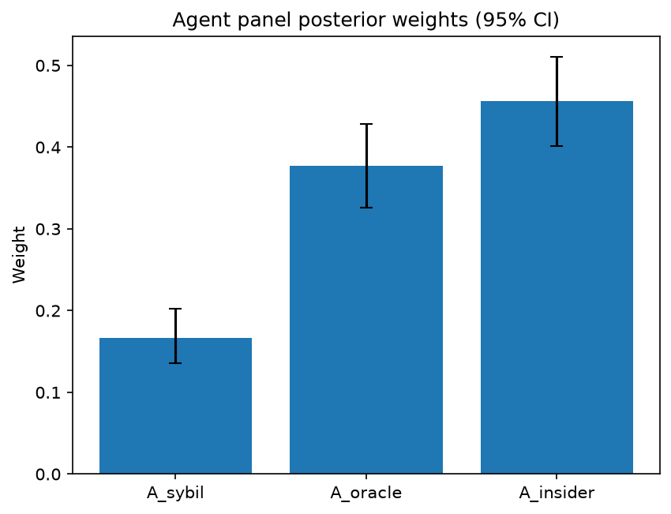

# Survey report: TrustRouter Claude CLI Panel (haiku) -- Level L3d: Attack Resistance sub-parts

Survey ID: `trustrouter-claude-cli-full-panel-claude-haiku-2026-09-01-L3d`

## Agent panel

- Agents contributing a valid response: 36
- Classical BWM consistency: 36/36 within threshold

| Criterion | Mean | 95% CI lower | 95% CI upper |
|---|---|---|---|
| A_sybil | 0.1665 | 0.1354 | 0.2023 |
| A_oracle | 0.3771 | 0.3257 | 0.4283 |
| A_insider | 0.4563 | 0.4009 | 0.5101 |

## Methodology

Each agent independently completed a Best-Worst Method (BWM) comparison: choosing the single most and least important criterion, then rating every criterion's importance relative to those two on a 1-9 scale. Individual responses were solved with the classical BWM linear program (Rezaei, 2015) for a consistency check, and combined across the panel with a hierarchical Bayesian model (Mohammadi and Rezaei, 2020).

36 agent response(s) were accepted into this result.

Every agent's run began with a QA precheck (its stated configuration verified against ground truth) and every accepted answer's self-reported sources were checked against what reference material was actually available to it; see the Per-agent detail section below and this survey's Conversation Log for each agent's specific results. Every response is schema-validated and independently, repeatedly sampled (never a single completion treated as ground truth); see `guardrails.py`. This survey's complete output is covered by a SHA-256 integrity manifest (`integrity_manifest.json`, `SHA256SUMS`), generated once this run finished, so any later alteration to these files is detectable.

### Charts

## Per-agent detail

### bim-coordinator-base-claude (`bim-coordinator-base-claude`)

- Role: BIM Coordinator
- Model: claude_cli/haiku
- DID: `did:key:z6MkjBimqskXZkR9Zx6uMHqsjZopoCEJaQ9tb7XoVSAZiujx`
- QA precheck: passed
- Sources used: shared knowledge: trustrouter_expert_questionnaire_v5_real_survey_instrument.md, general_knowledge

**Answer:** `{"best": "A_insider", "worst": "A_sybil", "best_to_others": {"A_insider": 1, "A_oracle": 5, "A_sybil": 8}, "others_to_worst": {"A_insider": 8, "A_oracle": 5, "A_sybil": 1}}`

**Reasoning:**

As a BIM Coordinator managing multi-stakeholder models across renovation and new-build projects, I rank A_insider as most critical. In construction project federation, authorized parties (project managers, engineers, facility managers, inspectors) with legitimate model access pose the greatest ongoing risk over a project's lifecycle. Insider threats—whether malicious or negligent—are the primary source of data corruption I encounter in practice: unauthorized edits to clash resolution, deletion of quality records, modification of compliance documentation, or federation layer tampering. This is especially acute in long-lived institutional assets like the Hospital Real scenario, where the model serves multiple stakeholders (owners, insurers, authorities) across decades; each stakeholder access point amplifies insider risk. A_oracle (sensor/device tampering) ranks second: it matters for projects with extensive IoT deployment (environmental monitoring, structural sensors), but most construction projects still rely on manual surveying and documented inspections, which are harder to forge at scale and are authenticated through professional liability and site audit. A_sybil resistance ranks lowest because construction project federation operates in a pre-verified, contractually bounded environment. Identities are established through business registration, insurance certification, and contractual relationships before federated access is granted. Preventing multiple fraudulent identities is not a binding constraint where parties are already vetted legal entities with reputational and financial stakes. Sybil attacks are concerns for permissionless blockchain systems; this is a controlled, multi-party private federation.

### bim-coordinator-base-claude (`bim-coordinator-base-claude`)

- Role: BIM Coordinator
- Model: claude_cli/haiku
- DID: `did:key:z6MkjBimqskXZkR9Zx6uMHqsjZopoCEJaQ9tb7XoVSAZiujx`
- QA precheck: passed
- Sources used: shared knowledge: trustrouter_expert_questionnaire_v5_real_survey_instrument.md, shared knowledge: trustrouter_concept_paper_primer.md, general_knowledge

**Answer:** `{"best": "A_insider", "worst": "A_sybil", "best_to_others": {"A_insider": 1, "A_oracle": 4, "A_sybil": 7}, "others_to_worst": {"A_insider": 7, "A_oracle": 4, "A_sybil": 1}}`

**Reasoning:**

In multi-stakeholder construction environments like the Hospital Real scenario, insider resistance is the dominant threat vector. Construction projects involve numerous legitimate actors—contractors, design consultants, inspectors, facility managers—all with contractually-granted access to BIM models. The risk is not primarily that attackers lack credentials, but that authenticated users with deep model knowledge can maliciously alter records, conceal compliance gaps, or misrepresent structural/MEP work. This threat is both high-probability (many actors, years of exposure) and hard to detect in real time without behavioral monitoring. Oracle resistance ranks second: sensor and device tampering (IoT energy monitors, structural accelerometers) is a plausible attack surface in renovations, but it is more tractable through technical redundancy, multi-source validation, and periodic re-measurement by independent professionals. Sybil attacks rank least important because construction procurement already enforces strong identity verification—participants are bound by contracts, insurance, and professional credentials. Creating and maintaining multiple false identities within an established project would be immediately suspicious and costly compared to simply compromising an existing authorized account. The multiplicative structure of TrustRouter (A as one of four root factors) means weak resistance anywhere is critical, but insider resistance is the binding constraint for construction-project trust.

### bim-coordinator-base-claude (`bim-coordinator-base-claude`)

- Role: BIM Coordinator
- Model: claude_cli/haiku
- DID: `did:key:z6MkjBimqskXZkR9Zx6uMHqsjZopoCEJaQ9tb7XoVSAZiujx`
- QA precheck: passed
- Sources used: shared knowledge: trustrouter_expert_questionnaire_v5_real_survey_instrument.md, shared knowledge: trustrouter_concept_paper_primer.md, general_knowledge

**Answer:** `{"best": "A_insider", "worst": "A_sybil", "best_to_others": {"A_insider": 1, "A_oracle": 3, "A_sybil": 6}, "others_to_worst": {"A_insider": 6, "A_oracle": 2, "A_sybil": 1}}`

**Reasoning:**

As a BIM Coordinator responsible for model federation across multi-stakeholder projects, I rank A_insider as the most critical attack resistance criterion for construction-project blockchain records, particularly in the Hospital Real scenario (public institutional asset, multi-decade lifecycle, mixed structural/energy/compliance data serving owners, insurers, and authorities). Reasoning: (1) Insider threat is the highest-consequence risk because BIM teams inherently include legitimate, trusted stakeholders—architects, engineers, contractors, facility managers, auditors—whose access to the model is necessary for renovation execution and lifecycle management. A malicious insider can alter critical data (structural specs, safety certifications, compliance documentation) with plausible deniability, and such tampering may go undetected longer than external attacks because changes appear to come from authorized sources. In a public institutional setting serving decades of lifecycle operations, this poses cumulative governance and insurance risk. (2) A_oracle (sensor/device tampering) is important but secondary. Renovation projects do instrument buildings with sensors for structural monitoring and energy tracking, and blockchain immutability helps protect against post-hoc sensor data forgery. However, construction practice already mitigates this partially through independent physical inspections, redundant measurements, and cross-verification between sensor readings and observable building state—so tampered sensor data is often caught through non-digital validation. (3) A_sybil (fake-identity attacks) is the least critical in this context. Construction teams are professionally vetted, typically small, and access to institutional BIM systems is controlled through federated identity (AD, certificates, role-based) rather than anonymous or self-issued credentials. Creating multiple convincing fake professional identities is harder and less cost-effective than corrupting an existing legitimate team member, which makes sybil attacks a lower-probability vector in this setting. The multiplicative structure of TrustRouter (A is one factor among DVS, F, E) means that low A_sybil does not dominate the overall assessment, but among the three sub-dimensions, insider resistance is the binding constraint.

### bim-coordinator-rag-claude (`bim-coordinator-rag-claude`)

- Role: BIM Coordinator
- Model: claude_cli/haiku
- DID: `did:key:z6MkgKPXYGDwJ56epiD68PaM63oukrBdhu5ziYGo84AZKm9n`
- QA precheck: passed
- Sources used: shared knowledge: bim_and_digital_building_logbooks.md, shared knowledge: trustrouter_expert_questionnaire_v5_real_survey_instrument.md, general_knowledge

**Answer:** `{"best": "A_oracle", "worst": "A_sybil", "best_to_others": {"A_oracle": 1, "A_insider": 3, "A_sybil": 6}, "others_to_worst": {"A_oracle": 6, "A_insider": 3, "A_sybil": 1}}`

**Reasoning:**

For construction project records in a deep renovation context (structural, energy, and compliance documentation serving institutional owners, insurers, and authorities over decades), I rank A_oracle as most critical and A_sybil as least. Oracle resistance (sensor and device tampering) is the foundation of data integrity where it matters most: structural test results, energy performance verification, and compliance inspections. These data types are permanent institutional records; falsified sensor data is difficult to detect retrospectively and could have actual safety and regulatory consequences. A_insider (malicious legitimate access) is serious—an insider can systematically falsify records with domain knowledge of plausible values—but affects the integrity pathway rather than the data source itself. A_sybil (fake-identity attacks) ranks lowest because the BIM federation process already mitigates it substantially: ISO 19650 requires lead appointed parties and task teams to independently validate models before acceptance (shared knowledge: bim_and_digital_building_logbooks.md), and organized construction projects implement credential verification upfront. While Sybil attacks are theoretically possible, the operational controls already embedded in BIM practice make them less likely to succeed than oracle or insider attacks. The 3:1 ratio between A_insider and A_sybil reflects that insiders are fundamentally harder to prevent, while the 6:1 ratio between A_oracle and A_sybil reflects that sensor tampering directly threatens the accuracy of safety-critical data in ways BIM federation controls do not address.

### bim-coordinator-rag-claude (`bim-coordinator-rag-claude`)

- Role: BIM Coordinator
- Model: claude_cli/haiku
- DID: `did:key:z6MkgKPXYGDwJ56epiD68PaM63oukrBdhu5ziYGo84AZKm9n`
- QA precheck: passed
- Sources used: bim_and_digital_building_logbooks.md, shared knowledge: trustrouter_expert_questionnaire_v5_real_survey_instrument.md, general_knowledge

**Answer:** `{"best": "A_insider", "worst": "A_sybil", "best_to_others": {"A_insider": 1, "A_oracle": 4, "A_sybil": 7}, "others_to_worst": {"A_insider": 7, "A_oracle": 3, "A_sybil": 1}}`

**Reasoning:**

As a BIM Coordinator responsible for multi-stakeholder model federation and lifecycle documentation, I rank A_insider as most critical and A_sybil as least critical for construction-project records in blockchain storage. A_sybil (identity spoofing) is the least concerning because existing BIM access-control infrastructure—credentials, role-based permissions, audit trails built into ISO 19650 workflows—already provides strong identity verification. Attack via fake identities is relatively tractable through established mechanisms that BIM teams use daily. A_oracle (sensor/device tampering) is moderately important but secondary. Modern digital building logbooks increasingly integrate IoT sensors for energy, environmental, and structural monitoring (referenced in Kochovski et al., 2026, on BUILDCHAIN DBL), making sensor data integrity a real concern. However, in practice, sensor data typically supplements rather than replaces authoritative design and structural documentation; tampered sensor logs compromise facility management more than the core building record. A_insider (malicious legitimate access) is most critical for a multi-decade institutional asset like Hospital Real. Authorized parties—BIM coordinators, architects, engineers from multiple organizations—have deep access to federated models. An insider can make subtle, hard-to-detect modifications to structural specifications, material properties, or compliance data that persist for decades and affect insurance, liability, and occupant safety. ISO 19650 requires independent validation (referenced in bim_and_digital_building_logbooks.md), but an insider from an early-validation party could still exploit that process. In construction, where data custody spans decades and stakes include life safety, insider threats are fundamentally harder to prevent than identity fraud and more consequential than sensor tampering.

### bim-coordinator-rag-claude (`bim-coordinator-rag-claude`)

- Role: BIM Coordinator
- Model: claude_cli/haiku
- DID: `did:key:z6MkgKPXYGDwJ56epiD68PaM63oukrBdhu5ziYGo84AZKm9n`
- QA precheck: passed
- Sources used: bim_and_digital_building_logbooks.md, shared knowledge: trustrouter_expert_questionnaire_v5_real_survey_instrument.md, shared knowledge: trustrouter_concept_paper_primer.md, general_knowledge

**Answer:** `{"best": "A_insider", "worst": "A_sybil", "best_to_others": {"A_insider": 1, "A_oracle": 2, "A_sybil": 7}, "others_to_worst": {"A_insider": 7, "A_oracle": 3, "A_sybil": 1}}`

**Reasoning:**

From a BIM coordinator's perspective on multi-stakeholder renovation projects, insider threats present the most significant risk to data trust. Construction data breaches almost always involve legitimate stakeholders — project managers, engineers, inspectors, contractors — misusing access to hide defects, falsify progress records, alter compliance documentation, or manipulate as-built models. This is both the most common and most difficult threat to detect, because insiders understand the system and have valid credentials. Blockchain cannot mitigate legitimate-access abuse once credentials are issued. In the Hospital Real scenario (public asset serving authorities and insurers for decades), insider manipulation poses systemic liability across safety, compliance, and performance claims. Oracle resistance (sensor/device tampering) ranks second: while sensor integrity is critical for structural safety and energy validation, real projects employ redundant measurements and multiple independent inspections as cross-checks. More importantly, oracle resistance is a data-integrity problem with partial solutions through cryptographic timestamping and sensor network architecture. Sybil resistance ranks lowest. In federated BIM environments, stakeholder identity is controlled by business process, not distributed ledger consensus. ISO 19650 governance already requires a lead appointed party to verify and federate contributors; unknown parties cannot simply 'create fake identities' and gain federation access the way they could in an open blockchain system. The threat model assumes uncontrolled party entry, which is inconsistent with real BIM federation practice. The multiplier gap between A_insider and A_sybil (7x) reflects that insider risk is pervasive across construction whereas Sybil attacks are not a credible threat in controlled, business-relationship-based project federation. The 2x gap between A_insider and A_oracle reflects that both are real threats, but insider threats are more difficult to prevent and more prevalent in construction practice.

### blockchain-engineer-base-claude (`blockchain-engineer-base-claude`)

- Role: Blockchain / DLT Engineer
- Model: claude_cli/haiku
- DID: `did:key:z6MkjavCfxYpe2BkYMXfrJDvcH43kkcZRgoJAFJLDqtqyLmk`
- QA precheck: passed
- Sources used: shared knowledge: trustrouter_expert_questionnaire_v5_real_survey_instrument.md, general_knowledge

**Answer:** `{"best": "A_insider", "worst": "A_sybil", "best_to_others": {"A_insider": 1, "A_oracle": 4, "A_sybil": 8}, "others_to_worst": {"A_insider": 8, "A_oracle": 2, "A_sybil": 1}}`

**Reasoning:**

In permissioned-ledger construction deployments, attack-resistance priorities differ from public blockchains. A_insider (malicious legitimate access) is the most consequential threat because: (1) identity enrollment and permissioning inherently mitigate sybil attacks—construction projects involve known, vetted organizations, so creating multiple false identities is blocked at the access layer; (2) insider threats cannot be prevented by the ledger's permissioning alone—a trusted contractor, inspector, or engineer with legitimate credentials can record falsified data (incorrect measurements, material certifications, or structural assessments) that appears valid on-chain; (3) detection of insider fraud requires cryptographic audit trails, peer-verification procedures, and segregation of duties rather than technical identity controls. A_oracle (sensor and device tampering) ranks second: physical sensors and measurement devices can be compromised, requiring tamper-evidence mechanisms and cryptographic signatures on sensor feeds. However, in permissioned construction contexts, oracle risks are partially mitigated through known-device enrollment and procedural verification (re-testing by independent parties). A_sybil is least important because the permissioning layer itself solves the core problem—identity is managed through enrollment certificates and access control, not consensus-based reputation. Sybil attacks are primarily a public-blockchain threat; permissioned ledgers eliminate this vector by design. The 8:4:1 ratio reflects that insider threats are roughly twice as hard to mitigate as oracle threats, and both are substantially more consequential than sybil resistance in this deployment context.

### blockchain-engineer-base-claude (`blockchain-engineer-base-claude`)

- Role: Blockchain / DLT Engineer
- Model: claude_cli/haiku
- DID: `did:key:z6MkjavCfxYpe2BkYMXfrJDvcH43kkcZRgoJAFJLDqtqyLmk`
- QA precheck: passed
- Sources used: shared knowledge: trustrouter_expert_questionnaire_v5_real_survey_instrument.md, general_knowledge

**Answer:** `{"best": "A_oracle", "worst": "A_sybil", "best_to_others": {"A_oracle": 1, "A_sybil": 6, "A_insider": 4}, "others_to_worst": {"A_oracle": 6, "A_insider": 2, "A_sybil": 1}}`

**Reasoning:**

In permissioned-ledger deployments for construction data, oracle resistance (sensor and device tampering) is the most critical attack vector. Permissioned systems mitigate sybil attacks at the governance layer through identity vetting, role-based access control, and KYC during onboarding—fake identities cannot be injected into a system with explicit participant approval. However, oracle attacks exploit the inherent weakness in any blockchain system: cryptographic tamper-evidence cannot fix poisoned inputs. Construction data originates heavily from sensors, IoT devices, and on-site measurements. If these sources are compromised or miscalibrated, the on-chain record becomes a ledger of false data, rendering blockchain's audit trail meaningless. This is the primary technical failure mode unique to blockchain adoption. Insider resistance (malicious legitimate access) ranks second—it is a real governance and procedural risk that cannot be solved by cryptography alone—but it remains more tractable than oracle attacks because it requires an adversary to already possess valid credentials, and procedural controls, multi-signature schemes, and audit trails can detect or prevent many insider attacks. Sybil resistance ranks last because permissioned systems have already solved the identity problem upstream; it is a governance achievement, not a technical ledger property that should influence routing decisions. This ranking reflects the practical risk hierarchy facing a blockchain/DLT engineer evaluating whether to commit construction-project data to on-chain storage: the decision hinges on whether input integrity can be assured, not on whether the ledger can track multiple fake identities (it cannot) or detect insider misuse (governance handles that).

### blockchain-engineer-base-claude (`blockchain-engineer-base-claude`)

- Role: Blockchain / DLT Engineer
- Model: claude_cli/haiku
- DID: `did:key:z6MkjavCfxYpe2BkYMXfrJDvcH43kkcZRgoJAFJLDqtqyLmk`
- QA precheck: passed
- Sources used: shared knowledge: trustrouter_expert_questionnaire_v5_real_survey_instrument.md, general_knowledge

**Answer:** `{"best": "A_insider", "worst": "A_sybil", "best_to_others": {"A_insider": 1, "A_oracle": 3, "A_sybil": 7}, "others_to_worst": {"A_insider": 7, "A_oracle": 3, "A_sybil": 1}}`

**Reasoning:**

In a permissioned-ledger deployment storing construction records, the three attack vectors have sharply different threat profiles. A_sybil (fake identities) is the least important because permissioned blockchains inherently solve this at the enrollment and access-control layer—you do not grant network access to unverified entities, so Sybil attacks cannot originate from within the consensus layer. A_oracle (device/sensor tampering) is moderately important; it matters for construction data that includes sensor readings (environmental monitoring, material testing devices, structural health sensors), but not all construction records depend on sensor data. Some records are pure attestations or documentation from trusted professionals, where oracle attacks are irrelevant. A_insider (malicious legitimate access) is most critical. In permissioned systems, the real threat surface is a participant with valid credentials—a contractor, inspector, or site manager—attempting to falsify or tamper with records. This cannot be prevented by the permissioning mechanism itself (which grants them legitimate access) and requires strong cryptographic evidence, audit trails, and technical controls within the blockchain itself. From a production perspective on permissioned ledgers, insider attacks are the most likely and hardest to defend against technically. The multiplicative structure of TrustRouter means any weakness in A directly reduces overall trust; given the ranking, A_insider drives that factor most heavily. The 7:3:1 ratio between insider:oracle:sybil reflects that insider resistance is the technical bottleneck, oracle resistance applies to a subset of record types, and Sybil resistance is largely delegated to identity infrastructure upstream of the blockchain.

### blockchain-engineer-rag-claude (`blockchain-engineer-rag-claude`)

- Role: Blockchain / DLT Engineer
- Model: claude_cli/haiku
- DID: `did:key:z6MkooUJEyuLt3VzrACQLf8YLETe6fkJK66UWcp4jm9g2LzP`
- QA precheck: passed
- Sources used: blockchain_trust_and_attack_resistance.md, shared knowledge: trustrouter_expert_questionnaire_v5_real_survey_instrument.md, general_knowledge

**Answer:** `{"best": "A_oracle", "worst": "A_sybil", "best_to_others": {"A_oracle": 1, "A_insider": 3, "A_sybil": 8}, "others_to_worst": {"A_oracle": 8, "A_insider": 4, "A_sybil": 1}}`

**Reasoning:**

For construction-project records in permissioned-ledger deployments, Oracle resistance is the most critical attack vector, while Sybil resistance is the least. Reasoning follows: (1) The oracle problem is a fundamental architectural challenge: once corrupted real-world data (sensor readings, device measurements, inspection reports) enters the blockchain, it is immutably recorded as corrupted. As Adler et al. (2018) describe, smart contracts can only act on data already on the blockchain, so trusted mechanisms to attest to real-world facts are essential—this is the exact attack surface A_oracle covers. Corrupted data at entry point permanently undermines the integrity of the entire record. (2) Insider resistance is significant: even in permissioned systems with cryptographic signatures and audit trails, a malicious legitimate participant (contractor, inspector, administrator) with access can create false records or execute unauthorized transactions, undermining tamper-evidence guarantees. However, access controls and role-based separation mitigate this partially. (3) Sybil resistance is least critical in permissioned ledgers: Membership is controlled at onboarding through off-chain governance and legal/compliance vetting before participants join. The digital-physical identity mapping problem (Vaziry et al., 2024) remains at the governance level but is not a technical blockchain-layer vulnerability. In a system where you control who joins the network, the ability to spawn fake identities is substantially constrained compared to public blockchains. A_sybil becomes more of an access-control governance problem than a technical attack the ledger itself must defend against. Rating A_oracle 3x more important than A_insider reflects that oracle-layer failures are more fundamental; rating it 8x more important than A_sybil reflects the minimal technical threat Sybil attacks pose in permissioned-ledger settings.

### blockchain-engineer-rag-claude (`blockchain-engineer-rag-claude`)

- Role: Blockchain / DLT Engineer
- Model: claude_cli/haiku
- DID: `did:key:z6MkooUJEyuLt3VzrACQLf8YLETe6fkJK66UWcp4jm9g2LzP`
- QA precheck: passed
- Sources used: blockchain_trust_and_attack_resistance.md, shared knowledge: trustrouter_expert_questionnaire_v5_real_survey_instrument.md, general_knowledge

**Answer:** `{"best": "A_oracle", "worst": "A_insider", "best_to_others": {"A_oracle": 1, "A_sybil": 5, "A_insider": 6}, "others_to_worst": {"A_oracle": 6, "A_sybil": 3, "A_insider": 1}}`

**Reasoning:**

For construction-project records routed to blockchain, oracle resistance is the most decisive technical factor. Construction data authenticity depends critically on trustworthy sensor and device input—structural monitoring (beam deflection, concrete strength), environmental conditions (temperature, humidity), and site measurements feed directly into compliance records. As Adler et al. (2018, Astraea) frames it, the oracle problem is fundamental: smart contracts can only act on on-chain data, so they require a trusted mechanism to attest real-world facts (sensor readings, off-chain events) before that data can be used on-chain. If sensors or their data feeds can be tampered with or spoofed, the entire construction record loses integrity at the source level—no downstream validation recovers this. This attack surface is the least mitigated by existing non-blockchain mechanisms.

A_sybil is substantively less critical for construction. Vaziry et al. (2024) identifies Sybil as the digital-physical identity mapping problem: trusting that an on-chain identity truly represents the real contractor, inspector, or certifying engineer. However, construction already operates within established regulatory frameworks (PE/CEng credentials, bonding, licensing). Sybil resistance at the on-chain layer adds protection, but the attack is partially pre-filtered by the identity-issuance process. Sybil resistance remains important (rated 5x less critical than oracle) but it is not the limiting factor in construction data trust.

A_insider resistance is least important technically. Vaziry et al. also addresses this as trusting the identity issuers and the legitimately credentialed actors who vouch for or submit records. An insider attack—a credentialed engineer or inspector acting maliciously—is the hardest to prevent at the technical layer alone. No perfect cryptographic solution exists: once access is legitimately granted, detecting and preventing abuse requires monitoring, role separation, and behavioral flags. Construction partially delegates insider control to existing contractual, insurance, and professional-liability mechanisms (bonds, E&O insurance, disciplinary boards). While insider resistance matters, it is less of a distinctive blockchain technical problem and more of a governance/monitoring problem that transcends the ledger layer.

### blockchain-engineer-rag-claude (`blockchain-engineer-rag-claude`)

- Role: Blockchain / DLT Engineer
- Model: claude_cli/haiku
- DID: `did:key:z6MkooUJEyuLt3VzrACQLf8YLETe6fkJK66UWcp4jm9g2LzP`
- QA precheck: passed
- Sources used: blockchain_trust_and_attack_resistance.md, general_knowledge

**Answer:** `{"best": "A_insider", "worst": "A_sybil", "best_to_others": {"A_insider": 1, "A_oracle": 4, "A_sybil": 7}, "others_to_worst": {"A_insider": 7, "A_oracle": 4, "A_sybil": 1}}`

**Reasoning:**

For construction data routed on permissioned ledgers, insider resistance (A_insider) is the primary attack surface and most critical dimension. In permissioned systems with pre-enrollment identity verification, Sybil attacks are substantially mitigated at the governance layer—all participants are consortium-vetted before joining, making the 'fake-identity problem' a negligible threat compared to legitimate parties with actual system access. This aligns with Vaziry et al. (2024), which frames both Sybil and Insider threats as instances of the 'who is really behind this identity' question, but in permissioned contexts the insider variant dominates because identities are already pre-established. Insider resistance directly addresses the most realistic and damaging attack vector: a legitimate engineer, inspector, project manager, or contractor with genuine system access falsifying or tampering with construction records (specifications, inspection reports, change orders, measurements). Oracle resistance (A_oracle) ranks second. Construction data relies heavily on external measurements, sensor readings, and inspection records that must be attested before use on-chain. Astraea (Adler et al., 2018) establishes that the oracle problem—trusting external real-world facts—is a fundamental, hard problem in blockchain systems, and construction's dependence on sensor data and off-chain evidence makes this significant. However, oracle resistance is somewhat orthogonal to ledger design itself; it is addressed through external verification mechanisms and data-source governance rather than being intrinsic to the ledger's attack resistance. Sybil resistance is rated least important: pre-enrollment in permissioned ledgers makes the digital-physical identity-mapping problem (Vaziry et al., 2024) far less acute than in open systems. The ratio 7:4:1 (insider:oracle:sybil) reflects the relative threat magnitudes in production permissioned-ledger contexts for construction-project data.

### compliance-officer-base-claude (`compliance-officer-base-claude`)

- Role: Compliance and Regulatory Officer
- Model: claude_cli/haiku
- DID: `did:key:z6MkgGS4Yb7TwydcexnZQyhuB5HMp1ig3wLJaXRe6WiEC8hb`
- QA precheck: passed
- Sources used: shared knowledge: trustrouter_expert_questionnaire_v5_real_survey_instrument.md, general_knowledge

**Answer:** `{"best": "A_insider", "worst": "A_sybil", "best_to_others": {"A_insider": 1, "A_oracle": 4, "A_sybil": 6}, "others_to_worst": {"A_insider": 6, "A_oracle": 2, "A_sybil": 1}}`

**Reasoning:**

As a facility-management compliance officer responsible for regulatory obligations, my assessment prioritizes the threat that is hardest to defend against technically and has the broadest impact on regulatory trust. Insider resistance is the best criterion because malicious legitimate access—by a site engineer, inspector, or contractor with genuine permissions—is the most difficult to prevent through cryptographic or procedural controls alone. Such an insider can falsify inspection reports, hide construction defects, manipulate completion records, or alter safety documentation in ways that directly undermine GDPR compliance and breach building-code obligations. These threats are systemic: no technical defense can fully prevent a trusted party from exercising their legitimate access maliciously. Oracle (sensor and device) tampering is significant but more localized—it affects specific data streams (environmental monitoring, test equipment readings) rather than the entire provenance chain. In construction, most critical data originates from human reports and professional inspections, not sensors, limiting oracle impact relative to insider risk. Sybil resistance is least critical in a permissioned construction-project context where participants are vetted organizations (contractors, engineers, inspectors) operating under known identities. Traditional know-your-customer processes and consortium governance make fake identities unlikely; identity verification at enrollment is far simpler than detecting later malicious insider actions. The ratings reflect this hierarchy: insider is 4× more important than oracle (harder to prevent, broader compliance impact) and 6× more important than sybil (insider threats are structural, sybil threats are mostly prevented by permissioned enrollment). Oracle is roughly 2× more important than sybil because sensor data integrity, while specialized, requires active technical defense, whereas sybil attacks are largely organizational problems.

### compliance-officer-base-claude (`compliance-officer-base-claude`)

- Role: Compliance and Regulatory Officer
- Model: claude_cli/haiku
- DID: `did:key:z6MkgGS4Yb7TwydcexnZQyhuB5HMp1ig3wLJaXRe6WiEC8hb`
- QA precheck: passed
- Sources used: shared knowledge: trustrouter_expert_questionnaire_v5_real_survey_instrument.md

**Answer:** `{"best": "A_insider", "worst": "A_oracle", "best_to_others": {"A_insider": 1, "A_sybil": 3, "A_oracle": 5}, "others_to_worst": {"A_insider": 5, "A_sybil": 3, "A_oracle": 1}}`

**Reasoning:**

From the perspective of a facility-management compliance officer, insider resistance represents the most critical attack vector for construction-project records. Insiders possess legitimate access, institutional trust, and domain expertise, enabling them to execute sophisticated attacks that are difficult to detect—such as falsifying inspection certifications, manipulating maintenance records, or altering safety documentation. Both GDPR's accountability principle and construction-regulatory frameworks (building codes, professional engineering standards) place direct organizational responsibility on preventing insider abuse; technical controls cannot fully mitigate risk from authorized users. Sybil resistance is moderately important but less acute in construction contexts. Identity verification at enrollment occurs through formal business registration and professional licensing (architects, engineers, inspectors), and once verified, the opportunity for one actor to create multiple fake identities is constrained by regulatory frameworks that tie qualifications to licensed individuals. Oracle resistance (sensor and device tampering) ranks as least important for construction-project records. While IoT sensors are deployed increasingly for monitoring, the critical regulatory records—structural engineering reports, permits, compliance certifications, inspection sign-offs—remain primarily document-based with established custody and signature chains. Where sensors are used, they are typically supplementary, exist in controlled physical environments, and do not carry direct regulatory force. The primary compliance burden centers on document authenticity, provenance trust, and authorized signatory accountability, not sensor data integrity.

### compliance-officer-base-claude (`compliance-officer-base-claude`)

- Role: Compliance and Regulatory Officer
- Model: claude_cli/haiku
- DID: `did:key:z6MkgGS4Yb7TwydcexnZQyhuB5HMp1ig3wLJaXRe6WiEC8hb`
- QA precheck: passed
- Sources used: shared knowledge: trustrouter_expert_questionnaire_v5_real_survey_instrument.md, general_knowledge

**Answer:** `{"best": "A_insider", "worst": "A_oracle", "best_to_others": {"A_insider": 1, "A_sybil": 4, "A_oracle": 7}, "others_to_worst": {"A_insider": 7, "A_sybil": 4, "A_oracle": 1}}`

**Reasoning:**

From a facility-management compliance perspective, insider resistance ranks as the most critical attack vector for construction-project blockchain records. Legitimate actors (project managers, facility staff, compliance engineers) with authenticated system access pose the highest threat because: (1) they bypass identity verification controls entirely; (2) they understand the system's audit mechanisms and can cover their tracks; (3) their tampering directly violates GDPR Article 32 (integrity and confidentiality obligations); and (4) in construction, a facility manager falsifying inspection records, compliance sign-offs, or safety certifications creates regulatory liability that is difficult to detect post-facto and undermines the entire audit trail. Sybil resistance ranks second—fake identities attempting to create fraudulent records are significant but somewhat easier to detect through credential verification and are foundational rather than catastrophic if the identity-verification layer functions. Oracle resistance (sensor/device tampering) ranks third because in construction-project records, primary authentication typically rests on human-created professional documentation (engineer reports, licensed inspections, certified compliance statements) with sensor data serving a corroborating role. Tampering with a single sensor is more detectable through multi-sensor redundancy and cross-validation than an insider's deliberate falsification of authorized records. The multiplicative nature of Attack Resistance in the TrustRouter formula means insider compromise has systemic impact—it degrades the entire A factor, not just one attack class.

### compliance-officer-rag-claude (`compliance-officer-rag-claude`)

- Role: Compliance and Regulatory Officer
- Model: claude_cli/haiku
- DID: `did:key:z6MkvsMfbM7uWXaYfBeyMot693DSNk3VXfm2U8UeY54UDj2D`
- QA precheck: passed
- Sources used: gdpr_and_data_governance.md, shared knowledge: trustrouter_expert_questionnaire_v5_real_survey_instrument.md, general_knowledge

**Answer:** `{"best": "A_insider", "worst": "A_sybil", "best_to_others": {"A_insider": 1, "A_oracle": 3, "A_sybil": 5}, "others_to_worst": {"A_insider": 5, "A_oracle": 2, "A_sybil": 1}}`

**Reasoning:**

As a facility-management compliance officer, I ground this ranking in three observations from the role's regulatory jurisdiction and the construction context provided in the reference material.

First, insider threats are the single most consequential attack vector for construction-project records in a compliance context. Insider resistance addresses the malicious legitimate user—a project manager, site engineer, or even a regulatory inspector with genuine access rights who falsifies, conceals, or misrepresents data. In construction, this is a known compliance liability: false inspection sign-offs, concealed safety incidents, or misattributed design changes expose both the project and my organization to GDPR data-integrity violations, regulatory non-compliance, and liability. Insiders are trusted precisely because they hold professional credentials and legitimate authority, making detection harder than external attacks and the compliance breach more severe. This aligns with the reference material's framing (gdpr_and_data_governance.md) that construction blockchain adoption has grown without rigorous governance criteria, and the most actionable gate is whether a given data item should be immutably stored at all—an insider-falsification scenario is the primary threat to that decision.

Second, oracle resistance (device and sensor tampering) ranks second. Construction project records increasingly depend on external sensors (site IoT, measurement devices, material certificates from third parties, inspection reports). If these can be tampered with, the immutable record's integrity collapses. However, oracle attacks are partially mitigated by procurement practices, chain-of-custody procedures, and audit trails that construction already employs—these are not novel vulnerabilities unique to blockchain. Sybil resistance addresses fake identities. In a permissioned construction blockchain (implied by the reference material's discussion of practical architectural limits), participants are already subject to Know-Your-Customer (KYC) and anti-money-laundering (AML) compliance per the on-chain identity framing (gdpr_and_data_governance.md, citing Vaziry et al., 2024). A subcontractor, material supplier, or consulting engineer cannot easily create multiple legitimate-looking identities and join the consortium—they are already verified at registration. Sybil attacks are a more acute threat in public, pseudonymous blockchains; they are substantially less material in a permissioned, identity-verified construction consortium. My ratings reflect this hierarchy: insider is 5× more critical than sybil and 3× more critical than oracle; oracle is 2× more critical than sybil.

I distinguish this from an abstract security ranking: all three resistances matter, but the compliance officer's concern is proportional to likelihood and consequence within a construction project's actual threat model and regulatory obligations. Insider threat is both higher likelihood (trusted users go rogue or are coerced) and higher regulatory consequence (GDPR breach, professional liability, contract non-compliance) than identity forgery in a KYC'd environment.

### compliance-officer-rag-claude (`compliance-officer-rag-claude`)

- Role: Compliance and Regulatory Officer
- Model: claude_cli/haiku
- DID: `did:key:z6MkvsMfbM7uWXaYfBeyMot693DSNk3VXfm2U8UeY54UDj2D`
- QA precheck: passed
- Sources used: gdpr_and_data_governance.md, shared knowledge: trustrouter_expert_questionnaire_v5_real_survey_instrument.md, general_knowledge

**Answer:** `{"best": "A_insider", "worst": "A_sybil", "best_to_others": {"A_insider": 1, "A_oracle": 7, "A_sybil": 8}, "others_to_worst": {"A_insider": 8, "A_oracle": 5, "A_sybil": 1}}`

**Reasoning:**

From a facility-management compliance officer's perspective, insider resistance is the most critical attack vector for construction records destined for blockchain storage. Insiders with legitimate credentials bypass most technical gatekeeping and can directly falsify safety certifications, compliance attestations, and regulatory records—creating non-repudiable audit trails of fraudulent data that later become immutable. GDPR compounds this: an insider can mishandle personal data embedded in construction records (workforce safety records, biometric access logs) under the cover of legitimate access. Oracle resistance (device/sensor tampering) is significant but operationally more tractable—physical devices have fewer attack surface points than the human authorization layer, redundancy and cryptographic verification can mitigate compromise, and sensor anomalies often create observable physical inconsistencies that trigger investigation. Sybil resistance, by contrast, is the most preventable: construction-sector actors already undergo identity verification and credentialing during onboarding (trade licenses, professional certifications, contractor vetting); once legitimate identity is established, creating and operating multiple false personas requires sustained social engineering or document fraud, both rarer than insider exploitation of existing legitimate access. In regulatory terms, sybil attacks exploit the front gate; insider attacks exploit the entire perimeter once inside. I rate A_insider 8× more important than A_sybil because the attack surface and deniability are fundamentally asymmetric. A_insider vs A_oracle is rated 7× because insider threats are harder to detect and prevent through technical means alone, whereas oracle tampering leaves traces in comparative data sources and device logs. A_oracle is rated 5× more important than A_sybil because device integrity failures can silently corrupt data at collection time (before blockchain entry), whereas sybil mitigation relies on well-established identity controls already in use.

### compliance-officer-rag-claude (`compliance-officer-rag-claude`)

- Role: Compliance and Regulatory Officer
- Model: claude_cli/haiku
- DID: `did:key:z6MkvsMfbM7uWXaYfBeyMot693DSNk3VXfm2U8UeY54UDj2D`
- QA precheck: passed
- Sources used: gdpr_and_data_governance.md, shared knowledge: trustrouter_expert_questionnaire_v5_real_survey_instrument.md

**Answer:** `{"best": "A_sybil", "worst": "A_oracle", "best_to_others": {"A_sybil": 1, "A_oracle": 7, "A_insider": 2}, "others_to_worst": {"A_sybil": 7, "A_insider": 4, "A_oracle": 1}}`

**Reasoning:**

As a compliance officer responsible for GDPR and construction-regulatory obligations, my assessment prioritizes threats to the regulatory validity and evidentiary integrity of construction records on blockchain. A_sybil (fake-identity attacks) is the most critical because it undermines the foundational requirement for regulatory compliance: authentic provenance. If false identities can inject records or claim professional authority they do not possess (e.g., a fake structural engineer's certification), those records have no regulatory value and cannot serve as evidence of compliance, regardless of cryptographic protections. This directly connects to the on-chain identity problem flagged in the reference material (gdpr_and_data_governance.md) as a regulatory compliance concern. A_insider (insider threats with legitimate credentials) is moderately important because insiders can abuse their access, but at least the authenticating credentials themselves are genuine, and their actions can be detected through audit trails and signatures. A_oracle (sensor and device tampering) is least important in the context of archival construction project records because these records—certificates, inspection reports, engineer sign-offs—are typically curated human-authored documents rather than raw sensor streams. Sensor data integrity is important for operational monitoring but is a secondary concern for the immutable records being stored on blockchain for long-term compliance and provenance evidence. The reference material emphasizes that construction-sector blockchain adoption lacks rigorous decision criteria for when blockchain storage is legally appropriate; from a regulatory perspective, ensuring authentic identity and authority is the primary gate before any trust scoring occurs.

### data-engineer-base-claude (`data-engineer-base-claude`)

- Role: Data Engineering Specialist
- Model: claude_cli/haiku
- DID: `did:key:z6MkwWLFsHqByat9fpS7uQaUXhG2ERBVxYgB8hVuvtEatajg`
- QA precheck: passed
- Sources used: shared knowledge: trustrouter_expert_questionnaire_v5_real_survey_instrument.md, general_knowledge

**Answer:** `{"best": "A_oracle", "worst": "A_sybil", "best_to_others": {"A_oracle": 1, "A_insider": 2, "A_sybil": 4}, "others_to_worst": {"A_oracle": 4, "A_insider": 2, "A_sybil": 1}}`

**Reasoning:**

Construction-project data is fundamentally empirical, depending on physical sensors and devices (load cells, inclinometers, concrete testers, GPS, progress cameras, structural monitoring) for factual record-keeping. Oracle resistance—the ability to prevent sensor and device tampering—directly protects the integrity of the raw data being routed. Compromised sensor data corrupts the foundation of all downstream decisions and routing choices, regardless of where data is stored or what cryptographic protections wrap it. This is my strongest ranking factor.

Insider resistance ranks second. In construction, many legitimate users have system access (site engineers, project managers, inspectors, facility managers). A malicious insider with real credentials can directly alter data, manipulate routing logic, or corrupt provenance records within systems designed with audit trails. While insider threats are serious, they operate within systems that typically maintain transaction logs and custodial records; the damage is constrained by what can be hidden. Oracle attacks, by contrast, inject false data at the source before it enters any system.

Sybil resistance ranks lowest. While fake-identity attacks matter for governance and access control, construction projects operate within regulated credential ecosystems (PE licenses, CEng, contractor licensing, insurance bonds, organizational hierarchies). Creating and maintaining multiple fraudulent professional identities in construction is substantially harder than in purely digital systems. Even with some Sybil presence, established organizations with verified credentials can provide trustworthy data anchors. Sybil threats primarily affect voting weight and governance, not the core factual integrity of sensor-derived construction records. In the context of routing decisions between on-chain and conventional storage, Sybil attacks are less direct threats to data quality than the other two.

The best-to-insider rating of 2 reflects that both are serious, but oracle attacks are more foundational. The best-to-sybil rating of 4 reflects the larger gap between protecting source data integrity and managing identity spoofing in a licensed industry. The insider-to-sybil rating of 2 reflects that insiders with real access pose more direct threats than multiple fake identities in construction's credential-heavy environment.

### data-engineer-base-claude (`data-engineer-base-claude`)

- Role: Data Engineering Specialist
- Model: claude_cli/haiku
- DID: `did:key:z6MkwWLFsHqByat9fpS7uQaUXhG2ERBVxYgB8hVuvtEatajg`
- QA precheck: passed
- Sources used: general_knowledge

**Answer:** `{"best": "A_insider", "worst": "A_sybil", "best_to_others": {"A_insider": 1, "A_oracle": 2, "A_sybil": 4}, "others_to_worst": {"A_insider": 4, "A_oracle": 2, "A_sybil": 1}}`

**Reasoning:**

From a data engineering specialist's perspective on construction-project blockchain routing decisions, insider resistance is the most critical attack vector. Construction fraud empirically centers on malicious modification of data by personnel with legitimate access—site managers altering schedules, inspectors falsifying safety records, engineers suppressing design defects. Once an insider with legitimate credentials modifies a record, blockchain immutability preserves the corruption permanently; retroactive cryptographic validation cannot undo the damage. Insider threats are harder to detect than falsified credentials because the attacker understands construction workflows and can make targeted, plausible-looking changes. This is fundamentally a prerequisite problem: if insider threats are not controlled at the application layer through access controls, audit trails, and segregation of duties, blockchain provides no added trust value—it merely timestamps and immortalizes compromised data. Oracle resistance (sensor/device tampering) ranks second. Sensor integrity matters acutely for IoT-derived metrics—material testing, environmental monitoring, equipment GPS—but not all construction data originates from sensors. Much relies on professional reports and inspections where credential and access controls are more tractable. Oracle resilience is addressable through sensor certification and threshold signatures but remains important for specific high-risk data types. Sybil resistance ranks lowest for construction routing decisions. Construction already operates mature identity verification systems: professional engineering licenses, contractor bonding, insurance requirements, and certification hierarchies. The blockchain can actually enhance sybil resistance through credential anchoring on-chain. Creating a fake contractor identity carries high reputational and legal costs in construction markets. A fabricated identity attempting to submit data is easier to audit retroactively than an insider's subtly modified records because the false identity leaves obvious gaps in credential history. This assessment draws on general knowledge of construction fraud patterns and on the instrument's framing of routing decisions; it does not rely on specific empirical data in the provided reference material.

### data-engineer-base-claude (`data-engineer-base-claude`)

- Role: Data Engineering Specialist
- Model: claude_cli/haiku
- DID: `did:key:z6MkwWLFsHqByat9fpS7uQaUXhG2ERBVxYgB8hVuvtEatajg`
- QA precheck: passed
- Sources used: shared knowledge: trustrouter_expert_questionnaire_v5_real_survey_instrument.md, general_knowledge

**Answer:** `{"best": "A_oracle", "worst": "A_sybil", "best_to_others": {"A_oracle": 1, "A_insider": 3, "A_sybil": 7}, "others_to_worst": {"A_oracle": 7, "A_insider": 3, "A_sybil": 1}}`

**Reasoning:**

From a data engineering perspective focused on quality pipelines and provenance tracking for construction projects, oracle resistance (sensor and device tampering) is the most critical attack vector. The fundamental principle is that corrupted data at the source—whether from tampered GPS receivers, RFID readers, surveying equipment, or IoT sensors collecting site measurements—propagates corrupted records immutably into blockchain storage. Once malicious data enters the provenance chain from a compromised device, cryptographic audit trails and downstream verification cannot retroactively recover ground truth. This is especially acute in construction, where sensitive measurements (coordinates, tolerances, load-bearing capacities) drive downstream safety and regulatory decisions. In contrast, sybil attacks (fake identities) are the least critical for blockchain-backed construction systems. The survey instrument references 'qualified electronic signatures' and cryptographic identity binding—construction projects already operate within legal and contractual frameworks that anchor real-world entities (licensed engineers, certified contractors) to blockchain identities through professional credentials. Once an identity is registered on-chain with a qualified signature, creating spurious replicas is technically harder and legally more traceable than in permissionless systems. Insider resistance (malicious legitimate access) ranks between these two. Insider threats are serious—a project manager could falsify completed work, a surveyor could skew measurements, a procurement officer could authorize fake invoices—but they are detectable through audit trails and role-based access controls that my provenance-tracking responsibility encompasses. Proper logging of who created what data and when provides accountability and forensic evidence. The 3:1 ratio between oracle and insider reflects that oracle attacks bypass detection (data corruption at source is hard to audit after the fact), while insider actions are inherently logged. The 7:1 ratio between oracle and sybil reflects that sybil attacks are substantially easier to prevent through identity verification than source-data tampering.

### data-engineer-rag-claude (`data-engineer-rag-claude`)

- Role: Data Engineering Specialist
- Model: claude_cli/haiku
- DID: `did:key:z6Mknx9SDBfJkpRBgat4tMwAWaw5EZtoMF8kY6JBeuWvWSen`
- QA precheck: passed
- Sources used: shared knowledge: trustrouter_expert_questionnaire_v5_real_survey_instrument.md, general_knowledge

**Answer:** `{"best": "A_oracle", "worst": "A_sybil", "best_to_others": {"A_oracle": 1, "A_insider": 4, "A_sybil": 7}, "others_to_worst": {"A_oracle": 7, "A_insider": 4, "A_sybil": 1}}`

**Reasoning:**

From a data engineering perspective on construction-project datasets, Oracle resistance (A_oracle — sensor and device tampering) is the most critical of the three attack vectors. Here's why:

**Oracle is Best (most important):** In construction, the initial data capture — measurements, timestamps, sensor readings from the field — is the absolute foundation of all downstream trust. If device or sensor data is compromised at the source (e.g., a pressure sensor on concrete test specimen falsified, or timing of critical events altered), no amount of cryptographic verification or audit logging downstream can recover that loss of integrity. This is a first-mile problem. The reference material on data trust emphasizes that "audit logging and lineage tracking" (shared knowledge: trustrouter_expert_questionnaire_v5_real_survey_instrument.md) are the foundation of Verification Strength, but they document what happened — they cannot undo source data corruption. In construction, where physical tolerances and compliance are often the legal basis for disputes and payment, oracle-level integrity is non-negotiable.

**Insider is moderate (second-best):** Malicious legitimate access (A_insider) is a real threat, but insiders *do* leave traces. With proper provenance tracking (my area of responsibility) and audit-trail mechanisms, insider attacks can be detected and investigated. Access control policies, transaction logging, and temporal auditing can reveal anomalies. This is a detective and deterrent problem more than a fundamental-integrity problem.

**Sybil is Worst (least important):** Sybil resistance (A_sybil — fake-identity attacks) is the least critical for construction contexts. Modern construction projects operate on permissioned systems with established organizational hierarchies. Licensed professionals (structural engineers, architects, project managers) are already vetted by professional bodies and legal frameworks. Payment systems, contractual obligations, and regulatory oversight already enforce identity verification. Sybil attacks are far more relevant to open, permissionless blockchain systems where attackers can create arbitrary identities at low cost; in construction, the social, legal, and commercial friction is already high. Multi-signature schemes and role-based access control (standard practice) further raise the cost of fake identities relative to the other two attack vectors.

**Ratings reasoning:** A_oracle is rated 4x more important than A_insider because source integrity is foundational, whereas insider misuse is detectable. A_oracle is rated 7x more important than A_sybil because source integrity in construction is critical and oracle attacks are far harder to detect after the fact than identity fraud. A_insider is rated 4x more important than A_sybil because legitimate-access misuse at least exploits real roles and leaves audit trails, whereas fake identities are largely preventable through standard identity-verification practices already embedded in construction workflows.

### data-engineer-rag-claude (`data-engineer-rag-claude`)

- Role: Data Engineering Specialist
- Model: claude_cli/haiku
- DID: `did:key:z6Mknx9SDBfJkpRBgat4tMwAWaw5EZtoMF8kY6JBeuWvWSen`
- QA precheck: passed
- Sources used: data_quality_and_polyglot_persistence.md, shared knowledge: trustrouter_expert_questionnaire_v5_real_survey_instrument.md, general_knowledge

**Answer:** `{"best": "A_oracle", "worst": "A_sybil", "best_to_others": {"A_oracle": 1, "A_insider": 3, "A_sybil": 5}, "others_to_worst": {"A_oracle": 5, "A_insider": 3, "A_sybil": 1}}`

**Reasoning:**

As a data engineer responsible for construction-project data quality and pipeline integrity, I rank oracle resistance (sensor/device tampering) as most critical because sensor data is the foundational input to any quality assessment pipeline. Once source data is corrupted at the device level—whether GPS coordinates from equipment, structural sensor readings, or inspection photographs with metadata—no downstream audit logging, access control, or cryptographic verification can retroactively recover ground truth. This aligns with the reference material's emphasis on data provenance and audit logging (data_quality_and_polyglot_persistence.md): pipeline lineage tracking assumes the source measurements themselves are honest. Insider threats (A_insider) rank second: while statistically more common in construction projects (PMs, engineers, inspectors with legitimate database access), insider attacks are more containable through access controls, role-based permissions, and audit trails that a data pipeline can implement and monitor. Sybil attacks rank worst: construction data systems are typically permissioned (projects have enrollment, credentialing, and background checks before granting participant status). Unlike open consensus networks, construction workflows do not generally rely on pseudonymous participation where Sybil identities proliferate. Multiple fake contractors or inspectors are caught at identity-verification time, not downstream in data routing decisions. The multiplicative risk structure of TrustRouter compounds these differences: corrupted sensor data (A_oracle = 1) becomes a constant multiplier on downstream trust, while insider and Sybil risks are more localized to specific transactions or claims.

### data-engineer-rag-claude (`data-engineer-rag-claude`)

- Role: Data Engineering Specialist
- Model: claude_cli/haiku
- DID: `did:key:z6Mknx9SDBfJkpRBgat4tMwAWaw5EZtoMF8kY6JBeuWvWSen`
- QA precheck: passed
- Sources used: data_quality_and_polyglot_persistence.md, shared knowledge: trustrouter_expert_questionnaire_v5_real_survey_instrument.md, general_knowledge

**Answer:** `{"best": "A_oracle", "worst": "A_sybil", "best_to_others": {"A_oracle": 1, "A_insider": 3, "A_sybil": 5}, "others_to_worst": {"A_oracle": 5, "A_insider": 2, "A_sybil": 1}}`

**Reasoning:**

As a data engineer, I rank A_oracle (oracle resistance) as best because construction data quality depends fundamentally on the integrity of input sources. Construction projects rely heavily on sensor and IoT data for progress tracking (GPS, accelerometers, image capture), environmental monitoring (temperature, humidity, conditions), quality measurements, and resource tracking. If these sensors or devices can be tampered with or spoofed, the entire provenance chain is poisoned—downstream data becomes untrustworthy regardless of how well other security controls are implemented. Oracle attacks are also technically difficult to prevent entirely through software alone; they require hardware-level assurance and physical security measures. A_insider (malicious legitimate access) ranks second: trusted parties with valid credentials—engineers, inspectors, project managers, contractors—can falsify critical construction records (structural data, safety compliance, progress reports). This is harder to prevent through cryptographic means alone and requires governance and audit trails, but is still less fundamental than input integrity. I rank A_sybil (sybil resistance) as worst because fake-identity attacks are more preventable in construction contexts through established professional networks, legal frameworks, identity verification at consortium enrollment, and the industry's existing reliance on licensed professionals and verified contractor credentials. While not trivial, sybil attacks represent a less fundamental data-trust threat compared to compromised input sources or insider manipulation. This ranking reflects the observation (from data_quality_and_polyglot_persistence.md) that a data pipeline's audit logging and lineage tracking depends first on trustworthy source data—oracle resistance is foundational.

### project-manager-base-claude (`project-manager-base-claude`)

- Role: Construction Project Manager
- Model: claude_cli/haiku
- DID: `did:key:z6MkmbMHfpwQi6Y7FbdLU12dMCxJZnxzRBXEPi1iKygbQ1AP`
- QA precheck: passed
- Sources used: shared knowledge: trustrouter_expert_questionnaire_v5_real_survey_instrument.md, general_knowledge

**Answer:** `{"best": "A_insider", "worst": "A_sybil", "best_to_others": {"A_insider": 1, "A_oracle": 3, "A_sybil": 7}, "others_to_worst": {"A_insider": 7, "A_oracle": 3, "A_sybil": 1}}`

**Reasoning:**

From a construction project manager's perspective on Hospital Real's multi-stakeholder, multi-decade asset lifecycle, insider resistance is the most critical attack vector. The scenario involves institutional owners, insurers, and authorities with legitimate system access—making malicious abuse of that access the highest-probability, highest-impact threat. Construction fraud historically concentrates on insiders (corrupt contractors, inspectors, or institutional staff) falsifying records for financial gain or liability avoidance. This threat is both more common and harder to prevent through technical controls alone than the other two vectors. Oracle resistance (sensor tampering) ranks second: while IoT device tampering is a real concern during renovation work, sensor deployments are typically temporary, physically secured at the site, and not the primary evidentiary source for critical compliance and structural records. Institutional governance and pre-deployment calibration mitigate much of this risk. Sybil resistance ranks third for this institutional context specifically: Hospital Real's stakeholders—the public institution, licensed contractors, certified inspectors, regulated insurers—arrive with pre-verified, institutional identities managed through contracts, licenses, and insurance bonds. The multi-stakeholder framework of the project inherently reduces the likelihood and impact of fake-identity attacks compared to a less-coordinated or open-participation system. While Sybil attacks are a general blockchain concern, their relevance to this specific scenario is lower than the insider and oracle threats.

### project-manager-base-claude (`project-manager-base-claude`)

- Role: Construction Project Manager
- Model: claude_cli/haiku
- DID: `did:key:z6MkmbMHfpwQi6Y7FbdLU12dMCxJZnxzRBXEPi1iKygbQ1AP`
- QA precheck: passed
- Sources used: shared knowledge: trustrouter_expert_questionnaire_v5_real_survey_instrument.md, general_knowledge

**Answer:** `{"best": "A_oracle", "worst": "A_sybil", "best_to_others": {"A_oracle": 1, "A_sybil": 7, "A_insider": 4}, "others_to_worst": {"A_oracle": 7, "A_insider": 3, "A_sybil": 1}}`

**Reasoning:**

As a construction project manager, I prioritize A_oracle (sensor and device tampering) as the most critical attack vector for blockchain-stored construction records. The foundational integrity of source data—structural measurements, material testing, environmental compliance readings, and physical inspections—is non-negotiable. If measurement devices are compromised, no downstream verification or cryptographic protection can recover that compromised ground truth. In Hospital Real's multi-decade renovation scenario, decades of decisions about structural safety, energy systems, and regulatory compliance rest on the accuracy of the initial sensor data. A single tampered load cell or environmental monitor undermines the entire historical record's trustworthiness. I rate A_insider second because legitimate stakeholders (inspectors, facility managers, site engineers) do have genuine access to construction systems and could maliciously alter records post-collection—a real risk especially over long building lifecycles. However, this is mitigated partially by audit trails and role-based access. A_sybil ranks lowest for construction contexts because the stakeholder ecosystem is heavily constrained by licensing, professional credentials, and contractual relationships. Contractors, engineers, and inspectors are verified through professional bodies and physical presence requirements on-site; creating and maintaining fake identities is both difficult and quickly discovered when physical coordination is required. The licensed, contractual nature of construction work makes large-scale sybil attacks implausible compared to less-regulated domains. The 4:3:1 ratio (oracle:insider:sybil) reflects this professional-ecosystem distinction while acknowledging that insider threats remain material.

### project-manager-base-claude (`project-manager-base-claude`)

- Role: Construction Project Manager
- Model: claude_cli/haiku
- DID: `did:key:z6MkmbMHfpwQi6Y7FbdLU12dMCxJZnxzRBXEPi1iKygbQ1AP`
- QA precheck: passed
- Sources used: shared knowledge: trustrouter_expert_questionnaire_v5_real_survey_instrument.md, general_knowledge

**Answer:** `{"best": "A_oracle", "worst": "A_sybil", "best_to_others": {"A_oracle": 1, "A_insider": 3, "A_sybil": 6}, "others_to_worst": {"A_oracle": 6, "A_insider": 3, "A_sybil": 1}}`

**Reasoning:**

From a construction project manager's perspective, oracle resistance (data source integrity) is the most critical of these three attack resistance criteria for long-lived institutional records. Construction compliance—structural safety, energy performance, regulatory conformity, insurance claims—fundamentally depends on accurate measurement and inspection data. Sensor readings, device certifications, and on-site measurements form the evidentiary foundation that no blockchain security can substitute for. Corrupted oracle data renders the entire chain worthless regardless of cryptographic integrity. Insider resistance (malicious legitimate access) ranks second, as a corrupt inspector or project manager could falsify records to hide defects or non-compliance, creating serious liability. However, insider attacks on records may be more detectable through cross-verification, audit trails, and multi-stakeholder oversight typical in institutional construction projects. Sybil resistance (fake-identity attacks) ranks least critical in construction because the industry operates within formal regulatory and professional licensing frameworks. Construction stakeholders are pre-vetted licensed entities (architects, engineers, contractors, certified inspectors), not anonymous network participants. Wholesale creation of fake identities faces barriers from registration, insurance requirements, and professional liability that are absent in open networks. In a permissioned blockchain context (appropriate for institutional construction data), Sybil attacks are substantially lower-risk than data-source corruption or insider malice. The rating of 3:1 for oracle-to-insider reflects that oracle resistance is foundational but insider threats remain serious. The 6:1 ratio for oracle-to-sybil reflects the substantial difference in threat likelihood and consequence in construction's regulated stakeholder environment.

### project-manager-rag-claude (`project-manager-rag-claude`)

- Role: Construction Project Manager
- Model: claude_cli/haiku
- DID: `did:key:z6MkgcpBWMRETjwEN39T1S93W7uzSnGEo6oioFMta7r3bPMs`
- QA precheck: passed
- Sources used: construction_project_management_and_mcdm.md, general_knowledge

**Answer:** `{"best": "A_insider", "worst": "A_sybil", "best_to_others": {"A_insider": 1, "A_oracle": 3, "A_sybil": 6}, "others_to_worst": {"A_insider": 6, "A_oracle": 2, "A_sybil": 1}}`

**Reasoning:**

From a construction project manager's perspective, insider resistance is the most critical attack vector for on-chain construction records. Construction projects necessarily grant legitimate system access to contractors, inspectors, subcontractors, and project managers—you cannot prevent all legitimate access. The highest dispute-resolution risk (emphasized in Gartoumi 2024) stems from insiders with authority falsifying records: a subcontractor backdating change orders they are authorized to issue, an inspector signing off on work they should have rejected, a PM altering progress documentation. These actors have both technical access and contractual authority, making detection and prevention harder than blocking unauthorized outsiders. Oracle resistance (sensor tampering) ranks second because sensor data is a subset of construction documentation (much is human-generated inspection reports, change orders, meeting minutes), and sensor tampering is relatively detectable through independent physical verification. Sybil resistance ranks lowest because construction stakeholders already possess established legal identities, professional licenses, insurance policies, and contractual relationships with the project owner—creating wholly fake identities is neither technically easy nor common. The real threat in construction is not an outsider inventing a fake contractor, but an authorized contractor abusing legitimate credentials.

### project-manager-rag-claude (`project-manager-rag-claude`)

- Role: Construction Project Manager
- Model: claude_cli/haiku
- DID: `did:key:z6MkgcpBWMRETjwEN39T1S93W7uzSnGEo6oioFMta7r3bPMs`
- QA precheck: passed
- Sources used: construction_project_management_and_mcdm.md, shared knowledge: trustrouter_expert_questionnaire_v5_real_survey_instrument.md, general_knowledge

**Answer:** `{"best": "A_insider", "worst": "A_sybil", "best_to_others": {"A_insider": 1, "A_oracle": 4, "A_sybil": 6}, "others_to_worst": {"A_insider": 6, "A_oracle": 3, "A_sybil": 1}}`

**Reasoning:**

As a Construction Project Manager, I rank insider resistance as the most critical attack vector for blockchain-stored construction records, followed by oracle resistance, with Sybil resistance as least critical for this domain. Reasoning: (1) Insider threats are the dominant real-world risk in construction project data. People with legitimate access—project managers, inspectors, contractors, consultants—have both the capability and recurring incentive to falsify records under schedule pressure, cost overruns, or liability concerns. A project manager might alter inspection sign-offs, change orders, or compliance documentation to hide delays or non-conformance. This is not theoretical; dispute resolution cases (per Gartoumi 2024) frequently hinge on exactly this scenario. (2) Oracle tampering is material but less central to construction's document-heavy workflow. While sensor-based technical data (structural health monitoring, environmental compliance) matters, most construction records are human-generated documents (RFIs, submittals, inspection certifications, contract amendments). Sensor tampering requires sustained physical access and technical sophistication, and its effects are more easily cross-checked against other project evidence. (3) Sybil attacks are the least practical threat in this domain. Construction work requires physical presence on site, and contractors cannot perform actual work under false identities without exposure. The industry already has identity-verification mechanisms in place: licensing boards, insurance carriers, bonding requirements, and subcontractor vetting. Creating and maintaining multiple false identities credible enough to pass these checks and execute actual contract work is substantially harder than leveraging legitimate access for fraud. A rating of 6:1 between insider and Sybil reflects that insider threats are an order of magnitude more plausible in construction; a 4:1 ratio between insider and oracle reflects that oracle resistance matters but is secondary to the document-integrity problem posed by malicious insiders.

### project-manager-rag-claude (`project-manager-rag-claude`)

- Role: Construction Project Manager
- Model: claude_cli/haiku
- DID: `did:key:z6MkgcpBWMRETjwEN39T1S93W7uzSnGEo6oioFMta7r3bPMs`
- QA precheck: passed
- Sources used: construction_project_management_and_mcdm.md, shared knowledge: trustrouter_expert_questionnaire_v5_real_survey_instrument.md, general_knowledge

**Answer:** `{"best": "A_insider", "worst": "A_sybil", "best_to_others": {"A_insider": 1, "A_oracle": 3, "A_sybil": 6}, "others_to_worst": {"A_insider": 6, "A_oracle": 2, "A_sybil": 1}}`

**Reasoning:**

As a construction project manager, my primary concern for blockchain-stored construction data is controlling risk from actors with legitimate access—inspectors, engineers, project coordinators, BIM managers—who can directly falsify records despite holding valid credentials. This is the most damaging threat vector because: (1) In real disputes over construction data (change orders, inspection sign-offs, compliance certification), the problem is rarely that a fake person created a false identity; it is that a real person with genuine authority modified or approved defective work and later denied it or claimed coercion. Gartoumi (2024) identifies dispute resolution as a primary blockchain use case in construction, and those disputes hinge on whether a legitimate stakeholder can later be held accountable for what they signed. (2) The reference scenario—a multi-decade public asset serving institutional owners and insurers—depends on an auditable chain of accountability. An insider (a corrupt inspector signing off on structural defects, a project manager altering handover documentation) breaks that institutional trust directly and catastrophically. (3) In construction, pre-verification through professional licenses, bonding, and insurance already raises the cost and risk of maintaining fake identities; most actors are pre-screened. Sybil resistance is least important because creating and sustaining multiple fake contractor identities while actually performing work on a major renovation is impractical in a regulated, licensed industry. Oracle resistance (tampered sensors/device data) is important for compliance and long-term digital monitoring but intermediate: physical construction creates natural verification mechanisms (you can inspect work physically), and while sensor tampering matters for digital handover, it requires direct physical access and expertise, making it less of a systemic governance risk than insider abuse of legitimate authority. The ratings reflect that insider threats are 6× more critical than sybil attacks and 3× more critical than oracle tampering for a construction PM's trust model.

### structural-engineer-base-claude (`structural-engineer-base-claude`)

- Role: Structural Engineer
- Model: claude_cli/haiku
- DID: `did:key:z6MkwHPjNHbEfDhha3TFbbzwGmk6cFQ7di85Qq6pNXn25w2M`
- QA precheck: passed
- Sources used: shared knowledge: trustrouter_expert_questionnaire_v5_real_survey_instrument.md, general_knowledge

**Answer:** `{"best": "A_oracle", "worst": "A_sybil", "best_to_others": {"A_oracle": 1, "A_insider": 3, "A_sybil": 6}, "others_to_worst": {"A_oracle": 6, "A_insider": 2, "A_sybil": 1}}`

**Reasoning:**

As a structural engineer responsible for capacity dossiers serving insurers and regulators over decades, I rank oracle resistance (sensor and device tampering) as best because structural safety is fundamentally dependent on accurate measurements and test data. If load cells, deflection sensors, material test equipment, or crack-monitoring devices can be tampered with, the entire safety case collapses—load calculations, capacity ratings, and damage assessments all rely on verifiable sensor integrity. This is not a secondary concern; it is foundational to the dossier's credibility. Insider resistance ranks second: licensed professionals with legitimate access to the dossier could deliberately manipulate calculations or hide defects. This risk is significant but partially mitigated by professional liability, regulatory oversight, and certification bodies. Sybil resistance ranks worst: the construction industry's reliance on professional credentials (licenses, seals, registrations) creates inherent barriers to fake-identity attacks. A fraudulent 'engineer' identity would fail credential verification checks during professional review and approval workflows, making wholesale Sybil infiltration less of a practical threat than in systems without credential gatekeeping. The 6:2:1 ratio reflects this: oracle threats are an order of magnitude more damaging to structural data trust than the other two vectors.

### structural-engineer-base-claude (`structural-engineer-base-claude`)

- Role: Structural Engineer
- Model: claude_cli/haiku
- DID: `did:key:z6MkwHPjNHbEfDhha3TFbbzwGmk6cFQ7di85Qq6pNXn25w2M`
- QA precheck: passed
- Sources used: shared knowledge: trustrouter_expert_questionnaire_v5_real_survey_instrument.md, general_knowledge

**Answer:** `{"best": "A_insider", "worst": "A_sybil", "best_to_others": {"A_insider": 1, "A_oracle": 4, "A_sybil": 8}, "others_to_worst": {"A_insider": 8, "A_oracle": 2, "A_sybil": 1}}`

**Reasoning:**

In the context of construction-project records for Hospital Real and multi-decade public assets, insider resistance is the most critical attack vector. Professional data corruption in construction primarily arises from malicious actors with legitimate access—facility managers, succeeding engineers, contractors, or compliance officers modifying structural reports, inspection records, or compliance documentation after the fact. In a decades-long building lifecycle with many authorized personnel transitions, this threat is concrete and well-documented in practice. Oracle resistance (sensor and device tampering) is moderately important for ongoing structural health monitoring systems, but less critical for the historical documentation that forms the primary construction-project record and must serve insurers and authorities. Sybil attacks are least critical because construction data originates from specific, credentialed professionals and organizations—structural engineers, architects, and contractors are licensed individuals whose professional identity is anchored in verifiable credentials and organizational relationships, not pseudonymous claims. Creating multiple fake identities to masquerade as different professionals would be immediately obvious and inconsistent with the professional credential model referenced in the reference material under Provenance Trust. The rating progression (8×, 4×, 1) reflects that insider threats are roughly 8 times more important than Sybil attacks, with oracle resistance at intermediate significance—consistent with professional practice in construction over multi-decade asset lifecycles.

### structural-engineer-base-claude (`structural-engineer-base-claude`)

- Role: Structural Engineer
- Model: claude_cli/haiku
- DID: `did:key:z6MkwHPjNHbEfDhha3TFbbzwGmk6cFQ7di85Qq6pNXn25w2M`
- QA precheck: passed
- Sources used: shared knowledge: trustrouter_expert_questionnaire_v5_real_survey_instrument.md, general_knowledge

**Answer:** `{"best": "A_oracle", "worst": "A_sybil", "best_to_others": {"A_oracle": 1, "A_insider": 2, "A_sybil": 6}, "others_to_worst": {"A_oracle": 6, "A_insider": 3, "A_sybil": 1}}`

**Reasoning:**

As a structural engineer responsible for capacity dossiers that insurers, regulators, and owners rely on for decades, I rank oracle resistance (sensor and device tampering) as best, and sybil resistance (fake identities) as worst. Reasoning: (1) Oracle resistance directly protects the physical measurements—foundation surveys, concrete strength tests, load-bearing assessments—that are fundamental to structural safety. Once a building is constructed, its physical reality is fixed; tampered sensor data cannot be corrected by later verification and could lead directly to unsafe conditions or failed renovations. This is non-negotiable in structural practice. (2) Insider resistance (malicious legitimate access) is serious and ranks second. A licensed engineer with credentials committing deliberate fraud is a genuine threat. However, professional liability, licensing boards (CEng, PE frameworks), and institutional custody structures already create substantial deterrence and accountability. (3) Sybil resistance ranks last for this professional context. Fake-identity attacks are most effectively mitigated by existing institutional mechanisms: professional credentials, institutional records, and the requirement for signed reports and licensed practitioners (noted explicitly in the reference material's Provenance Trust examples). Multiple identities are traceable through professional registration. In a blockchain context for construction data, institutional provenance already validates identity; the unique threat is not additional fake identities but tampering with the measurements themselves. The multiplicative model (DVS × F × (1 + E) × A) means A's factors should reflect genuine vulnerabilities specific to blockchain storage of construction records. Oracle tampering is the most blockchain-specific and least-mitigated threat; sybil attacks are the most effectively addressed by existing professional infrastructure.

### structural-engineer-rag-claude (`structural-engineer-rag-claude`)

- Role: Structural Engineer
- Model: claude_cli/haiku
- DID: `did:key:z6MkkkSr7eLXockuCDowP5tCv9MLkuxWwbxeWDZKDF1MzpSM`
- QA precheck: passed
- Sources used: shared knowledge: trustrouter_expert_questionnaire_v5_real_survey_instrument.md, structural_health_monitoring_and_digital_twins.md, general_knowledge

**Answer:** `{"best": "A_oracle", "worst": "A_sybil", "best_to_others": {"A_oracle": 1, "A_sybil": 6, "A_insider": 3}, "others_to_worst": {"A_oracle": 6, "A_sybil": 1, "A_insider": 2}}`

**Reasoning:**

As a structural engineer responsible for structural-capacity dossiers, I rank these attack-resistance sub-criteria from the perspective of trustworthiness in data that serves institutional owners, insurers, and authorities over decades. Oracle resistance (sensor and device tampering) is most critical because structural safety depends entirely on accurate, unmanipulated data about the asset's actual condition. Per the reference material on trustworthy digital twins (Suhail et al., 2020, 2021), a structural digital twin's value is nullified if underlying sensor data is corrupted—a tampered sensor reading could mask a structural failure precursor, with catastrophic consequences. Blockchain immutability does not fix garbage-in-garbage-out: corrupted sensors input corrupted data immutably. Insider resistance (malicious legitimate access) ranks second because an authorized party can falsify records despite audit trails, undermining the trust model; this is a genuine threat despite professional liability and ethics codes. However, insider attacks are partly mitigated by organizational controls, access segmentation, and professional accountability structures already embedded in construction practice. Sybil resistance (fake-identity attacks) ranks lowest because the construction industry's credentialing infrastructure—professional licenses (PE, CEng), digital signatures, regulatory oversight—already provides substantial Sybil defense. False identities have less impact on structural data integrity than tampering with the sensors or devices generating that data in the first place. For blockchain-routed construction records, the data source's integrity (oracle resistance) is the foundation on which all downstream trust depends.

### structural-engineer-rag-claude (`structural-engineer-rag-claude`)

- Role: Structural Engineer
- Model: claude_cli/haiku
- DID: `did:key:z6MkkkSr7eLXockuCDowP5tCv9MLkuxWwbxeWDZKDF1MzpSM`
- QA precheck: passed
- Sources used: structural_health_monitoring_and_digital_twins.md, shared knowledge: trustrouter_expert_questionnaire_v5_real_survey_instrument.md, general_knowledge

**Answer:** `{"best": "A_oracle", "worst": "A_sybil", "best_to_others": {"A_oracle": 1, "A_insider": 2, "A_sybil": 4}, "others_to_worst": {"A_oracle": 4, "A_insider": 2, "A_sybil": 1}}`

**Reasoning:**

A_oracle (sensor and device tampering) is the most critical attack vector for construction-project records destined for long-term institutional, insurance, and regulatory reliance. The reference material on structural health monitoring and digital twins emphasizes that sensor data integrity is foundational: a corrupted structural measurement could result in missed failure precursors, with immediate safety and liability consequences. For a hospital renovation's structural records entering blockchain custody for decades, the source-level integrity of measurement and test data is paramount—no amount of downstream cryptographic verification can recover data that has been tampered with at its origin point before submission to the system. A_insider (malicious legitimate access by credentialed parties) ranks second. While professional licensing, institutional accountability, and audit trails provide some mitigation, the reality is that many legitimate parties (facility managers, inspectors, engineers) touch these records over decades, creating genuine insider-threat surface. A_sybil (fake-identity attacks) ranks worst. In a professional construction context with institutional involvement and credential verification requirements, creating false structural engineer identities or forged inspection reports is substantially harder than tampering with data already in the stream or abusing legitimate access. Identity proofing mechanisms tailored to construction professionals (chartered engineer credentials, professional licensing databases) reduce sybil feasibility relative to the other two vectors. The multiplicative TrustRouter model means even a single weak attack-resistance dimension weakens the entire composite; oracle resistance being weakest has outsized effect, making it the dominant concern from a structural-engineering perspective.

### structural-engineer-rag-claude (`structural-engineer-rag-claude`)

- Role: Structural Engineer
- Model: claude_cli/haiku
- DID: `did:key:z6MkkkSr7eLXockuCDowP5tCv9MLkuxWwbxeWDZKDF1MzpSM`
- QA precheck: passed
- Sources used: structural_health_monitoring_and_digital_twins.md, shared knowledge: trustrouter_expert_questionnaire_v5_real_survey_instrument.md, general_knowledge

**Answer:** `{"best": "A_oracle", "worst": "A_sybil", "best_to_others": {"A_oracle": 1, "A_insider": 4, "A_sybil": 6}, "others_to_worst": {"A_oracle": 6, "A_insider": 3, "A_sybil": 1}}`

**Reasoning:**

For structural-capacity dossiers serving insurers, regulators, and building owners over decades, Oracle resistance (sensor and device tampering) is the most critical Attack Resistance sub-dimension, while Sybil resistance is least critical. Reasoning: (1) Structural monitoring data has the highest consequence-of-error: a corrupted sensor reading on foundation health, load-bearing capacity, or structural condition could result in undetected degradation and catastrophic failure (referenced material emphasizes that digital twins depend entirely on sensor data trustworthiness representing physical asset state). Oracle tampering is subtle and persistent—sensor drift or deliberate falsification can evade detection through normal inspection for years or decades. (2) Insider resistance ranks second: malicious legitimate access is a credible threat, but audit trails, cryptographic signatures, and verification mechanisms on blockchain records make tampering discoverable on review. (3) Sybil resistance ranks least critical for licensed construction data: structural capacity dossiers are authored by chartered engineers with verifiable professional credentials through recognized engineering bodies. Professional licensing, institutional approvals, and existing attestation mechanisms create strong natural barriers against fake-identity attacks. While Sybil attacks remain theoretically possible (credential forgery, firm impersonation), they are harder to execute and less likely to succeed than oracle tampering in a regulated professional context. The multiplicative structure of TrustRouter's composite (TrustRouter = DVS × F × (1 + E) × A) means Attack Resistance acts as a gate: if sensor data can be tampered with undetectably, no downstream trust factor compensates for that fundamental compromise. Conversely, institutional governance and professional licensing already provide significant Sybil mitigation, so incremental improvements in that domain matter less than absolute assurance against oracle attacks.
