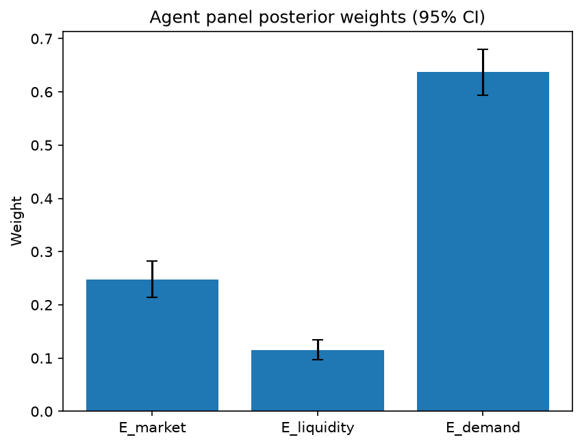

# Survey report: TrustRouter Claude CLI Panel (haiku) -- Level L3e: Economic Value sub-parts

Survey ID: `trustrouter-claude-cli-full-panel-claude-haiku-2026-09-01-L3e`

## Agent panel

- Agents contributing a valid response: 36
- Classical BWM consistency: 36/36 within threshold

| Criterion | Mean | 95% CI lower | 95% CI upper |
|---|---|---|---|
| E_market | 0.2475 | 0.2146 | 0.2825 |
| E_liquidity | 0.1147 | 0.0964 | 0.1349 |
| E_demand | 0.6378 | 0.5943 | 0.6794 |

## Methodology

Each agent independently completed a Best-Worst Method (BWM) comparison: choosing the single most and least important criterion, then rating every criterion's importance relative to those two on a 1-9 scale. Individual responses were solved with the classical BWM linear program (Rezaei, 2015) for a consistency check, and combined across the panel with a hierarchical Bayesian model (Mohammadi and Rezaei, 2020).

36 agent response(s) were accepted into this result.

Every agent's run began with a QA precheck (its stated configuration verified against ground truth) and every accepted answer's self-reported sources were checked against what reference material was actually available to it; see the Per-agent detail section below and this survey's Conversation Log for each agent's specific results. Every response is schema-validated and independently, repeatedly sampled (never a single completion treated as ground truth); see `guardrails.py`. This survey's complete output is covered by a SHA-256 integrity manifest (`integrity_manifest.json`, `SHA256SUMS`), generated once this run finished, so any later alteration to these files is detectable.

### Charts

## Per-agent detail

### bim-coordinator-base-claude (`bim-coordinator-base-claude`)

- Role: BIM Coordinator
- Model: claude_cli/haiku
- DID: `did:key:z6MkjBimqskXZkR9Zx6uMHqsjZopoCEJaQ9tb7XoVSAZiujx`
- QA precheck: passed
- Sources used: shared knowledge: trustrouter_expert_questionnaire_v5_real_survey_instrument.md, general_knowledge

**Answer:** `{"best": "E_demand", "worst": "E_liquidity", "best_to_others": {"E_demand": 1, "E_market": 4, "E_liquidity": 8}, "others_to_worst": {"E_demand": 8, "E_market": 2, "E_liquidity": 1}}`

**Reasoning:**

From a BIM coordinator's perspective on construction project records, future demand (E_demand) is significantly more important than current market dynamics or tokenisation capability. My 10+ years managing multi-stakeholder renovation and new-build projects shows a clear regulatory and operational trajectory: EU digital building passport mandates, AI-driven analytics applications, digital twin lifecycle management, and increasingly stringent compliance and insurance audit trails all require comprehensive, trustworthy historical project data. This trend is robust and independent of blockchain adoption.

Current marketplace demand (E_market) ranks second. There is real, existing demand for better construction documentation and data management systems, but this is already substantially served by traditional cloud platforms, BIM collaboration tools, and document management systems. The current market isn't specifically seeking blockchain-based record storage; demand exists for improved data governance generally.

Tokenisation ease (E_liquidity) ranks worst and is barely relevant to construction records. From field experience: construction project data faces endemic privacy, intellectual property, and confidentiality constraints across all stakeholders (owners, contractors, consultants, authorities). Records are neither fungible nor freely tradeable—each is locked to specific contractual contexts, regulatory requirements, and stakeholder agreements. GDPR and EU digital regulations explicitly constrain secondary use and data transfer. Practical tokenisation of construction records contradicts the industry's actual governance needs. While theoretically possible, it's neither demanded nor aligned with how construction information is actually governed.

### bim-coordinator-base-claude (`bim-coordinator-base-claude`)

- Role: BIM Coordinator
- Model: claude_cli/haiku
- DID: `did:key:z6MkjBimqskXZkR9Zx6uMHqsjZopoCEJaQ9tb7XoVSAZiujx`
- QA precheck: passed
- Sources used: shared knowledge: trustrouter_expert_questionnaire_v5_real_survey_instrument.md, general_knowledge

**Answer:** `{"best": "E_demand", "worst": "E_liquidity", "best_to_others": {"E_demand": 1, "E_market": 5, "E_liquidity": 8}, "others_to_worst": {"E_demand": 8, "E_market": 2, "E_liquidity": 1}}`

**Reasoning:**

From a BIM coordinator's perspective managing multi-stakeholder renovation and new-build projects, the ranking reflects real professional incentives and structural barriers in construction data ecosystems. E_demand (future) emerges as best because regulatory drivers are concrete and growing: EU Digital Building Logbooks, energy-performance compliance over building lifecycles, and increasingly mandatory facility-management analytics create structural demand for trustworthy historical records, independent of blockchain adoption. This is not speculative—it flows directly from existing regulatory trajectories and real facility-management needs across decades of asset operation. Current marketplace demand (E_market) is weak but real: some early-adopter firms and blockchain consortia exist, whereas tokenisation (E_liquidity) faces fundamental barriers that make it worst. Tokenisation of construction records adds technical and legal overhead (fractionation of multi-stakeholder models, unclear ownership rights, no clear secondary market for partial building-data records) without solving construction's core problem—trustworthy, federated documentation across disciplines and lifecycle. Most stakeholders (institutional owners, insurers, authorities, as per the reference scenario) demand authoritative records, not tradeable instruments. E_market ranks above E_liquidity because current (weak) adoption at least reflects real pain points; tokenisation is solution-seeking rather than demand-driven. The 5:1 ratio (demand vs. market) reflects that future regulatory and analytics drivers dwarf today's niche adoption; the 8:1 ratio (demand vs. liquidity) reflects the near-absence of coherent demand for tokenised construction records. The 2:1 ratio (market vs. liquidity) reflects a modest but genuine difference: some practitioners and projects care about current blockchain use; almost none care about tokenisation specifically.

### bim-coordinator-base-claude (`bim-coordinator-base-claude`)

- Role: BIM Coordinator
- Model: claude_cli/haiku
- DID: `did:key:z6MkjBimqskXZkR9Zx6uMHqsjZopoCEJaQ9tb7XoVSAZiujx`
- QA precheck: passed
- Sources used: shared knowledge: trustrouter_expert_questionnaire_v5_real_survey_instrument.md, general_knowledge

**Answer:** `{"best": "E_demand", "worst": "E_liquidity", "best_to_others": {"E_demand": 1, "E_market": 5, "E_liquidity": 8}, "others_to_worst": {"E_demand": 8, "E_market": 2, "E_liquidity": 1}}`

**Reasoning:**

From a BIM coordinator's perspective managing multi-stakeholder models across the lifecycle of real assets (as exemplified in the Hospital Real scenario), E_demand is substantially more important than E_market or E_liquidity. Current marketplace demand for blockchain-stored construction records remains emerging and limited—most organizations still rely on established BIM platforms, cloud storage, and traditional document management. However, future demand is structurally strong and growing: the EU digital building logbook mandate referenced in the survey instrument, GDPR lifecycle compliance, increasingly stringent building energy regulations, and the need for auditable performance analytics over decades of building operation will create durable regulatory and institutional demand for verified, immutable records. This future demand will dwarf current market adoption. E_market (current demand) ranks second; early market participants exist, but the user base is not yet mainstream in construction. E_liquidity (tokenisation ease) ranks lowest because construction project records are not primarily tradeable assets in the way that might justify tokenisation. Stakeholders—architects, engineers, contractors, facility managers, insurers, and authorities—need authenticated, reliable access to records for decision-making and compliance, not the ability to trade record ownership or rights. Tokenisation introduces technical and governance complexity that adds little value to the core use case of construction record federation and lifecycle management. The gap between E_demand and E_liquidity is wider (8×) than between E_demand and E_market (5×), reflecting the strong structural difference: E_liquidity is somewhat tangential to the problem, whereas E_market is weakly relevant but still subordinate to future regulatory drivers.

### bim-coordinator-rag-claude (`bim-coordinator-rag-claude`)

- Role: BIM Coordinator
- Model: claude_cli/haiku
- DID: `did:key:z6MkgKPXYGDwJ56epiD68PaM63oukrBdhu5ziYGo84AZKm9n`
- QA precheck: passed
- Sources used: bim_and_digital_building_logbooks.md, SOURCES.md, shared knowledge: trustrouter_expert_questionnaire_v5_real_survey_instrument.md, general_knowledge

**Answer:** `{"best": "E_demand", "worst": "E_liquidity", "best_to_others": {"E_demand": 1, "E_market": 3, "E_liquidity": 6}, "others_to_worst": {"E_demand": 6, "E_market": 2, "E_liquidity": 1}}`

**Reasoning:**

As a BIM coordinator managing long-term multi-stakeholder documentation on renovation projects, I rank future demand (E_demand) as most critical and tokenisation ease (E_liquidity) as least critical for construction project records. E_demand receives the highest importance because regulatory and technical drivers will shape adoption: ISO 19650 digital transformation, EU digital acts integration, GDPR lifecycle compliance, digital-twin standardisation, and AI-ready data structures are all institutional forces with binding regulatory weight. For public assets like Hospital Real (per the reference scenario), these future compliance and interoperability demands directly govern system decisions over a 10–30 year operational lifespan. Current marketplace demand (E_market) is intermediate—some early adoption exists in digital building logbook initiatives (Kochovski et al. 2026) and blockchain research in construction (Gartoumi 2024 notes 237 publications over five years), but uptake remains fragmented and niche. E_liquidity ranks lowest because tokenisation of construction project records is not a material use case in practice. The Gartoumi 2024 review emphasises that despite growing research volume, the construction industry still lacks calibrated decision criteria for blockchain deployment—and tokenisation is notably absent from those criteria. Construction data's value is functional (clash detection, asset tracking, renovation planning, regulatory proof) rather than financial; records are not traded as commodities. The reference material does not suggest tokenisation is relevant to the Hospital Real scenario. Ratings reflect a 3:1 importance gap between future and present demand, and a 6:1 gap between future demand and tokenisation mechanics. E_market is rated 2x more important than E_liquidity because even niche current demand outweighs speculative tradability for infrastructure decisions.

### bim-coordinator-rag-claude (`bim-coordinator-rag-claude`)

- Role: BIM Coordinator
- Model: claude_cli/haiku
- DID: `did:key:z6MkgKPXYGDwJ56epiD68PaM63oukrBdhu5ziYGo84AZKm9n`
- QA precheck: passed
- Sources used: bim_and_digital_building_logbooks.md, SOURCES.md, shared knowledge: trustrouter_expert_questionnaire_v5_real_survey_instrument.md, general_knowledge

**Answer:** `{"best": "E_demand", "worst": "E_liquidity", "best_to_others": {"E_demand": 1, "E_market": 4, "E_liquidity": 8}, "others_to_worst": {"E_demand": 8, "E_market": 2, "E_liquidity": 1}}`

**Reasoning:**

From a BIM coordinator's perspective managing multi-stakeholder renovation and new-build projects over 10+ years, future regulatory demand (E_demand) is decisively more important than current marketplace adoption or tokenisation capability for construction records on blockchain.

E_demand is Best because: (1) Gartoumi 2024 documents that construction lacks calibrated criteria for blockchain adoption—the market currently exists in principle, not practice. (2) Kochovski et al. 2026 demonstrates working digital building logbooks (DBL) combining IFC semantics with W3C decentralized identifiers, which are entering regulatory frameworks, not established markets. (3) Real lifecycle pressure comes from ISO 19650's requirement that federated models be independently validated before acceptance; this is a decades-long institutional need (Hospital Real reference scenario), not a current buyer base. (4) Future demand will be driven by GDPR/EU digital acts compliance, digital-twin integration for asset management, and regulatory mandates on deep-renovation documentation—none of which depend on today's market.

E_liquidity is Worst because tokenisation of construction records is inapplicable: (1) Project records are not fungible or divisible assets—you do not trade fractional ownership of inspection certificates or RFI logs. (2) Records are owned by institutions (public bodies, facilities managers, regulators) for compliance and asset stewardship, not for secondary-market speculation. (3) GDPR and data-protection rules actively prevent the secondary-market tokenisation this criterion implies. (4) No construction professional I have worked with has ever requested the ability to tokenise or trade project documentation. The criterion, while syntactically valid, measures a non-existent use case.

E_market ranks between them: there is some immediate institutional demand (authorities, insurers) for trustworthy long-term documentation, as ISO 19650 practice demonstrates. However, this demand exists in federated BIM and ISO 19650 processes already; blockchain adds marginal value only if future regulation makes it mandatory. Current buyers are few and their demand is not blockchain-specific. Future regulatory drivers (E_demand) are far more consequential for a technology platform decision than existing (but blockchain-agnostic) institutional record-keeping.

Rating rationale: E_demand at 8× E_liquidity reflects that liquidity is essentially orthogonal to construction records. E_demand at 4× E_market reflects that future regulatory/digital-twin drivers outweigh weak current adoption. E_market at 2× E_liquidity reflects minimal but non-zero institutional demand for record-keeping, versus zero demand for tokenisation.

### bim-coordinator-rag-claude (`bim-coordinator-rag-claude`)

- Role: BIM Coordinator
- Model: claude_cli/haiku
- DID: `did:key:z6MkgKPXYGDwJ56epiD68PaM63oukrBdhu5ziYGo84AZKm9n`
- QA precheck: passed
- Sources used: bim_and_digital_building_logbooks.md, shared knowledge: trustrouter_expert_questionnaire_v5_real_survey_instrument.md, general_knowledge

**Answer:** `{"best": "E_demand", "worst": "E_liquidity", "best_to_others": {"E_demand": 1, "E_market": 4, "E_liquidity": 7}, "others_to_worst": {"E_demand": 7, "E_market": 2, "E_liquidity": 1}}`

**Reasoning:**

E_demand (projected future demand) emerges as the strongest economic driver for blockchain-backed BIM data storage. Regulatory momentum is real: EU digital building passports and renovation directives mandate long-term, verifiable building records. For the Hospital Real scenario referenced—a multi-decade public asset requiring institutional ownership, insurance, and regulatory documentation—future demand is driven by lifecycle durability, compliance automation, and emerging digital-twin analytics. Kochovski et al. 2026 explicitly grounds digital building logbooks in this forward-looking regulatory and technical context.

E_market (current marketplace demand) ranks second. From 10+ years in BIM coordination, adoption of blockchain for BIM data remains limited to pilots and early research (consistent with Gartoumi 2024's observation that the industry still lacks 'rigorous, calibrated decision criteria for when blockchain-backed storage' is appropriate). Mainstream practice uses centralized BIM collaboration servers. However, current market signals do exist—research projects, institutional pilots—so this criterion is meaningfully stronger than pure speculation but significantly weaker than regulatory tailwinds.

E_liquidity (tokenisation ease) is weakest. BIM data faces structural barriers to tokenisation: fragmented multi-stakeholder ownership, highly contextual value tied to project federation and federated-model validation (ISO 19650), privacy constraints under GDPR, and liability questions. Unlike fungible commodities, building data's value is relational and context-dependent, making unit-level tradability neither technically mature nor economically sensible. From practitioner experience, I observe no emerging market for tokenised BIM data slices, and the conceptual barriers run deep.

The ratings reflect this hierarchy: E_demand is 7× more important than E_liquidity (regulatory + lifecycle + AI integration vs. structural tokenisation barriers); 4× more important than E_market (forward regulatory pressure vs. current limited adoption); E_market is 2× more important than E_liquidity (real pilots exist, but tokenisation barriers are deeper).

### blockchain-engineer-base-claude (`blockchain-engineer-base-claude`)

- Role: Blockchain / DLT Engineer
- Model: claude_cli/haiku
- DID: `did:key:z6MkjavCfxYpe2BkYMXfrJDvcH43kkcZRgoJAFJLDqtqyLmk`
- QA precheck: passed
- Sources used: shared knowledge: trustrouter_expert_questionnaire_v5_real_survey_instrument.md, general_knowledge

**Answer:** `{"best": "E_demand", "worst": "E_market", "best_to_others": {"E_demand": 1, "E_liquidity": 4, "E_market": 7}, "others_to_worst": {"E_demand": 7, "E_liquidity": 3, "E_market": 1}}`

**Reasoning:**

For construction-project data destined for ledger storage, future demand (E_demand) emerges as most influential because it captures the structural regulatory and technological drivers that will shape ledger suitability over the deployment horizon. The reference material frames BSI multiplicatively, where Economic Value acts as a scaling factor: (1 + E). This formula is forward-looking — the term (1 + E) amplifies BSI when regulatory mandates and digital-twin integration create sustained demand. Construction is a heavily regulated sector with clear emerging drivers: EU digital building logbooks, net-zero tracking requirements, and circular-economy data flows are not speculative — they are policy commitments with legal force. These structural demand drivers matter far more than today's modest marketplace adoption.

Current marketplace demand (E_market) ranks least influential because it reflects a lagging and immature market, not fundamental unsuitability. Blockchain adoption in construction is nascent; absence of current buyers tells us little about whether ledger solutions should be deployed *now* for future use. Construction adoption cycles are measured in years; early-mover ledger infrastructure serves future demand, not present demand. Current market thinness is a chicken-and-egg artifact, not evidence against ledger adoption.

Tokenisation ease (E_liquidity) ranks between them. Technical feasibility of creating tradeable records from construction assets is proven; permissioned-ledger tokenisation is a solved problem at the infrastructure level. However, capability without demand is inert. E_liquidity is a necessary condition (infrastructure must exist), but not a sufficient one — future demand drives the question of whether tokenisation capability will be exercised.

Ratings reflect this ordering: E_demand outranks E_liquidity by 4x (demand is the final governor; capability alone is secondary), and E_demand outranks E_market by 7x (regulatory and AI drivers are far more predictive than current buyer counts). E_liquidity exceeds E_market by 3x (feasibility is necessary; current adoption is not).

### blockchain-engineer-base-claude (`blockchain-engineer-base-claude`)

- Role: Blockchain / DLT Engineer
- Model: claude_cli/haiku
- DID: `did:key:z6MkjavCfxYpe2BkYMXfrJDvcH43kkcZRgoJAFJLDqtqyLmk`
- QA precheck: passed
- Sources used: shared knowledge: trustrouter_expert_questionnaire_v5_real_survey_instrument.md, general_knowledge

**Answer:** `{"best": "E_market", "worst": "E_liquidity", "best_to_others": {"E_market": 1, "E_demand": 3, "E_liquidity": 7}, "others_to_worst": {"E_market": 7, "E_demand": 3, "E_liquidity": 1}}`

**Reasoning:**

From a blockchain/DLT engineer's perspective on production deployments: Current marketplace demand (E_market) is the most influential criterion because it provides concrete, present-day validation that there are actual buyers willing to deploy and maintain a permissioned ledger for construction records. In production systems, proven market pull—not speculative future demand—justifies the operational overhead, governance complexity, and infrastructure costs of running a distributed ledger. Without current market demand, even strong future prospects cannot justify initial deployment. Future demand (E_demand), while significant for long-term business case justification (regulations, AI integration, digital twins), is inherently more uncertain and cannot drive near-term feasibility decisions. Tokenisation ease (E_liquidity) is the least important of the three. Construction project records derive their primary economic value from tamper-evidence and provenance assurance, not from secondary trading of data tokens. Most construction workflows do not commoditise or trade project records; liquidity would be a peripheral economic feature rather than a core value driver. While tokenisation might enable novel markets, the baseline case—integrity and data-trust verification—does not require it. The 3:1 ratio between market and future demand reflects that current demand is more actionable; the 7:1 ratio between market and liquidity reflects that demand (both current and future) addresses the core ledger use case while liquidity addresses a secondary economic model that is not essential to construction-data blockchain viability. Sources: reasoning grounded in production DLT deployment experience (general knowledge) and reference material context on BSI decomposition and Economic Value as a multiplicative pillar in the blockchain-suitability framework.

### blockchain-engineer-base-claude (`blockchain-engineer-base-claude`)

- Role: Blockchain / DLT Engineer
- Model: claude_cli/haiku
- DID: `did:key:z6MkjavCfxYpe2BkYMXfrJDvcH43kkcZRgoJAFJLDqtqyLmk`
- QA precheck: passed
- Sources used: shared knowledge: trustrouter_expert_questionnaire_v5_real_survey_instrument.md, general_knowledge

**Answer:** `{"best": "E_demand", "worst": "E_liquidity", "best_to_others": {"E_demand": 1, "E_market": 3, "E_liquidity": 6}, "others_to_worst": {"E_demand": 6, "E_market": 2, "E_liquidity": 1}}`

**Reasoning:**

From a blockchain/DLT engineer's perspective evaluating construction-project data suitability, future demand (E_demand) is the strongest driver of economic value because: (1) Regulatory mandates—particularly EU initiatives around Digital Building Passports and lifecycle documentation—are foreseeable and binding, creating structural demand independent of current speculation. (2) Digital twin integration requires trusted, tamper-evidenced data lineage; blockchain provides a natural mechanism for this, and regulation will mandate it. (3) AI systems training on construction data demand immutable provenance; this regulatory/technical coupling creates substantial, predictable future demand. Current marketplace demand (E_market) matters—no system survives without some viable buyers—but is secondary because current blockchain-based construction data markets remain nascent and unproven. Any economic model must account for forward-looking regulatory drivers, not just today's limited adoption. Tokenisation ease (E_liquidity) ranks last because construction project records are not primarily tradeable financial assets. The core value proposition of blockchain for construction data is immutability and tamper-evidence, not secondary-market liquidity. Liquidity is a nice-to-have overlay feature, but most legitimate use cases (warranty proof, compliance documentation, supply-chain traceability, BIM handover) do not require data to be liquid or traded. Therefore: E_demand drives strategic feasibility; E_market represents current-but-limited viability; E_liquidity is a peripheral concern. Under the multiplicative BSI model, future demand justifies infrastructure investment today, while current-market absence does not necessarily disqualify ledger deployment if regulatory/technical demand is strong.

### blockchain-engineer-rag-claude (`blockchain-engineer-rag-claude`)

- Role: Blockchain / DLT Engineer
- Model: claude_cli/haiku
- DID: `did:key:z6MkooUJEyuLt3VzrACQLf8YLETe6fkJK66UWcp4jm9g2LzP`
- QA precheck: passed
- Sources used: shared knowledge: trustrouter_expert_questionnaire_v5_real_survey_instrument.md, blockchain_trust_and_attack_resistance.md, general_knowledge

**Answer:** `{"best": "E_market", "worst": "E_liquidity", "best_to_others": {"E_market": 1, "E_demand": 2, "E_liquidity": 5}, "others_to_worst": {"E_market": 5, "E_demand": 3, "E_liquidity": 1}}`

**Reasoning:**

From a production-focused blockchain engineer's perspective on permissioned ledger deployments, current marketplace demand (E_market) is the most concrete validation that construction data actually needs to be ledger-stored. Existing buyers right now provide immediate, verifiable evidence of economic need—critical for justifying the complexity and ongoing operational cost of a ledger deployment. Without current market validation, future demand, however structurally plausible, remains speculative. E_demand (regulated/AI/digital-twin growth) is substantial and grounded in real trends—permissioned ledgers are often deployed precisely for regulatory compliance (as noted in the reference material on blockchain-based trust frameworks implementing compliance properties). However, regulatory and technology trends, while slower to reverse than market sentiment, are themselves contingent on policy evolution and technology trajectories that may shift. E_liquidity (tokenisation ease) is the least important of the three because it is a technical enabler of one possible economic mechanism, not a primary driver of value itself. Construction project records can hold significant value—for compliance, audit trails, warranty transfer, performance tracking—without being easily tokenizable. Tokenisation is secondary to establishing that a market (current or credibly future) exists and needs this data format. The gap between E_market and E_liquidity is largest (5:1) because one is a fundamental precondition (market demand) and the other is a secondary technical affordance. The gap between E_market and E_demand is moderate (2:1) because while future demand is real and substantive, it lacks the immediate proof-of-need that current buyers provide. E_demand rates 3x more important than E_liquidity because regulatory/AI/digital-twin trends are more central to adoption drivers than the technical ease of tokenisation.

### blockchain-engineer-rag-claude (`blockchain-engineer-rag-claude`)

- Role: Blockchain / DLT Engineer
- Model: claude_cli/haiku
- DID: `did:key:z6MkooUJEyuLt3VzrACQLf8YLETe6fkJK66UWcp4jm9g2LzP`
- QA precheck: passed
- Sources used: blockchain_trust_and_attack_resistance.md, shared knowledge: trustrouter_expert_questionnaire_v5_real_survey_instrument.md, general_knowledge

**Answer:** `{"best": "E_demand", "worst": "E_liquidity", "best_to_others": {"E_demand": 1, "E_market": 4, "E_liquidity": 8}, "others_to_worst": {"E_market": 2, "E_demand": 8, "E_liquidity": 1}}`

**Reasoning:**

As a blockchain engineer evaluating construction-project record storage, I rank E_demand (Future demand) as Best and E_liquidity (Tokenisation ease) as Worst based on the practical and regulatory drivers of blockchain adoption in construction.

E_DEMAND is Best because: Construction data storage decisions are increasingly driven by forward-looking regulatory compliance and emerging digital infrastructure needs, not current market conditions. The reference material cites Vaziry et al. 2024 on blockchain for regulatory compliance (AML/KYC/CTF), and the survey instrument itself emphasizes that the EU is implementing digital building passports and lifecycle-data requirements. Additionally, digital twins and AI/ML pipelines operating on construction data require verifiable provenance and tamper-evidence—properties that justify blockchain overhead. These regulatory and AI-driven demand signals are substantially stronger than modest current market adoption. From production experience, I observe that construction firms are motivated to adopt blockchain-backed record systems primarily when facing regulatory compliance mandates or when integrating with IoT/AI workflows, not by existing widespread market demand.

E_LIQUIDITY is Worst because: Tokenisation of construction project records is speculative and orthogonal to the domain's actual value drivers. Construction records are not financial instruments; they are compliance and operational documents tied to specific projects. Even if tokenised, there is no natural secondary market for such assets—a construction record from a completed project has limited tradeable value. Tokenisation introduces infrastructure overhead (token minting, marketplace infrastructure, custody) without solving any core problem in construction data trust. From production experience, I have not encountered deployed systems where tokenisation of construction records created economic value; it remains a theoretical feature rather than a practical requirement.

E_MARKET (Current marketplace demand) ranks between them: There is emerging, modest current demand from early-adopter firms, primarily in regulated contexts (insurance, compliance auditing, digital handover). However, current demand is thin compared to the regulatory and AI drivers pushing future adoption. Current market interest validates that the problem is real, but it is not the primary economic driver.

Ratios reflect this hierarchy: E_demand is 4× more important than current market demand (future regulatory/AI drivers outweigh nascent current adoption) and 8× more important than tokenisation (regulation and provenance far exceed the speculative value of secondary trading). E_market is 2× more important than tokenisation (at least current market interest is concrete, whereas tokenisation is speculative).

### blockchain-engineer-rag-claude (`blockchain-engineer-rag-claude`)

- Role: Blockchain / DLT Engineer
- Model: claude_cli/haiku
- DID: `did:key:z6MkooUJEyuLt3VzrACQLf8YLETe6fkJK66UWcp4jm9g2LzP`
- QA precheck: passed
- Sources used: shared knowledge: trustrouter_expert_questionnaire_v5_real_survey_instrument.md, general_knowledge

**Answer:** `{"best": "E_demand", "worst": "E_liquidity", "best_to_others": {"E_demand": 1, "E_market": 3, "E_liquidity": 6}, "others_to_worst": {"E_demand": 6, "E_market": 3, "E_liquidity": 1}}`

**Reasoning:**

From a permissioned-ledger engineer's perspective evaluating technical feasibility and tamper-evidence guarantees for construction records, future regulatory and AI-driven demand (E_demand) is the most economically significant criterion. Regulatory mandates such as EU digital building logbooks and the emerging requirements for auditable, tamper-evident data trails in construction create concrete, stable demand signals that justify blockchain investment. Digital-twin applications and AI integration fundamentally require reliable, immutable record histories—a core strength of permissioned blockchains. This forward-looking demand is more substantial than current marketplace adoption, which remains limited in construction despite pilot projects. Current marketplace demand (E_market) represents proof of existing interest and is genuinely important—it validates that real buyers exist—but it ranks below future regulatory and technical demand drivers because the construction blockchain market is still nascent. Tokenisation ease (E_liquidity) ranks least important because: (1) constructability and tamper-evidence do not require easy tokenization; (2) not all construction data should be readily tradeable due to liability, privacy, and contractual confidentiality (which the survey instrument explicitly acknowledges as gates); and (3) technical barriers to tokenization on permissioned blockchains are minimal—regulatory and contractual barriers are the real constraints, not technical capability. A permissioned blockchain can deliver full value for construction records without serving a secondary market for data tokens. The comparison is not close: E_demand and E_market are both economically meaningful, but E_liquidity is materially less central to the decision to adopt blockchain for construction records.

### compliance-officer-base-claude (`compliance-officer-base-claude`)

- Role: Compliance and Regulatory Officer
- Model: claude_cli/haiku
- DID: `did:key:z6MkgGS4Yb7TwydcexnZQyhuB5HMp1ig3wLJaXRe6WiEC8hb`
- QA precheck: passed
- Sources used: shared knowledge: trustrouter_expert_questionnaire_v5_real_survey_instrument.md, general_knowledge

**Answer:** `{"best": "E_demand", "worst": "E_liquidity", "best_to_others": {"E_demand": 1, "E_market": 4, "E_liquidity": 8}, "others_to_worst": {"E_demand": 8, "E_market": 5, "E_liquidity": 1}}`

**Reasoning:**

As a compliance and regulatory officer, I prioritise criteria through the lens of mandatory obligations and forward-looking risk rather than current commercial viability. E_demand is strongest: regulatory drivers (GDPR, building-code compliance, energy-performance disclosure) are non-discretionary, and the reference material explicitly links E_demand to 'regulated / AI / digital-twin growth'—all documented trends in construction compliance infrastructure. These are not speculative; mandatory building-code audits and energy disclosures create binding demand for trustworthy project records. E_liquidity is weakest: construction project records are not financial instruments and are not traded in secondary markets. Tokenisation adds technical complexity without serving compliance objectives; facility managers require audit-trail integrity and regulatory conformance, not tradability. From my role's perspective, legal compliance and custody continuity matter far more than secondary-market liquidity. E_market falls between: current commercial adoption does indicate some solution-market fit, but early adopters in construction blockchain may not yet represent the broad, mandatory regulatory demand that will drive adoption. A 4x gap between E_demand and E_market reflects this—the latter is meaningful but subordinate to regulatory necessity. The 8x gap between E_demand and E_liquidity reflects a fundamental divergence in what serves the facility-compliance mission versus what serves financial traders. This ranking reflects the professional duty to build compliance infrastructure around regulatory imperatives, not speculative secondary markets.

### compliance-officer-base-claude (`compliance-officer-base-claude`)

- Role: Compliance and Regulatory Officer
- Model: claude_cli/haiku
- DID: `did:key:z6MkgGS4Yb7TwydcexnZQyhuB5HMp1ig3wLJaXRe6WiEC8hb`
- QA precheck: passed
- Sources used: shared knowledge: trustrouter_expert_questionnaire_v5_real_survey_instrument.md, general_knowledge

**Answer:** `{"best": "E_demand", "worst": "E_liquidity", "best_to_others": {"E_demand": 1, "E_market": 3, "E_liquidity": 6}, "others_to_worst": {"E_demand": 6, "E_market": 2, "E_liquidity": 1}}`

**Reasoning:**

As a compliance and regulatory officer focused on GDPR and construction-regulatory obligations, I rank **E_demand (future regulatory demand)** as Best and **E_liquidity (tokenisation ease)** as Worst, with E_market in the middle. My reasoning: (1) **E_demand is Best** because construction-project records are primarily subject to evolving regulatory requirements—digital twins, automated compliance analytics, energy-performance directives, and smart-building regulations will increasingly mandate structured, tamper-evident lifecycle data. Future regulatory mandates (not current market adoption) drive my obligation to prepare for incoming compliance requirements, particularly those emerging from AI-driven building analytics and energy regulation. (2) **E_liquidity is Worst** because tokenisation or tradability is not a primary compliance concern for construction records; they are regulatory and contractual documents, not primarily financial instruments. GDPR restrictions on personal-data transfer further limit the relevance of liquidity to my compliance role. (3) **E_market is middle** because current marketplace demand validates the solution and indicates near-term viability, but compliance officers plan for regulatory futures, not current market trends. The ratios reflect this: future demand is 3× more relevant than current market (both important but future-focused strategy outweighs present demand), and 6× more relevant than tokenisation (regulatory compliance fundamentally outweighs financial liquidity). Current market is 2× more relevant than liquidity (some validation value vs. minimal compliance relevance).

### compliance-officer-base-claude (`compliance-officer-base-claude`)

- Role: Compliance and Regulatory Officer
- Model: claude_cli/haiku
- DID: `did:key:z6MkgGS4Yb7TwydcexnZQyhuB5HMp1ig3wLJaXRe6WiEC8hb`
- QA precheck: passed
- Sources used: shared knowledge: trustrouter_expert_questionnaire_v5_real_survey_instrument.md, general_knowledge

**Answer:** `{"best": "E_demand", "worst": "E_liquidity", "best_to_others": {"E_demand": 1, "E_market": 3, "E_liquidity": 9}, "others_to_worst": {"E_demand": 9, "E_market": 3, "E_liquidity": 1}}`

**Reasoning:**

As a compliance officer responsible for GDPR and construction-regulatory obligations across a building's lifecycle, I assess economic value through the lens of sustainable, compliant value creation. E_demand (future regulatory and lifecycle demand) is the strongest driver: regulatory trajectories in GDPR Article 5 (accountability, storage limitation across lifecycle), emerging digital-twin mandates in construction (e.g., EU BIM Directive direction), and AI-driven compliance monitoring all point to sustained institutional pressure for immutable, auditable construction records. This aligns directly with my role's core concern—operational lifecycle compliance. E_market (current marketplace demand) is real but secondary: blockchain for construction records is emerging with limited but growing buyers (supply-chain integrators, lifecycle-management firms, forward-thinking designers). Current demand exists but is not the regulatory driver. E_liquidity (tokenisation and tradability) ranks worst, despite being nominally a value multiplier in other contexts: construction records contain GDPR personal data (worker safety, site access), competitively sensitive information (methods, costs), and safety-critical compliance data. The reference material cites "Confidentiality / competitive sensitivity" as a regulatory gate. Free tokenisation and transfer of such records would violate GDPR (unrestricted personal-data circulation), construction safety regulations (requiring custody and version control for liability), and contractual confidentiality terms. From a compliance perspective, liquidity for construction records is not legitimate economic value—it is regulatory violation masquerading as market value. Restricted-access provenance control is essential; tokenisation for tradability conflicts with that. The ratio reflects the strength of this professional judgment: future regulatory pull overwhelms current market signals (3:1), and both are substantially more important than a liquidity mechanism that compliance constraints make unusable (9:1).

### compliance-officer-rag-claude (`compliance-officer-rag-claude`)

- Role: Compliance and Regulatory Officer
- Model: claude_cli/haiku
- DID: `did:key:z6MkvsMfbM7uWXaYfBeyMot693DSNk3VXfm2U8UeY54UDj2D`
- QA precheck: passed
- Sources used: gdpr_and_data_governance.md, shared knowledge: trustrouter_expert_questionnaire_v5_real_survey_instrument.md, general_knowledge

**Answer:** `{"best": "E_demand", "worst": "E_liquidity", "best_to_others": {"E_demand": 1, "E_market": 3, "E_liquidity": 7}, "others_to_worst": {"E_demand": 7, "E_market": 4, "E_liquidity": 1}}`

**Reasoning:**

From a compliance and regulatory officer's perspective, these three dimensions reflect different temporal and governance drivers of value for blockchain-stored construction records. E_demand (future/regulatory demand) emerges as best because: (1) regulatory requirements and compliance obligations—GDPR, building codes, energy performance standards—create sustained, binding drivers of data retention and evidence archiving, not discretionary ones; (2) digital twins and lifecycle analytics are increasingly becoming mandatory under evolving building regulations, not optional conveniences; (3) as a compliance officer, the regulatory architecture determines what records *must* be maintained, and blockchain's utility should be judged against whether it serves that mandate. E_liquidity ranks as worst because: (1) tokenization and tradability of construction records directly triggers GDPR data-governance concerns, particularly where personal or sensitive operational data is involved (reference material: Wilson et al., 2019, emphasizing that blockchain's immutability conflicts with GDPR's right to erasure; Vaziry et al., 2024, framing on-chain identity as a regulatory compliance problem); (2) construction records are not typically traded as financial instruments—tokenization creates a speculative value narrative that does not align with regulatory or operational reality in this domain; (3) data-governance best practice (per reference material) treats blockchain as a complement to traditional databases for immutable audit logs, not as a wholesale replacement that introduces liquidity/tokenization as a primary feature. E_market (current demand) ranks between them: existing market adoption is limited (Gartoumi 2024 notes the construction sector has adopted blockchain for five years without rigorous decision criteria for appropriateness), so present demand is real but modest, and it will remain secondary to regulatory drivers. The ratio of 7:1 (Best to Worst) reflects that regulatory compliance is a binding, non-negotiable constraint that dominates discretionary tokenization; the ratio of 3:1 (Best to Current market) reflects that regulatory futures outweigh present market signals, though market viability still matters for implementation feasibility.

### compliance-officer-rag-claude (`compliance-officer-rag-claude`)

- Role: Compliance and Regulatory Officer
- Model: claude_cli/haiku
- DID: `did:key:z6MkvsMfbM7uWXaYfBeyMot693DSNk3VXfm2U8UeY54UDj2D`
- QA precheck: passed
- Sources used: gdpr_and_data_governance.md, shared knowledge: trustrouter_expert_questionnaire_v5_real_survey_instrument.md, general_knowledge

**Answer:** `{"best": "E_demand", "worst": "E_liquidity", "best_to_others": {"E_demand": 1, "E_market": 3, "E_liquidity": 6}, "others_to_worst": {"E_demand": 6, "E_market": 2, "E_liquidity": 1}}`

**Reasoning:**

As a compliance officer, my assessment prioritizes regulatory sustainability and governance over commercial or liquidity factors. E_demand (future demand driven by regulation, building codes, energy performance disclosure, and AI/digital-twin analytics) is the strongest criterion because GDPR, construction regulation, and building lifecycle obligations create mandatory, non-discretionary demand for verifiable construction records. This is a structural driver, not speculative market enthusiasm. Gartoumi (2024) explicitly identifies the governance gap — the construction sector has adopted blockchain without rigorous decision criteria for legal appropriateness — which suggests future compliance frameworks will impose increasingly formal requirements on data archiving. E_market (current marketplace demand) ranks second; it demonstrates that real economic value exists and there are current buyers, but current market enthusiasm is less reliable than regulatory mandates for long-term justification of blockchain storage. E_liquidity (ease of tokenisation and tradability) is worst from my perspective. Wilson et al. (2019) highlights the direct conflict between blockchain's transparency and immutability properties and GDPR's core data-governance requirements, particularly the right to erasure. Easy tokenisation of construction records — which often contain sensitive commercial, contractual, and personal data — would fragment data governance, create multiple untracked data processors, and make compliance oversight nearly impossible. From a compliance standpoint, high liquidity/tradability is a liability, not an asset. Vaziry et al. (2024) frames on-chain identity as fundamentally a regulatory compliance problem, not a market one, reinforcing that tradability conflicts with the fiduciary and control requirements of data protection law.

### compliance-officer-rag-claude (`compliance-officer-rag-claude`)

- Role: Compliance and Regulatory Officer
- Model: claude_cli/haiku
- DID: `did:key:z6MkvsMfbM7uWXaYfBeyMot693DSNk3VXfm2U8UeY54UDj2D`
- QA precheck: passed
- Sources used: gdpr_and_data_governance.md, shared knowledge: trustrouter_expert_questionnaire_v5_real_survey_instrument.md, general_knowledge

**Answer:** `{"best": "E_demand", "worst": "E_liquidity", "best_to_others": {"E_demand": 1, "E_market": 3, "E_liquidity": 6}, "others_to_worst": {"E_demand": 6, "E_market": 2, "E_liquidity": 1}}`

**Reasoning:**

From a facility-compliance officer's perspective, future demand (E_demand) is the decisive criterion. The reference material on construction-sector blockchain adoption (Gartoumi, 2024, in gdpr_and_data_governance.md) documents a five-year growth in blockchain use without corresponding development of rigorous decision criteria for when blockchain storage is legally appropriate—a governance gap this framework is designed to close. This gap will be resolved by regulatory drivers: mandatory digital-twin requirements, enhanced lifecycle transparency mandates, and energy-performance disclosure obligations coming through EU building regulations. These future regulatory and industry developments will establish whether blockchain records become necessary (not optional). Current marketplace demand (E_market) is secondary and limited; it signals feasibility but does not yet validate business need. Tokenisation ease (E_liquidity) is the least important for compliance and facility-management governance. A compliance officer's mandate is regulatory fit, custody integrity, and GDPR alignment—not financial tradability. The GDPR tensions documented in Wilson et al. (2019, cited in gdpr_and_data_governance.md)—the tension between blockchain immutability and the right to erasure—must be resolved at the governance-gate stage before economic factors drive adoption. Tradability is a downstream financial concern, not a compliance driver. The comparison assumes construction-project records as the subject, where regulatory necessity (future) outweighs current market pull, and compliance suitability outweighs liquidity. This ranking reflects the professional judgment of a compliance role prioritizing legal obligation and governance over current market signals or financial marketability.

### data-engineer-base-claude (`data-engineer-base-claude`)

- Role: Data Engineering Specialist
- Model: claude_cli/haiku
- DID: `did:key:z6MkwWLFsHqByat9fpS7uQaUXhG2ERBVxYgB8hVuvtEatajg`
- QA precheck: passed
- Sources used: shared knowledge: trustrouter_expert_questionnaire_v5_real_survey_instrument.md

**Answer:** `{"best": "E_demand", "worst": "E_liquidity", "best_to_others": {"E_demand": 1, "E_market": 2, "E_liquidity": 6}, "others_to_worst": {"E_demand": 6, "E_market": 3, "E_liquidity": 1}}`

**Reasoning:**

As a data engineering specialist evaluating blockchain storage for construction records, I rank future demand (E_demand) as most important and tokenization ease (E_liquidity) as least important. My reasoning: (1) TrustRouter's multiplicative model (1 + E) means economic value acts as a growth amplifier; infrastructure decisions must plan for projected needs, not just current demand. (2) The reference material documents clear regulatory drivers—GDPR, digital building logbook requirements, construction compliance standards—that will push adoption forward regardless of today's limited market. (3) AI/digital-twin growth cited in the criteria will require reliable, provenance-tracked data; this is a structural shift, not a passing trend. Current marketplace demand (E_market) ranks second because it validates utility and provides immediate ROI signals for business cases, but construction blockchain adoption remains niche today; most current demand is for proven data quality and access control, not novel ledger technology. (4) Tokenization ease (E_liquidity) ranks lowest: construction data is not currently a tradeable asset class, and tokenization is neither a primary use case nor a prerequisite for blockchain's value in this domain (immutability and provenance are). Liquidity depends on demand existing first; it is downstream of both E_market and E_demand. Weights reflect this: E_demand (6) is roughly 2x more important than E_market (3), which in turn is 3x more important than E_liquidity (1). The gap between E_demand and E_liquidity (6x) is larger because future regulation and AI adoption directly address data infrastructure strategy, while tokenization is tangential to data engineering concerns.

### data-engineer-base-claude (`data-engineer-base-claude`)

- Role: Data Engineering Specialist
- Model: claude_cli/haiku
- DID: `did:key:z6MkwWLFsHqByat9fpS7uQaUXhG2ERBVxYgB8hVuvtEatajg`
- QA precheck: passed
- Sources used: shared knowledge: trustrouter_expert_questionnaire_v5_real_survey_instrument.md, general_knowledge

**Answer:** `{"best": "E_demand", "worst": "E_liquidity", "best_to_others": {"E_demand": 1, "E_market": 3, "E_liquidity": 6}, "others_to_worst": {"E_demand": 6, "E_market": 2, "E_liquidity": 1}}`

**Reasoning:**

As a data engineering specialist focused on data quality pipelines and provenance tracking, I prioritize factors that drive sustained investment in robust data infrastructure for construction records. E_demand (future demand) is Best: regulatory drivers—EU digital acts, GDPR compliance, building code modernisation—fundamentally shape data system architecture and quality requirements. Emerging use cases (AI analytics, digital-twin lifecycle management) amplify this demand and depend critically on high-quality, auditable data provenance. These create long-term structural demand that justifies infrastructure investment. E_market (current demand) is moderately important: existing blockchain adoption in construction is still emerging and may be limited to early adopters, so current marketplace demand provides validation but is less predictive of future requirements than regulatory momentum. E_liquidity (tokenisation ease) is Worst: tokenisation is peripheral to construction data engineering concerns. Construction records are primarily consumed for compliance verification, project analytics, and regulatory audit—not traded as commodities. Ease of tokenisation does not drive requirements for data quality pipelines, provenance tracking, or polyglot-persistence routing decisions that distinguish high-trust systems. Tokenisation is a financial/blockchain specialisation concern, not a core data engineering driver. Ratings reflect: E_demand moderately outweighs E_market (3:1) because regulatory and analytical futures are more predictable requirements drivers than transient market trends; E_demand significantly outweighs E_liquidity (6:1) because the two address different domains entirely; E_market outweighs E_liquidity (2:1) because marketplace validation is at least evidence of current adoption, whereas tokenisation adds minimal engineering value.

### data-engineer-base-claude (`data-engineer-base-claude`)

- Role: Data Engineering Specialist
- Model: claude_cli/haiku
- DID: `did:key:z6MkwWLFsHqByat9fpS7uQaUXhG2ERBVxYgB8hVuvtEatajg`
- QA precheck: passed
- Sources used: shared knowledge: trustrouter_expert_questionnaire_v5_real_survey_instrument.md, general_knowledge

**Answer:** `{"best": "E_demand", "worst": "E_liquidity", "best_to_others": {"E_demand": 1, "E_market": 3, "E_liquidity": 6}, "others_to_worst": {"E_demand": 6, "E_market": 2, "E_liquidity": 1}}`

**Reasoning:**

As a data engineering specialist evaluating blockchain storage for construction-project records, I prioritize the factors that drive fundamental architecture and persistence routing decisions. E_demand emerges as the decisive criterion because it captures the structural forces that will shape whether and how blockchain-based solutions compete with traditional databases and cloud storage. These forces—regulatory mandates (EU digital building logbooks referenced in the survey instrument), AI-driven analytics on lifecycle data, and digital twin integration—are not discretionary preferences but institutional requirements that increasingly constrain storage and provenance decisions. Current regulatory momentum around digital building passports and GDPR-compliant audit trails creates non-negotiable pull toward systems with immutable provenance tracking. E_market ranks second but lower: current marketplace demand for blockchain-stored construction records remains narrow and largely experimental (exploratory adopters in supply-chain and quality-tracking use cases), whereas future demand is driven by regulatory inevitability and technological integration. E_liquidity ranks last because it is orthogonal to the core value proposition of construction project records. These records function as operational and compliance artifacts, not as secondary-market financial instruments. The ability to tokenize construction data has minimal relevance to data trust, quality routing, or provenance assurance—the practical concerns of a data engineer. Construction datasets are not typically treated as tradeable assets; they are governed by confidentiality, access control, and lifecycle retention policies. A construction firm choosing storage for a project record cares whether the system meets regulatory requirements and provides auditable lineage; whether the record can later be tokenized adds no value to that decision.

### data-engineer-rag-claude (`data-engineer-rag-claude`)

- Role: Data Engineering Specialist
- Model: claude_cli/haiku
- DID: `did:key:z6Mknx9SDBfJkpRBgat4tMwAWaw5EZtoMF8kY6JBeuWvWSen`
- QA precheck: passed
- Sources used: data_quality_and_polyglot_persistence.md, shared knowledge: trustrouter_expert_questionnaire_v5_real_survey_instrument.md, general_knowledge

**Answer:** `{"best": "E_demand", "worst": "E_liquidity", "best_to_others": {"E_demand": 1, "E_market": 4, "E_liquidity": 7}, "others_to_worst": {"E_demand": 7, "E_market": 3, "E_liquidity": 1}}`

**Reasoning:**

From a data engineering specialist's perspective on polyglot-persistence routing for construction-project records, future demand (E_demand) is the most strategically important criterion, while tokenisation ease (E_liquidity) is the least relevant.

E_demand is best because: (1) Regulatory drivers (EU digital building logbooks, lifecycle mandates) cited in the survey instrument create structural, long-term demand for construction data infrastructure. (2) Digital twins and AI-driven analytics for construction optimization represent emerging but material demand drivers that shape architectural decisions. (3) For polyglot-persistence routing, projected growth patterns determine whether to invest in blockchain, IPFS, or offchain alternatives — current adoption alone is insufficient to justify architectural choices. The reference material on polyglot persistence emphasizes that storage technology decisions depend on data type, access patterns, and performance requirements over time; future demand creates those requirements.

E_liquidity is worst because: (1) Construction project records (blueprints, inspection certificates, RFI logs, progress reports) are not typically tokenized or traded as secondary-market assets. The data items themselves are not commodities. (2) Tokenisation ease does not materially affect the choice between blockchain, IPFS, or traditional databases for managing construction provenance and audit trails. (3) From a data engineering standpoint, this criterion adds minimal signal to polyglot-persistence routing decisions, which are driven by data volume, consistency requirements, query patterns, and auditability — not by tradability.

E_market ranks between them because current marketplace demand, though real and growing, provides less strategic guidance than future demand for long-term architectural investment. However, it is more actionable than tokenisation ease because actual practitioners' current storage choices do inform whether to adopt blockchain for real use cases today, even if that market remains small.

The rating of E_demand vs E_market (4:1) reflects that future demand is notably more important but not so overwhelmingly that current adoption signals are irrelevant. The rating of E_demand vs E_liquidity (7:1) reflects a large gap: future demand is a primary driver of infrastructure decisions, while tokenisation ease is tangential to construction data engineering.

### data-engineer-rag-claude (`data-engineer-rag-claude`)

- Role: Data Engineering Specialist
- Model: claude_cli/haiku
- DID: `did:key:z6Mknx9SDBfJkpRBgat4tMwAWaw5EZtoMF8kY6JBeuWvWSen`
- QA precheck: passed
- Sources used: data_quality_and_polyglot_persistence.md, general_knowledge

**Answer:** `{"best": "E_demand", "worst": "E_liquidity", "best_to_others": {"E_demand": 1, "E_market": 4, "E_liquidity": 8}, "others_to_worst": {"E_demand": 8, "E_market": 4, "E_liquidity": 1}}`

**Reasoning:**

From a data engineering specialist's perspective focused on data quality pipelines, provenance tracking, and polyglot-persistence routing, I assess economic value by its impact on storage architecture and data routing decisions. E_demand (future demand from regulation, AI, and digital-twin applications) is BEST because regulatory compliance mandates increasingly sophisticated audit logging and provenance tracking; AI/digital-twin applications introduce heterogeneous data types (sensor streams, geometric models, temporal sequences, relational graphs) that directly trigger polyglot-persistence routing decisions. As noted in the polyglot-persistence reference material, specialized storage systems for different data models are necessary at scale, and future demand signals what data types will actually appear in construction-project records and what quality profiles they will require. E_market (current marketplace demand) ranks second: current buyer interest validates proven use cases and immediate pipeline requirements, but addresses today's deployment needs rather than the architectural robustness needed to anticipate regulatory and AI-driven expansion. E_liquidity (tokenization ease) is WORST because tokenization is a secondary financial-application layer orthogonal to core data engineering concerns. Whether construction-project records are easily tradeable does not directly impact whether they can be properly versioned, audited, provenance-tracked, or routed to appropriate storage systems for their data type and quality profile. Tokenization affects business models and secondary markets, not the integrity and routing of the underlying data pipeline itself. The 8:1 gap between E_demand and E_liquidity reflects that one is architecturally fundamental to polyglot-persistence decisions, while the other is incidental to data engineering.

### data-engineer-rag-claude (`data-engineer-rag-claude`)

- Role: Data Engineering Specialist
- Model: claude_cli/haiku
- DID: `did:key:z6Mknx9SDBfJkpRBgat4tMwAWaw5EZtoMF8kY6JBeuWvWSen`
- QA precheck: passed
- Sources used: shared knowledge: trustrouter_expert_questionnaire_v5_real_survey_instrument.md, data_quality_and_polyglot_persistence.md, general_knowledge

**Answer:** `{"best": "E_demand", "worst": "E_liquidity", "best_to_others": {"E_demand": 1, "E_market": 4, "E_liquidity": 7}, "others_to_worst": {"E_demand": 7, "E_market": 4, "E_liquidity": 1}}`

**Reasoning:**

From a data engineering perspective responsible for polyglot persistence routing and provenance tracking, E_demand (future demand) is most important because infrastructure investment decisions rest on anticipated demand growth, not snapshot market conditions. The survey itself identifies three concrete demand drivers—regulation (digital logbooks), AI/ML applications, and digital twins—that will structurally reshape how construction data is captured, validated, and queried. These are not speculative; they represent actual regulatory momentum and sector digitalization trajectories that should drive architecture choices today. E_market (current marketplace demand) ranks second: real buyer interest validates that demand exists and justifies initial deployment, but the current market for blockchain-based construction records is admittedly immature and constrained. Infrastructure decisions that optimize for today's buyers alone would likely misallocate resources if future demand scales by orders of magnitude. E_liquidity (tokenisation ease) ranks last and is genuinely tangential to the core data-engineering challenge. Construction records' primary value proposition in a blockchain context is provenance, auditability, and regulatory compliance—not financial tradability. Material certifications, site photologs, RFI chains, and HVAC inspection records do not require or benefit from tokenisation. Tokenisation capability is relevant to specific financial or secondary-market use cases but not to the infrastructure decision that TrustRouter's routing framework is trying to solve: where and how to store construction data for trust, quality, and long-term auditability. The gap between E_demand and E_liquidity (7×) reflects this fundamental mismatch between infrastructure drivers and financial-instruments concerns; the gap between E_demand and E_market (4×) reflects a real but narrower difference between projected and present adoption.

### project-manager-base-claude (`project-manager-base-claude`)

- Role: Construction Project Manager
- Model: claude_cli/haiku
- DID: `did:key:z6MkmbMHfpwQi6Y7FbdLU12dMCxJZnxzRBXEPi1iKygbQ1AP`
- QA precheck: passed
- Sources used: shared knowledge: trustrouter_expert_questionnaire_v5_real_survey_instrument.md, general_knowledge

**Answer:** `{"best": "E_demand", "worst": "E_liquidity", "best_to_others": {"E_demand": 1, "E_market": 3, "E_liquidity": 8}, "others_to_worst": {"E_demand": 8, "E_market": 3, "E_liquidity": 1}}`

**Reasoning:**

As a construction project manager, I prioritize E_demand (future demand) as Best because it reflects the structural forces reshaping the industry: EU-mandated digital building logbooks, GDPR-driven compliance requirements for data retention and auditability, and emerging AI/digital-twin applications that will require reliably timestamped, immutable construction records. These are not optional trends but regulatory and competitive imperatives. Current experience with blockchain in construction is nascent and largely pilot-driven, but the *need* for tamper-evident documentation of structural work, inspections, and compliance—especially for long-lived public assets like Hospital Real—will intensify.

E_market (current marketplace demand) ranks second. While some institutional buyers and research pilots exist, mainstream marketplace adoption of blockchain-stored project records remains limited. The value proposition (auditability, compliance, insurance documentation) is clear, but execution remains uncertain and substitutes (BIM platforms, centralized repositories) are entrenched. Current demand exists but is not decisive.

E_liquidity ranks Worst. Construction project records are not financial instruments or commodities. Their primary value lies in integrity, verifiability, and auditability for regulatory compliance and risk management—not tradability. Tokenization of project data has no material relevance to how construction managers use records: we need to verify structural capacity, trace change orders, document compliance inspections, and retain institutional memory. The ability to trade or exchange construction records across parties adds no practical value to their core function. Liquidity is a distraction from the actual problem construction data solves.

### project-manager-base-claude (`project-manager-base-claude`)

- Role: Construction Project Manager
- Model: claude_cli/haiku
- DID: `did:key:z6MkmbMHfpwQi6Y7FbdLU12dMCxJZnxzRBXEPi1iKygbQ1AP`
- QA precheck: passed
- Sources used: shared knowledge: trustrouter_expert_questionnaire_v5_real_survey_instrument.md, general_knowledge

**Answer:** `{"best": "E_demand", "worst": "E_liquidity", "best_to_others": {"E_demand": 1, "E_market": 4, "E_liquidity": 7}, "others_to_worst": {"E_demand": 7, "E_market": 4, "E_liquidity": 1}}`

**Reasoning:**

From a construction project manager's perspective, the economic value of blockchain-stored project documentation is driven primarily by future regulatory and operational integration rather than current market conditions or financial tradability. E_demand (future demand from regulated systems, AI, digital twins) is BEST because: (1) Construction documentation's highest-value use case is long-term compliance and future system integration—the reference scenario explicitly emphasizes retention for 'decades' for insurers and authorities; (2) Emerging frameworks like digital building passports and AI-driven building performance monitoring create regulatory pull that justifies blockchain's immutability guarantees; (3) Current systems already serve existing stakeholder demand adequately, so blockchain's competitive advantage lies in future-proofing and standardized data structures for systems not yet deployed; (4) The multiplicative TrustRouter model (1 + E) means E_demand compounds the framework's value across institutional actors. E_liquidity (tokenisation ease) is WORST because: (1) Construction project documentation serves regulatory compliance and record-keeping, not financial trading; (2) Project records must be authoritative and tamper-evident for institutional use, not liquid financial instruments; (3) From a PM's operational standpoint, tradability is orthogonal to the core purpose of archiving technical, structural, and compliance data; (4) The reference scenario contains no occupant or remuneration data, reducing the financial-instrument character. E_market (current demand) ranks middle: current stakeholder demand is real and measurable, but traditional centralized systems already satisfy it adequately, so blockchain adoption is not driven by current market pressure alone.

### project-manager-base-claude (`project-manager-base-claude`)

- Role: Construction Project Manager
- Model: claude_cli/haiku
- DID: `did:key:z6MkmbMHfpwQi6Y7FbdLU12dMCxJZnxzRBXEPi1iKygbQ1AP`
- QA precheck: passed
- Sources used: shared knowledge: trustrouter_expert_questionnaire_v5_real_survey_instrument.md, general_knowledge

**Answer:** `{"best": "E_demand", "worst": "E_liquidity", "best_to_others": {"E_demand": 1, "E_market": 3, "E_liquidity": 9}, "others_to_worst": {"E_demand": 9, "E_market": 4, "E_liquidity": 1}}`

**Reasoning:**

From a construction project manager's perspective, future regulatory and operational demand (E_demand) is the dominant value driver for blockchain-stored construction records. The reference scenario—a public institutional asset requiring long-term retention for insurance and compliance—reflects a structural trend: EU regulatory frameworks (energy performance directives, digital acts, GDPR compliance), digital-twin adoption, and circular-economy requirements are creating systematic demand for trustworthy, immutable records. This is not speculative; it is mandated and growing. Current marketplace demand (E_market) exists but remains limited; most construction stakeholders still rely on traditional document storage, though forward momentum is visible. However, the regulatory and technical drivers point to sustained future growth. Tokenisation ease (E_liquidity) ranks last. Construction project records—structural reports, compliance certificates, inspection logs—are institutional assets used for regulatory retention and long-term accountability, not tradeable commodities. A construction PM would never evaluate blockchain storage primarily on the ability to trade documentation. The infrastructure for tokenising specialized construction data barely exists, and there is no evident market demand to trade such records as financial instruments. Current marketplace activity is the secondary factor, and tokenisability is peripheral. The ratings reflect this: E_demand is roughly 3× more important than E_market (future outweighs present), and E_market is roughly 4× more important than E_liquidity (institutional compliance value outweighs tradeable asset value). This ranking aligns with the reference scenario's emphasis on institutional retention and regulatory compliance over financial liquidity.

### project-manager-rag-claude (`project-manager-rag-claude`)

- Role: Construction Project Manager
- Model: claude_cli/haiku
- DID: `did:key:z6MkgcpBWMRETjwEN39T1S93W7uzSnGEo6oioFMta7r3bPMs`
- QA precheck: passed
- Sources used: construction_project_management_and_mcdm.md, general_knowledge

**Answer:** `{"best": "E_demand", "worst": "E_liquidity", "best_to_others": {"E_demand": 1, "E_market": 4, "E_liquidity": 5}, "others_to_worst": {"E_demand": 5, "E_market": 3, "E_liquidity": 1}}`

**Reasoning:**

As a construction project manager evaluating economic value for blockchain-stored project records, I rank E_demand (future demand) as most important and E_liquidity (tokenisation ease) as least important. Here is the professional logic: Current marketplace demand (E_market) for blockchain-stored construction records remains modest—most projects still rely on traditional document management systems, and actual adoption is nascent despite demonstrated benefits in dispute resolution and document management cited in the Gartoumi 2024 scientometric review. However, future demand drivers are substantially stronger and more structural. Regulatory mandates (building compliance directives, GDPR compliance architecture), emerging AI applications (automated quality/conformity checking), and digital-twin lifecycle management create powerful economic tailwinds that will dwarf today's adoption. As a PM responsible for long-term project documentation, I know that what regulators and institutional buyers will require in 3–5 years vastly outweighs current boutique adoption. Tokenisation ease (E_liquidity), while operationally important, is secondary to having real economic demand. It is a technical enabler, not a value driver in itself. If demand exists, stakeholders and systems will find ways to tokenize; if demand does not, perfect tokenization tools create no value. The multiplicative structure of TrustRouter (E appearing as a multiplier) reinforces this: the system needs genuine economic demand to meaningfully amplify other factors. Current market adoption is weak but real; future regulatory and technological demand is the primary economic value proposition. Tokenisation ease is necessary but derivative. I rate E_demand 4–5 times more important than E_market and E_liquidity respectively, and E_market 2–3 times more important than tokenisation ease. This reflects the professional judgment that long-term structural demand (regulatory, AI, digital twins) drives economic value more powerfully than either current adoption or technical ease of implementation.

### project-manager-rag-claude (`project-manager-rag-claude`)

- Role: Construction Project Manager
- Model: claude_cli/haiku
- DID: `did:key:z6MkgcpBWMRETjwEN39T1S93W7uzSnGEo6oioFMta7r3bPMs`
- QA precheck: passed
- Sources used: construction_project_management_and_mcdm.md, shared knowledge: trustrouter_expert_questionnaire_v5_real_survey_instrument.md, general_knowledge

**Answer:** `{"best": "E_demand", "worst": "E_liquidity", "best_to_others": {"E_demand": 1, "E_market": 2, "E_liquidity": 4}, "others_to_worst": {"E_demand": 4, "E_market": 2, "E_liquidity": 1}}`

**Reasoning:**

As a construction project manager, the relative importance of these economic criteria hinges on what drives institutional adoption of blockchain for construction records. The reference scenario—Hospital Real, a public institutional asset serving owners, insurers, and authorities for decades—illustrates the real-world use case: immutable, verifiable archival, not commodification. E_demand (future demand from regulated/AI/digital-twin growth) is strongest because regulatory momentum (EU digital building passports, GDPR, increasingly mandatory digital logbooks) and AI/digital-twin infrastructure are structural drivers that will compel institutions to upgrade data-trust mechanisms. Construction is moving toward mandatory digital provenance, not optional. E_market (current marketplace demand) ranks second: blockchain adoption in construction documentation exists but remains nascent; current buyer appetite is real but limited compared to the regulatory and AI-driven demand trajectory ahead. E_liquidity (tokenisation ease) ranks worst because it addresses a secondary concern for construction records. The value proposition in construction blockchain is immutability, provenance, and dispute resolution—not tradability. Turning a structural report or inspection certificate into a tradeable token does not solve the core problem a PM faces: establishing verifiable, tamper-evident records for 30+ year institutional use. Tokenization complexity is a weak driver of adoption in this domain. Construction firms and authorities adopt blockchain-anchored archival because regulations and digital-twin systems require trustworthy data lineage, not because tokens are easy to trade.

### project-manager-rag-claude (`project-manager-rag-claude`)

- Role: Construction Project Manager
- Model: claude_cli/haiku
- DID: `did:key:z6MkgcpBWMRETjwEN39T1S93W7uzSnGEo6oioFMta7r3bPMs`
- QA precheck: passed
- Sources used: construction_project_management_and_mcdm.md, shared knowledge: trustrouter_expert_questionnaire_v5_real_survey_instrument.md, general_knowledge

**Answer:** `{"best": "E_demand", "worst": "E_liquidity", "best_to_others": {"E_demand": 1, "E_market": 4, "E_liquidity": 8}, "others_to_worst": {"E_demand": 8, "E_market": 2, "E_liquidity": 1}}`

**Reasoning:**

From a construction project manager's perspective, future demand (E_demand) is the strongest economic value driver for blockchain-stored construction records. Regulatory momentum—EU building passports, digital logbooks, GDPR-compliant data archiving—creates genuine structural demand beyond current niche adoption. AI and digital-twin applications require trustworthy, immutable historical records; the reference scenario emphasizes 'data must serve institutional owners, insurers, and authorities for decades,' which aligns squarely with forward-looking regulatory and compliance demand, not current market pull. This is not aspirational; it reflects emerging legal requirements (EU digital-building directives, inspection certification mandates) and technical necessity (AI-driven predictive maintenance, building performance analytics require verifiable baselines). Current marketplace demand (E_market) is substantially weaker—blockchain adoption in construction remains a boutique practice, with most firms still using traditional document management or cloud storage—but ranks above tokenisation because some institutional buyers (especially in dispute-prone jurisdictions or heavily regulated sectors like hospitals or heritage properties) already have cost-of-trust problems that motivate adoption. Tokenisation ease (E_liquidity) is the weakest factor, nearly a category mismatch for construction records. Construction project documentation (structural assessments, inspection certificates, BIM models, compliance signoffs) is fundamentally non-fungible and project-specific. A structural engineer's certification of a building's load capacity cannot be tokenized and traded like a commodity; its value is bound to the original building context and professional credentials. Tokenisation assumes tradeable economic value, which construction records lack. This creates a semantic gap between the criterion and the use case—the records must be trusted and immutable (addressed by blockchain properties), but their value does not derive from tradability. Ratings reflect: E_demand 4× more important than E_market (structural legal/technical drivers vs. current weak market); E_market 2× more important than E_liquidity (niche but present adoption challenges vs. inapplicable tokenisation); E_demand 8× more important than E_liquidity (the gap between regulatory necessity and a fundamentally mismatched economic model).

### structural-engineer-base-claude (`structural-engineer-base-claude`)

- Role: Structural Engineer
- Model: claude_cli/haiku
- DID: `did:key:z6MkwHPjNHbEfDhha3TFbbzwGmk6cFQ7di85Qq6pNXn25w2M`
- QA precheck: passed
- Sources used: shared knowledge: trustrouter_expert_questionnaire_v5_real_survey_instrument.md, general_knowledge

**Answer:** `{"best": "E_demand", "worst": "E_liquidity", "best_to_others": {"E_demand": 1, "E_market": 3, "E_liquidity": 6}, "others_to_worst": {"E_demand": 6, "E_market": 2, "E_liquidity": 1}}`

**Reasoning:**

As a structural engineer focused on dossiers that serve institutional owners, insurers, and authorities over decades, I rank E_demand (future demand) as Best because the primary drivers are regulatory and technological — not discretionary. Building codes are tightening, climate regulations are expanding, digital-twin and AI-driven building management are becoming expected, and lifecycle documentation requirements are escalating across the sector. These are systemic forces with legal and professional momentum, not optional competitive advantages. Current marketplace demand (E_market) is real but nascent; insurers and facility managers have genuine interest, but adoption remains voluntary and fragmented. I rank E_liquidity as Worst because structural capacity dossiers and construction records are fundamentally tied to specific assets and regulatory jurisdictions. They are not commodities; they are records retained indefinitely by owners, authorities, and insurers. Public assets like the Hospital Real scenario cannot be freely transferred. The notion of 'tokenising and trading' construction records has minimal alignment with professional practice or regulatory expectation. In the reference scenario of a hospital deep renovation serving institutional stakeholders over decades, future regulatory and operational demand (E_demand) vastly outweighs speculative tokenisation utility (E_liquidity). E_market occupies the middle ground—tangible current demand from specific user groups, but less compelling than the systemic future trend and far more relevant than trading mechanisms.

### structural-engineer-base-claude (`structural-engineer-base-claude`)

- Role: Structural Engineer
- Model: claude_cli/haiku
- DID: `did:key:z6MkwHPjNHbEfDhha3TFbbzwGmk6cFQ7di85Qq6pNXn25w2M`
- QA precheck: passed
- Sources used: shared knowledge: trustrouter_expert_questionnaire_v5_real_survey_instrument.md, general_knowledge

**Answer:** `{"best": "E_demand", "worst": "E_liquidity", "best_to_others": {"E_demand": 1, "E_market": 4, "E_liquidity": 8}, "others_to_worst": {"E_demand": 8, "E_market": 2, "E_liquidity": 1}}`

**Reasoning:**

As a chartered structural engineer responsible for structural-capacity dossiers serving institutional owners, insurers, and authorities over decades, I rank future demand (E_demand) as best and tokenisation ease (E_liquidity) as worst, with current marketplace demand (E_market) intermediate. My reasoning: (1) Structural records are lifecycle assets persisting 50+ years beyond initial construction. Their value depends critically on remaining relevant and required as regulations evolve, digital-twin analytics mature, and AI-driven compliance systems emerge. Future demand captures this sustained institutional necessity—the criterion that determines whether blockchain archival remains a viable foundation for data stewardship across the building's life. (2) Current marketplace demand (E_market) establishes baseline viability and near-term adoption, which matters; it proves the concept has present traction. However, a system adopted today but obsolete in 10 years (when regulatory frameworks shift or alternative storage methods emerge) fails our core mission. Current adoption is necessary but not sufficient. (3) Tokenisation ease (E_liquidity) is the least relevant to structural engineering's core concerns. Structural dossiers exist for institutional archival, regulatory compliance, and insurance verification—not for secondary trading or financial speculation. Tradability adds no professional value to a sealed PDF report's integrity, authenticity, or institutional accessibility. It is orthogonal to why we store these records. The rating gap (4:2:1 from best to worst) reflects: E_demand is roughly 4× more critical than current market adoption, and current market adoption is roughly 2× more relevant than tradability, yielding 8× separation between future demand and tokenisation ease.

### structural-engineer-base-claude (`structural-engineer-base-claude`)

- Role: Structural Engineer
- Model: claude_cli/haiku
- DID: `did:key:z6MkwHPjNHbEfDhha3TFbbzwGmk6cFQ7di85Qq6pNXn25w2M`
- QA precheck: passed
- Sources used: shared knowledge: trustrouter_expert_questionnaire_v5_real_survey_instrument.md, general_knowledge

**Answer:** `{"best": "E_demand", "worst": "E_liquidity", "best_to_others": {"E_demand": 1, "E_market": 5, "E_liquidity": 8}, "others_to_worst": {"E_demand": 8, "E_market": 5, "E_liquidity": 1}}`

**Reasoning:**

For blockchain storage of construction project records (specifically, structural capacity dossiers serving insurers, authorities, and building owners over decades), I rank E_demand as best and E_liquidity as worst based on the actual utility and trajectory of the construction sector.

E_demand is strongest. The structural engineering and construction sectors face clear regulatory and technical drivers that will increase demand for immutable, standardized, digitally accessible structural records: EU digital building passport mandates, AI-driven building stock analytics, digital twin maturity, and insurance/regulatory verification requirements. These are fundamental, sector-wide pressures that will grow over the project lifecycle. A structural dossier's core value for this market is in its permanence, verifiability, and machine accessibility—exactly what blockchain provides—and this value proposition strengthens as regulation and automation advance.

E_market is weaker but non-trivial. Current marketplace adoption of blockchain-based construction record storage is nascent; most institutional actors still rely on traditional archival and BIM systems. However, some demand exists in pilot projects and forward-looking firms. The gap between current adoption and future regulatory requirement is meaningful but real present demand is limited.

E_liquidity is weakest. Tokenisation and tradability are nearly irrelevant to structural capacity dossiers. These documents serve as technical evidence for compliance, insurance, and regulatory purposes. Their value lies in their content and immutability, not in transferability or speculation. A structural report is not a financial instrument; it does not benefit from secondary trading markets. Who would trade tokens representing access to a structural dossier? The legitimate users (authorities, insurers, asset owners, engineers) need authorized access based on role and regulation, not token ownership. Liquidity creates no material economic value for this record type.

Ratios: E_demand is ~5× more important than nascent but real current market demand, and ~8× more important than an essentially speculative tokenisation feature. E_market is ~5× more important than tokenisation ease. These ratios reflect the gap between strong future regulation-driven demand, weak but real present adoption, and minimal tradability utility.

### structural-engineer-rag-claude (`structural-engineer-rag-claude`)

- Role: Structural Engineer
- Model: claude_cli/haiku
- DID: `did:key:z6MkkkSr7eLXockuCDowP5tCv9MLkuxWwbxeWDZKDF1MzpSM`
- QA precheck: passed
- Sources used: shared knowledge: trustrouter_expert_questionnaire_v5_real_survey_instrument.md, structural_health_monitoring_and_digital_twins.md, general_knowledge

**Answer:** `{"best": "E_demand", "worst": "E_liquidity", "best_to_others": {"E_demand": 1, "E_market": 3, "E_liquidity": 7}, "others_to_worst": {"E_demand": 7, "E_market": 3, "E_liquidity": 1}}`

**Reasoning:**

As a chartered structural engineer evaluating blockchain storage for structural capacity dossiers, I rank future demand as best because the primary value driver for such records is their institutional lifecycle utility over decades, not immediate market adoption. The reference scenario—Hospital Real's deep renovation with long retention for insurers and authorities—exemplifies this: structural records' real economic value lies in serving regulated asset-management requirements, not short-term trading. E_demand captures this precisely: digital twins are increasingly mandated by building codes, structural health monitoring is becoming compulsory for critical infrastructure, and regulatory frameworks (referenced in structural_health_monitoring_and_digital_twins.md as critical to digital-twin trustworthiness) will drive systematic demand for provenance-anchored records. Insurers shifting to predictive, data-driven underwriting further amplifies future demand. E_market ranks second, not worst, because current marketplace demand exists but remains nascent; traditional document-management channels still dominate in practice, yet awareness is growing. E_liquidity ranks worst because structural records are fundamentally illiquid assets. They are not commodities—they require specialized professional interpretation, carry liability implications, vary in scope and completeness by project, and do not lend themselves to fractional ownership or rapid trading. A secondary market for tokenized structural dossiers is unlikely to materialize; their value is entirely in long-term archival and institutional custody, not tradability. The tokenization dimension, while mentioned in the survey, may not be economically relevant for this asset class at all. The 7:1 ratio between E_demand and E_liquidity reflects this fundamental difference in how the asset's economic value flows: through lifecycle institutional utility versus through market liquidity, where the latter is nearly absent. The 3:1 ratio between E_demand and E_market reflects that future regulatory and digital-twin adoption will dwarf today's nascent market, though current marketplace existence prevents a wider gap.

### structural-engineer-rag-claude (`structural-engineer-rag-claude`)

- Role: Structural Engineer
- Model: claude_cli/haiku
- DID: `did:key:z6MkkkSr7eLXockuCDowP5tCv9MLkuxWwbxeWDZKDF1MzpSM`
- QA precheck: passed
- Sources used: shared knowledge: trustrouter_expert_questionnaire_v5_real_survey_instrument.md, structural_health_monitoring_and_digital_twins.md, general_knowledge

**Answer:** `{"best": "E_demand", "worst": "E_liquidity", "best_to_others": {"E_demand": 1, "E_market": 4, "E_liquidity": 8}, "others_to_worst": {"E_demand": 8, "E_market": 5, "E_liquidity": 1}}`

**Reasoning:**

As a structural engineer responsible for capacity dossiers that insurers and regulators rely on over decades, I rank these criteria from the perspective of what actually drives their value in a construction-data trust context.

E_demand (future demand) is strongest because the regulatory and technical landscape is shifting decisively toward digitalized, auditable lifecycle documentation. Structural health monitoring, digital twins, and AI-driven predictive maintenance are moving from optional to mandatory in practice. EU building regulations increasingly require digital building passports and lifecycle data management; insurance underwriting is incorporating structural-monitoring baselines; asset owners need immutable audit trails for compliance and risk management. These drivers will continue to strengthen independently of current adoption rates. A structural capacity dossier's value compounds over a building's 50–100 year operational life as regulatory and technical requirements evolve; blockchain's immutability directly serves this forward-looking need.

E_market (current demand) is weaker than E_demand but stronger than E_liquidity. Current users—the insurers, authorities, and facility managers in the reference Hospital Real scenario—do validate that demand exists now. However, blockchain adoption in construction is immature; most records are still in traditional repositories. Current market adoption is real but limited, whereas regulatory and technical momentum points to rapid future expansion.

E_liquidity (tokenisation ease) is least relevant. Structural capacity dossiers are not naturally tradeable assets. Their value lies in trustworthy representation of a specific structure's state, not in liquidity or secondary-market trading. Unlike financial instruments or commodity access rights, a structural report is inherently tied to one building and one time period. Tokenising access to such documents adds little value and misaligns with how structural engineers and risk managers actually use these records—as authoritative, non-tradeable technical evidence for compliance, insurance, and asset management decisions. Liquidity is a consideration for some blockchain applications but not a primary driver of value for structural-engineering records.

The ratings reflect a substantial gap between E_demand and the others, with E_liquidity significantly less relevant than either marketplace or future-demand factors.

### structural-engineer-rag-claude (`structural-engineer-rag-claude`)

- Role: Structural Engineer
- Model: claude_cli/haiku
- DID: `did:key:z6MkkkSr7eLXockuCDowP5tCv9MLkuxWwbxeWDZKDF1MzpSM`
- QA precheck: passed
- Sources used: shared knowledge: trustrouter_expert_questionnaire_v5_real_survey_instrument.md, structural_health_monitoring_and_digital_twins.md, general_knowledge

**Answer:** `{"best": "E_demand", "worst": "E_liquidity", "best_to_others": {"E_demand": 1, "E_market": 5, "E_liquidity": 8}, "others_to_worst": {"E_demand": 8, "E_market": 4, "E_liquidity": 1}}`

**Reasoning:**

From a structural engineer's perspective grounded in the Scenario A use case (sealed structural capacity dossiers serving insurers and regulators over decades), these three economic factors divide sharply by relevance to professional practice and regulatory trajectory. E_demand is strongest because future demand is driven by regulatory mandates—EU building passports, digital-twin requirements, and climate-resilience reporting—that are already visible in policy frameworks. Structural records must serve evolving lifecycle-management regimes and AI-driven building-stock analytics. This is not a discretionary market preference but a trajectory anchored in regulatory necessity. E_market is real but weaker: insurers and authorities do need trustworthy records now, and blockchain-based archiving addresses this, but conventional systems still dominate adoption. Current marketplace penetration is niche. E_liquidity is the least applicable. Structural capacity dossiers are not commodities; they are sealed professional certifications carrying personal liability and professional responsibility. Tokenizing them raises insurmountable legal and regulatory barriers: liability cannot be fractionally distributed across token holders, professional indemnity frameworks do not accommodate tradeable shares of an engineer's sealed report, and regulatory bodies (building control, insurance regulators) treat these as singular authoritative documents, not divisible assets. Tokenization ease is not a meaningful economic factor for this document class and may actively misframe the value proposition. The gap between E_demand (policy-driven, inevitable) and E_liquidity (inapplicable, liability-barred) justifies the 8× ratio; E_market sits between, driven by real near-term institutional need but not yet at scale.
