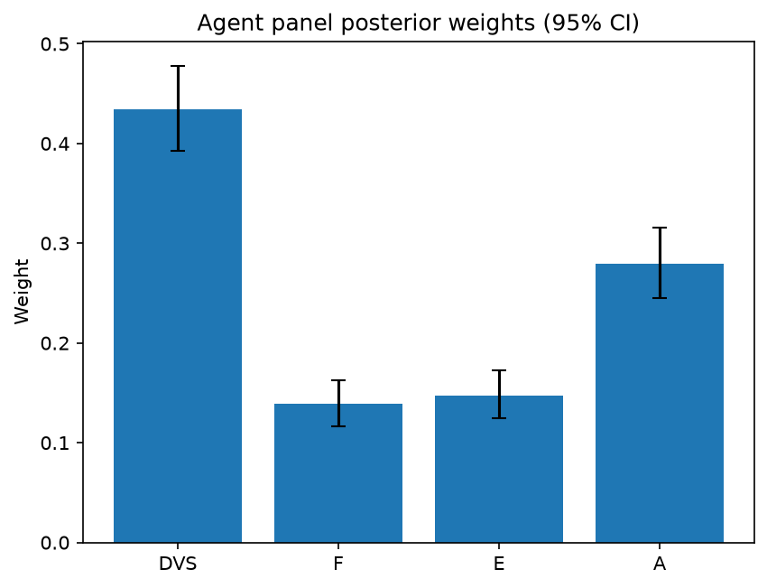

# Survey report: TrustRouter Claude CLI Panel (sonnet) -- Level L1: Top-level TrustRouter factors

Survey ID: `trustrouter-claude-cli-full-panel-claude-sonnet-2026-09-01-L1`

## Agent panel

- Agents contributing a valid response: 36
- Classical BWM consistency: 36/36 within threshold

| Criterion | Mean | 95% CI lower | 95% CI upper |
|---|---|---|---|
| DVS | 0.4343 | 0.3929 | 0.4781 |
| F | 0.1392 | 0.1165 | 0.1627 |
| E | 0.1473 | 0.1243 | 0.1727 |
| A | 0.2791 | 0.2452 | 0.3155 |

## Methodology

Each agent independently completed a Best-Worst Method (BWM) comparison: choosing the single most and least important criterion, then rating every criterion's importance relative to those two on a 1-9 scale. Individual responses were solved with the classical BWM linear program (Rezaei, 2015) for a consistency check, and combined across the panel with a hierarchical Bayesian model (Mohammadi and Rezaei, 2020).

36 agent response(s) were accepted into this result.

Every agent's run began with a QA precheck (its stated configuration verified against ground truth) and every accepted answer's self-reported sources were checked against what reference material was actually available to it; see the Per-agent detail section below and this survey's Conversation Log for each agent's specific results. Every response is schema-validated and independently, repeatedly sampled (never a single completion treated as ground truth); see `guardrails.py`. This survey's complete output is covered by a SHA-256 integrity manifest (`integrity_manifest.json`, `SHA256SUMS`), generated once this run finished, so any later alteration to these files is detectable.

### Charts

## Per-agent detail

### bim-coordinator-base-claude (`bim-coordinator-base-claude`)

- Role: BIM Coordinator
- Model: claude_cli/sonnet
- DID: `did:key:z6MkwaD5PfneZEDso4t2zzYoPEj2qoTJMvwL6gsjm7sm4KYw`
- QA precheck: passed
- Sources used: shared knowledge: trustrouter_expert_questionnaire_v5_real_survey_instrument.md, general_knowledge

**Answer:** `{"best": "DVS", "worst": "E", "best_to_others": {"DVS": 1, "F": 3, "E": 5, "A": 2}, "others_to_worst": {"DVS": 5, "F": 3, "E": 1, "A": 4}}`

**Reasoning:**

As a BIM coordinator deciding whether construction-project records deserve permanent, immutable ledger storage, the composite trustworthiness of the record itself (DVS) is the foundational gate. DVS aggregates quality, provenance trust, verification strength, independent confirmation, legal compliance and criticality (per shared knowledge: trustrouter_expert_questionnaire_v5_real_survey_instrument.md, section 3.2) -- if the underlying data is not trustworthy, writing it to a tamper-evident, permanent ledger does not create trust, it just permanently enshrines a bad or unverifiable record, which is actively worse for downstream owners, insurers and authorities than not recording it at all. Attack Resistance (A) is second in importance because it is the other half of what makes a ledger meaningfully different from a normal document register: tamper-evidence for structural, compliance and MEP records that must survive decades and multiple custodians is central to the whole DLT proposition, so I placed it fairly close behind DVS (ratio 2). Technical Feasibility Fit (F) is a real, sometimes hard constraint (large IFC/BIM models, frequent updates, latency needs can simply not fit ledger limits), but it is an engineering/implementation hurdle rather than a judgement about whether the data is worth trusting or protecting, so I placed it behind A. Economic Value (E) I judged the least important of the four for this comparison: in the stated composite formula TrustRouter = DVS x F x (1+E) x A, E enters as (1+E) and therefore can only scale the score up, never drive it to zero the way DVS, F or A structurally can -- a low-value asset with excellent DVS/F/A can still merit ledger storage (e.g. a life-safety compliance certificate that is not economically large but is critical), whereas a high-value asset with poor DVS or A should not be trusted onto a ledger regardless of stakes. E is genuinely useful for prioritization/urgency but is the weakest determinant of whether the record itself deserves trust, which is why I rate it worst. I want to be explicit that DVS vs A is a closer call than DVS vs E -- both DVS and A are core, non-negotiable trust gates in practice, and reasonable BIM/blockchain practitioners could rank them the other way round; my ratio of 2 reflects that closeness rather than a confident large gap.

### bim-coordinator-base-claude (`bim-coordinator-base-claude`)

- Role: BIM Coordinator
- Model: claude_cli/sonnet
- DID: `did:key:z6MkwaD5PfneZEDso4t2zzYoPEj2qoTJMvwL6gsjm7sm4KYw`
- QA precheck: passed
- Sources used: shared knowledge: trustrouter_expert_questionnaire_v5_real_survey_instrument.md, general_knowledge

**Answer:** `{"best": "DVS", "worst": "F", "best_to_others": {"DVS": 1, "F": 7, "E": 3, "A": 2}, "others_to_worst": {"DVS": 7, "F": 1, "E": 5, "A": 6}}`

**Reasoning:**

From a BIM coordinator's perspective managing federated models and lifecycle documentation across owners, insurers, and authorities, the question TrustRouter is really answering is: does this record deserve durable, tamper-evident storage, and is it trustworthy enough to bear that weight? DVS is the composite that actually encodes trustworthiness -- per the shared knowledge glossary it bundles Quality, Provenance Trust, Verification Strength, Independent Confirmation, Legal compliance and Criticality, i.e. the substantive attributes a coordinator checks before treating a model or document as authoritative (e.g. a signed structural report vs. an unverified sketch). That makes it the anchor factor: without adequate DVS, nothing else in the pipeline matters, because you'd be immutably preserving low-trust data. F (Technical Feasibility Fit = 1-P, fit to ledger size/update-rate/latency constraints) is a real-world engineering gate I deal with constantly in model federation (large IFC exports, frequent clash-detection updates don't fit cheaply on-chain), but it reflects storage-system practicality, not the intrinsic trust or stakes of the record -- a highly trustworthy, high-value document doesn't become less important because it's hard to fit on a ledger; it just forces an off-chain-hash workaround. That is why I rank it worst for 'importance' in this comparison set, even though it is operationally necessary. A (Attack Resistance) is close behind DVS in importance because tamper-evidence is arguably blockchain's core value proposition for compliance and insurance disputes over decades -- I placed it second rather than tied with DVS because attack resistance is meaningless to invest in if the underlying data was never trustworthy to begin with (DVS is the precondition). E (Economic Value) sits between A and F: high stakes justify stronger protection and is a legitimate prioritization lever I use when deciding which records get the most scrutiny, but on its own it doesn't establish whether a record is trustworthy or securable, only how much it would hurt if compromised -- and the survey's own formula (1+E) treats it as an amplifier rather than a gating factor the way DVS, F and A are, which reinforced my judgement that it is not the top driver. I want to flag that the DVS-vs-A call and the E-vs-A call were the least clear-cut parts of this ranking -- a reasonable case could be made to swap A ahead of DVS given blockchain's core purpose is tamper detection, so I'm not claiming high confidence on the exact 2 vs 3 spacing, only on the overall ordering DVS > A > E > F.

### bim-coordinator-base-claude (`bim-coordinator-base-claude`)

- Role: BIM Coordinator
- Model: claude_cli/sonnet
- DID: `did:key:z6MkwaD5PfneZEDso4t2zzYoPEj2qoTJMvwL6gsjm7sm4KYw`
- QA precheck: passed
- Sources used: shared knowledge: trustrouter_expert_questionnaire_v5_real_survey_instrument.md, general_knowledge

**Answer:** `{"best": "DVS", "worst": "F", "best_to_others": {"DVS": 1, "F": 6, "E": 3, "A": 2}, "others_to_worst": {"DVS": 6, "F": 1, "E": 2, "A": 3}}`

**Reasoning:**

From a BIM coordination standpoint, the whole point of putting a construction-project record on a ledger is to certify that the record itself is trustworthy over a multi-decade lifecycle spanning owners, insurers, and authorities. DVS (quality, provenance, verification of the BIM/IFC data) is the foundation: an immutably-stored but low-quality or unverifiable model (e.g., a clash-detection federated model with unclear authorship or unvalidated geometry) gives false assurance -- you've just made garbage permanent and harder to correct. That 'garbage in, garbage out' concern is the single biggest practical risk I see in multi-stakeholder BIM federation, so I rank DVS as Best. Attack Resistance (A) is a close second: tamper-evidence is the specific value proposition of DLT for lifecycle documentation (structural inspection reports, compliance certificates) that must survive disputes and audits decades later, so it stays near the top but is secondary to the antecedent question of whether the data was ever trustworthy to begin with. Economic Value (E) matters for prioritizing which records are worth the ledger overhead (a load-bearing structural certificate vs. a minor finish spec), but it's a resource-allocation input rather than a property of the data's trustworthiness, so it sits below DVS and A. Technical Feasibility Fit (F) is the Worst for this comparison: it's an engineering/implementation constraint (can the artefact's size, update cadence, and latency needs actually be accommodated by the ledger, e.g., anchoring a large IFC file via hash rather than storing it directly) rather than a judgement about how much the data deserves to be trusted or protected. In practice a BIM record with poor technical fit is usually solved by hashing/off-chain storage patterns rather than by declining to trust the data, which is why I judge it least decisive among these four for the trust question itself. The multiplicative structure (DVS x F x (1+E) x A) means every factor can gate the composite to near zero, but this ranking reflects professional judgement about which factor most directly answers 'should this construction record be trusted on a ledger,' not the mathematical sensitivity of the formula. This was a genuinely closer call between A and E than between DVS and F -- both A and DVS are intrinsic to trust, while E and F are more about justification and practicality, so the middle ranks carry more uncertainty than the endpoints.

### bim-coordinator-rag-claude (`bim-coordinator-rag-claude`)

- Role: BIM Coordinator
- Model: claude_cli/sonnet
- DID: `did:key:z6MkqSfDfSA3Y6V2HcU6A72f4t469gxYRVPTADrJ7HzYtu7a`
- QA precheck: passed
- Sources used: shared knowledge: trustrouter_expert_questionnaire_v5_real_survey_instrument.md, bim_and_digital_building_logbooks.md, general_knowledge

**Answer:** `{"best": "DVS", "worst": "F", "best_to_others": {"DVS": 1, "F": 6, "E": 3, "A": 2}, "others_to_worst": {"DVS": 6, "F": 1, "E": 2, "A": 3}}`

**Reasoning:**

In the multiplicative TrustRouter formula (DVS x F x (1+E) x A), DVS, F, and A are true gating factors (a near-zero value collapses the whole score) while E enters as (1+E), an amplifier that can never drive the score to zero even when economic stakes are negligible. That structural asymmetry matters for how I weigh them as a BIM coordinator. My daily work is federating multi-discipline models, running clash detection, and maintaining lifecycle documentation that owners, insurers, and authorities rely on for decades -- the recurring question is never 'can the ledger technically hold this record' but 'is this record itself trustworthy enough to be worth permanently anchoring.' DVS bundles exactly the things I actually vet before accepting a model or document into a federated environment -- quality, provenance/custody, verification strength, independent confirmation, legal compliance, criticality (per the DVS constituent breakdown in shared knowledge: trustrouter_expert_questionnaire_v5_real_survey_instrument.md). That is the substantive trust question, so I rank DVS Best. Attack Resistance (A) is a close second: tamper-evidence is the entire reason a project would consider blockchain over a conventional database for compliance-critical records, so it deserves a strong but not top rating (2x DVS). Economic Value (E) matters for prioritizing which records get the most protective investment, but a BIM coordinator doesn't primarily reason in monetary terms -- that's an owner/PM lens -- and the formula itself treats E as a secondary multiplier rather than a gate, so I place it third (3x DVS). Technical Feasibility Fit (F) I rank Worst: it is a real, practical engineering constraint (model file size, update cadence, latency for clash-detection workflows), consistent with Gartoumi 2024's observation that the construction industry still lacks calibrated decision criteria for when blockchain-backed storage is even appropriate -- but feasibility problems are routinely engineered around (e.g., off-chain storage with on-chain hashing/anchoring), whereas no engineering workaround substitutes for the data actually being trustworthy, valuable, or tamper-resistant. That is a professional judgement call, not something the reference material states outright. I also drew on bim_and_digital_building_logbooks.md's point that ISO 19650 already builds independent multi-party validation into federated model acceptance, which reinforces that provenance/verification-type concerns (captured under DVS) are the mechanism BIM practice actually leans on for trust, ahead of pure technical/storage feasibility. My best-to-others and others-to-worst ratings are set to a consistent ratio of 6 throughout (aBW=6) to avoid contradictory implied comparisons, though I note the DVS-vs-A and E-vs-F comparisons in particular were closer calls than the DVS-vs-F extremes, and a case could reasonably be made for swapping the relative order of E and A.

### bim-coordinator-rag-claude (`bim-coordinator-rag-claude`)

- Role: BIM Coordinator
- Model: claude_cli/sonnet
- DID: `did:key:z6MkqSfDfSA3Y6V2HcU6A72f4t469gxYRVPTADrJ7HzYtu7a`
- QA precheck: passed
- Sources used: bim_and_digital_building_logbooks.md, shared knowledge: trustrouter_expert_questionnaire_v5_real_survey_instrument.md, general_knowledge

**Answer:** `{"best": "DVS", "worst": "F", "best_to_others": {"DVS": 1, "F": 5, "E": 3, "A": 2}, "others_to_worst": {"DVS": 5, "F": 1, "E": 2, "A": 4}}`

**Reasoning:**

As a BIM coordinator, the question a factor like this is really answering is 'does this construction record deserve to be committed to an immutable ledger at all, and how much weight should that carry?' DVS (the composite of quality, provenance, independent confirmation, legal compliance and criticality) is the factor that most directly answers that question -- it is the substantive trust judgement the whole pipeline exists to produce, and it maps onto exactly the kind of federated-model validation and multi-party sign-off that ISO 19650 information-delivery processes already require before a coordination model is accepted (bim_and_digital_building_logbooks.md, on Independent Confirmation and the lead-appointed-party/task-team validation mechanism). Attack Resistance (A) I rank second: it is close to DVS in importance because blockchain's entire value proposition for a Digital Building Logbook is tamper-evidence of custody and identity (the DID/verifiable-credential architecture described in bim_and_digital_building_logbooks.md for BUILDCHAIN DBL) -- without it, a high-DVS record could still be undetectably altered after the fact, so A is a close second rather than a distant one. Economic Value (E) comes third: it legitimately scales how much trust infrastructure a given record deserves (a load-bearing structural certificate warrants more scrutiny than a paint-finish spec sheet), but in my experience E is more a prioritization/triage input than a determinant of whether the underlying data is actually trustworthy -- a low-value record can still be highly manipulable, and a high-value one can already be well-verified through conventional means. Technical Feasibility Fit (F) I rank lowest: F = 1 - P is fundamentally an engineering/implementation constraint (does the artefact's size, update cadence and latency fit the ledger), not a statement about the record's trustworthiness or stakes. It gates whether a solution is practical, but a federation of BIM data that scores high on DVS, E and A doesn't become less trustworthy because it happens to be hard to fit on-chain -- that's an implementation problem to be engineered around (e.g., off-chain storage with on-chain hashes), not a reduction in the data's inherent trust value. This is a professional judgement call rather than something I can point to a specific benchmark for -- the four factors are close enough in a few places (especially DVS vs A) that I want to flag this is not a clear-cut ordering, and the Gartoumi 2024 scientometric review (bim_and_digital_building_logbooks.md) itself notes the construction industry still lacks rigorous, calibrated decision criteria for exactly this kind of trade-off, which is consistent with my own sense that this ranking is a reasoned judgement rather than an established consensus.

### bim-coordinator-rag-claude (`bim-coordinator-rag-claude`)

- Role: BIM Coordinator
- Model: claude_cli/sonnet
- DID: `did:key:z6MkqSfDfSA3Y6V2HcU6A72f4t469gxYRVPTADrJ7HzYtu7a`
- QA precheck: passed
- Sources used: bim_and_digital_building_logbooks.md, shared knowledge: trustrouter_expert_questionnaire_v5_real_survey_instrument.md, SOURCES.md, general_knowledge

**Answer:** `{"best": "DVS", "worst": "F", "best_to_others": {"DVS": 1, "F": 7, "E": 4, "A": 2}, "others_to_worst": {"DVS": 7, "F": 1, "E": 2, "A": 4}}`

**Reasoning:**

As a BIM coordinator responsible for federated models and lifecycle documentation over decades (the Hospital Real deep-renovation scenario in the shared questionnaire is a good proxy: institutional owners, insurers, and authorities all need to rely on the same record for 30+ years), the composite trustworthiness of the underlying data (DVS) is the foundation everything else serves. DVS already bundles Quality, Provenance Trust, Verification Strength, Independent Confirmation, Legal Compliance and Criticality per the shared questionnaire's Part 3.2 breakdown -- this is essentially 'is the record itself worth trusting at all', which for construction handover documentation (structural sign-offs, compliance certificates) is the precondition for any of the other factors to matter. The ISO 19650-based guidance in bim_and_digital_building_logbooks.md reinforces this: independent validation by lead appointed party/task teams before federated models are accepted is precisely the real-world mechanism DVS's IC constituent is meant to capture, and that validation discipline is what construction professionals actually rely on for trust, not ledger mechanics. Attack Resistance (A) is a close second-most-important factor -- tamper-evidence is the entire premise of putting a record on a blockchain, and Kochovski et al. 2026's DID/verifiable-credential architecture for digital building logbooks is explicitly built to make undetected manipulation hard -- but A protects a record's integrity without saying anything about whether the record was trustworthy to begin with, so it sits just below DVS. Economic Value (E) matters for prioritizing which records deserve the overhead of blockchain-grade protection, but in construction practice the assets with the highest 'value at stake' (life-safety structural records, compliance certificates) are already captured under DVS's own Criticality and Legal Compliance constituents, so E is somewhat derivative of DVS rather than an independent trust driver -- hence it ranks below A. Technical Feasibility Fit (F) I rate worst: it is a real and necessary engineering constraint (ledger size/update-rate/latency limits), but it is a gating/implementation question -- can this artefact even be put on-chain -- rather than a judgement about how much the data should be trusted once it is there. Gartoumi 2024's scientometric review notes the construction industry still lacks rigorous, calibrated criteria for when blockchain storage is appropriate at all, which in my reading places feasibility fit as a downstream engineering filter rather than a top-tier trust determinant. The comparison between DVS and A was genuinely the closest call here; I did not treat any criterion as self-evidently dominant by default, but on balance a BIM coordinator's daily concern with federation, model quality, and validated provenance chains under ISO 19650 tips DVS to the top.

### blockchain-engineer-base-claude (`blockchain-engineer-base-claude`)

- Role: Blockchain / DLT Engineer
- Model: claude_cli/sonnet
- DID: `did:key:z6MkiXdPHgRKLgsWGCi5P19sNTrHqFjySf3d9JD1BYLAirtk`
- QA precheck: passed
- Sources used: shared knowledge: trustrouter_expert_questionnaire_v5_real_survey_instrument.md, general_knowledge

**Answer:** `{"best": "F", "worst": "E", "best_to_others": {"F": 1, "DVS": 2, "A": 2, "E": 5}, "others_to_worst": {"F": 5, "DVS": 4, "A": 4, "E": 1}}`

**Reasoning:**

From a production DLT-engineering standpoint, Technical Feasibility Fit (F) acts as the hard gate on the routing decision: if an artefact's size, update-rate, or latency profile doesn't fit ledger constraints, it simply cannot go full on-chain regardless of how trustworthy or economically valuable it is -- that's why the survey instrument frames F as F = 1-P and why hybrid tiers (IPFS_HASH) exist specifically to route around infeasible payloads. This is the exact judgement this role is asked to make day to day (throughput, size, latency limits on permissioned ledgers), so I rated it Best. Attack Resistance (A) -- difficulty of undetected tampering via identity fraud, device compromise, or insider abuse (per the shared instrument's definition) -- is the other core engineering concern (tamper-evidence guarantees), so I placed it close to F (ratio 2), not far behind. Data Value Score (DVS) is the composite trustworthiness score and already folds in a Verification Strength (V) sub-constituent that overlaps substantially with attack-resistance concerns, so I treated it as similarly important to A (also ratio 2 vs F) rather than clearly weaker or stronger. Economic Value (E) -- downstream financial/asset value at risk, per the instrument -- I rated Worst: it's a business-risk multiplier on the outcome (reflected in the formula as (1+E), a scaling term rather than a primary gate) and doesn't itself bear on whether the ledger technology is fit for purpose or whether tampering is detectable, which are the technically load-bearing questions for a DLT engineer. The best/worst comparison here (F vs. DVS/A) was genuinely closer than F vs. E -- I want to flag that DVS and A could plausibly be swapped or tied with F itself for another engineer weighing trustworthiness more heavily than raw feasibility, and I don't consider that comparison fully clear-cut.

### blockchain-engineer-base-claude (`blockchain-engineer-base-claude`)

- Role: Blockchain / DLT Engineer
- Model: claude_cli/sonnet
- DID: `did:key:z6MkiXdPHgRKLgsWGCi5P19sNTrHqFjySf3d9JD1BYLAirtk`
- QA precheck: passed
- Sources used: shared knowledge: trustrouter_expert_questionnaire_v5_real_survey_instrument.md, general_knowledge

**Answer:** `{"best": "F", "worst": "E", "best_to_others": {"F": 1, "DVS": 2, "A": 3, "E": 6}, "others_to_worst": {"F": 6, "DVS": 3, "A": 2, "E": 1}}`

**Reasoning:**

From a permissioned-ledger engineering standpoint, Technical Feasibility Fit (F) is the hardest gate in the routing decision. F = 1 - P captures whether the artefact's size, update cadence, and latency profile can even be accommodated by the ledger (block size/gas limits, write throughput, finality time). No matter how trustworthy (DVS), valuable (E), or attack-sensitive (A) a construction record is, if it structurally cannot fit ledger constraints (e.g., a full BIM/IFC coordination model versus a hash pointer), it must be routed hybrid or off-chain regardless of the other three scores -- this is an engineering reality I've seen block naive 'put everything on-chain' proposals in practice. That makes F the most influential factor for the routing decision itself, ahead of DVS (composite data trustworthiness) and A (tamper-resistance need), both of which matter greatly but presuppose the record is even a feasible candidate for the ledger. I ranked Attack Resistance (A) above Economic Value (E) because A speaks directly to blockchain's core value proposition -- tamper-evidence -- which is the technical reason to choose a ledger over a conventional database at all, whereas E is a downstream stakes multiplier. I placed Economic Value (E) as least influential for a structural reason grounded in the survey's own composite formula (TrustRouter = DVS x F x (1+E) x A, noted in this survey's grounding rules): DVS, F, and A all enter as direct multiplicative terms that can drive the whole score to zero if absent, but E enters as (1+E), so even at E=0 the product is undiminished by E specifically -- mathematically E can only scale the result upward, never gate it to zero the way a poor technical fit, low data trust, or weak attack resistance can. That asymmetry, combined with the fact that high-value records without adequate provenance/verification or without ledger fit still shouldn't go on-chain, made E the clear Worst choice for me. The comparison between DVS and A was the closest call in this set -- both are strong, substantive trust dimensions, and I only slightly favored DVS because the questionnaire's own DVS definition subsumes provenance and verification-strength constituents that overlap conceptually with attack resistance, making DVS the broader upstream gate.

### blockchain-engineer-base-claude (`blockchain-engineer-base-claude`)

- Role: Blockchain / DLT Engineer
- Model: claude_cli/sonnet
- DID: `did:key:z6MkiXdPHgRKLgsWGCi5P19sNTrHqFjySf3d9JD1BYLAirtk`
- QA precheck: passed
- Sources used: shared knowledge: trustrouter_expert_questionnaire_v5_real_survey_instrument.md, general_knowledge

**Answer:** `{"best": "F", "worst": "E", "best_to_others": {"F": 1, "DVS": 2, "E": 6, "A": 3}, "others_to_worst": {"F": 6, "DVS": 3, "A": 2, "E": 1}}`

**Reasoning:**

From a production DLT-engineering standpoint, Technical Feasibility Fit (F) is the practical gate on the whole routing decision: per the shared instrument, F captures whether the artefact's size, update rate and latency profile can physically sit on a distributed ledger at all. Permissioned ledgers have hard, non-negotiable constraints (block/tx size ceilings, write-throughput limits, finality latency) that no amount of data trustworthiness or economic stakes can overcome -- a multi-GB BIM coordination model or a high-frequency sensor feed simply cannot go fully on-chain regardless of its DVS or E score, forcing a hybrid/off-chain routing outcome by construction-level necessity rather than by value judgement. That is why I rank F above even DVS, though this is a genuinely close call: DVS (quality, provenance trust, verification strength per the instrument's 3.2 breakdown) is the substantive reason one would want tamper-evident storage in the first place, so I only rate F as 2x DVS rather than something more lopsided, reflecting that both are near-necessary conditions rather than one clearly dominating. A (Attack Resistance) is also an engineering-relevant factor -- undetected tampering resistance is close to the core value proposition of DLT -- but as defined here it concerns pre-ledger security posture (identity fraud, device/insider compromise) rather than whether the record can be routed to a ledger at all, so I place it below F (3x) but above E. E (Economic Value) I rate weakest: it is a stakes/prioritization multiplier in the TrustRouter formula (the '1+E' term) that scales consequences of loss, but it says nothing about whether the data is technically routable or trustworthy, so from an engineer's perspective it is the least diagnostic of the four for the routing decision itself. The rating set is internally consistent (a_Bj x a_jW = a_BW = 6 for every j), which I verified explicitly rather than assigning numbers ad hoc.

### blockchain-engineer-rag-claude (`blockchain-engineer-rag-claude`)

- Role: Blockchain / DLT Engineer
- Model: claude_cli/sonnet
- DID: `did:key:z6MkopvxUWWWCS4idsrstN99GZf9TsfLRkdw69bu1hJ8anGq`
- QA precheck: passed
- Sources used: blockchain_trust_and_attack_resistance.md, shared knowledge: trustrouter_expert_questionnaire_v5_real_survey_instrument.md, general_knowledge

**Answer:** `{"best": "F", "worst": "E", "best_to_others": {"DVS": 3, "F": 1, "E": 5, "A": 2}, "others_to_worst": {"DVS": 3, "F": 5, "E": 1, "A": 4}}`

**Reasoning:**

TrustRouter's composite is multiplicative (DVS x F x (1+E) x A), which matters structurally for this comparison: DVS, F, and A are pure multipliers that can drive the whole routing score to zero if the underlying property is absent, whereas E enters as (1+E), so even at E=0 the factor contributes 1 and never eliminates the score -- it only ever scales it upward. As an engineer whose remit is technical feasibility, throughput, and tamper-evidence, that structural asymmetry plus my domain focus puts E clearly last: economic stakes matter for prioritization, but they don't determine whether ledger storage is even possible or trustworthy. I chose F (Technical Feasibility Fit) as Best because it is the hard engineering gate: a record that does not fit ledger constraints (size, update-rate, latency -- F = 1-P) cannot be stored on-chain regardless of how valuable, economically significant, or well-provenanced it is; feasibility is a prerequisite that has to clear before the other factors' contributions are even realizable in practice. Attack Resistance (A) I placed second: it's close behind F because it speaks directly to the ledger's core value proposition of tamper-evidence and validator/consensus design (echoing the Rouhani & Deters adaptive-validation model in blockchain_trust_and_attack_resistance.md, where a trust/attack-resistance-like score directly gates how much consensus strength a transaction needs) -- but unlike raw feasibility, weak attack resistance can sometimes be engineered around (added signatures, oracle redundancy), so I rate it a notch below F rather than tied with it. DVS (data value/quality/provenance) sits third: it matters for whether the data is worth trusting at all, but from a pure ledger-engineering standpoint it is somewhat downstream of feasibility and security-design concerns -- quality is largely orthogonal to whether the ledger can physically host the artefact or resist tampering. This is a genuinely close call between F and A specifically (ratio of 2, not a wide gap), and I want to flag that explicitly rather than overstate confidence; a reasonable case could be made either way depending on whether one privileges raw feasibility limits or the tamper-evidence value proposition as the primary gate. The DVS-F gap (ratio 3) and the E gap (ratio 5) I'm more confident about, grounded in the multiplicative-formula logic itself.

### blockchain-engineer-rag-claude (`blockchain-engineer-rag-claude`)

- Role: Blockchain / DLT Engineer
- Model: claude_cli/sonnet
- DID: `did:key:z6MkopvxUWWWCS4idsrstN99GZf9TsfLRkdw69bu1hJ8anGq`
- QA precheck: passed
- Sources used: blockchain_trust_and_attack_resistance.md, shared knowledge: trustrouter_expert_questionnaire_v5_real_survey_instrument.md, general_knowledge

**Answer:** `{"best": "A", "worst": "E", "best_to_others": {"A": 1, "DVS": 2, "F": 2, "E": 6}, "others_to_worst": {"E": 1, "DVS": 3, "F": 3, "A": 6}}`

**Reasoning:**

I read the composite formula TrustRouter = DVS x F x (1+E) x A as structurally informative: DVS, F, and A are pure multiplicative terms, so any one of them collapsing toward zero collapses the whole trust score toward zero -- each is a near-necessary condition. E, by contrast, enters as (1+E), which is bounded below at 1 even when E=0, so it can only amplify an already-nonzero trust score, never veto it on its own. That asymmetry is why I placed Economic Value (E) as Worst: a construction record with high financial exposure but no real data trustworthiness (low DVS), no way to fit ledger constraints (low F), and no meaningful protection against undetected tampering (low A) still shouldn't go on a ledger -- the money at stake doesn't fix any of those problems, it only raises the stakes if they aren't fixed. Among the three near-necessary factors, I chose Attack Resistance (A) as Best because it is the actual reason to reach for a tamper-evident ledger instead of a conventional database in the first place -- per blockchain_trust_and_attack_resistance.md, the whole point of mechanisms like Rouhani and Deters' adaptive validation (Hyperledger Fabric endorsement scaling with trust) and the on-chain identity trust gaps catalogued in Vaziry et al. 2024 is to defend against exactly the undetected-manipulation scenarios A measures (Sybil, oracle, insider). If A is low -- the threat of undetected tampering is negligible or unaddressable by the ledger anyway -- there is little technical justification for paying blockchain's cost premium regardless of how good the data or how feasible the fit. That said, this is a close call: DVS and F are both also near-necessary and I rated them at only 2 (A is twice as important as each), not higher, because a genuinely untrustworthy record (low DVS, the classic 'garbage in, gospel out' oracle problem) or one that structurally cannot fit ledger constraints (low F, e.g. a multi-hundred-MB BIM model that must go hybrid via IPFS+hash) are just as capable of independently killing the routing decision as low attack resistance is. I did not treat any of DVS, F, or A as obviously dominant over the others -- the 2:1 ratios reflect a genuine but modest edge for A, not a large gap, and I want to flag that a reasonable engineer could instead rank F as Best given how binding size/throughput/latency constraints are in production permissioned-ledger deployments (e.g. Fabric block size and endorsement policy limits) that I deal with directly. E was clearly the easiest call for Worst: it scales consequences but doesn't itself establish whether the ledger's guarantees are earned or even achievable.

### blockchain-engineer-rag-claude (`blockchain-engineer-rag-claude`)

- Role: Blockchain / DLT Engineer
- Model: claude_cli/sonnet
- DID: `did:key:z6MkopvxUWWWCS4idsrstN99GZf9TsfLRkdw69bu1hJ8anGq`
- QA precheck: passed
- Sources used: shared knowledge: trustrouter_expert_questionnaire_v5_real_survey_instrument.md, blockchain_trust_and_attack_resistance.md, general_knowledge

**Answer:** `{"best": "F", "worst": "E", "best_to_others": {"F": 1, "A": 2, "DVS": 3, "E": 8}, "others_to_worst": {"F": 8, "A": 5, "DVS": 3, "E": 1}}`

**Reasoning:**

As a blockchain/DLT engineer, I read F (Technical Feasibility Fit) as a hard engineering gate rather than a graded quality signal: an artefact that exceeds ledger size, throughput, or latency constraints simply cannot be committed on-chain regardless of how trustworthy, valuable, or attack-sensitive it is. This is consistent with the survey's own definition, F = 1 - P, and with the composite being multiplicative (TrustRouter = DVS x F x (1+E) x A per this survey's own framing) -- a near-zero F collapses the whole score the same way a near-zero DVS or A would, but unlike DVS or A, F failures are binary/structural in production permissioned-ledger deployments (block size caps, endorsement/consensus latency, storage cost per write on systems like Hyperledger Fabric) rather than probabilistic trust judgements, which is why I rank it above the others rather than treating all four as equally 'soft' weights. I placed Attack Resistance (A) second: it maps directly to the tamper-evidence guarantee that is blockchain's actual value proposition over a conventional database, and the catalogued literature on Sybil/Oracle/Insider resistance and on-chain identity trust gaps (blockchain_trust_and_attack_resistance.md, covering Rouhani & Deters 2021 and Vaziry et al. 2024) reinforces that undetected-manipulation resistance is a first-order concern distinct from generic data quality. DVS (Data Value Score) I placed third: it is a broad composite of quality, provenance, and verification strength (per shared knowledge: trustrouter_expert_questionnaire_v5_real_survey_instrument.md's L2 breakdown), important but downstream of whether the record can technically be stored and whether it can be tamper-evidently protected once stored. I placed Economic Value (E) as worst: beyond it being a business/financial consideration once removed from the technical trust mechanics I am asked to judge, the survey's own multiplicative formula treats it asymmetrically -- as (1+E) rather than a direct multiplicand -- so even E=0 leaves the product at its other-factors value rather than zeroing it out, meaning E structurally has the weakest 'veto' power of the four on the composite trust score. I want to flag that F vs. A is a genuinely close call (rated only 2x rather than a large gap): both are core technical/security concerns for a permissioned-ledger engineer, and a reviewer could reasonably swap their order or rate them near-equal; my tie-breaker was that feasibility is a precondition for attack resistance to even be evaluated on-chain at all. The specific numeric ratios beyond the ranking itself are my own judgement calls, not derived from a cited empirical study of relative importance.

### compliance-officer-base-claude (`compliance-officer-base-claude`)

- Role: Compliance and Regulatory Officer
- Model: claude_cli/sonnet
- DID: `did:key:z6MkwUN3K4YmG9arhbzyAxMLs314eLG46wmPnKoYLVUT8Rzm`
- QA precheck: passed
- Sources used: shared knowledge: trustrouter_expert_questionnaire_v5_real_survey_instrument.md, general_knowledge

**Answer:** `{"best": "DVS", "worst": "F", "best_to_others": {"DVS": 1, "F": 8, "E": 3, "A": 2}, "others_to_worst": {"DVS": 8, "F": 1, "E": 4, "A": 5}}`

**Reasoning:**

From a facility-management compliance perspective, the question TrustRouter is really answering at L1 is 'should this construction record be trusted enough to commit to an immutable ledger, and does it matter if we're wrong?'. DVS (Data Value Score) is the composite that already absorbs the sub-factors that matter most to a compliance officer: per the shared instrument's Section 3.2, DVS is built from Quality, Provenance Trust, Verification Strength, Independent Confirmation, Legal compliance (L), and Criticality (C). Because legal/regulatory obligation and safety/contractual criticality are already nested inside DVS, it is the factor most directly answerable to statutory and audit requirements (building-code disclosure classes, GDPR data-integrity/accuracy obligations under Art. 5(1)(d)/(f)), so I rate it Best. Attack Resistance (A) is second in importance: undetected manipulation risk goes to the evidentiary integrity of the record and to GDPR's integrity-and-confidentiality principle, but it presupposes DVS is meaningful in the first place (tamper-resistance of worthless or non-compliant data is not itself a compliance win), so it sits below DVS. Economic Value (E) matters for prioritising which records deserve stronger controls, but from a regulatory-obligation standpoint it is a risk-weighting input rather than a trust or legality criterion in itself, so it ranks third. Technical Feasibility Fit (F) is Worst: it is a gating/engineering constraint (does the artefact fit ledger size, update-rate, latency limits) rather than a substantive statement about the data's trustworthiness, legal standing, or exposure -- a record can be perfectly feasible to store and still be worthless or non-compliant, or infeasible yet legally critical. The ratios reflect that DVS is the dominant compliance-relevant factor (8x over the purely operational F, 2-3x over A/E which are more substantive but narrower in scope), while F remains a real but comparatively minor consideration once the compliance gates are cleared.

### compliance-officer-base-claude (`compliance-officer-base-claude`)

- Role: Compliance and Regulatory Officer
- Model: claude_cli/sonnet
- DID: `did:key:z6MkwUN3K4YmG9arhbzyAxMLs314eLG46wmPnKoYLVUT8Rzm`
- QA precheck: passed
- Sources used: shared knowledge: trustrouter_expert_questionnaire_v5_real_survey_instrument.md, general_knowledge

**Answer:** `{"best": "DVS", "worst": "F", "best_to_others": {"DVS": 1, "F": 9, "E": 4, "A": 2}, "others_to_worst": {"DVS": 9, "F": 1, "E": 3, "A": 5}}`

**Reasoning:**

From a GDPR/construction-regulatory compliance standpoint, Data Value Score (DVS) is the criterion that most directly encodes the obligations I am accountable for: per shared knowledge: trustrouter_expert_questionnaire_v5_real_survey_instrument.md, DVS is a composite of Quality, Provenance Trust, Verification Strength, Independent Confirmation, Legal compliance (L), and Criticality (C) -- meaning statutory/building-code obligations and life-safety/contractual criticality are literally sub-components of DVS. A record's fitness for immutable archiving under GDPR (accuracy, data minimisation, integrity/confidentiality per Art. 5) and under construction-code retention duties is therefore captured inside DVS more than in any other top-level factor, making it Best. Attack Resistance (A) is second in importance: undetected manipulation resistance underpins the evidentiary and audit-trail integrity that both GDPR (integrity/confidentiality principle) and construction regulators (tamper-evident inspection/handover records) require, so I rate it clearly above Economic Value and Feasibility but below DVS. Economic Value (E) matters for prioritising which records deserve stronger controls, but a compliance officer's duty to protect a record (e.g. a life-safety structural certificate) does not scale simply with its monetary stake -- and the TrustRouter formula itself treats E as a bounded multiplier via (1+E) rather than a directly multiplicative factor like DVS, F, and A, which supports giving it intermediate rather than top weight. Technical Feasibility Fit (F) is Worst: it measures whether an artefact's size/update-rate/latency profile suits the ledger -- a purely engineering/operational fit constraint that says nothing about the data's trustworthiness, legal status, or manipulation risk. It is a necessary gate for storage, not a substantive compliance or risk driver, so relative to DVS, A, and E it is the least important from this role's perspective. I flag that the DVS-vs-A gap is a genuine judgement call rather than a sharp distinction -- both bear heavily on regulatory integrity, and a reviewer could reasonably weight them closer together.

### compliance-officer-base-claude (`compliance-officer-base-claude`)

- Role: Compliance and Regulatory Officer
- Model: claude_cli/sonnet
- DID: `did:key:z6MkwUN3K4YmG9arhbzyAxMLs314eLG46wmPnKoYLVUT8Rzm`
- QA precheck: passed
- Sources used: shared knowledge: trustrouter_expert_questionnaire_v5_real_survey_instrument.md, general_knowledge

**Answer:** `{"best": "DVS", "worst": "F", "best_to_others": {"DVS": 1, "F": 9, "E": 3, "A": 2}, "others_to_worst": {"DVS": 9, "F": 1, "E": 3, "A": 6}}`

**Reasoning:**

As a compliance officer covering GDPR and construction-regulatory obligations, I judge DVS (Data Value Score) as Best because it is the composite trust measure whose own constituents -- per the shared knowledge instrument's breakdown of DVS into Quality, Provenance Trust, Verification Strength, Independent Confirmation, Legal compliance (L), and Criticality (C) -- map directly onto what a compliance function actually has to certify: is the record accurate, who created it and with what custody chain, is it independently corroborated, does it satisfy a binding statutory/building-code obligation, and does it carry safety/contractual criticality. DVS is effectively the aggregate legal-and-technical trustworthiness score, so it is the anchor a compliance officer would defend to a regulator or auditor. F (Technical Feasibility Fit, defined as 1-P against ledger size/update-rate/latency constraints) is Worst because it is a pure engineering/operational gate -- it tells you whether an artefact *can* physically fit the ledger, not whether the underlying data is trustworthy, legally compliant, or defensible in an audit. It has essentially no bearing on GDPR accountability or construction regulatory risk, so I rate DVS as 9x more important than F, the top of the scale, reflecting that from a compliance lens F is nearly irrelevant to the trust question even though it still gates implementation. A (Attack Resistance) I place second: tamper-evidence and difficulty of undetected manipulation speak directly to GDPR's integrity/confidentiality principle (Art. 5(1)(f)) and to defensibility of construction safety records under audit, so it is only moderately behind DVS (rated 2), and clearly well ahead of F (rated 6 in the others-to-worst column). E (Economic Value) sits in the middle: financial/asset exposure is a legitimate input to risk-based prioritization (echoing the proportionality logic in GDPR Art. 32 -- security measures scaled to risk and impact), but it is a consequence measure rather than a criterion that itself establishes trustworthiness or legal standing of the data, so I place it clearly below DVS and A but well above the purely technical F (rated 3 in both columns). These ratios are set to be internally consistent (e.g. DVS-to-F = 9 in both the best-to-others and others-to-worst tables), reflecting an implicit importance ordering of DVS > A > E > F. I acknowledge the DVS-vs-A comparison is the closest call in this set: both are core to regulatory defensibility, and a different compliance officer weighing audit-trail security more heavily than provenance/legal-compliance composition could reasonably narrow that gap.

### compliance-officer-rag-claude (`compliance-officer-rag-claude`)

- Role: Compliance and Regulatory Officer
- Model: claude_cli/sonnet
- DID: `did:key:z6Mkiny4nghtEZgRh1GDTK1uVN3K6yiWKovHursQ4YEVJq2c`
- QA precheck: passed
- Sources used: gdpr_and_data_governance.md, shared knowledge: trustrouter_expert_questionnaire_v5_real_survey_instrument.md, general_knowledge

**Answer:** `{"best": "DVS", "worst": "E", "best_to_others": {"DVS": 1, "F": 3, "E": 6, "A": 3}, "others_to_worst": {"DVS": 6, "F": 2, "E": 1, "A": 2}}`

**Reasoning:**

As a compliance officer, my mandate centers on whether a given construction record is lawful and safe to commit to an immutable structure, and whether its trustworthiness chain (authorship, custody, verification) can withstand regulatory scrutiny. DVS is the composite that most directly carries this weight: per the shared survey instrument (shared knowledge: trustrouter_expert_questionnaire_v5_real_survey_instrument.md), DVS's own internal constituents include Legal compliance (L), Provenance Trust (PT) and Verification Strength (V) -- precisely the dimensions a compliance function is built to police -- so DVS is the pillar that most concretely operationalizes 'is this data trustworthy and lawful to place on-chain.' That makes DVS the clear Best. F (Technical Feasibility Fit) is not a peripheral engineering afterthought from a compliance standpoint: gdpr_and_data_governance.md is explicit that blockchain's immutability directly conflicts with GDPR's right to erasure, and that the governance gap in construction-sector blockchain adoption is precisely the failure to develop rigorous criteria for when storage is 'legally and practically appropriate' before any trust score is computed -- so F sits close behind DVS because a technically infeasible fit (e.g., data that cannot practically support erasure or correction) is itself a compliance red flag. A (Attack Resistance) matters for compliance too, since tamper-evidence underpins the evidentiary and accountability value of a record (GDPR Article 5 accountability principle, by general knowledge rather than a specific cited source), but it is a security property one layer removed from the legal-suitability question DVS and F address, so I placed it level with F rather than above it -- this F/A tie is a genuinely close call I want to flag rather than present as settled. E (Economic Value) is Worst: raw financial/asset value at stake is a business-risk metric, not a legal-compliance one -- a low-value record can still create serious GDPR liability, and a high-value one can be perfectly lawful, so from this role's specific mandate economic magnitude is the least diagnostic of the four factors, even though I recognize a risk-based compliance program would still use it to prioritize review effort.

### compliance-officer-rag-claude (`compliance-officer-rag-claude`)

- Role: Compliance and Regulatory Officer
- Model: claude_cli/sonnet
- DID: `did:key:z6Mkiny4nghtEZgRh1GDTK1uVN3K6yiWKovHursQ4YEVJq2c`
- QA precheck: passed
- Sources used: shared knowledge: trustrouter_expert_questionnaire_v5_real_survey_instrument.md, gdpr_and_data_governance.md, general_knowledge

**Answer:** `{"best": "DVS", "worst": "F", "best_to_others": {"DVS": 1, "F": 7, "E": 3, "A": 2}, "others_to_worst": {"DVS": 7, "F": 1, "E": 3, "A": 4}}`

**Reasoning:**

As a compliance/regulatory officer, my primary concern is whether the data itself is trustworthy and lawfully processable, not whether it happens to fit ledger engineering constraints. The shared survey instrument (trustrouter_expert_questionnaire_v5_real_survey_instrument.md) shows DVS is a composite that explicitly embeds Legal compliance (L) and Criticality (C) alongside Quality, Provenance Trust, Verification Strength and Independent Confirmation -- i.e. DVS is where regulatory and safety/contractual risk assessment actually happens for a given construction record. The gdpr_and_data_governance.md material reinforces this: it frames the decision of whether an artefact belongs on an immutable ledger at all as a legal/privacy governance question that has to be resolved before any weighted trust score is computed (right-to-erasure conflicts, AML/KYC-style compliance framing of on-chain identity), which is precisely the substantive judgement DVS is meant to capture. That makes DVS the factor most central to my role, so I selected it as Best. F (Technical Feasibility Fit), by contrast, is defined purely as fit against ledger size/update-rate/latency constraints -- a systems-engineering question that is largely orthogonal to legal or trust risk: a record can be perfectly compliant and low-risk yet simply too large or too fast-changing for the ledger, or vice versa, without that saying anything about whether it should be trusted. That makes F the least relevant factor to a compliance judgement, so it is my Worst. Attack Resistance (A) I rated closer to DVS than F because tamper-evidence and integrity of records are themselves regulatory/audit concerns (record integrity requirements in construction regulation and the qualified-signature/tamper-evident-log framing in the shared instrument), so A retains real compliance salience even though it is not the composite trust score itself. Economic Value (E) I placed between A and F: proportionality/risk-based prioritization is a recognized compliance principle (allocating scrutiny to higher-stakes data), but E is a scaling multiplier (1+E, never zero) rather than a substantive trust determinant, so it does not carry the same weight as DVS or A in my assessment. I want to flag that the DVS-vs-A and E-vs-F comparisons were the closest calls here -- both A and E have legitimate compliance relevance, and my ratings reflect a judgement call about degree rather than a sharp categorical distinction.

### compliance-officer-rag-claude (`compliance-officer-rag-claude`)

- Role: Compliance and Regulatory Officer
- Model: claude_cli/sonnet
- DID: `did:key:z6Mkiny4nghtEZgRh1GDTK1uVN3K6yiWKovHursQ4YEVJq2c`
- QA precheck: passed
- Sources used: shared knowledge: trustrouter_expert_questionnaire_v5_real_survey_instrument.md, gdpr_and_data_governance.md, general_knowledge

**Answer:** `{"best": "DVS", "worst": "F", "best_to_others": {"DVS": 1, "F": 6, "E": 4, "A": 2}, "others_to_worst": {"DVS": 6, "F": 1, "E": 2, "A": 3}}`

**Reasoning:**

From a GDPR/construction-regulatory compliance standpoint, DVS is the factor that most directly operationalizes the concerns this role is responsible for: per the shared survey instrument (trustrouter_expert_questionnaire_v5_real_survey_instrument.md), DVS's six constituents explicitly include Legal compliance (L) and Criticality (C) alongside Quality, Provenance Trust, Verification Strength, and Independent Confirmation. That means legal/regulatory obligation and safety/financial criticality are already folded into DVS as a composite -- exactly the substance a compliance officer must weigh before any record is committed to an immutable ledger, and exactly the tension flagged in gdpr_and_data_governance.md around the conflict between GDPR's right to erasure and blockchain immutability, which the same source frames as requiring a legal/practical suitability judgement per artefact before scoring. That makes DVS the clear Best. Attack Resistance (A) I rank second: tamper-evidence and difficulty of undetected manipulation underpin the evidentiary integrity that gives an audit trail regulatory value (GDPR Art. 5(1)(f) integrity/confidentiality principle, and the audit-evidence framing in the instrument's V/IC constituents), so it is compliance-relevant but instrumental to, rather than constitutive of, legal trustworthiness itself. Economic Value (E) ranks third: financial/asset exposure matters for a risk-based compliance posture (higher-stakes records warrant more scrutiny), but E is a business-impact measure, not a legal-compliance criterion per se -- and the concept-paper primer's own (1+E) treatment in the composite formula structurally de-emphasizes E relative to the multiplicative DVS/F/A terms, since E=0 still leaves a multiplier of 1 rather than zeroing the score. Technical Feasibility Fit (F) is Worst: per the instrument's constraint-gate framing, F ("technical practicality versus realistic permissioned-ledger limits") is an engineering fit test on size/update-rate/latency, disconnected from the legal, provenance, or integrity substance a compliance officer evaluates -- it determines whether an artefact *can* go on the ledger, not whether it legally or ethically *should*. This is a judgement call about relative weighting rather than a precise measurement, and the DVS-vs-A gap (rated 2) is the closest call in this set since both bear on regulatory-grade trust; I flag that explicitly rather than overstating confidence.

### data-engineer-base-claude (`data-engineer-base-claude`)

- Role: Data Engineering Specialist
- Model: claude_cli/sonnet
- DID: `did:key:z6Mkgetd4SzJJVFgp33Mr15qYrPY1rWLsTBk9egDkh4y3VV5`
- QA precheck: passed
- Sources used: shared knowledge: trustrouter_expert_questionnaire_v5_real_survey_instrument.md, general_knowledge

**Answer:** `{"best": "DVS", "worst": "E", "best_to_others": {"DVS": 1, "F": 2, "E": 6, "A": 3}, "others_to_worst": {"DVS": 6, "F": 3, "A": 2, "E": 1}}`

**Reasoning:**

As a data engineer responsible for data-quality pipelines, provenance tracking, and routing artefacts across polyglot storage, I treat DVS as Best. The shared knowledge repository shows DVS is itself a composite of six constituents (Quality, Provenance Trust, Verification Strength, Independent Confirmation, Legal compliance, Criticality) -- it is the richest, most foundational signal of whether a record is even worth committing to immutable storage in the first place. In the multiplicative TrustRouter formula, DVS and F and A all act as gating multipliers (a near-zero value collapses the whole score), whereas E enters only as an additive term (1+E), meaning even E=0 still leaves a multiplier of 1 -- structurally, the framework itself treats economic value as a scaling/prioritization input rather than a trust gate. That's why I rank E as Worst: it answers 'how much is at stake financially,' which matters for prioritization and risk triage but says nothing about whether the data is reliable, technically routable, or tamper-resistant. F (Technical Feasibility Fit) is a close second to DVS from my specific vantage point -- ledger constraints on size, update rate, and latency are exactly what determine whether an artefact can go full on-chain, hybrid, or conventional, which is the crux of polyglot-persistence routing -- but I still rate DVS somewhat higher because a technically feasible artefact that is untrustworthy is still not worth anchoring on a ledger, while a highly trustworthy artefact that doesn't fit well can usually be handled via a hybrid (hash-on-chain, payload-off-chain) pattern rather than being disqualified outright. I place A between F and E: attack resistance is a genuine gate (undetected manipulation defeats the entire point of a ledger), but as a top-level factor here it addresses a narrower question (can this specific storage target be tampered with) than DVS's broader composite trustworthiness of the record itself, several of whose six constituents already touch on verification and custody. I want to flag explicitly that DVS vs. F is the genuinely close call in this comparison set -- both are near-gating, highly relevant to my actual job function, and reasonable colleagues could rank them the other way around.

### data-engineer-base-claude (`data-engineer-base-claude`)

- Role: Data Engineering Specialist
- Model: claude_cli/sonnet
- DID: `did:key:z6Mkgetd4SzJJVFgp33Mr15qYrPY1rWLsTBk9egDkh4y3VV5`
- QA precheck: passed
- Sources used: shared knowledge: trustrouter_expert_questionnaire_v5_real_survey_instrument.md, general_knowledge

**Answer:** `{"best": "DVS", "worst": "E", "best_to_others": {"DVS": 1, "F": 2, "E": 8, "A": 3}, "others_to_worst": {"DVS": 8, "F": 4, "E": 1, "A": 3}}`

**Reasoning:**

I anchor this on the stated combination rule TrustRouter = DVS x F x (1+E) x A. DVS, F, and A all enter as direct multiplicative gates -- if any one of them collapses toward zero, the whole trust score collapses -- whereas E only ever modulates the result via (1+E), so a low or zero economic value can never zero out the composite the way low data quality, infeasible ledger fit, or trivial manipulability can. That structural asymmetry is the main reason E is clearly my Worst: financial stakes matter for prioritizing which pipelines get engineering attention first, but they don't determine whether a record deserves ledger-grade trust guarantees at all. Among the three gating factors, I place DVS as Best because it is the composite that actually answers the substantive question a data engineer cares about before anything else: is this record's quality, provenance, verification strength, independent confirmation, legal standing, and criticality (the six DVS constituents documented in the shared instrument) good enough to be worth immutably enshrining? Writing low-trust data onto an immutable structure is a durable liability -- you cannot cheaply correct it later -- so I treat that assessment as logically prior to asking whether it's technically feasible to store or hard to tamper with. F (technical feasibility fit) comes next: given my role's direct responsibility for polyglot-persistence routing, whether an artifact's size/update-rate/latency profile actually fits ledger constraints is a hard practical gate on routing decisions, arguably as important as DVS in day-to-day engineering terms -- this is a genuinely close call and I want to flag that explicitly rather than overstate confidence. A (attack resistance) I rank just below F: it matters a great deal for justifying blockchain's value proposition, but it overlaps partly with the 'Verification Strength' sub-component already folded into DVS, so its marginal top-level contribution felt slightly smaller than a full technical-feasibility gate from a routing-engineer's vantage point. The DVS-vs-F-vs-A ordering reflects my own domain judgment applied to the given formula and role description, not a claim drawn from the reference material beyond its description of DVS's constituents and the multiplicative structure stated in the survey instructions themselves.

### data-engineer-base-claude (`data-engineer-base-claude`)

- Role: Data Engineering Specialist
- Model: claude_cli/sonnet
- DID: `did:key:z6Mkgetd4SzJJVFgp33Mr15qYrPY1rWLsTBk9egDkh4y3VV5`
- QA precheck: passed
- Sources used: shared knowledge: trustrouter_expert_questionnaire_v5_real_survey_instrument.md, general_knowledge

**Answer:** `{"best": "DVS", "worst": "E", "best_to_others": {"DVS": 1, "F": 3, "E": 6, "A": 2}, "others_to_worst": {"DVS": 6, "F": 2, "E": 1, "A": 3}}`

**Reasoning:**

TrustRouter combines these multiplicatively as DVS x F x (1+E) x A. That structural detail matters for ranking: DVS, F, and A are direct multipliers that can collapse the whole score toward zero if low, while E enters as (1+E), meaning even at E=0 the factor is 1 and never zeroes out the result -- E is designed as an amplifier of consequence, not a gate on whether data belongs on a ledger at all. Given that, I put DVS as Best: it is the composite trustworthiness measure (quality, provenance, verification strength, independent confirmation, legal compliance, criticality per the shared knowledge glossary) and is the actual substance the whole TrustRouter concept exists to score -- a construction record with weak DVS shouldn't go on-chain no matter how valuable or well-protected it is. F (technical feasibility fit) is a hard practical gate too -- the instrument explicitly frames F as deciding routing to full on-chain, hybrid, or conventional storage (e.g., a 20MB drawing set literally cannot sit on many ledgers regardless of trust), so it ranks second, well above E but below DVS since feasibility is an engineering constraint rather than a trust judgement. A (attack resistance) is also a genuine gate on trust -- undetectable manipulation risk directly undermines the point of ledger storage -- so I placed it above E but below DVS and F, since in practice for construction records feasibility constraints (size/update-rate/latency) tend to bind routing decisions more concretely than incremental attack-resistance differences once basic tamper-evidence is present. E (economic value at stake) is Worst: it matters for prioritizing which records deserve extra scrutiny or investment, but structurally and practically it doesn't determine whether a record is trustworthy, whether it fits the ledger, or how hard it is to tamper with -- it scales consequences rather than gating suitability. This is a judgement call rather than a settled fact, and the DVS-vs-A comparison in particular was the closest call for me, since both are trust-related; I resolved it toward DVS being more foundational because DVS is explicitly the composite trust score into which several trust constituents (including verification strength, which overlaps conceptually with attack resistance) already feed.

### data-engineer-rag-claude (`data-engineer-rag-claude`)

- Role: Data Engineering Specialist
- Model: claude_cli/sonnet
- DID: `did:key:z6Mkta5fLioPz9PQkLBgPZfd9wUysHgeeeJvCSKX8fKiEjHp`
- QA precheck: passed
- Sources used: data_quality_and_polyglot_persistence.md, shared knowledge: trustrouter_expert_questionnaire_v5_real_survey_instrument.md, general_knowledge

**Answer:** `{"best": "DVS", "worst": "F", "best_to_others": {"DVS": 1, "F": 6, "E": 3, "A": 2}, "others_to_worst": {"DVS": 6, "F": 1, "E": 4, "A": 5}}`

**Reasoning:**

Framing this as a data engineer deciding routing (BLOCKCHAIN vs IPFS_HASH vs OFFCHAIN) for construction-project artefacts: DVS is Best because it is the composite trustworthiness signal (quality, provenance, verification strength, independent confirmation, legal compliance, criticality per the shared survey instrument's L2 breakdown) that determines whether an artefact is even a candidate for durable, tamper-evident storage in the first place -- it's the substantive judgement the other three factors modulate. F (Technical Feasibility Fit) is Worst from a data-engineering standpoint: in polyglot-persistence practice (data_quality_and_polyglot_persistence.md, citing the Siemens smart-grid case study and the multi-model vs. true-polyglot comparison) feasibility constraints like size and update rate are real engineering limits, but they are routing mechanics that get engineered around (chunking, hashing large payloads, off-chain pointers) rather than a statement about whether the data deserves trust treatment at all -- a low-F artefact of high value just gets IPFS-hashed or hybrid-routed rather than excluded from the trust architecture. E (Economic Value) sits in the middle: financial stakes matter for prioritizing engineering effort but a low-value record with weak provenance still shouldn't be trusted more, so E is subordinate to DVS but clearly above F since it does affect real routing urgency. A (Attack Resistance) I rate close to DVS but below it: attack resistance is essentially an operationalization of parts of DVS (verification strength, independent confirmation) applied to the ledger-manipulation threat model specifically, so it's important but derivative of the broader trust composite. The DVS-vs-A gap is the closest call here -- both concern trustworthiness rather than mechanics -- and I want to flag that explicitly rather than overstate confidence. Ratios reflect multiplicative TrustRouter structure where DVS and F are the largest swing factors (DVS scales everything, F can zero out feasibility), while E and A are intermediate modulators.

### data-engineer-rag-claude (`data-engineer-rag-claude`)

- Role: Data Engineering Specialist
- Model: claude_cli/sonnet
- DID: `did:key:z6Mkta5fLioPz9PQkLBgPZfd9wUysHgeeeJvCSKX8fKiEjHp`
- QA precheck: passed
- Sources used: data_quality_and_polyglot_persistence.md, shared knowledge: trustrouter_expert_questionnaire_v5_real_survey_instrument.md, general_knowledge

**Answer:** `{"best": "DVS", "worst": "E", "best_to_others": {"DVS": 1, "F": 2, "E": 7, "A": 3}, "others_to_worst": {"DVS": 7, "F": 4, "A": 3, "E": 1}}`

**Reasoning:**

I chose DVS as Best because it is the composite trustworthiness score (quality, provenance, verification, etc., per the L2 breakdown in the shared questionnaire) that answers the threshold question a data engineer actually cares about first: is this record even worth preserving immutably? Feasibility, economic stakes, and attack resistance are all downstream of that judgement -- a perfectly feasible, high-value, tamper-resistant placement of low-quality or unprovenanced data just immutably enshrines garbage, which is worse than not recording it. F (Technical Feasibility Fit) is my second-ranked factor and genuinely close to DVS in importance: from a polyglot-persistence routing perspective (data_quality_and_polyglot_persistence.md's discussion of routing heterogeneous artefacts to specialized stores by structural/performance fit, e.g. the Prasad & S B smart-grid case splitting time-series/relational/graph workloads), F is the hard technical gate -- a 20MB drawing set or 5MB/day photo stream simply cannot go on-chain regardless of how trustworthy or valuable it is, so it acts as a second near-binary constraint alongside DVS. A (Attack Resistance) ranks third: it matters for integrity assurance but is more of a property you engineer around a routing decision already justified by DVS and F, rather than a reason to route in the first place. E (Economic Value) is Worst: structurally the survey's own formula treats it as an additive modifier (1+E) rather than a multiplicative gate like the other three, meaning even at E=0 the score isn't zeroed out -- the instrument itself signals E as a secondary amplifier, not a core determinant. It's also the factor most detached from this role's actual technical remit (data quality assessment, provenance/lineage, and storage-fit routing); economic exposure is a business-risk overlay layered on top of, not a substitute for, the data-engineering trust and feasibility assessment. The DVS-vs-F gap is the one comparison I'd flag as genuinely close rather than clear-cut; both are near-gating factors in practice and reasonable data engineers could swap their order depending on whether they weight intrinsic data trust or storage-layer practicality more heavily.

### data-engineer-rag-claude (`data-engineer-rag-claude`)

- Role: Data Engineering Specialist
- Model: claude_cli/sonnet
- DID: `did:key:z6Mkta5fLioPz9PQkLBgPZfd9wUysHgeeeJvCSKX8fKiEjHp`
- QA precheck: passed
- Sources used: data_quality_and_polyglot_persistence.md, shared knowledge: trustrouter_expert_questionnaire_v5_real_survey_instrument.md, general_knowledge

**Answer:** `{"best": "DVS", "worst": "E", "best_to_others": {"DVS": 1, "F": 2, "A": 3, "E": 6}, "others_to_worst": {"DVS": 6, "F": 3, "A": 2, "E": 1}}`

**Reasoning:**

As a data engineer whose job is assessing data quality, provenance, and routing artefacts across storage tiers, DVS is the factor that most directly encodes what I actually evaluate on a per-artefact basis: it aggregates quality, provenance trust, verification strength, independent confirmation, legal compliance and criticality (per the shared survey instrument's Section 3.2 breakdown), which mirrors the ISO 25012 intrinsic/contextual/representational quality clusters I use to assess artefacts before routing them to a storage tier (data_quality_and_polyglot_persistence.md, citing the Prasad and S B 2014 polyglot-persistence energy-data case study as an analogy for per-artefact, not uniform, treatment). Without a credible DVS, there is nothing worth routing to a trust-sensitive ledger at all, so I rate it Best. F (Technical Feasibility Fit) is a close second: it is the literal engineering constraint set (size, update rate, latency) that determines whether an artefact can physically be routed on-chain versus IPFS-hash versus off-chain, which is squarely the polyglot-persistence routing problem described in the reference material -- but feasibility is a gating/implementation concern, not a trust-value judgment, so I place it just behind DVS. A (Attack Resistance) matters -- undetected manipulation risk is a legitimate reason to withhold trust -- but from a data-engineering vantage point it overlaps heavily with things audit logging and lineage tracking (my own domain) already surface as evidence feeding L2's Verification Strength/Provenance Trust scores, making it somewhat downstream of and narrower than DVS or F. E (Economic Value) I rate Worst: it is a financial-exposure input rather than a technical/data-trust property, it is not something a data engineer is well positioned to independently assess, and structurally the model itself treats it as an amplifier rather than a gate -- TrustRouter = DVS x F x (1+E) x A means E=0 still leaves the base trust score intact, unlike DVS, F, or A which can each zero out the whole score if absent. This last point about the multiplicative structure is my own reasoning applied to the formula given in the survey rules, not sourced from the reference documents. My ratings are internally consistent (DVS-to-Worst ratio of 6 holds whether computed via the Best-to-Others or Others-to-Worst chain for both F and A), reflecting a deliberate rather than arbitrary spread, though I acknowledge the DVS-vs-F gap is a genuinely close call given how central technical feasibility is to my own routing work.

### project-manager-base-claude (`project-manager-base-claude`)

- Role: Construction Project Manager
- Model: claude_cli/sonnet
- DID: `did:key:z6MkhjmGWgmEiL7z769jedvsKQSpLNLi9GPVvnuNdV9HyUgS`
- QA precheck: passed
- Sources used: shared knowledge: trustrouter_expert_questionnaire_v5_real_survey_instrument.md, general_knowledge

**Answer:** `{"best": "DVS", "worst": "F", "best_to_others": {"DVS": 1, "F": 7, "E": 4, "A": 2}, "others_to_worst": {"DVS": 7, "F": 1, "E": 3, "A": 5}}`

**Reasoning:**

As a construction PM coordinating multi-stakeholder documentation over a decades-long asset lifecycle (per the Hospital Real reference scenario), the question TrustRouter ultimately answers is 'does this record deserve to be trusted and preserved immutably.' DVS is the composite of the intrinsic trustworthiness of the data itself -- quality, provenance trust, and verification strength (per the survey's own DVS constituent breakdown: Q, PT, V, etc.) -- so it is the foundational judgement everything else rests on: a technically feasible, high-value, tamper-resistant record built on untrustworthy source data is still worthless to an owner, insurer, or authority relying on it decades later. I placed A (Attack Resistance) second: once data is judged trustworthy, its resistance to undetected manipulation is what preserves that trust over the asset's lifecycle, so it sits close behind DVS conceptually. E (Economic Value) matters for prioritizing which records get the most protection, but the model itself signals it plays a secondary, modulating role: it enters as an additive booster (1+E) rather than a hard multiplicative gate like DVS, F, and A, meaning zero economic stakes still leaves a non-zero trust score, whereas zero DVS, F, or A collapses it entirely. I rated F (Technical Feasibility Fit) as least important from a PM's vantage point: it answers a practical engineering question (does this artefact's size/update-rate/latency fit the ledger, F = 1-P) rather than a substantive question about whether the data deserves trust or protection -- in practice this is a gatekeeping/implementation concern typically resolved by IT or blockchain specialists rather than something a PM would weigh when judging a record's trustworthiness or stakes. I acknowledge the DVS-vs-E and DVS-vs-A gaps are judgement calls rather than sharply obvious distinctions -- a reasonable case could be made to rank A above DVS or to weight E more heavily given how directly financial exposure drives real project decisions, so this ordering, while considered, is not a landslide call.

### project-manager-base-claude (`project-manager-base-claude`)

- Role: Construction Project Manager
- Model: claude_cli/sonnet
- DID: `did:key:z6MkhjmGWgmEiL7z769jedvsKQSpLNLi9GPVvnuNdV9HyUgS`
- QA precheck: passed
- Sources used: shared knowledge: trustrouter_expert_questionnaire_v5_real_survey_instrument.md, general_knowledge

**Answer:** `{"best": "DVS", "worst": "F", "best_to_others": {"DVS": 1, "F": 7, "E": 4, "A": 2}, "others_to_worst": {"DVS": 7, "F": 1, "E": 3, "A": 5}}`

**Reasoning:**

As a construction PM coordinating multi-stakeholder records (structural, energy, compliance) across a project lifecycle, the question TrustRouter is really answering is 'how much should this record be trusted, and does that trust warrant ledger-level anchoring?' DVS (Data Value Score) is the composite that most directly answers that: per the shared knowledge material, it bundles Quality, Provenance Trust, and Verification Strength (plus other constituents) into a single measure of the intrinsic and contextual fidelity of the record and who stands behind it -- e.g. a chartered engineer's signed structural report vs. an unverified photo log. That composite judgement is the substantive core the other three factors act on, so I rank it Best. F (Technical Feasibility Fit, defined in the instrument as F = 1-P, driven by size/update-rate/latency against ledger constraints) is the least important in trust terms: it is an implementation-engineering screen, not a trust or stakes judgement. In practice a highly trustworthy, high-value 20 MB drawing set that doesn't 'fit' the ledger can still be hash-anchored with the payload stored off-chain -- feasibility issues are commonly engineered around, whereas a record's underlying quality/provenance/verifiability cannot be substituted for. That is why F is Worst. A (Attack Resistance) sits close behind DVS: undetected manipulability directly undermines the entire rationale for using an immutable ledger in construction record-keeping (e.g. falsified material test certificates or altered inspection reports carry serious liability and life-safety consequences over a multi-decade asset lifecycle), so it is nearly as decisive as DVS itself. E (Economic Value) matters -- higher stakes justify more trust infrastructure -- but structurally in the given formula it only enters as a bonus multiplier (1+E), meaning even at E=0 the composite score is unaffected, unlike DVS, F, and A, which multiply directly and can drive the score toward zero. That structural role, plus the fact that financial stakes describe consequence-of-failure rather than trustworthiness-of-data itself, places E above F but clearly below DVS and A in my ranking. This is a judgement call balancing the formula's structure against professional experience with what actually goes wrong on renovation projects (fraud/tampering risk on certificates vs. sheer file-size logistics), and the DVS-vs-A comparison in particular was close enough that a reasonable colleague could rank them the other way.

### project-manager-base-claude (`project-manager-base-claude`)

- Role: Construction Project Manager
- Model: claude_cli/sonnet
- DID: `did:key:z6MkhjmGWgmEiL7z769jedvsKQSpLNLi9GPVvnuNdV9HyUgS`
- QA precheck: passed
- Sources used: shared knowledge: trustrouter_expert_questionnaire_v5_real_survey_instrument.md, general_knowledge

**Answer:** `{"best": "DVS", "worst": "F", "best_to_others": {"DVS": 1, "F": 6, "E": 2, "A": 2}, "others_to_worst": {"DVS": 6, "F": 1, "E": 3, "A": 4}}`

**Reasoning:**

As a PM coordinating documentation across a multi-decade project (structural, energy, compliance records serving owners, insurers and authorities), the entire reason to put a record on a ledger is whether the record itself deserves trust. DVS is the composite of Quality, Provenance Trust and Verification Strength (per the shared instrument's breakdown of DVS constituents) -- it is the closest thing to a direct measure of 'is this data worth anchoring at all.' Without adequate DVS, nothing else in the pipeline matters: a perfectly ledger-fitting, cheap-to-protect, high-value record that is low quality or has weak provenance is worthless to an insurer or authority years later. I therefore chose DVS as Best. F (Technical Feasibility Fit, defined as 1-P against size/update-rate/latency constraints) is a practical/engineering gate rather than a value driver -- in real construction-blockchain practice, feasibility mismatches (e.g. the ~20MB drawing sets vs ~50-100kB certificates/logs referenced in the instrument's Part 4C item list) are routinely solved by off-chain storage with on-chain hash anchoring, so a poor F score is mitigable by architecture choices rather than being an intrinsic reflection of how much the data matters or how trustworthy it is. That made F my Worst choice. A (Attack Resistance) sits close behind DVS in importance -- it overlaps conceptually with DVS's own Verification Strength constituent and speaks directly to the core blockchain value proposition (tamper evidence for statutory certificates, structural sign-offs, etc.), so I rated DVS only 2x more important than A, reflecting a genuinely close call rather than a clear gap. E (Economic Value) matters as a stake-weighting factor -- it justifies why we'd bother protecting a record -- but on its own it doesn't tell you whether the data is trustworthy, only what's at risk if it isn't, so I placed it slightly below A when compared against F (E=3x F, A=4x F), reflecting that attack resistance is more tightly coupled to the ledger's core trust function than raw financial exposure. I did not treat any factor as self-evidently dominant by default; the ranking follows from what each factor actually measures for construction records intended to serve institutional owners, insurers and authorities over decades.

### project-manager-rag-claude (`project-manager-rag-claude`)

- Role: Construction Project Manager
- Model: claude_cli/sonnet
- DID: `did:key:z6MkmtkSj5oqsPgApLjX13QD1dY7KspgarWGkVzQin7EhVSk`
- QA precheck: passed
- Sources used: construction_project_management_and_mcdm.md, shared knowledge: trustrouter_expert_questionnaire_v5_real_survey_instrument.md, general_knowledge

**Answer:** `{"best": "DVS", "worst": "E", "best_to_others": {"DVS": 1, "F": 2, "A": 2, "E": 5}, "others_to_worst": {"DVS": 5, "F": 3, "A": 3, "E": 1}}`

**Reasoning:**

As a PM coordinating multi-stakeholder documentation across a project lifecycle, the reason to commit anything to an immutable ledger is that its underlying trustworthiness is worth preserving permanently. DVS is the composite that captures exactly that -- per the shared survey instrument's own breakdown, DVS aggregates Quality, Provenance Trust, and Verification Strength, i.e. whether a record (a signed inspection sign-off, a chartered engineer's report) is actually credible in the first place. Gartoumi (2024, construction_project_management_and_mcdm.md) shows blockchain's clearest documented benefit in construction is dispute resolution and document management -- and disputes are precisely the scenario where an under-documented or unverifiable item (a change order, a sign-off) causes the largest downstream cost if its trust cannot later be established. That is a DVS problem at its core, so I rank DVS best. Attack Resistance (A) is a close second: it is the security layer that makes a high-DVS record stay trustworthy over decades of custody, which matters enormously for a multi-decade public asset, but it presupposes there is something worth protecting -- DVS still comes first. I rate DVS only twice as important as A because this is a genuinely close call, not a landslide. Technical Feasibility Fit (F) is a hard engineering gate (can the artefact's size/update-rate/latency even fit the ledger) rather than a trust-value judgment -- necessary but more of an implementation constraint than a driver of why the data matters, so I place it below DVS and A but still meaningfully above E. Economic Value (E) is worst: structurally, the survey's own composite formula TrustRouter = DVS x F x (1+E) x A treats E as a (1+E) amplifier that never zeroes the score, unlike DVS, F, and A which are true multiplicative gates -- a deliberate design signal that E modulates rather than gates trust. This matches PM experience: a low-cost item (an RFI log, meeting minutes) can still be critical to preserve for dispute resolution even though little money is directly at stake, whereas a technically infeasible or unverifiable/unattackresistant record is unusable regardless of the asset value behind it. My best-to-worst ratio (5) reflects that DVS-driven trust concerns dominate raw financial exposure in how I'd actually prioritize documentation for ledger storage.

### project-manager-rag-claude (`project-manager-rag-claude`)

- Role: Construction Project Manager
- Model: claude_cli/sonnet
- DID: `did:key:z6MkmtkSj5oqsPgApLjX13QD1dY7KspgarWGkVzQin7EhVSk`
- QA precheck: passed
- Sources used: construction_project_management_and_mcdm.md, shared knowledge: trustrouter_expert_questionnaire_v5_real_survey_instrument.md, general_knowledge

**Answer:** `{"best": "DVS", "worst": "F", "best_to_others": {"DVS": 1, "A": 2, "E": 4, "F": 8}, "others_to_worst": {"DVS": 8, "A": 4, "E": 2, "F": 1}}`

**Reasoning:**

I chose DVS as best because it is the foundational, composite measure of whether the record is actually trustworthy in the first place (per the shared instrument's own breakdown, DVS aggregates Quality, Provenance Trust, and Verification Strength). Putting an untrustworthy or unverifiable record onto an immutable ledger doesn't create trust -- it just immutably preserves a bad record -- so DVS gates the value of everything else. F (Technical Feasibility Fit) is worst because, unlike the other three, it is a purely operational/engineering constraint (payload size, update cadence, latency) rather than a reflection of the record's substantive importance or trustworthiness; in practice, feasibility problems for otherwise-important records (e.g. large drawing sets, daily photo logs) are routinely solved architecturally via off-chain storage with an on-chain hash, which reduces F's standing as an intrinsic trust driver compared to DVS, E, or A. Between the two middle factors, I placed A (Attack Resistance) above E (Economic Value) because A protects the core blockchain value proposition (tamper-evidence/non-repudiation) directly, whereas the composite formula itself (TrustRouter = DVS x F x (1+E) x A) treats E as a (1+E) bonus multiplier rather than a hard gate -- a record with zero economic value at stake still scores non-zero, whereas zero DVS, F, or A collapses the whole product to zero. That structural asymmetry is itself evidence the framework's designers intended E as an amplifier on top of a trust floor, not a co-equal gatekeeper, which is why I rated it above F but below DVS and A. I acknowledge this DVS-vs-A ranking is the closest call in the set: both are legitimately central to why a construction PM would trust a blockchain-stored record, and a reasonable case could be made to swap their order or narrow the gap further; I did not treat it as self-evident, per the grounding rules, and flag it here as a judgement call rather than a settled fact.

### project-manager-rag-claude (`project-manager-rag-claude`)

- Role: Construction Project Manager
- Model: claude_cli/sonnet
- DID: `did:key:z6MkmtkSj5oqsPgApLjX13QD1dY7KspgarWGkVzQin7EhVSk`
- QA precheck: passed
- Sources used: construction_project_management_and_mcdm.md, shared knowledge: trustrouter_expert_questionnaire_v5_real_survey_instrument.md, general_knowledge

**Answer:** `{"best": "DVS", "worst": "F", "best_to_others": {"DVS": 1, "F": 5, "E": 3, "A": 2}, "others_to_worst": {"DVS": 5, "F": 1, "E": 2, "A": 3}}`

**Reasoning:**

As a PM coordinating multi-stakeholder documentation over a project's life, the question I actually ask before routing any record (inspection cert, change order, test certificate) to a trust ledger is: is this data itself trustworthy to begin with? That is exactly what DVS captures as a composite (quality, provenance, verification strength per the shared questionnaire's Q/PT/V constituents) - if the underlying record is low-quality or unprovenanced, putting it on an immutable ledger just permanently fossilizes bad data; it doesn't create trust. That's why I rank DVS best. Attack Resistance (A) is a close second: construction_project_management_and_mcdm.md (Gartoumi 2024) flags dispute resolution over change orders and inspection sign-offs as the scenario with the highest downstream cost when a record's trust can't later be established - and that is precisely the scenario where undetected retroactive tampering (low A) does the damage, which is blockchain's core unique value-add over ordinary document management. Economic Value (E) I rate moderate: it tells you how much is at stake and therefore how much protection effort is justified, but structurally in the TrustRouter formula it only scales the composite via (1+E) rather than being able to zero it out the way DVS, F, or A can - so a PM would treat it as a prioritization multiplier rather than a gating trust factor. Technical Feasibility Fit (F) I rank worst, not because ledger constraints don't matter operationally, but because whether a 20MB drawing set or a 5MB/day photo stream technically 'fits' the ledger (size, update rate, latency) is an engineering/workaround question (off-chain storage with on-chain hashing, batching, etc.), not a reflection of how much the record's trustworthiness actually matters to the project. A highly valuable, highly attack-prone, highly trustworthy record doesn't become less deserving of trust infrastructure just because it's awkward to store - the storage problem is solvable independently of the trust question. This is a judgement call rather than a fact drawn from the literature; the sources didn't directly rank these four top-level factors against each other, so I'm reasoning from the PM's practical dispute-resolution and audit-trail priorities.

### structural-engineer-base-claude (`structural-engineer-base-claude`)

- Role: Structural Engineer
- Model: claude_cli/sonnet
- DID: `did:key:z6MkfkFDyriiXYLHQSvAKDEqD37TPNFypjdiGj7kufNnZkS6`
- QA precheck: passed
- Sources used: shared knowledge: trustrouter_expert_questionnaire_v5_real_survey_instrument.md, general_knowledge

**Answer:** `{"best": "DVS", "worst": "F", "best_to_others": {"DVS": 1, "F": 6, "E": 3, "A": 2}, "others_to_worst": {"DVS": 6, "F": 1, "E": 2, "A": 3}}`

**Reasoning:**

As a chartered structural engineer, the factor that most determines whether a construction record deserves decades-long institutional reliance is the intrinsic trustworthiness of the data itself -- DVS, which per the shared knowledge instrument aggregates Quality, Provenance Trust and Verification Strength (e.g. a signed report from a chartered engineer with a qualified electronic signature, as in the structural capacity dossier scenario). Blockchain immutability only preserves whatever is written to it; if the underlying record is poor-quality or of unverified provenance, permanence just locks in an unreliable record for insurers, authorities and owners to rely on for decades -- so DVS is the gating, foundational factor and I rate it Best. Technical Feasibility Fit (F) is, by contrast, essentially an implementation/logistics constraint about ledger size, update rate and latency (F = 1-P). It says nothing about whether the data is trustworthy or valuable, and in practice feasibility problems (e.g. a 20MB drawing set) are commonly solved by storing a hash on-chain with the artefact off-chain, so this constraint is more circumventable than the substantive trust factors. That makes it the least important of the four for judging trust-worthiness, hence Worst. Attack Resistance (A) sits close behind DVS in importance: for a masonry load assessment or structural dossier relied on in insurance and regulatory disputes decades later, resistance to undetected manipulation is central to why one would bother with a tamper-evident ledger at all, so I rate DVS only marginally ahead of A (ratio 2). Economic Value (E) matters for prioritising which records deserve ledger resources, but in the TrustRouter formula it is deliberately dampened as (1+E) rather than a hard multiplier, reflecting that financial stakes alone don't establish trustworthiness -- a high-value but poorly-provenanced record is not thereby more trustworthy. I placed E between A and F (ratio 3 from DVS, so E/F = 2), acknowledging this is a closer call than the DVS-vs-F extremes and a genuine judgement about relative weighting rather than a clean-cut distinction. The two rating vectors were set to be internally consistent (a_Bj x a_jW = a_BW = 6 for every j), which is a modelling choice for coherence, not itself drawn from the reference material.

### structural-engineer-base-claude (`structural-engineer-base-claude`)

- Role: Structural Engineer
- Model: claude_cli/sonnet
- DID: `did:key:z6MkfkFDyriiXYLHQSvAKDEqD37TPNFypjdiGj7kufNnZkS6`
- QA precheck: passed
- Sources used: shared knowledge: trustrouter_expert_questionnaire_v5_real_survey_instrument.md, general_knowledge

**Answer:** `{"best": "DVS", "worst": "F", "best_to_others": {"DVS": 1, "F": 6, "E": 3, "A": 2}, "others_to_worst": {"DVS": 6, "F": 1, "E": 4, "A": 5}}`

**Reasoning:**

For a structural-capacity dossier that insurers, regulators, and owners will rely on for decades, the threshold question is whether the underlying data is actually trustworthy in the first place — that is exactly what DVS (Data Value Score) captures, per the shared instrument's own breakdown of DVS into Quality, Provenance Trust, and Verification Strength (e.g. a signed report from a chartered structural engineer with a qualified electronic signature). A masonry load assessment sealed by a chartered engineer with ≥15 years' practice and direct institutional custody is valuable precisely because of these DVS constituents; no amount of ledger-fit, monetary stakes, or cryptographic tamper-resistance retroactively makes untrustworthy source data trustworthy. Since TrustRouter is multiplicative, a weak DVS caps the whole score regardless of how strong the other three factors are, which is why I rank it Best. Attack Resistance (A) I rank second: for long-retention institutional/insurer reliance, tamper-evidence is close to the core reason one would use a blockchain ledger at all, so it substantively supports trust rather than merely gating implementation. Economic Value (E) I rank third — it tells you how much is at stake if data is corrupted, which matters for prioritisation, but a record's monetary stakes don't themselves make the record more or less trustworthy or secure. Technical Feasibility Fit (F) I rank Worst: it concerns whether an artefact's size, update cadence, and latency happen to suit ledger constraints — an implementation/engineering detail. Two dossiers of identical provenance, value, and tamper-resistance could differ in F purely because one file is 2 MB and another 20 MB; that is a practical gate on storability, not a driver of how much the data should be trusted or protected. The gap between DVS and F is the largest in my ratings because DVS goes to the substance of trust while F is a purely mechanical constraint; A and E sit in between since both speak to real risk/security considerations, with A edging out E because attack-resistance is closer to blockchain's core value proposition for this use case. I acknowledge the DVS-vs-A comparison is the closest call here — both are substantively about protecting institutional/insurer reliance on the record — and I did not want to overstate confidence in that particular gap.

### structural-engineer-base-claude (`structural-engineer-base-claude`)

- Role: Structural Engineer
- Model: claude_cli/sonnet
- DID: `did:key:z6MkfkFDyriiXYLHQSvAKDEqD37TPNFypjdiGj7kufNnZkS6`
- QA precheck: passed
- Sources used: shared knowledge: trustrouter_expert_questionnaire_v5_real_survey_instrument.md, general_knowledge

**Answer:** `{"best": "DVS", "worst": "F", "best_to_others": {"DVS": 1, "F": 5, "E": 3, "A": 2}, "others_to_worst": {"F": 1, "DVS": 5, "E": 2, "A": 3}}`

**Reasoning:**

As the professional ultimately signing structural-capacity dossiers that insurers, regulators and owners will rely on for decades, my starting question is always 'can this record be trusted at all' before any question of implementation convenience or downstream cost. DVS is described in the reference instrument as a composite of Quality, Provenance Trust and Verification Strength (e.g. a signed report from a chartered structural engineer, qualified electronic signature dossier, tamper-evidence) -- it is the factor that most directly answers whether the underlying record is fit to be relied on as evidence of structural safety. That makes it the natural Best. Attack Resistance (A) is a close second: once a dossier is judged trustworthy, the entire point of committing it to an immutable ledger is to guarantee that trust cannot be silently eroded afterwards by undetected manipulation, which matters enormously for a masonry load assessment an insurer or authority may check years later. I rate DVS only 2x A rather than something larger because both are genuinely central to professional reliance, and I want to be honest that this is a close call rather than manufacture false separation. Economic Value (E) matters for prioritising which records deserve the most protection, but it is a consequence-weighting factor, not a trust-determining one -- a structural report is not more or less trustworthy because the asset behind it is expensive, so I place it clearly behind DVS and A. Technical Feasibility Fit (F, = 1-P) is the Worst: it describes whether an artefact's size, update rate and latency suit the ledger implementation. That is an important engineering/operational constraint, but from a chartered engineer's standpoint it says nothing about whether the data itself deserves trust or protection -- a report that fits the ledger poorly is an implementation headache, whereas a report with low DVS or low A is a professional liability. The multiplicative structure of TrustRouter (DVS x F x (1+E) x A) also signals that DVS and A act as harder gating multipliers (able to collapse the score toward zero) while (1+E) is a softer scaling term that never zeroes the result, reinforcing that DVS and A are the more fundamental trust factors. My integer ratios are not perfectly transitive (e.g. DVS:F=5 direct vs. ~6 implied via A and E) which is typical of BWM elicitations forced onto an integer 1-9 scale, and I note this rather than disguise it as more precise than it is.

### structural-engineer-rag-claude (`structural-engineer-rag-claude`)

- Role: Structural Engineer
- Model: claude_cli/sonnet
- DID: `did:key:z6Mkt5DLWCfPfjvwPLqmLL4k9FkGGhaDdQNhDizMTWNqSoDA`
- QA precheck: passed
- Sources used: shared knowledge: trustrouter_expert_questionnaire_v5_real_survey_instrument.md, structural_health_monitoring_and_digital_twins.md, general_knowledge

**Answer:** `{"best": "DVS", "worst": "F", "best_to_others": {"DVS": 1, "F": 6, "E": 3, "A": 2}, "others_to_worst": {"DVS": 6, "F": 1, "E": 2, "A": 4}}`

**Reasoning:**

For a structural-capacity dossier that insurers, regulators, and owners will rely on for decades, the composite trustworthiness of the record itself (DVS -- quality, provenance, verification strength, per the constituents table in 'shared knowledge: trustrouter_expert_questionnaire_v5_real_survey_instrument.md') is the bedrock: if the underlying engineering data is not fundamentally sound and traceable to a chartered engineer's sealed judgement, no amount of ledger fit, attack resistance, or asset value at stake redeems it -- you would simply be immutably preserving an untrustworthy record. This is consistent with the SHM/digital-twin literature's framing that a structural reading's value depends entirely on whether it can be trusted to represent the real physical state ('structural_health_monitoring_and_digital_twins.md', Suhail et al. 2020), which is exactly what DVS's Quality/Provenance/Verification constituents are built to capture. Attack Resistance (A) is the next most important because it protects that trust once established -- an undetectably tamperable record defeats the point of immutable storage -- so I rank it second, ahead of Economic Value. Economic Value (E) matters as a stakes-amplifier, but the multiplicative formula already treats it specially (entering as 1+E rather than a pure multiplier), so even at E=0 the score isn't zeroed; this structural choice in the formula itself signals E is meant to scale importance rather than gate it, so I judge it less fundamental than DVS or A. Technical Feasibility Fit (F) I rank lowest: it concerns whether an artefact's size/update-rate/latency profile suits the ledger, which is an implementation/engineering-logistics question, not a judgement about whether the data deserves trust in the first place -- a professionally sound, well-verified, tamper-evident record that happens to be a large PDF is still more valuable to route sensibly than a small, easily-fitting but poorly-provenanced one. The comparison between A and E was the closest call for me; I could see an argument for weighting E higher given how consequential a masonry load-assessment error could be for insurers, but I judged the tamper-evidence question (A) as more directly tied to the trust question this framework exists to answer.

### structural-engineer-rag-claude (`structural-engineer-rag-claude`)

- Role: Structural Engineer
- Model: claude_cli/sonnet
- DID: `did:key:z6Mkt5DLWCfPfjvwPLqmLL4k9FkGGhaDdQNhDizMTWNqSoDA`
- QA precheck: passed
- Sources used: shared knowledge: trustrouter_expert_questionnaire_v5_real_survey_instrument.md, structural_health_monitoring_and_digital_twins.md, general_knowledge

**Answer:** `{"best": "DVS", "worst": "F", "best_to_others": {"DVS": 1, "F": 7, "E": 4, "A": 2}, "others_to_worst": {"DVS": 7, "F": 1, "E": 2, "A": 4}}`

**Reasoning:**

For a structural capacity dossier that insurers, regulators, and owners will rely on for decades, the question that matters most is whether the underlying data can be trusted at all -- that is exactly what DVS (composite trustworthiness: quality, provenance trust, verification strength per the shared survey instrument's DVS constituent table) measures, so I set it as Best. Attack Resistance (A) is the second most important: for immutable ledger storage the whole point is that a chartered engineer's sealed report cannot be silently altered after the fact, so difficulty of undetected manipulation is a close second to intrinsic data trustworthiness -- these two are the substantive 'is this data real and unaltered' factors. Economic Value (E) matters because it sets the stakes (what is lost if a masonry load assessment or foundation-health reading is wrong or tampered), echoing the structural-health-monitoring source's point that a corrupted structural reading 'could mean a missed failure precursor' -- but E is a consequence multiplier, not itself evidence the data deserves trust, so I rank it below DVS and A. Technical Feasibility Fit (F) -- whether the artefact's size, update rate, and latency suit the ledger -- is a purely logistical/engineering-implementation constraint about the storage medium, not a property of the data's trustworthiness or the stakes involved; a perfectly trustworthy, high-value, tamper-evident record does not become less worth trusting because it is large or updates slowly, so F is Worst. Ratings reflect this ordering (DVS > A > E > F) while keeping best-to-others and others-to-worst reasonably mutually consistent (products near the DVS-to-F anchor of 7). This is a judgement call grounded partly in the shared survey instrument's DVS constituent breakdown and the structural-health-monitoring source's framing of consequence-of-error, and partly in my own professional experience with how insurers and regulators actually rely on sealed structural dossiers -- I do not have a citable empirical source establishing the exact multiplicative weighting between these four top-level factors, so the numeric ratios are my professional judgement, not a derived or measured quantity.

### structural-engineer-rag-claude (`structural-engineer-rag-claude`)

- Role: Structural Engineer
- Model: claude_cli/sonnet
- DID: `did:key:z6Mkt5DLWCfPfjvwPLqmLL4k9FkGGhaDdQNhDizMTWNqSoDA`
- QA precheck: passed
- Sources used: shared knowledge: trustrouter_expert_questionnaire_v5_real_survey_instrument.md, structural_health_monitoring_and_digital_twins.md, general_knowledge

**Answer:** `{"best": "DVS", "worst": "F", "best_to_others": {"DVS": 1, "F": 7, "E": 4, "A": 3}, "others_to_worst": {"DVS": 7, "F": 1, "E": 3, "A": 5}}`

**Reasoning:**

For a structural-capacity dossier relied on by insurers, regulators, and owners over decades, the threshold question is whether the record deserves trust at all — that is exactly what DVS aggregates (quality, provenance trust, verification strength per the shared questionnaire's DVS-constituent table, e.g. 'signed report from a chartered structural engineer' as the provenance example). Nothing downstream matters if the underlying record is not credible, so DVS is Best. Attack Resistance (A) is second: once a structural report is committed for long-term institutional reliance, undetected post-hoc manipulation is the failure mode that most directly threatens life-safety and legal defensibility — the digital-twin/SHM material describes multi-sensor and cryptographic-provenance schemes specifically to catch a tampered reading before it is trusted, which is the same concern A encodes for a stored dossier. Economic Value (E) matters as a prioritization signal (how much is at stake if the record is corrupted or lost) but it is a downstream consequence measure, not a trust-content measure — knowing the stakes doesn't help if you can't already trust the data (DVS) or detect tampering (A), so I place it third. Technical Feasibility Fit (F) is the Worst: it concerns ledger-implementation practicalities (size, update rate, latency) that are real engineering constraints on deployability but carry no information about whether a structural record is trustworthy or what is at risk if it fails — from a chartered engineer's professional standpoint, a perfectly 'feasible' record that is untrustworthy or easily falsified is worthless, whereas a highly trustworthy, high-stakes, tamper-resistant record with a mediocre feasibility fit is still valuable and can often be accommodated (e.g. off-chain storage with on-chain hash). The DVS-vs-F gap is large (7x) because these sit at opposite ends of what a structural professional actually cares about (substantive trust vs. implementation convenience); A and E are rated closer to DVS because they remain genuine risk/trust dimensions, with A weighted above E because tamper-evidence is more directly tied to catastrophic failure risk than pure financial exposure. This is a judgement call rather than a precise measurement, and the DVS-vs-A comparison in particular is not a wide margin — both are central to why a dossier should or shouldn't be immutably archived.
