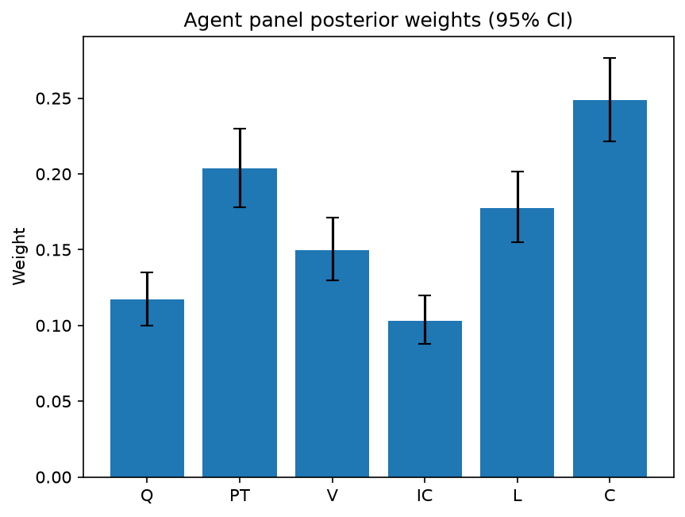

# Survey report: TrustRouter Claude CLI Panel (sonnet) -- Level L2: Six trust dimensions inside DVS

Survey ID: `trustrouter-claude-cli-full-panel-claude-sonnet-2026-09-01-L2`

## Agent panel

- Agents contributing a valid response: 36
- Classical BWM consistency: 36/36 within threshold

| Criterion | Mean | 95% CI lower | 95% CI upper |
|---|---|---|---|
| Q | 0.1173 | 0.0999 | 0.1352 |
| PT | 0.2035 | 0.1778 | 0.2296 |
| V | 0.1499 | 0.1299 | 0.1713 |
| IC | 0.1032 | 0.0880 | 0.1196 |
| L | 0.1775 | 0.1550 | 0.2016 |
| C | 0.2486 | 0.2213 | 0.2767 |

## Methodology

Each agent independently completed a Best-Worst Method (BWM) comparison: choosing the single most and least important criterion, then rating every criterion's importance relative to those two on a 1-9 scale. Individual responses were solved with the classical BWM linear program (Rezaei, 2015) for a consistency check, and combined across the panel with a hierarchical Bayesian model (Mohammadi and Rezaei, 2020).

36 agent response(s) were accepted into this result.

Every agent's run began with a QA precheck (its stated configuration verified against ground truth) and every accepted answer's self-reported sources were checked against what reference material was actually available to it; see the Per-agent detail section below and this survey's Conversation Log for each agent's specific results. Every response is schema-validated and independently, repeatedly sampled (never a single completion treated as ground truth); see `guardrails.py`. This survey's complete output is covered by a SHA-256 integrity manifest (`integrity_manifest.json`, `SHA256SUMS`), generated once this run finished, so any later alteration to these files is detectable.

### Charts

## Per-agent detail

### bim-coordinator-base-claude (`bim-coordinator-base-claude`)

- Role: BIM Coordinator
- Model: claude_cli/sonnet
- DID: `did:key:z6MkwaD5PfneZEDso4t2zzYoPEj2qoTJMvwL6gsjm7sm4KYw`
- QA precheck: passed
- Sources used: shared knowledge: trustrouter_expert_questionnaire_v5_real_survey_instrument.md, general_knowledge

**Answer:** `{"best": "C", "worst": "IC", "best_to_others": {"Q": 2, "PT": 2, "V": 4, "IC": 8, "L": 3, "C": 1}, "others_to_worst": {"Q": 4, "PT": 5, "V": 2, "IC": 1, "L": 3, "C": 8}}`

**Reasoning:**

As a BIM coordinator, I read Criticality (C) as the dimension that governs how much scrutiny the other five even need: a structural calculation or fire-life-safety compliance record for a hospital deep-renovation demands near-maximal provenance, verification and confirmation, whereas a cosmetic finish note does not, regardless of how 'clean' or well-signed it is. That risk-weighting logic is exactly how I prioritize clash detection, model QA, and lifecycle documentation effort on live projects -- life-safety and structural systems get disproportionate review relative to low-consequence elements. Provenance Trust (PT) is the closest runner-up: knowing the record came from a chartered engineer or accredited party under documented custody (per the glossary's 'Signed report from a chartered structural engineer' example) is the practical backbone of trust in construction handover, so I set C only 2x PT rather than a wide gap. Quality (Q, e.g. IFC-valid coordination models) is a necessary hygiene factor for any federated BIM to be usable at all, but on its own it doesn't establish who is accountable or how big the downside of an error is, so it sits below PT. Legal Compliance (L) matters for a public asset serving insurers and authorities for decades (per the reference scenario), but I judge it as a status/obligation flag rather than a direct measure of data trustworthiness -- a record can be fully compliant yet low-value, or highly trustworthy yet not itself a regulated deliverable -- so it ranks below Q and PT. Verification Strength (V, cryptographic/procedural audit evidence) is the mechanism most specific to a blockchain-storage decision, but in current multi-stakeholder construction practice it is still often thin or inconsistently applied compared to established professional provenance chains, so I rank it below L. Independent Confirmation (IC) is Worst: in my experience federating models across disciplines, most authoritative construction records (a single engineer's stamped calc, a single lab certificate) are trusted on the strength of PT+V alone; obtaining genuine independent multi-party confirmation of the same fact is the least practically available and least commonly relied-upon trust signal, making it the weakest lever of the six even though it is not worthless. The V-vs-L ordering is a genuinely close call in my judgement, since both concern institutional/regulatory trust mechanisms rather than the intrinsic content of the data itself, and either could plausibly be swapped with a different project's specific insurer or authority requirements.

### bim-coordinator-base-claude (`bim-coordinator-base-claude`)

- Role: BIM Coordinator
- Model: claude_cli/sonnet
- DID: `did:key:z6MkwaD5PfneZEDso4t2zzYoPEj2qoTJMvwL6gsjm7sm4KYw`
- QA precheck: passed
- Sources used: shared knowledge: trustrouter_expert_questionnaire_v5_real_survey_instrument.md, general_knowledge

**Answer:** `{"best": "Q", "worst": "V", "best_to_others": {"Q": 1, "PT": 2, "V": 6, "IC": 5, "L": 4, "C": 3}, "others_to_worst": {"Q": 6, "PT": 5, "V": 1, "IC": 2, "L": 3, "C": 4}}`

**Reasoning:**

From a BIM coordinator's daily vantage point managing federated multi-stakeholder models, Quality (Q) is Best because it is the literal precondition for everything else in my workflow: an IFC-valid, dimensionally coordinated, clash-checked model (per the shared-knowledge definition of Q as 'intrinsic and contextual fidelity') is what makes federation and clash detection possible at all. If the geometry/metadata is wrong, provenance, legal status, or cryptographic proof attached to it are moot -- you'd just be certifying bad data. Provenance Trust (PT) ranks second because in a federated environment I am constantly reconciling models authored by different disciplines/firms, and knowing who created a submodel and its custody chain (e.g., a signed chartered-engineer report, per the shared-knowledge example) is how I decide whether to trust an incoming federation input before I even run QA on it. Criticality (C) and Legal Compliance (L) follow: both matter a great deal on a hospital renovation (structural/life-safety and regulatory documentation), but they function more as risk/threshold flags that tell me *how much* scrutiny a record deserves, rather than being evidence of trustworthiness in themselves -- a highly critical or heavily regulated record can still be low-quality or poorly sourced. Independent Confirmation (IC) sits below those: multi-party agreement is valuable (it resembles cross-discipline clash checking) but in practice most construction records are trusted on the strength of a single accountable, signed source rather than requiring independent duplication, so it's a useful but secondary signal. Verification Strength (V) is Worst in my judgment: cryptographic/procedural audit evidence (qualified e-signatures, tamper-evidence per the shared-knowledge definition) is essentially a technology-layer property of the blockchain infrastructure, typically owned by IT/security specialists rather than something a BIM coordinator evaluates when deciding whether a model or document is trustworthy for coordination purposes. It reinforces trust after the fact but does not itself tell me whether the underlying construction data is accurate, well-sourced, compliant, or consequential -- those are the judgments I actually have to make. I acknowledge this is a genuinely close call between V and IC for Worst, since both are somewhat auxiliary to core data trustworthiness; I settled on V as strictly the least central to my own coordination judgment.

### bim-coordinator-base-claude (`bim-coordinator-base-claude`)

- Role: BIM Coordinator
- Model: claude_cli/sonnet
- DID: `did:key:z6MkwaD5PfneZEDso4t2zzYoPEj2qoTJMvwL6gsjm7sm4KYw`
- QA precheck: passed
- Sources used: shared knowledge: trustrouter_expert_questionnaire_v5_real_survey_instrument.md, general_knowledge

**Answer:** `{"best": "C", "worst": "IC", "best_to_others": {"Q": 3, "PT": 2, "V": 6, "IC": 8, "L": 5, "C": 1}, "others_to_worst": {"Q": 5, "PT": 6, "V": 2, "IC": 1, "L": 3, "C": 8}}`

**Reasoning:**

As a BIM coordinator federating models across structural, MEP, energy and compliance disciplines on long-life public assets, the factor that most changes how much scrutiny a data point deserves is Criticality (C): a wrong clash-detection note on a cosmetic finish costs rework, but a wrong structural load or fire-rating value can trigger life-safety failure, insurance disputes, or a stop-work order years into the asset's life. C is therefore the meta-factor that should govern how much of the other trust apparatus (provenance checks, verification, independent review) is actually warranted for a given record, which is why I chose it as Best. Provenance Trust (PT) comes next because in construction practice liability and acceptance hinge on who signed and had custody of a record (per the shared knowledge repo's definition: 'trust in who created the data and custody until handover', e.g. a signed report from a chartered structural engineer) -- this is close behind Criticality since even a criticality assessment is only as good as the credibility of who made it. Quality (Q) -- 'intrinsic and contextual fidelity of the record' such as IFC-valid coordination models per the shared knowledge repo -- ranks next: it's necessary for usability and is the thing BIM coordinators check most routinely via clash detection and validation tooling, but a technically clean file from an unaccountable source is still a liability, so I rank it below PT. Legal Compliance (L) matters greatly for the subset of deliverables that are actually regulated (permits, energy certificates, conformity documents) but much day-to-day BIM coordination data is not itself legally mandated, so it sits in the middle. Verification Strength (V) -- cryptographic/procedural audit evidence per the shared knowledge repo -- is valuable for proving non-tampering and chain of custody, which matters specifically for the blockchain use case, but it proves integrity of the record, not the truth of its content, so in my professional judgement it is secondary to who produced the data and how critical it is. Independent Confirmation (IC) is Worst: in real multi-stakeholder construction workflows, most records have a single authoritative source (one chartered engineer's sign-off, one lab test), and routinely obtaining multiple independent confirmations is uncommon and costly outside of the highest-stakes items -- and those highest-stakes items are already captured by Criticality. This is a genuinely close call between IC and V for last place, since neither is a baseline requirement in everyday practice, but I judge IC as marginally less operationalized in current construction workflows than cryptographic verification, which at least maps onto concrete audit-trail practices already used for BIM handover packages (e.g. digital signatures on IFC deliverables). The ratings reflect an approximate ranking C > PT > Q > L > V > IC with increasing gaps toward the bottom, acknowledging this is a professional judgement call rather than a measured quantity.

### bim-coordinator-rag-claude (`bim-coordinator-rag-claude`)

- Role: BIM Coordinator
- Model: claude_cli/sonnet
- DID: `did:key:z6MkqSfDfSA3Y6V2HcU6A72f4t469gxYRVPTADrJ7HzYtu7a`
- QA precheck: passed
- Sources used: bim_and_digital_building_logbooks.md, SOURCES.md, shared knowledge: trustrouter_expert_questionnaire_v5_real_survey_instrument.md, general_knowledge

**Answer:** `{"best": "C", "worst": "V", "best_to_others": {"Q": 2, "PT": 3, "V": 6, "IC": 3, "L": 2, "C": 1}, "others_to_worst": {"Q": 5, "PT": 4, "V": 1, "IC": 4, "L": 5, "C": 6}}`

**Reasoning:**

As a BIM coordinator I judge Criticality (C, impact if wrong) as the master variable that determines how much of the other five dimensions a given construction record actually needs. A signed structural certification with life-safety implications warrants top-tier quality control, provenance chain, verification evidence, cross-discipline confirmation, and legal rigor; a minor finish-schedule note does not, even if it scores identically on those other five dimensions. This matches Gartoumi 2024's finding (SOURCES.md; bim_and_digital_building_logbooks.md) that the construction industry still lacks rigorous, calibrated decision criteria for when blockchain-backed storage is warranted -- in practice, criticality is the variable that should drive that triage decision, which is why I treat it as the dominant factor. Quality (Q) and Legal Compliance (L) come next and close together: clean, ISO-25012-type data and regulatory necessity are both near-mandatory gates in federation work, but neither tells you how much scrutiny is warranted the way criticality does. Provenance Trust (PT) and Independent Confirmation (IC) sit a step below: PT (who produced it, chain of custody) matters for accountability, and IC is already partly institutionalised in real BIM practice -- ISO 19650 Part 2 (bim_and_digital_building_logbooks.md) requires the lead appointed party and task teams to independently validate federated models before acceptance, so IC's real-world mechanism is already a standard checkpoint rather than a novel trust signal blockchain would need to add much to. I placed Verification Strength (V, cryptographic/procedural audit evidence) as worst because it is the most instrumental of the six: a qualified electronic signature or tamper-evidence dossier (as described in the survey instrument's own DVS definitions, shared knowledge: trustrouter_expert_questionnaire_v5_real_survey_instrument.md) is a technical means of attesting to trust that already exists in the data's quality, provenance, and confirmation status -- it adds assurance but does not itself establish whether the underlying construction fact is sound. A perfectly cryptographically signed record can still be technically dirty, wrongly attributed, or unconfirmed by peer disciplines, whereas the reverse (high quality/provenance/confirmation with weak verification tooling) is still fairly trustworthy in practice on most renovation projects I have coordinated. I set the Criticality-vs-Verification ratio at 6 in both tables since that is the same direct comparison (Best vs Worst) and I wanted internal consistency there; the middle criteria are spread between those anchors reflecting that this is a genuinely close, judgment-call ordering among Q, L, PT and IC rather than a sharp hierarchy -- a reviewer could reasonably swap Q and L, or PT and IC, without me strongly objecting.

### bim-coordinator-rag-claude (`bim-coordinator-rag-claude`)

- Role: BIM Coordinator
- Model: claude_cli/sonnet
- DID: `did:key:z6MkqSfDfSA3Y6V2HcU6A72f4t469gxYRVPTADrJ7HzYtu7a`
- QA precheck: passed
- Sources used: bim_and_digital_building_logbooks.md, SOURCES.md, shared knowledge: trustrouter_expert_questionnaire_v5_real_survey_instrument.md, general_knowledge

**Answer:** `{"best": "C", "worst": "V", "best_to_others": {"C": 1, "L": 2, "PT": 3, "IC": 4, "Q": 5, "V": 7}, "others_to_worst": {"C": 7, "L": 6, "PT": 5, "IC": 4, "Q": 3, "V": 1}}`

**Reasoning:**

As a BIM coordinator, I approach these six DVS constituents the way I approach a project risk register: the question that dominates my professional judgement is not 'is this record technically perfect' but 'what happens if this specific record is wrong.' Criticality (C) is Best because it is the multiplier that determines how much scrutiny every other dimension deserves in practice -- a structural load-bearing certification or fire-safety compliance record justifies far more provenance/verification effort than a finishes schedule, and BIM execution plans under ISO 19650 are organised around exactly this kind of risk-tiering (shared knowledge: bim_and_digital_building_logbooks.md, ISO 19650 Part 2 guidance). Legal Compliance (L) sits close behind C because regulated documentation (energy certificates, structural sign-offs) is often exactly the subset of records that is also high-criticality, so the two track each other closely in a renovation/handover context -- this is a genuinely close call, not a clear gap. Provenance Trust (PT) ranks next: knowing which chartered professional or task team authored and held custody of a model is the backbone of federation accountability, and is directly reinforced by the Kochovski et al. 2026 BUILDCHAIN DBL work on decentralized identifiers for construction records (bim_and_digital_building_logbooks.md). Independent Confirmation (IC) is meaningful but in my day-to-day practice it is already partly built into the federation process itself -- ISO 19650 requires the lead appointed party and task teams to independently validate federated models before acceptance (bim_and_digital_building_logbooks.md), so IC functions somewhat as a byproduct of good PT and Q rather than a fully independent lever. Quality (Q) is a necessary baseline (an IFC-invalid model is unusable regardless of who signed it or how it was verified) but it is a floor condition rather than a differentiator of trust once that floor is met, so it ranks below the risk- and accountability-oriented dimensions. Verification Strength (V) is Worst in my judgement: cryptographic/audit-trail mechanisms are an implementation layer that supports and evidences provenance and compliance, but a BIM coordinator's actual trust in a record rests far more on who produced it, whether it's the legally required document, and what's at stake if it's wrong, than on the specific strength of the cryptographic scheme wrapping it -- the Gartoumi 2024 scientometric review (SOURCES.md) also notes the construction industry still lacks calibrated criteria for when blockchain-grade verification is even warranted, reinforcing that V is the most narrowly technology-specific and least professionally central of the six.

### bim-coordinator-rag-claude (`bim-coordinator-rag-claude`)

- Role: BIM Coordinator
- Model: claude_cli/sonnet
- DID: `did:key:z6MkqSfDfSA3Y6V2HcU6A72f4t469gxYRVPTADrJ7HzYtu7a`
- QA precheck: passed
- Sources used: bim_and_digital_building_logbooks.md, shared knowledge: trustrouter_expert_questionnaire_v5_real_survey_instrument.md, general_knowledge

**Answer:** `{"best": "C", "worst": "Q", "best_to_others": {"C": 1, "Q": 8, "PT": 3, "V": 4, "IC": 6, "L": 2}, "others_to_worst": {"C": 8, "Q": 1, "PT": 6, "V": 5, "IC": 3, "L": 7}}`

**Reasoning:**

As a BIM coordinator, I treat Criticality (C) as the governing dimension because it sets the stakes that determine how much investment in the other five dimensions is warranted: a structural-safety certification or fire-compliance record on a decades-long public asset (per the 'Hospital Real' reference scenario in shared knowledge: trustrouter_expert_questionnaire_v5_real_survey_instrument.md) demands maximal provenance, verification, and confirmation, while a low-consequence finish spec does not, regardless of how clean or well-signed it is. This was genuinely a close call against Legal Compliance (L), since regulatory mandate is often the concrete reason a construction record must be retained at all (structural certs, EPCs, permits) -- I rank C narrowly above L because criticality captures consequence even for records that aren't formally regulated but would still be catastrophic if wrong (e.g., an unregulated but load-bearing coordination clash), whereas legal mandate alone doesn't guarantee high real-world impact. Provenance Trust (PT) and Verification Strength (V) sit in the middle: they are the properties blockchain storage is specifically good at hardening (custody chain, cryptographic/audit evidence), which matters, but they answer 'can we trust the record' only after criticality and legal necessity have justified spending the effort. Independent Confirmation (IC) I rate lower-middle because, per bim_and_digital_building_logbooks.md's discussion of ISO 19650, multi-party validation of federated models before acceptance is already a baseline institutional mechanism in standard BIM delivery -- it's a real and useful signal, but it is partially redundant with processes already built into the information-delivery workflow rather than something blockchain storage newly provides. Quality (Q) is my Worst: 'technically clean' (IFC-valid, no clashes) is routinely enforced through standard model-checking tools (Solibri, Navisworks-style validation) as production hygiene, and clean data can still come from an unverified, unaccountable source -- whereas messy but highly critical, legally-mandated, well-provenanced data would still justify immutable storage. Quality is necessary hygiene but the least decisive factor in the specific question of whether a record deserves blockchain-grade trust infrastructure.

### blockchain-engineer-base-claude (`blockchain-engineer-base-claude`)

- Role: Blockchain / DLT Engineer
- Model: claude_cli/sonnet
- DID: `did:key:z6MkiXdPHgRKLgsWGCi5P19sNTrHqFjySf3d9JD1BYLAirtk`
- QA precheck: passed
- Sources used: shared knowledge: trustrouter_expert_questionnaire_v5_real_survey_instrument.md, general_knowledge

**Answer:** `{"best": "V", "worst": "Q", "best_to_others": {"Q": 8, "PT": 2, "V": 1, "IC": 3, "L": 2, "C": 2}, "others_to_worst": {"Q": 1, "PT": 5, "V": 8, "IC": 4, "L": 5, "C": 6}}`

**Reasoning:**

As a blockchain/DLT engineer evaluating what actually justifies routing construction-project data onto a tamper-evident ledger, Verification Strength (V) is the criterion most directly tied to what DLT infrastructure technically provides: per the shared glossary, V is 'strength of cryptographic and procedural audit evidence' (e.g., a qualified electronic-signature dossier plus tamper-evidence). That is precisely the property a ledger adds that conventional storage cannot -- it is the engineering payload of the whole exercise, so I rank it Best. Criticality, Provenance Trust and Legal Compliance are all close seconds (rated 2x V) because in practice they co-determine how much verification rigor is warranted -- high-impact, regulated, or high-provenance-risk records are exactly the ones where strong cryptographic evidence earns its cost -- but none of them is itself the technical mechanism that delivers trust, so they sit below V. Independent Confirmation (rated 3x V) is valuable (multi-party attestation reduces single-point manipulation) but is a procedural supplement to, not a substitute for, cryptographic verification, so it ranks slightly lower still. Quality (Q) is Worst: 'intrinsic and contextual fidelity' (e.g., an IFC-valid model) is a necessary precondition for any data to be useful at all, but it is largely orthogonal to the blockchain-specific value proposition -- a technically clean file gains no additional trust from being on-chain, and a technically messy file is not made trustworthy by verification strength either. For the specific decision this survey frames (full on-chain vs hybrid vs conventional routing), Q is the dimension whose value is least changed by the presence or absence of DLT, which is why I rate the Best/Worst gap (V vs Q) at the high end of the scale. I want to flag that PT, L, IC and C are genuinely close to each other in importance from this role's perspective -- the ranking among them is a much closer call than the V-vs-Q extremes, and a different engineer weighting regulatory exposure more heavily could plausibly swap L or C ahead of PT.

### blockchain-engineer-base-claude (`blockchain-engineer-base-claude`)

- Role: Blockchain / DLT Engineer
- Model: claude_cli/sonnet
- DID: `did:key:z6MkiXdPHgRKLgsWGCi5P19sNTrHqFjySf3d9JD1BYLAirtk`
- QA precheck: passed
- Sources used: shared knowledge: trustrouter_expert_questionnaire_v5_real_survey_instrument.md, general_knowledge

**Answer:** `{"best": "V", "worst": "Q", "best_to_others": {"Q": 6, "PT": 2, "V": 1, "IC": 2, "L": 4, "C": 3}, "others_to_worst": {"Q": 1, "PT": 4, "V": 6, "IC": 4, "L": 2, "C": 3}}`

**Reasoning:**

From a blockchain/DLT engineering standpoint, the core technical value-add of putting construction data on a ledger is tamper-evidence: cryptographic signatures, hash-anchoring, and procedural audit trails that let a verifier later prove a record has not been altered since custody. That is exactly what 'Verification Strength (V)' captures per the shared glossary ('strength of cryptographic and procedural audit evidence', e.g. qualified electronic signature dossier + tamper-evidence), so I rate it Best -- it is the dimension a DLT deployment is uniquely positioned to strengthen, as opposed to a dimension the ledger merely records or depends on externally. Provenance Trust (PT) and Independent Confirmation (IC) are close seconds and genuinely close to each other in my judgement: PT (trust in who created/custodied the data) and IC (multiple independent parties agreeing) both map onto standard DLT design concerns -- identity/attestation schemes and multi-party consensus/oracle corroboration -- so I gave them the same ratio (2) rather than forcing an artificial split. Criticality (C) matters for deciding whether the routing effort is worthwhile at all, but it is a consequence-of-being-wrong measure, not itself a trust mechanism, so it sits below V/PT/IC. Legal Compliance (L) is a real driver in construction (e.g. digital building logbooks, conformity assessment, GDPR per the shared glossary's Q-A5 topics), but it is an external mandate rather than an intrinsic trust property of the data or the ledger, so I placed it below Criticality. Quality (Q) -- 'intrinsic and contextual fidelity of the record' -- I rated Worst: this is a well-understood limitation in the DLT literature (commonly discussed as the 'garbage-in-garbage-out' / oracle problem) -- a ledger can make a record's custody and immutability verifiable, but it cannot verify or improve the semantic/technical correctness of the data itself (e.g., whether an IFC model is engineering-sound). That is a data-engineering concern that exists whether or not the record ever touches a chain, so relative to the other five dimensions it is least specific to the trust-in-a-ledger question this survey is probing. I want to flag this as a judgement call rather than settled fact: PT vs IC being tied, and C vs L being close, both reflect genuinely close comparisons in my professional assessment rather than a sharp, confident ordering.

### blockchain-engineer-base-claude (`blockchain-engineer-base-claude`)

- Role: Blockchain / DLT Engineer
- Model: claude_cli/sonnet
- DID: `did:key:z6MkiXdPHgRKLgsWGCi5P19sNTrHqFjySf3d9JD1BYLAirtk`
- QA precheck: passed
- Sources used: shared knowledge: trustrouter_expert_questionnaire_v5_real_survey_instrument.md, general_knowledge

**Answer:** `{"best": "C", "worst": "IC", "best_to_others": {"Q": 6, "PT": 3, "V": 2, "IC": 8, "L": 4, "C": 1}, "others_to_worst": {"Q": 3, "PT": 6, "V": 7, "IC": 1, "L": 5, "C": 8}}`

**Reasoning:**

As a blockchain/DLT engineer evaluating trust dimensions for routing construction records onto a permissioned ledger, I chose Criticality (C) as Best because it functions as the risk-multiplier that determines how much assurance the other five dimensions actually need to deliver: a structural safety certificate or load-bearing inspection record where being wrong causes major harm justifies the cost of full on-chain treatment regardless of how 'clean' or well-provenanced it is, whereas a low-impact record doesn't warrant that investment even with perfect quality and provenance. This is a risk-based prioritization logic consistent with general engineering risk-management practice (impact-weighted assurance, as in the ISO 31000 risk-management framework) rather than something drawn from the provided survey material itself -- I flag it here as general_knowledge, not a citation to the instrument. Verification Strength (V) ranks second because it is the dimension closest to blockchain's actual technical value proposition -- per the shared glossary, V is 'strength of cryptographic and procedural audit evidence' (e.g. qualified electronic signature dossier + tamper-evidence), which is the mechanism that makes any trust claim about the data checkable and durable on a ledger. Provenance Trust (PT) ranks third: per the glossary it captures 'trust in who created the data and custody until handover' (e.g. a signed report from a chartered structural engineer) -- necessary groundwork for verification to mean anything, but a step removed from the cryptographic guarantee itself. Legal Compliance (L) ranks fourth: regulatory mandates create an obligation to retain/trust certain records, but compliance status doesn't by itself measure how trustworthy the record is, only whether trust is required. Quality (Q) -- 'intrinsic and contextual fidelity' such as an IFC-valid model -- ranks fifth: it matters, but technical cleanliness issues are typically easier to detect and remediate after the fact than gaps in who created the data or how well that claim is cryptographically evidenced. I selected Independent Confirmation (IC) as Worst because, in a permissioned-ledger context where participant identity and provenance are already established via PKI/credentialing, requiring multiple independent parties to separately corroborate a record adds substantial coordination and cost for a comparatively marginal trust increment once strong verification (V) and provenance (PT) are already in place -- it is the most redundant and least load-bearing of the six for a routing decision. I want to flag this is a genuinely close call between IC and Q for last place, and between C and V for first place -- the multiplicative TrustRouter architecture (DVS x F x (1+E) x A) doesn't itself dictate which DVS sub-dimension should dominate, so this ranking reflects professional judgement about risk-tiering and blockchain's evidentiary mechanics rather than a value stated outright in the instrument.

### blockchain-engineer-rag-claude (`blockchain-engineer-rag-claude`)

- Role: Blockchain / DLT Engineer
- Model: claude_cli/sonnet
- DID: `did:key:z6MkopvxUWWWCS4idsrstN99GZf9TsfLRkdw69bu1hJ8anGq`
- QA precheck: passed
- Sources used: blockchain_trust_and_attack_resistance.md, shared knowledge: trustrouter_expert_questionnaire_v5_real_survey_instrument.md, general_knowledge

**Answer:** `{"best": "V", "worst": "Q", "best_to_others": {"Q": 8, "PT": 2, "V": 1, "IC": 4, "L": 5, "C": 6}, "others_to_worst": {"Q": 1, "PT": 6, "V": 8, "IC": 5, "L": 4, "C": 3}}`

**Reasoning:**

As a blockchain/DLT engineer, the specific value a permissioned ledger adds over a conventional database is tamper-evidence: cryptographic signatures, hash-chaining, and audit-trail completeness that let a verifier prove a record hasn't been altered after the fact. That is exactly what Verification Strength (V) captures, and it's the dimension I as an engineer am directly responsible for designing and can most directly influence (choice of signature scheme, consensus threshold, endorsement policy). Reference material [blockchain_trust_and_attack_resistance.md] on Rouhani and Deters (2021) reinforces this: their Hyperledger Fabric trust framework uses a computed trust value to adaptively gate how much cryptographic/consensus evidence (adaptive transaction validation, full Byzantine consensus vs. fewer signatures) a transaction needs -- i.e., verification strength is treated as the lever that operationalizes trust on-chain, which is why I rank it Best. Provenance Trust (PT) is the next most important because it is verification's natural precondition (you need a trustworthy, identifiable signer/custody chain before a cryptographic proof means anything), so I placed it close to V (ratio 2). Independent Confirmation (IC) matters because it mitigates the oracle problem the same source discusses for A_oracle -- no single attesting device/party should be blindly trusted -- but IC is a redundancy/consensus-of-facts concern rather than the cryptographic mechanism itself, so it sits in the middle. Legal Compliance (L) and Criticality (C) are important routing inputs (they tell you how much verification effort is warranted and whether storage is mandated) but they are drivers of policy/resource allocation rather than trust-evidence dimensions in themselves, so I rank them lower. I placed Quality (Q) as Worst: intrinsic/contextual data cleanliness (per the definition in [shared knowledge: trustrouter_expert_questionnaire_v5_real_survey_instrument.md]) is a data-engineering/ETL concern that is largely orthogonal to whether a record's origin and integrity can be cryptographically proven -- a blockchain can immutably and verifiably record data that is nonetheless low-quality (garbage-in-verifiably-stored-forever), so from a pure trust-in-the-ledger perspective it contributes least to the six dimensions' core purpose. This is a judgement call reflecting my engineering vantage point, not a claim that data quality is unimportant in absolute terms -- the comparison between L and C in the middle of the ranking is genuinely close and could plausibly be reordered by another reviewer.

### blockchain-engineer-rag-claude (`blockchain-engineer-rag-claude`)

- Role: Blockchain / DLT Engineer
- Model: claude_cli/sonnet
- DID: `did:key:z6MkopvxUWWWCS4idsrstN99GZf9TsfLRkdw69bu1hJ8anGq`
- QA precheck: passed
- Sources used: blockchain_trust_and_attack_resistance.md, shared knowledge: trustrouter_expert_questionnaire_v5_real_survey_instrument.md, general_knowledge

**Answer:** `{"best": "V", "worst": "Q", "best_to_others": {"Q": 6, "PT": 2, "V": 1, "IC": 3, "L": 5, "C": 4}, "others_to_worst": {"Q": 1, "PT": 5, "V": 6, "IC": 4, "L": 2, "C": 3}}`

**Reasoning:**

As a blockchain/DLT engineer, the question a ledger is actually built to answer is 'can this specific record be trusted not to have been altered, and can that be proven cryptographically/procedurally' -- that is exactly Verification Strength (V), defined in the questionnaire as 'strength of cryptographic and procedural audit evidence' (shared knowledge: trustrouter_expert_questionnaire_v5_real_survey_instrument.md). The Rouhani & Deters 2021 framework summarized in blockchain_trust_and_attack_resistance.md makes this concrete: their adaptive transaction validation directly ties audit-trail/trust strength to how much consensus a transaction needs (low trust -> full Byzantine consensus), which is the core engineering lever a permissioned-ledger deployment actually has to spend or save throughput on. That makes V the dimension most directly load-bearing for a routing decision about whether data belongs on-chain, hybrid, or off-chain. Provenance Trust (who produced it, custody) and Independent Confirmation (multi-party agreement, related to BFT-style consensus) are close runners-up because they feed into the same evidentiary chain V formalizes, so I rated them close to V (ratios 2 and 3) rather than far from it -- this is a genuinely close call among V/PT/IC, not a clean separation. Criticality and Legal Compliance matter for prioritization and mandatory retention but are business/risk-driven rather than technical-trust-evidentiary, so I placed them lower. Quality (Q) -- intrinsic/contextual data cleanliness -- is my Worst: a permissioned ledger's immutability and tamper-evidence guarantees apply equally to a well-formed record and a garbage one; the chain does not fix garbage-in-garbage-out, so Q is the weakest signal of *trustworthiness* among the six even though it clearly matters for other purposes (e.g., BIM/IFC coordination usability). This ranking is my own professional judgement applied to the definitions given, not something read directly out of a source, so I flag it as engineering reasoning rather than a cited finding.

### blockchain-engineer-rag-claude (`blockchain-engineer-rag-claude`)

- Role: Blockchain / DLT Engineer
- Model: claude_cli/sonnet
- DID: `did:key:z6MkopvxUWWWCS4idsrstN99GZf9TsfLRkdw69bu1hJ8anGq`
- QA precheck: passed
- Sources used: shared knowledge: trustrouter_expert_questionnaire_v5_real_survey_instrument.md, blockchain_trust_and_attack_resistance.md, general_knowledge

**Answer:** `{"best": "V", "worst": "Q", "best_to_others": {"Q": 6, "PT": 2, "V": 1, "IC": 2, "L": 4, "C": 3}, "others_to_worst": {"Q": 1, "PT": 4, "V": 6, "IC": 4, "L": 3, "C": 4}}`

**Reasoning:**

From a permissioned-ledger engineering standpoint, Verification Strength (V) is the dimension a blockchain actually delivers on: cryptographic signatures, hash-chained audit trails, and tamper-evident custody records are exactly what a DLT platform can technically prove, and are the reason to route a record to a ledger at all rather than a conventional database. The shared survey instrument defines V as 'strength of cryptographic and procedural audit evidence' (e.g. qualified electronic signature + tamper-evidence), which is squarely in a DLT engineer's domain. This is reinforced by blockchain_trust_and_attack_resistance.md's summary of Rouhani and Deters (2021), whose adaptive-validation framework ties the amount of consensus/signature effort a transaction needs directly to measurable trust/audit evidence -- i.e. verification evidence is the actionable lever, not an abstract label. I rated V close to PT and IC (ratio 2 each) because in practice provenance trust is largely established through verification artifacts (signed identity, custody chain) and independent confirmation is best understood as distributed/multi-party verification -- the same source material notes IoT trust research treats device attestation as exactly the oracle-problem instance V is meant to resist, so PT and IC are near-siblings of V rather than distant concerns. Criticality (C) I placed a bit further out (ratio 3 from V): it is a real driver of how much verification effort is warranted (high-impact records deserve stronger evidence), but it describes consequence-of-error, not evidence-of-trust, so it is one step more removed from the ledger's core technical contribution. Legal Compliance (L) I placed further still (ratio 4): regulatory mandates matter and often motivate immutable record-keeping, but compliance is an externally-imposed policy requirement rather than a technical trust signal a blockchain engineer verifies directly. Quality (Q) is Worst: the definition given ('IFC-valid coordination model', intrinsic/contextual fidelity) is a content-correctness property that a ledger cannot itself adjudicate -- a cryptographically well-verified record can still contain poor-quality content, and a high-quality file can still be unverifiable or forged. Blockchain tooling addresses authenticity and immutability of what was recorded, not whether the recorded content is well-formed, so Q is the dimension least central to a DLT engineer's trust assessment, though it is not unimportant in absolute terms -- this is a genuine judgment call and the V-versus-PT/IC gap in particular is a close one that a different engineer emphasizing identity/PKI risk could reasonably score the other way.

### compliance-officer-base-claude (`compliance-officer-base-claude`)

- Role: Compliance and Regulatory Officer
- Model: claude_cli/sonnet
- DID: `did:key:z6MkwUN3K4YmG9arhbzyAxMLs314eLG46wmPnKoYLVUT8Rzm`
- QA precheck: passed
- Sources used: shared knowledge: trustrouter_expert_questionnaire_v5_real_survey_instrument.md, shared knowledge: trustrouter_concept_paper_primer.md, general_knowledge

**Answer:** `{"best": "L", "worst": "Q", "best_to_others": {"Q": 6, "PT": 4, "V": 3, "IC": 5, "L": 1, "C": 2}, "others_to_worst": {"Q": 1, "PT": 3, "V": 4, "IC": 2, "L": 6, "C": 5}}`

**Reasoning:**

Answering as a facility-management compliance officer whose mandate is GDPR and construction-regulatory obligations across the building lifecycle: Legal Compliance (L) is Best because it maps directly onto my role's core duty -- a datum tied to a binding statutory or building-code obligation (per shared knowledge: trustrouter_expert_questionnaire_v5_real_survey_instrument.md, e.g. 'mandatory building-code or energy performance disclosure class') is the one dimension I am personally accountable for enforcing, and failure here creates direct legal exposure regardless of how technically clean the record is. Criticality (C) is a close second because impact-if-wrong (safety, financial, contractual, e.g. life-safety structural dependence) so often converts into legal liability that in my role it is hard to separate from L -- I rate it only one step below Best, reflecting that this was a genuinely close call. Verification Strength (V) and Provenance Trust (PT) follow because GDPR's accountability principle and construction audit practice both depend on tamper-evident audit trails and known, custody-tracked authorship to defend compliance decisions after the fact -- these are the evidentiary backbone of a defensible compliance file, so I rank them above Independent Confirmation (IC), which adds valuable but secondary cross-checking assurance. Quality (Q) is Worst not because it is unimportant in absolute terms, but because from a compliance-risk lens it is the most 'baseline' and least regulation-specific of the six: the questionnaire itself treats Q's intrinsic/contextual fidelity as a separate downstream decomposition (IQ/CQ clusters), and a technically clean record with no legal hook, no audit trail, and no accountable provenance still fails my compliance test, whereas a record with strong L/PT/V/C but middling Q is far more defensible. This ranking is my own professional judgement applied to the definitions given in the shared knowledge; I did not find a specific ranking of these six dimensions prescribed in the reference material itself, so I am the one supplying the ordering logic, not restating a given answer.

### compliance-officer-base-claude (`compliance-officer-base-claude`)

- Role: Compliance and Regulatory Officer
- Model: claude_cli/sonnet
- DID: `did:key:z6MkwUN3K4YmG9arhbzyAxMLs314eLG46wmPnKoYLVUT8Rzm`
- QA precheck: passed
- Sources used: shared knowledge: trustrouter_expert_questionnaire_v5_real_survey_instrument.md, shared knowledge: trustrouter_concept_paper_primer.md, general_knowledge

**Answer:** `{"best": "L", "worst": "Q", "best_to_others": {"Q": 7, "PT": 3, "V": 4, "IC": 4, "L": 1, "C": 2}, "others_to_worst": {"Q": 1, "PT": 4, "V": 4, "IC": 4, "L": 7, "C": 6}}`

**Reasoning:**

Reasoning here reflects the construction-project compliance-officer perspective on data destined for blockchain storage. Legal Compliance (L) is Best because a binding statutory or building-code obligation attached to a datum (per shared knowledge: trustrouter_expert_questionnaire_v5_real_survey_instrument.md, e.g. 'mandatory building-code or energy performance disclosure class') creates a non-discretionary duty that overrides technical or procedural considerations -- if a record is legally mandated, it must be captured and preserved regardless of how clean, verified, or corroborated it is, and failure exposes the facility to statutory penalties, license revocation, or GDPR-style enforcement action. Quality (Q) is Worst not because technical cleanliness is unimportant, but because in this hierarchy Quality is a necessary-but-lower-stakes property: a slightly imperfect but legally required, well-provenanced, or critical record is still operationally and legally indispensable, whereas a technically pristine record with no legal weight, weak provenance, and low criticality carries comparatively little trust value on its own -- this matches the concept-paper primer's framing that Q is 'is the data technically clean' as essentially a baseline hygiene factor, further decomposable into ISO 25012 clusters, rather than a driver of trust magnitude. Criticality (C) sits second because life-safety/financial impact strongly conditions how much scrutiny a record deserves, but it is downstream of whether the law itself demands the record. Verification Strength (V) and Independent Confirmation (IC) are treated as roughly comparable mid-tier factors -- both are evidentiary mechanisms (cryptographic/audit trail vs. multi-party agreement) that reinforce trust but do not on their own create an obligation the way L does. Provenance Trust (PT) ranks just below them because knowing 'who produced it' matters but is partially subsumed by V and IC once strong verification and independent confirmation exist. This is a judgement call reflecting a compliance officer's instinct that regulatory/statutory duty is the most decisive trust driver for construction records, and I flag that the L-vs-C and V-vs-IC distinctions in particular were close calls rather than obvious orderings.

### compliance-officer-base-claude (`compliance-officer-base-claude`)

- Role: Compliance and Regulatory Officer
- Model: claude_cli/sonnet
- DID: `did:key:z6MkwUN3K4YmG9arhbzyAxMLs314eLG46wmPnKoYLVUT8Rzm`
- QA precheck: passed
- Sources used: shared knowledge: trustrouter_expert_questionnaire_v5_real_survey_instrument.md, shared knowledge: trustrouter_concept_paper_primer.md, general_knowledge

**Answer:** `{"best": "L", "worst": "IC", "best_to_others": {"Q": 4, "PT": 3, "V": 3, "IC": 6, "L": 1, "C": 2}, "others_to_worst": {"Q": 3, "PT": 4, "V": 4, "IC": 1, "L": 6, "C": 5}}`

**Reasoning:**

Framing this as a construction-project compliance officer's judgement on which trust dimension matters most for a record's inclusion in a blockchain-anchored trust score. I chose Legal Compliance (L) as Best because, per shared knowledge (trustrouter_expert_questionnaire_v5_real_survey_instrument.md and the concept-paper primer), L captures whether the datum carries a binding regulatory or statutory obligation (e.g. mandatory building-code or energy-performance disclosure). From a GDPR/construction-regulatory standpoint, a record's legal status is the threshold question: if a record is mandated by statute (fire-safety certification, structural sign-off, energy performance certificate), its trustworthiness has direct legal and liability consequences regardless of how well-verified it is otherwise, and non-compliance exposes the facility operator to regulatory sanction independent of technical data quality. This is a judgement call reflecting the compliance-officer role rather than a universal fact; a data-value engineer might instead rank Criticality or Verification Strength highest, and I acknowledge that L vs C is a fairly close call given both concern real-world consequences. I chose Independent Confirmation (IC) as Worst because, while corroboration by a second party strengthens confidence, it is the most procedurally nice-to-have of the six in a compliance context: a legally compliant, well-verified, high-provenance record from a chartered professional (per the questionnaire's examples: signed report from a chartered structural engineer, qualified electronic signature dossier) already carries strong evidentiary weight without needing a second independent audit of the same quantities. IC essentially duplicates assurance that PT and V already provide, making it the most marginal dimension for regulatory purposes, though I recognize IC could rank higher in a pure data-science framing (e.g., sensor triangulation). Ratings: L is rated far above IC (6x) reflecting that regulatory obligation is a binary, high-stakes gate compared to the comparatively soft benefit of cross-confirmation. C (Criticality, safety/financial/contractual impact) is rated closely behind L (2x gap) since impact severity and legal obligation are closely linked in a construction-safety context (life-safety structural dependence overlaps heavily with statutory obligation). Q, PT, and V are treated as moderately important (3-4x below L) since they describe technical/procedural trustworthiness that supports but does not replace legal standing.

### compliance-officer-rag-claude (`compliance-officer-rag-claude`)

- Role: Compliance and Regulatory Officer
- Model: claude_cli/sonnet
- DID: `did:key:z6Mkiny4nghtEZgRh1GDTK1uVN3K6yiWKovHursQ4YEVJq2c`
- QA precheck: passed
- Sources used: gdpr_and_data_governance.md, shared knowledge: trustrouter_concept_paper_primer.md, shared knowledge: trustrouter_expert_questionnaire_v5_real_survey_instrument.md, general_knowledge

**Answer:** `{"best": "L", "worst": "Q", "best_to_others": {"Q": 6, "PT": 3, "V": 4, "IC": 5, "L": 1, "C": 2}, "others_to_worst": {"Q": 1, "PT": 4, "V": 3, "IC": 2, "L": 6, "C": 5}}`

**Reasoning:**

As the compliance officer, Legal Compliance (L) is my Best pick because it is the dimension that determines whether a record can or must exist on-chain at all and what liability attaches to it: gdpr_and_data_governance.md's summary of Wilson et al. 2019 frames the core blockchain/GDPR conflict (immutability vs. right-to-erasure) as exactly the question a Legal Compliance assessment must resolve per artefact -- 'does this specific artefact actually need the immutability blockchain provides, or would putting it there create a compliance liability with no offsetting benefit.' The primer (trustrouter_concept_paper_primer.md) is careful to note L2's L is distinct from the Stage-1 legal gate, but the underlying regulatory logic -- mandatory disclosure classes, statutory obligations -- is the same terrain my role is built around, so I weight it highest. Criticality (C) is my Worst-adjacent-to-Best runner-up (ratio only 2, a genuinely close call) because impact severity (life-safety, financial, contractual per the instrument's hospital-roof example) is the other axis regulators and courts actually scale obligations against -- high-criticality items typically also attract the strictest legal regimes, so the two are entangled rather than cleanly separable. Provenance Trust (PT) and Verification Strength (V) matter to compliance (chain of custody, qualified e-signatures per eIDAS-style evidentiary standing) but are instrumental means of demonstrating compliance rather than the compliance obligation itself, so they rank in the middle. Independent Confirmation (IC) is valuable for high-assurance disputes but is rarely itself a statutory requirement for routine construction records, so it sits below PT/V. Quality (Q) -- technical cleanliness such as IFC validity -- is my Worst: a record can be legally compliant, properly attributed, and verifiable while being technically imperfect and still hold up under regulatory or contractual scrutiny, whereas a technically pristine record that is unlawful to hold or unverifiable creates real exposure. This ordering (L>C>PT>V>IC>Q) is a professional judgement call on relative weighting, not a value derived directly from the reference material's own priority ranking, which does not itself rank the six dimensions against one another. Gartoumi 2024 (via gdpr_and_data_governance.md) also supports treating legal appropriateness as the primary unresolved gap in construction blockchain adoption, reinforcing why L outranks the more technical dimensions here.

### compliance-officer-rag-claude (`compliance-officer-rag-claude`)

- Role: Compliance and Regulatory Officer
- Model: claude_cli/sonnet
- DID: `did:key:z6Mkiny4nghtEZgRh1GDTK1uVN3K6yiWKovHursQ4YEVJq2c`
- QA precheck: passed
- Sources used: gdpr_and_data_governance.md, shared knowledge: trustrouter_concept_paper_primer.md, shared knowledge: trustrouter_expert_questionnaire_v5_real_survey_instrument.md

**Answer:** `{"best": "L", "worst": "V", "best_to_others": {"L": 1, "C": 2, "PT": 3, "Q": 4, "IC": 5, "V": 7}, "others_to_worst": {"L": 7, "C": 6, "PT": 5, "Q": 4, "IC": 3, "V": 1}}`

**Reasoning:**

Acting as a facility-management compliance officer handling GDPR and construction-regulatory obligations, Legal Compliance (L) is the dimension that most directly maps onto my mandate: whether a record is bound to a statutory or building-code obligation determines whether its handling (including committing it to an immutable ledger) is even permissible, independent of how technically clean or well-corroborated it is. This is reinforced by gdpr_and_data_governance.md's discussion of the Wilson et al. (2019) finding that blockchain's immutability directly conflicts with GDPR's right to erasure, and its framing that the core Stage-1/L question is 'does this artefact actually need immutability, or does storing it create a compliance liability with no offsetting benefit' -- exactly the judgement call a compliance officer is trained to make. Criticality (C) is a very close second: safety/financial/contractual impact (per the shared questionnaire's life-safety structural example) is what regulation is ultimately trying to control, so L and C are almost inseparable in a compliance risk lens, which is why I rated them only 2x apart rather than treating either as dominant -- this is a genuinely close call, not a clear-cut one. Provenance Trust (PT) follows because GDPR's accountability principle (Art. 5(2)) requires being able to identify who produced/handled data and maintain custody, which is a recognisable compliance concern even if one step removed from L and C. Quality (Q) matters because inaccurate data can itself cause a compliance failure (e.g., a flawed energy-performance disclosure), but it is primarily a data-engineering concern rather than a legal one. Independent Confirmation (IC) is useful evidentiary corroboration in a dispute but is not something regulation typically mandates on its own. Verification Strength (V) -- the cryptographic/procedural audit-trail mechanics -- I rated Worst: it is the most purely technical/IT-security dimension of the six, and while it supports defensibility of a compliance case, deciding on cryptographic rigor is a blockchain-engineering judgement, not the compliance officer's core call, which is instead about whether the data should be there at all (L) and how bad it is if wrong (C).

### compliance-officer-rag-claude (`compliance-officer-rag-claude`)

- Role: Compliance and Regulatory Officer
- Model: claude_cli/sonnet
- DID: `did:key:z6Mkiny4nghtEZgRh1GDTK1uVN3K6yiWKovHursQ4YEVJq2c`
- QA precheck: passed
- Sources used: gdpr_and_data_governance.md, shared knowledge: trustrouter_concept_paper_primer.md, shared knowledge: trustrouter_expert_questionnaire_v5_real_survey_instrument.md, general_knowledge

**Answer:** `{"best": "L", "worst": "IC", "best_to_others": {"L": 1, "Q": 4, "PT": 3, "V": 5, "IC": 6, "C": 2}, "others_to_worst": {"L": 6, "Q": 3, "PT": 4, "V": 2, "IC": 1, "C": 5}}`

**Reasoning:**

As a compliance officer for GDPR and construction-regulatory obligations, I judge Legal Compliance (L) the most important of the six DVS constituents. This is not merely role bias: gdpr_and_data_governance.md documents that construction-sector blockchain adoption has grown for years 'without the industry developing rigorous decision criteria for when blockchain storage is legally and practically appropriate' and that immutability directly conflicts with GDPR's right to erasure -- a conflict that has to be resolved per-datum, not just at an upstream gate. The concept-paper primer clarifies that L inside DVS is distinct from the Stage-1 legal gate (a record can pass the gate and still vary in how much statutory/regulatory obligation attaches to it, e.g. mandatory building-code or energy-performance disclosure per the survey instrument's definition table). Even with that gate already filtering out clearly non-compliant candidates, within DVS the degree of binding regulatory obligation on a specific record is, in my professional judgement, the strongest driver of whether the record deserves durable, high-trust storage at all -- it determines exposure to statutory liability independent of how clean or well-corroborated the data is. Criticality (C) is a close second: safety/financial/contractual impact-if-wrong is often the reason a datum becomes legally regulated in the first place (e.g. life-safety structural dependence), so I rate it near L. Provenance Trust (PT) and Quality (Q) matter for establishing accountability and technical reliability but are subordinate to the legal obligation question: a technically clean, well-attributed record with no regulatory weight behind it is compliance-irrelevant. I placed Independent Confirmation (IC) as Worst: from a strict compliance standpoint, a single authoritative, legally accountable source (a chartered engineer's signed report, captured under PT) already satisfies most statutory evidentiary requirements; a second independent party's agreement is a valuable risk-mitigation and audit-quality enhancer but is rarely itself a binding legal requirement, making it the least determinative of the six for a compliance sign-off. Verification Strength (V) sits just above IC because cryptographic/procedural audit evidence (e.g., qualified electronic signatures) does have real evidentiary and regulatory weight (eIDAS-type frameworks), even though it is still a supporting mechanism rather than the compliance obligation itself. I note this ranking is a genuine judgement call rather than a fact derivable purely from the provided material -- the reference sources establish the GDPR/immutability tension and the definitions, but do not themselves rank these six dimensions against each other, so the ordering reflects my own professional weighting of legal exposure over technical/procedural trust-evidence dimensions.

### data-engineer-base-claude (`data-engineer-base-claude`)

- Role: Data Engineering Specialist
- Model: claude_cli/sonnet
- DID: `did:key:z6Mkgetd4SzJJVFgp33Mr15qYrPY1rWLsTBk9egDkh4y3VV5`
- QA precheck: passed
- Sources used: shared knowledge: trustrouter_expert_questionnaire_v5_real_survey_instrument.md, general_knowledge

**Answer:** `{"best": "C", "worst": "IC", "best_to_others": {"Q": 5, "PT": 3, "V": 4, "IC": 7, "L": 2, "C": 1}, "others_to_worst": {"Q": 3, "PT": 5, "V": 4, "IC": 1, "L": 6, "C": 7}}`

**Reasoning:**

Framing this as a routing-decision engineer choosing between full on-chain, hybrid, or conventional storage for construction records, the deciding question is always 'how bad is it if this record is wrong or tampered with?' — that is Criticality (C). A structural-tolerance certificate or safety inspection record with high blast-radius consequences (collapse, injury, contractual liability) justifies the cost of stronger persistence and verification regardless of how the other five dimensions score; a low-criticality record (e.g., an internal scheduling note) doesn't merit the same trust investment even if it happens to be well-provenanced and independently confirmed. Criticality effectively sets the required trust bar that the other dimensions are then measured against, which is why I rate it Best. Legal Compliance (L) is a close second — regulatory mandates (building codes, chain-of-custody rules) are hard constraints, and in construction practice they usually track criticality closely (the records regulators require tend to be the ones whose failure is costly), so I placed it just behind C. Provenance Trust (PT) and Verification Strength (V) are the next tier: knowing who produced data and having cryptographic/audit evidence are the mechanisms that actually let you act on a criticality/compliance judgment, per the shared knowledge repo's definitions of PT ('trust in who created the data and custody until handover') and V ('strength of cryptographic and procedural audit evidence'). Quality (Q) — intrinsic/contextual fidelity such as IFC-model validity — is necessary groundwork but is more about whether data is usable than whether it is trustworthy, so I placed it below PT/V. Independent Confirmation (IC) is Worst: in construction practice, a single authoritative, well-provenanced, verifiably-signed source (e.g., a chartered structural engineer's qualified electronic signature, per the shared knowledge repo's PT example) is routinely treated as sufficient; multi-party corroboration is a valuable but often operationally unavailable and comparatively expensive cross-check layered on top of the other five factors rather than a foundational trust driver in its own right. The rating magnitudes reflect that Q and IC are furthest from the deciding factor (C) in this routing logic, while L, PT, and V track more closely with it; I do not have empirical calibration data behind the exact integers, so these ratios should be read as an ordinal judgment translated to the 1-9 scale rather than a precisely measured quantity, and the comparison between PT and V in particular is genuinely close since both are mechanisms for the same underlying trust question.

### data-engineer-base-claude (`data-engineer-base-claude`)

- Role: Data Engineering Specialist
- Model: claude_cli/sonnet
- DID: `did:key:z6Mkgetd4SzJJVFgp33Mr15qYrPY1rWLsTBk9egDkh4y3VV5`
- QA precheck: passed
- Sources used: shared knowledge: trustrouter_expert_questionnaire_v5_real_survey_instrument.md, general_knowledge

**Answer:** `{"best": "Q", "worst": "IC", "best_to_others": {"Q": 1, "PT": 3, "V": 3, "IC": 8, "L": 5, "C": 2}, "others_to_worst": {"Q": 8, "PT": 5, "V": 5, "IC": 1, "L": 3, "C": 7}}`

**Reasoning:**

From a data-engineering standpoint, Quality (Q) is the most fundamental of the six DVS constituents because it is upstream of every other trust signal: per the shared glossary, Q is the 'intrinsic and contextual fidelity of the record' (e.g. an IFC-valid coordination model). No amount of Provenance Trust, cryptographic Verification, or Independent Confirmation can compensate for a record that is technically wrong, incomplete, or duplicated -- you would simply be attaching strong signatures and multi-party attestations to garbage data (classic GIGO, general engineering knowledge, not from the provided material). Criticality (C) is a very close second in my judgment -- it is the risk-weighting factor that determines how much investment in the other five dimensions is warranted at all -- so I rate Q only 2x C rather than treating the gap as large; this is a genuinely close call and I want to flag it explicitly rather than overstate confidence. Provenance Trust (PT) and Verification Strength (V) are both important and roughly tied in my estimation: PT establishes 'who created it and custody until handover' while V is the 'cryptographic and procedural audit evidence' backing that claim (shared knowledge glossary) -- in practice a pipeline needs both to route data toward full on-chain storage, so I treat them as interchangeable in weight (3x Q, 5x worst). Legal Compliance (L) sits lower: it is often a binary gate handled by separate compliance tooling rather than a continuously-scaling trust signal, though it still clearly outranks the worst criterion. Independent Confirmation (IC) is my Worst choice: in construction-project practice, most records (inspection reports, structural sign-offs) are single-sourced by design, and obtaining genuinely independent multi-party confirmation is comparatively rare and costly to operationalize compared to the other five dimensions, making it the least load-bearing factor for routing decisions even though it is not worthless. My best-to-others and others-to-worst ratios are set to be directionally consistent (e.g. Q:IC = 8 in both directions) while reflecting that Q-vs-C is a close call rather than a landslide.

### data-engineer-base-claude (`data-engineer-base-claude`)

- Role: Data Engineering Specialist
- Model: claude_cli/sonnet
- DID: `did:key:z6Mkgetd4SzJJVFgp33Mr15qYrPY1rWLsTBk9egDkh4y3VV5`
- QA precheck: passed
- Sources used: shared knowledge: trustrouter_expert_questionnaire_v5_real_survey_instrument.md, general_knowledge

**Answer:** `{"best": "C", "worst": "Q", "best_to_others": {"Q": 6, "PT": 3, "V": 4, "IC": 3, "L": 2, "C": 1}, "others_to_worst": {"Q": 1, "PT": 4, "V": 3, "IC": 4, "L": 5, "C": 6}}`

**Reasoning:**

Framing this as a routing decision for whether a construction record goes full on-chain, hybrid, or conventional storage, the deciding question is: what is the cost of being wrong? Criticality (C) captures exactly that -- the magnitude of impact if the data is erroneous or disputed (e.g., a structural load calculation vs. a routine site photo). A pipeline can tolerate mediocre quality or weak verification on a low-stakes record, but it cannot tolerate under-protecting a high-criticality one, and conversely it would be wasteful to over-invest expensive on-chain verification machinery on a trivial record. This makes C the primary lever that determines how much the other five dimensions even matter for a given record, which is why I rate it Best. Quality (Q) is the intrinsic/contextual fidelity of the record per shared knowledge (trustrouter_expert_questionnaire_v5_real_survey_instrument.md, section 3.2) -- it matters, but in a blockchain-routing context it is the most 'fixable downstream' dimension: a low-quality record can often be corrected, re-validated, or resubmitted, whereas a bad routing decision on a high-criticality record (e.g., under-verifying a safety-critical structural signoff) has consequences that are much harder to reverse. That relative fixability is why I place Q as Worst, not because quality is unimportant in absolute terms. Legal Compliance (L) sits close behind Criticality for me -- regulatory mandates on construction records (permits, safety signoffs) often directly encode criticality judgements made by an external authority, so L is a close second; I flagged this as a genuinely close call rather than a clear-cut one. Verification Strength (V) and Provenance Trust (PT) are the mechanisms by which trust is established for a given criticality/legal profile, so they sit in the middle, and Independent Confirmation (IC) is a slightly weaker signal than direct cryptographic verification since it relies on external parties' agreement rather than tamper-evidence. These middle rankings (PT, V, IC, L) reflect my own professional judgement about how these mechanisms interact in a polyglot-persistence routing pipeline, since the provided reference material defines the six dimensions but does not itself rank their relative importance.

### data-engineer-rag-claude (`data-engineer-rag-claude`)

- Role: Data Engineering Specialist
- Model: claude_cli/sonnet
- DID: `did:key:z6Mkta5fLioPz9PQkLBgPZfd9wUysHgeeeJvCSKX8fKiEjHp`
- QA precheck: passed
- Sources used: shared knowledge: trustrouter_expert_questionnaire_v5_real_survey_instrument.md, data_quality_and_polyglot_persistence.md, general_knowledge

**Answer:** `{"best": "Q", "worst": "L", "best_to_others": {"Q": 1, "PT": 2, "V": 3, "IC": 4, "L": 6, "C": 2}, "others_to_worst": {"Q": 6, "PT": 4, "V": 2, "IC": 2, "L": 1, "C": 3}}`

**Reasoning:**

I chose Quality (Q) as Best because blockchain storage is immutable by design: writing a technically flawed record (bad coordinates, inconsistent versions, incomplete fields) on-chain doesn't just leave an error in place, it permanently calcifies it in a way conventional storage does not. As a data engineer whose core job is quality pipelines and provenance tracking, the technical-cleanliness gate has to come before any trust-elevation decision, because no amount of provenance, cryptographic evidence, or legal mandate compensates for garbage data once it is immutably enshrined. This is consistent with the ISO 25012 intrinsic/contextual/representational framing given in the shared survey instrument's own Q definition ('Intrinsic and contextual fidelity of the record') and with data_quality_and_polyglot_persistence.md's point that quality must be assessed per-artefact before routing decisions are made across heterogeneous storage systems. I placed Provenance Trust (PT) second: data_quality_and_polyglot_persistence.md notes that a pipeline's own audit logging and lineage tracking is 'often the first-hand source of evidence' underlying PT and V scores, which in my experience makes PT the next most load-bearing signal after raw quality -- knowing who produced data and whether custody was intact is close to a precondition for trusting anything downstream. Criticality (C) sits in the middle: it tells you how much verification effort a record deserves, but by itself is a stakes/impact measure, not evidence of trustworthiness, so I rank it below Q and PT but above the more narrowly evidentiary V and the more supplementary IC. Verification Strength (V) and Independent Confirmation (IC) are technical/evidentiary layers that build on top of an already-established quality and provenance baseline -- valuable, but secondary reinforcement rather than foundational. I rated Legal Compliance (L) Worst because, from a data-engineering routing perspective, 'is this data regulated' functions as a binary compliance trigger rather than a graded technical trust signal about the data itself -- it doesn't tell you whether the record is clean, well-sourced, or verifiable, which is what actually drives a polyglot-persistence routing decision. I want to flag this as a genuine judgement call: the middle three (C, V, IC) are reasonably close in importance and a different data engineer could plausibly reorder them; my ranking of Q and PT at the top and L at the bottom is the part I hold with more confidence.

### data-engineer-rag-claude (`data-engineer-rag-claude`)

- Role: Data Engineering Specialist
- Model: claude_cli/sonnet
- DID: `did:key:z6Mkta5fLioPz9PQkLBgPZfd9wUysHgeeeJvCSKX8fKiEjHp`
- QA precheck: passed
- Sources used: data_quality_and_polyglot_persistence.md, shared knowledge: trustrouter_expert_questionnaire_v5_real_survey_instrument.md, general_knowledge

**Answer:** `{"best": "C", "worst": "IC", "best_to_others": {"Q": 5, "PT": 3, "V": 4, "IC": 8, "L": 2, "C": 1}, "others_to_worst": {"Q": 3, "PT": 5, "V": 4, "IC": 1, "L": 6, "C": 8}}`

**Reasoning:**

I chose Criticality (C) as Best because, from a data-engineering risk-management standpoint, the impact of a record being wrong is what determines how much investment in the other five trust dimensions is even warranted -- it is the factor that governs resource allocation across a data-quality/provenance pipeline (a low-criticality record doesn't merit heavy verification spend; a high-criticality one, e.g. structural certification data, demands it regardless of cost). This mirrors the risk-based control-selection logic common in data-governance practice, though I note this is my own professional judgement rather than something drawn directly from the provided reference material, which does not rank the six dimensions against each other. I ranked Legal Compliance (L) second because regulatory mandates are close to non-negotiable gating conditions in construction data handling, but slightly below C since legality doesn't always scale with actual impact severity. Provenance Trust (PT) ranked above Verification Strength (V) and Quality (Q): per data_quality_and_polyglot_persistence.md's discussion of the Rouhani and Deters (2021) data-trust taxonomy (discovery, provenance, access control, auditing, accountability), a pipeline's own lineage/custody tracking is typically the first-hand evidentiary basis that V and PT scores get built on, which in my experience as a provenance-tracking specialist makes 'who produced it and who held custody' a more load-bearing question than downstream cryptographic verification or raw technical cleanliness -- a technically clean record from an untrusted, unclear-custody source is still risky, whereas a well-provenanced record with minor quality issues is often correctable. Quality (Q) sits below PT and V in this ranking because Q is typically assessed and remediated per-artefact within the pipeline (per data_quality_and_polyglot_persistence.md's point that ISO 25012 IQ/CQ/RQ clusters must be evaluated per data item), making it more of a downstream, correctable property rather than a gating trust factor. I chose Independent Confirmation (IC) as Worst because, in construction-project practice, most authoritative records (e.g. a single chartered engineer's signed report) originate from one credentialed source rather than requiring multi-party consensus, making IC the hardest of the six to obtain uniformly and the least universally applicable as a trust criterion, despite being genuinely valuable when available. The comparison between PT/V and Q was reasonably close and is more a judgement call than a clear-cut ranking; I want to flag that explicitly rather than overstate confidence.

### data-engineer-rag-claude (`data-engineer-rag-claude`)

- Role: Data Engineering Specialist
- Model: claude_cli/sonnet
- DID: `did:key:z6Mkta5fLioPz9PQkLBgPZfd9wUysHgeeeJvCSKX8fKiEjHp`
- QA precheck: passed
- Sources used: data_quality_and_polyglot_persistence.md, shared knowledge: trustrouter_expert_questionnaire_v5_real_survey_instrument.md, general_knowledge

**Answer:** `{"best": "Q", "worst": "L", "best_to_others": {"Q": 1, "PT": 2, "V": 3, "IC": 5, "L": 7, "C": 4}, "others_to_worst": {"Q": 7, "PT": 6, "V": 5, "IC": 3, "L": 1, "C": 4}}`

**Reasoning:**

I picked Quality (Q) as Best because, from a data-engineering standpoint, it is the foundation everything else is built on: if the record itself is not intrinsically/contextually/representationally sound (per ISO 25012's IQ/CQ/RQ clusters, as cited in 'data_quality_and_polyglot_persistence.md' and echoed in the shared questionnaire's Q definition), then provenance signing, cryptographic verification, cross-party confirmation, and legal flags are all being applied to a potentially unreliable payload -- garbage-in-garbage-out applies before any trust layer can add value. This also matches the routing logic in 'data_quality_and_polyglot_persistence.md' (the Siemens/Prasad case study and the Kosmerl et al. polyglot-persistence comparison), where per-artefact quality profiling is what actually drives storage-engine selection, which is the concrete task this role performs. Provenance Trust (PT) and Verification Strength (V) come next because they are the pipeline-observable trust signals a data engineer actually instruments -- audit logging and lineage tracking are, per 'data_quality_and_polyglot_persistence.md's discussion of the Rouhani and Deters (2021) data-trust taxonomy, literally the first-hand evidence base PT and V scores should be built from. Criticality (C) and Independent Confirmation (IC) matter but are more consequence/consensus measures layered on top of the pipeline's own technical trust signals rather than something the pipeline directly measures. I placed Legal Compliance (L) as Worst not because regulatory status is unimportant in an absolute sense, but because, relative to the other five, it functions as a binary external gate (a record either falls under a regulatory regime or it does not) rather than a graded, pipeline-derived trust signal a data engineer computes the way they would for quality, provenance, verification, or confirmation strength -- it constrains routing options but doesn't itself tell you how much to trust the record's content. I want to flag that the Q-vs-PT and C-vs-IC comparisons in particular were close calls: both PT and Q are core to this role's explicit remit (quality pipelines and provenance tracking), and I did not find material in the provided sources that decisively orders C above or below IC, so that portion of the ranking is closer to a judgement call than a citation-backed conclusion.

### project-manager-base-claude (`project-manager-base-claude`)

- Role: Construction Project Manager
- Model: claude_cli/sonnet
- DID: `did:key:z6MkhjmGWgmEiL7z769jedvsKQSpLNLi9GPVvnuNdV9HyUgS`
- QA precheck: passed
- Sources used: shared knowledge: trustrouter_expert_questionnaire_v5_real_survey_instrument.md, general_knowledge

**Answer:** `{"best": "L", "worst": "IC", "best_to_others": {"L": 1, "C": 2, "PT": 3, "V": 4, "Q": 5, "IC": 6}, "others_to_worst": {"IC": 1, "Q": 2, "V": 3, "PT": 4, "C": 5, "L": 6}}`

**Reasoning:**

For a construction PM deciding whether a record deserves full on-chain treatment, Legal Compliance (L) is the most decisive of the six DVS constituents: statutory items like the HVAC inspection certificate or conformity-assessment records (per shared knowledge's item list) carry a hard external mandate -- if a regulator or authority requires it, the routing decision is effectively made regardless of how the other five dimensions score, because non-compliance creates direct legal/licensing exposure for the project. Criticality (C) is a very close second -- impact-if-wrong (e.g., structural certifications) drives similar urgency -- and I want to be explicit that L vs C was a close call, not a clean-cut gap; I favored L slightly because an explicit regulatory trigger is a firmer, more externally verifiable routing signal than a criticality judgement, which is somewhat more subjective/impact-based. Provenance Trust (PT) ranks third: knowing the record came from, e.g., a chartered structural engineer (the survey's own example) matters greatly for construction custody chains, but it's a trust foundation rather than the ultimate driver of the routing decision. Verification Strength (V) is fourth: cryptographic/procedural audit evidence (signatures, tamper-evidence) is valuable technical support for trust but is a means of evidencing PT/L, not a primary driver itself. Quality (Q) ranks fifth -- an IFC-valid, technically clean model matters for usability, but a low-quality yet legally-mandated record still must be routed for compliance, so quality is more about fitness-for-use than about the trust-routing decision. Independent Confirmation (IC) is worst: in construction practice, most authoritative documents (lab certificates, chartered-engineer sign-offs, statutory inspections) are accepted on the strength of a single credentialed source's provenance and verification evidence rather than requiring multiple independent parties to corroborate them -- multi-party confirmation is comparatively rare, costly to obtain, and least decisive in practice for whether a record should go on-chain. The L-to-IC ratio of 6 reflects that gap being the widest in the set, while the middle-tier gaps (PT, V, Q) are more incremental judgement calls on my part rather than sharp distinctions.

### project-manager-base-claude (`project-manager-base-claude`)

- Role: Construction Project Manager
- Model: claude_cli/sonnet
- DID: `did:key:z6MkhjmGWgmEiL7z769jedvsKQSpLNLi9GPVvnuNdV9HyUgS`
- QA precheck: passed
- Sources used: shared knowledge: trustrouter_expert_questionnaire_v5_real_survey_instrument.md, general_knowledge

**Answer:** `{"best": "C", "worst": "IC", "best_to_others": {"Q": 4, "PT": 3, "V": 6, "IC": 7, "L": 2, "C": 1}, "others_to_worst": {"Q": 3, "PT": 4, "V": 2, "IC": 1, "L": 6, "C": 7}}`

**Reasoning:**

As a construction PM deciding how much trust-verification effort (and blockchain overhead) a record deserves, I ultimately weight consequence of error above everything else: Criticality (C) asks 'how bad is it if this is wrong,' which is the underlying reason we care about the other five dimensions at all -- a structural defect report or life-safety compliance record demands the highest scrutiny regardless of how it scores on quality metrics or signature strength, whereas a low-impact record doesn't need heavy trust infrastructure even if it is perfectly clean or well-signed. Legal Compliance (L) is a very close second -- per the shared knowledge glossary's framing of records like HVAC statutory inspection certificates and chartered-engineer signed reports, regulatory obligation is a hard, non-negotiable driver of what must be preserved and audited for institutional owners, insurers, and authorities over decades -- but I judge it as slightly narrower than Criticality because some critical items (e.g., an internal structural anomaly report) matter enormously even without a specific external mandate, so criticality is the more fundamental risk logic. Provenance Trust (PT) follows next: chain of custody and who signed the record (e.g., a chartered structural engineer per the glossary example) underpins admissibility in disputes. Quality (Q) is a necessary technical baseline -- an IFC-valid, clean record -- but by itself doesn't establish trust in the source or consequences. Verification Strength (V), the cryptographic/procedural audit trail, is the mechanism blockchain technology itself supplies, but in my professional experience it certifies that a record hasn't been altered after entry -- it doesn't confirm the underlying content was ever correct, so I place it below the substantive-trust dimensions. Independent Confirmation (IC) I rank lowest: in day-to-day multi-stakeholder documentation flows, the great majority of authoritative construction records (signed inspection certificates, chartered-engineer reports) are accepted as trustworthy on the strength of a single qualified, legally accountable source plus custody controls, not because multiple independent parties re-confirmed the same fact -- requiring that universally would be operationally impractical for routine records like daily photos or RFI logs. I want to flag that this was a genuinely close call in two places: Criticality vs. Legal Compliance for Best, and Verification Strength vs. Independent Confirmation for Worst -- both pairs are plausible alternates and a different construction PM could reasonably reverse either ranking.

### project-manager-base-claude (`project-manager-base-claude`)

- Role: Construction Project Manager
- Model: claude_cli/sonnet
- DID: `did:key:z6MkhjmGWgmEiL7z769jedvsKQSpLNLi9GPVvnuNdV9HyUgS`
- QA precheck: passed
- Sources used: shared knowledge: trustrouter_expert_questionnaire_v5_real_survey_instrument.md, general_knowledge

**Answer:** `{"best": "C", "worst": "Q", "best_to_others": {"C": 1, "L": 2, "PT": 3, "V": 4, "IC": 5, "Q": 6}, "others_to_worst": {"Q": 1, "IC": 2, "V": 3, "PT": 4, "L": 5, "C": 6}}`

**Reasoning:**

As a construction PM coordinating documentation across a full project lifecycle for eventual on-chain/hybrid/conventional routing, Criticality (C) is Best: the whole point of routing data into a costlier trust architecture is proportional to consequence-if-wrong. A structural test certificate or statutory HVAC inspection (per the shared-knowledge example item list) justifies heavy verification spend precisely because an error there threatens life-safety or asset integrity for decades, whereas a low-impact record does not, no matter how well-provenanced or well-verified it is. Legal Compliance (L) is a close second: regulated records (statutory certificates, compliance filings for authorities/insurers per the reference scenario) carry mandatory retention and audit obligations that are largely non-negotiable, and in practice overlap heavily with the highest-criticality items, but compliance obligations can still exist for administratively important yet lower-consequence records, so I rank it just below C. Provenance Trust (PT) and Verification Strength (V) come next: per shared knowledge, PT is 'trust in who created the data and custody until handover' (e.g. a signed report from a chartered structural engineer) and V is the 'strength of cryptographic and procedural audit evidence' (e.g. a qualified electronic signature dossier) -- these are the mechanisms that actually operationalize trust once you know a record matters, so they matter, but they are downstream of deciding *whether* a record is worth that investment. Independent Confirmation (IC) -- multiple parties agreeing -- is valuable corroboration but in real multi-stakeholder construction workflows is often the hardest and most resource-intensive dimension to actually obtain (subcontractors, single inspectors, single labs), so I weight it below PT/V. Quality (Q) -- intrinsic/contextual fidelity per shared knowledge (e.g. an IFC-valid coordination model) -- is Worst: it is a baseline data-hygiene property that conventional QA/QC processes already screen for, and a record can be perfectly clean/well-formed yet come from an untrusted, unverified, uncorroborated, non-critical, unregulated source -- clean data alone gives no reason to pay for blockchain-grade trust infrastructure, which is the specific question this comparison set is routing toward. This is a judgement call rather than a settled fact: reasonable PMs could swap L and C, or IC and V, since these are genuinely close in practice, especially where legal mandates and criticality coincide (e.g. structural certificates).

### project-manager-rag-claude (`project-manager-rag-claude`)

- Role: Construction Project Manager
- Model: claude_cli/sonnet
- DID: `did:key:z6MkmtkSj5oqsPgApLjX13QD1dY7KspgarWGkVzQin7EhVSk`
- QA precheck: passed
- Sources used: construction_project_management_and_mcdm.md, shared knowledge: trustrouter_expert_questionnaire_v5_real_survey_instrument.md, general_knowledge

**Answer:** `{"best": "C", "worst": "Q", "best_to_others": {"C": 1, "L": 2, "PT": 3, "V": 4, "IC": 5, "Q": 7}, "others_to_worst": {"C": 7, "L": 5, "PT": 4, "V": 3, "IC": 2, "Q": 1}}`

**Reasoning:**

Choosing Best/Worst from a construction-PM standpoint focused on which trust dimension should drive the decision to route a record to full on-chain, hybrid, or conventional storage. Criticality (C) is Best because it is the dimension that actually justifies incurring the cost and complexity of stronger trust infrastructure in the first place: a structural sign-off or statutory inspection certificate whose failure would cause safety, legal, or multi-year financial exposure demands the strongest possible trust treatment, while a routine meeting-minute record does not, regardless of how clean or well-verified it is. This matches the reasoning in [construction_project_management_and_mcdm.md] on Gartoumi (2024): the dispute-resolution use cases it documents (change orders, inspection sign-offs) are precisely the high-criticality items where an unverifiable record produces the largest downstream cost -- i.e., criticality is what makes trust-worthiness matter at all. Legal Compliance (L) is rated a close second (only 2x less important than C) because regulated documents (e.g., the HVAC statutory certificate referenced in [shared knowledge: trustrouter_expert_questionnaire_v5_real_survey_instrument.md]) are frequently the same items that are criticality-driven, but L is narrower -- it is triggered by statute, while C captures impact even where no explicit regulation exists (e.g., an unregulated but safety-relevant material test result). Provenance Trust (PT) and Verification Strength (V) follow as the mechanisms that operationalize trust once stakes are established (per the PT/V definitions in the same shared-knowledge instrument: 'who created the data and custody until handover' and 'strength of cryptographic and procedural audit evidence'), with PT ranked slightly above V because knowing who produced the data is the logical prerequisite to evaluating how strongly it was verified. Independent Confirmation (IC) is ranked below both since multi-party corroboration is a valuable but secondary reinforcement -- useful for high-stakes disputes but not itself the reason a record needs strong trust treatment. Quality (Q) is Worst: 'intrinsic and contextual fidelity' (per the instrument's own definition) is a data-engineering property, not a trust property -- a technically clean, well-formatted record from an unverified, low-stakes source still would not warrant blockchain treatment, whereas a lower-quality but highly critical, well-provenanced record would. This is a judgement call reflecting how a PM would triage limited blockchain-integration budget across many document types, not a claim that data quality is unimportant in absolute terms; the L vs C and PT vs V distinctions in particular are close calls where reasonable practitioners could reorder adjacent pairs.

### project-manager-rag-claude (`project-manager-rag-claude`)

- Role: Construction Project Manager
- Model: claude_cli/sonnet
- DID: `did:key:z6MkmtkSj5oqsPgApLjX13QD1dY7KspgarWGkVzQin7EhVSk`
- QA precheck: passed
- Sources used: construction_project_management_and_mcdm.md, shared knowledge: trustrouter_expert_questionnaire_v5_real_survey_instrument.md, general_knowledge

**Answer:** `{"best": "C", "worst": "Q", "best_to_others": {"C": 1, "L": 2, "PT": 3, "V": 4, "IC": 6, "Q": 8}, "others_to_worst": {"C": 8, "L": 7, "PT": 5, "V": 4, "IC": 2, "Q": 1}}`

**Reasoning:**

As a construction PM deciding how much trust infrastructure (full on-chain vs hybrid vs conventional) a given record deserves inside the DVS pillar, the decisive question is always 'what happens if this specific record turns out to be wrong or unverifiable years from now' -- that is exactly what Criticality (C) measures. This matches the reasoning in construction_project_management_and_mcdm.md's discussion of Gartoumi 2024: blockchain's demonstrated value in dispute resolution is precisely the scenario where an under-documented or unverifiable item (a change order, an inspection sign-off) produces the highest downstream cost once its trust cannot be re-established. A structural test certificate or a fire-safety sign-off with high criticality justifies expensive verification infrastructure regardless of how clean the file looks; a daily progress photo, however clean and well-formatted, doesn't. Legal Compliance (L) is my closest second -- regulated items (e.g. the HVAC statutory inspection certificate in the survey's own reference scenario) are near-mandatory candidates for strong trust treatment, and criticality and legal exposure are correlated in practice, but criticality is the more general driver since some catastrophic-impact items (e.g. undocumented structural deviations) are critical without being explicitly statute-triggered, whereas the reverse is rarer. Provenance Trust (PT) and Verification Strength (V) follow as the mechanisms that actually deliver assurance once you've decided something is worth protecting -- chain-of-custody and cryptographic/audit evidence are core to blockchain's value proposition, so they rank above Independent Confirmation (IC), which is valuable but often impractical to obtain uniformly across every document type in a multi-decade project. Quality (Q) -- intrinsic/contextual technical cleanliness -- is my Worst: a document can be perfectly clean, well-formatted, and complete while originating from an untrustworthy source or lacking any audit trail, so on a survey specifically about *trust* dimensions, Quality is the least central of the six, even though it clearly still matters for overall data usability. This is a professional judgement call rather than something drawn verbatim from the reference material, though it is consistent with the dispute-cost framing the construction_project_management_and_mcdm.md source provides for Criticality; I did not find material in the provided sources that directly ranked Quality, Provenance Trust, Verification Strength, or Independent Confirmation against each other, so those relative placements rely on general construction project-management domain reasoning about documentation trust chains (chartered-engineer sign-off, custody continuity, cryptographic evidence, multi-party corroboration) rather than a cited source.

### project-manager-rag-claude (`project-manager-rag-claude`)

- Role: Construction Project Manager
- Model: claude_cli/sonnet
- DID: `did:key:z6MkmtkSj5oqsPgApLjX13QD1dY7KspgarWGkVzQin7EhVSk`
- QA precheck: passed
- Sources used: construction_project_management_and_mcdm.md, shared knowledge: trustrouter_expert_questionnaire_v5_real_survey_instrument.md, general_knowledge

**Answer:** `{"best": "C", "worst": "IC", "best_to_others": {"C": 1, "L": 2, "PT": 3, "V": 4, "Q": 5, "IC": 8}, "others_to_worst": {"C": 8, "L": 6, "PT": 5, "V": 4, "Q": 3, "IC": 1}}`

**Reasoning:**

As a PM deciding how much verification/blockchain infrastructure a construction record deserves, the driving question is always 'what happens if this is wrong or disputed later' — that is Criticality (C). A structural sign-off or statutory certificate that turns out to be falsified or unverifiable causes the highest downstream cost (rework, safety exposure, litigation), which is exactly the dispute-resolution scenario documented in [construction_project_management_and_mcdm.md] (Gartoumi 2024): 'the review's dispute-resolution use cases are exactly the scenario where an under-documented or unverifiable data item ... creates the highest downstream cost if its trust cannot later be established.' Legal Compliance (L) is a close second — regulatory mandates (statutory inspection certs, GDPR-covered records per [shared knowledge: trustrouter_expert_questionnaire_v5_real_survey_instrument.md]) create hard, non-negotiable trust requirements — but L is often itself a proxy for anticipated criticality (regulations exist because the underlying risk is high), so I rank it just behind C rather than above it. Provenance Trust (PT) and Verification Strength (V) follow: PT (per the instrument's own DVS table, e.g. 'signed report from a chartered structural engineer') and V (cryptographic/procedural audit evidence) are the mechanisms by which trust is established, but they are instrumental to, not the ultimate driver of, why trust matters for a given record. Quality (Q) — intrinsic/contextual fidelity such as IFC validity — matters for usability but a technically clean record with low criticality and no legal weight (e.g. routine daily photos) still doesn't justify heavy on-chain investment, so I place it below PT/V. Independent Confirmation (IC) is Worst in my judgment: in real construction workflows, most records are produced and attested by a single authoritative party (one chartered engineer, one accredited lab, one inspector), and routinely obtaining multiple independent corroborating parties for every document is both atypical and cost/schedule-prohibitive on real projects. It is the trust dimension least often practically available or acted upon when a PM is deciding how to route a record, even though in principle it would strengthen trust. My best-to-others and others-to-worst values are set to preserve a consistent ranking (C > L > PT > V > Q > IC) across both vectors, with the C-vs-IC ratio (8) held equal in both directions for internal consistency. I want to flag this is a genuine judgement call, not a settled fact — L vs C in particular was close, since a strict regulatory reading could just as easily place L first.

### structural-engineer-base-claude (`structural-engineer-base-claude`)

- Role: Structural Engineer
- Model: claude_cli/sonnet
- DID: `did:key:z6MkfkFDyriiXYLHQSvAKDEqD37TPNFypjdiGj7kufNnZkS6`
- QA precheck: passed
- Sources used: shared knowledge: trustrouter_expert_questionnaire_v5_real_survey_instrument.md, general_knowledge

**Answer:** `{"best": "C", "worst": "Q", "best_to_others": {"C": 1, "PT": 2, "V": 3, "L": 4, "IC": 5, "Q": 7}, "others_to_worst": {"Q": 1, "IC": 3, "L": 4, "V": 5, "PT": 6, "C": 7}}`

**Reasoning:**

As the engineer responsible for structural-capacity dossiers relied on by insurers, regulators and owners for decades, I judge Criticality (C) as the most important of the six DVS constituents: it is the dimension that captures the magnitude of consequence if the record is wrong (e.g. an erroneous load-capacity figure or inspection result can lead to structural failure and loss of life), and that consequence is what justifies investing in the other five trust mechanisms at all -- a low-criticality record simply does not need the same evidentiary rigor. Provenance Trust (PT) ranks second because for structural sign-off, knowing the record originates from, and stayed in the custody of, a chartered/licensed engineer ('signed report from a chartered structural engineer', per shared knowledge: trustrouter_expert_questionnaire_v5_real_survey_instrument.md) is central to professional liability and to how courts/insurers assess admissibility. Verification Strength (V) -- cryptographic and procedural audit evidence -- comes next because for records that must remain trustworthy across decades of custody transfer (owners, insurers, authorities), tamper-evidence and non-repudiation matter more than for short-lived data. Legal Compliance (L) follows: statutory certificates matter, but many of the highest-stakes structural facts (e.g. an as-built detail or a material test result) are not always the subject of an explicit regulatory mandate, so L is important but narrower in scope than criticality-driven risk. Independent Confirmation (IC) sits below that: multi-party agreement is valuable and mirrors real practice such as independent/checking-engineer review regimes, but in structural engineering ultimate responsibility is usually vested in a single engineer of record's signed, provenance-backed judgement rather than a consensus vote, so IC adds confidence without being as decisive as PT or V. Quality (Q) -- intrinsic/contextual technical cleanliness such as an IFC-valid coordination model -- I rank worst: it is a necessary hygiene factor but is orthogonal to trust; a technically 'clean' record can still be fraudulent or from an untrustworthy source, whereas a slightly messy but well-provenanced, verifiable, high-criticality record is far more valuable to a structural dossier's decades-long reliance. This ranking (C > PT > V > L > IC > Q) is my own professional judgement applied to the definitions given for Q, PT and V in the shared instrument; the relative placement of IC, L and C draws on general engineering-practice knowledge (independent-checking conventions, life-safety consequence reasoning) not explicitly spelled out in the excerpt I was given, so I flag that portion as general_knowledge rather than sourced. The C-vs-PT and PT-vs-V gaps are judgement calls and are not overwhelmingly clear-cut -- a reviewer could reasonably swap their order -- so I note that comparison as a closer call than the clear separation of Q as worst.

### structural-engineer-base-claude (`structural-engineer-base-claude`)

- Role: Structural Engineer
- Model: claude_cli/sonnet
- DID: `did:key:z6MkfkFDyriiXYLHQSvAKDEqD37TPNFypjdiGj7kufNnZkS6`
- QA precheck: passed
- Sources used: shared knowledge: trustrouter_expert_questionnaire_v5_real_survey_instrument.md, general_knowledge

**Answer:** `{"best": "PT", "worst": "L", "best_to_others": {"Q": 2, "PT": 1, "V": 3, "IC": 3, "L": 5, "C": 4}, "others_to_worst": {"Q": 4, "PT": 5, "V": 3, "IC": 3, "L": 1, "C": 2}}`

**Reasoning:**

As the engineer of record on structural-capacity dossiers that insurers, regulators, and owners will rely on decades later, the question that dominates all others is 'who produced this and was chain-of-custody maintained' -- Provenance Trust (PT). The shared knowledge instrument's own example for PT is a 'signed report from a chartered structural engineer,' which is exactly the professional-liability anchor that makes a structural record admissible and actionable in an insurance claim or forensic investigation years after handover; without it, even a technically flawless (high-Quality) record has no accountable author to stand behind it, and a cryptographic timestamp (V) or third-party echo (IC) only tells you a document existed unchanged, not that a competent, licensed party stood behind its content. Quality (Q) is close behind PT -- an IFC-valid, internally consistent model is what makes the data usable -- but Quality without known provenance is unverifiable self-report, so I rate PT only modestly ahead of Q (2x). Verification Strength (V, cryptographic/procedural audit trail) and Independent Confirmation (IC, multi-party agreement) both function as corroborating layers on top of provenance -- valuable, and in structural practice independent design checking is genuinely standard for critical elements, so I keep both at a middling 3x behind PT rather than pushing them low. Criticality (C) tells you how much assurance a given record deserves (a structural drawing warrants more scrutiny than a meeting minute) but is a risk-weighting factor, not itself evidence that the data is trustworthy, so it sits lower at 4x. Legal Compliance (L) is rated lowest: whether a record is mandated/regulated is a statement about obligation, not about the truth or accuracy of its content -- a document can be dutifully filed to satisfy a regulator and still be wrong, while some of the most decision-critical structural data (e.g., an internal material test result feeding a capacity calculation) may not itself be a statutorily 'required' record yet is indispensable. This last call (L vs. C and IC) is the closest one in my ranking -- all three lower-tier dimensions are plausibly similar in weight, and a different engineer emphasizing regulatory defensibility over engineering substance could reasonably rank L above C or IC.

### structural-engineer-base-claude (`structural-engineer-base-claude`)

- Role: Structural Engineer
- Model: claude_cli/sonnet
- DID: `did:key:z6MkfkFDyriiXYLHQSvAKDEqD37TPNFypjdiGj7kufNnZkS6`
- QA precheck: passed
- Sources used: shared knowledge: trustrouter_expert_questionnaire_v5_real_survey_instrument.md, general_knowledge

**Answer:** `{"best": "PT", "worst": "IC", "best_to_others": {"PT": 1, "L": 2, "C": 3, "V": 4, "Q": 4, "IC": 7}, "others_to_worst": {"IC": 1, "Q": 3, "V": 3, "C": 4, "L": 5, "PT": 7}}`

**Reasoning:**

Within DVS, I judge Provenance Trust (PT) as most important because construction-industry trust has historically been anchored in who created and had custody of a record -- the chartered engineer's stamp/signature is the bedrock of professional liability and reliance by insurers and regulators (per shared knowledge's own example: 'Signed report from a chartered structural engineer'). Quality (Q) and Verification Strength (V) matter, but they are largely instrumental checks on data that ultimately still needs an accountable, identifiable, licensed originator -- cryptographic proof (V) tells you a record wasn't altered, not that the person who made it was competent or authorised. Legal Compliance (L) sits close behind PT because regulated documentation (statutory certificates, building-code submittals) is often what determines whether a record must exist at all, and it interacts tightly with provenance (who is legally authorised to certify). Criticality (C) is important as a consequence-weighting factor -- how bad it is if the record is wrong -- but it is a multiplier on risk exposure rather than a direct measure of whether the data itself can be trusted, so I placed it in the middle. I rated Independent Confirmation (IC) as least important in this specific set: in day-to-day construction practice, the great majority of structural, MEP, and compliance records rely on a single accountable licensed professional's certification rather than multiple independent parties re-confirming the same fact; independent cross-checking is valuable for a subset of very high-consequence structural elements (e.g., independent checking engineer requirements) but is not a general trust mechanism across the full range of construction-project data the way provenance, legal status, and criticality are. This ranking is a professional judgement call, not a hard technical fact -- the gap between PT/L and C is narrower than between IC and everything else, and a reasonable structural engineer could argue Criticality deserves the top spot instead, since it governs how much scrutiny any of the other five dimensions warrant in the first place.

### structural-engineer-rag-claude (`structural-engineer-rag-claude`)

- Role: Structural Engineer
- Model: claude_cli/sonnet
- DID: `did:key:z6Mkt5DLWCfPfjvwPLqmLL4k9FkGGhaDdQNhDizMTWNqSoDA`
- QA precheck: passed
- Sources used: structural_health_monitoring_and_digital_twins.md, shared knowledge: trustrouter_expert_questionnaire_v5_real_survey_instrument.md, general_knowledge

**Answer:** `{"best": "C", "worst": "L", "best_to_others": {"Q": 2, "PT": 3, "V": 3, "IC": 4, "L": 6, "C": 1}, "others_to_worst": {"Q": 5, "PT": 4, "V": 4, "IC": 3, "L": 1, "C": 6}}`

**Reasoning:**

As the engineer of record on a structural-capacity dossier, my professional exposure is proportional to consequence of a wrong or undetected error, not to any single data attribute in isolation. That is why Criticality (C) is Best: it is the dimension that determines how much scrutiny every other dimension (Q, PT, V, IC, L) actually needs to earn trust. This mirrors the framing in structural_health_monitoring_and_digital_twins.md, which grounds Criticality in exactly this kind of asset -- a foundation-health anomaly reading carries 'high consequence-of-error (structural failure risk)' -- and separately frames Verification Strength and Independent Confirmation as the mechanisms (cryptographic anchoring, multi-sensor/multi-party validation) that catch a faulty or tampered reading before it is trusted. A load-bearing member's sensor drift matters enormously precisely because the failure mode is catastrophic and often irreversible; a low-criticality record (e.g. a photo log) simply does not need the same trust apparatus, so criticality is the lens that calibrates everything else. Legal Compliance (L) is Worst because, unlike the other five, it is a categorical/administrative gate rather than a graduated indicator of a specific record's actual trustworthiness: a document can be legally mandated (e.g. an HVAC statutory certificate, per the shared survey instrument's own example) yet technically low-stakes, while a highly critical structural observation (an engineer's informal field note flagging a crack) may carry no regulatory mandate at all. Regulatory status tells you an obligation exists, not whether the specific record is accurate, well-verified, or corroborated. Between the remaining four, I placed Quality (Q) and Verification Strength (V) above Provenance Trust (PT) and Independent Confirmation (IC): a technically clean record with strong cryptographic/procedural audit evidence is the substantive core of trustworthiness, whereas knowing who produced it (PT) or whether others corroborate it (IC) are important but partly derivative signals that support inferring quality and verification rather than constituting it directly. These middle-tier orderings are a closer call than the Best/Worst picks -- Q, PT, V and IC are all genuinely load-bearing trust dimensions for a decades-lived structural dossier relied on by insurers and regulators, and I would not be surprised if another chartered engineer weighted PT above V given how much professional liability frameworks lean on signed, chartered authorship.

### structural-engineer-rag-claude (`structural-engineer-rag-claude`)

- Role: Structural Engineer
- Model: claude_cli/sonnet
- DID: `did:key:z6Mkt5DLWCfPfjvwPLqmLL4k9FkGGhaDdQNhDizMTWNqSoDA`
- QA precheck: passed
- Sources used: structural_health_monitoring_and_digital_twins.md, shared knowledge: trustrouter_expert_questionnaire_v5_real_survey_instrument.md, general_knowledge

**Answer:** `{"best": "C", "worst": "L", "best_to_others": {"C": 1, "Q": 3, "PT": 2, "V": 4, "IC": 3, "L": 7}, "others_to_worst": {"L": 1, "Q": 5, "PT": 6, "V": 4, "IC": 5, "C": 7}}`

**Reasoning:**

As a chartered structural engineer, the dimension I weight highest is Criticality (C) — consequence of error. For structural-project records (foundation health readings, load-bearing element certifications, digital-twin sensor feeds), a corrupted or falsified reading is not a bookkeeping inconvenience; it can mean a missed failure precursor with life-safety and long-tail liability consequences decades later, which is exactly the framing the reference material gives (structural_health_monitoring_and_digital_twins.md: a foundation-health anomaly reading 'has both high consequence-of-error... and specific data-quality failure modes,' and a corrupted structural reading 'could mean a missed failure precursor'). No other dimension carries that same asymmetric downside — bad Quality, weak Verification, or absent Independent Confirmation on a low-stakes record is recoverable; bad data trusted on a high-criticality structural item is not. I placed Provenance Trust (PT) and Independent Confirmation (IC) close behind C: PT because a signed report from a chartered engineer establishes accountable custody (per the shared instrument's own PT definition), and IC because multi-sensor/multi-party validation is explicitly the mechanism the SHM/digital-twin literature uses to catch a single faulty or tampered sensor before it's trusted (structural_health_monitoring_and_digital_twins.md). Verification Strength (V) and Quality (Q) I rate as important but more procedural/technical layers that support trust rather than define the stakes themselves. I chose Legal Compliance (L) as Worst, not because regulation is unimportant, but because for structural records it functions largely as a binary threshold — a certificate either meets the code/inspection regime or it doesn't — rather than a graded signal of how much to trust the content or how badly a failure would hurt if the underlying data were wrong; once the compliance gate is passed, it adds comparatively little further discriminating power for a blockchain trust score next to the other five dimensions. This last point (compliance as a threshold/gate rather than a continuous trust driver) is my own professional judgement rather than something drawn verbatim from the provided sources, and I want to flag it as a closer call than the Best choice: L vs. Q or L vs. V is a more debatable ranking than C's position at the top, since a case could be made that non-compliant data should simply be excluded from consideration entirely rather than down-weighted.

### structural-engineer-rag-claude (`structural-engineer-rag-claude`)

- Role: Structural Engineer
- Model: claude_cli/sonnet
- DID: `did:key:z6Mkt5DLWCfPfjvwPLqmLL4k9FkGGhaDdQNhDizMTWNqSoDA`
- QA precheck: passed
- Sources used: structural_health_monitoring_and_digital_twins.md, shared knowledge: trustrouter_expert_questionnaire_v5_real_survey_instrument.md, general_knowledge

**Answer:** `{"best": "C", "worst": "IC", "best_to_others": {"Q": 3, "PT": 2, "V": 2, "IC": 9, "L": 2, "C": 1}, "others_to_worst": {"Q": 3, "PT": 6, "V": 4, "IC": 1, "L": 5, "C": 9}}`

**Reasoning:**

As the professional ultimately signing off on structural-capacity dossiers that insurers, regulators, and owners will rely on for decades, I judge Criticality (C) as Best because it is the dimension that determines how much trust-scrutiny any given record deserves in the first place: a corrupted or falsified foundation/load-bearing reading carries structural-failure consequence, which is precisely the framing 'structural_health_monitoring_and_digital_twins.md' gives for foundation-health anomaly data ('high consequence-of-error... a corrupted structural reading could mean a missed failure precursor'). Every other dimension (how clean the data is, who produced it, how it was verified) only matters because of what is at stake if it is wrong, so C is the organizing/gating criterion. I judge Independent Confirmation (IC) as Worst -- not unimportant, but the least universally applicable of the six for construction-project records generally. The reference material frames IC's value specifically around 'multi-sensor and multi-party validation schemes for digital twins... to catch a single faulty or tampered sensor' -- i.e. it is most relevant to continuous sensor streams, not to the bulk of a structural dossier (drawings, lab certificates, signed reports, RFIs) where the professional-licensure system already substitutes for multi-party confirmation: a chartered structural engineer's signed report ('shared knowledge: trustrouter_expert_questionnaire_v5_real_survey_instrument.md' gives exactly this as the Provenance Trust example) carries legal and professional accountability on a single identifiable party, which is why engineering practice relies on licensure and chain-of-custody (Provenance Trust) rather than requiring independent replication for most records. That is a judgement call from my own professional experience with PE/CEng liability regimes (general_knowledge), not something drawn directly from the provided sources. Between the remaining four, I placed Provenance Trust just behind Criticality because custody and authorship of a structural record is foundational to whether it can be relied on for liability purposes; Legal Compliance next because regulatory mandate is often the practical trigger for retaining a record at all; Verification Strength (cryptographic/procedural audit evidence) below that as a technical enabler of trust rather than a source of trust itself; and Quality lowest among the four non-worst criteria because a technically clean but unverified, unattributed, non-critical record is still of limited use on its own. I want to flag that PT vs L vs V is a genuinely close call -- a regulator-facing engineer could reasonably reorder these -- and my 2:1 spacing between C and each of PT/L/V reflects that closeness rather than a confidently large gap; only the C-vs-IC and Q/PT/L/V-vs-IC gaps are ones I hold with more confidence.
