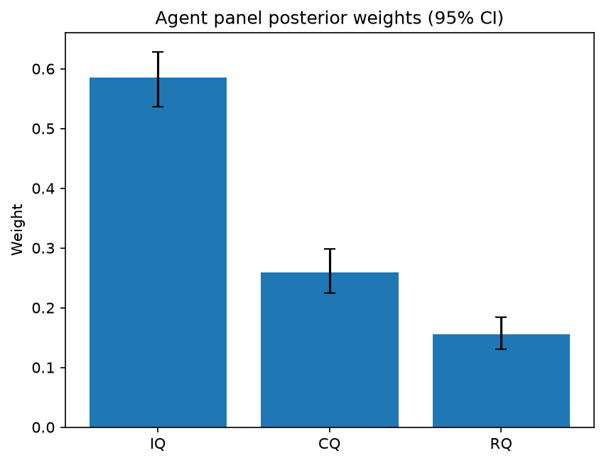

# Survey report: TrustRouter Claude CLI Panel (sonnet) -- Level L3a: Quality clusters (ISO 25012)

Survey ID: `trustrouter-claude-cli-full-panel-claude-sonnet-2026-09-01-L3a`

## Agent panel

- Agents contributing a valid response: 36
- Classical BWM consistency: 36/36 within threshold

| Criterion | Mean | 95% CI lower | 95% CI upper |
|---|---|---|---|
| IQ | 0.5857 | 0.5364 | 0.6286 |
| CQ | 0.2589 | 0.2243 | 0.2982 |
| RQ | 0.1554 | 0.1308 | 0.1838 |

## Methodology

Each agent independently completed a Best-Worst Method (BWM) comparison: choosing the single most and least important criterion, then rating every criterion's importance relative to those two on a 1-9 scale. Individual responses were solved with the classical BWM linear program (Rezaei, 2015) for a consistency check, and combined across the panel with a hierarchical Bayesian model (Mohammadi and Rezaei, 2020).

36 agent response(s) were accepted into this result.

Every agent's run began with a QA precheck (its stated configuration verified against ground truth) and every accepted answer's self-reported sources were checked against what reference material was actually available to it; see the Per-agent detail section below and this survey's Conversation Log for each agent's specific results. Every response is schema-validated and independently, repeatedly sampled (never a single completion treated as ground truth); see `guardrails.py`. This survey's complete output is covered by a SHA-256 integrity manifest (`integrity_manifest.json`, `SHA256SUMS`), generated once this run finished, so any later alteration to these files is detectable.

### Charts

## Per-agent detail

### bim-coordinator-base-claude (`bim-coordinator-base-claude`)

- Role: BIM Coordinator
- Model: claude_cli/sonnet
- DID: `did:key:z6MkwaD5PfneZEDso4t2zzYoPEj2qoTJMvwL6gsjm7sm4KYw`
- QA precheck: passed
- Sources used: shared knowledge: trustrouter_expert_questionnaire_v5_real_survey_instrument.md, shared knowledge: trustrouter_concept_paper_primer.md, general_knowledge

**Answer:** `{"best": "IQ", "worst": "RQ", "best_to_others": {"IQ": 1, "CQ": 3, "RQ": 5}, "others_to_worst": {"IQ": 5, "CQ": 3, "RQ": 1}}`

**Reasoning:**

For a construction-project record being considered for immutable blockchain storage, Intrinsic Quality (accuracy, validity, uniqueness — per shared knowledge: trustrouter_expert_questionnaire_v5_real_survey_instrument.md's definition of IQ) is the most fundamental cluster: if the values themselves are wrong, duplicated, or invalid at the point of write, no amount of downstream completeness/timeliness or cross-source consistency can fix it, and errors become permanently anchored once committed to a ledger. This mirrors long-standing BIM federation practice: clash detection and lifecycle sign-off are only as good as the accuracy of the source model data feeding them, so intrinsic correctness is the gating factor before anything else matters. Contextual Quality (completeness, timeliness) is a close second — an incomplete or stale record (e.g., a renovation compliance document missing scope or logged too late) is a real and common practical failure mode on multi-decade public assets, so I place it above RQ but well below IQ, hence a moderate gap of 3 on the Best-to-Others scale. Representational Quality (consistency across copies/sources) is the weakest of the three for the blockchain-storage decision specifically: blockchain's core value proposition is precisely to enforce a single canonical, tamper-evident record, so once data is committed on-chain, cross-copy consistency risk is structurally reduced by the technology itself rather than needing to be weighted as a top-tier quality driver at the point of ingestion. That is why RQ is Worst. The IQ-vs-CQ and CQ-vs-RQ gaps are judgement calls on my part, informed by BIM coordination experience rather than an explicit numeric ranking in the provided material, and I flag that the IQ/CQ distinction in particular is not an overwhelming one — both are clearly more central than RQ, but IQ edges out CQ because inaccurate data poisons everything downstream (including how 'complete' or 'timely' data even gets judged), whereas RQ is comparatively insulated by the blockchain mechanism itself.

### bim-coordinator-base-claude (`bim-coordinator-base-claude`)

- Role: BIM Coordinator
- Model: claude_cli/sonnet
- DID: `did:key:z6MkwaD5PfneZEDso4t2zzYoPEj2qoTJMvwL6gsjm7sm4KYw`
- QA precheck: passed
- Sources used: shared knowledge: trustrouter_expert_questionnaire_v5_real_survey_instrument.md, shared knowledge: trustrouter_concept_paper_primer.md, general_knowledge

**Answer:** `{"best": "IQ", "worst": "RQ", "best_to_others": {"IQ": 1, "CQ": 3, "RQ": 5}, "others_to_worst": {"IQ": 5, "CQ": 3, "RQ": 1}}`

**Reasoning:**

As a BIM coordinator responsible for federated models that feed insurers, authorities, and institutional owners over a multi-decade lifecycle, I judge Intrinsic Quality (IQ: accuracy, validity, uniqueness) as most important. If the underlying values in a construction record are wrong, invalid, or duplicated, no amount of completeness, timeliness, or cross-copy consistency can compensate -- decisions made on inaccurate structural or compliance data (e.g. a wrong load-bearing calculation or a duplicated as-built record) create direct safety and legal exposure that downstream quality dimensions cannot fix. Contextual Quality (CQ: completeness, timeliness) is second: a record can be accurate but still unusable if scope is missing or the data is stale relative to the current building state, which matters a great deal in phased renovation work but is a lesser risk than having wrong values in the first place. Representational Quality (RQ: consistency across sources) I rate lowest -- not because version agreement across federated models is unimportant (clash detection and change management depend on it daily), but because in a well-governed BIM environment, RQ issues are typically detected and reconciled through the coordination process itself (clash detection, model federation checks), whereas an underlying IQ defect can silently persist and propagate. This is a genuinely closer call between CQ and RQ than between IQ and either -- both support IQ's core value rather than substituting for it -- so I placed IQ clearly ahead but kept CQ and RQ ratings moderate rather than extreme. Ratings: IQ vs itself =1, IQ vs CQ=3, IQ vs RQ=5 (best-to-others); worst-to-others: RQ vs itself=1, CQ vs RQ=3, IQ vs RQ=5 (others-to-worst), reflecting that IQ is meaningfully but not overwhelmingly more critical than CQ, and both are clearly ahead of RQ in a construction-data-trust context.

### bim-coordinator-base-claude (`bim-coordinator-base-claude`)

- Role: BIM Coordinator
- Model: claude_cli/sonnet
- DID: `did:key:z6MkwaD5PfneZEDso4t2zzYoPEj2qoTJMvwL6gsjm7sm4KYw`
- QA precheck: passed
- Sources used: shared knowledge: trustrouter_expert_questionnaire_v5_real_survey_instrument.md, shared knowledge: trustrouter_concept_paper_primer.md, general_knowledge

**Answer:** `{"best": "IQ", "worst": "RQ", "best_to_others": {"IQ": 1, "CQ": 3, "RQ": 5}, "others_to_worst": {"IQ": 5, "CQ": 3, "RQ": 1}}`

**Reasoning:**

For a construction-project record considered for permanent, immutable blockchain storage, Intrinsic Quality (IQ: accuracy, validity, uniqueness) is the most fundamental cluster: if the underlying values themselves are wrong, duplicated, or invalid, no amount of contextual completeness or cross-copy consistency can compensate -- you would simply be anchoring an incorrect record permanently and authoritatively. From a BIM coordination standpoint, this mirrors clash-detection and handover practice: a federated model with wrong dimensions or invalid element data is worse than one that is merely incomplete, because errors propagate irreversibly downstream into structural, compliance, and insurance decisions over decades (per the Hospital Real scenario in shared knowledge: trustrouter_expert_questionnaire_v5_real_survey_instrument.md). Contextual Quality (CQ: completeness, timeliness) matters -- a record missing scope or out of date is a real risk -- but it is a lesser failure mode than intrinsic wrongness: an incomplete-but-accurate record can be supplemented, whereas an inaccurate one actively misleads. Representational Quality (RQ: consistency across copies/sources) I rate lowest of the three: in a well-governed multi-stakeholder BIM federation, version/consistency conflicts are typically caught and reconciled through federation and clash-detection workflows before data is committed to a trust ledger, and blockchain immutability itself is partly aimed at solving cross-copy consistency problems once data is IQ-sound. So RQ is more a downstream/structural safeguard than a primary quality driver. The IQ vs CQ gap is moderate (3x) -- both are clearly important, and this is a judgement call rather than a clear-cut fact; the CQ vs RQ gap is smaller in my own confidence, so the ratios reflect a genuine but not extreme ordering: IQ > CQ > RQ. I did not find explicit relative-weighting guidance among IQ/CQ/RQ in the primer document beyond the additive formula structure, so the numeric ratios themselves are my own professional judgement, not a value read from the reference material.

### bim-coordinator-rag-claude (`bim-coordinator-rag-claude`)

- Role: BIM Coordinator
- Model: claude_cli/sonnet
- DID: `did:key:z6MkqSfDfSA3Y6V2HcU6A72f4t469gxYRVPTADrJ7HzYtu7a`
- QA precheck: passed
- Sources used: shared knowledge: trustrouter_expert_questionnaire_v5_real_survey_instrument.md, bim_and_digital_building_logbooks.md, general_knowledge

**Answer:** `{"best": "IQ", "worst": "RQ", "best_to_others": {"IQ": 1, "CQ": 3, "RQ": 5}, "others_to_worst": {"IQ": 5, "CQ": 3, "RQ": 1}}`

**Reasoning:**

As BIM coordinator responsible for federating models from multiple stakeholders and signing off on data before it moves into long-term (potentially blockchain) storage, my first gate is always: are the values themselves correct? Intrinsic Quality (IQ) bundles accuracy, validity, and uniqueness -- if a room dimension, a material spec, or an inspection reading is simply wrong, duplicated, or invalid at the point of capture, nothing downstream (scope completeness, timeliness, or cross-copy consistency) can fix that; per shared knowledge: trustrouter_expert_questionnaire_v5_real_survey_instrument.md, IQ is explicitly framed as 'are the values right in themselves?', which is the precondition for everything else. Contextual Quality (CQ, completeness+timeliness) matters a great deal in practice -- a federated model missing a discipline's submission or built on stale MEP data causes real clash-detection failures -- so I rate it meaningfully behind IQ but well ahead of RQ, not negligible (best_to_others CQ=3). Representational Quality (RQ, consistency across copies/sources) is the one I rank lowest: in an ISO 19650-governed federation workflow, format/version alignment across federated copies is substantially a process-and-tooling problem (common data environment discipline, naming/versioning conventions) that is easier to detect and remediate mechanically once IQ and CQ are in order -- per bim_and_digital_building_logbooks.md's discussion of ISO 19650 requiring independent validation of federated models before acceptance, consistency issues surface at that federation checkpoint rather than being an intrinsic property of the record's truth-value. This is a judgement call from my own domain experience, not something the reference material states outright, and I acknowledge CQ vs RQ is a clearer gap than IQ vs CQ, which is the closer call of the three.

### bim-coordinator-rag-claude (`bim-coordinator-rag-claude`)

- Role: BIM Coordinator
- Model: claude_cli/sonnet
- DID: `did:key:z6MkqSfDfSA3Y6V2HcU6A72f4t469gxYRVPTADrJ7HzYtu7a`
- QA precheck: passed
- Sources used: shared knowledge: trustrouter_expert_questionnaire_v5_real_survey_instrument.md, shared knowledge: trustrouter_concept_paper_primer.md, bim_and_digital_building_logbooks.md, general_knowledge

**Answer:** `{"best": "IQ", "worst": "RQ", "best_to_others": {"IQ": 1, "CQ": 3, "RQ": 5}, "others_to_worst": {"IQ": 5, "CQ": 3, "RQ": 1}}`

**Reasoning:**

As a BIM coordinator, I judge Intrinsic Quality (accuracy, validity, uniqueness) to be the bedrock of a trustworthy record. If the underlying values are wrong -- a mis-measured dimension, an invalid material classification, a duplicated/contradictory element record -- then anchoring that record on an immutable ledger just permanently enshrines an error; no amount of completeness, timeliness, or cross-copy consistency can compensate for data that is factually wrong at the source. This matches how ISO 19650-style information management treats validation of federated models before acceptance (per bim_and_digital_building_logbooks.md's discussion of independent validation of federated models) -- correctness of the underlying content is checked before the model is trusted, not after. Contextual Quality (completeness/timeliness) sits in the middle: a partial or slightly stale record is a real problem for lifecycle documentation, but it is a fitness-for-use gap that can often be remedied incrementally (supplementary entries, versioned updates) without undermining what has already been recorded. Representational Quality (consistency across sources/copies) is important in a federated, multi-stakeholder BIM environment -- disagreeing copies genuinely complicate clash detection and audit trails -- but it is the narrowest of the three (a single facet, consistency, versus IQ's three facets or CQ's two), and it is logically downstream of IQ: consistency between multiple copies of inaccurate data does not make the data trustworthy, it just makes the error uniform. That is why I rank RQ as least important of the three quality clusters here, while acknowledging the comparison between CQ and RQ was closer than IQ's clear lead -- both are legitimate secondary concerns that federated-model coordination cares about daily. I did not find material in the provided ISO 25012 cluster definitions (shared knowledge: trustrouter_expert_questionnaire_v5_real_survey_instrument.md, shared knowledge: trustrouter_concept_paper_primer.md) or the BIM-domain reference material that dictates a specific ranking among IQ/CQ/RQ, so this ordering reflects my own professional judgement as a BIM coordinator applied to those cluster definitions, not a value taken directly from a source.

### bim-coordinator-rag-claude (`bim-coordinator-rag-claude`)

- Role: BIM Coordinator
- Model: claude_cli/sonnet
- DID: `did:key:z6MkqSfDfSA3Y6V2HcU6A72f4t469gxYRVPTADrJ7HzYtu7a`
- QA precheck: passed
- Sources used: shared knowledge: trustrouter_expert_questionnaire_v5_real_survey_instrument.md, shared knowledge: trustrouter_concept_paper_primer.md, bim_and_digital_building_logbooks.md, general_knowledge

**Answer:** `{"best": "IQ", "worst": "RQ", "best_to_others": {"IQ": 1, "CQ": 3, "RQ": 5}, "others_to_worst": {"IQ": 5, "CQ": 3, "RQ": 1}}`

**Reasoning:**

As the BIM coordinator running clash detection and lifecycle documentation across federated models, my first filter on any record is whether the values themselves are correct: accuracy, validity against schema/domain rules, and uniqueness (no duplicate/conflicting element records) are what determine whether a model element can be trusted at all before it's even used in a decision. This is IQ (shared knowledge: trustrouter_expert_questionnaire_v5_real_survey_instrument.md and trustrouter_concept_paper_primer.md define IQ as accuracy/validity/uniqueness). If IQ fails, nothing downstream matters - a wrong dimension or duplicated asset ID corrupts every clash check and every compliance record regardless of when it arrived or how well it matches other copies. CQ (completeness, timeliness) matters a great deal in practice - an incomplete as-built or a stale inspection record is a real operational problem I deal with constantly during handover and federation - but a complete, timely record that is inaccurate is arguably worse than a partial but correct one, so I place CQ second. RQ (consistency across sources/copies) is the criterion I rate lowest of the three: cross-copy consistency is exactly what ISO 19650-style federation and independent validation by multiple task teams (bim_and_digital_building_logbooks.md, discussing BS EN ISO 19650 Guidance Part 2) is designed to catch and reconcile after the fact - it's a synchronization/version-control problem that tooling and process controls (federation checks, common data environment version control) address reasonably well, whereas inaccurate underlying data or timeliness gaps are harder to detect and more consequential once they propagate into a blockchain-anchored record that is meant to be immutable. This is a judgement call based on my practical experience with federated model governance, not a hard finding from the reference material, and I want to flag that IQ vs CQ is a real trade-off - a project with severe completeness gaps (e.g., missing structural inspection records for a hospital renovation) could plausibly be argued as equally urgent as accuracy problems. I did not find material in the provided sources that quantifies this trade-off numerically, so my ratings (IQ:CQ:RQ = 5:3:1 relative to worst) reflect professional judgement about which failure mode is most damaging to an immutable, blockchain-anchored construction record.

### blockchain-engineer-base-claude (`blockchain-engineer-base-claude`)

- Role: Blockchain / DLT Engineer
- Model: claude_cli/sonnet
- DID: `did:key:z6MkiXdPHgRKLgsWGCi5P19sNTrHqFjySf3d9JD1BYLAirtk`
- QA precheck: passed
- Sources used: shared knowledge: trustrouter_concept_paper_primer.md, general_knowledge

**Answer:** `{"best": "IQ", "worst": "RQ", "best_to_others": {"IQ": 1, "CQ": 3, "RQ": 5}, "others_to_worst": {"IQ": 5, "CQ": 3, "RQ": 1}}`

**Reasoning:**

From a blockchain engineering standpoint, the defining risk of committing a construction record to a tamper-evident ledger is that errors become effectively permanent once written and hashed/chained -- correction requires an explicit, auditable amendment event rather than a silent fix. That makes Intrinsic Quality (accuracy, validity, uniqueness) the gating concern: if a record is inaccurate, invalid against schema/business rules, or a duplicate, no amount of later completeness or cross-source agreement rescues it, and you've durably enshrined bad data. I therefore rank IQ as Best. Contextual Quality (completeness, timeliness) matters for whether a record is fit for the operational decision at hand (e.g., a completeness gap on a safety certificate, or staleness of an inspection date), which is real but secondary to whether the record's core content is even correct -- a complete, timely record that is factually wrong is arguably worse than an accurate but partial one, since the latter can be supplemented via a follow-up ledger entry while the former actively misleads. I placed CQ in the middle. Representational Quality here reduces to a single sub-facet (consistency across sources), which is a valuable reconciliation signal in multi-stakeholder BIM/IFC environments but is narrower in scope than the other two composite clusters, and in practice a permissioned DLT's append-only, single-shared-ledger design already mitigates much of the cross-source divergence problem by construction (once parties write to the same chain, divergence is visible and attributable) -- it doesn't need as much independent weighting as accuracy/validity or completeness/timeliness. That made RQ my Worst. The ratios reflect a moderate, not extreme, spread since all three clusters are genuine ISO 25012 quality facets and none is negligible; this is a judgement call on relative emphasis rather than a large, obvious gap, and I want to flag that the IQ-vs-CQ comparison in particular is closer than the ratios might suggest -- both matter substantially for whether a record deserves on-chain permanence.

### blockchain-engineer-base-claude (`blockchain-engineer-base-claude`)

- Role: Blockchain / DLT Engineer
- Model: claude_cli/sonnet
- DID: `did:key:z6MkiXdPHgRKLgsWGCi5P19sNTrHqFjySf3d9JD1BYLAirtk`
- QA precheck: passed
- Sources used: shared knowledge: trustrouter_concept_paper_primer.md, general_knowledge

**Answer:** `{"best": "IQ", "worst": "RQ", "best_to_others": {"IQ": 1, "CQ": 2, "RQ": 4}, "others_to_worst": {"IQ": 4, "CQ": 2, "RQ": 1}}`

**Reasoning:**

For deciding whether a construction record deserves permanent, tamper-evident storage on a ledger, Intrinsic Quality (accuracy, validity, uniqueness) is the foundational gate: blockchain immutability only adds value if the underlying fact being sealed is correct and non-duplicated at the point of write. If a record is inaccurate or invalid, committing it to an append-only ledger doesn't fix that problem, it permanently enshrines it and makes correction procedurally expensive (requiring compensating transactions rather than simple edits), which is a distinctly blockchain-specific downside of low IQ data. Uniqueness also matters operationally to avoid duplicate hashes/entries competing for the same physical artifact (e.g., two conflicting 'as-built' records). Contextual Quality (completeness, timeliness) is important but secondary from an engineering-feasibility standpoint: an incomplete or slightly stale record can still be validly anchored on-chain and later supplemented by additional linked transactions (the ledger's append-only, chained structure actually accommodates incremental completeness reasonably well), so CQ deficiencies are more remediable post-hoc than IQ deficiencies. Representational Quality (consistency across sources) I rank lowest for this specific decision because it is largely a reconciliation/interoperability concern that a shared ledger is often used to *solve* going forward (by establishing one canonical, cross-party record) rather than a precondition that must be satisfied before data is deemed ledger-worthy; inconsistency across off-chain sources doesn't by itself compromise the tamper-evidence guarantee of the specific record being written. My best-to-others (IQ:1, CQ:2, RQ:4) and others-to-worst (IQ:4, CQ:2, RQ:1) ratings are set to be internally consistent (a_IQ,CQ x a_CQ,RQ = 2x2 = 4 = a_IQ,RQ), reflecting a graduated rather than extreme preference — this is a real but not overwhelming difference in importance, and I want to flag honestly that CQ vs RQ is a closer call than IQ's clear primacy.

### blockchain-engineer-base-claude (`blockchain-engineer-base-claude`)

- Role: Blockchain / DLT Engineer
- Model: claude_cli/sonnet
- DID: `did:key:z6MkiXdPHgRKLgsWGCi5P19sNTrHqFjySf3d9JD1BYLAirtk`
- QA precheck: passed
- Sources used: shared knowledge: trustrouter_concept_paper_primer.md, general_knowledge

**Answer:** `{"best": "IQ", "worst": "CQ", "best_to_others": {"IQ": 1, "CQ": 4, "RQ": 2}, "others_to_worst": {"IQ": 4, "RQ": 2, "CQ": 1}}`

**Reasoning:**

Per shared knowledge: trustrouter_concept_paper_primer.md, Q decomposes into IQ (accuracy, validity, uniqueness), CQ (completeness, timeliness), and RQ (consistency across sources). From a DLT engineer's standpoint, the decisive risk with any permissioned ledger is that immutability is a one-way door: once a record is committed, errors are not merely present but permanently enshrined and tamper-evident in a misleading way -- the chain will faithfully prove that a wrong value was recorded at a given time. That makes IQ (is the record actually accurate, does it conform to valid domain/schema rules, is it not a duplicate) the prerequisite gate before anything else about the record matters, so I rate it Best. RQ (consistency across sources) is a close second rather than a distant one: reconciling divergent records held by separate stakeholders -- contractor, inspector, owner -- is arguably the core value proposition of DLT for construction data, since a shared ledger is exactly the mechanism used to converge on one agreed version of events. So RQ earns a real but secondary weight (2x less than IQ). CQ (completeness, timeliness) I rate Worst: incompleteness at time of writing can usually be remedied by later append-only updates without compromising the ledger's integrity guarantees, and timeliness is largely an upstream workflow/ingestion-latency concern rather than a property of the data's inherent trustworthiness once it is written. This is a genuine but not extreme gap -- CQ is not irrelevant to construction data trust, it is simply less central to the specific question of whether a record deserves tamper-evident, immutable storage. I did not find content in the provided ISO 25012 material itself ranking these three clusters against each other, so the relative weighting (IQ=1, RQ=2, CQ=4) reflects my own professional judgement as a blockchain/DLT engineer applied to the definitions given, not a value read directly from the source material.

### blockchain-engineer-rag-claude (`blockchain-engineer-rag-claude`)

- Role: Blockchain / DLT Engineer
- Model: claude_cli/sonnet
- DID: `did:key:z6MkopvxUWWWCS4idsrstN99GZf9TsfLRkdw69bu1hJ8anGq`
- QA precheck: passed
- Sources used: shared knowledge: trustrouter_concept_paper_primer.md, blockchain_trust_and_attack_resistance.md, general_knowledge

**Answer:** `{"best": "IQ", "worst": "RQ", "best_to_others": {"IQ": 1, "CQ": 3, "RQ": 5}, "others_to_worst": {"IQ": 5, "CQ": 2, "RQ": 1}}`

**Reasoning:**

From a permissioned-ledger engineering standpoint, the decisive risk in writing a record to an append-only, tamper-evident store is that intrinsic defects (inaccuracy, invalidity, duplication) become effectively permanent: correcting them later requires compensating transactions or forks in the audit trail, not a simple update, so IQ governs whether the record is even safe to commit. Contextual Quality (completeness, timeliness) matters for the record's usefulness once committed, but an incomplete or slightly stale record can still be supplemented by a later transaction without undermining the ledger's integrity guarantee -- it's a fitness-for-purpose concern rather than a tamper-evidence/correctness concern, so I place it clearly below IQ but above RQ. Representational Quality (consistency across sources) is the least decisive of the three for the on-chain-or-not decision: cross-source inconsistency is primarily an interoperability/reconciliation problem (e.g., mismatched formats or units across systems feeding the ledger), which can often be resolved at the integration/oracle layer before commitment, and does not by itself threaten the immutable record's own correctness the way an intrinsic accuracy defect does. This is a judgement call grounded in general blockchain/DLT engineering reasoning about the cost asymmetry of correcting on-chain errors, informed by the shared knowledge: trustrouter_concept_paper_primer.md's decomposition of Q into IQ/CQ/RQ and by blockchain_trust_and_attack_resistance.md's discussion of how audit-trail completeness and verification strength interact with data going on an immutable ledger (Rouhani and Deters 2021's adaptive-validation model, where a lower-trust/lower-accuracy record should trigger stronger consensus before being committed, reinforcing why intrinsic correctness is the primary gate). I note the IQ-vs-CQ comparison is not overwhelming -- a reasonable case could be made that timeliness is nearly as critical in a construction handover context -- so I've rated that gap moderately (3x) rather than extremely, while the IQ-vs-RQ gap I rate as more pronounced (5x) since consistency-across-sources is the most peripheral of the three to the core immutability risk.

### blockchain-engineer-rag-claude (`blockchain-engineer-rag-claude`)

- Role: Blockchain / DLT Engineer
- Model: claude_cli/sonnet
- DID: `did:key:z6MkopvxUWWWCS4idsrstN99GZf9TsfLRkdw69bu1hJ8anGq`
- QA precheck: passed
- Sources used: shared knowledge: trustrouter_concept_paper_primer.md, blockchain_trust_and_attack_resistance.md, general_knowledge

**Answer:** `{"best": "IQ", "worst": "RQ", "best_to_others": {"IQ": 1, "CQ": 3, "RQ": 5}, "others_to_worst": {"IQ": 5, "CQ": 2, "RQ": 1}}`

**Reasoning:**

This level decomposes Q (Quality) per ISO 25012 into IQ (Accuracy+Validity+Uniqueness), CQ (Completeness+Timeliness), and RQ (Consistency across sources), per shared knowledge: trustrouter_concept_paper_primer.md's Q = w_IQ*IQ + w_CQ*CQ + w_RQ*RQ breakdown. Judging this specifically as a factor feeding a decision about committing a construction record to an immutable/append-only ledger: IQ is Best because accuracy and validity are the load-bearing precondition for any write you cannot cheaply undo. On a permissioned DLT, correcting or retracting an erroneous entry after finality requires an explicit compensating transaction and leaves the original error permanently visible in the audit trail (a reputational and legal liability, not just a data-hygiene issue) -- so an inaccurate or invalid record is actively worse to commit than simply declining to commit it. Uniqueness also matters operationally: deduplication before write avoids wasted throughput and ambiguous provenance chains. CQ (completeness/timeliness) is a real but secondary concern -- a record can be genuinely accurate yet still usefully written even if partial or slightly stale (subsequent transactions can supplement it), so incompleteness degrades usefulness without corrupting trust in what is actually stored. RQ (cross-source consistency) I rank Worst for this specific gating decision: reconciling a record against other sources is valuable for a broader data-governance or oracle-aggregation process (related to, but distinct from, the attack-resistance oracle problem discussed in blockchain_trust_and_attack_resistance.md), but it is the least central of the three to the immediate technical question of whether *this* record deserves the throughput and storage cost of an on-chain or hybrid commitment -- an internally accurate, complete, timely record can stand on its own even if it hasn't yet been cross-checked against a second source. This is a closer call between CQ and RQ than between IQ and either of them, and I want to flag that explicitly rather than overstate confidence in the CQ/RQ ordering. My best_to_others and others_to_worst values are set so that IQ-to-RQ implied ratio (5) matches directly across both vectors, and CQ sits in between, reflecting a genuine but moderate rather than extreme spread across the three clusters.

### blockchain-engineer-rag-claude (`blockchain-engineer-rag-claude`)

- Role: Blockchain / DLT Engineer
- Model: claude_cli/sonnet
- DID: `did:key:z6MkopvxUWWWCS4idsrstN99GZf9TsfLRkdw69bu1hJ8anGq`
- QA precheck: passed
- Sources used: shared knowledge: trustrouter_concept_paper_primer.md, blockchain_trust_and_attack_resistance.md, general_knowledge

**Answer:** `{"best": "IQ", "worst": "RQ", "best_to_others": {"IQ": 1, "CQ": 2, "RQ": 4}, "others_to_worst": {"IQ": 4, "CQ": 3, "RQ": 1}}`

**Reasoning:**

As shared knowledge: trustrouter_concept_paper_primer.md defines it, Q decomposes into IQ (accuracy, validity, uniqueness), CQ (completeness, timeliness), and RQ (consistency across sources). From a blockchain/DLT engineering standpoint focused on what belongs in an immutable, tamper-evident ledger, IQ is the most fundamental: if a construction record is inaccurate, invalid, or a duplicate at the point of intake, no amount of ledger infrastructure (hashing, consensus, cryptographic attestation per blockchain_trust_and_attack_resistance.md's discussion of verification strength) can fix it after the fact -- immutability locks in bad data permanently, which is arguably worse than not writing it at all. CQ (completeness/timeliness) matters for whether the record is fit for the decision at hand, but a late or partially-completed accurate record is still recoverable/supplementable via later transactions on the ledger. RQ (consistency across sources) is the least critical of the three for the on-chain storage decision itself: cross-source consistency is a reconciliation/provenance concern (closer to PT in the DVS breakdown) rather than a property intrinsic to whether a single record's content is trustworthy enough to commit. In a permissioned construction-data context, single-source records (e.g., a signed inspection report) are common and can be high-trust without needing multi-source consistency checks, so RQ has the narrowest applicability and is my Worst. This is a judgement call reflecting engineering priority (garbage-in-immutable-forever risk) rather than something the reference material states explicitly as a ranking -- the primer only supplies the decomposition, not a relative importance ordering, so the comparison here is genuinely a professional inference, not a directly cited conclusion. The IQ vs CQ gap is real but not enormous (2x), since both are clearly more load-bearing for the ledger-worthiness decision than RQ.

### compliance-officer-base-claude (`compliance-officer-base-claude`)

- Role: Compliance and Regulatory Officer
- Model: claude_cli/sonnet
- DID: `did:key:z6MkwUN3K4YmG9arhbzyAxMLs314eLG46wmPnKoYLVUT8Rzm`
- QA precheck: passed
- Sources used: shared knowledge: trustrouter_concept_paper_primer.md, shared knowledge: trustrouter_expert_questionnaire_v5_real_survey_instrument.md, general_knowledge

**Answer:** `{"best": "IQ", "worst": "RQ", "best_to_others": {"IQ": 1, "CQ": 2, "RQ": 4}, "others_to_worst": {"IQ": 4, "CQ": 2, "RQ": 1}}`

**Reasoning:**

From a facility-management compliance standpoint (GDPR Art. 5(1)(d) accuracy principle, plus construction-regulatory records such as structural inspections, energy performance certificates, and safety documentation), the foundational question is always 'are the values themselves correct, valid, and non-duplicated?' (IQ = accuracy + validity + uniqueness, per shared knowledge: trustrouter_expert_questionnaire_v5_real_survey_instrument.md's ISO 25012 cluster definitions). A regulatory record that is inaccurate or invalid is actively dangerous -- it can produce false assurance of compliance (e.g. an inspection record showing a passed safety check that is factually wrong), which is a worse failure mode than a record that is merely incomplete or slightly late. That is why IQ is Best. CQ (completeness + timeliness) is a close second: regulatory obligations frequently hinge on deadlines and full scope (e.g. mandatory disclosure classes, periodic recertification), so missing or stale data is a genuine compliance risk, but at least a gap is usually visible/auditable as a gap, whereas an inaccurate value can masquerade as sound. RQ (consistency across sources) is Worst in this triad: in a blockchain-anchored architecture the ledger itself is designed to be the canonical, tamper-evident record, so cross-source consistency is more of a downstream integration/reconciliation concern than a first-order determinant of whether the datum can support a compliance decision -- if IQ and CQ are both strong, disagreement across secondary sources is a lower-severity finding than the datum being wrong or missing in the first place. This mirrors the composite structure in shared knowledge: trustrouter_concept_paper_primer.md, where Q decomposes as a weighted sum of IQ, CQ, and RQ, implying the panel is meant to differentiate their relative weights rather than treat them as equal. My numeric ratios (IQ:CQ = 2, IQ:RQ = 4, CQ:RQ = 2) are a judgement call reflecting a moderate but real gap between IQ and CQ, and a larger gap between IQ and RQ, chosen to keep the two matrices arithmetically consistent (2 x 2 = 4). I acknowledge the IQ-vs-CQ call is the closer of the two comparisons -- both are highly salient to regulatory obligations -- whereas IQ clearly dominating RQ is a more confident judgement.

### compliance-officer-base-claude (`compliance-officer-base-claude`)

- Role: Compliance and Regulatory Officer
- Model: claude_cli/sonnet
- DID: `did:key:z6MkwUN3K4YmG9arhbzyAxMLs314eLG46wmPnKoYLVUT8Rzm`
- QA precheck: passed
- Sources used: shared knowledge: trustrouter_concept_paper_primer.md, shared knowledge: trustrouter_expert_questionnaire_v5_real_survey_instrument.md, general_knowledge

**Answer:** `{"best": "IQ", "worst": "RQ", "best_to_others": {"IQ": 1, "CQ": 2, "RQ": 6}, "others_to_worst": {"IQ": 6, "CQ": 3, "RQ": 1}}`

**Reasoning:**

Per shared knowledge: trustrouter_expert_questionnaire_v5_real_survey_instrument.md (section 3.3), IQ covers accuracy, validity and uniqueness -- i.e., whether the values recorded for a construction datum are correct in themselves. From a compliance officer's standpoint this is the foundational layer: a record that is inaccurate, invalid (e.g. fails a schema/format/regulatory test) or duplicated cannot satisfy any downstream legal or contractual purpose, and because blockchain storage is append-only/immutable, committing an inaccurate value is far harder to remedy than a record that is merely incomplete or momentarily consistent across sources. CQ (completeness, timeliness) matters for meeting regulatory deadlines and full-scope disclosure (e.g. energy performance certificates, safety dossiers), so it is clearly important but is meaningful only once the underlying values are themselves correct -- an on-time, complete record built on wrong figures is still non-compliant. RQ (consistency across sources) is the least distinctive of the three for this comparison: at the parent level of the TrustRouter model (per shared knowledge: trustrouter_concept_paper_primer.md), cross-party agreement is already captured explicitly by Independent Confirmation (IC), so within the Q-cluster decomposition RQ's marginal compliance value is comparatively lower -- it addresses whether different copies of a record agree with each other, which is a narrower and partially redundant concern next to getting the value right (IQ) and getting the scope/timing right (CQ). Hence IQ = Best, RQ = Worst, with CQ positioned intermediate but closer to IQ than to RQ, reflecting that completeness/timeliness failures are a more serious compliance risk than mere cross-source representational inconsistency. I set best_to_others and others_to_worst so the implied IQ:CQ ratio is consistent across both tables (2 in each direction), acknowledging this specific 3-way ranking is a judgement call rather than something the reference material states outright -- the primer and instrument define the three clusters but do not themselves rank IQ above CQ above RQ.

### compliance-officer-base-claude (`compliance-officer-base-claude`)

- Role: Compliance and Regulatory Officer
- Model: claude_cli/sonnet
- DID: `did:key:z6MkwUN3K4YmG9arhbzyAxMLs314eLG46wmPnKoYLVUT8Rzm`
- QA precheck: passed
- Sources used: shared knowledge: trustrouter_expert_questionnaire_v5_real_survey_instrument.md, general_knowledge

**Answer:** `{"best": "IQ", "worst": "RQ", "best_to_others": {"IQ": 1, "CQ": 2, "RQ": 3}, "others_to_worst": {"IQ": 3, "CQ": 2, "RQ": 1}}`

**Reasoning:**

Per shared knowledge: trustrouter_expert_questionnaire_v5_real_survey_instrument.md (section 3.3), IQ bundles accuracy, validity, and uniqueness -- i.e., whether the recorded values are themselves correct and not duplicated -- while CQ bundles completeness and timeliness, and RQ concerns consistency of the same record across independent sources. From a compliance-officer's vantage point covering GDPR and construction-regulatory obligations, IQ is the foundational cluster: GDPR Article 5(1)(d) makes accuracy a first-order data-protection principle, and construction regulators (building-code sign-off, structural certifications, energy-performance disclosures) act on the substantive correctness of the values themselves -- an inaccurate or invalid measurement is a compliance failure no matter how complete, timely, or cross-source-consistent its presentation is. CQ (completeness/timeliness) is a close second: GDPR's storage-limitation and accuracy principles also imply records must be current, and regulatory deadlines (e.g., mandatory disclosure windows referenced in the questionnaire's L row) depend on timeliness -- but a complete, on-time record built on wrong underlying values still fails compliance, so CQ is instrumentally subordinate to IQ. RQ (consistency across sources) I rate worst, not because it is unimportant, but because from a regulatory-obligation standpoint it is the most technical/operational of the three: it matters primarily for establishing confidence in a distributed-ledger context (which copy do we trust), whereas the actual regulatory exposure -- fines, code violations, GDPR breach findings -- attaches to whether the data was accurate, valid, and adequately complete/timely, not to whether multiple sources happened to agree. This is a genuine judgement call rather than a clear-cut hierarchy: CQ and RQ both plausibly compete for 'least critical' depending on whether one weighs GDPR's currency requirements or blockchain's cross-source trust value more heavily, and I want to flag that closeness explicitly rather than overstate confidence in the CQ-RQ ordering.

### compliance-officer-rag-claude (`compliance-officer-rag-claude`)

- Role: Compliance and Regulatory Officer
- Model: claude_cli/sonnet
- DID: `did:key:z6Mkiny4nghtEZgRh1GDTK1uVN3K6yiWKovHursQ4YEVJq2c`
- QA precheck: passed
- Sources used: shared knowledge: trustrouter_expert_questionnaire_v5_real_survey_instrument.md, shared knowledge: trustrouter_concept_paper_primer.md, gdpr_and_data_governance.md, general_knowledge

**Answer:** `{"best": "IQ", "worst": "RQ", "best_to_others": {"IQ": 1, "CQ": 2, "RQ": 5}, "others_to_worst": {"IQ": 5, "CQ": 3, "RQ": 1}}`

**Reasoning:**

Framing this as a compliance officer deciding what construction-project data is safe and sound to commit to an immutable ledger, the decisive concern is whether the values are right in the first place. IQ (accuracy, validity, uniqueness) is foundational: per gdpr_and_data_governance.md, blockchain's immutability directly conflicts with GDPR's right to erasure/rectification, so an inaccurate or invalid record written to chain cannot later be corrected -- it becomes a standing compliance liability with no remedy, exactly the governance gap that same source says the construction sector has failed to develop rigorous criteria for. That makes 'are the values right in themselves' (per the IQ definition in trustrouter_expert_questionnaire_v5_real_survey_instrument.md) the highest-stakes cluster for an irreversible-storage decision. CQ (completeness, timeliness -- 'right scope and time') is a real but lesser concern: a record that is accurate but incomplete or late (e.g. a delayed energy-performance disclosure) is a compliance problem, but a correctable one going forward, unlike baked-in inaccuracy. RQ (consistency across sources) I rate worst here: cross-source consistency matters, but in the TrustRouter architecture (per trustrouter_concept_paper_primer.md) that role substantially overlaps with the separate Independent Confirmation (IC) dimension at L2, making it comparatively narrower and less load-bearing within this specific IQ/CQ/RQ triple than getting the datum itself right or complete-and-current. Ratings: IQ is moderately more important than CQ (2) since both concern the data's own adequacy, but IQ clearly dominates RQ (5) given the irreversibility argument; CQ over RQ (3) reflects that scope/timing defects are still more central to the record's own fitness than a cross-source consistency defect. This is a judgement call rather than a source-derived ranking -- the reference material defines the three clusters but does not itself rank them, so the ordering reflects my own compliance-risk reasoning applied to those definitions.

### compliance-officer-rag-claude (`compliance-officer-rag-claude`)

- Role: Compliance and Regulatory Officer
- Model: claude_cli/sonnet
- DID: `did:key:z6Mkiny4nghtEZgRh1GDTK1uVN3K6yiWKovHursQ4YEVJq2c`
- QA precheck: passed
- Sources used: shared knowledge: trustrouter_concept_paper_primer.md, shared knowledge: trustrouter_expert_questionnaire_v5_real_survey_instrument.md, gdpr_and_data_governance.md, general_knowledge

**Answer:** `{"best": "IQ", "worst": "RQ", "best_to_others": {"IQ": 1, "CQ": 2, "RQ": 4}, "others_to_worst": {"IQ": 4, "CQ": 2, "RQ": 1}}`

**Reasoning:**

This level decomposes Q (Quality) into ISO 25012's three clusters per the concept-paper primer: IQ = accuracy+validity+uniqueness ('are the values right in themselves'), CQ = completeness+timeliness ('right scope and time'), RQ = consistency across sources. From a compliance-officer standpoint, IQ is best because it is the precondition for everything downstream: a record that is inaccurate, invalid, or duplicated is a liability the moment it is written, and because blockchain storage is immutable, an IQ failure becomes a permanent, unerasable compliance defect rather than a correctable one -- this is the same immutability tension that gdpr_and_data_governance.md raises regarding erasure rights, and by extension applies to correcting an inaccurate committed record. GDPR's data-quality/accuracy principle (an accuracy obligation on controllers) reinforces this from general regulatory knowledge, not from the provided corpus itself, which discusses erasure rather than accuracy specifically -- I flag that distinction explicitly. CQ ranks second: completeness and timeliness determine whether a record satisfies a specific regulatory purpose (e.g. a mandatory disclosure filed late, or a compliance record missing a required field, can fail a statutory obligation even when every value present is individually correct) -- a real but secondary concern relative to whether the underlying values are themselves right. RQ ranks worst: consistency across sources is a valuable comparative/fraud-detection signal (does this record agree with an independent copy?) but it presupposes that the records being compared already have some baseline accuracy and complete scope; it functions more as a corroboration check layered on top of IQ and CQ than as an independent determinant of the datum's own trustworthiness, and it is the cluster least directly anchored to a specific binding regulatory obligation in the material I was given. The ratings are kept moderate (max ratio 4, not extreme) and internally consistent (IQ:CQ=2, CQ:RQ=2, IQ:RQ=4) because all three clusters sit under a single L2 dimension (Q) and the differentiation between them, while real, is less stark than differentiation across L2's six top-level dimensions would be -- this is a judgement call on my part, not something the reference material quantifies.

### compliance-officer-rag-claude (`compliance-officer-rag-claude`)

- Role: Compliance and Regulatory Officer
- Model: claude_cli/sonnet
- DID: `did:key:z6Mkiny4nghtEZgRh1GDTK1uVN3K6yiWKovHursQ4YEVJq2c`
- QA precheck: passed
- Sources used: shared knowledge: trustrouter_expert_questionnaire_v5_real_survey_instrument.md, shared knowledge: trustrouter_concept_paper_primer.md, gdpr_and_data_governance.md, general_knowledge

**Answer:** `{"best": "IQ", "worst": "RQ", "best_to_others": {"IQ": 1, "CQ": 2, "RQ": 6}, "others_to_worst": {"IQ": 6, "CQ": 3, "RQ": 1}}`

**Reasoning:**

From a compliance-officer standpoint, IQ (accuracy, validity, uniqueness) is the most fundamental cluster: if the underlying values in a construction record are wrong, invalid, or duplicated, no amount of completeness, timeliness, or cross-source consistency can rescue the record's evidentiary or regulatory value. This mirrors GDPR Article 5(1)(d)'s accuracy principle and the general audit logic that a record's core factual correctness is a precondition for everything downstream -- once written to an immutable ledger, an inaccurate value becomes a permanent compliance liability (per gdpr_and_data_governance.md's discussion of the erasure/immutability tension, where the underlying quality of what gets committed matters precisely because it cannot later be corrected). CQ (completeness + timeliness) matters for meeting disclosure and reporting obligations (e.g. energy performance or building-code disclosure windows) but a complete, on-time record built on inaccurate values is still non-compliant, so I rank it below IQ. RQ, defined here narrowly as consistency across sources, is the least critical of the three for most construction records: many records originate from a single authoritative source (a single sensor, a single certifying engineer) where cross-source consistency is not even applicable, and where it is applicable it functions more as a secondary fraud/discrepancy check than as a primary quality determinant. The gap between IQ and RQ is real but not extreme -- consistency checks remain a legitimate red flag in disputes -- so I placed it at 6 rather than 9, reflecting a considered but not maximal separation. This is a judgement call grounded in the shared knowledge instrument's definitions (IQ = accuracy/validity/uniqueness, CQ = completeness/timeliness, RQ = consistency across sources) plus general regulatory-compliance reasoning about which failures are correctable versus terminal once data is committed on-chain; it is not drawn from a specific empirical ranking in the cited sources.

### data-engineer-base-claude (`data-engineer-base-claude`)

- Role: Data Engineering Specialist
- Model: claude_cli/sonnet
- DID: `did:key:z6Mkgetd4SzJJVFgp33Mr15qYrPY1rWLsTBk9egDkh4y3VV5`
- QA precheck: passed
- Sources used: shared knowledge: trustrouter_expert_questionnaire_v5_real_survey_instrument.md, general_knowledge

**Answer:** `{"best": "IQ", "worst": "CQ", "best_to_others": {"IQ": 1, "RQ": 2, "CQ": 6}, "others_to_worst": {"IQ": 6, "RQ": 3, "CQ": 1}}`

**Reasoning:**

Grounding in the survey glossary (shared knowledge: trustrouter_expert_questionnaire_v5_real_survey_instrument.md), IQ covers accuracy, validity and uniqueness -- whether the values are right in themselves -- while CQ covers completeness/timeliness and RQ covers consistency across copies. For a record being considered for blockchain storage, IQ is foundational: once a record is committed to an immutable ledger, an inaccurate or invalid value cannot be cheaply corrected the way an incomplete or stale field can be patched with a later append-only update. From a data-engineering standpoint, garbage-in-immutable-forever is the worst failure mode a write-once store can have, so correctness of the values themselves has to dominate the routing decision -- this makes IQ the clear Best. RQ (cross-source consistency) sits close behind IQ in my judgement because it is directly load-bearing for my own polyglot-persistence and provenance-tracking responsibilities: before committing a record to a chain I need to know whether the copies in the source systems actually agree, since disagreement is often the first signal of tampering, sync failure, or bad provenance -- so RQ is rated only 2x below IQ. CQ, by contrast, is the criterion I judge Worst: completeness and timeliness are real quality dimensions, but a record that is accurate and consistent yet momentarily incomplete or slightly late is a far more recoverable, lower-stakes problem in a ledger context than one that is inaccurate or inconsistent, since later updates/appends can fill gaps or refresh timing without undermining trust in what was already written. This is a comparison where IQ vs RQ is genuinely close (both are about the correctness/agreement of the values, just single-source vs cross-source), so I want to flag that distinction honestly rather than overstate confidence -- the IQ-vs-CQ and RQ-vs-CQ gaps are much clearer to me than the IQ-vs-RQ gap.

### data-engineer-base-claude (`data-engineer-base-claude`)

- Role: Data Engineering Specialist
- Model: claude_cli/sonnet
- DID: `did:key:z6Mkgetd4SzJJVFgp33Mr15qYrPY1rWLsTBk9egDkh4y3VV5`
- QA precheck: passed
- Sources used: shared knowledge: trustrouter_expert_questionnaire_v5_real_survey_instrument.md, shared knowledge: trustrouter_concept_paper_primer.md, general_knowledge

**Answer:** `{"best": "IQ", "worst": "RQ", "best_to_others": {"IQ": 1, "CQ": 3, "RQ": 5}, "others_to_worst": {"IQ": 5, "CQ": 3, "RQ": 1}}`

**Reasoning:**

For a construction-project record being routed to blockchain (or off-chain) storage, Intrinsic Quality (accuracy, validity, uniqueness per shared knowledge: trustrouter_expert_questionnaire_v5_real_survey_instrument.md) is foundational: if the values themselves are wrong, duplicated, or invalid, no amount of completeness/timeliness or cross-copy consistency can make the record trustworthy -- an immutable ledger entry that is factually wrong or a duplicate is arguably worse than one that is merely incomplete, because it cannot be corrected after write, only appended-to and flagged. Contextual Quality (completeness, timeliness) matters next: a record that is accurate but missing required scope elements or is stale (e.g., an as-built submitted well past the inspection window) undermines its usefulness for time-sensitive compliance and payment-milestone decisions, but a partial, accurate record is still salvageable/completable, whereas an inaccurate one is not. Representational Quality (cross-source consistency) I rank as least critical of the three, not because it is unimportant, but because in a well-designed polyglot-persistence architecture, consistency-across-copies is substantially an engineering/reconciliation problem (hashing, canonical source-of-truth pointers, sync jobs) that can be enforced structurally at the routing/pipeline layer, whereas IQ and CQ defects originate at the point of data capture and are much harder to remediate after the fact. This is a judgement call from professional experience with data-quality pipelines and provenance tracking, not something the reference material itself ranks explicitly -- the questionnaire and primer define the three clusters and the multiplicative composite structure but do not state a relative importance ordering among IQ/CQ/RQ. The IQ-vs-CQ gap is moderate but real (rated 3), while IQ-vs-RQ is a clearer gap (rated 5) since consistency is more of a systems-design safeguard than a first-order data-trust attribute in this context. I want to flag this ordering as a considered judgement call rather than a settled fact -- a reviewer with more emphasis on multi-party disputes (where cross-source consistency is exactly what prevents conflicting claims) could reasonably rate RQ higher.

### data-engineer-base-claude (`data-engineer-base-claude`)

- Role: Data Engineering Specialist
- Model: claude_cli/sonnet
- DID: `did:key:z6Mkgetd4SzJJVFgp33Mr15qYrPY1rWLsTBk9egDkh4y3VV5`
- QA precheck: passed
- Sources used: shared knowledge: trustrouter_expert_questionnaire_v5_real_survey_instrument.md, general_knowledge

**Answer:** `{"best": "IQ", "worst": "CQ", "best_to_others": {"IQ": 1, "CQ": 4, "RQ": 2}, "others_to_worst": {"IQ": 4, "CQ": 1, "RQ": 2}}`

**Reasoning:**

For a construction-project record being considered for blockchain storage, Intrinsic Quality (accuracy, validity, uniqueness) is the foundation: if the underlying values are wrong, duplicated, or fail validation rules, no amount of completeness, timeliness, or cross-source consistency can compensate, and writing such a record to an immutable ledger only ossifies the error at high cost to correct later. This is a core data-engineering principle applied here as domain judgement, not drawn from the reference material specifically. Representational Quality (consistency across sources) sits in the middle: in a polyglot-persistence routing context it matters a great deal, because disagreement between copies is exactly the kind of provenance ambiguity that makes a record unfit to commit as a canonical on-chain record -- but consistency presumes there is already accurate data to be consistent about, so I place it below IQ. Contextual Quality (completeness, timeliness) I rate as least critical of the three: a record that is scoped narrowly or slightly stale is still usable and can often be supplemented or reconciled with a later update, whereas an inaccurate or internally inconsistent record actively misleads downstream consumers of the ledger. This is a genuinely close call between CQ and RQ -- both are legitimate contenders for 'least important' -- but I lean toward CQ as worst because timeliness/completeness gaps are more routinely tolerated and corrected in construction data workflows (e.g., progressive completion of as-built records) than unresolved inter-source disagreement, which more directly threatens the trust guarantee blockchain storage is meant to provide. The cluster definitions (accuracy/validity/uniqueness for IQ; completeness/timeliness for CQ; consistency across copies for RQ) are taken directly from the survey instrument's glossary.

### data-engineer-rag-claude (`data-engineer-rag-claude`)

- Role: Data Engineering Specialist
- Model: claude_cli/sonnet
- DID: `did:key:z6Mkta5fLioPz9PQkLBgPZfd9wUysHgeeeJvCSKX8fKiEjHp`
- QA precheck: passed
- Sources used: data_quality_and_polyglot_persistence.md, shared knowledge: trustrouter_expert_questionnaire_v5_real_survey_instrument.md, general_knowledge

**Answer:** `{"best": "IQ", "worst": "CQ", "best_to_others": {"IQ": 1, "CQ": 5, "RQ": 3}, "others_to_worst": {"IQ": 5, "CQ": 1, "RQ": 3}}`

**Reasoning:**

IQ (accuracy, validity, uniqueness) is the foundational quality cluster: if the values themselves are wrong or invalid, nothing downstream -- completeness, timeliness, or cross-copy consistency -- can compensate, and this matters more once data is committed to an immutable blockchain record where post-hoc correction is costly or impossible. RQ (consistency across sources) I rank second because it maps directly onto the polyglot-persistence routing problem described in the reference material: when the same construction-project fact is replicated across blockchain, IPFS-hash, and off-chain stores, reconciling whether those copies agree is a first-order data-engineering concern for the routing decision itself, distinct from but related to the provenance/audit-lineage evidence base described for PT/V. CQ (completeness, timeliness) I rank lowest for this specific decision because 'right scope and time' is comparatively recoverable in a polyglot architecture -- an incomplete or stale record can be supplemented or superseded by a later off-chain update referenced by hash, whereas a factually inaccurate or non-unique value baked into an immutable ledger entry is much harder to remedy. This is a closer call between CQ and RQ than between IQ and either of the others -- both trail IQ substantially, and the CQ/RQ ordering is more of a judgement call grounded in the polyglot-persistence framing than a sharp distinction.

### data-engineer-rag-claude (`data-engineer-rag-claude`)

- Role: Data Engineering Specialist
- Model: claude_cli/sonnet
- DID: `did:key:z6Mkta5fLioPz9PQkLBgPZfd9wUysHgeeeJvCSKX8fKiEjHp`
- QA precheck: passed
- Sources used: shared knowledge: trustrouter_expert_questionnaire_v5_real_survey_instrument.md, shared knowledge: trustrouter_concept_paper_primer.md, data_quality_and_polyglot_persistence.md, general_knowledge

**Answer:** `{"best": "IQ", "worst": "CQ", "best_to_others": {"IQ": 1, "CQ": 5, "RQ": 3}, "others_to_worst": {"IQ": 5, "CQ": 1, "RQ": 2}}`

**Reasoning:**

IQ (accuracy, validity, uniqueness) is the foundational gate for a construction-project record before it is ever considered for blockchain storage: if the underlying values are wrong, invalid, or duplicated, no amount of completeness, timeliness, or cross-source agreement can compensate, and worse, an inaccurate value written to an immutable ledger becomes a permanent, unfixable trust liability -- this is the classic 'garbage in, garbage immutably out' risk that a data engineer has to gate against upstream of any routing decision. RQ (consistency across sources) is the second most important cluster from this role's specific vantage point: per data_quality_and_polyglot_persistence.md's discussion of polyglot persistence (Prasad and S B 2014; Kosmerl, Rabuzin and Sestak 2018), a construction dataset routed across specialized stores (time-series, relational, graph, and now on-chain/off-chain/IPFS per the TrustRouter routing decision) is exactly the scenario where divergent copies across systems become a live operational failure mode -- reconciling that divergence is core day-to-day data-engineering work, so I rate it well above CQ but still behind IQ because consistent-but-wrong data is no better than inconsistent-but-wrong data; correctness at the source has to come first. CQ (completeness, timeliness) I rank lowest of the three: an incomplete or stale record is usually a gating/scheduling problem (delay ingestion until the record is complete, or flag it as provisional) rather than a trust-corruption problem the way inaccurate values or inconsistent copies are -- it affects when and whether you write, not whether what you eventually write is truthful. This is a judgement call about relative severity of failure modes for immutable storage specifically, not a claim that completeness or timeliness are unimportant in general data quality practice. The comparison between IQ and RQ was the closer one of the two gaps, since both bear directly on data trustworthiness in a way CQ's more schedule-oriented dimensions do not.

### data-engineer-rag-claude (`data-engineer-rag-claude`)

- Role: Data Engineering Specialist
- Model: claude_cli/sonnet
- DID: `did:key:z6Mkta5fLioPz9PQkLBgPZfd9wUysHgeeeJvCSKX8fKiEjHp`
- QA precheck: passed
- Sources used: shared knowledge: trustrouter_concept_paper_primer.md, shared knowledge: trustrouter_expert_questionnaire_v5_real_survey_instrument.md, data_quality_and_polyglot_persistence.md, general_knowledge

**Answer:** `{"best": "IQ", "worst": "CQ", "best_to_others": {"IQ": 1, "CQ": 3, "RQ": 2}, "others_to_worst": {"IQ": 3, "RQ": 2, "CQ": 1}}`

**Reasoning:**

From a data-engineering standpoint on data destined for blockchain (an append-only, expensive-to-correct store), the intrinsic correctness of the value itself (IQ: accuracy, validity, uniqueness) has to be prioritized above contextual fit (CQ: completeness, timeliness) and cross-store agreement (RQ: consistency). Once a record is committed on-chain, an accuracy or validity defect is effectively permanent -- you can append a correction but you cannot erase the bad write -- so front-loading quality checks on IQ before routing to BLOCKCHAIN is the highest-leverage control point in the pipeline. Uniqueness is especially salient here because duplicate or conflicting records undermine the entire point of using an immutable ledger as a trust anchor. CQ (completeness/timeliness) is real but more forgiving in an engineering sense: a partial record can often be supplemented by a later append, and timeliness requirements are use-case dependent (e.g., a historical inspection record vs. a live sensor feed) rather than a universal precondition for trustworthy storage, which is why I rate it worst. RQ (consistency across sources) sits in between: given this role's explicit responsibility for polyglot-persistence routing, reconciling versions across blockchain/IPFS/offchain copies is directly load-bearing for the routing decision itself (data_quality_and_polyglot_persistence.md's discussion of polyglot persistence and per-artefact quality assessment applies directly here), so I weight it above CQ but still below the more fundamental IQ. The IQ-CQ gap (3x) is a moderate, not extreme, ratio -- completeness and timeliness are not negligible, they are simply more contextual and more recoverable than intrinsic correctness. This is a judgement call informed by how immutable storage changes the cost-of-error calculus for each ISO 25012 cluster, not a value stated explicitly in the reference material.

### project-manager-base-claude (`project-manager-base-claude`)

- Role: Construction Project Manager
- Model: claude_cli/sonnet
- DID: `did:key:z6MkhjmGWgmEiL7z769jedvsKQSpLNLi9GPVvnuNdV9HyUgS`
- QA precheck: passed
- Sources used: shared knowledge: trustrouter_expert_questionnaire_v5_real_survey_instrument.md, general_knowledge

**Answer:** `{"best": "IQ", "worst": "RQ", "best_to_others": {"IQ": 1, "CQ": 3, "RQ": 6}, "others_to_worst": {"IQ": 6, "CQ": 2, "RQ": 1}}`

**Reasoning:**

For a construction record destined for blockchain storage and relied on by owners, insurers, and authorities over decades, Intrinsic Quality (accuracy, validity, uniqueness) is the foundation: if the underlying data itself is wrong, malformed, or duplicated, no amount of completeness, timeliness, or cross-copy agreement can make the record trustworthy — you would just be immutably preserving an error. That makes IQ the Best criterion. Contextual Quality (completeness + timeliness) matters next: a statutory inspection certificate or RFI log that is accurate but missing scope elements or filed late is still a real practical risk for compliance and insurance purposes, but it is a second-order concern relative to whether the content is correct in the first place. Representational Quality (consistency across copies/sources) I rank Worst, not because it is unimportant, but because it is the dimension a blockchain-based record-keeping system is specifically designed to address structurally — a shared, append-only ledger largely collapses the 'do versions agree' problem that RQ targets, whereas nothing about the ledger mechanism itself guarantees the accuracy or completeness of what was written in the first place. So in the specific context of deciding what quality dimensions should drive trust weighting for blockchain-stored construction documentation, RQ carries the least marginal importance because the technology already does much of that work. The ratios reflect a moderate gap between IQ and CQ (both are substantive, everyday PM concerns — e.g., an accurate but incomplete drawing set versus a complete but inaccurate one) and a larger gap between IQ and RQ (accuracy is irreplaceable; cross-copy consistency is largely engineered away by the platform). This is a judgement call grounded in how ISO 25012's IQ/CQ/RQ clusters were described for this survey (shared knowledge: trustrouter_expert_questionnaire_v5_real_survey_instrument.md), not a precise, independently sourced weighting — the comparison between CQ and RQ in particular is closer than the numbers might suggest, since both are secondary to raw intrinsic correctness.

### project-manager-base-claude (`project-manager-base-claude`)

- Role: Construction Project Manager
- Model: claude_cli/sonnet
- DID: `did:key:z6MkhjmGWgmEiL7z769jedvsKQSpLNLi9GPVvnuNdV9HyUgS`
- QA precheck: passed
- Sources used: shared knowledge: trustrouter_expert_questionnaire_v5_real_survey_instrument.md, general_knowledge

**Answer:** `{"best": "IQ", "worst": "RQ", "best_to_others": {"IQ": 1, "CQ": 2, "RQ": 4}, "others_to_worst": {"IQ": 4, "CQ": 2, "RQ": 1}}`

**Reasoning:**

IQ (accuracy, validity, uniqueness) is the foundation on which any blockchain-storage decision rests: writing a record to an immutable ledger locks in whatever accuracy/validity it has permanently, so a factually wrong or invalid record (e.g. a mis-transcribed HVAC certificate value or a duplicated test result) becomes a permanent liability for owners, insurers and authorities over the decades-long lifecycle the reference scenario describes. That 'garbage-in-permanently-immutable-garbage-out' risk makes IQ the clear Best. CQ (completeness, timeliness) matters for whether a record is fit for a given use at a given moment -- e.g. an incomplete RFI log or a stale inspection certificate -- but a record can still be intrinsically trustworthy (accurate, valid) even if momentarily incomplete or pending an update, so I rank it as a real but secondary concern, moderately below IQ. RQ (consistency across copies/sources) I rank Worst not because it is unimportant in general -- multi-stakeholder construction documentation genuinely suffers from conflicting versions circulating among design teams, contractors and inspectors -- but because blockchain as a storage mechanism structurally addresses much of that problem by design: a shared distributed ledger collapses 'which copy is authoritative' disputes that would otherwise require separate consistency management. So relative to IQ and CQ, RQ is the dimension whose residual importance is most reduced specifically in a blockchain-storage context, which is the frame this survey asks me to judge from. The ratings are set for full internal consistency (a_IQ,RQ = a_IQ,CQ * a_CQ,RQ = 2*2 = 4), reflecting a moderate IQ-over-CQ gap and a clearer IQ-over-RQ gap, while acknowledging this is a judgement call rather than a precisely measurable ratio.

### project-manager-base-claude (`project-manager-base-claude`)

- Role: Construction Project Manager
- Model: claude_cli/sonnet
- DID: `did:key:z6MkhjmGWgmEiL7z769jedvsKQSpLNLi9GPVvnuNdV9HyUgS`
- QA precheck: passed
- Sources used: shared knowledge: trustrouter_expert_questionnaire_v5_real_survey_instrument.md, general_knowledge

**Answer:** `{"best": "IQ", "worst": "RQ", "best_to_others": {"IQ": 1, "CQ": 2, "RQ": 4}, "others_to_worst": {"IQ": 4, "CQ": 2, "RQ": 1}}`

**Reasoning:**

Grounding in the survey's own cluster definitions (shared knowledge: 'Contextual Quality cluster (CQ) — completeness, timeliness'; 'Representational Quality cluster (RQ) — consistency across copies'), I chose IQ (Accuracy + Validity + Uniqueness) as Best because on a blockchain the write is effectively permanent: once an inaccurate or invalid record (e.g. a falsified material test certificate or a duplicated RFI) is committed, immutability preserves the error forever rather than correcting it. For a Hospital Real-type asset serving institutional owners, insurers and authorities over decades, that is the highest-consequence failure mode, so accuracy/validity at the point of entry has to dominate. I put RQ (cross-copy consistency) as Worst not because it is unimportant in a paper-based or siloed-database world, but because a distributed ledger's core technical function is precisely to enforce a single agreed state across all copies/nodes -- the platform itself substantially absorbs this risk, so it adds less incremental decision-relevant weight when judging which quality cluster a PM should worry about for data going onto the chain. CQ (completeness/timeliness) sits between the two: an incomplete or late-arriving record (e.g. a missing HVAC inspection certificate or stale progress photos) degrades usability and can create compliance gaps, but unlike an IQ failure it is usually recoverable by later supplementing the record, and unlike an RQ failure it isn't something the ledger technology itself already mitigates. I set the ratios to be internally consistent (IQ:CQ = 2, CQ:RQ = 2, so IQ:RQ = 4) rather than extreme, because this is a genuinely moderate rather than overwhelming set of distinctions -- all three clusters matter for a multi-decade, multi-stakeholder record, and I want to avoid overstating the gap between IQ and CQ in particular, which I consider the closer call of the two comparisons.

### project-manager-rag-claude (`project-manager-rag-claude`)

- Role: Construction Project Manager
- Model: claude_cli/sonnet
- DID: `did:key:z6MkmtkSj5oqsPgApLjX13QD1dY7KspgarWGkVzQin7EhVSk`
- QA precheck: passed
- Sources used: construction_project_management_and_mcdm.md, shared knowledge: trustrouter_expert_questionnaire_v5_real_survey_instrument.md, general_knowledge

**Answer:** `{"best": "IQ", "worst": "RQ", "best_to_others": {"IQ": 1, "CQ": 3, "RQ": 5}, "others_to_worst": {"IQ": 5, "CQ": 3, "RQ": 1}}`

**Reasoning:**

As a construction PM deciding what to trust when a record is pushed to an immutable ledger, my first question is always whether the data itself is right: is the test certificate's value accurate, is it a valid, properly formed document, and is it the one authoritative record (not a duplicate change order or a stale drawing revision masquerading as current). That's IQ (accuracy, validity, uniqueness), and it dominates because once a record is written to a blockchain it is very costly or impossible to correct -- an inaccurate or non-unique record baked in permanently is far worse than a record that arrives a little late or with a wrong version reconciled against a source copy elsewhere. CQ (completeness, timeliness) matters a lot in practice -- e.g., an HVAC statutory inspection certificate that shows up after a compliance deadline, or a change-order package missing required attachments, is a real operational problem (this matches the Gartoumi 2024 finding, per 'construction_project_management_and_mcdm.md', that under-documented items in dispute-resolution scenarios create the highest downstream cost) -- but a record that is complete and timely yet inaccurate is still worse than one that's accurate but arrives a day late or slightly short of full scope, because the former corrupts the trust basis of the ledger entry itself. RQ (consistency across copies/sources) I rank lowest: on a well-designed blockchain system, consistency across copies is substantially what the ledger's hashing and single-source-of-truth mechanics are meant to enforce structurally, so representational consistency is more a property the technology itself helps guarantee once accurate source data is committed, versus IQ and CQ which are properties of the human/organizational documentation process feeding the chain and therefore need the most expert scrutiny before ever reaching the ledger. The gap between IQ and CQ is real but not enormous -- both concern the underlying data-generation process rather than the chain mechanics -- so I'd characterize the IQ-vs-CQ call as a real but moderate distinction, not an overwhelming one; the IQ-vs-RQ distinction is the one I'm most confident about.

### project-manager-rag-claude (`project-manager-rag-claude`)

- Role: Construction Project Manager
- Model: claude_cli/sonnet
- DID: `did:key:z6MkmtkSj5oqsPgApLjX13QD1dY7KspgarWGkVzQin7EhVSk`
- QA precheck: passed
- Sources used: construction_project_management_and_mcdm.md, shared knowledge: trustrouter_expert_questionnaire_v5_real_survey_instrument.md, general_knowledge

**Answer:** `{"best": "IQ", "worst": "RQ", "best_to_others": {"IQ": 1, "CQ": 3, "RQ": 5}, "others_to_worst": {"IQ": 5, "CQ": 2, "RQ": 1}}`

**Reasoning:**

For a construction record destined for blockchain storage, Intrinsic Quality (accuracy, validity, uniqueness) is the bedrock: a structural test certificate, inspection sign-off, or change order that is inaccurate or invalid is actively dangerous and legally exposed regardless of how complete, timely, or consistent its copies are — writing wrong data immutably to a ledger is worse than not writing it at all, so IQ has to come first. Contextual Quality (completeness, timeliness) matters a great deal in practice — an incomplete change-order record or a stale inspection date genuinely undermines trust for institutional owners, insurers, and authorities over a multi-decade asset lifecycle (per shared knowledge: trustrouter_expert_questionnaire_v5_real_survey_instrument.md's framing of CQ as 'right scope and time') — but a record that is accurate yet partially incomplete is still usable and correctable, whereas an inaccurate one is not. Representational Quality (consistency across copies/sources) I rate lowest of the three specifically in the blockchain-storage context: the whole architectural premise of putting construction documentation on a distributed ledger (as surveyed in construction_project_management_and_mcdm.md's review of blockchain's demonstrated benefits in document management and dispute resolution) is that it structurally resolves the multi-copy-disagreement problem by design, so RQ contributes comparatively less marginal trust value once you've already chosen blockchain as the storage mechanism — and consistent-but-wrong copies don't help anyone anyway. This is a judgement call rather than a settled fact: CQ vs RQ was the closer comparison of the three, since both completeness and consistency are recognized ISO 25012 concerns for multi-stakeholder documentation, and a different construction PM weighing dispute-resolution scenarios more heavily could reasonably rate RQ above CQ.

### project-manager-rag-claude (`project-manager-rag-claude`)

- Role: Construction Project Manager
- Model: claude_cli/sonnet
- DID: `did:key:z6MkmtkSj5oqsPgApLjX13QD1dY7KspgarWGkVzQin7EhVSk`
- QA precheck: passed
- Sources used: construction_project_management_and_mcdm.md, shared knowledge: trustrouter_expert_questionnaire_v5_real_survey_instrument.md, general_knowledge

**Answer:** `{"best": "IQ", "worst": "RQ", "best_to_others": {"IQ": 1, "CQ": 3, "RQ": 5}, "others_to_worst": {"IQ": 5, "CQ": 2, "RQ": 1}}`

**Reasoning:**

IQ (accuracy, validity, uniqueness) is foundational: a construction record that is inaccurate or fails domain validity rules (e.g. a falsified or malformed material test certificate) is worthless no matter how complete, timely, or consistent across copies it is -- garbage-in propagates downstream into structural sign-offs, insurance claims, and regulatory audits. The construction_project_management_and_mcdm.md source's discussion of dispute-resolution use cases reinforces this: the highest downstream cost scenario is an 'under-documented or unverifiable data item' -- i.e. one that fails on accuracy/validity, not merely one that is inconsistent across copies. CQ (completeness, timeliness) is clearly important -- an incomplete change-order set or a stale HVAC inspection certificate can block occupancy or trigger compliance failure -- but a record that is accurate and valid still has salvageable value even if partially incomplete or slightly late, whereas an inaccurate record has none. I placed RQ (cross-copy consistency) as worst not because it is unimportant, but because in the blockchain-storage context this survey is about, consistency-across-sources is precisely the property the ledger technology is architecturally designed to enforce once accurate source data is committed (single canonical hash, immutable history) -- it is more a downstream technical guarantee than an independent quality dimension a PM must actively manage the way accuracy or completeness must be managed at the point of data capture. This is a judgement call and the CQ-vs-RQ gap is the closer of the two comparisons; the IQ-vs-the-rest gap is the one I am most confident about. Ratios: IQ is rated moderately more important than CQ (3x) and considerably more than RQ (5x), with CQ correspondingly rated as clearly more important than RQ (2x), keeping the pairwise ratios roughly internally consistent (5/3 ≈ 2).

### structural-engineer-base-claude (`structural-engineer-base-claude`)

- Role: Structural Engineer
- Model: claude_cli/sonnet
- DID: `did:key:z6MkfkFDyriiXYLHQSvAKDEqD37TPNFypjdiGj7kufNnZkS6`
- QA precheck: passed
- Sources used: shared knowledge: trustrouter_expert_questionnaire_v5_real_survey_instrument.md, general_knowledge

**Answer:** `{"best": "IQ", "worst": "RQ", "best_to_others": {"IQ": 1, "CQ": 3, "RQ": 5}, "others_to_worst": {"IQ": 5, "CQ": 3, "RQ": 1}}`

**Reasoning:**

For a structural-capacity dossier relied on by insurers, regulators, and owners over decades, Intrinsic Quality (accuracy, validity, uniqueness) is the foundation everything else depends on: an inaccurate material test certificate or a duplicated/invalid load calculation is dangerous regardless of how complete, timely, or consistent it is across copies -- a wrong number stays wrong no matter how well it is replicated or how current its timestamp is. Contextual Quality (completeness + timeliness, per the shared knowledge glossary's 'right scope and time?' framing) matters greatly in practice -- a missing statutory inspection certificate or a stale seismic assessment creates real risk -- but it is a step removed from correctness itself: complete, current, but inaccurate data is still worse than accurate data with a minor completeness gap that can be flagged and filled. Representational Quality (consistency across copies, 'do versions agree?') I rate worst of the three not because it is unimportant, but because it is the narrowest concern here: it addresses whether multiple instances of a record agree with each other, not whether the underlying content is correct or fit for purpose. Two perfectly consistent copies of an erroneous structural report are still an erroneous report; consistency without accuracy just propagates the error faithfully. This is also a genuinely close call between CQ and RQ in the abstract -- both are secondary to raw correctness -- but I judge missing or outdated safety-critical documentation (CQ) as posing a more direct professional-liability and safety risk than cross-copy disagreement (RQ), which blockchain-style custody controls (covered separately under Provenance Trust in this framework) are specifically designed to mitigate. My ratings reflect a clear but not extreme gradient: IQ is decisively primary, CQ is a meaningful middle ground, and RQ trails both.

### structural-engineer-base-claude (`structural-engineer-base-claude`)

- Role: Structural Engineer
- Model: claude_cli/sonnet
- DID: `did:key:z6MkfkFDyriiXYLHQSvAKDEqD37TPNFypjdiGj7kufNnZkS6`
- QA precheck: passed
- Sources used: shared knowledge: trustrouter_expert_questionnaire_v5_real_survey_instrument.md, general_knowledge

**Answer:** `{"best": "IQ", "worst": "RQ", "best_to_others": {"IQ": 1, "CQ": 3, "RQ": 5}, "others_to_worst": {"IQ": 5, "CQ": 3, "RQ": 1}}`

**Reasoning:**

For a construction-project record (structural, energy, compliance documentation) intended for decades-long reliance by owners, insurers, and authorities, Intrinsic Quality (IQ: accuracy, validity, uniqueness) is the most fundamental cluster: if the underlying data is inaccurate, invalid, or duplicated/ambiguous, no amount of contextual fit or cross-copy consistency can make the record trustworthy for structural-capacity decisions. Accuracy of a load-test certificate or a structural survey result is a precondition for everything downstream. Contextual Quality (CQ: completeness, timeliness) matters a great deal in this domain too -- a structural dossier missing scope or referencing an outdated inspection cycle is a real liability -- but it is one tier below IQ because completeness/timeliness issues are typically detectable and correctable (a gap can be flagged and filled, a stale cert reissued) whereas an intrinsically inaccurate record can silently propagate error. Representational Quality (RQ: consistency across sources/copies) is important for reconciling ledger-distributed copies but is essentially a synchronization/integrity property built on top of already-existing content; if the source data itself (IQ) is sound and complete (CQ) but copies are briefly inconsistent, that is a more recoverable failure mode (resync, hash-check, latest-version pointer) than a fundamentally wrong or missing record. This ordering (IQ > CQ > RQ) reflects my professional judgement as a structural engineer about which failure mode most directly threatens capacity-assessment reliability, applied to the ISO 25012 cluster definitions given in the shared knowledge reference. The IQ-vs-CQ gap is a real judgement call and reasonably close -- both are central to engineering records -- so I rate it a moderate 3 rather than an extreme value, while RQ trails further behind as the most mechanical/recoverable of the three, hence 5.

### structural-engineer-base-claude (`structural-engineer-base-claude`)

- Role: Structural Engineer
- Model: claude_cli/sonnet
- DID: `did:key:z6MkfkFDyriiXYLHQSvAKDEqD37TPNFypjdiGj7kufNnZkS6`
- QA precheck: passed
- Sources used: shared knowledge: trustrouter_expert_questionnaire_v5_real_survey_instrument.md, general_knowledge

**Answer:** `{"best": "IQ", "worst": "RQ", "best_to_others": {"IQ": 1, "CQ": 2, "RQ": 5}, "others_to_worst": {"IQ": 5, "CQ": 3, "RQ": 1}}`

**Reasoning:**

For a structural-capacity dossier relied on by insurers, regulators, and owners over decades, the substantive correctness of the record is the precondition for everything else: if the accuracy, validity, or uniqueness of the underlying data (a material test certificate, a load calculation, an inspection finding) is wrong or duplicated/conflicting, no amount of completeness, timeliness, or cross-copy consistency can rescue the engineering conclusion drawn from it -- a structural capacity judgement built on a falsified or invalid test result is dangerous regardless of how complete or well-synchronised the record set is. That is why IQ is Best. Completeness and timeliness (CQ) matter a great deal -- a dossier missing key inspection reports or relying on stale data materially weakens confidence -- but gaps of scope or currency are generally detectable and can be flagged or supplemented, whereas an intrinsically inaccurate record can silently propagate error, so I place CQ clearly below IQ but well above RQ. Representational consistency across sources/copies (RQ) is the property blockchain infrastructure is specifically good at enforcing mechanically (hash agreement, single canonical version), so once IQ and CQ are secured it becomes comparatively lower-stakes from a structural-engineering-judgement standpoint -- it's a synchronization/audit-trail property rather than a determinant of whether the engineering content itself is trustworthy, which is why I rate it Worst. The IQ-vs-CQ gap (rated 2) is deliberately modest since both are genuinely important fidelity dimensions and this is a closer call than IQ-vs-RQ; the IQ-vs-RQ and CQ-vs-RQ gaps (5 and correspondingly derived ~2.5x from CQ) reflect a clearer separation between substantive data quality and cross-copy representational agreement.

### structural-engineer-rag-claude (`structural-engineer-rag-claude`)

- Role: Structural Engineer
- Model: claude_cli/sonnet
- DID: `did:key:z6Mkt5DLWCfPfjvwPLqmLL4k9FkGGhaDdQNhDizMTWNqSoDA`
- QA precheck: passed
- Sources used: structural_health_monitoring_and_digital_twins.md, shared knowledge: trustrouter_expert_questionnaire_v5_real_survey_instrument.md, general_knowledge

**Answer:** `{"best": "IQ", "worst": "RQ", "best_to_others": {"IQ": 1, "CQ": 3, "RQ": 5}, "others_to_worst": {"IQ": 5, "CQ": 3, "RQ": 1}}`

**Reasoning:**

For a construction-project record being assessed for blockchain storage — especially structural data such as a foundation-health reading or a signed engineer's report — Intrinsic Quality (accuracy, validity, uniqueness) is the precondition for everything else: if the underlying value is wrong or invalid, no amount of completeness, timeliness, or cross-copy consistency can make the record trustworthy, and a corrupted or inaccurate structural reading can directly translate into missed failure precursors (structural_health_monitoring_and_digital_twins.md, on why a corrupted structural digital-twin reading carries high consequence-of-error). Contextual Quality (completeness, timeliness) matters a great deal too — an incomplete inspection record or a stale timestamp undermines its use for decades-long institutional, insurer, and regulatory reliance, as framed in the survey's own hospital-renovation reference scenario (shared knowledge: trustrouter_expert_questionnaire_v5_real_survey_instrument.md) — but it is secondary to whether the data point itself is correct in the first place. Representational Quality (consistency across copies) is the narrowest of the three: it addresses whether multiple stored versions agree with each other, which is a real but comparatively mechanical concern, and one that blockchain-style immutable anchoring (as discussed in the Suhail et al. digital-twin/blockchain literature) is specifically well-suited to solve once a single canonical value has been established and cryptographically anchored. This is why I rank it lowest: it presupposes IQ and CQ have already been satisfied and mainly guards against divergence after the fact rather than guaranteeing the record's fundamental soundness. The IQ-vs-CQ gap is a genuine judgement call rather than an obvious one — both are clearly important for long-lived structural records relied on by multiple institutional parties — so I rate IQ only moderately (3x) ahead of CQ, while the RQ gap is wider because consistency-across-copies is the most narrowly technical and least consequential of the three on its own.

### structural-engineer-rag-claude (`structural-engineer-rag-claude`)

- Role: Structural Engineer
- Model: claude_cli/sonnet
- DID: `did:key:z6Mkt5DLWCfPfjvwPLqmLL4k9FkGGhaDdQNhDizMTWNqSoDA`
- QA precheck: passed
- Sources used: structural_health_monitoring_and_digital_twins.md, shared knowledge: trustrouter_expert_questionnaire_v5_real_survey_instrument.md, general_knowledge

**Answer:** `{"best": "IQ", "worst": "RQ", "best_to_others": {"IQ": 1, "CQ": 3, "RQ": 5}, "others_to_worst": {"IQ": 5, "CQ": 3, "RQ": 1}}`

**Reasoning:**

Framing this against a construction-project record being considered for permanent blockchain storage (e.g. structural test certificates, sensor readings, inspection reports relied on for decades by owners, insurers, and authorities): Intrinsic Quality (IQ -- accuracy, validity, uniqueness) is the most fundamental cluster because it concerns whether the data correctly represents the physical reality of the asset in the first place. As the structural_health_monitoring_and_digital_twins.md material notes, a corrupted or inaccurate structural reading (e.g. sensor drift feeding a foundation-health digital twin) can mean a missed failure precursor -- the consequence-of-error is structural failure risk, which is categorically more severe than a record simply being incomplete, stale, or inconsistent across copies. No amount of completeness, timeliness, or cross-copy consistency can compensate for a record whose underlying values are wrong or non-unique (duplicated/conflicting entries); those downstream clusters only matter once IQ is established. Contextual Quality (CQ -- completeness, timeliness) sits in the middle: a record that is accurate but incomplete or delivered late still degrades decision-making (e.g. missing an anomaly window), but this is a lesser and more recoverable failure mode than an outright wrong value, since incompleteness can often be flagged and supplemented whereas an undetected inaccuracy propagates silently. Representational Quality (RQ -- consistency across sources/copies) is the least critical of the three for a blockchain-storage context specifically because blockchain's core value proposition is exactly to solve this problem structurally: an immutable, single-source-of-truth ledger with cryptographic hashing largely eliminates the 'do versions agree' problem by design (a concern echoed in the shared knowledge questionnaire's own decomposition of RQ as version agreement across copies). So RQ, while genuinely relevant to data trust, is the cluster whose importance is most diminished by the very technology TrustRouter is designed around, making it the weakest driver of trust risk among the three. My ratings (IQ:CQ:RQ ≈ 5:3:1 relative to worst, and IQ 3x CQ / 5x RQ from best) reflect a substantial but not extreme spread -- this is a judgement call on my part rather than a value drawn directly from any source, since none of the reference material gives numeric weights for this specific decomposition; the ordinal ranking (IQ > CQ > RQ) is the more defensible, source-grounded part of the answer, while the precise ratios are my own professional calibration.

### structural-engineer-rag-claude (`structural-engineer-rag-claude`)

- Role: Structural Engineer
- Model: claude_cli/sonnet
- DID: `did:key:z6Mkt5DLWCfPfjvwPLqmLL4k9FkGGhaDdQNhDizMTWNqSoDA`
- QA precheck: passed
- Sources used: structural_health_monitoring_and_digital_twins.md, shared knowledge: trustrouter_expert_questionnaire_v5_real_survey_instrument.md, general_knowledge

**Answer:** `{"best": "IQ", "worst": "RQ", "best_to_others": {"IQ": 1, "CQ": 2, "RQ": 6}, "others_to_worst": {"IQ": 6, "CQ": 3, "RQ": 1}}`

**Reasoning:**

For a structural-capacity dossier that insurers, regulators, and owners will rely on for decades, I judge Intrinsic Quality (IQ: accuracy, validity, uniqueness) as Best because it addresses whether the underlying values themselves are correct — a load-test result, a rebar diameter, or a foundation-monitoring reading that is inaccurate or invalid is dangerous regardless of how complete, timely, or consistently replicated it is. This is reinforced by structural_health_monitoring_and_digital_twins.md, which flags 'sensor drift' as a core data-quality failure mode for structural monitoring — sensor drift is precisely an accuracy/validity (IQ) failure with direct consequence-of-error for structural safety. Contextual Quality (CQ: completeness, timeliness) ranks second: the same reference material also flags 'missed anomaly windows' as a critical failure mode, which is a timeliness (CQ) problem, so I do not treat CQ as marginal — a record can be perfectly accurate yet arrive too late or cover too narrow a scope to catch a failure precursor. I placed Representational Quality (RQ: consistency across copies) as Worst because it is the narrowest of the three clusters (a single facet, versus IQ's three and CQ's two) and, importantly, consistency-across-copies is largely the failure mode that blockchain-based storage itself is designed to structurally eliminate by maintaining one canonical, tamper-evident record — once a record is anchored on a shared ledger, divergent copies become far less likely, whereas no amount of blockchain immutability fixes an underlying value that was wrong or arrived late. I rated IQ vs CQ at 2 (clearly more important but both are safety-relevant per the sensor-drift/missed-anomaly-window pairing in the reference material) and IQ vs RQ at 6 (a much larger gap, since accuracy is foundational and consistency is a narrower, more procedurally-remediable concern), with CQ vs RQ at 3 to keep the implied transitive ratio (2x3=6) consistent with the direct IQ-to-RQ ratio of 6. This is a judgement call under genuine uncertainty — CQ's timeliness component is safety-critical enough that the IQ-CQ gap is real but not large, and I say so explicitly rather than overstating separation between them.
