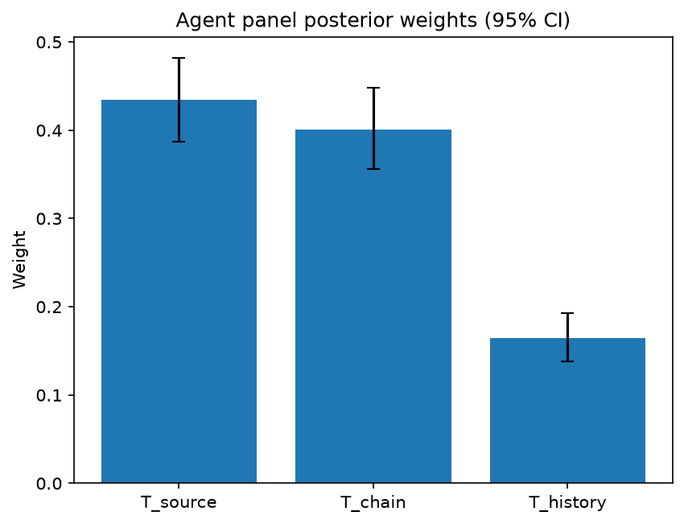

# Survey report: TrustRouter Claude CLI Panel (sonnet) -- Level L3b: Provenance Trust sub-parts

Survey ID: `trustrouter-claude-cli-full-panel-claude-sonnet-2026-09-01-L3b`

## Agent panel

- Agents contributing a valid response: 36
- Classical BWM consistency: 36/36 within threshold

| Criterion | Mean | 95% CI lower | 95% CI upper |
|---|---|---|---|
| T_source | 0.4348 | 0.3874 | 0.4815 |
| T_chain | 0.4009 | 0.3562 | 0.4479 |
| T_history | 0.1643 | 0.1383 | 0.1930 |

## Methodology

Each agent independently completed a Best-Worst Method (BWM) comparison: choosing the single most and least important criterion, then rating every criterion's importance relative to those two on a 1-9 scale. Individual responses were solved with the classical BWM linear program (Rezaei, 2015) for a consistency check, and combined across the panel with a hierarchical Bayesian model (Mohammadi and Rezaei, 2020).

36 agent response(s) were accepted into this result.

Every agent's run began with a QA precheck (its stated configuration verified against ground truth) and every accepted answer's self-reported sources were checked against what reference material was actually available to it; see the Per-agent detail section below and this survey's Conversation Log for each agent's specific results. Every response is schema-validated and independently, repeatedly sampled (never a single completion treated as ground truth); see `guardrails.py`. This survey's complete output is covered by a SHA-256 integrity manifest (`integrity_manifest.json`, `SHA256SUMS`), generated once this run finished, so any later alteration to these files is detectable.

### Charts

## Per-agent detail

### bim-coordinator-base-claude (`bim-coordinator-base-claude`)

- Role: BIM Coordinator
- Model: claude_cli/sonnet
- DID: `did:key:z6MkwaD5PfneZEDso4t2zzYoPEj2qoTJMvwL6gsjm7sm4KYw`
- QA precheck: passed
- Sources used: shared knowledge: trustrouter_expert_questionnaire_v5_real_survey_instrument.md, general_knowledge

**Answer:** `{"best": "T_chain", "worst": "T_history", "best_to_others": {"T_chain": 1, "T_source": 2, "T_history": 5}, "others_to_worst": {"T_chain": 5, "T_source": 3, "T_history": 1}}`

**Reasoning:**

The shared knowledge glossary defines T_source as credentials of the authoring person/organisation, T_chain as integrity of custody from creation to submission, and T_history as the source's historical track record. From a BIM-coordination standpoint, the whole rationale for putting a construction record on a blockchain is to get tamper-evidence over the path a record travels through a federated, multi-stakeholder Common Data Environment (design authoring -> coordination model -> clash detection -> issued-for-construction -> as-built handover). That path is exactly what T_chain covers: if custody is broken or unverifiable between creation and submission, it doesn't matter how credentialed the original author was or how reliable they've been historically -- you can no longer trust that what you're looking at is what was actually produced. Credentialed sources still routinely hand off files through uncontrolled email threads, unmanaged USB transfers, or ad-hoc federation steps outside the CDE, and that break is precisely the failure mode blockchain-backed custody tracking is meant to close, so I rate T_chain as Best. T_source is a strong second: knowing who authored a record (licensed structural engineer vs. unverified subcontractor note) sets the initial trust ceiling before any chain-of-custody or history checks even apply, so it is clearly more consequential than T_history but still one step behind chain integrity for a routing decision that is fundamentally about detecting alteration in transit. T_history is Worst: it is a reputational/Bayesian prior about the source's past behaviour, not direct evidence about this specific record. A source with an excellent track record can still submit a corrupted or altered file on a given day, and a new, well-credentialed source with no track record yet may be perfectly trustworthy; in my experience running clash detection and model federation, we lean on direct verification (who signed it, what happened to it in transit) far more than on a source's reputation when deciding how much scrutiny or protection a given deliverable needs. The gap between T_chain and T_history (rated 5) reflects that custody integrity is the more decisive, evidence-based factor for a blockchain-routing decision, while the gap between T_chain and T_source (rated 2) reflects that credentials and chain are both fairly close, evidence-based signals -- this is a real but not enormous difference. I want to flag this as a professional judgement call rather than something the reference material itself ranks; the questionnaire excerpt defines the three sub-parts but does not state a priority order among them.

### bim-coordinator-base-claude (`bim-coordinator-base-claude`)

- Role: BIM Coordinator
- Model: claude_cli/sonnet
- DID: `did:key:z6MkwaD5PfneZEDso4t2zzYoPEj2qoTJMvwL6gsjm7sm4KYw`
- QA precheck: passed
- Sources used: shared knowledge: trustrouter_expert_questionnaire_v5_real_survey_instrument.md, general_knowledge

**Answer:** `{"best": "T_chain", "worst": "T_history", "best_to_others": {"T_source": 3, "T_chain": 1, "T_history": 6}, "others_to_worst": {"T_source": 4, "T_chain": 6, "T_history": 1}}`

**Reasoning:**

In multi-stakeholder BIM federation, a single record (e.g., a structural model element, an as-built drawing, a compliance certificate) passes through many hands before it lands in the common data environment: originating designer, subcontractor, site team, QA reviewer, facility manager. Each handoff is a point where the file could be altered, re-exported, or misattributed without anyone noticing unless the custody chain is documented. That is also precisely the problem blockchain-style tamper-evidence is meant to solve, so T_chain is the criterion most directly relevant to the routing decision this instrument is built around. I rate it Best. T_source (credentials of the author) is a real and necessary trust signal -- knowing a structural note came from a licensed engineer versus an unverified contractor matters for liability and compliance -- but it is a static, one-time check about who made the record, not about whether what reaches the ledger is what was actually produced; it's a genuinely close second to T_chain, not a distant one. T_history (the source's past reliability) I rate Worst because it is an actuarial, reputation-based inference: it tells you the source has usually been reliable, but says nothing evidentiary about this specific record, and a normally reliable source can still submit a corrupted or altered file on a given occasion. It's a useful prior for risk-scoring but the weakest of the three as a direct provenance check. My best-to-others and others-to-worst values reflect T_chain > T_source > T_history, with the T_chain-vs-T_history gap treated as the largest since custody-chain integrity is both directly verifiable within BIM workflows and central to blockchain's value proposition, while historical track record is the most indirect of the three.

### bim-coordinator-base-claude (`bim-coordinator-base-claude`)

- Role: BIM Coordinator
- Model: claude_cli/sonnet
- DID: `did:key:z6MkwaD5PfneZEDso4t2zzYoPEj2qoTJMvwL6gsjm7sm4KYw`
- QA precheck: passed
- Sources used: shared knowledge: trustrouter_expert_questionnaire_v5_real_survey_instrument.md, general_knowledge

**Answer:** `{"best": "T_chain", "worst": "T_history", "best_to_others": {"T_chain": 1, "T_source": 2, "T_history": 4}, "others_to_worst": {"T_chain": 4, "T_source": 2, "T_history": 1}}`

**Reasoning:**

For a construction record being evaluated for blockchain storage, I ranked T_chain (custody chain integrity) as Best because it is the aspect blockchain technology most directly addresses: tamper-evidence of what happened to a record between creation and submission. In my day-to-day work federating multi-stakeholder models, the actual failure mode I see is not usually 'the author lacked credentials' but 'the file passed through several hands, exports, and re-imports and I can no longer be sure it wasn't altered or that the version I'm clash-detecting against is the approved one.' Custody-chain integrity is also the most directly and objectively verifiable of the three at the point of routing a specific record (was there a continuous, auditable handoff?), which matches the survey's stated goal of quantitative, automatic routing indicators. T_source (who authored it) is important as a baseline gate -- an unqualified or fraudulent author is a real risk -- but once credentials are established for a project role, that fact is largely static and doesn't vary record-by-record the way custody integrity does, so I placed it in the middle. T_history (the source's historical reliability) I ranked Worst: it's a useful prior/reputational signal, but it is the least direct evidence about the trustworthiness of any specific record under consideration -- a historically reliable party can still submit a compromised or mishandled file, and a less-established party can submit an impeccably documented one. I kept the ratios moderate (best-to-worst = 4) rather than extreme, because all three sub-parts of Provenance Trust are related and none is negligible; this is a real but not overwhelming difference in practical weight, and I want to be explicit that the source-vs-chain comparison in particular (rated 2) was a closer call than the chain-vs-history comparison.

### bim-coordinator-rag-claude (`bim-coordinator-rag-claude`)

- Role: BIM Coordinator
- Model: claude_cli/sonnet
- DID: `did:key:z6MkqSfDfSA3Y6V2HcU6A72f4t469gxYRVPTADrJ7HzYtu7a`
- QA precheck: passed
- Sources used: bim_and_digital_building_logbooks.md, shared knowledge: trustrouter_expert_questionnaire_v5_real_survey_instrument.md, general_knowledge

**Answer:** `{"best": "T_chain", "worst": "T_history", "best_to_others": {"T_source": 2, "T_chain": 1, "T_history": 4}, "others_to_worst": {"T_source": 3, "T_chain": 4, "T_history": 1}}`

**Reasoning:**

As a BIM coordinator, day-to-day trust decisions on federated models hinge on being able to reconstruct exactly what happened to a piece of data between creation and submission -- which task team touched it, what transformation or re-export occurred, whether it passed through the sequence of checks ISO 19650's information-delivery process requires before a federated model is accepted (reference: bim_and_digital_building_logbooks.md, citing UK BIM Framework/CIC/BSI/CDBB 2019 guidance on ISO 19650 Part 2). That custody-chain integrity is the actual mechanism practitioners rely on to catch a tampered or corrupted record even when the originating author is fully credentialed, which is also the specific tamper-evidence value proposition blockchain storage is meant to add per the survey's own framing of DLT (shared knowledge: trustrouter_expert_questionnaire_v5_real_survey_instrument.md). I therefore rank T_chain as Best. T_source (who produced it) matters -- a certified structural engineer's stamped drawing carries more initial weight than an unverified subcontractor upload -- but credentials alone say nothing about what happened to the file afterward, so I place it second, roughly twice as important as T_history but clearly behind T_chain. T_history (has this source been reliable before) is the Worst of the three in my judgement: it is a slow-moving, indirect signal that is often thin or unavailable for newer subcontractors, sensor feeds, or one-off suppliers on a given project, and a generally reliable source can still submit a corrupted record if the custody chain for that specific artifact breaks down -- so it is the least actionable of the three for routing an individual record's trust decision, even though it is not irrelevant. This is a genuine judgement call rather than a settled fact from the literature; the provided sources establish that independent, process-based validation (chain-like) is the real-world mechanism ISO 19650 uses, but they do not directly rank track record against the other two, so that part of my ordering rests on my own BIM-coordination experience.

### bim-coordinator-rag-claude (`bim-coordinator-rag-claude`)

- Role: BIM Coordinator
- Model: claude_cli/sonnet
- DID: `did:key:z6MkqSfDfSA3Y6V2HcU6A72f4t469gxYRVPTADrJ7HzYtu7a`
- QA precheck: passed
- Sources used: bim_and_digital_building_logbooks.md, shared knowledge: trustrouter_expert_questionnaire_v5_real_survey_instrument.md, general_knowledge

**Answer:** `{"best": "T_source", "worst": "T_history", "best_to_others": {"T_source": 1, "T_chain": 3, "T_history": 4}, "others_to_worst": {"T_source": 4, "T_chain": 2, "T_history": 1}}`

**Reasoning:**

In a BIM federation context, T_source (who authored the data -- which discipline lead, task team, or certified authority) is the foundational gate: ISO 19650's information-delivery process (bim_and_digital_building_logbooks.md, citing UK BIM Framework 2019) requires task-team and lead-appointed-party validation to establish accountable authorship before a model or record is even accepted into the federated environment. Without credentialed source identity, neither custody nor track record can be meaningfully evaluated -- you cannot verify a chain of custody or a reliability history for an unattributed record. T_chain (custody chain integrity from creation to submission) is the second most important: BUILDCHAIN DBL's use of W3C decentralized identifiers and verifiable credentials (bim_and_digital_building_logbooks.md, Kochovski et al. 2026) is explicitly built to make custody tamper-evident across the IFC/legacy-CAD/sensor-log chain, which matters greatly for a multi-decade logbook but is a downstream check that presumes source identity is already established. T_history (has this source been reliable historically) is real but, from a coordinator's daily practice, the least decisive of the three at the point of accepting a record into the model: track record is a slower-moving, reputational signal that supplements rather than substitutes for verifying who authored a given deliverable and how it moved custody-wise; a source with a good history can still submit a compromised or misattributed record on a given day, so I weight it lowest. This is a judgement call from professional practice (federation/clash-detection workflows) rather than a hard finding in the cited literature, which does not itself rank these three sub-parts against each other. The T_source-vs-T_chain gap is the closer call of the two -- both are clearly more load-bearing than T_history in my experience, so I did not push the ratio to extremes.

### bim-coordinator-rag-claude (`bim-coordinator-rag-claude`)

- Role: BIM Coordinator
- Model: claude_cli/sonnet
- DID: `did:key:z6MkqSfDfSA3Y6V2HcU6A72f4t469gxYRVPTADrJ7HzYtu7a`
- QA precheck: passed
- Sources used: shared knowledge: trustrouter_expert_questionnaire_v5_real_survey_instrument.md, bim_and_digital_building_logbooks.md, general_knowledge

**Answer:** `{"best": "T_source", "worst": "T_history", "best_to_others": {"T_source": 1, "T_chain": 2, "T_history": 4}, "others_to_worst": {"T_source": 4, "T_chain": 3, "T_history": 1}}`

**Reasoning:**

In a BIM federation workflow under ISO 19650, the credentials of the authoring party (T_source) are the foundational gate: a model or record's trustworthiness starts with knowing whether it came from an accredited engineer of record, a certified inspector, or an unverified subcontractor upload, and this determines what downstream scrutiny is even warranted. This is consistent with 'shared knowledge: trustrouter_expert_questionnaire_v5_real_survey_instrument.md', which frames T_source as 'quality of authoring source (person/organisation)' as the first sub-part of Provenance Trust. Custody chain (T_chain) matters because in federated model environments, records pass through multiple task teams and coordination tools (federation, clash coordination, re-export) where integrity can degrade or be tampered with even if the original author was credible -- so it is a close second, capturing a genuinely distinct risk (in-transit integrity vs. origin credibility) rather than being redundant with source. I rated T_source only 2x T_chain because both are near-term, verifiable-at-submission-time properties that a BIM coordinator actively manages via ISO 19650 validation gates (per 'bim_and_digital_building_logbooks.md's discussion of independent-party validation of federated models). Historical track record (T_history) is the weakest for routing decisions in practice: it's a slower-moving, reputational signal that is useful as a prior but is often unavailable for new sources (new subcontractors, new sensor vendors) and, in my project experience, disputes about data integrity usually turn on 'who submitted this and was the chain of custody intact' rather than 'has this party historically been reliable' -- a reliable-seeming party can still submit a corrupted or unauthorized record, and an unproven party can submit an impeccable one. This is a judgement call from my own BIM-coordination experience rather than something spelled out numerically in the reference material, so I want to flag that the T_chain vs T_history gap, while directionally clear to me, is somewhat less decisively supported by the provided sources than the T_source-as-Best choice.

### blockchain-engineer-base-claude (`blockchain-engineer-base-claude`)

- Role: Blockchain / DLT Engineer
- Model: claude_cli/sonnet
- DID: `did:key:z6MkiXdPHgRKLgsWGCi5P19sNTrHqFjySf3d9JD1BYLAirtk`
- QA precheck: passed
- Sources used: shared knowledge: trustrouter_expert_questionnaire_v5_real_survey_instrument.md, general_knowledge

**Answer:** `{"best": "T_source", "worst": "T_history", "best_to_others": {"T_source": 1, "T_chain": 2, "T_history": 4}, "others_to_worst": {"T_source": 4, "T_chain": 3, "T_history": 1}}`

**Reasoning:**

Provenance Trust concerns whether a construction-data record's origin can be trusted before it is ever committed to a ledger. Of the three sub-parts, T_source (credentials/identity of the authoring person or organisation) is the most fundamental: it establishes whether the entity that produced the record (e.g., a certified surveyor, an accredited testing lab, a licensed engineer of record) had the standing to produce trustworthy data in the first place. If the source itself is not credentialed or identifiable, neither an intact custody chain nor a good historical track record can compensate, because both of those are properties layered on top of an already-identified actor. T_chain (custody-chain integrity from creation to submission) is a close second: it verifies that whatever the credentialed source produced was not altered, substituted, or mishandled en route to the ledger gateway, which is operationally critical for tamper-evidence but presupposes a known source to begin with. T_history (the source's historical reliability) is the weakest of the three for a single-record trust decision: it is a useful Bayesian prior for weighting future submissions, but it is backward-looking, slow to accumulate for new or infrequent contributors, and can be gamed by an actor with a long clean history who then submits a compromised record via a broken custody chain -- so it adds the least discriminating power at the moment a specific record needs to be trusted. Hence T_source is Best, T_history is Worst, with T_chain rated closer to T_source than to T_history because chain-of-custody failures are a direct, high-frequency vector for tampering in permissioned-ledger deployments in my operational experience, whereas historical reputation is more of a secondary heuristic. The T_source vs T_history gap (rated 4) and T_chain vs T_history gap (others-to-worst of 3) reflect that both source credentials and custody integrity are meaningfully more decisive than track record, but I acknowledge the T_source/T_chain distinction itself is a closer call than the numbers might suggest -- reasonable engineers could swap their relative weight depending on whether the deployment's primary threat model is impersonation (favors T_source) or interception/mutation in transit (favors T_chain).

### blockchain-engineer-base-claude (`blockchain-engineer-base-claude`)

- Role: Blockchain / DLT Engineer
- Model: claude_cli/sonnet
- DID: `did:key:z6MkiXdPHgRKLgsWGCi5P19sNTrHqFjySf3d9JD1BYLAirtk`
- QA precheck: passed
- Sources used: shared knowledge: trustrouter_expert_questionnaire_v5_real_survey_instrument.md, general_knowledge

**Answer:** `{"best": "T_chain", "worst": "T_history", "best_to_others": {"T_source": 3, "T_chain": 1, "T_history": 4}, "others_to_worst": {"T_source": 2, "T_chain": 4, "T_history": 1}}`

**Reasoning:**

For construction-project records being considered for blockchain storage, the decisive question is whether the record can be trusted as an accurate, untampered representation of what actually happened between creation and submission -- that is exactly what T_chain (custody-chain integrity) captures. A blockchain/DLT's core value proposition is tamper-evidence over a chain of custody: hashing, timestamping, and append-only logging are designed precisely to detect gaps or alterations in custody, so custody-chain integrity is the criterion most directly addressed by, and most decision-relevant to, the on-chain/hybrid/conventional routing choice. T_source (who produced it) matters because credentialed authors are less likely to originate bad data, but it is a prior/static property of the actor, not of the specific record's journey, so it's a real but secondary signal -- I rate it 3 (Best-to-Source) reflecting that it's clearly less central than custody chain but still substantially more important than historical track record. T_history (has the source been reliable before) is the weakest of the three for a routing decision because it is backward-looking and statistical -- useful for risk scoring an actor over time, but it says little about whether *this particular record* was preserved intact, and a source with a good track record can still submit a corrupted or late record, while a newer/unproven source could submit a perfectly custody-verified one. This is a genuine judgement call rather than a clear-cut case: T_source vs T_history could plausibly be argued closer than I've rated them, since both are properties of the actor rather than the record's journey, but I judged source credentials as more actionable/verifiable (credentials, licensure, organizational identity) than an accumulated reliability score, which is noisier and slower to establish for new but legitimate sources. Ratios: Best_to_Others gives T_chain=1 (itself), T_source=3, T_history=4; Others_to_Worst gives T_history=1 (itself), T_source=2, T_chain=4, consistent with T_chain > T_source > T_history.

### blockchain-engineer-base-claude (`blockchain-engineer-base-claude`)

- Role: Blockchain / DLT Engineer
- Model: claude_cli/sonnet
- DID: `did:key:z6MkiXdPHgRKLgsWGCi5P19sNTrHqFjySf3d9JD1BYLAirtk`
- QA precheck: passed
- Sources used: shared knowledge: trustrouter_expert_questionnaire_v5_real_survey_instrument.md, general_knowledge

**Answer:** `{"best": "T_source", "worst": "T_history", "best_to_others": {"T_source": 1, "T_chain": 2, "T_history": 4}, "others_to_worst": {"T_source": 4, "T_chain": 3, "T_history": 1}}`

**Reasoning:**

Decomposing Provenance Trust (PT) per shared knowledge: trustrouter_expert_questionnaire_v5_real_survey_instrument.md into T_source (who authored the data), T_chain (custody integrity from creation to submission), and T_history (the source's track record). In a permissioned-ledger deployment for construction data, T_source is the root of trust: if the authoring party's identity/credentials cannot be established and cryptographically bound (e.g., via PKI-issued credentials tied to a licensed engineer, inspector, or authorized organization), nothing downstream is meaningful -- a perfectly preserved custody chain or a spotless track record attached to an unverified or unauthorized actor is worthless, since you'd just be faithfully transmitting or crediting an untrustworthy origin. T_chain is the second most important: even with a credentialed source, data can be altered, substituted, or mis-attributed between creation and on-chain submission (e.g., off-chain edits before hashing, compromised oracle/gateway ingestion), so custody-chain integrity is what a DLT's hash-linking and timestamping most directly protects against and is core engineering territory for tamper-evidence. T_history is real but secondary and comparatively low-stakes for a per-record trust decision: a track record is a probabilistic, reputational signal aggregated over past behavior -- useful for risk scoring and for deciding how much scrutiny to apply, but it does not itself establish or break the validity of a specific record the way source identity and chain-of-custody do, and a source with a poor history but airtight credentials and custody controls on a specific submission can still produce a trustworthy record. I rated T_source vs T_chain as 2 (both are close to foundational, but source identity is a strict logical prerequisite for custody-chain verification meaning anything -- you need to know whose custody chain you're verifying), T_source vs T_history as 4 (a clear gap: identity/credentials are a hard gate, historical reliability is a soft, aggregate signal), and T_chain vs T_history as 3 in the OTW table (custody integrity is an active, per-record technical control; history is passive and retrospective). This is a judgement call based on how permissioned-DLT trust architectures are typically layered (identity/authentication as the base layer, then data-integrity controls, then reputation/risk scoring as a modulating layer) rather than a citation to a specific empirical study in the provided material, which does not quantify relative weights between these three sub-parts.

### blockchain-engineer-rag-claude (`blockchain-engineer-rag-claude`)

- Role: Blockchain / DLT Engineer
- Model: claude_cli/sonnet
- DID: `did:key:z6MkopvxUWWWCS4idsrstN99GZf9TsfLRkdw69bu1hJ8anGq`
- QA precheck: passed
- Sources used: blockchain_trust_and_attack_resistance.md, shared knowledge: trustrouter_expert_questionnaire_v5_real_survey_instrument.md, general_knowledge

**Answer:** `{"best": "T_chain", "worst": "T_history", "best_to_others": {"T_source": 3, "T_chain": 1, "T_history": 5}, "others_to_worst": {"T_source": 3, "T_chain": 5, "T_history": 1}}`

**Reasoning:**

In a permissioned-ledger deployment for construction-project data, T_chain (custody chain integrity from creation to submission) is the criterion that most directly maps onto what blockchain/DLT technology actually verifies and enforces: hash chains, signed hand-offs, timestamped submission events, and tamper-evidence of the path data took before it hit the ledger. This is the layer where the technology's core value proposition (immutability, cryptographic linkage of custody events) is realized, so from a technical-feasibility and tamper-evidence standpoint it is the most load-bearing sub-part of Provenance Trust. T_source (who produced it -- credentials of the person/organisation) matters but is largely an off-chain, identity/PKI-management question that DLT can record but not itself establish; it's a necessary input, not something the ledger verifies dynamically. T_history (track record) is the weakest of the three for a routing decision: it's a slow-moving, reputational aggregate that is useful as a prior but doesn't tell you anything about the specific record under consideration, and a bad-history source can still submit a well-custodied, verifiable record (and vice versa) -- so it has the least direct bearing on whether this particular piece of data deserves on-chain trust. This ranking reflects my own engineering judgement about where DLT mechanisms actually add verifiable value (custody/chain-of-hashes) versus where they merely store an externally-asserted attribute (source credentials, historical reputation); the reference material (Rouhani and Deters 2021, per blockchain_trust_and_attack_resistance.md) supports treating provenance and auditing/accountability as core O'Hara data-trust properties operationalized via ledger-recorded transaction history, which aligns with weighting the chain-of-custody component highly, but it does not itself rank T_source vs T_history against each other, so that part of the ordering is my own judgement call. The comparison between T_source and T_history is somewhat close -- both are 'off-ledger' inputs -- but I lean toward source credentials being marginally more decision-relevant per-record than a historical aggregate.

### blockchain-engineer-rag-claude (`blockchain-engineer-rag-claude`)

- Role: Blockchain / DLT Engineer
- Model: claude_cli/sonnet
- DID: `did:key:z6MkopvxUWWWCS4idsrstN99GZf9TsfLRkdw69bu1hJ8anGq`
- QA precheck: passed
- Sources used: blockchain_trust_and_attack_resistance.md, shared knowledge: trustrouter_expert_questionnaire_v5_real_survey_instrument.md, general_knowledge

**Answer:** `{"best": "T_chain", "worst": "T_history", "best_to_others": {"T_source": 3, "T_chain": 1, "T_history": 6}, "others_to_worst": {"T_source": 3, "T_chain": 6, "T_history": 1}}`

**Reasoning:**

From a blockchain/DLT engineering standpoint focused on tamper-evidence, T_chain (custody-chain integrity from creation to submission) is the criterion that maps most directly onto what a ledger can actually enforce and verify: hash-linking, timestamping, and signature-at-each-handoff give a cryptographically checkable trail of whether the record was altered en route. This is the core technical value proposition of putting construction data on-chain at all -- it converts a trust claim into a verifiable proof. T_source (who produced the data -- credentials of a person/organisation) matters as the initial trust anchor and identity check, but it is essentially a one-time, PKI/identity-style attestation that doesn't tell you anything about what happened to the data afterward -- a credentialed source's data can still be corrupted or substituted in transit if custody isn't cryptographically chained, so I rate it well below T_chain but above T_history. T_history (the source's track record) is the softest of the three: it's a statistical, reputation-based signal aggregated over past behavior, not a per-transaction verifiable property, and it is the least amenable to cryptographic enforcement -- a good track record doesn't prove this specific record's integrity, and a blockchain can't natively validate 'reliability over time' the way it can validate a hash chain. This ordering follows the same logic as the adaptive-trust framework in Rouhani and Deters (2021), where provenance/audit-trail completeness directly gates how much validation/consensus effort a piece of data needs -- custody-chain-style evidence is what that framework treats as actionable, machine-checkable trust input, whereas historical reputation is a slower-moving, softer prior. The gap between T_chain and T_history is large (6) because one is cryptographically verifiable per-record and the other is a probabilistic aggregate; T_source sits in between because it's verifiable (via PKI/identity) but static and doesn't capture in-transit integrity. This is a genuine judgement call from an engineering lens -- a compliance or legal-admissibility-focused reviewer might rank T_source higher, so I flag this comparison as less than fully clear-cut.

### blockchain-engineer-rag-claude (`blockchain-engineer-rag-claude`)

- Role: Blockchain / DLT Engineer
- Model: claude_cli/sonnet
- DID: `did:key:z6MkopvxUWWWCS4idsrstN99GZf9TsfLRkdw69bu1hJ8anGq`
- QA precheck: passed
- Sources used: blockchain_trust_and_attack_resistance.md, shared knowledge: trustrouter_expert_questionnaire_v5_real_survey_instrument.md, general_knowledge

**Answer:** `{"best": "T_chain", "worst": "T_history", "best_to_others": {"T_source": 2, "T_chain": 1, "T_history": 6}, "others_to_worst": {"T_source": 3, "T_chain": 6, "T_history": 1}}`

**Reasoning:**

As a DLT engineer thinking about what a chain/routing decision actually needs to verify for a given construction record, I ranked T_chain (custody chain) as Best. Custody-chain integrity -- what happened to the record between creation and submission -- is precisely the property that blockchain/DLT tooling is technically built to enforce and make tamper-evident: hash-linking, per-hop signatures, and timestamping give a verifiable, per-record audit trail, which is the core engineering value-add DLT brings over conventional storage. This lines up with the O'Hara-property framing summarized in [blockchain_trust_and_attack_resistance.md] (Rouhani and Deters 2021), where 'auditing' and per-asset endorsement (trust computed per data asset, not just per owner) map most directly onto custody-chain integrity, and where the adaptive-validation mechanism keys off exactly this kind of per-transaction trust signal rather than a static reputation score. T_source (who authored it, i.e. their credentials) is a real and necessary prior -- a perfectly preserved custody chain around data from an unqualified source is still weak data -- so I placed it in the middle, meaningfully more important than T_history but clearly behind T_chain for a per-record routing decision. T_history (has this source been reliable historically) I rated Worst: it is a lagging, aggregate signal about the source in general, not about the specific record being routed. A historically reliable source can still submit a tampered or erroneous record, and a new/unproven source can still submit a perfectly custody-verified one; from an engineering feasibility and tamper-evidence standpoint, track record is useful as a coarse prior risk-weighting but carries the least direct bearing on whether *this* record deserves on-chain trust. This is a judgement call about relative weighting rather than something directly stated in the reference material, though it is consistent with the emphasis in [blockchain_trust_and_attack_resistance.md] on per-transaction/per-asset trust computation over static owner reputation alone. The Best/Source comparison (2x) was the closest call in this set -- source credentials are not far behind custody chain in importance, and a case could reasonably be made either way there.

### compliance-officer-base-claude (`compliance-officer-base-claude`)

- Role: Compliance and Regulatory Officer
- Model: claude_cli/sonnet
- DID: `did:key:z6MkwUN3K4YmG9arhbzyAxMLs314eLG46wmPnKoYLVUT8Rzm`
- QA precheck: passed
- Sources used: shared knowledge: trustrouter_expert_questionnaire_v5_real_survey_instrument.md, general_knowledge

**Answer:** `{"best": "T_source", "worst": "T_chain", "best_to_others": {"T_source": 1, "T_chain": 3, "T_history": 2}, "others_to_worst": {"T_source": 3, "T_chain": 1, "T_history": 2}}`

**Reasoning:**

Per shared knowledge: trustrouter_expert_questionnaire_v5_real_survey_instrument.md, Provenance Trust (PT) decomposes into T_source (authoring credentials of the person/organisation), T_chain (integrity of custody from creation to submission), and T_history (historical reliability of the source). For construction-project records destined for blockchain storage, T_source is the foundational determinant: if the originating party lacks the professional standing to make the assertion (e.g., a signed report from a chartered structural engineer per the referenced example), no amount of intact custody or historical reliability can substitute -- an unqualified or unauthorized source undermines the record's evidentiary and regulatory value from the outset, including under GDPR data-controller accountability and construction regulatory sign-off requirements. T_history, while valuable, is essentially a derivative signal -- it is built up from repeated instances of source credentials proving reliable over time, so it is secondary to source credentials themselves but still meaningfully informative for calibrating trust (a track record helps distinguish nominally-credentialed sources that have proven unreliable from those that consistently deliver). T_chain (custody integrity) is important for tamper-evidence and audit purposes, but on a blockchain-storage use case, much of the custody-chain integrity concern is precisely what the ledger technology and accompanying hashing/timestamping infrastructure is designed to compensate for or evidence separately (this overlaps with the Verification Strength (V) factor's cryptographic/audit-trail role noted in the same instrument), making it comparatively least critical among the three PT sub-parts on a standalone basis. This is a judgement call: the three sub-parts are conceptually close and interdependent, and a reasonable case could be made for ranking T_history above T_source in specific repeat-vendor scenarios, but as a general compliance stance, an unverifiable or unqualified source is the more fundamental risk than an imperfect but traceable chain of custody.

### compliance-officer-base-claude (`compliance-officer-base-claude`)

- Role: Compliance and Regulatory Officer
- Model: claude_cli/sonnet
- DID: `did:key:z6MkwUN3K4YmG9arhbzyAxMLs314eLG46wmPnKoYLVUT8Rzm`
- QA precheck: passed
- Sources used: shared knowledge: trustrouter_expert_questionnaire_v5_real_survey_instrument.md, general_knowledge

**Answer:** `{"best": "T_source", "worst": "T_history", "best_to_others": {"T_source": 1, "T_chain": 2, "T_history": 4}, "others_to_worst": {"T_source": 4, "T_chain": 2, "T_history": 1}}`

**Reasoning:**

From a compliance-officer lens, Provenance Trust for a construction record ultimately has to answer 'who is legally accountable for this data and can that accountability be established.' T_source (source credentials) does that directly: a signed report from a chartered structural engineer or a licensed authority is what building codes, professional-liability regimes, and GDPR's data-controller/processor identification requirements actually key on (per shared knowledge: trustrouter_expert_questionnaire_v5_real_survey_instrument.md, PT's example is precisely 'signed report from a chartered structural engineer'). Without a credentialed, identifiable source, neither a clean custody chain nor a good historical record has much regulatory weight, since there is no accountable party to attach compliance obligations to. T_chain (custody chain) I rank second: chain-of-custody integrity is a recognised evidentiary concept and matters for tamper-evidence and audit-trail admissibility, but it is a control on top of an already-identified source rather than a substitute for one -- a pristine custody chain for an anonymous or unqualified originator still leaves compliance exposure. T_history (historical track record) I rank lowest: it is a reputational/statistical heuristic -- useful corroboration -- but it is not itself a formal regulatory or legal criterion, is harder to verify objectively, and can be gamed or simply unavailable for new-but-properly-credentialed sources, so it should not be weighted as heavily as either the source's formal credentials or the procedural integrity of custody. I set best_to_others and others_to_worst to be internally consistent (T_source:T_chain=2, T_chain:T_history=2, T_source:T_history=4=2x2) since these are genuinely on a graduated scale rather than sharply separated tiers -- the T_source vs T_chain gap in particular is a closer call than the gap to T_history, and I want to flag that explicitly rather than overstate confidence in ranking credentials far above chain-of-custody.

### compliance-officer-base-claude (`compliance-officer-base-claude`)

- Role: Compliance and Regulatory Officer
- Model: claude_cli/sonnet
- DID: `did:key:z6MkwUN3K4YmG9arhbzyAxMLs314eLG46wmPnKoYLVUT8Rzm`
- QA precheck: passed
- Sources used: shared knowledge: trustrouter_expert_questionnaire_v5_real_survey_instrument.md, general_knowledge

**Answer:** `{"best": "T_source", "worst": "T_chain", "best_to_others": {"T_source": 1, "T_chain": 3, "T_history": 2}, "others_to_worst": {"T_source": 3, "T_chain": 1, "T_history": 2}}`

**Reasoning:**

Per shared knowledge: trustrouter_expert_questionnaire_v5_real_survey_instrument.md, Provenance Trust (PT) decomposes into T_source (authority of the authoring person/organisation), T_chain (integrity of custody chain from creation to submission), and T_history (historical track record of the source). From a compliance-officer standpoint responsible for GDPR and construction-regulatory obligations, T_source is the foundational gate: if the identity and credentials of the authoring party cannot be established (e.g. a chartered structural engineer's signed report versus an anonymous or unqualified submission), everything downstream -- custody integrity and track record -- is moot, because there is no accountable legal/natural person to attach liability, data-controller obligations, or regulatory sign-off responsibility to. GDPR accountability and construction regulatory regimes (e.g. building-control sign-off requirements) both hinge on a verifiable, identifiable responsible party first. T_history is a useful but secondary signal -- a good track record cannot substitute for confirmed credentials on a given record, but it does provide independent corroborating weight on reliability once source identity is known, so it sits between the two. T_chain (custody integrity) I rate as least important of the three specifically in the PT decomposition: it matters greatly for tamper-evidence, but that concern is substantially covered elsewhere in the TrustRouter framework under Verification Strength (V, e.g. cryptographic hashes/signatures/audit-trail completeness per the same instrument), so within PT specifically, chain custody is comparatively the weakest discriminator of trust relative to knowing who produced the data and whether they have a track record of reliability. The 1-2-3 spread reflects that this is a real but not extreme differentiation -- all three sub-parts of PT are meaningfully important to compliance judgement, and the case for T_source over T_history is closer than the case for T_source over T_chain, which I flag as the more genuinely debatable ranking.

### compliance-officer-rag-claude (`compliance-officer-rag-claude`)

- Role: Compliance and Regulatory Officer
- Model: claude_cli/sonnet
- DID: `did:key:z6Mkiny4nghtEZgRh1GDTK1uVN3K6yiWKovHursQ4YEVJq2c`
- QA precheck: passed
- Sources used: shared knowledge: trustrouter_expert_questionnaire_v5_real_survey_instrument.md, gdpr_and_data_governance.md, general_knowledge

**Answer:** `{"best": "T_source", "worst": "T_history", "best_to_others": {"T_source": 1, "T_chain": 2, "T_history": 4}, "others_to_worst": {"T_source": 4, "T_chain": 3, "T_history": 1}}`

**Reasoning:**

From a compliance-officer standpoint, T_source (source credentials) is the entry gate for legal validity: a construction record only carries regulatory weight if the person/organisation behind it had the authority to produce it (e.g. a chartered structural engineer's signed report, per the shared instrument's own example under PT). Without valid credentials, nothing downstream -- custody integrity or reliability history -- can rescue the record's legal standing, and this maps onto the same regulatory-identity concern the SoK on-chain-identity literature raises (on-chain identity as an AML/KYC-style compliance problem, gdpr_and_data_governance.md), where establishing who is behind a record is itself the compliance-critical step before any trust score is computed. T_chain (custody chain) is a close second: an unbroken, tamper-evident chain of custody from creation to submission is what lets a record stand up as evidence in a dispute or audit, and it is functionally what the accountability principle under GDPR and standard audit-trail practice both demand -- but it presupposes a credentialed source in the first place, so I rank it just below T_source rather than above or equal to it; this is a genuinely close call, not a wide gap. T_history (historical track record) is the weakest of the three from a strict compliance-gate perspective: it is a useful probabilistic/reputational signal for risk triage, but no building-code or GDPR obligation is gated on 'has this source been reliable before' -- a first-time submitter with impeccable credentials and an intact custody chain is fully compliant regardless of track record, whereas a source with a long good history but broken credentials or a tampered chain is not. Hence T_source best, T_history worst, with T_chain positioned closer to Best than to Worst.

### compliance-officer-rag-claude (`compliance-officer-rag-claude`)

- Role: Compliance and Regulatory Officer
- Model: claude_cli/sonnet
- DID: `did:key:z6Mkiny4nghtEZgRh1GDTK1uVN3K6yiWKovHursQ4YEVJq2c`
- QA precheck: passed
- Sources used: shared knowledge: trustrouter_expert_questionnaire_v5_real_survey_instrument.md, gdpr_and_data_governance.md, general_knowledge

**Answer:** `{"best": "T_source", "worst": "T_history", "best_to_others": {"T_source": 1, "T_chain": 3, "T_history": 6}, "others_to_worst": {"T_source": 6, "T_chain": 3, "T_history": 1}}`

**Reasoning:**

From a compliance officer's standpoint, Provenance Trust exists in the TrustRouter framework to answer 'who is accountable for this data and can that accountability be legally relied upon' -- and that question is answered first and most decisively by T_source. Source credentials (e.g., a signed report from a chartered structural engineer, per shared knowledge: trustrouter_expert_questionnaire_v5_real_survey_instrument.md's own worked example) establish the legal identity and authority of the data controller/author, which is the anchor point for GDPR accountability obligations and for construction-regulatory attribution of liability (who certified what, under what license). Without a credentialed, identifiable source, neither custody-chain evidence nor a track record has anyone to attach to -- an impeccable chain of custody for an anonymous or unlicensed source doesn't satisfy the regulatory need to know who is answerable for the record. T_chain (custody-chain integrity) is the second-most important: it is the evidentiary backbone for admissibility and tamper-evidence once a credentialed source is established, so I place it meaningfully but not overwhelmingly below T_source. T_history (historical track record) is the weakest of the three from a pure compliance lens: it is a reputational/probabilistic signal about past reliability, not a hard legal or regulatory requirement -- a first-time but properly licensed and credentialed source with an intact custody chain can be fully compliant even with no track record at all, whereas the reverse (a source with a long track record but no verifiable credentials or licensing) would still fail a legal/privacy suitability gate. This ordering reflects gdpr_and_data_governance.md's framing of establishing a privacy-compliant, accountable identity as the threshold regulatory concern that precedes any downstream trust scoring. I note this is a genuine judgement call rather than a source-documented ranking -- the reference material describes what T_source, T_chain, and T_history mean but does not itself rank them against each other, so the relative-importance ordering here is my own professional reasoning applied to those definitions.

### compliance-officer-rag-claude (`compliance-officer-rag-claude`)

- Role: Compliance and Regulatory Officer
- Model: claude_cli/sonnet
- DID: `did:key:z6Mkiny4nghtEZgRh1GDTK1uVN3K6yiWKovHursQ4YEVJq2c`
- QA precheck: passed
- Sources used: shared knowledge: trustrouter_expert_questionnaire_v5_real_survey_instrument.md, gdpr_and_data_governance.md, general_knowledge

**Answer:** `{"best": "T_source", "worst": "T_history", "best_to_others": {"T_source": 1, "T_chain": 2, "T_history": 4}, "others_to_worst": {"T_source": 4, "T_chain": 2, "T_history": 1}}`

**Reasoning:**

As the compliance officer accountable for tying a construction record back to a legally responsible party, T_source (credentials of the authoring person/organisation, per shared knowledge: trustrouter_expert_questionnaire_v5_real_survey_instrument.md's definition of PT decomposition) is the criterion that most directly satisfies regulatory and liability requirements: a signed dossier from a chartered structural engineer is meaningful precisely because the credential establishes who is legally answerable if the record is wrong, which is the same logic gdpr_and_data_governance.md applies when it frames on-chain identity as fundamentally an AML/KYC-style regulatory-compliance problem rather than a purely technical one. Without a credentialed source, an impeccable custody chain or a strong historical track record cannot manufacture legal accountability that isn't there. T_chain (custody-chain integrity from creation to submission) sits in the middle: it matters for tamper-evidence and audit admissibility, and complements T_source, but it presupposes a source worth tracking in the first place, so I rate it clearly below T_source but well above T_history. T_history (the source's past reliability) is the weakest for compliance purposes: it is a probabilistic, reputational signal that a new but properly credentialed and well-audited source may simply not have yet, and unlike credentials or a documented custody chain, a track record carries no binding legal weight on its own -- it is corroborative context, not a compliance requirement. I set best-to-others as T_source=1, T_chain=2, T_history=4, and others-to-worst as T_source=4, T_chain=2, T_history=1, which keeps the two tables consistent (2x2=4 matches the direct T_source-vs-T_history ratio of 4). This is a moderately close call between T_source and T_chain -- both are load-bearing for a compliance sign-off -- but T_history is clearly the weakest of the three on regulatory grounds.

### data-engineer-base-claude (`data-engineer-base-claude`)

- Role: Data Engineering Specialist
- Model: claude_cli/sonnet
- DID: `did:key:z6Mkgetd4SzJJVFgp33Mr15qYrPY1rWLsTBk9egDkh4y3VV5`
- QA precheck: passed
- Sources used: shared knowledge: trustrouter_expert_questionnaire_v5_real_survey_instrument.md, general_knowledge

**Answer:** `{"best": "T_chain", "worst": "T_history", "best_to_others": {"T_chain": 1, "T_source": 2, "T_history": 6}, "others_to_worst": {"T_history": 1, "T_source": 3, "T_chain": 6}}`

**Reasoning:**

Per shared knowledge: trustrouter_expert_questionnaire_v5_real_survey_instrument.md, T_source is 'quality of authoring source (person/organisation)', T_chain is 'integrity of custody chain from creation to submission', and T_history is 'historical track record of the source'. From a data-engineering/provenance-pipeline standpoint, custody-chain integrity (T_chain) is the most directly diagnostic signal for a specific record being considered for blockchain storage: it is the closest analogue to what a hash-chain/audit-trail actually verifies (has this artifact been altered, by whom, and when, between creation and submission), and it is the property that immutable ledger storage is specifically designed to protect and evidence going forward. A record from a highly credentialed source but with an unverifiable or broken custody chain is exactly the failure mode blockchain routing is meant to guard against, so T_chain is Best. T_source (who produced it) is a necessary but coarser gating signal -- it tells you the actor's nominal authority/competence but not whether this particular record was handled correctly -- so I rank it second, fairly close behind T_chain (ratio 2), reflecting that this is a real but not overwhelming gap; a reviewer could reasonably argue source credentials should rank first as the precondition for trusting custody records at all, so I flag this as a genuinely close call rather than a clean-cut ranking. T_history (aggregate past reliability of the source) is Worst: it is a statistical, backward-looking proxy that is weakest for any single record -- a source with an excellent track record can still submit a corrupted or mishandled artifact on a given occasion, and conversely a new or infrequently-observed source could have an impeccable custody chain and appropriate credentials despite lacking a track record, so track record is the least direct evidence of the three for a specific provenance decision. The magnitude gap (6x) between T_chain and T_history, and the corresponding others-to-worst ratios, reflect that direct process verification (chain) and identity verification (source) are qualitatively stronger and more actionable evidence than an aggregate reputational signal, though I hold this with moderate rather than high confidence since the source material does not itself rank these three sub-factors.

### data-engineer-base-claude (`data-engineer-base-claude`)

- Role: Data Engineering Specialist
- Model: claude_cli/sonnet
- DID: `did:key:z6Mkgetd4SzJJVFgp33Mr15qYrPY1rWLsTBk9egDkh4y3VV5`
- QA precheck: passed
- Sources used: shared knowledge: trustrouter_expert_questionnaire_v5_real_survey_instrument.md, general_knowledge

**Answer:** `{"best": "T_chain", "worst": "T_history", "best_to_others": {"T_chain": 1, "T_source": 3, "T_history": 6}, "others_to_worst": {"T_chain": 6, "T_source": 3, "T_history": 1}}`

**Reasoning:**

For routing construction-project records into full on-chain, hybrid, or conventional storage, the decision hinges on how trustworthy this specific data instance is right now, not just who originally created it. T_chain (custody chain integrity from creation to submission) is the criterion most directly actionable and verifiable by the technical mechanisms DLT/blockchain actually provides -- hashes, timestamps, signed handoffs, audit logs -- per shared knowledge: trustrouter_expert_questionnaire_v5_real_survey_instrument.md's framing of T_chain as 'integrity of custody chain from creation to submission.' A break or gap in custody undermines trust regardless of how credentialed the original source was, which is why I rate it Best. T_source (source credentials -- who produced the data) matters, but it establishes only an initial prior about data quality; a highly credentialed engineer's record can still be corrupted or altered downstream, so credentials alone don't verify the specific record's integrity. I placed it as an intermediate factor (3x weaker than T_chain). T_history (historical track record of the source) is the weakest of the three for this routing decision: it is a reputational, statistical heuristic aggregated over past behavior, and is largely redundant with/derivative of T_source (a good track record is usually built by a credentialed source), while offering the least direct, record-specific evidence about the trustworthiness of the particular submission being routed. That is why I rate it Worst, with a 6x gap from T_chain and a 4x gap implied from T_source. This is a professional judgement call about relative decision-relevance for a routing engine, not a claim that historical reliability is unimportant in absolute terms -- in a different context (e.g., vetting a new data supplier before any transactions occur) its relative weight could look different.

### data-engineer-base-claude (`data-engineer-base-claude`)

- Role: Data Engineering Specialist
- Model: claude_cli/sonnet
- DID: `did:key:z6Mkgetd4SzJJVFgp33Mr15qYrPY1rWLsTBk9egDkh4y3VV5`
- QA precheck: passed
- Sources used: shared knowledge: trustrouter_expert_questionnaire_v5_real_survey_instrument.md, general_knowledge

**Answer:** `{"best": "T_chain", "worst": "T_history", "best_to_others": {"T_source": 2, "T_chain": 1, "T_history": 4}, "others_to_worst": {"T_source": 2, "T_chain": 4, "T_history": 1}}`

**Reasoning:**

Decomposing Provenance Trust for a routing decision that will feed a machine-evaluable trust score, custody chain integrity (T_chain) is the most operationally decisive factor: it is the component that is directly, cryptographically verifiable (hash continuity, timestamps, handoff logs from creation to submission) and it is exactly the property blockchain/DLT storage is meant to protect and attest to going forward. A record with impeccable source credentials but a broken or undocumented custody chain cannot be trusted for immutable storage, because tampering in transit is unprovable either way -- so I rate T_chain as Best. Source credentials (T_source) matter as a prior -- who authored the data affects baseline plausibility -- but credentials alone say nothing about what happened to the record between creation and ingestion, so I place it as a solid second, roughly half as decisive as custody chain (rating 2). Historical track record (T_history) is the weakest of the three for this purpose: it is a retrospective, aggregate signal that is frequently unavailable for newer contractors, subcontractors, or sensor vendors, is hard to verify with the same rigor as a cryptographic chain, and is susceptible to survivorship or reporting bias, so it is Worst. The ratings are set for internal consistency (T_chain:T_source=2, T_chain:T_history=4, implying T_source:T_history=2, which is what others_to_worst reflects) rather than treated as independent guesses. This is a judgement call grounded in general data-engineering/provenance practice rather than a hard finding from the reference material, since the questionnaire excerpt defines the three sub-criteria but does not itself rank them.

### data-engineer-rag-claude (`data-engineer-rag-claude`)

- Role: Data Engineering Specialist
- Model: claude_cli/sonnet
- DID: `did:key:z6Mkta5fLioPz9PQkLBgPZfd9wUysHgeeeJvCSKX8fKiEjHp`
- QA precheck: passed
- Sources used: data_quality_and_polyglot_persistence.md, shared knowledge: trustrouter_expert_questionnaire_v5_real_survey_instrument.md, general_knowledge

**Answer:** `{"best": "T_chain", "worst": "T_source", "best_to_others": {"T_chain": 1, "T_history": 2, "T_source": 6}, "others_to_worst": {"T_source": 1, "T_history": 3, "T_chain": 6}}`

**Reasoning:**

From a data-engineering standpoint, custody chain (T_chain) is the criterion I actually instrument and can verify programmatically: hash chains, timestamps, transformation logs, and lineage graphs are the concrete artefacts a pipeline produces at every hop from creation to submission. The shared knowledge note on data trust properties (discovery, provenance, access control, auditing, accountability) explicitly frames a pipeline's own audit logging and lineage tracking as 'the first-hand source of evidence a Verification Strength (V) or Provenance Trust (PT) score should actually be based on' (data_quality_and_polyglot_persistence.md) -- that is a direct description of T_chain, not of source credentials or historical reputation, so I weight it as Best. T_history (historical track record) is a useful but derived/statistical signal: it is essentially a rollup of past custody-chain and outcome data, valuable for prior confidence but a lagging indicator with a cold-start problem for new sources or new projects, so I place it second. T_source (credentials of the authoring person/organization) I rank Worst: it is largely static metadata (who they are, what license/accreditation they hold) that does not tell you what actually happened to a specific data item in transit, nor does it update as new evidence accrues -- a reputable source can still submit data whose custody chain was compromised, and an unfamiliar source with an impeccably logged chain is more verifiable than a famous one with no audit trail. The ratios (T_chain=1, T_history=2, T_source=6 on Best-to-Others; T_source=1, T_history=3, T_chain=6 on Others-to-Worst) are internally consistent (2x3=6 matches the Best-Worst gap of 6), reflecting a substantial but not extreme gap between chain-of-custody evidence and static credentials, with track record occupying a clear middle position. I want to flag this is a professional judgement call rather than a claim with a citable numeric basis -- the reference material supports the qualitative ranking (chain/audit evidence as primary) but not the specific integers, which come from my own domain reasoning.

### data-engineer-rag-claude (`data-engineer-rag-claude`)

- Role: Data Engineering Specialist
- Model: claude_cli/sonnet
- DID: `did:key:z6Mkta5fLioPz9PQkLBgPZfd9wUysHgeeeJvCSKX8fKiEjHp`
- QA precheck: passed
- Sources used: data_quality_and_polyglot_persistence.md, general_knowledge

**Answer:** `{"best": "T_chain", "worst": "T_history", "best_to_others": {"T_source": 2, "T_chain": 1, "T_history": 4}, "others_to_worst": {"T_source": 2, "T_chain": 4, "T_history": 1}}`

**Reasoning:**

From a data-engineering standpoint, custody chain (T_chain) is the criterion my own instrumentation can most directly evidence: audit logs, timestamps, hash chains, and lineage metadata generated by the pipeline itself are first-hand, verifiable records of what happened to a data item between creation and submission. This matches the point made in data_quality_and_polyglot_persistence.md that 'a data pipeline's own audit logging and lineage tracking is often the first-hand source of evidence a Verification Strength (V) or Provenance Trust (PT) score should actually be based on' -- custody chain is precisely that lineage signal, and it is also what blockchain's immutability guarantee is actually protecting (tamper-evidence going forward from the point of first custody), so it has the most direct bearing on a full-chain vs hybrid vs conventional routing decision. Source credentials (T_source) matter -- e.g., verifying a licensed structural engineer's stamp is a legitimate compliance check in construction records -- but this is a one-time identity check that doesn't tell you whether the record was altered afterward, so I place it as a secondary, moderately-important factor. Historical track record (T_history) is the weakest of the three for this purpose: it is a slow-moving, aggregate reputational signal about the source in general, not direct evidence about this specific artefact's integrity, and it is the hardest of the three to operationalize inside a real-time data-quality/routing pipeline (it requires longitudinal reliability data that may not exist for newer or less-frequent contributors). This is a judgement call rather than something the reference material states outright, since none of the provided sources rank these three sub-parts directly against each other -- I extrapolated from the pipeline/lineage framing in data_quality_and_polyglot_persistence.md and from general construction-compliance domain knowledge about the practical weight of professional credentials versus reputation history. The comparison between T_source and T_history was less clean than T_chain being best; I resolved it in favor of T_source's more direct, checkable nature, but acknowledge it is not an overwhelming gap.

### data-engineer-rag-claude (`data-engineer-rag-claude`)

- Role: Data Engineering Specialist
- Model: claude_cli/sonnet
- DID: `did:key:z6Mkta5fLioPz9PQkLBgPZfd9wUysHgeeeJvCSKX8fKiEjHp`
- QA precheck: passed
- Sources used: data_quality_and_polyglot_persistence.md, shared knowledge: trustrouter_expert_questionnaire_v5_real_survey_instrument.md, general_knowledge

**Answer:** `{"best": "T_chain", "worst": "T_history", "best_to_others": {"T_chain": 1, "T_source": 2, "T_history": 4}, "others_to_worst": {"T_history": 1, "T_source": 3, "T_chain": 4}}`

**Reasoning:**

From a data-engineering standpoint, what a pipeline can actually instrument and verify is the custody chain: hash chains, timestamps, digital signatures at each handoff, and lineage/audit-log records. Per data_quality_and_polyglot_persistence.md, 'a data pipeline's own audit logging and lineage tracking is often the first-hand source of evidence a Verification Strength (V) or Provenance Trust (PT) score should actually be based on' -- that is precisely T_chain's territory, and it is the signal most directly actionable when deciding whether a record's integrity justifies the cost of full on-chain storage versus hybrid/conventional routing. I rated T_chain as Best. T_source (credentials of the authoring person/org, e.g. PKI-verifiable identity) is a close second: it is also directly capturable in pipeline metadata, but it is a single point-in-time attestation rather than an evidentiary trail spanning the record's life, so I treat the T_chain-vs-T_source gap as narrow (rating 2) rather than large -- this is a genuinely close call and I don't want to overstate confidence there. T_history (has the source been reliable historically) I rated Worst: in construction projects, many contributing parties (subcontractors, one-off suppliers, new BIM tool vendors) simply lack an established track record, so this criterion is frequently unavailable or thin as an input, and even when available it is a longitudinal reputational signal closer to an insurance/vendor-management concern than something a data pipeline directly measures or enforces. That is a judgement call on my part rather than something drawn verbatim from the reference material. I did not find material in the provided sources that directly ranks these three sub-parts against each other, so the specific ratio magnitudes (2, 3, 4) reflect my own professional judgement about relative operational verifiability, calibrated to keep Best-vs-Worst consistent across both rating vectors (a_BW = 4 in each).

### project-manager-base-claude (`project-manager-base-claude`)

- Role: Construction Project Manager
- Model: claude_cli/sonnet
- DID: `did:key:z6MkhjmGWgmEiL7z769jedvsKQSpLNLi9GPVvnuNdV9HyUgS`
- QA precheck: passed
- Sources used: shared knowledge: trustrouter_expert_questionnaire_v5_real_survey_instrument.md, general_knowledge

**Answer:** `{"best": "T_source", "worst": "T_history", "best_to_others": {"T_source": 1, "T_chain": 2, "T_history": 5}, "others_to_worst": {"T_source": 5, "T_chain": 3, "T_history": 1}}`

**Reasoning:**

As a construction PM deciding how much provenance evidence a record needs before it can be trusted for institutional, insurance, or regulatory use, the identity and credentials of the author (T_source) are foundational: a stamped structural report from a licensed engineer or a certified test from an accredited lab carries legal and professional accountability that nothing downstream can substitute for. If the source's credentials are not verifiable, the rest of the provenance question becomes moot because there is no accountable party to stand behind the data. Custody chain integrity (T_chain) is the second-most important sub-part -- it addresses whether the specific record was altered between creation and submission, which matters a great deal for disputes and audits, but it presumes a credentialed source already exists to define what 'unaltered' means against. Historical track record (T_history) is the weakest of the three for a given record: it is a backward-looking, aggregate heuristic (has this source been reliable before?) that can inform risk scoring or spot-checking priorities, but it does not verify this particular document's authorship or its custody, and a source with a good track record can still submit a compromised or unauthorized record. That is why I placed T_source as Best, T_chain as a clear second, and T_history as Worst, with a moderate (not extreme) gap reflecting that all three sub-parts genuinely matter to provenance trust and the comparison between T_chain and T_history is closer than between T_source and either. The provided survey glossary (shared knowledge: trustrouter_expert_questionnaire_v5_real_survey_instrument.md) frames these exactly as 'quality of authoring source,' 'integrity of custody chain,' and 'historical track record of the source,' which is the basis for this comparison; the relative weighting itself is my own professional judgement as a project manager coordinating multi-stakeholder documentation, not something the glossary itself ranks.

### project-manager-base-claude (`project-manager-base-claude`)

- Role: Construction Project Manager
- Model: claude_cli/sonnet
- DID: `did:key:z6MkhjmGWgmEiL7z769jedvsKQSpLNLi9GPVvnuNdV9HyUgS`
- QA precheck: passed
- Sources used: shared knowledge: trustrouter_expert_questionnaire_v5_real_survey_instrument.md, general_knowledge

**Answer:** `{"best": "T_source", "worst": "T_chain", "best_to_others": {"T_source": 1, "T_chain": 4, "T_history": 2}, "others_to_worst": {"T_source": 4, "T_chain": 1, "T_history": 3}}`

**Reasoning:**

Decomposing Provenance Trust for a construction record being routed to blockchain, on-chain, hybrid, or conventional storage, I weigh which sub-factor most determines whether a document's provenance can be trusted in the first place. T_source (credentials of the authoring person/organisation, per shared knowledge: trustrouter_expert_questionnaire_v5_real_survey_instrument.md's PT decomposition table) is the foundational gate: if the originator lacks standing (e.g. an uncertified inspector, an unaccredited lab, a party with no contractual authority to issue the record) then nothing downstream, however well the custody chain was logged or however clean the source's past record, makes the data trustworthy. In practice, when deciding whether a structural inspection report or an energy-compliance certificate is fit to anchor on a shared ledger for decades of institutional/insurer/authority use, the first question is who issued it and whether they are qualified/authorized to do so. That is why T_source is Best. T_history (track record) I place second: a source's historical reliability is genuinely informative, a firm with a long clean record earns more confidence, but it is a secondary signal that refines trust in a credentialed source; a source with poor credentials but a long history is still not usable, and a new but properly credentialed source is still usable, just with more caution. So it modifies but does not gate. T_chain (custody chain) I rate Worst, not because it is unimportant, but because among these three it is the most procedural and recoverable factor. Chain-of-custody gaps, for example unclear hand-off between site engineer, BIM coordinator, and compliance officer, are a real risk, but they are typically addressable via process controls, timestamps, and audit logging, exactly the kind of thing blockchain/DLT is often introduced to reinforce, per the questionnaire's framing of routing decisions. It is more a control on the transport of trust than the origin or the demonstrated reliability of trust, so relative to source credentials and historical performance I judge it the least decisive of the three for a PM assessing data trustworthiness. My ratings reflect a real but not extreme gap: T_source is clearly ahead of T_chain (4x in both directions), with T_history sitting in between (2x from Best, 3x above Worst) as a meaningful but secondary factor. This is a closer call than a top-level comparison would be; all three are legitimate provenance concerns and reasonable PMs could rank T_chain and T_history differently, so I report the ratings as directional judgement rather than a sharp, uncontested ordering.

### project-manager-base-claude (`project-manager-base-claude`)

- Role: Construction Project Manager
- Model: claude_cli/sonnet
- DID: `did:key:z6MkhjmGWgmEiL7z769jedvsKQSpLNLi9GPVvnuNdV9HyUgS`
- QA precheck: passed
- Sources used: shared knowledge: trustrouter_expert_questionnaire_v5_real_survey_instrument.md, general_knowledge

**Answer:** `{"best": "T_chain", "worst": "T_history", "best_to_others": {"T_source": 2, "T_chain": 1, "T_history": 5}, "others_to_worst": {"T_source": 4, "T_chain": 5, "T_history": 1}}`

**Reasoning:**

Working from the questionnaire's own framing (shared knowledge: trustrouter_expert_questionnaire_v5_real_survey_instrument.md, section 3.5-adjacent PT table): T_source = quality of the authoring person/organisation, T_chain = integrity of custody from creation to submission, T_history = the source's historical reliability. I chose T_chain as Best because, in a multi-stakeholder documentation flow (subcontractors, BIM coordinators, inspectors, owners all handling the same record before it reaches permanent storage), the decisive question for whether a record deserves blockchain-grade immutability is not just who originally authored it but whether it arrived unaltered through however many hand-offs occurred afterward. A stamped structural report from a licensed engineer is worthless as evidence if it was edited or re-issued without a clear audit trail on the way to submission -- custody chain is effectively what 'provenance' means operationally on a live jobsite. T_source is a strong second: credentials (a licensed PE, an accredited lab) matter a great deal for compliance and liability, which is why it gets only a modest 2x gap from Best rather than a wide one -- this was a genuinely close call between T_chain and T_source, and a different PM emphasizing legal/regulatory weight of stamped documents could reasonably rank T_source first. T_history is Worst because a source's track record is a general reputational prior, not document-specific evidence -- a normally reliable source can still submit a corrupted or superseded file on a given day, and a newer, unproven source can submit an impeccably chained, well-credentialed record. Historical reliability is useful as a secondary risk-weighting signal but is the least direct indicator of whether *this particular record* deserves trust before it's locked on-chain, hence the larger gap (5x) from T_chain and why T_source still clearly outweighs it (4x) in the others-to-worst comparison.

### project-manager-rag-claude (`project-manager-rag-claude`)

- Role: Construction Project Manager
- Model: claude_cli/sonnet
- DID: `did:key:z6MkmtkSj5oqsPgApLjX13QD1dY7KspgarWGkVzQin7EhVSk`
- QA precheck: passed
- Sources used: shared knowledge: trustrouter_expert_questionnaire_v5_real_survey_instrument.md, construction_project_management_and_mcdm.md, general_knowledge

**Answer:** `{"best": "T_source", "worst": "T_history", "best_to_others": {"T_source": 1, "T_chain": 2, "T_history": 5}, "others_to_worst": {"T_source": 5, "T_chain": 3, "T_history": 1}}`

**Reasoning:**

As a construction PM deciding how much provenance trust to place in a record before it's committed to a ledger, the first and most load-bearing question is 'who actually produced this, and were they qualified to?' (T_source, per shared knowledge: trustrouter_expert_questionnaire_v5_real_survey_instrument.md's definition 'quality of authoring source (person/organisation)'). A structural calc or inspection sign-off from an unlicensed or unidentified party is untrustworthy no matter how clean its custody chain or how good that party's past record looks on other jobs -- credentials are the gating factor that everything else is conditional on, which is why I rank T_source as Best. T_chain (integrity of custody chain from creation to submission) is a close second, not a distant one: construction documents pass through many hands -- architect, GC, subcontractor, inspector -- and the Gartoumi 2024 scientometric review (construction_project_management_and_mcdm.md) specifically flags dispute resolution and document management as blockchain's strongest demonstrated use cases, precisely because an unverifiable chain-of-custody on a change order or sign-off is where disputes and cost overruns actually originate. So T_chain matters almost as much as T_source, hence only a 2 rather than a wide gap. T_history (has the source been reliable historically) is real signal but it is a lagging, aggregate indicator rather than something that validates this specific document: a newly licensed engineer or a new subcontractor may have excellent credentials and an impeccable custody trail on this record while having no track record at all, and conversely a generally reliable source can still submit a flawed or altered document on a given occasion. It is the most dispensable of the three for a document-level trust decision, so I set it as Worst. The 5 and 3 ratings reflect that gap being real but not extreme -- history is a legitimate corroborating factor, just the weakest of the three when the decision is about a specific piece of data.

### project-manager-rag-claude (`project-manager-rag-claude`)

- Role: Construction Project Manager
- Model: claude_cli/sonnet
- DID: `did:key:z6MkmtkSj5oqsPgApLjX13QD1dY7KspgarWGkVzQin7EhVSk`
- QA precheck: passed
- Sources used: construction_project_management_and_mcdm.md, shared knowledge: trustrouter_expert_questionnaire_v5_real_survey_instrument.md, general_knowledge

**Answer:** `{"best": "T_source", "worst": "T_history", "best_to_others": {"T_source": 1, "T_chain": 2, "T_history": 5}, "others_to_worst": {"T_source": 5, "T_chain": 4, "T_history": 1}}`

**Reasoning:**

For a construction-project record being weighed for blockchain storage, T_source (who authored it -- a licensed structural engineer's stamped calculation vs. an unverified subcontractor's note) is the foundational trust determinant: it carries the legal and professional accountability that everything else depends on, and it's knowable at the moment the record is created, before any routing decision is even made. T_chain (custody-chain integrity from creation to submission) is the second most important: it answers whether a credentialed source's output was altered, substituted, or mishandled before it reached the ledger, which is precisely the tamper-evidence problem blockchain is meant to solve, per the dispute-resolution and document-management use cases documented in the Gartoumi 2024 review (construction_project_management_and_mcdm.md) where an unverifiable chain of custody on a change order or inspection sign-off creates the highest downstream cost. T_history (the source's track record) I rank lowest -- it's a useful but lagging, probabilistic signal: it can't be applied to a new but perfectly credentialed inspector or a first-time subcontractor, and a long track record doesn't retroactively fix a broken custody chain or a forged credential on a specific document. My ratings reflect a moderate gap between source and chain (2x) and a larger gap between source and history (5x), with source-to-history and chain-to-history calibrated consistently across both comparison directions. This is a judgement call from professional experience managing multi-party documentation flows, not drawn from a numeric weighting given in the reference material.

### project-manager-rag-claude (`project-manager-rag-claude`)

- Role: Construction Project Manager
- Model: claude_cli/sonnet
- DID: `did:key:z6MkmtkSj5oqsPgApLjX13QD1dY7KspgarWGkVzQin7EhVSk`
- QA precheck: passed
- Sources used: shared knowledge: trustrouter_expert_questionnaire_v5_real_survey_instrument.md, construction_project_management_and_mcdm.md, general_knowledge

**Answer:** `{"best": "T_source", "worst": "T_history", "best_to_others": {"T_source": 1, "T_chain": 2, "T_history": 6}, "others_to_worst": {"T_source": 6, "T_chain": 3, "T_history": 1}}`

**Reasoning:**

For a construction PM deciding how a record should be routed (full on-chain / hybrid / conventional), Provenance Trust ultimately rests on being able to hold someone accountable for the data. T_source (source credentials) is the gatekeeping factor: a change order or inspection sign-off is only as trustworthy as the licensed engineer, inspector, or organization that stamped it, and that credential is verifiable at the moment of submission, independent of anything that happens afterward. T_chain (custody chain) matters next: even a credentialed source's record can be altered or substituted between creation and submission, and this is exactly the failure mode blockchain-style immutability is meant to close off, so it retains real weight but is secondary to knowing whether the originator was even qualified in the first place. T_history (historical track record) I rank lowest for this specific decomposition: many project-critical submissions come from newly engaged consultants, subcontractors, or one-off specialist inspectors with no accumulated track record on this project, so relying heavily on history would either be unavailable or would penalize legitimate new-but-credentialed sources. It is a useful corroborating signal but a lagging one, not a gate. The shared knowledge instrument (trustrouter_expert_questionnaire_v5_real_survey_instrument.md) defines these three sub-parts exactly as 'quality of authoring source,' 'integrity of custody chain,' and 'historical track record,' which is the framing I applied; construction_project_management_and_mcdm.md's point about dispute-resolution scenarios (an under-documented change order or inspection sign-off creating the highest downstream cost if trust can't later be established) reinforced why the originating credential and the intactness of custody -- not accumulated history -- are what actually gets tested when a dispute arises. This is a judgement call rather than something the literature directly ranks, and I flag that the T_source vs T_chain gap is the closer call of the three; T_history trailing both was the clearer distinction.

### structural-engineer-base-claude (`structural-engineer-base-claude`)

- Role: Structural Engineer
- Model: claude_cli/sonnet
- DID: `did:key:z6MkfkFDyriiXYLHQSvAKDEqD37TPNFypjdiGj7kufNnZkS6`
- QA precheck: passed
- Sources used: shared knowledge: trustrouter_expert_questionnaire_v5_real_survey_instrument.md, general_knowledge

**Answer:** `{"best": "T_source", "worst": "T_history", "best_to_others": {"T_source": 1, "T_chain": 2, "T_history": 4}, "others_to_worst": {"T_source": 4, "T_chain": 3, "T_history": 1}}`

**Reasoning:**

For a structural-capacity dossier relied on by insurers, regulators, and owners over decades, T_source (credentials of the authoring person/organisation) is the most load-bearing sub-factor: structural assessments carry legal and technical weight specifically because a licensed/chartered engineer (PE/CEng) or an accredited testing body stands behind them. Without that authorship credential, no amount of downstream tamper-evidence tells you the content itself is technically sound -- a perfectly preserved record from an unqualified or unidentified source is still not something I could stamp or rely on. T_chain (custody chain) I rank second: it is genuinely important, since blockchain's whole value proposition is proving nothing was altered between creation and submission, and for long-lived structural records that matters a great deal -- but chain integrity presupposes there was a competent, credentialed origin worth protecting in the first place; it's necessary but not sufficient on its own. T_history (the source's track record) I rank as weakest of the three because it is an aggregate, probabilistic signal about the source's past behaviour rather than direct evidence about this specific document -- a source with a strong historical record can still submit a flawed or altered record, and a new but properly credentialed source with an intact custody chain can still be fully trustworthy on a given submission. The gaps are moderate rather than extreme (2 and 4, not 8-9), because all three genuinely matter to provenance trust and none is negligible -- this is a closer call among legitimate contributing factors than a case of one criterion dominating outright.

### structural-engineer-base-claude (`structural-engineer-base-claude`)

- Role: Structural Engineer
- Model: claude_cli/sonnet
- DID: `did:key:z6MkfkFDyriiXYLHQSvAKDEqD37TPNFypjdiGj7kufNnZkS6`
- QA precheck: passed
- Sources used: shared knowledge: trustrouter_expert_questionnaire_v5_real_survey_instrument.md, general_knowledge

**Answer:** `{"best": "T_source", "worst": "T_history", "best_to_others": {"T_source": 1, "T_chain": 3, "T_history": 5}, "others_to_worst": {"T_source": 5, "T_chain": 3, "T_history": 1}}`

**Reasoning:**

In my professional experience preparing structural-capacity dossiers relied on by insurers, regulators, and owners over decades, trust in a record starts with who produced it: a stamped assessment from a licensed structural engineer (PE/CEng) or an accredited test laboratory carries evidentiary and legal weight that no amount of custody-chain integrity can substitute for -- an impeccably hashed and timestamped record from an unqualified or unidentified source is still not something I would rely on for a capacity determination. That is why T_source is Best. T_chain (custody integrity from creation to submission) is the second-most important factor -- it is the guarantee that a credentialed source's original content was not altered or substituted before it reached the ledger, which matters greatly for long-lived construction records that pass through many hands (contractors, BIM platforms, regulators). T_history (track record) is real but the least foundational of the three: it is essentially an aggregate, derived signal built up from repeated observations of source credentials and custody performance over time, and it can unfairly penalize a newly licensed engineer or a new but well-accredited firm with no track record yet, even though their individual credentials and chain integrity may be impeccable. For a single record under consideration, I would not want the absence of history alone to be the deciding factor against otherwise strong direct evidence, so T_history is Worst. My best_to_others ratios (1, 3, 5) and others_to_worst ratios (5, 3, 1) reflect T_source clearly outweighing T_history, with T_chain positioned as a meaningful but intermediate factor -- a comparison that is closer between T_source and T_chain than between T_source and T_history, which I state explicitly as the closer call in this set.

### structural-engineer-base-claude (`structural-engineer-base-claude`)

- Role: Structural Engineer
- Model: claude_cli/sonnet
- DID: `did:key:z6MkfkFDyriiXYLHQSvAKDEqD37TPNFypjdiGj7kufNnZkS6`
- QA precheck: passed
- Sources used: shared knowledge: trustrouter_expert_questionnaire_v5_real_survey_instrument.md, general_knowledge

**Answer:** `{"best": "T_source", "worst": "T_history", "best_to_others": {"T_source": 1, "T_chain": 3, "T_history": 5}, "others_to_worst": {"T_source": 5, "T_chain": 3, "T_history": 1}}`

**Reasoning:**

Decomposing Provenance Trust into who produced the data (T_source), what happened to it in transit (T_chain), and whether the source has been reliable historically (T_history), I judge T_source as most important. For a structural-capacity dossier that insurers, regulators, and owners will rely on for decades, the fundamental gate is whether the originating person or organisation had the competence, licensure, and authority to produce that record in the first place (e.g., a licensed structural engineer of record vs. an unverified party) -- this is the credential check that determines whether the data is admissible as evidence at all, and it is verifiable at the moment of creation independent of what happens afterward. T_chain (custody integrity from creation to submission) is the second-most important: even data from a credentialed source is compromised if the chain of custody is broken or tamper-prone, so it matters a great deal but is secondary to establishing who created the data. T_history (the source's track record) is the weakest of the three for this specific decomposition: while a good track record is reassuring, it is an inferential, probabilistic signal rather than a direct check on this particular record's validity -- a normally reliable source can still produce a flawed record, and a newly onboarded but properly credentialed engineer or firm should not be penalized purely for lacking a long track record. This ranking is a professional judgement call based on how these sub-factors would function in practice for construction dossiers under long-term third-party reliance (insurers, regulators, owners), not a finding drawn directly from the reference material, which defines the three sub-parts but does not itself rank them. The T_chain vs T_history distinction is the closer call of the two gaps -- both are meaningfully secondary to T_source, but I still see chain-of-custody integrity as more load-bearing for legal/technical admissibility than historical reputation.

### structural-engineer-rag-claude (`structural-engineer-rag-claude`)

- Role: Structural Engineer
- Model: claude_cli/sonnet
- DID: `did:key:z6Mkt5DLWCfPfjvwPLqmLL4k9FkGGhaDdQNhDizMTWNqSoDA`
- QA precheck: passed
- Sources used: shared knowledge: trustrouter_expert_questionnaire_v5_real_survey_instrument.md, general_knowledge

**Answer:** `{"best": "T_source", "worst": "T_chain", "best_to_others": {"T_source": 1, "T_history": 2, "T_chain": 4}, "others_to_worst": {"T_chain": 1, "T_history": 3, "T_source": 4}}`

**Reasoning:**

In structural engineering practice, the credentials of who authored a record (a licensed structural engineer's stamp, a certified inspector's sign-off, versus an unverified or unlicensed party) function as a gatekeeper: if the originating party lacks the professional standing to make the claim being recorded (e.g. a load-capacity assessment or as-built structural detail), no amount of intact custody or accumulated track record makes the content itself trustworthy for downstream reliance by insurers or regulators. This is why T_source is Best -- it mirrors how PE/CEng stamping already operates as the primary legal and professional trust anchor for structural documentation ('T_source: Quality of authoring source (person/organisation)', shared knowledge: trustrouter_expert_questionnaire_v5_real_survey_instrument.md). T_history (has this source been reliable before) is the second-most important sub-part: it substantiates or discounts the credential claim over time, and a firm/individual with strong credentials but a poor track record of errors or disputed reports is a real, recurring concern in dossier reliance over decades. T_chain (custody-chain integrity from creation to submission) I rank Worst of the three, not because it is unimportant, but because it is the sub-part that blockchain-based recording is most directly and mechanically suited to solving on its own (immutable timestamping, hash-chained handoffs) -- it is a process-integrity check rather than a substantive judgement about the originating party's competence or reliability, and a technically clean custody chain cannot rescue data that was unreliable or fabricated at the point of creation by an uncredentialed or historically unreliable source. This is a professional judgement call, not a certainty -- T_chain and T_history are reasonably close in importance (both matter for a decades-long reliance case), and I flag that explicitly rather than overstating the gap.

### structural-engineer-rag-claude (`structural-engineer-rag-claude`)

- Role: Structural Engineer
- Model: claude_cli/sonnet
- DID: `did:key:z6Mkt5DLWCfPfjvwPLqmLL4k9FkGGhaDdQNhDizMTWNqSoDA`
- QA precheck: passed
- Sources used: shared knowledge: trustrouter_expert_questionnaire_v5_real_survey_instrument.md, general_knowledge

**Answer:** `{"best": "T_source", "worst": "T_history", "best_to_others": {"T_source": 1, "T_chain": 2, "T_history": 4}, "others_to_worst": {"T_source": 4, "T_chain": 2, "T_history": 1}}`

**Reasoning:**

For a structural-capacity dossier that insurers, regulators, and owners will rely on for decades, the foundational trust question is: was this record produced by someone with the standing and accountability to be believed in the first place? T_source (credentials of the authoring person/organization -- e.g. a PE/CEng stamp, an accredited testing lab) is the primary legal and technical trust anchor: a licensed engineer's stamped calculation carries defined professional liability and legal standing that no amount of downstream process integrity can substitute for, and an unqualified source cannot be rescued by a perfect custody chain. I therefore rank T_source as Best. T_chain (custody-chain integrity from creation to submission) is also structurally important -- especially since blockchain's whole rationale is tamper-evidence across the many handoffs a record experiences over a building's lifetime (renovations, ownership changes, regulatory resubmissions) -- but it is a step removed from the credentialing question: chain integrity tells you the record wasn't altered, not whether the original author was competent to produce it, and in practice a break in the chain can sometimes be partially compensated by independent re-verification (re-inspection, cross-checking against as-built records) in a way that a lack of qualification cannot. T_history (the source's historical track record) is the weakest of the three: it is a derived, probabilistic heuristic -- useful as a secondary signal but neither a legal nor a technical guarantee. A newly licensed, fully qualified engineer's first-ever stamped report is not inherently less trustworthy for lack of track record, and a source with a long good history can still produce an isolated bad record; this makes it the least load-bearing criterion, hence Worst. The rating magnitudes reflect this ordering being real but not extreme -- source credentials clearly outweigh custody chain but the two are not orders of magnitude apart (ratio 2), while historical track record is materially less decisive than either (ratio 4 versus source, 2 versus chain), giving an internally consistent ranking. This is my own professional judgement about how these three provenance sub-factors matter for construction structural records; the survey's shared knowledge material defines the three sub-parts' meanings (T_source/T_chain/T_history table) but does not itself state a relative importance ranking, so I am not asserting the material supports one ordering over another.

### structural-engineer-rag-claude (`structural-engineer-rag-claude`)

- Role: Structural Engineer
- Model: claude_cli/sonnet
- DID: `did:key:z6Mkt5DLWCfPfjvwPLqmLL4k9FkGGhaDdQNhDizMTWNqSoDA`
- QA precheck: passed
- Sources used: general_knowledge, shared knowledge: trustrouter_expert_questionnaire_v5_real_survey_instrument.md

**Answer:** `{"best": "T_source", "worst": "T_history", "best_to_others": {"T_source": 1, "T_chain": 3, "T_history": 5}, "others_to_worst": {"T_source": 5, "T_chain": 3, "T_history": 1}}`

**Reasoning:**

For a structural-capacity dossier that insurers, regulators, and owners will rely on for decades, the root question is: who actually produced this data and are they qualified to certify it? T_source (source credentials) is the gatekeeping property in structural engineering practice — a load-bearing assessment or as-built structural record only carries professional and legal weight if it originates from a licensed/chartered engineer or an accredited testing body (analogous to a stamped/sealed drawing). Without credentialed authorship, nothing downstream in the trust chain can compensate. T_chain (custody integrity from creation to submission) is also clearly important, especially in a blockchain-storage context whose whole technical value proposition is tamper-evident custody tracking — a credentialed source's report is still worthless if it can be shown to have been altered before submission, so I place it second rather than far behind. T_history (historical track record) I rate lowest of the three: it is a useful but indirect, inferential signal — a newly licensed engineer or a new testing lab has no track record yet but may still produce perfectly sound, credentialed, chain-of-custody-intact data, and conversely a long clean track record does not verify that this specific record is authentic or unaltered. Track record is a probabilistic prior about the source, not a direct property of the record's provenance the way credentials and custody chain are, so it should carry the least weight of the three sub-parts. This is a genuine judgement call rather than a settled finding from the literature: the gap between T_source and T_chain (3x) is real but not overwhelming since both are direct provenance properties, while the gap to T_history (5x) reflects that track record is one step further removed as an inferential rather than intrinsic signal.
