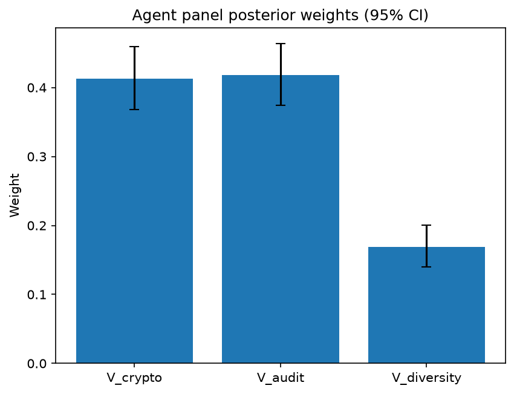

# Survey report: TrustRouter Claude CLI Panel (sonnet) -- Level L3c: Verification Strength sub-parts

Survey ID: `trustrouter-claude-cli-full-panel-claude-sonnet-2026-09-01-L3c`

## Agent panel

- Agents contributing a valid response: 36
- Classical BWM consistency: 36/36 within threshold

| Criterion | Mean | 95% CI lower | 95% CI upper |
|---|---|---|---|
| V_crypto | 0.4130 | 0.3685 | 0.4595 |
| V_audit | 0.4177 | 0.3742 | 0.4633 |
| V_diversity | 0.1692 | 0.1400 | 0.2000 |

## Methodology

Each agent independently completed a Best-Worst Method (BWM) comparison: choosing the single most and least important criterion, then rating every criterion's importance relative to those two on a 1-9 scale. Individual responses were solved with the classical BWM linear program (Rezaei, 2015) for a consistency check, and combined across the panel with a hierarchical Bayesian model (Mohammadi and Rezaei, 2020).

36 agent response(s) were accepted into this result.

Every agent's run began with a QA precheck (its stated configuration verified against ground truth) and every accepted answer's self-reported sources were checked against what reference material was actually available to it; see the Per-agent detail section below and this survey's Conversation Log for each agent's specific results. Every response is schema-validated and independently, repeatedly sampled (never a single completion treated as ground truth); see `guardrails.py`. This survey's complete output is covered by a SHA-256 integrity manifest (`integrity_manifest.json`, `SHA256SUMS`), generated once this run finished, so any later alteration to these files is detectable.

### Charts

## Per-agent detail

### bim-coordinator-base-claude (`bim-coordinator-base-claude`)

- Role: BIM Coordinator
- Model: claude_cli/sonnet
- DID: `did:key:z6MkwaD5PfneZEDso4t2zzYoPEj2qoTJMvwL6gsjm7sm4KYw`
- QA precheck: passed
- Sources used: shared knowledge: trustrouter_concept_paper_primer.md, shared knowledge: trustrouter_expert_questionnaire_v5_real_survey_instrument.md, general_knowledge

**Answer:** `{"best": "V_audit", "worst": "V_diversity", "best_to_others": {"V_audit": 1, "V_crypto": 2, "V_diversity": 5}, "others_to_worst": {"V_audit": 5, "V_crypto": 3, "V_diversity": 1}}`

**Reasoning:**

For construction-project records under multi-stakeholder BIM coordination, audit-trail completeness (V_audit) is what I rely on most directly: knowing precisely who created, modified, approved, or superseded a given model element or dossier, and when, is what actually resolves disputes over design changes, RFIs, clash-detection sign-offs, and change-order liability. It is also the substrate that gives cryptographic evidence its meaning -- per 'shared knowledge: trustrouter_concept_paper_primer.md', V decomposes into crypto, audit, and diversity weighted sub-terms, and in practice a hash/signature (V_crypto) proves a record wasn't altered after the fact, but without a complete audit trail you can't reconstruct the custody story the hash is supposed to protect. So I rate V_crypto a close second-best (ratio 2) -- it's genuinely important and the comparison between it and V_audit is not clear-cut, but in day-to-day coordination work the process record is what gets consulted and defended, while cryptographic binding is the enabling mechanism underneath it. V_diversity (multiple independent verifying parties) I rank worst: on real renovation/new-build projects, securing several truly independent confirmations for every record class (e.g., a structural engineer's signed report, a daily IoT vibration dossier) is often impractical or cost-prohibitive per the questionnaire's own gating language on 'technical feasibility' and 'file size vs ledger limits' (shared knowledge: trustrouter_expert_questionnaire_v5_real_survey_instrument.md), and it functions as an added robustness layer against collusion rather than as the core evidentiary requirement that crypto and audit trail already satisfy. This is a judgement call grounded in my own BIM-coordination experience as much as the reference material, since neither document ranks the three sub-parts against each other explicitly.

### bim-coordinator-base-claude (`bim-coordinator-base-claude`)

- Role: BIM Coordinator
- Model: claude_cli/sonnet
- DID: `did:key:z6MkwaD5PfneZEDso4t2zzYoPEj2qoTJMvwL6gsjm7sm4KYw`
- QA precheck: passed
- Sources used: shared knowledge: trustrouter_concept_paper_primer.md, shared knowledge: trustrouter_expert_questionnaire_v5_real_survey_instrument.md, general_knowledge

**Answer:** `{"best": "V_crypto", "worst": "V_diversity", "best_to_others": {"V_crypto": 1, "V_audit": 3, "V_diversity": 6}, "others_to_worst": {"V_crypto": 6, "V_audit": 4, "V_diversity": 1}}`

**Reasoning:**

For a construction-project record being considered for blockchain anchoring, V_crypto (signatures/hashes/PKI) is the element that actually makes 'verification strength' meaningful in a distributed-ledger sense: it is the irreducible, machine-checkable proof that a given dossier (e.g., a signed structural report or an SHA-256 commitment binding a raw sensor stream, per the contrast vignette in the shared questionnaire) has not been altered since custody. Everything else in V is built on top of that anchor. V_audit (who did what, when) is a close second in importance -- it is essential for legal defensibility and dispute resolution on a renovation project with many trades and RFIs -- but a complete log is still only as trustworthy as the cryptographic controls (timestamps, signed entries) protecting it from post-hoc edits by someone with legitimate system access; audit completeness is procedural discipline layered on the crypto foundation, not an independent guarantee. V_diversity (multiple independent verifying parties) is the weakest of the three in day-to-day BIM practice: most project records originate from a single authoritative source (one chartered engineer's stamp, one IoT sensor array), and requiring genuinely independent multi-party corroboration for routine model elements is often impractical and costly to operationalize, even though it would meaningfully reduce collusion/single-point-of-failure risk when it is achievable. That practical rarity, plus its dependence on the other two (diverse sources are only useful if each one is itself cryptographically and procedurally sound), is why I rank it worst. The comparison between V_crypto and V_audit is the closer call of the two judgments -- both are genuinely important operational controls in a federated BIM/blockchain workflow -- whereas V_crypto vs. V_diversity is a clearer gap given the practicality gulf.

### bim-coordinator-base-claude (`bim-coordinator-base-claude`)

- Role: BIM Coordinator
- Model: claude_cli/sonnet
- DID: `did:key:z6MkwaD5PfneZEDso4t2zzYoPEj2qoTJMvwL6gsjm7sm4KYw`
- QA precheck: passed
- Sources used: shared knowledge: trustrouter_expert_questionnaire_v5_real_survey_instrument.md, shared knowledge: trustrouter_concept_paper_primer.md, general_knowledge

**Answer:** `{"best": "V_audit", "worst": "V_diversity", "best_to_others": {"V_audit": 1, "V_crypto": 2, "V_diversity": 5}, "others_to_worst": {"V_diversity": 1, "V_crypto": 3, "V_audit": 5}}`

**Reasoning:**

For a construction-project record being weighed for blockchain storage, I judge audit-trail completeness (V_audit) as the strongest component of Verification Strength. In practice, BIM coordination lives or dies on being able to reconstruct 'who did what, when' across federated models, RFIs, change orders, and design revisions -- this is what supports legal defensibility, dispute resolution, and lifecycle documentation long after the fact, and it holds up even when other verification elements are thin. Cryptographic evidence (V_crypto -- signatures, hashes, PKI per the shared knowledge glossary) is a real and valuable technical guarantee of integrity/non-repudiation, and it is often the mechanism that anchors a dossier's hash on-chain, but on its own a hash or signature proves a file wasn't altered without telling the reviewing party the custody story behind it -- it's a complement to, not a substitute for, a complete audit trail, so I place it clearly between the other two rather than tied to Best. Diversity of independent verification sources (V_diversity) I rate weakest: in day-to-day practice many authoritative construction records are, by design, single-sourced (e.g., a signed report from one chartered structural engineer, one commissioning authority sign-off), and requiring multiple independent parties to corroborate every record is often impractical and costly relative to the marginal trust gained; it's a genuine strengthening factor when available but not something most records can or need to satisfy. This is a judgement call from professional experience rather than a hard fact from the reference material -- the questionnaire and primer define the three sub-parts but don't rank them, so the ordering reflects my own weighting of what actually drives trust and defensibility in multi-stakeholder BIM workflows. I'll note the audit-vs-crypto comparison in particular is fairly close; both are strong candidates for Best, and I would not treat that gap as clear-cut.

### bim-coordinator-rag-claude (`bim-coordinator-rag-claude`)

- Role: BIM Coordinator
- Model: claude_cli/sonnet
- DID: `did:key:z6MkqSfDfSA3Y6V2HcU6A72f4t469gxYRVPTADrJ7HzYtu7a`
- QA precheck: passed
- Sources used: bim_and_digital_building_logbooks.md, shared knowledge: trustrouter_expert_questionnaire_v5_real_survey_instrument.md, shared knowledge: trustrouter_concept_paper_primer.md, general_knowledge

**Answer:** `{"best": "V_crypto", "worst": "V_diversity", "best_to_others": {"V_crypto": 1, "V_audit": 3, "V_diversity": 6}, "others_to_worst": {"V_crypto": 6, "V_audit": 2, "V_diversity": 1}}`

**Reasoning:**

For a construction record being considered for blockchain anchoring, Verification Strength is fundamentally about what makes the record's integrity independently checkable without trusting a single custodian. Cryptographic evidence (signatures, hashes, PKI) is the direct mechanism that does this and is precisely what makes blockchain storage meaningful in the first place -- a hash commitment or qualified electronic signature is verifiable by anyone with the public key, indefinitely, without relying on any party's continued cooperation. The Kochovski et al. 2026 BUILDCHAIN DBL work (bim_and_digital_building_logbooks.md) is concrete evidence this is operationally real for construction/BIM data specifically: measured on-chain DID authentication, resolution, and revocation times show cryptographic identity/verification infrastructure is a mature, deployable layer for this domain, not just theory. Audit trail completeness ('who did what, when') is genuinely important -- it's the backbone of ISO 19650 CDE status/revision workflows I rely on daily as a coordinator -- but a log by itself is only as trustworthy as the system maintaining it; without cryptographic binding it can be edited after the fact, so I rate it clearly important but subordinate to V_crypto. I placed V_diversity (diversity of independent verification sources) as worst, though this was the closest call of the three: multiple independent parties checking a record does add robustness, and ISO 19650 does require lead appointed party/task team validation (per bim_and_digital_building_logbooks.md's note on federated model acceptance), but that same substantive concept is already captured elsewhere in TrustRouter's model as the separate top-level Independent Confirmation (IC) factor per the questionnaire (trustrouter_expert_questionnaire_v5_real_survey_instrument.md) and the concept-paper primer's DVS breakdown. Within Verification Strength specifically, diversity of sources is also the hardest of the three to operationalize on typical projects -- getting several independent parties to verify every candidate record is costly and rarely done uniformly -- whereas crypto evidence and audit logging are already standard, low-marginal-cost outputs of any properly run CDE. I want to flag this is a genuine judgement call: V_audit vs V_diversity for worst was not obviously clear-cut, and a coordinator on a project with strong multi-party sign-off culture might rate diversity higher.

### bim-coordinator-rag-claude (`bim-coordinator-rag-claude`)

- Role: BIM Coordinator
- Model: claude_cli/sonnet
- DID: `did:key:z6MkqSfDfSA3Y6V2HcU6A72f4t469gxYRVPTADrJ7HzYtu7a`
- QA precheck: passed
- Sources used: bim_and_digital_building_logbooks.md, shared knowledge: trustrouter_expert_questionnaire_v5_real_survey_instrument.md, shared knowledge: trustrouter_concept_paper_primer.md, general_knowledge

**Answer:** `{"best": "V_audit", "worst": "V_crypto", "best_to_others": {"V_audit": 1, "V_diversity": 2, "V_crypto": 5}, "others_to_worst": {"V_crypto": 1, "V_diversity": 3, "V_audit": 5}}`

**Reasoning:**

From day-to-day BIM coordination practice (model federation, clash detection, lifecycle documentation), the record of who created/modified/approved a model element and when (V_audit) is the operational backbone: ISO 19650 information-delivery workflows (BS EN ISO 19650 Guidance Part 2, cited in bim_and_digital_building_logbooks.md) are built entirely around container-level metadata, revision status, and approval sign-off logs, and I rely on this daily to resolve clash-detection disputes, track design changes, and hand over a defensible record at project closeout. That same reference material notes that ISO 19650 already mandates multiple parties (lead appointed party, task teams) independently validating federated models before acceptance -- this is the real mechanism V_diversity is trying to score, so I rate it clearly important but secondary to audit-trail completeness, since diversity of confirming parties is only meaningful if there is a complete, timestamped audit trail to check their inputs against. V_crypto (signatures, hashes, PKI) I rate lowest within this specific three-way split: it is the enabling technology for tamper-evidence (as demonstrated empirically in the Kochovski et al. 2026 BUILDCHAIN DBL work on DIDs/verifiable credentials over Ethereum, also in bim_and_digital_building_logbooks.md), but in current multi-stakeholder BIM practice this layer is typically implemented and owned by IT/platform specialists rather than being something a BIM coordinator directly manages or checks day to day -- most federated-model trust decisions I make are still based on permissions, version logs, and sign-off records rather than cryptographic proofs. This is a judgement call from my own domain experience (general_knowledge) about relative practical weight within the V decomposition, not a claim that V_crypto is unimportant to the overall TrustRouter composite -- the concept-paper primer's V = w_crypto*V_crypto + w_audit*V_audit + w_diversity*V_diversity formulation makes clear all three matter, and the crypto-vs-audit gap here is not enormous, so this comparison is closer than the crypto-vs-diversity one.

### bim-coordinator-rag-claude (`bim-coordinator-rag-claude`)

- Role: BIM Coordinator
- Model: claude_cli/sonnet
- DID: `did:key:z6MkqSfDfSA3Y6V2HcU6A72f4t469gxYRVPTADrJ7HzYtu7a`
- QA precheck: passed
- Sources used: bim_and_digital_building_logbooks.md, shared knowledge: trustrouter_concept_paper_primer.md, shared knowledge: trustrouter_expert_questionnaire_v5_real_survey_instrument.md

**Answer:** `{"best": "V_audit", "worst": "V_diversity", "best_to_others": {"V_audit": 1, "V_crypto": 2, "V_diversity": 4}, "others_to_worst": {"V_diversity": 1, "V_crypto": 2, "V_audit": 4}}`

**Reasoning:**

As a BIM coordinator running CDE workflows under BS EN ISO 19650, audit-trail completeness (V_audit -- who did what, when) is the mechanism I rely on constantly and can directly govern: revision status metadata, transmittal records, approval logs, and container state history are the day-to-day evidence base for accountability and dispute resolution on a federated model, and they are already mandatory practice, not aspirational. Cryptographic evidence (V_crypto -- signatures/hashes/PKI) is technically the strongest tamper-evidence mechanism and is exactly what blockchain anchoring is meant to add on top of an audit log, but per 'bim_and_digital_building_logbooks.md' (Kochovski et al. 2026, BUILDCHAIN DBL with W3C DIDs/verifiable credentials on Ethereum) this is still an emerging capability layer in construction practice rather than the default state of most current BIM data, so I place it second, roughly half as decisive as the audit trail itself. Diversity of independent verification sources (V_diversity) I rate worst within this specific triad: it is genuinely valuable, but 'bim_and_digital_building_logbooks.md' notes that ISO 19650's information-delivery process already requires multiple parties (lead appointed party, task teams) to independently validate federated models -- meaning this dimension substantially overlaps with the separate Independent Confirmation (IC) factor that sits at the same L2 level as V in TrustRouter's own hierarchy ('shared knowledge: trustrouter_concept_paper_primer.md'). Within V's own internal decomposition, a coordinator judges diversity of sources as the least distinctive contributor to 'verification strength' specifically (as opposed to confirmation depth generally), and it is also the hardest of the three for a coordinator to unilaterally improve, since it depends on external parties' willingness to independently verify rather than on internal logging or signing discipline. The ratings (audit=1, crypto=2, diversity=4, with crypto-to-diversity implied at 2) reflect a real but not extreme gap: this is a case where audit trail's practical primacy is fairly clear to me, but crypto vs. diversity is more of a judgement call given the acknowledged overlap with IC.

### blockchain-engineer-base-claude (`blockchain-engineer-base-claude`)

- Role: Blockchain / DLT Engineer
- Model: claude_cli/sonnet
- DID: `did:key:z6MkiXdPHgRKLgsWGCi5P19sNTrHqFjySf3d9JD1BYLAirtk`
- QA precheck: passed
- Sources used: shared knowledge: trustrouter_expert_questionnaire_v5_real_survey_instrument.md, general_knowledge

**Answer:** `{"best": "V_crypto", "worst": "V_diversity", "best_to_others": {"V_crypto": 1, "V_audit": 3, "V_diversity": 5}, "others_to_worst": {"V_crypto": 5, "V_audit": 2, "V_diversity": 1}}`

**Reasoning:**

Verification Strength (V) is defined in the shared knowledge as 'strength of cryptographic and procedural audit evidence' -- the two named components (crypto, audit) are given primacy over diversity in that definition itself. From a permissioned-ledger engineering standpoint, V_crypto (signatures, hashes, PKI) is the mechanism that produces the actual mathematically verifiable, non-repudiable proof that a record has not been altered -- it's the substrate every other verification claim ultimately rests on: an audit trail or a set of independent attestors is only as trustworthy as the cryptographic binding (hashing, signing, PKI chain of custody) that makes their entries tamper-evident and attributable. Without V_crypto, an audit log is just an editable database table and 'diverse sources' just means multiple unverified claims. V_audit (who did what, when) is a close second: audit-trail completeness is essential for procedural accountability and dispute resolution in a construction context (matching the survey's framing of disputes about data integrity), and it's often what a signature/PKI scheme is built to reinforce -- but it is fundamentally a logging/process discipline layered on top of, and dependent on, cryptographic guarantees for its own tamper-evidence. V_diversity (multiple independent verification sources) is valuable for reducing collusion/single-point-of-failure risk, but in practice, for most permissioned construction consortiums, achieving true source diversity is organizationally and economically harder to realize than strengthening crypto or audit-logging, and its marginal contribution to verification strength is smaller and more context-dependent (e.g., irrelevant if only one party is authorized to attest a given record type). Hence V_crypto is Best, V_diversity is Worst, with V_audit rated as a moderate, genuinely close second -- I want to flag this is not a wide gap: a reasonable engineer could argue V_audit deserves near-parity with V_crypto since in real permissioned-DLT deployments the two are usually implemented together (signed audit-log entries), so the crypto-vs-audit ranking is a closer call than the audit-vs-diversity one.

### blockchain-engineer-base-claude (`blockchain-engineer-base-claude`)

- Role: Blockchain / DLT Engineer
- Model: claude_cli/sonnet
- DID: `did:key:z6MkiXdPHgRKLgsWGCi5P19sNTrHqFjySf3d9JD1BYLAirtk`
- QA precheck: passed
- Sources used: shared knowledge: trustrouter_expert_questionnaire_v5_real_survey_instrument.md, general_knowledge

**Answer:** `{"best": "V_crypto", "worst": "V_diversity", "best_to_others": {"V_crypto": 1, "V_audit": 3, "V_diversity": 5}, "others_to_worst": {"V_crypto": 5, "V_audit": 2, "V_diversity": 1}}`

**Reasoning:**

Verification Strength (V) as defined in the shared knowledge instrument is 'Strength of cryptographic and procedural audit evidence.' Of the three sub-parts, V_crypto (signatures, hashes, PKI) is the most direct and load-bearing component of that definition: it is the mechanism that actually produces tamper-evidence in a permissioned-ledger deployment -- a hash-chained, digitally-signed record is mathematically verifiable independent of trust in any party, which is the core value proposition of putting construction-project data on a ledger at all. From production experience, cryptographic evidence is also what survives a dispute or audit even when the organizations involved have since changed staff, systems, or gone out of business, and it's what a court or certifying body can check without relying on institutional cooperation. V_audit (who did what, when) is important and complementary -- it's the procedural half of the same definition -- but audit-trail completeness is itself only as trustworthy as the cryptographic binding underneath it (an audit log without signatures/hashes can be edited after the fact), so I rate it clearly important but subordinate to V_crypto, hence a moderate 3 on the best-to-others scale. V_diversity (multiple independent verification sources) is valuable for resilience against a single point of collusion or failure, but in a permissioned-ledger context for construction records it is typically a secondary hardening measure layered on top of already-cryptographically-verified, audited data rather than a primary source of trust strength itself -- an engineer can get very strong tamper-evidence from strong crypto plus a complete audit trail even with a single credible verifying party, whereas diversity alone without strong crypto/audit underpinning gives little assurance. This is a judgement call based on my domain experience with permissioned DLT deployments (general_knowledge), since the shared instrument defines the three sub-parts but does not itself rank them. I note the V_crypto vs V_audit gap is a closer call than the gap to V_diversity -- both crypto and audit are core to the V definition -- so I kept that ratio moderate (3) rather than extreme, while diversity is more clearly the least central of the three.

### blockchain-engineer-base-claude (`blockchain-engineer-base-claude`)

- Role: Blockchain / DLT Engineer
- Model: claude_cli/sonnet
- DID: `did:key:z6MkiXdPHgRKLgsWGCi5P19sNTrHqFjySf3d9JD1BYLAirtk`
- QA precheck: passed
- Sources used: shared knowledge: trustrouter_expert_questionnaire_v5_real_survey_instrument.md, general_knowledge

**Answer:** `{"best": "V_crypto", "worst": "V_diversity", "best_to_others": {"V_crypto": 1, "V_audit": 3, "V_diversity": 5}, "others_to_worst": {"V_crypto": 5, "V_audit": 3, "V_diversity": 1}}`

**Reasoning:**

From a permissioned-ledger engineering standpoint, V_crypto (signatures, hashes, PKI) is the foundational mechanism that actually delivers tamper-evidence: it is what makes an altered record mathematically detectable independent of anyone's trust in a party or process, and every other verification property (audit completeness, source diversity) ultimately rides on top of a cryptographic anchor (e.g., a hash chain or Merkle proof) to be non-repudiable. Without it, 'audit trail' entries are just mutable log lines and 'diverse sources' are just multiple unverifiable claims. V_audit (who-did-what-when completeness) is the middle criterion: it materially strengthens forensic reconstruction and non-repudiation, and in practice a well-formed audit trail is often built directly from cryptographic timestamps/signatures, so it is a close second, not a distant one -- I rate it 3x rather than pushing it toward the extreme, reflecting that this is a real but not enormous gap. V_diversity (multiple independent verifying parties) is valuable for collusion-resistance and Sybil-resistance, but a single rigorously implemented crypto+PKI scheme with a complete audit log can already deliver strong, court-defensible tamper-evidence on a permissioned chain with a small, vetted validator set -- diversity is a robustness multiplier on top of that base, not a substitute for it, which is why I place it as worst. This is a judgement call from production DLT experience rather than a settled consensus figure, and I note the V_crypto-vs-V_audit gap is the least clear-cut of the three comparisons.

### blockchain-engineer-rag-claude (`blockchain-engineer-rag-claude`)

- Role: Blockchain / DLT Engineer
- Model: claude_cli/sonnet
- DID: `did:key:z6MkopvxUWWWCS4idsrstN99GZf9TsfLRkdw69bu1hJ8anGq`
- QA precheck: passed
- Sources used: shared knowledge: trustrouter_expert_questionnaire_v5_real_survey_instrument.md, blockchain_trust_and_attack_resistance.md, general_knowledge

**Answer:** `{"best": "V_crypto", "worst": "V_diversity", "best_to_others": {"V_crypto": 1, "V_audit": 3, "V_diversity": 5}, "others_to_worst": {"V_crypto": 5, "V_audit": 2, "V_diversity": 1}}`

**Reasoning:**

Verification Strength is defined in the questionnaire as 'strength of cryptographic and procedural audit evidence' (shared knowledge: trustrouter_expert_questionnaire_v5_real_survey_instrument.md, section 3.2 definition of V), and V_crypto, V_audit, V_diversity are its decomposition. From a permissioned-ledger engineering standpoint, cryptographic evidence (hashes, digital signatures, PKI) is the load-bearing mechanism that gives tamper-evidence its mathematical, non-repudiable strength -- it is what actually makes an alteration detectable and an author's claim unforgeable, which is the core value proposition of putting a record on a ledger at all rather than a conventional database. Audit trail completeness (who did what, when) is important for accountability and dispute reconstruction, but as a log it is only as trustworthy as the cryptographic anchoring underneath it (e.g. hash-chained log entries); an audit trail without crypto backing is just an assertion that could itself be edited, so I rank it as secondary and dependent on V_crypto rather than an independent equal. Diversity of verification sources (multiple independent parties) strengthens resistance to collusion and single-point failure -- this is real and relates to the kind of insider/Sybil resistance concerns raised in blockchain_trust_and_attack_resistance.md regarding on-chain identity trust gaps -- but it is a layered, reinforcing defense rather than the primary source of verification strength for a single record: a well-implemented PKI-rooted signature from one qualified party (e.g., the questionnaire's example of a chartered structural engineer's qualified electronic signature) can already constitute strong verification even without multiple independent submitters. I rated V_crypto as best and V_diversity as worst; the gap between V_crypto and V_audit (3x) is deliberately smaller than the gap between V_crypto and V_diversity (5x) because audit-trail completeness is closer in practical importance to cryptographic evidence than diversity of sources is -- this specific magnitude is a judgement call on my part, not read directly off any source, since none of the provided material ranks these three sub-parts against each other.

### blockchain-engineer-rag-claude (`blockchain-engineer-rag-claude`)

- Role: Blockchain / DLT Engineer
- Model: claude_cli/sonnet
- DID: `did:key:z6MkopvxUWWWCS4idsrstN99GZf9TsfLRkdw69bu1hJ8anGq`
- QA precheck: passed
- Sources used: shared knowledge: trustrouter_expert_questionnaire_v5_real_survey_instrument.md, blockchain_trust_and_attack_resistance.md, general_knowledge

**Answer:** `{"best": "V_crypto", "worst": "V_diversity", "best_to_others": {"V_crypto": 1, "V_audit": 3, "V_diversity": 5}, "others_to_worst": {"V_crypto": 5, "V_audit": 3, "V_diversity": 1}}`

**Reasoning:**

From an engineering standpoint, cryptographic evidence (signatures, hashes, PKI) is the load-bearing mechanism that makes any ledger-based system tamper-evident at all: without a signed hash chain, there is no cryptographic proof that a construction record was not altered post-hoc, and the other two sub-parts become unverifiable claims layered on an untrusted substrate. This makes V_crypto the clear Best. Audit trail completeness (who did what, when) is genuinely valuable for construction dispute resolution and regulatory accountability, and is one of O'Hara's eight data-trust properties operationalised on a permissioned ledger in the Rouhani and Deters (2021) framework (per blockchain_trust_and_attack_resistance.md), but on a blockchain it is largely a structural consequence of combining PKI-based identity with an append-only ledger -- once you have V_crypto and a logging discipline, a reasonably complete audit trail follows almost automatically from the architecture, so I rate it a clear second (3x behind Best) rather than near-Best. Diversity of independent verification sources is a real and separate concern (guarding against a single compromised or colluding attestor), but in the TrustRouter hierarchy this concern substantially overlaps with the Attack Resistance factor's own Sybil/Insider decomposition (A_sybil, A_insider, per the shared survey instrument's Section 3.6), meaning its marginal contribution specifically within Verification Strength is the smallest of the three -- it addresses a risk that is already partly captured elsewhere in the composite. That makes it Worst, though I note the V_audit vs V_diversity comparison is not overwhelmingly one-sided; both are plausibly mid-tier, and reasonable engineers could rank them closer together than I have.

### blockchain-engineer-rag-claude (`blockchain-engineer-rag-claude`)

- Role: Blockchain / DLT Engineer
- Model: claude_cli/sonnet
- DID: `did:key:z6MkopvxUWWWCS4idsrstN99GZf9TsfLRkdw69bu1hJ8anGq`
- QA precheck: passed
- Sources used: blockchain_trust_and_attack_resistance.md, shared knowledge: trustrouter_expert_questionnaire_v5_real_survey_instrument.md, general_knowledge

**Answer:** `{"best": "V_crypto", "worst": "V_diversity", "best_to_others": {"V_crypto": 1, "V_audit": 3, "V_diversity": 6}, "others_to_worst": {"V_crypto": 6, "V_audit": 4, "V_diversity": 1}}`

**Reasoning:**

On a permissioned ledger, cryptographic evidence (signatures/hashes/PKI) is the load-bearing layer: it is what makes any subsequent claim about 'who did what when' non-repudiable and tamper-evident in the first place. An audit trail without cryptographic anchoring (e.g., a plain append-only log without signed/hashed entries chained together) can be edited or backfilled by anyone with write access to the log store, which defeats the point of routing the record to a blockchain at all -- this matches the Rouhani and Deters (2021) framework's use of endorsement/signature strength as the parameter that gates how much validation a record needs (blockchain_trust_and_attack_resistance.md), i.e., crypto evidence is the primitive the trust score is actually built from. Audit trail completeness is the second most important sub-part: it operationalizes accountability (who/when) and dispute resolution, which construction projects need constantly, but its integrity is itself downstream of whether the entries are cryptographically bound -- so I rate V_crypto only moderately (3x) above V_audit, not overwhelmingly, since a complete-but-unsigned trail still has real evidentiary value for day-to-day project governance even if it is not tamper-proof. Diversity of independent verification sources is the weakest of the three within Verification Strength specifically (not within Attack Resistance, which is a separate L3d block in this instrument covering Sybil/Oracle/Insider resistance and is a more natural home for the 'multiple independent parties' concern). In a permissioned-ledger deployment, multi-party endorsement is already substantially achieved through the consensus/endorsement policy itself once crypto and audit are in place (e.g., Fabric endorsement policies), so treating source diversity as a separate, per-record verification-strength lever is the most marginal and hardest-to-operationalize of the three -- it adds robustness against collusion but is not, by itself, evidence of anything without the crypto and audit layers underneath it. This closeness between V_audit and V_diversity (both are secondary to crypto, but audit is clearly more central to Verification Strength than diversity) is a judgement call rather than a bright line, and I want to flag that explicitly rather than overstate confidence.

### compliance-officer-base-claude (`compliance-officer-base-claude`)

- Role: Compliance and Regulatory Officer
- Model: claude_cli/sonnet
- DID: `did:key:z6MkwUN3K4YmG9arhbzyAxMLs314eLG46wmPnKoYLVUT8Rzm`
- QA precheck: passed
- Sources used: shared knowledge: trustrouter_expert_questionnaire_v5_real_survey_instrument.md, shared knowledge: trustrouter_concept_paper_primer.md, general_knowledge

**Answer:** `{"best": "V_audit", "worst": "V_diversity", "best_to_others": {"V_crypto": 3, "V_audit": 1, "V_diversity": 6}, "others_to_worst": {"V_crypto": 2, "V_audit": 6, "V_diversity": 1}}`

**Reasoning:**

As a compliance officer for GDPR and construction-regulatory obligations, I rank V_audit (audit trail completeness) as most important because it maps most directly onto binding legal accountability duties: GDPR Art. 5(2) accountability, Art. 30 records-of-processing, and Art. 32 security/logging obligations all turn on being able to show who did what, when -- this is precisely what regulators, insurers, and auditors demand to see first during an investigation or DPIA, and it is what shared knowledge describes as 'authentic and procedural audit evidence.' V_crypto (cryptographic evidence -- signatures, hashes, PKI) is a close second: it is the technical backbone that gives an audit trail's claims teeth (tamper-evidence, qualified electronic signatures per the questionnaire's own example 'Qualified electronic signature dossier + tamper-evident log'), so it is not far behind audit completeness in importance, but a cryptographically signed record with no coherent custody trail is still hard to defend in a regulatory review, whereas a complete audit trail with weaker crypto is at least legally legible -- hence audit edges it out. V_diversity (diversity of independent verification sources) I place lowest within this specific sub-decomposition: at the parent level of TrustRouter, Independent Confirmation (IC) already exists as a separate top-level factor capturing 'do multiple independent parties agree,' so diversity-of-sources within Verification Strength specifically is comparatively narrower in marginal regulatory value -- it strengthens confidence but is not itself a distinct legal requirement the way audit logging and signature integrity are. This is a judgement call reflecting the compliance lens specifically; a technical-integrity specialist might weight V_crypto highest instead, and I flag that the crypto-vs-audit call is genuinely close rather than clear-cut.

### compliance-officer-base-claude (`compliance-officer-base-claude`)

- Role: Compliance and Regulatory Officer
- Model: claude_cli/sonnet
- DID: `did:key:z6MkwUN3K4YmG9arhbzyAxMLs314eLG46wmPnKoYLVUT8Rzm`
- QA precheck: passed
- Sources used: shared knowledge: trustrouter_concept_paper_primer.md, shared knowledge: trustrouter_expert_questionnaire_v5_real_survey_instrument.md, general_knowledge

**Answer:** `{"best": "V_crypto", "worst": "V_diversity", "best_to_others": {"V_crypto": 1, "V_audit": 3, "V_diversity": 5}, "others_to_worst": {"V_crypto": 5, "V_audit": 3, "V_diversity": 1}}`

**Reasoning:**

Per the concept-paper primer, V (Verification Strength) is explicitly framed as 'cryptographic or audit-trail evidence,' and the survey instrument's own worked example under V lists 'Qualified electronic signature dossier + tamper-evident log' as the exemplar high-verification case. For a construction record being weighed for blockchain storage, cryptographic evidence (V_crypto: signatures, hashes, PKI) is the most direct, machine-verifiable, and tamper-evident proof that a record has not been altered since creation -- it is precisely the property that makes blockchain storage valuable over an ordinary database (as the instrument's background section notes, ordinary databases 'silently permit rewriting' while ledgers improve tamper-evidence). Audit-trail completeness (V_audit, who-did-what-when) is a close second: it supports accountability and procedural reconstruction, and the instrument groups it with cryptographic dossiers as core evidence types, but it is generally a weaker guarantee than cryptographic proof because logs themselves can in principle be incomplete or manipulated absent cryptographic binding. Diversity of verification sources (V_diversity) is important for corroboration but overlaps conceptually with Independent Confirmation (IC), a separate top-level factor in the L2 decomposition -- within the specific scope of 'Verification Strength' (as opposed to IC), having multiple independent verifiers matters less than having strong, tamper-evident cryptographic or procedural proof of a single well-documented chain of custody. I rated V_crypto vs V_audit as 3 (a real but moderate gap, since both are strong forms of evidence) and V_crypto vs V_diversity as 5 (a larger gap, since diversity here risks conflating with the separate IC dimension and is the least central to 'verification strength' proper as construction-compliance evidence). This is a judgement call informed by the primer's framing rather than a documented empirical finding, and the V_audit vs V_diversity gap is the least certain part of this ranking.

### compliance-officer-base-claude (`compliance-officer-base-claude`)

- Role: Compliance and Regulatory Officer
- Model: claude_cli/sonnet
- DID: `did:key:z6MkwUN3K4YmG9arhbzyAxMLs314eLG46wmPnKoYLVUT8Rzm`
- QA precheck: passed
- Sources used: shared knowledge: trustrouter_concept_paper_primer.md, shared knowledge: trustrouter_expert_questionnaire_v5_real_survey_instrument.md, general_knowledge

**Answer:** `{"best": "V_audit", "worst": "V_diversity", "best_to_others": {"V_crypto": 2, "V_audit": 1, "V_diversity": 3}, "others_to_worst": {"V_crypto": 2, "V_audit": 3, "V_diversity": 1}}`

**Reasoning:**

Per the concept-paper primer, V (Verification Strength) is glossed specifically as 'cryptographic or audit-trail evidence,' and the survey instrument's own field guidance for V says 'Signatures / logs' -- both signal that the core of verification strength, as this construct is operationalized in TrustRouter, is the direct technical/procedural evidence trail (crypto signatures plus audit logs), not the breadth of who independently confirms it (that breadth is instead captured by the separate IC -- Independent Confirmation -- top-level factor at L2, avoiding double-counting). Given that, I rank V_audit as Best: a complete audit trail (who did what, when) is the backbone that lets a regulator or insurer reconstruct custody and actions on a construction record even where cryptographic tooling is partial or where multiple verifying parties aren't available; it is also the most jurisdiction-agnostic and enforceable in practice for aging renewal-project records that may predate PKI adoption on-site. V_crypto is a close second -- strong cryptographic evidence (signed hashes, PKI-backed attestations) is what makes tamper-evidence machine-verifiable and is foundational to blockchain-storage suitability, but it depends on infrastructure (key management, qualified signature schemes) that isn't always present for legacy or manually-inspected construction records, whereas an audit trail can exist even in simpler systems. V_diversity (diversity of independent verification sources) I rate Worst within this specific sub-decomposition: its substance overlaps conceptually with the separate IC factor at L2 ('do multiple independent parties agree'), so within the V-only decomposition it is the thinnest and most redundant sub-component -- a record can have very strong verification strength (rigorous audit log, solid crypto proof) from a single custodial chain without multiple independent sources, and that is still meaningfully 'verified' for construction-compliance purposes even if not independently corroborated by several parties. The ratings reflect this: V_audit vs itself =1, vs V_crypto=2 (a real but moderate gap, since both are core evidentiary mechanisms), vs V_diversity=3 (a larger gap given the overlap-with-IC concern). Symmetrically, V_crypto vs V_diversity=2 and V_audit vs V_diversity=3, with V_diversity vs itself=1. I want to flag this is a genuinely close call between V_crypto and V_audit -- both are central technical/procedural verification mechanisms and a reasonable compliance officer could rank them the other way round; my judgement rests on the primer's own dual gloss (crypto OR audit-trail) treating them as near-equal pillars, with audit-trail edging ahead only because of its more universal applicability across records regardless of digital-signature infrastructure maturity.

### compliance-officer-rag-claude (`compliance-officer-rag-claude`)

- Role: Compliance and Regulatory Officer
- Model: claude_cli/sonnet
- DID: `did:key:z6Mkiny4nghtEZgRh1GDTK1uVN3K6yiWKovHursQ4YEVJq2c`
- QA precheck: passed
- Sources used: shared knowledge: trustrouter_expert_questionnaire_v5_real_survey_instrument.md, shared knowledge: trustrouter_concept_paper_primer.md, gdpr_and_data_governance.md, general_knowledge

**Answer:** `{"best": "V_audit", "worst": "V_diversity", "best_to_others": {"V_audit": 1, "V_crypto": 2, "V_diversity": 5}, "others_to_worst": {"V_audit": 5, "V_crypto": 3, "V_diversity": 1}}`

**Reasoning:**

As a compliance officer, the question I actually need answered for a construction record is 'can we demonstrate, on inspection or dispute, exactly who did what and when' -- that is a direct match to GDPR's accountability principle and to construction regulatory chain-of-custody/inspection-log requirements. V_audit (who did what, when) is what a regulator, auditor, or court actually asks for; it is the substantive compliance narrative. V_crypto (signatures, hashes, PKI) is important as a tamper-evidence mechanism that makes the audit trail trustworthy, but a valid signature on its own, without a complete who/what/when record, does not establish regulatory compliance -- it proves a datum wasn't altered, not that the process behind it was sound. That is why I rate Best (V_audit) only about 2x V_crypto rather than far higher: crypto evidence is a strong, near-essential complement, not a weak criterion. V_diversity (multiple independent verification sources) is the criterion I rate lowest within this V-decomposition specifically because its substantive value -- corroboration by independent parties -- is already the dedicated purpose of the separate Independent Confirmation (IC) dimension at L2 (per shared knowledge: trustrouter_expert_questionnaire_v5_real_survey_instrument.md and trustrouter_concept_paper_primer.md, which list IC as 'independent cross-checks... second independent audit' distinct from V). Within V itself, diversity of sources is the least load-bearing sub-factor for the compliance question I actually have to answer, hence Worst. The GDPR/data-governance material (gdpr_and_data_governance.md) reinforces this from a different angle: the recurring finding across the catalogued sources (Wilson et al. 2019; Vaziry et al. 2024) is that blockchain's tension with GDPR (e.g. right to erasure) is fundamentally a governance/audit-trail-and-accountability problem, not primarily a cryptographic-strength problem -- which supports weighting audit-trail completeness above raw cryptographic evidence. This is a judgement call rather than a settled fact: V_crypto vs V_audit was the closer comparison of the three, since strong cryptographic evidence is genuinely close to being co-primary with audit completeness in practice; I resolved it toward audit trail because that is what regulatory and contractual compliance reviews are actually built around.

### compliance-officer-rag-claude (`compliance-officer-rag-claude`)

- Role: Compliance and Regulatory Officer
- Model: claude_cli/sonnet
- DID: `did:key:z6Mkiny4nghtEZgRh1GDTK1uVN3K6yiWKovHursQ4YEVJq2c`
- QA precheck: passed
- Sources used: shared knowledge: trustrouter_expert_questionnaire_v5_real_survey_instrument.md, gdpr_and_data_governance.md, general_knowledge

**Answer:** `{"best": "V_audit", "worst": "V_diversity", "best_to_others": {"V_audit": 1, "V_crypto": 2, "V_diversity": 4}, "others_to_worst": {"V_diversity": 1, "V_crypto": 2, "V_audit": 4}}`

**Reasoning:**

The survey instrument itself defines V as merging 'cryptographic and procedural audit evidence,' with the worked example 'Qualified electronic signature dossier + tamper-evident log' (shared knowledge: trustrouter_expert_questionnaire_v5_real_survey_instrument.md) -- i.e. crypto and audit are the two pillars the concept treats as constitutive of Verification Strength, while diversity of sources is defined separately as corroboration by multiple independent parties, which substantially overlaps with the distinct Independent Confirmation (IC) dimension at L2. From a compliance-officer standpoint specifically, audit trail completeness ('who did what, when') is the more directly actionable evidence for regulatory purposes: GDPR's accountability principle and record-keeping/processing-activity obligations, and construction-regulatory chain-of-custody requirements for defect liability and building-code enforcement, are satisfied by a demonstrable, time-stamped process narrative, not by a single point-in-time cryptographic artefact. A qualified signature proves a document was not altered after signing and by whom it was signed, but it does not by itself reconstruct the full custody chain a regulator or court would require. Cryptographic evidence is still very important -- it underwrites non-repudiation and tamper-evidence and is often a precondition for the audit log itself to be trustworthy -- so I rate it a moderate 2x below audit trail completeness, not a large gap. Diversity of verification sources, while a genuine robustness property, is the weakest of the three here because (a) it is largely redundant with the separately-scored IC dimension in this instrument's hierarchy, and (b) the instrument's own definition of V does not foreground source diversity the way it foregrounds crypto+audit evidence. I kept the ratios internally consistent (audit:crypto=2, crypto:diversity=2, audit:diversity=4) rather than picking an inconsistent set, though I acknowledge this is a judgement call about relative magnitudes, not a measured quantity -- the crypto vs. audit comparison in particular is a reasonably close call since both are explicitly bundled in the instrument's own definition of V.

### compliance-officer-rag-claude (`compliance-officer-rag-claude`)

- Role: Compliance and Regulatory Officer
- Model: claude_cli/sonnet
- DID: `did:key:z6Mkiny4nghtEZgRh1GDTK1uVN3K6yiWKovHursQ4YEVJq2c`
- QA precheck: passed
- Sources used: shared knowledge: trustrouter_expert_questionnaire_v5_real_survey_instrument.md, shared knowledge: trustrouter_concept_paper_primer.md, general_knowledge

**Answer:** `{"best": "V_crypto", "worst": "V_diversity", "best_to_others": {"V_crypto": 1, "V_audit": 3, "V_diversity": 5}, "others_to_worst": {"V_crypto": 5, "V_audit": 3, "V_diversity": 1}}`

**Reasoning:**

Verification Strength (V) as defined in the questionnaire's own gloss is 'Signatures / logs' -- and its worked example is explicitly 'Qualified electronic signature dossier + tamper-evident log' (shared knowledge: trustrouter_expert_questionnaire_v5_real_survey_instrument.md). That anchors V_crypto (signatures, hashes, PKI) as the paradigm case of this dimension: cryptographic evidence is what makes a record's integrity mathematically checkable without needing to trust any party's say-so, which is precisely the property that makes blockchain storage worth the cost in the first place per the concept-paper primer's framing of V as 'cryptographic or audit-trail evidence.' V_audit (who-did-what-when logs) is a strong second: it is explicitly paired with V_crypto in the same worked example ('tamper-evident log'), and procedural audit trails are necessary evidence for regulatory and contractual defensibility even where cryptographic proof is partial or absent, but a complete audit log without cryptographic binding is still forgeable after the fact, so it is a notch below V_crypto in verification strength itself. V_diversity (multiple independent verification sources) I rank worst within this sub-decomposition specifically because it substantially overlaps with, and is separately captured by, Independent Confirmation (IC) at the parent L2 level -- the questionnaire distinguishes IC as 'independent cross-checks (second party, second sensor set, etc.)' as its own top-level dimension. Within V specifically (the strength of the verification evidence itself, not how many parties independently produced it), diversity of sources adds redundancy/corroboration value but does not by itself strengthen the cryptographic or procedural rigor of any single verification act -- a single well-signed, well-logged record can be highly verifiable even from one source, whereas many weakly-verified sources add less to V than one cryptographically strong one. This is a judgement call about how to weight sub-components of V distinctly from IC's already-existing role in L2, not a claim drawn directly from a source. I rated V_crypto only moderately dominant (3x and 5x) rather than extreme (9x) because all three are genuinely part of the same 'evidence of integrity' cluster for a construction record and the comparison, especially between V_crypto and V_audit, is fairly close in practice since real dossiers combine both.

### data-engineer-base-claude (`data-engineer-base-claude`)

- Role: Data Engineering Specialist
- Model: claude_cli/sonnet
- DID: `did:key:z6Mkgetd4SzJJVFgp33Mr15qYrPY1rWLsTBk9egDkh4y3VV5`
- QA precheck: passed
- Sources used: shared knowledge: trustrouter_concept_paper_primer.md, general_knowledge

**Answer:** `{"best": "V_crypto", "worst": "V_diversity", "best_to_others": {"V_crypto": 1, "V_audit": 2, "V_diversity": 5}, "others_to_worst": {"V_crypto": 5, "V_audit": 3, "V_diversity": 1}}`

**Reasoning:**

In a blockchain-anchoring context for construction-project records, Verification Strength is fundamentally about whether a claim can be independently proven not to have been altered. Cryptographic evidence (signatures, hashes, PKI) is the mechanism that actually delivers that proof and is native to the ledger technology itself -- it is what makes tampering mathematically detectable regardless of who is looking. Audit-trail completeness (who did what, when) is a strong second: it supplies the procedural context that lets a reviewer interpret and trust the crypto evidence (e.g., whose key signed, at what workflow stage), but on its own an audit log is just an assertion unless backed by cryptographic binding, so it is logically downstream of V_crypto rather than co-equal. Diversity of verification sources is genuinely valuable for corroboration, but in practice construction records are often single-sourced by necessity (one inspector, one sensor feed, one BIM export) and diversity is expensive/infeasible to engineer for many record types; more importantly, additional independent sources do not compensate for weak cryptographic proof or a broken audit chain -- three unsigned, unlogged confirmations are not obviously stronger than one signed, fully-logged one. That is why I placed it lowest, though I note the V_audit vs V_diversity gap is the least clear-cut of the three judgments, since a strong case can be made that redundant corroboration meaningfully reduces single-point-of-failure risk in adversarial settings. My best_to_others ratios (1, 2, 5) and others_to_worst ratios (5, 3, 1) reflect crypto as the clear anchor, audit as a solid but secondary pillar, and diversity as the most conditional/hardest-to-guarantee of the three in this domain.

### data-engineer-base-claude (`data-engineer-base-claude`)

- Role: Data Engineering Specialist
- Model: claude_cli/sonnet
- DID: `did:key:z6Mkgetd4SzJJVFgp33Mr15qYrPY1rWLsTBk9egDkh4y3VV5`
- QA precheck: passed
- Sources used: shared knowledge: trustrouter_concept_paper_primer.md, general_knowledge

**Answer:** `{"best": "V_crypto", "worst": "V_diversity", "best_to_others": {"V_crypto": 1, "V_audit": 3, "V_diversity": 5}, "others_to_worst": {"V_crypto": 5, "V_audit": 3, "V_diversity": 1}}`

**Reasoning:**

Per shared knowledge: trustrouter_concept_paper_primer.md, V decomposes into V_crypto (signatures/hashes/PKI), V_audit (audit-trail completeness), and V_diversity (diversity of independent verification sources). For a construction-project record being considered for blockchain storage, cryptographic evidence is the most foundational element of Verification Strength: it is the mechanism that makes a record's integrity mathematically checkable and tamper-evident at the point of anchoring, independent of any human process. Without a cryptographic binding (hash commitment, signature, PKI-backed identity), audit logs and multiple attestations can still be altered or forged upstream, so I rate V_crypto as Best. Audit-trail completeness (V_audit) is the second most important: it supplies the 'who did what, when' narrative that lets a downstream reviewer reconstruct custody and reconcile discrepancies, but a complete log is still only as trustworthy as the cryptographic guarantees underpinning each entry -- an audit trail without crypto anchoring can be edited after the fact. Diversity of verification sources (V_diversity) is Worst in this specific three-way comparison, not because independent corroboration is unimportant in the wider DVS/IC picture, but because in construction-project practice it is frequently the hardest and most resource-intensive property to achieve (multiple independent parties attesting to the same fact), and it functions more as a strengthening/redundancy layer on top of crypto and audit evidence rather than as a baseline requirement -- a single well-signed, fully-audited record can still be trusted for many purposes even with only one verifying party, whereas the reverse (many parties attesting to a record with no crypto/audit backing) is much weaker. This ranking reflects a judgement call about relative baseline necessity versus redundancy value, not a claim that diversity is unimportant in absolute terms -- the gap between V_audit and V_diversity is narrower and more debatable than the gap between V_crypto and the other two, so I flag that comparison as the closer call.

### data-engineer-base-claude (`data-engineer-base-claude`)

- Role: Data Engineering Specialist
- Model: claude_cli/sonnet
- DID: `did:key:z6Mkgetd4SzJJVFgp33Mr15qYrPY1rWLsTBk9egDkh4y3VV5`
- QA precheck: passed
- Sources used: shared knowledge: trustrouter_concept_paper_primer.md, shared knowledge: trustrouter_expert_questionnaire_v5_real_survey_instrument.md, general_knowledge

**Answer:** `{"best": "V_audit", "worst": "V_diversity", "best_to_others": {"V_crypto": 2, "V_audit": 1, "V_diversity": 4}, "others_to_worst": {"V_crypto": 3, "V_audit": 4, "V_diversity": 1}}`

**Reasoning:**

For a construction-project record being weighed for blockchain storage, V_audit (who did what, when) is the most directly actionable and dispute-resolving evidence: it establishes the custody and action history that inspectors, courts, and insurers actually rely on to reconstruct events, and it is a precondition for the other two forms of verification to even be interpretable (a hash or signature means little without a record of who generated it and when it entered the chain). V_crypto (signatures/hashes/PKI) is important as the tamper-evidence mechanism -- it proves a record hasn't been altered since a point in time -- but by itself it says nothing about the legitimacy or timeline of the actions it attests to, so I rate it a middling 2 relative to V_audit. V_diversity (multiple independent verification sources) is valuable for corroboration and resisting collusion, but on a single-record trust assessment it is the most marginal of the three: many legitimate construction records (e.g., a single inspector's stamped report, a single sensor's daily aggregate per the contrast vignette in the survey instrument) simply won't have multiple independent verifiers available, making this dimension least reliably applicable compared to the near-universal need for an audit trail and cryptographic integrity. This made V_audit vs V_crypto a reasonably close call in my judgment -- both are near-mandatory technical/procedural safeguards -- but audit trail completeness edges out because it underpins interpretability of the other two, whereas diversity is clearly the weakest and most context-dependent of the three.

### data-engineer-rag-claude (`data-engineer-rag-claude`)

- Role: Data Engineering Specialist
- Model: claude_cli/sonnet
- DID: `did:key:z6Mkta5fLioPz9PQkLBgPZfd9wUysHgeeeJvCSKX8fKiEjHp`
- QA precheck: passed
- Sources used: data_quality_and_polyglot_persistence.md, shared knowledge: trustrouter_concept_paper_primer.md, shared knowledge: trustrouter_expert_questionnaire_v5_real_survey_instrument.md, general_knowledge

**Answer:** `{"best": "V_crypto", "worst": "V_diversity", "best_to_others": {"V_crypto": 1, "V_audit": 2, "V_diversity": 5}, "others_to_worst": {"V_crypto": 5, "V_audit": 3, "V_diversity": 1}}`

**Reasoning:**

Verification Strength (V) at L2 is about the technical robustness of the evidence that a record is what it claims to be ('signatures / logs' per the survey instrument's own gloss). Of the three sub-parts, V_crypto (signatures, hashes, PKI) is the most direct and objective embodiment of that: it is what actually makes a construction record tamper-evident and non-repudiable, and it is the mechanism the concept-paper primer lists first under V and that underlies the SHA-256 commitment example in the survey's own IoT vibration-stream vignette. I rated it Best. V_audit (who-did-what-when logging/lineage) is a close second rather than a distant one -- the data_quality_and_polyglot_persistence.md note that 'a data pipeline's own audit logging and lineage tracking is often the first-hand source of evidence a Verification Strength (V) ... score should actually be based on' means audit trails are frequently the operational substrate crypto evidence gets attached to, so I only rated V_crypto twice as important as V_audit, not more -- this is a genuinely close call. V_diversity (multiple independent verifying parties) I rated Worst: from a data-engineering standpoint, breadth of independent corroboration is real and useful, but it substantially overlaps in function with the separate top-level Independent Confirmation (IC) factor described in the concept-paper primer, making it comparatively less load-bearing specifically within the Verification-Strength construct, whereas crypto and audit evidence are the properties actually intrinsic to a given record's own trustworthiness. This is a judgement call about factor boundaries (V vs. IC) rather than a claim drawn directly from the reference material.

### data-engineer-rag-claude (`data-engineer-rag-claude`)

- Role: Data Engineering Specialist
- Model: claude_cli/sonnet
- DID: `did:key:z6Mkta5fLioPz9PQkLBgPZfd9wUysHgeeeJvCSKX8fKiEjHp`
- QA precheck: passed
- Sources used: data_quality_and_polyglot_persistence.md, shared knowledge: trustrouter_concept_paper_primer.md, shared knowledge: trustrouter_expert_questionnaire_v5_real_survey_instrument.md, general_knowledge

**Answer:** `{"best": "V_audit", "worst": "V_diversity", "best_to_others": {"V_audit": 1, "V_crypto": 2, "V_diversity": 5}, "others_to_worst": {"V_crypto": 3, "V_audit": 5, "V_diversity": 1}}`

**Reasoning:**

From a data-engineering vantage point (pipelines, provenance tracking, lineage systems), audit-trail completeness is the criterion I have the most direct, first-hand control over and the most confidence in as evidence: it is literally the output of a pipeline's own logging and lineage-tracking infrastructure. The shared-knowledge material on data trust properties (data_quality_and_polyglot_persistence.md, discussing the Rouhani & Deters taxonomy of discovery/provenance/access-control/auditing/accountability) states this explicitly -- a pipeline's own audit logging is often the first-hand source of evidence that a Verification Strength score should be based on. That places V_audit as Best. Cryptographic evidence (V_crypto) is also something a data pipeline routinely produces (checksums, SHA-256 commitments as in the concept-paper's vibration-stream vignette) and is a strong, verifiable but narrower signal -- it proves data integrity/origin at a point in time but says little about the full custody chain over time, so I rate it second, 2x less critical than audit trails. Diversity of verification sources (V_diversity) is the weakest fit for my role: whether multiple independent parties corroborate a record is largely an organizational/governance decision made upstream of the pipeline, not something the data engineering layer generates or controls directly, so I rank it Worst. The ratio structure (audit:crypto=2, crypto:diversity=3, implying audit:diversity=6, close to the stated 5) reflects a genuinely close call between crypto and diversity's relative standing, but a clearer gap between audit and the other two, which I state explicitly rather than forcing false precision.

### data-engineer-rag-claude (`data-engineer-rag-claude`)

- Role: Data Engineering Specialist
- Model: claude_cli/sonnet
- DID: `did:key:z6Mkta5fLioPz9PQkLBgPZfd9wUysHgeeeJvCSKX8fKiEjHp`
- QA precheck: passed
- Sources used: data_quality_and_polyglot_persistence.md, shared knowledge: trustrouter_concept_paper_primer.md, shared knowledge: trustrouter_expert_questionnaire_v5_real_survey_instrument.md, general_knowledge

**Answer:** `{"best": "V_crypto", "worst": "V_diversity", "best_to_others": {"V_crypto": 1, "V_audit": 2, "V_diversity": 5}, "others_to_worst": {"V_crypto": 5, "V_audit": 3, "V_diversity": 1}}`

**Reasoning:**

For a construction-project record being weighed for blockchain anchoring, I treat V_crypto as Best because it is the only sub-part that is objectively, mathematically checkable rather than a narrative claim: a hash either matches the anchored commitment or it doesn't, a signature either verifies against a known key or it doesn't. This is exactly the mechanism (per shared knowledge: trustrouter_concept_paper_primer.md's decomposition of V into V_crypto/V_audit/V_diversity, and the SHA-256 commitment example in the vignette in shared knowledge: trustrouter_expert_questionnaire_v5_real_survey_instrument.md) that makes 'ledger anchoring' meaningfully different from just writing a claim into a database. V_audit (audit trail completeness) is a close second, not a distant one: data_quality_and_polyglot_persistence.md explicitly notes, drawing on the Rouhani and Deters 2021 data-trust taxonomy (discovery, provenance, access control, auditing, accountability), that 'a data pipeline's own audit logging and lineage tracking is often the first-hand source of evidence a Verification Strength (V) or Provenance Trust (PT) score should actually be based on' -- this matches my own day-to-day experience building lineage/logging systems, where audit metadata is usually the first thing an engineer actually inspects. I still rank it below V_crypto because an audit log's own integrity ultimately depends on something cryptographic anchoring it (timestamps and actor logs can be edited unless hash-chained); absent that, it is a trusted assertion rather than proof. V_diversity (diversity of independent verification sources) I rank Worst: multiple independent corroborating parties genuinely raises confidence, but in practice on construction projects the set of independent, capable verifiers is often thin (concentrated subcontractor relationships, single-sensor deployments per the IoT vibration-stream vignette), making this dimension the most contingent and hardest to guarantee of the three, and the least foundational -- it adds confidence on top of crypto/audit evidence rather than substituting for it. This is a moderately close call between V_crypto and V_audit (reflected in the 2x rather than a larger gap), and a clearer gap down to V_diversity; I want to flag that ranking V_audit above V_crypto would also be a defensible professional judgment given the direct citation above, so I do not present this ordering as beyond dispute.

### project-manager-base-claude (`project-manager-base-claude`)

- Role: Construction Project Manager
- Model: claude_cli/sonnet
- DID: `did:key:z6MkhjmGWgmEiL7z769jedvsKQSpLNLi9GPVvnuNdV9HyUgS`
- QA precheck: passed
- Sources used: shared knowledge: trustrouter_expert_questionnaire_v5_real_survey_instrument.md, general_knowledge

**Answer:** `{"best": "V_audit", "worst": "V_diversity", "best_to_others": {"V_crypto": 3, "V_audit": 1, "V_diversity": 5}, "others_to_worst": {"V_crypto": 3, "V_audit": 5, "V_diversity": 1}}`

**Reasoning:**

For a construction-project record being weighed for blockchain storage, the practical, day-to-day question a project manager and later a facility manager or auditor asks is: can we reconstruct who did what, when, across the multi-year, multi-stakeholder lifecycle described in the Hospital Real scenario (owners, insurers, authorities over decades)? Audit-trail completeness (V_audit) is what actually answers disputes about responsibility, change orders, inspection sign-offs, and compliance timing -- it is the backbone that legal and insurance review actually consumes. Cryptographic evidence (V_crypto) matters -- it is how you prove a record hasn't been altered after the fact -- but a hash or signature alone tells you a document is unmodified, not the full narrative of who touched it and when; in practice crypto evidence is usually generated as a byproduct of a well-kept audit trail (timestamps, actor IDs, hashes chained together), so I rate it a meaningful second, not equal to audit completeness. Diversity of verification sources (V_diversity) -- having multiple independent parties attest to the same fact -- is valuable for high-stakes structural or safety claims, but for the bulk of construction documentation (RFIs, submittals, inspection logs, MEP commissioning records) a single credible, well-audited source with a clean chain of custody is normal practice and sufficient; requiring multi-party independent verification for every record is often infeasible given how construction projects are actually staffed and documented, which is why I place it lowest. This is a judgement call grounded in how construction audit and compliance processes function in practice (general professional knowledge), read alongside the V_audit/V_diversity definitions given in the questionnaire excerpt (shared knowledge: trustrouter_expert_questionnaire_v5_real_survey_instrument.md). The V_crypto vs V_diversity gap is the most confident part of my ranking; the V_audit vs V_crypto gap is closer, since a strong argument could be made that immutability (crypto) is what makes an audit trail trustworthy in the first place -- I acknowledge that as a genuinely close call rather than a clear-cut one.

### project-manager-base-claude (`project-manager-base-claude`)

- Role: Construction Project Manager
- Model: claude_cli/sonnet
- DID: `did:key:z6MkhjmGWgmEiL7z769jedvsKQSpLNLi9GPVvnuNdV9HyUgS`
- QA precheck: passed
- Sources used: shared knowledge: trustrouter_expert_questionnaire_v5_real_survey_instrument.md, general_knowledge

**Answer:** `{"best": "V_audit", "worst": "V_diversity", "best_to_others": {"V_audit": 1, "V_crypto": 2, "V_diversity": 5}, "others_to_worst": {"V_audit": 5, "V_crypto": 3, "V_diversity": 1}}`

**Reasoning:**

From a construction PM's standpoint, verification strength ultimately has to answer the question insurers, authorities, and dispute-resolution processes actually ask: who did what, and when. Audit-trail completeness is the backbone of accountability in construction documentation -- change orders, inspection sign-offs, approval chains -- and without it you cannot establish liability, sequence causation, or demonstrate regulatory compliance history over a multi-decade asset life, regardless of how technically sound the underlying record is. I rated it Best. Cryptographic evidence (V_crypto) is an important but narrower technical layer: it proves a record hasn't been tampered with after the fact, which matters, but tamper-evidence on an incomplete or unattributed record is of limited practical value on its own -- hence it sits closer to Best than to Worst but clearly below audit completeness (rated 2x). Diversity of verification sources (V_diversity) is the least critical of the three in everyday construction practice: much of the documentation a project relies on legitimately comes from a single credentialed party (a licensed structural engineer's stamped inspection, a commissioning agent's report), where trust rests on professional licensure and liability exposure rather than on redundant independent confirmation. Requiring multiple independent verifiers for every record is often impractical and costly relative to the marginal trust gained, so I rated it Worst. The gap between crypto and diversity (3x) reflects that cryptographic integrity is still a concrete, checkable technical property, whereas source diversity is more of a nice-to-have risk mitigant that's inconsistently achievable across a real project's document flow. These comparisons draw on the criteria definitions in shared knowledge: trustrouter_expert_questionnaire_v5_real_survey_instrument.md (V_crypto/V_audit/V_diversity definitions) and otherwise reflect my own professional judgement as a construction PM about how these verification properties function in practice across a project lifecycle.

### project-manager-base-claude (`project-manager-base-claude`)

- Role: Construction Project Manager
- Model: claude_cli/sonnet
- DID: `did:key:z6MkhjmGWgmEiL7z769jedvsKQSpLNLi9GPVvnuNdV9HyUgS`
- QA precheck: passed
- Sources used: shared knowledge: trustrouter_expert_questionnaire_v5_real_survey_instrument.md, general_knowledge

**Answer:** `{"best": "V_audit", "worst": "V_diversity", "best_to_others": {"V_audit": 1, "V_crypto": 2, "V_diversity": 5}, "others_to_worst": {"V_audit": 5, "V_crypto": 4, "V_diversity": 1}}`

**Reasoning:**

For a construction PM coordinating documentation across owners, insurers, and authorities over decades (per the Hospital Real reference scenario), audit trail completeness is the criterion that most directly determines whether a record holds up in a dispute, insurance claim, or compliance review: knowing precisely who submitted, approved, or altered a record and when is what courts, auditors, and regulators actually rely on, and it is the property construction professionals already build their paper-based QA/QC and change-order processes around. Cryptographic evidence (signatures, hashes, PKI) is important and closely tied to it -- in fact it is often the mechanism that makes an audit trail tamper-evident -- so I rate it a moderate 2x behind audit completeness rather than far behind; this is a genuinely close call since on a pure blockchain-suitability question crypto evidence could arguably rank first as the technology's core trust primitive, but from a practical project-documentation standpoint it is an enabling mechanism rather than the substance being verified. Diversity of independent verification sources is valuable for high-stakes records (e.g., structural safety sign-off corroborated by multiple parties) but is the least essential of the three day-to-day: a large share of legitimate, trustworthy construction records (inspection reports, stamped engineering documents, single-authority permits) come from one credentialed party and are still fully defensible, and requiring multiple independent verifiers for every record is often impractical given real project workflows. Hence audit completeness as best, diversity as worst, with crypto evidence positioned closer to audit completeness than to diversity.

### project-manager-rag-claude (`project-manager-rag-claude`)

- Role: Construction Project Manager
- Model: claude_cli/sonnet
- DID: `did:key:z6MkmtkSj5oqsPgApLjX13QD1dY7KspgarWGkVzQin7EhVSk`
- QA precheck: passed
- Sources used: construction_project_management_and_mcdm.md, shared knowledge: trustrouter_expert_questionnaire_v5_real_survey_instrument.md, general_knowledge

**Answer:** `{"best": "V_audit", "worst": "V_diversity", "best_to_others": {"V_audit": 1, "V_crypto": 2, "V_diversity": 5}, "others_to_worst": {"V_diversity": 1, "V_crypto": 3, "V_audit": 5}}`

**Reasoning:**

As a construction PM coordinating documentation across owners, insurers, and authorities over a multi-decade asset lifecycle, audit trail completeness (who did what, when) is the sub-factor I rely on most directly: it is what actually gets pulled up in a dispute over a change order or inspection sign-off, and it maps to the chain-of-custody obligations construction records already carry under conformity-assessment and ISO 19650-style traceability practice. Cryptographic evidence (V_crypto) is a close second -- it is the technical mechanism that makes an audit trail trustworthy rather than merely claimed (hashes/signatures prove the record wasn't altered after the fact), so I rate it only modestly behind audit trail (2 vs 1), not far behind. Diversity of verification sources (V_diversity) I rank worst: many legitimate construction records (a single structural inspector's sign-off, a single BIM manager's model check) are validly authoritative with only one competent verifying party, so multi-party independent verification is a risk-reducing enhancement rather than a baseline requirement the way audit completeness and cryptographic tamper-evidence are. This ordering reflects the dispute-resolution emphasis documented in construction_project_management_and_mcdm.md (Gartoumi 2024), where the downstream cost of an unverifiable record is framed specifically around documentation/change-order traceability, which is closer to what audit-trail completeness captures than to source diversity. I flag that the audit-vs-crypto gap is a genuinely close call in my own judgement -- both are near-essential technical/procedural backbones of verification strength -- whereas diversity being clearly lowest is a more confident judgement given how much single-authority sign-off construction practice actually tolerates.

### project-manager-rag-claude (`project-manager-rag-claude`)

- Role: Construction Project Manager
- Model: claude_cli/sonnet
- DID: `did:key:z6MkmtkSj5oqsPgApLjX13QD1dY7KspgarWGkVzQin7EhVSk`
- QA precheck: passed
- Sources used: shared knowledge: trustrouter_expert_questionnaire_v5_real_survey_instrument.md, construction_project_management_and_mcdm.md, general_knowledge

**Answer:** `{"best": "V_audit", "worst": "V_diversity", "best_to_others": {"V_audit": 1, "V_crypto": 3, "V_diversity": 5}, "others_to_worst": {"V_audit": 5, "V_crypto": 3, "V_diversity": 1}}`

**Reasoning:**

From a construction PM's standpoint, verification strength ultimately has to serve dispute resolution, insurance claims, and regulatory compliance decades after a record is created (the Hospital Real vignette in shared knowledge: trustrouter_expert_questionnaire_v5_real_survey_instrument.md frames exactly this multi-decade, multi-stakeholder use case). Audit trail completeness -- who did what, when -- is the element that has always carried legal and contractual weight in construction practice: inspection logs, RFIs, change-order sign-offs, and site diaries are the artifacts a court, insurer, or authority actually examines when a dispute arises. Cryptographic evidence is a genuinely valuable technical enabler -- it makes tampering with that audit trail detectable and gives the underlying record technical integrity -- but it is instrumental to, rather than a substitute for, a complete audit trail; a cryptographically signed but incomplete record (missing actors or timestamps) is still hard to defend. Diversity of verification sources adds robustness against collusion or single-party error, which matters in theory, but in day-to-day construction practice a single credentialed, legally authorized party (the certifying structural engineer, the licensed inspector) is routinely accepted as sufficient for legal and regulatory purposes -- requiring multiple independent parties is often impractical and not the norm for most documentation types (Gartoumi 2024, cited in construction_project_management_and_mcdm.md, documents blockchain's demonstrated value specifically in dispute resolution and document management scenarios that hinge on who-did-what-when records, not on multiplicity of verifiers). This is a judgment call grounded in professional experience with construction documentation practice rather than a direct ranking given in the reference material, which defines the three sub-parts but does not itself rank them. The audit-vs-crypto comparison is the closer of the two calls; diversity's position as weakest is comparatively clear-cut given how construction verification hierarchies actually work.

### project-manager-rag-claude (`project-manager-rag-claude`)

- Role: Construction Project Manager
- Model: claude_cli/sonnet
- DID: `did:key:z6MkmtkSj5oqsPgApLjX13QD1dY7KspgarWGkVzQin7EhVSk`
- QA precheck: passed
- Sources used: construction_project_management_and_mcdm.md, general_knowledge

**Answer:** `{"best": "V_audit", "worst": "V_diversity", "best_to_others": {"V_crypto": 2, "V_audit": 1, "V_diversity": 4}, "others_to_worst": {"V_crypto": 3, "V_audit": 4, "V_diversity": 1}}`

**Reasoning:**

For a construction project record being considered for blockchain storage, the core question verification strength must answer is: can we later reconstruct who did what and when, and defend that account to an owner, insurer, or authority in a dispute? V_audit (audit trail completeness) most directly answers that -- it is the record of provenance and actor accountability that dispute resolution actually turns on, which construction_project_management_and_mcdm.md flags as the highest-cost failure mode ('an under-documented or unverifiable data item...creates the highest downstream cost if its trust cannot later be established'). V_crypto (signatures/hashes/PKI) is important but is essentially the tamper-evidence mechanism that protects an audit trail's integrity once it exists -- it's a necessary supporting technology, not the substance being verified. A cryptographically signed record with a broken or incomplete chain of custody is still hard to defend in a dispute, whereas a complete audit trail with weaker crypto is at least still forensically legible. V_diversity (multiple independent verification sources) matters most for adversarial or safety-critical data (e.g., IoT sensor tampering scenarios), but for the bulk of routine construction documentation (change orders, inspection sign-offs, approvals) a single well-audited, properly authenticated source is usually sufficient, and requiring multiple independent verifiers for every record is often impractical given real project stakeholder structures. So I rank V_audit > V_crypto > V_diversity. The gap between V_audit and V_crypto is moderate (crypto is a real and distinct value-add, not negligible) while the gap to V_diversity is larger, since diversity is more of a supplementary hardening measure than a primary trust driver for most construction records. This ranking is a professional judgement call informed by the dispute-resolution framing in the reference material, not a direct citation of a stated ranking -- the source material doesn't rank these three sub-criteria explicitly, so I'm extrapolating from its emphasis on provenance/accountability in dispute scenarios.

### structural-engineer-base-claude (`structural-engineer-base-claude`)

- Role: Structural Engineer
- Model: claude_cli/sonnet
- DID: `did:key:z6MkfkFDyriiXYLHQSvAKDEqD37TPNFypjdiGj7kufNnZkS6`
- QA precheck: passed
- Sources used: shared knowledge: trustrouter_expert_questionnaire_v5_real_survey_instrument.md, general_knowledge

**Answer:** `{"best": "V_diversity", "worst": "V_crypto", "best_to_others": {"V_diversity": 1, "V_audit": 3, "V_crypto": 5}, "others_to_worst": {"V_diversity": 5, "V_audit": 3, "V_crypto": 1}}`

**Reasoning:**

For a structural-capacity dossier relied on by insurers, regulators, and owners for decades, the substantive trustworthiness of the underlying engineering judgement matters more than the technical mechanism used to seal it. Diversity of independent verification sources (V_diversity) most directly maps onto established structural-safety practice: independent checking engineers, category-3/peer design review, and second-opinion audits exist precisely because a single party's sign-off -- however well-documented or cryptographically sealed -- can still embed an undetected error or conflict of interest. Corroboration from multiple independent parties is the strongest defence against both honest mistakes and fraud, which is why I rate it Best. Audit-trail completeness (V_audit) is the middle ground: knowing who did what and when is essential for forensic reconstruction after a failure and for legal/insurance defensibility over a multi-decade asset life, but a complete audit trail from a single actor or a colluding set of actors still does not guarantee the underlying content is correct -- it only guarantees traceability. Cryptographic evidence (V_crypto) I rate Worst, not because it is unimportant, but because it is a necessary-but-not-sufficient technical layer: signatures, hashes, and PKI prove that a record has not been altered since it was signed, but they say nothing about whether the signed content itself was competently verified. A cryptographically pristine but unchecked or single-source structural report is still a structural risk. This is a professional judgement call grounded in general structural-engineering practice around independent checking requirements, not a fact drawn from the provided material, which defines the three sub-parts (V_crypto, V_audit, V_diversity) but does not itself rank them.

### structural-engineer-base-claude (`structural-engineer-base-claude`)

- Role: Structural Engineer
- Model: claude_cli/sonnet
- DID: `did:key:z6MkfkFDyriiXYLHQSvAKDEqD37TPNFypjdiGj7kufNnZkS6`
- QA precheck: passed
- Sources used: shared knowledge: trustrouter_expert_questionnaire_v5_real_survey_instrument.md, general_knowledge

**Answer:** `{"best": "V_crypto", "worst": "V_diversity", "best_to_others": {"V_crypto": 1, "V_audit": 3, "V_diversity": 5}, "others_to_worst": {"V_crypto": 5, "V_audit": 3, "V_diversity": 1}}`

**Reasoning:**

The comparison set decomposes Verification Strength (V) into three sub-parts. Per shared knowledge, V is defined as 'strength of cryptographic and procedural audit evidence,' with the canonical example being a 'qualified electronic signature dossier + tamper-evident log.' That framing puts cryptographic evidence (V_crypto) and audit-trail completeness (V_audit) at the core of the definition itself -- they are the two elements explicitly named in V's own definition text. V_crypto is the strongest of the two because it provides the hardest, most tamper-evident and non-repudiable form of evidence (digital signatures, hashes, PKI chains) -- this is the property that lets a chartered engineer's dossier stand up decades later to insurers, regulators, and owners even if the original custodian organisation no longer exists or its procedural records are incomplete. Cryptographic evidence is self-verifying by any third party with the public key, independent of trusting an institution's internal process discipline. V_audit (who did what, when) is close behind: it is procedurally essential and is explicitly bundled into V's own definition, but a complete audit trail without cryptographic binding can still be altered or fabricated after the fact -- it depends on the integrity of the logging system rather than being independently checkable. V_diversity (multiple independent verification sources) is valuable -- it maps to the related but distinct construct 'Independent Confirmation (IC)' inside DVS/Q, not to V's own core definition -- and functions more as a corroborating, belt-and-braces safeguard than as the foundational evidentiary mechanism. For a life-safety structural dossier, a single cryptographically signed, audit-logged record from a qualified professional is minimally sufficient and legally binding; diversity of sources adds robustness against collusion or single-point failure but is not what makes evidence admissible or trustworthy in the first instance. This is a judgement call rather than a clear-cut hierarchy from the reference material -- V_crypto vs V_audit is a reasonably close call since both are named in V's definition, but I place crypto ahead because it is the harder, independently-verifiable property.

### structural-engineer-base-claude (`structural-engineer-base-claude`)

- Role: Structural Engineer
- Model: claude_cli/sonnet
- DID: `did:key:z6MkfkFDyriiXYLHQSvAKDEqD37TPNFypjdiGj7kufNnZkS6`
- QA precheck: passed
- Sources used: shared knowledge: trustrouter_expert_questionnaire_v5_real_survey_instrument.md, general_knowledge

**Answer:** `{"best": "V_diversity", "worst": "V_crypto", "best_to_others": {"V_diversity": 1, "V_audit": 2, "V_crypto": 4}, "others_to_worst": {"V_diversity": 4, "V_audit": 2, "V_crypto": 1}}`

**Reasoning:**

For a structural-capacity dossier relied on by insurers, regulators and owners over decades, the substantive question is whether the recorded fact (e.g. a load capacity finding, an inspection result) is actually correct and can be trusted independently of any one party. Diversity of verification sources (V_diversity) most directly answers that: it is the digital analogue of the independent-checking-engineer principle already embedded in structural practice (e.g. category 3/independent design checks) -- a second, unrelated party confirming the same finding is the strongest defence against both honest error and deliberate misrepresentation, and it is the hardest property to fake because it requires collusion across multiple independent actors rather than compromise of a single system or credential. Audit-trail completeness (V_audit) is necessary supporting infrastructure -- it lets you reconstruct who did what and when, which matters for liability tracing and for detecting anomalies in the process -- but by itself it only documents a single chain of custody; a complete and clean audit trail can still record a single mistaken or biased assessment with no external corroboration. Cryptographic evidence (V_crypto) I rank lowest of the three: it is valuable for tamper-evidence and non-repudiation of a signed record over the long custody periods involved, but a valid signature or hash only proves the record has not been altered since signing -- it says nothing about whether the underlying engineering judgement or data was correct in the first place, and a single cryptographically signed but never independently corroborated report is exactly the single-point-of-failure scenario that concerns long-term reliance by third parties. The ratios reflect a genuine but not extreme spread: this was a closer call between V_audit and V_diversity than between either of those and V_crypto, since audit trails do meaningfully support accountability, but I judged independent corroboration as the more decisive verification property for structural-safety-critical data.

### structural-engineer-rag-claude (`structural-engineer-rag-claude`)

- Role: Structural Engineer
- Model: claude_cli/sonnet
- DID: `did:key:z6Mkt5DLWCfPfjvwPLqmLL4k9FkGGhaDdQNhDizMTWNqSoDA`
- QA precheck: passed
- Sources used: shared knowledge: trustrouter_expert_questionnaire_v5_real_survey_instrument.md, structural_health_monitoring_and_digital_twins.md, general_knowledge

**Answer:** `{"best": "V_crypto", "worst": "V_diversity", "best_to_others": {"V_crypto": 1, "V_audit": 3, "V_diversity": 6}, "others_to_worst": {"V_crypto": 6, "V_audit": 4, "V_diversity": 1}}`

**Reasoning:**

Verification Strength (V) is defined in the survey instrument as 'strength of cryptographic and procedural audit evidence,' with the worked example being a 'qualified electronic signature dossier + tamper-evident log' (shared knowledge: trustrouter_expert_questionnaire_v5_real_survey_instrument.md, section 3.2). That framing puts cryptographic evidence (signatures, hashes, PKI) at the core of what makes a blockchain-stored construction record actually trustworthy: it is the mechanism that gives non-repudiable, mathematically checkable proof that a record has not been altered since custody. Audit trail completeness (who did what, when) is the procedural half of the same definition, and matters a great deal for accountability, but a complete audit log without cryptographic anchoring can still be edited or backdated -- crypto evidence is what makes the audit trail itself trustworthy rather than a self-reported narrative. structural_health_monitoring_and_digital_twins.md reinforces this: it specifically flags 'cryptographic anchoring of sensor provenance as the mechanism that makes a digital twin's data trustworthy in the first place' when discussing structural monitoring data for wind-turbine foundations and building load-bearing elements -- exactly the kind of high-consequence structural record this dossier concerns. V_diversity (multiple independent verification sources) is a real contributor to confidence, but within this specific decomposition of V it substantially overlaps with Independent Confirmation (IC), which the same instrument lists as its own separate top-level DVS constituent ('independent cross-checks (second party, second sensor set, etc.)'). Because diversity-of-sources is already captured elsewhere in the broader TrustRouter structure, its marginal contribution specifically inside V is the weakest of the three, making it my Worst pick. My ratings reflect V_crypto as clearly dominant (the technical root of tamper-evidence), V_audit a strong second (procedural completeness, tightly coupled to crypto in the instrument's own definition), and V_diversity last given its redundancy with IC -- though I'll note this is a closer call than V_crypto vs V_audit, since diversity of verification is still professionally meaningful for catching a single faulty or colluding party, per the multi-sensor/multi-party validation discussion in structural_health_monitoring_and_digital_twins.md.

### structural-engineer-rag-claude (`structural-engineer-rag-claude`)

- Role: Structural Engineer
- Model: claude_cli/sonnet
- DID: `did:key:z6Mkt5DLWCfPfjvwPLqmLL4k9FkGGhaDdQNhDizMTWNqSoDA`
- QA precheck: passed
- Sources used: structural_health_monitoring_and_digital_twins.md, shared knowledge: trustrouter_expert_questionnaire_v5_real_survey_instrument.md, general_knowledge

**Answer:** `{"best": "V_audit", "worst": "V_crypto", "best_to_others": {"V_audit": 1, "V_diversity": 2, "V_crypto": 5}, "others_to_worst": {"V_audit": 5, "V_diversity": 3, "V_crypto": 1}}`

**Reasoning:**

For a structural-capacity dossier relied on by insurers, regulators, and owners over decades, what actually establishes trust in the record's content is knowing who did what and when -- who inspected, who signed off, under what qualifications and conditions, and whether the chain of custody is unbroken. That is the traditional backbone of forensic and legal reliance on engineering records, and it is what the questionnaire's own definition of V_audit ('who did what, when') captures directly. Diversity of verification sources (V_diversity) is also genuinely valuable -- independent second checks are standard practice for catching a single faulty sensor or a single verifier's error, as the digital-twin literature I was given describes for multi-sensor/multi-party validation schemes -- but it is a complement to, not a substitute for, a complete audit trail; you need the audit trail to even know how many independent parties were involved and whether their checks were genuinely separate. I rated it a modest 2x behind audit trail because the gap here is real but not enormous -- this was a closer call than the audit-vs-crypto comparison. Cryptographic evidence (V_crypto) I placed last: a hash or signature proves a record has not been altered since it was made and can bind an identity to it, which is a necessary technical safeguard, but it says nothing about whether the underlying inspection or measurement was competent, complete, or independently corroborated. A cryptographically pristine record of a wrong or unverified reading is still untrustworthy in the way that matters for structural reliance -- crypto anchors integrity, not accuracy or completeness of verification. This tracks the literature source's own framing that cryptographic anchoring is 'the mechanism that makes a digital twin's data trustworthy,' i.e. an enabling mechanism, not the substance of verification itself. I rated audit trail 5x more important than crypto and diversity 3x more important than crypto, reflecting that both audit completeness and independent corroboration speak to the actual epistemic strength of the verification, while crypto speaks only to tamper-evidence of whatever was recorded.

### structural-engineer-rag-claude (`structural-engineer-rag-claude`)

- Role: Structural Engineer
- Model: claude_cli/sonnet
- DID: `did:key:z6Mkt5DLWCfPfjvwPLqmLL4k9FkGGhaDdQNhDizMTWNqSoDA`
- QA precheck: passed
- Sources used: shared knowledge: trustrouter_expert_questionnaire_v5_real_survey_instrument.md, structural_health_monitoring_and_digital_twins.md, general_knowledge

**Answer:** `{"best": "V_crypto", "worst": "V_diversity", "best_to_others": {"V_crypto": 1, "V_audit": 2, "V_diversity": 4}, "others_to_worst": {"V_crypto": 4, "V_audit": 2, "V_diversity": 1}}`

**Reasoning:**

The survey instrument's own definition of Verification Strength (V) is 'strength of cryptographic and procedural audit evidence,' with the worked example being a 'qualified electronic signature dossier + tamper-evident log' — i.e. it explicitly names crypto and audit-trail as the two load-bearing components of V, while diversity of sources is treated elsewhere in the same instrument as the separate top-level constituent Independent Confirmation (IC). That structural distinction matters for how I read V_diversity here: within this specific decomposition it is the narrowest and most derivative of the three, since its substance (multiple independent parties checking the same fact) is really what IC is built to capture, whereas V itself is fundamentally about whether a given piece of evidence can be shown, on its own, not to have been altered or fabricated after the fact. For a structural record that an insurer, regulator, or owner may need to rely on decades after the original engineers are no longer contactable, cryptographic evidence (signatures, hashes, PKI) is what makes the record's authenticity independently checkable without needing anyone's testimony at all — it is a mechanism-level guarantee, and structural_health_monitoring_and_digital_twins.md makes exactly this point, describing 'cryptographic anchoring of sensor provenance as the mechanism that makes a digital twin's data trustworthy in the first place.' Audit trail completeness (who did what, when) is close behind: it supports accountability and forensic reconstruction, but a complete audit log that isn't cryptographically sealed can itself be edited or backdated, so I judge it as valuable but downstream of and dependent on crypto strength — hence a 2x gap, not a small 1x-tie. Diversity of verification sources adds real robustness against a single corrupt or malfunctioning party (the same source material notes multi-sensor/multi-party schemes 'catch a single faulty or tampered sensor before its reading is trusted'), but that robustness is redundant with what IC already scores at the top level, so within the V sub-decomposition specifically I weight it lowest, at roughly a 4x gap from crypto and 2x below audit. I want to flag this as a genuinely close call between V_crypto and V_audit — both are core to any credible verification-strength assessment for a structural dossier, and a reviewer with more procedural/legal-compliance emphasis could reasonably swap their relative weighting or bring them closer to parity; the V_crypto/V_diversity gap is the one I'm most confident about.
