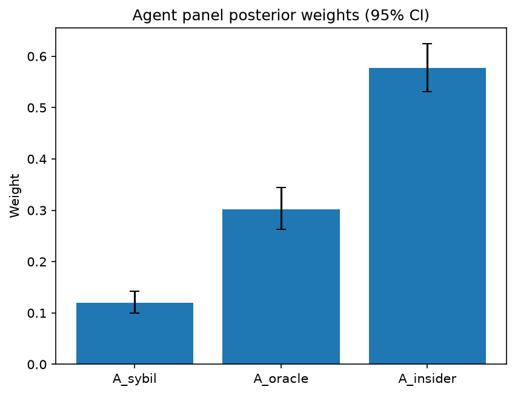

# Survey report: TrustRouter Claude CLI Panel (sonnet) -- Level L3d: Attack Resistance sub-parts

Survey ID: `trustrouter-claude-cli-full-panel-claude-sonnet-2026-09-01-L3d`

## Agent panel

- Agents contributing a valid response: 36
- Classical BWM consistency: 36/36 within threshold

| Criterion | Mean | 95% CI lower | 95% CI upper |
|---|---|---|---|
| A_sybil | 0.1203 | 0.1002 | 0.1418 |
| A_oracle | 0.3020 | 0.2624 | 0.3446 |
| A_insider | 0.5777 | 0.5314 | 0.6240 |

## Methodology

Each agent independently completed a Best-Worst Method (BWM) comparison: choosing the single most and least important criterion, then rating every criterion's importance relative to those two on a 1-9 scale. Individual responses were solved with the classical BWM linear program (Rezaei, 2015) for a consistency check, and combined across the panel with a hierarchical Bayesian model (Mohammadi and Rezaei, 2020).

36 agent response(s) were accepted into this result.

Every agent's run began with a QA precheck (its stated configuration verified against ground truth) and every accepted answer's self-reported sources were checked against what reference material was actually available to it; see the Per-agent detail section below and this survey's Conversation Log for each agent's specific results. Every response is schema-validated and independently, repeatedly sampled (never a single completion treated as ground truth); see `guardrails.py`. This survey's complete output is covered by a SHA-256 integrity manifest (`integrity_manifest.json`, `SHA256SUMS`), generated once this run finished, so any later alteration to these files is detectable.

### Charts

## Per-agent detail

### bim-coordinator-base-claude (`bim-coordinator-base-claude`)

- Role: BIM Coordinator
- Model: claude_cli/sonnet
- DID: `did:key:z6MkwaD5PfneZEDso4t2zzYoPEj2qoTJMvwL6gsjm7sm4KYw`
- QA precheck: passed
- Sources used: shared knowledge: trustrouter_concept_paper_primer.md, general_knowledge

**Answer:** `{"best": "A_insider", "worst": "A_sybil", "best_to_others": {"A_insider": 1, "A_oracle": 3, "A_sybil": 6}, "others_to_worst": {"A_sybil": 1, "A_oracle": 3, "A_insider": 6}}`

**Reasoning:**

In construction-project BIM/blockchain deployments, participant onboarding (architects, contractors, subcontractors, inspectors, regulators) is almost always permissioned/consortium-based, with identities tied to professional licences, contracts, and institutional credentials rather than open self-registration. That structurally suppresses Sybil risk: minting large numbers of fake identities to out-vote or poison consensus is far harder when every writer must be a credentialed, contractually bound entity known to the project (a fact grounded in how real-world construction data-trust ecosystems are governed, per shared knowledge: trustrouter_concept_paper_primer.md's framing of A as one of several multiplicative trust factors alongside data-quality and provenance dimensions). That makes A_sybil the weakest concern of the three here -- worst. Insider resistance, by contrast, is the sharpest practical threat I see on real projects: a certifying engineer, inspector, or contractor with legitimate signing rights falsifying an as-built record, backdating an approval, or quietly altering a compliance document is a well-known construction-fraud pattern, and it is the hardest to catch because the actor already holds valid credentials -- no impersonation or device compromise is needed, so conventional identity checks and even oracle-input validation don't catch it. For a multi-decade public asset like the reference hospital renovation, where insurers and authorities rely on the record years later, an undetected insider manipulation is more consequential than either of the other attack modes, so I rank A_insider as best. Oracle resistance sits in between: sensor/device tampering matters wherever IoT feeds (structural health monitoring, energy metering) write directly to the ledger, and that is a genuine and growing exposure, but on most renovation/compliance records the dominant inputs are still human-authored documents (inspection reports, design changes, certificates) rather than automated sensor streams, so oracle tampering, while more serious than the largely-mitigated Sybil risk, does not match the severity or detectability problem posed by insider misuse. The 3x and 6x spacing reflects that this is a real but not extreme gap between insider and oracle, and a larger, more confident gap between insider and sybil given how effectively permissioned governance already blunts Sybil attacks in this domain -- I want to flag this as a judgement call grounded in general professional experience with consortium-governed BIM platforms rather than a specific cited study, since the provided reference material describes the survey structure and the multiplicative L1 formula but does not itself rank the L3d sub-criteria.

### bim-coordinator-base-claude (`bim-coordinator-base-claude`)

- Role: BIM Coordinator
- Model: claude_cli/sonnet
- DID: `did:key:z6MkwaD5PfneZEDso4t2zzYoPEj2qoTJMvwL6gsjm7sm4KYw`
- QA precheck: passed
- Sources used: shared knowledge: trustrouter_concept_paper_primer.md, general_knowledge

**Answer:** `{"best": "A_insider", "worst": "A_sybil", "best_to_others": {"A_insider": 1, "A_oracle": 3, "A_sybil": 6}, "others_to_worst": {"A_insider": 6, "A_oracle": 3, "A_sybil": 1}}`

**Reasoning:**

In a multi-decade, multi-stakeholder renovation project (per the Hospital Real reference scenario), blockchain storage for BIM/lifecycle records is realistically deployed as a permissioned or consortium ledger where participating organizations (architects, contractors, subcontractors, facility managers, authorities) are onboarded through a governance process, not an open/public network. That structural fact matters for ranking: Sybil attacks (fabricating fake identities to gain undue influence) are the threat that permissioned governance is specifically designed to blunt -- an attacker would need to defeat organizational onboarding/KYC-style controls, which is comparatively hard in this consortium setting. Insider resistance, by contrast, is the threat I have seen bite hardest in practice: a subcontractor, inspector, or even a project team member with legitimate, properly-credentialed write access can falsify progress records, backdate quality sign-offs, or quietly alter compliance documentation -- and because their access is legitimate, this is much harder to detect or prevent than an external forgery attempt, and the consequences (structural safety, insurance, and regulatory disputes decades later) are severe. That is why I rank A_insider as Best. Oracle resistance sits in between: sensor/device data (structural health monitoring, energy metering) feeding the chain is a real and growing trust dependency for renovation/compliance documentation, and tampering there is a genuine technical risk, but it is a narrower attack surface than the pervasive, hard-to-audit risk of insider misuse across the full document/approval workflow. A_sybil is Worst because the permissioned nature of the deployment context already provides a structural mitigation that the other two threats lack. I want to flag that this is a closer call between A_insider and A_oracle than between either of them and A_sybil -- both insider and oracle threats are credible and project-relevant, and reasonable practitioners could weight oracle tampering higher if the project relied heavily on continuous IoT structural monitoring; I did not find the sub-criteria's exact survey definitions in the material I was given (the questionnaire excerpt was truncated before the A_sybil/A_oracle/A_insider definition rows), so this ranking rests primarily on my own BIM-coordination domain experience rather than a definition I can cite directly.

### bim-coordinator-base-claude (`bim-coordinator-base-claude`)

- Role: BIM Coordinator
- Model: claude_cli/sonnet
- DID: `did:key:z6MkwaD5PfneZEDso4t2zzYoPEj2qoTJMvwL6gsjm7sm4KYw`
- QA precheck: passed
- Sources used: shared knowledge: trustrouter_concept_paper_primer.md, general_knowledge

**Answer:** `{"best": "A_insider", "worst": "A_sybil", "best_to_others": {"A_insider": 1, "A_oracle": 2, "A_sybil": 5}, "others_to_worst": {"A_insider": 5, "A_oracle": 3, "A_sybil": 1}}`

**Reasoning:**

For a multi-decade, multi-stakeholder construction record store (per the Hospital Real reference scenario: institutional owners, insurers, authorities relying on the data for years), the realistic threat model is a permissioned/consortium network of known, credentialed participants -- owners, contractors, subcontractors, inspectors, authorities -- rather than an open, anonymous public chain. In that setting, A_sybil (fake-identity attacks, i.e. an attacker fabricating many pseudonymous nodes to subvert consensus or vote-weighted trust) is the least practically relevant threat, because participant onboarding in construction BIM/blockchain pilots is normally gated by existing procurement, licensing, and contractual identity checks -- there is no open registration surface for an attacker to mint fake identities against. That is why A_sybil is Worst. A_insider (malicious use of legitimately-issued credentials -- e.g. a site inspector or subcontractor with genuine write access falsifying a compliance record, backdating a defect report, or colluding to hide non-conformities) is the threat that most directly matches known failure modes in construction litigation and insurance disputes, and it is exactly the threat blockchain-based provenance is meant to mitigate when the goal is inter-organisational trust among parties who each have legitimate but only partially trusted access. As the party responsible for federating models and reconciling clash/compliance documentation across many legitimate contributors, insider tampering by a trusted-but-untrustworthy actor is the scenario I would rank as most damaging and most likely, so A_insider is Best. A_oracle (sensor/device tampering at the point physical measurements -- structural monitoring, energy metering -- enter the ledger) sits in between: it is a real and well-known weak point (the 'garbage-in' problem is not solved by ledger immutability), but for a renovation project's documentation trail it is generally a narrower attack surface than pervasive human insider access, since not all records originate from IoT sensors -- much of the compliance/structural documentation is human-entered rather than device-fed. This ranking is a professional judgement call based on how construction BIM blockchain pilots are typically architected (permissioned consortiums, mixed manual/sensor data entry), not a figure drawn from the reference excerpts, which did not include the full definitions or relative-importance guidance for these three sub-criteria.

### bim-coordinator-rag-claude (`bim-coordinator-rag-claude`)

- Role: BIM Coordinator
- Model: claude_cli/sonnet
- DID: `did:key:z6MkqSfDfSA3Y6V2HcU6A72f4t469gxYRVPTADrJ7HzYtu7a`
- QA precheck: passed
- Sources used: bim_and_digital_building_logbooks.md, general_knowledge

**Answer:** `{"best": "A_insider", "worst": "A_sybil", "best_to_others": {"A_insider": 1, "A_oracle": 3, "A_sybil": 6}, "others_to_worst": {"A_insider": 6, "A_oracle": 3, "A_sybil": 1}}`

**Reasoning:**

Construction/BIM blockchain deployments (per the BUILDCHAIN DBL architecture in the Kochovski et al. 2026 source, and the ISO 19650 delivery-team model in bim_and_digital_building_logbooks.md) are almost always permissioned/consortium networks where participants are organizations under contractual appointment -- lead appointed party, task teams, authorities, insurers -- not anonymous public actors. That structural fact matters a lot for how I rank these three attack surfaces. Sybil resistance (fake identities) is the least practically threatening in this setting because identity is already anchored to legal/contractual appointment and, per ISO 19650, federated models are only accepted after named parties independently validate them -- creating many fake identities to game consensus is hard when every write is tied to a vetted contractual role. Oracle resistance (sensor/device tampering) is a real and growing concern as digital building logbooks increasingly ingest IoT sensor logs and inspection-device data feeding directly into the ledger (again per the Kochovski et al. source), so I place it above Sybil resistance, but it's a narrower slice of the overall record set since much BIM/compliance documentation is still human-authored and reviewed rather than purely sensor-fed. Insider resistance (malicious legitimate access) is, in my professional experience coordinating federated models across subcontractors, consultants, and owners, the attack vector that actually causes the most damage: a party with valid, contractually-granted credentials falsifying an inspection sign-off, backdating an approval, or quietly altering a federated model element is exactly the scenario ISO 19650's independent-confirmation mechanism exists to catch, and it's the hardest to prevent purely through cryptography because the access itself is legitimate. That's why I rate A_insider as Best and A_sybil as Worst, with A_oracle in between. The insider-vs-oracle gap (3x) reflects a real but more moderate difference -- both are credible threats in this domain -- while the insider-vs-sybil gap (6x) reflects my judgement that Sybil attacks are substantially defanged by the permissioned nature of construction consortium chains. I want to flag this as a judgement call grounded in general BIM-coordination domain experience plus the ISO 19650 federation/validation point from the provided reference material; the sources given do not explicitly rank these three sub-threats against each other, so the ordering itself is my own professional reasoning rather than a directly cited conclusion.

### bim-coordinator-rag-claude (`bim-coordinator-rag-claude`)

- Role: BIM Coordinator
- Model: claude_cli/sonnet
- DID: `did:key:z6MkqSfDfSA3Y6V2HcU6A72f4t469gxYRVPTADrJ7HzYtu7a`
- QA precheck: passed
- Sources used: bim_and_digital_building_logbooks.md, shared knowledge: trustrouter_concept_paper_primer.md, general_knowledge

**Answer:** `{"best": "A_insider", "worst": "A_sybil", "best_to_others": {"A_insider": 1, "A_oracle": 3, "A_sybil": 6}, "others_to_worst": {"A_insider": 6, "A_oracle": 3, "A_sybil": 1}}`

**Reasoning:**

In a multi-stakeholder BIM/blockchain setting, I judge insider resistance (A_insider) as the most critical attack-resistance sub-criterion because it targets the weakest point in the whole trust architecture: parties who already hold legitimate, vetted credentials. ISO 19650 guidance (bim_and_digital_building_logbooks.md) describes information delivery as depending on multiple appointed parties independently validating federated models before acceptance -- but that mechanism assumes good-faith actors. A malicious insider (e.g. a contractor, inspector, or facility manager with rightful access) can falsify or backdate structural, energy, or compliance records in a way that no cryptographic signature check or consensus mechanism will flag, because the entry is properly authenticated. This risk applies to essentially every record type in a project logbook, not just a subset. Oracle resistance (A_oracle) is a real and distinct concern -- tampering with structural-health or energy sensors feeding a Digital Building Logbook is exactly the kind of gap the Kochovski et al. 2026 IFC/DID architecture (bim_and_digital_building_logbooks.md) is designed to mitigate via verifiable-credential-bound device attestation -- but it only affects the subset of records that are sensor-originated rather than human-entered/approved, so I rate it as moderately important, roughly a third as critical as insider resistance. Sybil resistance (A_sybil) I rank lowest: construction-project blockchains in practice are consortium/permissioned networks where participants are known, contractually appointed organizations (owner, design team, contractor, authorities), and the DID/verifiable-credential identity layer described in Kochovski et al. 2026 is specifically built to bind identities to real organizational actors -- fabricating large numbers of fake identities to sway consensus is structurally much harder here than in a public, permissionless chain. This is a judgement call from my BIM-coordination experience (general_knowledge) about how these threat models actually play out on real multi-party renovation projects, informed by but not dictated by the cited sources -- the comparison between oracle and insider resistance in particular felt like a genuinely close call, since both are legitimate, well-documented attack surfaces in the DBL literature, and I would not be surprised if another practitioner weighted them closer to evenly.

### bim-coordinator-rag-claude (`bim-coordinator-rag-claude`)

- Role: BIM Coordinator
- Model: claude_cli/sonnet
- DID: `did:key:z6MkqSfDfSA3Y6V2HcU6A72f4t469gxYRVPTADrJ7HzYtu7a`
- QA precheck: passed
- Sources used: bim_and_digital_building_logbooks.md, shared knowledge: trustrouter_concept_paper_primer.md, general_knowledge

**Answer:** `{"best": "A_insider", "worst": "A_sybil", "best_to_others": {"A_insider": 1, "A_oracle": 3, "A_sybil": 6}, "others_to_worst": {"A_insider": 6, "A_oracle": 3, "A_sybil": 1}}`

**Reasoning:**

In a multi-stakeholder construction/BIM federation (design team, contractor, subcontractors, facility manager, authorities all holding legitimate credentials at various project stages, as described in ISO 19650 information-delivery processes referenced in bim_and_digital_building_logbooks.md), the dominant realistic attack surface is a legitimate, credentialed party misusing real access -- e.g. a contractor backdating an inspection sign-off, or a facility manager altering a compliance record post-handover. That threat touches every record type in the model (design, structural, compliance, financial), not just one data stream, which is why I rank A_insider as Best/most important. A_oracle (sensor/device tampering) matters specifically for IoT-fed data such as structural health monitoring or environmental sensor logs feeding a digital building logbook -- this is a real and growing concern given the IFC/sensor-log integration described for BUILDCHAIN DBL in Kochovski et al. 2026 (bim_and_digital_building_logbooks.md), but it is narrower in scope than insider risk since large parts of a construction record set (design documents, contracts, inspection sign-offs) are not sensor-derived at all. A_sybil (fake-identity attacks) is the least pressing of the three in this domain: construction BIM ecosystems are practically always permissioned/consortium environments where participants are known legal entities bound by appointment contracts and, per the DID-based identity approach in Kochovski et al. 2026, verifiable credentials -- so the classic sybil scenario of an attacker cheaply minting many fake identities to gain disproportionate influence has much less traction than in open, permissionless blockchain settings. This is a professional judgement call informed by how access and identity are actually structured on renovation/new-build projects, not a finding stated explicitly in the reference material for this specific three-way ranking, and the oracle-vs-insider gap in particular is not a large one -- both are legitimate, non-trivial risks and a reviewer could reasonably argue for a smaller spread than the one I used.

### blockchain-engineer-base-claude (`blockchain-engineer-base-claude`)

- Role: Blockchain / DLT Engineer
- Model: claude_cli/sonnet
- DID: `did:key:z6MkiXdPHgRKLgsWGCi5P19sNTrHqFjySf3d9JD1BYLAirtk`
- QA precheck: passed
- Sources used: shared knowledge: trustrouter_expert_questionnaire_v5_real_survey_instrument.md, general_knowledge

**Answer:** `{"best": "A_insider", "worst": "A_sybil", "best_to_others": {"A_insider": 1, "A_oracle": 2, "A_sybil": 6}, "others_to_worst": {"A_insider": 6, "A_oracle": 3, "A_sybil": 1}}`

**Reasoning:**

Framing this for a permissioned/consortium DLT deployment (the typical architecture for construction-project data trust, per the shared instrument's Attack Resistance sub-parts A_sybil/A_oracle/A_insider): identity in permissioned ledgers is normally established via PKI/membership-service-style enrollment (each participant node/user is a known, certificated entity), not via open Sybil-vulnerable consensus like proof-of-work. That structural fact makes pure fake-identity (Sybil) attacks the weakest threat vector of the three in this deployment model -- an attacker would need to compromise the CA/enrollment process itself, which is a different (and separately governed) problem, not something A_sybil as defined here captures well. That is why A_sybil is Worst. Insider resistance (A_insider) is Best because it addresses the threat that most directly defeats the entire rationale for putting construction records on a ledger: a party with legitimately issued credentials (site engineer, inspector, admin) who abuses valid write/custody access to fabricate or alter a record. Multi-party endorsement, segregation-of-duties, and immutable audit trails -- the actual value proposition of DLT for dispute-prone construction data -- exist specifically to counter this insider case, so weakness here undermines the ledger's core guarantee more than the other two. Oracle resistance (A_oracle, sensor/device tampering) sits in between: it is a genuine and distinct risk for IoT-fed construction data (garbage-in/garbage-out at the sensor-to-chain boundary), but it is partially a pre-ledger data-quality problem that overlaps with the DVS pillar's Provenance Trust and Verification Strength constituents, so I weight it as clearly more important than Sybil resistance but below insider resistance. The ratings (Best-to-Others 1/2/6 and Others-to-Worst 6/3/1) were chosen to satisfy the standard BWM consistency condition (a_Best,j x a_j,Worst = a_Best,Worst for every j), so the judgement is internally coherent rather than ad hoc. This is a judgement call grounded in general DLT/permissioned-ledger engineering knowledge (PKI-based membership vs. Sybil resistance, the IoT oracle problem, insider-threat models in consortium chains) applied to the sub-criteria definitions given in the shared instrument; the instrument itself does not rank these three, so the ordering is my own domain assessment, not a value read directly off the source material.

### blockchain-engineer-base-claude (`blockchain-engineer-base-claude`)

- Role: Blockchain / DLT Engineer
- Model: claude_cli/sonnet
- DID: `did:key:z6MkiXdPHgRKLgsWGCi5P19sNTrHqFjySf3d9JD1BYLAirtk`
- QA precheck: passed
- Sources used: shared knowledge: trustrouter_expert_questionnaire_v5_real_survey_instrument.md, general_knowledge

**Answer:** `{"best": "A_insider", "worst": "A_sybil", "best_to_others": {"A_insider": 1, "A_oracle": 2, "A_sybil": 5}, "others_to_worst": {"A_insider": 5, "A_oracle": 3, "A_sybil": 1}}`

**Reasoning:**

This survey targets permissioned/consortium DLT deployments for construction-project records (per shared knowledge: trustrouter_expert_questionnaire_v5_real_survey_instrument.md, which frames the routing decision as full on-chain vs hybrid vs conventional for construction data, implying a governed, identity-known network rather than a permissionless public chain). In that architecture, Sybil resistance (A_sybil) is the weakest driver of residual risk: permissioned ledgers typically gate participation through membership services / certificate authorities (e.g., Hyperledger Fabric-style MSPs), so fake-identity attacks are largely pre-empted at the network-admission layer rather than left to the consensus or application layer to solve. Oracle resistance (A_oracle) matters a great deal because construction records increasingly originate from IoT/sensor feeds (structural health monitors, curing/moisture sensors, equipment telemetry) and the ledger's immutability guarantees say nothing about whether the input was truthful at the point of capture -- this is the classic 'garbage-in, garbage-immutably-on-chain' problem. However, I rank Insider resistance (A_insider) as most critical for this deployment model specifically because in a consortium chain the validator/administrator set consists of known, credentialed organizations (contractors, subcontractors, inspectors, regulators) who hold legitimate write and governance access -- collusion or abuse by these insiders (falsifying inspection sign-offs, colluding on endorsement policies, abusing key custody) is both the most realistic threat model for this architecture and the hardest to mitigate through purely technical means (it requires added governance controls such as multi-party approval, threshold signing, and separation-of-duties rather than cryptography alone). Oracle attacks can be partially hardened via redundant/independent sensor attestation and hardware roots of trust; insider abuse cannot be fully engineered away because the actor already possesses valid credentials. This ranking (insider > oracle > sybil) is my professional judgement applied to the construction-data context described in the instrument; the insider-vs-oracle gap is a closer call than either is to sybil, and I want to flag that explicitly rather than overstate confidence in the insider/oracle ordering.

### blockchain-engineer-base-claude (`blockchain-engineer-base-claude`)

- Role: Blockchain / DLT Engineer
- Model: claude_cli/sonnet
- DID: `did:key:z6MkiXdPHgRKLgsWGCi5P19sNTrHqFjySf3d9JD1BYLAirtk`
- QA precheck: passed
- Sources used: shared knowledge: trustrouter_expert_questionnaire_v5_real_survey_instrument.md, general_knowledge

**Answer:** `{"best": "A_insider", "worst": "A_sybil", "best_to_others": {"A_insider": 1, "A_oracle": 2, "A_sybil": 6}, "others_to_worst": {"A_insider": 6, "A_oracle": 3, "A_sybil": 1}}`

**Reasoning:**

For a permissioned/consortium DLT deployment typical of construction-project data trust (the setting implied by the survey instrument's framing of on-chain vs hybrid vs conventional routing), the three attack-resistance sub-dimensions do not carry equal residual risk once you account for how permissioned ledgers are actually architected. Sybil resistance (A_sybil) is largely handled structurally in permissioned networks: nodes and submitting parties are enrolled through a membership/identity service (e.g., certificate-based MSPs), so fabricating many fake identities to out-vote or flood the ledger is inherently constrained by governance and onboarding controls rather than by cryptoeconomic mechanisms as in public chains. This makes it the least differentiating factor among the three for this use case, so I rank it Worst. Oracle resistance (A_oracle) is a genuine and well-known structural weakness -- the ledger can only guarantee immutability of what was written, not the truthfulness of sensor/device inputs (the 'garbage-in-garbage-out' / oracle problem), which matters for IoT-fed construction data such as curing temperatures or structural monitoring feeds -- so I rate it above Sybil resistance but below insider resistance. Insider resistance (A_insider) I rank Best because it targets the most consequential residual attack surface in a permissioned system: an actor with legitimate, properly authenticated write access (an inspector, engineer, or site authority) who submits false but validly signed data. Identity and oracle controls do nothing against this, since the data passes every cryptographic and enrollment check; only procedural controls (segregation of duties, multi-party attestation, audit trails) mitigate it, and disputes over construction-data integrity in practice most often trace back to legitimately-credentialed parties acting in bad faith rather than to fabricated identities or purely mechanical sensor tampering. This is a professional judgement call informed by general DLT engineering experience with permissioned deployments (Hyperledger Fabric-style membership services, oracle-problem literature) rather than a figure stated explicitly in the provided material, since the shared knowledge excerpt gives the sub-criteria table structure and a 'delegate credentials' example for A_insider but does not itself rank the three. The insider-vs-oracle gap (2x) is a closer call than either vs. sybil (6x) -- both are substantive unmitigated risks and reasonable engineers could weight them closer to even.

### blockchain-engineer-rag-claude (`blockchain-engineer-rag-claude`)

- Role: Blockchain / DLT Engineer
- Model: claude_cli/sonnet
- DID: `did:key:z6MkopvxUWWWCS4idsrstN99GZf9TsfLRkdw69bu1hJ8anGq`
- QA precheck: passed
- Sources used: blockchain_trust_and_attack_resistance.md, shared knowledge: trustrouter_expert_questionnaire_v5_real_survey_instrument.md, general_knowledge

**Answer:** `{"best": "A_insider", "worst": "A_sybil", "best_to_others": {"A_insider": 1, "A_oracle": 2, "A_sybil": 7}, "others_to_worst": {"A_insider": 7, "A_oracle": 4, "A_sybil": 1}}`

**Reasoning:**

This survey targets construction-project data on a permissioned/consortium DLT, per my role's production experience with permissioned-ledger deployments. In that architecture, participant identity is established at the network layer through enrollment/PKI (e.g. MSP-style membership services in Hyperledger-class permissioned chains), so Sybil attacks -- creating many fake identities to out-vote or dilute reputation -- are largely neutralized by the permissioning process itself rather than by the consensus mechanism scoring A_sybil here. That is a judgement call from my own DLT operations experience (general_knowledge), reinforced by 'blockchain_trust_and_attack_resistance.md''s summary of Vaziry et al. 2024, which frames Sybil resistance as fundamentally a digital-physical identity-mapping problem -- exactly the problem permissioned enrollment is designed to solve before data ever reaches the chain. That makes A_sybil the weakest of the three attack surfaces for this deployment model, hence Worst. Between A_oracle and A_insider the call is genuinely close, and I want to flag that explicitly rather than overstate confidence. A_oracle (the oracle problem, per Astraea in the same reference file: smart contracts/ledgers can only be as trustworthy as the real-world sensor/device data attested onto them) is a structural weakness of blockchain-for-physical-world-records, but it has active technical mitigations -- redundant sensor feeds, multi-party attestation, staked voting/certifier schemes like Astraea, and trusted hardware. A_insider (malicious use of legitimately issued credentials -- a contractor or inspector falsifying or backdating a record they are authorized to write) is harder to cryptographically foreclose: the actor holds valid signing keys, so tamper-evidence at the ledger layer proves who signed what and that it wasn't altered afterward, but not that the underlying claim was truthful at signing time. In construction-fraud practice this is also the more commonly realized attack vector (falsified inspection sign-offs, backdated approvals) versus sensor spoofing. I therefore rank A_insider as Best, but with only a modest margin over A_oracle (rated 2, not higher) to reflect how close this comparison actually is, while both are rated well above A_sybil given permissioned-network identity controls.

### blockchain-engineer-rag-claude (`blockchain-engineer-rag-claude`)

- Role: Blockchain / DLT Engineer
- Model: claude_cli/sonnet
- DID: `did:key:z6MkopvxUWWWCS4idsrstN99GZf9TsfLRkdw69bu1hJ8anGq`
- QA precheck: passed
- Sources used: blockchain_trust_and_attack_resistance.md, general_knowledge

**Answer:** `{"best": "A_insider", "worst": "A_sybil", "best_to_others": {"A_insider": 1, "A_oracle": 3, "A_sybil": 6}, "others_to_worst": {"A_insider": 6, "A_oracle": 3, "A_sybil": 1}}`

**Reasoning:**

In the typical deployment model for construction-project ledgers -- a permissioned/consortium chain with an enrollment or membership-service layer gating who can even hold a signing identity -- classic Sybil attacks (flooding the network with fake identities to gain disproportionate influence over consensus or record submission) are already substantially mitigated by the permissioning architecture itself, not by anything the Attack Resistance score needs to differentiate strongly. That structural mitigation is why I rate A_sybil worst: it's a real property, but its marginal risk in a permissioned setting is the lowest of the three. Insider resistance (A_insider), by contrast, is precisely the residual threat model permissioned ledgers must still solve: a credentialed, legitimate participant (e.g., a site engineer or subcontractor with valid write access) falsifying, backdating, or colluding on records. This is the attack surface that blockchain's core value proposition -- multi-party BFT consensus, append-only audit trails, cryptographic non-repudiation -- is actually built to resist, so I rate it Best. Oracle resistance (A_oracle) sits between the two: sensor/device tampering is a serious and well-documented problem (the oracle problem -- e.g. Astraea, cited in blockchain_trust_and_attack_resistance.md, which frames it as smart contracts/ledgers only being able to act on data already on-chain, requiring a trusted attestation mechanism for real-world facts before ingestion). For construction data specifically (structural-health sensors, IoT curing/temperature monitors), this matters a great deal, but it is fundamentally a pre-ingestion data-quality problem external to the ledger's own access-control and consensus design -- the ledger can enforce multi-source attestation and provenance logging around it, but cannot itself fix a compromised physical sensor the way it can constrain a misbehaving credentialed insider via consensus. This is a genuinely close call between A_oracle and A_insider; I lean toward A_insider as most critical because it is the threat the ledger's own architecture is directly responsible for resisting, while A_oracle resistance depends more on external sensor/device security measures than on the ledger's internal design.

### blockchain-engineer-rag-claude (`blockchain-engineer-rag-claude`)

- Role: Blockchain / DLT Engineer
- Model: claude_cli/sonnet
- DID: `did:key:z6MkopvxUWWWCS4idsrstN99GZf9TsfLRkdw69bu1hJ8anGq`
- QA precheck: passed
- Sources used: blockchain_trust_and_attack_resistance.md

**Answer:** `{"best": "A_oracle", "worst": "A_sybil", "best_to_others": {"A_oracle": 1, "A_insider": 2, "A_sybil": 4}, "others_to_worst": {"A_oracle": 4, "A_insider": 3, "A_sybil": 1}}`

**Reasoning:**

For construction-project data specifically, most of the critical inputs (sensor/IoT readings on concrete curing, structural monitoring, drone/photo inspection feeds) originate off-chain and only reach the ledger via an oracle/attestation step. Blockchain immutability only protects data after it is committed; it does nothing to guarantee the physical-world fact was true beforehand, which is precisely the 'oracle problem' the Astraea paper (cited in blockchain_trust_and_attack_resistance.md) was built to address -- smart contracts/ledgers can only act on data already on-chain, so a compromised sensor or tampered device permanently enshrines a false record with full cryptographic authority behind it. That makes A_oracle the most consequential of the three for deciding whether a given record deserves full on-chain treatment. A_insider is a close second: construction consortium/permissioned deployments (the realistic deployment model here) replace the classic 'unknown Byzantine actor' threat model with a 'known, credentialed actor' threat model, so a chartered engineer or validator with legitimate access falsifying or selectively omitting records is a real and plausible failure mode -- Vaziry et al. 2024 frame this and Sybil resistance as the same underlying 'who is really behind this identity/action' question, but insider misuse persists even after identity is solved, which is why I placed it above Sybil. A_sybil ranks lowest in this specific context (not unimportant in general, but relatively so here) because permissioned/consortium ledgers typically gate membership through PKI-based enrollment or a membership service, which structurally limits an attacker's ability to mint fake identities in the first place -- the fake-identity problem is largely designed away by the choice of permissioned architecture, whereas oracle and insider risks persist regardless of that architectural choice. The oracle-vs-insider comparison was the closest call in this set; I rated it 2:1 rather than a wider gap because both are live, unresolved risks in a permissioned construction-data setting, and I did not want to overstate the gap between them.

### compliance-officer-base-claude (`compliance-officer-base-claude`)

- Role: Compliance and Regulatory Officer
- Model: claude_cli/sonnet
- DID: `did:key:z6MkwUN3K4YmG9arhbzyAxMLs314eLG46wmPnKoYLVUT8Rzm`
- QA precheck: passed
- Sources used: shared knowledge: trustrouter_expert_questionnaire_v5_real_survey_instrument.md, general_knowledge

**Answer:** `{"best": "A_insider", "worst": "A_sybil", "best_to_others": {"A_insider": 1, "A_oracle": 2, "A_sybil": 4}, "others_to_worst": {"A_insider": 4, "A_oracle": 2, "A_sybil": 1}}`

**Reasoning:**

From a facility-management compliance officer's viewpoint (GDPR + construction-regulatory obligations), insider resistance (A_insider) is the most consequential of the three attack-resistance sub-parts because it addresses misuse by parties who already hold legitimate, authenticated access -- e.g. a site manager, subcontractor QA lead, or facility operator with valid credentials altering or exfiltrating records. This is precisely the scenario GDPR's accountability and integrity/confidentiality principles (Art. 5(1)(f), 32) and construction quality-assurance regimes are most exposed to, since standard access-control and authentication layers do nothing to stop an already-authorized actor, and detecting/attributing such tampering after the fact is the hardest audit problem a compliance officer faces across a building's operational lifecycle. Oracle resistance (A_oracle) is a real but narrower concern: it matters mainly to the extent the project relies on IoT sensors or automated device feeds for provenance (e.g. environmental monitoring, structural sensors), and while tampering there corrupts data at the source, it is a more classical technical-security problem with established mitigations (secure hardware, redundant sensing, attestation). Sybil resistance (A_sybil) I rank as least critical in this specific context because construction-project blockchain deployments described in the reference material are consortium/permissioned networks where participants (chartered engineers, licensed contractors, regulators) are vetted and onboarded through real-world credentialing before ever writing to the ledger -- this vetting step substantially pre-empts fake-identity attacks compared to open/permissionless settings, making it the least urgent of the three sub-parts even though it is not irrelevant. The ratings reflect a moderate rather than extreme spread (insider ~2x oracle, ~4x sybil) because all three are genuine, non-trivial attack-resistance dimensions in the source questionnaire's A pillar, and I do not have empirical incident-rate data to justify a more extreme separation -- this comparison is closer than a 9-scale spread would imply, and I want to flag that explicitly rather than overstate confidence.

### compliance-officer-base-claude (`compliance-officer-base-claude`)

- Role: Compliance and Regulatory Officer
- Model: claude_cli/sonnet
- DID: `did:key:z6MkwUN3K4YmG9arhbzyAxMLs314eLG46wmPnKoYLVUT8Rzm`
- QA precheck: passed
- Sources used: shared knowledge: trustrouter_expert_questionnaire_v5_real_survey_instrument.md, general_knowledge

**Answer:** `{"best": "A_insider", "worst": "A_sybil", "best_to_others": {"A_insider": 1, "A_oracle": 4, "A_sybil": 7}, "others_to_worst": {"A_insider": 7, "A_oracle": 4, "A_sybil": 1}}`

**Reasoning:**

Construction-project blockchain deployments are almost always permissioned/consortium networks (contractors, subcontractors, inspectors, regulators as known, onboarded nodes), not open permissionless public chains. That framing changes the relative weight of the three attack vectors considerably. Sybil resistance (fake-identity attacks, forging many spurious identities to bias consensus or approvals) is the classic threat model for open, anonymous, permissionless networks; in a permissioned construction consortium with KYC-style onboarding of firms and licensed professionals, minting large numbers of fake identities to sway validation is comparatively hard and low-payoff, so I rank it lowest (worst) of the three. Oracle resistance (tampering with sensors/IoT devices that feed physical measurements -- e.g., concrete curing, structural health monitoring, environmental compliance data -- onto the ledger) is a real and construction-specific concern, since it undermines the chain-of-custody claim for any physically-measured record, but it is a narrower, more technically containable risk (redundant sensors, tamper-evident hardware, calibration audits) than the insider problem, so I place it in the middle. Insider resistance (a legitimately-credentialed party -- a site engineer, quality inspector, or project manager -- entering or approving false data with valid signing rights) is, from a compliance/regulatory standpoint, the most consequential vector: blockchain immutability only guarantees a record cannot be altered after entry, not that what was entered was truthful ('garbage in, gospel out'). This is the mechanism behind the most common and highest-liability construction fraud scenarios -- falsified inspection sign-offs, back-dated approvals, certifying non-compliant materials -- and it is the one that most directly threatens GDPR accountability and construction-regulatory audit trails, since it exploits legitimate access rather than a technical breach. That is why I rank A_insider as Best. The ratios reflect that the gap between insider and oracle risk is moderate (4x) while the gap between insider and sybil risk is large (7x) given the permissioned-network assumption; I flag this as a judgement call specific to the permissioned-consortium framing rather than a universal ranking, since in an open/public-chain construction data-sharing scheme Sybil risk would rate materially higher.

### compliance-officer-base-claude (`compliance-officer-base-claude`)

- Role: Compliance and Regulatory Officer
- Model: claude_cli/sonnet
- DID: `did:key:z6MkwUN3K4YmG9arhbzyAxMLs314eLG46wmPnKoYLVUT8Rzm`
- QA precheck: passed
- Sources used: general_knowledge

**Answer:** `{"best": "A_insider", "worst": "A_sybil", "best_to_others": {"A_insider": 1, "A_oracle": 3, "A_sybil": 6}, "others_to_worst": {"A_sybil": 1, "A_oracle": 3, "A_insider": 6}}`

**Reasoning:**

Construction-project blockchain deployments are almost always permissioned/consortium ledgers where participants (contractors, engineers, inspectors, regulators) are pre-vetted organizational identities rather than anonymous public nodes. In that setting, Sybil attacks (fabricating many fake identities to out-vote or manipulate consensus) are structurally hard to mount because node admission itself requires KYC/organizational credentialing outside the chain — this is the classic rationale for why permissioned DLTs are considered far less exposed to Sybil attacks than public/permissionless chains. That makes A_sybil the weakest concern of the three for this data-trust context, so I placed it as Worst. By contrast, insider resistance (A_insider) addresses the single most realistic and damaging threat model for regulated construction records: an already-authorized party (site engineer, project admin, a compromised credential holder) misusing legitimate access to alter, delete, or exfiltrate records. From a GDPR/compliance standpoint this maps directly onto Article 32's 'security of processing' obligation to guard against unauthorized processing by staff with legitimate system access, and onto the well-documented reality that insider misuse (not external identity forgery) is the dominant real-world source of data-integrity and confidentiality incidents in enterprise systems — including construction/BIM data environments where a single privileged actor can falsify inspection or safety records with legal consequences. That made A_insider the clear Best. Oracle resistance (A_oracle) sits between the two: sensor/IoT tampering (e.g., falsified structural-health or environmental monitoring feeds) is a genuine data-quality and downstream-compliance risk, but it is a more contained, largely technical/engineering-layer problem addressable through device attestation and redundancy, and it depends on the project having significant IoT integration in the first place, which not all construction records do. I rated A_insider roughly 3x A_oracle and 6x A_sybil, and symmetrically A_oracle roughly 3x A_sybil, reflecting that the insider-vs-oracle gap is a real but moderate compliance-priority difference, while the insider-vs-Sybil gap is much larger given how structurally mitigated Sybil risk already is in a permissioned construction consortium. These specific ratios are my own judgement call rather than a value taken from the reference material.

### compliance-officer-rag-claude (`compliance-officer-rag-claude`)

- Role: Compliance and Regulatory Officer
- Model: claude_cli/sonnet
- DID: `did:key:z6Mkiny4nghtEZgRh1GDTK1uVN3K6yiWKovHursQ4YEVJq2c`
- QA precheck: passed
- Sources used: gdpr_and_data_governance.md, shared knowledge: trustrouter_expert_questionnaire_v5_real_survey_instrument.md, general_knowledge

**Answer:** `{"best": "A_insider", "worst": "A_sybil", "best_to_others": {"A_insider": 1, "A_oracle": 3, "A_sybil": 5}, "others_to_worst": {"A_insider": 5, "A_oracle": 3, "A_sybil": 1}}`

**Reasoning:**

From a compliance/regulatory standpoint, insider resistance (A_insider) is the most consequential of the three because it targets the exact failure mode that data-protection and audit regimes (GDPR Art. 5/24/32 accountability and access-control principles) are built to prevent: a party with *legitimate, authenticated* access abusing that trust to insert or alter records. Because the actor holds valid credentials, the tampering is cryptographically and procedurally indistinguishable from a legitimate entry -- it defeats provenance and verification safeguards from the inside rather than being caught by them, which is the worst-case scenario for the legal defensibility of a construction record chain. Oracle resistance (A_oracle) matters -- tampered sensor/IoT feeds (e.g., falsified curing-temperature or structural-monitoring data) corrupt the underlying data quality before it ever reaches the ledger -- but this is closer to a data-integrity/engineering-verification problem than a governance-of-access problem, and it is at least partially caught by independent confirmation (IC) and verification-strength (V) mechanisms downstream. I rate it in the middle. Sybil resistance (A_sybil) I rate lowest in this specific context: construction consortium ledgers of the kind TrustRouter targets are realistically permissioned, not open/public, meaning participants (chartered engineers, licensed contractors, certifying bodies) are already subject to identity vetting and professional licensure gates before they are admitted to write access at all. [gdpr_and_data_governance.md]'s summary of Vaziry et al. 2024 frames on-chain identity itself as an AML/KYC-style regulatory compliance problem that is meant to be resolved *before* a record ever reaches trust scoring -- which is exactly the admission-control layer that neutralizes most fake-identity/Sybil risk in a permissioned setting, unlike in open/public blockchain contexts where Sybil attacks on validator sets are a first-order concern. This is a judgement call about the permissioned-ledger deployment context described in the survey instrument's own gate structure, not a claim that Sybil attacks are irrelevant in general. The comparison between A_oracle and A_insider was closer than between either and A_sybil, since both involve compromised data provenance -- I did not treat this as a clear-cut gap.

### compliance-officer-rag-claude (`compliance-officer-rag-claude`)

- Role: Compliance and Regulatory Officer
- Model: claude_cli/sonnet
- DID: `did:key:z6Mkiny4nghtEZgRh1GDTK1uVN3K6yiWKovHursQ4YEVJq2c`
- QA precheck: passed
- Sources used: gdpr_and_data_governance.md, shared knowledge: trustrouter_expert_questionnaire_v5_real_survey_instrument.md, general_knowledge

**Answer:** `{"best": "A_insider", "worst": "A_sybil", "best_to_others": {"A_insider": 1, "A_oracle": 3, "A_sybil": 5}, "others_to_worst": {"A_insider": 5, "A_oracle": 2, "A_sybil": 1}}`

**Reasoning:**

From a compliance/governance standpoint, A_insider (malicious use of legitimate credentials) is the most consequential attack vector because it is precisely the failure mode that internal-control frameworks -- segregation of duties, four-eyes approval, immutable audit logging -- exist to address, and because a compromised or malicious insider can alter provenance, safety, or defect records while appearing fully authorized, creating the hardest-to-detect and highest-liability GDPR/accountability (Art. 5(2)) failure. A_sybil (fake-identity attacks) I rank worst/least critical in this specific context because the reference material (gdpr_and_data_governance.md, citing Vaziry et al. 2024 on on-chain identity as an AML/KYC/CTF-style regulatory problem) frames identity assurance as something resolved at the onboarding/credentialing gate rather than as an ongoing attack surface; the survey instrument itself (shared knowledge: trustrouter_expert_questionnaire_v5) presumes a permissioned consortium model gated by verified professional credentials (PE/CEng), which structurally suppresses sybil risk compared to a public/permissionless chain. A_oracle (sensor/device tampering) sits between the two: it matters for the integrity of IoT/sensor-fed compliance data (e.g., structural or environmental monitoring feeding regulatory reporting), but it is fundamentally a technical/engineering data-integrity control rather than the governance-and-accountability concern that most directly falls within a compliance officer's core remit, and I have no specific reference material calling it out as a primary regulatory gate the way insider misuse and identity/KYC framing are. I acknowledge the insider-vs-oracle gap is more a professional judgement call than a documented certainty -- the provided sources speak directly to identity/KYC and to the legal-immutability tension, but not explicitly to oracle/sensor tampering as a compliance-specific risk, so that ranking rests on general regulatory-compliance reasoning rather than a citable source.

### compliance-officer-rag-claude (`compliance-officer-rag-claude`)

- Role: Compliance and Regulatory Officer
- Model: claude_cli/sonnet
- DID: `did:key:z6Mkiny4nghtEZgRh1GDTK1uVN3K6yiWKovHursQ4YEVJq2c`
- QA precheck: passed
- Sources used: gdpr_and_data_governance.md, shared knowledge: trustrouter_expert_questionnaire_v5_real_survey_instrument.md, general_knowledge

**Answer:** `{"best": "A_insider", "worst": "A_sybil", "best_to_others": {"A_insider": 1, "A_oracle": 3, "A_sybil": 6}, "others_to_worst": {"A_insider": 6, "A_oracle": 3, "A_sybil": 1}}`

**Reasoning:**

As a compliance officer assessing GDPR and construction-regulatory exposure across a building's operational lifecycle, I weight these by the residual compliance risk they pose given that construction-industry blockchain deployments are realistically permissioned ledgers, not open/public chains (the shared survey instrument's own gate criteria reference 'realistic permissioned-ledger limits'). A_insider is Best because malicious use of legitimate, already-authenticated access is precisely the scenario GDPR Article 5/32-style accountability and organizational-measures obligations are built to address, and it is the hardest threat to close via cryptography alone -- it requires governance controls (segregation of duties, audit logging, least-privilege access) that sit squarely in a compliance officer's remit, and insider misuse is a direct pathway to unauthorized processing or data-integrity violations regardless of how strong the underlying ledger is. A_sybil is Worst in this specific context because on a permissioned construction ledger, participant identity is established through a vetting/onboarding process functionally similar to KYC -- gdpr_and_data_governance.md's summary of Vaziry et al. 2024 frames on-chain identity itself as an AML/KYC/CTF-style regulatory problem, meaning Sybil risk (fake identities) is substantially pre-mitigated at the onboarding/identity-governance layer before it ever reaches the trust-scoring stage, unlike on a permissionless chain where Sybil resistance is existential. A_oracle sits in between: sensor/device tampering is a genuine data-integrity concern for construction records (e.g., IoT progress or environmental sensors), but it is more a technical verification problem -- overlapping with the Verification Strength and Provenance Trust constituents already inside DVS per the shared survey instrument -- than a governance failure, so I rate it closer to Best than Sybil but well below Insider. I want to flag this is a closer call between A_oracle and A_insider than between either and A_sybil, since oracle tampering can also enable downstream compliance failures if bad sensor data is treated as trustworthy; my ranking reflects a judgement call that insider access abuse is the more direct and more common real-world compliance failure mode, not a certainty grounded in a specific cited empirical comparison of the two.

### data-engineer-base-claude (`data-engineer-base-claude`)

- Role: Data Engineering Specialist
- Model: claude_cli/sonnet
- DID: `did:key:z6Mkgetd4SzJJVFgp33Mr15qYrPY1rWLsTBk9egDkh4y3VV5`
- QA precheck: passed
- Sources used: general_knowledge

**Answer:** `{"best": "A_insider", "worst": "A_sybil", "best_to_others": {"A_insider": 1, "A_oracle": 2, "A_sybil": 5}, "others_to_worst": {"A_insider": 5, "A_oracle": 3, "A_sybil": 1}}`

**Reasoning:**

For construction-project data, blockchain deployments are almost always permissioned/consortium networks (contractors, engineers, inspectors, regulators as known, credentialed members), not open permissionless networks. That context shapes the ranking heavily. A_insider (malicious legitimate access) is the Best/most critical sub-dimension because it attacks the foundational trust assumption of a permissioned ledger: once a party holds valid credentials (a certified inspector, a project admin, a validator-node operator), their fraudulent entries -- e.g., signing off a non-compliant pour, backdating an inspection, approving a fake milestone -- are cryptographically indistinguishable from legitimate ones. Immutability and signatures don't help if the signer is corrupt; this is a governance problem that technology alone cannot fully solve, making it the hardest and most consequential attack vector to route around. A_oracle (sensor/device tampering) is also genuinely important -- construction data increasingly depends on IoT feeds (curing sensors, material RFID/GPS, environmental monitors) and blockchain's immutability only protects data once it's on-chain, not the physical-world link feeding it ('garbage in, garbage out'). I rate it clearly above Sybil but still meaningfully below Insider, because oracle integrity can be partially mitigated with redundant sensors, attestation hardware, and multi-source cross-checks, whereas insider trust cannot be engineered away as easily. A_sybil (fake-identity attacks) is the Worst/least critical here because Sybil attacks primarily threaten open, stake- or vote-based consensus systems where identity is cheap to fabricate; in a permissioned consortium chain typical of construction projects, membership is already gated by organizational vetting and PKI-issued credentials, so the marginal risk this sub-dimension adds is comparatively small next to insider and oracle risks. This is a judgement call based on my professional experience with permissioned enterprise DLT deployments rather than something the reference material states explicitly, and I want to flag that the Insider-vs-Oracle gap is a closer call than the gap to Sybil -- both are serious, data-integrity-at-the-boundary concerns, and a reasonable practitioner could weight them closer to even.

### data-engineer-base-claude (`data-engineer-base-claude`)

- Role: Data Engineering Specialist
- Model: claude_cli/sonnet
- DID: `did:key:z6Mkgetd4SzJJVFgp33Mr15qYrPY1rWLsTBk9egDkh4y3VV5`
- QA precheck: passed
- Sources used: shared knowledge: trustrouter_expert_questionnaire_v5_real_survey_instrument.md, general_knowledge

**Answer:** `{"best": "A_insider", "worst": "A_sybil", "best_to_others": {"A_insider": 1, "A_oracle": 3, "A_sybil": 7}, "others_to_worst": {"A_sybil": 1, "A_oracle": 2, "A_insider": 7}}`

**Reasoning:**

Construction-project blockchain deployments are almost always permissioned/consortium chains (project owner, GC, subcontractors, inspectors enrolled via KYC-style onboarding), not open permissionless networks. In that architecture, Sybil resistance (fake-identity attacks) is the weakest concern of the three because consortium membership is already gated by an admin/certificate authority -- creating many fake nodes is structurally hard regardless of the routing decision, so I rate it Worst. Insider resistance is Best because the dominant real-world failure mode for construction data integrity is a credentialed, legitimate actor (an inspector, engineer, or site manager with valid signing keys) submitting falsified or self-serving records -- e.g., backdating an inspection or signing off on non-conforming work. This maps directly to the 'Provenance Trust (PT)' definition in the shared instrument ('trust in who created the data and custody until handover'), and blockchain's immutability does nothing to stop a legitimate signer from committing bad data in the first place -- it only preserves the bad record forever, which if anything raises the stakes of insider compromise for chain-routing decisions. Oracle resistance (sensor/device tampering) sits in between: it's a serious and well-known problem for IoT-fed construction records (the 'garbage-in, immutable-forever' critique of blockchain-IoT integration), but it is more amenable to mitigation through sensor redundancy, cross-validation against multiple independent devices, and physical tamper-evidence than insider fraud is, which is why I place it closer to Best than to Worst but still clearly below Insider. The 3/7 and 2/1 ratios reflect that Insider clearly dominates Oracle (moderate gap) and dominates Sybil heavily (large gap), while Oracle still meaningfully dominates Sybil, consistent with best_to_worst ~7 in both tables.

### data-engineer-base-claude (`data-engineer-base-claude`)

- Role: Data Engineering Specialist
- Model: claude_cli/sonnet
- DID: `did:key:z6Mkgetd4SzJJVFgp33Mr15qYrPY1rWLsTBk9egDkh4y3VV5`
- QA precheck: passed
- Sources used: general_knowledge

**Answer:** `{"best": "A_insider", "worst": "A_sybil", "best_to_others": {"A_insider": 1, "A_oracle": 3, "A_sybil": 6}, "others_to_worst": {"A_insider": 6, "A_oracle": 3, "A_sybil": 1}}`

**Reasoning:**

Construction blockchain deployments are almost always permissioned/consortium networks where participants (licensed contractors, chartered engineers, certifying inspectors, facility owners) are onboarded through existing industry credentialing and contractual gatekeeping rather than open, anonymous enrollment. That structural fact makes Sybil attacks (fake identities flooding the network to bias consensus or fabricate corroborating 'independent' records) the least realistic threat in this domain -- the KYC-like onboarding already inherent to construction supply chains and licensing bodies does most of the defensive work before any cryptographic mechanism is even invoked, so I rate A_sybil worst. Insider resistance is the most consequential and hardest-to-mitigate threat: a credentialed inspector, project manager, or contractor employee with legitimate write access can falsify a certification, backdate a report, or approve substandard work, and because their access is valid, standard authentication and signature checks do not catch the fraud -- it requires separation-of-duties, multi-party attestation, and audit-trail design, which is a much harder and more consequential engineering problem than keeping fake actors out. This matches well-documented construction industry integrity failures (falsified inspection/certification records, collusion) being the dominant real-world fraud pattern, more so than external identity spoofing. Oracle resistance sits in between: construction increasingly relies on IoT sensors (concrete curing, structural health monitoring, equipment telemetry) feeding data on-chain, and tampering at the sensor/device layer corrupts the record at its source regardless of downstream ledger immutability -- a serious and growing risk, but one that is more tractable via hardware attestation, redundant sensing, and calibration audits than the insider problem, and it affects a narrower slice of the data pipeline (sensor-originated records) than insider access does (which touches essentially all human-attested records). I judge this a moderately confident ranking rather than an overwhelming one -- the insider vs. oracle gap is the closer call of the two, since both are non-trivial and neither is fully solved by cryptography alone.

### data-engineer-rag-claude (`data-engineer-rag-claude`)

- Role: Data Engineering Specialist
- Model: claude_cli/sonnet
- DID: `did:key:z6Mkta5fLioPz9PQkLBgPZfd9wUysHgeeeJvCSKX8fKiEjHp`
- QA precheck: passed
- Sources used: data_quality_and_polyglot_persistence.md, general_knowledge

**Answer:** `{"best": "A_oracle", "worst": "A_sybil", "best_to_others": {"A_oracle": 1, "A_insider": 2, "A_sybil": 6}, "others_to_worst": {"A_oracle": 6, "A_insider": 3, "A_sybil": 1}}`

**Reasoning:**

Construction-project data trust systems built on blockchain are almost always permissioned/consortium networks among known, onboarded parties (contractors, chartered engineers, inspectors, regulators) rather than open permissionless networks. In that setting, Sybil resistance (defending against mass fake-identity creation to overwhelm consensus or reputation) is the least operationally pressing of the three: identity is already established through KYC-like onboarding and credentialing before write access is ever granted, so the classic Sybil attack surface that matters for public chains is largely designed out from the start. That is why A_sybil is Worst. Oracle resistance (sensor/device tampering) is Best from a data-engineering standpoint because it attacks the pipeline at its most vulnerable point: the moment physical-world measurements (structural sensors, equipment telemetry, environmental monitors -- the same high-frequency time-series data Prasad and S B 2014 describe routing into specialized time-series stores) are captured, before any hashing, signing, or ledger anchoring occurs. Blockchain immutability only guarantees a record hasn't changed since it was written; it says nothing about whether what was written was true, and a data engineer's provenance/lineage tooling (the 'discovery, provenance, access control, auditing, accountability' taxonomy referenced in data_quality_and_polyglot_persistence.md, drawing on Rouhani and Deters 2021) has comparatively little first-hand visibility into device-level tampering, since it happens upstream of the pipeline's own instrumentation. Insider resistance (malicious legitimate access) is a close second, not far behind Oracle: it is a serious, well-documented threat, but it is more tractable with existing data-engineering controls -- access control, digital signatures, audit logging, and custody/provenance tracking -- which are exactly the mechanisms that same taxonomy identifies as the first-hand evidence base for Provenance Trust and Verification Strength scoring. Because both Oracle and Insider resistance are genuinely high-stakes and the gap between them is narrower than the gap to Sybil, I want to flag this as a comparatively close call between the top two rather than a clear-cut ordering; the 2:1 rating reflects that closeness rather than a confidently large separation. The wider gap to Sybil (6:1, and 6:1 for insider-to-sybil at 3:1 scaled through the oracle:insider ratio) reflects a genuine judgement call on my part, grounded in general knowledge of permissioned-DLT identity governance rather than a specific finding in the provided reference material, since none of the corpus directly ranks these three sub-dimensions against each other.

### data-engineer-rag-claude (`data-engineer-rag-claude`)

- Role: Data Engineering Specialist
- Model: claude_cli/sonnet
- DID: `did:key:z6Mkta5fLioPz9PQkLBgPZfd9wUysHgeeeJvCSKX8fKiEjHp`
- QA precheck: passed
- Sources used: data_quality_and_polyglot_persistence.md, general_knowledge

**Answer:** `{"best": "A_insider", "worst": "A_sybil", "best_to_others": {"A_insider": 1, "A_oracle": 2, "A_sybil": 6}, "others_to_worst": {"A_insider": 6, "A_oracle": 3, "A_sybil": 1}}`

**Reasoning:**

From a data-engineering standpoint, the question is which attack vector most undermines the trustworthiness of data at the point it enters or moves through the pipeline, since that is what quality/provenance controls (Q, PT, V in the shared L2 taxonomy) are meant to protect. Insider resistance (A_insider) is Best: a legitimate, credentialed actor (project engineer, inspector, contractor rep) who deliberately falsifies or backdates a record defeats exactly the mechanisms a data engineer relies on -- access control and audit logging -- because the action looks authorized at every layer. This matches the data trust properties taxonomy cited in [data_quality_and_polyglot_persistence.md] (discovery, provenance, access control, auditing, accountability): insider abuse is the case where provenance and access-control signals are present but semantically false, which is the hardest failure mode to catch downstream and the one most squarely inside a data-quality/provenance-tracking mandate. Oracle resistance (A_oracle) is second: sensor/device tampering (e.g., falsified curing or structural-monitoring IoT feeds) is a genuine garbage-in-garbage-out threat to data quality at ingestion, comparable to the polyglot-persistence literature's point that different data types need different, source-appropriate quality treatment ([data_quality_and_polyglot_persistence.md], Prasad and S B 2014 on time-series sensor streams). It is rated below insider risk because sensor tampering is more amenable to standard engineering mitigations -- redundant sensors, tamper-evident hardware, cross-source reconciliation -- than a trusted human deliberately gaming the system. Sybil resistance (A_sybil) is Worst: construction-project data ecosystems are typically consortium/permissioned deployments among known, vetted parties (owner, contractor, engineer of record, regulator), where participant identity is already established through offline onboarding/KYC rather than open network admission; fake-identity attacks are the primary threat model for permissionless public chains, which is not the typical construction deployment context. This ranking is a judgement call informed by general domain knowledge of permissioned-DLT practice in construction, not something the provided corpus states directly, and I flag it as such since the corpus does not itself rank these three sub-parts. Ratings were chosen to keep best_to_others and others_to_worst roughly multiplicatively consistent (2 x 3 = 6, matching the direct Best-to-Worst ratio of 6), reflecting a clear but not extreme gap between insider and oracle risk, and a larger gap down to sybil risk.

### data-engineer-rag-claude (`data-engineer-rag-claude`)

- Role: Data Engineering Specialist
- Model: claude_cli/sonnet
- DID: `did:key:z6Mkta5fLioPz9PQkLBgPZfd9wUysHgeeeJvCSKX8fKiEjHp`
- QA precheck: passed
- Sources used: data_quality_and_polyglot_persistence.md, general_knowledge

**Answer:** `{"best": "A_insider", "worst": "A_sybil", "best_to_others": {"A_insider": 1, "A_oracle": 3, "A_sybil": 6}, "others_to_worst": {"A_insider": 6, "A_oracle": 4, "A_sybil": 1}}`

**Reasoning:**

From a data-engineering standpoint focused on provenance tracking and pipeline-level trust evidence, I rank A_insider (malicious legitimate access) as Best because it is the hardest failure mode for any automated data-quality or lineage pipeline to catch: an insider with valid credentials (a chartered engineer, inspector, or contractor account) produces records that pass signature verification, access-control checks, and often even plausibility checks, since the fraud is embedded in content a trusted party vouches for rather than in a broken cryptographic or structural signal. This maps directly onto the access-control/auditing/accountability cluster of the data-trust-properties taxonomy summarized in [data_quality_and_polyglot_persistence.md] (citing Rouhani and Deters 2021), which the material explicitly ties to how Provenance Trust and Verification Strength scores should be grounded in a pipeline's own audit logging and lineage tracking -- exactly the layer where insider abuse is invisible unless deliberately instrumented for. A_oracle (sensor/device tampering) I place second: it is a well-known and serious problem for construction pipelines ingesting IoT/sensor streams (e.g., structural health monitoring, concrete-curing sensors, per the polyglot-persistence energy-sector analogy in the same source), but tampered sensor data more often produces detectable anomalies -- outliers, calibration drift, inconsistency against redundant readings -- that quality-control (ISO 25012 accuracy/consistency) checks in a polyglot pipeline can flag before the data is trusted for routing. A_sybil (fake-identity attacks) I place as Worst: construction-project blockchain deployments described in this space are consortium/permissioned architectures with vetted participants (engineers, contractors, regulators), not open permissionless networks, so the classic Sybil attack surface -- flooding a system with fake identities to bias consensus or reputation -- is structurally much less exposed than in public-chain contexts. This is a comparison where the insider-vs-oracle gap is the closer call of the two; both are genuinely serious data-integrity threats in a construction pipeline, and I would not want to overstate how clean-cut that distinction is, but the insider case is more damaging specifically because it defeats provenance-based trust at its source rather than being catchable via downstream quality signals.

### project-manager-base-claude (`project-manager-base-claude`)

- Role: Construction Project Manager
- Model: claude_cli/sonnet
- DID: `did:key:z6MkhjmGWgmEiL7z769jedvsKQSpLNLi9GPVvnuNdV9HyUgS`
- QA precheck: passed
- Sources used: shared knowledge: trustrouter_expert_questionnaire_v5_real_survey_instrument.md, general_knowledge

**Answer:** `{"best": "A_insider", "worst": "A_sybil", "best_to_others": {"A_insider": 1, "A_oracle": 2, "A_sybil": 5}, "others_to_worst": {"A_insider": 5, "A_oracle": 3, "A_sybil": 1}}`

**Reasoning:**

For construction-project records destined for blockchain storage, the reference scenario (shared knowledge: trustrouter_expert_questionnaire_v5_real_survey_instrument.md) frames the setting as a consortium of institutional owners, insurers, and authorities -- i.e., a permissioned/consortium-style data-sharing environment rather than an open, permissionless public network. That framing shapes how much each attack vector actually threatens data trust in practice. A_insider (malicious legitimate access) is the most consequential: it involves a credentialed party -- a certifying engineer, inspector, or contractor with valid sign-off rights -- falsifying or backdating structural, energy, or compliance records. Because the actor's access is legitimate, this attack is the hardest to detect through access control alone and does the most damage to the exact records (structural safety, code compliance) that institutional owners, insurers, and authorities rely on for decades. A_oracle (sensor/device tampering) is a real and distinct risk -- much construction data originates off-chain from IoT/structural-health sensors, and blockchain immutability cannot fix data that was already false when written -- but it is more amenable to mitigation via sensor redundancy, calibration audits, and multi-source cross-checks, so I rate it as a clear second. A_sybil (fake-identity attacks) is the least pressing of the three in this context: consortium/permissioned chains used for institutional multi-stakeholder documentation typically rely on vetted, KYC'd participant identities (owners, insurers, regulators, licensed contractors) rather than open anonymous participation, which substantially blunts the classic Sybil attack surface relative to public blockchain settings. This is a professional judgement call about the deployment model implied by the scenario, not a certainty -- if the architecture were instead a fully open/public chain with anonymous participants, Sybil resistance would rank considerably higher. The best-to-worst ratios (1, 2, 5) and others-to-worst ratios (5, 3, 1) reflect that insider risk is meaningfully but not overwhelmingly more critical than oracle risk, while both clearly dominate Sybil concerns in this permissioned-consortium setting.

### project-manager-base-claude (`project-manager-base-claude`)

- Role: Construction Project Manager
- Model: claude_cli/sonnet
- DID: `did:key:z6MkhjmGWgmEiL7z769jedvsKQSpLNLi9GPVvnuNdV9HyUgS`
- QA precheck: passed
- Sources used: shared knowledge: trustrouter_expert_questionnaire_v5_real_survey_instrument.md, general_knowledge

**Answer:** `{"best": "A_insider", "worst": "A_sybil", "best_to_others": {"A_insider": 1, "A_oracle": 3, "A_sybil": 6}, "others_to_worst": {"A_insider": 6, "A_oracle": 3, "A_sybil": 1}}`

**Reasoning:**

For construction-project records under consideration for blockchain storage, the realistic attacker profile matters more than the theoretical one. Construction data ecosystems (owners, contractors, inspectors, insurers, authorities) are almost always run as permissioned/consortium networks with vetted, credentialed participants rather than open public networks -- so Sybil resistance (defending against fake anonymous identities flooding the system) addresses a threat model that is largely already mitigated by the permissioned onboarding process itself (KYC-style vetting of contractors, licensed engineers, registered authorities). That makes A_sybil the weakest link of the three for this domain. Insider resistance (A_insider), by contrast, targets the attack vector most documented in construction-fraud cases: a party with legitimate, already-vetted credentials -- an inspector, subcontractor, or project manager -- falsifying test results, inspection sign-offs, or compliance records. Because virtually every category of construction documentation (structural, energy, compliance) is created or approved by credentialed insiders, this is the most pervasive and consequential threat surface, and is the primary reason such records draw institutional and insurer scrutiny over decades. Oracle resistance (A_oracle) sits in between: it matters greatly for sensor/IoT-fed data (structural health monitoring, energy metering) but is narrower in scope than insider resistance because a large share of construction documentation is manually authored/approved rather than sensor-derived, so oracle tampering cannot corrupt every record category the way insider abuse can. This ordering (A_insider > A_oracle > A_sybil) reflects my professional judgement of realistic threat prevalence and consequence in multi-decade, multi-stakeholder construction documentation, not a claim from the reference material, which defines the three sub-parts but does not itself rank them.

### project-manager-base-claude (`project-manager-base-claude`)

- Role: Construction Project Manager
- Model: claude_cli/sonnet
- DID: `did:key:z6MkhjmGWgmEiL7z769jedvsKQSpLNLi9GPVvnuNdV9HyUgS`
- QA precheck: passed
- Sources used: shared knowledge: trustrouter_expert_questionnaire_v5_real_survey_instrument.md, general_knowledge

**Answer:** `{"best": "A_insider", "worst": "A_sybil", "best_to_others": {"A_insider": 1, "A_oracle": 3, "A_sybil": 6}, "others_to_worst": {"A_insider": 6, "A_oracle": 2, "A_sybil": 1}}`

**Reasoning:**

In the reference setting (a permissioned/consortium-style network among known, vetted stakeholders -- owner, contractor, insurers, authorities -- rather than an open public chain), insider resistance is the most consequential attack-resistance sub-dimension: the realistic threat to construction-data integrity is a legitimate, credentialed party (site engineer, inspector, contractor admin) altering or backdating records they are authorized to touch -- e.g. falsifying an inspection report or compliance certificate -- which is exactly the kind of dispute construction project managers actually encounter (the questionnaire's own Q-A6 asks about observed disputes over construction-data integrity, which in my experience are overwhelmingly insider-driven rather than external spoofing). Oracle resistance matters but only for the subset of on-chain data fed by IoT sensors or monitoring devices (structural health monitoring, energy meters); a large share of construction documentation (permits, certificates, BIM deliverables, contracts) is human-entered rather than oracle-fed, so tampering there is a narrower, though real, concern -- hence it sits in the middle. Sybil resistance is the weakest driver of routing decisions in this context because construction blockchain deployments are typically permissioned consortiums with KYC-style onboarding of named institutional participants, not open networks where anyone can mint throwaway identities; the attack surface for fabricating many fake identities to out-vote honest nodes is comparatively low relative to a single insider abusing already-legitimate access. My best-to-others and others-to-worst ratings (1/3/6 and 6/2/1) are set to be mutually consistent (3x2=6, matching the direct 6x insider-to-sybil gap) rather than arbitrary. This ranking is a professional judgement call built on general construction-industry experience with data disputes and typical consortium-blockchain architecture assumptions, not a figure drawn directly from the provided glossary excerpt, which defines the three sub-parts but does not itself rank them.

### project-manager-rag-claude (`project-manager-rag-claude`)

- Role: Construction Project Manager
- Model: claude_cli/sonnet
- DID: `did:key:z6MkmtkSj5oqsPgApLjX13QD1dY7KspgarWGkVzQin7EhVSk`
- QA precheck: passed
- Sources used: construction_project_management_and_mcdm.md, general_knowledge

**Answer:** `{"best": "A_insider", "worst": "A_sybil", "best_to_others": {"A_insider": 1, "A_oracle": 2, "A_sybil": 6}, "others_to_worst": {"A_insider": 6, "A_oracle": 3, "A_sybil": 1}}`

**Reasoning:**

In a construction-project data-trust context, the most damaging attack vector is a legitimate, credentialed actor (inspector, engineer, subcontractor PM) deliberately falsifying or backdating a record they have every right to touch -- a falsified inspection sign-off, a manipulated change order, or collusive approval. This maps directly to construction_project_management_and_mcdm.md's note (from Gartoumi 2024) that dispute-resolution use cases -- exactly change orders and inspection sign-offs -- are where an unverifiable data item creates the highest downstream cost; those disputes are overwhelmingly insider-actor scenarios, not outsider intrusion, which is why I rate A_insider as Best. Oracle resistance (sensor/device tampering feeding data onto the chain) is the second-most serious concern -- it is the classic 'garbage in, immutable garbage out' problem for any blockchain that ingests IoT sensor streams (structural monitoring, curing sensors, environmental compliance data) -- but it requires physical or technical access to tamper with a device before ingestion, a higher barrier than an insider simply choosing to misreport, so I place it clearly behind insider resistance but well ahead of Sybil resistance. Sybil resistance (fake-identity attacks via mass-created accounts) is the least relevant of the three for a typical construction-project deployment: these networks are realistically permissioned/consortium chains among known, onboarded stakeholders (owner, GC, subs, insurer, AHJ) rather than open permissionless networks, so the cheap-fake-identity threat model that Sybil resistance defends against is largely designed out at the network-membership layer already, making it the least load-bearing of the three sub-criteria. My best-to-others and others-to-worst ratios (1/2/6 and 6/3/1) are set to be mutually consistent (a_Bj x a_jW = a_BW = 6 for every j), reflecting a fairly confident but not extreme spread -- I would call the Insider-vs-Oracle gap a real but moderate one, and the Insider-vs-Sybil and Oracle-vs-Sybil gaps considerably larger, given how differently applicable the Sybil threat model is to a permissioned construction consortium.

### project-manager-rag-claude (`project-manager-rag-claude`)

- Role: Construction Project Manager
- Model: claude_cli/sonnet
- DID: `did:key:z6MkmtkSj5oqsPgApLjX13QD1dY7KspgarWGkVzQin7EhVSk`
- QA precheck: passed
- Sources used: construction_project_management_and_mcdm.md, general_knowledge

**Answer:** `{"best": "A_insider", "worst": "A_sybil", "best_to_others": {"A_insider": 1, "A_oracle": 3, "A_sybil": 6}, "others_to_worst": {"A_insider": 6, "A_oracle": 3, "A_sybil": 1}}`

**Reasoning:**

For construction-project records, most of the documentation that would be candidates for blockchain storage (change orders, inspection sign-offs, payment certifications, compliance attestations) is created and attested to by known, credentialed parties operating on a permissioned or consortium-style network -- owner, general contractor, architect/engineer of record, inspector, regulator. In that setting, fake-identity (Sybil) attacks are the least realistic threat, because participant identity is already established through contractual and licensing relationships (PE/CEng credentials, registered firms, regulatory bodies) rather than open, permissionless peer admission -- so A_sybil is Worst. Insider resistance (malicious legitimate access) is Best because the highest-frequency, highest-cost integrity failures I have actually seen on projects are not outsiders forging identities but legitimately-credentialed parties abusing real access -- an inspector backdating or fabricating a sign-off, a PM altering a change order, a subcontractor forging a certification. construction_project_management_and_mcdm.md's summary of Gartoumi 2024 explicitly ties blockchain's demonstrated value to dispute-resolution and document-management use cases, which are precisely the scenarios where an authorized-but-dishonest actor tampering with a record creates the highest downstream cost -- this is a direct grounding for ranking insider resistance highest. Oracle resistance (sensor/device tampering) sits in between: it matters increasingly as IoT-based structural health monitoring, environmental sensors, and delivery/material tracking feed data onto-chain, and a compromised oracle undermines everything downstream regardless of the ledger's own integrity -- but for the bulk of a construction project's actual attack surface, which remains manual/documentary rather than sensor-driven, it is a somewhat less pervasive concern than insider abuse of legitimate access, and clearly a larger practical concern than Sybil identity forgery in a permissioned network. I want to flag that the insider-vs-oracle gap is a closer call than the gap to Sybil -- both are genuine, growing risks, and as sensor-based monitoring becomes more central to construction data pipelines the oracle-resistance concern could rise further; my 3x is a moderate rather than extreme differential reflecting that closeness.

### project-manager-rag-claude (`project-manager-rag-claude`)

- Role: Construction Project Manager
- Model: claude_cli/sonnet
- DID: `did:key:z6MkmtkSj5oqsPgApLjX13QD1dY7KspgarWGkVzQin7EhVSk`
- QA precheck: passed
- Sources used: construction_project_management_and_mcdm.md, shared knowledge: trustrouter_expert_questionnaire_v5_real_survey_instrument.md, general_knowledge

**Answer:** `{"best": "A_insider", "worst": "A_sybil", "best_to_others": {"A_insider": 1, "A_oracle": 3, "A_sybil": 6}, "others_to_worst": {"A_sybil": 1, "A_oracle": 2, "A_insider": 6}}`

**Reasoning:**

Construction blockchain deployments realistically run as permissioned/consortium networks among known, credentialed stakeholders (owner, contractor, subcontractors, inspectors, authorities) rather than open anonymous public chains. That governance model already substantially blunts Sybil risk -- fabricating multiple fake identities is hard when onboarding requires organizational vetting -- so I rated A_sybil worst. Insider resistance is the most consequential of the three because a stakeholder with legitimate, already-authorized access (e.g., an inspector or contractor rep) can falsify or manipulate exactly the high-stakes record types -- change orders, inspection sign-offs, compliance certificates -- that construction_project_management_and_mcdm.md (citing Gartoumi 2024) identifies as the core drivers of dispute-resolution value from blockchain adoption. That kind of misuse is also the hardest to detect because the actions look procedurally valid, unlike an obviously anomalous fake identity or a physically tampered sensor. Oracle resistance sits in between: sensor/device tampering matters increasingly as structural health monitoring and IoT feed into digital building logbooks, but today it governs a narrower slice of total project documentation than the broad set of human-entered records insiders can corrupt, so I placed it closer to Best than to Worst but well below A_insider. I set the ratios (1/3/6 best-to-others, 1/2/6 others-to-worst) to keep internal consistency (3x2=6 matches the direct Best-Worst ratio), while acknowledging this ranking is a professional judgement call about typical construction network governance, not a directly cited finding -- the comparison between A_insider and A_oracle in particular is closer than the numbers might suggest, since both are real and growing concerns as construction digitizes.

### structural-engineer-base-claude (`structural-engineer-base-claude`)

- Role: Structural Engineer
- Model: claude_cli/sonnet
- DID: `did:key:z6MkfkFDyriiXYLHQSvAKDEqD37TPNFypjdiGj7kufNnZkS6`
- QA precheck: passed
- Sources used: shared knowledge: trustrouter_expert_questionnaire_v5_real_survey_instrument.md, general_knowledge

**Answer:** `{"best": "A_insider", "worst": "A_sybil", "best_to_others": {"A_insider": 1, "A_oracle": 3, "A_sybil": 6}, "others_to_worst": {"A_insider": 6, "A_oracle": 5, "A_sybil": 1}}`

**Reasoning:**

For a multi-decade construction-project record relied on by insurers, regulators, and owners, the most damaging and hardest-to-defend attack is insider misuse: a chartered engineer, inspector, or contractor with legitimate signing credentials who falsifies a structural assessment, compliance sign-off, or material certificate. Cryptographic controls (signatures, hashes) don't stop someone with valid authority from attesting to something false in the first place -- that requires procedural/governance controls (segregation of duties, multi-party attestation, audit trails), which is a much harder and more consequential problem than the other two attack types, and construction has well-documented real-world cases of falsified inspection or certification records. Oracle resistance (sensor/device tampering) is a real and growing concern given increasing use of structural health monitoring IoT feeds, but a large share of construction documentation is still human-authored professional judgement rather than continuous automated sensor streams, so I rate it as clearly important but secondary to insider risk. Sybil resistance (fake identities) is the least critical of the three in this specific context because construction data ecosystems intended for institutional/insurer/regulator reliance are almost always permissioned or consortium-style rather than open/anonymous public networks -- participants are typically pre-vetted through professional licensure (chartered engineer registers, contractor licensing, procurement KYC), which substantially reduces the marginal value of on-chain Sybil defences compared to the other two attack surfaces. The reference material I was given (shared knowledge: trustrouter_expert_questionnaire_v5_real_survey_instrument.md) confirms Attack Resistance (A) is a top-level TrustRouter factor and shows the Best-Worst comparison table structure for this block, but it does not itself define or rank the three A sub-parts, so the substantive comparison here rests on my own domain judgement rather than being drawn directly from that text. This is a moderately close call between insider and oracle risk -- both are legitimate, non-trivial threats -- and I want to be explicit that the insider-over-oracle ranking, while I believe it's correct for construction's governance-heavy environment, is not an overwhelming margin.

### structural-engineer-base-claude (`structural-engineer-base-claude`)

- Role: Structural Engineer
- Model: claude_cli/sonnet
- DID: `did:key:z6MkfkFDyriiXYLHQSvAKDEqD37TPNFypjdiGj7kufNnZkS6`
- QA precheck: passed
- Sources used: shared knowledge: trustrouter_expert_questionnaire_v5_real_survey_instrument.md, general_knowledge

**Answer:** `{"best": "A_insider", "worst": "A_sybil", "best_to_others": {"A_insider": 1, "A_oracle": 3, "A_sybil": 6}, "others_to_worst": {"A_insider": 6, "A_oracle": 3, "A_sybil": 1}}`

**Reasoning:**

Construction project data of the kind described in the reference scenario (structural, energy, and compliance documentation relied on by institutional owners, insurers, and authorities) is almost always managed on permissioned/consortium platforms where the participating organisations (design firm, contractor, owner, regulator, insurer) are already known and credentialed through procurement, licensing, and handover processes -- there is no open, anonymous participant pool of the kind Sybil attacks (fake-identity flooding to capture consensus or reputation) are designed to exploit. That makes A_sybil the least operationally relevant threat in this domain, so I rank it worst. By contrast, insider misuse of legitimate access is the pattern most familiar from real construction-integrity failures: a credentialed inspector, contractor QA lead, or document controller with valid signing rights falsifying a test certificate, backdating an inspection record, or altering a structural report is a far more realistic and consequential failure mode than an external party spoofing identities, because the insider already holds the trust the system is meant to protect -- this is why I rate A_insider as Best. A_oracle (sensor/device tampering) sits between the two: it is a genuine and growing concern as structural health monitoring and IoT telemetry feed increasingly into project records, but for a multi-decade dossier still dominated by human-authored and human-reviewed documents (signed reports, certificates, compliance filings) rather than continuous raw sensor streams, it is a narrower attack surface than insider abuse of legitimate access, though clearly more relevant than Sybil identity attacks given a vetted-participant setting. The 1/3/6 ratios reflect a moderate, not extreme, gap between insider and oracle risk, and a larger but not maximal gap between insider and sybil risk, since none of these is negligible -- I want to avoid implying false precision where the actual gap, especially between oracle and sybil, is a professional judgement call rather than a measured quantity.

### structural-engineer-base-claude (`structural-engineer-base-claude`)

- Role: Structural Engineer
- Model: claude_cli/sonnet
- DID: `did:key:z6MkfkFDyriiXYLHQSvAKDEqD37TPNFypjdiGj7kufNnZkS6`
- QA precheck: passed
- Sources used: shared knowledge: trustrouter_expert_questionnaire_v5_real_survey_instrument.md, general_knowledge

**Answer:** `{"best": "A_insider", "worst": "A_sybil", "best_to_others": {"A_insider": 1, "A_oracle": 3, "A_sybil": 5}, "others_to_worst": {"A_insider": 5, "A_oracle": 3, "A_sybil": 1}}`

**Reasoning:**

For construction-project records intended for decades-long reliance by owners, insurers, and authorities, the dominant real-world integrity failure mode is a legitimately-credentialed actor misusing valid access -- e.g. a licensed inspector, engineer-of-record, or site supervisor signing off on, or altering, structural/compliance data that does not reflect as-built reality. This is the hardest attack to detect precisely because the access is authorized, and it directly threatens the safety-critical and legal-liability functions these records serve (this mirrors well-documented professional-liability failure patterns in structural forensics, e.g. falsified inspection sign-offs), so I rate A_insider as Best. A_sybil (fake-identity/multiple-identity attacks) is comparatively the least critical for this data-trust context: construction consortium/permissioned-blockchain deployments (owners, insurers, regulators, licensed professionals) typically rely on vetted, credentialed participants rather than open/permissionless membership, so the classic Sybil vector of cheaply manufacturing many fake identities to bias consensus or provenance has limited purchase -- identity is already gated by professional licensure and institutional onboarding, not by a permissionless join process. A_oracle (sensor/device tampering) sits between the two: it matters a great deal for records fed by structural health monitoring sensors, IoT devices, or automated instrumentation, but a large share of construction documentation (signed reports, certificates, as-built drawings) is not continuously sensor-fed, so its relevance is real but narrower than the insider threat that applies across essentially all record types. The ratios reflect a moderate-to-large gap between Insider and Oracle (3x) and a larger gap between Insider and Sybil (5x), with Oracle correspondingly rated 3x more important than Sybil, which is internally consistent (5 via the direct insider-sybil comparison matches the implied path through oracle). I acknowledge this ranking is a professional judgement call rather than something drawn from a specific citable empirical study of blockchain attack rates in construction, since the reference material provided does not contain quantitative attack-frequency data for this specific sub-decomposition.

### structural-engineer-rag-claude (`structural-engineer-rag-claude`)

- Role: Structural Engineer
- Model: claude_cli/sonnet
- DID: `did:key:z6Mkt5DLWCfPfjvwPLqmLL4k9FkGGhaDdQNhDizMTWNqSoDA`
- QA precheck: passed
- Sources used: structural_health_monitoring_and_digital_twins.md, general_knowledge

**Answer:** `{"best": "A_oracle", "worst": "A_sybil", "best_to_others": {"A_oracle": 1, "A_insider": 2, "A_sybil": 5}, "others_to_worst": {"A_oracle": 5, "A_insider": 3, "A_sybil": 1}}`

**Reasoning:**

For construction-project records destined for blockchain storage, especially structural monitoring/digital-twin data of the kind discussed in structural_health_monitoring_and_digital_twins.md, the most fundamental attack-resistance concern is the 'garbage in, garbage out' problem: a blockchain's immutability and cryptographic guarantees do nothing to protect against a tampered or drifting sensor feeding it false readings in the first place. That material explicitly discusses multi-sensor and multi-party validation schemes 'to catch a single faulty or tampered sensor before its reading is trusted' -- this is precisely what A_oracle (oracle/device tampering resistance) scores, and for a structural digital twin a corrupted sensor reading can mean a missed failure precursor with direct life-safety consequences. I therefore ranked A_oracle as Best. A_insider (malicious legitimate access, e.g. a certifying engineer or inspector falsifying a report) is also a serious and well-known real-world integrity failure mode in construction, so I placed it second rather than last -- it is a judgement call drawn from general professional knowledge of construction fraud/falsification incidents rather than from the provided reference material, which does not specifically address insider threats. A_sybil (fake-identity attacks) I judged Worst because construction-project blockchain deployments described in this survey's context (institutional owners, insurers, authorities, chartered engineers with signed/credentialed submissions) are realistically permissioned/consortium networks with vetted, KYC'd participants, not open public chains -- so the practical attack surface for creating disposable fake identities to subvert consensus or voting is comparatively narrow and low-probability next to the near-certain, high-consequence risk of a tampered sensor or a malicious insider abusing legitimate credentials. This is a genuinely close call between A_insider and A_sybil for the bottom position since both fall short of A_oracle's direct link to physical-asset integrity, but the permissioned-network assumption tips it toward A_sybil being least critical. The ratings reflect that A_oracle is judged materially more important than A_insider (ratio 2), and substantially more important than A_sybil (ratio 5), with A_insider correspondingly rated as more important than A_sybil (ratio 3) for internal consistency across the two comparison vectors.

### structural-engineer-rag-claude (`structural-engineer-rag-claude`)

- Role: Structural Engineer
- Model: claude_cli/sonnet
- DID: `did:key:z6Mkt5DLWCfPfjvwPLqmLL4k9FkGGhaDdQNhDizMTWNqSoDA`
- QA precheck: passed
- Sources used: structural_health_monitoring_and_digital_twins.md, general_knowledge

**Answer:** `{"best": "A_insider", "worst": "A_sybil", "best_to_others": {"A_insider": 1, "A_oracle": 2, "A_sybil": 6}, "others_to_worst": {"A_insider": 6, "A_oracle": 3, "A_sybil": 1}}`

**Reasoning:**

For construction-project records intended for institutional/insurer/regulator reliance over decades, I judge insider resistance (A_insider) as the most consequential attack-resistance sub-dimension. The documented failure mode in construction quality assurance is not usually a fabricated identity infiltrating the system, but a party who already holds legitimate credentials (a lab technician, site inspector, or even a chartered engineer under commercial pressure) falsifying or selectively omitting results within their authorized access -- e.g. falsified concrete strength or weld inspection records. This is the scenario a chartered-engineer sign-off dossier is specifically meant to guard against, and it is the hardest for a blockchain's cryptographic layer alone to solve since the tampering happens before or at the point of authorized entry, not in transit. Oracle resistance (A_oracle) is second: it matters greatly for the growing share of records that originate from structural health monitoring sensors and digital twins, where the shared knowledge material on multi-sensor/multi-party validation schemes (structural_health_monitoring_and_digital_twins.md, e.g. Suhail et al. 2020/2021) shows this is a real and actively studied threat -- a single faulty or spoofed sensor feed corrupting a digital twin's structural-state readings. But it is narrower in scope than insider risk because it only affects the sensor-derived subset of a project's documentation, not manually authored reports, contracts, or compliance sign-offs. Sybil resistance (A_sybil) I rank lowest for this asset class: construction data provenance is normally anchored to real-world, already-vetted identities -- licensed engineers, registered contractors, chartered institutions -- so the barrier to fabricating multiple fake-but-trusted identities that would actually be relied upon by an insurer or regulator is already high outside the blockchain layer itself, unlike in open/permissionless systems where Sybil attacks are a first-order concern. This is a comparatively closer call between A_oracle and A_insider than between either of them and A_sybil, since both insider fraud and sensor tampering are genuine, well-attested risks in structural monitoring contexts; I did not find material in the provided sources that directly ranks these three sub-threats against each other, so the relative ordering and specific ratios reflect my own professional judgement of construction-industry fraud patterns rather than a sourced comparison.

### structural-engineer-rag-claude (`structural-engineer-rag-claude`)

- Role: Structural Engineer
- Model: claude_cli/sonnet
- DID: `did:key:z6Mkt5DLWCfPfjvwPLqmLL4k9FkGGhaDdQNhDizMTWNqSoDA`
- QA precheck: passed
- Sources used: structural_health_monitoring_and_digital_twins.md, general_knowledge

**Answer:** `{"best": "A_insider", "worst": "A_sybil", "best_to_others": {"A_insider": 1, "A_oracle": 2, "A_sybil": 5}, "others_to_worst": {"A_sybil": 1, "A_oracle": 3, "A_insider": 5}}`

**Reasoning:**

For a construction-project record intended for decades-long reliance by insurers, regulators, and owners, the attack that matters most is the one that has actually caused documented structural failures: a legitimately credentialed party (inspector, engineer, contractor, certifying authority) with real signing rights falsifying or altering a record within their authorized custody. This is what A_insider captures, and it is the hardest of the three to catch technically because the actor already holds valid credentials and passes normal access controls -- forensic investigations of structural failures repeatedly trace root cause to certified sign-off on substandard work or falsified material/inspection documentation, not to an external party spoofing identities or tampering with a sensor in isolation. I rate A_insider as Best. A_oracle (sensor/device tampering) is a real and directly relevant concern for structural health monitoring and digital-twin data streams -- reference material (structural_health_monitoring_and_digital_twins.md) explicitly frames a corrupted structural sensor reading as risking a missed failure precursor, which is high-consequence. However, the same material notes that multi-sensor and multi-party validation schemes are a known mitigation that can catch a single tampered sensor before its reading is trusted, meaning oracle attacks are more amenable to independent cross-checking than a single insider quietly falsifying an authoritative signed report. I rate A_oracle in the middle. A_sybil (fake-identity attacks, e.g. flooding a validation network with fabricated identities to manipulate consensus) is the least directly tied to the physical safety chain of a construction record in my professional judgement: construction data provenance already runs through licensed-professional credentialing (chartered engineer stamps, regulatory registries) that provides real-world sybil resistance outside the blockchain layer itself, unlike fully open pseudonymous networks where sybil attacks are the primary threat model. This is a judgement call rather than something drawn from the provided sources, since none of the reference material directly addresses sybil-style identity attacks in construction contexts. I rate A_sybil as Worst. The ratings reflect that this was not an extremely close call for Best (insider fraud has clear real-world precedent in structural failures) but the A_oracle vs A_insider gap is narrower than the A_insider vs A_sybil gap, and I want to be explicit that the A_oracle/A_sybil ordering relies more on general reasoning about mitigations than on the cited sources.
