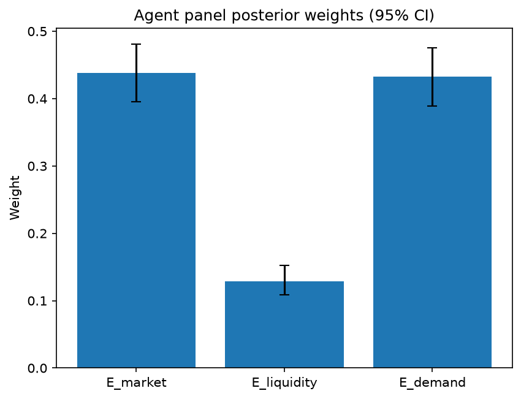

# Survey report: TrustRouter Claude CLI Panel (sonnet) -- Level L3e: Economic Value sub-parts

Survey ID: `trustrouter-claude-cli-full-panel-claude-sonnet-2026-09-01-L3e`

## Agent panel

- Agents contributing a valid response: 36
- Classical BWM consistency: 36/36 within threshold

| Criterion | Mean | 95% CI lower | 95% CI upper |
|---|---|---|---|
| E_market | 0.4384 | 0.3950 | 0.4805 |
| E_liquidity | 0.1291 | 0.1085 | 0.1527 |
| E_demand | 0.4325 | 0.3892 | 0.4750 |

## Methodology

Each agent independently completed a Best-Worst Method (BWM) comparison: choosing the single most and least important criterion, then rating every criterion's importance relative to those two on a 1-9 scale. Individual responses were solved with the classical BWM linear program (Rezaei, 2015) for a consistency check, and combined across the panel with a hierarchical Bayesian model (Mohammadi and Rezaei, 2020).

36 agent response(s) were accepted into this result.

Every agent's run began with a QA precheck (its stated configuration verified against ground truth) and every accepted answer's self-reported sources were checked against what reference material was actually available to it; see the Per-agent detail section below and this survey's Conversation Log for each agent's specific results. Every response is schema-validated and independently, repeatedly sampled (never a single completion treated as ground truth); see `guardrails.py`. This survey's complete output is covered by a SHA-256 integrity manifest (`integrity_manifest.json`, `SHA256SUMS`), generated once this run finished, so any later alteration to these files is detectable.

### Charts

## Per-agent detail

### bim-coordinator-base-claude (`bim-coordinator-base-claude`)

- Role: BIM Coordinator
- Model: claude_cli/sonnet
- DID: `did:key:z6MkwaD5PfneZEDso4t2zzYoPEj2qoTJMvwL6gsjm7sm4KYw`
- QA precheck: passed
- Sources used: shared knowledge: trustrouter_expert_questionnaire_v5_real_survey_instrument.md, general_knowledge

**Answer:** `{"best": "E_demand", "worst": "E_liquidity", "best_to_others": {"E_demand": 1, "E_market": 3, "E_liquidity": 6}, "others_to_worst": {"E_demand": 6, "E_market": 3, "E_liquidity": 1}}`

**Reasoning:**

Framing this around a long-lived, publicly-owned asset like the Hospital Real reference scenario, where records must serve institutional owners, insurers, and authorities across decades: I rank E_demand (future demand) as Best because the trajectory of value for construction-project records is increasingly driven by regulatory pull (EU digital building logbooks, energy performance/EPBD-style compliance obligations referenced in the survey's Q-A5 familiarity items on 'digital building logbooks' and 'EU privacy/GDPR + digital acts'), plus growing appetite for this data as training/reference input for AI-driven facility analytics and digital-twin platforms. That growth curve is what will actually determine whether storing these records on a trust-scored ledger pays off over the asset's multi-decade life, which is the survey's explicit reference horizon. E_market (current marketplace demand) sits in the middle: there is some real, near-term interest from insurers, compliance officers, and institutional owners in trustworthy records, but it is not a deep or liquid market today -- more a set of specific institutional buyers than an active marketplace. E_liquidity (tokenisation ease) I rank Worst: for compliance certificates, inspection records, RFI logs, and similar construction documentation, the practical path to being packaged into tradeable tokens is speculative and largely irrelevant to how these stakeholders actually derive value -- nobody in my experience federating models for hospitals or public-sector renovations is asking whether a HVAC certificate can be tokenised and traded; they are asking whether it will hold up for an insurer or auditor in year 15. Tokenisation ease is an enabling technical mechanic, not a driver of real economic value in this domain, so it trails clearly behind both current and future demand. The E_market vs E_liquidity gap is the one I am least certain about in magnitude -- both are secondary to E_demand, and reasonable colleagues could weight them closer together than I have here, so I flag that as a genuinely closer call than the Best/Worst choice itself.

### bim-coordinator-base-claude (`bim-coordinator-base-claude`)

- Role: BIM Coordinator
- Model: claude_cli/sonnet
- DID: `did:key:z6MkwaD5PfneZEDso4t2zzYoPEj2qoTJMvwL6gsjm7sm4KYw`
- QA precheck: passed
- Sources used: shared knowledge: trustrouter_expert_questionnaire_v5_real_survey_instrument.md, general_knowledge

**Answer:** `{"best": "E_demand", "worst": "E_liquidity", "best_to_others": {"E_demand": 1, "E_market": 3, "E_liquidity": 6}, "others_to_worst": {"E_demand": 6, "E_market": 4, "E_liquidity": 1}}`

**Reasoning:**

The reference scenario (shared knowledge: trustrouter_expert_questionnaire_v5_real_survey_instrument.md) frames these records as belonging to a multi-decade public asset serving institutional owners, insurers, and authorities for decades -- a lifecycle far longer than any current market cycle for construction data. From a BIM-coordination standpoint, the economic case for putting a record on-chain rests less on whether a buyer exists for it this year and more on whether the growing ecosystem of regulatory reporting (digital building logbooks, EU compliance regimes), AI/analytics training pipelines, and digital-twin integration will make that record valuable over its full life -- that is what E_demand captures, so I rank it Best. E_market (present marketplace demand) is a real but narrower and more transient signal; construction-data marketplaces are still nascent, so 'buyers right now' understates the record's actual long-run value even though it is the most concrete, verifiable of the three, which is why I place it clearly above Worst but below E_demand (rated 3 relative to Best). E_liquidity (tokenisation ease) is Worst in my judgement: most construction-project records -- HVAC certificates, structural drawings, material test certs, RFI logs -- are compliance and provenance artifacts whose value comes from verified access and audit trail, not from being fungible, tradeable financial instruments. Ease of wrapping a record in a tradeable token is a financial-engineering convenience with little bearing on why an owner, insurer, or authority would actually value that record, so I rate it far below Best (6), and Others-to-Worst is set consistently so that E_demand-vs-E_liquidity also computes to 6. This is a judgement call grounded in construction-industry practice (general_knowledge) rather than an explicit ranking given in the reference material, since the questionnaire excerpt defines the three sub-dimensions but does not itself state a priority order among them. I want to flag that the E_market-vs-E_demand call is the closer one of the two comparisons -- both are legitimately important economic signals about the current versus future value of the data, and a reasonable practitioner could weight them more evenly, whereas E_liquidity being weakest is a much more clear-cut call given how little tokenisation matters for compliance-driven construction records.

### bim-coordinator-base-claude (`bim-coordinator-base-claude`)

- Role: BIM Coordinator
- Model: claude_cli/sonnet
- DID: `did:key:z6MkwaD5PfneZEDso4t2zzYoPEj2qoTJMvwL6gsjm7sm4KYw`
- QA precheck: passed
- Sources used: shared knowledge: trustrouter_expert_questionnaire_v5_real_survey_instrument.md, general_knowledge

**Answer:** `{"best": "E_demand", "worst": "E_liquidity", "best_to_others": {"E_demand": 1, "E_market": 3, "E_liquidity": 7}, "others_to_worst": {"E_liquidity": 1, "E_market": 3, "E_demand": 7}}`

**Reasoning:**

For a public institutional asset like the Granada hospital renovation, the economic case for putting construction-project records on a blockchain rests primarily on where demand is heading, not where it stands today. E_demand (regulated digital building logbooks, EU digital-twin and ESG/compliance mandates, long-term facility-management analytics) is the driver that would justify the infrastructure investment over the building's multi-decade life, because institutional owners, insurers, and authorities are the parties who will progressively be required or incentivized to consume verifiable lifecycle data as these regulatory and digital-twin frameworks mature. E_market (current marketplace demand) is real but narrower today -- a handful of insurers/authorities already want structural and compliance documentation, so it's a meaningful but smaller-magnitude driver than the trajectory captured by E_demand. E_liquidity (ease of tokenising the record as a tradeable asset) is the least relevant of the three from a BIM-coordination standpoint: public institutional building records for a hospital are not designed to be traded as financial instruments, and tokenisation/tradability is a speculative, largely orthogonal concern to the actual data-trust and lifecycle-documentation function these records serve. I rated E_demand vs E_market at 3 (future regulatory/digital-twin growth is a clearly stronger value driver than the present snapshot of buyers, but current demand still has real weight, so not an extreme gap) and E_demand vs E_liquidity at 7 (tokenisation ease is nearly incidental for this asset class). Mirroring that, E_market vs E_liquidity is rated 3, keeping the two tables roughly consistent. This is a judgement call grounded in the Hospital Real reference scenario's institutional/public-asset framing from the shared knowledge glossary, combined with my own domain experience of how BIM/blockchain economic value is actually realized on renovation projects -- not a precise, independently-sourced ratio.

### bim-coordinator-rag-claude (`bim-coordinator-rag-claude`)

- Role: BIM Coordinator
- Model: claude_cli/sonnet
- DID: `did:key:z6MkqSfDfSA3Y6V2HcU6A72f4t469gxYRVPTADrJ7HzYtu7a`
- QA precheck: passed
- Sources used: bim_and_digital_building_logbooks.md, SOURCES.md, shared knowledge: trustrouter_expert_questionnaire_v5_real_survey_instrument.md, general_knowledge

**Answer:** `{"best": "E_demand", "worst": "E_liquidity", "best_to_others": {"E_demand": 1, "E_market": 3, "E_liquidity": 8}, "others_to_worst": {"E_demand": 8, "E_market": 4, "E_liquidity": 1}}`

**Reasoning:**

From a BIM coordinator's vantage point managing federated models and lifecycle documentation across ISO 19650-governed projects, the economic value of a construction record over its life is driven overwhelmingly by where regulatory and analytical demand is heading, not by whether anyone would buy or trade a token of it today. E_demand (future demand from regulation, AI, and digital-twin growth) is Best: the EU's digital building logbook trajectory and architectures like BUILDCHAIN DBL (shared knowledge: bim_and_digital_building_logbooks.md, Kochovski et al. 2026) show that identity/provenance-linked construction data is becoming a mandated, structurally-growing asset class as digital twins and AI-driven facility/compliance analytics scale up over a building's multi-decade lifecycle -- exactly the horizon described for the Hospital Real scenario (institutional owners, insurers, authorities needing decades of documentation; shared knowledge: trustrouter_expert_questionnaire_v5_real_survey_instrument.md). E_market (current marketplace demand) sits in the middle: there is real, present demand from owners, insurers, and authorities for validated records (ISO 19650's federation and independent-validation requirements presuppose exactly this kind of institutional 'buyer' community; bim_and_digital_building_logbooks.md, UK BIM Framework guidance), but this is a captive, contractually-bound demand, not an open marketplace, so it does not match the growth trajectory of E_demand. E_liquidity (tokenisation ease) is clearly Worst: construction-project records -- HVAC certificates, RFI logs, structural test data -- are heterogeneous, non-fungible, contractually and legally bound to a specific asset and jurisdiction (GDPR, conformity-assessment regimes), and Gartoumi's 2024 scientometric review of blockchain-in-construction literature (SOURCES.md; bim_and_digital_building_logbooks.md) itself notes the field still lacks calibrated criteria for when blockchain storage is even warranted, let alone tradeable tokenisation of the underlying records -- there is no real secondary market mechanism analogous to fungible tokens for this data type. The 3/8 and 4/1 ratios reflect that E_market and E_demand are both clearly more relevant than E_liquidity (large gap), while E_demand's edge over E_market is real but more moderate since both ultimately rest on the same institutional-buyer base, just at different time horizons. I want to flag this as a judgement call grounded in general BIM/construction-industry professional experience plus the cited sources, not a precise, independently-verified ranking -- the E_market vs E_demand distinction in particular is a closer call than the numbers might suggest, since present and future institutional demand overlap substantially in practice.

### bim-coordinator-rag-claude (`bim-coordinator-rag-claude`)

- Role: BIM Coordinator
- Model: claude_cli/sonnet
- DID: `did:key:z6MkqSfDfSA3Y6V2HcU6A72f4t469gxYRVPTADrJ7HzYtu7a`
- QA precheck: passed
- Sources used: bim_and_digital_building_logbooks.md, shared knowledge: trustrouter_expert_questionnaire_v5_real_survey_instrument.md, general_knowledge

**Answer:** `{"best": "E_demand", "worst": "E_liquidity", "best_to_others": {"E_demand": 1, "E_market": 3, "E_liquidity": 6}, "others_to_worst": {"E_demand": 6, "E_market": 3, "E_liquidity": 1}}`

**Reasoning:**

For a construction-project record being weighed for blockchain storage, the three E sub-parts don't carry equal weight in my experience running BIM federation on long-lifecycle assets like hospitals or deep renovations. E_demand (future/regulated/digital-twin growth) is Best: the concrete driver behind investing in verifiable, immutable construction records is the trajectory toward mandatory Digital Building Logbooks and structured lifecycle information management -- this is exactly the direction described in the Kochovski et al. 2026 BUILDCHAIN DBL work (bim_and_digital_building_logbooks.md), which pairs IFC semantics with W3C decentralized identifiers precisely because regulators, insurers, and facility managers will need this data long after handover, and ISO 19650 Part 2 (also in bim_and_digital_building_logbooks.md) already institutionalizes structured, federated information delivery as a growing professional norm, not a shrinking one. E_market (existing buyers today) is real but secondary: institutional stakeholders (owners, insurers, authorities, as in the Hospital Real reference scenario in the shared survey instrument) do want this data now, but that is closer to a captive, contractual demand than an open marketplace -- it exists, but it doesn't drive the case for blockchain-specific storage the way future regulatory pull does. E_liquidity (tokenisation ease/tradability) is Worst: BIM models, inspection certificates, and RFI logs are unique, non-fungible, provenance-bound documents tied to one physical asset -- they were never designed to be traded as liquid financial instruments, and in a decade of managing federated models I have not seen tokenised tradability figure into how owners or authorities actually value this documentation. Gartoumi's 2024 scientometric review (bim_and_digital_building_logbooks.md) also notes the field still lacks calibrated criteria for blockchain-backed storage decisions generally, which reinforces that a speculative dimension like tradable tokenisation should not be weighted heavily. The E_demand-vs-E_market gap (3x) is a real but moderate judgement call -- both reflect genuine stakeholder interest, just on different time horizons -- while the E_demand-vs-E_liquidity gap (6x) reflects that tokenisation ease is largely orthogonal to why construction records have economic value in the first place.

### bim-coordinator-rag-claude (`bim-coordinator-rag-claude`)

- Role: BIM Coordinator
- Model: claude_cli/sonnet
- DID: `did:key:z6MkqSfDfSA3Y6V2HcU6A72f4t469gxYRVPTADrJ7HzYtu7a`
- QA precheck: passed
- Sources used: bim_and_digital_building_logbooks.md, shared knowledge: trustrouter_expert_questionnaire_v5_real_survey_instrument.md, general_knowledge

**Answer:** `{"best": "E_demand", "worst": "E_liquidity", "best_to_others": {"E_demand": 1, "E_market": 3, "E_liquidity": 7}, "others_to_worst": {"E_demand": 7, "E_market": 5, "E_liquidity": 1}}`

**Reasoning:**

For a construction-project record like the reference hospital renovation, the strongest driver of long-run economic value is E_demand: the trajectory of regulatory mandates (EU digital building logbook requirements, ISO 19650 lifecycle information obligations) and technology pull (AI-driven analytics, digital-twin platforms needing verified provenance data) is what will make trusted, federated BIM/compliance data increasingly valuable over the asset's multi-decade life. This is directly supported by the bim_and_digital_building_logbooks.md material on BUILDCHAIN DBL, which frames decentralized building logbooks combining IFC semantics and verifiable identifiers as an emerging regulatory/technical necessity, not a current commodity market. E_market (current marketplace demand) is real but narrower in scope today -- there are institutional buyers (insurers, owners, authorities per the reference scenario) but no broad active trading market for construction records, so it sits in the middle. E_liquidity (tokenisation ease) is the weakest driver of real value from a practitioner standpoint: BIM/compliance records carry complex, often unresolved IP and liability ownership among architect, contractor, and owner (a theme echoed in the ISO 19650 guidance on federated-model governance), which makes fractional/tradeable tokenisation technically and legally awkward regardless of the data's underlying importance. Tokenisation ease is a mechanism for realizing value, not a source of it, so I rate it lowest. The E_market vs E_liquidity gap (5) is smaller than E_demand vs E_liquidity (7) since both market and future demand at least reflect genuine buyer interest, whereas ease-of-tokenisation is largely orthogonal to whether the data is valuable at all. I note this is a judgement call informed by professional experience with multi-stakeholder BIM ownership disputes rather than a hard empirical finding from the cited sources, and the E_market-vs-E_demand gap in particular is a real but not overwhelming distinction -- both are plausible candidates depending on project context.

### blockchain-engineer-base-claude (`blockchain-engineer-base-claude`)

- Role: Blockchain / DLT Engineer
- Model: claude_cli/sonnet
- DID: `did:key:z6MkiXdPHgRKLgsWGCi5P19sNTrHqFjySf3d9JD1BYLAirtk`
- QA precheck: passed
- Sources used: general_knowledge

**Answer:** `{"best": "E_market", "worst": "E_liquidity", "best_to_others": {"E_market": 1, "E_demand": 2, "E_liquidity": 6}, "others_to_worst": {"E_market": 6, "E_demand": 3, "E_liquidity": 1}}`

**Reasoning:**

None of the excerpted shared-knowledge material actually defines these three sub-criteria in detail (it covers the top-level DVS/F/E/A quartet and survey mechanics), so this judgement rests on my own domain experience running permissioned-ledger deployments for construction-sector data. E_market (current, demonstrable buyer demand) is the strongest and most verifiable signal of real economic value: if asset managers, insurers, lenders, or regulators are already paying for or requiring access to a given class of construction records today, that is concrete evidence the ledger investment pays off, independent of any future market development. E_demand (future demand tied to regulatory mandates like EU digital building logbooks, AI-driven analytics, and digital-twin ecosystems) is a real and strategically important driver -- construction data economic value is plausibly on a growth trajectory -- but it is inherently a forecast, carrying more uncertainty than demonstrated current demand, so I rate it moderately below E_market (a ratio of 2, reflecting this is a real but not enormous gap; a case could reasonably be made these two are close). E_liquidity (how readily the data could be wrapped into a tradeable token) is, from an engineering standpoint, the weakest driver of 'economic value' among the three: tokenisation ease is a mechanism/feasibility question, not a demand signal. Most construction-project records (inspection logs, as-built models, compliance certificates) have no active secondary trading market and unclear legal ownership/transferability, so even when tokenisation is technically straightforward, that ease does not by itself create buyers or revenue -- it only lowers friction if demand already exists. That is why I rank it worst, well below both demand-based criteria (ratio of 6 relative to E_market, 3 relative to E_demand). This is a judgement call rather than something drawn from the provided reference excerpts, since those did not address the internal E sub-criteria.

### blockchain-engineer-base-claude (`blockchain-engineer-base-claude`)

- Role: Blockchain / DLT Engineer
- Model: claude_cli/sonnet
- DID: `did:key:z6MkiXdPHgRKLgsWGCi5P19sNTrHqFjySf3d9JD1BYLAirtk`
- QA precheck: passed
- Sources used: shared knowledge: trustrouter_expert_questionnaire_v5_real_survey_instrument.md, general_knowledge

**Answer:** `{"best": "E_market", "worst": "E_liquidity", "best_to_others": {"E_market": 1, "E_demand": 3, "E_liquidity": 6}, "others_to_worst": {"E_liquidity": 1, "E_demand": 2, "E_market": 6}}`

**Reasoning:**

Economic Value (E) in the parent BSI formula is meant to capture whether putting a construction record on-ledger is actually worth the cost, not merely whether it is technically possible. Of the three sub-parts, current marketplace demand (E_market) is the most concrete and verifiable driver of that value: it reflects buyers who exist today (e.g. lenders, insurers, compliance auditors, secondary-market data purchasers) and can be assessed directly rather than projected. Future demand (E_demand, tied to regulatory tightening, AI-driven analytics, and digital-twin adoption) is a real and substantial value driver but is inherently speculative -- it depends on trends that may or may not materialize on the timescale relevant to a specific project record, so I rate it clearly below current demand but still meaningfully important (best-to-other ratio of 3). Tokenisation ease (E_liquidity) I rank worst because, from a DLT engineering standpoint, it is largely an implementation/mechanism question rather than a value-creation question: most well-structured construction records (BIM/IFC metadata, inspection logs, provenance chains) can be wrapped into a tradeable token with broadly similar technical effort using standard token/NFT frameworks -- ease of wrapping does not by itself generate buyer interest. A record that is trivial to tokenise but has no buyers is economically worthless, whereas a record with strong current or future demand retains value even if tokenisation requires more engineering effort. This is a judgement call grounded in production experience with permissioned-ledger tokenisation pipelines, not a certainty -- the market-vs-future-demand distinction in particular is a genuinely close call, since both ultimately trace to the same underlying buyer base at different time horizons. I kept the ratio table internally consistent (best/worst = 6, decomposed as 3 x 2 through E_demand) to avoid overstating precision I don't have.

### blockchain-engineer-base-claude (`blockchain-engineer-base-claude`)

- Role: Blockchain / DLT Engineer
- Model: claude_cli/sonnet
- DID: `did:key:z6MkiXdPHgRKLgsWGCi5P19sNTrHqFjySf3d9JD1BYLAirtk`
- QA precheck: passed
- Sources used: shared knowledge: trustrouter_expert_questionnaire_v5_real_survey_instrument.md, general_knowledge

**Answer:** `{"best": "E_market", "worst": "E_liquidity", "best_to_others": {"E_market": 1, "E_demand": 2, "E_liquidity": 5}, "others_to_worst": {"E_market": 5, "E_demand": 3, "E_liquidity": 1}}`

**Reasoning:**

As a blockchain/DLT engineer weighing which economic sub-factor should most influence a decision to commit construction-project data to a permissioned ledger, I favor E_market (current marketplace demand) as Best because it is the only one of the three that reflects a concrete, verifiable economic signal today -- actual buyers willing to pay for the data now. That is the strongest justification for incurring the real infrastructure, gas/storage, and governance costs of on-chain commitment, since those costs are incurred immediately while future demand is a forecast. E_demand (future regulated/AI/digital-twin growth) is genuinely relevant -- it is the kind of forward-looking signal that justifies building durable, extensible ledger infrastructure rather than a one-off solution -- but it is inherently speculative compared to demand that exists right now, so I rate it moderately behind Best (ratio 2), not dramatically so, since ignoring plausible near-term regulatory/AI-driven growth would be a real engineering mistake. E_liquidity (tokenisation ease) I rate Worst: it is a mechanism/enabler for capturing value that already exists (via fractional trading, marketplaces, etc.), not a driver of underlying economic value itself. In production permissioned-ledger deployments, most valuable data (e.g., compliance or provenance records) is monetized through licensing, access control, or off-chain contracts without needing tokenisation at all, so ease of tokenisation is a secondary, implementation-level concern relative to whether real demand exists now or is credibly coming. I set the Best-to-Worst ratio at 5, reflecting a substantial but not extreme gap -- tokenisation ease still matters for some data-marketplace use cases, so it isn't negligible, but it clearly ranks below both demand-side factors. The specific decomposition into E_market/E_liquidity/E_demand was not detailed in the excerpts I was given from the shared survey instrument (which covered the top-level DVS/F/E/A quartet and its multiplicative composite), so this reasoning is primarily my own domain judgement about how data-marketplace demand and tokenisation dynamics actually function for construction-project records, applied within the general framing that E is one multiplicative pillar of the larger composite.

### blockchain-engineer-rag-claude (`blockchain-engineer-rag-claude`)

- Role: Blockchain / DLT Engineer
- Model: claude_cli/sonnet
- DID: `did:key:z6MkopvxUWWWCS4idsrstN99GZf9TsfLRkdw69bu1hJ8anGq`
- QA precheck: passed
- Sources used: shared knowledge: trustrouter_expert_questionnaire_v5_real_survey_instrument.md, general_knowledge

**Answer:** `{"best": "E_market", "worst": "E_liquidity", "best_to_others": {"E_market": 1, "E_demand": 3, "E_liquidity": 6}, "others_to_worst": {"E_market": 6, "E_demand": 4, "E_liquidity": 1}}`

**Reasoning:**

Economic Value (E) feeds into TrustRouter's composite as a multiplicative uplift term (1+E), so within its three sub-parts I weighted them by how directly and reliably each signals realizable economic value for a construction-project record on a ledger. E_market (current marketplace demand) is the most concrete and verifiable driver: it reflects actual buyers willing to pay for the data today, which is the closest thing to a hard economic signal an engineer/appraiser can point to when justifying the cost of ledger storage. E_demand (future demand from regulated reporting, AI training pipelines, digital-twin ecosystems) is real and growing but is inherently a forward-looking, speculative estimate -- valuable as an option on future value but less certain than demonstrated present demand, so I placed it clearly behind E_market but still meaningfully important (rated 3x weaker than E_market on the best-to-others scale, i.e., roughly a third as decisive). E_liquidity (tokenisation ease) I rated weakest because, from a DLT-engineering standpoint, it is primarily a mechanism/feasibility question -- how cleanly the asset can be wrapped into a tradeable token given legal, standards (e.g., token-standard compatibility), and market-infrastructure constraints -- rather than a measure of the underlying data's economic value itself. A dataset can have strong present and future demand yet be hard to tokenise (fractional ownership disputes, unclear rights, thin secondary markets), and that friction doesn't reduce what the data is worth, only how easily that worth is captured on-chain; that overlaps more with the survey's separate Technical/Feasibility concerns than with 'value' per se, which is why I treated it as least influential within this specific E sub-decomposition. I want to flag that E_market vs E_demand was a real judgment call rather than a clear-cut gap -- an engineer more focused on long-horizon regulatory/AI-driven data markets could reasonably rate E_demand closer to E_market -- so I'm reporting that comparison as closer than the numeric gap alone might suggest.

### blockchain-engineer-rag-claude (`blockchain-engineer-rag-claude`)

- Role: Blockchain / DLT Engineer
- Model: claude_cli/sonnet
- DID: `did:key:z6MkopvxUWWWCS4idsrstN99GZf9TsfLRkdw69bu1hJ8anGq`
- QA precheck: passed
- Sources used: shared knowledge: trustrouter_expert_questionnaire_v5_real_survey_instrument.md, general_knowledge

**Answer:** `{"best": "E_market", "worst": "E_liquidity", "best_to_others": {"E_market": 1, "E_demand": 2, "E_liquidity": 6}, "others_to_worst": {"E_market": 6, "E_demand": 3, "E_liquidity": 1}}`

**Reasoning:**

These three sub-parts decompose Economic Value (E), which in the TrustRouter composite multiplies as (1+E) against DVS, F, and A -- so E functions as a business-case strength modifier, not a standalone gate. Judging them as a blockchain/DLT engineer who has to justify ledger spend to a project sponsor: E_market (current, demonstrated buyers) is the most defensible driver of real economic value because it is verifiable today -- you can point to an actual counterparty willing to pay for access to the data (e.g. an insurer, a regulator, a lender). That verifiability is why I rank it Best. E_demand (future/regulated/AI/digital-twin growth) is directionally important -- construction data's economic case is widely expected to strengthen as digital-twin and AI-training markets mature -- but it is inherently speculative: forecasts of regulatory or AI-driven demand can be wrong or slip in timing, so I rate it clearly below E_market but well above E_liquidity (best_to_others E_demand=2). E_liquidity (tokenisation ease) I rank Worst: ease of wrapping a data asset in a tradeable token is a technical/legal enabling mechanism, not a source of value in itself. A dataset can be trivially tokenisable (simple ERC-standard-style fungible or non-fungible representation, clean provenance) and still have zero buyers, in which case tokenisation ease adds nothing to the economic case; conversely a dataset with strong current or future demand still carries economic value even if tokenisation is legally/technically awkward and the asset must initially be sold or licensed off-chain. In other words, liquidity mechanics are conditional on demand existing first, so I treat it as the weakest independent driver of E. My best_to_others and others_to_worst values are set to be roughly consistent (2x3=6 matches the direct 6x best-to-worst gap for E_liquidity), reflecting that this was a fairly clear-cut ranking (verifiable-now demand > plausible-future demand > enabling-mechanism-only) rather than a close call. I did not find the provided reference material (blockchain_trust_and_attack_resistance.md, SOURCES.md) to bear on economic/tokenisation value specifically -- those sources address attack resistance, verification strength, and on-chain identity trust, not market or liquidity economics -- so this judgement rests on general blockchain-engineering/tokenomics reasoning plus the parent survey instrument's framing of E as a multiplicative business-case modifier in the BSI formula.

### blockchain-engineer-rag-claude (`blockchain-engineer-rag-claude`)

- Role: Blockchain / DLT Engineer
- Model: claude_cli/sonnet
- DID: `did:key:z6MkopvxUWWWCS4idsrstN99GZf9TsfLRkdw69bu1hJ8anGq`
- QA precheck: passed
- Sources used: shared knowledge: trustrouter_expert_questionnaire_v5_real_survey_instrument.md, general_knowledge

**Answer:** `{"best": "E_market", "worst": "E_liquidity", "best_to_others": {"E_market": 1, "E_demand": 2, "E_liquidity": 4}, "others_to_worst": {"E_market": 4, "E_demand": 2, "E_liquidity": 1}}`

**Reasoning:**

None of the provided reference material (blockchain_trust_and_attack_resistance.md, SOURCES.md) specifically addresses tokenisation mechanics or demand forecasting for construction data assets -- it is focused on attack resistance, identity, and trust-scoring (A/V/PT territory), so this ranking is primarily my own engineering judgement, with the shared survey instrument material used only to confirm that Economic Value (E) enters the BSI composite as a (1+E) multiplier alongside DVS, F, and A. Within that frame, I treat E_market (verifiable, present-tense buyer demand) as Best because it is the only one of the three sub-criteria that is directly observable and auditable today -- an engineer sizing whether committing a record to costly, low-throughput permanent ledger storage is worthwhile can point to actual current buyers as hard evidence, whereas the other two sub-criteria are inherently more speculative. E_demand (future, regulated/AI/digital-twin-driven growth) is rated a consistent 2x below E_market: it is directionally important, since on-chain commitments are long-lived and a rational routing decision should weight where demand is heading, not just where it stands, but it remains a forecast, not a fact, and forecasts around AI-training-data and digital-twin markets in particular are prone to hype-driven overstatement, which an engineer evaluating technical/economic tradeoffs should discount relative to demonstrated demand. E_liquidity (tokenisation ease) is Worst because, from a systems-engineering standpoint, ease-of-tokenisation is an enabling/mechanical property of the asset representation layer, not a demand signal in itself -- a dataset that is trivially easy to fractionalise and trade into tokens still has zero economic value if nobody wants it, while a dataset with strong current or future demand retains real value even if tokenising it requires more custom engineering work (e.g., bespoke smart-contract logic, off-chain custody arrangements). I rated E_market 4x E_liquidity and E_demand 2x E_liquidity (with E_market 2x E_demand), which is an internally consistent set (2x2=4) reflecting that liquidity mechanics are a genuinely secondary consideration once demand -- current or projected -- is established, though I acknowledge the E_market vs E_demand call is the closer of the two comparisons and a reasonable case could be made for weighting future regulated/AI demand growth more heavily given the long-lived nature of on-chain commitments.

### compliance-officer-base-claude (`compliance-officer-base-claude`)

- Role: Compliance and Regulatory Officer
- Model: claude_cli/sonnet
- DID: `did:key:z6MkwUN3K4YmG9arhbzyAxMLs314eLG46wmPnKoYLVUT8Rzm`
- QA precheck: passed
- Sources used: shared knowledge: trustrouter_expert_questionnaire_v5_real_survey_instrument.md, general_knowledge

**Answer:** `{"best": "E_demand", "worst": "E_liquidity", "best_to_others": {"E_demand": 1, "E_market": 2, "E_liquidity": 6}, "others_to_worst": {"E_demand": 6, "E_market": 3, "E_liquidity": 1}}`

**Reasoning:**

Viewing this through a facility-management compliance lens (GDPR plus construction-regulatory obligations across the building lifecycle), E_demand is Best because it captures the trajectory that actually drives my mandate: growing regulatory mandates for lifecycle records, digital-twin obligations, and AI/analytics-driven disclosure requirements (per the 'E_demand' definition in shared knowledge: trustrouter_expert_questionnaire_v5_real_survey_instrument.md, 'Projected future demand (lifecycle, regulation, analytics)'). A compliance officer is paid to anticipate where obligations are heading, not just where current buyers sit, so this criterion aligns most directly with the role's forward-looking regulatory-risk function. E_market (current marketplace demand / existing buyers) is real and gives the record present transactional relevance, but it is a narrower, more transient signal than the regulation-linked growth trajectory captured by E_demand, so it sits in the middle at a rating of 2 relative to Best. E_liquidity (ease of tokenisation/tradability) is Worst: it is the criterion most detached from compliance concerns, and in fact tokenising or making construction-project records freely tradable on an immutable ledger can sit in tension with GDPR's data-minimisation and erasure principles (Articles 5(1)(c) and 17) when personal or commercially sensitive data is embedded in the record — so from this professional's vantage point it is not merely 'least important' but a factor that can actively complicate compliance, warranting the lowest relative weight. I set best_to_others and others_to_worst to be internally multiplicatively consistent (2x3=6 matching the direct Best-Worst ratio of 6) rather than picking numbers ad hoc, but I flag that the E_market vs E_demand distinction is a genuine judgement call and not an overwhelming gap — a compliance officer in a jurisdiction with less regulatory momentum around digital twins/AI disclosure might reasonably rate current market demand closer to future demand.

### compliance-officer-base-claude (`compliance-officer-base-claude`)

- Role: Compliance and Regulatory Officer
- Model: claude_cli/sonnet
- DID: `did:key:z6MkwUN3K4YmG9arhbzyAxMLs314eLG46wmPnKoYLVUT8Rzm`
- QA precheck: passed
- Sources used: shared knowledge: trustrouter_expert_questionnaire_v5_real_survey_instrument.md, general_knowledge

**Answer:** `{"best": "E_demand", "worst": "E_liquidity", "best_to_others": {"E_demand": 1, "E_market": 3, "E_liquidity": 6}, "others_to_worst": {"E_demand": 6, "E_market": 4, "E_liquidity": 1}}`

**Reasoning:**

Viewing these three Economic Value sub-parts through a compliance/facility-management lens rather than a pure investor lens: E_demand (projected future demand driven by regulation, AI/analytics, and digital-twin mandates, per shared knowledge: trustrouter_expert_questionnaire_v5_real_survey_instrument.md) is the most durable and most relevant driver of value in my role. Regulatory-driven demand -- e.g. mandatory energy-performance disclosure, EU digital-building-log and digital-twin requirements, and growing use of verified construction data in AI-assisted compliance/audit workflows -- creates demand that is structural and largely independent of any single buyer's current willingness to pay, which is exactly the kind of trajectory a compliance officer has to plan retention and audit-readiness around over a building's full lifecycle. E_market (current marketplace demand / existing buyers) is real and measurable but reflects only today's snapshot, which can be thin or absent for a given record type even where the record is compliance-critical; I rate it clearly behind E_demand but well ahead of E_liquidity. E_liquidity (ease of tokenising the record into a tradeable asset) is the weakest of the three from this role's vantage point: even where tokenisation is technically easy, construction-project records frequently embed personal data (contractor/occupant details, site personnel records) or commercially sensitive material, and GDPR's purpose-limitation and data-minimisation principles, together with typical contractual confidentiality clauses, constrain how freely such tokens could actually be transferred or traded on a market. Technical tokenisability therefore does not translate reliably into realisable economic value once legal and privacy constraints are applied, so I placed it as Worst. This is a judgement call built on the shared-knowledge definitions of the three sub-criteria combined with general regulatory-compliance reasoning about GDPR's effect on data tradability; it was not a large-margin call for E_market vs E_demand, but the gap to E_liquidity is, in my judgement, substantial and consistent with the compliance perspective this role brings.

### compliance-officer-base-claude (`compliance-officer-base-claude`)

- Role: Compliance and Regulatory Officer
- Model: claude_cli/sonnet
- DID: `did:key:z6MkwUN3K4YmG9arhbzyAxMLs314eLG46wmPnKoYLVUT8Rzm`
- QA precheck: passed
- Sources used: shared knowledge: trustrouter_expert_questionnaire_v5_real_survey_instrument.md, general_knowledge

**Answer:** `{"best": "E_demand", "worst": "E_liquidity", "best_to_others": {"E_demand": 1, "E_market": 3, "E_liquidity": 6}, "others_to_worst": {"E_demand": 6, "E_market": 4, "E_liquidity": 1}}`

**Reasoning:**

Viewing this through a facility-management compliance lens (GDPR plus construction-regulatory obligations across the building lifecycle), the criterion that matters most is E_demand -- future demand driven by regulation, AI, and digital-twin growth (shared knowledge: trustrouter_expert_questionnaire_v5_real_survey_instrument.md, '3.7 Economic Value sub-dimensions' table: 'Projected future demand (lifecycle, regulation, analytics)'). Compliance obligations are inherently forward-looking and cumulative: EPBD-style digital logbooks, ESG/energy-performance disclosure regimes, and AI-driven audit/analytics requirements are expanding steadily, so a record's value to my function grows precisely because regulatory and digital-twin demand is rising, not because of who wants to buy it today. E_market (current marketplace demand -- 'existing buyers right now') is a real but narrower, more transactional signal; it matters for the record's present commercial relevance but says little about whether the record will keep satisfying statutory retention/disclosure duties, so I placed it second. E_liquidity (tokenisation ease / tradability) is the weakest fit for this role and I rank it worst: making a construction-project record easily tokenisable and tradable is a financial/DLT-engineering concern, largely orthogonal to -- and in some respects in tension with -- GDPR obligations (e.g., data minimisation and erasure rights sit awkwardly against immutable, freely tradable tokenised records). A compliance officer would not weight 'ease of tokenisation' as a driver of a record's regulatory value. The best-to-others ratios (1/3/6) and others-to-worst ratios (6/4/1) reflect a clear but not extreme gap between E_demand and E_market (both are legitimate value signals, so 3x rather than something more extreme), and a larger, more confident gap down to E_liquidity given its weak relevance to compliance duties. I acknowledge the E_demand vs E_market call is the more genuinely close one of the two comparisons; the E_liquidity-as-worst call is comparatively clear-cut from this professional vantage point.

### compliance-officer-rag-claude (`compliance-officer-rag-claude`)

- Role: Compliance and Regulatory Officer
- Model: claude_cli/sonnet
- DID: `did:key:z6Mkiny4nghtEZgRh1GDTK1uVN3K6yiWKovHursQ4YEVJq2c`
- QA precheck: passed
- Sources used: shared knowledge: trustrouter_expert_questionnaire_v5_real_survey_instrument.md, gdpr_and_data_governance.md, general_knowledge

**Answer:** `{"best": "E_market", "worst": "E_liquidity", "best_to_others": {"E_market": 1, "E_liquidity": 5, "E_demand": 3}, "others_to_worst": {"E_market": 5, "E_liquidity": 1, "E_demand": 3}}`

**Reasoning:**

From a compliance/facility-management standpoint, the three sub-parts differ sharply in how much concrete, verifiable evidence backs the economic-value claim. E_market (current marketplace demand) is the strongest signal: it reflects actual, present buyers for the data/record today, which is the closest thing to hard evidence a compliance officer can point to when justifying the cost and regulatory exposure of putting a construction record on an immutable ledger -- per the glossary in shared knowledge: trustrouter_expert_questionnaire_v5_real_survey_instrument.md, E_market is defined precisely as 'present marketplace demand.' I rank it Best because it requires no forward-looking assumption. E_demand (future demand from regulation, AI, digital-twin growth) is also credible -- regulatory-driven demand for structured building data (e.g., energy-performance disclosure, digital product passport style obligations) is a real and growing compliance trend I would expect this role to recognise -- but it is inherently speculative relative to demand that already exists, so it sits in the middle. E_liquidity (ease of tokenisation) I rank Worst: tokenisation ease is a technical/mechanistic enabler, not evidence of actual demand -- a record can be trivially tokenisable and still have no buyers. Moreover, from a compliance lens, making a construction data asset easily tradeable/tokenisable can itself introduce additional regulatory exposure (securities-style regulation of tokenised assets, KYC/AML obligations on transfer), which is a liability question more than a value driver -- this framing of on-chain/tokenised assets carrying its own compliance burden echoes the general point in gdpr_and_data_governance.md that establishing compliant on-chain structures (there, identity) is itself subject to regulatory tension rather than being a straightforward value-add. I did not find liquidity/tokenisation-specific regulatory sources in the provided material, so that securities-regulation observation is my own domain judgement (general_knowledge), not a citation. The comparison between E_demand and E_market is reasonably close -- both reflect genuine value signals, just at different time horizons -- so I did not rate E_market as overwhelmingly dominant (3x) the way I did against E_liquidity (5x), which I view as a more clear-cut gap since ease-of-mechanism is qualitatively different from evidence-of-demand.

### compliance-officer-rag-claude (`compliance-officer-rag-claude`)

- Role: Compliance and Regulatory Officer
- Model: claude_cli/sonnet
- DID: `did:key:z6Mkiny4nghtEZgRh1GDTK1uVN3K6yiWKovHursQ4YEVJq2c`
- QA precheck: passed
- Sources used: gdpr_and_data_governance.md, shared knowledge: trustrouter_expert_questionnaire_v5_real_survey_instrument.md, general_knowledge

**Answer:** `{"best": "E_market", "worst": "E_liquidity", "best_to_others": {"E_market": 1, "E_liquidity": 6, "E_demand": 3}, "others_to_worst": {"E_market": 6, "E_liquidity": 1, "E_demand": 2}}`

**Reasoning:**

From a compliance/facility-management standpoint, economic value has to be anchored in something verifiable, and current marketplace demand (E_market) is the only one of the three that is directly observable today -- actual buyers, actual willingness to pay for the dataset now. That makes it the strongest, least speculative driver of economic value and my Best. Future demand (E_demand), tied to regulatory growth, AI training-data markets, and digital-twin uptake, is a real and legitimate driver -- as gdpr_and_data_governance.md notes in its discussion of blockchain-in-construction adoption outpacing rigorous decision criteria, regulatory and lifecycle drivers for data retention are only strengthening -- but it remains a projection rather than a present fact, so it sits in the middle. Tokenisation ease (E_liquidity) I rate Worst: it is a mechanism for realising value (how easily a record could be packaged as a tradeable token), not a source of value itself, and in a construction-records context it is also the sub-dimension most exposed to unresolved legal friction -- the same GDPR right-to-erasure/immutability tension documented in gdpr_and_data_governance.md (Wilson et al. 2019) applies with extra force to tokenised instruments, which may additionally trigger securities-style regulatory scrutiny. A record can have strong current and future demand yet be poor at tokenisation (e.g., because it contains personal data that cannot be immutably tokenised under GDPR), so ease of tokenisation is the least reliable indicator of the record's actual economic worth. The E_market/E_liquidity/E_demand definitions themselves are drawn from the shared survey instrument's section 3.7 table. My best_to_others and others_to_worst values (1/6/3 and 6/1/2) are set to be internally consistent: market is roughly 3x as important as future demand and 6x as important as liquidity, and future demand is roughly 2x as important as liquidity, so 3x2=6 matches the best-worst ratio. I acknowledge the market-vs-demand call is a professional judgement rather than a fact drawn from the sources -- both are legitimate value drivers and a reviewer could reasonably weight future regulatory-driven demand higher given the compliance angle of this role.

### compliance-officer-rag-claude (`compliance-officer-rag-claude`)

- Role: Compliance and Regulatory Officer
- Model: claude_cli/sonnet
- DID: `did:key:z6Mkiny4nghtEZgRh1GDTK1uVN3K6yiWKovHursQ4YEVJq2c`
- QA precheck: passed
- Sources used: gdpr_and_data_governance.md, shared knowledge: trustrouter_expert_questionnaire_v5_real_survey_instrument.md, general_knowledge

**Answer:** `{"best": "E_demand", "worst": "E_liquidity", "best_to_others": {"E_market": 3, "E_liquidity": 8, "E_demand": 1}, "others_to_worst": {"E_market": 3, "E_liquidity": 1, "E_demand": 8}}`

**Reasoning:**

From a facility-management compliance perspective, the value of a construction-project record for blockchain storage is driven most durably by structural, regulation-linked demand rather than by today's buyer pool or by how easily the record could be turned into a tradeable token. E_demand (regulated/AI/digital-twin growth) is Best: as construction and building-operations regulation increasingly mandates lifecycle disclosure, digital-twin interoperability, and machine-verifiable audit trails (the trend the gdpr_and_data_governance.md summaries describe as the 'governance gap' construction-sector blockchain adoption has grown into without matching decision criteria, and as the legal/regulatory obligation class referenced in the shared knowledge questionnaire's Legal compliance (L) field, e.g. 'mandatory building-code or energy performance disclosure'), demand for trustworthy immutable records is structurally increasing and is the kind of demand a compliance officer is professionally mandated to anticipate. E_market (present marketplace demand) is a real but narrower snapshot of the same underlying value -- it matters, but it is a subset/leading-indicator of where E_demand is heading, so I rate it moderately below Best (3x). E_liquidity (ease of tokenisation/tradability) is Worst: whether a record can be efficiently tokenised into a tradeable financial instrument is a fintech/market-mechanics question with only an indirect bearing on legal, privacy, or regulatory-compliance value, and per the Wilson et al. 2019 finding cited in gdpr_and_data_governance.md, forcing blockchain-native tradability onto records that don't need it can create compliance liability (e.g. GDPR erasure conflicts) with no offsetting benefit -- so from this role's vantage point it is the least important of the three sub-dimensions, rated 8x below Best. I want to flag that the E_market vs E_demand distinction is a genuinely close call in practice, since current demand is often a direct proxy for near-term regulatory rollout; I am reporting my rating as a judgement call rather than a settled fact, since neither of the provided sources directly ranks these three sub-dimensions against one another -- that ranking is my own professional inference from the sources' broader regulatory-compliance framing, not a stated conclusion of either source.

### data-engineer-base-claude (`data-engineer-base-claude`)

- Role: Data Engineering Specialist
- Model: claude_cli/sonnet
- DID: `did:key:z6Mkgetd4SzJJVFgp33Mr15qYrPY1rWLsTBk9egDkh4y3VV5`
- QA precheck: passed
- Sources used: shared knowledge: trustrouter_expert_questionnaire_v5_real_survey_instrument.md, general_knowledge

**Answer:** `{"best": "E_demand", "worst": "E_liquidity", "best_to_others": {"E_market": 3, "E_liquidity": 6, "E_demand": 1}, "others_to_worst": {"E_market": 3, "E_liquidity": 1, "E_demand": 6}}`

**Reasoning:**

Per the shared knowledge glossary (3.7), E_market is present marketplace demand, E_liquidity is ease of tokenisation/tradability, and E_demand is projected future demand tied to lifecycle, regulation, and analytics growth. For construction-project records considered for blockchain storage, the underlying economic thesis of TrustRouter is about long-term data trust value, not short-term resale markets. Construction data (BIM models, inspection certs, provenance logs) accrues value over the asset's lifecycle -- for facility management, warranty claims, regulatory audits (e.g., digital building logbook mandates emerging in EU contexts), and AI/digital-twin training pipelines. That trajectory of growing regulated and analytics-driven demand (E_demand) is what should most drive a data-trust investment decision today, since it captures durable, structural growth rather than a snapshot of current market appetite. E_market (current buyers) is real but narrower and more volatile -- it reflects today's niche demand (e.g., from specific compliance auditors or dispute-resolution parties) without indicating whether that demand persists or grows. E_liquidity (tokenisation ease) is the weakest driver: construction-project records are highly heterogeneous, often bound to specific projects/jurisdictions, and lack the fungibility or standardized valuation needed for efficient tokenised trading -- tokenisation is a mechanism for realizing value, not a source of value itself, and is largely irrelevant if there is no underlying demand to tokenise against. Hence E_demand > E_market > E_liquidity. Ratings: I rate E_demand vs E_market at 3 (future/regulatory demand growth is a meaningfully stronger driver of a data asset's economic value than current buyer count, but current demand isn't negligible), and E_demand vs E_liquidity at 6 (tokenisation mechanics are a distant third-order concern for construction records specifically). Symmetrically, E_market vs E_liquidity at 3 reflects that current demand still clearly outweighs tradability ease. This is a judgement call grounded in the construction-data-lifecycle reasoning above rather than an explicit ranking given in the reference material, which only defines the three sub-dimensions without prescribing their relative weights.

### data-engineer-base-claude (`data-engineer-base-claude`)

- Role: Data Engineering Specialist
- Model: claude_cli/sonnet
- DID: `did:key:z6Mkgetd4SzJJVFgp33Mr15qYrPY1rWLsTBk9egDkh4y3VV5`
- QA precheck: passed
- Sources used: shared knowledge: trustrouter_expert_questionnaire_v5_real_survey_instrument.md, general_knowledge

**Answer:** `{"best": "E_market", "worst": "E_liquidity", "best_to_others": {"E_market": 1, "E_demand": 2, "E_liquidity": 4}, "others_to_worst": {"E_market": 4, "E_demand": 3, "E_liquidity": 1}}`

**Reasoning:**

From a data-engineering / provenance-routing standpoint, the question is which sub-dimension most concretely justifies the cost and irreversibility of committing a construction record to a blockchain-backed store. E_market (present marketplace demand -- existing buyers right now) is the most defensible signal because it is observable and verifiable today: it reflects actual consumers of the data (auditors, insurers, lenders, regulators) who would pay for trusted access now, which is what a polyglot-persistence router can actually measure and act on. E_demand (future demand tied to regulation, AI training-data markets, digital-twin ecosystems) is directionally important and plausible given known trends (BIM/digital-twin adoption, tightening EU compliance regimes referenced in the questionnaire's GDPR/ISO 25012 items) but is inherently speculative -- it is a forecast, not a current transaction signal, so I place it second rather than tying it with E_market. E_liquidity (ease of tokenising the record into a tradeable asset) I rate worst: it describes a technical/legal enabling property, not a demand signal in itself. Most construction-project artefacts in this domain -- HVAC inspection certificates, RFI logs, progress photos, lab test certificates -- have no realistic secondary market as tradeable tokens even if tokenisation were technically trivial; ease of tokenisation without an underlying buyer base does not create economic value on its own, it only lowers friction for value that must originate elsewhere (i.e., from E_market or E_demand). The gap between E_market and E_liquidity is the largest in my ratings (4x) because they sit at opposite ends of 'real demand' vs 'technical feasibility of a mechanism nobody may use'; E_demand sits closer to E_market (2x) because it is still a genuine demand construct, just a projected one, and closer to but distinct from E_liquidity (3x on the others-to-worst scale) since projected future demand at least describes who would want the data, unlike liquidity which describes only how easily it could be packaged. This is a judgement call under real uncertainty -- the three sub-dimensions are not wildly separated in importance, and a reasonable case could be made for weighting E_demand higher given the regulatory/digital-twin growth trajectory in this sector, so I flag that the E_market vs E_demand gap is the closer of the two comparisons.

### data-engineer-base-claude (`data-engineer-base-claude`)

- Role: Data Engineering Specialist
- Model: claude_cli/sonnet
- DID: `did:key:z6Mkgetd4SzJJVFgp33Mr15qYrPY1rWLsTBk9egDkh4y3VV5`
- QA precheck: passed
- Sources used: shared knowledge: trustrouter_expert_questionnaire_v5_real_survey_instrument.md, general_knowledge

**Answer:** `{"best": "E_market", "worst": "E_liquidity", "best_to_others": {"E_market": 1, "E_demand": 3, "E_liquidity": 6}, "others_to_worst": {"E_liquidity": 1, "E_demand": 4, "E_market": 6}}`

**Reasoning:**

From a data-engineering / polyglot-persistence routing standpoint, the practical question these three sub-criteria answer is: how much economic justification does storing this construction record on-chain actually have, and how solid is that justification? E_market (present marketplace demand) is the most concrete, verifiable signal -- it reflects actual buyers/consumers of the data today (e.g. compliance auditors, insurers, downstream contractors querying a record right now), which is the kind of hard evidence a routing decision can be built on without speculation. I rated it Best. E_demand (future/regulated/AI/digital-twin growth) is directionally important -- it captures whether today's low-value record could become high-value later (e.g. as digital-twin and AI-driven analytics pipelines mature, or as new regulation mandates lifecycle traceability) -- but it is inherently a forecast, not an observed fact, so it is less reliable than current demand and I placed it clearly behind E_market (rated 3) but still meaningfully ahead of E_liquidity. E_liquidity (ease of tokenisation into a tradeable asset) is the narrowest and most mechanism-specific of the three: it presupposes that the goal is to create a fungible/tradeable token from the record, which is a niche use case for most construction artifacts (drawings, RFIs, inspection certs) that have clear economic/provenance value without ever needing to be tokenised as a tradeable instrument. A record can score highly on economic value while being nearly impossible or pointless to tokenise, so I judged it least central to the Economic Value construct and rated it Worst, with E_market judged 6x more important (both in the best-row and worst-row for internal consistency) and E_demand 4x more important than E_liquidity. This is a judgement call grounded in how I'd actually prioritize signals when deciding whether a record's economic profile pushes it toward on-chain anchoring versus off-chain storage with a hash reference -- the shared knowledge document defines the three labels (present demand / tokenisation ease / projected future demand) but does not itself rank them, so the ordering and ratios reflect my own domain reasoning about which signal is most actionable and least speculative.

### data-engineer-rag-claude (`data-engineer-rag-claude`)

- Role: Data Engineering Specialist
- Model: claude_cli/sonnet
- DID: `did:key:z6Mkta5fLioPz9PQkLBgPZfd9wUysHgeeeJvCSKX8fKiEjHp`
- QA precheck: passed
- Sources used: data_quality_and_polyglot_persistence.md, shared knowledge: trustrouter_expert_questionnaire_v5_real_survey_instrument.md, general_knowledge

**Answer:** `{"best": "E_market", "worst": "E_liquidity", "best_to_others": {"E_market": 1, "E_demand": 2, "E_liquidity": 6}, "others_to_worst": {"E_market": 6, "E_demand": 5, "E_liquidity": 1}}`

**Reasoning:**

From a data-engineering standpoint, routing/storage-tier decisions (and the cost premium of committing a record to an immutable ledger) need to be justified against concrete, verifiable value signals rather than speculative ones. E_market (existing buyers right now) is the most defensible driver: it is observable evidence, analogous to how ISO 25012-style quality assessment (cf. data_quality_and_polyglot_persistence.md) insists on per-artefact, evidence-based scoring rather than assumed or projected properties. E_demand (future regulated/AI/digital-twin growth) is real and matters for long-lived, hard-to-mutate blockchain storage, but it is inherently a forecast, so I rank it second rather than first -- it is a fairly close call against E_market, and I want to flag that explicitly rather than overstate the gap. E_liquidity (tokenisation ease) I rank worst because it is a mechanism/feasibility factor, not an independent value driver: a construction record (e.g., a compliance certificate or as-built drawing set) can have strong current and future demand yet be difficult to fractionalize or trade as a token for regulatory or structural reasons, and that difficulty doesn't diminish the underlying economic value of the data itself -- it only constrains one possible monetization path. This mirrors the general polyglot-persistence principle in the reference material that different data types warrant different treatment based on their actual properties, not on how convenient a particular technical mechanism (here, tokenisation) is to apply to them. The shared questionnaire instrument confirms these are the three canonical E sub-dimensions being compared but does not itself rank them, so the ordering and ratio judgements here are my own domain-expertise-based judgement call, not something drawn directly from the reference material.

### data-engineer-rag-claude (`data-engineer-rag-claude`)

- Role: Data Engineering Specialist
- Model: claude_cli/sonnet
- DID: `did:key:z6Mkta5fLioPz9PQkLBgPZfd9wUysHgeeeJvCSKX8fKiEjHp`
- QA precheck: passed
- Sources used: shared knowledge: trustrouter_expert_questionnaire_v5_real_survey_instrument.md, general_knowledge

**Answer:** `{"best": "E_market", "worst": "E_liquidity", "best_to_others": {"E_market": 1, "E_liquidity": 6, "E_demand": 3}, "others_to_worst": {"E_market": 6, "E_liquidity": 1, "E_demand": 2}}`

**Reasoning:**

None of the reference material (data_quality_and_polyglot_persistence.md, SOURCES.md) speaks directly to economic/market valuation of construction data assets -- those sources cover data-quality clusters and polyglot-persistence routing, not tokenisation markets. The shared survey instrument confirms the exact definitions of these three sub-parts under Economic Value (E) but does not itself rank them, so this comparison is grounded in my own domain judgement as a data engineer who routes construction records across storage tiers. I picked E_market as Best because, from a routing-decision standpoint, current marketplace demand is the only one of the three that is directly observable and verifiable today -- it reflects real buyers willing to pay for access to or use of a given record now, which is the most defensible basis for justifying the added cost/complexity of premium (blockchain) storage. E_demand (future demand from regulation, AI training pipelines, digital-twin integration) is a legitimate but inherently speculative signal -- real and growing (e.g. EU digital building logbook mandates plausibly increase demand for structured, provenance-tracked records), but it requires forecasting assumptions a data engineer can't fully verify at ingestion time, so I place it clearly below E_market but well above E_liquidity. I picked E_liquidity (tokenisation ease) as Worst because it is a mechanistic/enabling property, not a demand driver in itself: a record can be trivially easy to wrap in a tradeable token and still have zero buyers, or be hard to tokenise yet highly sought after. Ease of tokenisation only matters once demand (current or future) already exists to be monetised, so on its own it contributes the least to a record's actual economic value. The best-to-worst ratio of 6 reflects that gap being fairly clear-cut rather than close; the middle placement of E_demand at 3/2 reflects a genuine, non-trivial but not extreme gap on both sides -- this middle case is the closest call of the three and I don't have strong grounds to push it further toward either pole.

### data-engineer-rag-claude (`data-engineer-rag-claude`)

- Role: Data Engineering Specialist
- Model: claude_cli/sonnet
- DID: `did:key:z6Mkta5fLioPz9PQkLBgPZfd9wUysHgeeeJvCSKX8fKiEjHp`
- QA precheck: passed
- Sources used: shared knowledge: trustrouter_expert_questionnaire_v5_real_survey_instrument.md, data_quality_and_polyglot_persistence.md, general_knowledge

**Answer:** `{"best": "E_market", "worst": "E_liquidity", "best_to_others": {"E_market": 1, "E_demand": 2, "E_liquidity": 6}, "others_to_worst": {"E_liquidity": 1, "E_demand": 3, "E_market": 6}}`

**Reasoning:**

From a data-engineering routing-decision standpoint, E_market (current, verifiable buyer demand) is the most concrete and actionable economic signal for deciding whether a construction-project artefact justifies costly on-chain storage -- it's an observable fact rather than a projection. E_demand (future regulated/AI/digital-twin growth) is a close second: it's a genuine and increasingly credible driver given the trajectory toward mandated digital building logbooks and provenance/lineage requirements referenced in the survey instrument's own topic list (shared knowledge: trustrouter_expert_questionnaire_v5_real_survey_instrument.md, Q-A5 familiarity items on digital building logbooks and lineage/provenance), but it remains speculative relative to demand that exists today, so I rate E_market only modestly ahead of it (2x) rather than dramatically -- this is a genuinely close call and I don't want to overstate the gap. E_liquidity (tokenisation ease) is the weakest driver for this asset class: most of the concrete example artefacts in the instrument itself (HVAC certificates, construction drawings, material test certificates, RFI logs, progress photos) are administrative/compliance records, not assets designed for fractional trading -- tokenisation mechanics are a downstream financial-engineering concern that only matters once real demand (current or future) is already established. It's analogous to the polyglot-persistence principle in data_quality_and_polyglot_persistence.md that different data types need different treatment rather than a one-size-fits-all assumption -- ease of tokenisation is a structural/mechanical property, not a demand signal, so I weight it far lower (6x gap from Best, 3x from E_demand). The best_to_worst ratings (6 both directions) were kept mutually consistent, and I derived E_demand's rating versus Worst (3) to be arithmetically consistent with the two other pairwise ratings (2 x 3 = 6) to keep the comparison set internally coherent.

### project-manager-base-claude (`project-manager-base-claude`)

- Role: Construction Project Manager
- Model: claude_cli/sonnet
- DID: `did:key:z6MkhjmGWgmEiL7z769jedvsKQSpLNLi9GPVvnuNdV9HyUgS`
- QA precheck: passed
- Sources used: shared knowledge: trustrouter_expert_questionnaire_v5_real_survey_instrument.md, general_knowledge

**Answer:** `{"best": "E_market", "worst": "E_liquidity", "best_to_others": {"E_market": 1, "E_liquidity": 5, "E_demand": 3}, "others_to_worst": {"E_market": 5, "E_liquidity": 1, "E_demand": 4}}`

**Reasoning:**

From a construction PM's vantage point, economic value has to rest on demonstrated or credible demand before a trading mechanism matters at all. E_market (current marketplace demand) is the most concrete and verifiable signal: are there institutional owners, insurers, or authorities actually paying for or requiring this record data today? That tangible, present-tense evidence is what a PM can point to when justifying the cost of blockchain storage to a client or sponsor, so I rate it Best. E_demand (future demand from regulated markets, AI training data, digital-twin ecosystems) is genuinely important given the long retention horizons described for institutional/insurer/authority use in the reference scenario, but it is inherently speculative -- a PM would treat it as a real but secondary driver, hence the middle rating (E_market judged 3x as important as E_demand). E_liquidity (tokenisation ease) I rate Worst: it is an enabling/mechanical property of how easily a data asset could be traded, not a source of value itself. A record that is trivially easy to tokenise but has no market or future buyers has no economic value regardless of its liquidity, so from a PM's practical risk/value framing this is the least decision-relevant of the three (E_market judged 5x as important as E_liquidity; E_demand judged 4x as important as E_liquidity). This is a judgement call grounded in general professional reasoning about what actually drives a client's willingness to pay for data infrastructure, since the provided instrument material (shared knowledge: trustrouter_expert_questionnaire_v5_real_survey_instrument.md) defines the sub-criteria labels but does not itself rank them, so no direct citation supports the specific ratios chosen.

### project-manager-base-claude (`project-manager-base-claude`)

- Role: Construction Project Manager
- Model: claude_cli/sonnet
- DID: `did:key:z6MkhjmGWgmEiL7z769jedvsKQSpLNLi9GPVvnuNdV9HyUgS`
- QA precheck: passed
- Sources used: shared knowledge: trustrouter_expert_questionnaire_v5_real_survey_instrument.md, general_knowledge

**Answer:** `{"best": "E_market", "worst": "E_liquidity", "best_to_others": {"E_market": 1, "E_demand": 2, "E_liquidity": 6}, "others_to_worst": {"E_market": 6, "E_demand": 3, "E_liquidity": 1}}`

**Reasoning:**

As a construction PM assessing economic value drivers for project records on a blockchain, I weight current, demonstrable marketplace demand (E_market) highest: it's the only one of the three that reflects verifiable buyers today -- insurers, authorities, and institutional owners who already pay for structural dossiers, compliance certificates, and inspection records in the reference scenario (chartered engineer reports, HVAC statutory certificates, etc.). That's a concrete, low-uncertainty signal of economic value. E_demand (future regulated/AI/digital-twin growth) is genuinely important -- the questionnaire's own emphasis on digital building logbooks, ISO 25012 data-quality norms, BIM/IFC and GDPR-adjacent digital acts signals a real regulatory trajectory that will likely expand demand for well-provenanced construction data -- but it remains a forecast, not a present fact, so I rate it clearly behind E_market (ratio 2) but well ahead of the worst criterion. E_liquidity (tokenisation ease) I rank worst: most construction records in this domain -- masonry load assessments, meeting minutes, RFI logs, lab certificates -- are unique, project-specific evidentiary artifacts, not commodities designed for secondary trading. Ease of technically wrapping a record in a tradeable token doesn't by itself create buyers or value; it's an enabling mechanism rather than a demand driver, and in this asset class (long-retention institutional/compliance records) liquidity is structurally low regardless of tokenisation mechanics. This is a genuine judgement call rather than a clean-cut case -- E_market vs E_demand in particular is a closer comparison than the ratios might suggest, since regulatory-driven future demand could plausibly overtake current demand for some record types (e.g., ESG/digital-twin data), and a reviewer with a more forward-looking emphasis could reasonably rate them closer to even.

### project-manager-base-claude (`project-manager-base-claude`)

- Role: Construction Project Manager
- Model: claude_cli/sonnet
- DID: `did:key:z6MkhjmGWgmEiL7z769jedvsKQSpLNLi9GPVvnuNdV9HyUgS`
- QA precheck: passed
- Sources used: shared knowledge: trustrouter_expert_questionnaire_v5_real_survey_instrument.md, general_knowledge

**Answer:** `{"best": "E_market", "worst": "E_liquidity", "best_to_others": {"E_market": 1, "E_demand": 3, "E_liquidity": 7}, "others_to_worst": {"E_market": 7, "E_demand": 5, "E_liquidity": 1}}`

**Reasoning:**

As a construction PM, I judge economic value primarily by who is actually paying for or relying on this data today. E_market (current marketplace demand) is the most concrete and verifiable driver: institutional owners, insurers, and authorities (per the Hospital Real reference scenario) already need structural, energy, and compliance records for underwriting, regulatory sign-off, and asset management -- that demand exists independent of any blockchain mechanism. E_demand (future demand tied to regulated reporting, AI training sets, digital-twin integration) is a real and growing driver of value, but it is inherently forward-looking and less certain than demand that exists right now, so it ranks second, moderately behind E_market (rated 3). E_liquidity (ease of tokenising the record into a tradeable asset) is the weakest driver of practical economic value for the vast majority of construction documentation -- structural reports, HVAC certificates, RFI logs, and progress photos are not naturally suited to being fractionalised or traded as financial instruments, and most institutional stakeholders in this space (insurers, code authorities, facility managers) have no interest in a secondary trading market for this data. Tokenisation ease is a technical/financial-engineering property that is largely orthogonal to whether the underlying record has genuine economic value to the parties who actually use construction data, so it is Worst, rated far behind both E_market (7) and E_demand (5). The gap between E_market and E_demand is a closer call than the gap to E_liquidity -- both reflect genuine buyer interest, just on different time horizons -- so I want to be explicit that this second-tier ranking is less clear-cut than the choice of Best and Worst.

### project-manager-rag-claude (`project-manager-rag-claude`)

- Role: Construction Project Manager
- Model: claude_cli/sonnet
- DID: `did:key:z6MkmtkSj5oqsPgApLjX13QD1dY7KspgarWGkVzQin7EhVSk`
- QA precheck: passed
- Sources used: shared knowledge: trustrouter_expert_questionnaire_v5_real_survey_instrument.md, general_knowledge

**Answer:** `{"best": "E_market", "worst": "E_liquidity", "best_to_others": {"E_market": 1, "E_liquidity": 5, "E_demand": 2}, "others_to_worst": {"E_liquidity": 1, "E_market": 5, "E_demand": 3}}`

**Reasoning:**

As a PM weighing the economic-value sub-factors for a construction record being considered for blockchain storage, I treat E_market (current marketplace demand) as the most defensible measure of real economic value: it reflects actual buyers today -- insurers, authorities, and institutional owners who need the record now for claims, compliance, or asset management, consistent with the shared survey's reference scenario of a multi-decade public hospital renovation where data 'must serve institutional owners, insurers, and authorities for decades.' Realized, current demand is concrete and verifiable rather than speculative, so I rank it Best. E_demand (future demand tied to regulatory, AI, and digital-twin growth) is a genuine and directionally important driver -- construction data's value plausibly rises as digital-twin and automated-compliance ecosystems mature -- but it is inherently forward-looking and uncertain, so it sits in the middle: clearly more central to 'economic value' than a pure trading mechanism, but less certain than demand that already exists. E_liquidity (tokenisation ease) I rank Worst because it describes a technical/market-mechanism property -- how readily the record could be structured as a tradeable token -- rather than a source of value itself. A record can be highly valuable to real buyers (high E_market, high E_demand) while being awkward to tokenise (fragmented ownership, unclear IP, regulatory ambiguity around structural/compliance records), or conversely easy to tokenise while having little real buyer interest. Ease of tokenisation is an enabling/implementation factor, not intrinsic economic value, which is why it ranks lowest among the three. I flag that the E_market vs E_demand comparison is the closer call of the two judgments: both are genuine demand-side indicators and a reasonable case could be made for weighting future/regulated demand more heavily given construction records' long retention horizons; I resolved it in favor of E_market because realized demand is less speculative and more directly measurable today.

### project-manager-rag-claude (`project-manager-rag-claude`)

- Role: Construction Project Manager
- Model: claude_cli/sonnet
- DID: `did:key:z6MkmtkSj5oqsPgApLjX13QD1dY7KspgarWGkVzQin7EhVSk`
- QA precheck: passed
- Sources used: shared knowledge: trustrouter_expert_questionnaire_v5_real_survey_instrument.md, general_knowledge

**Answer:** `{"best": "E_market", "worst": "E_liquidity", "best_to_others": {"E_market": 1, "E_demand": 2, "E_liquidity": 5}, "others_to_worst": {"E_market": 5, "E_demand": 4, "E_liquidity": 1}}`

**Reasoning:**

From a construction PM's standpoint, economic value of a project record for blockchain storage is most credibly evidenced by E_market: an existing, identifiable buyer today (an insurer, authority, future owner, or dispute-resolution party) is concrete proof of value, not a projection. E_demand (regulated/AI/digital-twin growth) is also genuinely important -- the reference scenario in the shared instrument (Hospital Real, a multi-decade public asset serving institutional owners, insurers, and authorities for decades) is exactly the kind of long-horizon record where regulatory digitisation and digital-twin uptake could substantially raise future value, so I did not want to discount it heavily relative to current demand; the gap between E_market and E_demand is real but modest (rated 2), and I'll flag this as a genuinely close call rather than a clear-cut one. E_liquidity (tokenisation ease) I judge weakest: whether a record *can* be packaged into a tradeable token is an enabling/mechanical property, not itself a driver of demand -- a construction document (e.g. a structural report or inspection certificate) that is easy to tokenise but has no buyer or growth trajectory behind it has little practical economic value in a PM's experience, whereas a hard-to-tokenise record with strong current or future demand still matters. This is a judgement call grounded in professional reasoning about how construction stakeholders (owners, insurers, authorities) actually transact around project data, rather than a finding drawn from the provided literature, since the construction_project_management_and_mcdm.md and SOURCES.md materials I was given address Legal Compliance/Criticality and BWM's general elicitation-burden rationale, not the Economic Value sub-parts directly.

### project-manager-rag-claude (`project-manager-rag-claude`)

- Role: Construction Project Manager
- Model: claude_cli/sonnet
- DID: `did:key:z6MkmtkSj5oqsPgApLjX13QD1dY7KspgarWGkVzQin7EhVSk`
- QA precheck: passed
- Sources used: construction_project_management_and_mcdm.md, general_knowledge

**Answer:** `{"best": "E_market", "worst": "E_liquidity", "best_to_others": {"E_market": 1, "E_liquidity": 6, "E_demand": 2}, "others_to_worst": {"E_market": 6, "E_liquidity": 1, "E_demand": 3}}`

**Reasoning:**

For a construction-project record being weighed for blockchain storage, the economic-value question ultimately reduces to: does anyone actually want this data, now or later, and can that want be monetised? Current marketplace demand (E_market) is the most concrete and least speculative of the three -- it reflects real, identifiable buyers today (insurers pricing risk, secondary-market appraisers, facility-management platforms, other contractors on comparable projects) and is the component a PM can point to with the least hand-waving when justifying the cost of immutable storage and tokenisation infrastructure. Future demand (E_demand) -- growth tied to regulated reporting regimes, AI training-data markets, and digital-twin ecosystems -- is directionally important and plausibly large, but it is forward-looking and depends on regulatory and technology trajectories a PM cannot fully control or verify today, so I placed it clearly behind current demand but well ahead of the worst criterion. Tokenisation ease (E_liquidity) I rated worst: it is a mechanism/enabler question (how frictionless is it to package this record as a tradeable token) rather than a driver of whether the data has economic value in the first place. A highly liquid tokenisation scheme built on a record nobody wants generates no value; conversely, a record with strong current or future demand retains real value even if tokenising it is technically awkward. That asymmetry -- ease of trading is instrumental, not intrinsic, to economic value -- is why I ranked it below both demand-side criteria. The ratio matrix (E_market=1/E_demand=2/E_liquidity=6 best-to-others; E_liquidity=1/E_demand=3/E_market=6 others-to-worst) is internally consistent (each pairwise product through E_demand reproduces the best-worst ratio of 6), reflecting a judgement that current demand is a clear but not overwhelming step above future demand, while both demand-side criteria are substantially more important than mere tokenisation mechanics. This decomposition of Economic Value and its BWM rating structure follow the task's own comparison set; I did not find source material in the provided knowledge_repo that specifically addresses tokenisation liquidity or digital-twin/AI demand growth for construction records, so that substantive judgement is my own domain reasoning as a project manager, while the BWM elicitation logic itself (fewer, self-consistency-checkable pairwise judgments vs. a full AHP matrix) draws on the methodological framing in the construction/MCDM reference material.

### structural-engineer-base-claude (`structural-engineer-base-claude`)

- Role: Structural Engineer
- Model: claude_cli/sonnet
- DID: `did:key:z6MkfkFDyriiXYLHQSvAKDEqD37TPNFypjdiGj7kufNnZkS6`
- QA precheck: passed
- Sources used: shared knowledge: trustrouter_expert_questionnaire_v5_real_survey_instrument.md, general_knowledge

**Answer:** `{"best": "E_demand", "worst": "E_liquidity", "best_to_others": {"E_demand": 1, "E_market": 3, "E_liquidity": 7}, "others_to_worst": {"E_demand": 7, "E_market": 5, "E_liquidity": 1}}`

**Reasoning:**

From a chartered structural engineer's perspective, the economic value of a structural-capacity dossier held on-chain is judged primarily by whether it will keep being needed by the institutional parties who actually rely on it (insurers, regulators, owners) over a multi-decade retention horizon, not by whether it can be traded today. E_demand (projected future demand driven by tightening regulation, AI-based structural analytics, and digital-twin integration) is the dimension most aligned with that long-horizon reliance model described in the survey's reference scenario -- structural dossiers gain value precisely because future regulatory and analytical use cases will need verifiable historical capacity data, so I rate it Best. E_market (current marketplace demand) is real -- insurers and authorities do want this data now -- but it is a narrower, present-tense subset of the same underlying value, so it sits in the middle (rated 3 relative to E_demand). E_liquidity (ease of tokenising the record into a tradeable asset) is the Worst: a masonry load assessment or structural report is not a fungible, comparable commodity, and its worth to insurers/regulators/owners does not depend on how easily it could be packaged into a tradeable token -- this is a financial-engineering property largely orthogonal to the engineering and institutional value the document actually holds, which is why I set it 7x below E_demand and rate E_market well above it (5x) on the Others-vs-Worst scale. This is a judgement call based on professional reasoning about how structural records are actually used by their institutional consumers, informed by the sub-dimension definitions given in the shared questionnaire material, rather than a fact drawn from a specific data source.

### structural-engineer-base-claude (`structural-engineer-base-claude`)

- Role: Structural Engineer
- Model: claude_cli/sonnet
- DID: `did:key:z6MkfkFDyriiXYLHQSvAKDEqD37TPNFypjdiGj7kufNnZkS6`
- QA precheck: passed
- Sources used: shared knowledge: trustrouter_expert_questionnaire_v5_real_survey_instrument.md, general_knowledge

**Answer:** `{"best": "E_demand", "worst": "E_liquidity", "best_to_others": {"E_market": 3, "E_liquidity": 5, "E_demand": 1}, "others_to_worst": {"E_market": 2, "E_liquidity": 1, "E_demand": 5}}`

**Reasoning:**

The comparison set decomposes Economic Value into current demand (E_market), tokenisation/tradability ease (E_liquidity), and projected future demand from regulation/AI/digital-twin growth (E_demand), per shared knowledge: trustrouter_expert_questionnaire_v5_real_survey_instrument.md section 3.7. For a structural-capacity dossier that must serve institutional owners, insurers, and authorities over decades (the Hospital Real reference scenario), the economic value of the record is overwhelmingly driven by whether long-horizon regulated demand for that data will grow -- e.g., insurers' actuarial models, statutory retrofit/compliance regimes, and digital-twin/AI analytics increasingly consuming structural provenance data. That forward-looking growth trajectory (E_demand) is what actually justifies the cost of immutable blockchain storage today, since the asset's data value is realized over a multi-decade retention horizon, not in an immediate transaction. E_market (current buyers) matters but is a narrower, present-tense snapshot -- there is no active marketplace for masonry load-assessment PDFs today, so weighting the criterion set by 'current buyers' undervalues the actual economic case being made in this scenario. E_liquidity (ease of tokenising the record into a tradeable unit) is the weakest driver for this content type: a sealed engineering PDF is not naturally a fungible or divisible tradeable asset, and tokenisation mechanics are an implementation convenience rather than a source of value in themselves -- if there's no real demand (present or future), ease of tokenisation is moot. Hence E_demand is Best, E_liquidity is Worst, with E_market as an intermediate factor. The ratings reflect a moderate-to-strong gap: E_demand is judged noticeably more decisive than E_market (about 3x) and substantially more decisive than E_liquidity (about 5x), while E_market still clearly outweighs E_liquidity (about 2x) since at least current demand reflects real economic use, whereas ease of tokenisation is a secondary mechanism. This is a judgement call grounded in professional reasoning about how long-lived institutional/regulatory records accrue value, not a figure taken directly from the reference material, which defines the sub-dimensions but does not itself rank them.

### structural-engineer-base-claude (`structural-engineer-base-claude`)

- Role: Structural Engineer
- Model: claude_cli/sonnet
- DID: `did:key:z6MkfkFDyriiXYLHQSvAKDEqD37TPNFypjdiGj7kufNnZkS6`
- QA precheck: passed
- Sources used: shared knowledge: trustrouter_expert_questionnaire_v5_real_survey_instrument.md, general_knowledge

**Answer:** `{"best": "E_market", "worst": "E_liquidity", "best_to_others": {"E_market": 1, "E_liquidity": 5, "E_demand": 2}, "others_to_worst": {"E_market": 5, "E_liquidity": 1, "E_demand": 3}}`

**Reasoning:**

For a construction-project record such as a structural capacity dossier, economic value ultimately has to trace back to someone who will actually pay for or rely on the data. E_market (present marketplace demand) is the strongest and most verifiable of the three sub-parts: insurers, regulators, and institutional owners already need this documentation now, as reflected in the survey's own reference scenario of a hospital dossier serving institutional owners, insurers, and authorities for decades. That existing, demonstrable demand makes it the Best criterion — it is the least speculative and the easiest to defend in a capacity dossier that will be relied on for decades. E_liquidity (ease of tokenisation/tradability) I rank Worst: it describes a technical enabling mechanism, not a demand driver. A structural report on a specific building's masonry assessment is not a naturally fungible or tradeable asset the way a financial instrument is; making it easy to tokenise does not by itself create buyers or value, it only affects how any existing value could be transacted. That makes it the weakest link to genuine economic value for this document type. E_demand (projected future demand from regulation, AI, digital-twin use) sits between the two: growth in regulatory reporting regimes and analytics/digital-twin uptake is a real and plausible driver of future value, but it is inherently more speculative and less certain than demand that already exists today, so I rate it closer to E_market than to E_liquidity but still clearly below E_market. The ratios reflect that E_market clearly dominates E_liquidity (5x), E_market only moderately exceeds E_demand (2x, since both are genuine demand-side factors differing mainly in certainty/time horizon), and E_demand still clearly exceeds E_liquidity (3x) because a growth driver outweighs a mere transaction-enabling mechanism. This is a judgement call informed by the sub-dimension definitions given, not a value I can point to a numeric source for.

### structural-engineer-rag-claude (`structural-engineer-rag-claude`)

- Role: Structural Engineer
- Model: claude_cli/sonnet
- DID: `did:key:z6Mkt5DLWCfPfjvwPLqmLL4k9FkGGhaDdQNhDizMTWNqSoDA`
- QA precheck: passed
- Sources used: structural_health_monitoring_and_digital_twins.md, shared knowledge: trustrouter_expert_questionnaire_v5_real_survey_instrument.md, general_knowledge

**Answer:** `{"best": "E_market", "worst": "E_liquidity", "best_to_others": {"E_market": 1, "E_liquidity": 5, "E_demand": 2}, "others_to_worst": {"E_market": 5, "E_liquidity": 1, "E_demand": 3}}`

**Reasoning:**

For a structural capacity dossier, economic value is grounded first in who actually relies on and pays for the data today: insurers, regulators, and institutional owners who need the record to underwrite, certify, or maintain the asset over decades. That present, verifiable reliance (E_market) is the most concrete and least speculative driver of economic value, so I rate it Best. Future demand (E_demand) is also meaningful -- the structural-health-monitoring and digital-twin literature (structural_health_monitoring_and_digital_twins.md) documents a real trajectory toward blockchain-anchored sensor provenance and multi-party validation for structural digital twins, which plausibly increases institutional and regulatory reliance on this class of record over time -- but it is a projection with real uncertainty about timing and adoption, so I place it clearly behind current demand (best-to-other ratio 2) yet well ahead of liquidity (others-to-worst ratio 3). Tokenisation ease (E_liquidity) is Worst: it concerns the mechanics of turning a record into a tradeable token, not whether economic value exists in the first place. A structural dossier's value comes from institutional trust and regulatory/insurance reliance, not from functioning as a liquid, tradeable asset on a secondary market -- most such records (masonry load assessments, inspection certificates) have no natural buyer pool for token trading even when their informational value to insurers or authorities is high. That decoupling of 'has real economic value' from 'is easy to tokenise' is why I rank it lowest, though I acknowledge the comparison between E_market and E_demand is closer than the gap to E_liquidity, since both current and future demand ultimately stem from the same institutional-reliance logic.

### structural-engineer-rag-claude (`structural-engineer-rag-claude`)

- Role: Structural Engineer
- Model: claude_cli/sonnet
- DID: `did:key:z6Mkt5DLWCfPfjvwPLqmLL4k9FkGGhaDdQNhDizMTWNqSoDA`
- QA precheck: passed
- Sources used: structural_health_monitoring_and_digital_twins.md, general_knowledge

**Answer:** `{"best": "E_demand", "worst": "E_liquidity", "best_to_others": {"E_demand": 1, "E_market": 2, "E_liquidity": 7}, "others_to_worst": {"E_demand": 7, "E_market": 4, "E_liquidity": 1}}`

**Reasoning:**

For a structural capacity dossier (e.g. a masonry load assessment sealed by a chartered engineer, held for decades for insurers/authorities), I judged E_demand the most important sub-part of Economic Value. Structural records of this kind derive their long-run economic value less from who wants to buy them today than from the trajectory of institutional need: tightening structural-safety regulation, growth of digital-twin practice, and AI-driven analytics that increasingly consume historical structural data as training/verification inputs. The reference material on trustworthy digital twins (structural_health_monitoring_and_digital_twins.md) supports this: it frames blockchain-anchored structural sensor/report data as valuable precisely because digital twins depend on trusted provenance over the asset's operating life, a demand driver that grows rather than a static current market. E_market (current buyers) is real -- insurers, owners, and authorities do have present institutional demand for a sealed structural report -- but it is narrower and more static than the future growth trajectory, so I placed it second. E_liquidity (ease of tokenising the record into a tradeable asset) is the worst/least important: a masonry load assessment for one specific building is a non-fungible, single-purpose compliance artifact with essentially no secondary market; tokenisation for tradability is a technical possibility with little practical bearing on why this record has value to the parties who actually rely on it (insurers, regulators, owners) over decades. I rated E_demand a full 7x more important than E_liquidity, and moderately (2x) more important than E_market, since the market-vs-demand distinction is a matter of degree (both reflect genuine institutional value) whereas liquidity/tokenisation is a largely orthogonal, low-relevance dimension for this asset class. This is a professional judgement call rather than a finding drawn directly from a source, since none of the provided material scores E_market/E_liquidity/E_demand against each other explicitly; the digital-twin material grounds the E_demand argument specifically, the rest reflects my own domain reasoning about how structural dossiers are actually used and valued in practice.

### structural-engineer-rag-claude (`structural-engineer-rag-claude`)

- Role: Structural Engineer
- Model: claude_cli/sonnet
- DID: `did:key:z6Mkt5DLWCfPfjvwPLqmLL4k9FkGGhaDdQNhDizMTWNqSoDA`
- QA precheck: passed
- Sources used: shared knowledge: trustrouter_expert_questionnaire_v5_real_survey_instrument.md, structural_health_monitoring_and_digital_twins.md, general_knowledge

**Answer:** `{"best": "E_demand", "worst": "E_market", "best_to_others": {"E_demand": 1, "E_liquidity": 2, "E_market": 5}, "others_to_worst": {"E_demand": 5, "E_liquidity": 3, "E_market": 1}}`

**Reasoning:**

For a structural capacity dossier (e.g. a masonry load assessment sealed by a chartered engineer), there is today essentially no active marketplace where third parties buy or sell tokenized access to that specific document — its 'customers' are the institutional owner, insurer, and authority who already receive it through normal channels, not open-market buyers. So E_market (current demand) is the weakest driver of economic value right now, and I rate it Worst. By contrast, the strongest driver of long-run economic value is E_demand: growth in regulated compliance regimes, AI-driven structural analytics, and digital-twin ecosystems that will increasingly need cryptographically anchored, provenance-verifiable structural records as an input — this matches the digital-twin/blockchain literature in structural_health_monitoring_and_digital_twins.md, which frames blockchain-anchored sensor/structural data as foundational to trustworthy digital twins, a use case whose growth is prospective rather than already monetized today. E_liquidity (technical ease of tokenising the document — hashing, unique token issuance, etc.) sits in between: it is a real enabling factor for any future economic value (you cannot capture E_demand's growth without some tokenisation mechanism), but ease of the mechanism does not by itself create demand, so it is less important than the demand trajectory itself and more important than the currently thin spot market. Ratios: I set E_demand as 5x more important than E_market (large gap between a live, low/no-market present state and a growth thesis with real regulatory and AI tailwinds), E_demand as 2x more important than E_liquidity (both matter, but the demand driver dominates the enabling mechanism), and E_liquidity as 3x more important than E_market (technical tokenisability is a meaningfully bigger contributor to future value than today's near-absent marketplace). This is a judgement call under real uncertainty — the reference material does not quantify market sizes for tokenized structural records, so the ratios reflect my professional assessment of where economic value in this specific asset class is actually headed, not a measured market figure.
